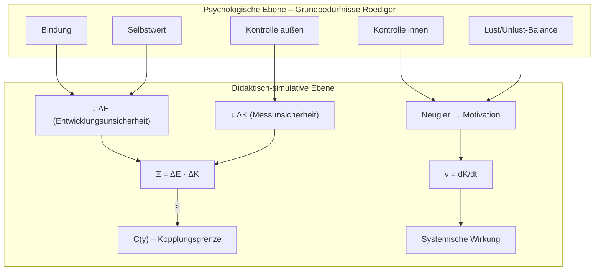
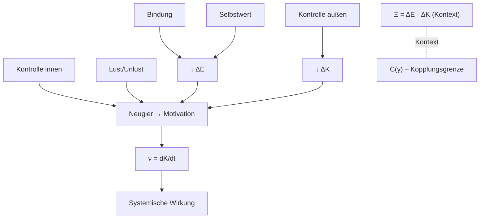

# 1 Definition

Der Bildungswirkfaktor ($\nu$) ist eine spezifische Variante des allgemeinen [[Wirkfaktor|Wirkfaktors]], die zur Messung der Stärke und Richtung der [[Kompetenzentwicklung]] in Bildungsprozessen dient. Er bewertet die Effizienz und Effektivität des Lernens, indem er die Geschwindigkeit und den Umfang der Kompetenzentwicklung unter Berücksichtigung interner und externer Einflüsse quantifiziert. Der Bildungswirkfaktor basiert auf der Steigung der Kompetenzentwicklungskurve und stellt dar, in welchem Ausmaß die Kompetenzentwicklung im zeitlichen Verlauf erfolgt.

Im Kontext der [[Wirkung]] repräsentiert der Bildungswirkfaktor die Intensität und Qualität von Veränderungen im System, die durch Bildungsprozesse initiiert werden. Die Wirkung beschreibt die systemische Veränderung, die durch den Bildungswirkfaktor verursacht wird und sich im Gesamtergebnis des Systems manifestiert. Der Bildungswirkfaktor bietet somit eine Grundlage für die quantitative Beschreibung der Wirkung in einem Bildungsumfeld. Ein stabiler Bildungswirkfaktor weist auf eine kontrollierte Entwicklung hin, während starke Schwankungen auf instabile und schwer vorhersehbare Lernprozesse hindeuten.

# 2 Herleitung

## 2.1 Mathematische Herleitung

Der Bildungswirkfaktor $\nu$ ist mathematisch als zeitliche Ableitung der Kompetenzentwicklung $K(t)$ definiert:

$$
\nu = \frac{dK}{dt} \tag{1}
$$

Diese Formel beschreibt die Änderungsrate des Kompetenzniveaus $K$ über die Zeit $t$. Die Steigung der Kompetenzentwicklungskurve verdeutlicht die Dynamik des Lernprozesses im betrachteten Zeitraum. Ein positiver Wert signalisiert eine zunehmende Kompetenz (positive Wirkung), während ein negativer Wert Kompetenzverluste (negative Wirkung) anzeigt.

## 2.2 Standardisierte Änderungsrate

Alternativ kann die Stärke der Bildungseffekte auch durch die Veränderung pro Zeiteinheit $\Delta t$ ausgedrückt werden:

$$
\nu = \frac{\Delta K}{\Delta t} \tag{2}
$$

Hierbei steht $\Delta K$ für die Änderung des Kompetenzniveaus und $\Delta t$ für das betrachtete Zeitintervall. Diese Formel wird verwendet, um kurzfristige Änderungen im Kompetenzniveau zu berechnen und kurzfristige Fluktuationen im Lernprozess darzustellen.

## 2.3 Mathematische Interpretation und Kurvendiskussion

Der Bildungswirkfaktor wird durch die Steigung der Kompetenzentwicklungskurve dargestellt:

$$
\nu = \frac{dK}{dt} \tag{3}
$$

Die Struktur der $\nu$-Kurve ist entscheidend für die Interpretation der Lernprozesse. Wendepunkte zeigen Übergänge zwischen stabilen und instabilen Phasen an, während Minima und Maxima auf extrem instabile Zustände oder Regenerationsphasen hinweisen. Eine stabile $\nu$-Kurve ohne starke Fluktuationen zeigt, dass die Kompetenzentwicklung in einem kontrollierten und vorhersehbaren Bereich verläuft. Je mehr Extremwerte oder Wendepunkte in der $\nu$-Kurve vorhanden sind, desto stärker sind die Unsicherheiten und desto instabiler sind die Lernprozesse ausgeprägt.

## 2.4 Systemische Verknüpfung

Der Bildungswirkfaktor steht in direktem Zusammenhang mit der [[Allgemein beruflich/Research/Bildungswissenschaft/Wirkung|systemischen Wirkung]] sowie mit zwei Formen von Unsicherheit: der Unsicherheit in der Kompetenzmessung ($\Delta K$) und der Unsicherheit in der [[Allgemein beruflich/Research/Bildungswissenschaft/Kompetenzentwicklung|Kompetenzentwicklung]] ($\Delta E$). Diese Größen werden in der Simulation über eine Unschärferelation nach dem Schema

$$
\Delta E \cdot \Delta K \ge C(\gamma)
$$

gebunden, wobei $C(\gamma)$ eine **Kopplungs-/ Balancegrenze** des Systems markiert.

Wichtig ist die **Trennung der Begriffe**:

- Der **Bildungswirkfaktor** ist die **Dynamik der Kompetenzentwicklung** und bleibt definiert als
  $$
  \nu = \frac{dK}{dt} \quad (\text{bzw. diskret } \nu \approx \tfrac{\Delta K}{\Delta t}).
  $$
- Die **Kopplungsstärke** zwischen Entwicklungs- und Messunsicherheit fassen wir als separates Maß ([[Kopplungshypothese]]).
  $$
  \Xi := \Delta E \cdot \Delta K.
  $$
  $\Xi$ ist **nicht** identisch mit $\nu$ und **nicht** mit $C(\gamma)$; es kann $C(\gamma)$ über- oder unterschreiten, während $C(\gamma)$ die **untere Schranke** der Kopplung darstellt.

Hohe Werte deuten auf stark gekoppelte Unsicherheiten hin (potenziell instabilere Prozesse), niedrige Werte auf entkoppelte oder gut gedämpfte Unsicherheiten. Robuste Lernprozesse liegen vor, wenn  moderat und stabil verläuft und  sich nahe an  bewegt, ohne dass eine Gleichsetzung erforderlich ist.

Diese Lesart ist zugleich eine Konkretisierung der [[Kopplungshypothese]], die annimmt, dass Bildungswirkungen nicht monokausal erklärbar sind, sondern aus der dynamischen Verschränkung multipler Faktoren hervorgehen. Empirische Befunde (z.B. Hatties Meta-Analysen) lassen sich in diesem Rahmen als Belege für Kopplung deuten. Dort zeigen sich hohe Effektstärken insbesondere dann, wenn Faktoren wie Feedback, Klarheit und Lehrer-Schüler-Beziehung nicht isoliert, sondern in ihrer Wechselwirkung betrachtet werden. Die Simulation operationalisiert diesen Zusammenhang mathematisch über $\Xi = \Delta E \cdot \Delta K$ und zeigt, dass robuste Kompetenzentwicklung an eine balancierte Kopplung gebunden ist.

## 2.5 Bezug zum allgemeinen Wirkfaktor

Im Gegensatz zum allgemeinen [[Wirkfaktor]], der in verschiedenen Kontexten zur Beschreibung von Einflüssen auf ein System verwendet wird, ist der Bildungswirkfaktor eine spezialisierte Form, die auf den Bildungsprozess angewandt wird. Während der Wirkfaktor allgemein als treibender Mechanismus fungiert, beschreibt der Bildungswirkfaktor konkret die Änderungen in Lern- und Kompetenzentwicklungsprozessen. Er ist daher ein Subtyp des Wirkfaktors, der die spezifischen Merkmale und Einflussgrößen im Bildungssystem berücksichtigt.

## 2.6 Ableitungen, Herleitungen und prüfbare Konsequenzen

### 2.6.1 Mathematische Klarstellung

- **Dynamik (Bildungswirkfaktor):** $\nu = \frac{dK}{dt}$ bzw. zeitdiskret $\nu \approx \frac{\Delta K}{\Delta t}$.  
- **Unschärfegrenze:** $\Delta E \cdot \Delta K \ge C(\gamma)$ (mit $C(\gamma)$ als Kopplungs-/Balanceparameter).  
- **Kein Gleichheitszwang:** $C(\gamma)$ ist **nicht** identisch mit $\Delta E \cdot \Delta K$; es markiert die **untere Schranke / Systemgrenze**, gegen die sich Prozesse annähern können.  
- **Kopplungsmaß:** $\Xi = \Delta E\cdot\Delta K$ (separat von $\nu$ und $C(\gamma)$).

### 2.6.2 Didaktische Folgerungen

1. **Neugier → Motivation** als Transformationskette: Steuert primär $\nu$; bricht diese Kette, steigt die Varianz in $\Delta E/\Delta K$.  
2. **Prüfungsdesign:** Mehr summative Tests ohne formative Einbettung → ↑$\Delta K$ (Messunsicherheit), ggf. ↑$\Delta E$ (Entwicklungsfriktion) → geringere Robustheit.  
3. **Bindung und Feedbackkultur:** Wirken als **Dämpfung** auf $\Delta E$ und stabilisieren $ \nu $.  
4. **Ziel:** **Robuste Kopplung** = moderate, stabile $\nu$ und $\Delta E \cdot \Delta K$ nahe $C(\gamma)$.

### 2.6.3 Minimaler Rechenweg (Pseudocode / Python-Skizze)

```python
import numpy as np

def bildungswirkfaktor(K, t):
    # zentrale Differenzen (vereinfacht)
    dKdt = np.gradient(K, t)
    return dKdt  # ν(t)

def kopplungscheck(deltaE, deltaK, C_gamma):
    return (deltaE * deltaK) >= C_gamma  # Bool pro Zeitschritt

def extrema(v):
    # Wendepunkte/Extrema der ν-Kurve (einfacher Ansatz)
    dv = np.gradient(v)
    zc = np.where(np.diff(np.sign(dv)) != 0)[0]  # Nullstellenwechsel
    return zc  # Indizes potentieller Wendepunkte
```

**Anwendung:**

- $\nu(t)$ glätten (z. B. Savitzky–Golay) → Extrempunkte detektieren → **Instabilitätsfenster** markieren.  
- Gleichzeitig $\Delta E$, $\Delta K$ überwachen → **Kopplungsverletzungen** (wenn $\Delta E \cdot \Delta K \ll C(\gamma)$ oder weit darüber) frühzeitig erkennen.

### 2.6.4 Strukturelle Kopplung als Folge der Kopplungshypothese

Die im Projekt verwendete Unschärferelation verbindet **Entwicklungsunsicherheit** ($\Delta E$) und **Messunsicherheit** ($\Delta K$) über eine **Kopplungsgrenze** $C(\gamma)$. Der Bildungswirkfaktor $\nu = \frac{dK}{dt}$ vermittelt die Dynamik der Kompetenzentwicklung. Im Sinne einer **strukturellen Kopplung** fungiert $C(\gamma)$ als Balancewert zwischen (a) psychologischen Grundbedürfnissen (nach Roediger) und (b) pädagogisch-didaktischer Architektur (dein Simulationsmodell). Die Kopplung ist dann gut, wenn $\Delta E \cdot \Delta K$ nahe an $C(\gamma)$ liegt (nicht notwendig gleich), und $\nu$ dabei stabil (ohne starke Extreme) verläuft.

Die über die Modellprüfungen aggregierten Korrelationen fungieren als empirische Indikatoren der Kopplung. Hohe Zusammenhänge zwischen $\nu$, $\Delta E$ und $\Delta K$ stützen die [[Kopplungshypothese]], da sie zeigen, dass sich die strukturelle Kopplung nicht nur theoretisch postulieren, sondern auch empirisch im Datenraum beobachten lässt. Damit erweitert sich der Bildungswirkfaktor um eine empirische Dimension. Korrelationen zwischen $\nu$, $\Delta E$ und $\Delta K$ dienen als Beobachtungsgrößen, die die [[Kopplungshypothese]] stützen und eine Brücke zwischen Simulation und empirischen Befunden (z.B. Hattie) schlagen.

**A) Mathematische Kopplung**



**B) Prozessdidaktische Kette**



**Interpretation:**

- **Bindung** und **Selbstwert** stabilisieren Lernverläufe ⇒ senken $\Delta E$.  
- **Externe Kontrolle** (klare Kriterien, transparente Prüfungen) reduziert $\Delta K$.  
- **Interne Kontrolle** (Selbststeuerung) transformiert **Neugier → Motivation**, was $\nu$ stabilisiert.  
- **Lust/Unlust-Balance** erhöht die Attraktivität der Aufgaben und wirkt direkt auf die Steigung $\nu$.  
- $C(\gamma)$ ist kein Produkt, sondern eine **Systemgrenze / Balancemarke**: Entfernen sich $\Delta E \cdot \Delta K$ stark von $C(\gamma)$, ist die Kopplung gestört (instabile Prozesse). Nähe zu $C(\gamma)$ bei moderatem $\nu$ kennzeichnet **robuste Lernprozesse**.

# 3 Folgerungen

- **Stabilität der Lernprozesse**:  
   Ein niedriger und stabiler Bildungswirkfaktor $\nu$ zeigt an, dass die Kompetenzentwicklung in einem stabilen Bereich verläuft und die Lernprozesse nicht durch externe Störungen oder hohe Messunsicherheiten beeinflusst werden.
- **Instabile Phasen**:  
   Ein hoher oder stark schwankender Bildungswirkfaktor deutet auf instabile Lernphasen hin, die durch externe Faktoren wie persönliche Ereignisse oder methodische Schwächen ausgelöst werden können.
- **Verbindung zur Wirkung**:  
   Der Bildungswirkfaktor beeinflusst direkt die beobachtbare [[Wirkung]] innerhalb des Bildungssystems. Positive Werte verstärken die gewünschte Wirkung, während negative Werte hemmend wirken. Die Unsicherheitskopplung und deren Ausmaß bestimmen, wie stark der Bildungswirkfaktor die resultierende Wirkung im System verändert.
- **Systemische Relevanz**:  
   Da der Bildungswirkfaktor als spezialisierter [[Wirkfaktor]] fungiert, interagiert er mit anderen Einflussgrößen im System, wie z. B. Lernbereitschaft oder Lernumgebung. Dadurch wird die tatsächliche Wirkung immer im Kontext mehrerer Faktoren generiert.

# 7 Zusammenfassung

Der Bildungswirkfaktor $(\nu)$ beschreibt die Stärke der Bildungsprozesse in Bezug auf die [[Allgemein beruflich/Research/Bildungswissenschaft/Kompetenzentwicklung]]. Er wird durch die zeitliche Ableitung des Kompetenzniveaus berechnet und gibt die Änderungsrate der Kompetenzentwicklung wieder. Ein stabiler $\nu$-Wert zeigt eine kontrollierte Entwicklung, während instabile oder stark schwankende Werte auf Unsicherheiten und instabile Lernprozesse hinweisen. Der Bildungswirkfaktor ist eine spezialisierte Form des allgemeinen [[Wirkfaktor]], da er gezielt die dynamischen Prozesse innerhalb eines Bildungskontextes abbildet und die resultierende [[Allgemein beruflich/Research/Bildungswissenschaft/Wirkung]] im System beschreibt.

# Quelle(n)

- Angulo, R. E., & Palacios, D. H. (2024). *Negative Wahrscheinlichkeiten und ihre Anwendung in biologischen und sozialen Systemen*. Springer.
- Arnold, R. (2014). *Systemische Pädagogik: Grundlagen und Anwendungen*. Schneider Verlag Hohengehren.
- Luhmann, N. (1997). *Die Gesellschaft der Gesellschaft*. Suhrkamp.
- Roediger, E. (2015). *Schematherapie: Ein praxisorientiertes Handbuch*. Beltz.
- Wittchen, H.-U., & Hoyer, J. (2011). *Handbuch der Verhaltenstherapie*. Springer.
