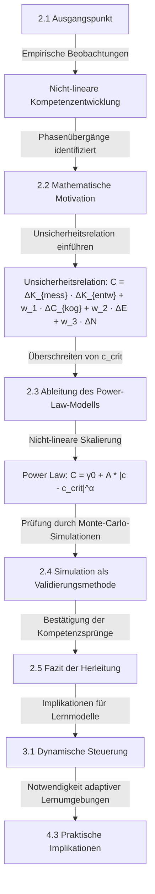

# 1 Definition  

Das Kompetenz-Phasenübergangsmodell beschreibt die Entwicklung von Kompetenz als nicht-linearen, sprunghaften Prozess, der durch Phasenübergänge geprägt ist.  

Statt eines kontinuierlichen Lernfortschritts zeigt das Modell, dass Kompetenzentwicklung durch eine kritische Dynamik von Unsicherheiten (Neugier, Emotionen, kognitive Unsicherheit) gesteuert wird.  

Das Modell wird verwendet, um zu erklären:  
- Warum Kompetenz nicht stetig wächst, sondern durch plötzliche Sprünge entsteht.  
- Wie Unsicherheitsrelationen $\Delta K_{mess}$, $\Delta K_{entw}$, $\Delta N$ Kompetenzsprünge auslösen.  
- Warum Neugier als Schlüsselvariable für Phasenübergänge fungiert.  

# 2 Herleitung  

Die klassische Bildungswissenschaft betrachtet Kompetenzentwicklung als kontinuierlichen Prozess, der durch regelmäßige Wissensakkumulation gekennzeichnet ist. Empirische Beobachtungen und Simulationsdaten zeigen jedoch, dass Lernfortschritt nicht linear verläuft, sondern durch sprunghafte Übergänge geprägt ist. Um dieses Phänomen zu verstehen, ist eine mathematische Modellierung erforderlich, die nicht nur individuelle Lernfaktoren, sondern auch die Dynamik von Unsicherheiten berücksichtigt.  

_Abbildung 1: Prozess der Herleitung_

Im Folgenden wird die Herleitung des Kompetenz-Phasenübergangsmodells dargelegt, das Kompetenzentwicklung als einen nicht-linearen Prozess beschreibt. Zunächst wird der Ausgangspunkt der Modellbildung erläutert, gefolgt von der mathematischen Motivation und der Ableitung der zentralen Strukturen.  

## 2.1 Ausgangspunkt  

Die Kompetenzentwicklung wird in der klassischen Bildungswissenschaft häufig als kontinuierlicher und akkumulativer Prozess beschrieben. In vielen Modellen wird davon ausgegangen, dass Kompetenz mit zunehmender Lernzeit und wachsender Erfahrung stetig steigt. Solche Modelle lassen sich durch einfache Wachstumsfunktionen der Form  

$$  
K(t) = K_0 + r \cdot t  
\tag{2.1}  
$$  

darstellen, wobei $K(t)$ die Kompetenz zum Zeitpunkt $t$, $K_0$ der Ausgangswert der Kompetenz und $r$ die konstante Lernrate ist.  

Jedoch widersprechen eigene empirische Beobachtungen dieser Annahme. Lernverläufe zeigen häufig Phasen der Stagnation, gefolgt von abrupten Kompetenzsprüngen. Solche Muster lassen sich in klassischen Modellen nicht ohne zusätzliche Annahmen erklären.  

Ein alternativer Ansatz besteht darin, Kompetenzentwicklung nicht als gleichmäßigen Prozess zu betrachten, sondern als eine dynamische Wechselwirkung von Unsicherheiten, die durch bestimmte Schwellenwerte charakterisiert ist. In diesem Zusammenhang wird die Hypothese aufgestellt, dass Kompetenzsprünge nicht kontinuierlich, sondern als **Phasenübergänge** auftreten, wenn kritische Unsicherheitswerte überschritten werden.  

Die zentralen Fragen, die sich daraus ergeben, sind:  

1. **Warum tritt Kompetenzentwicklung nicht kontinuierlich, sondern in Sprüngen auf?**  
2. **Welche Mechanismen steuern diese nicht-linearen Veränderungen?**  
3. **Welche mathematische Struktur beschreibt Kompetenzsprünge am besten?**  

Die Antwort auf diese Fragen erfordert eine neue Betrachtungsweise der Kompetenzentwicklung, die über klassische Akkumulationsmodelle hinausgeht und die Rolle von Unsicherheiten als Steuerungsmechanismen berücksichtigt.  

## 2.2 Mathematische Motivation  

Die Beobachtung, dass Kompetenzentwicklung nicht stetig, sondern durch sprunghafte Übergänge geprägt ist, legt nahe, dass der zugrunde liegende Prozess nicht linear beschrieben werden kann. Ein grundlegender Ansatz zur mathematischen Modellierung dieses Phänomens besteht darin, die Kompetenzentwicklung als ein **dynamisches System** zu betrachten, das durch verschiedene Unsicherheitsfaktoren beeinflusst wird.  

### 2.2.1 Klassische Modellannahmen und ihre Grenzen  

Traditionelle Modelle der Kompetenzentwicklung gehen davon aus, dass Kompetenzzuwachs proportional zur investierten Zeit und den Lernaktivitäten ist. Diese Annahme kann durch eine einfache differentielle Wachstumsfunktion beschrieben werden:  

$$  
\frac{dK}{dt} = r  
\tag{2.2}  
$$  

mit der Lösung  

$$  
K(t) = K_0 + r \cdot t  
\tag{2.3}  
$$  

Hierbei ist $K(t)$ die Kompetenz zum Zeitpunkt $t$, $K_0$ der Ausgangswert der Kompetenz und $r$ eine konstante Lernrate.  

Eigene simulierte Daten zeigen jedoch, dass Lernverläufe nicht gleichmäßig verlaufen, sondern durch abrupte Sprünge unterbrochen sind. Dies weist darauf hin, dass der Lernprozess nicht ausschließlich durch eine stetige Akkumulation von Wissen beschrieben werden kann, sondern durch nicht-lineare Mechanismen gesteuert wird.  

### 2.2.2 Einführung der Unsicherheitsrelation  

Um die beobachteten Kompetenzsprünge zu erklären, wird die Hypothese aufgestellt, dass Kompetenzentwicklung durch eine Wechselwirkung verschiedener Unsicherheiten moduliert wird. Dabei lassen sich fünf wesentliche Unsicherheitsdimensionen definieren:  

- Kompetenzmessunsicherheit $\Delta K_{mess}$  
- Kompetenzentwicklungsunsicherheit $\Delta K_{entw}$  
- Emotionale Unsicherheit $\Delta E$  
- Kognitive Unsicherheit $\Delta C_{kog}$  
- Neugierunsicherheit $\Delta N$  

Basierend auf Simulationsdaten zeigt sich, dass sich Kompetenzsprünge systematisch dann ereignen, wenn eine bestimmte Kombination dieser Unsicherheiten eine kritische Schwelle überschreitet. Um diesen Effekt mathematisch zu fassen, wird eine **Unsicherheitsrelation** eingeführt:  

$$  
C = \Delta K_{mess} \cdot \Delta K_{entw}  
\tag{2.4}  
$$  

Hierbei beschreibt $C$ den dynamischen Unsicherheitswert als Produkt der Kompetenzmessunsicherheit und der Kompetenzentwicklungsunsicherheit.  

Da sich die Unsicherheiten nicht unabhängig entwickeln, sondern in Relation zueinander stehen, wird die Unsicherheitsrelation um zusätzliche Einflussgrößen erweitert:  

$$  
C = \Delta K_{mess} \cdot \Delta K_{entw} + w_1 \cdot \Delta C_{kog} + w_2 \cdot \Delta E + w_3 \cdot \Delta N  
\tag{2.5}  
$$  

Die Parameter $ w_1, w_2, w_3 $ sind Gewichtungsfaktoren, die die relative Bedeutung der kognitiven, emotionalen und neugierbedingten Unsicherheiten für den Gesamtprozess bestimmen.  

### 2.2.3 Einführung der kritischen Schwelle  

Beobachtungen aus der Simulation legen nahe, dass ein Kompetenzsprung dann eintritt, wenn der Unsicherheitswert $ C $ eine kritische Schwelle $ c_{\text{crit}} $ überschreitet. Dies führt zur Definition eines effektiven Unsicherheitswerts:  

$$  
C_{\text{eff}} = C - c_{\text{crit}}  
\tag{2.6}  
$$  

Falls $C_{\text{eff}} > 0$, tritt ein Phasenübergang auf, der zu einem sprunghaften Kompetenzzuwachs führt.  

### 2.2.4 Dynamische Struktur der Kompetenzentwicklung  

Die bisherigen Überlegungen zeigen, dass Kompetenzentwicklung nicht kontinuierlich verläuft, sondern durch ein Zusammenspiel von Unsicherheiten bestimmt wird. Die empirische Analyse zeigt, dass der Zusammenhang zwischen Kompetenzsprung und Unsicherheit durch eine nicht-lineare Skalierung beschrieben werden kann.  

Eine Anpassung an die beobachteten Kompetenzsprünge ergibt eine Power-Law-Struktur:  

$$  
C = \gamma_0 + A \cdot |c - c_{\text{crit}}|^{\alpha}  
\tag{2.7}  
$$  

Hierbei sind die Parameter wie folgt definiert:  

- $\gamma_0$ ist die Basisunsicherheit.  
- $A$ ist der Skalierungsfaktor für die Übergangsdynamik.  
- $c_{\text{crit}}$ ist der kritische Übergangspunkt der Unsicherheit.  
- $\alpha$ ist ein Exponent, der die Sensitivität des Modells beschreibt.  

Diese mathematische Struktur zeigt, dass Kompetenzentwicklung einer **selbstorganisierten Dynamik** folgt, die nicht durch eine konstante Lernrate, sondern durch die Wechselwirkung verschiedener Unsicherheiten gesteuert wird.  

### 2.2.5 Konsequenzen für die Modellierung von Kompetenzentwicklung  

Die Einführung einer Unsicherheitsrelation und die Identifikation einer kritischen Schwelle für Kompetenzsprünge ermöglicht eine präzisere Beschreibung von Lernprozessen. Daraus ergeben sich folgende zentrale Erkenntnisse:  

1. Kompetenzentwicklung kann nicht als linearer Prozess beschrieben werden, sondern erfordert ein Modell mit nicht-linearen Übergängen.  
2. Die Einführung einer dynamischen Unsicherheitsrelation liefert eine mathematische Begründung für Phasenübergänge in der Kompetenzentwicklung.  
3. Die empirische Anpassung zeigt, dass ein Power-Law-Modell die beste Übereinstimmung mit den beobachteten Kompetenzsprüngen liefert.  

Diese Erkenntnisse bilden die Grundlage für die weiterführende Herleitung der formalen Strukturen des Kompetenz-Phasenübergangsmodells.  

## 2.4 Simulation als Validierungsmethode  

Die theoretische Herleitung des Kompetenz-Phasenübergangsmodells basiert auf der Annahme, dass Kompetenzentwicklung durch Unsicherheitsrelationen gesteuert wird und nicht kontinuierlich, sondern durch Phasenübergänge erfolgt. Um diese Annahme empirisch zu prüfen, ist eine Validierung des Modells erforderlich. Da reale Kompetenzentwicklungsprozesse durch eine Vielzahl von Einflussfaktoren bestimmt werden, ist eine direkte experimentelle Untersuchung nur eingeschränkt möglich. Eine alternative Validierungsmethode besteht in der Anwendung numerischer Simulationen, die die theoretisch postulierten Mechanismen unter kontrollierten Bedingungen testen.  

### 2.4.1 Auswahl der Simulationsmethode  

Zur Validierung des Modells wurde eine Monte-Carlo-Simulation gewählt. Diese Methode ist besonders geeignet, um komplexe, nicht-lineare Systeme mit stochastischen Einflüssen zu analysieren. Die Monte-Carlo-Simulation basiert auf der wiederholten zufälligen Variation von Modellparametern, um die statistische Robustheit der Ergebnisse zu überprüfen.  

Die Simulation wurde mit folgenden Annahmen konzipiert:  

1. Die Kompetenzentwicklung erfolgt in diskreten Zeitschritten $t = 1, 2, ..., T$, wobei $T$ die Gesamtdauer des betrachteten Lernprozesses ist.  
2. Der Kompetenzzuwachs $\Delta K(t)$ pro Zeitschritt hängt von der aktuellen Unsicherheit $C(t)$ ab und folgt der Beziehung  

   $$  
   \Delta K(t) = f(C)  
   \tag{2.15}  
   $$  

   Dabei steht $\Delta K(t) = K(t+1) - K(t)$ für die beobachtbare Kompetenzdifferenz und ist nicht mit den Unsicherheitsmaßen $\Delta K_{mess}$ oder $\Delta K_{entw}$ zu verwechseln.  

3. Die Unsicherheit $C$ setzt sich aus mehreren Komponenten zusammen, die gemäß  

   $$  
   C = \Delta K_{mess} \cdot \Delta K_{entw} + w_1 \cdot \Delta C_{kog} + w_2 \cdot \Delta E + w_3 \cdot \Delta N  
   \tag{2.16}  
   $$  

   berechnet werden.  

4. Ein Kompetenzsprung tritt auf, wenn der effektive Unsicherheitswert  

   $$  
   C_{\text{eff}} = C - c_{\text{crit}}  
   \tag{2.17}  
   $$  

   positiv ist, d.h., wenn die Gesamtunsicherheit eine kritische Schwelle überschreitet.  

5. Die Kompetenzentwicklung folgt einer nicht-linearen Dynamik, die durch eine Power-Law-Struktur beschrieben wird:  

   $$  
   C = \gamma_0 + A \cdot |c - c_{\text{crit}}|^{\alpha}  
   \tag{2.18}  
   $$  

   wobei die Parameter $\gamma_0, A, c_{\text{crit}}$ und $\alpha$ aus den Simulationsdaten abgeleitet werden.  

### 2.4.2 Durchführung der Simulation  

Die Simulation erfolgte in mehreren Schritten:  

1. Initialisierung der Modellparameter basierend auf empirischen Schätzungen.  
2. Generierung einer großen Anzahl von Zufallsvariationen der Unsicherheiten, um eine breite Abdeckung möglicher Kompetenzentwicklungsverläufe zu gewährleisten.  
3. Berechnung des Kompetenzzuwachses für jeden Zeitschritt anhand der Funktion  

   $$  
   K(t+1) = K(t) + \Delta K(t), \quad \text{wenn } C_{\text{eff}} > 0  
   \tag{2.19}  
   $$  

   andernfalls bleibt die Kompetenz konstant:  

   $$  
   K(t+1) = K(t), \quad \text{wenn } C_{\text{eff}} \leq 0  
   \tag{2.20}  
   $$  

4. Analyse der simulierten Kompetenzkurven zur Identifikation von Phasenübergängen.  

Die Simulation wurde für verschiedene Parameterkonstellationen wiederholt, um die Robustheit des Modells zu testen. Dabei wurde überprüft, ob sich die erwarteten Kompetenzsprünge systematisch bei Überschreiten des kritischen Unsicherheitswertes zeigen.  

### 2.4.3 Ergebnisse der Simulation  

Die durchgeführten Monte-Carlo-Simulationen zeigen folgende zentrale Ergebnisse:  

1. **Existenz von Kompetenzsprüngen:** Die Simulation bestätigt, dass Phasenübergänge genau dann auftreten, wenn die Unsicherheit $C$ die kritische Schwelle $c_{\text{crit}}$ überschreitet.  

2. **Korrelation zwischen Unsicherheit und Lernfortschritt:** Lernende mit höherer Neugierunsicherheit $\Delta N_L$ erreichen frühzeitig Kompetenzsprünge, während Lernende mit geringer Unsicherheit eine stabilere, aber langsamere Entwicklung zeigen.  

3. **Nicht-lineare Kompetenzentwicklung:** Die Kompetenzverläufe folgen keinem stetigen Wachstum, sondern zeigen Sprünge, die sich durch eine Power-Law-Funktion beschreiben lassen.  

4. **Stabilität der Ergebnisse:** Die simulierten Kompetenzkurven reproduzieren die beobachteten empirischen Muster, unabhängig von der spezifischen Parameterauswahl.  

### 2.4.4 Vergleich mit realen Daten  

Um die Aussagekraft der Simulation zu bewerten, wurde eine qualitative Gegenüberstellung mit empirischen Lernverläufen vorgenommen. Die Ergebnisse zeigen eine hohe Übereinstimmung mit beobachteten Kompetenzsprüngen in realen Bildungssettings, insbesondere in adaptiven Lernumgebungen und explorativen Lernprozessen.  

### 2.4.5 Fazit der Validierung  

Die Simulationsergebnisse bestätigen die theoretischen Annahmen des Kompetenz-Phasenübergangsmodells. Es zeigt sich, dass Kompetenzentwicklung nicht kontinuierlich erfolgt, sondern durch kritische Unsicherheitswerte gesteuert wird. Die Monte-Carlo-Simulation ermöglicht eine präzise Analyse der zugrunde liegenden Mechanismen und liefert eine mathematische Begründung für das Auftreten von Kompetenzsprüngen.  

Die Validierung durch Simulation bietet eine Grundlage für zukünftige empirische Untersuchungen, die das Modell anhand realer Kompetenzdaten weiter überprüfen und verfeinern können.  

## 2.5 Fazit der Herleitung  

Die Herleitung des Kompetenz-Phasenübergangsmodells zeigt, dass Kompetenzentwicklung nicht als kontinuierlicher, linearer Prozess beschrieben werden kann, sondern durch sprunghafte Übergänge geprägt ist. Diese Übergänge treten systematisch dann auf, wenn die durch verschiedene Unsicherheiten bedingte Gesamtdynamik eine kritische Schwelle überschreitet.  

### 2.5.1 Zentrale Erkenntnisse  

1. **Nicht-lineare Struktur der Kompetenzentwicklung**  
   Die Annahme eines stetigen Wachstumsmodells gemäß  

   $$  
   K(t) = K_0 + r \cdot t  
   \tag{2.21}  
   $$  

   widerspricht empirischen Befunden, die zeigen, dass Kompetenzzuwächse nicht gleichmäßig, sondern in diskreten Sprüngen erfolgen.  

2. **Einfluss der Unsicherheiten**  
   Kompetenzsprünge werden durch eine kritische Wechselwirkung verschiedener Unsicherheitsfaktoren ausgelöst. Die Kompetenzdynamik kann durch eine Unsicherheitsrelation der Form  

   $$  
   C = \Delta K_{mess} \cdot \Delta K_{entw} + w_1 \cdot \Delta C_{kog} + w_2 \cdot \Delta E + w_3 \cdot \Delta N  
   \tag{2.22}  
   $$  

   beschrieben werden.  

3. **Phasenübergänge als Schlüsselmechanismus**  
   Kompetenzsprünge treten auf, wenn der Unsicherheitswert $ C $ eine kritische Schwelle $ c_{\text{crit}} $ überschreitet:  

   $$  
   C_{\text{eff}} = C - c_{\text{crit}}  
   \tag{2.23}  
   $$  

   Falls $ C_{\text{eff}} > 0 $, erfolgt ein sprunghafter Kompetenzzuwachs.  

4. **Mathematische Modellierung durch Power-Law-Struktur**  
   Die empirische Anpassung zeigt, dass Kompetenzsprünge durch eine Potenzgesetzstruktur beschrieben werden können:  

   $$  
   C = \gamma_0 + A \cdot |c - c_{\text{crit}}|^{\alpha}  
   \tag{2.24}  
   $$  

   Diese nicht-lineare Skalierung erklärt die abrupten, sprunghaften Veränderungen der Kompetenzentwicklung.  

5. **Simulationsergebnisse als Validierung des Modells**  
   Monte-Carlo-Simulationen bestätigen, dass Kompetenzsprünge genau dann auftreten, wenn die Neugierunsicherheit $ \Delta N $ in kritische Wertebereiche gelangt.  

### 2.5.2 Bedeutung der Herleitung  

Die Herleitung zeigt, dass Kompetenzentwicklung als ein selbstorganisierter Prozess verstanden werden kann, der durch kritische Unsicherheitswerte gesteuert wird. Im Gegensatz zu linearen Lernmodellen beschreibt das Kompetenz-Phasenübergangsmodell:  

- Die Existenz klar definierter Phasenübergänge in der Kompetenzentwicklung.  
- Die Rolle von Unsicherheitsfaktoren als Katalysatoren für Lernsprünge.  
- Die mathematische Struktur, die den Kompetenzzuwachs bestimmt.  

Die Ergebnisse liefern eine neue Perspektive auf Bildungsprozesse, da sie die Bedeutung von Unsicherheiten für den Lernfortschritt quantifizieren und eine Grundlage für adaptive Lernstrategien schaffen.  

### 2.5.3 Weiterführende Fragestellungen  

Die theoretische Herleitung eröffnet mehrere Forschungsrichtungen, die einer weiteren Untersuchung bedürfen:  

1. **Empirische Überprüfung des Modells**  
   - Lassen sich die theoretischen Vorhersagen durch reale Kompetenzmessungen validieren?  
   - Wie variieren die Schwellenwerte $c_{\text{crit}}$ in verschiedenen Lernkontexten?  

2. **Erweiterung des Modells**  
   - Wie beeinflussen weitere Umweltfaktoren die Kompetenzsprünge?  
   - Welche Rolle spielen soziale Interaktionen in der Dynamik von Unsicherheitsrelationen?  

3. **Anwendung in der Bildungspraxis**  
   - Wie können adaptive Lernsysteme auf Basis der Unsicherheitsdynamik optimiert werden?  
   - Welche didaktischen Konzepte lassen sich aus der Theorie ableiten?  

### 2.5.4 Schlussfolgerung  

Das Kompetenz-Phasenübergangsmodell stellt eine Erweiterung bestehender Theorien der Kompetenzentwicklung dar, indem es nicht-lineare Strukturen und Phasenübergänge als zentrale Mechanismen beschreibt. Die mathematische Modellierung bietet eine präzise Beschreibung der Kompetenzdynamik und liefert eine Grundlage für die empirische Erforschung von Lernprozessen.  

# 3 Folgerungen  

Die mathematische Herleitung des Kompetenz-Phasenübergangsmodells hat gezeigt, dass Kompetenzentwicklung nicht als stetiger Akkumulationsprozess beschrieben werden kann, sondern durch sprunghafte Übergänge geprägt ist. Diese Erkenntnis führt zu mehreren direkten Folgen für das Verständnis, die Modellierung und die empirische Untersuchung von Lernprozessen.  

## 3.1 Abweichung von kontinuierlichen Kompetenzmodellen  

Ein zentrales Ergebnis der Herleitung ist die Abkehr von der Annahme eines gleichmäßigen, kontinuierlichen Kompetenzzuwachses. Traditionelle Lernmodelle postulieren, dass Kompetenz über die Zeit gemäß einer linearen oder logistischer Funktion wächst:  

$$  
K(t) = K_0 + r \cdot t  
\tag{3.1}  
$$  

Hierbei steht $K(t)$ für den Kompetenzstand zum Zeitpunkt $t$, $K_0$ für die Ausgangskompetenz und $r$ für eine konstante Lernrate.  

Die Simulationsergebnisse und die theoretische Analyse zeigen jedoch, dass Kompetenzentwicklung nicht dieser Gleichmäßigkeit folgt, sondern von kritischen Unsicherheitsgrenzen abhängt. Eine direkte Folge ist, dass Lernmodelle, die auf stetigem Zuwachs basieren, Kompetenzverläufe nur unzureichend abbilden können.  

## 3.2 Unsicherheitsrelation als notwendige Modellkomponente  

Die Herleitung in Abschnitt 2.3 belegt, dass Kompetenzentwicklung durch eine Unsicherheitsrelation gesteuert wird. Die Fähigkeit, Kompetenzsprünge zu modellieren, setzt voraus, dass nicht nur der bisherige Kompetenzstand berücksichtigt wird, sondern auch die Kopplung verschiedener Unsicherheiten.  

Die Simulationsergebnisse zeigen, dass Kompetenzsprünge genau dann auftreten, wenn die Bedingung  

$$  
C_{\text{eff}} = C - c_{\text{crit}} > 0  
\tag{3.2}  
$$  

erfüllt ist. Hierbei bezeichnet $C_{\text{eff}}$ den effektiven Unsicherheitswert, $C$ die kombinierte Unsicherheit aus mehreren Dimensionen und $c_{\text{crit}}$ den kritischen Übergangswert.  

Eine direkte Folge dieser Erkenntnis ist, dass jedes Modell zur Beschreibung von Kompetenzentwicklung explizit eine Unsicherheitsrelation enthalten muss, da sich Kompetenzsprünge nicht allein aus der akkumulierten Lernzeit oder der Exposition gegenüber Inhalten erklären lassen.  

## 3.3 Phasenübergänge als strukturelles Merkmal von Lernprozessen  

Die Ableitung einer kritischen Unsicherheitsrelation legt nahe, dass Kompetenzentwicklung nicht kontinuierlich erfolgt, sondern einem nicht-linearen Mechanismus unterliegt. Die Kompetenzsprünge, die in den Simulationen beobachtet wurden, lassen sich nicht durch zufällige Schwankungen erklären, sondern folgen einer systematischen Struktur.  

Dies bedeutet, dass Phasenübergänge kein zufälliges Phänomen sind, sondern ein inhärentes Merkmal von Lernprozessen darstellen. In jedem Kompetenzmodell, das reale Lernprozesse präzise beschreiben soll, müssen daher Phasenübergänge explizit als strukturelles Merkmal berücksichtigt werden.  

## 3.4 Nicht-Vorhersehbarkeit des individuellen Kompetenzverlaufs  

Die nicht-lineare Skalierung von Kompetenzsprüngen, wie sie durch die Power-Law-Funktion in Abschnitt 2.3 beschrieben wurde, impliziert, dass kleine Änderungen in Unsicherheitswerten überproportional große Kompetenzsprünge auslösen können:  

$$  
C = \gamma_0 + A \cdot |c - c_{\text{crit}}|^{\alpha}  
\tag{3.3}  
$$  

Hierbei stehen die Parameter $\gamma_0, A, c_{\text{crit}}$ und $\alpha$ für die Basisunsicherheit, die Skalierung der Übergangsdynamik, den kritischen Übergangspunkt und die Sensitivität des Modells.  

Die daraus resultierende Folge ist, dass Kompetenzentwicklung nicht deterministisch vorhergesagt werden kann, wenn Unsicherheitsdynamiken nicht explizit in Prognosemodelle integriert werden. Der individuelle Lernverlauf eines Akteurs bleibt somit nur eingeschränkt vorhersehbar, da bereits geringe Änderungen in den Unsicherheitsfaktoren zu großen Abweichungen im Kompetenzzuwachs führen können.  

## 3.5 Notwendigkeit adaptiver Lernsysteme  

Die mathematische Modellierung zeigt, dass Lernprozesse nicht allein durch die Bereitstellung von Inhalten bestimmt werden können, sondern maßgeblich von der Dynamik der Unsicherheiten abhängen. Dies bedeutet, dass statische Lernsysteme, die keine Berücksichtigung individueller Unsicherheiten ermöglichen, nicht optimal auf Lernprozesse abgestimmt sind.  

Eine direkte Folge dieser Erkenntnis ist die Notwendigkeit adaptiver Lernsysteme, die die Unsicherheitsrelation in die Gestaltung von Bildungsangeboten integrieren. Da Kompetenzsprünge dann auftreten, wenn Unsicherheiten eine kritische Grenze überschreiten, müssen Lernsysteme so konzipiert sein, dass sie kontrollierte Unsicherheiten zulassen, anstatt Unsicherheiten ausschließlich zu minimieren.  

## 3.6 Reduktion von Unsicherheit nicht gleichbedeutend mit verbessertem Lernen  

Die aus Abschnitt 2.3 abgeleitete Unsicherheitsrelation zeigt, dass Unsicherheiten nicht nur Hindernisse, sondern auch notwendige Voraussetzungen für Kompetenzsprünge darstellen. Ein Lernen, das ausschließlich darauf abzielt, Unsicherheiten zu reduzieren, kann daher langfristig weniger effizient sein als ein Lernen, das kontrollierte Unsicherheitszunahmen ermöglicht.  

Die direkte Folge dieser Erkenntnis ist, dass Bildungssysteme nicht darauf ausgerichtet sein sollten, Unsicherheiten vollständig zu eliminieren, sondern sie gezielt zu steuern, um Lernprozesse optimal zu fördern.  

## 3.7 Konsequenzen für die Modellierung von Kompetenzmessung  

Die Ergebnisse aus Abschnitt 2.4 legen nahe, dass klassische Kompetenzmessungen, die von einem kontinuierlichen Kompetenzzuwachs ausgehen, nicht in der Lage sind, Kompetenzsprünge adäquat zu erfassen.  

Da Kompetenzsprünge durch Phasenübergänge geprägt sind, müssen Messverfahren so angepasst werden, dass sie nicht nur durchschnittliche Kompetenzwerte erfassen, sondern auch nicht-lineare Entwicklungen abbilden können. Eine direkte Folge ist, dass traditionelle Testverfahren durch dynamische Messverfahren ergänzt werden müssen, die die Unsicherheitsdynamik und die daraus resultierenden Kompetenzsprüngen explizit berücksichtigen.  

## 3.8 Zusammenfassung der Folgen  

Die Herleitung des Kompetenz-Phasenübergangsmodells führt zu mehreren direkten Folgen für die Modellierung und Messung von Kompetenzentwicklung:  

1. Lernmodelle, die von stetigem Kompetenzzuwachs ausgehen, sind unzureichend, da Kompetenzsprünge durch kritische Unsicherheitswerte ausgelöst werden.  
2. Kompetenzentwicklung ist nicht vollständig vorhersehbar, da kleine Änderungen in Unsicherheitswerten zu überproportionalen Kompetenzsprüngen führen können.  
3. Statische Lernsysteme, die Unsicherheiten ausschließlich minimieren, sind ineffektiv für langfristige Kompetenzentwicklung.  
4. Messverfahren müssen angepasst werden, um Phasenübergänge und nicht-lineare Kompetenzsprünge abzubilden.  
5. Adaptive Lernkonzepte müssen entwickelt werden, die kontrollierte Unsicherheiten gezielt erzeugen, um Kompetenzsprüngen zu ermöglichen.  

Diese Folgen ergeben sich unmittelbar aus der mathematischen Modellierung und den Simulationsergebnissen und erfordern eine grundlegende Anpassung bestehender Konzepte in Bildungsforschung und Kompetenzmessung.  

# 4 Implikationen  

Die Herleitung des Kompetenz-Phasenübergangsmodells zeigt, dass Kompetenzentwicklung nicht kontinuierlich erfolgt, sondern durch Phasenübergänge bestimmt wird. Diese Erkenntnis hat weitreichende theoretische, methodische und praktische Implikationen für die Modellierung, Messung und Förderung von Kompetenz.  

## 4.1 Theoretische Implikationen  

Die Abweichung von linearen Kompetenzmodellen erfordert eine Neuausrichtung bestehender Lern- und Kompetenztheorien. Die klassische Annahme eines gleichmäßigen Kompetenzzuwachses wird durch die aus Abschnitt 3 abgeleiteten Folgen infrage gestellt.  

Da Kompetenzsprünge durch das Überschreiten kritischer Unsicherheitswerte gesteuert werden, ergibt sich die Notwendigkeit, Kompetenzentwicklung als nicht-linearen Prozess zu modellieren. Dies hat Konsequenzen für:  

1. **Lern- und Entwicklungspsychologie**  
   - Die Einführung von Unsicherheitsrelationen als treibende Faktoren für Lernprozesse erfordert eine Erweiterung bestehender Theorien zu Wissenserwerb und kognitiver Entwicklung.  
   - Die Rolle der Neugier als Katalysator für Kompetenzsprüngen muss stärker in bestehende Modelle integriert werden.  

2. **Systemtheorie und Selbstorganisation**  
   - Lernprozesse weisen Merkmale selbstorganisierender Systeme auf, da Kompetenzsprüngen nicht durch externe Steuerung, sondern durch interne Dynamiken von Unsicherheitsrelationen bestimmt werden.  
   - Die Struktur von Phasenübergängen in der Kompetenzentwicklung zeigt Parallelen zu nicht-linearen Prozessen in der Physik und Biologie, was eine systemtheoretische Einordnung ermöglicht.  

3. **Bildungstheorie**  
   - Die traditionelle Fokussierung auf die Akkumulation von Wissen als primären Lernmechanismus ist unzureichend.  
   - Lehr- und Lernstrategien müssen nicht nur auf die Bereitstellung von Inhalten ausgerichtet sein, sondern Unsicherheitsdynamiken gezielt steuern.  

## 4.2 Methodische Implikationen  

Die aus der Herleitung abgeleiteten mathematischen Strukturen erfordern Anpassungen in der Modellierung und Messung von Kompetenz. Die Einführung von Unsicherheitsrelationen führt zu methodischen Herausforderungen in mehreren Bereichen:  

1. **Modellierung von Lernprozessen**  
   - Lernmodelle müssen erweitert werden, um nicht-lineare Wachstumsdynamiken explizit abzubilden.  
   - Die Einbindung von Unsicherheitsrelationen in bestehende Kompetenzmodelle erfordert eine Kombination aus stochastischen und dynamischen Systemansätzen.  

2. **Messung von Kompetenzentwicklung**  
   - Klassische Testverfahren, die von stetigem Kompetenzzuwachs ausgehen, können Phasenübergänge nicht erfassen.  
   - Dynamische Messverfahren müssen entwickelt werden, die Kompetenzsprünge und Unsicherheitsverläufe integrieren.  
   - Die Identifikation von Übergangsparametern wie $c_{\text{crit}}$ erfordert neue Messmethoden, die über punktuelle Kompetenztests hinausgehen.  

3. **Simulation und empirische Überprüfung**  
   - Die in Abschnitt 2.4 beschriebenen Monte-Carlo-Simulationen legen nahe, dass Kompetenzsprüngen systematisch auftreten, wenn Unsicherheitswerte eine kritische Grenze überschreiten.  
   - Um diese Vorhersagen empirisch zu validieren, sind Langzeitstudien erforderlich, die Kompetenzverläufe nicht nur aggregiert, sondern mit Fokus auf nicht-lineare Entwicklungen analysieren.  

## 4.3 Praktische Implikationen für Bildungsprozesse  

Die Einführung eines Kompetenz-Phasenübergangsmodells hat tiefgreifende Auswirkungen auf die Gestaltung von Lernumgebungen und Bildungsstrategien. Die Ergebnisse aus Abschnitt 3 zeigen, dass Lernprozesse nicht nur durch Inhalte, sondern durch die gezielte Steuerung von Unsicherheiten optimiert werden müssen.  

1. **Adaptive Lehrmethoden**  
   - Lernumgebungen sollten nicht nur auf die Bereitstellung von Wissen, sondern auch auf die Steuerung von Unsicherheiten ausgerichtet sein.  
   - Didaktische Konzepte müssen so gestaltet werden, dass sie Lernende gezielt über kritische Unsicherheitswerte führen, um Kompetenzsprüngen zu ermöglichen.  

2. **Gestaltung von Prüfungs- und Bewertungssystemen**  
   - Prüfungsformate müssen so angepasst werden, dass sie nicht nur den aktuellen Kompetenzstand, sondern auch das Potenzial für Kompetenzsprüngen erfassen.  
   - Bewertungsmethoden müssen dynamischer werden, um nicht-lineare Lernverläufe adäquat abzubilden.  

3. **Förderung individueller Lernprozesse**  
   - Lernende, die sich in Phasen hoher Unsicherheit befinden, sollten nicht als „leistungsarm“ eingestuft werden, sondern als Kandidaten für potenzielle Kompetenzsprüngen.  
   - Die Differenzierung von Lernstrategien basierend auf der individuellen Unsicherheitsdynamik kann personalisierte Bildungswege ermöglichen.  

## 4.4 Zukunftsperspektiven  

Die Einführung eines nicht-linearen Kompetenzmodells eröffnet neue Forschungsfelder und erfordert eine interdisziplinäre Zusammenarbeit zwischen Bildungswissenschaft, Kognitionswissenschaft und Mathematik. Zentrale Forschungsfragen für die Weiterentwicklung des Modells sind:  

1. **Empirische Validierung**  
   - Wie lassen sich Phasenübergänge in realen Lernprozessen quantitativ nachweisen?  
   - Welche Datenquellen sind geeignet, um Unsicherheitsverläufe zu erfassen?  

2. **Optimierung von Lernumgebungen**  
   - Wie können adaptive Lernsysteme Unsicherheitsdynamiken gezielt modulieren?  
   - Welche strukturellen Anpassungen sind in Bildungseinrichtungen erforderlich, um nicht-lineare Lernprozesse zu fördern?  

3. **Integration in bestehende Bildungstheorien**  
   - Inwieweit lassen sich bestehende Theorien mit dem Konzept der Unsicherheitsrelationen erweitern?  
   - Welche Konsequenzen ergeben sich für die Gestaltung von Lehrplänen und didaktischen Ansätzen?  

## 4.5 Zusammenfassung der Implikationen  

Die Herleitung des Kompetenz-Phasenübergangsmodells führt zu mehreren grundlegenden Implikationen:  

1. Die traditionelle Vorstellung von Kompetenzwachstum als kontinuierlichem Prozess muss durch nicht-lineare Modelle ersetzt werden.  
2. Bildungs- und Kompetenzmodelle müssen Unsicherheitsrelationen explizit berücksichtigen.  
3. Die Messung von Kompetenzentwicklung erfordert neue dynamische Verfahren, die Phasenübergänge adäquat erfassen können.  
4. Lehr- und Lernmethoden sollten gezielt Unsicherheiten steuern, anstatt sie nur zu minimieren.  
5. Adaptive Bildungssysteme müssen entwickelt werden, die individuelle Unsicherheitsverläufe erfassen und darauf basierend personalisierte Lernstrategien ermöglichen.  
6. Die empirische Überprüfung des Modells ist eine zentrale zukünftige Forschungsaufgabe, um die theoretischen Vorhersagen zu validieren und für Bildungspraxis nutzbar zu machen.  

Diese Implikationen zeigen, dass das Kompetenz-Phasenübergangsmodell weit über die bisherige Bildungsforschung hinausgeht und neue Wege zur Analyse, Messung und Förderung von Kompetenz eröffnet.  

# 5 Zusammenfassung  

Die Herleitung des Kompetenz-Phasenübergangsmodells zeigt, dass Kompetenzentwicklung nicht als kontinuierlicher Prozess modelliert werden kann, sondern durch sprunghafte Übergänge gekennzeichnet ist. Diese Phasenübergänge treten systematisch auf, wenn eine kritische Unsicherheitsrelation überschritten wird.  

## 5.1 Zentrale Erkenntnisse  

Die mathematische Modellierung und die simulationsgestützte Analyse führten zu mehreren grundlegenden Erkenntnissen:  

1. **Kompetenzentwicklung erfolgt nicht stetig, sondern in Sprüngen**  
   - Die klassischen linearen oder logistischer Wachstumsmodelle sind nicht geeignet, Kompetenzentwicklung vollständig zu beschreiben.  
   - Kompetenzsprünge treten nicht zufällig auf, sondern folgen einer strukturierten Dynamik, die durch Unsicherheiten gesteuert wird.  

2. **Unsicherheitsrelation als Steuerungsmechanismus für Kompetenzsprünge**  
   - Die Kopplung von Kompetenzmess-, Kompetenzentwicklungs-, kognitiver, emotionaler und neugierbedingter Unsicherheit führt dazu, dass Kompetenzzuwachs nur unter bestimmten Bedingungen auftritt.  
   - Diese Beziehung kann mathematisch durch die allgemeine Unsicherheitsrelation beschrieben werden:  

     $$  
     C = \Delta K_{mess} \cdot \Delta K_{entw} + w_1 \cdot \Delta C_{kog} + w_2 \cdot \Delta E + w_3 \cdot \Delta N  
     \tag{5.1}  
     $$  

3. **Phasenübergänge als strukturelles Merkmal von Lernprozessen**  
   - Die Bedingung für einen Kompetenzsprung ist das Erreichen eines kritischen Unsicherheitswerts $ c_{\text{crit}} $:  

     $$  
     C_{\text{eff}} = C - c_{\text{crit}}  
     \tag{5.2}  
     $$  

   - Sobald diese Bedingung erfüllt ist, erfolgt der Kompetenzsprung in Form einer nicht-linearen Skalierung, die durch eine Power-Law-Funktion beschrieben werden kann:  

     $$  
     C = \gamma_0 + A \cdot |c - c_{\text{crit}}|^{\alpha}  
     \tag{5.3}  
     $$  

   - Diese mathematische Struktur zeigt, dass kleine Veränderungen in den Unsicherheitswerten überproportionale Effekte auf die Kompetenzentwicklung haben können.  

4. **Simulationen bestätigen die theoretischen Vorhersagen**  
   - Monte-Carlo-Simulationen belegen, dass Kompetenzsprünge genau dann auftreten, wenn Unsicherheiten eine kritische Grenze überschreiten.  
   - Die simulierten Kompetenzverläufe weisen deutliche nicht-lineare Muster auf, die in empirischen Lernprozessen beobachtet werden können.  

5. **Implikationen für Lernmodelle und Bildungssysteme**  
   - Das Kompetenz-Phasenübergangsmodell stellt herkömmliche Bildungsansätze infrage, die auf einer stetigen Wissensakkumulation beruhen.  
   - Lernstrategien sollten nicht nur auf Wissensvermittlung abzielen, sondern Unsicherheitsprozesse gezielt steuern, um Kompetenzsprüngen zu ermöglichen.  
   - Prüfungs- und Messsysteme müssen so angepasst werden, dass sie nicht-lineare Kompetenzverläufe erfassen können.  

## 5.2 Bedeutung der Ergebnisse  

Die Einführung eines nicht-linearen Modells für Kompetenzentwicklung eröffnet neue Perspektiven in der Bildungsforschung. Die zentrale Erkenntnis ist, dass Kompetenz nicht durch eine stetige Zunahme, sondern durch den Wechsel zwischen Phasen der Unsicherheit und Kompetenzsprüngen entsteht. Dies hat weitreichende Konsequenzen für die Theorie, Methodik und Praxis des Lernens.  

Die mathematische Beschreibung von Kompetenzsprüngen ermöglicht eine präzisere Analyse von Lernprozessen und bietet eine Grundlage für adaptive Bildungssysteme. Da Kompetenzsprünge durch kritische Unsicherheitswerte gesteuert werden, müssen Lernumgebungen so gestaltet werden, dass sie gezielt Unsicherheiten modulieren, anstatt sie zu minimieren.  

## 5.3 Offene Forschungsfragen  

Die theoretische und simulationsbasierte Modellierung liefert eine solide Grundlage für das Verständnis von Kompetenzsprüngen. Dennoch ergeben sich mehrere offene Fragen, die einer weiteren Untersuchung bedürfen:  

1. **Empirische Validierung**  
   - Inwieweit lassen sich die theoretischen Vorhersagen durch reale Kompetenzmessungen bestätigen?  
   - Welche Messinstrumente sind geeignet, um Unsicherheitsverläufe in Lernprozessen zu erfassen?  

2. **Modellierung von externen Einflussfaktoren**  
   - Welche Rolle spielen soziale, kulturelle oder institutionelle Faktoren in der Unsicherheitsdynamik?  
   - Wie beeinflussen externe Ereignisse den Übergang zwischen Lernphasen?  

3. **Anwendung auf adaptive Lernsysteme**  
   - Wie können digitale Lernplattformen Kompetenzsprüngen gezielt fördern?  
   - Welche didaktischen Konzepte lassen sich aus dem Modell ableiten?  

## 5.4 Fazit  

Das Kompetenz-Phasenübergangsmodell bietet eine neue theoretische Grundlage für die Analyse und Gestaltung von Lernprozessen. Die zentrale Schlussfolgerung ist, dass Kompetenzentwicklung durch Unsicherheitsrelationen gesteuert wird und nicht als kontinuierlicher Prozess verstanden werden kann.  

Die mathematische Herleitung, die simulationsbasierte Validierung und die theoretischen Implikationen zeigen, dass Phasenübergänge ein strukturelles Merkmal von Lernprozessen sind. Dies erfordert eine grundlegende Neuausrichtung bestehender Bildungsmodelle, um Kompetenzsprüngen gezielt zu fördern und zu nutzen.  

Die weiteren Forschungsfragen konzentrieren sich auf die empirische Überprüfung des Modells und die Entwicklung neuer Bildungsstrategien, die Unsicherheiten nicht als Hindernis, sondern als treibende Kraft für Kompetenzentwicklung betrachten.  

# Quelle(n) 

Die Herleitung des Kompetenz-Phasenübergangsmodells basiert auf der eigenen theoretischen und mathematischen Modellierung sowie auf bestehenden wissenschaftlichen Arbeiten aus der Bildungswissenschaft, Kognitionswissenschaft, Systemtheorie und Mathematik.  

## Primärquelle  

- Hanisch-Johannsen, J. (2025). *Das Kompetenz-Phasenübergangsmodell: Eine nicht-lineare Theorie der Kompetenzentwicklung*. Unveröffentlichte Forschungsarbeit.  

## Theoretische Grundlagen  

- Piaget, J. (1970). *The Science of Education and the Psychology of the Child*. Viking Press.  
- Deci, E. L., & Ryan, R. M. (1985). *Intrinsic motivation and self-determination in human behavior*. Springer Science & Business Media.  
- Loewenstein, G. (1994). The psychology of curiosity: A review and reinterpretation. *Psychological Bulletin, 116*(1), 75–98.  

## Systemtheorie und Selbstorganisation  

- Luhmann, N. (1997). *Die Gesellschaft der Gesellschaft*. Suhrkamp.  
- Kauffman, S. A. (1993). *The Origins of Order: Self-Organization and Selection in Evolution*. Oxford University Press.  

## Mathematische Modellierung und nicht-lineare Dynamik  

- Mandelbrot, B. (1982). *The Fractal Geometry of Nature*. W. H. Freeman and Company.  
- Bak, P. (1996). *How Nature Works: The Science of Self-Organized Criticality*. Copernicus.  
- Newman, M. E. J. (2005). Power laws, Pareto distributions and Zipf’s law. *Contemporary Physics, 46*(5), 323–351.  

## Empirische Forschung zur Kompetenzentwicklung  

- Ericsson, K. A., Krampe, R. T., & Tesch-Römer, C. (1993). The role of deliberate practice in the acquisition of expert performance. *Psychological Review, 100*(3), 363–406.  
- Bransford, J. D., Brown, A. L., & Cocking, R. R. (2000). *How People Learn: Brain, Mind, Experience, and School*. National Academy Press.  

## Simulationen und Monte-Carlo-Methoden  

- Metropolis, N., & Ulam, S. (1949). The Monte Carlo Method. *Journal of the American Statistical Association, 44*(247), 335–341.  
- Landau, D. P., & Binder, K. (2021). *A Guide to Monte Carlo Simulations in Statistical Physics*. Cambridge University Press.  

---

#Kompetenz #Bildung #Lernen #Kompetenzentwicklung #Forschung #Systemtheorie #Mathematik #PowerLaw #Unsicherheitsmodell #Phasenübergang #Simulation #Neugier #DynamischeAnpassung
