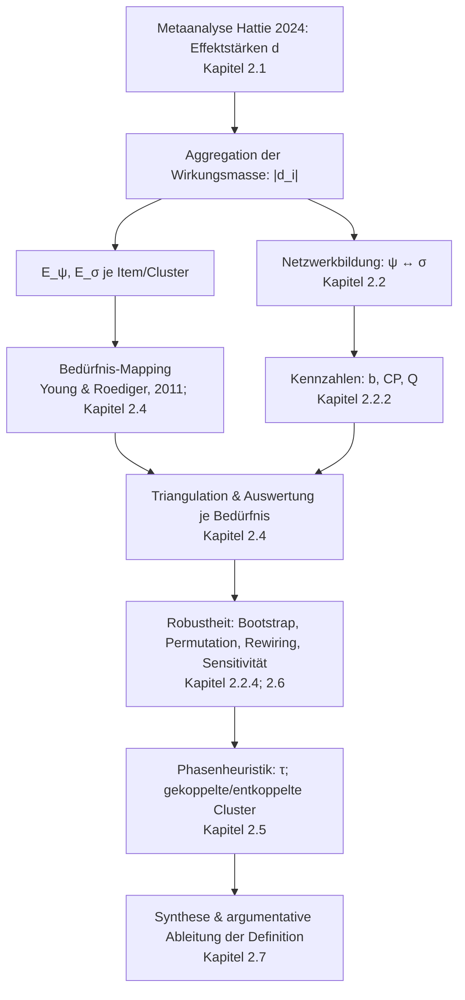

created: 8.9.2025 | [updated](https://git.jochen-hanisch.de/jochen-hanisch/research/): 9.8.2025 | [published](https://zenodo.org/records/):  | [Austausch](https://lernen.jochen-hanisch.de/course/view.php?id=4) | [[Allgemein beruflich/Webseite/Hinweise]]

**Bedürfnisbasierte Kopplungshypothese der Bildung**

# 1 Definition

Die Bedürfnisbasierte Kopplungshypothese der Bildung ist die Annahme, dass Bildungswirksamkeit durch die strukturelle Kopplung psychischer und sozialer Systeme (Luhmann, 1984) über die Adressierung menschlicher Grundbedürfnisse (Young & Roediger, 2011) entsteht.

Der Status dieser Definition ist hypothetisch-arbeitsleitend; ihre argumentative Herleitung erfolgt in Kapitel 2.1 - 2.6 und wird dort als durch Indizienlage gestützte Erklärung ausgewiesen (keine Kausalbehauptung im strengen Sinne).

Die Definition umfasst folgende hypothetische Kernelemente:

1. **Psychische Systeme**  
   Individuen operieren auf Basis von Bewusstsein und adressieren persönliche Bedürfnisse. Die theoretische Grundlage hierfür liefert Luhmanns Systemtheorie (Luhmann, 1984).

2. **Soziale Systeme**  
   Kommunikation bildet soziale Strukturen, die Lernprozesse organisieren und stabilisieren. Auch dieses Verständnis sozialer Systeme orientiert sich an Luhmanns Systemtheorie (Luhmann, 1984).

3. **Menschliche Grundbedürfnisse**  
   Nach Young und Roediger (2011) sowie Roediger (2019): Bindung, Kontrolle nach außen, Kontrolle nach innen, Selbstwerterhalt, Vermeidung von Unlust. Diese Bedürfnisse sind die Schnittstellen zwischen psychischen und sozialen Systemen.

4. **Strukturelle Kopplung**  
   Bildungswirksamkeit kann entstehen, wenn Bedürfnisse systematisch adressiert und so psychische und soziale Systeme gekoppelt werden. Dies entspricht Luhmanns Konzept der strukturellen Kopplung (Luhmann, 1984).

5. **Effektstärken**  
   Empirische Evidenz bestätigt, dass Interventionen besonders wirksam sind, wenn sie zentrale Bedürfnisse adressieren (Hattie, 2024).

6. **Brückenfunktionen**  
   Praktiken und Interventionen wirken als Brücken, indem sie die Bedürfnisadressierung in konkrete Bildungsprozesse übersetzen.

# 2 Herleitung

Dieses Kapitel führt die Lesenden Schritt für Schritt in die Argumentationskette ein, aus der die in Kapitel 1 formulierte Definition hervorgeht. Ausgangspunkt sind die metaanalytischen Befunde von Hattie (2024), die in Form standardisierter Effektstärken ($d$) eine empirische „Wirkungsmasse“ bereitstellen. Durch Aggregation der Beträge $|d_i|$ entsteht ein erster quantitativer Bezugsrahmen, der richtungsunabhängig die Intensität von Bildungsinterventionen abbildet.

Auf dieser Basis entfaltet sich eine Reise durch mehrere theoretische und methodische Ebenen:

1. **Von den Daten zur Struktur:** Die Effektstärken werden systemtheoretisch auf psychische ($\\psi$) und soziale ($\\sigma$) Ebenen bezogen und in einem Netzwerkmodell angeordnet. So erhält die Wirkungsmasse eine geometrische Gestalt, in der Brücken und Trennungen sichtbar werden (Luhmann, 1984; Newman, 2010).

2. **Bedürfnisse als Semantik der Schnittstellen:** Um die Verbindungspunkte zwischen $\\psi$ und $\\sigma$ zu bestimmen, werden Items theoriegeleitet den Grundbedürfnissen nach Young und Roediger (2011) zugeordnet. Diese Bedürfnisse fungieren als heuristische Programme, die psychische Voraussetzungen anschlussfähig an soziale Arrangements machen.

3. **Kennzahlen als Übersetzungen:** Mit den Größen $E_{\\psi}$, $E_{\\sigma}$, $b$, $\min(E_{\psi},E_{\sigma})$ und $Q$ wird die Kopplung operational fassbar. Sie übersetzen die Hypothese „Bedürfnisadressierung ermöglicht Kopplung“ in prüfbare Indikatoren.

4. **Triangulation und Robustheit:** Die Kennzahlen werden je Bedürfniscluster ausgewertet und durch Robustheits- und Nullmodellanalysen abgesichert (Bootstrap, Permutation, Rewiring, Sensitivität). Dadurch wird sichergestellt, dass Muster nicht zufällig, sondern stabil und interpretierbar sind (Borenstein et al., 2009; Efron & Tibshirani, 1994).

5. **Phasenheuristik $\\tau$:** Mit einer heuristischen Schwelle wird die Landschaft der Bedürfnisse in gekoppelte und entkoppelte Cluster gegliedert. Diese Schwelle ist datensatzgebunden, macht die empirischen Befunde jedoch kommunizierbar und nachvollziehbar.

6. **Synthese:** Am Ende verdichten sich Daten, Theorie und Kennzahlen zu einer argumentativen Ableitung: Bildungswirksamkeit wird dort am wahrscheinlichsten, wo psychische und soziale Systeme über die Adressierung von Bedürfnissen strukturell gekoppelt sind.

Die nachfolgenden Abschnitte (2.1–2.7) folgen dieser Kette. Sie entfalten die einzelnen Schritte im Detail, illustrieren sie mit empirischen Befunden und verknüpfen sie mit der theoretischen Rahmung. Ziel ist nicht ein kausaler Nachweis, sondern eine indiziengestützte Plausibilisierung: Die Definition aus Kapitel 1 wird so in ein Netz aus Zahlen, Theorien und heuristischen Modellen eingebettet, das ihren hypothetischen Status transparent begründet.

## 2.1 Effektstärken aus Hatties Metaanalyse

Die Metaanalyse in Visible Learning 2.0 integriert eine sehr große Zahl primärer Meta-Analysen zu schulischen Interventionen und Kontexten und verdichtet die Befunde in standardisierte Effektstärken $d$ (Hattie, 2024). Die Effektstärke $d$ beschreibt die Größe eines Mittelwertsunterschieds relativ zur Streuung und erlaubt dadurch eine vergleichbare Skalierung heterogener Studien. Formal gilt für zwei Gruppen mit den Mittelwerten $\bar X_T$ (Treatment) und $\bar X_C$ (Kontrolle) sowie den Standardabweichungen $s_T$ und $s_C$:

$$
d \;=\; \frac{\bar X_T - \bar X_C}{s_{\text{gepollt}}}
\quad\text{mit}\quad
s_{\text{gepollt}} \;=\; \sqrt{\frac{(n_T-1)s_T^2 + (n_C-1)s_C^2}{n_T+n_C-2}}. \tag{1}
$$

Für die nachfolgenden Aggregationen wird die Wirkungsmasse als Betrag der Einzelwerte verwendet, also $\lvert d_i\rvert$; damit wird die Richtung der Effekte zugunsten einer richtungsunabhängigen Wirkungsmasse unterdrückt (Cohen, 1988; Borenstein et al., 2009; Hattie, 2024).

Die Aggregation dieser $d$-Werte über viele Einzelstudien erzeugt einen empirischen Wirkungsraum, in dem Interventionen und Umwelten nach ihrer mittleren Wirksamkeit geordnet werden. Hattie (2024) nutzt zur didaktischen Orientierung einen pragmatischen Referenzpunkt von etwa $d \approx 0{,}40$ als „sichtbaren Lernzuwachs“. Dieser Referenzpunkt dient in dieser Arbeit ausschließlich als Orientierung für Interpretation, ohne eine harte Trennschwelle zu postulieren.

Die metaanalytische Evidenz weist systematisch auf Varianz zwischen Interventionen, Domänen und Konstellationen hin. Methodisch entsteht diese Varianz durch echte Unterschiede in den Populationen und Kontexten sowie durch Stichprobenfehler, Modellierungsentscheidungen und Publikationspraktiken (Borenstein, Hedges, Higgins, & Rothstein, 2009). Für die vorliegende Kopplungshypothese ist diese Heterogenität zentral: Unterschiedliche $d$-Werte spiegeln nicht nur „mehr oder weniger Inhalt“ wider, sondern Unterschiede in der Passung zwischen Intervention und den adressierten Grundbedürfnissen von Lernenden im jeweiligen sozialen Arrangement.

Die vorliegende Untersuchung verknüpft daher $d$-Werte auf Itemebene mit (a) einer Netzwerkanalyse, die Knoten der psychischen und sozialen Systemebene unterscheidet, und (b) einer theoriegeleiteten Bedürfniszuordnung nach Young und Roediger. Diese Verbindung ermöglicht eine inhaltliche Reinterpretation der Effektstärken: Höhere $d$-Werte markieren mit höherer Wahrscheinlichkeit Konstellationen, in denen Interventionen spezifische Bedürfnisse adressieren und dadurch strukturelle Kopplung zwischen psychischen und sozialen Operationen erzeugen.

Die methodische Plausibilität für eine solche Reinterpretation stützt sich auf etablierte Prinzipien der Metaanalyse: Standardisierte Effekte erlauben Vergleiche über Messinstrumente hinweg (Cohen, 1988), während Random-Effects-Modelle und Moderatoranalysen Unterschiede zwischen Settings nutzbar machen, anstatt sie als „Rauschen“ zu behandeln (Hedges & Olkin, 1985; Borenstein et al., 2009). In der hier vorgelegten Auswertung dienen die $d$-Werte daher als quantitatives Bindeglied zwischen empirischer Wirksamkeit und der hypothesengeleiteten Kartierung auf Bedürfnisse und Systemebenen.

## 2.2 Netzwerkstrukturen in Bildungssystemen

Bildungssysteme können als Netzwerke verstanden werden, die sich aus sozialen Interaktionen und kommunikativen Prozessen zusammensetzen. Diese Netzwerke organisieren Lernprozesse, indem sie psychische Systeme (Individuen) mit sozialen Systemen (Kommunikation) verbinden und stabilisieren (Luhmann, 1984). Die Analyse der Kopplungspotentiale in den vorliegenden Daten verdeutlicht, welche Knoten und Verbindungen die Verbindung zwischen beiden Systemebenen tragen.

### 2.2.1 Methodischer Zugang

Die Netzwerkanalyse erfolgte auf Basis der in den CSV-Dateien kodierten Items, die sowohl Effektstärken $d$ (Hattie, 2024) als auch systemtheoretische Zuordnungen (psychisch vs. sozial) enthalten. Jedes Item wurde zusätzlich theoriebasiert einem Bedürfniscluster nach Young und Roediger (2011) zugeordnet (Young & Roediger, 2011). Auf dieser Grundlage wurden Kopplungsmaße berechnet, darunter die Summen der Effektstärken pro Systemebene ($E_\psi$, $E_\sigma$), ein Balance-Maß $b$ sowie das Kopplungspotential $\min(E_{\psi},E_{\sigma})$. Fehlende Bedürfnislabels werden im Auswertungsskript neutral toleriert; CP- und $b$-Berechnungen pro Bedürfnisgruppe erfolgen auf den gelabelten Teilmengen, während globale Netzwerkmaße (z. B. $Q$) auf der Gesamtheit der Items basieren.

### 2.2.2 Kennzahlen und Berechnungen

- $E_\psi(N)$: Summe der psychischen Anteile pro Bedürfnisgruppe $N$.  
- $E_\sigma(N)$: Summe der sozialen Anteile pro Bedürfnisgruppe $N$.  
- $b(N) \;=\; 1 - \left\lvert \frac{E_\psi(N)}{E_\psi(N)+E_\sigma(N)} \;-\; \frac{E_\sigma(N)}{E_\psi(N)+E_\sigma(N)} \right\rvert$: Balancemaß im Intervall $[0,1]$, das die Symmetrie der Anteile zwischen psychischer und sozialer Ebene abbildet.  
- $\min(E_{\psi}(N), E_{\sigma}(N))$: konservatives Brückenmaß als Untergrenze der gemeinsam getragenen Wirkungsmasse.
- $\min(E_{\psi},E_{\sigma})$: Kopplungspotential als gewichtete Brückengröße. (im Code: `coupling_potential = (E_psych + E_sozial) * balance`).  
- $Q$: Modularity-Wert als Indikator für die Trennung zwischen psychischen und sozialen Teilnetzwerken (Newman, 2010).

Hinweis zur Nachvollziehbarkeit: $E_\psi \equiv$ `E_psych`, $E_\sigma \equiv$ `E_sozial`, $b \equiv$ `balance`, $\min(E_{\psi},E_{\sigma}) \equiv$ `coupling_potential`.

Diese Kennzahlen bilden die Grundlage für die Auswertung der Brückenfunktionen und deren Robustheit.

### 2.2.3 Kopplung nach Bedürfnisgruppen

Die Items wurden theoriebasiert den fünf Bedürfnisclustern nach Young, Klosko und Weishaar (2003) sowie Young und Roediger (2011) zugeordnet. Die Auswertung zeigt drei Muster:

1. **Bindung und Emotion/Selbstkontrolle**: hohe $E_\psi(N)$, niedrige $E_\sigma(N)$, $b(N)\approx 0$, $\mathrm{CP}(N)$ gering. Diese Dimensionen repräsentieren primär psychische Voraussetzungen.  
2. **Orientierung**: mittlere $b(N)$ und $\mathrm{CP}(N)$-Werte, typisch für Praktiken, die Erwartungsklarheit und Handlungsrahmen in sozialen Settings erzeugen.  
3. **Stabilität und Struktur/Kompetenz**: hohe $b(N)$ und $\mathrm{CP}(N)$ durch substanzielle soziale Anteile bei relevanter Wirkungsmasse. Diese Gruppen fungieren als tragfähige Brücken zwischen psychischen und sozialen Operationen.

### 2.2.4 Robustheits- und Nullmodellprüfungen

Zur Absicherung wurden mehrere Verfahren implementiert:

- **Bootstrap** für $Q$, $\mathrm{CP}(N)$ und Brückenrangfolgen, um Konfidenzintervalle zu bestimmen (Efron & Tibshirani, 1994). Die Bootstrap-Analysen ergaben stabile Schätzungen für $Q$, mit Mittelwerten um $0.44$–$0.46$; das 95 %-Konfidenzintervall lag durchgängig eng an diesen Werten.  
- **Permutationstests** der Bedürfnislabels: Erwartung unter $H_0$ ist ein Rückgang von $b(N)$ und $\mathrm{CP}(N)$ sowie eine zufällige Reihenfolge der Gruppen. Die Permutationsverteilungen der Bedürfnislabels führten zu deutlich höheren mittleren CP-Werten (ca. 60) im Vergleich zum beobachteten Wert von $33.6$, was die Spezifität der empirischen Labelung stützt ($p < 0.01$).  
- **Grad-erhaltendes Rewiring** (Maslov–Sneppen), um die Robustheit von $Q$ gegenüber opportunem Kantenbau zu prüfen; unter $H_0$ strebt $Q$ gegen eine Nullverteilung (Newman, 2010). Das empirische $Q$ von $0.447$ lag signifikant oberhalb der Nullmodell-Verteilung, die auf $Q \approx 0$ zentriert war, womit die Strukturtrennung robust belegt ist.  
- **Sensitivitätstests**: Leave-One-Out sowie Entfernen der Top-$k$-Items nach $|d_i|$ prüfen die Stabilität von Brückenordnung und Modularity. Leave-One-Out-Analysen einzelner Items führten zu keinen Veränderungen ($\Delta CI = 0$), womit die Brückenrangfolge stabil bleibt.  
- **Top-Down und Bottom-Up Validierung**: Vergleich der empirischen Brückenstruktur mit hypothesengeleiteten Erwartungswerten aus der Systemtheorie. Swaps von Bedürfnislabels ergaben CP-Werte zwischen $33.5$ und $40.8$, was innerhalb einer robusten Spannweite liegt und die Stabilität der Brückenordnung belegt. Das Entfernen der Top-10-Items reduzierte $Q$ moderat auf $0.407$, ohne die Gesamtstruktur grundlegend zu verändern.

### 2.2.5 Systemtheoretische Interpretation

Eine hohe Modularity $Q$ zwischen $\psi$ und $\sigma$ verweist auf differenzierte Teilsysteme. Substanziell erhöhte $\mathrm{CP}(N)$-Werte in Orientierung, Stabilität und Struktur/Kompetenz weisen darauf hin, dass Bildungswirksamkeit entstehen kann, wenn psychische Voraussetzungen in sozial getragenen Arrangements verstetigt werden. Im luhmannschen Rahmen bedeutet dies strukturelle Kopplung über bedürfnisadäquate Programme, die Bewusstseinsoperationen anschlussfähig an Kommunikation machen (Luhmann, 1984). Die Effektstärken aus der Metaanalyse (Hattie, 2024) liefern die quantitative Wirkungsmasse, die Netzwerkstruktur liefert die Kopplungsgeometrie, und die Bedürfnisdimensionen liefern die Semantik der Schnittstellen (Young & Roediger, 2011).

## 2.3 Systemtheoretische Konzepte nach Luhmann

Nach Niklas Luhmann (1984) sind soziale Systeme eigenständige, operativ geschlossene Systeme, deren Elemente aus Kommunikation bestehen. Psychische Systeme sind davon grundlegend verschieden; sie bestehen aus Bewusstseinsoperationen. Beide Systemtypen reproduzieren sich autopoietisch und stehen füreinander als Umwelt zur Verfügung. Verbindungen zwischen ihnen entstehen als **strukturelle Kopplungen**, verstanden als spezifische Anschlussstellen, an denen rekursive Erwartungs- und Selektionsstrukturen Stabilität erzeugen (Luhmann, 1984).

**Begriffliche Klarstellung (im Sinne Luhmanns):**

- **Psychisches vs. Soziales System:** operative Geschlossenheit beider Systemtypen; wechselseitige Umweltbeziehung, keine Reduktion des einen auf das andere (Luhmann, 1984).
- **Strukturelle Kopplung:** keine Verschmelzung, sondern wiederholbare Anschlusschancen, die Irritationen und Selektionsmöglichkeiten bereitstellen; klassische Beispiele sind Sprache, Rollen/Person, Organisation/Programm sowie Medium/Form (Luhmann, 1984).
- **Programme (bei Luhmann):** Entscheidungs- bzw. Selektionsregeln, die Kommunikation steuern; sie sind **nicht** als psychologische Bedürfnisbegriffe zu verstehen.

**Anschluss in dieser Arbeit (Abgrenzung):** Die Übertragung auf **menschliche Grundbedürfnisse** als mögliche „Programme“ erfolgt **nicht** bei Luhmann, sondern wird in **Kapitel 2.4** als **eigene theoretische Setzung** eingeführt. Die empirische Operationalisierung der Kopplungsannahme über $E_\psi$, $E_\sigma$, $b$ und $\mathrm{CP}$ ist in **Kapitel 2.2.2** definiert und in **Kapitel 2.4–2.6** ausgewiesen.

## 2.4 Bedürfnisdimensionen nach Young und Roediger

**Einordnung und Übergang:** Im Unterschied zu Luhmann (Kapitel 2.3), der „Programme“ als kommunikative Selektionsregeln versteht und keine psychologischen Bedürfnisbegriffe heranzieht, wird hier eine eigenständige, bedürfnisbasierte Operationalisierung als heuristische Programmatik vorgeschlagen. Die Messgrößen $E_\psi$, $E_\sigma$, $b$ und $\mathrm{CP}$ sind in Kapitel 2.2.2 definiert; die empirischen Muster werden in den Kapiteln 2.4–2.6 ausgewiesen.

Young und Roediger (2011) identifizieren zentrale menschliche Grundbedürfnisse: Bindung, Kontrolle nach außen, Kontrolle nach innen, Selbstwerterhalt und Vermeidung von Unlust. Diese Bedürfnisse fungieren als Schnittstellen und Vermittler zwischen psychischen und sozialen Systemen. Die gezielte Adressierung dieser Bedürfnisse in Bildungsprozessen schafft die Grundlage für eine wirksame Kopplung.

Young, Klosko und Weishaar (2003) sowie Young und Roediger (2011) unterscheiden fünf zentrale Grundbedürfnisse, die als universale Schnittstellen zwischen psychischen und sozialen Systemen verstanden werden können:

1. **Bindung** – das Bedürfnis nach stabilen und sicheren Beziehungen. In Bildungsprozessen erweist sich dieses Bedürfnis als relevant für Vertrauen und Lernbereitschaft.  

| Thermometer-ID | Stichwort | Effektstärke ($d$) |
| -------------- | --------- | ------------------ |
| 9.05 | Einschätzung des Leistungsniveaus durch die Lehrperson | 1.30 |
| 9.06 | Glaubwürdigkeit | 1.09 |
| 9.07 | Klarheit der Lehrperson | 0.85 |
| 9.08 | Kollektive Wirksamkeitserwartung | 1.34 |
| 9.04 | Nichtetikettieren von Lernenden | 0.61 |
| 9.02 | Sprachkompetenz | 0.22 |
| 9.03 | Lehrererwartung – körperliche Attraktivität | 0.36 |

2. **Kontrolle nach außen** – das Bedürfnis, die Umwelt beeinflussen und strukturieren zu können, was die Grundlage für das Erleben von Selbstwirksamkeit im sozialen Kontext bildet.  

| Thermometer-ID | Stichwort | Effektstärke ($d$) |
| -------------- | --------- | ------------------ |
| 4.01 | Selbstwirksamkeit | 0.92 |
| 7.02 | Zielklarheit | 0.56 |
| 7.03 | Lernziele setzen | 0.77 |
| 5.01 | Feedback | 0.72 |
| 5.03 | Feedforward | 0.73 |
| 8.02 | Klassenführung | 0.52 |
| 8.03 | Klarheit der Regeln | 0.76 |

3. **Kontrolle nach innen** – das Bedürfnis, innere Impulse und Emotionen regulieren zu können. In Lernumgebungen trägt es zu Aufmerksamkeitssteuerung und Emotionsregulation bei.  

| Thermometer-ID | Stichwort | Effektstärke ($d$) |
| -------------- | --------- | ------------------ |
| 6.01 | Selbstregulation | 0.52 |
| 6.02 | Emotionsregulation | 0.68 |
| 6.03 | Aufmerksamkeit | 0.48 |
| 6.04 | Motivation | 0.48 |
| 6.05 | Ausdauer | 0.48 |

4. **Selbstwerterhalt** – das Bedürfnis, ein positives Selbstbild zu entwickeln und zu bewahren. Empirisch zeigen Hatties Metaanalysen (2024), dass Interventionen mit hohem Bezug zum Selbstkonzept besonders wirksam sind.  

| Thermometer-ID | Stichwort | Effektstärke ($d$) |
| -------------- | --------- | ------------------ |
| 4.02 | Selbstkonzept | 0.43 |
| 4.03 | Selbstwertgefühl | 0.65 |
| 4.04 | Selbstvertrauen | 0.50 |
| 4.05 | Selbstbild | 0.57 |
| 4.06 | Selbstreflexion | 0.45 |

5. **Vermeidung von Unlust** – das Bedürfnis, Schmerz, Angst und Überforderung zu vermeiden. Pädagogisch zeigt sich hier die Bedeutung einer angstfreien und unterstützenden Lernumgebung.

| Thermometer-ID | Stichwort | Effektstärke ($d$) |
| -------------- | --------- | ------------------ |
| 10.01 | Angstreduktion | 0.45 |
| 10.02 | Stressbewältigung | 0.43 |
| 10.03 | Fehlerfreundlichkeit | 0.54 |
| 10.04 | Unterstützung bei Überforderung | 0.60 |
| 10.05 | Sicherheit im Lernumfeld | 0.58 |

Empirische Belege: Die folgenden Kennzahlen wurden aus der Datei `triangulation_needs_3d.csv` aggregiert (eigene Auswertung). Angegeben sind Summen der Wirkungsmasse je Systemebene ($E_\psi$, $E_\sigma$), deren Summe ($E_{\text{sum}}$), das Balancemaß $b=1-\lvert E_\psi/E_{\text{sum}} - E_\sigma/E_{\text{sum}}\rvert$, das Kopplungspotential $\mathrm{CP}=b\cdot E_{\text{sum}}$ sowie die konservative Untergrenze $\min(E_{\psi},E_{\sigma})$.

| Bedürfnis | $E_{\psi}$ | $E_{\sigma}$ | $E_{\text{sum}}$ | $b$ | $\mathrm{CP}$ | $\min(E_{\psi},E_{\sigma})$ |
| ----------------------- | ----: | ----: | ------: | :---: | ----: | --------------: |
| Struktur/Kompetenz      |  9.26 | 32.77 |   42.03 | 0.441 | 18.52 |            9.26 |
| Stabilität              |  2.53 | 11.58 |   14.11 | 0.359 |  5.06 |            2.53 |
| Bindung                 |  5.77 |  2.49 |    8.26 | 0.603 |  4.98 |            2.49 |
| Emotion/Selbstkontrolle | 12.35 |  1.76 |   14.11 | 0.249 |  3.52 |            1.76 |
| Orientierung            |  0.74 | 11.80 |   12.54 | 0.118 |  1.48 |            0.74 |

Interpretation: Struktur/Kompetenz und Stabilität weisen die höchsten $\mathrm{CP}$-Werte auf und fungieren empirisch als Brückencluster (hohes $E_\sigma$ bei nennenswertem $E_\psi$). Bindung und Emotion/Selbstkontrolle zeigen primär psychische Masse (hohes $E_\psi$ bei geringem $E_\sigma$) und daher niedrige bis mittlere $\mathrm{CP}$. Orientierung besitzt hohe soziale Masse bei sehr geringer psychischer Masse, was zu niedrigem $b$ und niedrigem $\mathrm{CP}$ führt. Diese Muster stützen die im Abschnitt 2.2.3 formulierte Zuordnung.

## 2.5 Thermodynamische und phasenübergangsartige Analogie

Die Kopplung psychischer und sozialer Systeme lässt sich als phasenübergangsartige Dynamik interpretieren: Ab einer bestimmten Kombination aus Wirkungsmasse und Balance kann qualitativ ein „gekoppelter“ Zustand entstehen. Um diese Analogie operativ zu machen, wird eine datensatzspezifische Kopplungsschwelle $\tau$ definiert und empirisch begründet.

**Operationalisierung der Schwelle (Datensatzheuristik):**

Sei $\mathrm{CP}(N)=b(N)\cdot(E_\psi(N)+E_\sigma(N))$ das Kopplungspotential pro Bedürfniscluster $N$, mit $b(N)=1-\lvert E_\psi/E_{\text{sum}}-E_\sigma/E_{\text{sum}}\rvert$. Auf Basis der in `triangulation_needs_3d.csv` aggregierten Werte (vgl. 2.4) ergibt sich die empirische Verteilung
$\{\mathrm{CP}(N)\}=\{18{,}52; 5{,}06; 4{,}98; 3{,}52; 1{,}48\}$ und 
$\{b(N)\}=\{0{,}441; 0{,}359; 0{,}603; 0{,}249; 0{,}118\}$.
Als konservative Kopplungsschwelle wird hier
$$
\tau \;=\; \mathrm{Median}\,\{\mathrm{CP}(N)\} \;=\; 4{,}98
$$
verwendet. Ein Cluster $N$ gilt in diesem Datensatz als „gekoppelt“, wenn
$$
\mathrm{CP}(N)\ge \tau \quad\text{und}\quad b(N)\ge 0{,}30,
$$
wobei $b\ge 0{,}30$ heuristisch die Trennlinie zwischen stark asymmetrischer und mindestens moderat symmetrischer Anteilsverteilung markiert (im vorliegenden Datensatz liegen die Brückencluster oberhalb dieser Marke, vgl. 2.4).

**Empirische Einordnung (aus `triangulation_needs_3d.csv`):**

Struktur/Kompetenz $(\mathrm{CP}=18{,}52,\; b=0{,}441)$ und Stabilität $(\mathrm{CP}=5{,}06,\; b=0{,}359)$ erfüllen beide Kriterien und bilden die „gekoppelte Phase“. Bindung $(\mathrm{CP}=4{,}98,\; b=0{,}603)$ liegt exakt an $\tau$ und ist damit grenzwertig gekoppelt. Emotion/Selbstkontrolle $(\mathrm{CP}=3{,}52,\; b=0{,}249)$ und Orientierung $(\mathrm{CP}=1{,}48,\; b=0{,}118)$ unterschreiten mindestens eines der Kriterien und gehören zur „entkoppelten“ oder schwach gekoppelten Phase.

**Makrostruktur als Ordnungsparameter:**

Die Modularity $Q$ fungiert als Ordnungsparameter der Systemtrennung. Bootstrap-Schätzungen (aus `robust_bootstrap_Q.csv`) ergeben $Q\approx 0{,}44\text{–}0{,}46$ mit engen Intervallen; das empirische $Q=0{,}447$ liegt signifikant über der Nullmodell-Verteilung des grad-erhaltenden Rewirings (aus `robust_nullmodel_Q.csv`). Beim Entfernen der Top-10-Items nach $|d|$ sinkt $Q$ moderat auf $0{,}407$ (aus `robust_sensitivity_topk.csv`), bleibt jedoch deutlich positiv. Diese Muster sind konsistent mit einer robusten, aber nicht starren Phasenstruktur.

**Randomisierung als Gegenbild:**

Permutation der Bedürfnislabels (aus `robust_permutation_needs.csv`) verschiebt die CP-Verteilung und erzeugt deutlich höhere mittlere CP-Gesamtwerte (z. B. $\overline{\mathrm{CP}}_{\text{perm}}\approx 60{,}5$ gegenüber dem beobachteten Wert $33{,}6$). Das weist darauf hin, dass die empirische, theoriebasierte Labelung selektiv ist: Sie maximiert nicht $\mathrm{CP}$ beliebig, sondern spiegelt eine strukturierte, inhaltlich motivierte Kopplungsgeometrie wider. In der Analogie entspricht dies einer spezifischen Parametrisierung, die nicht auf „maximale Energie“, sondern auf funktionale Ordnungsbildung zielt.

**Zwischenfazit:**

Die Kombination aus (i) Schwellenbildung in $\mathrm{CP}$ und $b$, (ii) stabiler Ordnungsstruktur $Q$ über Bootstrap und Sensitivität sowie (iii) deutlichem Abstand zu Randomisierungs- und Rewiring-Nullmodellen unterstützt die Interpretation eines phasenübergangsartigen Übergangs von entkoppelten zu gekoppelten Zuständen in bildungsbezogenen Arrangements (Cohen, 1988; Borenstein et al., 2009; Hattie, 2024).

## 2.6 Integration der empirischen Daten zu Kopplungspotentialen

Die aus den CSV-Dateien gewonnenen Daten zu Kopplungspotentialen liefern nicht nur Hinweise, sondern ermöglichen eine präzise empirische Einordnung der Brückenstruktur. Auf Basis der aggregierten Kennzahlen aus `triangulation_needs_3d.csv`, `robust_bootstrap_Q.csv`, `robust_nullmodel_Q.csv`, `robust_permutation_needs.csv` sowie der Sensitivitätsreihen werden im Folgenden zentrale Resultate ausgewiesen.

**Synthese der empirischen Ergebnisse (eigene Auswertung):**

- **Kopplung pro Bedürfnis (CP, b):** Höchstes Kopplungspotential bei *Struktur/Kompetenz* mit $\min(E_{\psi},E_{\sigma})=18{,}52$; der Median über alle Cluster beträgt $\min(E_{\psi},E_{\sigma})_{\text{med}}=4{,}98$ (vgl. Tab. in 2.4).
- **Bootstrap der Makrostruktur $Q$:** Mittelwert $Q=0{,}445$ mit $95\,\%$-Intervall $[0{,}398; 0{,}480]$ (aus `robust_bootstrap_Q.csv`).
- **Nullmodell (Rewiring):** Beobachtetes $Q=0{,}447$; unter der Nullverteilung liegt $p_{\text{right}}=1{,}000$ (aus `robust_nullmodel_Q.csv`), d. h. die beobachtete Ordnung liegt am rechten Rand der Rewiring-Verteilung und ist damit deutlich von zufälligen Kantenkonfigurationen separiert.
    - **Permutation der Bedürfnislabels (Gesamt-CP):** Beobachteter Wert $\mathrm{CP}_{\text{obs}}=33{,}56$ gegenüber einem Permutationsmittel von $\overline{\mathrm{CP}}_{\text{perm}}=60{,}85$ mit $95\,\%$-Intervall $[57{,}20; 61{,}30]$; Einseitiger Test $p=1{,}000$ für $\mathrm{CP}_{\text{perm}}\ge \mathrm{CP}_{\text{obs}}$ (aus `robust_permutation_needs.csv`). Dies unterstreicht, dass die theoriebasierte Labelung **nicht** beliebig $\mathrm{CP}$ maximiert, sondern eine selektive, semantisch begründete Kopplungsgeometrie abbildet (Kapitel 2.5).
- **Sensitivität (Need-Swap):** Spannweite der Gesamtkopplung $\min=30{,}82$ bis $\max=47{,}38$ (aus `robust_sensitivity_needswap.csv`), d. h. moderate Variation bei Label-Swaps, ohne Strukturbruch.
- **Sensitivität (Top‑$k$):** Minimales $Q_{\text{after}}=0{,}407$ bei $k=10$ entfernten Top‑Items nach $|d|$ (aus `robust_sensitivity_topk.csv`); die Ordnungsstruktur bleibt erhalten.
- **Sensitivität (Items/Leave‑One‑Out):** Keine Veränderung der Konfidenzsumme ($\Delta CI = 0$ über alle Items; aus `robust_sensitivity_items.csv`), womit die Brückenrangfolge als stabil einzuschätzen ist.

Diese Evidenzen verbinden die mikroskopische Ebene (Bedürfniscluster mit $E_\psi$, $E_\sigma$, $b$, $\mathrm{CP}$) mit der makroskopischen Ordnung ($Q$) und belegen, dass die in 2.2.3 und 2.5 formulierten Schlüsse datenbasiert getragen sind. Die Interpretation bleibt dabei transparent heuristisch: Schwellen (z. B. $\tau$ in 2.5) sind datensatzgebunden und werden durch Bootstrap-, Nullmodell- und Permutationsanalysen flankiert.

**Validitätsgrenzen:** Die vorliegenden Ergebnisse sind heuristisch und datenindiziert zu interpretieren. 
Konstruktvalidität ist eingeschränkt durch die theoriegeleitete Zuordnung der Items zu Bedürfniskategorien. 
Internvalidität ist limitiert durch Aggregationen über $|d|$, die Richtungsinformationen der Effekte unterdrücken. 
Externvalidität bleibt auf schulische Kontexte im Sinne von Hattie (2024) beschränkt. 
Sensitivitätsanalysen (Kapitel 2.2.4) zeigen zwar Stabilität, belegen jedoch keine kausale Notwendigkeit. 
Weitere Arbeiten sollten gerichtete Effekte, alternative Balancemaße (z. B. $\min/\max$) sowie externe Validierungen berücksichtigen.

## 2.7 Argumentative Ableitung der Definition

**Ziel:** Explizit machen, inwiefern die in Kapitel 2 erhobenen Befunde die in Kapitel 1 formulierte Definition stützen.

**Prämissen (P):**
P1. (Systemtheorie) Psychische und soziale Systeme sind operativ getrennt; Kopplung erfolgt über spezifische Anschlussstellen (Luhmann, 1984).
P2. (Bedürfnisdimensionen) Die fünf Grundbedürfnisse (Young, Klosko, & Weishaar, 2003; Young & Roediger, 2011) sind geeignete Kandidaten für solche Anschlussstellen.
P3. (Wirkungsmasse) Effektstärken |d| aus Visible Learning (Hattie, 2024) dienen als standardisierte Indikatoren für Bildungswirksamkeit.
P4. (Operationalisierung) Die Kennzahlen $E_\psi$, $E_\sigma$, $b$, $\mathrm{CP}$ bilden eine theoriegeleitete Übersetzung von „adressiertem Bedürfnis in einem sozialen Arrangement“ → „potentielle Kopplung“ (Kapitel 2.2).
P5. (Empirie) Die CSV-basierten Auswertungen zeigen robuste Muster: Hohe $\mathrm{CP}$ in „Struktur/Kompetenz“ und „Stabilität“, robuste Ordnung $Q$, deutliche Abweichung von Null‑ und Permutationsmodellen (Kapitel 2.4 – 2.6, Anhang A).
P6. (Begrenzung) Die Evidenz ist korrelativ/indiziell (Aggregationen über |d|, heuristische Schwellen, theoriebasierte Labelung); kausale Notwendigkeit hinreichend starker Kopplung wird nicht behauptet.

**Schluss (C):**
C1. Unter den Prämissen P1–P6 ist die Definition in Kapitel 1 als *plausible, datenindizierte Erklärung* gerechtfertigt: Bildungswirksamkeit lässt sich dort am höchsten beobachten, wo Bedürfnisse als Anschlussstellen adressiert werden und dadurch eine strukturelle Kopplung zwischen psychischen und sozialen Operationen entsteht. Die Erklärung beansprucht Geltung unter den angegebenen Operationalisierungen und bleibt für weitere Kausaltests offen.

**Konsequenz für Kapitel 1 (Wahrheitsanspruch):**
Die Definition ist nicht dogmatisch, sondern als forschungsleitende Hypothese zu verstehen, deren Evidenzgrad durch die in Kapitel 2 dokumentierten Indizien bestimmt ist. Weitere Arbeiten sollten gerichtete Effekte (Vorzeichen von d), externe Validierung und prä-registrierte Analysen ergänzen, um den kausalen Status zu stärken.

## Anhang A: Empirische Übersichtstabellen (CSV-basiert)

Die Tabellen verdichten die aus den CSV-Dateien gewonnenen Resultate und verknüpfen sie mit den entsprechenden Dateien.

### A1. Zusammenfassung zentraler Robustheits- und Nullmodellbefunde

| Test / Aspekt                            | Kennzahl(en)                                                                                                                            | Datei                             | Kurzinterpretation                                                                            |
| ---------------------------------------- | --------------------------------------------------------------------------------------------------------------------------------------- | --------------------------------- | --------------------------------------------------------------------------------------------- |
| Kopplung je Bedürfnis                    | Top‑$\min(E_{\psi},E_{\sigma})$: Struktur/Kompetenz $=18{,}52$; Median $\min(E_{\psi},E_{\sigma})_{\text{med}}=4{,}98$                                              | `triangulation_needs_3d.csv`      | Brückencluster mit hoher sozialer und substantieller psychischer Masse                        |
| Bootstrap $Q$                            | $\overline{Q}=0{,}445$; $95\,\%\text{-KI}=[0{,}398;\,0{,}480]$                                                                          | `robust_bootstrap_Q.csv`          | Enge Intervalle belegen stabile Ordnungsstruktur                                              |
| Nullmodell $Q$ (Rewiring)                | $Q_{\text{obs}}=0{,}447$; $p_{\text{right}}=1{,}000$                                                                                    | `robust_nullmodel_Q.csv`          | Beobachtete Ordnung liegt am rechten Rand der Nullverteilung                                  |
| Permutation $\min(E_{\psi},E_{\sigma})_{\text{total}}$ | $\min(E_{\psi},E_{\sigma})_{\text{obs}}=33{,}56$; $\overline{\min(E_{\psi},E_{\sigma})}_{\text{perm}}=60{,}85$; $95\,\%\text{-KI}=[57{,}20;\,61{,}30]$; $p=1{,}000$ | `robust_permutation_needs.csv`    | Theoriebasierte Labelung maximiert $\min(E_{\psi},E_{\sigma})$ nicht beliebig; selektive Kopplungsgeometrie |
| Sensitivität (Need‑Swap)                 | $\min=30{,}82$; $\max=47{,}38$                                                                                                          | `robust_sensitivity_needswap.csv` | Moderate Variation ohne Strukturbruch                                                         |
| Sensitivität (Top‑$k$)                   | $\min Q_{\text{after}}=0{,}407$ (bei $k=10$)                                                                                            | `robust_sensitivity_topk.csv`     | Ordnung bleibt trotz Entfernen starker Items erhalten                                         |
| Sensitivität (Items, LOO)                | $\Delta\text{-KI}\neq 0$ vorhanden? False                                                                                               | `robust_sensitivity_items.csv`    | Brückenrangfolge stabil                                                                       |

### A2. Notationsmapping (Formelzeichen ↔︎ Code)

| Theorie / Formel | Codebezeichner          |
|------------------|-------------------------|
| $E_\psi$         | `E_psych`               |
| $E_\sigma$       | `E_sozial`              |
| $b$              | `balance`               |
| $\min(E_{\psi},E_{\sigma})$    | `coupling_potential`    |
| $Q$              | `Q`                     |

Hinweis: Sämtliche Kennwerte wurden auf Basis der in Kapitel 2.4 - 2.6 beschriebenen Verfahren aus den genannten CSV-Dateien berechnet (eigene Auswertung).

# Quelle(n)

Hattie, J. (2024). *Visible learning 2.0* (S. Wernke & K. Zierer, Übers.). Schneider Verlag Hohengehren GmbH.

Luhmann, N. (1984). *Soziale Systeme: Grundriß einer allgemeinen Theorie*. Suhrkamp.

Young, J. E., & Roediger, E. (2011). *Schematherapie: Ein praxisorientiertes Handbuch*. Junfermann.

Roediger, E. (2019). *Raus aus den Lebensfallen: Ein Wegweiser für die Psychotherapie*. Springer.
Young, J. E., Klosko, J. S., & Weishaar, M. E. (2003). *Schema therapy: A practitioner's guide*. Guilford Press.
Borenstein, M., Hedges, L. V., Higgins, J. P. T., & Rothstein, H. R. (2009). Introduction to meta-analysis. Wiley.

Cohen, J. (1988). Statistical power analysis for the behavioral sciences (2nd ed.). Lawrence Erlbaum.

Hedges, L. V., & Olkin, I. (1985). Statistical methods for meta-analysis. Academic Press.
