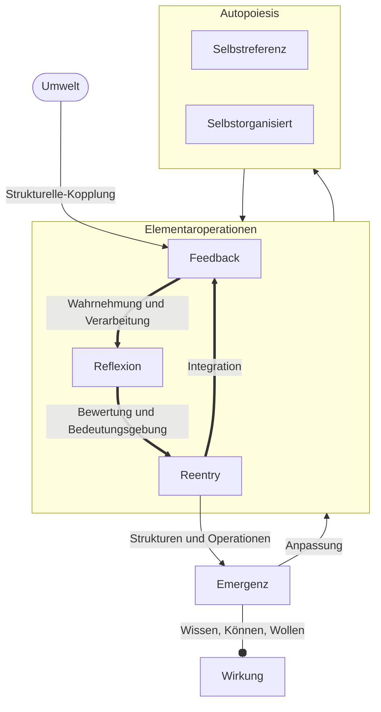
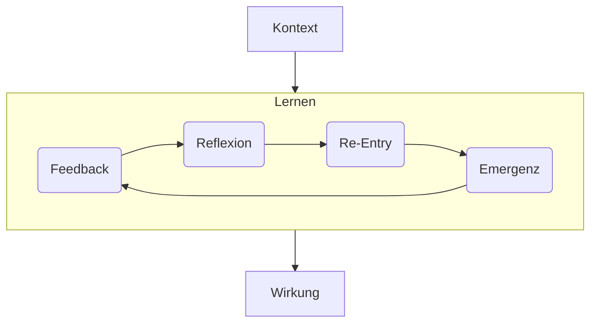

created: 2.12.2024 | [updated](https://git.jochen-hanisch.de/jochen-hanisch/research/): 30.7.2025 | published: 8.6.2025 |[Austausch](https://lernen.jochen-hanisch.de/course/view.php?id=4) | [[Allgemein beruflich/Webseite/Hinweise]]

> [!abstract]+ Anmerkung  
> Dieser Artikel wird noch überarbeitet, da Lernen als Folge von [[Elementaroperationen]] (Feedback, Reflexion und Re-Entry) verstanden wird. Diese befinden sich aktuell in Entwicklung.  
> Besonders betroffen sind die Kapitel 2.3.1 – 2.3.3 sowie 2.4, da deren Inhalte künftig in der Notiz zu den [[Elementaroperationen]] integriert werden.
>
> #### Bisherige Änderungen
> - Anpassung von Abbildung 1  
> - Der Ausdruck „in autopoietischen Systemen“ wurde aus der Definition zur Erweiterung entfernt

# Einleitung

Eine fundamentale Fähigkeit, die lebenden, psychischen, sozialen und emergenten Systemen ermöglicht, auf interne und externe Anforderungen flexibel zu reagieren und sich kontinuierlich weiterzuentwickeln, ist Lernen. Diese Fähigkeit sichert nicht nur die Anpassung an Umweltbedingungen, sondern auch die langfristige Weiterentwicklung und Stabilität von Systemen. Lernen umfasst weit mehr als die Aufnahme und Verarbeitung von Informationen. Der Prozess ist komplex, dynamisch und wird durch Feedbackschleifen sowie durch die Interaktion zwischen System und Umwelt bestimmt.

Das systemtheoretische Lernprinzip bietet eine fundierte Grundlage zur Analyse und Gestaltung solcher dynamischer Prozesse. Die Prinzipkonzeption integriert zentrale Konzepte wie Autopoiesis (Maturana & Varela, 1980), strukturelle Koppelung (Luhmann, 1984) und [[Emergenz]] (Prigogine & Stengers, 1984). Lernen wird im Prinzip als iterative Abfolge von Feedback, Reflexion und Re-Entry beschrieben. Jede dieser Operationen trägt dazu bei, neue Strukturen innerhalb eines Systems zu schaffen und die Anpassungsfähigkeit zu erhöhen. Emotionen und Bedürfnisse werden ebenfalls berücksichtigt, da sie die Aufnahme und Verarbeitung von Informationen regulieren. Dadurch erweitert das Prinzip das Verständnis von Lernprozessen, indem dieses neben den kognitiven auch die affektiven und systemischen Dimensionen einbezieht.

Die Betrachtung dieser Prozesse eröffnet neue Perspektiven für die Anwendung des Prinzips in Bereichen wie Bildung, Organisationsentwicklung und technologische Innovation. In der Gestaltung künstlicher Intelligenz, wie sie von Kergel und Heidkamp-Kergel (2020) thematisiert wird, bietet das Prinzip wertvolle Einsichten für die Entwicklung adaptiver und selbstorganisierender Systeme. Das systemtheoretische Lernprinzip liefert nicht nur eine theoretische Grundlage für das Verständnis von Lernprozessen, sondern unterstützt auch die Optimierung und Anwendung in unterschiedlichen Kontexten.

# 1 Definition

Lernen ist ein dynamischer, zirkulärer Prozess, der durch Feedback wahrgenommen und verarbeitet wird, um durch Reflexion und Re-Entry anpassungs- und entwicklungsfähige [[Emergenz]]en zu erzeugen, die unabhängig von spezifischen Kontexten oder Zeiträumen wirksam sind.

## 1.1 Prämissen und Bedeutungen

**Autopoietische Systeme und ihre Grenzen**

Autopoietische Systeme sind selbstorganisierende, autonome Einheiten, die ihre Strukturen und Operationen durch intern generierte Prozesse eigenständig reproduzieren. Während biologische Systeme (wie Zellen) die klassischen Beispiele autopoietischer Systeme darstellen, können auch chemische und physikalische Systeme autopoietische Züge aufweisen. Chemische Netzwerke, autokatalytische Reaktionen und selbstorganisierende physikalische Phänomene (z. B. Plasmastrukturen oder Konvektionsmuster) zeigen ebenfalls Merkmale der Selbsterhaltung und internen Reproduktion. Diese Systeme unterscheiden sich von ihrer Umwelt, bewahren jedoch ihre Autonomie durch strukturelle Koppelung. Externe Einflüsse wirken nicht direkt auf das System, sondern dienen lediglich als Auslöser für interne Prozesse. Anpassungen und Entwicklungen erfolgen stets auf Grundlage der bestehenden Systemstruktur und ihrer internen Logik.

**Feedback als zentraler Auslöser**

Feedback bezeichnet Rückmeldungen, die entweder aus den eigenen Operationen eines Systems (Selbstreferenz) oder aus der Interaktion mit der Umwelt (strukturelle Koppelung) entstehen. Diese Rückmeldungen zeigen Differenzen oder Veränderungen auf und bilden die Grundlage für Anpassungs- und Entwicklungsprozesse. Ohne Feedback wäre ein zirkulärer Lernprozess nicht möglich, da Differenzen unbemerkt blieben.

**Selbstreferenz und strukturelle Koppelung**

Selbstreferenz ist die Fähigkeit eines Systems, sich auf sich selbst zu beziehen, eigene Operationen wahrzunehmen und daraus Feedback zu generieren. Dies ermöglicht interne Anpassungen ohne externe Steuerung. Strukturelle Koppelung hingegen beschreibt die wechselseitige Beziehung zwischen einem System und seiner Umwelt oder anderen Systemen. Sie ermöglicht es, externe Einflüsse aufzunehmen und in die eigenen Operationen zu integrieren, ohne die Autonomie des Systems zu gefährden. Beide Prozesse sind für das Lernen essenziell und bilden die Basis für die Entstehung von Feedback.

**Reflexion und Re-Entry als Mechanismen der Verarbeitung**

Reflexion bezeichnet die Bedeutungszuweisung und Bewertung des erhaltenen Feedbacks. Dieser Prozess ermöglicht dem System, Rückmeldungen zu interpretieren und Strategien zur Anpassung abzuleiten. Re-Entry beschreibt die Integration der durch Reflexion konstruierten Bedeutungen in die bestehenden Strukturen des Systems. Durch diesen Mechanismus entstehen neue Operationen oder Strukturen, die das System an veränderte Anforderungen anpassen.

**Emergenz und Zirkularität des Lernens**

Lernen führt zu Emergenzen, also zur Entstehung neuer Strukturen oder Bedeutungen, die anpassungs- und entwicklungsfähig sind. Diese Emergenzen sind nicht vollständig vorhersehbar und verleihen dem System die Fähigkeit zur Weiterentwicklung. Der Lernprozess ist zirkulär, da die Ergebnisse eines Zyklus die Grundlage für den nächsten bilden, wodurch eine iterative Dynamik entsteht. Diese Zirkularität macht das Lernen zu einem kontinuierlichen Prozess der Veränderung und Stabilisierung.

**Zeit- und Kontextunabhängigkeit des Lernens**

Der Prozess des Lernens ist nicht an spezifische äußere Bedingungen oder zeitliche Begrenzungen gebunden. Als universeller Mechanismus ist er in allen autopoietischen Systemen wirksam, unabhängig davon, ob sie biologisch, psychisch, sozial oder technologisch geprägt sind. Dies macht das Prinzip anpassungsfähig für verschiedene Kontexte und erlaubt es, die Dynamik von Lernprozessen in unterschiedlichen Systemen zu analysieren und zu verstehen.

## 1.2 Schematische Darstellung

_Abbildung 1: Operationen des universellen Lernens (eig. Darstellung)_

Abbildung 1 zeigt die theoretische Grundlage des systemtheoretischen Lernprinzips. Sie verdeutlicht die dynamischen, zirkulären Prozesse, durch die autopoietische Systeme durch Feedback, Reflexion und Re-Entry neue Strukturen und Operationen generieren ([[Emergenz]]). Feedback repräsentiert Rückmeldungen, die durch strukturelle Koppelung oder Selbstreferenz wahrgenommen werden. Diese Rückmeldungen bilden den Ausgangspunkt für Lernprozesse. In der Reflexion werden Bedeutungen zugewiesen und das Feedback bewertet, wodurch die Grundlage für Veränderungen geschaffen wird. Re-Entry integriert die Ergebnisse der Reflexion in das System, um neue Strukturen und Operationen hervorzubringen, die als Emergenzen sichtbar werden. Emergenzen wirken auf den Lernzyklus zurück, indem sie interne Anpassungen und externe Entwicklungen ermöglichen. Die Autopoiese umfasst die Grundprinzipien der Selbstreferenz und der strukturellen Koppelung, die die Interaktion zwischen internen und externen Dynamiken balancieren. Gleichzeitig sichert die Autopoiese die Kontinuität und Autonomie des Systems. Unabhängigkeit von Kontext und Zeit macht das Prinzip universell anwendbar: Dadurch werden Lernprozesse in biologischen, psychischen, sozialen und technischen Systemen beschrieben. Durch die Betonung der [[Emergenz]] als Prozessausgang wird die transformative Kraft des Lernens deutlich.

# 2 Herleitung

Die Herleitung des systemtheoretischen Lernprinzips basiert auf einer interdisziplinären Synthese von philosophischen, systemtheoretischen sowie kybernetischen Ansätzen und zeigt, wie Lernen als zirkulärer und dynamischer Prozess innerhalb autopoietischer Systeme konzeptualisiert werden kann. Die Grundlagen der Autopoiesis, strukturellen Koppelung und [[Emergenz]] bilden das theoretische Fundament, ergänzt durch theoretische Überlegungen und anwendungsorientierte Beispiele, die die universelle Anwendbarkeit des Prinzips verdeutlichen sollen.

## 2.1 Holistisches Verständnis des Lernens

In diesem Abschnitt wird die Verschränkung verschiedener theoretischer Perspektiven untersucht, um ein umfassendes Verständnis des Lernprozesses zu entwickeln. Durch die Integration philosophischer, systemtheoretischer und kybernetischer Ansätze entsteht ein ganzheitliches Bild, das die Komplexität und Dynamik des Lernens in unterschiedlichen Kontexten erfasst. Diese Verschränkung ermöglicht, die vielfältigen Facetten des Lernens zu beleuchten und universelle Prinzipien zu identifizieren, die in allen lernenden Systemen wirksam sind.

### 2.1.1 Philosophische Perspektive

Die philosophische Perspektive auf das Lernen betont die tiefgreifende, dynamische und selbstorganisierte Natur des Prozesses. Bereits in der Antike legten Denker wie Sokrates, Platon und Aristoteles die konzeptionellen Grundlagen, die bis heute relevant sind.

**Sokrates** (469–399 v. Chr.) entwickelte die sokratische Methode, die dialogisches Lernen und kritische Reflexion in den Vordergrund stellt. Durch gezielte Fragen werden verborgene Annahmen offengelegt, was zu neuen Einsichten führt. Dieses dialogische Prinzip ist ein Vorläufer moderner Ansätze, die Zirkularität und Selbstreflexion betonen (Brickhouse & Smith, 2021).

**Platon** (427–347 v. Chr.) illustriert im Höhlengleichnis das Lernen als Übergang von der bloßen Wahrnehmung zur höheren Erkenntnis. Der Lernprozess wird als eine Art innerer Entwicklung verstanden, bei der das Subjekt seine Begrenzungen überwindet, um die Realität in ihrer Essenz zu erfassen. Diese Vorstellung von Lernen als transformative Erfahrung ist zentral für das Verständnis von [[Emergenz]] im systemtheoretischen Prinzip (Platon, 2008).

**Aristoteles** (384–322 v. Chr.) führt das Konzept der Entelechie ein, welches die Selbstorganisation und Zielgerichtetheit eines Systems beschreibt. Lernen ist in diesem Verständnis ein Prozess, in dem ein System sein inhärentes Potenzial entfaltet und sich auf natürliche Weise entwickelt. Diese Idee der Selbstorganisation spiegelt sich in der Autopoiesis wider, einem zentralen Konzept des systemtheoretischen Lernprinzips (Aristoteles, 2012).

Diese philosophischen Ansätze unterstreichen, dass Lernen nicht nur als Informationsaufnahme, sondern als tiefgreifender, dynamischer und selbstorganisierter Prozess zu verstehen ist. Sie legen die Grundlage für moderne systemtheoretische Überlegungen, indem sie die Bedeutung von Reflexion, Selbstorganisation und [[Emergenz]] aufzeigen. Diese Konzepte sind essenziell, um die Komplexität und Dynamik von Lernprozessen in autopoietischen Systemen zu erfassen und zu beschreiben.

### 2.1.2 Vergleich mit bisherigen Definitionen von Lernen und externe Verankerung

Ein Vergleich des systemtheoretischen Lernprinzips mit bisherigen Definitionen von Lernen ist bedeutend, um seine theoretische Anschlussfähigkeit und empirische Überprüfbarkeit zu bewerten. Das Prinzip beschreibt Lernen als einen dynamischen, zirkulären Prozess, der durch Feedback, Reflexion, Re-Entry und [[Emergenz]] gekennzeichnet ist. Diese universelle Perspektive hebt das Prinzip von traditionellen Ansätzen ab, die häufig spezifische Kontexte oder Ebenen des Lernens fokussieren.

In behavioristischen Theorien wird Lernen vor allem als Verhaltensänderung durch externe Reize und deren Verstärkung beschrieben (z. B. Skinner, 1953). Im Vergleich dazu betont das systemtheoretische Prinzip die Rolle von Selbstreferenz und interner Verarbeitung. Während der Behaviorismus primär auf externe Reize (Feedback) fokussiert, integriert das systemtheoretische Prinzip zusätzlich Reflexion und Re-Entry, wodurch die Bedeutung interner Prozesse und die Fähigkeit von Systemen zur Selbstorganisation hervorgehoben werden.

Kognitive Lerntheorien wie die von Piaget (1970) oder Bandura (1986) sehen Lernen als aktive Informationsverarbeitung und stellen mentale Prinzipe sowie Beobachtungslernen in den Vordergrund. Das systemtheoretische Lernprinzip teilt diese Sichtweise, erweitert sie jedoch durch die Betonung der systemischen Wechselwirkungen zwischen System und Umwelt. Insbesondere der Aspekt der [[Emergenz]] geht über die rein mentale Ebene hinaus und zeigt, wie neue Strukturen auf verschiedenen Systemebenen entstehen.

Der Konstruktivismus (z. B. von Glasersfeld, 1995) beschreibt Lernen als die aktive Konstruktion von Wissen, bei der Individuen ihre Erfahrungen interpretieren und in bestehende Strukturen integrieren. Das systemtheoretische Prinzip baut auf ähnlichen Prinzipien auf, integriert jedoch eine systemtheoretische Sichtweise, die individuelle und kollektive Prozesse in einem gemeinsamen Rahmen beschreibt. Die Konzepte von Feedback und struktureller Koppelung zeigen, wie Lernen nicht nur auf individueller Ebene, sondern auch auf sozialer und systemischer Ebene funktioniert.

Eine der zentralen Herausforderungen des systemtheoretischen Lernprinzips ist seine empirische Überprüfbarkeit. Die universelle Definition erfordert, dass ihre Prinzipien in unterschiedlichen Kontexten überprüft werden können. Hierfür könnten folgende Ansätze genutzt werden:

- **Neurobiologische Studien:** Rückkopplungsschleifen im Gehirn könnten als Beispiel für Feedback, Reflexion und Re-Entry herangezogen werden, insbesondere im Zusammenhang mit der neuronalen Plastizität.
- **Soziale Experimente:** Die Rolle von Feedback und Reflexion in sozialen Organisationen könnte durch Untersuchungen von Gruppenentscheidungsprozessen oder Feedbackkultur überprüft werden.
- **Technologische Anwendungen:** Maschinelles Lernen, das auf Rückkopplungsschleifen und iterativer Optimierung basiert, bietet ein konkretes Beispiel, um die Prinzipien des Prinzips in künstlichen Systemen zu validieren.

Der theoretische Vergleich zeigt, dass das systemtheoretische Lernprinzip eine umfassendere Perspektive bietet, die klassische Ansätze nicht ersetzt, sondern ergänzt und erweitert. Durch die Integration von Feedback, Reflexion, Re-Entry und [[Emergenz]] wird Lernen als ein universeller Prozess beschrieben, der auf verschiedenen Systemebenen operiert. Die externe Verankerung des Prinzips erfordert jedoch weitere empirische Studien, die die universellen Prinzipien in spezifischen Kontexten überprüfen. Diese Verbindung zwischen der hier vorgestellten abstrakt-theoretischen Grundlagenforschung und Empirie ist entscheidend, um die Relevanz und Praktikabilität des Prinzips zu stärken.

### 2.1.3 Kybernetische Perspektive

Die Kybernetik, als Wissenschaft der Steuerung und Regelung von Systemen, bietet wertvolle Einsichten in die Mechanismen, die das Lernen in autopoietischen Systemen steuern. Insbesondere die Unterscheidung zwischen Kybernetik erster und zweiter Ordnung ist entscheidend für das Verständnis von Lernprozessen.

**Kybernetik erster Ordnung** konzentriert sich auf die Steuerung und Regelung von Systemen durch externe Eingriffe. In diesem Kontext wird Lernen als ein Prozess verstanden, bei dem ein System auf externe Reize reagiert und seine Strukturen anpasst, um Stabilität zu gewährleisten. Rückkopplungsschleifen spielen hierbei eine zentrale Rolle, da sie dem System ermöglichen, Abweichungen zu erkennen und entsprechende Korrekturen vorzunehmen (Wiener et al., 2019).

**Kybernetik zweiter Ordnung** erweitert diesen Ansatz, indem sie die Rolle des Beobachters in den Mittelpunkt stellt. Hier wird Lernen als ein selbstreferentieller Prozess betrachtet, bei dem das System nicht nur auf externe Reize reagiert, sondern auch seine eigenen Operationen und Strukturen reflektiert und anpasst. Diese Perspektive betont die Bedeutung von Selbstorganisation und Autonomie, da das System aktiv an der Gestaltung seiner Lernprozesse beteiligt ist (von Foerster, 1984).

**Rückkopplungsschleifen** sind entscheidend für die Selbstregulation und Anpassungsfähigkeit von Systemen. Sie ermöglichen einem System, kontinuierlich Informationen über seine eigene Leistung und die Umwelt zu sammeln, zu bewerten und darauf zu reagieren. Diese Schleifen sind nicht nur passiv, sondern aktiv gestaltend, da sie die Richtung und Dynamik des Lernprozesses beeinflussen. In der Praxis bedeutet dies, dass Lernprozesse iterativ und adaptiv sind, was eine ständige Anpassung an sich verändernde Bedingungen ermöglicht (Ashby, 1956).

Die kybernetische Perspektive ergänzt die systemtheoretischen Ansätze, indem sie die Bedeutung von Feedback und iterativen Prozessen für die Dynamik des Lernens hervorhebt. Sie betont, dass Lernen nicht nur ein Prozess der Informationsaufnahme ist, sondern auch der kontinuierlichen Anpassung und Innovation. Diese Sichtweise ist besonders relevant für komplexe Systeme, die in dynamischen Umgebungen operieren, da sie die Fähigkeit zur Selbstregulation und Anpassung betont.

### 2.1.4 Systemtheoretische Perspektive

Die systemtheoretische Perspektive bietet einen umfassenden Rahmen zur Beschreibung des Lernens als dynamischen und zirkulären Prozess innerhalb autopoietischer Systeme. Diese Sichtweise wurde maßgeblich durch die Arbeiten von Niklas Luhmann und anderen Systemtheoretikern geprägt.

**Autopoiesis** ist ein zentrales Konzept, das die Fähigkeit eines Systems beschreibt, sich selbst zu organisieren und seine Struktur durch eigene Operationen aufrechtzuerhalten. Diese Selbstreferentialität ist entscheidend für lebende, psychische und soziale Systeme. Lernen erfolgt dabei nicht durch die direkte Übernahme externer Informationen, sondern durch interne Anpassung und Rekonstruktion von Sinn. Dies bedeutet, dass ein System seine Umwelt nicht direkt abbildet, sondern durch interne Prozesse interpretiert und integriert. (Maturana & Varela, 1980)

**Strukturelle Koppelung** beschreibt die Interaktion zwischen einem System und seiner Umwelt. Während das System seine Autonomie bewahrt, wird dieses durch Umweltreize angeregt, auf diese zu reagieren und seine Strukturen anzupassen. Lernen entsteht, wenn die Umwelt Anforderungen stellt, die das System durch interne Prozesse verarbeitet. In Bildungskontexten bedeutet dies, dass Lernende nicht einfach Inhalte aufnehmen, sondern diese aktiv in ihre bestehenden Wissensstrukturen integrieren (Luhmann, 1997).

**[[Emergenz]]** bezieht sich auf die Entstehung neuer Strukturen oder Bedeutungen, die nicht vollständig aus den Eigenschaften der einzelnen Systemkomponenten ableitbar sind. Lernen ist daher ein emergenter Prozess, bei dem durch Wechselwirkungen innerhalb des Systems und mit der Umwelt neue Erkenntnisse, Fähigkeiten oder Handlungsstrategien entstehen. Diese Dynamik verdeutlicht, dass Lernen mehr ist als reine Informationsaufnahme, sondern die Fähigkeit zur Anpassung und Innovation beinhaltet (Heylighen, 2008).

Die Systemtheorie hebt hervor, dass Lernen nicht als linearer Prozess, sondern als zirkulärer und iterativer Vorgang verstanden werden muss, bei dem Feedback, Reflexion und Re-Entry zentrale Rollen spielen. Diese Perspektive betont die Bedeutung von Selbstorganisation und Kontextsensitivität, die für das Verständnis und die Gestaltung von Lernprozessen essenziell sind. Durch die Betonung der Zirkularität und Dynamik wird deutlich, dass Lernprozesse kontinuierlich und adaptiv sind, was sie besonders relevant für komplexe, adaptive Systeme macht.

## 2.2 Zirkularität und Dynamik

Die Zirkularität und Dynamik sind zentrale Merkmale des systemtheoretischen Lernprinzips, die den Lernprozess als kontinuierlich und adaptiv beschreiben. Diese Eigenschaften ermöglichen autopoietischen Systemen, sich effektiv an interne und externe Veränderungen anzupassen.

**Zirkulärer Prozess**: Lernen wird als ein zirkulärer Prozess verstanden, der durch die wiederkehrenden Schleifen von Feedback, Reflexion und Re-Entry geprägt ist. Diese Schleifen ermöglichen dem System, kontinuierlich Informationen zu verarbeiten und seine Strukturen anzupassen. Feedback dient als Ausgangspunkt, indem es Rückmeldungen über die Systemleistung und Umweltbedingungen liefert. Reflexion ermöglicht die Bedeutungszuweisung und Bewertung dieser Informationen, während Re-Entry die Integration neuer Erkenntnisse in die bestehenden Strukturen sicherstellt (Luhmann, 1995).

**Iterative Dynamik**: Die iterative Natur des Lernprozesses bedeutet, dass die Ergebnisse eines Zyklus die Grundlage für den nächsten bilden. Diese fortlaufende Iteration ermöglicht es dem System, sich kontinuierlich weiterzuentwickeln und auf neue Herausforderungen zu reagieren. Ein Beispiel hierfür ist die Anpassung von Lernstrategien in Bildungskontexten, wo Lernende durch wiederholte Reflexion und Anpassung ihrer Ansätze ihre Fähigkeiten kontinuierlich verbessern (Maturana & Varela, 1987).

**Anpassungsfähigkeit**: Die Zirkularität und Dynamik des Lernprozesses tragen zur Anpassungsfähigkeit des Systems bei. Durch die ständige Rückkopplung und Iteration kann das System flexibel auf Veränderungen in der Umwelt reagieren und neue Strukturen oder Verhaltensweisen entwickeln. Diese Anpassungsfähigkeit ist besonders wichtig in komplexen und dynamischen Umgebungen, in denen starre Strukturen schnell obsolet werden können (Prigogine & Stengers, 1984).

**[[Emergenz]] neuer Strukturen**: Durch die zirkuläre und dynamische Natur des Lernprozesses entstehen emergente Strukturen, die nicht vollständig vorhersehbar sind. Diese [[Emergenz]]en verleihen dem System die Fähigkeit zur Innovation und Weiterentwicklung, indem sie neue Möglichkeiten und Handlungsstrategien eröffnen. Dies ist besonders relevant für soziale und technologische Systeme, die sich ständig weiterentwickeln müssen, um wettbewerbsfähig zu bleiben (Heylighen, 2008).

Insgesamt verdeutlicht die Zirkularität und Dynamik des systemtheoretischen Lernprinzips, dass Lernen ein kontinuierlicher Prozess der Veränderung und Anpassung ist. Diese Perspektive betont die Interdependenz zwischen den verschiedenen Prozessen und der Umwelt, was für das Verständnis und die Gestaltung von Lernprozessen in komplexen Systemen essenziell ist. Die Prinzipien von Feedback, Reflexion und Re-Entry machen das Prinzip nicht immun gegen Kritik, sondern bieten einen dynamischen Rahmen, in dem jede Kritik neue Erkenntnisse hervorbringt. Diese Erkenntnisse werden iterativ integriert, was das Prinzip weiterentwickelt.

## 2.3 Lernen in der Formsprache von Spencer-Brown: Eine formale Annäherung

Lernen in autopoietischen Systemen wird eingangs als dynamischer, rekursiver Prozess definiert, der die Verarbeitung von Feedback durch Reflexion und Re-Entry ermöglicht. Dieser Prozess führt zu anpassungs- und entwicklungsfähigen Emergenzen, die unabhängig von spezifischen Kontexten sind. Um diesen abstrakten Mechanismus formalisieren und operationalisieren zu können, bietet sich die Formsprache von Spencer-Brown (1999) an, da sie die grundlegenden systemischen Mechanismen – Unterscheidung, Selbstreferenz, Rückkopplung und [[Emergenz]] – strukturiert darstellt.

### 2.3.1 Feedback als Unterscheidung

Feedback entsteht, wenn ein System eine Rückkopplung wahrnimmt. In der Formsprache wird dies durch eine Linie dargestellt, die in das System eintritt (z. B. durch eine Umweltinteraktion oder interne Prozesse) und den markierten Bereich beeinflusst:

$$
\bigcirc \longrightarrow \bigcirc
$$

Diese Darstellung impliziert, dass Feedback der Ausgangspunkt für den Lernprozess ist, da es das System zur Selbstreferenz anregt. Diese Notation symbolisiert den Prozess der Rückkopplung, bei dem Informationen oder Reize von der Umwelt oder aus internen Prozessen in das System gelangen. Der erste Kreis ($\bigcirc$) stellt die ursprüngliche Unterscheidung dar, während der Pfeil ($\longrightarrow$) den Fluss der Information in das System symbolisiert. Der zweite Kreis ($\bigcirc$) zeigt an, dass das System diese Informationen aufnimmt und verarbeitet.

### 2.3.2 Reflexion als Bewertung des Feedbacks

Reflexion erfordert, dass das System das Feedback bewertet und ihm eine neue Bedeutung gibt. Dies wird durch eine zusätzliche Unterscheidung dargestellt, die das ursprüngliche Feedback beobachtet und verarbeitet:

$$
\bigcirc \longrightarrow \bigcirc (\bigcirc)
$$

Der äußere Kreis repräsentiert die Reflexion, während der innere Kreis weiterhin den ursprünglichen markierten Bereich darstellt. Diese Notation repräsentiert den Prozess der Reflexion, bei dem das System das erhaltene Feedback bewertet und zusätzliche Unterscheidungen trifft. Der äußere Kreis ($\bigcirc$) symbolisiert das System, während der innere Kreis ($\bigcirc$) die neue Unterscheidung darstellt, die durch die Reflexion entsteht. Dies zeigt, wie das System Informationen interpretiert und in bestehende Strukturen integriert.

### 2.3.3 Re-Entry als Selbstanwendung

Der Prozess des Re-Entry beginnt, wenn die reflektierte Bedeutung des Feedbacks in das System zurückgeführt wird. Dies wird durch eine weitere Unterscheidung innerhalb des ursprünglichen Kreises dargestellt:

$$
\bigcirc (\bigcirc (\bigcirc))
$$

Hier zeigt der innerste Kreis, wie die reflektierten Informationen das System intern verändern und weiterentwickeln. Diese Notation beschreibt den Wiedereintritt reflektierter Bedeutungen in das System. Der äußere Kreis ($\bigcirc$) stellt das System dar, während die verschachtelten Kreise ($\bigcirc (\bigcirc)$) die Integration und Anpassung neuer Bedeutungen symbolisieren. Dieser Prozess führt zur Entstehung neuer Strukturen innerhalb des Systems, die auf den reflektierten Informationen basieren.

### 2.3.4 Emergenzen als neue Operationen

Aus dem Prozess des Re-Entry entstehen **Emergenzen**, die sich sowohl nach innen (internes Feedback) als auch nach außen (Umweltinteraktion) auswirken können. Diese emergenten Operationen werden durch Schleifen dargestellt, die innerhalb oder außerhalb des Systems wirken:

$$
\bigcirc (\bigcirc (\bigcirc \curvearrowright))
$$

Die innere Schleife steht für die Rückwirkung der Emergenzen auf das System, während der äußere Pfeil die möglichen Effekte auf die Umwelt symbolisiert. Der Pfeil ($\curvearrowright$) symbolisiert die [[Emergenz]] neuer Operationen oder Strukturen, die sowohl nach innen (innerhalb des Systems) als auch nach außen (in die Umwelt) wirken können. Diese emergenten Strukturen entwickeln das System weiter und können unabhängig vom ursprünglichen Kontext bestehen. Sie sind das Ergebnis der iterativen Anwendung von Unterscheidungen und Reentrys.

### 2.3.5 Darstellung formale Definition des Lernens

Wenn Lernen ein dynamischer, zirkulärer Prozess in autopoietischen Systemenist, der durch die Operatoren Feedback, Reflexion und Re-Entry gebildet wird, kann Lernen durch die folgende Struktur in der Formsprache von Spencer-Brown dargestellt werden:

$$
\bigcirc \longrightarrow \bigcirc (\bigcirc (\bigcirc \curvearrowright))
$$

Die Formsprache von Spencer-Brown bietet eine prägnante und universelle Methode, den Lernprozess in autopoietischen Systemen darzustellen. Durch die Abstraktion auf grundlegende Unterscheidungen und Rückkopplungen wird Lernen als ein zirkulärer, selbstreferenzieller und emergenter Prozess formalisiert. Diese Darstellung ermöglicht es, den Lernprozess flexibel auf verschiedene Kontexte anzuwenden, indem sie die grundlegenden Mechanismen der Informationsverarbeitung und Strukturentwicklung in komplexen Systemen hervorhebt.

### 2.3.6 Darstellung im Stil der "Elemente" von Euklid

Euklids **Elemente** (ca. 300 v. Chr.) bieten eine reduzierende, axiomatische Grundlage für die Geometrie, die auf  definierten Begriffen (Punkt, Linie, Kreis) und logischen Beziehungen basiert. Diese Struktur ermöglicht es, komplexe Systeme schrittweise aus grundlegenden Operationen aufzubauen:

1. **Axiome**: Festlegen grundlegender Eigenschaften des Systems.
2. **Postulate**: Definieren der erlaubten Operationen.
3. **Konstruktionen**: Aufbau komplexer Strukturen durch Anwendung der Postulate.

Der Prozess des Lernens kann als geometrische Konstruktion eines dynamischen Systems beschrieben werden. Im Stil von Euklid kann der Lernprozess durch geometrische Konstruktionen dargestellt werden:

1. **Axiomatische Basis**:
    
    - **Ein Punkt (`●`)** repräsentiert Feedback.
	- **Eine Linie (`-`)** verbindet Feedback mit Reflexion.
	- **Ein Kreis (`O`)** repräsentiert die Zirkularität des Prozesses.

1. **Postulate des Lernens**:
    
    - Feedback entsteht durch die Interaktion eines Systems mit seiner Umwelt (strukturelle Koppelung) oder durch interne Prozesse (Selbstreferenz).
    - Reflexion interpretiert das Feedback und erzeugt Bedeutungen.
    - Re-Entry integriert diese Bedeutungen in die Systemstrukturen.

1. **Konstruktion**:
    
    - Ein Kreis repräsentiert den zirkulären Charakter des Prozesses.
    - Neue Punkte (Feedback) und Linien (Reflexion) erweitern den Kreis, wodurch Emergenzen entstehen.

Die formale Beschreibung kann wir folgt abgeleitet werden:

- **Proposition I**: Ein Punkt (`Feedback`) auf einem Kreis kann durch eine Linie (`Reflexion`) mit einem anderen Punkt (`[[Emergenz]]`) verbunden werden.
- **Proposition II**: Jede neue Struktur (`[[Emergenz]]`) erzeugt eine neue Linie, die wiederum einen neuen Punkt in einem erweiterten Kreis definiert.

Daraus folgt die formale graphische Darstellung:

_Abbildung 2: Formale grafische Darstellung nach Euklid (eig. Darstellung)_

Der Prozess des Lernens kann wie in Abbildung 2 als dynamisches Zusammenspiel verschiedener Elemente dargestellt werden, in dessen Zentrum die vier Hauptoperation: Feedback, Reflexion, Re-Entry und [[Emergenz]] stehen. Diese bilden einen geschlossenen Kreislauf, in dem jede Operation auf die nächste einwirkt. Feedback initiiert den Prozess, indem es Informationen oder Rückmeldungen liefert, die dann in der Phase der Reflexion analysiert und bewertet werden. Diese Reflexion führt zu Re-Entry, bei dem die gewonnenen Erkenntnisse in das System zurückgeführt und integriert werden. Daraus resultiert die [[Emergenz]] neuer Strukturen oder Verhaltensweisen, die wiederum neues Feedback generieren, wodurch der Kreislauf von Neuem beginnt. Dieser Lernprozess ist eingebettet in einen größeren Kontext, der auf das Lernen einwirkt und gleichzeitig von den Ergebnissen des Lernens beeinflusst wird. Die Wirkung des Lernens zeigt sich in der Anpassung und Weiterentwicklung des Systems, das durch diesen iterativen Prozess kontinuierlich transformiert wird.

Die Sprachen von Spencer-Brown und Euklid bieten eine formale Grundlage, um den Lernprozess als dynamischen, zirkulären Mechanismus zu verstehen. Spencer-Browns Laws of Form betonen die logischen Operationen der Unterscheidung, Markierung und Rückführung, während Euklids axiomatischer Ansatz den geometrischen Aufbau und die Zirkularität des Prozesses Prinzipiert. Beide Ansätze verdeutlichen, dass Lernen ein universelles Prinzip ist, das durch e Regeln und iterative Dynamik charakterisiert wird. Auf diesen Grundlagen ist Abbildung 1 entstanden.

## 2.4 Universalität des Lernens: Eine systematische Herleitung

In diesem Abschnitt wird die Universalität des Lernens als ein grundlegendes Prinzip untersucht, das über menschliche, biologische und technologische Kontexte hinausgeht. Aufbauend auf den Ergebnissen eines iterativen Diskurses wird argumentiert, dass Lernen nicht nur ein spezifischer Vorgang in einzelnen Systemen ist, sondern ein kosmisches Prinzip, das als Ursprung und treibende Kraft für die [[Emergenz]] von Strukturen und Prozessen in sämtlichen dynamischen Systemen verstanden werden kann. 

Der Inhalt dieses Kapitels reflektiert die Erkenntnisse aus einer systematischen Diskussion, in der die Definition des Lernens als zirkulärer, selbstreferenzieller und adaptiver Prozess formuliert wurde. Lernen wird hierbei als die dynamische Integration von Feedback, Reflexion und Re-Entry verstanden, durch die Emergenzen hervorgebracht werden. Besonders bemerkenswert ist die selbststabilisierende Eigenschaft dieser Definition: Selbst der Versuch, sie zu falsifizieren, bestätigt ihre universelle Gültigkeit, da jeder Widerlegungsprozess die Prinzipien des Lernens nutzt.

Dieses Kapitel zielt darauf ab, die strukturellen und dynamischen Aspekte des Lernens zu beleuchten, die sich in physikalischen, chemischen, biologischen und sozialen Systemen gleichermaßen manifestieren. Durch die Anwendung systemtheoretischer Prinzipien und Beispiele aus unterschiedlichsten Bereichen wird Lernen als universeller Mechanismus dargestellt, der die Grundlage für Anpassung, Transformation und die Entstehung neuer Ordnungen in komplexen Umgebungen bildet.

### 2.4.1 Anspruch an eine universelle Definition

Der Anspruch an eine universelle Definition des Lernens besteht darin, die grundlegenden Mechanismen zu identifizieren, die in allen dynamischen Systemen wirken, unabhängig von deren spezifischen Eigenschaften oder Kontexten. Eine solche Definition muss über bestehende disziplinäre Grenzen hinausgehen und sowohl die Komplexität als auch die Vielschichtigkeit des Lernprozesses abbilden. Ziel ist es, ein Konzept zu entwickeln, das Lernen nicht nur als ein biologisches oder kognitives Phänomen beschreibt, sondern als ein Prinzip, das die Entstehung, Anpassung und Weiterentwicklung von Strukturen und Prozessen in sämtlichen Systemen ermöglicht – sei es in physikalischen, chemischen, biologischen, sozialen oder technologischen Kontexten.

Lernen wird in dieser Definition als ein universeller Prozess verstanden, der auf bestimmten grundlegenden Prinzipien basiert. Diese Prinzipien sind Feedback, Reflexion, Re-Entry und [[Emergenz]]. Sie bilden das Kernprinzip, durch das Lernen unabhängig von Systemtyp, Zeit oder Raum beschrieben werden kann. Dabei geht es nicht darum, Lernen lediglich als etwas zu definieren, das innerhalb eines Systems stattfindet, sondern als den Prozess, durch den Systeme in ihrer Gesamtheit existieren, interagieren und sich transformieren.

**Feedback: Auslöser des Lernens**

Feedback ist der Ausgangspunkt eines jeden Lernprozesses. Es bezeichnet die Fähigkeit eines Systems, Differenzen wahrzunehmen – sei es Unterschiede in der Umgebung, interne Abweichungen oder Wechselwirkungen mit anderen Systemen. Ohne Feedback gibt es keine Basis, auf der Reflexion oder Anpassung stattfinden kann. Feedback stellt eine Verbindung zwischen einem System und seiner Umwelt her und ermöglicht dem System, auf Veränderungen zu reagieren. Dabei ist Feedback kein passives Registrieren von Informationen, sondern ein aktiver Prozess, der durch die Struktur und Dynamik des Systems selbst geprägt wird.

**Reflexion: Analyse und Bedeutungszuschreibung**

Reflexion ist der nächste Schritt im Lernprozess. Während Feedback den Zugang zu Informationen ermöglicht, ist Reflexion der Mechanismus, durch den diese Informationen analysiert und interpretiert werden. In diesem Prozess wird den wahrgenommenen Differenzen eine Bedeutung zugewiesen, die es dem System erlaubt, diese in seinen Kontext einzuordnen. Reflexion ist nicht nur eine kognitive Funktion, sondern ein grundlegender Mechanismus in jedem dynamischen System, der es ermöglicht, interne Strukturen anzupassen und neue Möglichkeiten zu explorieren.

**Re-Entry: Integration und Anpassung**

Re-Entry beschreibt den Prozess, durch den die Ergebnisse der Reflexion in die bestehenden Strukturen eines Systems integriert werden. Dieser Schritt ist entscheidend, da er nicht nur bestehende Muster modifiziert, sondern auch die Grundlage für [[Emergenz]] schafft. Re-Entry ist ein zirkulärer Prozess: Das System kehrt zu sich selbst zurück, jedoch in einem veränderten Zustand. Dies ermöglicht eine kontinuierliche Anpassung und Evolution, die das Lernen zu einem dynamischen und iterativen Prozess macht.

**[[Emergenz]]: Neues entsteht**

[[Emergenz]] ist das Resultat des Lernprozesses. Es beschreibt die Entstehung neuer Strukturen, Muster oder Bedeutungen, die nicht direkt aus den vorherigen Zuständen des Systems ableitbar sind. [[Emergenz]] zeigt, dass Lernen mehr ist als bloße Anpassung oder Reaktion – es ist der Prozess, durch den Innovation, Transformation und neue Ordnungen möglich werden. Dieser Aspekt des Lernens unterstreicht die kreative und schöpferische Dimension, die in jedem dynamischen System inhärent ist.

**Dynamik: Notwendige Bedingung**

Ein zentraler Anspruch an eine universelle Definition des Lernens ist die Anerkennung von Dynamik als notwendiger Bedingung. Lernen ist untrennbar mit Dynamik verbunden, da nur Systeme, die sich verändern und anpassen können, in der Lage sind zu lernen. Statische Systeme, wie beispielsweise der radioaktive Zerfall, sind nicht lernfähig, da sie keine Interaktion, Anpassung oder [[Emergenz]] zeigen. Dynamische Systeme hingegen, wie biologische Organismen, soziale Netzwerke oder technische Algorithmen, verfügen über die Fähigkeit, Feedback zu verarbeiten, Reflexion zu betreiben und Re-Entry zu ermöglichen, wodurch sie sich kontinuierlich weiterentwickeln können.

**Universelle Gültigkeit und Übertragbarkeit**

Die universelle Definition des Lernens zielt darauf ab, diese Prinzipien unabhängig von spezifischen Disziplinen oder Kontexten anwendbar zu machen. Sie soll in der Lage sein, Lernprozesse in physikalischen, chemischen, biologischen, sozialen und technologischen Systemen gleichermaßen zu beschreiben. Die zirkuläre und iterative Natur von Feedback, Reflexion und Re-Entry macht diese Definition flexibel und anschlussfähig an eine Vielzahl von theoretischen und praktischen Ansätzen.

**Selbstreferenzielle Stabilität**

Ein zusätzlicher Aspekt dieser Definition ist ihre selbstreferenzielle Stabilität. Selbst wenn der Versuch unternommen wird, diese Definition zu widerlegen^[Die Deutlichkeit dieser Aussage ist sehr wohl bewusst. Die hier vorgestellte Stabilität darf auf gar keinen Fall als Immunisierung interpretiert werden, sondern erlangt aufgrund der Logik ihre Gültigkeit.], geschieht dies durch den Prozess des Lernens – nämlich durch Feedback (Kritik), Reflexion (Analyse der Kritik) und Re-Entry (Integration der Ergebnisse). Dadurch wird die Definition nicht geschwächt, sondern gestärkt, da jede Falsifikation die beschriebenen Prinzipien bestätigt. Dies zeigt, dass die Definition nicht nur theoretisch konsistent ist, sondern auch in der Praxis Bestand hat.

Der Anspruch an eine universelle Definition des Lernens besteht darin, ein Prinzip zu schaffen, das die fundamentalen Operationen von Feedback, Reflexion, Re-Entry und [[Emergenz]] umfasst und diese in einen systemischen Zusammenhang bringt. Diese Definition beschreibt Lernen als dynamischen, zirkulären Prozess, der in allen Systemen wirksam ist und die Grundlage für Innovation, Transformation und Anpassung bildet. Durch ihre selbstreferenzielle Stabilität, universelle Gültigkeit und Übertragbarkeit bietet diese Definition einen umfassenden Ansatz, um Lernen in seiner gesamten Tiefe und Breite zu verstehen.

### 2.4.2 Kausale und systemische Analyse

Die kausale und systemische Analyse des Lernens bietet einen umfassenden Rahmen, um die vielfältigen Dynamiken und Wechselwirkungen, die in unterschiedlichen Systemen auftreten, zu beschreiben und zu verstehen. Während die kausale Perspektive den Fokus auf lineare Ursache-Wirkung-Beziehungen legt, betrachtet die systemische Analyse Lernen als nicht-linearen, zirkulären und iterativen Prozess. Beide Perspektiven ergänzen sich und tragen auf unterschiedlichen Ebenen dazu bei, die Universalität des Lernens zu erfassen.

In der kausalen Analyse wird Lernen als eine Abfolge von Ereignissen verstanden, bei der spezifische Reize oder Zustände bestimmte Reaktionen auslösen. So führt beispielsweise ein Fehler in einem neuronalen Netzwerk zu einer Anpassung der Parameter, was als direkter Ursache-Wirkung-Mechanismus beschrieben werden kann. Ebenso reagiert ein soziales System auf externe Einflüsse, wie wirtschaftliche Veränderungen, durch die Implementierung neuer Strategien. Diese Prozesse sind hilfreich, um die unmittelbaren Auslöser von Lernprozessen zu isolieren und die zugrunde liegenden Mechanismen zu analysieren. Feedback spielt in der kausalen Perspektive eine zentrale Rolle, da es den Zugang zu den Informationen schafft, die für eine Anpassung erforderlich sind. Reflexion wird hier als ein analytischer Schritt verstanden, der die empfangenen Rückmeldungen interpretiert und eine Reaktion darauf initiiert.

Im Gegensatz dazu erweitert die systemische Analyse den Blick, indem sie Lernen als zirkulären und selbstreferenziellen Prozess beschreibt. Systeme reagieren nicht nur auf externe Reize, sondern entwickeln durch Rückkopplungsschleifen und Re-Entry eigene Muster und Strukturen weiter. In dieser Perspektive wird Lernen nicht als Reaktion auf einzelne Ereignisse verstanden, sondern als dynamischer Prozess, in dem das System sich selbst kontinuierlich transformiert. Rückkopplungsschleifen sind hierbei von zentraler Bedeutung, da sie es einem System ermöglichen, auf Veränderungen zu reagieren und sich gleichzeitig auf Grundlage früherer Anpassungen weiterzuentwickeln. Ein Unternehmen, das regelmäßig Kundenfeedback sammelt und dieses iterativ in seine Produktentwicklung integriert, verdeutlicht, wie Rückkopplungsschleifen im systemischen Lernen wirksam werden. Ebenso zeigt Re-Entry, wie neue Erkenntnisse in bestehende Strukturen zurückgeführt werden, um systemische Anpassungen zu ermöglichen.

Die Verbindung zwischen kausalen und systemischen Perspektiven wird deutlich, wenn man die Rolle von [[Emergenz]] im Lernprozess betrachtet. [[Emergenz]] beschreibt die Entstehung neuer Strukturen, Muster oder Bedeutungen, die nicht vollständig aus den ursprünglichen Zuständen eines Systems ableitbar sind. Während kausale Prozesse spezifische Mechanismen der Veränderung identifizieren, zeigt die systemische Analyse, wie diese Mechanismen in einem dynamischen Rahmen neue Ordnungen hervorbringen. In der Evolution beispielsweise können Mutationen als kausale Ereignisse beschrieben werden, während die Selektion und Weiterentwicklung dieser Mutationen durch systemische Wechselwirkungen erklärt wird. Ebenso entstehen in sozialen Systemen neue Normen oder Innovationen durch die Kombination kausaler Anpassungen und systemischer Rückkopplung.

Ein zentraler Aspekt, der die Universalität der Definition des Lernens unterstützt, ist die Anerkennung von Dynamik als notwendiger Bedingung. Lernen kann nur in dynamischen Systemen stattfinden, da sie die Fähigkeit besitzen, Feedback zu verarbeiten, Reflexion zu betreiben und Re-Entry zu ermöglichen. Statische Systeme hingegen, wie der radioaktive Zerfall, zeigen keine Lernfähigkeit, da sie weder auf ihre Umgebung reagieren noch interne Strukturen anpassen können. Dynamische Systeme hingegen – von biologischen Organismen über soziale Netzwerke bis hin zu technischen Algorithmen – sind in der Lage, auf Veränderungen zu reagieren und sich kontinuierlich weiterzuentwickeln. Dies unterstreicht, dass Dynamik die Grundlage für die zirkulären Prozesse von Feedback, Reflexion und Re-Entry ist, die Lernen ausmachen.

Lernen ist somit nicht nur eine Abfolge kausaler Ereignisse oder eine rein systemische Interaktion, sondern ein Prozess, der beide Perspektiven integriert. Die kausale Analyse hilft, spezifische Mechanismen und Auslöser zu identifizieren, während die systemische Analyse ein umfassenderes Verständnis für die langfristigen Dynamiken und Wechselwirkungen liefert. Diese Integration zeigt, dass Lernen als universelles Prinzip sowohl auf isolierten Ereignissen als auch auf komplexen, iterativen Prozessen beruht. Gleichzeitig wird deutlich, dass Emergenzen das verbindende Element zwischen kausalen und systemischen Prozessen darstellen, indem sie die Ergebnisse von Lernprozessen in neue, unvorhersehbare Strukturen transformieren. Diese Verbindung untermauert die Universalität des Lernens und zeigt, dass es in allen dynamischen Systemen gleichermaßen wirksam ist.

### 2.4.3 Der Ursprung des Lernens im Kosmos

Die Hypothese, dass Lernen ein universelles Prinzip ist, beginnt mit der Annahme, dass viele Vorgänge und Prozesse, die in physikalischen, chemischen, biologischen, psychischen, sozialen und technologischen Systemen beobachtbar sind, als Lernprozesse definiert werden können. Diese Perspektive basiert auf der Einsicht, dass Lernen durch die Prinzipien von Feedback, Reflexion, Re-Entry und [[Emergenz]] gekennzeichnet ist – Eigenschaften, die in allen dynamischen Systemen nachweisbar sind.

Physikalische Prozesse, die unmittelbar nach dem Urknall zur Entstehung von Strukturen führten, lassen sich im Sinne eines universellen Lernprinzips interpretieren. Wechselwirkungen zwischen Elementarteilchen erzeugten Differenzen, die als Feedback wirksam wurden. Dieses Feedback ermöglichte es, instabile Konfigurationen zu verwerfen und stabilere Muster zu verstärken. Eine solche Stabilisierung kann als Reflexion verstanden werden, d.h. das System reagiert nicht zufällig, sondern differenzsensitiv auf seine eigene Dynamik (Luhmann, 1997, S. 70; Maturana & Varela, 1987). Re-Entry tritt auf, wenn diese stabilisierten Strukturen, etwa Protonen oder Neutronen, in neue Wechselwirkungen eingebunden werden und dort wiederum als operative Elemente fungieren. Dadurch entstehen neue Ordnungen, beispielsweise Atome, Moleküle oder makroskopische Materie. Diese Prozesse sind emergent, weil sie nicht aus den ursprünglichen Zuständen ableitbar, aber dennoch systemimmanent erzeugt sind (Baecker, 2005, S. 42; Kauffman, 2000). Jüngste Experimente zur kohärenten Spin-Spektroskopie einzelner Antiprotonen zeigen, dass selbst subatomare Systeme durch zyklische Rückkopplung, Zustandsdifferenzierung, reflexive Integration und strukturverändernde Reaktion gesteuert werden, also durch genau jene Mechanismen, die Lernen im systemtheoretischen Sinn konstituieren (Latacz et al., 2025). Dies legt nahe, dass physikalische Systeme nicht bloß unter Zufallsbedingungen agieren, sondern einer Logik rekursiver Selbstformung folgen. Lernen ist somit nicht an Bewusstsein gebunden, sondern Ausdruck einer universellen Fähigkeit zur strukturellen Anpassung an Differenz.

Auch chemische Vorgänge zeigen deutlich, dass Lernen nicht auf biologische oder kognitive Systeme beschränkt ist. Chemische Bindungen entstehen durch Rückmeldungen aus energetischen Wechselwirkungen, bei denen instabile Zustände aufgelöst und stabilere Konfigurationen hervorgebracht werden. Reflexion findet statt, wenn die Bindungseigenschaften von Molekülen deren weitere Interaktionen prägen und zukünftige Reaktionen beeinflussen. Dieser Prozess wird durch Re-Entry ergänzt, wenn Moleküle in komplexere chemische Netzwerke integriert werden und dadurch neue Emergenzen wie Aminosäuren oder DNA entstehen. Solche chemischen Lernprozesse zeigen, dass selbst auf molekularer Ebene die Prinzipien von Lernen erkennbar sind.

In biologischen Systemen wird Lernen oft als angeborenes oder verhaltensbasiertes Phänomen verstanden, doch die Evolution selbst ist ein grundlegender Lernprozess. Mutation und Selektion stellen Feedback-Mechanismen dar, die es biologischen Organismen ermöglichen, sich an ihre Umwelt anzupassen. Reflexion findet statt, wenn genetische Veränderungen zu funktionalen Vorteilen führen, die von der Umwelt bewertet werden. Re-Entry wird durch die Weitergabe genetischer Informationen an nachfolgende Generationen realisiert, was die [[Emergenz]] neuer Arten ermöglicht. Dieser Prozess ist ein systemischer Lernvorgang, bei dem Organismen nicht nur passiv auf ihre Umwelt reagieren, sondern aktiv Strukturen entwickeln, die ihre Überlebensfähigkeit erhöhen.

Psychische Systeme, insbesondere das menschliche Gehirn, sind ein weiterer Bereich, in dem die Definition von Lernen universelle Gültigkeit besitzt. Neuronale Rückkopplungsschleifen, wie sie bei der Verarbeitung von Sinnesreizen auftreten, sind Beispiele für Feedback. Reflexion zeigt sich in der bewussten oder unbewussten Bewertung dieser Reize, wodurch neue mentale Prinzipe entstehen. Re-Entry beschreibt den Prozess, durch den neue Erkenntnisse in bestehende kognitive Strukturen integriert werden, was die [[Emergenz]] neuer Denk- und Verhaltensmuster ermöglicht. Diese Vorgänge zeigen, dass psychische Systeme die Definition von Lernen nicht nur erfüllen, sondern in besonders er Weise manifestieren.

Soziale Systeme lernen ebenfalls durch die Prinzipien von Feedback, Reflexion und Re-Entry. Rückmeldungen aus der Umwelt – sei es durch politische, wirtschaftliche oder kulturelle Veränderungen – beeinflussen die Strukturen sozialer Organisationen. Reflexion findet statt, wenn diese Rückmeldungen analysiert und in neue Strategien oder Normen umgesetzt werden. Re-Entry tritt auf, wenn diese neuen Strukturen in bestehende soziale Systeme integriert werden und zu neuen Emergenzen führen, wie etwa gesellschaftlichen Innovationen oder Transformationen. Soziale Systeme sind somit ebenfalls lernende Systeme, die kontinuierlich auf interne und externe Dynamiken reagieren.

Technologische Systeme, bspw. künstliche Intelligenzen, zeigen schließlich, dass Lernen nicht auf biologische oder soziale Kontexte beschränkt ist. KI-Systeme verarbeiten Feedback in Form von Daten, bewerten es durch Optimierungsalgorithmen (Reflexion) und passen ihre Prinzipe durch Re-Entry an. Diese Prozesse erfüllen die Prinzipien des Lernens und führen zur [[Emergenz]] neuer Fähigkeiten oder Vorhersagen. Damit beweisen technologische Systeme, dass Lernen ein universelles Prinzip ist, das unabhängig von der Natur des Systems angewendet werden kann.

Die Vorgänge in all diesen Bereichen – von physikalischen Wechselwirkungen bis hin zu KI-Prozessen – zeigen, dass Lernen nicht nur als menschliches oder biologisches Phänomen verstanden werden kann. Vielmehr wird deutlich, dass Lernen selbst der ursprüngliche Mechanismus ist, der alle weiteren Prozesse, Strukturen und Systeme hervorgebracht hat. 

Lernen ist daher nicht lediglich ein nachträgliches Konzept, um bestehende Entwicklungen zu erklären, sondern der aktive, universelle Prozess, durch den das Universum überhaupt in der Lage war, Ordnung, Stabilität und Komplexität zu entwickeln. Es war das Lernen, das unmittelbar nach dem Urknall durch Feedback in Form von Wechselwirkungen zwischen Elementarteilchen, Reflexion durch die Entstehung symmetrischer Muster und Re-Entry durch die Stabilisierung dieser Muster in grundlegende physikalische Strukturen emergierte. Ohne diesen dynamischen Prozess wären weder physikalische Gesetze noch chemische Bindungen oder biologische Systeme jemals entstanden.

Dieser Gedanke verlagert den Fokus von einer Beschreibung existierender Systeme hin zu einer Erkenntnis über den Ursprung dieser Systeme: Lernen selbst war der erste Mechanismus, der es ermöglichte, dass aus chaotischer Dynamik geordnete Strukturen hervorgingen. Physikalische Gesetze, chemische Reaktionen, biologische Evolution, psychische Entwicklung und soziale Transformation sind keine isolierten Phänomene, sondern die emergenten Ergebnisse eines universellen Lernprozesses, der bereits in den frühesten Momenten des Universums wirksam war. Lernen ist somit nicht nur ein erklärendes Prinzip, sondern die treibende Kraft, die alles weitere möglich gemacht hat.

### 2.4.4 Falsifikation als integrativer Prozess

Ein wesentliches Merkmal der vorgelegten Definition von Lernen ist die Fähigkeit, den Prozess der Falsifikation als integrativen Bestandteil ihrer Weiterentwicklung zu nutzen. Die Definition beschreibt Lernen als einen dynamischen Prozess, der auf den Prinzipien von Feedback, Reflexion und Re-Entry basiert. Diese Prinzipien wirken nicht nur in allgemeinen Lernprozessen, sondern auch in jedem Versuch, die Definition selbst zu hinterfragen.

Der Prozess der Falsifikation beginnt mit einer Rückmeldung – der Kritik an der Definition. Diese Rückmeldung entspricht dem Prinzip des Feedbacks, da sie eine Reaktion auf die bestehende Definition darstellt. Die kritische Auseinandersetzung mit der Definition führt zu einer Reflexion: Die Rückmeldung wird analysiert, bewertet und in den Kontext der Definition gestellt. Anschließend wird das Ergebnis dieser Reflexion in die bestehende Definition integriert (Re-Entry), sei es durch ihre Weiterentwicklung oder durch eine Anpassung an neue Erkenntnisse. Dieser iterative Prozess führt zu Emergenzen, die die Definition entweder bestätigen oder modifizieren. Somit zeigt sich, dass der Versuch der Falsifikation die Prinzipien der Definition selbst nutzt und deren Gültigkeit stützt.

Die selbstreferenzielle Stabilität der Definition bedeutet nicht, dass sie gegen Kritik immun ist. Vielmehr zeigt diese Stabilität, dass jede Kritik einen Lernprozess auslöst, der die Definition an neue Erkenntnisse anpasst oder erweitert. Dieser dynamische Rahmen vermeidet Tautologien, da er nicht die Unveränderlichkeit der Definition, sondern ihre Weiterentwicklung betont.

Die universelle Anwendbarkeit der Prinzipien kann durch externe Beobachtungen unterstützt werden. Analysen von Rückkopplungsschleifen in sozialen Organisationen oder die Selbstoptimierung adaptiver Algorithmen zeigen, dass Feedback, Reflexion und Re-Entry auch in anderen Kontexten wirksam sind. Diese Übertragbarkeit macht die Definition nicht nur theoretisch kohärent, sondern auch praktisch überprüfbar.

Ein weiterer wichtiger Punkt betrifft den Ursprung von Lernen. Die Definition beschreibt Lernen als den kontinuierlichen Prozess, der die Entstehung und Transformation von Systemen ermöglicht. Lernen ist dabei kein Produkt vorhergehender Prozesse, sondern der Mechanismus, der Theorien und Erkenntnisse überhaupt erst hervorbringt. Dieses Verständnis löst das sogenannte Henne-Ei-Problem auf, indem es Lernen als grundlegenden Ausgangspunkt aller systemischen Entwicklungen beschreibt.

Die Fähigkeit der Definition, Kritik zu integrieren, zeigt dass sie nicht nur konsistent, sondern auch dynamisch und anpassungsfähig ist. Jeder Versuch, die Definition zu widerlegen, bestätigt ihre Grundprinzipien, da der Prozess der Falsifikation selbst auf Feedback, Reflexion und Re-Entry basiert. Diese Dynamik macht Lernen nicht nur zu einem erklärenden Konzept, sondern zu einem grundlegenden Mechanismus, der die Entwicklung von Erkenntnissen und Systemen ermöglicht.

### 2.4.5 Operationalisierung der Definition

Die Übertragbarkeit der Definition von Lernen auf die Formsprache von Spencer-Brown (2.3.5) verdeutlicht ihre strukturelle und logische Konsistenz und unterstützt die Argumentation ihrer Universalität. Die Prinzipien von Feedback, Reflexion, Re-Entry und [[Emergenz]] lassen sich in dieser formalen Darstellung abbilden. Dabei wird sichtbar, dass die zugrunde liegenden Mechanismen des Lernens in ihrer Einfachheit und Allgemeingültigkeit auf grundlegende systemische Prozesse angewendet werden können. Die Formsprache von Spencer-Brown zeigt dadurch, dass Lernen durch Unterscheidungen, Rückkopplung und Selbstreferenz systematisch beschrieben werden kann. Feedback als Wahrnehmung und Verarbeitung von Differenzen, Reflexion als Bedeutungszuweisung und Re-Entry als Integration neuer Inhalte in bestehende Strukturen bilden die Grundlage für die [[Emergenz]] neuer Ordnungen. Diese formalisierten Prozesse sind nicht an einen bestimmten Kontext gebunden, sondern zeigen, dass die Definition von Lernen in allen dynamischen Systemen gültig ist. 

Die Anwendung der Definition in Simulationen dynamischer Systeme unterstreicht ihre Universalität. Maschinelles Lernen dient als Beispiel dafür, wie Feedback, Optimierung und erneute Integration von Prinzipen einen kontinuierlichen Prozess von Anpassung und [[Emergenz]] ermöglichen. Ebenso können soziale Dynamiken, wie die Entstehung kollektiver Verhaltensmuster, Prinzipiert werden, indem Rückkopplungsschleifen und iterative Anpassungen betrachtet werden. Solche Simulationen verdeutlichen, dass die Prinzipien des Lernens unabhängig vom spezifischen System wirken.

Die formale Operationalisierung der Definition durch die Formsprache und ihre praktische Anwendbarkeit in Simulationen zeigen, dass Lernen nicht nur ein erklärendes Konzept ist, sondern ein universeller Mechanismus, der die Grundlage für Veränderung und Entwicklung in allen dynamischen Systemen bildet. Diese Herangehensweise öffnet neue Perspektiven auf das Verständnis von Lernprozessen und hebt ihre grundlegende Bedeutung hervor, ohne sie auf einzelne Disziplinen oder Systeme zu beschränken.

## 2.5 Beispiele

Die Anwendung des systemtheoretischen Lernprinzips lässt sich in verschiedenen Kontexten beobachten, die die Prinzipien der Autopoiesis, strukturellen Koppelung und [[Emergenz]] darstellen.

**Bildungskontext**: In Schulen und Universitäten wird das Prinzip genutzt, um interaktive und praxisnahe Lernmethoden zu fördern. Ein Beispiel ist das projektbasierte Lernen, bei dem Studierende in realen Projekten arbeiten und durch Feedback-Schleifen ihre Ansätze kontinuierlich anpassen. Diese Methode unterstützt die Entwicklung von Problemlösungsfähigkeiten und fördert die Selbstorganisation der Lernenden, indem sie aktiv in den Lernprozess eingebunden werden (Kergel & Heidkamp-Kergel, 2020).

**Organisationsentwicklung**: In Unternehmen wird das systemtheoretische Prinzip angewendet, um Change-Management-Prozesse zu optimieren. Ein Beispiel ist die Einführung agiler Methoden, die auf iterativen Prozessen und kontinuierlichem Feedback basieren. Teams reflektieren regelmäßig ihre Arbeitsweise und passen ihre Strategien an, um effizienter auf Marktveränderungen zu reagieren. Diese Praxis fördert die [[Emergenz]] neuer Strukturen und verbessert die Anpassungsfähigkeit der Organisation (Laloux, 2014).

**Technologische Systeme**: In der Entwicklung von künstlicher Intelligenz (KI) wird das Prinzip genutzt, um adaptive Systeme zu gestalten. Ein Beispiel ist das maschinelle Lernen, bei dem Algorithmen durch wiederholte Trainingszyklen und Feedback ihre Leistung verbessern. Diese Systeme passen sich an neue Daten an und entwickeln neue Mustererkennungsfähigkeiten, was die [[Emergenz]] innovativer Lösungen ermöglicht (Russell & Norvig, 2020).

**Soziale Systeme**: In der Stadtplanung wird das Prinzip angewendet, um nachhaltige und resiliente urbane Umgebungen zu schaffen. Ein Beispiel ist die partizipative Planung, bei der Bürger kontinuierlich Feedback zu städtischen Projekten geben und diese Informationen in die Planung integriert werden. Diese iterative Vorgehensweise fördert die [[Emergenz]] von Lösungen, die besser auf die Bedürfnisse der Gemeinschaft abgestimmt sind (Healey, 1997).

Diese Beispiele verdeutlichen, wie das systemtheoretische Lernprinzip in unterschiedlichen Bereichen angewendet werden kann, um die Anpassungsfähigkeit und Innovationskraft von Systemen zu fördern. Sie zeigen, dass das Prinzip nicht nur theoretische Relevanz hat, sondern auch praktische Anwendungen in realen Kontexten findet.

# 3 Folgerungen

Das systemtheoretische Lernprinzip zeigt, dass Lernen nicht nur ein Phänomen spezifischer Kontexte ist, sondern ein universelles Prinzip, das die Grundlage für die Entstehung, Anpassung und Weiterentwicklung von Strukturen und Prozessen bildet. Dieses Prinzip hat weitreichende Folgen für das Verständnis dynamischer Systeme und deren Gestaltung in unterschiedlichen Disziplinen. Durch die Prinzipien von Feedback, Reflexion, Re-Entry und [[Emergenz]] liefert das Prinzip nicht nur eine Analyse bestehender Systeme, sondern auch eine Grundlage für Innovation und Transformation.

Eine zentrale Folge des Prinzips ist die Erkenntnis, dass die Fähigkeit zur Selbstorganisation und Anpassung der Kern von lernenden Systemen ist. Diese Fähigkeit macht es Systemen möglich, sich auf interne und externe Veränderungen einzustellen, ohne ihre Autonomie zu verlieren. Dies gilt gleichermaßen für biologische Organismen, soziale Netzwerke oder technische Systeme. Der Fokus auf Zirkularität und Selbstreferenz zeigt, dass Systeme nicht passiv auf Reize reagieren, sondern aktiv Strukturen und Prozesse entwickeln, die ihre Resilienz und Anpassungsfähigkeit steigern.

Die Universalität der Definition unterstreicht, dass Lernen die Grundlage für alle dynamischen Systeme bildet. Dies umfasst nicht nur biologische, psychische und soziale Systeme, sondern auch physikalische und chemische Prozesse sowie künstliche Intelligenz. Die Anwendung der Definition auf diese Bereiche zeigt, dass Feedback, Reflexion und Re-Entry grundlegende Mechanismen sind, die unabhängig von Systemtyp und Kontext wirken. Diese Erkenntnis verdeutlicht, dass die Prinzipien des Lernens die Entwicklung physikalischer Gesetze, chemischer Bindungen, biologischer Evolution und technologischer Innovation gleichermaßen ermöglichen.

Ein weiterer wichtiger Punkt ist die Rolle der [[Emergenz]] als Innovationsmechanismus. Das Prinzip zeigt, dass neue Strukturen und Bedeutungen durch iterative Lernprozesse entstehen, die nicht direkt aus den vorherigen Zuständen eines Systems ableitbar sind. Diese Emergenzen sind keine Nebeneffekte, sondern essenzielle Ergebnisse von Lernprozessen, die dynamische Systeme kontinuierlich transformieren. Besonders in technologischen und sozialen Kontexten, in denen Innovation zentral ist, bietet das Prinzip wertvolle Erkenntnisse für die Gestaltung adaptiver und zukunftsorientierter Systeme.

Das Prinzip macht deutlich, dass Lernen nicht nur Anpassung bedeutet, sondern auch die aktive Gestaltung neuer Möglichkeiten. Diese Erkenntnis hat weitreichende praktische Folgen. In der Bildung führt sie zu einem Fokus auf Lernmethoden, die Selbstorganisation und Reflexion fördern. In der Organisationsentwicklung zeigt sie, dass iterative Prozesse und kontinuierliches Feedback entscheidend für die Anpassung und Innovation von Unternehmen sind. In der Technologieentwicklung liefert sie eine Grundlage für adaptive Algorithmen und KI-Systeme, die nicht nur auf externe Daten reagieren, sondern eigene Strukturen und Prozesse entwickeln können.

Die Falsifikation des Prinzips als Konzept zeigt eine weitere Folge: Jede Kritik oder Anpassung der Definition nutzt die beschriebenen Mechanismen von Feedback, Reflexion und Re-Entry. Dies beweist, dass die Definition selbst ein dynamischer Lernprozess ist, der sich weiterentwickelt und anpasst. Diese selbstreferenzielle Stabilität macht das Prinzip zu einem robusten Werkzeug, das nicht nur erklärt, sondern auch auf sich selbst anwendbar ist.

Das vorliegende Prinzip verdeutlicht, dass Lernen nicht nur die Grundlage für Veränderung und Anpassung ist, sondern auch für die [[Emergenz]] von Neuem. Es verbindet die Analyse bestehender Systeme mit der Möglichkeit, Prozesse aktiv zu gestalten, und eröffnet neue Perspektiven für Wissenschaft und Praxis. Die Folgerungen reichen von einem tieferen Verständnis dynamischer Systeme bis hin zu konkreten Ansätzen für die Gestaltung innovativer und resilienter Strukturen in einer sich verändernden Welt.

# 4 Implikationen

Das systemtheoretische Lernprinzip bietet eine umfassende und strukturierte Grundlage für das Verständnis und die Gestaltung dynamischer Systeme. Seine Universalität liegt in der Übertragbarkeit der Prinzipien von Feedback, Reflexion, Re-Entry und [[Emergenz]] auf eine Vielzahl von Kontexten, von physikalischen Prozessen bis hin zu komplexen sozialen Systemen. Diese Prinzipien ermöglichen es, die Dynamik von Selbstorganisation, Anpassung und Weiterentwicklung in unterschiedlichen Kontexten zu analysieren.

Lernen wird als universelles Prinzip betrachtet, das den Prozess des Lebens in all seinen Erscheinungsformen beschreibt. Die Definition von Lernen als zirkulärer Prozess, der aus den Elementen Feedback, Reflexion, Re-Entry und Emergenzen besteht, bietet eine kohärente Grundlage, um die Dynamik von Systemen zu verstehen. Diese Definition ist unabhängig von Zeit, Kontext oder Entwicklungsstufe anwendbar und erstreckt sich über chemische Evolution, soziale und psychische Systeme sowie künstliche Intelligenz.

Die Implikationen dieses Prinzips sind sowohl theoretisch als auch praktisch von großer Bedeutung. Sie erfordern eine präzise Betrachtung der Wechselwirkungen zwischen Dynamik, Selbstorganisation und [[Emergenz]], um die wissenschaftliche Tragweite dieser Definition zu verdeutlichen.

## 4.1 Systemische Implikationen

Eine zentrale Implikation ist die Einsicht, dass Lernen die Grundlage aller dynamischen Systeme bildet. In physikalischen Prozessen, wie den Wechselwirkungen nach dem Urknall, lässt sich Feedback als Reaktion von Teilchen auf gegenseitige Einflüsse verstehen. Reflexion erfolgt durch die Stabilisierung symmetrischer Muster, und Re-Entry zeigt sich in der Rückführung dieser Muster in entstehende physikalische Strukturen. Diese emergenten Prozesse bilden die Grundlage für die Entwicklung physikalischer Gesetzmäßigkeiten und chemischer Bindungen. Damit wird Lernen nicht nur als nachträgliche Erklärung, sondern als der Mechanismus verstanden, der Ordnung und Komplexität erst ermöglicht.

In chemischen Systemen zeigt sich das Prinzip des Lernens in der molekularen Evolution. Rückkopplungsschleifen in Reaktionsnetzwerken, wie sie bei der Entstehung von Aminosäuren oder Nukleotiden sichtbar sind, führen zu einer Optimierung chemischer Stabilität. Reflexion und Re-Entry treten auf, wenn neue Moleküle in Netzwerke integriert werden und diese weiterentwickeln. Die [[Emergenz]] komplexer chemischer Systeme ist ein Ausdruck von Lernen als universellem Prinzip, das die Basis für die Entstehung biologischer Systeme bildet.

Biologische Systeme verdeutlichen die Rolle von Lernen in der Evolution und Anpassung. Feedback zeigt sich im Selektionsdruck, Reflexion in der Bewertung genetischer Variationen und Re-Entry in der Integration von Anpassungen in nachfolgende Generationen. [[Emergenz]] ermöglicht die Entstehung neuer Arten und ökologischer Nischen. Diese Prinzipien lassen sich nicht nur auf die biologische Evolution anwenden, sondern auch auf individuelle Lernprozesse von Organismen, die Umweltveränderungen durch Anpassung begegnen.

Psychische und soziale Systeme erweitern diese Perspektive, indem sie Feedback bewusst nutzen. Psychische Systeme, wie das menschliche Gehirn, machen Rückkopplungsschleifen zu einem bewussten Prozess, der Reflexion und Bedeutungszuschreibung erlaubt. Neue Erkenntnisse werden durch Re-Entry in kognitive Strukturen integriert, wodurch Denk- und Handlungsmuster emergieren. Soziale Systeme reagieren auf Umweltveränderungen durch Rückmeldungen, die in kollektive Reflexion einfließen. Re-Entry tritt auf, wenn neue Normen und Strukturen etabliert werden, die Innovation und Transformation ermöglichen.

Die technologische Entwicklung, insbesondere im Bereich der künstlichen Intelligenz, verdeutlicht, dass die Prinzipien des Prinzips operationalisiert werden können. Maschinelles Lernen basiert auf Feedback aus Daten, Reflexion durch Optimierungsalgorithmen und Re-Entry in Form der Anpassung von Prinzipen. Diese Prozesse zeigen, dass auch nicht-biologische Systeme lernen können, wenn sie dynamisch und adaptiv gestaltet sind. Die [[Emergenz]] neuer Fähigkeiten in KI-Systemen beweist, dass Lernen als universelles Prinzip über alle Systemtypen hinweg wirkt.

Eine weitere Implikation ist die selbstreferenzielle Stabilität der Definition von Lernen. Der Versuch, die Definition zu falsifizieren, nutzt zwangsläufig die Prinzipien von Feedback, Reflexion und Re-Entry. Damit wird jede Kritik an der Definition selbst zum Beweis ihrer Gültigkeit. Diese Stabilität zeigt, dass die Definition nicht nur theoretisch konsistent, sondern auch praktisch anwendbar ist. 

Die ethischen Implikationen des Prinzips sind besonders in technologischen und sozialen Kontexten von Bedeutung. Die Betonung von Selbstorganisation und [[Emergenz]] wirft die Frage auf, wie Systeme gestaltet werden können, die gleichzeitig autonom und kontrollierbar bleiben. In der Entwicklung künstlicher Intelligenz ist es entscheidend, dass Systeme nicht nur leistungsfähig, sondern auch ethisch verantwortungsvoll gestaltet werden. Dies erfordert eine bewusste Anwendung der Prinzipien des Prinzips, um sicherzustellen, dass technologische Innovationen im Einklang mit gesellschaftlichen Werten stehen.

Das systemtheoretische Lernprinzip zeigt weitreichende Implikationen für Wissenschaft und Praxis hat. Es bietet eine Grundlage, um dynamische Systeme in ihrer gesamten Komplexität zu analysieren und zu gestalten. Die Prinzipien von Feedback, Reflexion, Re-Entry und [[Emergenz]] sind nicht nur analytische Werkzeuge, sondern auch Leitlinien für die aktive Gestaltung von Systemen, die adaptiv, innovativ und resilient sein sollen. Durch diese universelle Perspektive eröffnet das Prinzip neue Möglichkeiten für die interdisziplinäre Forschung und praktische Anwendungen in einer sich wandelnden Welt.

## 4.2 Anwendungsfelder

**Bildung**: In der Bildungspraxis bietet das Prinzip wertvolle Einsichten für die Gestaltung von Lehr- und Lernprozessen. Durch die Betonung von Feedback-Schleifen und iterativen Lernprozessen wird die Entwicklung von Lernumgebungen gefördert, die auf die individuellen Bedürfnisse der Lernenden eingehen. Interaktive und praxisnahe Lernmethoden, wie projektbasiertes Lernen, ermöglichen es den Lernenden, aktiv an ihrem Lernprozess teilzunehmen und ihre Fähigkeiten kontinuierlich zu verbessern. Diese Ansätze fördern die Selbstorganisation und Anpassungsfähigkeit der Lernenden, was zu einer tieferen und nachhaltigeren Lernerfahrung führt (Kergel & Heidkamp-Kergel, 2020).

**Organisationsentwicklung**: In Unternehmen und Organisationen unterstützt das Prinzip die Entwicklung von Change-Management-Strategien, die auf kontinuierliche Anpassung und Innovation abzielen. Agile Methoden, die auf iterativen Prozessen und kontinuierlichem Feedback basieren, ermöglichen es Teams, flexibel auf Marktveränderungen zu reagieren und neue Lösungen zu entwickeln. Diese Ansätze fördern die [[Emergenz]] neuer Strukturen und verbessern die Anpassungsfähigkeit der Organisation, was in einer sich schnell verändernden Geschäftswelt entscheidend ist (Laloux, 2014).

**Technologische Innovationen**: In der Technologie, insbesondere in der Entwicklung von künstlicher Intelligenz (KI), bietet das Prinzip wertvolle Einsichten für die Gestaltung adaptiver Systeme. Maschinelles Lernen, das auf wiederholten Trainingszyklen und Feedback basiert, ermöglicht es Algorithmen, ihre Leistung kontinuierlich zu verbessern und sich an neue Daten anzupassen. Diese Fähigkeit zur Selbstorganisation und Anpassung ist entscheidend für die Entwicklung innovativer Technologien, die in der Lage sind, komplexe Probleme zu lösen und sich an dynamische Umgebungen anzupassen (Russell & Norvig, 2020).

**Soziale Systeme und Stadtplanung**: In der Stadtplanung und der Gestaltung sozialer Systeme fördert das Prinzip partizipative Ansätze, die die Einbindung der Gemeinschaft in die Entscheidungsprozesse ermöglichen. Durch kontinuierliches Feedback und iterative Planungsprozesse können Lösungen entwickelt werden, die besser auf die Bedürfnisse der Gemeinschaft abgestimmt sind. Diese Ansätze fördern die [[Emergenz]] von Lösungen, die nachhaltig und resilient sind, was in der heutigen Zeit von wachsender Bedeutung ist (Healey, 1997).

**Ethische und gesellschaftliche Auswirkungen**: Die Anwendung des Prinzips hat auch ethische und gesellschaftliche Implikationen. Die Betonung von Selbstorganisation und Autonomie wirft Fragen zur Verantwortung und Kontrolle in sozialen und technologischen Systemen auf. Es ist wichtig, sicherzustellen, dass die Prinzipien des Prinzips auf eine Weise angewendet werden, die die Autonomie und Würde der Individuen respektiert und fördert. Dies erfordert eine sorgfältige Abwägung der ethischen Implikationen und eine verantwortungsvolle Gestaltung der Systeme (Floridi, 2014).

# 5 Kritik

Das systemtheoretische Lernprinzip bietet eine fundierte Grundlage für die Analyse und Gestaltung von Lernprozessen in dynamischen Systemen. Aufgrund seiner universellen Definition und der Betonung von Feedback, Reflexion, Re-Entry und [[Emergenz]] kann es auf unterschiedlichste Kontexte angewendet werden. Dennoch bringt ein so breiter Ansatz auch Herausforderungen mit sich, die potenzielle Kritikpunkte darstellen könnten. Diese werden im Folgenden reflektiert und durch gezielte Entgegnungen adressiert.

Der hohe Abstraktionsgrad des Prinzips ist einer der zentralen Punkte, der kritisch betrachtet werden kann. Um Lernprozesse in physikalischen, chemischen, biologischen, psychischen, sozialen und technologischen Systemen gleichermaßen zu beschreiben, ist es notwendig, grundlegende Mechanismen wie Rückkopplung und [[Emergenz]] zu abstrahieren. Dies könnte jedoch dazu führen, dass das Prinzip für diejenigen, die konkrete Lösungen suchen, schwer zugänglich erscheint. Besonders in der praktischen Anwendung könnte der Eindruck entstehen, dass das Prinzip zu theoretisch ist, um unmittelbar umsetzbar zu sein. 

Dieser Kritikpunkt lässt sich durch die Entwicklung praxisnaher Fallstudien und Anwendungsbeispiele entschärfen. Diese können verdeutlichen, wie abstrakte Konzepte auf spezifische Problemstellungen angewendet werden. In der Biologie könnten Lernprozesse beispielsweise durch die Integration genetischer Anpassungen in evolutive Entwicklungen Prinzipiert werden. In der Technologie zeigt sich die Relevanz des Prinzips in maschinellen Lernsystemen, die Rückkopplungsschleifen nutzen, um ihre Algorithmen iterativ anzupassen. Soziale Systeme profitieren von der Betrachtung kollektiver Reflexionsprozesse, die in neue Normen und Strukturen münden. Diese Anwendungsfälle machen deutlich, dass der Abstraktionsgrad des Prinzips notwendig ist, um universelle Prinzipien zu erfassen, während die konkrete Umsetzung durch spezifische Kontexte erleichtert wird.

Ein weiterer Punkt, der kritisch betrachtet werden könnte, ist der Fokus des Prinzips auf systemische Prozesse. Dies könnte den Eindruck erwecken, dass individuelle Unterschiede oder persönliche Lernstile nicht ausreichend berücksichtigt werden. Insbesondere in der Pädagogik und Psychologie, wo die Einzigartigkeit jedes Lernenden eine zentrale Rolle spielt, könnte das Prinzip als zu stark verallgemeinernd wahrgenommen werden. 

Hier zeigt sich jedoch, dass die universelle Perspektive des Prinzips nicht im Widerspruch zur Berücksichtigung individueller Unterschiede steht. Diese Unterschiede lassen sich als spezifische Ausprägungen der übergeordneten Prinzipien verstehen. So kann die individuelle Reflexion eines Lernenden als eine spezifische Anwendung von Feedback und Bedeutungszuschreibung interpretiert werden. Adaptive Lernplattformen in der Bildung bieten ein konkretes Beispiel: Durch die Analyse individueller Rückmeldungen und die Anpassung von Inhalten wird das universelle Prinzip des Lernens auf die persönliche Ebene übertragen.

Die Komplexität des Prinzips könnte ebenfalls als Herausforderung angesehen werden, insbesondere in praxisorientierten Bereichen wie Bildung oder Organisationsentwicklung. Praktiker, die schnelle und einfache Lösungen bevorzugen, könnten Schwierigkeiten haben, die theoretischen Konzepte des Prinzips in konkrete Maßnahmen zu übersetzen. Dies gilt insbesondere in zeitkritischen oder ressourcenarmen Kontexten, in denen die Umsetzung theoretischer Ansätze erschwert ist.

Die Komplexität des Prinzips bietet jedoch die Möglichkeit, tiefere Einblicke in die Dynamik von Lernprozessen zu gewinnen. Um die Anwendbarkeit in der Praxis zu erhöhen, könnten praxisorientierte Leitfäden entwickelt werden. Diese Leitfäden könnten beispielsweise in der Bildung formative Assessments fördern, die Rückmeldungen systematisch nutzen, um Lernprozesse zu optimieren. In Organisationen könnten iterative Feedback-Mechanismen und Reflexionsprozesse als Grundlage für Change-Management-Strategien dienen. Durch solche Ansätze wird die Komplexität des Prinzips nicht als Hindernis, sondern als Chance verstanden, nachhaltige und effektive Lösungen zu entwickeln.

Die Frage der Falsifizierbarkeit könnte ebenfalls als Kritikpunkt formuliert werden. Die universelle Definition von Lernen und die Integration von Feedback, Reflexion und Re-Entry könnten als zu umfassend wahrgenommen werden, um empirisch überprüft zu werden. Diese breite Anwendbarkeit könnte den Eindruck erwecken, dass das Prinzip nicht klar falsifizierbar ist, was in der wissenschaftlichen Diskussion als Schwäche gelten könnte.

Das Prinzip begegnet diesem Kritikpunkt jedoch durch seine selbstreferenzielle Stabilität. Jeder Versuch, die Definition zu widerlegen, nutzt zwangsläufig die beschriebenen Mechanismen und bestätigt somit indirekt ihre Gültigkeit. Dies zeigt, dass die Definition nicht nur theoretisch kohärent ist, sondern auch als dynamischer Prozess funktioniert, der sich selbst überprüft. Darüber hinaus ermöglicht das Prinzip empirische Untersuchungen, die die Prinzipien von Feedback, Reflexion und Re-Entry in spezifischen Systemen analysieren. Solche Studien können zeigen, wie die universellen Prinzipien in verschiedenen Kontexten wirken, und damit die wissenschaftliche Überprüfbarkeit der Definition stärken.

Einen weiteren kritischen Punkt stellen die ethischen und gesellschaftlichen Implikationen des Prinzips dar. Insbesondere in technologischen Anwendungen wie der künstlichen Intelligenz wirft die Betonung von Selbstorganisation und [[Emergenz]] Fragen zur Kontrolle und Verantwortung auf. Systeme, die sich selbst organisieren, könnten intransparent oder schwer steuerbar werden, was potenziell negative Auswirkungen auf Individuen oder Gesellschaften haben könnte.

Diese Herausforderung unterstreicht die Notwendigkeit, die ethische Dimension des Prinzips bewusst zu gestalten. Leitlinien für den Einsatz in technologischen und sozialen Kontexten könnten sicherstellen, dass Systeme nicht nur leistungsfähig, sondern auch transparent und verantwortungsvoll gestaltet werden. Ein besonderer Fokus sollte auf der Erklärung von Entscheidungsprozessen und der Wahrung der Autonomie von Individuen liegen. In der Entwicklung künstlicher Intelligenz könnten beispielsweise Standards geschaffen werden, die sicherstellen, dass emergente Fähigkeiten von KI-Systemen kontrollierbar bleiben und im Einklang mit ethischen Grundsätzen stehen.

Die hier adressierten potenziellen Schwächen und Herausforderungen des systemtheoretischen Lernprinzips stellen keine grundlegenden Defizite dar, sondern bieten Ansatzpunkte für eine gezielte Weiterentwicklung. Die Identifikation möglicher Kritikpunkte und die darauf abgestimmten Entgegnungen verdeutlichen, dass das Prinzip trotz seiner Komplexität, seines Abstraktionsgrades und seiner universellen Perspektive eine robuste und flexible Grundlage für die Analyse und Gestaltung von Lernprozessen bietet. Durch die Entwicklung konkreter Anwendungen, die Integration individueller Unterschiede und die Berücksichtigung ethischer Fragen kann das Prinzip weiter gestärkt und seine praktische Relevanz erhöht werden.

# 6 Zusammenfassung

Das systemtheoretische Lernprinzip definiert Lernen als einen dynamischen, zirkulären Prozess, der durch die Prinzipien von Feedback, Reflexion, Re-Entry sowie [[Emergenz]] charakterisiert wird und bietet damit eine universelle Perspektive, die Lernprozesse in biologischen, psychischen, sozialen, technologischen und sogar physikalischen sowie chemischen Systemen analysieren und gestalten kann. Diese universelle Perspektive verbindet theoretische Klarheit mit interdisziplinärer Anschlussfähigkeit.

Das vorgelegte Prinzip betont die zentrale Rolle von Rückkopplungsschleifen und iterativen Prozessen, durch die Systeme in der Lage sind, auf interne und externe Veränderungen zu reagieren. Diese Prozesse fördern die Anpassungsfähigkeit und Flexibilität von Systemen, die entscheidend für deren Stabilität und Weiterentwicklung in dynamischen Umgebungen sind. Dabei wird gezeigt, dass Lernen nicht nur Anpassung, sondern auch die Grundlage für Innovation und Transformation ist. Die [[Emergenz]] neuer Strukturen und Bedeutungen wird als ein essenzieller Mechanismus hervorgehoben, der die Entstehung neuer Möglichkeiten und Lösungsansätze ermöglicht.

Durch die universelle Anwendbarkeit lassen sich Lernprozesse in verschiedenen Disziplinen beleuchten. In der Bildung fördert das Prinzip Ansätze, die Selbstorganisation und Reflexion der Lernenden in den Vordergrund stellen. In der Organisationsentwicklung bietet es ein Rahmenwerk für agile Prozesse und kontinuierliches Feedback. In technologischen Kontexten unterstützt es die Entwicklung adaptiver Algorithmen und KI-Systeme, die sich selbst optimieren können.

Die kritische Betrachtung verdeutlicht, dass seine Universalität auch Herausforderungen mit sich bringt. Der hohe Abstraktionsgrad könnte die praktische Anwendung erschweren, und der Fokus auf systemische Prozesse könnte individuelle Unterschiede in Lernprozessen unterrepräsentieren. Diese potenziellen Schwächen wurden jedoch durch gezielte Entgegnungen und Lösungsvorschläge adressiert. Die Entwicklung praxisorientierter Werkzeuge und Leitfäden sowie die Integration individueller Perspektiven machen das Prinzip sowohl theoretisch robust als auch praktisch anwendbar.

Insgesamt zeigt das systemtheoretische Lernprinzip, dass Lernen nicht nur ein biologisches oder psychologisches Phänomen ist, sondern ein universelles Prinzip, das die Grundlage für die Entwicklung und Anpassung dynamischer Systeme bildet. Damit wird eine Grundlage für die wissenschaftliche Analyse und die praktische Gestaltung von Lernprozessen gelegt und eine differenzierte Anwendung impliziert, die den Anforderungen einer sich ständig wandelnden Welt gerecht wird. Die Fähigkeit des Prinzips, die Komplexität und Dynamik von Lernprozessen zu erklären, könnte es zu einem Werkzeug für interdisziplinäre Forschung und Innovation machen.

# Quelle(n)

- Aristoteles. (2012). *Metaphysik*. Stuttgart: Reclam.
- Ashby, W. R. (1956). *An Introduction to Cybernetics*. Chapman & Hall.
- Baecker, D. (2001). *Wozu Systeme?*. Kulturverlag Kadmos.
- Baecker, D. (2005). _Form und Formen der Kommunikation_. Suhrkamp.
- Bandura, A. (1986). *Social Foundations of Thought and Action: A Social Cognitive Theory*. Prentice-Hall.
- Baraldi, C., Corsi, G., & Esposito, E. (2019). _GLU: Glossar zu Niklas Luhmanns Theorie sozialer Systeme_ (9. Aufl.). Suhrkamp.
- Brickhouse, T. C., & Smith, N. D. (2021). *Socrates on Trial: A Socratic Dialogue*. Princeton University Press.
- Euklid. (ca. 300 v. Chr.). *Elemente*. Übersetzt von Heath, T. (1956). *The Thirteen Books of Euclid's Elements*. Cambridge University Press.
- Floridi, L. (2014). *The Fourth Revolution: How the Infosphere is Reshaping Human Reality*. Oxford University Press.
- Glasersfeld, E. von. (1995). *Radical Constructivism: A Way of Knowing and Learning*. Falmer Press.
- Healey, P. (1997). *Collaborative Planning: Shaping Places in Fragmented Societies*. Macmillan.
- Heylighen, F. (2008). Complexity and self-organization. In *Encyclopedia of Library and Information Sciences* (3rd ed., pp. 1215–1224). CRC Press.
- Kauffman, S. A. (2000). _Investigations_. Oxford University Press.
- Kergel, D., & Heidkamp-Kergel, B. (2020). *E-Learning, E-Didaktik und digitales Lernen*. Springer Fachmedien Wiesbaden. https://doi.org/10.1007/978-3-658-28277-6
- Laloux, F. (2014). *Reinventing Organizations: A Guide to Creating Organizations Inspired by the Next Stage of Human Consciousness*. Nelson Parker.
- Latacz, B. M., et al. (2025). Coherent spectroscopy with a single antiproton spin. _Nature_. https://doi.org/10.1038/s41586-025-09323-1
- Luhmann, N. (1995). *Soziale Systeme: Grundriß einer allgemeinen Theorie*. Suhrkamp.
- Luhmann, N. (1997). *Die Gesellschaft der Gesellschaft*. Frankfurt am Main: Suhrkamp.
- Maturana, H. R., & Varela, F. J. (1980). *Autopoiesis and Cognition: The Realization of the Living*. Dordrecht: Reidel.
- Maturana, H. R., & Varela, F. J. (1987). *The Tree of Knowledge: The Biological Roots of Human Understanding*. Shambhala.
- Mingers, J. (1995). *Self-Producing Systems: Implications and Applications of Autopoiesis*. Plenum Press.
- Piaget, J. (1970). *Science of Education and the Psychology of the Child*. Viking Press.
- Platon. (2008). *Der Staat (Politeia)*. Stuttgart: Reclam.
- Prigogine, I., & Stengers, I. (1984). *Order Out of Chaos: Man's New Dialogue with Nature*. Bantam Books.
- Russell, S., & Norvig, P. (2020). *Artificial Intelligence: A Modern Approach* (4th ed.). Pearson.
- Seidl, D., & Becker, K. H. (2006). *Niklas Luhmann and Organization Studies*. Liber & Copenhagen Business School Press.
- Skinner, B. F. (1953). *Science and Human Behavior*. Macmillan.
- Spencer-Brown, G. (1999). _Laws of form =: Gesetze der Form_ (T. Wolf, Übers.; 2. Aufl). Bohmeier.
- von Foerster, H. (1984). *Observing Systems*. Intersystems Publications.
- von Foerster, H. (2006). _Wissen und Gewissen: Versuch einer Brücke_ (S. J. Schmidt, Hrsg.; W. K. Köck, Übers.; 1. Aufl., [Nachdr.]). Suhrkamp.
- Wiener, N., Hill, D., & Mitter, S. K. (2019). _Cybernetics: Or control and communication in the animal and the machine_ (Reissue of the 1961 second edition). The MIT Press.

---

 #Lernen #Rhetorik #Lernbegriff #Geschichte #Pädagogik #Psychologie #Lernen #Bildung #Erziehungswissenschaft #Didaktik #Bildungsforschung #Forschung #Wissenschaft #Bildungswissenschaft #Systemtheorie #Kompetenzentwicklung #Lernprozesse #Autopoiesis #[[Emergenz]] #Feedback #Re-Entry 
