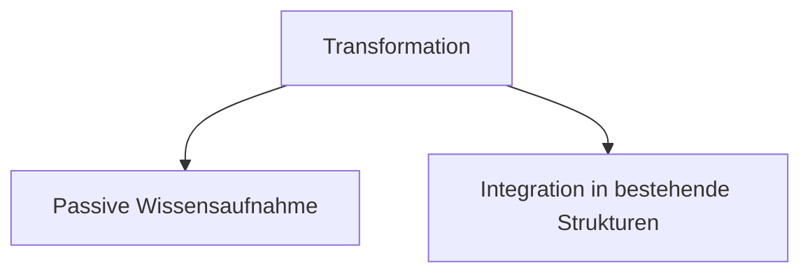
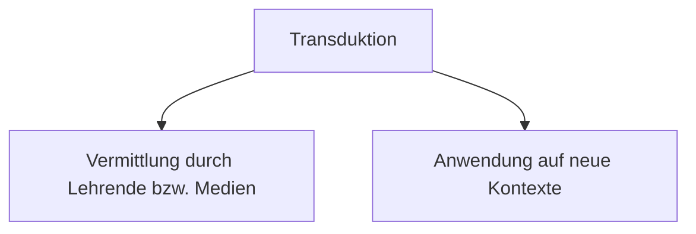
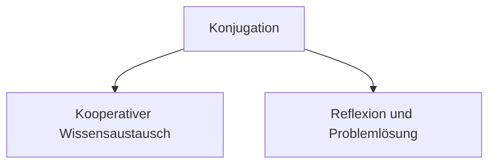

created: 24.10.2024 | updated: 03.12.2024 | [Austausch](https://lernen.jochen-hanisch.de/course/view.php?id=4) | [[Hinweise]]

# 1 Definition

Transferaktive Kompetenzentwicklung beschreibt einen prozessorientierten Ansatz zur Entwicklung von Kompetenzen, bei dem Wissen und Können durch aktive Aufnahme, Vermittlung und Austausch in dynamischen Lernprozessen erworben und weitergegeben wird. Dieser Ansatz basiert auf der Übertragung biologischer Mechanismen der horizontalen Genübertragung (Transformation, Transduktion, Konjugation) auf Bildungsprozesse.

Im Kern der transferaktiven [[Kompetenzentwicklung]] steht die Idee, dass Lernende nicht nur passiv [[Epistemosphäre|Wissen]] aufnehmen und assimilieren sowie im Prozessverlauf akkommodieren, sondern durch Interaktion, Reflexion und Kooperation aktiv in die Wissensgenerierung und -weitergabe eingebunden sind. Es umfasst die folgenden Schlüsselprozesse:

1. **Transformation**: Die passive Aufnahme von [[Epistemosphäre|Wissen]] durch individuelle Lernprozesse, wie das Lesen, Zuhören oder Beobachten von Inhalten, ähnlich der biologischen Aufnahme von genetischem Material aus der Umwelt.
   
2. **Transduktion**: Die Wissensvermittlung durch Lehrende oder Medien, bei der [[Epistemosphäre|Wissen]] strukturiert und zielgerichtet weitergegeben wird, analog zur Übertragung genetischen Materials durch Bakteriophagen.

3. **Konjugation**: Der direkte Austausch von [[Epistemosphäre|Wissen]] zwischen Lernenden in kooperativen und interaktiven Lernumgebungen, bei dem Ideen und Informationen aktiv geteilt und gemeinsam reflektiert werden, vergleichbar mit dem Zell-zu-Zell-Austausch genetischen Materials.

Dieser Ansatz betont die Bedeutung des interaktiven [[Lernen als universelles Prinzip|Lernens]] und der kollaborativen Wissensverarbeitung, die nicht nur zur Aneignung von [[Epistemosphäre|Wissen]], sondern auch zur tiefgreifenden Reflexion und Anwendung in verschiedenen Kontexten führen. Die Transferaktive Kompetenzentwicklung bietet eine innovative Grundlage für die Gestaltung flexibler und dynamischer Lernumgebungen, die den Wissenstransfer sowohl individuell als auch kollektiv fördern.
Kompetenzentwicklung kann nicht nur auf Wissen reduziert werden, der Kompetenzbegriff ist nicht trennscharf bestimmt. Wissen ist in diesem Kontext ein Anwendungsfall.

# 2 Herleitung

Die Mechanismen der horizontalen Genübertragung (HGT) beziehen sich auf biologische Prozesse, bei denen genetisches Material zwischen Organismen nicht durch Vererbung an die Nachkommen weitergegeben wird, sondern durch die direkte Aufnahme oder Übertragung von DNA zwischen verschiedenen Organismen, häufig auch zwischen unterschiedlichen Arten. Diese Mechanismen umfassen die drei Hauptprozesse **Transformation**, **Transduktion** und **Konjugation**, die es Bakterien ermöglichen, genetisches Material effizient zu transferieren und somit neue genetische Eigenschaften, wie z.B. Antibiotikaresistenzen, zu erwerben (Li et al., 2019). 

Bei der **Transformation** wird freie DNA aus der Umgebung von einer Bakterienzelle aufgenommen. Dieser Mechanismus erfordert, dass die Zelle kompetent ist, d.h., sie muss in der Lage sein, DNA aufzunehmen und in ihr Genom zu integrieren (Lu et al., 2015). Transformation ermöglicht es Bakterien, schnell neue genetische Informationen zu erwerben, die nicht durch Mutationen entstehen, sondern aus dem Genpool der umgebenden Mikroorganismen stammen.

**Transduktion** erfolgt, wenn Bakteriophagen, also Viren, die Bakterien infizieren, genetisches Material von einem Bakterium zu einem anderen übertragen. Dabei kann es sich um zufällig in den Phagen eingeschlossene DNA des Wirtsbakteriums handeln, die in eine neue Zelle eingebracht wird, wodurch diese Zelle neue genetische Informationen erhält. Dieser Mechanismus spielt eine wichtige Rolle in der Verbreitung von genetischen Eigenschaften in dicht besiedelten mikrobiellen Gemeinschaften (Wiedenbeck & Cohan, 2011).

**Konjugation** beschreibt den direkten Zell-zu-Zell-Austausch von genetischem Material, bei dem eine Donorzelle eine Plasmabrücke zur Akzeptorzelle bildet, um Plasmide zu übertragen. Plasmide sind ringförmige DNA-Moleküle, die oft für Eigenschaften wie Antibiotikaresistenzen kodieren. Konjugation ist der einzige Mechanismus, der einen physischen Kontakt zwischen den Zellen erfordert, und spielt eine Schlüsselrolle bei der schnellen Verbreitung von Resistenzen in bakteriellen Populationen (van Gestel et al., 2021).

Die Übertragung genetischen Materials durch HGT hat sich als entscheidend für die Evolution von Bakterien erwiesen, insbesondere im Hinblick auf ihre Fähigkeit, sich schnell an Umweltveränderungen anzupassen, wie z.B. den Einsatz von Antibiotika. Durch die Aufnahme und Weitergabe von resistenzkodierenden Genen können Bakterienpopulationen in kurzer Zeit Resistenzen gegen mehrere Antibiotika entwickeln, was erhebliche Auswirkungen auf die öffentliche Gesundheit hat (Li et al., 2019).

In einem bildungswissenschaftlichen Kontext können diese Mechanismen als Metapher für Wissensübertragungsprozesse herangezogen werden. Die Prozesse der Transformation, Transduktion und Konjugation bieten ein Modell, um die Dynamik der Wissensverbreitung zwischen Lernenden und Lehrenden zu beschreiben. Durch die Übertragung der biologischen Mechanismen auf Bildungsprozesse kann verdeutlicht werden, wie [[Epistemosphäre|Wissen]] passiv aufgenommen, aktiv vermittelt oder durch direkte Interaktion und Austausch zwischen den Lernenden weitergegeben wird. Diese Analogie hilft dabei, die verschiedenen Facetten des Lernens und des Wissenstransfers in verschiedenen pädagogischen Szenarien besser zu verstehen und zu analysieren.

## 2.1 Biologische Perspektive

Die Mechanismen der horizontalen Genübertragung (HGT) in der Biologie umfassen verschiedene Wege, durch die genetisches Material zwischen Organismen ausgetauscht wird, ohne dass dabei eine direkte Reproduktion stattfindet. Dieser Austausch ermöglicht es Bakterien, schnell genetische Diversifikation zu erreichen und sich an neue oder herausfordernde Umwelteinflüsse anzupassen. Ein solcher Anpassungsmechanismus ist besonders relevant in sich schnell verändernden oder stressvollen Umgebungen, wie zum Beispiel bei der Entwicklung von Antibiotikaresistenzen (Lu et al., 2015).

- **Transformation** ist der Prozess, bei dem Bakterien freie DNA aus ihrer Umgebung aufnehmen. Die aufgenommene DNA kann in das Genom der Zelle integriert werden, wodurch neue Eigenschaften auf das Bakterium übertragen werden. Diese neuen genetischen Informationen könnten beispielsweise die Resistenz gegenüber bestimmten Substanzen oder die Fähigkeit zur Nutzung neuer Stoffwechselwege beinhalten. Transformation ist ein kritischer Mechanismus, der es Bakterien ermöglicht, sich schnell an ihre Umgebung anzupassen, ohne auf Mutationen angewiesen zu sein (Li et al., 2019).

- **Transduktion** beschreibt den Vorgang, bei dem Bakteriophagen, also Viren, die Bakterien infizieren, genetisches Material von einem Bakterium auf ein anderes übertragen. Dies geschieht, wenn Bakteriophagen versehentlich DNA des Wirtsbakteriums aufnehmen und diese dann in das Genom eines neuen Wirts integrieren. Dieser Mechanismus ermöglicht es, bestimmte Gene, wie Antibiotikaresistenzgene, schnell innerhalb einer Population zu verbreiten. Besonders in Populationen, die stark von Bakteriophagen betroffen sind, kann die Transduktion eine schnelle Verbreitung von genetischen Merkmalen bewirken (Wiedenbeck & Cohan, 2011).

- **Konjugation** stellt den direkten Zell-zu-Zell-Austausch von genetischem Material dar. Dabei bildet eine Donorzelle eine Plasmabrücke zu einer Akzeptorzelle, um genetisches Material, meist Plasmide, zu übertragen. Plasmide sind kleine, ringförmige DNA-Moleküle, die häufig Gene tragen, die für Antibiotikaresistenz oder andere Überlebensvorteile verantwortlich sind. Konjugation ist der einzige Prozess der HGT, der einen direkten Kontakt zwischen den Zellen erfordert. Durch diesen Mechanismus können genetische Eigenschaften schnell in einer Population verbreitet werden, insbesondere in dicht besiedelten mikrobiellen Gemeinschaften, in denen Zellen leicht miteinander interagieren (van Gestel et al., 2021).

Die horizontale Genübertragung spielt eine Schlüsselrolle in der Evolution und Anpassung von Bakterien, insbesondere in Bezug auf die rasche Entwicklung von Resistenzen gegenüber Antibiotika. Durch diese Mechanismen können Bakterien innerhalb von Generationen genetische Eigenschaften erwerben und weitergeben, die in anderen Organismen bereits vorhanden sind. Diese Fähigkeit, genetisches Material auszutauschen, stellt einen wesentlichen Vorteil für das Überleben in herausfordernden Umweltbedingungen dar.

## 2.2 Bildungswissenschaftliche Perspektive

Die Mechanismen der horizontalen Genübertragung (HGT) bieten eine wertvolle Analogie, um Prozesse der Wissensübertragung und des Lernens in Bildungsumgebungen zu beschreiben. Die Konzepte von **Transformation**, **Transduktion** und **Konjugation** bilden eine Struktur, um zu verstehen, wie Lernende [[Epistemosphäre|Wissen]] passiv aufnehmen, es von einer Quelle vermittelt bekommen oder es aktiv untereinander austauschen und weiterentwickeln.

- **Transformation**: Im bildungswissenschaftlichen Kontext kann Transformation als der Prozess der passiven Wissensaufnahme betrachtet werden. Lernende nehmen Informationen aus ihrer Umgebung auf, sei es durch das Lesen von Büchern, das Anhören von Vorträgen oder das Konsumieren von Medien. Diese Informationen werden in die bereits bestehenden kognitiven Strukturen integriert, ähnlich wie bei der biologischen Transformation, bei der genetisches Material aus der Umgebung in das Genom einer Zelle aufgenommen wird (Wiedenbeck & Cohan, 2011). Dieser Prozess der Wissensaufnahme ist besonders in traditionellen Lernumgebungen wie Vorlesungen und Selbststudium vorherrschend, in denen die Lernenden überwiegend als passive Empfänger von Informationen agieren. Der Schlüssel liegt darin, dass die Lernenden das aufgenommene [[Epistemosphäre|Wissen]] internalisieren und in ihrem eigenen [[Epistemosphäre|Wissen]] anwenden.

- **Transduktion**: Transduktion beschreibt die aktive Wissensvermittlung durch eine Lehrperson oder ein anderes Medium. Hier fungiert der Lehrende oder das Medium als Vermittler, der [[Epistemosphäre|Wissen]] von einer Quelle zu den Lernenden transportiert, ähnlich wie ein Bakteriophage genetisches Material von einer Bakterienzelle zu einer anderen überträgt (Lu et al., 2015). Dieser Prozess ist typisch für formelle Bildungsumgebungen, in denen [[Epistemosphäre|Wissen]] gezielt und strukturiert vermittelt wird, beispielsweise in Vorlesungen, Seminaren oder durch den Einsatz von multimedialen Materialien. Der entscheidende Unterschied zur Transformation liegt in der aktiven Rolle des Lehrenden, der nicht nur Informationen weitergibt, sondern diese auch didaktisch aufbereitet, um das Verständnis der Lernenden zu fördern.

- **Konjugation**: Konjugation kann im Bildungskontext als der direkte Wissensaustausch zwischen Lernenden verstanden werden, der häufig in kollaborativen oder kooperativen Lernumgebungen stattfindet. Ähnlich wie bei der biologischen Konjugation, bei der genetisches Material direkt zwischen Zellen ausgetauscht wird, geschieht der Austausch von [[Epistemosphäre|Wissen]] durch Diskussionen, Gruppenarbeiten oder Peer-Learning. In diesen Szenarien teilen Lernende ihre Ideen, Erfahrungen und Erkenntnisse direkt miteinander, was zu einem tiefgreifenderen Verständnis und einer Erweiterung des Wissens führt (van Gestel et al., 2021). Dieser Prozess fördert nicht nur den Wissenszuwachs, sondern auch soziale und kommunikative Kompetenzen, da die Lernenden voneinander lernen und durch den Austausch von Ideen neue Perspektiven entwickeln.

Diese drei Mechanismen bieten ein umfassendes Modell, um die Dynamik von Wissensübertragungen in Bildungsumgebungen zu verstehen. Durch die Analogie zur HGT wird deutlich, dass Wissensprozesse nicht nur durch formelle Vermittlung, sondern auch durch informelle und soziale Interaktionen stattfinden. Transformation entspricht dabei der individualisierten, passiven Wissensaufnahme, Transduktion der formalen, strukturierten Wissensvermittlung durch Lehrende, und Konjugation dem interaktiven, kollaborativen Austausch von [[Epistemosphäre|Wissen]] zwischen Lernenden.

## 2.3 Soziologische Perspektive

In einem soziologischen Kontext können die Mechanismen der horizontalen Genübertragung (HGT) als nützliche Metapher zur Beschreibung der Verbreitung von Ideen, Normen und [[Epistemosphäre|Wissen]] innerhalb sozialer Netzwerke dienen. So wie genetisches Material zwischen Bakterien übertragen wird, verbreiten sich Informationen und kulturelle Werte innerhalb von Gemeinschaften und sozialen Gruppen. Diese Mechanismen bieten eine Struktur, um zu verstehen, wie [[Epistemosphäre|Wissen]] und kulturelle Normen sowohl passiv aufgenommen als auch aktiv weitergegeben und durch Interaktionen ausgetauscht werden.

- **Transformation**: In der Soziologie könnte Transformation die passive Aufnahme von [[Epistemosphäre|Wissen]], Werten und kulturellen Normen darstellen. Individuen nehmen unbewusst Informationen und Verhaltensweisen aus ihrer Umgebung auf, ohne dass eine direkte Interaktion mit einer Quelle notwendig ist. Dies könnte durch Beobachtung oder durch indirekte Einflüsse geschehen. Beispielsweise können Menschen Verhaltensweisen und Normen durch das bloße Beobachten anderer übernehmen, ohne aktiv an einem Austausch beteiligt zu sein. Diese Art der stillen Aufnahme von sozialen Werten und Normen ist besonders in großen sozialen Gruppen oder Gesellschaften relevant, in denen nicht alle Mitglieder in direktem Kontakt zueinander stehen, aber dennoch ähnliche Verhaltensmuster aufweisen (Wiedenbeck & Cohan, 2011). Hier wirkt Transformation als unsichtbare, aber wirksame Kraft der kulturellen Integration.

- **Transduktion**: Transduktion könnte als gezielte Weitergabe von [[Epistemosphäre|Wissen]], Normen oder sozialen Werten durch Institutionen oder Schlüsselpersonen interpretiert werden. In diesem Prozess agieren Lehrer, religiöse Führer, politische Autoritäten oder Medien als Vermittler, die aktiv Informationen und Werte an eine Zielgruppe weitergeben. Dieser Mechanismus entspricht der biologischen Transduktion, bei der ein Bakteriophage als Vermittler fungiert und genetisches Material von einer Zelle zur nächsten transportiert (Lu et al., 2015). In sozialen Kontexten könnte dies durch organisierte Bildungsprogramme, Medienberichterstattung oder durch öffentliche Reden geschehen, in denen Werte und Überzeugungen bewusst an eine Gemeinschaft übermittelt werden. Der strukturierte und geplante Charakter dieses Mechanismus ermöglicht eine effiziente und gezielte Verbreitung von Informationen innerhalb einer Gesellschaft.

- **Konjugation**: Konjugation wäre in sozialen Netzwerken der direkte Austausch von Ideen und Werten durch persönliche Interaktionen, Diskussionen und Peer-to-Peer-Kommunikation. Ähnlich wie bei der biologischen Konjugation, bei der genetisches Material direkt zwischen Bakterienzellen ausgetauscht wird, findet der Austausch von [[Epistemosphäre|Wissen]] und Überzeugungen in sozialen Gruppen häufig durch persönliche Gespräche, Debatten oder Gruppenaktivitäten statt. Peer-Gruppen, Netzwerke und informelle soziale Treffen bieten Plattformen für diesen direkten Austausch, bei dem Ideen nicht nur geteilt, sondern auch weiterentwickelt und verfeinert werden. Diese Form des sozialen Austauschs ist besonders dynamisch, da sie durch die direkte Interaktion zwischen Individuen geprägt ist und oft zur Entstehung neuer Ideen und gemeinsamer Werte führt (van Gestel et al., 2021).

Diese soziologische Interpretation der HGT-Mechanismen bietet eine strukturierte Perspektive auf die Verbreitung von [[Epistemosphäre|Wissen]] und Normen in sozialen Netzwerken. Transformation beschreibt die passive Aufnahme von sozialen Werten, Transduktion den strukturierten Transfer von Institutionen oder Autoritäten, und Konjugation den dynamischen Austausch von Ideen innerhalb von Peer-Gruppen. Diese Prozesse arbeiten zusammen, um [[Epistemosphäre|Wissen]] und Normen in einer Gesellschaft zu verbreiten und neue soziale Dynamiken zu schaffen.

## 2.4 Mathematische Modulation

Im Rahmen der Übertragung biologischer Mechanismen auf Bildungsprozesse ist es notwendig, die mathematischen Formeln klar und präzise zu definieren. Diese Formeln dienen dazu, die Prozesse der Transformation, Transduktion und Konjugation im Wissenskontext mathematisch zu erfassen. Jedes Formelzeichen repräsentiert dabei eine zentrale Variable oder Konstante im Prozess der Wissensaufnahme oder des Wissensaustauschs. Die folgenden Formeln wurden entwickelt, um diese Prozesse zu modellieren.

### 2.4.1 Bildungswissenschaftliche Transformation

$$
T(L) = \alpha \cdot K \cdot S
$$

- $T(L)$: Die Funktion $T(L)$ beschreibt die Transformation, also die Aufnahme von [[Epistemosphäre|Wissen]] durch Lernende ($L$). Diese Wissensaufnahme ist eine Funktion der verfügbaren Wissensmenge ($K$), der sozialen Interaktionen ($S$) und des Wirkungsgrads der Wissensübertragung ($\alpha$).
  
- $\alpha$: Der Wirkungsgrad der Wissensübertragung, der angibt, wie effektiv Wissen durch soziale Interaktionen aufgenommen wird. Ein höherer Wert von $\alpha$ bedeutet, dass das Lernen besonders effektiv ist.

- $K$: Die **verfügbare Wissensmenge**, die als Ressource zur Verfügung steht und auf die Lernende zugreifen können. Das [[Epistemosphäre|Wissen]] kann aus Büchern, Vorträgen oder Medien stammen und stellt die Basis der Transformation dar.

- $S$: Die **sozialen Interaktionen**, die den Austausch von Ideen, Fragen und Erklärungen zwischen den Lernenden beschreiben. Soziale Interaktionen erhöhen die Wahrscheinlichkeit, dass [[Epistemosphäre|Wissen]] aufgenommen und in bestehende Strukturen integriert wird.

Um diese Formel herzuleiten, betrachten wir die Wissensaufnahme als proportional zur Wissensmenge ($K$) und den sozialen Interaktionen ($S$). Die Aufnahmefähigkeit eines Lernenden hängt vom Zusammenspiel dieser beiden Faktoren und dem Wirkungsgrad ($\alpha$) ab. Daher ergibt sich:

$$
T(L) \propto K \cdot S
$$

Durch Einführung des Wirkungsgrads $\alpha$ als proportionaler Konstante, die die Effizienz des Wissensaufnahmeprozesses beschreibt, erhalten wir die vollständige Gleichung:

$$
T(L) = \alpha \cdot K \cdot S
$$
### 2.4.3 Bildungswissenschaftliche Transduktion

$$
V(L) = \beta \cdot E \cdot C
$$

- $V(L)$: Die Funktion $V(L)$ beschreibt die Transduktion, also die strukturierte Vermittlung von [[Epistemosphäre|Wissen]] an Lernende ($L$). Diese Wissensvermittlung ist eine Funktion der Effektivität der Lehrmethoden ($E$), der Klarheit der Inhalte ($C$) und des Wirkungsgrads der Wissensvermittlung ($\beta$).

- $\beta$: Der Wirkungsgrad der Wissensvermittlung, der angibt, wie effektiv Wissen durch die Lehrmethoden vermittelt wird. Ein höherer Wert von $\beta$ bedeutet, dass die Wissensvermittlung besonders effizient ist.

- $E$: Die **Effektivität der Lehrmethoden**, die beschreibt, wie gut die eingesetzten Lehrmethoden das Verständnis und die Aufnahme des vermittelten Wissens unterstützen.

- $C$: Die **Klarheit der Inhalte**, die die Verständlichkeit und Strukturierung des vermittelten Wissens beschreibt. Klarere Inhalte führen in der Regel zu einer besseren Aufnahme und Verarbeitung durch die Lernenden.

Um diese Formel herzuleiten, betrachten wir die Wissensvermittlung als proportional zur Effektivität der Lehrmethoden ($E$) und der Klarheit der Inhalte ($C$). Die Fähigkeit der Lernenden, das vermittelte Wissen aufzunehmen, hängt vom Zusammenspiel dieser beiden Faktoren und dem Wirkungsgrad ($\beta$) ab. Daher ergibt sich:

$$
V(L) \propto E \cdot C
$$

Durch Einführung des Wirkungsgrads $\beta$ als proportionaler Konstante, die die Effizienz des Wissensvermittlungsprozesses beschreibt, erhalten wir die vollständige Gleichung:

$$
V(L) = \beta \cdot E \cdot C
$$

Diese Formel für die **Transduktion** im Wissenskontext bietet eine strukturierte Möglichkeit, den Prozess der Wissensvermittlung zu quantifizieren. Sie zeigt, dass dieser Prozess stark von der Qualität der Lehrmethoden und der Klarheit der vermittelten Inhalte abhängt. Während die Transduktion die aktive Rolle der Lehrenden in der Wissensvermittlung beschreibt, betont sie auch die Bedeutung der didaktischen Aufbereitung und Strukturierung des Wissens für den Lernerfolg.

### 2.4.4 Bildungswissenschaftliche Konjugation

$$
W = \delta \cdot L \cdot M
$$

- $W$: Diese Funktion beschreibt den Wissensaustausch zwischen Lernenden, also die Konjugation. Der Austausch von [[Epistemosphäre|Wissen]] ($W$) ist abhängig von der Lernbereitschaft ($L$) und der Motivation ($M$) der Lernenden sowie dem Austauschfaktor ($\delta$).

- $\delta$: Der **Austauschfaktor**, der bestimmt, wie effizient [[Epistemosphäre|Wissen]] zwischen Lernenden ausgetauscht wird. Ein höherer Wert von $\delta$ zeigt an, dass der Wissensaustausch besonders effektiv ist, weil die Lernenden besonders kooperativ sind oder die Lernumgebung besonders förderlich ist.

- $L$: Die **Lernbereitschaft** der Lernenden, die beschreibt, wie offen und bereit sie sind, [[Epistemosphäre|Wissen]] zu teilen und von anderen zu lernen.

- $M$: Die **Motivation** der Lernenden, die eine entscheidende Rolle dabei spielt, wie engagiert und bereit sie sind, am Wissensaustausch teilzunehmen. Eine höhere Motivation führt in der Regel zu einem besseren Wissensaustausch.

Ähnlich wie bei der Transformation ist der Wissensaustausch ($W$) proportional zur Lernbereitschaft ($L$) und der Motivation ($M$). Das Produkt dieser beiden Variablen beschreibt, wie gut sich Lernende aktiv in den Wissensaustausch einbringen. Die Effizienz dieses Austauschs wird durch den Austauschfaktor ($\delta$) skaliert, der beschreibt, wie günstig die Umstände für den Austausch sind.

$$
W \propto L \cdot M
$$

Mit dem Austauschfaktor $\delta$ als proportionaler Konstante ergibt sich die vollständige Gleichung:

$$
W = \delta \cdot L \cdot M
$$

Die beiden Formeln für **Transformation** und **Konjugation** im Wissenskontext bieten eine strukturierte Möglichkeit, die Prozesse der Wissensaufnahme und des Wissensaustauschs zu quantifizieren. Sie zeigen, dass beide Prozesse stark von den individuellen Eigenschaften der Lernenden, wie deren Motivation und Lernbereitschaft, sowie den sozialen Interaktionen abhängen. Während die Transformation die passive Aufnahme von [[Epistemosphäre|Wissen]] beschreibt, ist die Konjugation auf den aktiven Austausch zwischen den Lernenden fokussiert. Beide Prozesse sind essentiell für eine tiefergehende Wissensentwicklung und Lernerfahrung.

## 2.5 Beispiele

Die Mechanismen der horizontalen Genübertragung (HGT) können als Metapher für die Wissensübertragung in Bildungsprozessen genutzt werden. Die drei Mechanismen – Transformation, Transduktion und Konjugation – beschreiben unterschiedliche Arten der Wissensaufnahme und -weitergabe. Im Folgenden werden diese Mechanismen anhand von Beispielen aus der Bildung detailliert erläutert und mit den entsprechenden biologischen Prozessen verglichen.

### 2.5.1 Transformation

Ein Lernender liest ein Lehrbuch über Physik und integriert die darin enthaltenen Informationen in sein bestehendes [[Epistemosphäre|Wissen]]. Dieser Prozess der Wissensaufnahme erfolgt ohne direkte Interaktion mit einem Lehrenden oder anderen Lernenden. Der Lernende nimmt die Informationen auf und baut sie in seine eigene kognitive Struktur ein. Dies entspricht der biologischen **Transformation**, bei der ein Bakterium freies genetisches Material aus seiner Umgebung aufnimmt und in sein Genom integriert, ohne dass ein direkter Kontakt mit einer anderen Zelle notwendig ist. Dieser passive Prozess der Informationsaufnahme ist besonders in Bildungsumgebungen verbreitet, in denen das Selbststudium eine zentrale Rolle spielt, wie es bei akademischen Studiengängen oft der Fall ist (Lu et al., 2015). Genauso wie Bakterien durch die Aufnahme von DNA aus ihrer Umgebung neue genetische Eigenschaften erwerben können, erweitert der Lernende sein [[Epistemosphäre|Wissen]] durch den Zugang zu neuen Informationen aus Büchern oder anderen Medien. Die Transformation erfolgt ohne die Notwendigkeit eines Austauschs oder einer Vermittlung durch eine andere Person, was diesen Prozess besonders individuell und unabhängig macht.

### 2.5.2 Transduktion

Lehrende erklären in einer Vorlesung die Konzepte der Quantenmechanik. Die Lernenden übernehmen die von ihm vermittelte Information direkt, ohne dass eine weitere Quelle dazwischengeschaltet ist. In diesem Fall fungieren Lehrende als Vermittler, die [[Epistemosphäre|Wissen]] strukturiert für Lernenden aufbereitet. Dieser Prozess ähnelt der biologischen **Transduktion**, bei der ein Bakteriophage genetisches Material von einer Bakterienzelle zu einer anderen transportiert (Wiedenbeck & Cohan, 2011). In der Transduktion ist der Bakteriophage der entscheidende Vermittler, der den Transfer von DNA ermöglicht, genauso wie der Lehrer in der Unterrichtssituation als entscheidender Faktor agiert, der das [[Epistemosphäre|Wissen]] strukturiert und an die Lernenden weitergibt. In Bildungsprozessen wird dieser Mechanismus oft in formalen Lehr-Lern-Umgebungen verwendet, insbesondere in Vorlesungen, Seminaren und durch multimediale Inhalte, bei denen das [[Epistemosphäre|Wissen]] gezielt und direkt vermittelt wird, ohne dass die Lernenden selbst aktiv am Wissensgenerierungsprozess teilnehmen müssen.

### 2.5.3 Konjugation 

Zwei Studierende diskutieren ein Thema in einer Arbeitsgruppe und tauschen ihre [[Erkenntnis|Erkenntnisse]] und Meinungen aus. Dieser Prozess des aktiven Austauschs von [[Epistemosphäre|Wissen]] und Ideen stellt eine direkte Interaktion zwischen den Lernenden dar, bei der beide Parteien ihre eigenen Erkenntnisse teilen und auf das [[Epistemosphäre|Wissen]] des anderen zugreifen können. Dies entspricht der biologischen **Konjugation**, bei der Bakterienzellen genetisches Material durch direkten Kontakt weitergeben. In der Konjugation wird eine Plasmabrücke zwischen den Zellen gebildet, durch die das genetische Material übertragen wird (van Gestel et al., 2021). Genauso wird beim Wissensaustausch in einer Gruppe das [[Epistemosphäre|Wissen]] durch direkte Interaktionen zwischen den Lernenden ausgetauscht. Diese Form des Lernens ist besonders in kooperativen und kollaborativen Lernumgebungen von Bedeutung, in denen Lernende voneinander profitieren, indem sie ihr [[Epistemosphäre|Wissen]] teilen und gemeinsam neue Erkenntnisse entwickeln. Der Prozess der Konjugation in der Bildung fördert nicht nur den Wissensaustausch, sondern auch die Fähigkeit der Lernenden, kritisch zu denken, Fragen zu stellen und das [[Epistemosphäre|Wissen]] ihrer Peers zu hinterfragen und zu ergänzen.

### 2.5.4 Erläuterung der Mechanismen:

1. **Transformation**:
   - Passiver Prozess der Wissensaufnahme ohne direkte Interaktion.
   - Wissensquellen wie Bücher, Vorträge oder andere Medien liefern Informationen, die der Lernende in seine kognitiven Strukturen integriert.
   - Biologische Entsprechung: Bakterien nehmen freie DNA aus der Umgebung auf und integrieren sie in ihr Genom.

2. **Transduktion**:
   - Aktiver Prozess der Wissensvermittlung durch eine Lehrperson oder ein Medium.
   - Der Lehrende strukturiert und vermittelt das [[Epistemosphäre|Wissen]] an die Lernenden, ohne dass diese aktiv am Generierungsprozess beteiligt sind.
   - Biologische Entsprechung: Bakteriophagen übertragen genetisches Material von einer Zelle zur nächsten.

3. **Konjugation**:
   - Direkter Wissensaustausch zwischen Lernenden durch Interaktion und Diskussion.
   - Beide Lernenden profitieren vom Austausch und erweitern ihr [[Epistemosphäre|Wissen]] durch direkte Interaktionen.
   - Biologische Entsprechung: Bakterienzellen tauschen genetisches Material durch direkten Zellkontakt aus.

Diese Beispiele verdeutlichen, dass die Mechanismen der HGT nicht nur in der Biologie von Bedeutung sind, sondern auch als Metaphern zur Beschreibung von Prozessen der Wissensübertragung in der Bildung herangezogen werden können. Während Transformation eine eher individuelle Form der Wissensaufnahme beschreibt, stehen bei Transduktion und Konjugation die Vermittlung und der Austausch im Vordergrund. Diese Prozesse können dazu beitragen, verschiedene Lernmethoden besser zu verstehen und zu strukturieren, indem sie die unterschiedlichen Wege der Wissensverbreitung beleuchten.

# 3 Folgerungen

Die Anwendung der Mechanismen der horizontalen Genübertragung (HGT) auf Bildungsprozesse bietet eine neue und präzisere Möglichkeit, die Dynamik des Wissenserwerbs und der Wissensweitergabe zu beschreiben. Dieser Ansatz stellt eine Weiterentwicklung im Vergleich zu traditionellen Lernziel- und Kompetenzzieldefinitionen dar, die sich auf messbare Endergebnisse konzentrierten und dabei die zugrunde liegenden Lernprozesse nur unzureichend berücksichtigten. Die biologische Analogie der HGT, speziell die Mechanismen **Transformation**, **Transduktion** und **Konjugation**, ermöglicht es, Lernprozesse auf einer detaillierten und prozessualen Ebene darzustellen.

## 3.1 Neue Perspektive auf Wissensübertragung und Lernprozesse

Die Anwendung biologischer Mechanismen wie der HGT auf Bildungsprozesse eröffnet eine neue Perspektive auf die Art und Weise, wie [[Epistemosphäre|Wissen]] erworben und weitergegeben wird. Indem diese Prozesse als systematische Mechanismen beschrieben werden, wird es möglich, die Dynamik des Wissenserwerbs, der Wissensverarbeitung und der Wissensweitergabe in Lernumgebungen besser zu verstehen. Besonders die Erkenntnis, dass [[Epistemosphäre|Wissen]] nicht nur durch direkte Lehre (Transduktion), sondern auch durch passive Aufnahme (Transformation) und durch Interaktion zwischen den Lernenden (Konjugation) erworben werden kann, hilft dabei, ein breiteres Spektrum von Lernprozessen zu erfassen (Wiedenbeck & Cohan, 2011). Diese systematische Beschreibung ermöglicht es zudem, bestehende Lernprozesse zu analysieren und gezielt zu verbessern.

## 3.2 Früherer Ansatz

Traditionell basierten Anforderungsbereiche in der Bildung auf Lernzieldefinitionen, die operationalisiert wurden, um messbare Ergebnisse zu erzielen. Diese Lernziele fokussierten stark auf das Endergebnis, etwa auf das **Wiedergeben** von Fakten oder das Anwenden von [[Epistemosphäre|Wissen]] in spezifischen Kontexten. Dabei wurde jedoch der eigentliche Prozess des [[Lernen als universelles Prinzip|Lernens]] und der Kompetenzentwicklung oft vernachlässigt.

- **Lernziele**: Die Definitionen von Lernzielen zielten primär auf das Verhalten der Lernenden ab („Die Lernenden können X wiedergeben, anwenden...“), ohne den Prozess der Wissensaufnahme oder des Wissenstransfers detailliert zu beschreiben.

- **Kompetenzziele**: Obwohl [[Kompetenzziel]]e verstärkt in den Fokus gerückt wurden, um über [[Epistemosphäre|Wissen]] und Fähigkeiten zu sprechen, gelang es ihnen nicht, den zugrunde liegenden Prozess des Wissenstransfers und der Wissensverarbeitung vollständig abzubilden. Der Fokus lag primär auf dem Endergebnis und weniger auf den Interaktionen, die zur Entwicklung von [[Epistemosphäre|Wissen]] und Können führen.

## 3.3 Neuer Ansatz: Prozessorientierte Kompetenzbeschreibung

Ein bedeutender Aspekt, der aus der durchgeführten Recherche zu bestehenden Modellen und Formulierungen von [[Kompetenzziel]]en hervorgeht, ist die Erkenntnis, dass viele wissenschaftliche Ansätze in den Bildungswissenschaften weiterhin stark auf hierarchische Strukturen von Lernzielen setzen. Ein prominentes Beispiel hierfür ist die Taxonomie von Bloom (1956), die von Anderson und Krathwohl (2001) weiterentwickelt wurde. Diese Modelle bieten eine grundlegende Klassifikation von Lernzielen, die sich auf verschiedene kognitive Stufen beziehen, angefangen von der reinen Wiedergabe von [[Epistemosphäre|Wissen]] bis hin zu höheren kognitiven Prozessen wie der Evaluation und Kreation. Diese taxonomischen Strukturen orientieren sich primär an den Ergebnissen und dem Endzustand des Lernprozesses. Lernende sollen nach diesem Ansatz in der Lage sein, bestimmte Wissensbestände abzurufen, anzuwenden und in komplexen Situationen zu reflektieren. Solche Modelle sind insbesondere in der Hochschulbildung verbreitet, da sie dabei helfen, die unterschiedlichen Anforderungen zwischen Bachelor- und Masterstudiengängen zu definieren.

Allerdings bleibt in diesen Modellen der eigentliche Prozess des Wissenstransfers und der Wissensentwicklung weitgehend unberücksichtigt. Die dynamische und interaktive Natur des Lernens, die sich oft im Austausch und in der Zusammenarbeit zwischen den Lernenden entfaltet, wird in vielen dieser klassischen Ansätze nicht explizit beschrieben. Die durchgeführte Internetrecherche zeigt deutlich, dass es nur selten explizite Ansätze gibt, die den interaktiven Charakter von Lernprozessen in der Tiefe berücksichtigen, wie es im Konzept der Transferaktiven Kompetenzentwicklung der Fall ist. Diese Ansätze konzentrieren sich in erster Linie auf die Endergebnisse, wie die Beherrschung spezifischer Fähigkeiten oder das erfolgreiche Absolvieren von Prüfungen, ohne den zugrunde liegenden Lernprozess ausführlich zu beleuchten.

In diesem Zusammenhang stellt der Ansatz der Transferaktiven Kompetenzentwicklung eine wichtige Ergänzung dar, da er nicht nur die Ergebnisse, sondern auch die Prozesse des Lernens in den Vordergrund rückt. Dieser Ansatz berücksichtigt, dass Lernen nicht linear verläuft und nicht nur aus dem Erwerb von [[Epistemosphäre|Wissen]] besteht, sondern auch durch den fortlaufenden Austausch, die Reflexion und die Anwendung des Gelernten in verschiedenen Kontexten geprägt ist. Besonders wertvoll ist dabei die Einführung einer prozessualen Sprache, die den gesamten Lernvorgang beschreibt und nicht nur das Endergebnis fokussiert.

Abbildung 1 zeigt den Transformationsprozess, in dem [[Epistemosphäre|Wissen]] passiv aufgenommen wird und in bestehende Strukturen integriert werden kann. Die passive Wissensaufnahme markiert den Beginn der Kompetenzentwicklung und führt zur ersten Phase der Kompetenzentwicklung, welche grundlegendes Verständnis und Basisfähigkeiten umfasst.

Komponenten:

- Passive Wissensaufnahme: Initialer Schritt zur Kompetenzentwicklung.
- Integration in bestehende Strukturen: Verankert neues [[Epistemosphäre|Wissen]] in bestehenden Wissens- und Handlungssystemen.

*Abbildung 1: Erste Phase der Kompetenzentwicklung: Transformation (eig. Darstellung)*

Abbildung 2 beschreibt den Transduktionsprozess, der die Vermittlung durch Lehrende und die Anwendung auf neue Kontexte umfasst. Diese Phase fördert die aktive Auseinandersetzung mit [[Epistemosphäre|Wissen]] und dessen Umsetzung. Die Vermittlung durch Lehrende führt zur zweiten Phase der Kompetenzentwicklung, die vertieftes [[Epistemosphäre|Wissen]] und erweiterte Fähigkeiten hervorbringt, während die Anwendung auf neue Kontexte für Transfer und Anpassung sorgt.

Komponenten:

- Vermittlung durch Lehrende: Ermöglicht strukturiertes Lernen und fördert vertiefte Fähigkeiten.
- Anwendung auf neue Kontexte: Unterstützt die Übertragbarkeit und den flexiblen Einsatz des Wissens.

*Abbildung 2: Zweite Phase der Kompetenzentwicklung: Transduktion (eig. Darstellung)*

In Abbildung 3 wird der Konjugationsprozess dargestellt, in dem [[Epistemosphäre|Wissen]] durch kooperativen Wissensaustausch und Reflexion und Problemlösung weiterentwickelt wird. Diese interaktive Wissensverarbeitung führt zur dritten Phase der Kompetenzentwicklung, in der hohe Eigenständigkeit und Problemlösungsfähigkeiten gefördert werden.

Komponenten:

- Kooperativer Wissensaustausch: Fördert die gemeinsame Wissenskonstruktion und unterstützt das Lernen durch Diskussion und Zusammenarbeit.
- Reflexion und Problemlösung: Stärkt die Fähigkeit, [[Epistemosphäre|Wissen]] kritisch zu analysieren und auf neue Herausforderungen anzuwenden.

*Abbildung 3: Dritte Phase der Kompetenzentwicklung: Konjugation (eig. Darstellung)*

Durch die Übertragung der biologischen Mechanismen der HGT auf Bildungsprozesse wird nicht nur das **Endergebnis** von Lernprozessen betrachtet, sondern auch die **Prozessebene**, die zeigt, **wie** [[Epistemosphäre|Wissen]] aufgenommen, vermittelt und ausgetauscht wird. Dies ermöglicht eine detailliertere und dynamischere Beschreibung von Kompetenzentwicklung.

- **Prozessorientierte Kompetenzbeschreibung**: Der Ansatz beschreibt nicht nur das Endprodukt, sondern auch die Art und Weise, wie [[Epistemosphäre|Wissen]] durch unterschiedliche Formen der Interaktion entwickelt und weitergegeben wird. Die Mechanismen der **Transformation** (Wissensaufnahme), **Transduktion** (Wissensvermittlung) und **Konjugation** (Wissensaustausch) bieten eine klare Struktur, um die Prozesse zu verstehen, die zur Entwicklung von Kompetenzen führen.

- **Mehrdimensionale Kompetenzdarstellung**: Der Ansatz erlaubt es, die Kompetenzentwicklung als einen dynamischen Prozess zu beschreiben, der den ständigen Austausch und die Verarbeitung von [[Epistemosphäre|Wissen]] betont. Dadurch wird deutlich, dass Lernende nicht nur [[Epistemosphäre|Wissen]] passiv aufnehmen, sondern aktiv in den Austausch mit Lehrenden und Peers eingebunden sind, wodurch sie ihr [[Epistemosphäre|Wissen]] vertiefen und erweitern können.

Durch die Berücksichtigung dieser Mechanismen wird eine dynamische und interaktive Perspektive auf Lernprozesse eröffnet, die über die klassischen taxonomischen Modelle hinausgeht. Die Transferaktive Kompetenzentwicklung bietet eine neue, prozessuale Ebene, die es ermöglicht, Lernprozesse tiefgreifender zu verstehen und zu fördern.

## 3.3.1 Matrix zur Zuordnung der Mechanismen der HGT zu den Anforderungsbereichen

Durch die Zuordnung der Mechanismen der HGT zu den traditionellen Anforderungsbereichen (I, II, III) wird eine systematische und flexible Darstellung von Lernprozessen ermöglicht. Diese Matrix zeigt, wie die biologischen Mechanismen auf verschiedene Lernniveaus angewendet werden können, und betont die unterschiedlichen Arten der Wissensübertragung und -anwendung in verschiedenen Bildungsbereichen.

|                    | Anforderungsbereich I (Reproduktion von Wissen)                                                                      | Anforderungsbereich II (Anwenden von Wissen)                       | Anforderungsbereich III (Reflexion und Transfer)                                          |
| ------------------ | ----------------------------------------------------------------------------------------------------------------------- | --------------------------------------------------------------------- | -------------------------------------------------------------------------------------------- |
| **Transformation** | Aufnahme von Wissen durch passives Lesen oder Hören (ähnlich der biologischen Aufnahme von DNA aus der Umwelt)          | Selbstständige Anwendung des aufgenommenen Wissens auf neue Kontexte  | Reflexion der Auswirkungen des Wissens und dessen Integration in vorhandene Strukturen       |
| **Transduktion**   | Weitergabe von Wissen durch Lehrende oder Medien (analog zur Rolle des Bakteriophagen in der Genübertragung)            | Übertragung des gelernten Wissens auf vergleichbare Situationen       | Reflexion über die Wirksamkeit der Wissensvermittlung und Anpassung an verschiedene Kontexte |
| **Konjugation**    | Direkter Austausch von Wissen zwischen Lernenden (vergleichbar mit dem Zell-zu-Zell-Austausch von genetischem Material) | Zusammenarbeit in Gruppen, um Probleme zu lösen und Wissen anzuwenden | Komplexe Aufgaben durch kollaborative Problemlösung und gegenseitige Reflexion bewältigen    |

Die Matrix visualisiert die Prozesse, die in den jeweiligen Anforderungsbereichen stattfinden, und ermöglicht eine **dynamische Prozessanalyse**. Dies unterscheidet sich vom traditionellen Ansatz, bei dem Lernziele lediglich auf das **Endergebnis** fokussiert waren. Durch die Darstellung der Lernprozesse als Interaktionen zwischen Lernenden und Lehrenden wird deutlich, dass der Wissensfluss nicht linear ist, sondern vielfältige Dimensionen umfasst.

- **Flexibilität**: Die Matrix zeigt, dass die Mechanismen nicht starr einem bestimmten Anforderungsbereich zugeordnet sind. Vielmehr lässt sie dynamische Übergänge und Interaktionen zu, die in verschiedenen Lehrformaten und Lernumgebungen relevant sind. Dies erlaubt eine differenzierte Analyse von Lernprozessen und eröffnet neue Wege zur Optimierung des Wissenstransfers (Lu et al., 2015).

- **Förderung von Interaktion und Reflexion**: Besonders der Mechanismus der Konjugation, der den direkten Wissensaustausch zwischen Lernenden beschreibt, fördert interaktive Lernformen wie Gruppenarbeiten und Peer-Learning. Dieser Mechanismus trägt zur Entwicklung von **Reflexionskompetenzen** bei, da Lernende durch den Austausch und die Diskussion mit anderen nicht nur [[Epistemosphäre|Wissen]] teilen, sondern auch ihre eigenen Lernprozesse hinterfragen und verbessern können (van Gestel et al., 2021).

- **Strukturierte Kompetenzentwicklung**: Durch die prozessorientierte Betrachtung von Lernprozessen ermöglicht die Matrix eine strukturierte Beschreibung der Kompetenzentwicklung. Sie beschreibt nicht nur das, **was** Lernende erreichen sollen, sondern auch, **wie** sie dies durch verschiedene Arten des Wissensflusses erreichen können. Dies fördert ein tiefes Verständnis der Lernprozesse und ihrer Bedeutung für die langfristige Entwicklung von Kompetenzen.

## 3.3.2 Flexibilität der Metapher in verschiedenen Lernkontexten

Ein besonders wertvoller Aspekt dieser Metapher ist ihre Flexibilität. Die Mechanismen von Transformation, Transduktion und Konjugation lassen sich auf eine Vielzahl von Lehrformaten und Lernumgebungen anwenden. Diese Mechanismen können sowohl in formalen Bildungsstrukturen wie Schulen und Universitäten als auch in informellen Lernumgebungen, wie Peer-Learning-Gruppen oder Online-Kursen, beobachtet werden. Die Metapher unterstützt dabei das Verständnis dafür, dass [[Epistemosphäre|Wissen]] auf unterschiedliche Weise erworben und weitergegeben wird, je nach der jeweiligen Lehr-Lern-Situation. So wird es möglich, den Wissenstransfer in verschiedenen sozialen Kontexten besser zu analysieren und zu verstehen (van Gestel et al., 2021).

Der Übergang von einer **ergebnisorientierten** zu einer **prozessorientierten** Kompetenzbeschreibung stellt einen bedeutenden Fortschritt in der Bildungswissenschaft dar. Die Integration der Mechanismen der horizontalen Genübertragung in die Beschreibung von Lernprozessen ermöglicht eine präzisere und tiefere Darstellung des Wissenstransfers. Diese dynamische Kompetenzdarstellung berücksichtigt nicht nur das Endergebnis, sondern auch die vielfältigen Prozesse, die zur Entwicklung von [[Epistemosphäre|Wissen]] und Können führen. Der biologische Modellansatz bietet dabei eine nachvollziehbare und systematische Grundlage für die Beschreibung und Analyse von Lernprozessen in verschiedenen Bildungsumgebungen.

Die Überlegung, Lernziele, Lehrziele und [[Kompetenzziel]]e in einem kohärenten System koexistieren zu lassen, schafft eine neue, differenzierte Herangehensweise an Bildungsprozesse. Hierbei wird vorgeschlagen, dass Lernziele und Lehrziele weiterhin in hierarchischer Form gestaltet werden können, um die Vermittlung und den Erwerb von [[Epistemosphäre|Wissen]] sowie die Entwicklung spezifischer Fähigkeiten zu unterstützen. Solche Ziele folgen bewährten Modellen, wie der Taxonomie von Bloom, die Lernprozesse entlang kognitiver Stufen strukturiert und dadurch klar definierte Ergebnisse anstrebt. Diese hierarchische Ordnung bietet einen Rahmen für das Verstehen, Anwenden und Evaluieren von [[Epistemosphäre|Wissen]] und schafft klare, nachvollziehbare Fortschritte im Lernprozess.

Ergänzt wird dieses hierarchische System durch eine prozessuale Betrachtung von [[Kompetenzziel]]en, die den dynamischen, fortlaufenden Charakter des Lernens betonen. Kompetenzziele, die auf der Grundlage der Mechanismen der horizontalen Genübertragung (Transformation, Transduktion, Konjugation) formuliert sind, eröffnen eine neue Sprache für Bildungsprozesse, indem sie den aktiven Austausch von [[Epistemosphäre|Wissen]], die Reflexion sowie die Anwendung in verschiedenen Kontexten in den Vordergrund rücken. Während Lernziele und Lehrziele auf klar definierte Wissensniveaus und Fähigkeiten abzielen, werden Kompetenzziele als kontinuierlicher Prozess der Wissensentwicklung und -weitergabe verstanden. Durch diese Prozesshaftigkeit wird der interaktive, soziale und kooperative Charakter des Lernens hervorgehoben, der insbesondere in kollaborativen und problemorientierten Lernumgebungen eine zentrale Rolle spielt.

Diese Verbindung schafft ein ausgewogenes Verhältnis zwischen strukturiertem Wissensaufbau und flexibler Wissensanwendung. Sie ermöglicht eine friedliche Koexistenz von Zielen, die auf Wissensvermittlung und Kompetenzentwicklung abzielen, und integriert sowohl hierarchische als auch prozessuale Elemente in ein harmonisches, bildungswissenschaftliches Gleichgewicht. Dieser Ansatz trägt dazu bei, ein umfassenderes Verständnis von Lernprozessen zu entwickeln, indem er sowohl den Input (Lernziele und Lehrziele) als auch den Prozess (Kompetenzziele) berücksichtigt. Er fördert die Entwicklung ganzheitlicher Bildungsmodelle, die sowohl den individuellen Fortschritt als auch die kooperative Wissensgenerierung unterstützen und dabei die natürliche Dynamik von Lernprozessen reflektieren.

# 4 Implikationen

Die Übertragung der Mechanismen der horizontalen Genübertragung (HGT) auf Bildungsprozesse birgt weitreichende Implikationen für die Gestaltung von Lernumgebungen, die Entwicklung neuer Lehrmethoden und die Förderung kollaborativer Lernprozesse. Durch die Integration dieser Mechanismen in Bildungskontexte wird ein tieferes Verständnis der Wissensdynamik und der Interaktionen zwischen Lernenden und Lehrenden ermöglicht. Gleichzeitig ergeben sich Herausforderungen, die bei der Implementierung dieses Ansatzes berücksichtigt werden müssen, um sicherzustellen, dass alle Lernenden gleichermaßen von diesen Erkenntnissen profitieren.

## 4.1 Flexibilisierung von Lernumgebungen

  Die Anwendung der HGT-Mechanismen auf Bildungsprozesse könnte dazu führen, dass Lernumgebungen flexibler gestaltet werden, um verschiedene Lernstile und Formen des Wissensaustauschs zu unterstützen. In formalen Bildungssettings wie Schulen und Universitäten könnte dies die Entwicklung dynamischerer Lehrformate und interaktiver Lernmethoden ermöglichen. Auch in informellen Lernkontexten wie Online-Communities oder Peer-Learning-Gruppen könnten die Mechanismen der Transformation, Transduktion und Konjugation angewendet werden, um den Wissensfluss zu optimieren. Der Mechanismus der Transformation könnte beispielsweise genutzt werden, um Lernumgebungen zu schaffen, die auf passive Wissensaufnahme und Selbststudium ausgelegt sind, während Konjugation als Modell für den direkten Austausch von [[Epistemosphäre|Wissen]] in Gruppenarbeiten oder Diskussionsrunden dienen könnte. Diese Flexibilität würde es ermöglichen, Lernprozesse individueller auf die Bedürfnisse der Lernenden abzustimmen, was zu einer höheren Lernmotivation und besseren Ergebnissen führen könnte (Lu et al., 2015).

## 4.2 Entwicklung neuer Lehrmethoden

  Die Erkenntnisse aus der Übertragung der HGT-Mechanismen auf Bildungsprozesse könnten auch zur Entwicklung neuer Lehrmethoden führen. Diese würden den Fokus stärker auf den Wissensaustausch zwischen Lernenden legen und kollaborative Lernansätze in den Vordergrund rücken. Insbesondere der Mechanismus der Konjugation, der den direkten Austausch von [[Epistemosphäre|Wissen]] zwischen Individuen beschreibt, könnte als Vorbild für projektbasierte Lernmethoden dienen, bei denen Lernende gemeinsam an komplexen Aufgaben arbeiten und ihr [[Epistemosphäre|Wissen]] in Echtzeit austauschen und anwenden. Kollaborative Ansätze würden durch ein tieferes Verständnis der interaktiven Wissensübertragung gefördert, und Lehrmethoden könnten gezielt darauf ausgerichtet werden, diese Interaktionen zu stimulieren. Dies könnte die Lernenden dazu anregen, nicht nur [[Epistemosphäre|Wissen]] zu erwerben, sondern es auch aktiv mit anderen zu teilen und zu reflektieren, wodurch ein tiefergehendes Verständnis des Lernstoffs entsteht (van Gestel et al., 2021).

## 4.3 Risiken und Herausforderungen bei der Umsetzung

Ein potenzielles Risiko bei der Anwendung der HGT-Mechanismen auf Bildungsprozesse besteht darin, dass nicht alle Lernenden gleichermaßen Zugang zu den Ressourcen und Möglichkeiten haben, um aktiv am Wissenstransfer teilzunehmen. Insbesondere in heterogenen Klassen oder Gruppen, in denen die Lernenden unterschiedliche Vorkenntnisse oder Kompetenzen besitzen, könnte es zu Ungleichheiten im Wissensaustausch kommen. Lernende, die über weniger Erfahrung oder weniger Zugang zu Lernressourcen verfügen, könnten in diesen prozessorientierten Ansätzen benachteiligt werden, da sie möglicherweise nicht in der Lage sind, das [[Epistemosphäre|Wissen]] so effektiv zu erwerben oder weiterzugeben wie ihre Peers. Diese potenziellen Ungleichheiten machen es notwendig, Maßnahmen zu entwickeln, die sicherstellen, dass alle Lernenden gleichermaßen in den Lernprozess einbezogen werden. Es sollten unterstützende Strukturen geschaffen werden, die den Zugang zu Lernressourcen und -möglichkeiten verbessern, um sicherzustellen, dass der Wissenstransfer in allen Lernumgebungen erfolgreich ist (Wiedenbeck & Cohan, 2011).

Die Übertragung der biologischen Mechanismen der horizontalen Genübertragung auf Bildungsprozesse hat das Potenzial, Lernumgebungen flexibler und effektiver zu gestalten. Diese neuen Ansätze könnten zu einer Anpassung der Lehrmethoden führen, die den Wissenstransfer zwischen Lernenden und Lehrenden, aber auch unter den Lernenden selbst, verbessern. Insbesondere kollaborative Lernformen könnten durch die Förderung von direktem Wissensaustausch und gemeinsamer Reflexion profitieren. Gleichzeitig müssen jedoch Maßnahmen ergriffen werden, um sicherzustellen, dass alle Lernenden gleiche Chancen erhalten, an diesen Wissensprozessen teilzunehmen, und dass keine Ungleichheiten im Zugang zu Ressourcen entstehen.

# 5 Zusammenfassung

Die Mechanismen der horizontalen Genübertragung (HGT), bestehend aus Transformation, Transduktion und Konjugation, bieten eine nützliche und präzise Metapher zur Beschreibung von Wissensübertragungsprozessen in Bildungsumgebungen. Diese biologischen Prozesse können auf Bildungsprozesse übertragen werden, um zu erklären, wie [[Epistemosphäre|Wissen]] von Lernenden passiv aufgenommen (Transformation), durch Lehrende vermittelt (Transduktion) und in kollaborativen Lernprozessen aktiv zwischen Lernenden ausgetauscht wird (Konjugation). Die Übertragung dieser Mechanismen auf den Bildungsbereich ermöglicht ein tiefgehendes Verständnis der Dynamik von Lernprozessen, indem sowohl individuelle Wissensaufnahme als auch der interaktive Wissensaustausch betrachtet werden.

## 5.1 Vorteile der Anwendung der HGT-Mechanismen

1. **Erweiterte Perspektive auf Lernprozesse** 
   Durch die Berücksichtigung der HGT-Mechanismen wird nicht nur das Endergebnis des Lernens betrachtet, sondern auch der Prozess, durch den Wissen entwickelt und weitergegeben wird. Dies führt zu einer genaueren Darstellung des Wissenstransfers und der Wissensverarbeitung in verschiedenen Bildungsumgebungen. Lernprozesse werden so als dynamische und interaktive Vorgänge verstanden, die über die reine Wissensreproduktion hinausgehen und den Lernenden aktiv in die Wissensgenerierung und -weitergabe einbeziehen.

2. **Optimierung von Lehrmethoden** 
   Lehrmethoden können durch das Verständnis dieser Mechanismen verbessert werden, insbesondere in Bezug auf die Förderung des Wissensaustauschs zwischen Lernenden. Der Mechanismus der Konjugation, der den direkten Wissensaustausch beschreibt, zeigt das Potenzial kollaborativer und projektbasierter Lernmethoden auf, die den aktiven Austausch und die Reflexion von Wissen unterstützen. Dieser Ansatz fördert Lernumgebungen, in denen Lernende nicht nur passiv Wissen aufnehmen, sondern durch Interaktion und Zusammenarbeit ein tieferes Verständnis des Stoffes entwickeln.

3. **Flexibilität und Anpassungsfähigkeit von Lernumgebungen**
   Die Anwendung der HGT-Mechanismen ermöglicht die Gestaltung flexibler und dynamischer Lernumgebungen, die sowohl individuelle Lernstile als auch kollektive Lernprozesse unterstützen. Dies betrifft sowohl formale Bildungssettings, wie Schulen und Universitäten, als auch informelle Lernkontexte, wie Online-Communities und Peer-Learning-Gruppen. Der Mechanismus der Transformation kann genutzt werden, um Lernenden individuelle, selbstgesteuerte Lernmöglichkeiten zu bieten, während Konjugation kollaboratives Lernen durch interaktive Formate fördert.

## 5.2 Einführung einer neuen Sprache für Kompetenzziele

Durch die Anwendung der Mechanismen der horizontalen Genübertragung (HGT) wird nicht nur eine neue Perspektive auf Lernprozesse eröffnet, sondern auch eine sprachlich präzise Darstellung von [[Kompetenzziel]]en ermöglicht. Anstatt abstrakte Lernziele zu formulieren, die sich lediglich auf das Endergebnis konzentrieren, erlaubt die HGT-Metapher eine prozessuale und dynamische Beschreibung, bei der der tatsächliche Lernvorgang im Mittelpunkt steht. Dabei wird die Entwicklung von Kompetenzen als ein aktiver und fortlaufender Prozess betrachtet, der durch verschiedene Interaktionen geformt wird.

- **Transformation** beschreibt den Wissensaufnahmeprozess, der im ersten Anforderungsbereich (Wiedergeben von Fakten und Grundkenntnissen) besonders relevant ist. Lernende erwerben und integrieren neues Wissen durch passive Aufnahme aus externen Quellen, was die erste Phase der Kompetenzentwicklung darstellt. Dieser Prozess ist nicht nur auf die Reproduktion von Wissen beschränkt, sondern bildet die Grundlage für spätere Anwendungen und Reflexionen.

- **Transduktion** bietet eine präzise Beschreibung der Vermittlung und Anwendung von Wissen, indem sie den zweiten Anforderungsbereich (Anwenden von Wissen auf neue Kontexte) abdeckt. Lehrende oder Medien agieren als aktive Vermittler, die Wissen strukturieren und den Lernenden zugänglich machen, damit dieses in verschiedenen Kontexten genutzt werden kann. In diesem Stadium wird das Wissen nicht nur aufgenommen, sondern auch in neue Situationen übertragen und angewendet, was den Lernenden ermöglicht, tiefer in die Materie einzutauchen und Verbindungen zu unterschiedlichen Kontexten herzustellen.

- **Konjugation** beschreibt den direkten Austausch und die Reflexion von Wissen im dritten Anforderungsbereich (Reflektieren, Transfer und Problemlösung). Lernende tauschen sich in kooperativen Lernumgebungen aktiv über ihr Wissen aus, hinterfragen ihre eigenen Lernprozesse und entwickeln gemeinsam neue Lösungsansätze. Dieser Prozess fördert nicht nur die Problemlösungsfähigkeiten, sondern auch die Fähigkeit zur kritischen Reflexion und Anwendung des Gelernten auf komplexe Sachverhalte. Die Interaktivität zwischen den Lernenden steht hier im Vordergrund, und die gemeinsame Wissensentwicklung führt zu einem tieferen Verständnis und zur nachhaltigen Kompetenzentwicklung.

Der prozessuale Aspekt der Kompetenzentwicklung wird durch die HGT-Mechanismen klar hervorgehoben: Lernprozesse sind nicht linear, sondern dynamisch und interaktiv. Kompetenzziele werden nicht nur anhand dessen definiert, was Lernende am Ende wissen oder können sollen, sondern auch durch die Art und Weise, wie sie Wissen,  Können und Bereitschaft erwerben, anwenden und reflektieren. Dieser Ansatz bietet eine klarere und präzisere Sprache zur Beschreibung von Kompetenzzielen, die den gesamten Lernprozess abbildet und nicht nur die Endergebnisse betrachtet.

## 5.3 Fazit

Die Übertragung der biologischen Mechanismen auf den Bildungsbereich ermöglicht nicht nur eine verbesserte Gestaltung von Lernumgebungen, sondern schafft auch eine sprachlich präzise Grundlage für die Beschreibung von Kompetenzzielen. Durch die Integration von Transformation, Transduktion und Konjugation in die Beschreibung von Lernprozessen wird deutlich, dass Kompetenz nicht nur als Endprodukt betrachtet werden sollte, sondern als dynamischer und prozessualer Vorgang, der sich durch verschiedene Interaktionen entwickelt. Diese neue Sprache für Kompetenzziele bietet die Möglichkeit, Lernprozesse sowohl individuell als auch kooperativ zu optimieren und gezielt auf die unterschiedlichen Bedürfnisse und Lernstile der Lernenden einzugehen.

# Quelle(n)

- Li, B., Qiu, Y., Song, Y., Lin, H., & Yin, H. (2019). Dissecting horizontal and vertical gene transfer of antibiotic resistance plasmid in bacterial community using microfluidics. *Environmental International*, 131, 105007. https://doi.org/10.1016/j.envint.2019.105007
- Lu, N., Massoudieh, A., Liang, X., Kamai, T., Zilles, J. L., & Nguyen, T. H. (2015). A kinetic model of gene transfer via natural transformation of *Azotobacter vinelandii*. *Journal of Hazardous Materials*, 363–368.
- van Gestel, J., Bareia, T., Tennenbaum, B., Dal Co, A., Guler, P., Aframian, N., & Ackermann, M. (2021). Short-range quorum sensing controls horizontal gene transfer at micron scale in bacterial communities. *Nature Communications*, 12(1), 2324. https://doi.org/10.1038/s41467-021-22649-4
- Wiedenbeck, J., & Cohan, F. M. (2011). Origins of bacterial diversity through horizontal genetic transfer and adaptation to new ecological niches. *FEMS Microbiology Reviews*, 35(5), 957–976. https://doi.org/10.1111/j.1574-6976.2011.00292.x
