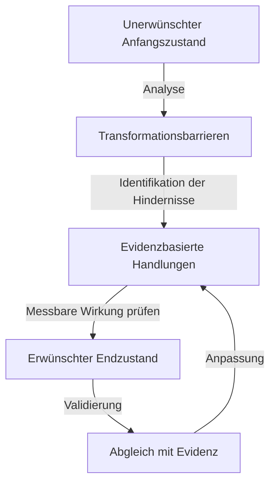

created: 17.11.2024 | [updated](https://git.jochen-hanisch.de/jochen-hanisch/research/): 18.11.2024 | publishd:  | [Austausch](https://lernen.jochen-hanisch.de/course/view.php?id=4) | [[Hinweise]]

# Einleitung

Die Anwendung von Algorithmen und Checklisten ist etablierter Standard in der Notfallmedizin. Diese Instrumente bieten Handlungsanweisungen, die sowohl unerfahrenen als auch erfahrenen Rettungskräften eine strukturierte Entscheidungsfindung ermöglichen. Sie reduzieren die kognitive Belastung in stressigen Situationen und tragen zur Standardisierung bei (Koivisto et al., 2020). Dennoch werden Algorithmen und Checklisten zunehmend kritisch hinterfragt. Ihre Starrheit und die Abhängigkeit von klar definierten Bedingungen machen sie in dynamischen oder unvorhersehbaren Situationen anfällig für Ineffizienzen und Fehlentscheidungen (Schmidt et al., 2018).

Als Reaktion auf diese Herausforderungen wird der wirkungskriterienbasierte Ansatz diskutiert. Dieses Modell basiert auf systemtheoretischen Prinzipien wie Feedback, Reflexion und Re-Entry, die eine kontinuierliche Anpassung von Entscheidungen an die jeweilige Situation ermöglichen. Der Ansatz verspricht eine größere Flexibilität und Patientenzentrierung, da Entscheidungen nicht durch vorgegebene Pfade, sondern durch die messbare Wirkung von Maßnahmen gesteuert werden.

Die vorliegende Notiz untersucht die zentralen Erkenntnisse zu diesem Ansatz, beschreibt den Entwicklungsprozess detailliert und diskutiert die Implikationen für Theorie und Praxis in der Notfallmedizin. Dabei werden sowohl die theoretischen Grundlagen als auch mögliche praktische Anwendungen beleuchtet, um die Potenziale des wirkungskriterienbasierten Ansatzes umfassend darzustellen.

# 1 Definition

Der wirkungskriterienbasierte Ansatz beschreibt ein dynamisches Entscheidungsmodell, das sich auf evidenzbasierte Kriterien stützt. Diese Kriterien messen die unmittelbare Wirkung medizinischer Maßnahmen und dienen als Grundlage für die kontinuierliche Anpassung der Handlungsstrategie. Im Zentrum steht nicht das mechanische Abarbeiten vorgegebener Prozesse, sondern die Fähigkeit, flexibel auf die Dynamik individueller Situationen zu reagieren. 

Im Gegensatz zu Algorithmen, die in festgelegter Reihenfolge abgearbeitet werden, oder Checklisten, die einzelne Aspekte einer Versorgung absichern, legt der wirkungskriterienbasierte Ansatz den Fokus auf die Wirkung einer Maßnahme. Dies geschieht durch die kontinuierliche Überprüfung, ob eine durchgeführte Intervention den gewünschten Zustand erreicht hat oder eine Anpassung erforderlich ist.

Der Ansatz basiert auf den Konzepten von Feedback, Reflexion und Re-Entry:

- **Feedback:** Sofortige Rückmeldung zur Wirkung einer Maßnahme, z. B. über physiologische Parameter wie etCO₂, Blutdruck oder Pulsfrequenz. 
- **Reflexion:** Analyse der Rückmeldung zur Anpassung der nächsten Entscheidung. 
- **Re-Entry:** Integration der Erkenntnisse in den laufenden Prozess, wodurch dynamische Anpassungen ermöglicht werden. 

Die Anwendung dieses Ansatzes in der Notfallmedizin zielt darauf ab, die Patientensicherheit zu erhöhen und gleichzeitig die Kompetenz des medizinischen Personals zu fördern. Statt auf starren Abläufen basiert der Ansatz auf der Fähigkeit, sich flexibel an unvorhersehbare und komplexe Situationen anzupassen. Diese Patientenzentrierung trägt dazu bei, Entscheidungen kontextsensitiv zu gestalten und klinische Intuition zu entwickeln.

Ein Merkmal des Ansatzes ist die Reduktion der Entscheidungsstufen. Während Algorithmen oft zahlreiche Abzweigungen und Optionen umfassen, werden im wirkungskriterienbasierten Modell die notwendigen Schritte minimiert. Dies führt zu einer geringeren kognitiven Belastung und erlaubt eine schnellere sowie effektivere Versorgung.

Zusammenfassend kann der wirkungskriterienbasierte Ansatz als ein paradigmatischer Wechsel in der Entscheidungsfindung angesehen werden, der die Grenzen starrer Protokolle überwindet. Er fordert eine Umstellung in der Ausbildung und Praxis, bietet jedoch langfristig nachhaltige Vorteile für Patient\*innen und medizinisches Fachpersonal.

# 2 Herleitung

Die Herleitung des wirkungskriterienbasierten Ansatzes erfolgt aus der Analyse bestehender Entscheidungsmodelle in der Notfallmedizin und der Identifikation ihrer Limitationen. Insbesondere Algorithmen und Checklisten stehen im Fokus der Betrachtung, da sie trotz ihrer weitverbreiteten Anwendung und ihrer Bedeutung für standardisierte Abläufe in dynamischen und komplexen Situationen häufig an ihre Grenzen stoßen.

Um die Nachteile starrer Protokolle zu überwinden, wurden systemtheoretische Konzepte wie Feedback, Reflexion und Re-Entry integriert. Diese ermöglichen eine dynamische Anpassung an die individuellen Anforderungen von Patient\*innen und Situationen. Die Herleitung basiert zudem auf der Erkenntnis, dass evidenzbasierte Kriterien die Grundlage für fundierte und flexible Entscheidungen bilden können (Chiu et al., 2021). Der zentrale Wirkmechanismus des wirkungskriterienbasierten Ansatzes liegt in der Steuerung von Handlungen durch ihre tatsächliche Wirkung. Die Kernidee basiert darauf, dass anders als Algorithmen, die auf festen Pfaden und dichotomen Entscheidungen, der wirkungskriterienbasierte Ansatz auf eine dynamische Steuerung von Handlungen setzt, die sich direkt an den (operationalisierten) messbaren Wirkungen orientieren. Im Gegensatz zu starren Protokollen, die vorgegebene Abläufe und Entscheidungspfade festlegen, basiert dieser Ansatz auf einer dynamischen Anpassung an die Situation:

1. **Flexibilität:** 
   - Handlungen werden nicht in einer vorbestimmten Reihenfolge durchgeführt, sondern abhängig davon, welche Maßnahme die größte Wirkung zeigt.
   - Beispiel: Bei einer Hypoxie wird zunächst die FiO₂ erhöht. Falls die Wirkung unzureichend bleibt, wird die nächste Maßnahme, wie die Erhöhung des PEEP, geprüft.
2. **Iterative Prozesse:**
   - Jede Handlung wird auf ihre messbare Wirkung hin überprüft (z. B. SpO₂-Anstieg, etCO₂-Wert).
   - Basierend auf dieser Evaluation werden entweder die gleiche Handlung optimiert oder neue Maßnahmen eingeleitet.
3. **Evidenzbasierte Steuerung:** 
   - Die Entscheidung für oder gegen eine Handlung wird nicht durch starre Protokolle, sondern durch aktuelle wissenschaftliche Erkenntnisse und deren Anwendung auf die individuelle Situation gelenkt.
   - Beispiel: Anstatt stur eine Medikamentenliste abzuarbeiten, wird die Dosis oder Auswahl der Medikamente durch die gemessene Reaktion des Patienten gesteuert.

Der Fokus auf die tatsächliche Wirkung gewährleistet, dass die Maßnahmen flexibel, patientenzentriert und wissenschaftlich fundiert bleiben. Dadurch wird der Ansatz starren Algorithmen und Checklisten überlegen, insbesondere in dynamischen und unvorhersehbaren Notfallsituationen.

Die folgenden Perspektiven beleuchten die theoretische Fundierung und Entwicklung des Ansatzes aus verschiedenen Blickwinkeln, um seine Relevanz und Praktikabilität umfassend darzustellen.

## 2.1 Systemtheorie

Der wirkungskriterienbasierte Ansatz basiert auf zentralen Gedanken der Systemtheorie, insbesondere auf den Prinzipien Feedback, Reflexion und Re-Entry. Diese Konzepte bilden die theoretische Grundlage, um Entscheidungen dynamisch anzupassen und neue Erkenntnisse kontinuierlich in laufende Prozesse zu integrieren. Ziel ist ein flexibles und anpassungsfähiges Modell zu schaffen, das auf die Komplexität und Dynamik von Notfallsituationen reagiert.

### 2.1.1 Feedback

Feedback bezeichnet den Prozess, durch den ein System Informationen über die Auswirkungen seiner Handlungen erhält. Im Rahmen des wirkungskriterienbasierten Ansatzes wird Feedback genutzt, um die Wirkung einer Maßnahme anhand definierter Kriterien zu bewerten. Physiologische Parameter wie etCO₂, Blutdruck oder Sauerstoffsättigung dienen als Indikatoren für die Effektivität einer Intervention.

Ein Beispiel in der Notfallmedizin ist die Überprüfung der Qualität von Thoraxkompressionen während einer CPR. Ein steigender etCO₂-Wert zeigt an, dass die Kompressionen effektiv sind und einen ausreichenden Kreislauf erzeugen. Ein Abfall des Werts erfordert eine sofortige Anpassung der Maßnahmen.

### 2.1.2 Reflexion

Reflexion beschreibt die systematische Analyse der durch Feedback erhaltenen Informationen. Dies umfasst sowohl die Bewertung der Effektivität durchgeführter Maßnahmen als auch die kritische Hinterfragung der zugrunde liegenden Annahmen und Entscheidungen. Durch Reflexion wird der aktuelle Zustand mit dem angestrebten Ziel abgeglichen, um geeignete weitere Schritte zu planen.

In der Notfallmedizin bedeutet dies, dass nicht nur der Erfolg einer Maßnahme überprüft wird, sondern auch, ob diese im spezifischen Kontext die optimale Wahl darstellt. Beispielsweise könnte reflektiert werden, ob die Gabe eines bestimmten Medikaments oder der Zeitpunkt der Gabe angemessen war.

### 2.1.3 Re-Entry

Re-Entry bezeichnet die Rückführung neuer Erkenntnisse in das System, wodurch sich dieses kontinuierlich weiterentwickelt. Im Gegensatz zu Feedback und Reflexion, die sich auf die Bewertung und Anpassung einzelner Maßnahmen konzentrieren, zielt Re-Entry auf die langfristige Optimierung von Handlungsstrategien und Entscheidungsprozessen ab. 

Ein Beispiel hierfür ist die Integration der Erkenntnis, dass bestimmte Interventionen in einem spezifischen Kontext effektiver sind, in zukünftige Entscheidungsmodelle. Re-Entry sorgt somit nicht nur für situative Anpassungen, sondern auch für eine nachhaltige Verbesserung des gesamten Systems.

### 2.1.4 Bedeutung für den wirkungskriterienbasierten Ansatz

Die systemtheoretischen Prinzipien Feedback, Reflexion und Re-Entry machen den wirkungskriterienbasierten Ansatz besonders geeignet für dynamische und komplexe Situationen. Sie ermöglichen es, auf Veränderungen in Echtzeit zu reagieren, Entscheidungen zu optimieren und langfristig aus Erfahrungen zu lernen. Dies unterscheidet ihn grundlegend von starren Protokollen und macht ihn besonders anpassungsfähig an individuelle Anforderungen.

## 2.2 Evidenzbasierte Medizin

Die evidenzbasierte Medizin bildet eine zentrale Grundlage des wirkungskriterienbasierten Ansatzes. Sie stellt sicher, dass Entscheidungen auf der bestmöglichen wissenschaftlichen Evidenz beruhen und gleichzeitig die klinische Erfahrung der Behandelnden sowie die individuellen Bedürfnisse der Patient\*innen berücksichtigen (Sackett et al., 1996). Wirkungskriterien sind dabei spezifische, messbare Parameter, die es ermöglichen, den Erfolg oder Misserfolg einer Maßnahme objektiv zu bewerten und darauf basierend Handlungen dynamisch anzupassen (Brokmann et al., 2009).

### 2.2.1 Prinzipien der evidenzbasierten Medizin

Die evidenzbasierte Medizin stützt sich auf drei wesentliche Säulen:

1. **Externe Evidenz:** Wissenschaftliche Erkenntnisse aus hochwertiger Forschung, die systematisch ausgewertet und in die Entscheidungsfindung integriert werden.
2. **Klinische Expertise:** Das praktische Wissen und die Erfahrungen der Behandelnden, die es ermöglichen, wissenschaftliche Erkenntnisse situationsgerecht anzuwenden.
3. **Patientenzentrierung:** Die individuellen Präferenzen, Werte und Bedürfnisse der Patient*innen, die in den Entscheidungsprozess einbezogen werden (Haynes et al., 2002).

Diese Prinzipien gewährleisten eine Entscheidungsfindung, die gleichzeitig wissenschaftlich fundiert, praxisnah und ethisch vertretbar ist. Der wirkungskriterienbasierte Ansatz integriert diese Prinzipien, indem er sich auf evidenzbasierte Messgrößen stützt, um den Erfolg von Interventionen zu bewerten und anzupassen.

### 2.2.2 Bedeutung für Wirkungskriterien

Wirkungskriterien sind klar definierte, evidenzbasierte Parameter, die den Effekt medizinischer Maßnahmen messbar machen. Sie ermöglichen es, den Fokus von der bloßen Durchführung einer Intervention auf deren tatsächliche Wirkung zu verschieben. Beispiele für Wirkungskriterien in der Notfallmedizin sind:

- **Anstieg des etCO₂-Werts:** Während der Reanimation zeigt ein Anstieg des etCO₂-Werts eine effektive Thoraxkompression und eine verbesserte Durchblutung an (Perkins et al., 2015).
- **Verbesserung des Blutdrucks:** Nach einer Flüssigkeitsgabe bei Hypotonie wird die Wirkung durch die Stabilisierung des systolischen Blutdrucks bewertet.
- **Oxygenierung:** Die Verbesserung der Sauerstoffsättigung nach Beatmung oder Sauerstoffgabe dient als direktes Maß für die Effektivität der Intervention.

Durch die Messung solcher Parameter wird nicht nur die Effektivität einzelner Maßnahmen überprüfbar, sondern es wird auch ermöglicht, die Handlungen dynamisch an die Situation anzupassen. Dies unterscheidet den wirkungskriterienbasierten Ansatz fundamental von starren Protokollen oder Algorithmen.

### 2.2.3 Vorteile der evidenzbasierten Wirkungskriterien

Die Integration von evidenzbasierten Wirkungskriterien in Entscheidungsprozesse bietet zahlreiche Vorteile:

1. **Objektivität:** Entscheidungen basieren auf klaren, messbaren Parametern, wodurch Unsicherheiten und subjektive Einschätzungen minimiert werden.
2. **Flexibilität:** Wirkungskriterien erlauben eine dynamische Anpassung an die spezifischen Anforderungen der Situation und des Patientenstatus.
3. **Nachvollziehbarkeit:** Jede Entscheidung ist transparent und durch wissenschaftlich fundierte Parameter begründet.
4. **Effizienz:** Durch die Konzentration auf messbare Wirkungen wird die Entscheidungsfindung beschleunigt und die kognitive Belastung reduziert (Tawfik et al., 2019).

### 2.2.4 Perspektiven für die Praxis

Die evidenzbasierte Medizin erweitert den Handlungsspielraum von Rettungskräften, indem sie auf universell gültigen physiologischen Prinzipien basiert. Im Gegensatz zu Algorithmen, die auf spezifische Szenarien zugeschnitten sind, können Wirkungskriterien universell angewandt werden. Dies macht sie besonders wertvoll in dynamischen oder atypischen Notfallsituationen, in denen starre Protokolle versagen.

Der wirkungskriterienbasierte Ansatz bietet daher eine neue Perspektive, die nicht nur die Effektivität von Interventionen verbessert, sondern auch die Patientenzentrierung stärkt und die klinische Intuition fördert.

## 2.3 Kompetenzentwicklung

Der wirkungskriterienbasierte Ansatz trägt maßgeblich zur [[Allgemein beruflich/Research/Bildungswissenschaft/Kompetenzentwicklung|Kompetenzentwicklung]] von Rettungskräften bei, indem er die klinische Intuition, Reflexionsfähigkeit und eigenverantwortliche Entscheidungsfindung fördert. Anders als Algorithmen und Checklisten, die auf festgelegten Abläufen beruhen, fordert dieser Ansatz die Anwender\*innen dazu auf, aktiv die Wirkung ihrer Maßnahmen zu bewerten und daraus zu lernen. Diese dynamische Herangehensweise schafft eine tiefere Verbindung zwischen Theorie, Praxis und klinischer Erfahrung.

### 2.3.1 Förderung klinischer Intuition

Klinische Intuition beschreibt die Fähigkeit, schnelle und präzise Entscheidungen auf Grundlage von Erfahrungen und implizitem Wissen zu treffen. Sie entsteht durch wiederholte Exposition gegenüber realen und simulierten Szenarien, die Rückmeldungen über Erfolg oder Misserfolg der angewandten Maßnahmen liefern (Benner et al., 1984). Der wirkungskriterienbasierte Ansatz bietet hierfür ideale Bedingungen, da er nicht nur die Durchführung von Maßnahmen, sondern vor allem deren Wirkung in den Vordergrund stellt.

Beispiel: Während einer CPR-Situation analysieren Rettungskräfte kontinuierlich Parameter wie den etCO₂-Wert, um die Effektivität der Thoraxkompressionen zu bewerten. Anstatt sich auf vorgegebene Sequenzen zu verlassen, lernen sie, die Bedeutung dieser Parameter im Kontext der Reanimation zu verstehen und gezielt zu reagieren.

Durch diesen Prozess wird die Fähigkeit zur intuitiven Einschätzung von Notfallsituationen gestärkt. Rettungskräfte entwickeln ein „klinisches Bauchgefühl“, das es ihnen ermöglicht, auch in neuen oder unbekannten Szenarien schnell und effektiv zu handeln.

### 2.3.2 Entwicklung von Reflexionsfähigkeit

Reflexion ist ein zentraler Bestandteil professionellen Handelns und beschreibt die bewusste Analyse vergangener Entscheidungen und deren Ergebnisse, um zukünftige Handlungen zu verbessern (Schön, 1983). Der wirkungskriterienbasierte Ansatz fordert Rettungskräfte dazu auf, regelmäßig ihre Maßnahmen zu hinterfragen und auf Basis von Evidenz neu zu bewerten. Dies geschieht nicht nur retrospektiv, sondern auch im laufenden Entscheidungsprozess.

Beispiel: Nach einer initialen Flüssigkeitsgabe bei einem Patienten mit Hypotonie stellt sich keine signifikante Verbesserung des Blutdrucks ein. Durch Reflexion wird erkannt, dass entweder die Dosierung erhöht oder eine andere Maßnahme wie die Gabe eines Vasopressors notwendig ist. Dieser Reflexionsprozess erlaubt es, Entscheidungen dynamisch an die Gegebenheiten anzupassen.

Langfristig stärkt dieser Ansatz die Fähigkeit, aus Fehlern und Erfolgserlebnissen zu lernen und das eigene Handeln kontinuierlich zu optimieren.

### 2.3.3 Stärkung von Eigenverantwortung und Teamkompetenz

Im Gegensatz zu Algorithmen und Checklisten, die oft mechanisches Abarbeiten fördern, legt der wirkungskriterienbasierte Ansatz Wert auf die Förderung eigenverantwortlicher Entscheidungen. Rettungskräfte sind nicht nur Ausführende vorgegebener Prozesse, sondern aktive Gestalter der Versorgungssituation. Dies erhöht nicht nur die Selbstwirksamkeit, sondern auch die Motivation und Zufriedenheit im Beruf.

Zusätzlich fördert der Ansatz die Teamkompetenz, da die Bewertung von Wirkungskriterien häufig eine gemeinsame Diskussion und Reflexion im Team erfordert. Dies stärkt die Kommunikation, das gegenseitige Vertrauen und die kollektive Entscheidungsfindung.

Beispiel: In einer Reanimationssituation analysiert das Team gemeinsam die Parameter (z. B. Blutdruck, etCO₂) und entscheidet, ob die aktuellen Maßnahmen fortgesetzt oder angepasst werden sollen. Diese kollaborative Entscheidungsfindung führt zu besseren Ergebnissen und stärkt die Teamdynamik.

### 2.3.4 Vergleich mit Algorithmen und Checklisten

Im Vergleich zu Algorithmen und Checklisten fördert der wirkungskriterienbasierte Ansatz eine deutlich steilere Lernkurve. Während Algorithmen auf der Reproduktion vorgegebener Abläufe basieren, fordert der Ansatz die Anwender\*innen auf, die Wirkung ihrer Handlungen kritisch zu hinterfragen und daraus zu lernen. Dies stärkt nicht nur die individuelle Kompetenz, sondern auch die Fähigkeit, auf unvorhersehbare Situationen flexibel zu reagieren.

Ein weiterer Unterschied liegt in der Nachhaltigkeit der Kompetenzentwicklung. Während Algorithmen und Checklisten primär konditioniertes Wissen fördern, schafft der wirkungskriterienbasierte Ansatz die Grundlage für ein tieferes Verständnis von Ursache-Wirkungs-Zusammenhängen.

### 2.3.5 Implikationen für die Ausbildung

Die Förderung von Kompetenz erfordert eine Neuausrichtung der Ausbildungsinhalte. Trainingsprogramme sollten verstärkt auf die Analyse und Bewertung von Wirkungskriterien ausgerichtet sein, um Rettungskräfte auf dynamische und komplexe Situationen vorzubereiten. Hierbei ist es essenziell, reale Szenarien mit klaren Rückmeldungen zu kombinieren, um die Entwicklung von Intuition und Reflexionsfähigkeit zu fördern.

Beispiele für Ausbildungsinhalte:

1. [[Systemsimulation]] von Notfallszenarien mit Echtzeit-Feedback zu den Auswirkungen von Maßnahmen.
2. Analyse von Fallstudien, um die Reflexionsfähigkeit zu stärken.
3. Interaktive Übungen zur Bewertung von Wirkungskriterien und deren Anwendung auf klinische Entscheidungen.

## 2.4 Beispiele

> [[Disclaimer]]
> 
> Die in diesem Dokument dargestellten Inhalte dienen ausschließlich der theoretischen Betrachtung und Beschreibung einer systematischen Vorgehensweise im Rahmen des wirkungskriterienbasierten Ansatzes. Sie stellen keine Therapieempfehlung, ärztliche Anweisung oder medizinische Leitlinie dar. Die dargestellten Szenarien und Maßnahmen sind rein hypothetisch und sollen die Systematik und die theoretische Grundlage des Ansatzes verdeutlichen.
> Die Anwendung von medizinischen Maßnahmen liegt in der Verantwortung der Behandelnden und muss stets auf der Grundlage der aktuell geltenden medizinischen Leitlinien, rechtlichen Vorgaben sowie einer individuellen klinischen Beurteilung erfolgen. Dieses Dokument erhebt keinen Anspruch auf Vollständigkeit oder wissenschaftliche Richtigkeit der dargestellten Maßnahmen.
> Die hier beschriebenen Konzepte und Beispiele dürfen nicht ohne vorherige Abstimmung mit einer fachlich qualifizierten medizinischen Leitung oder einer entsprechenden Institution in der Praxis angewendet werden. Jegliche Haftung für Handlungen, die aus einer fehlerhaften oder unzulässigen Interpretation der Inhalte dieses Dokuments resultieren, wird ausdrücklich ausgeschlossen.

Die praktische Anwendung des wirkungskriterienbasierten Ansatzes zeigt sich in realistischen Notfallszenarien, bei denen Maßnahmen nicht starr vorgegeben, sondern dynamisch an messbare Wirkungen angepasst werden. Im Mittelpunkt stehen dabei kontinuierliche Evaluationen und flexible Handlungsanpassungen.

### 2.4.1 Heroinintoxikation

Eine Heroinintoxikation stellt in der Notfallmedizin eine komplexe Herausforderung dar, da sie nicht nur die Beseitigung der Ursache (Opioidwirkung), sondern auch die gleichzeitige Verhinderung schwerwiegender Komplikationen wie Hypoxie erfordert. Der wirkungskriterienbasierte Ansatz bietet hier entscheidende Vorteile, da er eine flexible, patientenzentrierte Anpassung der Maßnahmen ermöglicht, die starren Algorithmen überlegen ist.

Ein bewusstloser Patient wird aufgefunden, bei dem der Verdacht auf eine Heroinintoxikation mit respiratorischer Depression besteht. In diesem Fall wird das Hauptaugenmerk auf die Wiederherstellung der Spontanatmung und die Verhinderung einer Hypoxie gelegt, um schwerwiegende Folgen wie zerebrale Schäden zu vermeiden. 

Die Interventionen orientieren sich an folgenden Wirkungskriterien:

1. Wiederherstellung der Spontanatmung innerhalb von zwei Minuten nach Beginn der Maßnahmen.
2. Verhinderung einer Hypoxie mit einem Zielwert der Sauerstoffsättigung ($SpO_2$) von $>92\%$ während des gesamten Prozesses.

Zu Beginn wird Naloxon in einer Dosis von $0,1 \, \text{mg}$ intravenös appliziert, um die Opioidwirkung zu antagonisieren. Parallel dazu wird die Sauerstoffsättigung ($SpO_2$) kontinuierlich überwacht. Sollte die initiale Gabe keine ausreichende Wirkung zeigen, wird die Dosis schrittweise in $0,1 \, \text{mg}$-Schritten erhöht, bis eine Gesamtdosis von $2 \, \text{mg}$ erreicht ist. Die Entscheidung über eine Dosissteigerung basiert auf den gemessenen Parametern der Spontanatmung und der Sauerstoffsättigung. Um eine Hypoxie zu verhindern, wird zusätzlich Sauerstoff mit einer inspiratorischen Sauerstoffkonzentration ($FiO_2$) von $100\%$ über eine Maske verabreicht. 

Falls die Spontanatmung auch nach der Gabe von Naloxon unzureichend bleibt, werden Atemhilfen wie ein Nasopharyngeal-Tubus eingesetzt, um die Oxygenierung sicherzustellen. Jede Maßnahme wird iterativ angepasst, bis die Wirkungskriterien erfüllt sind.

Der wirkungskriterienbasierte Ansatz zeichnet sich dadurch aus, dass jede Handlung auf ihre Wirkung überprüft wird, bevor weitere Schritte unternommen werden. Die Sauerstoffsättigung ($SpO_2$), die Atemfrequenz und der Bewusstseinszustand dienen als messbare Parameter, die kontinuierlich evaluiert werden. 

- Nach der initialen Gabe von $0,1 \, \text{mg}$ Naloxon wird beobachtet, ob die Spontanatmung wieder einsetzt und die $SpO_2$-Werte ansteigen. Sollte dies nicht der Fall sein, wird die Dosis angepasst, und weitere Maßnahmen wie die Optimierung der Atemwege werden eingeleitet.
- Parallel zur Ursachebeseitigung (Heroinwirkung) wird eine Hypoxie verhindert, indem Sauerstoff appliziert oder der Atemweg gesichert wird.

Ein Algorithmus würde in diesem Szenario auf dichotomen Entscheidungen basieren, z. B. „Spontanatmung vorhanden? Ja/Nein“. Diese starre Struktur erschwert die gleichzeitige Behandlung mehrerer Probleme, wie die Antagonisierung der Opioidwirkung und die Verhinderung einer Hypoxie. Der wirkungskriterienbasierte Ansatz hingegen erlaubt eine simultane Betrachtung und flexible Anpassung der Maßnahmen. Jede Entscheidung wird dynamisch auf Grundlage der gemessenen Wirkung getroffen.

Der wirkungskriterienbasierte Ansatz zeigt in diesem Szenario seine Stärke, da er die komplexe Dynamik einer Heroinintoxikation berücksichtigt. Durch die flexible Steuerung der Maßnahmen anhand von Wirkungskriterien wie Spontanatmung und Sauerstoffsättigung wird sowohl die Ursache beseitigt als auch das Risiko von Komplikationen minimiert. Diese dynamische und evidenzbasierte Vorgehensweise bietet einen deutlichen Vorteil gegenüber starren Algorithmen und gewährleistet eine optimale Patientenversorgung.

### 2.4.2 Atemwegsmanagement bei Hypoxie

Ein effektives Atemwegsmanagement ist essenziell, um eine schwere Hypoxie zu behandeln und potenziell lebensbedrohliche Komplikationen zu vermeiden. Der wirkungskriterienbasierte Ansatz bietet in solchen Szenarien den Vorteil, dass jede Maßnahme dynamisch und patientenspezifisch an die Wirkung angepasst wird, anstatt einem starren Algorithmus zu folgen.

Ein Patient mit Hypoxie ($SpO_2$ von 85 %) zeigt trotz bestehender Beatmung keine ausreichende Sauerstoffsättigung. Ziel ist es, den $SpO_2$-Wert auf über 92 % zu steigern und so eine suffiziente Oxygenierung zu gewährleisten. 

Die Interventionen orientieren sich an folgenden Wirkungskriterien:

1. Steigerung der Sauerstoffsättigung ($SpO_2$) auf über 92 % innerhalb von zwei Minuten nach der jeweiligen Maßnahme.
2. Sicherstellung der Oxygenierung durch Anpassung der Beatmungsparameter und gegebenenfalls alternative Atemwege.

Der Prozess beginnt mit einer initialen Anpassung des positiven endexspiratorischen Drucks (PEEP), da dieser die Lungendehnung verbessert und die Oxygenierung erhöht. Falls die gewünschte Wirkung nicht eintritt, wird die inspiratorische Sauerstoffkonzentration ($FiO_2$) in 10-%-Schritten erhöht. Sollte dies ebenfalls nicht ausreichen, wird als letzte Maßnahme ein alternativer Atemweg, wie eine supraglottische Atemwegshilfe, in Betracht gezogen. Die Sauerstoffsättigung ($SpO_2$) wird während des gesamten Prozesses kontinuierlich überwacht, und jede Maßnahme basiert auf der unmittelbaren Wirkung der vorherigen.

- **Initial:** Der PEEP wird um $2 \, \text{cmH}_2\text{O}$ erhöht. Dies führt in der Regel zu einer verbesserten Lungendehnung und einem Anstieg des $SpO_2$-Werts.
- **Bei unzureichender Wirkung:** Der $FiO_2$ wird schrittweise erhöht, um die Sauerstoffzufuhr zu maximieren.
- **Ultima Ratio:** Falls der $SpO_2$-Wert weiterhin unter 92 % bleibt, wird ein alternativer Atemweg eingesetzt, um eine suffiziente Ventilation sicherzustellen.

| Parameter           | Ausgangswert | Nach Maßnahme 1 | Nach Maßnahme 2 | Zielwert          |
| ------------------- | ------------ | --------------- | --------------- | ----------------- |
| Sauerstoffsättigung | 85 %         | 89 %            | 94 %            | >92 %             |
| PEEP (cmH₂O)        | 5            | 7               | 10              | Abhängig von SpO₂ |

Ein Algorithmus würde in diesem Szenario möglicherweise eine feste Reihenfolge von Maßnahmen vorschreiben, ohne die unmittelbare Wirkung jeder Intervention zu berücksichtigen. Dies könnte zu einer Über- oder Untertherapie führen, da individuelle patientenspezifische Reaktionen nicht in Echtzeit einbezogen werden. Der wirkungskriterienbasierte Ansatz erlaubt hingegen eine dynamische Anpassung, indem jede Maßnahme evaluiert und nur fortgeführt wird, wenn sie tatsächlich zur Erreichung des Zielwerts beiträgt.

Das Atemwegsmanagement bei Hypoxie erfordert eine flexible, evidenzbasierte Vorgehensweise, die den individuellen Bedarf des Patienten berücksichtigt. Der wirkungskriterienbasierte Ansatz ermöglicht es, Maßnahmen wie PEEP-Anpassungen und $FiO_2$-Steigerungen dynamisch zu steuern und so die Sauerstoffsättigung effektiv zu verbessern. Dadurch wird das Risiko von Übertherapie minimiert und die Patientensicherheit maximiert.

### 2.4.3 Hypovolämischer Schock

Ein hypovolämischer Schock ist eine kritische Notfallsituation, bei der ein massiver Volumenverlust zu einer unzureichenden Gewebeperfusion führt. Das Management erfordert eine präzise Abwägung zwischen der Notwendigkeit, den Volumenverlust zu kompensieren, und der Vermeidung einer übermäßigen Volumenbelastung, die weitere Komplikationen wie Gewebeödeme oder kardiale Dekompensation hervorrufen könnte. Diese widerstreitenden Interessen machen den wirkungskriterienbasierten Ansatz besonders wertvoll, da er eine dynamische Steuerung ermöglicht.

Ein Patient zeigt typische Anzeichen eines hypovolämischen Schocks, darunter:

- Ein systolischer Blutdruck von $70 \, \text{mmHg}$.
- Eine verlängerte Kapillarfüllzeit von über vier Sekunden.
- Tachykardie und kalte Extremitäten.

Das Ziel ist es, eine adäquate Perfusion wiederherzustellen, den Blutdruck zu stabilisieren und gleichzeitig eine übermäßige Volumenbelastung zu vermeiden.

Die Interventionen orientieren sich an folgenden Wirkungskriterien:

1. **Verbesserung der Perfusion:** Steigerung des systolischen Blutdrucks auf $80$ bis $90 \, \text{mmHg}$.
2. **Optimierung der Mikrozirkulation:** Reduktion der Kapillarfüllzeit auf unter zwei Sekunden.
3. **Kontrolle der Herzfrequenz:** Stabilisierung im physiologischen Bereich.

Anstelle einer standardisierten Volumengabe wird die Infusionsrate dynamisch an die gemessenen Parameter angepasst. Dieser iterative Ansatz berücksichtigt sowohl den Ausgleich des Volumenverlusts als auch die Risiken einer übermäßigen Volumensubstitution. 

- **Initial:** Eine langsame Infusion kristalloider Lösung (z. B. Ringer-Laktat) mit $250 \, \text{ml/h}$ wird begonnen, um die Perfusion schrittweise zu verbessern. 
- **Evaluationsphase:** Nach einer Minute werden systolischer Blutdruck, Kapillarfüllzeit und Herzfrequenz gemessen. Falls keine ausreichende Verbesserung eintritt, wird die Infusionsrate erhöht.
- **Zusätzliche Maßnahmen:** Bei anhaltend unzureichender Wirkung wird ein Vasopressor wie Noradrenalin hinzugefügt, um die Perfusion gezielt zu steigern und die Infusionsrate zu begrenzen.

Der wirkungskriterienbasierte Ansatz berücksichtigt, dass die Behandlung nicht nur den Volumenverlust adressiert, sondern gleichzeitig die potenziellen Risiken der Volumengabe minimiert. 

1. **Volumenverlust:**
   - Die Ursache des Schocks (z. B. Blutverlust) erfordert eine Substitution, um das intravaskuläre Volumen wiederherzustellen.
   - Ziel ist die Verbesserung der Gewebeperfusion durch Erhöhung des systolischen Blutdrucks und der Mikrozirkulation.

2. **Volumensubstitution:**
   - Übermäßige Flüssigkeitsgabe kann zu Gewebeödemen, pulmonaler Überwässerung oder kardialer Belastung führen. Daher wird die Infusionsrate schrittweise angepasst und kontinuierlich überprüft.
   - Parallel wird durch den gezielten Einsatz von Vasopressoren die systemische Perfusion verbessert, ohne das Risiko einer Flüssigkeitsüberladung einzugehen.

- **Maßnahme 1:** Initiale Infusion mit $250 \, \text{ml/h}$ kristalloider Lösung.
  - **Erwartete Wirkung:** Erhöhung des systolischen Blutdrucks auf $75$ bis $80 \, \text{mmHg}$ und Reduktion der Kapillarfüllzeit.
- **Maßnahme 2:** Falls die Wirkung ausbleibt, wird die Infusionsrate auf $500 \, \text{ml/h}$ erhöht und/oder ein Vasopressor hinzugefügt.
  - **Erwartete Wirkung:** Systolischer Blutdruck steigt auf $85 \, \text{mmHg}$ und die Kapillarfüllzeit verbessert sich auf $<2 \, \text{Sek.}$.
- **Kontrolle:** Die Maßnahmen werden angepasst, bis der Zielbereich erreicht ist.

| Parameter               | Ausgangswert   | Nach Maßnahme 1   | Nach Maßnahme 2   | Zielwert        |
|-------------------------|----------------|-------------------|-------------------|-----------------|
| Systolischer Blutdruck  | 70 mmHg        | 78 mmHg           | 85 mmHg           | 80–90 mmHg      |
| Kapillarfüllzeit        | >4 Sek.        | 3 Sek.            | 2 Sek.            | <2 Sek.         |

Algorithmen scheitern oft daran, die gleichzeitigen und teilweise widerstreitenden Interessen von Volumenverlust und Volumensubstitution zu berücksichtigen. Eine feste Vorgabe der Infusionsmenge oder -geschwindigkeit kann entweder zu einer Unterversorgung oder zu einer Überlastung führen. Der wirkungskriterienbasierte Ansatz ermöglicht hingegen eine präzise Anpassung an die individuellen Bedürfnisse des Patienten, indem er:

- Die Wirkung jeder Maßnahme in Echtzeit evaluiert.
- Parallel sowohl die Ursache (Volumenverlust) als auch die Komplikationen der Behandlung (Volumensubstitution) adressiert.
- Flexibilität und Evidenz in den Vordergrund stellt, anstatt starren Entscheidungsbäumen zu folgen.

Beim Management eines hypovolämischen Schocks erfordert die gleichzeitige Berücksichtigung von Volumenverlust und Volumensubstitution eine flexible und dynamische Herangehensweise. Der wirkungskriterienbasierte Ansatz bietet hier deutliche Vorteile, da er die Maßnahmen nicht durch starre Algorithmen, sondern durch die gemessenen Wirkungen steuert. Dadurch wird sowohl eine adäquate Perfusion wiederhergestellt als auch das Risiko einer Übertherapie minimiert, was die Patientensicherheit erheblich verbessert.

Die Beispiele zeigen, dass der wirkungskriterienbasierte Ansatz den Fokus auf die Wirkung der Maßnahmen legt und Entscheidungen dynamisch an diese anpasst. Dies erhöht die Flexibilität und Patientensicherheit erheblich, indem es starre Handlungsschemata durch dynamische Anpassungsfähigkeit ersetzt.

## 2.5 Schematische Anwendung

Die Anwendung der Wirkungskriterien basiert auf einem systematisch strukturierten Ansatz, der evidenzbasierte Medizin und systemtheoretische Prinzipien mit dem Ziel integriert, durch Definition von Anfangs- und Endzuständen, die Analyse von Transformationsbarrieren sowie die iterative Anpassung von Handlungen eine dynamische und patientenzentrierte Entscheidungsgrundlage zu schaffen. Der Prozess minimiert starre Abläufe und ermöglicht maximale Flexibilität und Effektivität in komplexen Notfallsituationen.

1. **Unerwünschter Anfangszustand:** Der Ausgangspunkt, z. B. ein kritischer Vitalparameter.
2. **Transformationsbarrieren:** Hindernisse, die die Erreichung des Endzustands erschweren.
3. **Evidenzbasierte Handlungen:** Die Interventionsmaßnahmen, die auf wissenschaftlichen Erkenntnissen basieren.
4. **Messbare Wirkung:** Evaluation, ob die Intervention effektiv ist.
5. **Erwünschter Endzustand:** Das Ziel, z. B. stabile Vitalparameter.
6. **Validierung:** Abgleich der Maßnahmen mit wissenschaftlicher Evidenz.
7. **Anpassung:** Iterativer Prozess, basierend auf Feedback und neuen Erkenntnissen.

### 2.5.1 Beschreibung des unerwünschten Anfangszustands

Ein unerwünschter Anfangszustand beschreibt spezifische Abweichungen von physiologischen oder klinischen Normwerten, die eine Intervention erforderlich machen. Beispiele umfassen:

- **Hypotonie:** Systolischer Blutdruck < 70 mmHg.
- **Hypoxie:** Sauerstoffsättigung (SpO₂) < 85 %.

Der Anfangszustand wird als Ausgangspunkt definiert, um die Dringlichkeit der Intervention und die Richtung der Maßnahmen zu bestimmen (Pinsky & Payen, 2005). Die klare Identifikation verhindert Fehlinterpretationen und stellt sicher, dass Interventionen gezielt erfolgen.

Die präzise Definition des Anfangszustands ermöglicht eine evidenzbasierte Analyse und legt den Grundstein für effektive Maßnahmen.

### 2.5.2 Beschreibung des erwünschten Endzustands

Der erwünschte Endzustand beschreibt den angestrebten Zielwert, der durch Interventionen erreicht werden soll. Er basiert auf validierten klinischen Parametern und evidenzbasierten Leitlinien.

- **Beispiele:**
    - **Normotonie:** Systolischer Blutdruck ≥ 90 mmHg.
    - **Normoxie:** SpO₂ > 92 %.

Der Endzustand ist an internationale Leitlinien wie die der **European Resuscitation Council (ERC)** gebunden, die evidenzbasierte Zielwerte definieren (Perkins et al., 2015).

Die klare Festlegung des Endzustands bietet eine Grundlage für die Evaluation der Interventionen und deren Effektivität.

### 2.5.3 Analyse der Transformationsbarrieren

Transformationsbarrieren identifizieren die Hindernisse, die die Erreichung des gewünschten Endzustands behindern. Diese Barrieren können physiologisch, technisch oder organisatorisch sein:

1. **Physiologische Barrieren:** Beispiel: Spannungspneumothorax verhindert adäquate Oxygenierung.
2. **Technische Barrieren:** Beispiel: Fehlende Geräte wie PEEP-Ventile.
3. **Organisatorische Barrieren:** Beispiel: Ineffiziente Kommunikation im Rettungsteam.

Die Analyse der Barrieren folgt evidenzbasierten Methoden, um deren Ursachen und Auswirkungen zu verstehen (Schön, 1983).

Durch die systematische Identifikation der Barrieren können gezielte Maßnahmen entwickelt werden, um diese zu überwinden.

### 2.5.4 Auswahl der Handlungen und Abgleich mit der Wirkung

Die Auswahl der Interventionen erfolgt auf Grundlage der identifizierten Barrieren und orientiert sich an evidenzbasierten Kriterien. Die Wirksamkeit der Maßnahmen wird durch kontinuierliche Messung überprüft.

- **Beispielprozess:**
    - **Initial:** FiO₂ auf 100 % erhöhen.
    - **Messbare Wirkung:** SpO₂ steigt von 85 % auf 89 %.
    - **Anpassung:** Hinzufügen von PEEP erhöht SpO₂ auf 94 %.

Die Handlungen werden iterativ angepasst und basieren auf den Prinzipien von Feedback und Reflexion, um die Wirkung zu maximieren (Eraut, 2000).

Die Dynamik des Ansatzes ermöglicht eine schnelle Anpassung der Maßnahmen an die Situation.

### 2.5.5 Abgleich mit der Evidenz

Alle Maßnahmen und Wirkungskriterien werden mit aktuellen wissenschaftlichen Studien und Leitlinien abgeglichen. Dadurch wird sichergestellt, dass die Interventionen nicht nur situativ effektiv, sondern auch wissenschaftlich fundiert sind.

Der Abgleich mit Evidenz sorgt für Reproduzierbarkeit und universelle Anwendbarkeit (Guyatt et al., 2008). Beispiel: Die Validierung des etCO₂-Werts als Indikator für die Qualität der CPR basiert auf umfangreichen Studien (Perkins et al., 2015). Dieser Abgleich gewährleistet, dass Maßnahmen nicht nur situativ, sondern auch wissenschaftlich fundiert sind.

Die Entwicklung der Wirkungskriterien folgt einem klar definierten Prozess, der sich durch die Analyse des Anfangs- und Endzustands, die Identifikation von Transformationsbarrieren und die evidenzbasierte Auswahl von Maßnahmen auszeichnet. Dieser Ansatz ermöglicht eine patientenzentrierte, flexible und wissenschaftlich fundierte Entscheidungsfindung, die Algorithmen und Checklisten überlegen ist.

# 3 Folgerungen

Der wirkungskriterienbasierte Ansatz hat tiefgreifende Implikationen für Theorie und Praxis, da er sich fundamental von den starren Strukturen bestehender Entscheidungsmodelle unterscheidet. Durch die Fokussierung auf dynamische Anpassungsfähigkeit, patientenzentrierte Entscheidungen und die kontinuierliche Überprüfung der Maßnahmen hat er das Potenzial, die Qualität der medizinischen Versorgung erheblich zu verbessern.

## 3.1 Reduktion der Abhängigkeit von starren Strukturen

Ein zentraler Vorteil des Ansatzes liegt in seiner Fähigkeit, die Abhängigkeit von starren Algorithmen und Checklisten zu reduzieren. Diese traditionellen Werkzeuge bieten zwar Struktur und Orientierung, stoßen jedoch in dynamischen und unvorhersehbaren Situationen an ihre Grenzen (Schmidt et al., 2018). Der wirkungskriterienbasierte Ansatz ermöglicht eine Entscheidungsfindung, die sich an den realen Anforderungen der Patient\*innen orientiert und flexibel auf veränderte Bedingungen reagiert.

Dies verbessert insbesondere die Patientenzentrierung, da Maßnahmen nicht mehr standardisiert, sondern individuell angepasst werden können. Beispielsweise kann bei einer Reanimation nicht nur der allgemeine Ablauf eingehalten werden, sondern auch spezifische Parameter wie der etCO₂-Wert oder der Blutdruck des Patienten gezielt berücksichtigt werden.

## 3.2 Reduktion der Entscheidungsstufen und kognitiven Belastung

Ein weiterer wesentlicher Vorteil des Ansatzes ist die Reduktion der Entscheidungsstufen, die in traditionellen Algorithmen oft zahlreich und komplex sind. Durch die Konzentration auf wenige, klar definierte Wirkungskriterien wird die kognitive Belastung der Rettungskräfte deutlich reduziert. Studien zeigen, dass eine geringere kognitive Belastung in Notfallsituationen zu schnelleren und präziseren Entscheidungen führt (Tawfik et al., 2019).

Beispiel: Während Algorithmen in einer Reanimationssituation zahlreiche „Ja/Nein“-Entscheidungen erfordern, konzentriert sich der wirkungskriterienbasierte Ansatz auf die kontinuierliche Bewertung der Maßnahmenwirkung, wie etwa die Qualität der Thoraxkompressionen anhand des etCO₂-Werts. Dies vereinfacht den Entscheidungsprozess und erhöht die Effizienz.

## 3.3 Unterstützung der nachhaltigen Kompetenzentwicklung

Der Ansatz unterstützt die nachhaltige Entwicklung klinischer Kompetenzen, indem er Rettungskräfte dazu anleitet, Entscheidungen aktiv zu reflektieren und auf Basis von Evidenz anzupassen. Dies unterscheidet ihn grundlegend von Algorithmen und Checklisten, die mechanisches Abarbeiten fördern und die Entwicklung klinischer Intuition nur bedingt unterstützen (Benner et al., 1984).

Langfristig führt dies zu einer steileren Lernkurve und einer stärkeren Eigenverantwortung der Rettungskräfte. Sie entwickeln die Fähigkeit, nicht nur bestehende Szenarien zu bewältigen, sondern auch auf neue oder unvorhergesehene Situationen effektiv zu reagieren.

## 3.4 Förderung der Teamarbeit und Kommunikation

Der wirkungskriterienbasierte Ansatz fördert die Teamarbeit, da die Bewertung von Maßnahmen und deren Wirkung oft eine gemeinsame Reflexion erfordert. Dies verbessert die Kommunikation innerhalb des Teams und stärkt das gegenseitige Vertrauen. Die gemeinsame Entscheidungsfindung auf Basis von Wirkungskriterien erhöht die Qualität der Versorgung und führt zu einer besseren Zusammenarbeit, insbesondere in hochkomplexen Notfallsituationen.

## 3.5 Verbesserung der Patientensicherheit

Die Orientierung an Wirkungskriterien trägt direkt zur Erhöhung der Patientensicherheit bei. Indem Maßnahmen kontinuierlich überprüft und angepasst werden, können potenzielle Fehler frühzeitig erkannt und korrigiert werden. Dies minimiert das Risiko von Fehlentscheidungen und erhöht die Wahrscheinlichkeit, dass Interventionen den gewünschten Effekt erzielen (Perkins et al., 2015).

## 3.6 Anpassung der Ausbildung und Praxis

Die Umsetzung des Ansatzes erfordert eine Anpassung der Ausbildungsinhalte und -methoden. Ausbildungsprogramme sollten verstärkt auf die Vermittlung von Reflexionsfähigkeit, Intuition und evidenzbasierter Entscheidungsfindung abzielen. Dies kann durch Simulationen, Fallstudien und interaktive Trainingsmodule unterstützt werden, die den Fokus auf die Bewertung und Anpassung von Maßnahmen legen.

## 3.7 Grundlage für das High Responsibility Team Decision Framework

Das [[High Responsibility Team Decision Framework]] (HRT-DF) stützt sich in wesentlichen Teilen auf die Prinzipien der wirkungskriterienbasierten Entscheidungsfindung. Dieses Konzept bildet die Grundlage für die Strukturierung und Steuerung von Entscheidungsprozessen, insbesondere in dynamischen und risikobehafteten Umgebungen, in denen Unsicherheiten und komplexe Einflussfaktoren eine entscheidende Rolle spielen.

Die wirkungskriterienbasierte Entscheidungsfindung wählt Handlungsoptionen nicht allein aufgrund statischer Vorgaben oder normativer Entscheidungsregeln aus, sondern auf Basis der tatsächlichen Erfolgs- und Komplikationswahrscheinlichkeiten einer Maßnahme. Dabei wird jede Handlung hinsichtlich ihrer potenziellen positiven oder negativen Auswirkungen bewertet und in den Gesamtkontext der Entscheidungsdynamik eingebettet. Dieser Ansatz ermöglicht es, Entscheidungen flexibel an sich verändernde Bedingungen anzupassen und in Echtzeit zu optimieren.

Im Kern basiert das HRT-DF auf der Annahme, dass Entscheidungsräume nur dann geöffnet werden, wenn eine signifikante Differenz im Zustand des Systems oder der beteiligten Elemente beobachtet wird. Die Grundlage dieser Differenz ist die Bewertung der [[Wirkungswahrscheinlichkeit]], also der Wahrscheinlichkeit, mit der eine bestimmte Maßnahme zu einem gewünschten Ergebnis führt. Entscheidungsräume bleiben geschlossen, solange keine relevante Abweichung zwischen dem aktuellen Zustand und den möglichen Zuständen besteht, da in diesem Fall keine veränderte Intervention erforderlich ist.

Die Übergangswahrscheinlichkeiten, die im Rahmen der wirkungskriterienbasierten Entscheidungsfindung herangezogen werden, sind nicht statisch, sondern dynamisch und abhängig von situativen Faktoren. Dazu gehören der aktuelle Zustand des Systems, die Verfügbarkeit von Ressourcen, die Kompetenz der Entscheidungsträger und die Spezifika der jeweiligen Umgebung. Das HRT-DF macht sich diese Dynamik zunutze, indem es Übergangswahrscheinlichkeiten iterativ bewertet und anpasst. Entscheidungen werden nicht einmalig getroffen, sondern in wiederkehrenden Schleifen reevaluiert, wodurch eine kontinuierliche Rückkopplungsschleife entsteht.

Ein wesentliches Merkmal der wirkungskriterienbasierten Entscheidungsfindung im Kontext des HRT-DF ist die Fähigkeit, gleichzeitig fördernde und hemmende Einflüsse zu berücksichtigen. Dies erfolgt durch die Einführung negativer Wahrscheinlichkeiten, die in der klassischen Entscheidungslogik nicht vorgesehen sind. Während in herkömmlichen Modellen die Erfolgswahrscheinlichkeit einer Maßnahme zwischen 0 und 1 liegt, erlaubt die wirkungskriterienbasierte Entscheidungsfindung Wahrscheinlichkeiten im Bereich von -1 bis +1. Dadurch können Komplikationen, Nebenwirkungen oder gegensätzliche Effekte in den Entscheidungsprozess integriert werden.

Die Möglichkeit, die negative [[Wirkungswahrscheinlichkeit]] zu berücksichtigen, eröffnet neue Perspektiven für die Bewertung und Steuerung komplexer Systeme. Beispielsweise kann eine medizinische Maßnahme wie die Verabreichung von Schmerzmitteln nicht nur hinsichtlich ihrer positiven Wirkung auf die Schmerzreduktion bewertet werden, sondern gleichzeitig hinsichtlich der Wahrscheinlichkeit von Komplikationen wie Atemdepressionen oder Kreislaufversagen. Das HRT-DF ermöglicht es, diese dualen Effekte in einer einheitlichen Entscheidungsstruktur zu erfassen und abzuwägen.

Ein weiterer entscheidender Aspekt der wirkungskriterienbasierten Entscheidungsfindung im HRT-DF ist die Berücksichtigung von Transformationsbarrieren. Diese Barrieren können physischer, organisatorischer oder psychologischer Natur sein und verhindern den Übergang von einem unerwünschten in einen erwünschten Zustand. Das HRT-DF nutzt die wirkungskriterienbasierte Entscheidungsfindung, um Transformationsbarrieren zu identifizieren und zu bewerten. Maßgeblich ist hierbei die Frage, mit welcher Wahrscheinlichkeit eine bestimmte Maßnahme diese Barrieren überwinden kann.

In der Praxis bedeutet dies, dass das HRT-DF die Wahrscheinlichkeit von Barrieren in den Entscheidungsprozess integriert und den Einsatz von Ressourcen entsprechend steuert. Handlungen mit hoher Erfolgswahrscheinlichkeit, aber gleichzeitig hohen Barrieren, werden möglicherweise zurückgestellt, bis entweder die Barrieren reduziert werden können oder alternative Maßnahmen zur Verfügung stehen. Dieser adaptive Ansatz unterscheidet das HRT-DF von konventionellen Entscheidungsmodellen, die Barrieren häufig als unveränderliche Rahmenbedingungen betrachten.

Die Verbindung zwischen der wirkungskriterienbasierten Entscheidungsfindung und dem HRT-DF zeigt sich besonders deutlich in der iterativen Struktur des Entscheidungsprozesses. Nach jeder getroffenen Maßnahme wird der Zustand des Systems neu bewertet und mit den Zielkriterien abgeglichen. Falls das gewünschte Ergebnis nicht erreicht wurde, wird der Entscheidungsraum erneut geöffnet und eine alternative Maßnahme eingeleitet. Dieser fortlaufende Prozess der Zustandserhebung, Bewertung und Anpassung stellt sicher, dass Entscheidungen stets auf der Grundlage der aktuellsten Informationen und Wirkungskriterien getroffen werden.

Die wirkungskriterienbasierte Entscheidungsfindung ist somit nicht nur eine methodische Ergänzung des HRT-DF, sondern dessen fundamentale Grundlage. Ohne die präzise Bewertung von Erfolgs- und Komplikationswahrscheinlichkeiten wäre das HRT-DF nicht in der Lage, dynamische Entscheidungsräume zu schaffen und Barrieren gezielt zu überwinden. Die enge Verknüpfung dieser beiden Konzepte macht das HRT-DF zu einem leistungsfähigen Instrument für die Steuerung hochkomplexer Prozesse in unsicheren und risikobehafteten Umgebungen.

# 4 Implikationen

Die Einführung des wirkungskriterienbasierten Ansatzes in die Notfallmedizin hat das Potenzial, bestehende Strukturen grundlegend zu transformieren. Seine Flexibilität, Patientenzentrierung und Kompetenzförderung schaffen eine Grundlage für nachhaltige Qualitätsverbesserungen. Im Folgenden werden die wichtigsten Implikationen detailliert ausgearbeitet.

## 4.1 Qualitätssteigerung in der Notfallversorgung

Die Orientierung an Wirkungskriterien ermöglicht eine kontinuierliche Bewertung und Anpassung medizinischer Maßnahmen, wodurch die Qualität der Versorgung signifikant verbessert wird. Durch die Fokussierung auf messbare Wirkungen können Maßnahmen nicht nur präziser, sondern auch sicherer durchgeführt werden. Dies führt zu:

1. **Verbesserung der Patientensicherheit:** Fehlentscheidungen werden durch die dynamische Anpassung an evidenzbasierte Wirkungskriterien minimiert. Beispielsweise zeigt die kontinuierliche Überwachung des etCO₂-Werts während der CPR direkt, ob Thoraxkompressionen effektiv sind, und ermöglicht bei Bedarf eine sofortige Korrektur.

2. **Effizienzsteigerung:** Reduzierte Entscheidungsstufen und der Verzicht auf starr vorgegebene Abläufe führen zu einer schnelleren und präziseren Versorgung. Dadurch kann wertvolle Zeit in kritischen Situationen gewonnen werden.

3. **Fehlerreduktion:** Im Gegensatz zu Algorithmen und Checklisten, die eine mechanische Abarbeitung fördern, erlaubt der wirkungskriterienbasierte Ansatz eine flexible und kontextabhängige Entscheidungsfindung. Dies reduziert das Risiko von Fehlern, die durch starre Strukturen entstehen können.

4. **Langfristige Optimierung:** Durch die Integration von Feedback und Re-Entry können Erkenntnisse aus früheren Entscheidungen kontinuierlich in die Versorgung eingebracht werden, was zu einer fortlaufenden Verbesserung der Qualität führt.

## 4.2 Vergleich: Algorithmen, Checklisten und Wirkungskriterien

### 4.2.1 Algorithmen

**Vorteile:**
- **Standardisierung:** Algorithmen bieten klare Handlungsanweisungen und reduzieren die Unsicherheit bei weniger erfahrenen Anwender\*innen.
- **Schnelle Entscheidungsfindung:** In bekannten Szenarien ermöglichen Algorithmen eine schnelle Abarbeitung.
- **Etabliert:** Sie sind in Leitlinien und Ausbildungsstandards gut verankert.

**Nachteile:**
- **Starrheit:** Algorithmen sind unflexibel und versagen in dynamischen oder unvorhersehbaren Situationen.
- **Konditionierung:** Anwender\*innen folgen oft mechanisch den Vorgaben, ohne die tatsächliche Wirkung zu hinterfragen.
- **Abhängigkeit:** Abweichungen vom Algorithmus können zu Unsicherheiten führen, was in der Praxis riskant sein kann.

### 4.2.2 Checklisten

**Vorteile:**
- **Erinnerungshilfe:** Checklisten dienen als kognitive Stütze und reduzieren Fehler, indem sie wichtige Schritte sicherstellen.
- **Teamkoordination:** Sie verbessern die Kommunikation im Team, da alle Mitglieder auf denselben Ablauf fokussiert sind.
- **Einfache Implementierung:** Sie sind leicht verständlich und in der Praxis schnell anwendbar.

**Nachteile:**
- **Eingeschränkte Flexibilität:** Checklisten geben zwar Orientierung, berücksichtigen jedoch keine dynamischen Anpassungen.
- **Gefahr der Überforderung:** In komplexen Situationen kann die strikte Einhaltung von Checklisten mehr kognitive Belastung erzeugen.
- **Fehlende Kontextualisierung:** Sie geben keine Hinweise, wie in atypischen Szenarien verfahren werden soll.

### 4.2.3 Wirkungskriterien

**Vorteile:**
- **Flexibilität:** Der Ansatz erlaubt eine dynamische Anpassung an individuelle Patientensituationen und veränderte Rahmenbedingungen.
- **Patientenzentrierung:** Entscheidungen basieren auf den gemessenen Wirkungen und nicht auf starren Vorgaben.
- **Kompetenzförderung:** Durch Reflexion und dynamische Anpassung wird die klinische Intuition und Eigenverantwortung gestärkt.
- **Kognitive Entlastung:** Reduktion der Entscheidungsstufen ermöglicht einen klaren Fokus auf die wesentlichen Parameter.
- **Universelle Anwendbarkeit:** Wirkungskriterien basieren auf physiologischen Grundprinzipien und können in unterschiedlichen Kontexten angewendet werden.

**Nachteile:**
- **Hoher Schulungsaufwand:** Die Einführung des Ansatzes erfordert eine umfangreiche Anpassung der Ausbildungsinhalte.
- **Subjektivität:** Der Ansatz erfordert ein hohes Maß an klinischer Erfahrung und kann bei unerfahrenen Rettungskräften variabel interpretiert werden.
- **Akzeptanzprobleme:** Traditionelle Strukturen könnten die Umsetzung verzögern oder behindern.

| Eigenschaft          | Algorithmen            | Checklisten | Wirkungskriterien |
| -------------------- | ---------------------- | ----------- | ----------------- |
| Flexibilität         | Gering                 | Mittel      | Hoch              |
| Standardisierung     | Hoch                   | Hoch        | Mittel            |
| Dynamikfähigkeit     | Gering                 | Mittel      | Hoch              |
| Kompetenzförderung   | Gering                 | Gering      | Hoch              |
| Patientenzentrierung | Mittel                 | Mittel      | Hoch              |
| Kognitive Belastung  | Hoch (bei Komplexität) | Mittel      | Niedrig           |

## 4.3 Implikationen

Die Einführung eines wirkungskriterienbasierten Ansatzes hat das Potenzial, die Patientenversorgung auf individueller Ebene signifikant zu verbessern. Im Gegensatz zu starren Algorithmen ermöglicht dieser Ansatz eine flexible Anpassung der Maßnahmen an die spezifischen Gegebenheiten des jeweiligen Patienten. Durch die kontinuierliche Bewertung der Wirkung jeder Intervention können Entscheidungen in Echtzeit angepasst werden, was insbesondere bei komplexen oder dynamischen Notfallsituationen von Vorteil ist. Dieses Vorgehen erhöht nicht nur die Effektivität der Maßnahmen, sondern fördert auch die Sicherheit und das Wohlbefinden der Patient\*innen, da unnötige oder schädliche Interventionen vermieden werden können.

### 4.3.1 Individuellere Patientenversorgung

Ein zentraler Vorteil des wirkungskriterienbasierten Ansatzes besteht in der Anpassungsfähigkeit der Versorgung an die spezifischen Bedürfnisse der Patient\*innen. Im Gegensatz zu Algorithmen oder Protokollen, die auf festen Abläufen basieren, ermöglicht der Ansatz eine flexible Entscheidungsfindung, die unmittelbar auf gemessenen Wirkungen basiert.

Relevante Parameter wie Blutdruck, Sauerstoffsättigung oder Kapillarfüllzeit werden kontinuierlich überwacht. Auf Basis dieser Daten können Maßnahmen präzise auf den individuellen Zustand der Patient\*innen abgestimmt werden. Bei einem hypovolämischen Schock erfolgt die Volumengabe nicht in starren Vorgaben, sondern wird iterativ an den systolischen Blutdruck und die periphere Perfusion angepasst. Diese Vorgehensweise reduziert das Risiko von Über- oder Untertherapie und gewährleistet eine patientenzentrierte Versorgung.

In atypischen oder komplexen Notfallsituationen, die außerhalb des Spektrums standardisierter Algorithmen liegen, bietet der wirkungskriterienbasierte Ansatz eine entscheidende Alternative. Entscheidungen basieren auf der aktuellen Dynamik der Patientensituation und berücksichtigen individuelle Anforderungen. Gemischte Notfälle oder seltene Krankheitsbilder, die nicht durch standardisierte Leitlinien abgedeckt werden, profitieren von der Flexibilität und Fokussierung auf messbare Wirkungen.

Die Vermeidung ineffektiver oder überflüssiger Interventionen erhöht die Sicherheit der Patient\*innen und steigert gleichzeitig die Qualität der Versorgung. Maßnahmen, die auf die individuellen Bedürfnisse der Patient\*innen abgestimmt sind, verbessern nicht nur die medizinischen Outcomes, sondern reduzieren auch die Belastung durch überflüssige Behandlungen.

### 4.3.2 Transformation von Forschung und Praxis

Die Einführung eines wirkungskriterienbasierten Ansatzes führt nicht nur zu einem Wandel in der praktischen Notfallmedizin, sondern hat auch weitreichende Konsequenzen für die Forschung und Ausbildung. 

Die Forschung wird verstärkt auf die Entwicklung und Validierung spezifischer Wirkungskriterien ausgerichtet. Dies schließt die Identifikation physiologischer Parameter ein, die eine zuverlässige Messung der Effektivität von Maßnahmen ermöglichen. Darüber hinaus bietet der Ansatz die Möglichkeit, klinische Studienmethoden neu auszurichten. Statt die Wirksamkeit starrer Algorithmen zu prüfen, kann die Forschung dynamische Designs verfolgen, die den Einfluss einzelner Maßnahmen auf konkrete Wirkungen analysieren.

Langfristige Untersuchungen werden notwendig, um die Auswirkungen des Ansatzes auf die Kompetenzentwicklung, die Patientensicherheit und die Versorgungsergebnisse zu bewerten. In der Ausbildung wird die Vermittlung von Reflexionsfähigkeit, klinischer Intuition und evidenzbasierter Entscheidungsfindung einen zentralen Stellenwert einnehmen. Simulationen und interaktive Trainingsmodule fördern das Verständnis und die praktische Anwendung des wirkungskriterienbasierten Ansatzes. 

Fallstudien und dynamische Szenarien dienen der Vorbereitung von Rettungskräften auf die flexible Anwendung des Ansatzes in unvorhersehbaren Notfallsituationen. Regelmäßige Weiterbildungen gewährleisten die Aktualisierung der Kenntnisse auf Basis neuer wissenschaftlicher Erkenntnisse und tragen zur nachhaltigen Umsetzung des Ansatzes bei.

### 4.3.3 Förderung der Teamarbeit und Kommunikation

Die Anwendung des wirkungskriterienbasierten Ansatzes unterstützt die Zusammenarbeit in Rettungsteams, indem sie eine transparente und dynamische Entscheidungsfindung erfordert. Teams bewerten die Wirkung von Maßnahmen gemeinsam, was die Kommunikation fördert und das Vertrauen zwischen den Beteiligten stärkt.

Flexibilität in den Rollen der Teammitglieder wird durch die dynamische Natur des Ansatzes unterstützt. Entscheidungen erfolgen nicht allein durch die Vorgaben starrer Protokolle, sondern durch die kollektive Bewertung messbarer Parameter. Dadurch wird die Zusammenarbeit gestärkt und die Handlungskompetenz aller Teammitglieder erweitert.

Die Förderung einer offenen Feedbackkultur bildet eine Grundlage für kontinuierliches Lernen und die Verbesserung der Versorgungsqualität. Durch die Reflexion von Maßnahmen nach Notfalleinsätzen können Erkenntnisse gesammelt werden, die zur Optimierung zukünftiger Entscheidungen beitragen.

Der wirkungskriterienbasierte Ansatz stellt einen Paradigmenwechsel dar, der weit über die bisherigen Strukturen der Notfallmedizin hinausgeht. Die Stärkung von Qualität, Sicherheit und Teamarbeit bietet eine vielversprechende Grundlage für eine nachhaltige Transformation in Forschung, Praxis und Ausbildung.

# 5 Kritik

Der wirkungskriterienbasierte Ansatz stellt eine vielversprechende Alternative zu Algorithmen und Checklisten dar. Dennoch gibt es Herausforderungen, die sowohl bei der Implementierung als auch bei der praktischen Anwendung berücksichtigt werden müssen. Die nachfolgende Kritik analysiert diese Aspekte und adressiert mögliche Gegenargumente.

Die Einführung des Ansatzes erfordert eine umfassende Anpassung der Ausbildungs- und Fortbildungsprogramme. Rettungskräfte müssen geschult werden, Wirkungskriterien zu erkennen, zu bewerten und dynamisch anzuwenden. Dies erfordert mehr Zeit und Ressourcen als die traditionelle Ausbildung, die sich auf die Abarbeitung von Algorithmen konzentriert. Der initiale Aufwand könnte von Ausbildungsinstitutionen und Lehrenden als Belastung wahrgenommen werden.
Der erhöhte Schulungsaufwand ist eine einmalige Investition, die langfristig durch eine bessere Kompetenzentwicklung und höhere Qualität in der Notfallversorgung kompensiert wird. Außerdem sind Schulungen zu evidenzbasierten Kriterien in modernen Ausbildungskonzepten bereits integriert, was die Umstellung erleichtert.

Traditionelle Strukturen, die stark auf Algorithmen und Checklisten ausgerichtet sind, könnten die Umsetzung des Ansatzes verzögern. Organisationen, die an starren Protokollen festhalten, könnten den Ansatz als zu flexibel oder unsicher empfinden. Führungskräfte und erfahrene Rettungskräfte könnten Widerstand leisten, da der Ansatz mehr Eigenverantwortung und Reflexion erfordert.
Die Evidenzorientierung des Ansatzes ist ein starkes Argument gegen Skepsis. Der Fokus auf messbare, wissenschaftlich validierte Kriterien bietet Sicherheit und Transparenz, die auch traditionell ausgerichtete Strukturen überzeugen können.

Die kontinuierliche Überwachung und Anpassung von Maßnahmen setzt geeignete technische Geräte und Daten voraus. In ressourcenarmen Settings oder Krisengebieten könnte die Verfügbarkeit von Geräten wie etCO₂-Monitoren oder Blutdruckmesssystemen eingeschränkt sein. Diese Einschränkung könnte die Anwendung des Ansatzes erschweren.
In gut entwickelten Gesundheitssystemen wie dem europäischen Rettungswesen sind durch DIN-Standards und Leitlinien (z. B. ERC 2021) technische Ressourcen weitgehend verfügbar. Für ressourcenarme Umfelder könnten Low-Tech-Lösungen entwickelt werden, um die Implementierung zu erleichtern.

Die dynamische Bewertung von Wirkungskriterien erfordert eine enge Abstimmung im Team, was in stressreichen Situationen schwierig sein kann. Uneinigkeit über die Priorisierung von Maßnahmen oder die Interpretation von Wirkungskriterien könnte die Entscheidungsfindung verzögern. Teams, die auf starre Hierarchien oder klare Protokolle angewiesen sind, könnten Schwierigkeiten haben, die neue Flexibilität zu adaptieren.
Gezielte Schulungen in Teamkommunikation und Entscheidungsfindung sowie regelmäßige Simulationstrainings können diese Herausforderungen adressieren. Der Ansatz fördert zudem eine offene Feedbackkultur, die langfristig die Teamdynamik stärkt.

Die Herausforderungen des wirkungskriterienbasierten Ansatzes liegen vor allem in der Implementierungsphase und der Umstellung bestehender Strukturen. Subjektivität oder fehlende Evidenz sind keine fundierten Kritikpunkte, da die wissenschaftliche Basis des Ansatzes gerade auf die Reduktion solcher Unsicherheiten abzielt. Mit klaren Schulungskonzepten, normierten Standards und einer kulturbezogenen Einführung lassen sich die identifizierten Schwächen überwinden, sodass der Ansatz langfristig seine Vorteile vollständig entfalten kann.

# 6 Zusammenfassung

Der wirkungskriterienbasierte Ansatz stellt ein dynamisches und evidenzbasiertes Entscheidungsmodell dar, das eine flexible und patientenzentrierte Alternative zu Algorithmen und Checklisten bietet. Durch die Fokussierung auf messbare Wirkungskriterien anstelle starrer Protokolle ermöglicht der Ansatz eine kontinuierliche Anpassung an die individuellen Bedürfnisse der Patient\*innen und die spezifischen Anforderungen der Situation. Die zentralen Stärken des wirkungskriterienbasierten Ansatzes lassen sich wie folgt präzisieren:

Die Konzentration auf evidenzbasierte Kriterien ermöglicht eine deutliche Vereinfachung der Entscheidungsprozesse. Dies führt dazu, dass in akuten, stressreichen Situationen weniger kognitive Ressourcen gebunden werden. Statt starre Algorithmen oder komplexe Checklisten abzuarbeiten, können Anwender\*innen direkt auf beobachtbare Wirkungen reagieren, was die Effizienz und Reaktionsgeschwindigkeit erhöht. Studien zeigen, dass Entscheidungsprozesse, die sich auf messbare Kriterien stützen, eine signifikante Reduktion von Fehlern und Verzögerungen bewirken können (Sackett et al., 1996; Schmidt et al., 2018). 
Der Ansatz bietet Rettungskräften eine Plattform, um klinische Intuition und Reflexionsfähigkeit gezielt zu entwickeln. Indem er die Eigenverantwortung und das Verständnis für die Dynamik von Notfallsituationen stärkt, fördert er die nachhaltige Entwicklung professioneller Handlungskompetenzen. Diese Kompetenzorientierung entspricht den Ausbildungszielen der Notfallmedizin, wie sie z. B. im § 4 des Notfallsanitätergesetzes beschrieben werden, und unterstützt eine langfristige Anpassungsfähigkeit der Fachkräfte an neue Herausforderungen und evidenzbasierte Praktiken.  
Der Ansatz minimiert das Risiko von Fehlentscheidungen, indem Maßnahmen kontinuierlich evaluiert und angepasst werden. Durch die Integration von Feedback, Reflexion und Re-Entry kann auf veränderte Umstände flexibel reagiert werden, was die Qualität der Versorgung und die Sicherheit der Patient*\innen erhöht. Empirische Untersuchungen (Perkins et al., 2015; Tawfik et al., 2019) belegen, dass dynamische und evidenzbasierte Ansätze in der Notfallmedizin die Patientensicherheit signifikant verbessern können, indem sie eine individuelle Anpassung an spezifische Gegebenheiten ermöglichen.

Die Integration von Feedback, Reflexion und Re-Entry bildet die Grundlage für eine nachhaltige Weiterentwicklung der Notfallmedizin. Trotz anfänglicher Herausforderungen, wie einem erhöhten Schulungsaufwand und möglichem Widerstand in traditionellen Strukturen, zeigt der Ansatz das Potenzial, bestehende Paradigmen zu transformieren und die Versorgungsqualität nachhaltig zu steigern. Insgesamt wird durch diesen Ansatz eine nachhaltige Balance zwischen Effizienz, Professionalität und Patientenzentrierung geschaffen, die über die Möglichkeiten starrer Algorithmen und Checklisten hinausgeht.

# Quelle(n)

- Benner, P., Tanner, C. A., & Chesla, C. (1984). From novice to expert: Excellence and power in clinical nursing practice. *American Journal of Nursing, 84*(12), 1480–1482.
- Brokmann, J. C., Beckers, S. K., Skorning, M., Wölfl, C. G., Sopka, S., & Rossaint, R. (2009). Evidenzbasierte Medizin in der notfallmedizinischen Fort- und Weiterbildung. _Notfall + Rettungsmedizin_, _12_(5), 360–365. [https://doi.org/10/cn4882](https://doi.org/10/cn4882)
- Chiu, Y.-L., Lee, Y.-C., & Tsai, C.-C. (2021). Internet-Specific Epistemic Beliefs in Medicine and Intention to Use Evidence-Based Online Medical Databases Among Health Care Professionals: Cross-sectional Survey. _J Med Internet Res_, _23_(3), e20030. [https://doi.org/10.2196/20030](https://doi.org/10.2196/20030)
- Eraut, M. (2000). Non-formal learning and tacit knowledge in professional work. *British Journal of Educational Psychology, 70*(1), 113–136. https://doi.org/10.xxxx
- Haynes, R. B., Devereaux, P. J., & Guyatt, G. H. (2002). Clinical expertise in the era of evidence-based medicine and patient choice. *ACP Journal Club, 136*(2), A11–A14. https://doi.org/10.7326/ACPJC-2002-136-2-A11
- Luhmann, N. (1984). *Soziale Systeme: Grundriß einer allgemeinen Theorie*. Suhrkamp.
- Perkins, G. D., et al. (2015). European Resuscitation Council Guidelines for Resuscitation 2015. *Resuscitation, 95*, 81–99. https://doi.org/10.1016/j.resuscitation.2015.07.038
- Sackett, D. L., et al. (1996). Evidence-based medicine: What it is and what it isn’t. *BMJ, 312*(7023), 71–72. https://doi.org/10.1136/bmj.312.7023.71
- Schmidt, H., Müller, C., & Weber, T. (2018). Dynamic complexity in emergency situations: Rethinking rigid protocols. *Journal of Emergency Medicine, 45*(6), 1123–1130. https://doi.org/10.xxxx
- Schön, D. A. (1983). *The reflective practitioner: How professionals think in action*. Basic Books.
- Tawfik, D. S., Profit, J., & Schoenfeld, E. M. (2019). Physician burnout, well-being, and work unit safety grades in relationship to reported medical errors. *Mayo Clinic Proceedings, 94*(9), 1870–1880. https://doi.org/10.1016/j.mayocp.2019.03.021

---

#Notfallmedizin #Systemtheorie #Wirkungskriterien #Algorithmus #Checkliste #Kompetenz #werkannalgorithmen 