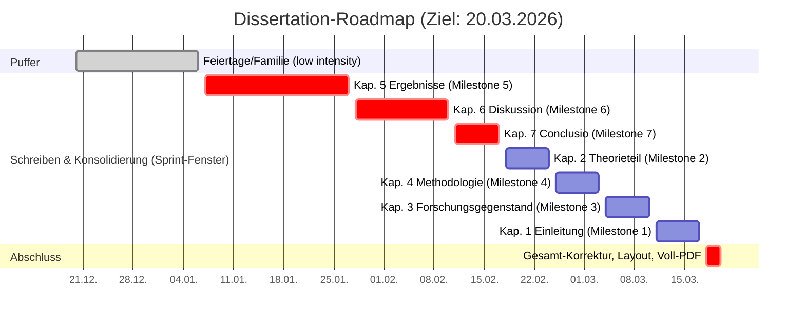

# Promotion / Dissertation

Dieses Verzeichnis enthält den zusammengeführten iCloud-/CloudDocs-Arbeitsbestand der Dissertation. Der Umzug aus der früheren Obsidian-Struktur ist abgeschlossen; maßgeblich ist jetzt der lokale Promotionsordner unter `Research/Charité - Universitätsmedizin Berlin/Promotion`.

## Struktur (Kurzüberblick)

- `dissertation.md` – zentrales Hauptdokument und Pandoc-Steuerdatei.
- `literaturverzeichnis.md` – Literaturkapitel und `::: {#refs}`-Anker.
- `04 Kapitelstruktur/` – Hauptkapitel, Anhänge und kapitelspezifische Arbeitsnotizen.
- `08 Metaquellen/08-01 Abbildungen/` – Abbildungen, Prozessgrafiken, Literatur- und Simulationsvisualisierungen.
- `08 Metaquellen/08-04 Daten/` – Roh- und Arbeitsdaten sowie kuratierte Datensets für Zenodo.
- `08 Metaquellen/08-05 Quellcodes/` – Python-Analysen, Simulationen und paketierte Zenodo-Softwarestände.
- `08 Metaquellen/Matadaten/` – Literaturverzeichnis, CSL, Pandoc-/Metadatenworkflow.
- `tools/` – Pandoc-, Zotero- und Kontrollwerkzeuge.
- `build-dissertation.sh` – PDF-Build über Pandoc, pandoc-crossref, citeproc und XeLaTeX.
- `build-dissertation-docx.sh` – DOCX-Arbeitsversion über Pandoc.

## Arbeitswahrheit und Versionierung

Der iCloud-/CloudDocs-Dateibaum ist die aktuelle Arbeitswahrheit. Git versioniert den kuratierten Kernbestand. Markdown-Dateien tragen YAML-Frontmatter; `versioned: true` markiert Dateien, die im aktuellen Git-Kern geführt werden. Das Feld `created` ist bei versionierten Markdown-Dateien aus dem ersten Git-Commit der jeweiligen Datei abgeleitet.

Große, sensible, temporäre oder experimentelle Arbeitsstände bleiben im Ordner, werden aber nicht automatisch versioniert. Dazu gehören insbesondere lokale Builds, temporäre Exportordner und große iCloud-Arbeitsbestände.

## Inhaltliche Arbeitslinien

Die Dissertation verbindet mehrere Arbeitslinien:

- Schreibkern: Kapitel `04-01` bis `04-07`, Prolog/Epilog und Anhang `04-A`.
- Theoretische Linie: digitales Bildungswirkgefüge, Digitalität, Bildung, Gefüge, Lehr-Lern-Paradigmen und LMS als Kopplungsordnung.
- Methodische Linie: systematische Literaturrecherche, qualitative und quantitative Analyse, Eye-Tracking, Umfrage, TEI und simulationsgestützte Modellprüfung.
- Datenlinie: kuratierte Datensets zu Umfrage, Eye-Tracking, Korrelationsmatrizen und TEI.
- Softwarelinie: Literaturauswahl, Netzwerk-/Korrelationsanalyse, LMS-Auswertung, Eye-Tracking-Konfidenz, Simulation des Bildungswirkgefüges und TEI-gestützte Simulation.

Eine ausführlichere Bestandsaufnahme liegt in `00 Projektstruktur/00-05 Dokumentation/Bestandsaufnahme Promotion.md`.

## GitHub-Projekt: Aufgaben aus `#todo`

Empfehlung: **ein** GitHub Project für die ganze Dissertation, mit Feldern wie `Status`, `Kapitel`, `Typ`, `Priorität`.

### Schnell-Workflow (manuell, aber schnell)

1. In VS Code den `#todo`-Text markieren (oder Cursor in der Zeile).
2. `Cmd+Shift+P` → `GitHub Issues: Create Issue`.
3. Issue-Titel/Body aus dem Todo ableiten, Issue erstellen.
4. Im Markdown den Bezug festhalten, z. B. `#todo: Erkenntnisinteresse skizzieren (#123)`.

## Zeitplan (Roadmap bis 20.03.2026)

## PDF Build

Voraussetzungen (lokal installiert): `pandoc`, `pandoc-crossref`, `latexmk` und XeLaTeX.

- Fast build (Standard): `./build-dissertation.sh` oder `./build-dissertation.sh fast`
- Full build (inkl. großer Anhänge): `./build-dissertation.sh full`
- DOCX-Arbeitsversion: `./build-dissertation-docx.sh fast`

Builds werden aus diesem Ordner gestartet. Der Fast-PDF-Build ist die Standardprüfung nach Änderungen an Kapiteltexten, YAML, Literaturpfaden, Abbildungen und Pandoc-/LaTeX-nahen Dateien.

## Analyse- und Simulationspfade

Die technische Analysebasis liegt unter `08 Metaquellen/08-05 Quellcodes/`.

| Linie | Skripte | Daten/Outputs | Dissertation |
|---|---|---|---|
| Literaturauswahl und Korpusdiagnostik | `deskriptive-literaturauswahl.py`, `analyse_netzwerk.py`, `analyse_korrelation.py` | `08 Metaquellen/08-01 Abbildungen/methodik/`, `08 Metaquellen/08-04 Daten/Datenset/korrelationsmatrizen/` | Kapitel 4, Anhang Korpusvisualisierungen und Korrelationsatlas |
| LMS-/Umfrageauswertung | `Auswertung-LMS.py`, `config-auswertung-lms.py` | `08 Metaquellen/08-04 Daten/Datenset/umfrage-analysen/` | Kapitel 3 bis 5, Anhang Umfrage |
| Eye-Tracking | `verteilung-konfidenz.py`, `config_eye_tracking.py` | `08 Metaquellen/08-04 Daten/Datenset/eye-tracking-bilder/`, `08 Metaquellen/08-01 Abbildungen/eye-traking/` | Kapitel 4 und Anhang Bilder-Eye-Tracking |
| Simulation Bildungswirkgefüge | `simulation-bildungswirkgefuege.py`, `config_bildungswirkgefuege.py`, `modellpruefung.py` | `08 Metaquellen/08-01 Abbildungen/didaktik/`, Zenodo-Paket `zenodo-simulation-bildungswirkgefuege/` | Kapitel 2, 4, 6 und Anhang Software und Quellcode |
| TEI-gestützte Simulation | `tei-bildungswirkgefuege.py`, `config_bildungswirkgefuege.py` | `08 Metaquellen/08-04 Daten/Datenset/TEI/`, Zenodo-Paket `zenodo-tei-bildungswirkgefuege/` | Kapitel 4, 5 und Anhang P-QIA/TEI |

Einzelne Skripte erwarten lokale Zusatzmodule oder Pfade (`ci_template`, `archetypen`, Exportziele, Zotero). Vor Ausführung immer die jeweilige Konfigurationsdatei und `08 Metaquellen/08-05 Quellcodes/README.md` prüfen.

## Zotero: Tags nach Kapitel/Abschnitt

Um in Zotero zu sehen, **in welchen Abschnitten (`{#sec:...}`)** eine Quelle zitiert wird, kann das Tool `tools/zotero_tag_sections.py` die **Parent-Items** automatisch mit Tags wie `Promotion:sec:Beduerfnisse` versehen (aus den Pandoc-Citekeys in den Markdown-Kapiteln + den Zotero-Storage-Keys im `.bib`).

- Audit/Dry Run (ohne Zotero-Schreibzugriff): `python3 tools/zotero_tag_sections.py --library-id <USER_ID> --citekeys-only`
- Dry Run mit API-Resolve (ohne Schreiben, erzeugt Report): `python3 tools/zotero_tag_sections.py --library-id <USER_ID>`
- Schreiben aktivieren: `python3 tools/zotero_tag_sections.py --library-id <USER_ID> --apply`

API-Key: entweder per Prompt, oder via Env-Var `ZOTERO_API_KEY`.
Tag-Schema: Standard ist `Promotion:sec:...`; alternativ z. B. `--tag-prefix "Promotion:#"` für `Promotion:#sec:...`.

## Dokumentationsanker

- `AGENTS.md` – verbindliche lokale Arbeitsregeln für Agenten und Codex-Threads.
- `00 Projektstruktur/00-05 Dokumentation/Bestandsaufnahme Promotion.md` – aktuelle Ordner-, Daten- und Softwarelandkarte.
- `08 Metaquellen/Matadaten/README.md` – Pandoc-, Literatur- und Metadatenworkflow.
- `08 Metaquellen/08-05 Quellcodes/README.md` – technische Matrix der Python-Skripte, Konfigurationen, Datenbezüge und Zenodo-Pakete.
