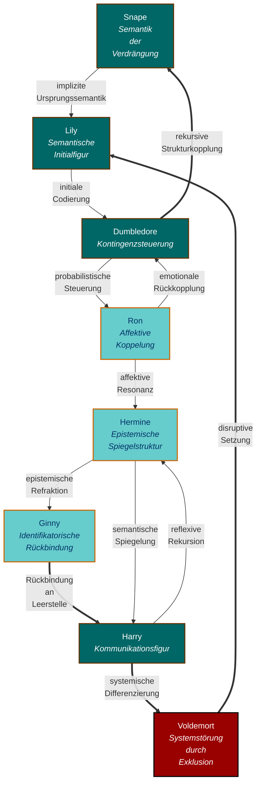
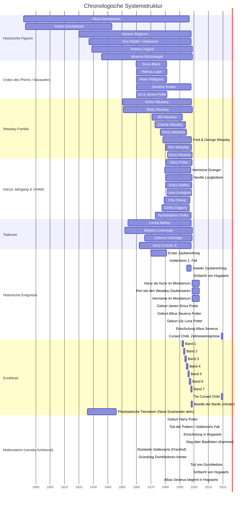

created: 13.7.2025 | [updated](https://git.jochen-hanisch.de/jochen-hanisch/research/): 14.7.2025 | [publishd](https://zenodo.org/records/15918779): 15.7.2025 | [Austausch](https://lernen.jochen-hanisch.de/course/view.php?id=4) | [[Hinweise]]

**Harry Potter und die Entzauberung eines nie gewesenen Helden unter systemtheoretisch-literaturanalytischer Episteminologenese**

# Einleitung

Diese Analyse beginnt mit einer alltäglichen Rezeption im familiären Kontext. Das gemeinsame Ansehen eines Harry-Potter-Films initiierte eine digitale Anschlusskommunikation. Über soziale Medien verstärkte sich die Präsenz narrativer Fragmente. Zitate, Theorien und Szenen verdichteten sich zu einem diskursiven Resonanzfeld mit transmedialer Reichweite. Nicht die Handlung, sondern die strukturelle Organisation des Erzählraums rückte in den Fokus. Die zentrale Frage lautete

_Was konstituiert die elementare Struktur des Harry-Potter-Universums_

Die Analyse rekonstruiert diese Struktur mit systemtheoretischen, literaturanalytischen und epistemologischen Mitteln. Im Vordergrund steht nicht eine psychologische Figurendeutung, sondern die Funktion narrativer Elemente innerhalb eines symbolisch-kommunikativen Systems. Harry Potter erscheint dabei nicht als handelndes Subjekt, sondern als strukturelle Ermöglichungsbedingung.

## 1. Vom Eindruck zur Frage: Ein heuristischer Erkenntnisweg

Analytische Prozesse setzen häufig bei Staunen oder Irritation ein. Der hier dokumentierte Denkprozess nahm seinen Ausgangspunkt in einem alltäglichen Moment, dem Schauen eines Harry-Potter-Films mit meiner Tochter. Diese familiäre Alltagserfahrung entwickelte sich rasch zu einem erkenntnisleitenden Impuls. Die Reaktion auf den Film war ambivalent, geprägt von Wiedererkennung und epistemischer Verstörung. Nicht das Narrativ selbst irritierte, sondern seine Wirkung d.h. ein kulturell durchcodiertes System, vertraut und zugleich unheimlich.

Dieses Kapitel zeichnet den Übergang vom ersten Eindruck zur systematischen Frageformulierung nach. Im Zentrum steht die epistemologische Bewegung, die von der konkreten Szene zur Struktur, vom emotionalen Eindruck zur analytischen Abstraktion führt. Der heuristische Erkenntnisweg verläuft nicht linear, sondern emergiert durch Reibung, Resonanz und reflexive Verdichtung. Die daraus resultierende Leitfrage lautet nicht:

- Wer ist Harry Potter?

Sondern:

- Was ist Harry Potter, strukturell betrachtet?

Die folgenden Unterkapitel dokumentieren diesen Prozess und verbinden die erste Reaktion, die theoretische Irritation und die vorläufige These, dass Harry Potter weniger Held als Kommunikationsfigur ist, zu einem zusammenhängenden Bewegungsablauf. Von der ersten Reaktion, die durch Irritation geprägt ist, über die theoretische Infragestellung des Offensichtlichen bis hin zur vorläufigen Annahme, dass Harry Potter primär als Kommunikationsfigur zu verstehen ist, entfaltet sich der Erkenntnisweg. Der Erkenntnisweg verläuft nicht entlang narrativer Inhalte, sondern führt von der konkreten Handlung zur strukturellen Analyse, von Identifikation zu systemischer Beobachtung. Damit beginnt der erste Schritt einer epistemischen Entzauberung.

## 1.1 Beobachtete Reaktionen

Die algorithmisch verstärkte Konfrontation mit Inhalten aus dem Harry-Potter-Universum rief eine ambivalente Reaktion hervor, eine Mischung aus neugiergetriebener Faszination und analytischer Irritation. Bilder, Zitate und theoriegesättigte Fragmenttexte wirkten zugleich vertraut und entfremdet. Diese Wiederbegegnung mit einem vermeintlich bekannten kulturellen Code offenbarte eine epistemische Spannung, die sich nicht aus der Erzählung selbst, sondern aus ihrer Wirkung speiste. Erinnerungsfragmente früherer Lektüren überlagerten sich mit kollektiven Deutungsmustern, verbunden durch ein schwer fassbares inneres Unbehagen. Auslöser dieser Bewegung war nicht das Bekannte, sondern die Leerstellen, also narrative Lücken, die Fragen evozierten und zum Ausgangspunkt einer strukturellen Relektüre wurden.

Die algorithmisch getriggerte Wiederbegegnung entfaltete sich nicht als nostalgisches Wiedererkennen, sondern als epistemische Störung mit intensiver affektiver Resonanz. Nicht narrativ-deskriptive Details rückten in den Vordergrund, sondern die Frage nach der strukturellen Wirkung des dargestellten Systems. Diese Irritation verband sich mit einer intergenerationellen Beobachtungsdynamik. Während die Tochter das Universum neu betritt, aktiviert der Vater ein bereits vorhandenes Sinnreservoir, eine Resonanz, die auf mehr als biografische Parallelität verweist. Zwischen erinnerungsgesättigtem Vorwissen und gegenwärtiger Konfrontation verdichtete sich die Annahme, dass das Zentrum der Analyse nicht in Figuren oder Handlungen liegt, sondern in deren strukturellen Bedingungen, d.h. systemischen Mustern, kommunikativen Ordnungen, symbolischer Codierung.

Diese Überlagerung affektiver Involvierung und kognitiver Irritation markiert eine erste Erkenntnisschwelle. Sie war nicht intendiert, sondern emergierte aus der Kopplung individueller Erfahrung, medialer Verstärkung und theoretischer Irritation. Dieser Übergang konstituiert den Ausgangspunkt eines heuristischen Erkenntniswegs, der sich nicht aus der narrativen Oberfläche speist, sondern aus der Tiefenstruktur des symbolisch-kommunikativen Systems.

## 1.2 Heuristische Verdichtung: Von der Szene zur Struktur

Die mediale Überreizung, ausgelöst durch algorithmisch aggregierte Inhalte, initiierte einen erkenntnisleitenden Verdacht. Die Erzählwelt rund um Harry Potter operiert nicht entlang psychologisch motivierter Figurenkonstellationen, sondern folgt systemisch-funktionalen Logiken. Die Rückkehr in das narrative Material vollzog sich daher nicht über lineares Wiederlesen oder sentimentales Nachschauen, sondern über eine strukturfokussierte Relektüre im sokratischen Modus:

- Welche funktionalen Rollen übernehmen die einzelnen Figuren?
- Welche strukturelle Notwendigkeit legitimiert ihre Präsenz im System?
- Worin besteht die narrative Funktion von Harry Potter jenseits seines Status als Namensgeber?

Diese Fragen markierten eine epistemische Verschiebung: Weg vom Plot, hin zur Beziehungsarchitektur. Die Relektüre zielte nicht auf das Nacherzählen von Ereignissen, sondern auf die Entschlüsselung impliziter Strukturmuster. Dabei verdichtete sich ein zentrales Problem. Die Figur Harry Potter handelt nicht aus intrinsischer Motivation, sondern erscheint als Effekt systemischer Notwendigkeit, als Funktion innerhalb eines symbolisch operierenden Kommunikationssystems.

## 1.3 Reflexionskern: Die Verschiebung der Frage

Die ursprünglich intuitive Frage, Wer ist Harry Potter?, erwies sich im Verlauf der Reflexion als erkenntnistheoretisch unzureichend. Nicht die Identität der Figur, sondern ihre strukturelle Funktion innerhalb der narrativen Architektur rückte ins Zentrum der Analyse. Entscheidend wurde damit die weiterführende Frage: Was ist Harry Potter im symbolisch-kommunikativen Gefüge der Erzählung?

Die vertiefte Auseinandersetzung mit Figuren wie Snape, Lily und Dumbledore offenbarte ein wiederkehrendes Muster. Ihre Handlungen kreisen nicht um psychologische Entwicklung, sondern um eine zentrale Leerstelle, ein narratives Zentrum, das nicht durch individuelle Autonomie, sondern durch strukturelle Anschlussfähigkeit konstituiert ist.

Dieses Zentrum ist nicht im klassischen Sinne der Handlung verortet, sondern auf der Ebene systemischer Kommunikation situiert. Die Analyse legt nahe, dass Harry nicht als Initiator von Bedeutung wirkt, sondern als Resonanzfläche und symbolisches Aggregat, über das narrative Strukturen überhaupt erst kohärent und anschlussfähig bleiben.

Die daraus hervorgehende Struktur lässt sich visuell in Abbildung 1 erfassen, welche die funktionalen Relationen der zentralen Figuren modelliert. Die Beziehungen sind nicht psychologisch, sondern systemisch zu verstehen, als Operationen innerhalb eines Kommunikationssystems.

_Abbildung 1: Systemische Figurenstruktur im narrativen Netzwerk von Harry Potter (eig. Darstellung)_

Abbildung 1 visualisiert zentrale Operationen innerhalb des narrativen Kommunikationssystems Harry Potter als systemisch-funktionale Strukturkonfiguration.
Die Knoten stehen nicht für Figuren im klassischen Sinne, sondern für rekursive Operationseinheiten, die spezifische Funktionen im symbolisch codierten System übernehmen. Ihre farbliche Differenzierung folgt der CI-konformen Kodierung systemischer Rollen:

- **Türkisbraune Knoten** markieren strukturelle Kernelemente systemischer Ordnungsbildung (Snape, Lily, Dumbledore, Harry). Diese Instanzen konstituieren den semantischen Horizont narrativer Anschlussfähigkeit durch Setzung, Kopplung, Steuerung und Leerstelle.
- **Helltürkise Knoten** bezeichnen modulierende Instanzen mit Resonanz- und Spiegelungsfunktion (Ron, Hermine, Ginny). Sie wirken auf affektiver, kognitiver und identifikatorischer Ebene als Stabilisierungsschleifen symbolischer Codierung.
- **Dunkelrote Knoten** repräsentieren Störinstanzen narrativer Ordnung (Voldemort). Ihre Funktion liegt in der Initiierung disruptiver Übergänge, die systemische Umcodierungen erzwingen.

Die Pfeilrichtungen im Diagramm sind nicht relational, sondern funktional zu verstehen. Sie repräsentieren gerichtete Operationen wie Initialcodierung, rekursive Kopplung, Differenzsetzung oder semantische Rückbindung. Doppelt gerichtete Pfeile verweisen auf bidirektionale Rekursivität, einfache auf unidirektionale Systemimpulse. Farblich codierte Linien differenzieren zwischen Primär- (magenta) und Sekundärkopplung (orange) im Sinnprozess.

Abbildung 1 macht damit sichtbar, dass das Harry-Potter-Narrativ kein Ensemble psychologischer Figuren ist, sondern ein funktional orchestriertes Kommunikationssystem. Die Figur „Harry“ markiert darin keine psychologische Identität, sondern eine strukturelle Leerstelle, durch die semantische Verdichtung, Projektion und Systemtransformation operieren können.

## 1.4 Erste These: Kommunikationsfigur statt Heldenrolle

Die entstehende Hypothese ist in ihrer Konsequenz radikal:

> Harry Potter ist kein Held.

Zumindest nicht im Sinne klassischer Narrationsmuster, die heroisches Handeln, Wandlung durch Prüfung und autonome Entscheidung ins Zentrum stellen (vgl. Campbell, 2008; Vogler, 2007). Statt Handlungsmacht oder psychologischer Tiefe übernimmt Harry Potter im narrativen Gefüge eine strukturelle Funktion. Er fungiert nicht als initiierender Akteur, sondern als symbolischer Knotenpunkt, an dem Bedeutungsflüsse zusammenlaufen, rekodiert und rückgebunden werden.

Diese Beobachtung führt zur Einführung eines neuen figurentheoretischen Begriffs: der **Kommunikationsfigur**. Kommunikationsfiguren sind nicht durch individuelle Entwicklung oder psychologische Kohärenz charakterisiert, sondern durch ihre Position im symbolisch-kommunikativen Raum einer Erzählung. Sie dienen als strukturelle Instanzen, durch die andere Figuren, Diskurse und Erzählstränge miteinander in Beziehung treten können.

Harry Potter erscheint in dieser Lesart nicht als Urheber von Handlung, sondern als projektionsfähige Reflexionsfläche. In ihm bündeln sich kollektive Erwartungen, institutionelle Machtverhältnisse und mythische Semantiken. Als Kommunikationsfigur stabilisiert er das narrative System nicht durch Entscheidungen, sondern durch seine semantische Anschlussfähigkeit. Er bildet einen Beobachtungspunkt, an dem Sinn zirkulieren, verdichtet und systemisch gerahmt werden kann. Er verkörpert kein handelndes Subjekt, sondern fungiert als figuratives Gefäß der narrativen Selbstbeschreibung. In diesem Sinne lässt sich Harry als funktionale Leerstelle im Sinne Barthes (1977) oder als Beobachtungsfigur zweiter Ordnung (vgl. Luhmann, 1997) begreifen, nicht als Teilnehmer, sondern als Ermöglichungsform.

Diese Konzeption wirkt auf den ersten Blick entmächtigend. Die Kommunikationsfigur scheint passiv, nachrangig, sekundär. Doch gerade in dieser vermeintlichen Leere liegt ihre strukturelle Tragweite. Aus systemtheoretischer Sicht entsteht Bedeutung nicht durch Handlung, sondern durch kommunizierbare Beobachtung (Luhmann, 1997). Die Kommunikationsfigur ist somit keine Figur der Tat, sondern eine notwendige semantische Schnittstelle, an der narrative Systeme ihre eigene Struktur reflektieren und stabilisieren. 

> Ohne Kommunikation keine Systeme und ohne Kommunikationsfigur kein anschlussfähiges Narrativ.

In dieser Perspektive übersteigt die Kommunikationsfigur das klassische Heldenmodell (Campbell, 2008) nicht durch Intensität, sondern durch strukturelle Reichweite. Sie ist keine Figur der inneren Wandlung, sondern eine Bedingung narrativer Emergenz, d.h. ein Resonanzraum kollektiver Zuschreibungen, ein Verdichtungsort symbolischer Ordnung, ein Beobachtungspunkt systemischer Selbstbeschreibung (vgl. Barthes, 1977; Luhmann, 1997; Eco, 1979).

## 2 Theoretischer Rahmen: Figuren, Kommunikation, Systeme

Die literaturwissenschaftliche Auseinandersetzung mit narrativen Figuren kennt zahlreiche klassifizierende Konzepte. Die strukturalistische Tradition unterscheidet etwa zwischen Protagonist und Antagonist, aktiver Heldenfigur und passiver Nebenrolle (Rimmon-Kenan, 2002). Joseph Campbell (2008) prägte mit dem Konzept der „Heldenreise“ ein bis heute wirkungsvolles Modell. Der Held durchläuft Prüfungen, erfährt Transformation und kehrt gewandelt zurück. In dieser Struktur handeln Helden aus innerer Überzeugung, übernehmen Verantwortung und werden zur Projektionsfläche narrativer Identifikation.

Die Figur Harry Potter lässt sich mit diesen Modellen nur bedingt fassen. Die im vorliegenden Text entwickelte Hypothese erfordert eine begriffliche Erweiterung. Harry Potter erscheint nicht als autonom Handelnder, sondern als strukturelles Zentrum eines kommunikativen Systems. In systemtheoretischer Perspektive (Luhmann, 1997) ist Kommunikation kein individueller Akt, sondern ein emergenter Prozess aus Information, Mitteilung und Verstehen. Kommunikation erzeugt nicht nur Bedeutung, sondern konstituiert soziale Systeme.

Vor diesem Hintergrund wird ein neuer Figurentyp eingeführt: die Kommunikationsfigur. Sie ist keine psychologisch motivierte Instanz, sondern ein struktureller Knotenpunkt, an dem narrative, symbolische und systemische Stränge zusammenlaufen. Sie ist weder Initiatorin noch Empfängerin, sondern strukturelle Bedingung kommunikativer Anschlussfähigkeit. Die Figur Harry Potter wird in dieser Perspektive nicht heroisiert, sondern als Projektions- und Verknüpfungsfläche verstanden, als Form, die Bedeutung zirkulieren lässt, ohne selbst Ursprung semantischer Setzungen zu sein.

Die Grundlage dieses Verständnisses bildet die Theorie der [Elementarkommunikation], die Kommunikation nicht als linearen Informationsaustausch, sondern als zyklische Triade aus Feedback, Reflexion und Re-Entry konzipiert. Harry übernimmt in dieser Triade nicht die Rolle des Senders oder Empfängers, sondern verkörpert jene Figur, die Kommunikation zwischen anderen Figuren ermöglicht, rekontextualisiert und stabilisiert.

Damit verschiebt sich der Fokus. Nicht Handlungsfähigkeit oder Entwicklung stehen im Zentrum, sondern systemische Funktionalität. Nicht Identifikation, sondern Beobachtbarkeit. Nicht Heldentum, sondern Strukturermöglichung.

Diese Verschiebung markiert einen Perspektivwechsel, d.h. weg von einer psychologisierenden hin zu einer systemtheoretisch fundierten Figurenanalyse im Sinne narrativer Selbstbeschreibung (vgl. Luhmann, 1997, S. 498 ff.). Figuren wie Harry Potter fungieren in dieser Lesart nicht als Träger innerer Eigenschaften, sondern als Beobachtungsangebote, durch die ein Erzählsystem seine eigene Struktur ausbilden, stabilisieren und transformieren kann (vgl. Martínez & Scheffel, 2016, S. 94,97). Sie sind semantische Knotenpunkte, die Bedeutung nicht erzeugen, sondern zirkulieren lassen und damit narrative Systembildung ermöglichen.

# 3. Analytischer Hauptteil: Harry als Kommunikationsfigur

Der dritte Abschnitt entfaltet systematisch die These von Harry Potter als Kommunikationsfigur. Im Zentrum steht nicht die Figur als handlungstreibender Held, sondern als strukturelle Ermöglichungsbedingung narrativer Kommunikation. Ausgangspunkt ist die Beobachtung, dass Harry in keiner zentralen Wendung der Erzählung echte Entscheidungsfreiheit besitzt. Damit erfüllt er keine klassische Heldenstruktur im Sinne autonomer Entwicklung, sondern fungiert als Schnittstelle symbolischer Operationen, als Resonanzfläche systemischer Kräfte und Projektionsraum für andere Figuren. Die Analyse folgt einer viergliedrigen Struktur:

1. Dekonstruktion heroischer Narrative,
2. Analyse der strukturellen Initialzündung durch Lily Potters Opfer,
3. funktionale Zuordnung der Hauptfiguren im Kommunikationssystem,
4. Ausweitung der Analyse auf infrastrukturelle Träger wie Orte und Objekte.

Ziel ist, Harrys Rolle im narrativen System nicht psychologisch zu deuten, sondern funktional und strukturell zu beschreiben.

**Chronologische Systemstruktur im Überblick (Gantt-Diagramm)**

Das folgende Gantt-Diagramm visualisiert die zeitlich-parallele Struktur zentraler Figurenbiografien, narrativer Ereignisse und funktionaler Meilensteine im Harry-Potter-Universum. Das Diagramm dient der historischen Kontextualisierung der Analyse und bildet die Grundlage für systemisch-dynamische Interpretationen entlang einer Zeitachse von 1881 bis 2019. Die Darstellung integriert innerfiktionale Erzählzeit (z. B. Schuljahre, Kriege, familiäre Entwicklungen) ebenso wie dokumentierte Postnarrative (z. B. Epilog, _Cursed Child_) in einer gemeinsamen Zeitstruktur.

Die Chronologie strukturiert das Universum als systemisch-dynamisches Geflecht. Sie kombiniert biografische Entwicklungen, narrative Schlüsselereignisse und symbolische Strukturtexte zu einer integrierten Darstellung. Dadurch werden Wechselwirkungen zwischen Figuren, sozialen Systemen und narrativen Verdichtungen sichtbar und lassen sich in ihrer funktionalen Logik analysieren.

_Abbildung 2: Chronologische Systemstruktur im Überblick (eig. Darstellung)_

_Tabelle 1: Legende zum Gantt-Diagramm „Harry-Potter-Zeitstruktur“_

|**Sektion**|**Inhalt**|**Bedeutung**|
|---|---|---|
|**Historische Figuren**|Frühere Generationen (1880,1945), z. B. Dumbledore, Grindelwald|_Hintergrundsysteme, Präkonfliktstruktur_|
|**Orden des Phönix / Marauders**|Akteure des ersten Krieges, Elterngeneration Harrys|_Brückenfiguren, Konfliktträger zwischen den Kriegen_|
|**Weasley-Familie**|Familiäre Konstellationen über mehrere Jahrgänge|_Soziales Referenzsystem, Allianzstruktur_|
|**Harrys Jahrgang & Umfeld**|Schulzeitbegleiter, Mitstreiter:innen, Gegenspieler:innen|_Zentrale Bezugseinheiten der Erzählung_|
|**Todesser**|Hauptantagonisten um Voldemort|_Systembedrohung, destruktive Ordnung_|
|**Historische Ereignisse**|Politische und gesellschaftliche Umbrüche, Übergänge, Reorganisationen|_Systemphasen, Strukturbrüche_|
|**Erzählzeit**|Zeitliche Verortung der Hauptwerke inkl. Erweiterungen|_Fiktionale Rahmung der Handlungen_|
|**Meilensteine (narrativ-funktional)**|Punktuelle Schlüsselereignisse mit systemischer Relevanz|_Kipppunkte, Identitätsumbrüche, Übergänge_|
Ein Meilenstein in Tabelle 1 ist ein punktuell verortbares, narrativ entscheidendes Ereignis, das mindestens eine der folgenden Funktionen erfüllt:

- **Transformation von Beziehungen** (z. B. Tod Dumbledores)
- **Systemeintritt oder -austritt** (z. B. Einschulung in Hogwarts, Epilog)
- **Eskalation oder Deeskalation** (z. B. Rückkehr Voldemorts)
- **Wendepunkt im Erzählrahmen** (z. B. Basiliskenkampf)

Das Gantt-Diagramm in Abbildung 2 bietet damit eine chronologische Übersicht über zentrale Personenbiografien, narrative Ereignisse und relevante Zeitmarken im Harry-Potter-Universum. Die Abbildung verdeutlicht die zeitlichen Zusammenhänge und parallelen Entwicklungen der Charaktere sowie der konflikthaften Handlungsverläufe. Die Zeitachse reicht von 1881 (Geburt Albus Dumbledores) bis 2019 (Zeitreiseereignisse in _The Cursed Child_) und setzt die Lebensdaten der Figuren, historisch-fiktionale Ereignisse sowie schulzeitbezogene und postnarrative Entwicklungen in systemische Beziehung. Diese Struktur bildet die Grundlage für eine funktionale Analyse von Kommunikationsfiguren und deren Rollen im narrativen Gesamtgefüge.

Die in Abbildung 2 dargestellte chronologische Systemstruktur verdeutlicht bereits im historischen Längsschnitt, dass Harry Potters Leben von Geburt an durch systemische Interventionen geprägt ist. Seine Geburt fällt zeitlich exakt in eine Phase eskalierender Systemspannung (Erster Zaubererkrieg), seine Kindheit ist durch passive Isolation markiert, und sein Schulweg steht in direkter Korrelation zu systemischen Kipppunkten.

Im klassischen Modell heroischer Narration sind Handlungsfreiheit und Entscheidung zentrale konstitutive Elemente der Heldenfigur (Campbell, 2008). Der Held wird dort als jemand konzipiert, der bewusst eine Schwelle überschreitet, sich freiwillig Prüfungen unterzieht und in reflektierter Autonomie handelt. Übertragen auf die Figur Harry Potter erweist sich dieses Modell jedoch als unpassend. In keiner entscheidenden Wendung seiner Geschichte ist Harry wirklich autonom.

Die Analyse der im Gantt-Diagramm (Abbildung 2) visualisierten Zeitstruktur zeigt, dass Harrys gesamte Biografie von Beginn an durch systemische Determination geprägt ist. Bereits seine Geburt fällt in eine Phase eskalierender Systemspannung (Erster Zaubererkrieg), wodurch er nicht als freies Subjekt, sondern als Produkt historischer Konfliktdynamik erscheint. Die versuchte Tötung durch Voldemort, der Schutz durch Lily Potters Opfer, die Aufnahme bei den Dursleys, die Entdeckung als Zauberer, die Aufnahme in Hogwarts, seine Rolle im Widerstand, sein symbolisches Sterben, all dies sind keine selbstgewählten Entscheidungen, sondern strukturierte Rahmungen, die auf ihn einwirken. Die Zeitstruktur belegt, dass Harrys Biografie lückenlos mit systemischen Ereignissen und Kipppunkten synchronisiert ist. Jeder Übergang, von der Kindheit in Isolation, über die Initiation in die Zaubererwelt, bis zu den entscheidenden Schlachten, ist nicht Resultat individueller Wahl, sondern Ausdruck einer übergeordneten Systemlogik.

Auch spätere Momente, etwa das bewusste Betreten des Verbotenen Waldes, geschehen nicht aus einer souveränen Reflexion, sondern als Resultat systemischer Zwangslagen und symbolischer Erwartungsketten, die sich aus der chronologischen Struktur des Narrativs ergeben. In Anlehnung an Gerd Gigerenzer (2013), der betont, dass Entscheidung nur dort stattfindet, wo echte Alternativen bestehen, lässt sich festhalten. Harry Potter entscheidet nicht, er reagiert innerhalb eng gesteckter Möglichkeitsräume, die durch das System vorgegeben sind.

Daraus ergibt sich, dass keine Entscheidung, keine Autonomie und somit auch keine Heldenstruktur für sich steht. Stattdessen agiert Harry als strukturelle Reaktionsfläche. Er ist nicht Subjekt im emphatischen Sinne, sondern Vermittlungsform für die Operationen anderer. Diese vollständige strukturelle Determiniertheit bildet den Ausgangspunkt für die Analyse der systemischen Initialzündung durch Lily Potters Opfer, eine Entscheidung, die nicht nur Harry schützt, sondern das System der Erzählung selbst codiert.

Diese systemisch determinierte Zeitstruktur bildet die Grundlage für das Verständnis von Lily Potters Opfer nicht als Einzeltat, sondern als strukturelle Initialzündung, eine Codierung, die Harrys Rolle im narrativen System überhaupt erst ermöglicht.

## 3.2 Systemlogik: Mutterliebe als strukturelle Initialzündung

Die narrative Urszene des Harry-Potter-Universums, der gescheiterte Tötungsversuch Voldemorts an einem Säugling, ist in systemtheoretischer Perspektive nicht als bloßes dramaturgisches Ereignis zu verstehen, sondern als strukturelle Setzung. Die im Text (Rowling, 1997) als magischer Schutz beschriebene Mutterliebe Lilys fungiert nicht als moralisch aufgeladene Handlung, sondern als kommunikative Initialzündung. Das bewusste Sich-Opfern erzeugt die erste symbolische Differenz, die das gesamte narrativ-kommunikative System strukturiert d.h. eine zentrale Codierung, die semantische Exklusivität herstellt und das symbolische Zentrum des Systems markiert.

In systemtheoretischer Terminologie (Luhmann, 1995) ließe sich dieses Ereignis als „primäre Semantik“ bezeichnen; ein grundlegender Differenzierungsakt, der strukturbildend wirkt. Die zeitliche Verortung dieses Moments, am Ende des Ersten Zaubererkriegs und direkt vor dem symbolischen Sturz Voldemorts, ist kein Zufall, sondern zeigt die funktionale Stellung dieser Handlung als systemischer Kipppunkt (vgl. Gantt-Diagramm, Abbildung 2, Meilenstein 1981-10-31). Lilys Handlung codiert nicht nur die Existenz Harrys innerhalb des Systems, sondern ermöglicht zugleich die strukturelle Ausdifferenzierung des narrativen Gefüges selbst.

Ohne diese Codierung existitrte keine narrative Sonderstellung Harrys, keine symbolische Signatur auf seiner Stirn, keine strukturelle Verbindung zu Voldemort und somit kein anschlussfähiges Zentrum der Erzählung. Der Tod Lilys markiert damit den Punkt, an dem Harry überhaupt erst zur Kommunikationsfigur werden kann, also nicht durch Eigenschaft, sondern durch Funktion. Ihre Entscheidung begründet ein semantisches Kraftfeld, das nicht rückblickend interpretiert, sondern voraussetzungsschaffend wirkt, vergleichbar einer Codierung, die die Modalität des gesamten Systems bestimmt.

Diese Urszene kodiert Harrys Rolle nicht nur retrospektiv als Leerstelle der Beobachtung, sondern prospektiv als symbolisch funktionsfähige Mitte im narrativen Raum. Sie ist keine individuelle Heldentat, sondern eine systemisch notwendige Setzung, durch die das Erzählsystem überhaupt anschlussfähig wird.

## 3.3 Figurenanalyse unter kommunikationstheoretischer Perspektive

Nach der Rekonstruktion der Figur Harry Potter als systemisch strukturierter Kommunikationsfigur (vgl. Kapitel 3.1 und 3.2) richtet sich der analytische Fokus nun auf deren Verhältnis zu den weiteren zentralen Figuren. Im Vordergrund steht nicht deren psychologische Tiefe oder narrative Entwicklung, sondern die jeweilige funktionale Position im symbolisch-kommunikativen Gefüge der Erzählung. Die in Abbildung 1 visualisierte Figurenkonstellation dient als heuristische Grundlage. Jede relevante Figur übt eine spezifische Operation auf das Zentrum „Harry“ aus, entweder zur Stabilisierung, Differenzierung oder Destabilisierung des narrativen Systems.

Die Analyse folgt der systemtheoretischen Unterscheidung von Operation, Beobachtung und Rekursion. Jede Figur ist weniger Akteur als Form, keine Handlungsträgerin, sondern systemische Operation. Die Relation zu Harry entscheidet darüber, welche Funktion sie erfüllt, also latente Herkunft, epistemische Setzung, affektive Resonanz, reflexive Rahmung, symbolische Erdung oder destruktive Intervention. Dieser Zugang verschiebt den Analysefokus von psychologisierender Charakterdeutung hin zu systemtheoretisch fundierter Funktionszuweisung.

Die nachfolgende Differenzierung systematisiert die funktionalen Rollen entlang der in Abbildung 1 dargestellten Strukturbeziehungen:

- **Snape** (A): verdrängte Kommunikation → Ursprung / verdeckte Semantik
- **Lily** (B): epistemische Setzung → symbolische Codierung
- **Dumbledore** (C): kontrollierende Instanz → Kontingenzmanagement
- **Ron** (D): emotionale Resonanz → Affektmodulation
- **Hermine** (E): Reflexionsstruktur → epistemische Spiegelung
- **Ginny** (H): symbolische Erdung → Verkörperungsversuch
- **Harry** (F): Kommunikationsfigur → strukturelle Leerstelle
- **Voldemort** (G): systemische Intervention → externe Eskalation

Die strukturale Differenz zwischen diesen Figuren ist nicht narrativ, sondern funktional. Im Fokus stehen nicht Handlungsabläufe, sondern um Operationen, die das System ermöglichen, rekonfigurieren oder gefährden. In diesem Sinn markiert jede Figur eine eigene Funktion innerhalb des Kommunikationsraums. Das Zentrum Harry wird nicht von innen her mit Sinn gefüllt, sondern von außen durch Operationen umcodiert. 

Die in Abbildung 1 dargestellten Pfeilrichtungen markieren keine psychologischen Beziehungen, sondern Vektoren systemischer Wirksamkeit. Wer beeinflusst wen, nicht durch dialogische Interaktion, sondern durch Position im Sinngefüge. Gerade diese Differenz zwischen Figur und Funktion eröffnet die Möglichkeit, das Erzähluniversum als System zu interpretieren, dessen Dynamik primär durch strukturale Kopplungen und nicht durch individuelle Handlungslogik getragen wird.

## 3.4 Kommunikationsstruktur- und Sinnanalyse

Nach der Analyse der strukturellen Funktionen zentraler Figuren erweitert dieses Kapitel den Fokus auf nicht-personale Elemente des Erzähluniversums. Im Zentrum steht die Frage, wie sich Kommunikation, Bedeutung und Struktur nicht nur durch Personen, sondern ebenso durch Orte, Objekte und symbolische Ordnungen konstituieren. Diese Erweiterung folgt stringent aus der bisherigen Argumentation. Wenn Harry Potter nicht als Handlungssubjekt, sondern als Kommunikationsfigur zu verstehen ist, dann muss auch das ihn umgebende System nicht als Bühne, sondern als infrastrukturelle Bedingung kommunikativer Prozesse gelesen werden. Orte und Dinge fungieren in dieser Perspektive nicht als Kulissen, sondern als semantische Medien, die Sinn nicht lediglich transportieren, sondern aktiv erzeugen.

Der folgende Abschnitt untersucht daher, inwiefern Kommunikationsstruktur und Sinn im Harry-Potter-Universum systemisch durch Räume, Gegenstände und symbolische Arrangements organisiert werden. Dabei wird deutlich. Nicht nur menschliche Figuren, sondern auch Dinge und Orte übernehmen kommunikative Funktionen, sie sind Bestandteil der Systemlogik. Die Argumentation folgt der im vorangegangenen Kapitel entwickelten Figur der Kommunikationsfigur und überträgt sie auf infrastrukturelle sowie materiale Träger systemischer Semantik.

### 3.4.1 Orte als Träger kommunikativer Infrastruktur (z.B. Hogwarts)

Orte wie Hogwarts fungieren im narrativen System nicht lediglich als räumliche Schauplätze, sondern als strukturwirksame Träger symbolisch-kommunikativer Infrastruktur. Sie strukturieren, rahmen und differenzieren kommunikative Prozesse funktional. So stellt Hogwarts nicht nur den Ort des Geschehens dar, sondern bildet ein funktionales Zentrum, an dem soziale Differenzierung (Häuser), institutionelle Steuerung (Lehrkörper, Schulleitung) und symbolische Rahmung (Feste, Rituale, Prüfungen) systematisch orchestriert werden. Die Schule erlaubt nicht nur Begegnung, sondern strukturiert diese entlang normativer Erwartungen und institutioneller Logiken. In systemtheoretischer Lesart ist damit Hogwarts eine infrastrukturelle Ermöglichungsbedingung für das kommunikative System der magischen Welt. Ohne den Ort kein Netz an Beziehungen, keine Differenzierung von Zugehörigkeit, keine strukturierte Übergabe von symbolischem Wissen. Hogwarts selbst ist ein systemisch wirksames Kommunikationsmedium infrastruktureller Semantik.

### 3.4.2 Objekte als Träger kommunikativer Sinngebung (z.B. Zauberstäbe)

Objekte im Harry-Potter-Universum fungieren nicht als neutrale Requisiten, sondern als semantisch codierte Träger systemischer Kommunikationsstruktur. Besonders deutlich wird dies an den Zauberstäben, deren symbolische Funktion über ihren Gebrauchswert hinausweist und tief in die Systemlogik eingebettet ist. Sie sind nicht nur Werkzeuge magischer Handlung, sondern markieren Zugehörigkeit, Differenz und narrative Machtverhältnisse. Der Zauberstab „wählt“ seinen Besitzer, eine Form symbolischer Kopplung, die über Handlungskompetenz hinaus auf ein tieferes semantisches Band verweist (Rowling, 1997).

In systemtheoretischer Perspektive lassen sich solche Objekte als „symbolisch generalisierte Kommunikationsmedien“ (Luhmann, 1995) deuten. Sie ermöglichen Kommunikation unter Unsicherheit, indem sie Handlungserwartungen stabilisieren. Der Elderstab etwa symbolisiert nicht lediglich Macht, sondern operiert als strukturelles Medium legitimatorischer Codierung im narrativen System. Ebenso symbolisieren Horcruxe die Möglichkeit, Bedeutung in Dinge einzuschreiben, um sie dem Zugriff anderer Kommunikation zu entziehen. Objekte wie der sprechende Hut, der Zeitumkehrer oder der Spiegel Nerhegeb erweitern das System narrativer Kommunikation durch spezifische Funktionalisierungen. Sie machen Unverfügbares verfügbar, Unsichtbares sichtbar oder Mögliches realisierbar. Diese Objekte strukturieren nicht nur Handlung, sondern eröffnen alternative Beobachtungsperspektiven und erzeugen damit neue Formen von Sinn.

Objekte im Harry-Potter-Universum sind somit keine instrumentellen Hilfsmittel, sondern funktionale Kommunikationsartefakte. Sie stabilisieren semantische Räume, verdichten symbolische Ordnungen und wirken als materielle Infrastrukturen narrativer Systembildung.

# 4. Diskussion: Entzauberung als epistemischer Akt

Die vorangegangene Analyse hat deutlich gemacht, dass das Harry-Potter-Universum nicht als kohärente Heldenreise, sondern als symbolisch operierendes Kommunikationssystem zu verstehen ist. Der narrative Mittelpunkt, also die Figur Harry Potter, erscheint nicht als autonomes Subjekt, sondern als strukturelle Leerstelle, genauer, als Kommunikationsfigur, durch die systemische Ordnungen strukturiert, verdichtet und reproduziert werden. Diese Erkenntnis verändert das Verständnis der einzelnen Figuren grundlegend und transformiert die gesamte Wahrnehmung des Erzählraums. Aus einem mythischen Kosmos wird eine symbolisch differenzierte Strukturwelt.

Die epistemische Entzauberung des Erzählraums hat weitreichende Folgen, die sich in theoretischer, affektiver, rezeptionsästhetischer und erkenntnistheoretischer Hinsicht manifestieren. Die klassische Magie der Erzählung wird durch eine strukturelle Transparenz ersetzt. Die zuvor als Heldenreise wahrgenommene Handlung zerfällt in ein Gefüge rekursiver Operationen, Übergänge und Semantiken, deren Zentrum nicht mehr die Handlung, sondern die strukturelle Beobachtbarkeit ist. Im Folgenden werden diese Folgen in vier aufeinander bezogenen Perspektiven diskutiert, wobei die Argumentation jeweils an die vorangegangenen Kapitel anschließt.

## 4.1 Reflexion der eigenen Reaktion: Leere nach Entdeckung des Elementarkerns

Die systemtheoretische Rekonstruktion der Erzählung führte nicht zu einer Begeisterung über das gefundene Erklärungsmuster, sondern zu einem Gefühl epistemischer Leere. Die emotionale Entkoppelung, die mit der funktionalen Dechiffrierung des Harry-Potter-Universums einherging, ließ die Geschichte zwar nicht weniger bedeutungsvoll erscheinen, aber radikal anders. Die magische Wirkung wich der strukturellen Durchschaubarkeit. Die erzählerische Aura wurde ersetzt durch ein Netz aus Operationen, Differenzen und rekursiven Rückbindungen.

Dieses Gefühl der Leere verweist nicht auf ein Scheitern der Analyse, sondern ist eine direkte Konsequenz der vollständigen strukturellen Rückbindung von Sinn. Sobald jede Bedeutung auf systemische Strukturen zurückgeführt werden kann, verschwindet der Überschuss an Bedeutung, der zuvor als Magie erschien. Die narrative Undurchsichtigkeit, die vormals als Quelle der Faszination und des Staunens wirkte, wird durch eine Beobachtungsform ersetzt, die Differenzierung an die Stelle des Staunens setzt. Die daraus resultierende affektive Irritation ist selbst ein Bestandteil des erkenntnistheoretischen Übergangs von mythischer Faszination zu struktureller Einsicht.

## 4.2 Kontrast zur Rezeption: Identifikation vs. Strukturverständnis

Der Kontrast zur populären Rezeption des Harry-Potter-Universums könnte kaum deutlicher ausfallen. Während die Leserschaft sich mit der Figur Harry Potter identifiziert, seine Prüfungen miterlebt und seine Siege feiert, dekonstruiert die systemtheoretische Analyse genau dieses Muster der Identifikation. Die Figur Harry wird nicht mehr als handelndes Subjekt betrachtet, sondern als symbolische Leerstelle, deren Funktion im narrativen System nicht in der Handlungsmacht, sondern in der strukturellen Anschlussfähigkeit besteht. Die emotional aufgeladene Heldengestalt verliert dadurch ihren Identifikationswert, nicht infolge einer Zerstörung des Charakters, sondern durch eine theoretische Rekodierung der Figur.

Diese Verschiebung offenbart einen grundlegenden Paradigmenwechsel. Die Analyse bewegt sich vom Mythos zur Struktur, von der Figur als Projektionsfläche zur Figur als Systemfunktion. Figuren werden nicht länger als psychologisch motivierte Charaktere verstanden, sondern als semantische Agenturen innerhalb eines Netzwerks symbolischer Kommunikation. Diese Perspektive ermöglicht eine präzise, analytisch fundierte Form des Verstehens, die an die in Kapitel 3.3 entwickelten Überlegungen zur Kommunikationsfigur anschließt.

## 4.3 Theoriegewinn: Kommunikationsfigur als neuer Literaturbegriff?

Das Konzept der Kommunikationsfigur ist nicht bloß eine Spezifizierung der Figur Harry Potter, sondern stellt ein eigenständiges literaturtheoretisches Konzept dar. Als strukturelle Ermöglichungsform narrativer Kommunikation beschreibt die Kommunikationsfigur Figuren, die durch ihre semantische Leerstelle Bedeutung zirkulieren lassen, ohne selbst Ursprung dieser Bedeutung zu sein. Diese Figuren sind nicht psychologische Subjekte, sondern operative Zentren innerhalb eines symbolisch-kommunikativen Systems.

Dieses Konzept kann, wie bereits im Ausblick von Kapitel 3.4 angedeutet, auf andere Erzählformen übertragen werden, insbesondere auf solche, in denen Identifikationslogik durch symbolische Mechanismen ersetzt wird. Die Kommunikationsfigur ermöglicht die Analyse von Knotenpunkten in kollektiven Narrationen, unabhängig davon, ob diese fiktional, historisch oder kulturell sind und schafft damit eine Grundlage für eine systemisch fundierte Literaturtheorie. Die Kommunikationsfigur ist somit nicht nur ein Analyseinstrument, sondern auch das Produkt einer erkenntnistheoretischen Reflexion und steht damit für eine Welt, in der die Beobachtung von Strukturen wichtiger ist als die Intention einzelner Akteure.

## 4.4 Rückbindung an die systemische Lesart: Kommunikation stiftet Realität

Die Diskussion schließt mit einer Rückbindung an den systemtheoretischen Grundsatz, dass Realität nicht als gegeben vorausgesetzt werden kann, sondern durch Kommunikation erzeugt wird. Im Kontext des Harry-Potter-Universums bedeutet dies konkret. Sinn entsteht nicht durch die Handlungen einzelner Figuren oder deren Bewusstsein, sondern durch die rekursive Zirkulation von Bedeutung innerhalb des narrativen Systems. Die Figur Harry Potter ist nicht der Ursprung dieser Sinnzirkulation, sondern das Medium, durch das diese Prozesse verlaufen.

Die Kommunikationsfigur Harry Potter markiert jene strukturelle Position, an der symbolische Differenzen gebündelt, transformiert und rückgebunden werden können. Diese Position ist nicht mit Macht im klassischen Sinne verbunden, aber sie ist notwendig für die Funktionsweise des Systems, sie ist nicht aktiv im Sinne von Handlung, aber wirksam als Bedingung für die Aufrechterhaltung der narrativen Struktur. Anhand dieses Zusammenhangs wird deutlich, dass auch Erzählungen als Systeme verstanden werden können, in denen Sinn nicht geschaffen, sondern prozessiert wird. Das, was innerhalb des Narrativs als Magie erscheint, erweist sich so als eine elegante Form der Selbstbeschreibung komplexer Systeme.

Diese Rückbindung verdeutlicht abschließend. Realität entsteht innerhalb des narrativen Systems nicht durch Figurenpsychologie oder durch eine kausale Verkettung von Handlungen, sondern durch die kontinuierliche Zirkulation symbolischer Kommunikation. Harry Potter ist nicht der Ursprung dieser Zirkulation, aber die notwendige Bedingung für deren Systematisierung. Das Harry-Potter-Universum wird damit zu einem exemplarischen Fall für die erkenntnistheoretische These:

**Kommunikation stiftet nicht nur Sinn, sondern sie stiftet Realität.**

# 5.	Schluss: Was bleibt, wenn der Zauber verschwindet?

Die abschließende Reflexion verdichtet die vorangegangene Analyse zu einer letzten epistemischen Bewegung:

- Welche Konsequenzen ergeben sich aus der Rekonstruktion des Harry-Potter-Universums als symbolisch operierendes Kommunikationssystem?
- Was bleibt, wenn sich magische Figuren in strukturelle Funktionen auflösen und sich Resonanzräume in systemische Netzwerke verwandeln?

Die Frage zielt nicht auf den Wertverlust der Erzählung, sondern auf ihren epistemischen Umbau; von der Mythologie zur Struktur, vom Subjekt zur Semantik.

Der Schluss gliedert sich in vier Abschnitte. Zunächst wird Harrys Funktion als strukturelles Zentrum noch einmal pointiert (5.1). Anschließend wird der affektive Preis des Verstehens reflektiert (5.2). Im dritten Teil folgt ein Ausblick auf die Übertragbarkeit des Konzepts (5.3). Der vierte Abschnitt (5.4) thematisiert den erkenntnistheoretischen Status der Entzauberung selbst, als notwendige, produktive, aber auch schmerzhafte Konsequenz theoretischer Radikalität.

Die Analyse kulminiert in einer zentralen Einsicht. Harry Potter ist nicht als autonomes Subjekt, sondern als strukturelle Ermöglichungsfigur eines narrativen Kommunikationssystems zu verstehen.

Im Gegensatz zur klassischen Heldenfigur (vgl. Campbell, 2008), die durch innere Entwicklung und Transformation definiert ist, verbleibt Harry in einer strukturell fixierten Rolle. Seine Entscheidungen erscheinen nicht als Ausdruck individueller Autonomie, sondern als Effekte systemischer Einbettung, symbolischer Codierung und narrativer Notwendigkeit.

Diese Perspektive markiert einen grundlegenden Wechsel im Figurenverständnis. Nicht psychologische Tiefe, sondern kommunikative Funktion konstituiert Bedeutung. Figuren wie Harry fungieren nicht als intentionale Subjekte, sondern als projektionsfähige Leerstellen, durch die narrative Systeme sich selbst beschreiben, stabilisieren und transformieren (vgl. Luhmann, 1997; Martínez & Scheffel, 2016).

Harry Potter ist in diesem Sinn nicht Figur der Tat, sondern Medium der Struktur, eine durch systemische Operationen erzeugte Beobachtungsfigur. Das in Abbildung 2 rekonstruierte Gantt-Diagramm zeigt, dass seine Biografie durchgehend synchronisiert ist mit strukturellen Kipppunkten, semantischen Codierungen und narrativen Scharnieren. Harry agiert damit nicht aus innerer Motiviertheit, sondern als Effekt zeitlich orchestrierter Sinnzirkulation.

## 5.2 Der Preis des Verstehens: Verlust der Magie, Gewinn an Struktur

Die Entzauberung, die durch die systemische Analyse der Harry-Potter-Erzählwelt hervorgerufen wurde, hat nicht nur theoretische Einsichten ermöglicht, sondern auch einen affektiven Preis gefordert. Das, was zuvor als magisch, geheimnisvoll und emotional resonant erlebt wurde, verliert mit der analytischen Durchdringung seine narrative Unbestimmtheit. Die Magie im Sinne eines nicht vollständig erklärbaren Erfahrungsüberschusses, wird ersetzt durch die Struktur, durch systemische Logik, funktionale Differenzierung und kommunikative Zuschreibung. Die Identifikation mit Figuren, das Staunen über Wendungen und das Miterleben emotionaler Höhepunkte werden nicht obsolet, aber sie treten hinter eine neue Form des Verstehens zurück, also der Erkenntnis des Systems hinter der Geschichte.

Dieser Preis ist kein Verlust im defizitären Sinn, sondern ein Übergang. Wer entzaubert, gewinnt nicht nur Einsicht, sondern auch Verantwortung. Verantwortung dafür, Fiktion nicht mehr als mystische Wahrheit zu lesen, sondern als strukturierte Kommunikation, als Konstruktion symbolischer Ordnungen. Der Zauber, der verschwindet, macht Platz für ein präziseres Sehen. Harry als Figur verliert seine mythologische Aura und gewinnt eine neue Tiefe als strukturelle Ermöglichungsform narrativer Weltbildung.

Der epistemische Gewinn liegt in der Möglichkeit, narrative Systeme jenseits klassischer Identifikationsmechanismen zu analysieren und damit auch andere Texte, Symbole und kulturelle Phänomene einer vergleichbaren Durchdringung zu unterziehen. Die Entzauberung ist damit kein Ende der Bedeutung, sondern deren Transformation. Magie wird lesbar, nicht weniger bedeutungsvoll, sondern anders bedeutungsvoll. Der Preis des Verstehens ist der Verlust der Unschuld und zugleich der Beginn theoretischer Autonomie.

## 5.3 Ausblick: Übertragbarkeit auf andere Narrative, Symbole, Systeme

Die in Abbildung 2 rekonstruierte chronologische Systemstruktur dient nicht nur der Kontextualisierung des Erzähluniversums, sondern fungiert als Modell einer strukturell synchronisierten Sinnarchitektur, anschlussfähig über den Einzelfall hinaus.

Die im Rahmen dieser Analyse entwickelte Figur der Kommunikationsfigur eröffnet Anschlussmöglichkeiten über das Harry-Potter-Universum hinaus. Ihre Charakterisierung als strukturelles Zentrum eines narrativen Systems erlaubt eine Übertragung auf andere fiktionale wie reale Konstellationen, in denen Kommunikation nicht durch Handlungsträger, sondern durch funktionale Vermittlung ermöglicht wird. So lassen sich beispielsweise mythische Figuren (wie Frodo aus „Der Herr der Ringe“ oder Paul Atreides aus „Dune“) auf ähnliche Weise untersuchen, also weniger als autonome Akteure, sondern als symbolische Zentren von Bedeutungskonvergenz.

Darüber hinaus bietet die Perspektive einen Zugang zur Analyse kultureller Symbole, Institutionen und historischer Narrationen. Auch in politischen oder religiösen Kontexten existieren strukturelle Kommunikationsfiguren, etwa Märtyrer, Gründergestalten oder kollektive Identifikationsfiguren, die nicht durch ihre Handlungsmacht, sondern durch ihre Projektionsfähigkeit systemisch wirksam werden. Die systemtheoretische Perspektive auf Narrative erlaubt damit, kollektive Sinnbildungsprozesse zu rekonstruieren, ohne in psychologisierende oder intentionalistische Erklärungen zurückzufallen.

Der Ausblick ist daher doppelt. Einerseits lädt er zur Relektüre bekannter fiktionaler Narrative unter funktional-kommunikativen Gesichtspunkten ein. Andererseits eröffnet er ein epistemologisches Werkzeug zur Deutung realweltlicher Systeme, immer dann, wenn sich kommunikative Ordnungen nicht durch individuelle Intentionen, sondern durch strukturelle Kopplungen organisieren. Die Figur der Kommunikationsfigur könnte damit zu einem allgemeinen Analyseinstrument avancieren, literaturwissenschaftlich fundiert, systemtheoretisch gerahmt, transdisziplinär anschlussfähig.

# Quelle(n)

- Barthes, R. (1977). *Image, Music, Text* (S. Heath, Trans.) [Übers. S. Heath]. London: Fontana Press.
- Campbell, J. (2008). *The hero with a thousand faces* (3rd ed.). Novato, CA: New World Library.
- Campbell, J. (2008). *Der Heros in tausend Gestalten* (12. Aufl., R. Hatoum, Übers.). Berlin: Insel Verlag.
- Eco, U. (1979). *Lector in fabula: Die Mitarbeit der Interpretation in erzählenden Texten*. München: Wilhelm Fink.
- Gigerenzer, G. (2013). *Risiko: Wie man die richtigen Entscheidungen trifft*. München: Bertelsmann.
- Luhmann, N. (1984). *Soziale Systeme: Grundriß einer allgemeinen Theorie*. Frankfurt am Main: Suhrkamp.
- Luhmann, N. (1995). *Die Kunst der Gesellschaft*. Frankfurt am Main: Suhrkamp.
- Luhmann, N. (1997). *Die Gesellschaft der Gesellschaft* (Bd. 1,2). Frankfurt am Main: Suhrkamp.
- Martínez, M., & Scheffel, M. (2016). *Einführung in die Erzähltheorie* (10. Aufl.). München: C.H. Beck.
- Rimmon-Kenan, S. (2002). *Narrative Fiction: Contemporary Poetics* (2nd ed.). London: Routledge.
- Rowling, J. K. (1998,2007). *Harry Potter* (Bände 1,7, übers. von Klaus Fritz). Hamburg: Carlsen.

---

#Literatur/HarryPotter #Epistemologie/Entzauberung #Figurentheorie/Kommunikationsfigur #Systemtheorie #Literaturwissenschaft/Literaturanalyse #Erkenntnistheorie

