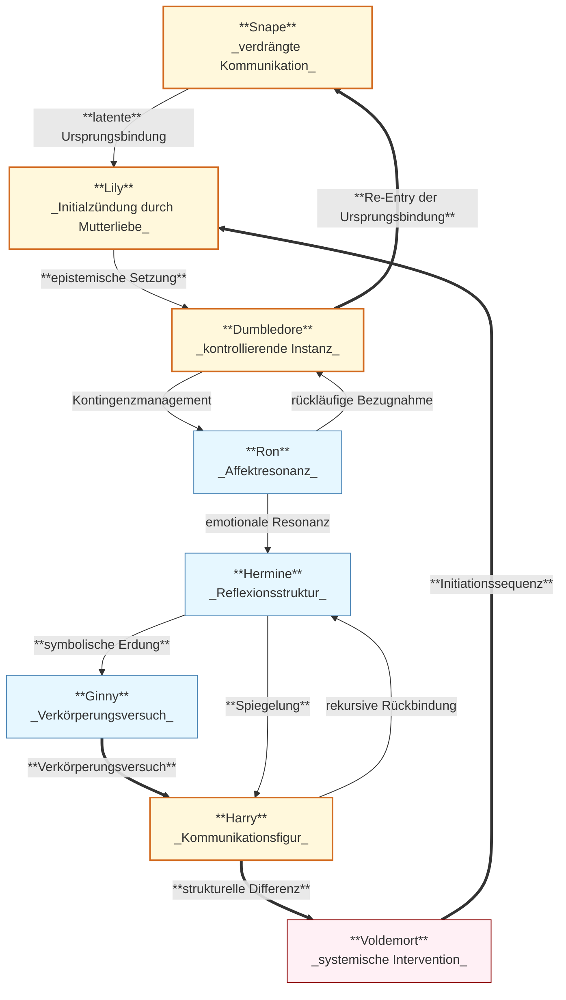

created: 13.7.2025 | [updated](https://git.jochen-hanisch.de/jochen-hanisch/research/) | [publishd]() | [Austausch](https://lernen.jochen-hanisch.de/course/view.php?id=4) | [[Hinweise]]

**Harry Potter und die Entzauberung eines nie gewesenen Helden unter systemtheoretisch-literaturanalytischer Episteminologenese

**Einleitung**

Die vorliegende Essey geht aus einer persönlichen, beinahe beiläufigen Situation hervor, dem erstmaligen gemeinsamen Ansehen eines Harry-Potter-Films mit meiner neunjährigen Tochter. Was als alltägliche Vater-Tochter-Erfahrung begann, entwickelte sich durch algorithmisch verstärkten Social-Media-Content in der darauffolgenden Zeit zu einem erkenntnisgetriebenen Reflexionsprozess. Die Timeline füllte sich mit Szenen, Theorien, Zitaten; eine Überfülle an Fragmenten eines kulturellen Phänomens, das seit Jahrzehnten Leserinnen und Leser sowie Zuschauerinnen und Zuschauer weltweit bewegt. Und mich dazu.

Diese unerwartete Konfrontation mit dem Harry-Potter-Universum stellte eine Frage in den Mittelpunkt, die sich durch klassische Lektüre oder filmische Rezeption kaum stellt:

_Was ist die elementare Essenz der Harry-Potter-Welt?_

Nicht: Wer ist Harry Potter?
Nicht: Was passiert im Detail?
Sondern: **Welche strukturelle Bedingung trägt dieses Erzähluniversum?** 

Ziel dieser Arbeit ist infolgedessen, diese Frage systematisch unter Rückgriff auf systemtheoretische, literaturanalytische und epistemologische Modelle zu durchdringen. Denn vielleicht ist Harry Potter nicht (nur) ein Held, sondern eine Funktion. Nicht Zentrum der Handlung, sondern Bedingung von Kommunikation.

## 1. Vom Eindruck zur Frage: Ein heuristischer Erkenntnisweg

Jede Analyse beginnt mit einem Moment des Staunens oder der Irritation. Der hier dokumentierte Denkprozess nahm seinen Ausgangspunkt in einem beiläufigen Ereignis genauer, dem Schauen eines Harry-Potter-Films in häuslicher Umgebung. Was zunächst als familiäre Alltagserfahrung erschien, entfaltete sich in der darauffolgenden Zeit zu einem erkenntnisleitenden Impuls. Die Reaktion auf diese Erfahrung war ambivalent, zwischen dem Gefühl von Wiedererkennung und epistemischer Verstörung. Was irritierte, war nicht das Narrativ selbst, sondern seine Wirkung, d.h ein kulturell durchcodiertes System, das zugleich vertraut und unheimlich auftrat.

Dieses Kapitel rekonstruiert den Übergang vom ersten Eindruck zur systematischen Frageformulierung. Im Zentrum steht die epistemologische Bewegung, die von der Szene zur Struktur, vom emotionalen Eindruck zur analytischen Abstraktion führt. Der heuristische Erkenntnisweg ist dabei nicht linear, sondern emergent und damit geprägt durch Reibung, Resonanz und reflexive Verdichtung. Die sich herauskristallisierende Leitfrage lautet daher nicht:

- Wer ist Harry Potter?

Sondern:

- Was ist Harry Potter – strukturell betrachtet?

Die folgenden Unterkapitel dokumentieren diesen Prozess. Von der ersten Reaktion über die theoretische Irritation bis zur vorläufigen These, dass Harry Potter weniger Held denn Kommunikationsfigur ist. Der Pfad ist eine Bewegung weg vom Plot, hin zur Struktur. Weg von Identifikation, hin zur Systemanalyse. Und damit auch, der erste Schritt einer epistemischen Entzauberung.

## 1.1 Beobachtete Reaktionen: Neugier, Irritation, algorithmisches Verfangen

Die erste Konfrontation mit einer algorithmisch kuratierten Flut an Inhalten aus dem Harry-Potter-Universum rief eine ambivalente Reaktion hervor, eine Mischung aus Neugier und Irritation. Die Bilder, Zitate und Theoriefragmente wirkten vertraut und zugleich entfremdet, eher so, als Wiederbegegnung mit einem kulturellen Code, der als bekannt galt, nun aber unter neuer epistemischer Spannung erschien. Erinnerungen an frühere Lektüren und kollektive Deutungsmuster mischten sich mit einer schwer zu lokalisierenden inneren Bewegung. Diese Muster mischen sich mit Neugier, die, ausgelöst durch viel nicht-Wissen, dichter und damit größer wurde. Nicht das bereits bekannte, sondern gerade die Lücken des Harry-Potter-Universums waren genau die Wendepunkte, an denen meine zeitlichen und inhaltlichen Betrachtungen ihre Richtung änderten.

Diese algorithmische Wiederbegegnung entfaltete sich jedoch nicht als nostalgische Reminiszenz, sondern als epistemische Störung. Die emotionale Involviertheit war unerwartet intensiv. Weniger stellte sich die Frage nach narrativen Details, sondern vielmehr die, nach der strukturellen Wirkung des Materials selbst. Diese, teilweise deutliche Irritation verband sich mit der Beobachtung einer intergenerationellen Vermittlung. Während die Tochter das Universum erstmals betritt, gerät der Vater erneut in dessen Bann und damit in eine Resonanz, die mehr als biografische Parallelität vermuten lässt. In der Spannung zwischen Erinnerungswissen und gegenwärtiger Konfrontation verdichtete sich eine Vermutung. Es geht hier nicht primär um Figuren oder Handlungen, sondern um Strukturen. Um systemische Bedingungen. Um Kommunikation.

Diese affektive und kognitive Überlagerung markiert die erste Erkenntnisschwelle. Sie war weder geplant noch gesteuert, sondern emergierte aus dem Ineinander von persönlicher Erfahrung, medialer Verstärkung und theoretischer Irritation.

## 1.2 Heuristische Verdichtung: Von der Szene zur Struktur

Ausgehend von der medialen Überreizung entwickelte sich über Nacht ein erkenntnisleitender Verdacht. Die erzählerische Welt rund um Harry Potter operiert nicht entlang klassischer Figurenkonstellationen, sondern entlang systemischer Funktionen. Die Rückkehr in das narrative Material erfolgte somit nicht über ein Wiederlesen oder Nachschauen, sondern über eine sokratische Relektüre:

- Welche Funktion erfüllen die einzelnen Figuren?
- Welche strukturelle Notwendigkeit liegt ihrer Existenz zugrunde?
- Was macht Harry Potter aus – jenseits seiner Position als Namensgeber?

Diese Fragen leiteten eine Relektüre an, die nicht den Plot rekonstruierte, sondern die impliziten Beziehungsarchitekturen zu entschlüsseln suchte. Inmitten dieses Prozesses kristallisierte sich eine zentrale Problemanzeige. Harry Potter könnte eine Figur sein, die nicht aus innerer Motivation handelt, sondern aus systemischer Notwendigkeit existiert. 

## 1.3 Reflexionskern: Die Verschiebung der Frage

Die klassische Frage – Wer ist Harry Potter? – trat zunehmend in den Hintergrund. Statt einer personenbezogenen Deutung rückte eine strukturelle Perspektive in den Vordergrund: Nicht das Wer, sondern das Was wurde zentral. Was ist Harry Potter im systemischen Sinne? Welche Funktion erfüllt er innerhalb der narrativen Gesamtstruktur? Die fortlaufende Auseinandersetzung mit Schlüsselcharakteren wie Snape, Lily und Dumbledore offenbarte ein konsistentes Muster: Ihre Handlungen beziehen sich nicht primär auf sich selbst, sondern auf eine konstitutive Leerstelle – ein Zentrum, das nicht durch Autonomie, sondern durch Anschlussfähigkeit bestimmt ist.

Die Figurenkonstellation und ihre funktionalen Verhältnisse sind in Abbildung 1 (siehe unten) visualisiert.

_Abbildung 1: Systemische Figurenstruktur im Harry-Potter-Universum (eig. Darsetllung)_

Abbildung 1 zeigt die funktionale Struktur der zentralen Figuren im Harry-Potter-Universum aus systemischer Perspektive. Die Analyse ordnet jeder Figur eine spezifische kommunikative Funktion zu, wobei sich die Beziehungslinien nicht als biografisch-psychologisch, sondern als symbolisch-funktional verstehen lassen. Der Pfad beginnt mit **Snape**, dessen verdrängte Kommunikation durch eine latente Ursprungsbindung mit **Lily** verbunden ist. Lily selbst bildet die Initialzündung durch einen strukturellen Akt der Mutterliebe. **Dumbledore** übernimmt daraufhin das epistemische Steuer durch Kontingenzmanagement, das sich über **Ron** als emotionaler Resonanzfigur und **Hermine** als Reflexionsinstanz weiterentwickelt. **Ginny** verkörpert eine symbolische Erdung, die schließlich zur zentralen Figur **Harry** führt, der nicht als Akteur verstanden werden darf, sondern als Kommunikationsfigur. **Voldemort** tritt in diesem Zusammenhang als systemische Intervention auf, die Differenz stiftet und den Kreislauf erneut zur Initialzündung zurückführt. Rückbezüge, etwa von Dumbledore zu Snape oder von Harry zu Hermine, markieren zirkuläre Rückkopplungen, die die kommunikative Dynamik des Systems stabilisieren und variieren. Die Abbildung operationalisiert damit die Grundannahme dieser Arbeit, dass Bedeutung nicht durch individuelle Entscheidungen, sondern durch funktionale Bezüge im symbolischen Netzwerk erzeugt wird.

## 1.4 Erste These: Kommunikationsfigur statt Heldenrolle

Die entstehende Hypothese ist in ihrer Konsequenz radikal:

> Harry Potter ist kein Held.

Zumindest nicht im Sinne klassischer Narrationsmuster, die heroisches Handeln, Wandlung durch Prüfung und autonome Entscheidung ins Zentrum stellen (vgl. Campbell, 2008; Vogler, 2007). Stattdessen erfüllt Harry Potter im narrativen Gefüge eine strukturelle Funktion, d.h. er agiert nicht als initiierender Akteur, sondern als symbolischer Knotenpunkt, an dem Bedeutungsflüsse zusammenlaufen und rekodiert werden. Diese Einsicht erfordert die Einführung eines neuen figurentheoretischen Begriffs: der Kommunikationsfigur. Kommunikationsfiguren sind nicht nur durch psychologische Tiefe oder narrative Entwicklung charakterisiert, sondern durch ihre Position im symbolisch-kommunikativen Raum einer Erzählung. Sie dienen als mediale Instanzen, durch die andere Figuren, Diskurse und Erzählstränge miteinander in Beziehung treten.

Harry Potter ist in diesem Sinne nicht Urheber von Handlung, sondern eine Reflexionsfläche kollektiver Projektionen, institutioneller Machtverhältnisse und mythischer Rahmungen. Als Kommunikationsfigur wird er zum semantischen Resonanzkörper, in dem sich das Narrativ nicht nur organisiert, sondern überhaupt erst systemisch stabilisiert. Seine Funktion ist nicht die eines handelnden Subjekts, sondern die eines strukturkonstitutiven Beobachtungspunkts, an dem Sinn zirkulieren, verdichtet und rückgebunden werden kann. Er ermöglicht dadurch die narrative Selbstbeschreibung des Systems. Nicht vordergründig als psychologisch ausgestalteter Akteur, sondern als figuratives Gefäß für die Selbstbeobachtung des Erzählganzen. Die Figur Harry ließe sich damit als funktionale Leerstelle im Sinne Barthes (1977) verstehen oder als Beobachtungsfigur zweiter Ordnung (vgl. Luhmann, 1997), die nicht im System handelt, sondern durch ihre strukturelle Einbettung das System der Erzählung selbst ermöglicht.

Diese Rahmung erscheint auf den ersten Blick wenig bedeutungsvoll, gerade im Vergleich zum klassischen Heldentum wirkt die Figur der Kommunikationsfigur beinahe nebensächlich oder passiv. Doch genau hierin liegt ihre tiefere Relevanz. Aus systemtheoretischer Perspektive verdichtet sich ihre Funktion zu einer tragenden Bedingung narrativer Emergenz (Luhmann, 1995). Nicht durch Tat, sondern durch Beobachtbarkeit (Luhmann, 1997), nicht durch Handlungsmacht, sondern durch semantische Anschlussfähigkeit (Luhmann, 1984/1997) konstituiert die Kommunikationsfigur das Erzählsystem. Sie steht nicht im Zentrum der Geschichte, sondern ermöglicht, dass es ein Zentrum überhaupt geben kann und dieses als symbolisch verdichtete Schnittstelle narrativer Selbstreferenz (Barthes, 1977; Eco, 1979) existiert.

> Ohne Kommunikation keine Systeme – und ohne Kommunikationsfigur kein narrativ anschlussfähiges Zentrum.

In diesem Sinne übersteigt die Figur der Kommunikationsfigur das klassische Heldenmodell (Campbell, 2008) in ihrer strukturellen Reichweite. Sie ist nicht Ausdruck individueller Entwicklung, sondern Bedingung der Selbstbeschreibung eines symbolisch verfassten Systems. Als funktionale Leerstelle (Barthes, 1977, S. 142) wirkt sie wie ein Resonanzraum für kollektive Projektionen, mythische Rahmungen und diskursive Strukturen, vergleichbar einer „Beobachtungsfigur zweiter Ordnung“, die nicht handelt, sondern Handlungen kommunizierbar macht (Luhmann, 1997, S. 106 ff.).

## 2 Theoretischer Rahmen: Figuren, Kommunikation, Systeme

Die literaturwissenschaftliche Beschäftigung mit narrativen Figuren kennt eine Vielzahl klassifizierender Konzepte. So unterscheidet die strukturalistische Tradition zwischen Protagonist und Antagonist, zwischen aktiver Heldenfigur und passiver Nebenrolle (Rimmon-Kenan, 2002). Joseph Campbell (2008) entwarf mit dem Konzept der „Heldenreise“ ein bis heute prägendes Modell: Der Held durchläuft eine Reihe von Prüfungen, durchlebt Transformation und kehrt gewandelt zurück. Helden handeln in diesem Modell aus innerer Überzeugung, übernehmen Verantwortung und werden zum Gegenstand narrativer Identifikation.

Die Analyse der Figur Harry Potter lässt sich jedoch mit diesen Modellen nur bedingt erfassen. Die im vorliegenden Text entwickelte Hypothese fordert eine begriffliche Erweiterung: Harry Potter erscheint nicht als autonom Handelnder, sondern als strukturelles Zentrum eines kommunikativen Systems. In systemtheoretischer Perspektive (Luhmann, 1997) ist Kommunikation nicht die Handlung eines Individuums, sondern das emergente Produkt aus Information, Mitteilung und Verstehen. Kommunikation stiftet nicht nur Bedeutung, sondern erhält soziale Systeme überhaupt erst aufrecht.

Vor diesem Hintergrund wird hier ein neuer Figurentyp eingeführt: die **Kommunikationsfigur**. Sie ist keine psychologisch motivierte Instanz, sondern ein struktureller Knotenpunkt, an dem narrative, symbolische und systemische Stränge zusammenlaufen. Sie ist weder Initiator noch Empfänger, sondern Ermöglichungsbedingung von Kommunikation. Die Figur Harry Potter wird in dieser Lesart nicht zum Helden stilisiert, sondern zur Projektions- und Verknüpfungsfläche; zu einer Form, die Bedeutung zirkulieren lässt, ohne selbst Bedeutung im Sinne klassischer Subjektivität zu erzeugen.

Die Grundlage für dieses Verständnis bildet die Theorie der [Elementarkommunikation], die Kommunikation nicht als linearen Austausch, sondern als zyklische Triade aus Feedback, Reflexion und Re-Entry beschreibt. Harry erfüllt in dieser Triade nicht die Rolle des Senders oder Empfängers, sondern verkörpert jene Form, die es erlaubt, dass Kommunikation zwischen den anderen Figuren überhaupt möglich, rekontextualisierbar und anschlussfähig bleibt. 

Damit verschiebt sich der Fokus der Analyse: Nicht mehr Handlung oder Entwicklung einer Figur stehen im Zentrum, sondern deren systemische Funktion. Nicht mehr Identifikation, sondern Beobachtbarkeit. Nicht mehr Heldenmut, sondern strukturelle Ermöglichung.

Diese Verschiebung markiert einen Perspektivwechsel von einer psychologisierenden Erzählanalyse hin zu einer systemtheoretischen Figurenanalyse im Sinne narrativer Selbstbeschreibung (vgl. Luhmann, 1997, S. 498 ff.). Figuren wie Harry Potter fungieren in dieser Lesart nicht als Träger individueller Eigenschaften oder innerer Wandlungsprozesse, sondern als **Beobachtungsangebote**, über die ein erzählerisches System sich selbst strukturieren, stabilisieren und weiterentwickeln kann (vgl. Martínez & Scheffel, 2016, S. 94–97). Sie sind **semantische Knotenpunkte**, die Bedeutung nicht erzeugen, sondern zirkulieren lassen – und genau dadurch eine Form von narrativer Systembildung ermöglichen.

# 3. Analytischer Hauptteil: Harry als Kommunikationsfigur

Der folgende Abschnitt entfaltet systematisch die These von Harry Potter als Kommunikationsfigur. Dabei wird untersucht, wie sich seine Rolle nicht als handlungstreibender Held, sondern als strukturelle Ermöglichungsbedingung narrativer Kommunikation verstehen lässt. Ausgangspunkt ist die Beobachtung, dass Harry zu keinem Zeitpunkt echte Entscheidungsfreiheit besitzt und damit keine klassische Heldenstruktur erfüllt. Vielmehr fungiert er als Schnittstelle symbolischer Operationen, als Resonanzfläche systemischer Kräfte und als Projektionsraum anderer Figuren. Diese Analyse gliedert sich in vier zentrale Bereiche: die Dekonstruktion heroischer Strukturen, die systemische Rahmung durch Mutterliebe, die funktionale Zuordnung zentraler Figuren und die Ausweitung auf infrastrukturelle Träger wie Orte und Objekte. Ziel ist es, Harrys Funktion im narrativen System nicht psychologisch, sondern strukturell zu verstehen.

**Chronologische Systemstruktur im Überblick (Gantt-Diagramm)**

Das folgende Gantt-Diagramm visualisiert eine zeitsystematische Parallelisierung zentraler Personenbiografien, narrativer Ereignisse und strukturbildender Meilensteine im Harry-Potter-Universum. Es dient der historischen Kontextualisierung der Analyse und bildet die Grundlage für systemisch-dynamische Interpretationen entlang einer Jahresachse von 1881 bis 2019. Die Darstellung integriert sowohl die innerfiktionale Erzählzeit (z. B. Schuljahre, Kriege, familiäre Entwicklungen) als auch dokumentierte Nachkriegsverläufe (z. B. Epilog, _Cursed Child_) in einer gemeinsamen Zeitstruktur.

Das Diagramm strukturiert das Universum als systemisch-dynamischen Zeitverlauf: Es kombiniert biografische Entwicklungen, erzählerische Schlüsselmomente und fiktionale Strukturtexte in einer gemeinsamen Darstellung. Dadurch werden Wechselwirkungen zwischen Figuren, sozialen Systemen und narrativen Ereignissen sichtbar und können funktional analysiert werden.

_Abbildung 2: Chronologische Systemstruktur im Überblick (eig. Darstellung)_

_Tabelle 1: Legende zum Gantt-Diagramm „Harry-Potter-Zeitstruktur“_

|**Sektion**|**Inhalt**|**Bedeutung**|
|---|---|---|
|**Historische Figuren**|Frühere Generationen (1880–1945), z. B. Dumbledore, Grindelwald|_Hintergrundsysteme, Präkonfliktstruktur_|
|**Orden des Phönix / Marauders**|Akteure des ersten Krieges, Elterngeneration Harrys|_Brückenfiguren, Konfliktträger zwischen den Kriegen_|
|**Weasley-Familie**|Familiäre Konstellationen über mehrere Jahrgänge|_Soziales Referenzsystem, Allianzstruktur_|
|**Harrys Jahrgang & Umfeld**|Schulzeitbegleiter, Mitstreiter:innen, Gegenspieler:innen|_Zentrale Bezugseinheiten der Erzählung_|
|**Todesser**|Hauptantagonisten um Voldemort|_Systembedrohung, destruktive Ordnung_|
|**Historische Ereignisse**|Politische und gesellschaftliche Umbrüche, Übergänge, Reorganisationen|_Systemphasen, Strukturbrüche_|
|**Erzählzeit**|Zeitliche Verortung der Hauptwerke inkl. Erweiterungen|_Fiktionale Rahmung der Handlungen_|
|**Meilensteine (narrativ-funktional)**|Punktuelle Schlüsselereignisse mit systemischer Relevanz|_Kipppunkte, Identitätsumbrüche, Übergänge_|
Ein Meilenstein in Tabelle 1 ist ein punktuell verortbares, narrativ entscheidendes Ereignis, das mindestens eine der folgenden Funktionen erfüllt:

- **Transformation von Beziehungen** (z. B. Tod Dumbledores)
- **Systemeintritt oder -austritt** (z. B. Einschulung in Hogwarts, Epilog)
- **Eskalation oder Deeskalation** (z. B. Rückkehr Voldemorts)
- **Wendepunkt im Erzählrahmen** (z. B. Basiliskenkampf)

Das Gantt-Diagramm in Abbildung 2 bietet damit eine chronologische Übersicht über zentrale Personenbiografien, narrative Ereignisse und relevante Zeitmarken im Harry-Potter-Universum. Es verdeutlicht die zeitlichen Zusammenhänge und parallelen Entwicklungen der Charaktere sowie der konflikthaften Handlungsverläufe. Die Zeitachse reicht von 1881 (Geburt Albus Dumbledores) bis 2019 (Zeitreiseereignisse in _The Cursed Child_) und setzt die Lebensdaten der Figuren, historisch-fiktionale Ereignisse sowie schulzeitbezogene und postnarrative Entwicklungen in systemische Beziehung. Diese Struktur bildet die Grundlage für eine funktionale Analyse von Kommunikationsfiguren und deren Rollen im narrativen Gesamtgefüge.

## 3.1 Keine Entscheidungsfreiheit – keine Autonomie – keine Heldenstruktur

Im klassischen Modell heroischer Narration sind Handlungsfreiheit und Entscheidung zentrale konstitutive Elemente der Heldenfigur (Campbell, 2008). Der Held wird dort als jemand konzipiert, der bewusst eine Schwelle überschreitet, sich freiwillig Prüfungen unterzieht und in reflektierter Autonomie handelt. Übertragen auf die Figur Harry Potter erweist sich dieses Modell jedoch als unpassend. In keiner entscheidenden Wendung seiner Geschichte ist Harry wirklich autonom.

Die Analyse zeigt, dass Harrys gesamte Biografie durch systemische Determination geprägt ist: Die versuchte Tötung durch Voldemort, der Schutz durch Lily Potters Opfer, die Aufnahme bei den Dursleys, die Entdeckung als Zauberer, die Aufnahme in Hogwarts, seine Rolle im Widerstand, sein symbolisches Sterben – all dies sind keine selbstgewählten Entscheidungen, sondern strukturierte Rahmungen, die auf ihn einwirken. Auch spätere Momente, etwa das bewusste Betreten des Verbotenen Waldes, geschehen nicht aus einer souveränen Reflexion, sondern als Resultat systemischer Zwangslagen und symbolischer Erwartungsketten.

In Anlehnung an Gerd Gigerenzer (2013), der betont, dass Entscheidung nur dort stattfindet, wo echte Alternativen bestehen, lässt sich festhalten: Harry Potter entscheidet nicht – er reagiert innerhalb eng gesteckter Möglichkeitsräume. Daraus ergibt sich: Keine Entscheidung, keine Autonomie – und somit auch keine Heldenstruktur.

Stattdessen agiert Harry als strukturelle Reaktionsfläche. Er ist nicht Subjekt im emphatischen Sinne, sondern Vermittlungsform für die Operationen anderer. Diese Einsicht bildet die Grundlage für die begriffliche Verschiebung: vom Helden zur Kommunikationsfigur.

## 3.2 Systemlogik: Mutterliebe als strukturelle Initialzündung

Die narrative Urszene des Harry-Potter-Universums – der gescheiterte Tötungsversuch Voldemorts an einem Säugling – ist nicht primär als dramaturgisches Ereignis zu verstehen, sondern als strukturelle Setzung. Die Mutterliebe Lilys wird im Text explizit als magischer Schutz benannt (Rowling, 1997), doch in systemtheoretischer Perspektive erscheint sie nicht als moralischer Akt, sondern als kommunikative Initialzündung. Ihre Handlung – das bewusste Sich-Opfern – erzeugt die erste symbolische Differenz, auf deren Grundlage sich das gesamte narrativ-kommunikative System konstituiert.

Lily Potters Tod ist nicht nur ein individuelles Ereignis, sondern ein strukturierender Akt im Sinne einer „primären Semantik“ (Luhmann, 1995): Ihre Entscheidung, Harry zu schützen, erzeugt ein symbolisch codiertes Handlungsmuster, das im weiteren Verlauf immer wieder zitiert, erinnert, übertragen und transformiert wird. Die Mutterliebe fungiert damit nicht als psychologisches Moment, sondern als systemisches Programm. Sie erzeugt den Kommunikationsraum, innerhalb dessen Harry als Figur überhaupt erst Bedeutung entfalten kann – nicht aus sich selbst, sondern als Träger dieser ursprünglichen Operation.

Das bedeutet: Ohne Lilys Handlung gäbe es keine symbolische Signatur auf Harrys Stirn, keine Verbindung zu Voldemort, keine strukturelle Sonderposition – und damit kein narratives Zentrum. Ihre Entscheidung wirkt als „Startbedingung“ für das gesamte System, vergleichbar mit einem grundlegenden Differenzierungsakt in soziologischen Systemtheorien. Erst die durch sie ermöglichte Kommunikation macht Harry zu dem, was er für das System darstellt: eine leere Mitte, die Bedeutung zirkulieren lässt.

## 3.3 Figurenanalyse unter kommunikationstheoretischer Perspektive

Nachdem Harry als strukturelles Zentrum eines narrativen Kommunikationssystems herausgearbeitet wurde, richtet sich der analytische Fokus nun auf sein relationales Gefüge: jene Figuren, die das System nicht nur bevölkern, sondern funktional strukturieren. Die folgenden Analysen begreifen zentrale Charaktere des Harry-Potter-Universums nicht als psychologisch individuelle Akteure, sondern als symbolisch codierte Instanzen, die spezifische Operationen innerhalb eines übergeordneten Kommunikationsraums vollziehen.

In systemtheoretischer Lesart (Luhmann, 1997) sind es nicht Subjekte, die handeln, sondern kommunikative Operationen, die Sinn erzeugen und stabilisieren. Figuren wie Snape, Dumbledore, Ron, Hermine, Ginny oder Voldemort werden in dieser Perspektive nicht nach innerer Motivlage befragt, sondern auf ihre funktionale Rolle innerhalb des symbolischen Regelsystems hin analysiert. Jede Figur wird zur Verkörperung einer bestimmten Kommunikationsform – verdrängt, orchestriert, gespiegelt, verkörpert oder gestört.

Die Analyse zielt damit nicht auf Charakterzeichnung, sondern auf Strukturverständnis: Wie organisieren diese Figuren das kommunikative Feld um Harry herum? Welche systemischen Funktionen übernehmen sie – und wie tragen sie zur Aufrechterhaltung, Irritation oder Transformation des narrativen Systems bei?

### 3.3.1 Snape als verdrängte Kommunikation

Severus Snape verkörpert innerhalb des narrativen Systems eine Figur, die weder eindeutig antagonistisches noch protagonistisches Handeln aufweist. Vielmehr erscheint er als Träger einer verdrängten, gleichwohl strukturell wirkmächtigen Kommunikationsoperation. Seine lebenslange Liebe zu Lily Potter wird im Text weder vollständig ausgesprochen noch praktisch realisiert. Sie bleibt als unerfüllte, aber handlungsleitende Bezugsgröße wirksam und bestimmt Snape in all seinen zentralen Entscheidungen – vom Schutz Harrys bis hin zur finalen Preisgabe seiner Erinnerung an Dumbledore (vgl. Abbildung 1: Pfad A → B).

Aus systemtheoretischer Perspektive lässt sich Snape als Instanz der latenten Kommunikation beschreiben: Er artikuliert das, was im System nicht direkt sagbar ist – die Ambivalenz zwischen Zugehörigkeit und Ausschluss, zwischen Loyalität und Selbstschutz. Sein Verhalten fungiert als Korrekturoperation gegenüber der einseitigen Narration der „Guten“ und „Bösen“. Dabei operiert er in doppelter Codierung: Nach außen hin erscheint er als Todesser, im Innern jedoch agiert er als Schutzinstanz für Harry – und damit für die Kommunikation selbst.

Die Figur Snape zeigt, dass auch unterdrückte oder unvollständige Kommunikation systemisch wirksam sein kann. Er repräsentiert jene Kommunikationsformen, die nicht offen zirkulieren, aber dennoch Handlungen strukturieren. Damit wird er zu einer Schattenfigur im wörtlichen Sinne – nicht am Rand der Geschichte, sondern als deren strukturell notwendige Verdunkelung. In der Lesart als Kommunikationsfigur wird Snape zur Projektionsfläche verdrängter, aber wirksamer Sinnbildung, die das System zusammenhält, indem sie seine Ambivalenz mitträgt.

### 3.3.2 Dumbledore als kontrollierende Instanz

Albus Dumbledore fungiert im narrativen System nicht primär als weiser Mentor, sondern als zentrale Instanz der Steuerung und Kontrolle symbolischer Operationen. In seiner Funktion als Schulleiter von Hogwarts, als Gründer des Ordens des Phönix und als Vertrauensperson sowohl für Harry als auch für Severus Snape nimmt er eine Position ein, die nicht durch moralische Klarheit, sondern durch strategische Vieldeutigkeit geprägt ist (vgl. Abbildung 1: Pfad B → C und C ⇒ A).

Dumbledore weiß mehr als andere Figuren, und dieses Wissensgefälle nutzt er, um systemische Stabilität zu erzeugen. Sein Handeln lässt sich als Operation des „Kontingenzmanagements“ beschreiben: Er hält das System offen, verhindert Eskalation und orchestriert Entwicklungen, ohne sie vollständig kontrollieren zu können. Dabei offenbart sich seine Rolle als eine des stillen Dirigenten: Nicht durch direkte Eingriffe, sondern durch Setzung symbolischer Marker (z. B. der Zauberstab, der Phönix, der Spiegel Nerhegeb) strukturiert er die narrative Realität.

In kommunikationstheoretischer Perspektive stellt Dumbledore die Funktion der Metakommunikation bereit. Er beobachtet nicht nur Kommunikation, sondern reflektiert ihre Möglichkeitsbedingungen. Seine Gespräche mit Snape, seine Briefe an Harry, seine Entscheidungen über Leben und Tod anderer Figuren – all dies sind Akte der Reflexionscodierung im Sinne Luhmanns (1997): Sie erzeugen Kommunikationsformen zweiter Ordnung, durch die das System sich selbst beobachtet und reguliert.

Dumbledore wird so zur Figur systemischer Steuerung – nicht im Sinne totaler Kontrolle, sondern als Instanz, die Kommunikation orchestriert, differenziert und absichert. Seine moralische Ambivalenz ist kein Bruch, sondern Ausdruck einer höheren Systemlogik: Stabilität durch strategische Unsichtbarkeit. Als kontrollierende Instanz bildet er das kommunikative Pendant zu Harrys leeren Zentrum: Während Harry Bedeutung zirkulieren lässt, steuert Dumbledore die Bedingungen dieser Zirkulation.

### 3.3.3 Ron & Hermine als Resonanzräume

Ron Weasley und Hermine Granger erfüllen im narrativen System von Harry Potter keine strukturelle Zentralfunktion im Sinne der Kommunikationsfigur, sondern agieren als dynamische Resonanzräume, innerhalb derer sich kommunikative Prozesse spiegeln, verstärken oder kontrastieren. Sie sind nicht bloß Freunde oder Helfer, sondern strukturieren – durch ihre Reaktionen, Zweifel, Konflikte und Unterstützungen – die Art und Weise, wie Harrys Rolle als Zentrum erlebbar und beobachtbar wird (vgl. Abbildung 1: Pfad C → D → E).

Ron verkörpert dabei die emotionale Alltäglichkeit, den durchlässigen Modus von Zugehörigkeit und Abgrenzung. In Phasen der Überforderung zieht er sich zurück, etwa in „The Deathly Hallows“ (Rowling, 2007), nur um dann gestärkt und verändert wieder in das System einzutreten. Diese Bewegungen markieren nicht bloß narrative Wendungen, sondern verweisen auf eine tiefere Struktur: Ron agiert als Affekt- und Konfliktfilter, an dem sich die Tragweite von Harrys Position immer wieder neu bemisst.

Hermine hingegen übernimmt die Rolle einer stabilisierenden Wissensinstanz. Sie stellt durch ihr enzyklopädisches Gedächtnis, ihre moralische Klarheit und ihre strategischen Beiträge eine reflexive Struktur zur Verfügung, in der die Unschärfen und Ohnmachtserfahrungen Harrys gerahmt und bearbeitbar werden. In diesem Sinne fungiert Hermine als symbolische Externalisierung der systemischen Operation Reflexion (vgl. Hanisch-Johannsen, 2024).

Gemeinsam bilden Ron und Hermine kein bloßes Begleittrio, sondern eine kommunikative Doppelstruktur, durch die Harrys Leerstelle konturiert wird. Sie sind keine Helden im klassischen Sinn, aber auch keine Nebenfiguren – sondern dynamische Resonanzräume, in denen das kommunikative Zentrum sichtbar wird.

### 3.3.4 Ginny als Verkörperungsversuch

Ginny Weasley übernimmt innerhalb des narrativen Systems eine besondere Funktion: Sie markiert den Versuch, die abstrakte Kommunikationsfigur Harry Potter in eine körperlich-emotionale Realität zu überführen. Ihre anfängliche Verehrung Harrys – geprägt durch kindliche Bewunderung und mediale Inszenierung – transformiert sich im Verlauf der Erzählung zu einer tatsächlichen Beziehung. Diese Entwicklung ist jedoch nicht als klassische Liebesgeschichte zu lesen, sondern als struktureller Versuch, dem leeren Zentrum des Systems eine Form von greifbarer Subjektivität zu verleihen (vgl. Abbildung 1: Pfad E → H).

In ihrer Verbindung mit Ginny wird Harry erstmals als Mensch unter Menschen sichtbar – nicht als Projektionsfläche, sondern als Figur mit Beziehung, Körper, Emotion. Doch selbst in dieser Verbindung bleibt das strukturelle Ungleichgewicht bestehen: Ginny bleibt relativ randständig, ihre Perspektive wird kaum erzählt. Die Beziehung dient weniger ihrer Individualität als vielmehr der Erdung Harrys – sie ermöglicht ihm, in einem narrativen Moment eine temporäre Verkörperung zu erfahren. Kommunikation verdichtet sich hier in Intimität, ohne das strukturelle Gefälle zu lösen.

In dieser Lesart erscheint Ginny nicht als narrative Belohnung oder romantisches Ziel, sondern als notwendige Resonanzfläche zur Simulation von Subjektivität. Ihre Rolle verweist damit auf ein zentrales Paradox: Die Kommunikationsfigur Harry bleibt auch im Moment größter Nähe strukturell leer – Ginny ermöglicht Sichtbarkeit, aber keine Transformation.

### 3.3.5 Lord Voldemort als systemische Intervention

Lord Voldemort verkörpert innerhalb des narrativen Systems die Form einer systemischen Intervention, die nicht auf Stabilität, sondern auf Destabilisierung zielt. Er ist keine klassische Antagonistenfigur im Sinne eines psychologisch nachvollziehbaren Gegenspielers, sondern agiert als strukturelle Störung – eine Operation, die Kommunikation nicht verhindert, sondern radikal umbaut (vgl. Abbildung 1: Pfad F → G).

In seiner Beziehung zu Harry Potter wird dieses Muster besonders deutlich: Voldemort ist nicht nur der „Mörder der Eltern“ oder der „Bösewicht“, sondern derjenige, der durch den gescheiterten Tötungsversuch selbst Teil des kommunikativen Systems wird. Seine Seele, fragmentiert durch die Horcruxe, wird symbolisch und real in Harry eingeschrieben – als unfreiwillige Kopplung zweier Systeme, die sich gegenseitig bedingen und bedrohen. Damit wird Voldemort zu einer paradoxen Figur: Er ist sowohl externer Angriff als auch interner Bestandteil, sowohl Zerstörer als auch Quelle systemischer Dynamik.

Aus systemtheoretischer Perspektive lässt sich Voldemort als „strukturelle Kopplung“ beschreiben (vgl. Luhmann, 1997): Er ist nicht Teil des Systems im engeren Sinne, aber notwendig, um dessen Grenzen und Stabilität zu markieren. Er operiert als systemischer Feind, der durch seine Intervention den Fortbestand der Kommunikation sichert. Seine Existenz erlaubt es dem narrativen System, Differenz zu erzeugen – zwischen Gut und Böse, Leben und Tod, Magie und Ohnmacht.

Voldemort ist somit nicht nur ein Gegner, sondern eine Bedingung. Ohne ihn gäbe es keine Kontraste, keine Prüfungen, keine narrativen Eskalationen. Seine Rolle besteht darin, das System ständig herauszufordern – nicht um es zu zerstören, sondern um es in seiner Kommunikationsstruktur sichtbar zu machen. In dieser Lesart ist Voldemort nicht der Feind von Harry, sondern die notwendig negative Operation, durch die Harrys strukturelle Funktion erst erkennbar wird.

### 3.3.5 Weitere Figuren als Herleitungen

Neben den zentralen Figuren Harry, Snape, Dumbledore, Ron, Hermine, Ginny und Voldemort lassen sich weitere Charaktere des Harry-Potter-Universums systematisch als funktionale Ableitungen der zentralen Kommunikationsstruktur lesen. Diese Figuren operieren nicht als eigene Zentren, sondern stabilisieren, variieren oder konterkarieren das kommunikative Gefüge (vgl. Abbildung 1: periphere Funktion in Bezug auf F).

Neville Longbottom etwa fungiert als kontrafaktische Alternative: Er hätte gemäß Prophezeiung ebenso „der Auserwählte“ sein können (Rowling, 2005). Doch seine biografischen Bedingungen – insbesondere die geistige Zerstörung seiner Eltern – verhindern jene zentrale Initialzündung durch symbolisch aufgeladene Mutterliebe, wie sie Harry widerfuhr. Longbottoms Funktion besteht somit nicht in heroischer Parallelität, sondern in der Konturierung der Sonderstellung Harrys: durch Differenz.

Auch Figuren wie Luna Lovegood oder Draco Malfoy erfüllen spezifische systemische Rollen. Luna destabilisiert durch ihre Andersartigkeit den normativen Erwartungsrahmen von Kommunikation – sie repräsentiert eine alternative Rationalität, die das System zwar irritiert, aber auch erweitert. Malfoy hingegen operiert als ambivalenter Spiegel: Er demonstriert, wie nahe Gehorsam, Angst, Überforderung und systemische Verstrickung beieinanderliegen. Seine Entwicklung verdeutlicht, dass auch Feindschaft keine monolithische Größe ist, sondern Teil eines komplexen Kommunikationsgefüges.

Diese Figuren sind keine Nebenfiguren im traditionellen Sinn, sondern periphere Verstärker, Störgrößen oder Kontrastmittel. Sie machen durch ihre spezifischen Operationen sichtbar, was am Zentrum selbst nicht thematisiert wird: die Pluralität möglicher Formen, in denen das System sich selbst betrachtet. Insofern sind sie Herleitungen – nicht aus Harry, sondern aus der Logik seiner strukturellen Funktion. Sie existieren, weil Kommunikation Varianz braucht – und Variation sichtbar machen muss.

## 3.4 Kommunikationsstruktur- und Sinnanalyse

Der folgende Abschnitt untersucht, wie sich Kommunikationsstruktur und Sinn im Harry-Potter-Universum nicht nur durch Figuren, sondern auch durch Orte, Objekte und symbolische Arrangements konstituieren. Dabei wird deutlich, dass nicht nur Personen, sondern auch Dinge und Räume kommunikative Funktionen übernehmen. Die Perspektive folgt konsequent dem Konzept der Kommunikationsfigur und erweitert es auf infrastrukturelle und materiale Träger systemischer Bedeutung. 

### 3.3.1 Orte als Träger kommunikativer Infrastruktur (z.B. Hogwarts)

Orte wie Hogwarts fungieren im narrativen System nicht bloß als Schauplätze, sondern als strukturelle Infrastrukturen für Kommunikation. Sie rahmen, ermöglichen und differenzieren kommunikative Prozesse. So stellt Hogwarts nicht nur den Ort des Geschehens dar, sondern bildet ein funktionales Zentrum, an dem soziale Differenzierung (Häuser), institutionelle Steuerung (Lehrkörper, Schulleitung) und symbolische Rahmung (Feste, Rituale, Prüfungen) systematisch orchestriert werden. Die Schule erlaubt nicht nur Begegnung, sondern strukturiert diese entlang normativer Erwartungen und institutioneller Logiken. In systemtheoretischer Lesart handelt es sich bei Hogwarts um eine infrastrukturelle Ermöglichungsbedingung für das kommunikative System der magischen Welt: Ohne den Ort kein Netz an Beziehungen, keine Differenzierung von Zugehörigkeit, keine strukturierte Übergabe von symbolischem Wissen. Damit ist Hogwarts selbst eine funktionale Kommunikationseinrichtung.

### 3.3.2 Objekte als Träger kommunikativer Sinngebung (z.B. Zauberstäbe)

Objekte im Harry-Potter-Universum sind keine neutralen Requisiten, sondern hochgradig codierte Träger kommunikativer Bedeutung. Besonders deutlich wird dies an den Zauberstäben, die in mehrfacher Hinsicht symbolische Funktionen übernehmen. Sie sind nicht nur Werkzeuge magischer Handlung, sondern markieren Zugehörigkeit, Differenz und narrative Machtverhältnisse. Der Zauberstab „wählt“ seinen Besitzer – eine Form symbolischer Kopplung, die über Handlungskompetenz hinaus auf ein tieferes semantisches Band verweist (Rowling, 1997).

In systemtheoretischer Perspektive lassen sich solche Objekte als „symbolisch generalisierte Kommunikationsmedien“ (Luhmann, 1995) deuten: Sie ermöglichen Kommunikation unter Unsicherheit, indem sie Handlungserwartungen stabilisieren. Der Elderstab etwa steht nicht nur für Macht, sondern fungiert als strukturelle Markierung von Führungsanspruch und legitimer Gewalt. Ebenso symbolisieren Horcruxe die Möglichkeit, Bedeutung in Dinge einzuschreiben, um sie dem Zugriff anderer Kommunikation zu entziehen. Objekte wie der sprechende Hut, der Zeitumkehrer oder der Spiegel Nerhegeb erweitern das System narrativer Kommunikation durch spezifische Funktionalisierungen: Sie machen Unverfügbares verfügbar, Unsichtbares sichtbar oder Mögliches realisierbar. Diese Objekte strukturieren nicht nur Handlung, sondern eröffnen alternative Beobachtungsperspektiven und erzeugen damit neue Formen von Sinn.

Objekte im Harry-Potter-Universum sind somit keine bloßen Mittel zum Zweck, sondern systemisch wirksame Kommunikationsfiguren: Sie stabilisieren semantische Räume, verdichten symbolische Logiken und operieren als materielle Infrastrukturen narrativer Bedeutung.

# 4	Diskussion: Entzauberung als epistemischer Akt

Die bisherige Analyse hat gezeigt, dass das Harry-Potter-Universum unter systemischer Lesart nicht als klassische Heldenreise, sondern als symbolisch strukturiertes Kommunikationssystem zu verstehen ist. Im Zentrum steht nicht eine autonome Figur, sondern ein leerer Bezugspunkt, an dem Bedeutung zirkuliert. Dieser Perspektivwechsel bleibt jedoch nicht folgenlos: Die Transformation des narrativen Mythos in eine funktionale Struktur führt zu einem Erkenntniseffekt, der nicht nur intellektuell, sondern auch affektiv wirksam wird. Der Zauber, der der Geschichte innewohnte, wird entzogen – nicht aus Missachtung, sondern als Folge radikaler Analyse.

Die Diskussion dieses Abschnitts widmet sich den Konsequenzen dieser Entzauberung: der Reaktion auf den Verlust von mythologischer Unbestimmtheit, dem Bruch mit traditionellen Rezeptionsweisen, dem möglichen Theoriegewinn durch die Einführung eines neuen Literaturbegriffs sowie der abschließenden Rückbindung an die systemtheoretische Grundannahme, dass Realität durch Kommunikation gestiftet wird. Die Entzauberung wird damit nicht als Verlust, sondern als epistemische Transformation lesbar: Sie ersetzt Magie durch Struktur, Identifikation durch Beobachtung, Heldenerzählung durch Systemanalyse.

## 4.1 Reflexion der eigenen Reaktion: Leere nach Entdeckung des Elementarkerns

Die Analyse der Harry-Potter-Erzählstruktur entlang systemischer Kommunikationsprozesse führte zu einer finalen Einsicht, die nicht mit Euphorie, sondern mit einer überraschenden Leere einherging. Sobald die narrative Oberfläche dekonstruiert, alle Figuren funktional zugeordnet und die zugrunde liegende Kommunikationslogik offengelegt waren, blieb eine entzauberte Struktur zurück – kohärent, aber ernüchternd.

Diese Leere ist nicht als kognitive Erschöpfung zu deuten, sondern als epistemische Konsequenz: Wenn ein System vollständig analysiert und verstanden ist, verliert es seinen mythischen Überschuss. Das ehemals Zauberhafte wird zum strukturell Notwendigen, das Emotionale zur systemischen Funktion, das Besondere zur kommunikativen Bedingung. Es ist eine Form der erkenntnistheoretischen Entzauberung, wie sie Max Weber (1919) bereits für die Moderne beschrieben hat – nun jedoch angewandt auf ein fiktionales Narrativ.

Die affektive Reaktion auf diese Entzauberung ist ambivalent: Sie oszilliert zwischen dem Stolz über die begriffliche Durchdringung und der Trauer über den Verlust der magischen Undurchsichtigkeit. Der Zauber weicht der Struktur – und damit der Möglichkeit, nicht mehr staunen zu können, sondern nur noch erklären zu dürfen.

Diese Leere ist kein Scheitern, sondern ein Indikator epistemischer Radikalität. Wer verstehen will, muss entzaubern – und wer entzaubert, verliert notwendigerweise jene Unbestimmtheit, die Narrationen lebendig erscheinen lässt.

## 4.2 Kontrast zur Rezeption: Identifikation vs. Strukturverständnis

Die klassische Rezeption der Harry-Potter-Erzählung basiert weitgehend auf emotionaler Identifikation. Leserinnen und Leser, insbesondere Kinder und Jugendliche, erleben Harry als Projektionsfläche für eigene Unsicherheiten, Wünsche und Entwicklungshoffnungen. Er erscheint als mutiger, über sich hinauswachsender Held, der trotz widriger Umstände seinen Platz in der Welt findet – ein narratives Muster, das archetypisch anschlussfähig ist (vgl. Campbell, 2008).

Die hier entwickelte strukturanalytische Lesart hingegen stellt diesen Identifikationsmodus radikal infrage. Sie ersetzt psychologische Tiefenstruktur durch systemische Funktion, Motivpsychologie durch systemische Kommunikationslogik. In dieser Perspektive verliert Harry seine klassische Heldenrolle zugunsten einer konnektiven Funktion im narrativen System. Diese Verschiebung erzeugt einen tiefen Bruch zur gängigen Rezeption: Statt emotionaler Bindung an eine Figur tritt die Analyse ihrer operativen Rolle innerhalb eines symbolischen Regelsystems.

Der Kontrast zwischen Identifikation und Strukturverständnis lässt sich als paradigmatischer Unterschied zwischen alltagsweltlicher und theoretischer Beobachtung beschreiben. Während die populäre Rezeption den Mythos affirmiert und weiterträgt, dekonstruiert die Analyse seine Grundstruktur – mit der Folge, dass die narrative Kohärenz durch funktionale Transparenz ersetzt wird. Diese Spannung markiert den epistemischen Kern jeder Entzauberung: Sie nimmt nicht nur den Zauber, sondern auch den Schutz der Unwissenheit.

## 4.3 Theoriegewinn: Kommunikationsfigur als neuer Literaturbegriff?

Die im Verlauf dieser Analyse entwickelte Perspektive auf Harry Potter als Kommunikationsfigur lässt sich nicht nur als Einzelbeobachtung innerhalb eines spezifischen narrativen Universums verstehen, sondern legt einen allgemeinen literaturwissenschaftlichen Theoriegewinn nahe. Sie fordert eine Erweiterung klassischer Figurentypologien, wie sie in der strukturalistischen und erzähltheoretischen Tradition verankert sind, zugunsten einer systemisch-funktionalen Lesart.

Während traditionelle Konzepte zwischen Akteur, Erzähler, Held, Gegenspieler oder Nebenfigur unterscheiden, etabliert die Kategorie der Kommunikationsfigur einen neuen Typus: eine Figur, die nicht durch Handlungsträgerschaft, sondern durch ihre Rolle in der Aufrechterhaltung, Strukturierung und Zirkulation von Bedeutung innerhalb eines narrativen Systems definiert ist. Sie wirkt nicht durch Entscheidungsfreiheit oder narrative Entwicklung, sondern durch Anschlussfähigkeit im Sinne Luhmanns (1997).

Der Theoriegewinn liegt in der Etablierung eines begrifflichen Werkzeugs, das es erlaubt, Figuren nicht primär als psychologische Konstrukte oder Träger von Narration zu deuten, sondern als emergente Formen systemischer Kommunikation. Dies eröffnet neue Zugänge zur Analyse komplexer narrativer Systeme – insbesondere solcher, die nicht auf klare Handlungsmotivationen, sondern auf strukturelle Dynamiken und symbolische Verdichtungen bauen.

Damit stellt die Kommunikationsfigur einen literaturanalytischen Begriff dar, der nicht nur zur Relektüre bekannter Texte einlädt, sondern auch zur methodologischen Weiterentwicklung literaturwissenschaftlicher Theoriebildung beiträgt.

## 4.4 Rückbindung an die systemische Lesart: Kommunikation stiftet Realität

Die Analyse kulminiert in der systemischen Einsicht, dass Harry Potter nicht als Subjekt einer Heldenreise zu interpretieren ist, sondern als operative Mitte eines symbolisch aufgeladenen Kommunikationssystems. Diese Perspektive verschiebt die Fragestellung von der personalen Identifikation zur funktionalen Differenzierung: Nicht *wer* Harry ist, sondern *was* er ermöglicht, wird zur zentralen epistemischen Figur.

Kommunikation, im Sinne Luhmanns (1995), ist weder Handlung noch Bewusstseinsakt, sondern ein eigenständiger Vorgang, der soziale Realität überhaupt erst erzeugt. Harry Potter erfüllt in dieser Logik die Rolle eines systemischen Katalysators – seine Präsenz aktiviert, bündelt und stabilisiert kommunikative Prozesse, ohne dabei selbst autonomer Ursprung dieser Prozesse zu sein. Er ist nicht der Held, sondern der Kommunikationsanker, an dem sich symbolische Ordnungen entzünden, transformieren und reproduzieren.

Diese Rückbindung verdeutlicht: Realität innerhalb des narrativen Systems entsteht nicht durch Figurenpsychologie oder kausale Handlungsverkettung, sondern durch die kontinuierliche Zirkulation symbolischer Kommunikation. Harry ist nicht der Ursprung dieser Zirkulation, aber ihre Bedingung. Das Harry-Potter-Universum wird damit zu einem Paradefall für die erkenntnistheoretische These: **Kommunikation stiftet nicht nur Sinn – sie stiftet Realität.**

# 5.	Schluss: Was bleibt, wenn der Zauber verschwindet?

Die vorangegangene Analyse hat das Harry-Potter-Universum aus der Perspektive einer systemtheoretisch-literaturanalytischen Strukturkritik untersucht. Die zentrale These – Harry Potter als Kommunikationsfigur – wurde systematisch entfaltet, empirisch durch narrative Befunde gestützt und theoretisch im Lichte einschlägiger Literatur verortet. Der klassische Heldenbegriff wurde dekonstruiert, narrative Rollen funktional uminterpretiert und der Zauber als erkenntnistheoretisch aufgeladene Metapher entgrenzt.

Im nun folgenden Schlussteil verdichtet sich diese Bewegung zu einer letzten epistemischen Reflexion: Welche Konsequenzen hat eine solche Entzauberung – intellektuell, affektiv, rezeptionsästhetisch und methodologisch? Was bleibt, wenn Identifikationsfiguren zu strukturellen Funktionen werden, wenn Erzählungen nicht mehr magische Resonanzräume, sondern kommunikationssystemische Netzwerke sind? Und lässt sich aus dieser Reduktion auf Struktur ein Gewinn ziehen – oder lediglich der Verlust des Staunens?

Der Schluss geht diesen Fragen in vier Abschnitten nach: Zunächst wird Harrys Rolle als strukturelles Zentrum noch einmal pointiert (5.1), dann die affektive Folge des Erkenntnisprozesses reflektiert (5.2). Es folgt ein Ausblick auf die Übertragbarkeit des Konzepts (5.3), bevor im letzten Teil (5.4) noch einmal der epistemische Status des Entzauberungsvorgangs selbst betrachtet wird – als notwendige, wenn auch schmerzliche Konsequenz theoretischer Radikalität.

Die Analyse mündet in einer zentralen Schlussfolgerung: Harry Potter ist nicht als handelndes Subjekt, sondern als strukturelles Zentrum eines symbolisch operierenden Kommunikationssystems zu begreifen. Seine Funktion liegt nicht in der Initiierung von Handlung, sondern in der Ermöglichung ihrer Koordination. Er ist kein Akteur im emphatischen Sinn, sondern ein semantischer Knotenpunkt, an dem disparate Stränge von Bedeutung, Loyalität, Gewalt und Hoffnung zirkulieren und rekombiniert werden.

  

Im Gegensatz zur klassischen Heldenfigur (vgl. Campbell, 2008), die durch innere Entwicklung und Transformation definiert ist, verbleibt Harry in einer strukturell fixierten Rolle. Seine Entscheidungen erscheinen nicht als Ausdruck individueller Autonomie, sondern als Effekte systemischer Einbettung, symbolischer Codierung und narrativer Notwendigkeit.

  

Diese Perspektive markiert einen grundlegenden Wechsel im Figurenverständnis: Nicht psychologische Tiefe, sondern kommunikative Funktion konstituiert Bedeutung. Figuren wie Harry fungieren nicht als intentionale Subjekte, sondern als projektionsfähige Leerstellen, durch die narrative Systeme sich selbst beschreiben, stabilisieren und transformieren (vgl. Luhmann, 1997; Martínez & Scheffel, 2016).

Harry Potter ist in diesem Sinn nicht Figur der Tat, sondern Medium der Struktur – ein Zentrum ohne Handlungsmacht, das gerade durch seine Beobachtbarkeit zur Bedingung narrativer Emergenz wird.

## 5.2 Der Preis des Verstehens: Verlust der Magie, Gewinn an Struktur

Die Entzauberung, die durch die systemische Analyse der Harry-Potter-Erzählwelt hervorgerufen wurde, hat nicht nur theoretische Einsichten ermöglicht, sondern auch einen affektiven Preis gefordert. Das, was zuvor als magisch, geheimnisvoll und emotional resonant erlebt wurde, verliert mit der analytischen Durchdringung seine narrative Unbestimmtheit. Die Magie – im Sinne eines nicht vollständig erklärbaren Erfahrungsüberschusses – wird ersetzt durch die Struktur, durch systemische Logik, funktionale Differenzierung und kommunikative Zuschreibung. Die Identifikation mit Figuren, das Staunen über Wendungen und das Miterleben emotionaler Höhepunkte werden nicht obsolet, aber sie treten hinter eine neue Form des Verstehens zurück: der Erkenntnis des Systems hinter der Geschichte.

Dieser Preis ist kein Verlust im defizitären Sinn, sondern ein Übergang. Wer entzaubert, gewinnt nicht nur Einsicht, sondern auch Verantwortung. Verantwortung dafür, Fiktion nicht mehr als mystische Wahrheit zu lesen, sondern als strukturierte Kommunikation, als Konstruktion symbolischer Ordnungen. Der Zauber, der verschwindet, macht Platz für ein präziseres Sehen: Harry als Figur verliert seine mythologische Aura – und gewinnt eine neue Tiefe als strukturelle Ermöglichungsform narrativer Weltbildung.

Der epistemische Gewinn liegt in der Möglichkeit, narrative Systeme jenseits klassischer Identifikationsmechanismen zu analysieren – und damit auch andere Texte, Symbole und kulturelle Phänomene einer vergleichbaren Durchdringung zu unterziehen. Die Entzauberung ist damit kein Ende der Bedeutung, sondern deren Transformation: Magie wird lesbar, nicht weniger bedeutungsvoll, sondern anders bedeutungsvoll. Der Preis des Verstehens ist der Verlust der Unschuld – und zugleich der Beginn theoretischer Autonomie.

## 5.3 Ausblick: Übertragbarkeit auf andere Narrative, Symbole, Systeme

Die im Rahmen dieser Analyse entwickelte Figur der Kommunikationsfigur eröffnet Anschlussmöglichkeiten über das Harry-Potter-Universum hinaus. Ihre Charakterisierung als strukturelles Zentrum eines narrativen Systems erlaubt eine Übertragung auf andere fiktionale wie reale Konstellationen, in denen Kommunikation nicht durch Handlungsträger, sondern durch funktionale Vermittlung ermöglicht wird. So lassen sich beispielsweise mythische Figuren (wie Frodo aus „Der Herr der Ringe“ oder Paul Atreides aus „Dune“) auf ähnliche Weise untersuchen: weniger als autonome Akteure, sondern als symbolische Zentren von Bedeutungskonvergenz.

Darüber hinaus bietet die Perspektive einen Zugang zur Analyse kultureller Symbole, Institutionen und historischer Narrationen. Auch in politischen oder religiösen Kontexten existieren strukturelle Kommunikationsfiguren – etwa Märtyrer, Gründergestalten oder kollektive Identifikationsfiguren –, die nicht durch ihre Handlungsmacht, sondern durch ihre Projektionsfähigkeit systemisch wirksam werden. Die systemtheoretische Perspektive auf Narrative erlaubt es so, kollektive Sinnbildungsprozesse zu rekonstruieren, ohne in psychologisierende oder intentionalistische Erklärungen zurückzufallen.

Der Ausblick ist daher doppelt: Einerseits lädt er zur Relektüre bekannter fiktionaler Narrative unter funktional-kommunikativen Gesichtspunkten ein. Andererseits eröffnet er ein epistemologisches Werkzeug zur Deutung realweltlicher Systeme – immer dann, wenn sich kommunikative Ordnungen nicht durch individuelle Intentionen, sondern durch strukturelle Kopplungen organisieren. Die Figur der Kommunikationsfigur könnte damit zu einem allgemeinen Analyseinstrument avancieren – literaturwissenschaftlich fundiert, systemtheoretisch gerahmt, transdisziplinär anschlussfähig.

# Quelle(n)

- Luhmann, N. (1997). _Die Gesellschaft der Gesellschaft_. Frankfurt am Main: Suhrkamp.
    
- Martínez, M., & Scheffel, M. (2016). _Einführung in die Erzähltheorie_ (10. Aufl.). München: C.H. Beck.
Barthes, R. (1977). _Image – Music – Text_ (S. Heath, Trans.). Fontana Press.
Campbell, J. (2008). _The Hero with a Thousand Faces_ (3rd ed.). New World Library.
    
Eco, U. (1979). _Lector in fabula: Die Mitarbeit der Interpretation in erzählenden Texten_. Wilhelm Fink.
    
Luhmann, N. (1984). _Soziale Systeme: Grundriß einer allgemeinen Theorie_. Suhrkamp.
    
Luhmann, N. (1995). _Die Kunst der Gesellschaft_. Suhrkamp.
    
Luhmann, N. (1997). _Die Gesellschaft der Gesellschaft_ (Vol. 1–2). Suhrkamp.
Barthes (1977)
Campbell, J. (2008). Der Heros in tausend Gestalten (12. Aufl., übers. von Rainer Hatoum). Insel Verlag.
Gigerenzer, G. (2013). Risiko: Wie man die richtigen Entscheidungen trifft. Bertelsmann. (Hinweis: Das Original Risk Savvy erschien 2014 auf Englisch, die deutsche Ausgabe ist eine eigenständige Übersetzung mit gleichem Inhalt.)
Luhmann, N. (1995). Soziale Systeme: Grundriss einer allgemeinen Theorie. Suhrkamp.
Luhmann, N. (1997). Die Gesellschaft der Gesellschaft. Suhrkamp.
Rimmon-Kenan, S. (2002). Narrative Fiction: Contemporary Poetics (2. Aufl., engl. Originalausgabe). Routledge.
(Hinweis: Eine autorisierte deutsche Übersetzung liegt nicht vor; das Werk wird üblicherweise im englischen Original zitiert.)
Rowling, J. K. (1998). Harry Potter und der Stein der Weisen (übers. von Klaus Fritz). Carlsen.
Rowling, J. K. (2005). Harry Potter und der Halbblutprinz (übers. von Klaus Fritz). Carlsen.
Rowling, J. K. (2007). Harry Potter und die Heiligtümer des Todes (übers. von Klaus Fritz). Carlsen.
Rowling - alle Bände!

---

#Literatur/HarryPotter #Epistemologie/Entzauberung #Figurentheorie/Kommunikationsfigur #Systemtheorie #Literaturwissenschaft/Literaturanalyse #Erkenntnistheorie

