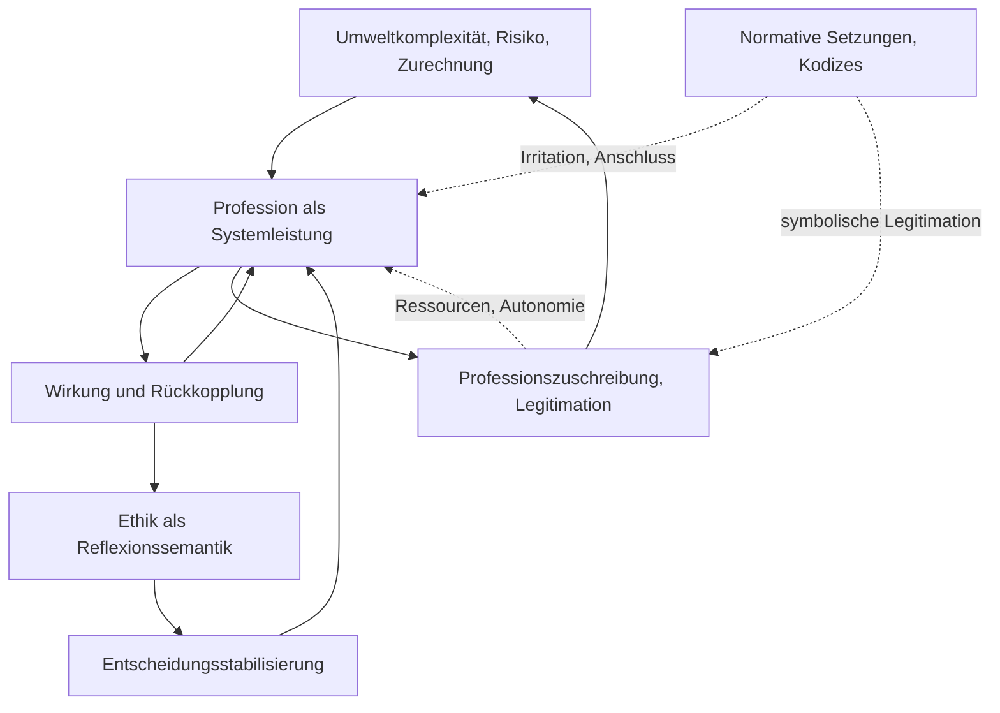

created: 9.2.2026 | [updated](https://github.com/jochen-hanisch/research/blob/main/Essays/Grenzen%20normativer%20Ethik.md): 9.2.2026 | [published](https://zenodo.org/records/ | [Austausch](https://lernen.jochen-hanisch.de/course/view.php?id=4) | [[Hinweise]]

# Über die ethische Konstruktion systemtheoretischer Profession

## Einleitung
Die folgende Argumentation setzt theoriezentriert an: In einem systemtheoretisch und konstruktivistisch gerahmten Professionsbegriff erscheint Profession als operative Systemleistung, und Ethik entsteht als emergente Reflexionssemantik professioneller Operationen unter Kontingenz, Risiko und Verantwortungszuschreibung. Normative Setzungen können diese Emergenz nicht ersetzen; sie können lediglich Zuschreibungen erzeugen, die sich kommunikativ stabilisieren, ohne eine entsprechende operative Grundlage zu besitzen. Vor diesem Hintergrund wird ein verbreiteter Zugriff in der professionsbezogenen Ethikforschung geprüft, der normative Ethik als vorgängigen Rahmen behandelt und Berufsgruppen über Kodizes, Leitlinien oder Konsensverfahren (z.B. Delphi) auf eine gemeinsame Soll-Orientierung verpflichtet.

Die Argumentation verbindet zwei Perspektiven.

Erstens rekonstruiert ein konstruktivistischer Zugriff die Herstellungsbedingungen von Geltung: Normen, Rollen und Autoritäten entstehen durch Zuschreibungsprozesse, die über Kommunikation und Institutionalisierung verfestigt werden (Berger & Luckmann, 1966; Gergen, 1999).

Zweitens rekonstruiert eine systemtheoretische Perspektive die Bedingungen der Möglichkeit professioneller Operationen: Autopoietische Systeme reproduzieren ihre eigenen Operationen, grenzen sich von ihrer Umwelt ab und erzeugen interne Sinnformen, die Anschlussfähigkeit im eigenen System sichern (Luhmann, 1995). Profession kann in dieser Perspektive als spezifische Form systemischer Entscheidungsfähigkeit unter Ungewissheit verstanden werden, die an Verantwortung, Risiko und juristische sowie moralische Zurechnung gekoppelt ist (Abbott, 1988; Freidson, 2001).

## Problemstellung
In einem Feld, das überwiegend deskriptiv beforscht wird, entsteht eine strukturelle Versuchung: normative Zielprodukte wirken attraktiver als Wirkungsnachweise. Kodizes, Konsensdokumente und Positionspapiere liefern Anschlussfähigkeit, Sichtbarkeit und politische Verwendbarkeit. Deskriptive Forschung liefert Kartierung, Selbstbeschreibungen und Zustandsdiagnosen. Wirkungsforschung liefert Steuerungswissen. Ein Feld ohne etablierte Wirkungsforschung kann normative Produkte kommunikativ aufwerten, obwohl normative Produkte keinen kausalen Nachweis über Verbesserungen im Handeln liefern.

Die zentrale Frage lautet daher: Unter welchen Bedingungen ist eine normative Ethik für ein Feld epistemisch redlich, wenn Professionalisierung als Systemleistung noch nicht operativ ausgewiesen ist und Forschungslagen primär deskriptiv bleiben.

Die These des Textes ist dabei nicht an ein bestimmtes Verfahren gebunden. Normativ-konsensorientierte Verfahren (z.B. Konsensverfahren, Leitlinienprozesse, Kodizes) fungieren im Folgenden lediglich als Fallbeispiele, um die Differenz zwischen Zuschreibung (normatives Dokument) und Emergenz (professionelle Ethik als Systemleistung) sichtbar zu machen; Delphi dient dabei pars pro toto als ausgearbeitetes Beispiel.

## Begriffsarbeit
### Normativität
Normativität bezeichnet Sollensansprüche, die Handeln orientieren und begründen sollen. Normative Aussagen zielen auf Geltung. Normative Aussagen benötigen eine Begründungsform, die über Beschreibung hinausgeht. Normative Aussagen können pragmatisch legitimiert werden, wenn ein Kollektiv Regeln für Koordination benötigt. Normative Aussagen können wissenschaftlich legitimiert werden, wenn die Bedingungen der Geltung transparent ausgewiesen werden.

### Deskription
Deskription bezeichnet die Beschreibung von Zuständen, Praktiken, Selbstberichten oder Strukturen. Deskription kann Voraussetzungen für Theorie- und Interventionsbildung liefern. Deskription kann keine Wirkungsbehauptungen tragen, sofern keine Interventionslogik und keine kausale Inferenz vorliegt.

### Konstruktion
Konstruktion bezeichnet Prozesse der Sinnherstellung und Stabilisierung sozialer Wirklichkeit. Konstruktion ist keine Beliebigkeit. Konstruktion beschreibt Mechanismen, über die Zuschreibungen, Kategorien und Institutionen handlungswirksam werden (Berger & Luckmann, 1966; Gergen, 1999).

### Moral (systemtheoretisch)
Moral ist in der Systemtheorie keine Normenlehre und keine Ethik. Moral bezeichnet eine Beobachtungsform von Kommunikation, die sich an der Unterscheidung Achtung/Missachtung orientiert. Moral adressiert Personen kommunikativ, personalisiert Erwartungen und kann dadurch Anschlussmöglichkeiten verengen, weil sie schnell Schuld, Vorwurf und Rechtfertigungsdruck erzeugt. Moral „trifft“ psychische oder lebende Systeme nicht kausal; sie irritiert sie kommunikativ und koppelt sich an Erwartungen, Verantwortung und Anerkennung.

### Ethik (systemtheoretisch)
Ethik ist in dieser Perspektive keine Steuerungsinstanz, sondern eine reflexive Semantik: eine Beobachtung zweiter Ordnung, die beschreibt, wie moralische Kommunikation funktioniert, welche Paradoxien sie erzeugt und wie sie legitimiert wird. Wenn Kommunikation im Medium Sinn operiert und Semantiken stabilisierte Sinnangebote darstellen, dann lässt sich Ethik als spezialisierte Sinnkonstruktion verstehen, die moralische Kommunikation ordnet. Für professionelle Kontexte heißt das: Ethik entsteht nur dort, wo das professionelle System diese Sinnform intern reproduziert; externe normative Setzungen können sie höchstens als Sinnangebot irritieren.

### Profession im systemtheoretischen Zugriff
Ein systemtheoretischer Professionsbegriff fokussiert weniger Status und mehr Operation. Profession bezeichnet dann eine Form der Entscheidungs- und Verantwortungsfähigkeit in einem funktional differenzierten Umfeld. Professionen stabilisieren Erwartungssicherheit, indem sie in Situationen hoher Kontingenz Entscheidungen treffen, die an Zurechnung gekoppelt sind. Klassische Professionssoziologie beschreibt dafür Jurisdiktionen, Zuständigkeitsgrenzen und Konkurrenzordnungen (Abbott, 1988) sowie Autonomie und Selbstkontrolle als zentrale Strukturmerkmale (Freidson, 2001). Systemtheorie ergänzt diese Perspektive durch die Frage nach operativer Geschlossenheit, Anschlussfähigkeit und Selbstreferenz als Bedingungen stabiler Reproduktion (Luhmann, 1995).

„System“ meint hier kein eigenständiges Funktionssystem, sondern ein innerhalb von Funktionssystemen (und häufig organisationsförmig) ausgebildetes, operativ geschlossenes Entscheidungs‑ und Verantwortungsregime (Subregime/Systemleistung). In dieser Lesart ist Profession keine Statuskategorie, sondern eine spezifische Form wiederkehrender Operation unter Risiko, Kontingenz und Zurechnung.

## These
Eine Profession im systemtheoretischen Sinn bringt Ethik als eigene Systemleistung hervor. Ethik entsteht als interne Semantik der Verantwortungszuschreibung, die professionelle Operationen unter Risiko und Kontingenz stabilisiert. Externe normative Setzungen können diese Leistung nicht erzeugen. Externe normative Setzungen können eine Ethik lediglich zuschreiben.

## Herleitung der These
### 1. Konstruktivistische Geltungsproduktion
Soziale Wirklichkeit entsteht durch fortgesetzte Zuschreibung, Institutionalisierung und Legitimation. Normen sind in dieser Perspektive keine Naturtatsachen. Normen entstehen als stabile Erwartungsstrukturen, die über Kommunikation reproduziert werden. Legitimation sichert Anschlussfähigkeit, indem Legitimation die Gründe für Geltung bereitstellt (Berger & Luckmann, 1966). Ein konstruktivistischer Zugriff beschreibt daher, wie ein Kodex oder Konsensdokument Geltung beansprucht, welche Autoritäten angerufen werden und welche Verfahren als Gütesiegel fungieren (Gergen, 1999).

Diese Perspektive erlaubt eine präzise Diagnose: Ein normatives Dokument kann in der Kommunikation hoch wirksam sein, auch wenn keine operative Praxisbasis existiert. Ein normatives Dokument kann Stabilität durch Symbolik erzeugen.

### 2. Systemtheoretische Emergenz von Normen
Autopoietische Systeme (hier: professionelle Entscheidungs‑ und Verantwortungsregime) reproduzieren Operationen durch Anschluss an eigene Operationen. Systeme erzeugen Sinnformen, die interne Anschlussfähigkeit sichern. Normen und Werte erscheinen in der Systemtheorie als Semantiken, die Komplexität reduzieren und Erwartungen stabilisieren. Normen entstehen als systeminterne Lösung für wiederkehrende Entscheidungslagen, die Zurechnung erfordern (Luhmann, 1995). Moralische Kommunikation fungiert dabei als spezifische Beobachtungsform (Achtung/Missachtung), die Verantwortung personalisiert und damit sowohl Anschluss ermöglicht als auch eskalationsanfällig ist. Ethik entsteht in dieser Perspektive nicht als externe Vorgabe, sondern als reflexive Semantik, die moralische Kommunikation im System bearbeitbar macht.

Daraus folgt eine Umkehrung gängiger Logik: Ethik ist kein Startpunkt einer Profession. Ethik ist ein Produkt professioneller Operationen. Eine Profession produziert Ethik, sobald professionelle Praxis stabile Muster der Verantwortungszuschreibung ausbildet.

### 4. Systemtheoretische Kausalkette professioneller Emergenz
Die Entstehung professioneller Ethik lässt sich systemtheoretisch als mehrstufiger Emergenzprozess beschreiben, der ohne vorgängige normative Setzungen auskommt und sich aus Umweltbezügen und operativer Stabilisierung speist.

Am Anfang steht Umweltkomplexität. Wiederkehrende Anforderungen, Zeitdruck, Risiko und Verantwortungszuschreibung erzeugen Erwartungsdruck auf soziale Arrangements. Dieser Erwartungsdruck führt zur Ausbildung struktureller Kopplungen zwischen unterschiedlichen Funktionssystemen und organisationalen Kontexten, etwa zwischen Recht, Medizin, Organisation und situativer Praxis.

Aus struktureller Kopplung entsteht operative Geschlossenheit. Wiederholte Entscheidungsanforderungen stabilisieren eigene Entscheidungsoperationen, die intern anschlussfähig werden. Diese Operationen bilden ein eigenständiges Entscheidungs- und Verantwortungsregime aus. In dieser Phase lässt sich von Profession im systemtheoretischen Sinn sprechen. Profession erscheint hier als emergente Systemleistung, die ihre Stabilität aus der Wiederholbarkeit eigener Operationen gewinnt.

Auf Grundlage dieser operativen Geschlossenheit erfolgt eine umweltbezogene Professionszuschreibung. Die Umwelt beobachtet stabile Entscheidungsleistungen und beschreibt diese als professionell. Diese Zuschreibung ist nachgelagert. Sie folgt der beobachtbaren Systemleistung und wirkt beschreibend, nicht konstitutiv.

Erst im Anschluss bildet sich Ethik als autopoietische Reflexionssemantik aus. Ethik entsteht als systeminterne Sinnform, die Verantwortungszuschreibung, Entscheidungsparadoxien und Erwartungsenttäuschungen bearbeitbar macht. Diese Ethik reproduziert sich über die eigenen Operationen des Systems und bleibt an dessen Autopoiesis gebunden.

Normative Zuschreibungen von außen können in diesem Prozess Irritationen erzeugen und kommunikative Anschlussfähigkeit entfalten. Sie können jedoch keine interne Ethikproduktion steuern oder ersetzen, da autopoietische Systeme ihre Operationen ausschließlich an eigene Operationen anschließen. Die Unkontrollierbarkeit sozialer Systeme ist dabei keine Schwäche, sondern die Bedingung ihrer Emergenz.

_Abbildung 1: Schematische Kausalkette professioneller Emergenz und Ethikproduktion (i.V.m. [[Professionalisierung]]). Das Diagramm zeigt eine Kausalkette professioneller Emergenz: Aus Umweltkomplexität, Risiko, Zurechnung (U) bildet sich Profession als Systemleistung (P) heraus. Profession (P) erzeugt Wirkung und Rückkopplung (W); diese Rückkopplung fließt wieder in Profession (P) ein und stabilisiert/kalibriert weitere Operationen. Aus Wirkung/Rückkopplung (W) entsteht Ethik als Reflexionssemantik (E), die Entscheidungsstabilisierung (S) leistet und damit wiederum Profession (P) stützt.
Parallel dazu erzeugt Profession (P) Professionszuschreibung/Legitimation (Z); diese Zuschreibung wirkt in die Umwelt zurück (Z → U) und wirkt zugleich (gestrichelt) fördernd auf die Systemleistung (Z → P) über Ressourcen- und Autonomieeffekte. Normative Setzungen/Kodizes (N) sind als externe Inputs modelliert: Sie können Profession (P) irritieren/anschlussfähig machen und Zuschreibung/Legitimation (Z) symbolisch stützen, ersetzen aber nicht die interne Ethikproduktion._

### 3. Professionssoziologische Bedingungen der Möglichkeit
Klassische Professionssoziologie beschreibt Professionalisierung als Prozess der Zuständigkeits- und Jurisdiktionsbildung. Professionen etablieren exklusive Zuständigkeiten und begründen diese Zuständigkeiten durch Expertise, Ausbildung, Zertifizierung und Selbstregulation (Abbott, 1988). Freidson betont professionelle Autonomie und die Kontrolle über Standards der eigenen Arbeit als zentrale Bedingung (Freidson, 2001). Evetts unterscheidet berufsorganisatorische und professionelle Logiken und beschreibt Spannungen zwischen organisationaler Steuerung und professioneller Autonomie (Evetts, 2011).

Diese Bedingungen sind nicht dekorativ. Diese Bedingungen definieren die Möglichkeit, dass eine Profession normative Orientierungen aus eigener Praxis heraus stabilisiert. Eine Berufsgruppe ohne autonome Jurisdiktion und ohne stabile Selbstregulation kann Normen kommunizieren. Eine Berufsgruppe ohne autonome Jurisdiktion und ohne stabile Selbstregulation kann Ethik nicht als eigene Systemleistung institutionalisieren.

## Fallbeispiele: Normativ-konsensorientierte Verfahren

Normativ-konsensorientierte Verfahren treten in unterschiedlichen Formaten auf. Gemeinsam ist ihnen, dass sie Sollensansprüche kommunikativ stabilisieren und damit Anschlussfähigkeit erzeugen können, ohne die operative Bedingung professioneller Ethikproduktion zu ersetzen.

Typische Verfahrenstypen sind:

1. **Konsensverfahren** (z.B. Delphi, Konsensuskonferenz, Nominal Group, RAND/UCLA): Aggregation und Stabilisierung von Urteilen unter Unsicherheit.
2. **Leitlinien- und Standardisierungsverfahren** (z.B. Leitliniengruppen, Expertenpanels, Standardsets): Verdichtung von Erwartungen in handlungsleitende Regeln.
3. **Kodifizierungs- und Ethikkodexverfahren** (z.B. Berufsordnungen, Kodizes, Rahmenempfehlungen): Formale Soll-Formulierungen zur Koordination und Legitimation.
4. **Positions- und Policy-Papiere** (z.B. Stellungnahmen, Positionspapiere, Konsenspapiere): symbolische Setzungen mit politischer und organisationaler Verwendbarkeit.

Die folgenden Ausführungen nutzen Delphi pars pro toto als Illustration der zuvor hergeleiteten These, nicht als Zielpunkt der Argumentation.

### Beispiel: Delphi als Konsensverfahren
Delphi-Verfahren werden häufig als strukturierte Expertinnen- und Expertenbefragung genutzt. Delphi-Verfahren nutzen Iteration, Feedback und Aggregation, um Urteile in komplexen Feldern zu strukturieren (Dalkey & Helmer, 1963; Linstone & Turoff, 1975). Viele Anwendungen zielen auf Konsens. Konsens ist methodisch möglich. Konsens ist nicht automatisch epistemische Geltung.

Ein Delphi-Design mit a priori definierten Konsenskriterien verschiebt den Status des Verfahrens: Das Verfahren produziert eine normative Setzung, wenn das Verfahren keinen legitimen Endzustand für stabilen Dissens vorsieht. Der Verfahrensstatus bleibt formal Delphi. Die Verfahrensfunktion entspricht dann einer Normsetzungsmaschine.

### Warum ein Delphi-Kodex keine emergente Ethik erzeugt
Ein konsensorientiertes Delphi-Verfahren erzeugt Ethik nicht aus professionellen Operationen. Ein konsensorientiertes Delphi-Verfahren sammelt und aggregiert Urteile. Ein konsensorientiertes Delphi-Verfahren ersetzt nicht die systemische Bedingung, die Ethik hervorbringt: wiederkehrende Verantwortungszuschreibung aus operativer Praxis. Ein Kodex kann Erwartungen formulieren. Ein Kodex kann Koordination erleichtern. Ein Kodex kann symbolische Legitimation liefern. Ein Kodex erzeugt keine professionelle Ethik als Systemleistung.

Die Differenz ist entscheidend.

Ein kodifizierter Konsens kann als Zuschreibung fungieren.

Eine emergente Ethik entsteht als Praxissemantik.

Ein Feld, das Profession erst behauptet, kann Ethik nur zuschreiben.

Ein Feld, das Profession operativ besitzt, produziert Ethik.

## Implikationen für ein überwiegend deskriptives Forschungsfeld
Ein Forschungsfeld mit dominanter Deskription besitzt drei typische Entwicklungsrisiken.

Erstens entsteht eine Überhöhung normativer Produkte. Normative Produkte werden mit Erkenntnis verwechselt.

Zweitens entstehen Theorieimporte ohne Gegenstandsprüfung. Theorien werden als Legitimationsquellen genutzt, ohne Geltungsbedingungen am Gegenstand zu prüfen.

Drittens entstehen Konsensverfahren als Ersatz für Wirkungsnachweise. Konsens dient dann als Qualitätsmarker, obwohl Konsens keine Wirkung belegt.

Ein Feld kann diese Risiken reduzieren, wenn Forschung drei Anschlussleistungen aufbaut.

1. Modellbildung, die operative Prozesse beschreibt.

2. Interventionslogiken, die Wirkannahmen explizit machen.

3. Wirkungsprüfungen, die Steuerungswissen liefern.

## Diskussion
Die Argumentation richtet sich nicht gegen Ethik. Die Argumentation richtet sich gegen eine implizite Umdeutung: normative Setzungen erscheinen als Ergebnisse epistemischer Verfahren. Eine systemtheoretische Perspektive fordert stattdessen eine klare Trennung zwischen Zuschreibung und Emergenz. Eine konstruktivistische Perspektive erklärt, warum Zuschreibungen in der Kommunikation funktionieren.

Eine professionsethische Semantik kann in einem Feld ohne professionelle Autonomie eine wichtige Koordinationsleistung erbringen. Diese Koordinationsleistung ist praktisch relevant. Diese Koordinationsleistung ist epistemisch begrenzt. Eine Koordinationsleistung ersetzt keine professionelle Ethik als Systemleistung.

## Schluss
Eine systemtheoretisch gefasste Profession produziert Ethik aus ihrer operativen Praxis. Normative Setzungen können diese Produktion nicht substituieren. Normativ-konsensorientierte Verfahren (z.B. Konsensverfahren, Leitlinienprozesse, Kodizes, Positionspapiere) können normative Dokumente liefern. Sie liefern jedoch keine emergente Professionsethik. Ein deskriptives Forschungsfeld besitzt daher eine Begründungspflicht, sobald normative Produkte als quasi-wissenschaftliche Ergebnisse kommuniziert werden.

# Quelle(n)

Abbott, A. (1988). *The system of professions: An essay on the division of expert labor*. University of Chicago Press.
Berger, P. L., & Luckmann, T. (1966). *The social construction of reality: A treatise in the sociology of knowledge*. Anchor Books.
Dalkey, N., & Helmer, O. (1963). An experimental application of the Delphi method to the use of experts. *Management Science, 9*(3), 458–467.
Evetts, J. (2011). A new professionalism? Challenges and opportunities. *Current Sociology, 59*(4), 406–422.
Freidson, E. (2001). *Professionalism: The third logic*. University of Chicago Press.
Gergen, K. J. (1999). *An invitation to social construction*. Sage.
Linstone, H. A., & Turoff, M. (Eds.). (1975). *The Delphi method: Techniques and applications*. Addison-Wesley.
Luhmann, N. (1995). *Social systems* (J. Bednarz Jr. & D. Baecker, Trans.). Stanford University Press. (Original work published 1984)
