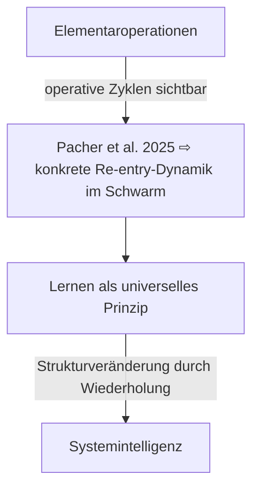
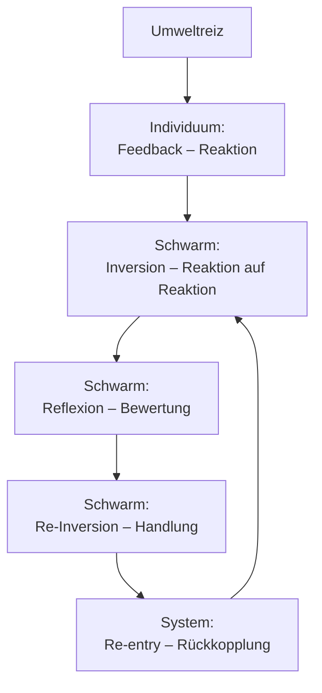

created: 31.7.2025 | [updated](https://git.jochen-hanisch.de/jochen-hanisch/research/): 31.7.2025 | [published](https://zenodo.org/records/):  | [Austausch](https://lernen.jochen-hanisch.de/course/view.php?id=4) | [[Hinweise]]

**Kollektive Reaktionsmuster im Schwarmverhalten. Eine systemtheoretische Rekonstruktion**

# Abstract

Diese Fallstudie analysiert das kollektive Entscheidungsverhalten freilebender Fischschwärme (Pacher et al., 2025) im Lichte systemtheoretischer Begriffe: Elementaroperationen, Lernen als universelles Prinzip und Systemintelligenz. Anhand detaillierter Beobachtungsdaten zu wiederholten Fluchtwellen („repeat waves“) zeigt die Analyse, wie kollektive Reaktionen nicht durch zentrale Steuerung, sondern durch zyklische Rückkopplungen entstehen. Die Studie wird als operatives Bindeglied zwischen systemtheoretischen Ebenen rekonstruiert. Daraus ergibt sich ein strukturtheoretisch fundiertes Verständnis kollektiver Intelligenz und nicht als Merkmal von Individuen, sondern als emergente Funktion rekursiver Operationen.

# Kontext

Diese Fallstudie analysiert die empirische Untersuchung von Pacher et al. (2025) zum kollektiven Entscheidungsverhalten von Fischschwärmen und interpretiert sie im Licht dreier systemtheoretischer Konzepte: [[Elementaroperationen]], [[Lernen als universelles Prinzip]] und [[Systemintelligenz]]. Die Studie zeigt, dass größere Schwärme schneller und präziser auf Bedrohungen reagieren, ohne dabei ihre Fehlerrate zu erhöhen – ein Verhalten, das sich durch klassische Reiz-Reaktionsmodelle nicht vollständig erklären lässt.

Durch die Linse der [[Elementaroperationen]] lassen sich die beobachteten Verhaltensmuster als zyklische Folge von Feedback, Inversion, Reflexion, Re-Inversion und Re-entry rekonstruieren. Auf dieser Basis wird ersichtlich, dass das System nicht nur reagiert, sondern seine eigene Reaktionsweise über wiederholte Operationen strukturell verändert; ein Lernen ohne Gedächtnis, das durch operative Rückkopplung geschieht.

In der Perspektive der [[Systemintelligenz]] wird deutlich: Der Schwarm agiert nicht intentional, eher funktional intelligent. Er erhält unter komplexen Umweltbedingungen seine Anschlussfähigkeit durch verteilte, zirkuläre Selbstregulation. Die Studie dient somit nicht nur als Fallbeispiel, sondern als methodisch ergiebiger Prüfstein für die Anwendung und Validierung systemtheoretischer Begriffe an empirischen Phänomenen kollektiven Verhaltens.

Die Studie dient damit als verbindendes Glied zwischen drei zentralen Theoriebausteinen:

- [[Elementaroperationen]]: Die beobachteten Reaktionssequenzen lassen sich strukturell als zyklische Folge von Feedback, Inversion, Reflexion, Re-Inversion und Re-entry deuten.
- [[Lernen als universelles Prinzip]]: Wiederholte Re-entry-Schleifen führen zu systemischer Strukturmodifikation – ein Lernen ohne Repräsentation.
- [[Systemintelligenz]]: Die Reaktionsmuster der Schwärme weisen auf eine emergente Intelligenz des Systems hin, verstanden als operative Selbstanpassung unter Umweltkomplexität.

Damit kann die Studie als exemplarisches Anwendungsfeld für die Gültigkeit und Verknüpfbarkeit der drei Theorieebenen herangezogen werden.

*Abb. 1: Systemtheoretische Einordnung der Studie von Pacher et al. (2025)*
*Die Abbildung zeigt die Studie als verbindendes Glied zwischen drei zentralen Theorieebenen: [[Elementaroperationen]], [[Lernen als universelles Prinzip]] und [[Systemintelligenz]]. Ausgangspunkt ist die Ebene der Elementaroperationen, auf der operative Zyklen (Feedback, Inversion, Reflexion, Re-Inversion, Re-entry) im Verhalten der Fischschwärme beobachtbar sind. Die empirisch erfasste Re-entry-Dynamik wird in der Studie beschrieben und bildet die Brücke zur Theorie des Lernens, die auf wiederholter Strukturmodifikation durch Re-entry basiert. Daraus ergibt sich schließlich eine Form von Systemintelligenz, verstanden als operative Selbstanpassung unter Umweltkomplexität. Die Studie fungiert somit als empirisches Bindeglied zur theoretischen Verknüpfung aller drei Ebenen.*

# Abschnitt 1: Was wird beobachtet?

Die Studie von Pacher et al. (2025) befasst sich mit kollektiven Entscheidungsprozessen in freilebenden Fischschwärmen, insbesondere mit der Frage, ob größere Gruppen unter natürlichen Umweltbedingungen **schneller** und **treffsicherer** auf potenzielle Gefahren reagieren als kleinere. Im Mittelpunkt stehen dabei sogenannte „repeat waves“ d.h. kollektive, wiederholte Tauchbewegungen der Sulphur Mollies (*Poecilia sulphuraria*), ausgelöst durch Luftstörungen wie Vogelangriffe. Diese wellenförmigen Bewegungsmuster fungieren als messbares Indiz für eine kollektive Bewertung der Situation durch den Schwarm (Pacher et al., 2025, S. 2–3).

Beobachtet wird das Verhalten in einem hochgradig ökologisch validen Feldsetting. Die Fische leben in schwefelhaltigen, hypoxischen Flussabschnitten im Süden Mexikos, wo sie sich wegen des Sauerstoffmangels an der Oberfläche aufhalten und dadurch besonders exponiert gegenüber Luftangriffen sind (S. 2). Die Studie unterscheidet präzise zwischen echten Prädationsversuchen (z.B. durch den Great Kiskadee) und harmlosen Vorbeiflügen, wobei die Differenzierung durch einen externen Beobachter mittels Videoanalyse möglich ist (S. 2–3).

Entscheidende Messgrößen sind:

1. die Wahrscheinlichkeit eines korrekten kollektiven Tauchverhaltens nach einem Angriff (true positive),
2. die Rate an Fehlreaktionen auf harmlose Reize (false positive), sowie
3. die Dauer zwischen Erstreaktion und kollektivem Wellenverhalten als Maß für die Entscheidungsgeschwindigkeit (S. 4–5). Dabei zeigt sich ein konsistenter Trend: Mit wachsender Gruppengröße steigen die Wahrscheinlichkeiten für korrekte Reaktionen signifikant an, ohne dass die Fehlalarmrate zunimmt. Gleichzeitig sinkt die mittlere Entscheidungszeit (S. 5).

Die Autoren deuten dieses Phänomen als Ausdruck kollektiver Kognition. Sie verweisen auf mögliche Mechanismen wie quorum-based decision-making, selbstorganisierte Kritikalität und sozial vermittelte Informationsverarbeitung und bleiben dabei auf der Ebene des hypothetischen Spektrums (S. 6–7). Die genaue Erklärung des beobachteten Verhaltens bleibt offen. Genau hier setzt die vorliegende systemtheoretische Rekonstruktion an.

# Abschnitt 2: Elementaroperationen im kollektiven Verhalten

Um das Verhalten der Fischschwärme systemtheoretisch zu deuten, werden die in der Studie beobachteten Reaktionsmuster entlang der Theorie der Elementaroperationen rekonstruiert. Diese grundlegenden Operationen – [[Feedback]], [[Inversion]], [[Reflexion]], [[Re-Inversion]] und [[Re-entry]] – lassen sich als zyklischer Ablauf im kollektiven Entscheidungsprozess nachvollziehen.

*Abbildung 2: Zeitliche Abfolge der Elementaroperationen im Schwarmverhalten*
*Das Diagramm zeigt die aufeinanderfolgenden Operationen von der Umweltstimulation bis zur strukturellen Rückführung ins System. Sichtbar wird, dass nicht das Individuum entscheidet, sondern das System operativ auf sich selbst zurückgreift d.h ein zyklischer und gleichzeitig sequentiell erfassbarer Prozess.*

Die Theorie der [[Elementaroperationen]] liefert infolgedessen nicht nur eine deskriptive Linse, sondern eine strukturelle Erklärungsebene für das beobachtete Verhalten. Der Schwarm „entscheidet“ nicht, sondern operiert zyklisch, rekursiv, nicht-bewusst, jedoch funktional kohärent.

- **Feedback:** Die erste Reaktion erfolgt durch einzelne Individuen im Schwarm, die auf einen Umweltreiz wie den Schatten eines Vogels oder eine Druckwelle reagieren. Diese Reaktionen (z. B. abrupte Bewegungen, Abtauchen) sind sichtbar und erzeugen wahrnehmbare Signale im sozialen Nahfeld (Pacher et al., 2025, S. 2).
- **Inversion:** Die Reaktionen der ersten Individuen werden von benachbarten Fischen als neue Reize wahrgenommen. Damit verschiebt sich der Fokus von der äußeren Umwelt auf die interne Dynamik. Nicht mehr der Reiz selbst, sondern die Reaktion auf den Reiz wird systemrelevant. Dies bezeichnet die Inversion, also den Übergang von einem extern wahrgenommenen Reiz zu einer internen Systemreaktion, bei der die Reaktion selbst zur neuen systemrelevanten Information wird (S. 3).
- **Reflexion:** Der Schwarm verarbeitet interne Signale durch kollektive Bewertung. Einzelreaktionen werden sozial wahrgenommen und aggregiert. Überschreitet die Dichte dieser Reaktionen einen Schwellenwert, entsteht eine geteilte Einschätzung der Gefahr. Dies zeigt sich in der synchronisierten, kollektiven Tauchbewegung; ein Indiz für systemische Koordination und Entscheidungsfindung im Schwarm (Pacher et al., 2025, S. 4).
- **Re-Inversion:** Aus der kollektiven Bewertung entsteht die Entscheidung zur Handlung. Die geteilte Einschätzung von Gefahr wird operativ wirksam, indem der Schwarm synchron reagiert. Der interne Zustand wird dabei erneut in Verhalten transformiert.
- **Reentry:** Mit jeder neuen Welle, jedem Reizereignis und jeder kollektiven Reaktion stabilisieren sich Muster innerhalb des Systems. Die Operationen nehmen Bezug auf ihre eigene Geschichte, d.h. eine zirkuläre Rückführung, die zur Veränderung von Schwellenwerten, Reaktionsgeschwindigkeit und Kollektivstruktur führt (S. 5-6). Damit entsteht eine strukturierte Reaktionsform, die nicht bloß situativ, sondern systemisch erzeugt ist.

# Abschnitt 3: Lernen als operative Re-entry

Die Theorie des Lernens als universelles Prinzip geht davon aus, dass Systeme ihre Struktur nicht durch Repräsentation oder Informationsspeicherung verändern, sondern durch operative Rückführung (Re-entry) vergangener Prozesse. Lernen entsteht dort, wo ein System auf sich selbst Bezug nimmt, also nicht kognitiv, sondern funktional und aus diesen Rückbezügen zukünftige Operationen anders gestaltet. Diese Perspektive lässt sich auf das in der Studie beobachtete Schwarmverhalten fruchtbar anwenden.

Die kollektiven Tauchreaktionen (repeat waves) treten nicht einmalig auf, sondern wiederholt, d.h. oftmals über mehrere Minuten hinweg (Pacher et al., 2025, S. 2). Mit jeder Welle führt das System eine Reaktion auf die Reaktion aus. Diese Reaktionsstruktur ist nicht flüchtig, sondern wirkt rückwirkend strukturverändernd: Sie stabilisiert bestimmte Reaktionsmuster, senkt oder verschiebt Reaktionsschwellen und moduliert die Reizinterpretation innerhalb des Schwarms (S. 5–6). Besonders relevant ist, dass größere Schwärme nicht nur häufiger korrekt reagieren, sondern dies kontextsensitiv differenzierter tun, z.B. zwischen einem echten Angriff und einem harmlosen Vorbeiflug. Diese erhöhte Differenzierungsfähigkeit entsteht nicht durch bewusste Entscheidung, sondern durch die Wirkung vergangener Operationen auf aktuelle Schwellenverläufe, d.h ein klassischer Fall operativen Lernens im systemtheoretischen Sinn.

Damit wird deutlich: Das System „merkt“ sich nicht, sondern es transformiert sich durch Wiederholung. Lernen ist keine gespeicherte Information, sondern eine durch Re-entry modulierte Veränderung der Systemstruktur, die sich in verändertem Verhalten manifestiert. Der Schwarm lernt. Nicht als Subjekt, sondern als operative Formation.

# Abschnitt 4: Systemintelligenz im Schwarm

> [!note]+ Systemtheoretische Schlüsselidee
> Systemintelligenz entsteht nicht durch zentrales Wissen, sondern durch rekursive Strukturveränderung. Der Schwarm ist nicht klug, weil er „nachdenkt“, sondern weil er sich operativ so organisiert, dass Anschlussfähigkeit im Moment entsteht.

Die in der Studie dokumentierten kollektiven Entscheidungsprozesse lassen sich nicht allein als zufällige oder rein mechanische Reaktionsmuster interpretieren. Vielmehr zeigen sie eine Form emergenter Ordnung, die auf eine systeminterne Optimierungsfähigkeit hindeutet. In der Terminologie der [[Systemintelligenz]] bedeutet dies: Der Schwarm als System ist in der Lage, unter Umweltkomplexität operative Anschlussfähigkeit herzustellen und zu erhalten.

Entscheidungsqualität und -geschwindigkeit nehmen mit wachsender Gruppengröße zu, ohne dass sich die Fehlerrate erhöht; ein Befund, der klassische trade-off-Modelle unterläuft. Auch das Fehlen zentraler Steuerung und die spontane Differenzierung zwischen realer Gefahr und harmloser Störung deuten darauf hin, dass das System über eine Form funktionaler Intelligenz verfügt, die nicht intentional ist, sondern in der dynamischen Struktur selbst liegt.

Systemintelligenz zeigt sich hier nicht als kognitive Fähigkeit, sondern als strukturell erzeugte Reaktionsfähigkeit. Das System reguliert sich über operative Rückkopplungsschleifen, formt Reaktionsprofile und verändert sich durch wiederholte Interaktion mit sich selbst. Diese Intelligenz ist nicht lokalisiert, sondern verteilt, nicht bewusst, sondern emergent.

Damit liefert die Studie ein empirisches Beispiel für kollektive Intelligenz im systemtheoretischen Sinn. Nicht als Eigenschaft eines Agenten, sondern als Effekt eines zirkulär operierenden Netzwerks.

# Abschnitt 5: Weshalb dieses Beispiel so wichtig ist

Die Studie von Pacher et al. (2025) ist mehr als eine biologische Einzelfallbeobachtung. Sie liefert ein außergewöhnlich verdichtetes Beispiel dafür, wie sich systemtheoretische Begriffe wie [[Elementaroperationen]], [[Lernen als universelles Prinzip]] und [[Systemintelligenz]] konkret auf empirische Phänomene anwenden lassen. Ihr Wert liegt nicht nur in der Datentiefe, sondern darin, dass sie ein kollektives Verhalten beschreibt, das ohne zentrale Steuerung, ohne Bewusstsein und ohne Sprache funktioniert und dennoch hochdifferenziert, schnell und adaptiv ist.

> **Elementaroperationen:**
> „Der Schwarm entscheidet nicht – er operiert.“

# Ausblick und offene Forschungsfragen

Gerade weil die Studie offen lässt, *warum* das beobachtete Verhalten so effizient ist, bietet sie einen idealen Ansatzpunkt für eine systemtheoretische Re-Lektüre. Ihre Struktur erlaubt eine differenzierte Zuordnung der beobachteten Reaktionen entlang operativer Zyklen (Abschnitt 2), macht den Weg frei für eine Deutung als selbstmodifizierende Struktur (Abschnitt 3) und lässt sich als Ausdruck emergenter Systemintelligenz interpretieren (Abschnitt 4).

Die Rekonstruktion des Schwarmverhaltens im Licht systemtheoretischer Operationen eröffnet eine Reihe weiterer Fragen:

- Lässt sich die hier vorgeschlagene Modellierung auch auf andere kollektive Systeme übertragen, etwa bei Vögeln, Insekten oder sogar sozialen Netzwerken?
- Inwiefern könnten technische Systeme (z. B. Roboterschwärme) von einer operativen statt repräsentationalen Steuerung profitieren?
- Wie ließen sich Re-entry- und Reflexionsprozesse empirisch quantifizieren, um zwischen bloßer Emergenz und systemischer Intelligenz zu unterscheiden?
- Was bedeutet Lernen ohne Gedächtnis in organisationalen Kontexten, z. B. für die Resilienz von Teams oder Institutionen?

Die Fallstudie liefert damit nicht nur ein begründetes Anwendungsbeispiel, sondern auch einen theoretisch gehaltvollen Ausgangspunkt für weiterführende Forschung.

Damit wird die Studie selbst zu einem methodologischen Verbindungsglied – zwischen empirischer Forschung und systemtheoretischer Modellbildung. Sie zeigt exemplarisch, wie theoretische Konzepte nicht nur auf Phänomene angewendet, sondern durch diese auch geprüft, geschärft und weiterentwickelt werden können.

# Quelle(n)

Pacher, K., Bierbach, D., Sevinchan, Y., Vollmoeller, C., Juarez-Lopez, A., Jiménez-Jiménez, J. E., Krause, S., Wolf, M., Romanczuk, P., Arias-Rodríguez, L., & Krause, J. (2025). Better and faster decisions by larger fish shoals in the wild. *Science Advances, 11*(14), eadt8600. https://doi.org/10.1126/sciadv.adt8600

---

 #Elementaroperationen #Lernen #Systemintelligenz #Fallstudie
