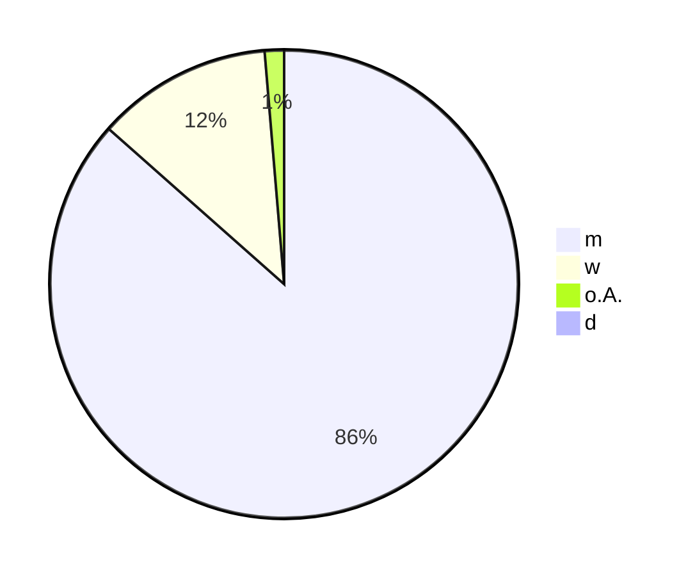

created: 3.1.20245 | updated: 3.1.2025 | published: dd.mm.2025 | [[Allgemein beruflich/Webseite/Hinweise]]

# 1 Sozio-demografische Ergebnisse

## 1.1 Diagramm der Geschlechterverteilung

## 1.2 Wertetabelle der Geschlechterverteilung

| Geschlecht         | Anteil (%) | Anzahl (n=2.776) |
| ------------------ | ---------- | ---------------- |
| männlich (m)       | 86,3       | 2.396            |
| weiblich (w)       | 12,1       | 336              |
| ohne Angabe (o.A.) | 1,33       | 37               |
| divers (d)         | 0,25       | 7                |

## 1.3 Interpretation der Ergebnisse

Die Geschlechterverteilung unter den Teilnehmenden der Notfallsanitäterprüfung zeigt, dass **86,3 %** der Teilnehmenden männlich sind, während der Anteil weiblicher Teilnehmender bei **12,1 %** liegt. **1,33 %** machten keine Angabe zum Geschlecht, und **0,25 %** der Teilnehmenden identifizierten sich als divers.

### 1.3.1 Vergleich mit der Geschlechterverteilung im Rettungsdienst

Die Statistik des Statistischen Bundesamtes zur Geschlechterverteilung im Rettungsdienst zeigt für das Jahr 2022:

- **57.000 männliche Beschäftigte**
- **30.000 weibliche Beschäftigte**

Dies entspricht einem Frauenanteil von etwa **34 %** und einem Männeranteil von **66 %** im Rettungsdienst insgesamt. (Statistisches Bundesamt (Destatis), 2024)

### 1.3.2 Auffälligkeit

Der Frauenanteil unter den Beschäftigten im Rettungsdienst ist mit **34 %** mehr als doppelt so hoch wie der Anteil weiblicher Teilnehmender an der Umfrage zur Notfallsanitäterprüfung (**12,1 %**).

### 1.3.3 Interpretation der Lücke

Dieser Unterschied könnte darauf hindeuten, dass Frauen zwar im Rettungsdienst tätig sind, jedoch weniger häufig an der Notfallsanitäterprüfung teilnehmen oder sich an entsprechenden Umfragen beteiligen. Mögliche Gründe für diese Diskrepanz sind nicht Teil der aktuellen Auswertung und können vielfältig sein – sei es durch unterschiedliche berufliche Rollen, Interessen oder externe Barrieren. Die Zahlen zeigen, dass eine Lücke zwischen dem allgemeinen Frauenanteil im Rettungsdienst und der Teilnahme an weiterführenden Prüfungen und Umfragen existiert. 

# Quelle(n)

- Statistisches Bundesamt (Destatis). (2024, Dezember 31). _Gesundheitspersonal: Deutschland, Jahre, Beschäftigungsverhältnis, Geschlecht, Altersgruppen, Einrichtungen_. Gesundheitspersonalrechnung. [https://www-genesis.destatis.de/datenbank/online/statistic/23621/table/23621-0005/chart/column/search/s/UmV0dHVuZ3NkaWVuc3QlMjBVTkQlMjBiZXNjaCVDMyVBNGZ0aWd0ZQ==#chartFilter=JTdCJTIyZGlhZ3JhbVR5cGUlMjIlM0ElMjJjb2x1bW4lMjIlMkMlMjJjb250ZW50JTIyJTNBJTIyQkVTMDIxJTI0UU1VJTIyJTJDJTIyeEF4aXNWYXJpYWJsZXMlMjIlM0ElNUIlMjJHRVMlMjIlNUQlMkMlMjJ4QXhpc1ZhcmlhYmxlVmFsdWVzJTIyJTNBJTVCJTIyR0VTTSUyMiUyQyUyMkdFU1clMjIlNUQlMkMlMjJ0YWJsZUNvZGUlMjIlM0ElMjIyMzYyMS0wMDA1JTIyJTJDJTIyY3VydmVzR3JvdXBzJTIyJTNBJTVCJTdCJTIyY3ViZSUyMiUzQSUyMkRTXzAwMSUyMiUyQyUyMmN1cnZlcyUyMiUzQSU1QiU3QiUyMmNvbG9yJTIyJTNBJTIyJTIzMDA2Mjk4JTIyJTJDJTIydmlzaWJsZSUyMiUzQXRydWUlMkMlMjJkYXRhU3BlY2lmaWNhdGlvbiUyMiUzQSU3QiUyMnNlbGVjdGVkVmFyaWFibGVzVmFsdWVzJTIyJTNBJTdCJTIyQkVTVkg5JTIyJTNBJTIyJTI1VE9UQUwlMjUlMjIlMkMlMjJBTFQwNDklMjIlM0ElMjIlMjVUT1RBTCUyNSUyMiUyQyUyMkpBSFIlMjIlM0ElMjIyMDIyJTIyJTJDJTIyRUlOR1MxJTIyJTNBJTIyR0VTVU5ESFNUQVQwMzYlMjIlN0QlMkMlMjJjdXJyZW50TWFpblZhcmlhYmxlJTIyJTNBJTIyR0VTJTIyJTJDJTIyY3VycmVudE1haW5WYXJpYWJsZVZhbHVlcyUyMiUzQSU1QiUyMkdFU00lMjIlMkMlMjJHRVNXJTIyJTVEJTdEJTdEJTVEJTJDJTIyZml4ZWRWYXJpYWJsZXNWYWx1ZXMlMjIlM0ElN0IlMjJzdGF0aXN0aWMlMjIlM0ElMjIyMzYyMSUyMiUyQyUyMkRJTlNHJTIyJTNBJTIyREclMjIlN0QlN0QlNUQlN0Q=](https://www-genesis.destatis.de/datenbank/online/statistic/23621/table/23621-0005/chart/column/search/s/UmV0dHVuZ3NkaWVuc3QlMjBVTkQlMjBiZXNjaCVDMyVBNGZ0aWd0ZQ==#chartFilter=JTdCJTIyZGlhZ3JhbVR5cGUlMjIlM0ElMjJjb2x1bW4lMjIlMkMlMjJjb250ZW50JTIyJTNBJTIyQkVTMDIxJTI0UU1VJTIyJTJDJTIyeEF4aXNWYXJpYWJsZXMlMjIlM0ElNUIlMjJHRVMlMjIlNUQlMkMlMjJ4QXhpc1ZhcmlhYmxlVmFsdWVzJTIyJTNBJTVCJTIyR0VTTSUyMiUyQyUyMkdFU1clMjIlNUQlMkMlMjJ0YWJsZUNvZGUlMjIlM0ElMjIyMzYyMS0wMDA1JTIyJTJDJTIyY3VydmVzR3JvdXBzJTIyJTNBJTVCJTdCJTIyY3ViZSUyMiUzQSUyMkRTXzAwMSUyMiUyQyUyMmN1cnZlcyUyMiUzQSU1QiU3QiUyMmNvbG9yJTIyJTNBJTIyJTIzMDA2Mjk4JTIyJTJDJTIydmlzaWJsZSUyMiUzQXRydWUlMkMlMjJkYXRhU3BlY2lmaWNhdGlvbiUyMiUzQSU3QiUyMnNlbGVjdGVkVmFyaWFibGVzVmFsdWVzJTIyJTNBJTdCJTIyQkVTVkg5JTIyJTNBJTIyJTI1VE9UQUwlMjUlMjIlMkMlMjJBTFQwNDklMjIlM0ElMjIlMjVUT1RBTCUyNSUyMiUyQyUyMkpBSFIlMjIlM0ElMjIyMDIyJTIyJTJDJTIyRUlOR1MxJTIyJTNBJTIyR0VTVU5ESFNUQVQwMzYlMjIlN0QlMkMlMjJjdXJyZW50TWFpblZhcmlhYmxlJTIyJTNBJTIyR0VTJTIyJTJDJTIyY3VycmVudE1haW5WYXJpYWJsZVZhbHVlcyUyMiUzQSU1QiUyMkdFU00lMjIlMkMlMjJHRVNXJTIyJTVEJTdEJTdEJTVEJTJDJTIyZml4ZWRWYXJpYWJsZXNWYWx1ZXMlMjIlM0ElN0IlMjJzdGF0aXN0aWMlMjIlM0ElMjIyMzYyMSUyMiUyQyUyMkRJTlNHJTIyJTNBJTIyREclMjIlN0QlN0QlNUQlN0Q=)
- 