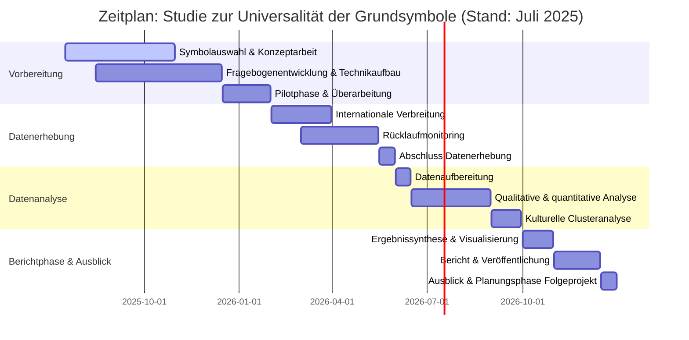

**Studiendesign Untersuchung der Universalität der Grundsymbole**

created: 21.11.2024 | [updated](https://git.jochen-hanisch.de/research/): 17.7.2025 | [publishd](https://zenodo.org/records/15999670): 17.7.2025 | [Austausch](https://lernen.jochen-hanisch.de/course/view.php?id=4) | [[Hinweise]]

# 1 Forschungsziel

Ziel dieser Studie ist die Untersuchung, ob acht identifizierten Grundsymbole universelle, abstrakte Repräsentationen fundamentaler Prinzipien darstellen. Der Fokus liegt darauf, ob diese Symbole unabhängig von kulturellen, individuellen und situativen Einflüssen wahrgenommen und interpretiert werden können.

Kernfragen:

- Werden die Grundsymbole weltweit intuitiv und konsistent wahrgenommen?
- Inwieweit beeinflussen kulturelle, individuelle oder situative Faktoren die Bedeutungszuschreibung?
- Welche Gemeinsamkeiten und Unterschiede zeigen sich zwischen unterschiedlichen kulturellen Kontexten?

# 2 Hypothesen

Die zentralen Hypothesen der Studie lauten:

- H₁ (Alternativhypothese): Mindestens eines der acht Grundsymbole wird kulturübergreifend von über 80 % der Befragten mit einem bestimmten universellen Prinzip assoziiert.
- H₀ (Nullhypothese): Die Bedeutungszuschreibung zu den Grundsymbolen unterscheidet sich signifikant je nach kulturellem, sprachlichem oder individuellem Hintergrund der Befragten.

# 3 Methodik

## 3.1 Studiendesign

- Design: Mixed-Methods-Ansatz (qualitative und quantitative Verfahren)
- Qualitativer Fokus: Erhebung spontaner Assoziationen und kultureller Bedeutungsrahmen
- Quantitativer Fokus: Messung der Passung zwischen Symbolen und vorgegebenen Konzepten

## 3.2 Stichprobe

- Zielgruppe: Personen mit unterschiedlichen geografischen, sprachlichen und kulturellen Hintergründen
- Umfang: Ca. 200–500 Teilnehmende zur Abbildung einer interkulturell vielfältigen Perspektivenbreite
- Rekrutierung: Internationale Streuung über Netzwerke, Hochschulen und persönliche Kontakte

# 4 Aufbau der Umfrage

## 4.1 Einleitung

- Begrüßung und kurze Einführung in das Forschungsziel
- Einwilligung zur freiwilligen und anonymisierten Teilnahme

## 4.2 Soziodemografische Angaben

- Alter
- Geschlecht
- geografische Herkunft
- kultureller Hintergrund
- primäre Sprache

## 4.3 Symbolbezogene Fragen

Für jedes der acht Grundsymbole wird eine einheitliche Struktur verwendet:

1. Neutrale Beschreibung des Symbols (ohne Interpretation)
2. Offene Assoziationsfrage: _„Welche Begriffe oder Bilder kommen Ihnen spontan in den Sinn, wenn Sie dieses Symbol sehen?“_
3. Konzeptbewertung: Bewertung der Passung vorgegebener Begriffe (z. B. „Regeneration“, „Verbindung“)
4. Kulturelle Perspektive: _„Gibt es in Ihrer Kultur spezifische Bedeutungen, die mit diesem Symbol verbunden sind?“_
## 4.4 Abschluss

- Dank und abschließende Hinweise
- Möglichkeit zur Kontaktaufnahme bei Rückfragen

# 5 Datenanalyse

## 5.1 Qualitative Auswertung

- Inhaltsanalyse der offenen Nennungen
- Vergleich der symbolischen Assoziationen zwischen Kulturgruppen

## 5.2 Quantitative Auswertung

- Deskriptive Statistiken (Mittelwerte, Häufigkeiten)
- Gruppenvergleiche (z. B. ANOVA, Chi-Quadrat) zur Ermittlung signifikanter Unterschiede

## 5.3 Kulturelle Clusteranalyse

- Identifikation kultureller Muster in der Bedeutungszuschreibung
- Typisierung von Ähnlichkeiten und Differenzen

## 6 Zeitplan

Das Forschungsprojekt zu den Grundsymbolen wird in vier strukturierten Phasen durchgeführt. Der Start liegt im Juli 2025. Da es sich um ein selbstorganisiertes Einzelprojekt handelt, ist ein Zeitraum von mindestens zwölf Monaten angesetzt. Die zeitliche Planung ist realistisch gehalten, um Qualität, methodische Sorgfalt und Anschlussfähigkeit an internationale Standards zu gewährleisten.

## 6.1 Vorbereitung (Juli 2025 – Januar 2026)

- Auswahl und Feinausarbeitung der acht Grundsymbole
- Entwicklung des Fragebogens (inhaltlich und technisch, LimeSurvey)
- Aufbau der selbstgehosteten Umfrageplattform
- Design, technische Tests und Pilotierung
- Überarbeitung nach Pilotstudie
- Planung der mehrsprachigen Übersetzungen und kulturellen Adaption

## 6.2 Datenerhebung (Februar – Mai 2026)

- Internationale Streuung der Online-Umfrage
- Laufendes Monitoring und Nachverfolgung der Rücklaufquote
- Abschluss der Erhebung bis Ende Mai 2026

## 6.3 Datenanalyse (Juni – September 2026)

- Aufbereitung und strukturierte Auswertung der Daten
- Qualitative Inhaltsanalyse (offene Assoziationen)
- Quantitative Analyse (Konzeptbewertungen)
- Vergleich der Ergebnisse zwischen kulturellen Gruppen (Clusterbildung)

## 6.4 Ergebnisbericht und Ausblick (Oktober – Dezember 2026)

- Zusammenfassung der Ergebnisse in einem wissenschaftlichen Bericht
- Visualisierung und Transfer der Erkenntnisse
- Veröffentlichung (Paper, Website, ggf. Konferenzbeiträge)
- Konzeption einer möglichen internationalen Folgeerhebung

_Abbildung 1: Zeitlicher Studienablauf (eig. Darstellung)_
# 7 Potenzielle Herausforderungen

## 7.1 Repräsentativität

- Problem: Verzerrung durch digitale Zugänglichkeit und soziale Selektivität
- Lösung: Breite Streuung über diverse internationale Kanäle, optionale analoge Anschlussstudien

## 7.2 Sprach- und Kulturbarrieren

- Problem: Begriffe oder Konzepte könnten in Übersetzungen verloren gehen
- Lösung: Übersetzungen mit muttersprachlichen Expert:innen, Rückübersetzung und Pretests

## 7.3 Technische Umsetzung

- Problem: Kompatibilität und Layout auf verschiedenen Geräten
- Lösung: Test auf allen gängigen Plattformen und Browsern, responsives Design

# 8 Erwartete Ergebnisse und Verwertung

## 8.1 Erwartete Befunde

- Hohe Übereinstimmung bei bestimmten Symbolkonzepten über Kulturgrenzen hinweg
- Gleichzeitig: kontextspezifische Varianten und Assoziationen
- Erste Hinweise auf mögliche Basalsymbole als anthropologische Konstanten
## 8.2 Verwertung

- Wissenschaftliche Publikationen und Konferenzbeiträge
- Integration in weiterführende Forschung zur universellen Symbolik, visuellen Kommunikation und systemischen Anthropologie
- Öffentliche Diskussion über kulturübergreifende Verständlichkeit und Sinnstiftung durch natürliche Symbole

---

#Forschung #Kultur  #Symbol #Bildungsforschung #Psychologie #Methodologie 
