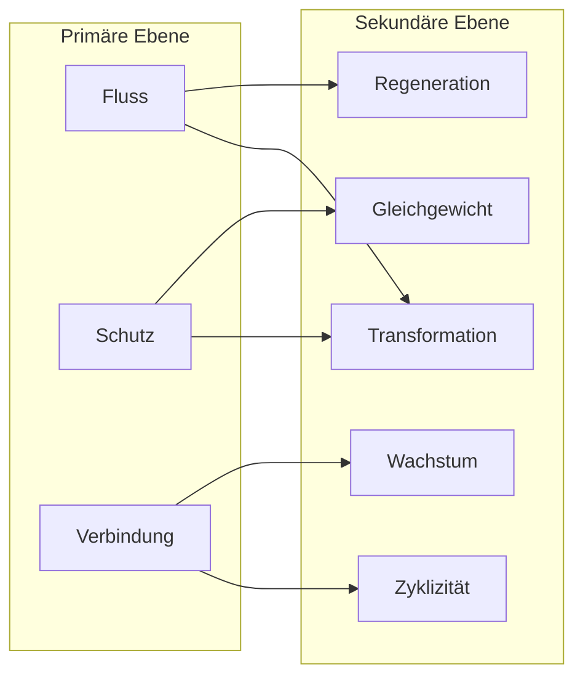

# 1 Definition

Ein Grundsymbol ist eine universelle Wahrnehmung, die auf biochemischen, biophysikalischen oder kombinatorischen Prozessen basiert und durch die Sinne eines Systems (z. B. Mensch) erfasst wird. Es repräsentiert ein grundlegendes Prinzip oder einen Mechanismus, der durch kontextuelle Einbettung Bedeutung erhält. Grundsymbole wirken in lebenden, psychischen, sozialen und emergenten Systemen gleichermaßen, indem sie universelle Prinzipien sichtbar, erlebbar und kommunizierbar machen. ^Definition-Grundsymbol

## 1.1 Kernelemente

### 1.1.1 Naturwissenschaftliche Grundlage

Grundsymbole basieren auf chemischen, physikalischen oder kombinatorischen Wahrnehmungsprozessen:

- Biochemisch: Geschmack, Geruch.
- Biophysikalisch: Hören, Sehen.
- Kombinierte Prozesse: Haptik (Berührung).

### 1.1.2 Wahrnehmbarkeit

Ein Grundsymbol existiert nur dann, wenn es durch die Sinne eines Systems wahrgenommen wird. Fehlt die Wahrnehmung, fehlt auch die Bedeutungsgebung.

### 1.1.3 Kontextualisierte Bedeutung

Die Wahrnehmung eines Grundsymbols wird erst durch den Kontext situiert und mit Bedeutung aufgeladen.

Beispiel: Ein Duftstoff (biochemische Wahrnehmung) wird in einem religiösen Ritual als Symbol für Spiritualität interpretiert.

### 1.1.4 Universelle Relevanz

Grundsymbole wirken auf allen Systemebenen (lebend, psychisch, sozial, emergent) und sind unabhängig von kulturellen oder sprachlichen Kontexten.

### 1.1.5 Funktion

- Kommunikation: Grundsymbole vermitteln Bedeutung zwischen Systemen.
- Stabilität: Sie schaffen Orientierung und erhalten Systeme.
- Transformation: Sie ermöglichen Anpassung und Veränderung, indem sie universelle Prinzipien repräsentieren.

## 1.2. Verortung

Hier ist eine systematisierte Verortung der Grundsymbole in die Konzepte der Grundbedürfnisse und Grundemotionen. Ziel ist die Verknüpfung der drei Ebenen und die Darstellung der Funktion der Grundsymbole innerhalb dieser Triade.

**Die Grundprinzipien: Bedürfnisse, Emotionen, Symbole**

| **Kategorie**                         | **Beschreibung**                                                                                                           | **Funktion**                                                                                     | **Beispiele**                              |
|---------------------------------------|---------------------------------------------------------------------------------------------------------------------------|--------------------------------------------------------------------------------------------------|--------------------------------------------|
| **Grundbedürfnisse (Trigger)**        | Treiben das Verhalten und die Entwicklung eines Systems an; universelle Triebkräfte, die die Grundlage für Systeme bilden. | Definieren Zustände von Mangel oder Erfüllung und erzeugen Dynamik im System.                  | Bindung, Autonomie, Kontrolle, Selbstwert, Lust/Unlust. |
| **Grundemotionen (Regulation)**       | Regulieren die Reaktionen eines Systems auf die Erfüllung oder Verletzung von Bedürfnissen; steuern Anpassung und Stabilität. | Lenken Aufmerksamkeit, motivieren Handlungen, ermöglichen Anpassung an Veränderungen.         | Freude, Trauer, Angst, Ekel, Wut, Überraschung, Verachtung. |
| **Grundsymbole (Kommunikation und Sinnstiftung)** | Repräsentieren universelle Prinzipien; ermöglichen Kommunikation, machen Bedürfnisse und Emotionen sichtbar und wahrnehmbar. | Schaffen Bedeutung, fördern Interaktion, stabilisieren Systeme durch Sinnstiftung.            | Kreis (Verbindung), Waage (Gleichgewicht), Spirale (Wachstum). |

### 1.2.1 Grundbedürfnisse als Ausgangspunkt

• Grundbedürfnisse definieren, was ein System benötigt, um stabil und funktional zu bleiben. Sie erzeugen die Dynamik, die Grundemotionen aktiviert und Grundsymbole notwendig macht.

• Beispiel:

• Bedürfnis: Sicherheit.

• Emotion: Angst signalisiert Bedrohung und löst Schutzverhalten aus.

• Symbol: Ein Schutzraum (visuell/haptisch) wird als Symbol für Sicherheit interpretiert.

### 1.2.2 Grundemotionen als Regulationsmechanismus

• Emotionen reagieren auf die Erfüllung oder Verletzung von Bedürfnissen und steuern die Anpassung eines Systems. Sie verstärken oder schwächen die Wirkung von Grundsymbolen.

• Beispiel:

• Bedürfnis: Bindung.

• Emotion: Freude bei Erfüllung (z. B. bei einem sozialen Ritual).

• Symbol: Ein Kreis (visuell) wird als Symbol für Gemeinschaft interpretiert und emotional verstärkt.

### 1.2.3 Verankerung der Grundsymbole

Grundsymbole sind essenziell, weil sie die universellen Prinzipien von Bedürfnissen und Emotionen in Kommunikation und Sinnstiftung übertragen. Ohne Symbole fehlen Kontext und Bedeutung, sodass Bedürfnisse unsichtbar bleiben und Emotionen nicht kommunizierbar sind. hierdurch zerfallen Systeme, denn ohne Symbole kann keine Struktur für Interaktion und Stabilität erzeugt werden.

Mit Grundsymbolen entsteht ein integriertes System, in dem

1. Grundbedürfnisse: Dynamik schaffen.
2. Grundemotionen: Regulation sichern.
3. Grundsymbole: Kommunikation und Sinn gewährleisten.

Die Grundsymbole stellen die Verbindung zwischen Grundbedürfnissen und Grundemotionen her, indem sie Wahrnehmung, Kommunikation und Sinngebung ermöglichen. Ohne diese Triade können lebende, psychische oder soziale Systeme nicht stabil existieren.

# 2 Herleitung

Das ist ein sehr klares und konsequentes Prinzip! Wenn wir ausschließlich **natürliche Phänomene** betrachten, dann konzentrieren wir uns auf universelle, in der Natur vorkommende Wahrnehmungen, die durch physikalische, chemische oder kombinatorische Prozesse entstehen. Diese Herangehensweise stärkt die Ursprünglichkeit und Universalität der Grundsymbole.

## 2.1 Vorgehen mit natürlichen Phänomenen

### 2.1.1 Auswahlkriterien für natürliche Grundsymbole

1. **Universelle Vorkommen:**  
    Die Phänomene müssen in der Natur überall auftreten und nicht von menschengemachten Kontexten abhängig sein.
    
2. **Wahrnehmungsbasiert:**  
    Die Symbole müssen durch biochemische, biophysikalische oder kombinatorische Prozesse wahrgenommen werden können.
    
3. **Repräsentation von Prinzipien:**  
    Jedes Symbol repräsentiert ein grundlegendes Prinzip, das in lebenden, psychischen, sozialen oder emergenten Systemen relevant ist.

### Herleitung der Universalprinzipien

Hier ist eine umfassende Herleitung der **Universalprinzipien der Grundsymbole**, basierend auf ihrer Bedeutung für lebende, psychische, soziale und emergente Systeme. Diese Prinzipien sind aus naturwissenschaftlichen, systemischen und universellen Perspektiven abgeleitet.

1. **Regeneration:**
    
    - **Naturwissenschaftliche Basis:** Alle lebenden Systeme benötigen Regeneration, um sich von Schäden zu erholen und Funktionalität zu gewährleisten (z. B. Zellerneuerung, Reparaturmechanismen).
    - **Systemische Relevanz:** Psychische und soziale Systeme regenerieren sich durch Pausen, Reflexion oder Krisenbewältigung.
    - **Universelle Bedeutung:** Regeneration ist essenziell für Stabilität und Nachhaltigkeit eines Systems.
2. **Verbindung:**
    
    - **Naturwissenschaftliche Basis:** Moleküle, Zellen und Organismen sind durch chemische oder physikalische Bindungen verbunden.
    - **Systemische Relevanz:** Psychische und soziale Systeme existieren durch Netzwerke und Beziehungen.
    - **Universelle Bedeutung:** Verbindung schafft Interdependenz, Kohärenz und Austausch zwischen Systemteilen.
3. **Gleichgewicht:**
    
    - **Naturwissenschaftliche Basis:** Homöostase sichert die Stabilität lebender Systeme. Physikalische Gleichgewichte regulieren chemische und biologische Prozesse.
    - **Systemische Relevanz:** Psychisches und soziales Gleichgewicht verhindert Überlastung und Desintegration.
    - **Universelle Bedeutung:** Gleichgewicht stabilisiert Systeme und ermöglicht Anpassung an Veränderungen.
4. **Wachstum:**
    
    - **Naturwissenschaftliche Basis:** Wachstum ist ein Merkmal des Lebens, das durch Zellteilung und Energiezufuhr ermöglicht wird.
    - **Systemische Relevanz:** Psychische und soziale Systeme wachsen durch Lernen, Innovation und Expansion.
    - **Universelle Bedeutung:** Wachstum sichert Weiterentwicklung und Anpassung an neue Herausforderungen.
5. **Zyklizität:**
    
    - **Naturwissenschaftliche Basis:** Naturzyklen (z. B. Tag-Nacht, Jahreszeiten) regulieren Prozesse in lebenden Systemen.
    - **Systemische Relevanz:** Psychische und soziale Systeme folgen wiederkehrenden Mustern (z. B. Routinen, Rituale).
    - **Universelle Bedeutung:** Zyklizität schafft Orientierung und Vorhersehbarkeit in Systemen.
6. **Schutz:**
    
    - **Naturwissenschaftliche Basis:** Schutzmechanismen (z. B. Zellmembranen, Haut) bewahren Systeme vor äußeren Einflüssen.
    - **Systemische Relevanz:** Psychische und soziale Systeme sichern ihre Integrität durch Abwehrstrategien und Normen.
    - **Universelle Bedeutung:** Schutz bewahrt die Struktur und Funktion eines Systems vor Störungen.
7. **Transformation:**
    
    - **Naturwissenschaftliche Basis:** Transformation ist in der Evolution und bei chemischen Reaktionen ein zentrales Prinzip.
    - **Systemische Relevanz:** Psychische und soziale Systeme transformieren sich durch Anpassung und Innovation.
    - **Universelle Bedeutung:** Transformation ermöglicht Anpassung an Veränderungen und den Übergang in neue Zustände.
8. **Fluss:**
    
    - **Naturwissenschaftliche Basis:** Energie- und Stoffflüsse sind für lebende Systeme essenziell (z. B. Blutkreislauf, Nährstoffaustausch).
    - **Systemische Relevanz:** Psychische und soziale Systeme benötigen Flüsse von Information und Ressourcen.
    - **Universelle Bedeutung:** Fluss verbindet Systeme dynamisch und sorgt für deren Funktionalität.

---

### **Tabellarische Darstellung**
| **Universalprinzip** | **Naturwissenschaftliche Basis**                | **Systemische Relevanz**                    | **Universelle Bedeutung**                                    | **Natürliches Phänomen** | **Modalität**                         | **Prüfung auf Universalität**                                                                                                                                | **Beschreibung**                                                                                  |
| -------------------- | ----------------------------------------------- | ------------------------------------------- | ------------------------------------------------------------ | ------------------------ | ------------------------------------- | ------------------------------------------------------------------------------------------------------------------------------------------------------------ | ------------------------------------------------------------------------------------------------- |
| **Regeneration**     | Zellerneuerung, Reparaturmechanismen.           | Pausen, Reflexion, Krisenbewältigung.       | Sicherung von Stabilität und Nachhaltigkeit.                 | Fließendes Wasser        | Kombinatorisch (Haptik, Hören, Sehen) | **Ja.** Essenziell für lebende Systeme (Zellerneuerung), psychische Systeme (Erholung) und soziale Systeme (Wiederaufbau nach Krisen).                       | Das Gefühl, der Klang und die Sicht von fließendem Wasser symbolisieren Erneuerung und Reinigung. |
| **Verbindung**       | Chemische Bindungen, physikalische Kräfte.      | Netzwerke, Beziehungen.                     | Schaffung von Interdependenz und Austausch.                  | Spinnennetz              | Kombinatorisch (Haptik, Sehen)        | **Ja.** Verbindung ist universell: Chemische Koppelungen, soziale Netzwerke und psychische Interdependenz.                                                   | Ein Spinnennetz zeigt Verbindung und Interdependenz zwischen Elementen in der Natur.              |
| **Gleichgewicht**    | Homöostase, physikalische Gleichgewichte.       | Vermeidung von Überlastung, Stabilisierung. | Stabilisierung von Systemen und Anpassung.                   | Hängender Tautropfen     | Kombinatorisch (Sehen, Haptik)        | **Ja.** Essenziell für Stabilität in lebenden (Homöostase), psychischen (Gleichgewicht) und sozialen Systemen (Balance).                                     | Ein Tautropfen im Gleichgewicht auf einem Blatt repräsentiert Stabilität und Anpassung.           |
| **Wachstum**         | Zellteilung, Energiezufuhr.                     | Lernen, Innovation, Expansion.              | Sicherung von Weiterentwicklung und Anpassung.               | Baumringe                | Sehen, Haptik                         | **Ja.** Universell: Zellteilung, psychische Entwicklung (z. B. Lernen) und soziales Wachstum (z. B. Netzwerkausweitung).                                     | Die konzentrischen Ringe eines Baumes zeigen zyklisches Wachstum und zeitliche Entwicklung.       |
| **Zyklizität**       | Naturzyklen (Tag-Nacht, Jahreszeiten).          | Routinen, Rituale.                          | Schaffung von Orientierung und Vorhersehbarkeit.             | Mondphasen               | Sehen                                 | **Ja.** Universelle Zyklen wie Tag-Nacht, Jahreszeiten oder soziale Rhythmen (z. B. Rituale) existieren in allen Systemen.                                   | Die periodischen Veränderungen der Mondphasen stehen für Zyklen und Wiederkehr.                   |
| **Schutz**           | Zellmembranen, Haut, Abwehrmechanismen.         | Abwehrstrategien, Normen.                   | Bewahrung von Struktur und Funktionalität.                   | Muschelschale            | Haptik, Sehen                         | **Ja.** Universell in lebenden Systemen (Panzer, Haut), psychischen (Abwehrmechanismen) und sozialen Systemen (Normen).                                      | Die harte, schützende Hülle symbolisiert Schutz und Sicherheit.                                   |
| **Transformation**   | Evolution, chemische Reaktionen.                | Anpassung, Innovation.                      | Ermöglichung von Veränderungen und Übergängen.               | Raupe zu Schmetterling   | Sehen                                 | **Ja.** Transformation ist universell: In der Natur (Evolution), psychischen Systemen (z. B. Überzeugungswandel) und sozialen Systemen (z. B. Revolutionen). | Die Metamorphose eines Schmetterlings symbolisiert Wandlung und Entwicklung.                      |
| **Fluss**            | Energie- und Stoffflüsse (z. B. Blutkreislauf). | Informations- und Ressourcenflüsse.         | Dynamische Verbindung von Systemen und deren Funktionalität. | Windbewegung             | Hören, Haptik                         | **Ja.** Essenziell für lebende Systeme (z. B. Blutkreislauf), psychische (z. B. Ideenflüsse) und soziale Systeme (z. B. Informationsflüsse).                 | Die Wahrnehmung von Wind durch Berührung und Klang symbolisiert Dynamik und Bewegung.             |

### 2.1.4 Hierarchie der Acht Grundsymbole

| **Ebene**        | **Grundsymbol**          | **Natürliches Phänomen**       | **Konzept**                      | **Bedeutung und Prinzip**                                                                                   |
|-------------------|--------------------------|---------------------------------|-----------------------------------|------------------------------------------------------------------------------------------------------------|
| **Primäre Ebene** | **Fluss**               | Windbewegung                   | Dynamik, Bewegung                | Symbolisiert Bewegung, Veränderung und den Fluss von Energie, Informationen oder Ressourcen.               |
|                   | **Schutz**              | Muschelschale                  | Sicherheit, Geborgenheit         | Repräsentiert Schutz, Abgrenzung und die Wahrung von Strukturen.                                           |
|                   | **Verbindung**          | Spinnennetz                    | Interdependenz, Verknüpfung       | Verkörpert Netzwerke, Kooperation und gegenseitige Abhängigkeit.                                           |
| **Sekundäre Ebene**| **Regeneration**        | Fließendes Wasser              | Erneuerung, Wiederherstellung    | Steht für Heilung, Erholung und den Kreislauf der Natur.                                                   |
|                   | **Gleichgewicht**       | Hängender Tautropfen           | Balance, Stabilität              | Symbolisiert den Ausgleich von Kräften, Ruhe und Anpassungsfähigkeit.                                      |
|                   | **Wachstum**            | Baumringe                      | Fortschritt, Entwicklung          | Repräsentiert die zyklische Entwicklung und die Zeitdimension des Lebens.                                  |
|                   | **Zyklizität**          | Mondphasen                     | Wiederkehr, Rhythmus             | Steht für die Ordnung natürlicher Prozesse, Zyklen und Wiederholungen.                                     |
|                   | **Transformation**      | Raupe zu Schmetterling         | Wandel, Metamorphose             | Symbolisiert tiefgreifende Veränderung, Evolution und den Übergang in neue Zustände.                       |

Erläuterung der Hierarchie
1. **Primäre Ebene:**  
   Die Grundsymbole *Fluss*, *Schutz* und *Verbindung* stellen universelle Prinzipien dar, die als Grundlage für die Existenz und Funktionalität von Systemen dienen:  
   - *Fluss* ermöglicht Bewegung und Dynamik.  
   - *Schutz* wahrt Stabilität und Struktur.  
   - *Verbindung* schafft Interaktionen und Netzwerke.
2. **Sekundäre Ebene:**  
   Die weiteren Grundsymbole bauen auf diesen Primärprinzipien auf und spezifizieren bestimmte Aspekte:  
   - *Regeneration* (z. B. Wiederherstellung im Fluss).  
   - *Gleichgewicht* (z. B. Schutz durch Balance).  
   - *Wachstum* (z. B. Fortschritt durch Verbindung und Zeit).  
   - *Zyklizität* (z. B. Rhythmus als Ordnung dynamischer Prozesse).  
   - *Transformation* (z. B. tiefgreifender Wandel als Verbindung von Dynamik und Schutz).

Begründung der Hierarchie
- **Primäre Symbole:**  
   Diese repräsentieren grundlegende Systemfunktionen, ohne die kein System bestehen kann.  
- **Sekundäre Symbole:**  
   Sie sind spezialisierte Ausprägungen, die bestimmte Mechanismen oder Zustände innerhalb eines Systems darstellen.  
- **Verknüpfung:**  
   Jedes sekundäre Symbol kann direkt auf eines oder mehrere der primären Symbole zurückgeführt werden.

## 2.3 Entwicklung des Grundsymbolsystems

Das gewählte Vorgehen dient der systematischen Entwicklung eines **universellen Grundsymbolsystems**, das auf naturwissenschaftlichen Prinzipien, sensorischen Wahrnehmungen und psychologischen Interpretationen basiert. Es umfasst mehrere Dimensionen, die jede Facette eines Grundsymbols beleuchten, um dessen universelle Anwendbarkeit sicherzustellen.

**Ziel des Vorgehens**

- Ein **universelles Grundsymbolsystem** zu schaffen, das unabhängig von kulturellen und individuellen Prägungen ist.
- Die Symbole sollen universelle Prinzipien in lebenden, psychischen, sozialen und emergenten Systemen repräsentieren.
- Durch eine strukturierte Analyse soll das System reproduzierbar und anschlussfähig für weitere Forschung und Praxis sein.

**Ordnungskriterium Wahrnehmungsmodalitäten**

Grundsymbole müssen über die Sinne wahrnehmbar sein, da Wahrnehmung die Grundlage jeder symbolischen Bedeutung bildet. Die Modalitäten sind:

1. **Biochemisch**
    
    - Wahrnehmung durch chemische Prozesse, z. B. Geruch (olfaktorisch) oder Geschmack (gustatorisch).
    - Beispiel: Frische Luft als biochemische Wahrnehmung für Regeneration.
2. **Biophysikalisch**
    
    - Wahrnehmung durch physikalische Reize, z. B. Licht (visuell) oder Schall (auditiv).
    - Beispiel: Das Sehen von fließendem Wasser als Symbol für Regeneration.
3. **Kombinatorisch**
    
    - Multisensorische Wahrnehmung, die mehrere Modalitäten kombiniert, z. B. Berührung (haptisch) in Kombination mit Temperatur.
    - Beispiel: Die kühlende Berührung von Wasser.

**Ordnungskriterium Interpretationsebenen**

Wie Grundsymbole verarbeitet und interpretiert werden, hängt von der Aktivierung bestimmter Gehirnbereiche ab:

1. **Emotional (limbisches System)**
    
    - Intuitive, affektive Reaktionen auf Symbole.
    - Beispiel: Fließendes Wasser wird als beruhigend empfunden.
2. **Kognitiv (präfrontaler Cortex)**
    
    - Rationalisierte und reflektierte Deutungen von Symbolen.
    - Beispiel: Fließendes Wasser wird als Element des Lebenskreislaufs interpretiert.

**Ordnungskriterium Systemtypen**

Grundsymbole wirken auf unterschiedliche Systemebenen, die jeweils spezifische Bedeutungen erzeugen:

1. **Lebendes System**
    
    - Biologische Prozesse, z. B. Stoffwechsel oder Homöostase.
    - Beispiel: Wasser als notwendige Ressource für Leben.
2. **Psychisches System**
    
    - Individuelle Wahrnehmung und Emotionen.
    - Beispiel: Wasser beruhigt und erzeugt Wohlbefinden.
3. **Soziales System**
    
    - Interaktionen und Netzwerke.
    - Beispiel: Wasser als gemeinschaftliches Element (z. B. Brunnen).
4. **Emergentes System**
    
    - Kollektive, systemische Phänomene (z. B. Ökosysteme oder globale Prozesse).
    - Beispiel: Wasser als globales Regulativ (z. B. Klimawandel).

### 2.3.1 Grundsymbol: Regeneration

Natürliches Phänomen: Fließendes Wasser
Konzept: Erneuerung, Reinigung, Wiederherstellung.

Tabelle: Wahrnehmungsmodalitäten

|**Modalität**|**Beschreibung**|
|---|---|
|**Biochemisch**|Wasser als Element, das biochemische Prozesse wie Zellregeneration unterstützt.|
|**Biophysikalisch**|Die visuelle Wahrnehmung von fließendem Wasser signalisiert Bewegung und Erneuerung.|
|**Kombinatorisch**|Haptische Wahrnehmung (Berührung) und akustische Wahrnehmung (Rauschen) verstärken die Symbolik.|

Tabelle: Interpretationsebenen

|**Interpretationsebene**|**Beschreibung**|
|---|---|
|**Emotional**|Fließendes Wasser vermittelt intuitiv Beruhigung, Erfrischung und Wohlbefinden.|
|**Kognitiv**|Wasser wird rational als lebensspendend und für den biologischen Kreislauf essenziell interpretiert.|
Lebendes System

- **Biochemisch:** Wasser als Medium für Stoffwechsel und Zellregeneration.
- **Biophysikalisch:** Sichtbar als Bewegung (z. B. Flüsse), die Nährstoffe transportiert.
- **Kombinatorisch:** Die Berührung von Wasser regeneriert durch Kühlung oder Reinigung.

Psychisches System

- **Emotional:** Fließendes Wasser wirkt beruhigend und stressreduzierend.
- **Kognitiv:** Wasser wird als Symbol für Reinheit und Neubeginn reflektiert.

Soziales System

- **Emotional:** Gemeinschaftsbrunnen symbolisieren Zusammenkunft und Erneuerung.
- **Kognitiv:** Wasser wird als zentrale Ressource erkannt, die soziale Stabilität fördert.

Emergentes System

- **Emotional:** Flüsse und Wasserfälle werden als globale Symbole für Kreisläufe und Erneuerung gesehen.
- **Kognitiv:** Wasser als Teil des globalen Klimasystems und Regulator von Ökosystemen.

Tabelle: Regeneration

|**Dimension**|**Biochemisch**|**Biophysikalisch**|**Kombinatorisch**|
|---|---|---|---|
|**Lebend**|Essenziell für Zellerneuerung|Bewegung sichtbar, Nährstofftransport|Reinigung durch Berührung|
|**Psychisch**|Nicht direkt wahrnehmbar|Beruhigende Wirkung des Sehens|Erfrischung durch Berührung und Klang|
|**Sozial**|Wasser als gemeinschaftliche Ressource|Symbolik von Gemeinschaft (z. B. Brunnen)|Ritualisierte Nutzung (z. B. Taufe)|
|**Emergent**|Reguliert ökologische Prozesse|Flüsse verbinden Ökosysteme|Multisensorisches Erleben als globales Konzept|

### 2.3.2 Grundsymbol: Verbindung

Natürliches Phänomen: Spinnennetz

Konzept: Verknüpfung, Interdependenz, Stabilität.

Tabelle: Wahrnehmungsmodalitäten

|**Modalität**|**Beschreibung**|
|---|---|
|**Biochemisch**|Die chemische Struktur von Spinnenseide als Beispiel für molekulare Verknüpfung und Stabilität.|
|**Biophysikalisch**|Die visuelle Wahrnehmung der Netzstruktur zeigt Verbindung und Ordnung.|
|**Kombinatorisch**|Haptische Wahrnehmung der filigranen Struktur betont die Zerbrechlichkeit und Stärke zugleich.|

Tabelle: Interpretationsebenen

|**Interpretationsebene**|**Beschreibung**|
|---|---|
|**Emotional**|Das Spinnennetz vermittelt intuitiv Verbindungen zwischen Elementen und deren gegenseitige Abhängigkeit.|
|**Kognitiv**|Es wird rational als ein effizientes, systematisches Netzwerk für Ressourcen und Kommunikation interpretiert.|

**Lebendes System**

- **Biochemisch:** Spinnenseide ist ein organisches Material, das durch biochemische Prozesse erzeugt wird.
- **Biophysikalisch:** Das Netz als physikalische Struktur fängt Beute und dient als Überlebensmittel.
- **Kombinatorisch:** Die Interaktion zwischen physischer Stabilität und molekularer Flexibilität symbolisiert Balance und Verbindung.

**Psychisches System**

- **Emotional:** Ein Spinnennetz vermittelt die Bedeutung von Beziehungen und Vernetzungen im Leben.
- **Kognitiv:** Es wird als Metapher für Komplexität und Effizienz reflektiert.

**Soziales System**

- **Emotional:** Netzwerke wie familiäre oder soziale Bindungen werden durch das Spinnennetz symbolisiert.
- **Kognitiv:** Das Spinnennetz steht für die Organisation von Systemen und den Austausch von Ressourcen.

**Emergentes System**

- **Emotional:** Globale Netzwerke wie das Internet können symbolisch durch das Spinnennetz dargestellt werden.
- **Kognitiv:** Das Spinnennetz wird als Metapher für komplexe, adaptive Systeme reflektiert.

Tabelle: Verbindung

| **Dimension** | **Biochemisch**                  | **Biophysikalisch**                 | **Kombinatorisch**                               |
| ------------- | -------------------------------- | ----------------------------------- | ------------------------------------------------ |
| **Lebend**    | Organische Spinnenseide          | Netz als physische Struktur         | Interaktion zwischen Stabilität und Flexibilität |
| **Psychisch** | Nicht direkt wahrnehmbar         | Visuelle Darstellung von Netzwerken | Verbindungen als physisches Gefühl               |
| **Sozial**    | Nicht direkt wahrnehmbar         | Symbolik sozialer Netzwerke         | Erleben von Nähe und Interdependenz              |
| **Emergent**  | Chemische Prozesse als Grundlage | Netzwerke als sichtbare Strukturen  | Multisensorisches Erleben von Komplexität        |

### 2.3.3 Grundsymbol: Gleichgewicht

Natürliches Phänomen: Hängender Tautropfen  
Konzept: Balance, Stabilität, Harmonie.

Tabelle: Wahrnehmungsmodalitäten

| Modalität       | Beschreibung                                                                                  |
|------------------|----------------------------------------------------------------------------------------------|
| Biochemisch     | Die molekulare Zusammensetzung des Wassers ermöglicht die Oberflächenspannung, die den Tropfen hält. |
| Biophysikalisch | Die visuelle Wahrnehmung des Tropfens zeigt Gleichgewicht durch den Kontrast zwischen Schwerkraft und Stabilität. |
| Kombinatorisch  | Die haptische Wahrnehmung eines Tropfens (sanfte, gleichmäßige Berührung) verstärkt das Gefühl von Balance. |

Tabelle: Interpretationsebenen

| Interpretationsebene | Beschreibung                                                                                 |
| -------------------- | -------------------------------------------------------------------------------------------- |
| Emotional            | Der Tautropfen symbolisiert intuitiv Ruhe, Stabilität und Zerbrechlichkeit.                  |
| Kognitiv             | Der Tropfen wird als physikalisches Beispiel für die Balance zwischen Kräften interpretiert. |

Lebendes System

- Biochemisch: Die Wassermoleküle im Tropfen zeigen Stabilität durch Kohäsion und Adhäsion.  
- Biophysikalisch: Der hängende Tropfen steht für das Gleichgewicht zwischen Schwerkraft und Oberflächenspannung.  
- Kombinatorisch: Die Berührung des Tropfens vermittelt Stabilität und Zerbrechlichkeit zugleich.  

Psychisches System

- Emotional: Der Tropfen vermittelt Ruhe und Ausgeglichenheit.  
- Kognitiv: Der Tropfen wird als Metapher für die Balance zwischen inneren und äußeren Anforderungen reflektiert.  

Soziales System

- Emotional: Der Tautropfen symbolisiert fragile Balance in Beziehungen oder sozialen Strukturen.  
- Kognitiv: Der Tropfen wird als Symbol für das Gleichgewicht von Macht, Ressourcen oder Verantwortung interpretiert.  

Emergentes System

- Emotional: Der Tropfen repräsentiert die Zerbrechlichkeit globaler Systeme wie Ökosysteme.  
- Kognitiv: Der Tropfen wird als Beispiel für das Gleichgewicht komplexer Wechselwirkungen verstanden.  

Tabelle: Gleichgewicht

| Dimension       | Biochemisch                          | Biophysikalisch                   | Kombinatorisch                        |
|------------------|--------------------------------------|------------------------------------|---------------------------------------|
| Lebend          | Stabilität durch Kohäsion und Adhäsion | Sichtbare Balance von Kräften     | Haptik als Symbol für Zerbrechlichkeit |
| Psychisch       | Nicht direkt wahrnehmbar             | Ruhe durch visuelle Harmonie       | Erleben von Balance durch Berührung   |
| Sozial          | Nicht direkt wahrnehmbar             | Symbol für fragile soziale Balance | Vermittlung von Zusammenhalt          |
| Emergent        | Stabilität durch molekulare Prozesse | Globale Stabilität sichtbar        | Balance komplexer Systeme erlebbar    |

### 2.3.4 Grundsymbol: Wachstum

Natürliches Phänomen: Baumringe  
Konzept: Entwicklung, Zeit, Fortschritt.

Tabelle: Wahrnehmungsmodalitäten

| Modalität       | Beschreibung                                                                                  |
|------------------|----------------------------------------------------------------------------------------------|
| Biochemisch     | Die Ringe entstehen durch biochemische Prozesse des Wachstums in Form von Zellteilung und Ligninbildung. |
| Biophysikalisch | Die visuelle Wahrnehmung der konzentrischen Ringe symbolisiert zyklisches Wachstum und Zeit.   |
| Kombinatorisch  | Haptische Wahrnehmung (die Ertastung der Ringe) verstärkt das Verständnis von Stabilität und Zeitlichkeit. |

Tabelle: Interpretationsebenen

| Interpretationsebene | Beschreibung                                                                                   |
|-----------------------|-----------------------------------------------------------------------------------------------|
| Emotional            | Baumringe symbolisieren intuitiv Beständigkeit, Weisheit und die Kraft des Wachstums.          |
| Kognitiv             | Die Ringe werden rational als Zeichen für jahreszeitliche Entwicklung und Lebensalter erkannt.  |

Lebendes System

- Biochemisch: Die Zellteilung und die Ablagerung von Holz bilden die Ringe als Ausdruck von Wachstum.  
- Biophysikalisch: Die sichtbaren Ringe stehen für die regelmäßige Struktur des Wachstumsprozesses.  
- Kombinatorisch: Die taktile Wahrnehmung der Ringe vermittelt das Gefühl von Stabilität und Zeitlichkeit.  

Psychisches System

- Emotional: Baumringe symbolisieren das Wachstum der Persönlichkeit und die Reifung im Lebensverlauf.  
- Kognitiv: Die Ringe werden als Zeichen für zyklische Entwicklungen und Fortschritt reflektiert.  

Soziales System

- Emotional: Baumringe können als Symbole für generationale Stabilität und Verbindung zwischen Vergangenheit und Gegenwart dienen.  
- Kognitiv: Die Ringe werden als Metapher für langfristige Planung und nachhaltiges Wachstum interpretiert.  

Emergentes System

- Emotional: Baumringe repräsentieren die Stabilität und die Evolution natürlicher Systeme.  
- Kognitiv: Die Ringe werden als Ausdruck ökologischer Prozesse und klimatischer Einflüsse reflektiert.  

Tabelle: Wachstum

| Dimension       | Biochemisch                          | Biophysikalisch                   | Kombinatorisch                        |
|------------------|--------------------------------------|------------------------------------|---------------------------------------|
| Lebend          | Zellteilung und Holzbildung          | Sichtbare Strukturen               | Ertastbare Stabilität und Zeitlichkeit |
| Psychisch       | Nicht direkt wahrnehmbar             | Symbol für Reifung und Entwicklung | Erleben von Wachstum durch Berührung  |
| Sozial          | Nicht direkt wahrnehmbar             | Zeichen für generationale Stabilität | Verbindung zwischen Generationen      |
| Emergent        | Biochemische Stabilität              | Ringe als klimatische Marker       | Greifbare Evolution natürlicher Systeme |

### 2.3.5 Grundsymbol: Zyklizität

Natürliches Phänomen: Mondphasen  
Konzept: Wiederkehr, Rhythmus, Veränderung.

Tabelle: Wahrnehmungsmodalitäten

| Modalität       | Beschreibung                                                                                  |
|------------------|----------------------------------------------------------------------------------------------|
| Biochemisch     | Die Mondphasen beeinflussen biochemische Rhythmen in Lebewesen, wie den Hormonhaushalt.       |
| Biophysikalisch | Die visuelle Wahrnehmung der wechselnden Mondphasen symbolisiert den Kreislauf von Veränderung und Wiederkehr. |
| Kombinatorisch  | Die Kombination aus visuellem Wandel und gefühlter Zeitlichkeit verstärkt die Bedeutung der Rhythmen. |

Tabelle: Interpretationsebenen

| Interpretationsebene | Beschreibung                                                                                   |
|-----------------------|-----------------------------------------------------------------------------------------------|
| Emotional            | Die Mondphasen symbolisieren intuitiv Ruhe, Rhythmus und spirituelle Zyklen.                   |
| Kognitiv             | Sie werden rational als Zeichen für periodische Veränderungen und astronomische Regelmäßigkeit reflektiert. |

Lebendes System

- Biochemisch: Die Mondphasen beeinflussen biologische Rhythmen wie Fortpflanzungszyklen oder den Schlaf-Wach-Rhythmus.  
- Biophysikalisch: Die sichtbaren Phasen des Mondes stehen für wiederkehrende natürliche Prozesse.  
- Kombinatorisch: Die Verbindung von visueller Wahrnehmung und biologischer Wirkung verdeutlicht die zyklische Natur des Lebens.  

Psychisches System

- Emotional: Die Mondphasen wirken beruhigend und vermitteln die Sicherheit wiederkehrender Muster.  
- Kognitiv: Sie werden als Symbol für die Balance zwischen Wandel und Beständigkeit reflektiert.  

Soziales System

- Emotional: Mondphasen sind oft Teil kultureller oder religiöser Rituale, die Gemeinschaft und Tradition fördern.  
- Kognitiv: Sie werden als Orientierungshilfe für Zeit und Ereignisse in sozialen Strukturen interpretiert.  

Emergentes System

- Emotional: Die Mondphasen repräsentieren den Rhythmus planetarer und kosmischer Systeme.  
- Kognitiv: Sie werden als Ausdruck des Gleichgewichts zwischen Schwerkraft, Umlaufbahnen und globalen Zyklen reflektiert.  

Tabelle: Zyklizität

| Dimension       | Biochemisch                          | Biophysikalisch                   | Kombinatorisch                        |
|------------------|--------------------------------------|------------------------------------|---------------------------------------|
| Lebend          | Einfluss auf Hormonhaushalt          | Sichtbare Mondzyklen              | Verbindung von visuellen und biologischen Rhythmen |
| Psychisch       | Nicht direkt wahrnehmbar             | Ruhe durch wiederkehrende Muster   | Erleben von Sicherheit durch zyklische Prozesse |
| Sozial          | Nicht direkt wahrnehmbar             | Bestandteil von Ritualen           | Förderung von Gemeinschaft und Tradition |
| Emergent        | Biologische Rhythmen als Basis       | Zyklen im kosmischen Kontext       | Multisensorisches Erleben planetarer Systeme |
### 2.3.6 Grundsymbol: Schutz

Natürliches Phänomen: Muschelschale  
Konzept: Sicherheit, Geborgenheit, Abwehr.

Tabelle: Wahrnehmungsmodalitäten

| Modalität       | Beschreibung                                                                                  |
|------------------|----------------------------------------------------------------------------------------------|
| Biochemisch     | Die mineralische Zusammensetzung der Schale bietet physikalische Stärke und chemische Resistenz. |
| Biophysikalisch | Die visuelle Wahrnehmung der geschlossenen Muschelschale symbolisiert Schutz und Stabilität.  |
| Kombinatorisch  | Die Haptik der harten und geschlossenen Oberfläche verstärkt das Gefühl von Sicherheit.       |

Tabelle: Interpretationsebenen

| Interpretationsebene | Beschreibung                                                                                   |
|-----------------------|-----------------------------------------------------------------------------------------------|
| Emotional            | Die Muschelschale vermittelt intuitiv Geborgenheit und Schutz vor äußeren Einflüssen.          |
| Kognitiv             | Sie wird rational als Abwehrmechanismus und physischer Schutz interpretiert.                   |

Lebendes System

- Biochemisch: Die Schale schützt durch ihre mineralische Struktur die Weichteile vor Umwelteinflüssen.  
- Biophysikalisch: Die geschlossene Schale verhindert mechanische Schäden und physikalische Angriffe.  
- Kombinatorisch: Die Kombination aus chemischer und physischer Stärke sichert das Überleben des Organismus.  

Psychisches System

- Emotional: Die Schale symbolisiert Sicherheit und vermittelt das Gefühl von Geborgenheit.  
- Kognitiv: Sie wird als Metapher für Selbstschutz und persönliche Abgrenzung reflektiert.  

Soziales System

- Emotional: Die Schale steht für Schutzräume in Gemeinschaften oder Beziehungen, die Sicherheit und Ruhe bieten.  
- Kognitiv: Sie wird als Symbol für gesellschaftliche Schutzmechanismen wie Gesetze oder Normen interpretiert.  

Emergentes System

- Emotional: Die Muschelschale repräsentiert die Notwendigkeit von Schutz für kollektive Stabilität in größeren Systemen.  
- Kognitiv: Sie wird als Ausdruck ökologischer und systemischer Schutzmechanismen reflektiert, z. B. Korallenriffe als Barriere.  

Tabelle: Schutz

| Dimension       | Biochemisch                          | Biophysikalisch                   | Kombinatorisch                        |
|------------------|--------------------------------------|------------------------------------|---------------------------------------|
| Lebend          | Mineralische Zusammensetzung         | Mechanischer Schutz               | Kombination aus chemischer und physischer Stärke |
| Psychisch       | Nicht direkt wahrnehmbar             | Gefühl von Sicherheit              | Erleben von Geborgenheit durch Haptik |
| Sozial          | Nicht direkt wahrnehmbar             | Symbolik von Schutzräumen          | Förderung von sozialer Stabilität     |
| Emergent        | Basis für ökologische Sicherheit     | Schalen als Barrieresysteme        | Multisensorisches Erleben von Schutzmechanismen |

### 2.3.7 Grundsymbol: Transformation

Natürliches Phänomen: Raupe zu Schmetterling  
Konzept: Wandel, Entwicklung, Metamorphose.

Tabelle: Wahrnehmungsmodalitäten

| Modalität       | Beschreibung                                                                                  |
|------------------|----------------------------------------------------------------------------------------------|
| Biochemisch     | Die biochemischen Prozesse während der Metamorphose verändern die Zellstruktur und schaffen neue Lebensformen. |
| Biophysikalisch | Die visuelle Wahrnehmung der Verwandlung (Kokon, Raupe, Schmetterling) symbolisiert Entwicklung und Veränderung. |
| Kombinatorisch  | Die multisensorische Erfahrung (Sehen, Berührung) verstärkt die Symbolik des Übergangs.       |

Tabelle: Interpretationsebenen

| Interpretationsebene | Beschreibung                                                                                   |
|-----------------------|-----------------------------------------------------------------------------------------------|
| Emotional            | Die Metamorphose vermittelt intuitiv Hoffnung, Wandel und die Überwindung von Grenzen.         |
| Kognitiv             | Sie wird rational als Prozess biologischer Anpassung und evolutionärer Entwicklung reflektiert. |

Lebendes System

- Biochemisch: Während der Metamorphose werden Zellen abgebaut und neu aufgebaut, was die Transformation ermöglicht.  
- Biophysikalisch: Die sichtbaren Stadien der Metamorphose (Raupe, Kokon, Schmetterling) verkörpern den Wandel eines Organismus.  
- Kombinatorisch: Die Verbindung aus visueller und haptischer Wahrnehmung (Kokon) zeigt den Übergang zwischen den Stadien.  

Psychisches System

- Emotional: Die Verwandlung symbolisiert die persönliche Entwicklung und die Überwindung von Herausforderungen.  
- Kognitiv: Sie wird als Metapher für das Durchlaufen verschiedener Lebensphasen reflektiert.  

Soziales System

- Emotional: Die Metamorphose steht für gesellschaftliche Veränderung und die Fähigkeit zur Anpassung in Krisen.  
- Kognitiv: Sie wird als Symbol für Innovation und den Übergang in neue Strukturen interpretiert.  

Emergentes System

- Emotional: Die Verwandlung repräsentiert die Evolution von komplexen Systemen und ihre Anpassungsfähigkeit.  
- Kognitiv: Sie wird als Beispiel für globale und systemische Transformationen, wie klimatische oder technologische Veränderungen, reflektiert.  

Tabelle: Transformation

| Dimension       | Biochemisch                          | Biophysikalisch                   | Kombinatorisch                        |
|------------------|--------------------------------------|------------------------------------|---------------------------------------|
| Lebend          | Zellabbau und Neuaufbau              | Sichtbare Stadien der Metamorphose | Haptische und visuelle Erfahrung des Kokons |
| Psychisch       | Nicht direkt wahrnehmbar             | Hoffnung durch Veränderung         | Erleben von Wandel durch Berührung    |
| Sozial          | Nicht direkt wahrnehmbar             | Symbolik von gesellschaftlicher Anpassung | Förderung von Gemeinschaft durch Transformation |
| Emergent        | Biologische Evolution               | Wandel globaler Systeme           | Multisensorisches Erleben von Anpassung |

### 2.3.8 Grundsymbol: Fluss

Natürliches Phänomen: Windbewegung  
Konzept: Dynamik, Bewegung, Veränderung.

Tabelle: Wahrnehmungsmodalitäten

| Modalität       | Beschreibung                                                                                  |
|------------------|----------------------------------------------------------------------------------------------|
| Biochemisch     | Wind beeinflusst biochemische Prozesse, wie die Verbreitung von Pollen oder die Kühlung durch Verdunstung. |
| Biophysikalisch | Die Bewegung des Windes wird durch hörbare Geräusche und sichtbare Effekte wie sich bewegende Blätter wahrgenommen. |
| Kombinatorisch  | Die taktile Wahrnehmung des Windes auf der Haut verstärkt die Dynamik des Flusses.            |

Tabelle: Interpretationsebenen

| Interpretationsebene | Beschreibung                                                                                   |
|-----------------------|-----------------------------------------------------------------------------------------------|
| Emotional            | Der Wind vermittelt intuitiv Freiheit, Lebendigkeit und unkontrollierbare Bewegung.           |
| Kognitiv             | Er wird rational als physikalischer Prozess reflektiert, der Veränderung und Energiefluss darstellt. |

Lebendes System

- Biochemisch: Wind ermöglicht die Verbreitung von Samen und Pollen und trägt zur Regulation von Temperatur und Feuchtigkeit bei.  
- Biophysikalisch: Die Bewegung des Windes wirkt direkt auf lebende Systeme, z. B. bei der Temperaturregulierung.  
- Kombinatorisch: Die Kombination aus Bewegung, Geräusch und Berührung verstärkt die Bedeutung als dynamisches Element.  

Psychisches System

- Emotional: Wind symbolisiert Freiheit, Veränderung und das Loslassen von Kontrolle.  
- Kognitiv: Er wird als Metapher für unsichtbare, aber wirkungsvolle Prozesse reflektiert.  

Soziales System

- Emotional: Windbewegung wird mit Veränderungen und Erneuerungen in Gemeinschaften assoziiert.  
- Kognitiv: Er symbolisiert Informationsflüsse und die Dynamik sozialer Interaktionen.  

Emergentes System

- Emotional: Wind repräsentiert globale Dynamik, wie klimatische Veränderungen oder atmosphärische Bewegungen.  
- Kognitiv: Er wird als Ausdruck komplexer, nicht kontrollierbarer Systeme, wie globaler Wetterphänomene, reflektiert.  

Tabelle: Fluss

| Dimension       | Biochemisch                          | Biophysikalisch                   | Kombinatorisch                        |
|------------------|--------------------------------------|------------------------------------|---------------------------------------|
| Lebend          | Verbreitung von Pollen und Samen     | Sichtbare Bewegung                | Berührung des Windes auf der Haut     |
| Psychisch       | Nicht direkt wahrnehmbar             | Gefühl von Freiheit und Dynamik    | Erleben von Bewegung durch Berührung |
| Sozial          | Nicht direkt wahrnehmbar             | Symbol für soziale Veränderungen   | Vermittlung von Informationsflüssen  |
| Emergent        | Regulierung ökologischer Prozesse    | Globale atmosphärische Bewegungen | Multisensorisches Erleben von Dynamik |

### 2.3.9 Zusammenfassung: Die acht Grundsymbole

Die acht Grundsymbole stellen universelle Prinzipien dar, die aus natürlichen Phänomenen abgeleitet wurden und eine fundamentale Bedeutung in lebenden, psychischen, sozialen und emergenten Systemen besitzen. Jedes Grundsymbol wird durch seine sensorische Wahrnehmbarkeit und seine symbolische Interpretation greifbar und überwindet kulturelle Grenzen durch seine universelle Gültigkeit.

**Regeneration** wird durch das fließende Wasser symbolisiert, das universell für Erneuerung, Reinigung und Wiederherstellung steht. Dieses Symbol wird biochemisch als essenziell für Zellerneuerung wahrgenommen, biophysikalisch durch die sichtbare Bewegung des Wassers und kombinatorisch durch seine haptische und akustische Wahrnehmung. Psychisch vermittelt fließendes Wasser Ruhe und Erfrischung, während es sozial als Ressource für Gemeinschaft und Rituale wie die Taufe Bedeutung erlangt. Auf emergenter Ebene repräsentiert es globale Kreisläufe und ökologische Stabilität.

**Verbindung**, symbolisiert durch das Spinnennetz, steht für Interdependenz und Verknüpfung. Biochemisch repräsentiert die Spinnenseide molekulare Stabilität, während biophysikalisch die visuelle Struktur des Netzes die Verbindungen zwischen Elementen betont. Kombinatorisch verstärkt die haptische Wahrnehmung die Gleichzeitigkeit von Zerbrechlichkeit und Stärke. Psychisch vermittelt das Spinnennetz intuitiv die Bedeutung von Beziehungen, während es sozial für Netzwerke und Zusammenarbeit steht. Auf emergenter Ebene symbolisiert es komplexe, adaptive Systeme wie das Internet.

**Gleichgewicht**, dargestellt durch einen hängenden Tautropfen, verkörpert Stabilität und Balance. Biochemisch ist die molekulare Struktur des Wassers entscheidend für seine Oberflächenspannung, während biophysikalisch der Tropfen das Gleichgewicht zwischen Schwerkraft und Adhäsion verdeutlicht. Kombinatorisch zeigt die haptische Wahrnehmung die Zerbrechlichkeit und Stabilität des Gleichgewichts. Psychisch vermittelt der Tropfen Ruhe und Harmonie, während er sozial fragile Balance und Verantwortung symbolisiert. Auf emergenter Ebene steht er für das Gleichgewicht globaler Systeme und komplexer Wechselwirkungen.

**Wachstum**, repräsentiert durch Baumringe, symbolisiert Fortschritt, Entwicklung und Zeit. Biochemisch entstehen die Ringe durch Zellteilung und Ligninbildung, biophysikalisch durch die sichtbaren Jahresringe. Kombinatorisch vermittelt die haptische Ertastung der Ringe Stabilität und Zeitlichkeit. Psychisch symbolisieren die Ringe die persönliche Reifung und zyklische Entwicklungen, während sie sozial generationale Verbindung und langfristige Planung verkörpern. Auf emergenter Ebene repräsentieren sie die Stabilität natürlicher Systeme und klimatische Einflüsse.

**Zyklizität**, dargestellt durch Mondphasen, steht für Wiederkehr und Rhythmus. Biochemisch beeinflussen sie biologische Rhythmen wie den Hormonhaushalt, während biophysikalisch die visuellen Zyklen den Wandel und die Beständigkeit betonen. Kombinatorisch verbindet die visuelle Wahrnehmung die zyklische Natur des Lebens mit biologischen Prozessen. Psychisch wirken Mondphasen beruhigend und symbolisieren Sicherheit durch wiederkehrende Muster, während sie sozial als Teil von Ritualen und Zeitmessung dienen. Auf emergenter Ebene repräsentieren sie kosmische Rhythmen und planetare Gleichgewichte.

**Schutz**, symbolisiert durch die Muschelschale, steht für Sicherheit und Abwehr. Biochemisch bietet die mineralische Struktur chemische Resistenz, biophysikalisch Schutz vor mechanischen Einflüssen. Kombinatorisch verstärkt die haptische Wahrnehmung das Gefühl von Geborgenheit. Psychisch steht die Schale für Selbstschutz und Abgrenzung, während sie sozial Schutzräume und Normen repräsentiert. Auf emergenter Ebene symbolisiert sie ökologische Barrieren und kollektive Stabilität.

**Transformation**, dargestellt durch die Metamorphose der Raupe zum Schmetterling, steht für Wandel und Entwicklung. Biochemisch ermöglicht der Zellumbau die Transformation, biophysikalisch verdeutlichen die Stadien den Prozess des Wandels. Kombinatorisch wird durch visuelle und haptische Wahrnehmung der Übergang erlebbar. Psychisch symbolisiert die Metamorphose persönliche Entwicklung und das Überwinden von Grenzen, während sie sozial für Innovation und Anpassung steht. Auf emergenter Ebene repräsentiert sie die Evolution von Systemen und globale Transformationen.

**Fluss**, symbolisiert durch Windbewegung, steht für Dynamik und Veränderung. Biochemisch beeinflusst der Wind die Verbreitung von Pollen und Samen, biophysikalisch wird er durch Bewegung und Klang wahrgenommen. Kombinatorisch vermittelt der Wind durch Berührung das Gefühl von Freiheit. Psychisch symbolisiert er Bewegung und Wandel, sozial Informationsflüsse und Veränderung. Auf emergenter Ebene steht der Wind für atmosphärische und globale Dynamik.

Diese Grundsymbole bieten eine universelle Grundlage, um komplexe Konzepte und Systeme zu interpretieren und zu kommunizieren. Sie sind flexibel genug, um in kulturellen Kontexten interpretiert und angewandt zu werden, und bilden damit die Basis eines universellen Symbolsystems.

## 2.4 Begründung Hierarchie der Grundsymbole

Die Hierarchie der Grundsymbole basiert auf einer logischen Struktur, die universelle Prinzipien und deren spezifische Ausprägungen in lebenden, psychischen, sozialen und emergenten Systemen abbildet. Sie gliedert sich in zwei Ebenen: **Primäre Symbole** und **Sekundäre Symbole**.

### 2.4.1 Primäre Symbole

Die primären Symbole *Fluss*, *Schutz* und *Verbindung* repräsentieren grundlegende Prinzipien, die für die Existenz und Funktionalität aller Systeme erforderlich sind:

- **Fluss (Dynamik, Bewegung):**  
  Dieses Symbol steht für den kontinuierlichen Austausch und die Veränderung in Systemen. Ob Stoffwechsel, Informationsflüsse oder Energiebewegung – Fluss ist eine universelle Grundlage.

- **Schutz (Sicherheit, Geborgenheit):**  
  Schutz symbolisiert Stabilität und Abgrenzung. Es ermöglicht, dass Systeme ihre Struktur bewahren und gegen äußere Einflüsse resistent bleiben.

- **Verbindung (Interdependenz, Verknüpfung):**  
  Verbindung beschreibt die Interaktionen und Netzwerke, die Systeme miteinander und innerhalb ihrer Komponenten knüpfen, um ihre Funktionalität sicherzustellen.

### 2.4.2 Sekundäre Symbole

Die sekundären Symbole bauen auf den primären Symbolen auf und spezifizieren deren Mechanismen und Zustände:

- **Regeneration (Fließendes Wasser):**  
  Regeneration ist ein Ergebnis des Flusses, das Erneuerung und Wiederherstellung ermöglicht.

- **Gleichgewicht (Hängender Tautropfen):**  
  Gleichgewicht ist eine Form des Schutzes, die durch Balance und Stabilität die Systemintegrität sicherstellt.

- **Wachstum (Baumringe):**  
  Wachstum ergibt sich aus Verbindung und beschreibt Fortschritt und zyklische Entwicklung in Systemen.

- **Zyklizität (Mondphasen):**  
  Zyklizität repräsentiert die regelmäßigen Rhythmen und Wiederholungen, die in Verbindung und Wechselwirkungen entstehen.

- **Transformation (Raupe zu Schmetterling):**  
  Transformation kombiniert Fluss und Schutz, um tiefgreifenden Wandel innerhalb stabiler Rahmenbedingungen zu ermöglichen.

### 2.4.3 Logische Struktur der Hierarchie

Die primären Symbole bilden die Grundlage, auf der die sekundären Symbole als spezialisierte Mechanismen aufbauen. Diese Struktur zeigt, wie universelle Prinzipien differenziert in spezifischen Systemzuständen wirken:

- Fluss ermöglicht Dynamik, auf deren Grundlage Regeneration und Transformation stattfinden können.  
- Schutz garantiert Stabilität, die sich in Gleichgewicht und Transformation zeigt.  
- Verbindung schafft Netzwerke, die Wachstum und zyklische Prozesse ermöglichen.

### 2.4.4 Bedeutung der Hierarchie

Die Hierarchie verdeutlicht die Abhängigkeit komplexer Prozesse von grundlegenden Prinzipien. Sie ist universell anwendbar und bietet eine systematische Grundlage zur Analyse und Interpretation natürlicher Phänomene sowie symbolischer Bedeutungen.

### **3. Vorgehen in der Analyse**

#### **A. Matrixstruktur**

Jedes Grundsymbol wird in einer Matrix analysiert, die alle Kombinationen von Wahrnehmungsmodalitäten, Interpretationsebenen und Systemtypen abdeckt. Beispiel:

|**Dimension**|**Biochemisch**|**Biophysikalisch**|**Kombinatorisch**|
|---|---|---|---|
|**Emotional**|Frische Luft beruhigt|Fließendes Wasser beruhigt das Sehen|Die Berührung von Wasser entspannt.|
|**Kognitiv**|Frische Luft wird rational als Reinigung erkannt.|Wasser wird als Lebensspender reflektiert.|Die multisensorische Wahrnehmung verstärkt das Verständnis von Regeneration.|

#### **B. Systematische Beschreibung aller Symbole**

1. Wähle ein Grundsymbol (z. B. Fließendes Wasser für Regeneration).
2. Beschreibe das Symbol in Bezug auf:
    - Wahrnehmung: Welche Modalitäten werden angesprochen?
    - Interpretation: Wie wird es emotional und kognitiv verarbeitet?
    - Systemtypen: Wie wirkt das Symbol in lebenden, psychischen, sozialen und emergenten Systemen?
3. Wiederhole diesen Schritt für jedes Grundsymbol.

#### **C. Identifikation von Variationen**

Für jedes Symbol werden mögliche Variationen analysiert, z. B.:

- _Regeneration_: Fließendes Wasser, Morgenluft, tauender Schnee.
- _Verbindung_: Spinnennetz, verwobene Zweige, ineinanderfließende Farben.

### **5. Bewertung des Vorgehens**

#### **Logik und Konsequenz**

- Das Vorgehen ist logisch, da es alle Dimensionen berücksichtigt, die für die universelle Symbolik relevant sind.
- Es ist konsequent, weil es sich auf naturwissenschaftliche Prinzipien und sensorische Wahrnehmung stützt.

#### **Komplexität und Umsetzbarkeit**

- Die detaillierte Analyse erfordert viel Arbeit, ist jedoch notwendig, um ein fundiertes Symbolsystem zu schaffen.
- Der Einsatz der Matrix ermöglicht eine strukturierte und nachvollziehbare Dokumentation.

### **Fazit**

Das gewählte Vorgehen ist methodisch fundiert und ermöglicht die Entwicklung eines universellen Grundsymbolsystems. Es legt die Grundlage für eine umfassende, wissenschaftlich fundierte Analyse jedes Symbols. Soll ich ein Beispielsymbol vollständig in dieser Matrix ausarbeiten, um die Umsetzbarkeit zu demonstrieren?

### **3. Reflexion und Anwendung**

Diese Symbole basieren ausschließlich auf **natürlichen Phänomenen** und können als universelle Wahrnehmungen interpretiert werden. Ihre Wahrnehmung und Repräsentation ist nicht menschengemacht, sondern in der Natur vorgegeben

---

## 2.x Beispiele

### 2.x.1 Beispiele für ein Grundsymbol: Fließendes Wasser (Regeneration)

|**Systemtyp**|**Biochemisch**|**Biophysikalisch**|**Kombinatorisch**|
|---|---|---|---|
|**Lebend**|Wasser als Ressource für Zellen.|Sichtbar als Fluss, der Nährstoffe transportiert.|Berührung von Wasser erfrischt den Körper.|
|**Psychisch**|Frische Luft als beruhigender Geruch.|Wasser beruhigt durch fließendes Rauschen.|Haptik von Wasser vermittelt Erneuerung.|
|**Sozial**|Wasser als gemeinschaftliche Ressource.|Symbolik von Brunnen als Begegnungsort.|Gemeinsames Berühren oder Trinken als Ritual.|
|**Emergent**|Wasser als globaler Ressourcenkreislauf.|Flüsse als sichtbare Vernetzung von Ökosystemen.|Haptik vermittelt globale Bedeutung (z. B. Trockenheit).|

  ### 1.2.3 Grundsymbole als Sinnstifter und Kommunikationsmittel

• Symbole abstrahieren Bedürfnisse und Emotionen und machen sie kommunizierbar. Sie ermöglichen es Systemen, gemeinsame Bedeutungen zu schaffen und zu stabilisieren.

• Beispiel:
• Bedürfnis: Autonomie.
• Emotion: Stolz bei Erfüllung (z. B. bei einer bestandenen Prüfung).
• Symbol: Ein Schlüssel (haptisch/visuell) repräsentiert die neue Verantwortung und wird im Kontext der Prüfungssituation interpretiert.

Lebende Systeme:

  

• Grundbedürfnisse: Nahrung, Schutz.

• Grundemotionen: Hunger, Angst.

• Grundsymbole: Gerüche (olfaktorisch) oder visuelle Hinweise (z. B. Farben, die Nahrung signalisieren).

  

Psychische Systeme:

  

• Grundbedürfnisse: Sicherheit, Bindung, Autonomie.

• Grundemotionen: Freude, Angst, Stolz.

• Grundsymbole: Worte (sprachlich) oder Symbole wie ein Kreis (visuell) zur Darstellung von Gemeinschaft.

  

Soziale Systeme:

  

• Grundbedürfnisse: Zugehörigkeit, Anerkennung.

• Grundemotionen: Mitgefühl, Freude.

• Grundsymbole: Rituale (symbolische Handlungen) oder Flaggen (visuell) als Ausdruck gemeinsamer Werte.

  

