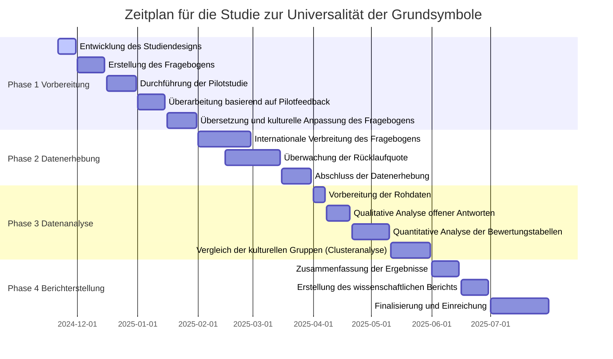

# 1 Forschungsziel

Das Ziel dieser Studie ist es, zu untersuchen, ob die acht [[Grundsymbole]] universelle, abstrakte Repräsentationen fundamentaler Prinzipien darstellen. Dabei liegt der Fokus darauf, ob diese Symbole unabhängig von kulturellen, individuellen und situativen Einflüssen wahrgenommen und interpretiert werden können.

**Kernfragen**:
- Werden die Grundsymbole weltweit intuitiv und universell wahrgenommen?  
- Inwieweit beeinflussen kulturelle, individuelle oder situative Faktoren die Wahrnehmung und Interpretation?  
- Welche Gemeinsamkeiten und Unterschiede lassen sich zwischen verschiedenen kulturellen Hintergründen erkennen?

# 2 Hypothese

Die zentralen Hypothesen der Studie lauten:  

![[Hypothesen Grundsymbole#^h1-Grundsymbole]]
![[Hypothesen Grundsymbole#^h0-Grundsymbole]]

# 3 Methodik

## 3.1 Design der Studie

- **Studiendesign**: Mixed-Methods-Ansatz (Kombination aus qualitativen und quantitativen Methoden)  
- **Fokus**:  
  - Qualitativ: Identifikation spontaner Assoziationen und kultureller Kontexte  
  - Quantitativ: Messung der Passung vorgegebener Konzepte zu den Symbolen  

## 3.2 Stichprobe

- **Zielgruppe**: Personen aus verschiedenen geografischen und kulturellen Hintergründen  
- **Umfang**: Ca. 200–500 Teilnehmende, um eine repräsentative Bandbreite an Perspektiven zu erfassen  
- **Rekrutierung**: Internationale Verbreitung der Umfrage über soziale Netzwerke, Universitäten und internationale Kontakte  

# 4 Aufbau der Umfrage

## 4.1 Einleitung

- Begrüßung und Erklärung des Forschungsziels  
- Einverständniserklärung zur Teilnahme und anonymisierten Datenerhebung  

## 4.2 Soziodemografische Daten

- Alter  
- Geschlecht  
- Geografischer Hintergrund  
- Kultureller Hintergrund  
- Sprache  

## 4.3 Fragen zu den Grundsymbolen

Für jedes der acht Grundsymbole wird dieselbe Struktur verwendet:  
1. **Beschreibung des Symbols**: Kurz und neutral, ohne Interpretation  
2. **Offene Frage**: *„Welche Begriffe oder Bilder kommen Ihnen spontan in den Sinn, wenn Sie [Symbol] sehen?“*  
3. **Bewertungstabelle**: Bewertung der Passung vorgegebener Konzepte (z. B. „Regeneration“, „Verbindung“)  
4. **Kulturelle Einflüsse**: Offene Frage: *„Haben Sie in Ihrer Kultur spezifische Bedeutungen kennengelernt, die mit [Symbol] verbunden sind?“*

## 4.4 Abschluss

- Dankes- und Abschiedsseite  
- Kontaktmöglichkeiten für Rückfragen  

# 5 Datenanalyse

## 5.1 Qualitative Analyse

- **Offene Fragen**:  
  - Inhaltsanalyse zur Identifikation häufig genannter Begriffe und Assoziationen  
  - Vergleich der Assoziationen zwischen kulturellen Gruppen  

## 5.2 Quantitative Analyse

- **Bewertungstabellen**:  
  - Deskriptive Statistiken (Mittelwerte, Häufigkeiten)  
  - Vergleich der Bewertungen zwischen verschiedenen kulturellen Gruppen (z. B. ANOVA, Chi-Quadrat-Tests)  

## 5.3 Vergleich kultureller Hintergründe

- Clusteranalyse zur Identifikation von Gemeinsamkeiten und Unterschieden in der Wahrnehmung und Interpretation der Symbole  

# 6 Zeitplan

Der Zeitplan für die Studie zur Universalität der Grundsymbole gliedert sich in vier Phasen, die jeweils spezifische Aufgaben und Zeiträume umfassen.

## 6.1 Vorbereitung

Die erste Phase startet am 21. November 2024 mit der Entwicklung des Studiendesigns, die bis zum 30. November 2024 abgeschlossen sein soll. Anschließend erfolgt die Erstellung des Fragebogens vom 1. bis 15. Dezember 2024, gefolgt von der Durchführung einer Pilotstudie, die vom 16. bis 31. Dezember 2024 angesetzt ist. Basierend auf den Ergebnissen der Pilotstudie wird der Fragebogen überarbeitet, eine Aufgabe, die vom 1. bis 15. Januar 2025 stattfinden soll. Abschließend wird der Fragebogen vom 16. bis 31. Januar 2025 übersetzt und kulturell angepasst.

## 6.2 Datenerhebung

Die Datenerhebung beginnt am 1. Februar 2025 mit der internationalen Verbreitung des Fragebogens, die bis zum 28. Februar 2025 andauert. Parallel dazu startet ab dem 15. Februar 2025 die Überwachung der Rücklaufquote, welche bis zum 15. März 2025 läuft. Die Datenerhebung endet offiziell mit dem Abschluss dieser Phase am 31. März 2025**.

## 6.3 Datenanalyse

Die dritte Phase beginnt mit der Vorbereitung der Rohdaten vom 1. bis 7. April 2025. Anschließend erfolgt die qualitative Analyse der offenen Antworten, die vom 8. bis 20. April 2025 durchgeführt wird. Darauf folgt die quantitative Analyse der Bewertungstabellen, welche vom 21. April bis 10. Mai 2025 stattfindet. Abschließend erfolgt der Vergleich der kulturellen Gruppen mittels Clusteranalyse, die vom 11. bis 31. Mai 2025 durchgeführt wird.

## 6.4 Berichterstellung

Die Berichterstellung beginnt mit der Zusammenfassung der Ergebnisse, die vom 1. bis 15. Juni 2025 erfolgen soll. Darauf aufbauend wird der wissenschaftliche Bericht vom 16. bis 30. Juni 2025 erstellt. Die Phase schließt mit der Finalisierung und Einreichung des Berichts, die im Zeitraum vom 1. bis 31. Juli 2025 erfolgt.

Das folgende Diagramm visualisiert den beschriebenen Zeitplan und gibt es aktuellen Stand an.

*GanttChart Studienzeitplanung (eig. Darstellung)*

Dieser strukturierte Zeitplan ermöglicht eine systematische Bearbeitung der Studie, von der Vorbereitung über die Datenerhebung und -analyse bis hin zur Berichterstellung. Die einzelnen Aufgaben sind präzise terminiert, um eine klare Orientierung und effiziente Durchführung sicherzustellen.

# 7 Potenzielle Herausforderungen

## 7.1 Repräsentative Stichprobe

- **Herausforderung**: Gleichmäßige Verteilung der Teilnehmenden über Kulturen und Regionen  
- **Lösung**: Breite Streuung der Umfrage über verschiedene Netzwerke  

## 7.2 Sprachliche Barrieren

- **Herausforderung**: Übersetzung und kulturelle Anpassung des Fragebogens  
- **Lösung**: Zusammenarbeit mit Muttersprachlern für Übersetzungen und Tests  

## 7.3 Technische Probleme

- **Herausforderung**: Sonderzeichen oder Formatierungsprobleme in der Umfrageplattform  
- **Lösung**: Testlauf mit verschiedenen Geräten und Browsern  

# 8 Ergebnisse und Verwertung

## 8.1 Erwartete Ergebnisse

- Die Grundsymbole werden universell wahrgenommen, jedoch kulturell unterschiedlich interpretiert  
- Die Bewertungstabellen zeigen eine hohe interkulturelle Übereinstimmung bei den Kernkonzepten  

## 8.1 Verwertung

- Veröffentlichung der Ergebnisse in wissenschaftlichen Artikeln oder Konferenzbeiträgen  
- Integration der Erkenntnisse in weiterführende Forschungen zur universellen Symbolik  
