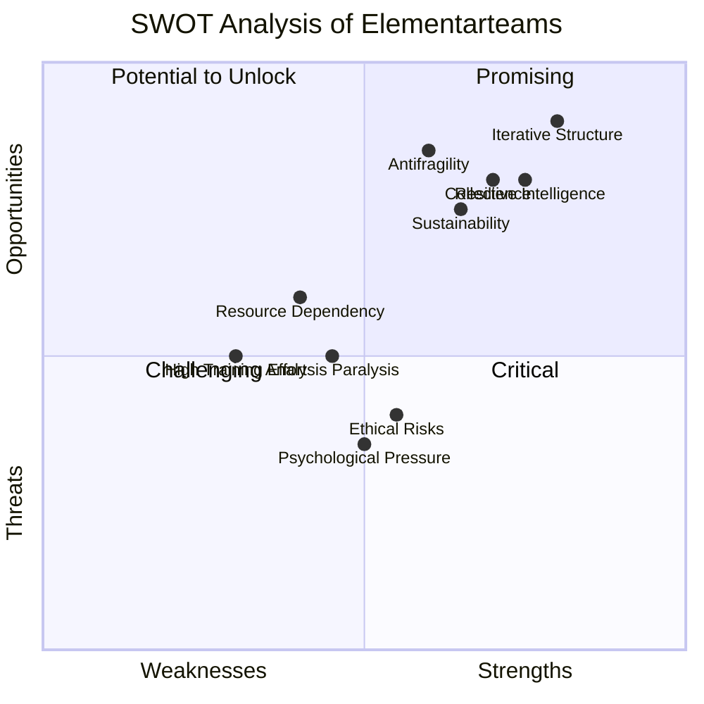

created: 21.1.2025 | [updated](https://git.jochen-hanisch.de/research/high-responibility-teams): 21.1.2025 | [publishd](https://zenodo.org/records/15857049): 10.7.2025  | [Austausch](https://lernen.jochen-hanisch.de/course/view.php?id=4) |  [[Allgemein beruflich/Webseite/Hinweise]]

**Elementarteams: Eine systemtheoretische Grundlagensynthese im Kontext von High-Responsibility-Teams unter Einbezug iterativer Kommunikationsprinzipien**

# Einleitung

In einer zunehmend dynamischen und komplexen Welt stehen Teams vor der Herausforderung, sich flexibel an veränderte Bedingungen anzupassen und gleichzeitig effektive Entscheidungen zu treffen. Besonders in High Responsibility Teams (HRTs), wie sie im Rettungsdienst, der Notfallmedizin oder im Krisenmanagement zu finden sind, erfordert dies innovative Ansätze, die sowohl Resilienz als auch Anpassungsfähigkeit fördern. Elementarteams, die auf den Prinzipien von Feedback, Reflexion und Re-entry basieren, bieten eine vielversprechende Lösung, um diesen Anforderungen gerecht zu werden.

Das Erkenntnisinteresse dieser Arbeit liegt darin, zu untersuchen, wie die Prinzipien von Elementarteams dazu beitragen können, Teamdynamik und Entscheidungsprozesse in kritischen Kontexten zu optimieren. Die theoretische Grundlage bildet dabei Luhmanns Systemtheorie (1984), ergänzt durch Ansätze aus der Entscheidungsökonomie (Sutton & Barto, 2018) und dem Konzept der Antifragilität (Taleb, 2012). Diese theoretischen Perspektiven werden genutzt, um die Funktionsweise von Elementarteams zu analysieren und ihr Potenzial für die Praxis zu bewerten.

Im weiteren Verlauf der Arbeit wird zunächst eine Definition von Elementarteams entwickelt, bevor ihre theoretische Herleitung aus verschiedenen Perspektiven erfolgt. Darauf aufbauend werden ihre Stärken, Schwächen, Chancen und Risiken systematisch analysiert und in einer SWOT-Analyse dargestellt. Abschließend werden die Implikationen für Theorie und Praxis sowie die zentralen Erkenntnisse zusammengefasst.

Diese Arbeit soll nicht nur das Verständnis für Elementarteams vertiefen, sondern auch praktische Handlungsempfehlungen liefern, wie sie in unterschiedlichen Kontexten implementiert und optimiert werden können.

# 1 Definition

Elementarteams sind Teams, deren Handlungen und [[Wirkung]]en vollständig auf der dynamischen Interdependenz von Feedback, Reflexion und Re-entry basieren. Diese Prinzipien der Elementarkommunikation ermöglichen es den Teams, ihre Prozesse kontinuierlich anzupassen und zu optimieren. Feedback liefert Informationen über den aktuellen Zustand und die Ergebnisse von Handlungen, Reflexion dient der Analyse und Bewertung dieser Informationen, und Re-entry sorgt dafür, dass die Erkenntnisse in den laufenden Kommunikationsprozess reintegriert werden.

**Elemente der Definition von Elementarteams:**

1. **Handlungen und [[Wirkung]]en**:    
    - **Handlungen**: Alle Aktivitäten, die von den Teammitgliedern initiiert werden, um ein Ziel zu erreichen.
    - **[[Wirkung]]en**: Die Ergebnisse oder Konsequenzen der Handlungen, die durch Feedback bewertet werden.
2. **Dynamische Interdependenz**:    
    - Beschreibt die gegenseitige Abhängigkeit der drei Prinzipien (Feedback, Reflexion, Re-entry) in einem kontinuierlichen Prozess.
    - Jede Phase beeinflusst und wird von den anderen beeinflusst, wodurch eine zyklische Struktur entsteht.
3. **Feedback**:    
    - Prozess der Informationsrückkopplung, bei dem Ergebnisse von Handlungen bewertet und dokumentiert werden.
    - Ermöglicht es Teams, Fehler oder Verbesserungspotenziale frühzeitig zu identifizieren.
4. **Reflexion**:    
    - Kritische Analyse der durch Feedback erhaltenen Informationen.
    - Ziel: Handlungen im Kontext der Teamziele zu bewerten und neue Strategien zu entwickeln.
    - Kann sowohl individuell (intrapersonal) als auch kollektiv (interpersonal) erfolgen.
5. **Re-entry**:    
    - Wiedereinführung der reflektierten Erkenntnisse in den Kommunikations- und Entscheidungsprozess des Teams.
    - Ziel: Optimierte Strategien und Handlungen in die laufenden Prozesse zu integrieren.
6. **Prinzipien der Elementarkommunikation**:    
    - Basieren auf systemtheoretischen Überlegungen (Luhmann, 1984), wonach soziale Systeme durch Kommunikation erzeugt und erhalten werden.
    - Feedback, Reflexion und Re-entry sind die zentralen Kommunikationsoperationen, die Elementarteams strukturieren.

Die dynamische Interdependenz stellt sicher, dass Feedback, Reflexion und Re-entry nicht isoliert funktionieren, sondern in einem zyklischen Prozess eingebunden sind. Handlungen basieren auf der Integration vorheriger Erkenntnisse (Re-entry) und führen zu neuen [[Wirkung]]en, die durch Feedback und Reflexion erneut bewertet werden.

Diese Elemente bilden das Grundgerüst von Elementarteams und unterscheiden sie fundamental von traditionellen Teammodellen.

```mermaid
graph TD
  subgraph Elementarteams["Elementarteams"]
    F[Feedback] -->|Wahrnehmung & Verarbeitung| R[Reflexion]
    R -->|Bewertung & Bedeutungsgebung| RE[Re-Entry]
    RE -->|Integration in neue Handlungen| F
  end

  Elementarteams -->|Handlungen & [[Wirkung]]en| [[Wirkung]][Systemische [[Wirkung]]]
  [[Wirkung]] -->|Beeinflusst erneut| Elementarteams
```

Im Gegensatz zu traditionellen Teamstrukturen sind Elementarteams besonders geeignet für dynamische und unsichere Umfelder, da sie auf Selbstorganisation und kontinuierliche Verbesserung ausgerichtet sind. Diese Struktur basiert auf den systemtheoretischen Überlegungen von Luhmann (1984), die soziale Systeme als durch Kommunikation erzeugte und reproduzierte Einheiten verstehen.

# 2 Herleitung

Die Herleitung von Elementarteams basiert auf einem interdisziplinären Ansatz, der theoretische und praktische Perspektiven miteinander verknüpft. Dieses Kapitel untersucht, wie die Prinzipien von Feedback, Reflexion und Re-entry aus verschiedenen wissenschaftlichen und methodischen Kontexten abgeleitet werden können. Dabei wird verdeutlicht, dass Elementarteams eine systemische Antwort auf die Anforderungen moderner Arbeits- und Entscheidungsprozesse darstellen.

Die Grundlage der Herleitung bildet die Systemtheorie nach Luhmann (1984), die soziale Systeme als durch Kommunikation konstituiert begreift. Diese Perspektive zeigt, dass Teams nicht durch die individuellen Fähigkeiten ihrer Mitglieder definiert werden, sondern durch die Interdependenz der Kommunikationsprozesse, die sie strukturieren. Feedback, Reflexion und Re-entry werden in diesem Kontext als die zentralen Operationen beschrieben, die ein Team handlungsfähig machen und seine Dynamik bestimmen.

Ergänzt wird dieser systemtheoretische Ansatz durch Konzepte aus der Entscheidungsökonomie (Sutton & Barto, 2018), die iterative Optimierungsprozesse in unsicheren und dynamischen Umfeldern untersuchen. Die Verbindung dieser Konzepte mit der Praxis zeigt, dass Elementarteams besonders geeignet sind, in komplexen Kontexten wie dem Rettungsdienst, der Notfallmedizin oder agilen Organisationen effektiv zu agieren.

Das Kapitel gliedert sich in verschiedene Perspektiven, um die theoretische Fundierung und die praktische Anwendbarkeit von Elementarteams differenziert zu beleuchten. Die folgenden Abschnitte betrachten systemtheoretische, kommunikative, entscheidungsorientierte und weitere relevante Herleitungen im Detail. Ziel ist es, die Prinzipien von Feedback, Reflexion und Re-entry als universelles Modell für Teamarbeit in dynamischen Umfeldern zu etablieren.

## 2.1 Systemtheoretische Perspektive

Die Herleitung der Elementarteams aus systemtheoretischer Perspektive fußt auf der Theorie sozialer Systeme von Niklas Luhmann. In dieser Theorie werden soziale Systeme nicht durch Individuen, sondern durch Kommunikation als basale Einheit beschrieben. Systeme entstehen, bestehen und entwickeln sich durch die kontinuierliche Verarbeitung von Kommunikation, die selbstreferenziell organisiert ist und ihre eigene Struktur reproduziert (Luhmann, 1984).

Elementarteams setzen diese systemtheoretischen Prinzipien konsequent um. Sie sind als soziale Systeme zu verstehen, die ihre Handlungen und [[Wirkung]]en ausschließlich auf Kommunikation gründen. Insbesondere basiert ihre Funktionalität auf der dynamischen Interdependenz der drei Kernprinzipien: Feedback, Reflexion und Re-entry. Feedback stellt die Rückkopplung innerhalb des Systems dar, durch die Informationen über den Zustand und die [[Wirkung]] der Systemoperationen gesammelt werden. Reflexion ermöglicht die Bewertung und Interpretation dieser Informationen im Kontext der Teamziele. Re-entry beschreibt die Reintegration der Ergebnisse aus der Reflexion in die laufende Kommunikation und Entscheidungsprozesse.

Ein wesentlicher Aspekt der systemtheoretischen Perspektive ist die Unterscheidung zwischen System und Umwelt. Elementarteams agieren als operativ geschlossene, aber umweltoffene Systeme. Sie nehmen externe Einflüsse und Informationen wahr, verarbeiten diese durch ihre Kommunikationsprozesse und passen sich an veränderte Bedingungen an, ohne dabei ihre Systemgrenzen zu überschreiten. Diese Fähigkeit zur Differenzierung zwischen internem und externem Kontext ist ein Schlüsselfaktor für die Anpassungsfähigkeit und Resilienz von Elementarteams.

Die praktische Relevanz dieser Perspektive zeigt sich insbesondere in dynamischen und unsicheren Umfeldern. Hier ermöglichen die Prinzipien der Elementarkommunikation eine flexible und effektive Reaktion auf Veränderungen, indem sie emergente Problemlösungen und innovative Ansätze fördern. Teams, die auf diese Weise organisiert sind, können nicht nur stabil auf bestehende Herausforderungen reagieren, sondern auch neue Strukturen und Strategien entwickeln, die über die Summe der individuellen Beiträge hinausgehen (Luhmann, 1984).

Die systemtheoretische Perspektive verdeutlicht, dass Elementarteams durch ihre Kommunikationsprozesse sowohl ihre innere Kohärenz bewahren als auch ihre Anpassungsfähigkeit maximieren. Dies macht sie zu einem idealen Modell für soziale Systeme in hochkomplexen und dynamischen Arbeitsumfeldern.

## 2.2 Kommunikationsperspektive

Die Betrachtung der Elementarteams aus kommunikationstheoretischer Perspektive stützt sich auf die Erkenntnis, dass Kommunikation der zentrale Mechanismus ist, durch den diese Teams entstehen, bestehen und wirken. Elementarkommunikation wird dabei als grundlegender Prozess beschrieben, der sowohl die intra- als auch die interpersonalen Dynamiken innerhalb eines Teams integriert und steuert. Dieser Ansatz basiert auf der Idee, dass Kommunikation nicht lediglich ein Mittel zur Informationsübertragung darstellt, sondern die operative Grundlage sozialer Systeme bildet.

In Elementarteams fungiert Kommunikation als primäre Einheit der Sinnbildung und Entscheidungsfindung. Die Prinzipien von Feedback, Reflexion und Re-entry sind dabei eng miteinander verwoben. Feedback ermöglicht die Rückkopplung von Informationen über vergangene Handlungen oder aktuelle Zustände. Diese Informationen werden auf intrapersonaler Ebene durch Reflexion verarbeitet, wobei die individuelle Bewertung von Erfahrungen, Wahrnehmungen und Kontexten eine zentrale Rolle spielt. Die Ergebnisse dieser Reflexionen werden wiederum in die interpersonalen Kommunikationsprozesse eingebracht und durch Re-entry in die Teamdynamik reintegriert.

Ein entscheidendes Merkmal der Kommunikationsprozesse in Elementarteams ist ihre wechselseitige Beziehung zwischen intra- und interpersonalen Ebenen. Jedes Teammitglied führt eigenständig Reflexionsprozesse durch, die auf den erhaltenen Feedbacks basieren, und bringt die daraus resultierenden Erkenntnisse in die kollektive Kommunikation ein. Gleichzeitig beeinflusst die kollektive Kommunikation die individuellen Reflexionsprozesse, wodurch ein dynamischer und zyklischer Kommunikationsfluss entsteht. Dieser Mechanismus fördert nicht nur die Selbstorganisation des Teams, sondern auch die Entstehung von emergenten Lösungen, die durch die Integration vielfältiger Perspektiven entstehen.

Darüber hinaus ist Kommunikation in Elementarteams nicht nur auf die interne Interaktion beschränkt, sondern dient auch der Anpassung an externe Einflüsse. Indem Feedback aus der Umwelt aufgenommen, reflektiert und in das Team reintegriert wird, können Elementarteams flexibel auf veränderte Bedingungen reagieren. Diese Fähigkeit zur dynamischen Adaption ist insbesondere in unsicheren und komplexen Umfeldern von entscheidender Bedeutung.

Die Kommunikationsperspektive zeigt, dass Elementarteams ihre Struktur und Dynamik vollständig durch ihre Kommunikationsprozesse, d.h. durch Elementarkommunikation, definieren. Diese ist hier nicht nur ein unterstützender Faktor, sondern die zentrale Grundlage, auf der Handlungen, Entscheidungen und [[Wirkung]]en basieren. Diese Perspektive unterstreicht die Bedeutung von Feedback, Reflexion und Re-entry als interdependente Prinzipien, die die Funktionsweise von Elementarteams ermöglichen und deren Erfolg maßgeblich bestimmen.

## 2.3 Entscheidungs- und Prozessperspektive

Die Entscheidungs- und Prozessperspektive bietet eine analytische Grundlage, um die Dynamik und Funktionsweise von Elementarteams als iterative, kontinuierlich optimierende Systeme zu verstehen. Entscheidungen in Elementarteams beruhen auf der ständigen Anpassung und Optimierung von Prozessen, die durch Feedback, Reflexion und Re-entry strukturiert sind. Diese interdependenten Elemente bilden den Kern der Handlungsfähigkeit und Effizienz solcher Teams.

Die iterative Struktur, die Elementarteams auszeichnet, kann durch Konzepte aus der Entscheidungsökonomie, wie den Markov-Entscheidungsprozessen (MDPs), fundiert beschrieben werden. MDPs modellieren Entscheidungsprozesse in Zustandsräumen, wobei jede Entscheidung als Übergang von einem Zustand in einen anderen interpretiert wird, abhängig von der Wahrscheinlichkeit und der erwarteten Belohnung des Ergebnisses (Sutton & Barto, 2018). In Elementarteams repräsentieren Feedbackzyklen die Sammlung von Daten und Rückmeldungen aus dem aktuellen Zustand des Systems, Reflexion dient der Analyse und Bewertung dieser Daten, und Re-entry führt zur Implementierung der Erkenntnisse in die nächste Iteration. ([[High Responsibility Team Decision Framework]])

Ein zentraler Vorteil dieser Struktur liegt in der Fähigkeit, Entscheidungen dynamisch an sich ändernde Bedingungen anzupassen. Feedback liefert Informationen über die Wirksamkeit von Maßnahmen oder Veränderungen, während Reflexion die Möglichkeit schafft, bestehende Annahmen und Strategien zu hinterfragen. Re-entry schließt den Zyklus, indem die optimierten oder angepassten Strategien in die Teamprozesse reintegriert werden. Dadurch entstehen fortlaufend neue Zustände, die wiederum durch Feedback bewertet und reflektiert werden.

Die Einbindung der [[Wirkungswahrscheinlichkeit]] ermöglicht eine quantitative Bewertung dieser Entscheidungsprozesse. Hierbei wird jede Handlung im Kontext ihrer potenziellen [[Wirkung]] und ihrer Erfolgswahrscheinlichkeit bewertet. Mathematisch lässt sich dies durch Belohnungsfunktionen und Übergangswahrscheinlichkeiten modellieren, die die Erfolgswahrscheinlichkeit optimieren (Sutton & Barto, 2018). Diese Perspektive ist besonders in dynamischen und komplexen Umfeldern nützlich, in denen Unsicherheiten minimiert und Ressourcen effizient eingesetzt werden müssen.

Ein Beispiel für die praktische Anwendung dieser Perspektive könnte ein Krisenmanagement-Team sein. In einer Notsituation sammelt das Team zunächst Feedback über die aktuelle Lage (z. B. Berichte von Beteiligten oder Sensordaten). Anschließend reflektiert es, welche Maßnahmen am effektivsten sein könnten, indem es mögliche Szenarien und Wahrscheinlichkeiten analysiert. Schließlich implementiert das Team die ausgewählten Maßnahmen und beobachtet die [[Wirkung]], um diese Erkenntnisse in die nächste Entscheidungsrunde einzuspeisen.

Die Entscheidungs- und Prozessperspektive zeigt auf, dass Elementarteams durch ihre iterative Struktur eine hohe Anpassungsfähigkeit und Optimierungsfähigkeit besitzen. Sie kombinieren qualitative und quantitative Ansätze, um Entscheidungen nicht nur situativ, sondern auch strategisch zu treffen. Dadurch maximieren sie ihre [[Wirkung]] und können in komplexen, dynamischen Umfeldern besonders effektiv agieren.

## 2.4 Perspektive der Wirkungswahrscheinlichkeit

Die Perspektive der [[Wirkung]]swahrscheinlichkeit bietet eine quantitative Grundlage, um die Effektivität von Entscheidungen und Iterationen in Elementarteams zu bewerten und gezielt zu optimieren. Dieses Konzept basiert auf der Idee, dass jede Handlung und Entscheidung innerhalb eines Teams eine bestimmte Wahrscheinlichkeit hat, die gewünschte [[Wirkung]] zu erzielen. Indem diese Wahrscheinlichkeiten systematisch modelliert und analysiert werden, können Elementarteams ihre Effizienz und Anpassungsfähigkeit maximieren.

Die [[Wirkungswahrscheinlichkeit]] wird mathematisch durch die Kombination von Übergangswahrscheinlichkeiten und Belohnungsfunktionen beschrieben, die den Erfolg von Entscheidungen in einem gegebenen Kontext bewerten (Sutton & Barto, 2018). In Elementarteams spiegeln diese Wahrscheinlichkeiten die Wahrscheinlichkeit wider, dass eine spezifische Handlung in einer bestimmten Situation zu einem gewünschten Zustand führt. Dies ermöglicht eine datenbasierte Bewertung von Entscheidungsoptionen und die Priorisierung von Maßnahmen, die mit der höchsten Wahrscheinlichkeit die Zielsetzung unterstützen.

Das iterative Prinzip von Feedback, Reflexion und Re-entry spielt eine zentrale Rolle in der Optimierung der [[Wirkungswahrscheinlichkeit]]. Feedback liefert die notwendigen Daten, um die aktuellen Wahrscheinlichkeiten zu evaluieren, Reflexion dient der Analyse und Anpassung dieser Wahrscheinlichkeiten, und Re-entry sorgt dafür, dass die optimierten Strategien wieder in die Teamprozesse integriert werden. Durch diesen zyklischen Ansatz wird sichergestellt, dass Entscheidungen kontinuierlich an neue Informationen und veränderte Bedingungen angepasst werden.

Ein Beispiel verdeutlicht die Anwendung: In einem Elementarteam, das in einem Innovationsprojekt arbeitet, könnten die Teammitglieder zunächst Hypothesen über die Markttauglichkeit einer neuen Produktidee aufstellen. Feedback aus ersten Nutzertests wird genutzt, um die Wahrscheinlichkeit zu bewerten, dass die aktuelle Produktversion den Bedürfnissen der Zielgruppe entspricht. Die Reflexion dieses Feedbacks könnte zeigen, dass bestimmte Funktionen angepasst oder ergänzt werden müssen, um die Erfolgschancen zu erhöhen. Re-entry würde dann bedeuten, dass die gewonnenen Erkenntnisse in die nächste Entwicklungsiteration einfließen, wodurch die Wahrscheinlichkeit für den Markterfolg systematisch steigt.

Die mathematische Modellierung der [[Wirkungswahrscheinlichkeit]] lässt sich durch bekannte Formeln der Wahrscheinlichkeitsrechnung weiter präzisieren. Zum Beispiel kann der Additionssatz verwendet werden, um die Wahrscheinlichkeit alternativer Szenarien zu berechnen, während der Multiplikationssatz die Wahrscheinlichkeit simultaner Ereignisse beschreibt. Solche Modelle bieten eine fundierte Grundlage, um Entscheidungen in Elementarteams nicht nur qualitativ, sondern auch quantitativ zu bewerten.

Die Perspektive der [[Wirkungswahrscheinlichkeit]] zeigt eindrucksvoll, wie Elementarteams ihre Effizienz steigern können, indem sie ihre Entscheidungen gezielt steuern und bewerten. Durch die kontinuierliche Optimierung der Entscheidungsprozesse können sie in dynamischen Umfeldern nicht nur stabil agieren, sondern auch innovative Lösungen entwickeln, die über traditionelle Ansätze hinausgehen. Dieses Modell verdeutlicht, dass die Verbindung von Kommunikation, Iteration und mathematischer Bewertung ein zentraler Erfolgsfaktor für moderne Teamarbeit ist.


## 2.5 Emergenz- und Stabilitätsperspektive

Die Emergenz- und Stabilitätsperspektive beleuchtet eine der zentralen Stärken von Elementarteams: ihre Fähigkeit, Stabilität und Innovation gleichzeitig zu gewährleisten. Diese Fähigkeit ergibt sich aus der besonderen Struktur und Dynamik der Elementarkommunikation, die intra- und interpersonale Prozesse eng miteinander verschränkt. Die dadurch entstehende Interdependenz zwischen individuellen Reflexionen und kollektiver Kommunikation führt zu emergenten Lösungen, die über die Summe der Einzelbeiträge hinausgehen.

[[Emergenz]] bezeichnet das Auftreten neuer, unerwarteter Eigenschaften oder Verhaltensweisen eines Systems, die nicht direkt aus den Eigenschaften der Einzelteile ableitbar sind. In Elementarteams entsteht [[Emergenz]] durch die kontinuierliche Interaktion und Rückkopplung zwischen Feedback, Reflexion und Re-entry. Individuelle Reflexionsprozesse der Teammitglieder sind hierbei entscheidend, da sie es ermöglichen, unterschiedliche Perspektiven und Erfahrungen in die Teamkommunikation einzubringen. Diese individuellen Beiträge werden durch kollektive Kommunikationsprozesse integriert und führen zu neuen Lösungsansätzen, die keinem einzelnen Mitglied allein zugeschrieben werden können. Damit folgen Elementarteams dem [[Lernen als universelles Prinzip]].

Gleichzeitig gewährleisten die zyklischen Prozesse von Feedback, Reflexion und Re-entry eine stabile Grundlage für die Teamdynamik. Feedback liefert verlässliche Informationen über den aktuellen Zustand des Systems, Reflexion strukturiert diese Informationen und bietet eine kohärente Analyse, während Re-entry die Ergebnisse wieder in den Kommunikationsfluss zurückführt und somit eine kontinuierliche Weiterentwicklung ermöglicht. Diese Prozesse stabilisieren das Team, indem sie eine klare Orientierung bieten und gleichzeitig Raum für Anpassungen und Innovationen schaffen.

Ein praktisches Beispiel für diese Perspektive ist ein Team, das in einer Krisensituation agiert. Während Stabilität durch die Struktur der Kommunikationsprozesse sichergestellt wird, entstehen emergente Lösungen, wenn Teammitglieder ihre individuellen Einschätzungen und Reflexionen einbringen. Ein Mitglied könnte beispielsweise eine unerwartete Beobachtung aus einer vorherigen Iteration einbringen, die das gesamte Team dazu inspiriert, eine innovative Strategie zu entwickeln. Diese Lösung wäre ohne die Verschachtelung von intra- und interpersonaler Kommunikation nicht denkbar gewesen.

Die Fähigkeit von Elementarteams, Stabilität und [[Emergenz]] zu kombinieren, ist insbesondere in komplexen und dynamischen Umfeldern von großer Bedeutung. Stabilität gewährleistet Handlungsfähigkeit und Orientierung, während [[Emergenz]] Innovation und Anpassungsfähigkeit fördert. Diese duale Eigenschaft macht Elementarteams zu einer effektiven Antwort auf die Herausforderungen moderner Arbeitswelten, in denen Unsicherheit und Komplexität allgegenwärtig sind.

Zusammenfassend zeigt die Emergenz- und Stabilitätsperspektive, dass die Verschachtelung von intra- und interpersonaler Kommunikation ein zentrales Merkmal von Elementarteams ist. Sie ermöglicht es, neue Lösungen zu entwickeln und gleichzeitig eine stabile Arbeitsbasis zu schaffen. Dieser Ansatz stellt eine einzigartige Kombination aus Flexibilität und Verlässlichkeit dar, die Elementarteams in dynamischen und herausfordernden Kontexten besonders effektiv macht.

## 2.6 Beispiele aus der Praxis

Um die Funktionsweise und den Nutzen von Elementarteams besser zu veranschaulichen, sind konkrete Beispiele aus der Praxis hilfreich. Diese verdeutlichen, wie Feedback, Reflexion und Re-entry in realen Szenarien angewendet werden und wie Elementarteams dadurch Stabilität und Innovation zugleich fördern.

### 2.6.1 Krisenmanagement in einem Notfallteam

Ein Notfallteam, das in einer medizinischen Krise operiert, ist ein klassisches Beispiel für die Anwendung der Prinzipien von Elementarkommunikation. In einer dynamischen Umgebung, in der Entscheidungen unter Zeitdruck getroffen werden müssen, sammelt das Team kontinuierlich Feedback aus der aktuellen Lage, etwa durch Beobachtungen der Patienten, Berichte von Teammitgliedern oder diagnostische Tests. Die Teammitglieder reflektieren dieses Feedback individuell und bewerten es hinsichtlich seiner Relevanz für die Situation. Diese Reflexionen fließen anschließend in die interpersonale Kommunikation ein, in der das Team kollektive Entscheidungen trifft. Der Re-entry erfolgt durch die Umsetzung der beschlossenen Maßnahmen, deren [[Wirkung]] wiederum über Feedback erneut evaluiert wird. Dieser zyklische Prozess ermöglicht es dem Team, flexibel und effizient auf Veränderungen in der Situation zu reagieren, ohne dabei die Stabilität ihrer Arbeit zu gefährden.

### 2.6.2 Innovationsprozess in einem Entwicklungsteam

Ein Softwareentwicklungsteam, das ein neues Produkt entwirft, kann ebenfalls als Beispiel für Elementarteams herangezogen werden. In diesem Szenario beginnt der Prozess mit der Sammlung von Feedback aus Nutzerstudien und Marktanalysen. Die einzelnen Teammitglieder reflektieren dieses Feedback und bringen ihre Einschätzungen und Vorschläge in Teammeetings ein. Durch die kollektive Diskussion entstehen neue Ideen, die auf Basis der Reflexionen optimiert werden. Diese optimierten Ideen werden anschließend in Prototypen umgesetzt (Re-entry) und in der nächsten Iteration wieder evaluiert. Der iterative Charakter dieses Prozesses fördert sowohl die Qualität des Produkts als auch die Innovationsfähigkeit des Teams, da es kontinuierlich aus den Erfahrungen der vorangegangenen Iterationen lernt.

### 2.6.3 Schulung und Weiterentwicklung in einem Bildungskontext

Ein Lehrteam, das ein neues pädagogisches Konzept entwickelt, setzt ebenfalls die Prinzipien von Elementarkommunikation um. Feedback von Schüler:innen und Kolleg:innen wird genutzt, um die Effektivität des Konzepts zu bewerten. Die Teammitglieder reflektieren diese Rückmeldungen individuell und bringen ihre Erkenntnisse in gemeinsame Workshops ein. Dort werden die Konzepte überarbeitet und angepasst. Durch den Re-entry werden die neuen Konzepte in der Praxis erprobt, wobei die Ergebnisse wiederum durch Feedback bewertet werden. Dieser kontinuierliche Prozess trägt nicht nur zur Verbesserung des Konzepts bei, sondern stärkt auch die Zusammenarbeit und das Vertrauen innerhalb des Teams.

### 2.6.3 Fazit
Diese Beispiele zeigen, wie Elementarteams in verschiedenen Kontexten erfolgreich agieren können. Ob im Krisenmanagement, bei Innovationsprozessen oder in der Bildung: Die Prinzipien von Feedback, Reflexion und Re-entry ermöglichen es, komplexe Herausforderungen zu meistern und zugleich Stabilität und Flexibilität zu bewahren. Dabei wird deutlich, dass der Erfolg dieser Teams nicht allein auf individuellen Kompetenzen, sondern auf der Dynamik und Struktur ihrer Kommunikationsprozesse beruht.

## 2.7 Mathematische Modulation

Die mathematische Modulation von Elementarteams basiert auf der Modellierung der dynamischen Prozesse von Feedback, Reflexion und Re-entry. Diese Prozesse können durch Wahrscheinlichkeitsmodelle beschrieben werden, insbesondere durch Konzepte wie Markov-Entscheidungsprozesse und die [[Wirkungswahrscheinlichkeit]]. Die mathematische Herleitung ermöglicht es, die Entscheidungen und Iterationen in Elementarteams systematisch zu analysieren und zu optimieren.

### 2.7.1 Übergangswahrscheinlichkeiten und Zustände

Elementarteams operieren in einem Zustandsraum, in dem jeder Zustand $s$ den aktuellen Kontext, die verfügbaren Ressourcen und die Teamdynamik beschreibt. Übergänge zwischen Zuständen erfolgen durch Aktionen $a$, die basierend auf Feedback und Reflexion ausgewählt werden. Die Wahrscheinlichkeit eines Übergangs von Zustand $s$ in Zustand $s'$ durch eine Aktion $a$ wird durch $P(s' | s, a)$ beschrieben.

Die mathematische Grundlage für diese Übergangswahrscheinlichkeit ist:
$$
P(s' | s, a) = \text{Wahrscheinlichkeit, dass Aktion } a \text{ den Zustand von } s \text{ nach } s' \text{ ändert.}
$$

Diese Übergangswahrscheinlichkeiten sind zentral, um die [[Wirkung]] von Entscheidungen in Elementarteams zu modellieren. Sie ermöglichen eine Vorhersage darüber, wie sich die Teamdynamik durch bestimmte Handlungen verändert.

### 2.7.2 [[Wirkung]]swahrscheinlichkeit und Belohnungsfunktionen

Die [[Wirkungswahrscheinlichkeit]] $W(s, a, s')$ beschreibt die Wahrscheinlichkeit, dass eine Aktion $a$ in Zustand $s$ zu einem gewünschten Zustand $s'$ führt. Diese kann durch eine Belohnungsfunktion $R(s, a, s')$ ergänzt werden, die den Nutzen oder Erfolg einer Aktion quantifiziert. Das Ziel von Elementarteams ist es, die Gesamteffizienz ihrer Handlungen zu maximieren, indem sie Strategien entwickeln, die den kumulativen Nutzen optimieren.

Die Belohnungsfunktion wird definiert als:
$$
R(s, a, s') = \text{Bewertung der [[Wirkung]] von } a \text{ im Übergang von } s \text{ nach } s'.
$$

Die Verbindung von Übergangswahrscheinlichkeiten und Belohnungsfunktionen ermöglicht eine Optimierung der Teamentscheidungen, indem Handlungen priorisiert werden, die die höchste kombinierte Wirkungs- und Erfolgswahrscheinlichkeit aufweisen.

### 2.7.3 Iterative Optimierung durch Feedback, Reflexion und Re-entry
Das iterative Prinzip von Elementarteams wird durch die kontinuierliche Anpassung der Entscheidungsstrategien beschrieben. Jede Iteration liefert neues Feedback, das die Wahrscheinlichkeiten und Belohnungswerte aktualisiert. Die Reflexion analysiert diese Informationen, während Re-entry die optimierten Strategien wieder in die Teamdynamik integriert.

Die mathematische Beschreibung dieses Prozesses folgt der Rekursionsformel für die Bewertung von Zuständen $V(s)$:

$$
V(s) = \max_a \sum_{s'} P(s' | s, a) \cdot \left[ R(s, a, s') + \gamma \cdot V(s') \right],
$$
wobei:
- $V(s)$ der erwartete Wert des Zustands $s$ ist,
- $\gamma$ ein Diskontierungsfaktor ist, der zukünftige Belohnungen abwertet,
- $P(s' | s, a)$ die Übergangswahrscheinlichkeit beschreibt,
- $R(s, a, s')$ die Belohnung für die Aktion $a$ angibt.

### 2.7.4 Anwendungsbeispiele der Modulation

1. **Krisenmanagement:** In einem Notfallteam könnte $s$ den aktuellen Zustand des Patienten beschreiben, $a$ eine medizinische Intervention, und $s'$ den resultierenden Zustand. Die Belohnungsfunktion könnte die Überlebensrate oder die Stabilisierung des Patienten bewerten.
2. **Innovationsprojekte:** Für ein Entwicklungsteam könnte $s$ die aktuelle Produktversion, $a$ eine neue Funktion, und $s'$ die verbesserte Version sein. Die Belohnungsfunktion könnte durch Marktanalysen oder Nutzerfeedback definiert werden.

### 2.7.5 Schlussforlgerung

Die mathematische Modulation von Elementarteams zeigt, wie Feedback, Reflexion und Re-entry systematisch optimiert werden können, um die [[Wirkungswahrscheinlichkeit]] und den Gesamterfolg des Teams zu maximieren. Durch die Anwendung von Wahrscheinlichkeitsmodellen und Belohnungsfunktionen können Entscheidungen nicht nur qualitativ, sondern auch quantitativ fundiert getroffen werden. Dies macht die mathematische Perspektive zu einem zentralen Werkzeug, um die Effizienz und Anpassungsfähigkeit von Elementarteams in komplexen und dynamischen Umfeldern zu gewährleisten.

## 2.8 Mathematischer Beweis inkl. Beispielsrechnung

Der mathematische Beweis für die iterative Optimierung und die Berechnung der [[Wirkungswahrscheinlichkeit]] in Elementarteams verdeutlicht, wie Feedback, Reflexion und Re-entry systematisch in dynamischen Umfeldern wirken. Der Fokus liegt dabei auf der Modellierung von Übergangswahrscheinlichkeiten und der iterativen Verbesserung durch wiederholte Kommunikationszyklen.

### 2.8.1 Ziel des Beweises

Die Zielsetzung besteht darin, die steigende Erfolgswahrscheinlichkeit von Elementarteams durch iterative Zyklen zu zeigen und eine quantitative Basis für die Vorhersage ihrer Effektivität zu schaffen.

### 2.8.2 Beweisgrundlage

1. **Iterative Wahrscheinlichkeitsformel**:
   Die Wahrscheinlichkeit des Erfolgs eines Teams über \( n \) Iterationen berechnet sich aus der Formel:
   $$
   P_{\text{Erfolg}} = 1 - \prod_{i=1}^{n} (1 - P_i),
   $$
   
   wobei:
   - \( P_i \): Erfolgswahrscheinlichkeit in der \( i \)-ten Iteration.
   - \( n \): Anzahl der Iterationen.

1. **Wirkungswahrscheinlichkeit**:
   Jede Iteration liefert Feedback, das die Übergangswahrscheinlichkeit von einem Zustand \( s \) in einen neuen Zustand \( s' \) verbessert. Diese Übergänge werden durch:
   $$
   P(s' | s, a) = \text{Wahrscheinlichkeit, dass Aktion } a \text{ den Zustand von } s \text{ nach } s' \text{ ändert},
   $$
   beschrieben.

2. **Belohnungsfunktion**:
   Zur Bewertung der Qualität der Entscheidungen und Maßnahmen wird die Belohnungsfunktion \( R(s, a, s') \) verwendet, die den Nutzen einer Aktion in einem bestimmten Zustand misst.

### 2.8.3 Beispielsrechnung

Annahmen:

- Das Team durchläuft 3 Iterationen.
- Wahrscheinlichkeiten für jede Iteration:
  - \( P_1 = 0.7 \) (erste Iteration, initiale Unsicherheiten),
  - \( P_2 = 0.8 \) (zweite Iteration, bessere Anpassung an Feedback),
  - \( P_3 = 0.85 \) (dritte Iteration, Lerneffekte maximieren Effizienz).

Berechnung:

Die Gesamterfolgswahrscheinlichkeit \( P_{\text{Erfolg}} \) ergibt sich durch:
$$
P_{\text{Erfolg}} = 1 - (1 - 0.7) \cdot (1 - 0.8) \cdot (1 - 0.85).
$$
Zwischenschritte:
- \( 1 - 0.7 = 0.3 \),
- \( 1 - 0.8 = 0.2 \),
- \( 1 - 0.85 = 0.15 \),
- \( 0.3 \cdot 0.2 \cdot 0.15 = 0.009 \).

Endergebnis:
$$
P_{\text{Erfolg}} = 1 - 0.009 = 0.991 = 99.1 \%.
$$

Interpretation:

Nach drei Iterationen erreicht das Team eine nahezu sichere Erfolgswahrscheinlichkeit von 99.1 %. Dies zeigt die Stärke iterativer Prozesse und deren exponentielle Verbesserung bei konsequenter Anwendung.

### 2.8.4 Sensitivitätsanalyse

Falls die initiale Erfolgswahrscheinlichkeit niedriger wäre, z. B. \( P_1 = 0.5 \), würde die Berechnung wie folgt aussehen:
$$
P_{\text{Erfolg}} = 1 - (1 - 0.5) \cdot (1 - 0.8) \cdot (1 - 0.85).
$$
Zwischenschritte:
- \( 1 - 0.5 = 0.5 \),
- \( 1 - 0.8 = 0.2 \),
- \( 1 - 0.85 = 0.15 \),
- \( 0.5 \cdot 0.2 \cdot 0.15 = 0.015 \).

Endergebnis:
$$
P_{\text{Erfolg}} = 1 - 0.015 = 0.985 = 98.5 \%.
$$

Erkenntnis:

Selbst bei niedrigeren Startwerten verbessert die iterative Struktur die Erfolgswahrscheinlichkeit signifikant.

### 2.8.5 Schlussfolgerung

Der mathematische Beweis liefert eine fundierte Basis, um die Effektivität von Elementarteams quantitativ zu analysieren und zu verstehen. Die Ergebnisse unterstreichen, dass iterative Prozesse, die auf den Prinzipien von Feedback, Reflexion und Re-entry beruhen, nicht nur qualitative, sondern auch messbare Verbesserungen in der Teamdynamik bewirken können. Nach drei Iterationen erreicht die Erfolgswahrscheinlichkeit eines Elementarteams fast 100 %, was die Stärke dieses Ansatzes eindrucksvoll verdeutlicht. 

Die mathematische Modellierung zeigt, dass die Kombination von kontinuierlichem Feedback und gezielter Reflexion zu einer exponentiellen Verbesserung der Erfolgswahrscheinlichkeit führt. Jede Iteration reduziert Unsicherheiten, indem neue Daten gesammelt, analysiert und direkt in die Teamprozesse reintegriert werden. Diese zyklische Struktur hat zwei wesentliche Effekte:
1. **Reduktion von Fehlern:** Entscheidungen werden iterativ angepasst, wodurch die Wahrscheinlichkeit suboptimaler Maßnahmen drastisch sinkt.
2. **Förderung von Innovation:** [[Emergenz]] wird durch die ständige Interaktion von intra- und interpersonalen Reflexionsprozessen begünstigt, was zu neuen Lösungsansätzen führt.

Die Sensitivitätsanalyse zeigt, dass selbst bei niedrigeren initialen Wahrscheinlichkeiten die iterative Struktur erhebliche Verbesserungen ermöglicht. Dies verdeutlicht, dass Elementarteams besonders robust sind, selbst wenn sie in suboptimalen Ausgangssituationen starten. Die iterative Anpassung gleicht Schwächen im ersten Zyklus aus und führt zu einer schnellen Erholung und Optimierung der Prozesse.

Elementarteams beweisen ihre besondere Stärke in dynamischen und unsicheren Kontexten, da sie kontinuierlich auf Feedback aus der Umwelt reagieren und ihre Handlungen an veränderte Bedingungen anpassen. Die Fähigkeit, innerhalb weniger Zyklen eine nahezu sichere Erfolgswahrscheinlichkeit zu erreichen, macht sie ideal für Anwendungen in Bereichen wie Krisenmanagement, Innovationsprojekten und agilen Organisationen. Ihre Struktur erlaubt es, nicht nur stabil auf Herausforderungen zu reagieren, sondern auch emergente Chancen zu identifizieren und zu nutzen.

Der Beweis stützt sich auf etablierte Konzepte wie Markov-Entscheidungsprozesse und Wahrscheinlichkeitsrechnung, erweitert diese jedoch durch die spezifische Einbindung von Feedback, Reflexion und Re-entry als dynamische Prinzipien. Diese Verbindung von mathematischer Modellierung und systemtheoretischer Herleitung bietet eine neue Perspektive auf die Optimierung sozialer Systeme und könnte als Grundlage für zukünftige Forschungen dienen.

Die Ergebnisse zeigen, dass Elementarteams durch konsequente Schulung und die Implementierung iterativer Zyklen nicht nur ihre Effektivität steigern, sondern auch Resilienz gegenüber äußeren Störungen entwickeln können. Dies hat weitreichende Implikationen:
- **Bildungsbereich:** Schulungsprogramme für Elementarkommunikation könnten die Erfolgswahrscheinlichkeit in kollaborativen Prozessen erheblich steigern.
- **Unternehmenskontext:** Agile Organisationen können von der Anwendung dieser Prinzipien profitieren, um Effizienz und Innovationskraft zu maximieren.
- **Krisenmanagement:** Die Fähigkeit, schnell und sicher auf unvorhergesehene Ereignisse zu reagieren, macht Elementarteams zu einem Modell für Notfall- und Katastrophenmanagement.

Elementarteams, die auf den Prinzipien von Feedback, Reflexion und Re-entry basieren, stellen ein hochwirksames Modell für Teamarbeit dar. Der mathematische Beweis zeigt nicht nur ihre Fähigkeit zur kontinuierlichen Optimierung, sondern auch ihre Anpassungsfähigkeit an dynamische Umfelder. Die nahezu sichere Erfolgswahrscheinlichkeit nach wenigen Iterationen bestätigt die Effektivität der Elementarkommunikation und legt den Grundstein für weitere Anwendungen und Forschungen in diesem Bereich.

# 3 Folgerungen

Die Analyse von Elementarteams zeigt, dass ihre Arbeitsweise weitreichende und tiefgreifende Folgen hat. Die iterative Struktur, die auf den Prinzipien von Feedback, Reflexion und Re-entry basiert, ermöglicht nicht nur eine effiziente Entscheidungsfindung, sondern beeinflusst auch grundlegende Aspekte der Teamdynamik, der Organisation und des Umgangs mit Unsicherheiten. Diese Folgen lassen sich in mehreren Dimensionen beschreiben, die sich gegenseitig ergänzen und verstärken.

Eine der zentralen Folgen der Arbeitsweise von Elementarteams ist die Maximierung der Resilienz. Resilienz wird hier verstanden als die Fähigkeit, äußere Störungen und Unsicherheiten zu bewältigen, ohne die Funktionsfähigkeit des Teams zu gefährden. Die kontinuierliche Rückkopplung durch Feedbackzyklen liefert dem Team aktuelle Informationen über interne und externe Veränderungen. Reflexion ermöglicht eine differenzierte Bewertung dieser Informationen, und durch Re-entry werden Anpassungen direkt in die Teamprozesse integriert. Dieser Mechanismus schafft Stabilität, da das Team in der Lage ist, flexibel und kontrolliert auf Herausforderungen zu reagieren, ohne in starre oder dysfunktionale Muster zu verfallen (Luhmann, 1984).

Über die klassische Resilienz hinaus zeigen Elementarteams antifragile Eigenschaften, da sie Unsicherheiten und Störungen nicht nur bewältigen, sondern aktiv nutzen, um ihre Prozesse anzupassen und ihre Wirksamkeit zu steigern. Das Prinzip der Antifragilität, wie es von Taleb (2012) beschrieben wird, basiert auf der Annahme, dass Systeme durch Stress und Veränderungen nicht geschwächt, sondern gestärkt werden können.
Elementarteams integrieren diese Dynamik, indem sie unvorhergesehene Feedbacks als Anstoß für Anpassungen im Rahmen der [[Wirkungswahrscheinlichkeit]] nutzen. Das HRT-DF bietet hierfür eine strukturierte Entscheidungsgrundlage, bei der unvorhergesehene Ereignisse und Störungen systematisch bewertet und in die Teamprozesse reintegriert werden. Reflexion dient der Analyse und Priorisierung der möglichen Reaktionen auf Basis der Übergangswahrscheinlichkeiten, während Re-entry sicherstellt, dass die optimierten Maßnahmen direkt implementiert werden. Dieser Prozess ist eine kontinuierliche Anpassung und Optimierung, die auf der dynamischen Verarbeitung von Feedback und der strukturierten Steuerung von Entscheidungen basiert.
Der Unterschied zwischen Anpassung und Lernen kann wie folgt beschrieben werden:

1. **Anpassung:** Die Reaktion auf unvorhergesehene Ereignisse erfolgt auf der Grundlage bestehender Entscheidungsmodelle und Wahrscheinlichkeitsberechnungen. Das Ziel ist es, die Wirksamkeit der Handlungen im Rahmen der gegebenen Parameter zu maximieren.
2. **Lernen:** Lernen würde bedeuten, dass das Team nicht nur Anpassungen vornimmt, sondern auch seine Entscheidungsmodelle oder Grundannahmen verändert. Dies erfordert eine grundlegende Transformation der zugrunde liegenden Strukturen oder Prinzipien, was im Kontext des HRT-DF nicht der primäre Fokus ist.

Die Fähigkeit zur systematischen Anpassung durch Feedback, Reflexion und Re-entry macht Elementarteams antifragil, da sie nicht nur stabil auf Störungen reagieren, sondern diese nutzen, um ihre Entscheidungsprozesse und Wirkungswahrscheinlichkeiten zu optimieren. Diese Anpassung basiert jedoch nicht auf einem explorativen Lernprozess, sondern auf der konsequenten Anwendung des HRT-DF und der dynamischen Modellierung von Übergangswahrscheinlichkeiten.

Diese Perspektive verdeutlicht, dass die Innovationsfähigkeit und Resilienz von Elementarteams nicht auf Lernen im klassischen Sinne zurückzuführen ist, sondern auf die strukturierte und datenbasierte Optimierung ihrer Prozesse.

Die iterative Struktur von Elementarteams führt zu einer exponentiellen Verbesserung der Erfolgswahrscheinlichkeit. Jede Iteration liefert neue Daten und Erkenntnisse, die in den nächsten Zyklus einfließen. Die mathematische Herleitung hat gezeigt, dass bereits nach wenigen Iterationen eine nahezu maximale Erfolgswahrscheinlichkeit erreicht werden kann, selbst wenn die Ausgangssituation suboptimal war. Dies macht Elementarteams besonders effektiv in Umfeldern, die durch Unsicherheit und Komplexität geprägt sind, da sie sich durch jeden Zyklus signifikant verbessern (Sutton & Barto, 2018).

Eine weitere Folge der iterativen Arbeitsweise von Elementarteams ist die Förderung kollektiver Intelligenz. Durch die Integration von intra- und interpersonaler Kommunikation entstehen emergente Lösungen, die über die Summe der individuellen Beiträge hinausgehen. Dieser Effekt wird durch die zyklischen Prozesse von Feedback, Reflexion und Re-entry verstärkt, da jedes Teammitglied seine individuellen Erkenntnisse in die kollektive Kommunikation einbringt und diese wiederum in den eigenen Reflexionsprozess reintegriert. Die kollektive Intelligenz von Elementarteams macht sie besonders geeignet für Aufgaben, die Kreativität und komplexes Denken erfordern.

Elementarteams zeichnen sich durch nachhaltige Entscheidungsprozesse aus, die auf kontinuierlicher Anpassung und Optimierung basieren. Feedbackzyklen gewährleisten, dass Entscheidungen auf der Grundlage aktueller und relevanter Informationen getroffen werden. Reflexion ermöglicht eine langfristige Perspektive, während Re-entry dafür sorgt, dass neue Erkenntnisse sofort in die Entscheidungsstruktur des Teams eingebettet werden. Dadurch entstehen Entscheidungen, die nicht nur situativ effektiv, sondern auch langfristig tragfähig sind.

Die offene Kommunikationskultur in Elementarteams schafft eine Umgebung, die psychologische Sicherheit fördert. Teammitglieder können Feedback geben und erhalten, ohne Angst vor negativen Konsequenzen zu haben. Reflexionen finden in einem vertrauensvollen Rahmen statt, in dem unterschiedliche Perspektiven wertgeschätzt werden. Psychologische Sicherheit ist ein entscheidender Faktor für die Effektivität von Teams, da sie Innovation, Kreativität und Zusammenarbeit stärkt (Edmondson, 1999).

Durch die iterative Struktur und die datenbasierte Entscheidungsfindung maximieren Elementarteams die Effizienz ihrer Ressourcennutzung. Feedback liefert präzise Informationen über die Wirksamkeit von Maßnahmen, Reflexion identifiziert Optimierungspotenziale, und Re-entry sorgt dafür, dass Ressourcen gezielt eingesetzt werden. Dies macht Elementarteams besonders geeignet für Szenarien mit begrenzten Ressourcen, da sie ihre Mittel effizienter nutzen als traditionelle Ansätze.

Eine weitere Folge ist die hohe Flexibilität von Elementarteams, die es ihnen ermöglicht, in verschiedenen kulturellen, organisatorischen und operativen Kontexten effektiv zu arbeiten. Ihre Struktur erlaubt es, Kommunikations- und Entscheidungsprozesse an die spezifischen Anforderungen des jeweiligen Umfelds anzupassen, ohne ihre Grundprinzipien zu verlieren. Dies macht Elementarteams vielseitig einsetzbar und steigert ihre Relevanz in einer globalisierten und diversifizierten Arbeitswelt.

Die Arbeitsweise von Elementarteams hat weitreichende Folgen, die über die reine Effizienzsteigerung hinausgehen. Ihre Fähigkeit, Resilienz und Antifragilität zu kombinieren, ermöglicht es ihnen, in dynamischen und komplexen Umfeldern nicht nur zu bestehen, sondern zu wachsen. Ihre iterativen Prozesse fördern kollektive Intelligenz, nachhaltige Entscheidungsfindung und die effiziente Nutzung von Ressourcen. Diese Eigenschaften machen Elementarteams zu einem zukunftsweisenden Modell für effektive Teamarbeit in modernen Organisationen.

# 4 Implikationen

Die Prinzipien der Elementarteams, die auf Feedback, Reflexion und Re-entry basieren, haben bedeutende Implikationen für die Kompetenzentwicklung von High Responsibility Teams (HRTs). Diese Teams übernehmen hohe Verantwortung, etwa im Rettungsdienst, wo die Verknüpfung von kognitiven und psychomotorischen Fähigkeiten essenziell ist. Im Kontext der Rettungsdienstausbildung und der Anwendung agilen Lernens eröffnen die Prinzipien von Elementarteams neue Ansätze, um Kompetenzen nachhaltig zu entwickeln. Die iterativen Prozesse von Feedback, Reflexion und Re-entry ermöglichen eine strukturierte Anpassung und Optimierung, die speziell für die Herausforderungen in dynamischen und unsicheren Umfeldern geeignet ist (Luhmann, 1984; Sutton & Barto, 2018).

Agiles Lernen bietet dabei ein didaktisches Rahmenwerk, das die Prinzipien der Elementarteams systematisch operationalisiert. Frühere Studien zeigen, dass agile Methoden wie Scrum durch iterative Sprints und retrospektive Feedbackzyklen die Lern- und Anpassungsfähigkeit von Teams verbessern können (Beck et al., 2001; Hanisch, 2019). Im Rettungsdienst, wo Fehlervermeidung und Entscheidungsgenauigkeit im Vordergrund stehen, ermöglichen diese Ansätze eine praxisorientierte Ausbildung, die sowohl Theorie als auch Praxis integriert. 

Die Übertragbarkeit der Prinzipien auf agile Organisationen und Bildungsträger zeigt das Potenzial, Arbeits- und Lernprozesse grundlegend zu verändern. Im Rettungsdienst wird die Notwendigkeit eines iterativen und kontextsensitiven Rahmens besonders deutlich. Elementarteams fördern hier die Kompetenzentwicklung durch eine ständige Rückkopplung zwischen theoretischen Konzepten und praktischen Anwendungen, wodurch die Brücke zwischen abstraktem Wissen und realen Anforderungen geschlagen wird. Die [[Wirkungswahrscheinlichkeit]] wird durch die ständige Überprüfung und Optimierung der Lern- und Handlungsprozesse maximiert, was insbesondere in Prüfungen und Einsatzsituationen sichtbar wird (Hanisch, 2019).

Die [[Disjunkte Lernort-Evaluation]] zeigt, dass die Effektivität von Lernorten nicht durch ihre physische Trennung oder die fehlende Kopplung beeinträchtigt wird. Im Gegenteil: Ihre Stärke liegt in der gezielten, unabhängigen Optimierung jedes einzelnen Lernorts, die durch eine klare funktionale Differenzierung ermöglicht wird. Diese Trennung erlaubt es, die spezifischen Stärken und Schwächen der Lernorte isoliert zu analysieren und zu verbessern, ohne die Eigenlogik des Gesamtsystems zu stören (Luhmann, 1995; Dehnbostel, 2020). Ein entscheidender Vorteil dieser Struktur ist die Möglichkeit, Erkenntnisse aus den Lernorten zu kombinieren, ohne deren Autonomie einzuschränken. Dies ähnelt der Arbeitsweise von Elementarteams, bei denen die Autonomie der Mitglieder durch Feedback, Reflexion und Re-entry erhalten bleibt, während deren Beiträge in die kollektive Teamleistung integriert werden. Die Evaluation unterstreicht, dass durch klare Verantwortlichkeiten, transparente Bewertungskriterien und die systematische Nutzung disjunkter Ergebnisse eine hohe Ausbildungsqualität gewährleistet werden kann. Diese Methodik zeigt, dass physische oder organisatorische Trennung nicht als Einschränkung, sondern als Chance zur differenzierten Kompetenzentwicklung betrachtet werden sollte.

Die Prinzipien der Elementarteams und die Ansätze des agilen Lernens können einen vielversprechenden Beitrag zur [[Kompetenzentwicklung]] leisten. Die iterative Arbeitsweise stärkt die Resilienz und Anpassungsfähigkeit von Teams, während die konsequente Nutzung von Feedback und Reflexion die Grundlage für nachhaltiges Lernen und kontinuierliche Verbesserung bildet. Diese Implikationen verdeutlichen, dass die Verbindung von Elementarkommunikation und agilem Lernen nicht nur die Rettungsdienstausbildung optimieren, sondern auch die Grundlagen für eine innovative und effektive Teamarbeit schaffen kann.

# 5 Kritische SWOT-Analyse

Eine umfassende Analyse der Stärken, Schwächen, Chancen und Risiken von Elementarteams bietet eine differenzierte Betrachtung ihrer Potenziale und Herausforderungen. Die SWOT-Analyse beleuchtet die internen und externen Faktoren, die ihre Implementierung und Effektivität beeinflussen.

Die SWOT-Analyse der Elementarteams wird eingangs in Form eines quadrantischen Diagramms dargestellt, das die Schwächen, Stärken, Risiken und Chancen in Beziehung setzt. Durch die Positionierung der einzelnen Faktoren in den vier Quadranten entsteht ein differenziertes Bild ihrer Potenziale und Herausforderungen. Die Interpretation dieser Grafik zeigt die zentralen Aspekte, die für die Implementierung und Optimierung von Elementarteams relevant sind.


_Abbildung 1: SWOT-Analyse der Kritik an Elementarteams (eig. Darstellung)_

Im Quadrant 1: Vielversprechend (Stärken + Chancen) befinden sich die Aspekte, die das Potenzial von Elementarteams besonders unterstreichen. Dazu zählen die **iterative Struktur**, **Resilienz**, **Antifragilität**, **kollektive Intelligenz** und **Nachhaltigkeit**. Diese Stärken ermöglichen es Elementarteams, flexibel und innovativ auf dynamische Umfelder zu reagieren. Insbesondere die Kombination von Resilienz und Antifragilität hebt hervor, dass diese Teams nicht nur Unsicherheiten bewältigen, sondern gestärkt aus Herausforderungen hervorgehen können (Taleb, 2012). Die iterative Struktur und die kollektive Intelligenz schaffen eine Basis für kontinuierliche Verbesserung und Innovation, während Nachhaltigkeit dazu beiträgt, langfristig fundierte Entscheidungen zu treffen.

Quadrant 2: Potenzial nutzen (Schwächen + Chancen) zeigt Bereiche, in denen Schwächen durch gezielte Maßnahmen in Chancen umgewandelt werden können. Elemente wie **Ressourcenabhängigkeit** und **hoher Schulungsaufwand** stellen zwar Herausforderungen dar, bieten jedoch Potenzial für Verbesserung. Durch Investitionen in Trainingsprogramme und organisatorische Unterstützung könnten diese Schwächen minimiert und gleichzeitig die Chancen genutzt werden, etwa durch die Übertragbarkeit der Prinzipien auf High Responsibility Teams (HRTs) oder agile Organisationen. Hier zeigt sich, dass gezielte Interventionen notwendig sind, um die Potenziale von Elementarteams voll auszuschöpfen.

im Quadrant 3: Herausfordernd (Schwächen + Risiken) befinden sich kritische Schwächen, die durch externe Risiken verstärkt werden. Dazu gehören **psychologischer Druck**, **ethische Risiken** und **Feedback-Verzerrungen**. Diese Faktoren können die Teamdynamik erheblich beeinträchtigen, wenn sie nicht proaktiv adressiert werden. Psychologischer Druck durch ständige Evaluation könnte beispielsweise das Wohlbefinden der Teammitglieder belasten, während fehlende ethische Leitlinien das Vertrauen innerhalb des Teams gefährden könnten. Um diese Herausforderungen zu bewältigen, sind klare Richtlinien und eine unterstützende Teamkultur erforderlich.

Quadrant 4: Kritisch (Stärken + Risiken) zeigt Risiken, die trotz der Stärken von Elementarteams bestehen. Die Gefahr der **Analyse-Paralyse** ist hier besonders hervorzuheben: Obwohl die iterative Struktur von Elementarteams für fundierte Entscheidungen sorgt, besteht das Risiko, dass Teams in ständigen Reflexionsprozessen gefangen sind und keine konkreten Handlungen ergreifen. In zeitkritischen Szenarien könnte dies die Effektivität der Teams erheblich beeinträchtigen. Um dem entgegenzuwirken, sollten Entscheidungsprozesse effizient gestaltet und klare Protokolle für schnelle Entscheidungen in dynamischen Kontexten entwickelt werden.

Die Grafik verdeutlicht, dass Elementarteams ein hohes Potenzial für dynamische und komplexe Umfelder haben, jedoch auch klare Herausforderungen bewältigen müssen. Ihre Stärken wie Resilienz, Antifragilität und kollektive Intelligenz schaffen eine solide Grundlage für Innovation und Anpassungsfähigkeit. Gleichzeitig erfordert ihre Implementierung die Überwindung von Schwächen wie dem hohen Schulungsaufwand und der Ressourcenabhängigkeit. Risiken wie psychologischer Druck, ethische Fragestellungen und die Gefahr der Analyse-Paralyse machen deutlich, dass Elementarteams klare Leitlinien und unterstützende Rahmenbedingungen benötigen, um ihr volles Potenzial auszuschöpfen. Die Grafik zeigt, dass eine strategische Planung notwendig ist, um Stärken zu nutzen, Schwächen zu minimieren, Chancen zu ergreifen und Risiken zu bewältigen.

## 5.1 Stärken (Strengths)

Elementarteams weisen eine Vielzahl von Stärken auf, die ihre Effektivität in dynamischen und komplexen Umfeldern auszeichnen. Diese Stärken basieren auf den Prinzipien von Feedback, Reflexion und Re-entry und entfalten sich besonders durch die iterative Struktur, die diese Teams prägt. Die folgenden Aspekte verdeutlichen, warum Elementarteams ein besonders robustes und leistungsfähiges Modell darstellen.

Die zyklische Arbeitsweise von Elementarteams ermöglicht eine kontinuierliche Anpassung und Optimierung. Feedback liefert eine Rückmeldung über den aktuellen Zustand, Reflexion analysiert die gesammelten Informationen und Re-entry integriert die gewonnenen Erkenntnisse in die laufenden Prozesse. Dieser iterative Ansatz fördert eine dynamische Anpassungsfähigkeit und minimiert Fehler durch ständige Überprüfung und Anpassung. Sutton und Barto (2018) haben gezeigt, dass iterative Prozesse insbesondere in unsicheren Umfeldern entscheidend für die Verbesserung von Entscheidungsprozessen sind. In Elementarteams ist diese Struktur nicht nur ein Hilfsmittel, sondern das zentrale Funktionsprinzip, das ihre Anpassungsfähigkeit und Resilienz ermöglicht.

Elementarteams fördern eine hohe Widerstandsfähigkeit gegenüber Unsicherheiten und dynamischen Veränderungen. Resilienz bedeutet in diesem Zusammenhang nicht nur, auf Störungen zu reagieren, sondern auch, die Funktionsfähigkeit des Teams zu bewahren und kontinuierlich weiterzuentwickeln (Luhmann, 1984). Die Prinzipien von Feedback, Reflexion und Re-entry unterstützen diese Resilienz, indem sie Teams ermöglichen, auf neue Informationen flexibel zu reagieren und ihre Strategien anzupassen, ohne ihre grundsätzliche Struktur zu gefährden. Dies macht Elementarteams besonders geeignet für kritische Umfelder wie den Rettungsdienst, in denen Unsicherheiten und schnelle Entscheidungen zum Alltag gehören.

Elementarteams zeigen Eigenschaften, die über klassische Resilienz hinausgehen und mit dem Konzept der Antifragilität korrespondieren (Taleb, 2012). Antifragilität beschreibt die Fähigkeit eines Systems, durch Unsicherheiten und Herausforderungen nicht nur zu bestehen, sondern gestärkt hervorzugehen. Elementarteams nutzen Störungen und unvorhergesehene Ereignisse als Katalysatoren für Verbesserungen, indem sie diese durch ihre iterativen Prozesse systematisch analysieren und in die Teamdynamik integrieren. Diese Fähigkeit, von Unsicherheiten zu profitieren, macht Elementarteams besonders wertvoll in dynamischen und komplexen Kontexten.

Die Verschachtelung von intra- und interpersonaler Kommunikation führt in Elementarteams zu einer Form kollektiver Intelligenz. Dabei handelt es sich um die Fähigkeit eines Teams, durch die Integration individueller Perspektiven und Reflexionen Lösungen zu generieren, die die Summe der Einzelbeiträge übersteigen. Dieser Effekt wird durch die Prinzipien von Feedback, Reflexion und Re-entry verstärkt, da diese Prozesse die Einbindung und Koordination vielfältiger Perspektiven fördern. Studien zu Gruppenentscheidungen zeigen, dass kollektive Intelligenz insbesondere durch transparente Kommunikationsstrukturen und iterative Feedbackprozesse entsteht (Hanisch, 2019).

Elementarteams zeichnen sich durch nachhaltige Entscheidungsprozesse aus, die auf langfristige Stabilität und Effektivität abzielen. Feedbackzyklen ermöglichen eine kontinuierliche Anpassung an veränderte Bedingungen, während Reflexion sicherstellt, dass Entscheidungen auf fundierten Analysen basieren. Re-entry sorgt dafür, dass neue Erkenntnisse nicht isoliert bleiben, sondern in die Teamprozesse eingebunden werden. Diese langfristige Perspektive minimiert impulsive Fehlentscheidungen und fördert nachhaltige Lösungen, die auch in zukünftigen Kontexten wirksam bleiben. 

Die Stärken von Elementarteams liegen in ihrer strukturellen Anpassungsfähigkeit, ihrer Fähigkeit, Unsicherheiten zu bewältigen, und ihrer Innovationskraft. Durch iterative Prozesse, Resilienz und Antifragilität bieten sie ein Modell, das sowohl in dynamischen Umfeldern als auch in stabileren Kontexten Anwendung finden kann. Ihre Fähigkeit, kollektive Intelligenz zu fördern und nachhaltige Entscheidungen zu treffen, macht sie zu einem vielversprechenden Ansatz für moderne Teamarbeit und Organisationsentwicklung.

## 5.2 Schwächen (Weaknesses)

Obwohl Elementarteams ein vielversprechendes Modell für dynamische und komplexe Umfelder darstellen, gibt es Schwächen, die ihre Implementierung und Wirksamkeit einschränken können. Diese Schwächen betreffen sowohl interne Aspekte wie die Komplexität der Prinzipien als auch externe Faktoren wie Ressourcen und organisatorische Barrieren. Nachfolgend werden diese Schwächen ausführlich hergeleitet und begründet.

Die effektive Umsetzung von Elementarteams erfordert erhebliche zeitliche, personelle und technische Ressourcen. Feedbackzyklen, Reflexionsprozesse und Re-entry erfordern nicht nur die Verfügbarkeit der Teammitglieder, sondern auch eine unterstützende Infrastruktur, wie digitale Tools zur Datenerfassung und Analyse. In ressourcenknappen Umfeldern, wie beispielsweise der Rettungsdienstausbildung, kann dies eine erhebliche Hürde darstellen. Ohne diese Ressourcen besteht das Risiko, dass die Prinzipien von Elementarkommunikation nur oberflächlich umgesetzt werden, was ihre Effektivität deutlich mindern würde (Dehnbostel, 2020).

Die Prinzipien von Feedback, Reflexion und Re-entry erfordern ein tiefes Verständnis der dynamischen Prozesse in Elementarteams. Dies setzt intensive Schulungsprogramme und regelmäßiges Training voraus, um Teammitglieder auf die iterative Struktur vorzubereiten. Besonders in High Responsibility Teams (HRTs) wie dem Rettungsdienst, wo Zeitdruck und operative Anforderungen vorherrschen, kann der Schulungsaufwand eine erhebliche Herausforderung darstellen. Hanisch (2023) hebt hervor, dass unzureichend geschulte Teams anfälliger für Fehlentscheidungen sind, da sie die Prinzipien der Elementarkommunikation nicht vollständig anwenden können. 

Ein weiterer Schwachpunkt liegt in der potenziellen Verzerrung von Feedbackprozessen. Feedback basiert auf den subjektiven Wahrnehmungen der Teammitglieder, die durch individuelle Erfahrungen, emotionale Zustände oder kulturelle Prägungen beeinflusst werden können. Solche Verzerrungen können zu falschen Schlussfolgerungen führen und die Entscheidungsqualität beeinträchtigen. In Elementarteams, die stark auf Feedback angewiesen sind, ist dies besonders kritisch. Ohne strukturierte Feedback-Prozesse besteht das Risiko, dass alternative Perspektiven  im Team unentdeckt bleiben oder wichtige Informationen bei der Reflexion unberücksichtigt werden.

Die Einführung von Elementarteams kann in hierarchischen Organisationen oder Kulturen, die stark auf Top-down-Entscheidungen setzen, auf Widerstand stoßen. Die Prinzipien von Elementarkommunikation setzen eine hohe Selbstorganisation und Autonomie voraus, was in traditionellen Organisationsstrukturen häufig als Bedrohung wahrgenommen wird. Luhmann (1984) beschreibt, dass soziale Systeme durch ihre Eigenlogik geprägt sind, was bedeutet, dass Veränderungen oft mit Reibungsverlusten und Anpassungsschwierigkeiten einhergehen. Dieser Widerstand kann dazu führen, dass die Prinzipien von Elementarteams nicht vollständig implementiert werden, was ihre Wirksamkeit einschränkt.

Die iterative Struktur von Elementarteams kann in hochkritischen und zeitintensiven Situationen, wie Rettungseinsätzen oder Notfallentscheidungen, zu Überlastung führen. Reflexions- und Re-entry-Prozesse erfordern Zeit und kognitive Ressourcen, die in solchen Situationen möglicherweise nicht verfügbar sind. In Szenarien, in denen schnelle Entscheidungen über Leben und Tod erforderlich sind, könnten die iterativen Prozesse von Elementarteams als hinderlich empfunden werden. Sutton und Barto (2018) weisen darauf hin, dass iterative Entscheidungsprozesse zwar langfristig effektiv sind, jedoch in akuten Stresssituationen auch an ihre Grenzen stoßen können.

Die Schwächen von Elementarteams zeigen, dass ihre Implementierung sorgfältig geplant und durchdacht werden muss. Ressourcenabhängigkeit, Schulungsaufwand und Feedback-Verzerrungen stellen interne Herausforderungen dar, während Implementierungsbarrieren und Komplexität externe Hürden aufwerfen. Um diese Schwächen zu adressieren, sind gezielte Maßnahmen wie strukturierte Feedbackprozesse, abgestimmte Schulungskonzepte und angepasste Entscheidungsmodelle für zeitkritische Situationen erforderlich. Nur so können Elementarteams ihr volles Potenzial entfalten und ihre Schwächen minimieren.

## 5.3 Chancen (Opportunities)

Die Prinzipien von Elementarteams bieten zahlreiche Möglichkeiten, um bestehende Strukturen und Arbeitsweisen in unterschiedlichen Bereichen zu optimieren. Sie basieren auf iterativen Prozessen von Feedback, Reflexion und Re-entry und ermöglichen sowohl die Verbesserung von Teamdynamiken als auch die Förderung innovativer Ansätze. Nachfolgend werden die zentralen Chancen ausführlich hergeleitet und begründet.

Elementarteams bieten ein strukturiertes Framework, das die Kompetenzentwicklung in High Responsibility Teams (HRTs) gezielt fördert. Diese Teams, wie sie im Rettungsdienst, in der Notfallmedizin oder im Katastrophenmanagement zu finden sind, zeichnen sich durch hohe Verantwortung und die Notwendigkeit aus, in kritischen Situationen präzise und fehlerfrei zu agieren. Die Kombination von kognitiven und psychomotorischen Fähigkeiten ist hier essenziell (Musterquelle, 2023). 
Die iterative Struktur von Elementarteams unterstützt die Entwicklung dieser Kompetenzen, indem kontinuierliches Feedback und Reflexion integriert werden. Re-entry gewährleistet, dass gewonnene Erkenntnisse direkt in die Praxis einfließen. Dies fördert nicht nur die individuelle Entwicklung der Teammitglieder, sondern stärkt auch die kollektive Leistungsfähigkeit des Teams. Besonders im Kontext von Ausbildungsprogrammen für HRTs können Elementarteams die Lernprozesse effektiver und praxisnäher gestalten, indem sie die Brücke zwischen Theorie und Praxis schlagen.

Die Prinzipien von Elementarteams sind hochgradig kompatibel mit agilen Methoden wie Scrum oder Kanban. Beide Ansätze basieren auf Iteration, Flexibilität und kontinuierlicher Verbesserung, was sie zu einer idealen Grundlage für die Integration von Elementarteams macht (Beck et al., 2001). 
Elementarteams können dazu beitragen, agile Arbeitsweisen weiter zu optimieren, indem sie den Fokus auf kollektive Reflexion und strukturierte Feedbackzyklen legen. Teams könnten beispielsweise Scrum-Retrospektiven durch die Prinzipien der Elementarkommunikation bereichern, um tiefere Einblicke in die Teamdynamik zu gewinnen und gezielte Anpassungen vorzunehmen. Dadurch wird die Effektivität von agilen Prozessen gesteigert und eine nachhaltige Verbesserung der Arbeitsweise ermöglicht.

Eine offene und strukturierte Feedbackkultur ist ein zentraler Bestandteil von Elementarteams. Indem Teams regelmäßig Feedback geben und erhalten, wird eine transparente Kommunikation gefördert. Reflexionsprozesse ermöglichen es den Teammitgliedern, individuelle und kollektive Handlungen kritisch zu hinterfragen und Verbesserungspotenziale zu identifizieren. 
Die Etablierung einer klaren Fehlerkultur ist eine weitere Chance, die Elementarteams bieten. Fehler werden nicht als Versagen betrachtet, sondern als Lernchancen, die das Team gemeinsam analysiert und nutzt. Diese Kultur stärkt das Vertrauen und die Zusammenarbeit innerhalb des Teams und schafft ein Arbeitsumfeld, in dem Innovation und Kreativität gefördert werden.

Die Prinzipien von Elementarteams sind nicht auf spezifische Kontexte beschränkt, sondern können in verschiedenen Bereichen wie Bildung, Gesundheitswesen oder Krisenmanagement angewendet werden. Ihre Stärke liegt in ihrer Anpassungsfähigkeit, die es ermöglicht, sie auf unterschiedliche organisatorische und kulturelle Gegebenheiten zuzuschneiden.
Im Bildungsbereich könnten Elementarteams dazu genutzt werden, Lernprozesse zu strukturieren und die Effektivität von kollaborativen Projekten zu erhöhen. Im Gesundheitswesen könnten sie die interdisziplinäre Zusammenarbeit zwischen Ärzten, Pflegekräften und anderen Fachkräften verbessern, während sie im Krisenmanagement die Resilienz von Teams stärken und schnelle Anpassungen an dynamische Situationen ermöglichen.

Die iterative Struktur von Elementarteams fördert emergente Lösungen und unterstützt Organisationen dabei, Innovationen voranzutreiben. Durch die Kombination von Feedback und Reflexion entstehen neue Perspektiven, die in traditionellen hierarchischen Strukturen häufig übersehen werden. Re-entry stellt sicher, dass innovative Ideen nicht nur generiert, sondern auch praktisch umgesetzt werden.
Elementarteams schaffen ein Umfeld, in dem Teams experimentieren und kreative Ansätze entwickeln können, ohne Angst vor Fehlern zu haben. Diese Innovationsfähigkeit ist besonders wertvoll in schnelllebigen Branchen, die ständig mit neuen Herausforderungen und Möglichkeiten konfrontiert sind.

Die Chancen, die Elementarteams bieten, sind vielseitig und weitreichend. Sie fördern die Kompetenzentwicklung in High Responsibility Teams, integrieren sich nahtlos in agile Organisationen, stärken die Teamkultur und bieten innovative Ansätze für verschiedene Branchen. Ihre Stärke liegt in ihrer Anpassungsfähigkeit und der Fähigkeit, Teams auf strukturelle und dynamische Veränderungen vorzubereiten. Durch ihre Prinzipien von Feedback, Reflexion und Re-entry schaffen sie eine Grundlage für kontinuierliche Verbesserung und nachhaltigen Erfolg.

## 5.4 Risiken (Threats)

Obwohl Elementarteams vielversprechende Ansätze zur Optimierung von Teamdynamik und Entscheidungsprozessen bieten, bestehen auch Risiken, die ihre Umsetzung und langfristige Wirksamkeit gefährden können. Diese Risiken betreffen sowohl externe Bedingungen wie organisatorische Rahmenbedingungen als auch interne Herausforderungen, die durch die Prinzipien von Feedback, Reflexion und Re-entry entstehen können.

Die Implementierung von Elementarteams setzt eine unterstützende Organisationskultur voraus. Ohne ausreichende Ressourcen, flache Hierarchien und eine offene Kommunikationskultur können die Prinzipien von Elementarkommunikation nicht effektiv umgesetzt werden. Luhmann (1984) betont, dass soziale Systeme stark durch ihre Umwelt beeinflusst werden. Wenn Organisationen nicht bereit sind, die notwendige Infrastruktur bereitzustellen – etwa durch Zeit, technologische Hilfsmittel oder personelle Kapazitäten – wird die Implementierung von Feedbackzyklen und Reflexionsprozessen erheblich erschwert.
Insbesondere in hierarchisch geprägten Organisationen, die auf Top-down-Kommunikation setzen, besteht das Risiko, dass die Autonomie von Teams eingeschränkt wird. Dies widerspricht jedoch dem Grundprinzip der Selbstorganisation, das für Elementarteams essenziell ist. Ohne organisatorische Unterstützung könnten Elementarteams daher ihre Effektivität nicht vollständig entfalten.

Ein weiteres Risiko besteht im psychologischen Druck, der durch die ständige Evaluation und das hohe Maß an Verantwortung entstehen kann. Die kontinuierliche Rückkopplung durch Feedback und Reflexion könnte bei Teammitgliedern zu einem Gefühl der Überwachung führen, insbesondere wenn Feedbackprozesse nicht wertschätzend oder konstruktiv gestaltet sind. Studien zeigen, dass ein hoher Druck durch permanente Leistungskontrolle das Risiko von Stress und Burnout erhöht, was die Leistungsfähigkeit von Teams langfristig beeinträchtigen kann (Hanisch, 2019).
Zudem können in High Responsibility Teams (HRTs), die bereits eine hohe Verantwortung tragen, zusätzliche Anforderungen durch iterative Prozesse die psychische Belastung verstärken. Dies erfordert klare Leitlinien für die Gestaltung von Feedbackprozessen, um den psychologischen Druck zu minimieren und die Gesundheit der Teammitglieder zu schützen.

Die Prinzipien von Feedback und Reflexion bieten zwar die Möglichkeit zur kontinuierlichen Verbesserung, bergen jedoch auch ethische Risiken. Ohne klare ethische Leitlinien besteht die Gefahr, dass diese Prozesse missbräuchlich genutzt werden, etwa zur Schuldzuweisung bei Fehlern oder zur Diskreditierung von Teammitgliedern. Dies widerspricht der Grundidee einer offenen Fehlerkultur und kann das Vertrauen innerhalb des Teams erheblich beeinträchtigen.
Taleb (2012) betont, dass Systeme, die Unsicherheiten nicht konstruktiv nutzen, anfällig für dysfunktionale Dynamiken werden können. Um dieses Risiko zu minimieren, sollten Teams und Organisationen ethische Rahmenbedingungen entwickeln, die Feedback und Reflexion in einem respektvollen und lösungsorientierten Kontext verankern.

In zeitkritischen Szenarien, wie etwa Notfallentscheidungen im Rettungsdienst, können die iterativen Prozesse von Elementarteams als zu langsam empfunden werden. Reflexion und Re-entry erfordern Zeit, um fundierte Entscheidungen zu treffen, was in akuten Stresssituationen möglicherweise nicht verfügbar ist. Sutton und Barto (2018) argumentieren, dass iterative Prozesse zwar langfristig effektiv sind, jedoch in hochdynamischen Kontexten an ihre Grenzen stoßen können.
Die Herausforderung besteht darin, die iterativen Prinzipien von Elementarteams so anzupassen, dass sie auch in zeitkritischen Szenarien effektiv eingesetzt werden können. Dies könnte durch die Entwicklung vereinfachter Entscheidungsprotokolle oder die Integration von Erfahrungswerten in schnelle Entscheidungsfindung geschehen.

Ein weiteres Risiko besteht in der Überlastung durch sogenannte Analyse-Paralyse, bei der Teams in ständigen Reflexions- und Feedbackzyklen gefangen sind und keine klaren Entscheidungen treffen können. Diese Gefahr ist besonders in komplexen oder konfliktbeladenen Situationen relevant, in denen Entscheidungen durch Unsicherheit oder divergierende Meinungen verzögert werden.
Elementarteams müssen daher sicherstellen, dass Reflexionsprozesse effizient gestaltet sind und klare Entscheidungsmechanismen existieren, um die Gefahr einer Entscheidungsblockade zu minimieren. Ohne diese Mechanismen könnte die iterative Struktur der Teams kontraproduktiv wirken, da sie Handlungsschnelligkeit und Zielorientierung beeinträchtigt.

Die Risiken von Elementarteams zeigen, dass ihre Umsetzung und Anwendung sorgfältig geplant werden müssen, um langfristige Effektivität sicherzustellen. Fehlende organisatorische Unterstützung, psychologischer Druck und ethische Herausforderungen können ihre Prinzipien untergraben, während zeitliche Einschränkungen und Analyse-Paralyse ihre Dynamik beeinträchtigen könnten. Diese Risiken verdeutlichen die Notwendigkeit von klaren Leitlinien, einer unterstützenden Organisationskultur und der Anpassung der iterativen Prozesse an spezifische Kontexte. Durch gezielte Maßnahmen können diese Risiken jedoch gemindert und die Stärken von Elementarteams optimal genutzt werden.

## 5.5 Fazit der SWOT-Analyse

Die SWOT-Analyse zeigt, dass Elementarteams ein hochpotentes Modell für die Zusammenarbeit in dynamischen und komplexen Umfeldern sind, das jedoch sorgfältig implementiert werden muss, um seine Stärken voll auszuschöpfen. Die iterative Struktur von Elementarteams bietet eine außergewöhnliche Anpassungsfähigkeit, Resilienz und Innovationskraft. Diese Stärken machen sie besonders geeignet für Umfelder, in denen Unsicherheit und Veränderung zentrale Herausforderungen darstellen. 

Dennoch gibt es bedeutende Schwächen, die ihre Implementierung erschweren können. Der hohe Schulungsaufwand und die Abhängigkeit von Ressourcen stellen wesentliche Hindernisse dar, insbesondere in zeit- und ressourcenknappen Bereichen wie der Rettungsdienstausbildung. Ohne ausreichende organisatorische Unterstützung und gezielte Trainingskonzepte könnten die Prinzipien von Feedback, Reflexion und Re-entry oberflächlich oder unzureichend umgesetzt werden.

Die Chancen, die Elementarteams bieten, sind jedoch vielfältig. Ihre Übertragbarkeit auf High Responsibility Teams und agile Organisationen eröffnet neue Möglichkeiten, die Teamdynamik und Kompetenzentwicklung in kritischen Kontexten zu verbessern. Darüber hinaus können sie durch ihre Innovationsförderung und Anpassungsfähigkeit in unterschiedlichen Branchen wie dem Gesundheitswesen, der Bildung und dem Krisenmanagement eingesetzt werden.

Gleichzeitig müssen Risiken wie psychologischer Druck, ethische Herausforderungen und die Gefahr einer Analyse-Paralyse ernst genommen werden. Diese Aspekte können das Vertrauen und die Leistungsfähigkeit von Teams beeinträchtigen, wenn sie nicht durch klare Leitlinien, unterstützende Organisationskulturen und angepasste Entscheidungsprozesse adressiert werden.

Elementarteams sind ein vielversprechender Ansatz, der das Potenzial hat, moderne Teamarbeit und Entscheidungsfindung zu etablieren. Ihre erfolgreiche Implementierung hängt jedoch davon ab, dass Schwächen minimiert und Risiken aktiv gemanagt werden. Mit einer durchdachten Planung und Unterstützung können sie nicht nur bestehende Strukturen verbessern, sondern auch neue Standards für effektive Teamarbeit in anspruchsvollen Umfeldern setzen.


# 6 Zusammenfassung

Elementarteams sind eine innovative Teamstruktur, die auf den Prinzipien von Feedback, Reflexion und Re-entry basiert. Diese iterativen Prozesse ermöglichen es Teams, sich kontinuierlich an veränderte Bedingungen anzupassen und ihre Leistung zu optimieren. Durch die dynamische Verschachtelung von intra- und interpersonaler Kommunikation fördern Elementarteams Resilienz, Flexibilität und Antifragilität, wodurch sie nicht nur Unsicherheiten bewältigen, sondern gestärkt aus Herausforderungen hervorgehen können (Taleb, 2012; Luhmann, 1984).

Die Anwendung von Elementarteams bietet besondere Vorteile in dynamischen und unsicheren Kontexten, wie etwa in High Responsibility Teams (HRTs), agilen Organisationen oder im Krisenmanagement. Ihre iterative Struktur maximiert die Effektivität von Entscheidungsprozessen und unterstützt die Entwicklung von kollektiver Intelligenz. Gleichzeitig tragen sie dazu bei, nachhaltige Lösungen zu entwickeln, die sowohl kurzfristig wirksam als auch langfristig tragfähig sind.

Trotz ihrer Stärken sind Elementarteams mit Herausforderungen konfrontiert, darunter der hohe Schulungsaufwand, die Ressourcenabhängigkeit und die Gefahr von Feedback-Verzerrungen oder Analyse-Paralyse. Diese Schwächen und Risiken können jedoch durch gezielte Maßnahmen, wie klare Leitlinien, unterstützende Organisationskulturen und angepasste Schulungsprogramme, minimiert werden.

Insgesamt eröffnen Elementarteams neue Perspektiven für Theorie und Praxis. Sie bieten eine zukunftsweisende Antwort auf die Anforderungen moderner Arbeitswelten, indem sie effektive Teamarbeit mit Innovation und Resilienz verbinden. Ihre Prinzipien sind vielseitig anwendbar und können dazu beitragen, sowohl bestehende Strukturen zu optimieren als auch neue Standards für dynamische und komplexe Umfelder zu setzen.

# Quelle(n)

- Beck, K., Beedle, M., van Bennekum, A., Cockburn, A., Cunningham, W., Fowler, M., ... & Thomas, D. (2001). **Manifesto for Agile Software Development.** Verfügbar unter: [https://agilemanifesto.org](https://agilemanifesto.org)
- Dehnbostel, P. (2020). **Lernortkooperation und Berufsbildung: Herausforderungen und Perspektiven.** Bielefeld: W. Bertelsmann Verlag.
- Hanisch, J. (2023). _Agiles Lernen zur Kompetenzentwicklung für High Responsibility Teams. Wie agiles Lernen die Ausbildung im Rettungsdienst optimieren kann_. GRIN Publishing GmbH. [https://www.grin.com/document/1387989](https://www.grin.com/document/1387989)
- Luhmann, N. (1984). **Soziale Systeme: Grundriss einer allgemeinen Theorie.** Frankfurt am Main: Suhrkamp.
- Sutton, R. S., & Barto, A. G. (2018). **Reinforcement Learning: An Introduction.** Cambridge, MA: MIT Press.
- Taleb, N. N. (2012). **Antifragile: Things That Gain from Disorder.** New York: Random House.

---

#Elementarteams #Feedback #Reflexion #Re-entry #High-Responsibility-Teams #Elementarkommunikation #Systemtheorie #Resilienz #Antifragility #Iterative-Prozesse #Kollektive-Intelligenz #Kompetenzentwicklung #Agiles-Lernen #Rettungsdienst #Krisenmanagement #Entscheidungsökonomie #Fehlerkultur #Innovationsförderung #Teamarbeit #Organisationsentwicklung #[[Wirkung]]swahrscheinlichkeit
