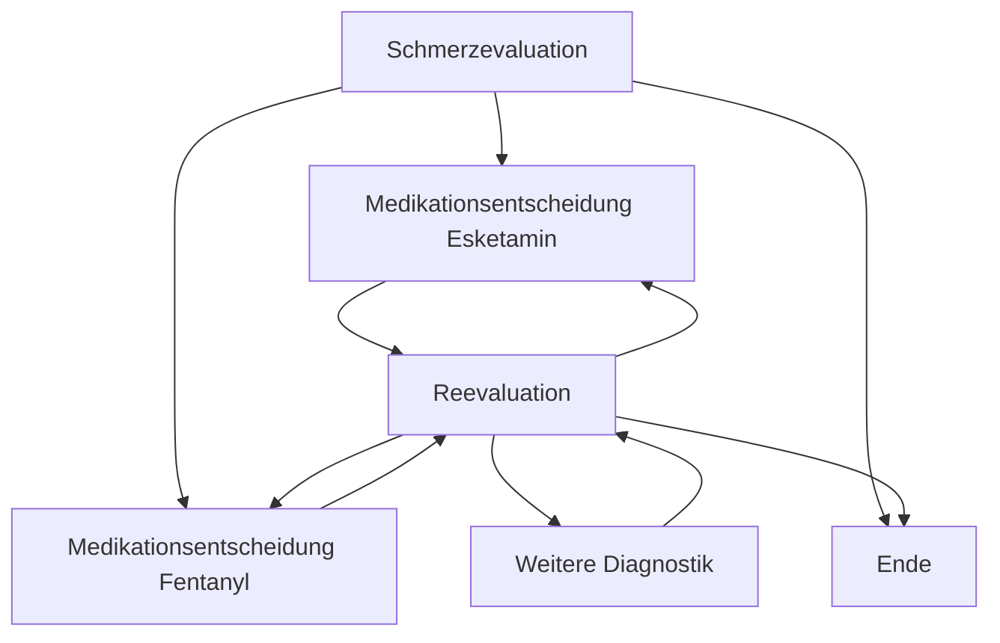
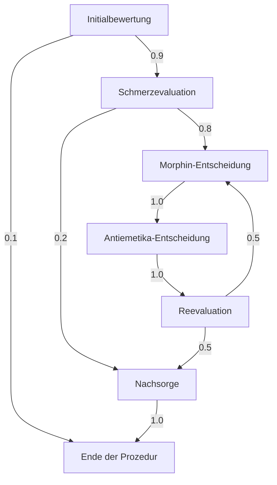
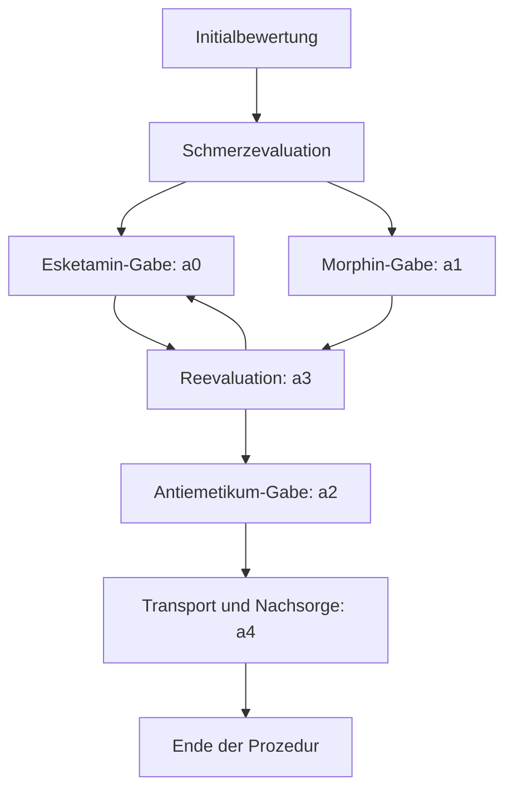
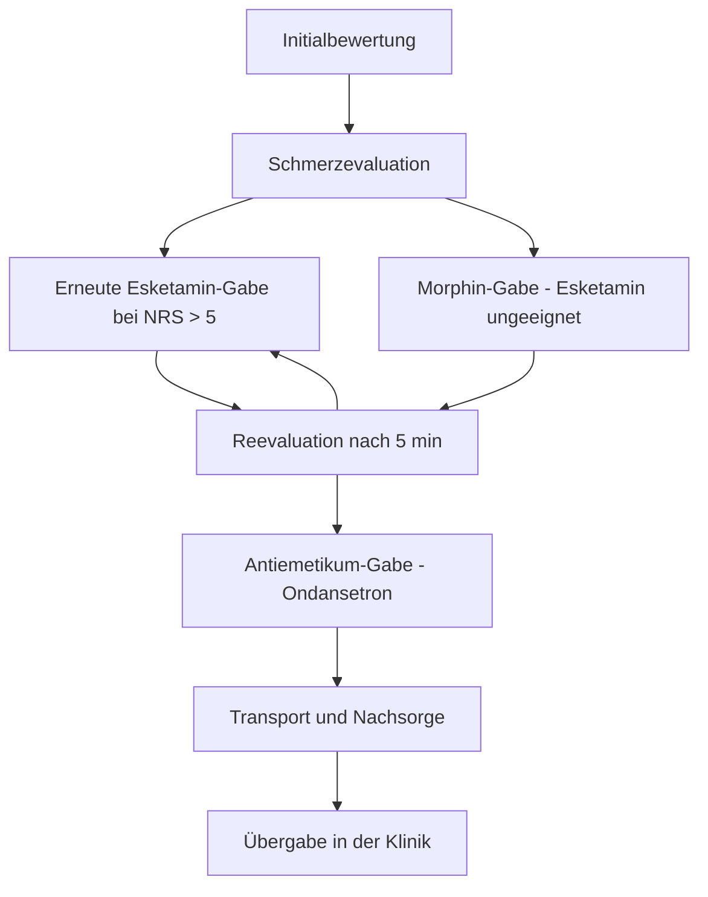
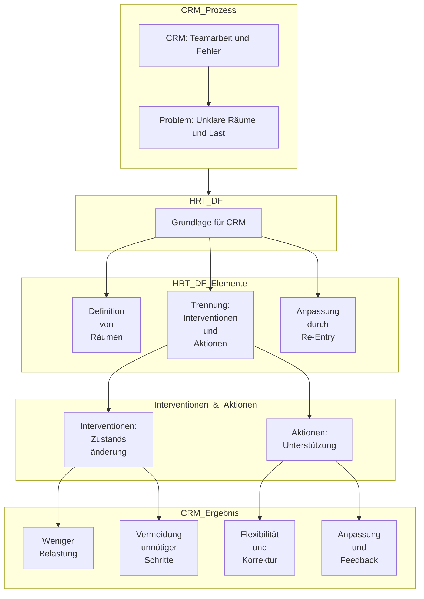

created: 3.10.2024 | [updated](https://git.jochen-hanisch.de/research/high-responibility-teams): 12.5.2025 | [publishd](https://zenodo.org/records/15391445): 4.1.2025 | [Austausch](https://lernen.jochen-hanisch.de/course/view.php?id=4) |  [[Hinweise]]

**High Responsibility Team Decision Framework (HRT-DF)**

# Abstrakt

Das High Responsibility Team Decision Framework (HRT-DF) ist ein eigenständiges Entscheidungsmodell für High Responsibility Teams (HRT), das kritische Entscheidungsprozesse in dynamischen und risikoreichen Umgebungen optimiert. Basierend auf Markov-Entscheidungsprozessen (MDP) und systemtheoretischen Prinzipien strukturiert das HRT-DF Entscheidungsräume und steuert Zustandsübergänge, um Transformationsbarrieren zu überwinden und unerwünschte in erwünschte Zustände zu überführen.  

Das Framework setzt an der Schnittstelle zwischen Beobachtung und Intervention an und ermöglicht es, Handlungsoptionen gezielt zu differenzieren. Entscheidungen werden nur dann getroffen, wenn relevante Unterschiede im System wahrgenommen werden, was eine Reduktion kognitiver Belastung und eine Erhöhung der Handlungssicherheit zur Folge hat.  

Das HRT-DF bietet eine präzise Struktur für Entscheidungsprozesse, die weit über bestehende Modelle hinausgeht und als Grundlage für die erfolgreiche Umsetzung von Crew Resource Management (CRM) in Hochrisikoumgebungen dient. Dabei definiert es klare Zustandsübergänge und Handlungsprioritäten, wodurch Entscheidungsprozesse evidenzbasiert und adaptiv gestaltet werden können.  

Empirische Untersuchungen und Simulationen belegen die Effektivität des HRT-DF in Bereichen wie Notfallmedizin, Luftfahrt und Krisenmanagement. Es trägt maßgeblich zur Optimierung von Ressourcen, zur Reduktion von Fehlentscheidungen und zur Stärkung der Teamleistung in kritischen Situationen bei.  

Das HRT-DF ist nicht nur ein Entscheidungswerkzeug, sondern auch eine Grundlage für die Ausbildung und Weiterentwicklung von High Responsibility Teams. Es fördert eine proaktive Sicherheitskultur und bildet ein zentrales Element für nachhaltige [[Wirkungskriterienbasierte Entscheidungsfindung|Entscheidungsfindung]] in hochdynamischen Umfeldern.  

# Einleitung

Das High Responsibility Team Decision Framework (HRT-DF) bezieht sich auf ein systematisches Entscheidungsmodell, das speziell für High Responsibility Teams entwickelt wurde, um Handlungsprozesse in kritischen und risikoreichen Umgebungen optimal zu gestalten.

Die Grundlage dieses Modells ist die systemtheoretische Annahme, dass Entscheidungen nur dann erforderlich sind, wenn ein Unterschied besteht, der einen Unterschied macht. Dieser Gedanke folgt der Argumentation von Niklas Luhmann, der betont, dass Systeme sich durch die Beobachtung von Differenzen steuern und weiterentwickeln. Entscheidungen sind in diesem Sinne kein linearer Akt, sondern die operative Schließung eines Systems auf Basis von Unterscheidungen, die für das System selbst von Relevanz sind (Luhmann, 2000). Wo keine relevante Differenz existiert, bleibt das System deterministisch und bedarf keiner Entscheidung.

Das HRT-DF implementiert diesen Grundsatz, indem dieser die Entscheidungsräume nur dann öffnet, wenn die Beobachtung zeigt, dass alternative Handlungsoptionen möglich und notwendig sind und basiert operativ auf einem Markov-Entscheidungsprozess (MDP), der verwendet wird, um Zustandsüberführungen in unsicheren und dynamischen Kontexten zu modellieren. Hierbei wird der Fokus darauf gelegt, Unterschiede zwischen Zuständen zu erkennen und durch Handlungen gezielt von einem unerwünschten Zustand in einen erwünschten zu wechseln. 

Zentral für das Framework ist die Überwindung von Transformationsbarrieren, die als jene Differenzen verstanden werden können, die einen Zustand stabilisieren und Veränderungen verhindern. Das Framework macht sich die systematische Analyse dieser Barrieren zunutze und strukturiert Entscheidungsprozesse in High Responsibility Teams durch evidenzbasierte Daten und gesetzlich fundierte Handlungsrahmen. 

Die Anwendung des MDP innerhalb des HRT-DF zeigt, dass Entscheidungen nicht kontinuierlich erforderlich sind, sondern sich situativ ergeben, wenn Unterschiede erkannt werden, die für den Verlauf des Systems von Bedeutung sind. Diese Sichtweise erlaubt es, Entscheidungsprozesse nicht nur als Reaktion auf Unsicherheit zu verstehen, sondern als aktive Gestaltung des Systems durch bewusste Differenzierung von Optionen und Zuständen. 

# 1 Definition

Das High Responsibility Team Decision Framework (HRT-DF) ist ein Entscheidungsmodell für High Responsibility Teams, das kritische Interventionen und Aktionen in risikoreichen Umgebungen optimiert, in denen tatsächliche Entscheidungen möglich sind, und Zustände in dynamischen, unsicheren Kontexten evidenzbasiert überführt, um Transformationsbarrieren zu überwinden.

## 1.1 Struktur des HRT-DF

Das High Responsibility Team Decision Framework (HRT-DF) ist ein Entscheidungsmodell für High Responsibility Teams, das kritische Handlungsprozesse in risikoreichen Umgebungen optimiert und basiert auf der systemtheoretischen Annahme, dass Entscheidungen nur dann erforderlich sind, wenn tatsächlich ein Unterschied existiert, der für den Handlungsverlauf des Systems relevant ist (Luhmann, 2000). Dies bedeutet, dass Entscheidungsräume nur dann geöffnet werden, wenn Handlungsalternativen bestehen, die durch die Wahrnehmung einer Differenz begründet sind. Wo keine Unterschiede existieren, bleibt das System in einem stabilen, deterministischen Zustand und bedarf keiner Entscheidung.

Das Framework besteht aus mehreren Schlüsselelementen, die dazu beitragen, Entscheidungsprozesse evidenzbasiert sowie strukturiert zu gestalten und ermöglicht die Überführung von Zuständen in dynamischen und unsicheren Kontexten, indem Transformationsbarrieren identifiziert und gezielt überwunden werden. Transformationsbarrieren können dabei als Problemlagen definiert werden, die durch operative Maßnahmen aufgelöst werden müssen (Dorsch, 2024). Diese Barrieren markieren Differenzen, die operative Eingriffe erfordern, um von einem unerwünschten zu einem erwünschten Zustand zu gelangen.

### 1.1.1 Zustände

Zustände repräsentieren die verschiedenen situativen Kontexte, in denen sich das HRT während einer Operation befindet. In der systemtheoretischen Perspektive werden Zustände nicht als statische Gegebenheiten betrachtet, sondern als dynamische Konstrukte, die durch beobachtbare Unterschiede definiert sind. Luhmann (2000) beschreibt dies als die "Beobachtung zweiter Ordnung", bei der Zustände durch ihre Differenz zu anderen möglichen Situationen erfasst werden.

Zustände lassen sich in zwei Hauptkategorien unterteilen:

- Unerwünschte Zustände: Diese Zustände markieren operative Herausforderungen und Risiken, die durch gezielte Maßnahmen transformiert werden müssen. Akute Gefahrensituationen, unzureichende Ressourcen oder instabile Patientenlagen sind Beispiele für unerwünschte Zustände. Die Differenz zu erwünschten Zuständen öffnet den Entscheidungsraum und erfordert spezifische Handlungen zur Überwindung dieser Differenzen. Zustände, die als Probleme klassifiziert werden, entstehen dann, wenn eine Diskrepanz zwischen einem Ist-Zustand und einem Soll-Zustand besteht (Dorsch, 2024).
- Erwünschte Zustände: Diese Zustände repräsentieren das Ziel operativer Handlungen und stellen stabile, sichere und kontrollierte Situationen dar. Der Unterschied zwischen dem aktuellen und dem angestrebten Zustand macht die Notwendigkeit von Handlungsoptionen und Entscheidungen sichtbar.

### 1.1.2 Interventionen

Interventionen sind gezielte Interventionen, die darauf abzielen, Zustände zu verändern und gewünschte Ergebnisse herbeizuführen. In der Logik des HRT-DF motiviert die Differenz zwischen dem Ist-Zustand und dem Soll-Zustand jede Handlung. Ohne diese Differenz entfällt die Notwendigkeit für eine Intervention, da keine Entscheidungsalternativen vorhanden sind (Luhmann, 2000).

Interventionen innerhalb des HRT-DF umfassen:

- Diagnostische Maßnahmen: Diese Handlungen dienen der Einschätzung der aktuellen Situation und der Bestimmung relevanter Zustandsparameter. Sie erweitern den Entscheidungsraum, indem sie Unterschiede im System offenlegen und die Grundlage für weiterführende Maßnahmen schaffen.
- Therapeutische Maßnahmen: Hierzu zählen Eingriffe wie medizinische Prozeduren oder die Verabreichung von Medikamenten, die aktiv zur Überwindung unerwünschter Zustände beitragen. Die Wahl therapeutischer Maßnahmen basiert auf der Evidenz und der Notwendigkeit, bestehende Differenzen zu beseitigen.
- Kommunikationsmaßnahmen: Kommunikation ist ein wesentlicher Bestandteil der [[Wirkungskriterienbasierte Entscheidungsfindung|Entscheidungsfindung]]. Sie ermöglicht die Koordination des Teams und den Austausch kritischer Informationen. Luhmann (2000) betont, dass Kommunikation selbst eine Form der Entscheidung ist, da sie bestimmte Informationen hervorhebt und andere ausschließt, wodurch operative Schließungen im System erzeugt werden.

### 1.1.3 Übergangswahrscheinlichkeiten

Übergangswahrscheinlichkeiten beschreiben die Wahrscheinlichkeit, dass eine spezifische Intervention zu einem gewünschten Zustand führt. Im HRT-DF sind diese Wahrscheinlichkeiten nicht statisch, sondern dynamisch und abhängig von der Wahrnehmung situativer Unterschiede. Luhmann (2000) hebt hervor, dass Systeme Unsicherheiten durch die Beobachtung und Bewertung von Wahrscheinlichkeiten begegnen und dadurch Entscheidungen generieren. In diesem Zusammenhang beschreibt die [[Wirkungswahrscheinlichkeit]] den Maßstab dafür, wie stark bestimmte Faktoren in dynamischen Kontexten Entscheidungsprozesse beeinflussen.

Die Faktoren, die Übergangswahrscheinlichkeiten beeinflussen, umfassen:

- Patientenzustand: Die aktuelle Stabilität und Entwicklung des Patienten bestimmt maßgeblich, wie wahrscheinlich eine Intervention den gewünschten Zustand herbeiführt.
- Umgebungsfaktoren: Ressourcenverfügbarkeit, situative Komplexität und externe Bedingungen beeinflussen die Erfolgswahrscheinlichkeit von Maßnahmen.
- Teamkompetenzen: Die Ausbildung, Erfahrung und interne Kommunikation der Teammitglieder sind entscheidende Einflussgrößen für die Wirksamkeit von Interventionen.

Das HRT-DF integriert diese Elemente in einen ganzheitlichen Entscheidungsprozess, der auf der Wahrnehmung relevanter Unterschiede basiert und Entscheidungsräume situativ öffnet und ermöglicht, kritische Prozesse zu steuern und in unsicheren, dynamischen Kontexten handlungsfähig zu bleiben.

## 1.2 Transformationsbarrieren

Transformationsbarrieren stellen zentrale Herausforderungen im High Responsibility Team Decision Framework (HRT-DF) dar und markieren jene Differenzen, die den Übergang von einem unerwünschten zu einem erwünschten Zustand verhindern. In systemtheoretischer Hinsicht sind Transformationsbarrieren nicht bloße Hindernisse, sondern Ausdruck struktureller Kopplungen und systemischer Eigenkomplexität (Luhmann, 2000). Sie verdeutlichen, dass Systeme ihre Zustände nicht beliebig verändern können, sondern durch interne und externe Restriktionen begrenzt sind. Diese Barrieren manifestieren sich als Problemlagen, in denen sich die Diskrepanz zwischen dem aktuellen und dem angestrebten Zustand entsteht. 

Barrieren können physischer, organisatorischer oder psychologischer Natur sein und beeinflussen, wie Entscheidungsräume geöffnet oder geschlossen werden. Das Verständnis dieser Barrieren ist entscheidend, da sie den Raum möglicher Handlungsoptionen definieren und somit maßgeblich den Entscheidungsprozess leiten (Dorsch, 2024). 

### 1.2.1 Physische Barrieren

Physische Transformationsbarrieren beziehen sich auf materielle Einschränkungen und externe Umstände, die den operativen Fortschritt behindern. Sie machen deutlich, dass sich Systeme nicht unabhängig von ihrer Umwelt entwickeln, sondern durch äußere Bedingungen limitiert sind. 

Beispiele für physische Barrieren sind:

- **Fehlende Ressourcen:** Medikamentenmangel, defekte Ausrüstung oder unzureichende Infrastruktur. Diese Defizite verhindern den reibungslosen Ablauf von Prozessen und stellen unmittelbare Handlungshemmnisse dar. 
- **Umweltfaktoren:** Unzugängliche Einsatzorte, extreme Wetterbedingungen oder natürliche Hindernisse wie Überschwemmungen und Erdrutsche, die den Zugang zu kritischen Ressourcen versperren. 

Diese Barrieren verdeutlichen, dass Veränderungen im System nur möglich sind, wenn externe Bedingungen berücksichtigt und aktiv beeinflusst werden. 

### 1.2.2 Organisatorische Barrieren 

Organisatorische Barrieren entstehen durch die Struktur und Prozesse innerhalb des Systems selbst. Sie reflektieren systeminterne Widersprüche und zeigen, dass Entscheidungsprozesse durch komplexe Kommunikations- und Abstimmungsmechanismen gesteuert werden müssen (Luhmann, 2000). 

Typische organisatorische Barrieren sind:

- **Kommunikationsbarrieren:** Unklare Befehlsketten oder Informationsverluste, die zu Fehlentscheidungen führen. Luhmann (2000) betont, dass Kommunikation selbst eine Form der Entscheidung ist, die bestimmte Informationen priorisiert und andere ausschließt. 
- **Logistische Barrieren:** Ressourcenengpässe, Personalmangel oder bürokratische Verzögerungen, die operative Abläufe hemmen. Diese Barrieren entstehen durch systemische Trägheit und zeigen, dass Entscheidungsprozesse oft nicht isoliert betrachtet werden können, sondern in bestehende Organisationsstrukturen eingebettet sind. 

Das Überwinden organisatorischer Barrieren erfordert gezielte Interventionen und eine systematische Anpassung der internen Prozesse. 

### 1.2.3 Psychologische Barrieren 

Psychologische Barrieren betreffen die individuellen und kollektiven kognitiven Prozesse innerhalb des Teams. Sie reflektieren innere Widerstände, emotionale Belastungen und subjektive Wahrnehmungen, die die Entscheidungsfähigkeit beeinträchtigen. Hanisch (2024) beschreibt diese Barrieren als Unsicherheitsfaktoren, die sich in kritischen Situationen verstärken und Entscheidungsprozesse verlangsamen. 

Beispiele psychologischer Barrieren sind:

- **Stress und Zeitdruck:** Hohe Arbeitsbelastung und enge Zeitfenster verringern die kognitive Kapazität und führen zu einer selektiven Wahrnehmung von Informationen. 
- **Emotionale Faktoren:** Angst, Überforderung und Unsicherheit beeinflussen die Risikobereitschaft und können zu vorschnellen oder verzögerten Entscheidungen führen. 

Psychologische Barrieren verdeutlichen, dass Entscheidungsprozesse nicht allein auf rationalen Abwägungen beruhen, sondern stark von der emotionalen und mentalen Verfassung der Akteure abhängig sind. 

## 1.3 Optimale Politik 

Die optimale Politik im Rahmen des HRT-DF beschreibt die Handlungsstrategie, die unter Berücksichtigung aller Zustände, Interventionen und Übergangswahrscheinlichkeiten die höchsten Erfolgschancen verspricht. Sie orientiert sich an der Maxime, dass Systeme stets auf Differenzen reagieren und ihre Handlungsoptionen an die wahrgenommene Umwelt anpassen müssen (Luhmann, 2000). Anhand der [[Wirkungswahrscheinlichkeit]] kann abgeleitet werden, dass die optimale Politik nicht statisch ist, sondern dynamisch und flexibel gestaltet werden muss, um auf sich verändernde Rahmenbedingungen zu reagieren.

Eine optimale Politik zeichnet sich durch strategische Effizienz aus. Sie minimiert den Ressourcenverbrauch und die benötigte Zeit, um von einem unerwünschten Zustand in einen erwünschten Zustand zu gelangen. Dies erfordert eine präzise Abwägung aller verfügbaren Optionen und die Berücksichtigung der Übergangswahrscheinlichkeiten, um zielgerichtete Interventionen zu ermöglichen.

Ein weiteres Kriterium der optimalen Politik ist die Minimierung von Risiken. Jede Intervention wird hinsichtlich ihres Potenzials bewertet, bestehende Zustände zu verschlechtern oder unerwünschte Nebeneffekte zu erzeugen. Luhmann (2000) hebt hervor, dass Entscheidungen unter Unsicherheit stets das Risiko unerwünschter Nebenfolgen bergen, weshalb eine sorgfältige Analyse und Abwägung erforderlich ist.

Flexibilität ist ein entscheidendes Merkmal der optimalen Politik. Systeme müssen in der Lage sein, ihre Handlungsstrategien laufend anzupassen und auf neue Informationen oder unerwartete Zustände zu reagieren. Hanisch (2024) betont, dass eine adaptive Politik auf der kontinuierlichen Beobachtung der Umwelt beruht und sich an veränderte Differenzen anpasst, um Entscheidungsräume offen zu halten. 

Die optimale Politik im HRT-DF reflektiert somit die Notwendigkeit, Entscheidungsprozesse dynamisch zu gestalten und situative Flexibilität mit struktureller Stabilität zu vereinen.

# 2 Herleitung

Das High Responsibility Team Decision Framework (HRT-DF) wurde entwickelt, um Entscheidungsprozesse in dynamischen und hochriskanten Umgebungen zu optimieren und fusst auf dem Markov-Entscheidungsprozess (MDP), einem mathematischen Modell, das zur Strukturierung von Entscheidungsprozessen in unsicheren und stochastischen Kontexten verwendet wird. Die Methodik wurde auf die spezifischen Anforderungen von High Responsibility Teams (HRT) angewendet, die in Bereichen wie Notfallmedizin, Luftfahrt und Krisenbewältigung operieren (OpenAI, 2024). Das Framework erlaubt es, verschiedene Entscheidungsoptionen systematisch zu bewerten und fundierte Handlungsstrategien zu entwickeln, die darauf abzielen, von unerwünschten Zuständen zu erwünschten Zuständen überzugehen, indem bestehende Hindernisse überwunden werden.

## 2.1 Historische Perspektive 

Die Einbettung des MDP in eine systemtheoretische Betrachtung erweitert das Verständnis seiner Anwendbarkeit. Hier zeigt sich, dass der MDP weit mehr ist als ein mathematisches Verfahren – er ist ein Modell, das den operativen Kern von Entscheidungsprozessen in dynamischen, offenen Systemen adressiert.

## 2.1.1 Konzept des Markov-Entscheidungsprozesses

Das Konzept des Markov-Entscheidungsprozesses (MDP) wurde in den 1950er Jahren von Richard Bellman im Kontext der dynamischen Programmierung entwickelt (Bellman, 1957). Bellman erkannte, dass viele Entscheidungsprobleme in komplexen Systemen eine schrittweise Lösung erfordern, bei der der aktuelle Zustand und die zukünftigen Entscheidungen in Wechselwirkung stehen. Der Kern der Idee bestand darin, Systeme zu modellieren, deren zukünftige Zustände nicht vollständig deterministisch sind, sondern durch stochastische Einflüsse geprägt werden. Dies machte den MDP zu einem zentralen Werkzeug für die Optimierung in unsicheren Umgebungen. 

Die ersten praktischen Anwendungen fanden sich in der Produktionsplanung und der Ressourcenallokation, wo MDPs halfen, Prozesse zu strukturieren und Entscheidungswege zu optimieren. In diesen Bereichen lag der Fokus darauf, durch systematische Analyse die effizienteste Nutzung von Ressourcen sicherzustellen und gleichzeitig die Unsicherheiten in der Nachfrage oder Produktion zu berücksichtigen. 

In den 1970er Jahren erlebte das MDP-Modell einen entscheidenden Wandel, als dieser Einzug in die Robotik und die künstliche Intelligenz (KI) hielt. Die Fähigkeit von MDPs, Entscheidungsprozesse in autonomen Systemen zu steuern, wurde für die Entwicklung von Algorithmen genutzt, die es Robotern ermöglichten, in dynamischen Umgebungen zu agieren und auf unsichere oder unvorhersehbare Ereignisse zu reagieren. Dieser Schritt markierte einen wichtigen Meilenstein in der Weiterentwicklung der KI, da er zeigte, wie mathematische Modelle genutzt werden können, um Systeme zu trainieren und Entscheidungsräume durch maschinelles Lernen zu erweitern.

Die Übertragung des MDP-Modells auf den medizinischen Bereich sowie auf sicherheitskritische Teams, wie im Krisenmanagement oder der Luftfahrt, erfolgte in den späten 1980er und frühen 1990er Jahren. Hanisch-Johannsen (2023) hebt hervor, dass der Bedarf an datenbasierten Strategien zur [[Wirkungskriterienbasierte Entscheidungsfindung|Entscheidungsfindung]] in unsicheren und risikoreichen Umgebungen maßgeblich zu dieser Entwicklung beitrug. In der Medizin wurde das MDP beispielsweise genutzt, um Diagnose- und Behandlungsprozesse zu optimieren, indem Wahrscheinlichkeiten und Patientenverläufe modelliert wurden [Einschränkung: Bisher wurden diese Übertragungen anhand theoretischer Modelle vorgenommen; Anm. Autor]. Im Bereich der Luftfahrt und des Krisenmanagements fanden MDPs Anwendung, um komplexe Abläufe zu simulieren und Entscheidungsprozesse in Echtzeit zu unterstützen.

## 2.1.2 Systemtheoretische Perspektive 

Aus systemtheoretischer Perspektive lässt sich der Markov-Entscheidungsprozess als eine Möglichkeit verstehen, operative Schließungen innerhalb eines Systems zu strukturieren und zu lenken. Luhmann (2000) betont, dass Entscheidungen immer dort notwendig werden, wo Kontingenz herrscht und alternative Handlungsoptionen zur Verfügung stehen. Der MDP spiegelt diese Grundannahme wider, indem er Entscheidungsprozesse formalisiert, bei denen Zustandsübergänge durch stochastische Einflüsse und Wahrscheinlichkeiten beschrieben werden. 

Die Dynamik des MDP-Modells zeigt, dass Systeme sich nicht linear, sondern durch differenzierte Rückkopplungen entwickeln. Jedes Ergebnis einer Entscheidung bildet den Ausgangspunkt für eine neue Zustandsbeobachtung, die wiederum zukünftige Entscheidungen beeinflusst. In diesem Sinne lassen sich MDPs als Instrumente zur Reduktion von Komplexität interpretieren, die ermöglichen, Unsicherheit durch die Gewichtung von Wahrscheinlichkeiten zu operationalisieren. 

Luhmann (2000) argumentiert, dass Systeme nur dort Entscheidungsräume eröffnen, wo Unterschiede existieren, die einen Unterschied machen. Genau an dieser Stelle setzt der MDP an: Er identifiziert Zustände, deren Unterschiede durch Aktionen beeinflusst werden können, und bewertet die Übergänge zwischen diesen Zuständen auf Grundlage empirischer oder simulierter Daten. Dies verdeutlicht, dass MDPs nicht nur technische Modelle, sondern auch systemische Werkzeuge sind, um Entscheidungsstrukturen in hochkomplexen Umgebungen abzubilden und zu optimieren.

**Anmerkung**
>Während der Entscheidungsraum mögliche Handlungsoptionen und deren Konsequenzen abbildet, beschreibt der [[Wirkungsraum]] die Wechselwirkungen und Wahrscheinlichkeiten innerhalb des Systems, die das Ergebnis einer Entscheidung beeinflussen.

## 2.2 Theoretischer Rahmen 

Das High Responsibility Team Decision Framework (HRT-DF) basiert auf fundierten theoretischen Annahmen und zentralen Konzepten, die aus der dynamischen Programmierung und der Systemtheorie abgeleitet sind. Die Verknüpfung dieser Ansätze ermöglicht es, komplexe Entscheidungsprozesse in hochdynamischen, risikoreichen Umgebungen systematisch zu strukturieren und zu optimieren. Die folgenden Annahmen und Konzepte bilden das Fundament des HRT-DF und sind entscheidend für die Anwendung und Weiterentwicklung in praktischen Kontexten. 

### 2.2.1 Annahme 1: Rationale Entscheidungsfindung 

Das HRT-DF basiert auf der Annahme, dass Teams rationale Entscheidungen treffen, die durch eine sorgfältige Abwägung von Kosten, Nutzen und Risiken geprägt sind (Bellman, 1957). Diese Rationalität wird nicht im Sinne einer perfekten Information oder vollständigen Kontrolle verstanden, sondern als die Fähigkeit, auf Basis vorhandener Daten und Erfahrungswerte die bestmögliche Entscheidung zu treffen. 

In komplexen und unsicheren Umgebungen ist entscheidend, dass Entscheidungen nicht rein intuitiv getroffen werden, sondern durch analytische Prozesse, die langfristige Ziele priorisieren und gleichzeitig kurzfristige Risiken minimieren. Luhmann (2000) betont, dass in systemischen Entscheidungsprozessen Unsicherheit durch die Reduktion von Komplexität und die Beobachtung relevanter Unterschiede bewältigt wird. Damit spiegelt sich die Annahme der Rationalität auch in der systemtheoretischen Perspektive wider, wonach Systeme Entscheidungen durch operative Schließungen und die Selektion von Alternativen treffen, die sich als am besten geeignet erweisen, um gewünschte Zustände zu erreichen. 

Diese Annahme ist besonders relevant in Kontexten mit hoher Tragweite, etwa im Katastrophenschutz oder in der Notfallmedizin, wo schnelle, aber dennoch strukturierte Entscheidungen erforderlich sind. 

### 2.2.2 Annahme 2: Strukturierte Zustandsübergänge 

Das zweite Fundament des HRT-DF besteht in der Annahme, dass jede Intervention mit einer bestimmten Wahrscheinlichkeit zu einem neuen Zustand führt. Dieses Konzept ist eng mit der Theorie des Markov-Entscheidungsprozesses (MDP) verbunden, die davon ausgeht, dass zukünftige Zustände nicht nur von aktuellen Entscheidungen abhängen, sondern auch von stochastischen Einflüssen geprägt sind (Bellman, 1957). 

Übergangswahrscheinlichkeiten reflektieren dabei die inhärente Unsicherheit und Dynamik des Umfelds und ermöglichen eine Vorhersage, wie sich verschiedene Szenarien entfalten können. [[Wirkungswahrscheinlichkeit]] beschreibt diese Wahrscheinlichkeiten als Maß für die Stärke, mit der bestimmte Faktoren Entscheidungsprozesse beeinflussen. Die Fähigkeit, Zustandsübergänge zu simulieren und zu antizipieren, verleiht dem HRT-DF eine hohe Anpassungsfähigkeit und erlaubt es, Entscheidungsprozesse iterativ zu optimieren. 

Durch die Modellierung dieser Übergänge wird die [[Wirkungskriterienbasierte Entscheidungsfindung|Entscheidungsfindung]] entlastet, da das Team in der Lage ist, Handlungsalternativen im Vorfeld zu bewerten und auf Veränderungen in Echtzeit zu reagieren. 

### 2.2.3 Kernkonzept 1: Zustände und Interventionen 

Im HRT-DF bilden Zustände die Grundlage für die Analyse der Situation und die Planung zukünftiger Handlungen. Zustände repräsentieren die spezifischen Kontexte, in denen sich das Team während einer Operation befindet, und werden durch Umweltfaktoren, Ressourcenverfügbarkeit und den aktuellen Status der Operation definiert. Luhmann (2000) hebt hervor, dass Zustände nicht isoliert betrachtet werden können, sondern durch ihre Differenz zu anderen möglichen Zuständen an Bedeutung gewinnen. 

Diese Zustände lassen sich in zwei Hauptkategorien unterteilen: 
- **Unerwünschte Zustände:** Zustände, die als problematisch oder riskant gelten und durch gezielte Interventionen transformiert werden müssen. Beispiele sind instabile Patientenlagen oder unkontrollierte Gefahrenquellen. 
- **Erwünschte Zustände:** Zielzustände, die den Erfolg der Operation markieren und durch optimale Handlungen erreicht werden. Dazu gehören stabile Patientenbedingungen oder gesicherte Einsatzorte. 

Interventionen bezeichnen strategische Eingriffe, die auf eine nachhaltige Veränderung des Systemzustands abzielen und zumeist komplexe, mehrstufige Prozesse umfassen. Aktionen hingegen sind operative Einzelschritte, die als Teil einer Intervention ausgeführt werden und sich unmittelbar auf den aktuellen Zustand auswirken. Aktionen sind in ihrer Reichweite begrenzt und dienen der kurzfristigen Zielerreichung. Typische Interventionen umfassen:

- **Diagnostische Interventionen:** Prozesse zur Lagebeurteilung (bestehend aus mehreren Aktionen wie Vitalparameterkontrolle und Blutdruckmessung).
- **Therapeutische Interventionen:** Medikamentengabe oder chirurgische Eingriffe, die sich aus spezifischen Aktionen zusammensetzen.
- **Operative Interventionen:** Absicherungen oder Evakuierungen, bestehend aus mehreren Aktionen wie Standortwechsel und Barrierenaufbau. 

Insbesondere die Kommunikationsmaßnahmen spielen eine entscheidende Rolle in der erfolgreichen Umsetzung von Interventionen. [[Elementarkommunikation]] beschreibt diesen Prozess als fundamentalen Bestandteil operativer Systeme, da Kommunikation nicht nur der Informationsübertragung dient, sondern auch operative Schließungen erzeugt, die für die [[Wirkungskriterienbasierte Entscheidungsfindung|Entscheidungsfindung]] und Handlungskoordination notwendig sind. In diesem Sinne ist Kommunikation nicht lediglich ein Mittel zur Weitergabe von Informationen, sondern ein entscheidender Prozess zur Konstruktion und Stabilisierung sozialer und organisatorischer Realität. 

Jede Intervention wird dabei als gezielter Versuch verstanden, die Differenz zwischen Ist- und Soll-Zustand zu reduzieren und die Wahrscheinlichkeit für erfolgreiche Zustandsübergänge zu maximieren.

### 2.2.4 Kernkonzept 2: Belohnungsfunktion 

Die Belohnungsfunktion ist ein integraler Bestandteil des HRT-DF, da sie die Grundlage für die Bewertung und Priorisierung von Handlungsoptionen bildet (Bellman, 1957). Jede Intervention wird in Bezug auf ihre unmittelbaren und langfristigen Auswirkungen bewertet, wobei positive Belohnungen für erfolgreiche Eingriffe vergeben werden, die zu erwünschten Zuständen führen. Aktionen innerhalb der Intervention werden ebenfalls berücksichtigt, jedoch spiegelt die Hauptbelohnung den Erfolg der gesamten Intervention wider. 

Umgekehrt führt ineffektives oder riskantes Verhalten zu negativen Belohnungen, die das Team darauf hinweisen, alternative Strategien zu verfolgen. Diese Funktion orientiert sich an der Grundannahme, dass Systeme dazu tendieren, sich in Richtung von Zuständen zu entwickeln, die höhere Belohnungen versprechen. 

[[Wirkungswahrscheinlichkeit]] argumentiert, dass die Belohnungsfunktion nicht nur einen rein mathematischen Charakter besitzt, sondern auch in systemtheoretischen Begriffen als eine Form der Feedbackschleife verstanden werden kann. Die fortlaufende Bewertung und Rückmeldung ermöglicht es, Entscheidungsprozesse iterativ zu verbessern und auf Basis der gesammelten Erfahrungen zu justieren. 

In diesem Zusammenhang spielen [[Elementaroperationen]] eine entscheidende Rolle. Sie bilden die grundlegenden Prozesse, durch die das System seine Zustände verändern und sich an neue Herausforderungen anpassen kann. Diese Elementaroperationen sind es, die den kontinuierlichen Fluss zwischen den Zuständen ermöglichen und das Fundament für adaptive Lernprozesse bilden. Durch die Wiederholung und Modifikation dieser Operationen wird das System nicht nur stabilisiert, sondern auch befähigt, neue Handlungsoptionen zu generieren und bestehende Routinen zu hinterfragen.

## 2.3 Mathematische Modellierung 

Das High Responsibility Team Decision Framework (HRT-DF) stützt sich auf die mathematische Grundlage des Markov-Entscheidungsprozesses (MDP), dessen Herzstück die Bellman-Gleichung ist. Diese Gleichung ermöglicht es, den optimalen Wert eines Zustands zu bestimmen, indem sie zukünftige Belohnungen, Übergangswahrscheinlichkeiten und den Einfluss aktueller Aktionen berücksichtigt. 

Die Bellman-Gleichung lautet: 

$$
V(s) = \max_a \sum_{s'} P(s' | s, a) \cdot \left[ R(s, a, s') + \gamma \cdot V(s') \right] \tag{1}
$$ 

Hierbei beschreibt $V(s)$ den Wert eines Zustands $s$, der angibt, welchen langfristigen Nutzen man erwarten kann, wenn man im Zustand $s$ eine bestimmte Aktion $a$ ausführt. Die Gleichung berücksichtigt dabei die Summe über alle möglichen zukünftigen Zustände $s'$, wobei $P(s' | s, a)$ die Wahrscheinlichkeit darstellt, in den Zustand $s'$ zu wechseln, wenn aus Zustand $s$ die Aktion $a$ durchgeführt wird. 

Die Belohnungsfunktion $R(s, a, s')$ quantifiziert den direkten Nutzen oder die Kosten, die mit dem Übergang vom Zustand $s$ nach $s'$ durch die Aktion $a$ verbunden sind. Ein entscheidender Faktor in der Gleichung ist der Diskontfaktor $\gamma$ mit $0 < \gamma \leq 1$, der zukünftige Belohnungen abschwächt. Der Diskontfaktor reflektiert die Präferenz für kurzfristige Erfolge gegenüber langfristigen, da höhere Werte von $\gamma$ zukünftige Belohnungen stärker in die Berechnung einfließen lassen, während niedrigere Werte sie abwerten. 

Die Maximierung über die möglichen Aktionen $a$ garantiert, dass stets die Aktion gewählt wird, die den höchsten langfristigen Nutzen verspricht. Dieses Prinzip ist entscheidend für Entscheidungsprozesse in dynamischen und unsicheren Umgebungen, da dieses ermöglicht, die optimale Strategie in Abhängigkeit von den aktuellen Zuständen und zukünftigen Entwicklungen zu bestimmen. 

### 2.3.1 Bedeutung der Übergangswahrscheinlichkeiten und ihrer Schätzung 

Ein zentrales Element der Bellman-Gleichung ist die Übergangswahrscheinlichkeit $P(s' | s, a)$. Diese Wahrscheinlichkeit beschreibt, wie wahrscheinlich es ist, dass das System in den Zustand $s'$ übergeht, wenn sich das Team im Zustand $s$ befindet und die Aktion $a$ ausführt. Die Modellierung dieser Wahrscheinlichkeiten basiert in der Praxis häufig auf empirischen Daten oder Simulationen. In vielen Fällen, insbesondere in sicherheitskritischen Umgebungen, sind präzise historische Daten jedoch begrenzt oder schwer zugänglich. 

Hier kommt das Konzept der [[Wirkungswahrscheinlichkeit]] ins Spiel, das eine systemtheoretische Erweiterung der klassischen Übergangswahrscheinlichkeiten darstellt. Statt ausschließlich auf vergangene Daten zu setzen, wird die Struktur der Entscheidungssituation selbst analysiert, um abzuleiten, welche Zustandsübergänge wahrscheinlich sind. Dieses Vorgehen erlaubt es, auch in Situationen mit hoher Unsicherheit valide Abschätzungen zu treffen und Entscheidungsräume zu eröffnen, die andernfalls verschlossen blieben. 

### 2.3.2 Rolle der Belohnungsfunktion und Feedback-Schleifen 

Die Belohnungsfunktion $R(s, a, s')$ ist nicht nur eine mathematische Abstraktion, sondern reflektiert reale Konsequenzen von Entscheidungen und deren Rückwirkung auf das System. Im Kontext des HRT-DF ist sie eng mit der Systemtheorie und den [[Elementaroperationen]] verknüpft, die die grundlegenden Prozesse zur Zustandsveränderung beschreiben. Jedes Mal, wenn eine Aktion durchgeführt wird, wird nicht nur der aktuelle Zustand beeinflusst, sondern hier entstehen Feedback-Schleifen, die langfristige Veränderungen im System hervorrufen können. 

Dies führt zu einer iterativen Anpassung der Strategie, da frühere Entscheidungen die Grundlage für zukünftige Zustandsbewertungen bilden. Die Bellman-Gleichung bildet diesen Prozess mathematisch ab, indem sie den aktuellen Zustand mit den potenziellen zukünftigen Zuständen koppelt. Dies zeigt, dass [[Wirkungskriterienbasierte Entscheidungsfindung|Entscheidungsfindung]] kein linearer, sondern ein rekursiver Prozess ist, bei dem jede Entscheidung die Grundlage für neue Entscheidungen schafft. 

### 2.3.3 Diskontfaktor und Zeitpräferenz 

Der Diskontfaktor $\gamma$ ist ein Schlüsselelement der Gleichung, das die Zeitpräferenz des Systems ausdrückt. Ein hoher Wert von $\gamma$, nahe bei 1, signalisiert, dass zukünftige Belohnungen fast genauso wertvoll wie gegenwärtige sind. In langfristig orientierten Entscheidungsprozessen, wie sie für High Responsibility Teams typisch sind, wird häufig ein hoher Diskontfaktor gewählt, um sicherzustellen, dass nachhaltige Erfolge gegenüber kurzfristigen Gewinnen bevorzugt werden. 

Umgekehrt zeigt ein niedriger Wert von $\gamma$, dass das System auf kurzfristige Stabilität ausgerichtet ist und langfristige Unsicherheiten weniger stark berücksichtigt werden. Dies kann in Krisensituationen von Vorteil sein, in denen schnelle Ergebnisse erforderlich sind, auch wenn sie langfristig weniger optimal sind. 

### 2.3.4 Iterative Lösung und Konvergenz 

Die Bellman-Gleichung wird typischerweise iterativ gelöst, wobei der Wert von $V(s)$ sukzessive aktualisiert wird, bis eine Konvergenz erreicht ist. Dieser Prozess, bekannt als „Value Iteration“ oder „Policy Iteration“, führt dazu, dass das System allmählich eine stabile optimale Strategie entwickelt. In der Praxis bedeutet dies, dass das Team wiederholt Simulationen und Analysen durchführt, um die bestmöglichen Entscheidungen für verschiedene Szenarien zu ermitteln. 

Die mathematische Modellierung im HRT-DF zeigt damit nicht nur, wie Entscheidungen quantitativ bewertet werden können, sondern bettet diese Bewertungen in einen iterativen, selbstkorrigierenden Prozess ein, der die Grundlage für adaptive und resiliente Entscheidungsprozesse bildet.

### 2.3.5 Verschränkung der Konzepte 

Die mathematische Modellierung des High Responsibility Team Decision Framework (HRT-DF) lässt sich nicht isoliert betrachten, sondern steht in direkter Wechselwirkung mit den systemtheoretischen Konzepten der [[Elementaroperationen]], [[Elementarkommunikation]] und der [[Wirkungswahrscheinlichkeit]]. Diese Konzepte bilden die Grundlage für die Rekonstruktion von Entscheidungsprozessen, indem sie die operativen Mechanismen beschreiben, die Zustandsveränderungen und Kommunikation innerhalb eines Systems steuern. 

Die Verschränkung dieser Konzepte in der mathematischen Modellierung zeigt sich durch die Integration der Bellman-Gleichung und der Zustandsübergangswahrscheinlichkeiten mit den zugrunde liegenden Operationen und Kommunikationsprozessen. 

#### 2.3.5.1 Elementaroperationen und die Dynamik von Zustandsübergängen 

Die [[Elementaroperationen]] beschreiben die grundlegenden Prozessschritte, durch die Zustandsveränderungen in einem System ermöglicht werden. Mathematisch lassen sich diese Operationen als Transformationen eines Systems von einem Zustand $s$ in einen neuen Zustand $s'$ modellieren. 

Die Übergangswahrscheinlichkeit $P(s' | s, a)$ in der Bellman-Gleichung spiegelt genau diesen Prozess wider: 
$$
P(s' | s, a) = \sum_{o} \delta(s', o(s, a)) \tag{2}
$$ 
Hierbei steht $o(s, a)$ für die Elementaroperation, die durch die Aktion $a$ in Zustand $s$ ausgelöst wird und eine Veränderung des Systems in den Zustand $s'$ bewirkt. Die Kronecker-Delta-Funktion $\delta(s', o(s, a))$ ist definiert als: 
$$
\delta(s', o(s, a)) = \begin{cases}
1, & \text{wenn } s' = o(s, a) \\
0, & \text{sonst}
\end{cases} \tag{3}
$$ 
Dies bedeutet, dass die Wahrscheinlichkeit eines Übergangs dann maximiert wird, wenn eine passende Elementaroperation den gewünschten Zustand erzeugt. 

Die Wiederholung und Rekursion von Elementaroperationen führt zur Stabilisierung oder Transformation von Zuständen. Dadurch wird deutlich, dass sich Entscheidungsprozesse aus der Sequenz und Kombination einfacher Operationen zusammensetzen, die iterativ ausgeführt werden, bis der gewünschte Zustand erreicht ist. 

#### 2.3.5.2 Elementarkommunikation als Steuermechanismus für Entscheidungsräume 

Die [[Elementarkommunikation]] fungiert als Schnittstelle zwischen Entscheidungsprozessen und den Informationsflüssen innerhalb eines Systems. Während die Elementaroperationen Zustände verändern, steuert die [[Elementarkommunikation]], welche dieser Operationen aktiviert werden und wie Informationen über den Systemzustand weitergegeben werden. 

Mathematisch wird dies durch die Gewichtung der Übergangswahrscheinlichkeiten in Abhängigkeit von Kommunikationsprozessen beschrieben: 
$$
P(s' | s, a) = \sum_{c} \alpha_c \cdot P_c(s' | s, a) \tag{4}
$$ 
Hierbei steht $P_c(s' | s, a)$ für die Übergangswahrscheinlichkeit, die sich aus einer bestimmten Kommunikationsstruktur $c$ ergibt, und $\alpha_c$ beschreibt die Relevanz dieser Kommunikationsstruktur für den Entscheidungsprozess. 

Durch die Kommunikation zwischen verschiedenen Systemelementen werden Übergänge nicht deterministisch ausgeführt, sondern in Abhängigkeit von der verfügbaren Information und den bestehenden Kommunikationskanälen moduliert. Dies ermöglicht es, adaptive Entscheidungsräume zu schaffen, die sich dynamisch an neue Kontexte und Umweltbedingungen anpassen. 

#### 2.3.5.3 Wirkungswahrscheinlichkeit als Maß für Entscheidungsqualität 

Die [[Wirkungswahrscheinlichkeit]] beschreibt die Wahrscheinlichkeit, mit der eine durchgeführte Aktion langfristig zu einem erwünschten Zustand führt. Im Kontext der Bellman-Gleichung wird die Wirkungswahrscheinlichkeit durch die Belohnungsfunktion $R(s, a, s')$ operationalisiert. 

Eine Erweiterung der Bellman-Gleichung zur Berücksichtigung der Wirkungswahrscheinlichkeit lautet: 
$$
V(s) = \max_a \sum_{s'} P(s' | s, a) \cdot \left[ W(s, a, s') \cdot R(s, a, s') + \gamma \cdot V(s') \right] \tag{5}
$$ 
Hierbei ist $W(s, a, s')$ die Wirkungswahrscheinlichkeit, die die Stärke der kausalen Verbindung zwischen einer Aktion und ihrem Ergebnis beschreibt. Ein hoher Wert von $W(s, a, s')$ signalisiert, dass eine bestimmte Aktion mit hoher Wahrscheinlichkeit den gewünschten Zustand herbeiführt, während ein niedriger Wert auf Unsicherheit oder schwache Kopplung hinweist. 

Die Kombination von Elementaroperationen, [[Elementarkommunikation]] und Wirkungswahrscheinlichkeit ermöglicht eine differenzierte Steuerung von Entscheidungsprozessen, die sowohl die strukturellen Eigenschaften des Systems als auch die Qualität der verfügbaren Kommunikationskanäle berücksichtigt. 

#### 2.3.5.4 Zusammenführung der Konzepte 

Die Verschränkung dieser Konzepte zeigt, dass Entscheidungsprozesse im HRT-DF nicht linear verlaufen, sondern durch iterative Rückkopplungen und adaptive Mechanismen geprägt sind. 

- **Elementaroperationen** beschreiben, welche Zustandsübergänge möglich sind und wie das System auf Aktionen reagiert. 
- **Elementarkommunikation** entscheidet, welche dieser Operationen aktiviert werden, indem sie den Informationsfluss innerhalb des Systems steuert. 
- **Wirkungswahrscheinlichkeit** bewertet die Qualität dieser Übergänge und stellt sicher, dass bevorzugt solche Operationen ausgeführt werden, die mit hoher Wahrscheinlichkeit zum gewünschten Ergebnis führen. 

Die mathematische Modellierung des HRT-DF ist somit nicht nur eine formale Repräsentation von Entscheidungsprozessen, sondern eine dynamische Struktur, die sich an die situativen Anforderungen und die interne Logik des Systems anpasst.

Hier ist der ausgearbeitete Abschnitt zur empirischen Überprüfung und Weiterentwicklung des HRT-DF, ergänzt um die Simulation und ihre theoretische Einbettung: 

## 2.4 Empirische Überprüfung und Weiterentwicklung 

Das High Responsibility Team Decision Framework (HRT-DF) wurde in verschiedenen Kontexten empirisch und theoretisch überprüft, um seine Anwendbarkeit und Effektivität in kritischen und dynamischen Umgebungen zu validieren. Dabei erfolgten Simulationsstudien und theoretische Samplings, die die Leistungsfähigkeit des Frameworks in unterschiedlichen High-Risk-Bereichen testeten.

>**Disclaimer – Medizinische Inhalte und Simulationen** 
Die in diesem Dokument dargestellten medizinischen Entscheidungsprozesse, Simulationen und Algorithmen dienen ausschließlich zu Forschungs- und Ausbildungszwecken im Rahmen des High Responsibility Team Decision Framework (HRT-DF). Sie stellen keine direkte medizinische Beratung, Diagnose oder Therapieempfehlung dar und ersetzen in keiner Weise die professionelle Beurteilung und Behandlung durch qualifizierte medizinische Fachkräfte. Die dargestellten Modelle, einschließlich der Schmerzmanagementsimulation und der algorithmischen Entscheidungsprozesse, basieren auf theoretischen Grundlagen und empirischen Simulationen. Sie sind nicht als starre Protokolle oder Handlungsanweisungen für individuelle Patientensituationen zu verstehen. Medizinische Entscheidungen müssen stets auf Grundlage der individuellen Patientensituation, aktuellen klinischen Leitlinien und den persönlichen Erfahrungen des behandelnden Fachpersonals getroffen werden. Obwohl alle Inhalte sorgfältig geprüft wurden, kann keine Haftung für die Richtigkeit, Vollständigkeit oder Aktualität der bereitgestellten Informationen übernommen werden. Der Autor übernimmt keine Verantwortung für mögliche Schäden oder unerwünschte Ereignisse, die durch die Anwendung der beschriebenen Modelle oder Interventionen entstehen könnten. Für medizinische Beratung oder Notfälle wird dringend empfohlen, sich an qualifizierte Fachkräfte zu wenden und aktuelle medizinische Leitlinien und Standards zu berücksichtigen.

### 2.4.1 Anwendungsbereiche der Überprüfung 

**1. Anwendung des HRT-DF bei der Schmerztherapie in der Notfallmedizin** 
Eine der zentralen empirischen Untersuchungen fokussierte sich auf die Anwendung des HRT-DF zur Optimierung von Entscheidungsprozessen in der Schmerztherapie während notfallmedizinischer Einsätze (OpenAI, 2024). Ziel dieser Studie war die Validierung der Wirksamkeit von MDP-basierten Entscheidungshilfen bei der Schmerzlinderung in kritischen Situationen. 

Durch den Einsatz des Frameworks wurden Entscheidungsräume eröffnet, die diese ermöglichten, flexibel zwischen verschiedenen medikamentösen Optionen wie Esketamin und Fentanyl zu wählen. Die Simulationsergebnisse zeigten eine signifikante Verbesserung der Entscheidungssicherheit und eine höhere Erfolgsquote bei der effektiven Schmerzreduktion. Besonders hervorgehoben wurde die Fähigkeit des Systems, auf Reevaluationen zu reagieren und den Therapiepfad dynamisch anzupassen. 

**2. Simulation von Krisenmanagementszenarien in der Luftfahrt** 
Ein weiterer Bereich der empirischen Überprüfung war die Simulation von Notfallszenarien im Krisenmanagement der Luftfahrt (Hanisch-Johannsen, 2023). Ziel war es, die Fähigkeit des HRT-DF zu untersuchen, optimale Reaktionsstrategien auf unvorhergesehene Ereignisse zu entwickeln. Die Flexibilität des Frameworks, auch unter hohem Zeitdruck fundierte Entscheidungen zu generieren, erwies sich als besonders vorteilhaft. 

### 2.4.2 Simulation zur [[Wirkungskriterienbasierte Entscheidungsfindung|Entscheidungsfindung]] in der Schmerztherapie 

Die folgende Simulation veranschaulicht die Entscheidungsprozesse des HRT-DF in einem notfallmedizinischen Schmerzmanagementszenario. Die einzelnen Zustände repräsentieren verschiedene Schritte der Schmerzevaluation und Medikation. Übergänge erfolgen in Abhängigkeit von reevaluierten Patientenreaktionen und diagnostischen Ergebnissen. 

_Abbildung 1: Entscheidungsprozess Schmerz (eig. Darstellung)_

In diesem Modell wird der Entscheidungsprozess mit der initialen Schmerzevaluation eingeleitet. Je nach Ergebnis erfolgt entweder eine Medikation mit Esketamin oder Fentanyl oder die Beendigung der Behandlung. Die Medikation stellt eine Intervention dar, die aus mehreren Aktionen wie Dosierung, Verabreichung und Vitalzeichenkontrolle besteht. Nach der Medikation findet eine Reevaluation statt, die entscheidet, ob eine erneute Diagnostik erforderlich ist oder eine weitere Medikation vorgenommen wird. Dieser iterative Ansatz reflektiert die Grundprinzipien des HRT-DF und die rekursive Natur der [[Wirkungskriterienbasierte Entscheidungsfindung|Entscheidungsfindung]], die sich an die dynamischen Bedingungen während der Notfallversorgung anpasst. 

Die Übergänge im Graphen spiegeln die zugrundeliegende [[Wirkungswahrscheinlichkeit]] wider, indem sie die Wahrscheinlichkeit der erfolgreichen Schmerzkontrolle durch gezielte Reevaluation und flexible Anpassung erhöhen. Die Integration von Kommunikationsprozessen, die durch [[Elementarkommunikation]] beschrieben werden, sorgt dafür, dass alle relevanten Parameter fortlaufend berücksichtigt werden.

### 2.4.3 Empirische Simulation zur [[Wirkungskriterienbasierte Entscheidungsfindung|Entscheidungsfindung]] im Schmerzmanagement 

In diesem Abschnitt wird die empirische Simulation zur [[Wirkungskriterienbasierte Entscheidungsfindung|Entscheidungsfindung]] im Schmerzmanagement anhand eines erweiterten Markov-Entscheidungsprozesses (MDP) beschrieben. Ziel dieser Simulation ist, den Entscheidungsfluss innerhalb eines Algorithmus für das akute Koronarsyndrom (ACS) mit besonderem Fokus auf die Gabe von Morphin und Antiemetika zu modellieren. Die Simulation veranschaulicht, wie iterative Entscheidungen zur Schmerzreduktion und Nebenwirkungsprophylaxe in der notfallmedizinischen Versorgung ablaufen. 

_Abbildung 2: Entscheidungsprozess Koronares Syndrom (eig. Darstellung)_

Das Modell beginnt mit der Initialbewertung des Patienten. In den meisten Fällen, genauer in 90 Prozent der Fälle, erfolgt eine Schmerzevaluation, die zur weiteren [[Wirkungskriterienbasierte Entscheidungsfindung|Entscheidungsfindung]] führt. In 10 Prozent der Fälle wird jedoch bereits an diesem Punkt die Prozedur beendet, sei es aufgrund fehlender Schmerzsymptomatik oder anderer klinischer Gründe. 
Im Anschluss an die Schmerzevaluation erfolgt in 80 Prozent der Fälle eine Entscheidung zur Gabe von Morphin als Erstlinientherapie zur Schmerzbekämpfung. In 20 Prozent der Fälle wird direkt in die Nachsorge übergegangen, beispielsweise wenn der Patient keine relevanten Schmerzen aufweist oder die Risiken einer Morphingabe höher eingeschätzt werden als der potenzielle Nutzen. 
Nach der Gabe von Morphin wird in jedem Fall die Entscheidung getroffen, ein Antiemetikum zu verabreichen. Diese Intervention erfolgt prophylaktisch, um durch Morphin induzierten Übelkeitssymptomen vorzubeugen. Dieser Übergang ist deterministisch, was bedeutet, dass keine alternative Handlungsoption gibt, sobald die Morphingabe erfolgt ist. 
Nach der Antiemetika-Gabe folgt eine Reevaluation des Patienten. In dieser Phase wird überprüft, ob die Schmerzlinderung ausreichend war oder ob eine erneute Gabe von Morphin notwendig ist. Die Reevaluation führt in 50 Prozent der Fälle zu einer erneuten Morphinentscheidung, während in den übrigen 50 Prozent die Patienten in die Nachsorge übergehen. 

Die Nachsorge stellt den finalen Abschnitt der Behandlung dar und mündet in allen Fällen in die Beendigung der Prozedur. Es gibt keine weiteren Abzweigungen oder Rückführungen, da an diesem Punkt der Schmerz als erfolgreich behandelt gilt oder der Patient keine weiteren Interventionen benötigt. 

Die grafische Darstellung dieses Entscheidungsflusses wurde durch ein gerichtetes Graphenmodell umgesetzt. Die Knoten repräsentieren die verschiedenen Phasen des Entscheidungsprozesses, während die Kanten die Übergänge zwischen diesen Phasen symbolisieren. Die Pfeilstärke der Kanten spiegelt die Übergangswahrscheinlichkeiten wider, wobei dickere Pfeile häufigere Entscheidungswege anzeigen. 

Das Modell verdeutlicht die iterative und rekursive Natur der [[Wirkungskriterienbasierte Entscheidungsfindung|Entscheidungsfindung]] im Schmerzmanagement und zeigt, wie durch wiederholte Reevaluationen sichergestellt wird, dass Patienten eine adäquate Schmerztherapie erhalten. Der Einbau von Antiemetika in den Algorithmus illustriert die Bedeutung der Nebenwirkungsprophylaxe als integralen Bestandteil der Schmerzbehandlung. 

Diese Simulation bietet eine strukturierte Grundlage für die Analyse und Optimierung von Entscheidungsprozessen im Rahmen der notfallmedizinischen Schmerztherapie. Sie zeigt auf, wie der Einsatz von MDPs in High-Responsibility-Teams zur Verbesserung der Versorgungsqualität und zur Minimierung von Behandlungsrisiken beitragen kann.

### 2.4.4 Empirische Simulation zur Entscheidungsfindung im Schmerzmanagement – Integration systemtheoretischer Konzepte und MDP 

Die empirische Simulation zur [[Wirkungskriterienbasierte Entscheidungsfindung|Entscheidungsfindung]] im Schmerzmanagement im Rahmen des High Responsibility Team Decision Framework (HRT-DF) illustriert nicht nur die praktischen Anwendungen des Markov-Entscheidungsprozesses (MDP), sondern veranschaulicht auch die Integration der systemtheoretischen Konzepte [[Elementaroperationen]], [[Elementarkommunikation]] und [[Wirkungswahrscheinlichkeit]]. Diese Verschränkung ermöglicht eine differenzierte Modellierung von Entscheidungsprozessen in dynamischen, kritischen Kontexten wie der Notfallmedizin. 

#### Ausgangspunkt der Simulation 

Das Szenario basiert auf der Behandlung eines Patienten mit akuten Schmerzen (z. B. nach einem Polytrauma). Die Entscheidung über die geeignete Medikation (Morphin, Esketamin, Fentanyl) sowie die Reevaluation und Nachsorge bildet den Kern der [[Wirkungskriterienbasierte Entscheidungsfindung|Entscheidungsfindung]]. Ziel ist es, die Schmerzen effektiv zu lindern, Nebenwirkungen zu minimieren und den Patienten in einen stabilen Zustand zu überführen.

#### Herleitung und mathematische Grundlage 

Das Entscheidungsmodell wird durch den Markov-Entscheidungsprozess formalisiert. Die Zustände des Systems repräsentieren die verschiedenen Phasen der Schmerztherapie: 

- $s_0$: Initialbewertung 
- $s_1$: Schmerzevaluation 
- $s_2$: Morphin-Entscheidung 
- $s_3$: Antiemetika-Entscheidung 
- $s_4$: Reevaluation 
- $s_5$: Nachsorge 
- $s_6$: Ende der Prozedur 

Die Übergänge zwischen diesen Zuständen erfolgen mit bestimmten Wahrscheinlichkeiten $P(s' | s, a)$, die die Wahrscheinlichkeit beschreiben, dass durch eine Aktion $a$ der Zustand von $s$ in $s'$ übergeht. Ziel ist es, eine Sequenz von Aktionen zu bestimmen, die den Gesamtwert $V(s)$ maximiert und somit eine optimale Schmerzbehandlung sicherstellt. 

Die Bellman-Gleichung beschreibt diesen Entscheidungsprozess: 
$$
V(s) = \max_a \sum_{s'} P(s' | s, a) \cdot \left[ R(s, a, s') + \gamma \cdot V(s') \right]
$$ 
Hierbei steht: 
- $V(s)$ für den langfristigen Wert eines Zustands $s$, 
- $P(s' | s, a)$ für die Übergangswahrscheinlichkeit von $s$ nach $s'$ unter der Aktion $a$, 
- $R(s, a, s')$ für die Belohnungsfunktion, die den unmittelbaren Nutzen der Aktion beschreibt, 
- $\gamma$ (0 < $\gamma$ ≤ 1) ist der Diskontfaktor, der zukünftige Belohnungen abwertet. 

#### Integration der Elementaroperationen 

Die **Elementaroperationen** bilden die Grundlage der Zustandsübergänge. Sie sind die kleinsten Bausteine, die eine Veränderung im System bewirken. Jede Aktion innerhalb des MDP setzt sich aus mehreren Elementaroperationen zusammen. 

**Beispiel der Elementaroperationen in der Simulation:** 
- Die Gabe von Esketamin besteht aus mehreren Schritten: 
 1. **Dosierung** des Medikaments 
 2. **Verabreichung** der festgelegten Dosis 
 3. **Überwachung** der Vitalzeichen nach der Gabe 
 4. **Reevaluation** der Schmerzsituation 

Mathematisch lässt sich dies darstellen als: 
$$
P(s' | s, a) = \sum_{o} \delta(s', o(s, a))
$$ 
Hierbei steht $o(s, a)$ für die Elementaroperation, die durch die Aktion $a$ im Zustand $s$ ausgelöst wird. Der Übergang zum neuen Zustand $s'$ erfolgt nur, wenn die entsprechende Elementaroperation erfolgreich abgeschlossen wird. 

Diese Zerlegung zeigt, dass die Aktion „Esketamin-Gabe“ nicht als einmalige Handlung verstanden wird, sondern als eine Sequenz von Operationen, die kumulativ den Zustand des Patienten verändern. 

#### Rolle der Elementarkommunikation 

Die [[Elementarkommunikation]] ist der steuernde Mechanismus, der die Auswahl und Reihenfolge der Elementaroperationen beeinflusst. In der Simulation erfolgt dieser Prozess bei der Reevaluation des Patienten: 

- Nach der Medikation entscheidet das Team durch Kommunikation, ob eine erneute Schmerzevaluation oder eine Nachsorge eingeleitet wird. 
- Kommunikation zwischen Notarzt und Rettungsdienst beeinflusst, ob weitere Medikation notwendig ist oder ob der Patient stabil genug für den Transport ist. 

Mathematisch wird dies durch die Gewichtung der Übergangswahrscheinlichkeiten beschrieben: 
$$
P(s' | s, a) = \sum_{c} \alpha_c \cdot P_c(s' | s, a)
$$ 
Dabei repräsentiert $P_c(s' | s, a)$ die Übergangswahrscheinlichkeit unter einer bestimmten Kommunikationsstruktur $c$, und $\alpha_c$ ist die Gewichtung, die die Relevanz dieser Kommunikationsstruktur beschreibt. 

**Beispiel:** 
Bei einer Reevaluation zeigt der Patient weiterhin Schmerzen. Durch Kommunikation wird entschieden, die Esketamin-Dosierung zu erhöhen, anstatt zur Nachsorge überzugehen. 

#### Wirkungswahrscheinlichkeit und Entscheidungsqualität 

Die **Wirkungswahrscheinlichkeit** beschreibt, wie wahrscheinlich es ist, dass eine durchgeführte Aktion den gewünschten Zustand herbeiführt. Diese Wahrscheinlichkeit bestimmt die Qualität der Entscheidung und beeinflusst die Auswahl der besten Aktion im MDP. 

Die modifizierte Bellman-Gleichung integriert die Wirkungswahrscheinlichkeit $W(s, a, s')$: 
$$
V(s) = \max_a \sum_{s'} P(s' | s, a) \cdot \left[ W(s, a, s') \cdot R(s, a, s') + \gamma \cdot V(s') \right]
$$ 

Die Wirkungswahrscheinlichkeit modifiziert die Belohnung $R(s, a, s')$, indem sie die tatsächliche Erfolgswahrscheinlichkeit der Aktion berücksichtigt. 

**Beispiel:** 
Die Entscheidung für Esketamin erfolgt, weil die Wirkungswahrscheinlichkeit zur Schmerzreduktion unter Schockbedingungen höher ist als bei Morphin. 

#### Interpretation der Simulation 

Die Simulation zeigt die iterative und rekursive Natur der [[Wirkungskriterienbasierte Entscheidungsfindung|Entscheidungsfindung]] im Schmerzmanagement. Durch die Integration von Elementaroperationen, [[Elementarkommunikation]] und Wirkungswahrscheinlichkeit entsteht ein adaptives System, das kontinuierlich den Zustand des Patienten reevaluieren und anpassen kann. 

**Schlüsselpunkte der Interpretation:** 
- Elementaroperationen beschreiben den Prozess der Zustandsveränderung auf mikrostruktureller Ebene. 
- Elementarkommunikation ermöglicht die Steuerung der Entscheidung durch Informationsaustausch und Reevaluation. 
- Wirkungswahrscheinlichkeit bestimmt die Qualität und Erfolgsaussichten der durchgeführten Aktionen. 

Dieses Modell bietet eine umfassende Grundlage für die Simulation und Analyse notfallmedizinischer Entscheidungsprozesse und verdeutlicht die Verbindung zwischen mathematischer Modellierung und systemtheoretischen Prinzipien.

### 2.4.4 Bedeutung für die Weiterentwicklung des HRT-DF 

Die empirischen Überprüfungen und Simulationen zeigen, dass das HRT-DF nicht nur in theoretischen Modellen, sondern auch in praktischen Anwendungen zuverlässig arbeitet. Die Fähigkeit, sich iterativ an veränderte Bedingungen anzupassen, macht das Framework zu einem wertvollen Instrument für High Responsibility Teams in sicherheitskritischen und dynamischen Einsatzfeldern. 

Zukünftige Weiterentwicklungen könnten darauf abzielen, die Genauigkeit der Übergangswahrscheinlichkeiten durch größere Datensätze zu verbessern und die Integration zusätzlicher Entscheidungsparameter, wie kognitive Belastung und Teamdynamik, weiter voranzutreiben.

## 2.5 Handlungsbeispiel – Schmerzmanagement bei instabilem Thoraxtrauma 

Die Anwendung des High Responsibility Team Decision Framework (HRT-DF) in der Notfallmedizin veranschaulicht, wie komplexe Entscheidungsprozesse in kritischen Situationen durch die Verknüpfung von Markov-Entscheidungsprozessen (MDP) und systemtheoretischen Prinzipien strukturiert werden. Dieses Beispiel zeigt, wie die iterative Anwendung von Esketamin zur Schmerztherapie bei instabilem Thoraxtrauma nicht nur auf der Grundlage von klinischen Leitlinien, sondern auch durch die dynamische Interaktion von [[Elementaroperationen]], [[Elementarkommunikation]] und [[Wirkungswahrscheinlichkeit]] gesteuert wird. 

### Szenario

Ein 38-jähriger Patient wird nach einem Motorradunfall mit Verdacht auf instabiles Thoraxtrauma in kritischem Zustand vorgefunden. Die Atmung ist paradox, die Schmerzintensität wird mit NRS 9/10 angegeben. Der Patient zeigt Anzeichen beginnender respiratorischer Insuffizienz und Tachykardie. Die zentrale Herausforderung besteht darin, gleichzeitig eine effektive Schmerzlinderung zu gewährleisten und die Atemdepression durch Analgetika zu vermeiden. 

### Entscheidungsstruktur und Modellierung als Markov-Entscheidungsprozess (MDP) 

Der Entscheidungsprozess wird durch einen Markov-Entscheidungsprozess abgebildet, in dem Zustände, Aktionen und Übergangswahrscheinlichkeiten das Handeln steuern. Der Fokus liegt auf der kontinuierlichen Reevaluation des Patienten, wobei jede Medikation und Intervention Rückkopplungsschleifen erzeugt, die zu neuen Entscheidungen führen. 

##### 1. Zustände (States)

- $s_0$: Initialbewertung und Stabilisierung 
- $s_1$: Schmerzevaluation 
- $s_2$: Esketamin-Entscheidung 
- $s_3$: Morphin-Entscheidung 
- $s_4$: Reevaluation 
- $s_5$: Antiemetikum-Gabe 
- $s_6$: Transport und Nachsorge 
- $s_7$: Ende der Prozedur 

##### 2. Aktionen (Actions)

- $a_0$: Esketamin-Gabe (titration) 
- $a_1$: Morphin-Gabe 
- $a_2$: Antiemetikum-Gabe 
- $a_3$: Reevaluation ohne Medikation 
- $a_4$: Beendigung der Prozedur und Transport 

##### 3. Übergangswahrscheinlichkeiten $P(s' | s, a)$

Die Wahrscheinlichkeit eines Übergangs von Zustand $s$ zu Zustand $s'$ hängt von der durchgeführten Aktion $a$ ab. Diese Wahrscheinlichkeiten basieren auf empirischen Daten, klinischer Erfahrung und der kontinuierlichen Kommunikation innerhalb des Teams. 

### Entscheidungsdiagramm 

_Abbildung 3: Entscheidungsdiagramm Handlungsbeispiel (eig. Darstellung)_

### Mathematische Modellierung und Anwendung der Bellman-Gleichung 

Die optimale Strategie zur Schmerzlinderung basiert auf der Bellman-Gleichung: 

$$
V(s) = \max_a \sum_{s'} P(s' | s, a) \cdot \left[ R(s, a, s') + \gamma \cdot V(s') \right]
$$

Dabei beschreibt: 
- $V(s)$ den langfristigen Wert des Zustands $s$, 
- $P(s' | s, a)$ die Übergangswahrscheinlichkeit vom aktuellen Zustand $s$ zu einem zukünftigen Zustand $s'$ nach Aktion $a$, 
- $R(s, a, s')$ die unmittelbare Belohnung (z. B. Schmerzreduktion), 
- $\gamma$ den Diskontfaktor, der zukünftige Belohnungen abwertet. 

### Anwendung im Handlungsverlauf 

1. Initialbewertung und Stabilisierung ($s_0$) 
In der Initialbewertung wird entschieden, ob der Patient primär stabilisiert oder sofort einer Schmerztherapie unterzogen wird. Mit einer Wahrscheinlichkeit von 90 % erfolgt eine Schmerzevaluation, während 10 % der Fälle eine unmittelbare Atemwegsicherung oder Kreislaufstabilisierung priorisiert. 

$$
P(s_1 | s_0, a_0) = 0.9
$$

2. Schmerzevaluation und erste Entscheidung ($s_1$) 
Nach der Stabilisierung wird der Schmerz evaluiert. In 80 % der Fälle wird Esketamin titriert verabreicht, während Morphin in 20 % der Fälle gegeben wird, wenn keine respiratorische Gefahr besteht. 

$$
P(s_2 | s_1, a_0) = 0.8
$$ 
$$
P(s_3 | s_1, a_1) = 0.2
$$

3. Reevaluation und Rückkopplung ($s_4$) 
Nach der ersten Esketamin-Dosis erfolgt eine Reevaluation. Wenn der Schmerz nur unzureichend reduziert wird (NRS > 5), kehrt das System mit einer Wahrscheinlichkeit von 50 % in den Zustand $s_2$ zurück, um eine erneute Esketamin-Gabe zu prüfen. Andernfalls erfolgt der Übergang zur Nachsorge. 

$$
P(s_2 | s_4, a_3) = 0.5
$$ 
$$
P(s_5 | s_4, a_3) = 0.5
$$

### Interdependenz und dynamische Steuerung durch Elementarkommunikation 

Während der gesamten Behandlung bildet die [[Elementarkommunikation]] die Grundlage für die Rückkopplung und Steuerung des Entscheidungsprozesses. Nach jeder Aktion wird durch Rückmeldungen des Patienten und der Teammitglieder eine Reevaluation ausgelöst, die in die nächste Entscheidung einfließt. 

In der Praxis äußert der Patient möglicherweise Übelkeit nach der Esketamin-Gabe. Das Team kommuniziert diese Information und entscheidet sich für eine Antiemetikum-Gabe, um den Zustand zu stabilisieren. 

### Wirkungswahrscheinlichkeit und Entscheidungsoptimierung 

Die Wahl der Medikation basiert nicht nur auf Leitlinien, sondern auch auf der Wirkungswahrscheinlichkeit. In diesem Szenario wird Esketamin bevorzugt, da die Wahrscheinlichkeit einer effektiven Schmerzreduktion höher ist: 

$$
W(s_2, a_0, s_4) = 0.85
$$ 
Für Morphin beträgt die Wirkungswahrscheinlichkeit hingegen: 
$$
W(s_3, a_1, s_4) = 0.65
$$ 
### Fazit und Interpretation 

Dieses Beispiel zeigt, wie MDP und systemtheoretische Konzepte zur [[Wirkungskriterienbasierte Entscheidungsfindung|Entscheidungsfindung]] in der Notfallmedizin integriert werden. Elementaroperationen strukturieren die Behandlung in kleinste Schritte, während die [[Elementarkommunikation]] eine kontinuierliche Rückkopplung sicherstellt. Die Wirkungswahrscheinlichkeit bietet eine Entscheidungsgrundlage für die Auswahl der effektivsten Therapieoption. 

Der iterative Ansatz garantiert, dass jede Medikation dynamisch angepasst wird, um auf die sich verändernde Situation des Patienten zu reagieren, wodurch das HRT-DF zu einem adaptiven, lernenden System wird.

## 2.6 Praktischer Handlungsablauf – Schmerzmanagement bei instabilem Thoraxtrauma 

**Szenario**

Das Rettungsteam wird zu einem Verkehrsunfall mit Motorradfahrer alarmiert. Der Patient, 38 Jahre alt, liegt am Unfallort und klagt über starke Schmerzen im Brustbereich. Er zeigt eine paradoxe Atmung und weist Anzeichen einer beginnenden respiratorischen Insuffizienz auf. 

**Ziel**

Effektive Schmerzlinderung und gleichzeitige Stabilisierung der Atmung, um eine Verschlechterung der respiratorischen Funktion zu verhindern. 

### Praktischer Ablauf

**1. Initialbewertung (ABCDE-Schema)**

- **Atemwege**: Frei, kein Stridor, Patient ist ansprechbar. 
- **Atmung**: Paradoxe Thoraxbewegung, Atemfrequenz 28/min, SpO₂ 90 % unter Raumluft. 
- **Kreislauf**: Tachykard (HF 120/min), RR 100/70 mmHg. 
- **Behinderung neurologisch:** GCS 15, orientiert. 
- **Exposition**: Multiple Rippenfrakturen erkennbar, Prellmarken am Thorax. 

**Entscheidungspunkt:** 
Die Atmung und der Kreislauf sind stabil genug, um mit der Schmerzkontrolle zu beginnen. 

**2. Schmerzevaluation**

- **NRS (Numerische Ratingskala):** 9/10. 
- **Zusätzliche Zeichen:** Oberflächliche Atmung, zunehmende Erschöpfung. 

**Entscheidung:** 
- Esketamin wird aufgrund der hämodynamischen Stabilität bevorzugt. Morphin wird vermieden, um die Atmung nicht weiter zu dämpfen. 

**3. Esketamin-Gabe**

- **Dosierung:** Esketamin titriert mit 10 mg initial i.v., langsam über 2-3 Minuten. 
- **Begleitmaßnahmen:** Sauerstoffgabe (15 l/min) über Reservoirmaske zur Stabilisierung der SpO₂. 

**4. Reevaluation nach Esketamin-Gabe**

- **Atmung:** Leichte Verbesserung, Atemfrequenz sinkt auf 24/min, paradoxe Atmung bleibt bestehen. 
- **Schmerzen:** NRS reduziert auf 5/10. 

**Ergebnis:** 
- Schmerzreduktion erreicht, jedoch klagt der Patient über Übelkeit und Desorientierung. 

**5. Antiemetikum-Gabe**

- **Medikation:** Ondansetron 4 mg i.v. zur Kontrolle der Übelkeit. 
- **Überwachung:** Kontinuierliche Puls- und SpO₂-Kontrolle. 

**6. Zweite Esketamin-Dosierung**

- **Reevaluation:** Schmerzintensität bleibt bei NRS 5/10. Aufgrund der anhaltenden Schmerzen wird eine zweite Esketamin-Dosis von 5 mg verabreicht. 

**7. Transport und Nachsorge**

- **Transport:** Monitoring während des gesamten Transports mit regelmäßiger Reevaluation. 
- **Zusätzliche Maßnahmen:** Sauerstoffzufuhr fortsetzen, regelmäßige Kommunikation mit der Zielklinik zur Übergabe und Berichterstattung der Medikation. 

### Entscheidungsstruktur als Ablaufdiagramm

_Abbildung 4: Ablaufdiagramm praktisches Beispiel (eig. Darstellung)_

### Praktische Hinweise für die Umsetzung

1. **Prioritäten setzen:** 
  - Bei instabiler Atmung immer zuerst Sauerstoffgabe und Atemwegsmanagement vor der Schmerztherapie priorisieren. 
  - Schmerztherapie darf die Atemfrequenz nicht verschlechtern. 

2. **Medikamentenwahl:** 
  - Esketamin ist die erste Wahl, da dieses eine atemwegsneutrale Analgesie bietet. Morphin sollte nur bei stabilen Patienten und niedriger Atemfrequenz eingesetzt werden. 
  
3. **Dynamische Reevaluation:** 
  - Schmerzmanagement ist kein linearer Prozess – ständige Reevaluation und Anpassung der Medikation sind notwendig. 
  - Die Reevaluation erfolgt spätestens nach 5 Minuten. 

4. **Kommunikation im Team:** 
  - Fortlaufende Rückmeldungen im Team, insbesondere während der Reevaluation, sind essenziell. 
  - Alle Dosierungen und Reaktionen werden dokumentiert und bei der Übergabe in der Klinik weitergegeben. 

### Begründung und Herleitung 

- **Markov-Entscheidungsprozess (MDP):** 
 Jede Phase der Versorgung entspricht einem Zustand ($s$), der durch eine Aktion ($a$) verändert wird. 
 Der Prozess ist iterativ – der Zustand wird nach jeder Aktion erneut bewertet (Reevaluation). 
 
 **Beispiel:** 
 - Zustand $s_1$: Schmerz NRS 9/10 → Esketamin-Gabe (Aktion $a_0$) → Übergang zu Zustand $s_2$ (NRS 5/10). 
 - Falls der Schmerz nicht ausreichend reduziert wird, erfolgt eine erneute Esketamin-Gabe. 

- **Wirkungswahrscheinlichkeit:** 
 Esketamin hat eine höhere Erfolgswahrscheinlichkeit zur Schmerzlinderung ohne respiratorische Beeinträchtigung. Dies spiegelt sich in der mathematischen Modellierung wider: 
 $$
 W(s_2, a_0, s_4) = 0.85
 $$ 
 Im Gegensatz dazu beträgt die Wahrscheinlichkeit für Morphin: 
 $$
 W(s_3, a_1, s_4) = 0.65
 $$ 

- **Elementarkommunikation:** 
 Kommunikation wird nicht als einmaliger Akt, sondern als zyklischer Prozess verstanden. Die Kommunikation zwischen allen Akteuren beeinflusst kontinuierlich die nächsten Schritte. 
 Die Kommunikation erfolgt auf drei Ebenen: 
 1. Rückmeldung des Patienten (Feedback) 
 2. Interne Reflexion im Team (Priorisierung der Maßnahmen) 
 3. Re-Entry: Zurückkehren zu vorherigen Entscheidungen auf Basis neuer Informationen.

### Fazit

Dieses Beispiel verdeutlicht, wie MDP und systemtheoretische Konzepte in der Notfallmedizin praktisch angewendet werden. Der iterative Charakter der [[Wirkungskriterienbasierte Entscheidungsfindung|Entscheidungsfindung]], kombiniert mit der kontinuierlichen Kommunikation und Anpassung, ermöglicht eine flexible und patientenzentrierte Versorgung.

# 3 Folgerungen

Aus der Analyse und den theoretischen Grundlagen des High Responsibility Team Decision Framework (HRT-DF) lassen sich mehrere zentrale Folgerungen ableiten. Diese sind direkt auf die Struktur des Frameworks und seine praktische Anwendbarkeit in Hochverantwortungssituationen zurückzuführen:

1. Strukturierte [[Wirkungskriterienbasierte Entscheidungsfindung|Entscheidungsfindung]]: 
 Das HRT-DF bietet einen klar definierten Rahmen für die [[Wirkungskriterienbasierte Entscheidungsfindung|Entscheidungsfindung]] in dynamischen und unsicheren Umgebungen. Teams können komplexe Situationen in klar voneinander abgrenzbare Zustände und Aktionen zerlegen und diese gezielt analysieren, um fundierte Entscheidungen zu treffen. Dies reduziert Unsicherheiten und minimiert die Wahrscheinlichkeit für Fehlentscheidungen (Hanisch-Johannsen, 2023).

2. Erhöhte Handlungssicherheit in Notfallsituationen: 
 Durch die Modellierung von Übergangswahrscheinlichkeiten und Belohnungen schafft das Framework eine verlässliche Grundlage, um in kritischen Momenten schnell und sicher handeln zu können. Teams sind dadurch in der Lage, auch unter Zeitdruck rationale Entscheidungen zu treffen, die auf langfristigen Zielen basieren (OpenAI, 2024).

3. Systematische Operationalisierung komplexer Prozesse: 
 Das HRT-DF unterstützt die Operationalisierung komplexer Entscheidungsprozesse, indem diese in einfache, standardisierte Handlungsanweisungen übersetzt werden. Dadurch können auch sehr anspruchsvolle und variierende Szenarien effizient gemeistert werden (Hanisch-Johannsen, 2023).

4. Optimierung der Teamleistung: 
 Das Framework erleichtert die systematische Analyse und das Verständnis von internen und externen Faktoren, die die Teamleistung beeinflussen. Indem spezifische Zustände und die dazugehörigen optimalen Handlungen präzise definiert werden, steigert dies die operative Effizienz und die Reaktionsfähigkeit von Teams in Notfallsituationen (OpenAI, 2024).

5. Verbesserte Teamkoordination und Kommunikation: 
 Da das Framework Zustände und Aktionen explizit beschreibt, fördert es ein gemeinsames Verständnis innerhalb des Teams und erleichtert die Koordination. Dies ist insbesondere in Hochverantwortungsteams wichtig, in denen klare Kommunikationsstrukturen und abgestimmte Handlungen unerlässlich sind (Bellman, 1957).

6. Adaptivität und Flexibilität: 
 Die Anwendung des HRT-DF ermöglicht Teams, flexibel auf Veränderungen in dynamischen Situationen zu reagieren. Durch die kontinuierliche Reevaluation der Zustände und die Anpassung der Handlungen an neue Informationen fördert das Framework die notwendige Adaptivität, um auf unvorhergesehene Ereignisse angemessen zu reagieren (Hanisch-Johannsen, 2023).

7. Unterstützung von Ausbildungs- und Trainingsprozessen: 
 Das Framework kann als Grundlage für die Ausbildung und das Training von High Responsibility Teams verwendet werden. Durch die Simulation verschiedener Szenarien und die Analyse der optimalen Handlungsstrategien können Teams besser auf komplexe und risikoreiche Situationen vorbereitet werden. Dies führt zu einer verbesserten Kompetenzentwicklung und einem höheren Vertrauen in die eigenen Entscheidungen (OpenAI, 2024).

8. Beitrag zur Etablierung einer Sicherheitskultur: 
 Die systematische Anwendung des HRT-DF fördert die Entwicklung einer Sicherheitskultur, die auf fundierter und transparenter [[Wirkungskriterienbasierte Entscheidungsfindung|Entscheidungsfindung]] basiert. Teams, die das Framework anwenden, entwickeln eine strukturierte Herangehensweise an Problemlösungen und werden in ihrer Fähigkeit gestärkt, Risiken proaktiv zu identifizieren und zu managen. Dies verbessert sowohl die individuelle Entscheidungsfähigkeit als auch die teamübergreifende Zusammenarbeit (Bellman, 1957).

## 3.2 High Responsibility Team Decision Framework in Bezug zum Crew-Resource-Management

Das High Responsibility Team Decision Framework (HRT-DF) bildet eine entscheidende Grundlage für die erfolgreiche Umsetzung von Crew-Resource-Management (CRM) in Hochrisikoumgebungen. Während CRM seit Jahren als wirksames Mittel zur Verbesserung der Teamkommunikation und zur Fehlervermeidung in kritischen Einsatzfeldern gilt, stößt es ohne eine präzise Strukturierung der Entscheidungsräume und Handlungsoptionen an Grenzen. HRT-DF geht dabei weit über die klassischen Ansätze hinaus und schafft die strukturellen Voraussetzungen, die für die Sicherheit und Effizienz von Teamentscheidungen erforderlich sind. 

CRM verfolgt das Ziel, Entscheidungsfehler durch klare Kommunikation, gegenseitiges Feedback und die Förderung flacher Hierarchien zu minimieren. In der Praxis zeigt sich jedoch, dass diese Ansätze in hochdynamischen Situationen nicht ausreichen, um die [[Wirkungskriterienbasierte Entscheidungsfindung|Entscheidungsfindung]] in stressreichen Momenten zu steuern. Insbesondere in der Notfallmedizin, Luftfahrt oder anderen sicherheitskritischen Bereichen besteht die Notwendigkeit, nicht nur eine offene Kommunikationskultur zu etablieren, sondern auch sicherzustellen, dass die richtigen Entscheidungen getroffen werden – und zwar genau dort, wo sie den größten Einfluss auf den weiteren Verlauf haben. 

Hier setzt HRT-DF an, indem Entscheidungsräume systematisch eingrenzt und Handlungsoptionen auf zwei Ebenen definiert: Interventionen und Aktionen. Interventionen sind Maßnahmen, die direkt zu einer Veränderung des aktuellen Systemzustands führen. Dazu gehören beispielsweise medizinische Eingriffe, Medikamentengaben oder operative Entscheidungen, die unmittelbar auf das Ergebnis des Einsatzes einwirken. Aktionen hingegen sind operative Einzelschritte, die notwendig sind, um Interventionen auszuführen, ohne selbst eine unmittelbare Zustandsveränderung zu bewirken. Dies umfasst beispielsweise die Kommunikation im Team, das Abfragen von Vitalparametern oder die Vorbereitung von medizinischem Equipment. 

CRM behandelt diese Ebenen oft gleichwertig, was in kritischen Situationen zu einer Überlastung der Teams führen kann. Indem HRT-DF klar zwischen entscheidungsrelevanten Interventionen und unterstützenden Aktionen unterscheidet, wird sichergestellt, dass sich Teams auf die Handlungsoptionen konzentrieren, die für die Stabilisierung der Lage tatsächlich entscheidend sind. Dies reduziert nicht nur die kognitive Belastung, sondern minimiert auch das Risiko, in irrelevanten oder nebensächlichen Prozessen wertvolle Ressourcen zu binden. 

Ein wesentlicher Vorteil von HRT-DF liegt in der dynamischen Anpassungsfähigkeit der Entscheidungsräume. Anders als in traditionellen Entscheidungsmodellen erlaubt es das Framework, dass Teams jederzeit in frühere Entscheidungsphasen zurückkehren können, wenn sich neue Informationen ergeben oder bestehende Annahmen widerlegt werden. Diese Flexibilität ist ein entscheidendes Element, das in klassischen CRM-Strukturen häufig fehlt. Während CRM dazu neigt, abgeschlossene Entscheidungen nicht erneut zu hinterfragen, ermöglicht das HRT-DF durch sogenannte Re-Entry-Prozesse eine fortlaufende Anpassung der Strategie an die sich verändernden Bedingungen des Einsatzes. 

_Abbildung 5: HRT-DF als Grundlage eines gelingenden CRM (eig. Darstellung)_

Die Fähigkeit, Entscheidungsräume dynamisch zu öffnen und zu schließen, trägt maßgeblich zur Sicherheit und Stabilität in komplexen Situationen bei. In der Notfallmedizin bedeutet dies beispielsweise, dass Teams nach der Gabe eines Medikaments nicht zwingend sofort zur nächsten Phase übergehen müssen. Stattdessen wird die Wirkung der Intervention beobachtet und auf Basis dieser Rückmeldung entschieden, ob eine erneute Gabe erforderlich ist oder eine andere Maßnahme priorisiert wird. 

Ein weiterer zentraler Aspekt ist die Art und Weise, wie HRT-DF Kommunikationsprozesse innerhalb von Teams steuert. Während CRM Kommunikation als Mittel zur Fehlervermeidung und Koordination betrachtet, hebt HRT-DF die Kommunikation auf eine strukturelle Ebene. Kommunikation wird hier nicht als isolierter Bestandteil verstanden, sondern als [[Elementarkommunikation]], die Entscheidungsräume eröffnet oder schließt. Dieser Ansatz stellt sicher, dass Kommunikation nicht nur der Weitergabe von Informationen dient, sondern aktiv in die Gestaltung von Entscheidungsprozessen eingreift. 

Dies zeigt sich beispielsweise in der regelmäßigen Reevaluation von Patienten im Rettungsdienst oder der Luftfahrt. Nach einer Intervention wird das gesamte Team erneut in den Entscheidungsprozess eingebunden und mögliche weitere Schritte werden gemeinsam abgestimmt. Dieser iterative Prozess sorgt dafür, dass alle relevanten Informationen in die nächste Entscheidungsphase einfließen und Fehler frühzeitig erkannt und korrigiert werden können. 

CRM kann nur dann seine volle Wirksamkeit entfalten, wenn dieses durch ein Framework wie das HRT-DF ergänzt wird, das klare Entscheidungsräume definiert und sicherstellt, dass Entscheidungen dort getroffen werden, wo sie notwendig sind. Das Framework reduziert Entscheidungsdruck und verhindert, dass sich Teams in nicht-relevanten Prozessen verlieren. Die Verbindung von CRM und HRT-DF schafft somit eine belastbare Struktur für Hochrisikoumgebungen, in der präzise und sichere Entscheidungen in kritischen Momenten möglich sind.
# 4 Implikationen

Die Anwendung des High Responsibility Team Decision Framework (HRT-DF) hat weitreichende Implikationen für die Weiterentwicklung von Entscheidungsprozessen und den Aufbau sicherheitskritischer Strukturen. Diese betreffen sowohl die Arbeitsweise von Teams in Hochverantwortungssituationen als auch die generelle Gestaltung und Optimierung von Handlungsabläufen in dynamischen Umgebungen. Darüber hinaus kann das Framework als Grundlage für die Etablierung neuer Trainings- und Evaluationsmethoden dienen, um die Sicherheit und Effizienz in Risikoumgebungen langfristig zu verbessern.

- Erhöhung der Entscheidungssicherheit: 
 Das HRT-DF bietet eine systematische Grundlage, um Entscheidungen auch unter Unsicherheit und extremen Bedingungen sicher zu treffen. Da das Framework auf stochastischen Modellen basiert, die alle möglichen Zustandsübergänge und ihre Wahrscheinlichkeiten berücksichtigen, minimiert das das Risiko von Fehlentscheidungen und erhöht die Sicherheit in kritischen Phasen. Dies führt zu einer signifikanten Reduktion der Fehlerrate, da Teams stets auf Basis der optimalen Politik agieren und potenzielle Gefahren frühzeitig erkennen können. Diese erhöhte Entscheidungssicherheit stärkt langfristig das Vertrauen der Teammitglieder in ihre eigenen Fähigkeiten und schafft eine stabile Grundlage für zukünftige Entscheidungen.

- Optimierung der Ressourcenallokation: 
 Das Framework ermöglicht eine präzise Analyse von Ressourcenanforderungen und -einschränkungen, was zu einer besseren Allokation von knappen Mitteln führt. Indem das HRT-DF Zustände und Handlungen klar strukturiert und Übergangswahrscheinlichkeiten modelliert, erlaubt das Teams, Ressourcen wie Personal, medizinische Ausrüstung oder Zeit strategisch einzusetzen. Dies ist besonders in Notfallsituationen relevant, in denen eine suboptimale Ressourcennutzung zu schwerwiegenden Konsequenzen führen kann. Die Möglichkeit, Ressourcen bedarfsgerecht zu verteilen, unterstützt die langfristige Effizienzsteigerung und verhindert unnötige Belastungen.

- Förderung einer adaptiven Entscheidungsstrategie: 
 Das HRT-DF fördert die Entwicklung adaptiver Entscheidungsstrategien, die Teams in die Lage versetzen, flexibel auf unvorhergesehene Ereignisse zu reagieren. Durch die kontinuierliche Reevaluation der Zustände und die Anpassung der Handlungsstrategien basierend auf neuen Informationen können Teams ihre Handlungsweise anpassen, ohne dabei den übergeordneten Zielzustand aus den Augen zu verlieren. Diese Flexibilität stellt einen erheblichen Vorteil in dynamischen Umgebungen dar, in denen starre Prozeduren zu gefährlichen Fehlentscheidungen führen könnten. Adaptivität wird dadurch zu einer Kernkompetenz, die durch das Framework gefördert und trainiert wird.

- Etablierung eines systematischen Trainingsrahmens: 
 Das Framework dient als Basis für die Entwicklung neuer Trainingsprogramme, die auf der Simulation realistischer Szenarien basieren. Dadurch können Teams gezielt auf komplexe Entscheidungssituationen vorbereitet werden, indem sie lernen, Zustände und Handlungen präzise zu identifizieren und zu bewerten. Dies fördert nicht nur die praktische Anwendung des HRT-DF, sondern unterstützt auch den Aufbau einer kohärenten Entscheidungsstrategie. Da das Framework die verschiedenen Zustandsübergänge und deren Wahrscheinlichkeiten modelliert, können Trainingseinheiten erstellt werden, die spezifisch auf die Herausforderungen eines Teams zugeschnitten sind. Dadurch wird eine höhere Lernkurve erreicht und die Kompetenzentwicklung in komplexen Einsatzbereichen erheblich beschleunigt.

- Unterstützung der psychologischen Resilienz in Hochverantwortungsteams: 
 Durch die klare Strukturierung und Vorhersagbarkeit der Handlungsoptionen bietet das Framework eine wichtige Orientierungshilfe in Stresssituationen. Dies trägt dazu bei, kognitive Belastungen zu reduzieren und das Vertrauen in die eigenen Handlungsfähigkeiten zu stärken. Die Fähigkeit, auch in chaotischen Situationen auf ein klar definiertes Handlungsmodell zurückzugreifen, fördert die psychologische Resilienz und die Stressbewältigungskompetenzen der Teammitglieder. Langfristig unterstützt das Framework somit nicht nur die operative Effizienz, sondern auch das mentale Wohlbefinden der Akteure, was wiederum die Qualität der [[Wirkungskriterienbasierte Entscheidungsfindung|Entscheidungsfindung]] positiv beeinflusst.

- Beitrag zur Etablierung einer Sicherheitskultur: 
 Das HRT-DF kann einen entscheidenden Beitrag zur Etablierung einer proaktiven Sicherheitskultur leisten, die auf fundierten Entscheidungsmodellen basiert. Die Anwendung des Frameworks schafft eine gemeinsame Wissensbasis und fördert ein strukturiertes Verständnis von Risiken, Zustandsübergängen und Handlungsmöglichkeiten. Teams, die das Framework konsequent anwenden, entwickeln eine systematische Herangehensweise an Problemlösungen und werden in ihrer Fähigkeit gestärkt, Risiken proaktiv zu identifizieren und zu managen. Dies trägt nicht nur zur individuellen Entscheidungsqualität bei, sondern auch zur teamübergreifenden Zusammenarbeit und schafft eine nachhaltige Kultur der Risikoprävention.

- Förderung von Transparenz und Verantwortlichkeit: 
 Durch die explizite Definition von Zuständen, Aktionen und Übergangswahrscheinlichkeiten unterstützt das HRT-DF eine transparente Entscheidungsdokumentation. Teams können ihre Handlungen und deren Konsequenzen im Nachhinein präzise nachvollziehen und evaluieren. Dies ermöglicht eine detaillierte Fehleranalyse und unterstützt die Weiterentwicklung von Strategien auf der Grundlage empirischer Daten. In sicherheitskritischen Bereichen, in denen Verantwortlichkeiten klar zugeordnet werden müssen, ist diese Transparenz von entscheidender Bedeutung. Das HRT-DF schafft somit nicht nur einen operativen Mehrwert, sondern trägt auch zur rechtlichen Absicherung und Dokumentation der Entscheidungsprozesse bei.

# 5 Zusammenfassung

Das High Responsibility Team Decision Framework (HRT-DF) stellt ein systematisches Entscheidungsmodell dar, das speziell für Hochverantwortungsteams in dynamischen und risikoreichen Umgebungen entwickelt wurde. Dieses basiert auf den Prinzipien des Markov-Entscheidungsprozesses (MDP), bei dem Zustände, Aktionen und deren Übergangswahrscheinlichkeiten modelliert werden, um fundierte Entscheidungen unter Unsicherheit zu treffen. Das Framework ermöglicht es, komplexe Szenarien in einzelne Zustände zu zerlegen und die optimalen Handlungen zur Erreichung erwünschter Zielzustände abzuleiten. Dabei wird nicht nur die unmittelbare Handlungsebene, sondern auch der langfristige Nutzen für die Mission berücksichtigt.

Das HRT-DF nutzt eine Belohnungsfunktion, um jede Handlung in Bezug auf ihren Effekt auf den Gesamtprozess zu bewerten und die beste Entscheidung für jedes mögliche Szenario zu treffen. Durch die Kombination dieser Elemente schafft das Framework eine solide Grundlage für die Entwicklung adaptiver Handlungsstrategien, die Teams in die Lage versetzen, flexibel auf sich verändernde Bedingungen zu reagieren. Die klare Strukturierung der Entscheidungsprozesse fördert die Transparenz und reduziert kognitive Belastungen in Stresssituationen, was die Handlungssicherheit und das Vertrauen der Teammitglieder stärkt.

Empirische Studien zeigen, dass das HRT-DF in verschiedenen sicherheitskritischen Bereichen wie der Notfallmedizin, der Luftfahrt und dem Krisenmanagement effektiv eingesetzt werden kann. Die Fähigkeit, Ressourcen optimal zu nutzen und Risiken systematisch zu minimieren, trägt maßgeblich zur Steigerung der Effizienz und Sicherheit von Hochverantwortungsteams bei. Zusätzlich unterstützt das Framework die Etablierung einer proaktiven Sicherheitskultur und fördert die psychologische Resilienz der Akteure, indem es ihnen ein strukturiertes und verlässliches Handlungsmodell an die Hand gibt.

Langfristig bietet das HRT-DF nicht nur eine Entscheidungsgrundlage für operative Einsätze, sondern auch ein wertvolles Instrument für die Schulung und Weiterbildung von Hochverantwortungsteams. Die Simulation realistischer Szenarien und die Analyse von optimalen Handlungsstrategien verbessern die Kompetenzentwicklung und bereiten Teams auf komplexe Einsatzsituationen vor. Insgesamt stellt das HRT-DF somit einen entscheidenden Schritt zur Verbesserung der Entscheidungsqualität und zur Erhöhung der Sicherheit in Hochrisikoszenarien dar.

# Quelle(n)

- Bellman, R. E. (1957). _Dynamic programming_. Princeton University Press.
- Dorsch. (2024). _Problem_. Hogrefe Verlag. Abgerufen von [https://dorsch.hogrefe.com](https://dorsch.hogrefe.com/)
- Luhmann, N. (2000). _Organisation und Entscheidung_. Westdeutscher Verlag.
- OpenAI. (2024, April 13). _Algorithmen für High Responsibility Teams_ (J. Hanisch-Johannsen) [GPT].
- Schilling, M. A., & Steensma, H. K. (2001). The use of modular organizational forms: An industry-level analysis. _Academy of Management Journal, 44_(6), 1149–1168.

---

#Markov #Decision #Process #Notfallmedizin #Teamentscheidungen #Forschung #Bildungsforschung #Psychologie #Lernprozess #Risikomanagement #HRT #Systemtheorie #Entscheidungsfindung #Gesundheitswesen #HighResponsibilityTeams #Krisenmanagement #MDP
