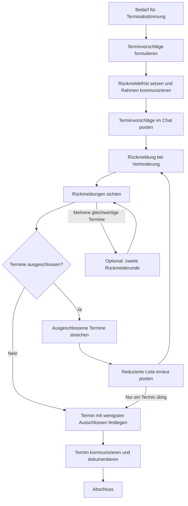
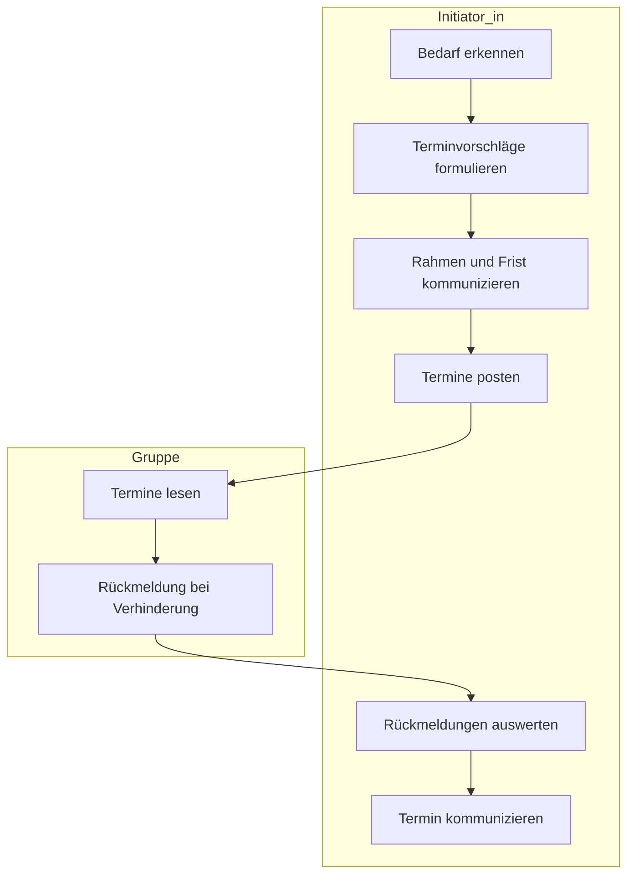

created: 7.6.2025 | [updated](https://git.jochen-hanisch.de/jochen-hanisch/research): 7.6.2025 | published: | [Austausch](https://lernen.jochen-hanisch.de/course/view.php?id=4) |  [[Allgemein beruflich/Webseite Jochen Hanisch/Hinweise|Hinweise]]

**Framework der asynchron-ausschlussbasierten Terminsuche**

Dieses Framework beschreibt ein leichtgewichtiges, asynchrones Verfahren zur effizienten Terminkoordination durch Ausschlusslogik innerhalb bestehender digitaler Gruppenkommunikation.

# Ziel

Das Framework der asynchron-ausschlussbasierten Terminsuche dient der effizienten und ressourcenschonenden Koordination von Gruppenterminen über digitale Chatkanäle. Ziel ist es, durch ein strukturiert reduktives Ausschlussverfahren einen Gruppenprozess zu ermöglichen, in dem terminlicher Konsens mit geringem Kommunikationsaufwand, hoher Transparenz und partizipationssensibler Zugänglichkeit hergestellt werden kann.

# Anwendungsfelder

Das Verfahren eignet sich insbesondere für Konstellationen, in denen Gruppenprozesse dezentral, asynchron und ressourcensensibel gestaltet sind.

- regelmäßig oder situativ Termine abstimmen,
- über digitale Chats kommunizieren (z. B. Signal, WhatsApp, MS Teams, Rocket.Chat),
- keine externen Tools (z. B. Doodle) verwenden möchten,
- eine verbindliche, klare und zeiteffiziente Abstimmung benötigen.

# Rollen und Verantwortlichkeiten

|**Rolle**|**Aufgabe**|
|---|---|
|**Initiator*in**|Startet den Prozess, schlägt Termine vor, wertet Rückmeldungen aus, trifft Entscheidung|
|**Teilnehmende**|Geben Rückmeldung **nur bei Verhinderung**. Unterbleibt eine Rückmeldung, wird dies im Sinne impliziter Zustimmung interpretiert.|

Hinweis: In Kleingruppen kann die Rolle der Initiator*in rotierend vergeben werden, um Partizipation zu fördern.

Alternativ oder ergänzend kann auch die Gruppe Terminvorschläge einbringen, sofern der Rahmen für die Rückmeldung gemeinsam geklärt ist.


# Ablaufbeschreibung

## Überblick zur Durchführung (iterativ)

Die Terminkoordination erfolgt in einem schrittweisen Ausschlussverfahren. Nach jeder Rückmeldephase werden nicht mögliche Termine gestrichen und die verbleibenden Optionen erneut gepostet. Der Termin mit der geringsten Anzahl an Ausschlüssen wird als gemeinsamer Bezugspunkt formuliert.

### Ablauf als Flowchart


_Abbildung 1: Ablauf der asynchron-ausschlussbasierten Terminsuche_

### Swimlane-Diagramm


_Abbildung 2: Swimlane-Diagramm_

Die obigen Diagramme verdeutlichen den Ablauf und die Rollenverteilung im Verfahren der asynchron-ausschlussbasierten Terminsuche. Sie helfen, die Verantwortlichkeiten und den Prozess klar zu strukturieren.

## Terminvorschläge vorbereiten

- Auswahl von 3–6 realistischen Terminvorschlägen
- Festlegung einer Rückmeldefrist
- Klare Erklärung des Prinzips: **Nur Verhinderungen melden**

## Nachricht senden

```text
🕒 Terminkoordination für unser nächstes Treffen

Bitte gebt nur Rückmeldung, wenn ihr an einem oder mehreren Terminen nicht könnt.

Keine Antwort = ihr könnt an allen.

Frist: Freitag, 12 Uhr
```

**Vorschläge:**

```text
1. Mo, 12.08. – 18:00 Uhr
2. Di, 13.08. – 17:30 Uhr
3. Mi, 14.08. – 18:00 Uhr
4. Do, 15.08. – 19:00 Uhr
```

## Rückmeldungen erhalten

Teilnehmende antworten **nur bei Verhinderung**, zum Beispiel so:

```text
„2 und 4 gehen bei mir nicht.“
```

Oder durch Markierung (kopierte Liste mit ❌):

```text
1. Mo, 12.08. – 18:00 Uhr
2. Di, 13.08. – 17:30 Uhr ❌
3. Mi, 14.08. – 18:00 Uhr
4. Do, 15.08. – 19:00 Uhr ❌
```

## Rückmeldungen auswerten

- Sichtung der Rückmeldungen
- Nach jeder Iteration werden ausgeschlossene Termine entfernt und die reduzierte Liste nochmals transparent kommuniziert.
- Eliminierung aller Termine mit Ausschlüssen
- Auswahl des am besten geeigneten Termins
- Kommunikation im Chat

**Beispielnachricht:**

```text
✅ Der Termin mit den wenigsten Verhinderungen ist Mi, 14.08. um 18:00 Uhr.

Danke für eure schnelle Rückmeldung.
```

Optional kann bei verbleibenden Mehrfachoptionen eine zweite Rückmelderunde erfolgen.

# Besonderheiten und Hinweise

- **Verbindlichkeit:** Wer nicht antwortet, gilt als verfügbar
- **Gruppengröße:** Ideal für 3–12 Personen
- **Standardisierbarkeit:** Kann als Gruppenstandard etabliert werden
- **Dokumentation:** Finaler Termin ggf. zusätzlich im Kalender, LMS oder Protokoll vermerken

- **Kulturelle Verständigung:** Der zugrunde liegende Konsensmechanismus – Rückmeldungsabstinenz als implizite Zustimmung – sollte situativ transparent gemacht und gemeinsam verabredet werden.
- **Dokumentationsklarheit:** Die finale Entscheidung sollte nachvollziehbar dokumentiert werden (z. B. im LMS, in Teamprotokollen oder gemeinsamen Arbeitsräumen).

# Vorteile des Verfahrens

|**Aspekt**|**Vorteil**|
|---|---|
|Zeitökonomie|Minimale Kommunikation bei maximaler Aussagekraft|
|Übersichtlichkeit|Keine Diskussionen oder Präferenzabfragen|
|Niedrigschwelligkeit|Keine externen Tools notwendig|
|Automatisierbarkeit|Leicht wiederholbar und standardisierbar|
|Skalierbarkeit|Einsetzbar in kleinen bis mittelgroßen Teams oder Projekten|

# Optional: Prozess als Standard einführen

- Regelmäßig einsetzen, um die Verfahrenslogik zu etablieren
- Ggf. feste Terminformate oder bevorzugte Wochentage definieren
- In hybriden Gruppen kombinierbar mit Kalenderfreigaben oder LMS-Anbindung
