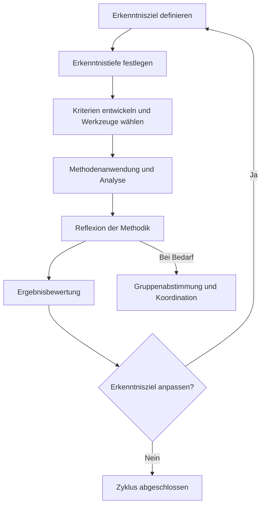

created: 29.09.2024 | updated: 26.11.2024 | [[Hinweise]]

# 1 Definition

Der Erkenntnisbasierte Aufgabenzyklus (EBA-Zyklus) beschreibt ein flexibles und anpassbares Rahmenwerk zur systematischen Erarbeitung und Vertiefung von Erkenntnissen. Der Zyklus ermöglicht es, Erkenntnisziele kontinuierlich anzupassen und zu überprüfen, um die Tiefe und Qualität des Lernens zu maximieren. Seine Anwendbarkeit als „verbindendes Glied“ zwischen verschiedenen Lehr-Lern-Theorien und methodischen Ansätzen macht ihn zu einem universellen Modell für die Gestaltung von Lernprozessen. Er integriert Reflexion, [[Erkenntnis]] und Aufgabenorientierung und schafft damit eine Grundlage, auf der unterschiedliche didaktische Paradigmen miteinander in Einklang gebracht werden können.

# 2 Herleitung

1. **Kernideen aus verschiedenen Theorien**:  
   Der EBA-Zyklus übernimmt zentrale Elemente aus unterschiedlichen pädagogischen Theorien und verbindet sie in einem kohärenten Rahmen. Seine Anpassungsfähigkeit ermöglicht es, ihn sowohl in behavioristischen als auch in kognitivistischen und konstruktivistischen Ansätzen zu verankern. Dabei ist die Reflexion der gemeinsame Nenner, der alle Theorien miteinander verbindet.

2. **Integration von Erkenntniszielen und Reflexionsprozessen**:  
   Der Zyklus hebt die Bedeutung von klar definierten Erkenntniszielen hervor, die durch fortlaufende Reflexion und Zielanpassung erreicht werden. Dies entspricht den Prinzipien der Erkenntnistheorie, die das Wissen als etwas betrachtet, das durch kontinuierliche Auseinandersetzung mit der Welt konstruiert und transformiert wird.

3. **Universelle Anwendbarkeit durch methodische Struktur**:  
   Die klare Struktur des Zyklus macht ihn anwendbar auf verschiedene Inhalte und Kontextbedingungen. Er unterstützt sowohl stark instruktionale als auch offene, selbstgesteuerte Lernprozesse, was ihn zu einem universellen didaktischen Werkzeug macht.

## 2.1 Gründe für die universelle Anwendbarkeit des EBA-Zyklus

1. **Reflexion und Erkenntnis als Kern des Lernens**:  
   In vielen Theorien wird Reflexion als zentraler Bestandteil des Lernens betrachtet. Der EBA-Zyklus fördert kontinuierliche Reflexion, die sowohl im Konstruktivismus als auch im systemischen Ansatz als wesentliche Bedingung für nachhaltiges Lernen angesehen wird. Im Kognitivismus hilft er dabei, kognitive Prozesse zu überprüfen und strategisch zu verbessern, während er im Behaviorismus eine metakognitive Reflexion über Verhaltensänderungen ermöglicht.

2. **Aufgabenorientierung und methodische Struktur**:  
   Die Aufgabenorientierung des EBA-Zyklus steht im Einklang mit Theorien, die strukturierte Lernprozesse betonen. Durch die gezielte Ausrichtung auf Erkenntnisziele und deren kontinuierliche Anpassung unterstützt der Zyklus eine effiziente und tiefgehende Bearbeitung von Lerninhalten.

3. **Erkenntnistheorie als Bindeglied**:  
   Erkenntnisziele, die durch den EBA-Zyklus erreicht werden sollen, bauen auf jahrhundertealtem epistemologischen Wissen auf. Die dynamische Anpassung von Zielen und Methoden im Zyklus reflektiert die Natur der Erkenntnistheorie, die das Wissen als etwas betrachtet, das sich ständig weiterentwickelt und transformiert.

## 2.2 Der EBA-Zyklus als „verbindendes Element"

Der EBA-Zyklus kann als integratives Prinzip betrachtet werden, das verschiedene Ansätze und Theorien miteinander verknüpft. Ein passender Vergleich ist der mit der „Macht“ aus *Star Wars*, die alle Dinge im Universum miteinander verbindet. So wie die Macht eine grundlegende Energie ist, die Ordnung und Chaos vereint, fungiert der EBA-Zyklus als ein didaktisches Werkzeug, das Reflexion, Aufgabenorientierung und Erkenntnisgewinn zusammenführt. Diese „verbindende Kraft“ des Zyklus schafft eine Brücke zwischen instruktiven, konstruktivistischen und systemischen Ansätzen, indem sie die gemeinsamen Nenner herausarbeitet und als Grundlage für die Integration von Lernprozessen nutzt.

### Theoretische Anwendungsbeispiele

1. **Behaviorismus**:  
   Im behavioristischen Ansatz kann der Zyklus verwendet werden, um Lernende zur Reflexion ihrer Verhaltensmuster anzuregen und die daraus gewonnenen Erkenntnisse zur Optimierung ihrer Lernziele zu nutzen. Er bietet damit eine metakognitive Erweiterung, die über rein behavioristische Ansätze hinausgeht.

2. **Kognitivismus**:  
   Der Zyklus unterstützt kognitive Ansätze, indem er den Lernenden hilft, ihre Strategien zur Problemlösung zu reflektieren und systematisch weiterzuentwickeln. Diese Reflexion ermöglicht es, das eigene Denken bewusst zu steuern und tiefere Einsichten zu gewinnen.

3. **Humanismus**:  
   Der EBA-Zyklus ermöglicht es den Lernenden, ihre eigenen Erkenntnisziele zu setzen und auf dem Weg zur Selbstverwirklichung kontinuierlich zu reflektieren. Dies fördert die Autonomie und das Streben nach persönlicher Entwicklung, was zentrale Werte des humanistischen Ansatzes sind.

4. **Konstruktivismus**:  
   Im konstruktivistischen Ansatz wird der Zyklus verwendet, um Lernprozesse durch kontinuierliche Reflexion zu strukturieren und die aktive Konstruktion von Wissen zu fördern. Erkenntnisziele werden dabei basierend auf den individuellen Erfahrungen der Lernenden kontinuierlich angepasst.

5. **Systemisch-konstruktivistischer Ansatz**:  
   Der Zyklus fördert die Betrachtung von Lernprozessen als offene Systeme, die durch externe und interne Einflüsse dynamisch gesteuert werden. Lernende reflektieren kontinuierlich, wie ihre Erkenntnisziele im Kontext der sich verändernden Systemdynamiken angepasst werden müssen.
## 2.3 Grafisches Flussdiagramm des EBA-Zyklus

# 3 Folgerungen

- **Ein integratives Modell**:  
  Der EBA-Zyklus kann als Bindeglied zwischen verschiedenen pädagogischen Paradigmen fungieren, indem er Reflexion, Zielanpassung und Aufgabenorientierung als zentrale Elemente herausstellt.

- **Universelle Anwendbarkeit**:  
  Durch seine universelle Struktur ist der Zyklus in verschiedenen didaktischen Ansätzen und Kontexten einsetzbar. Dies ermöglicht eine umfassende Anwendung in Theorie und Praxis.

- **Verbindendes Element**:  
  Der Zyklus verbindet scheinbar gegensätzliche Ansätze, indem er einen gemeinsamen Reflexionsprozess etabliert, der in allen Theorien von zentraler Bedeutung ist.
# 4 Zusammenfassung

Der Erkenntnisbasierte Aufgabenzyklus (EBA-Zyklus) fungiert als universelles Bindeglied zwischen verschiedenen Lehr-Lern-Theorien. Seine Fähigkeit, Reflexion, Erkenntnis und Aufgabenorientierung miteinander zu verknüpfen, macht ihn zu einem flexiblen und anpassbaren Werkzeug, das in vielen pädagogischen Ansätzen eingesetzt werden kann. Diese „verbindende Kraft“ des Zyklus hilft dabei, verschiedene Paradigmen und didaktische Prinzipien miteinander zu integrieren.
# Quelle(n)

- Jochen Hanisch-Johannsen (2024). Erkenntnisbasierter Aufgabenzyklus (EBA-Zyklus). [Zotero-Link](zotero://select/items/@openaiErkenntnisbasierterAufgabenzyklusEBAZyklus2024).