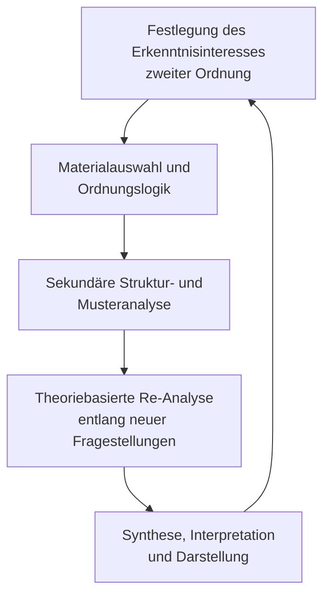

# Einleitung

Im Rahmen wissenschaftlicher Analyseverfahren hat sich die Notwendigkeit herausgebildet, nicht nur Phänomene oder Quellen selbst, sondern auch deren methodische Erschließung systematisch zu untersuchen. Dies gilt insbesondere dann, wenn computergestützte oder KI-basierte Analysen in wissenschaftliche Arbeitsprozesse integriert werden. Das hier verfolgte Erkenntnisinteresse zielt auf die präzise konzeptionelle Fassung eines Analyseverfahrens, das sich **nicht direkt auf Primärquellen**, sondern auf bereits durchgeführte **Analyseprozesse** richtet – unabhängig davon, ob diese von Menschen oder Maschinen durchgeführt wurden. Die Bezeichnung **„Analyse zweiter Ordnung“** soll dabei eine **generalisierbare, theorieoffene** und dennoch **präzise** definierte Kategorie bezeichnen, die sowohl in erkenntnistheoretischer als auch in methodologischer Hinsicht anschlussfähig bleibt.

# 1 Definition

Eine Analyse zweiter Ordnung ist ein wissenschaftlich-methodischer Analyseprozess, der nicht auf ein Untersuchungsobjekt selbst, sondern auf die Struktur, Logik und epistemische Rahmung bereits durchgeführter Analysen dieses Objekts zielt.

Im Unterschied zur Analyse erster Ordnung, die ein empirisches Phänomen, einen Text, ein Verhalten oder eine Datenreihe unmittelbar zum Gegenstand macht, rückt die Analyse zweiter Ordnung die Analysehandlungen selbst in den Mittelpunkt. Diese werden als beobachtbare, rekonstruierbare und systematisch untersuchbare Gegenstände behandelt.

Im Zentrum stehen dabei folgende Dimensionen:

- **Strukturanalyse**: Welche methodischen Schritte, Kategorien und Heuristiken strukturieren die Erstanalyse?
- **Logikprüfung**: Ist die Analyse konsistent aufgebaut, nachvollziehbar dokumentiert und in sich schlüssig?
- **Epistemische Rahmung**: Welche erkenntnistheoretischen Voraussetzungen (bspw. Theorien, Begriffsverwendungen, Codierregeln) bestimmen die Analyse implizit oder explizit?

Die Analyse zweiter Ordnung kann sowohl auf menschlich durchgeführte als auch auf KI-generierte Analysen angewendet werden. Sie ist insbesondere in kontexten versionierter, rekursiver oder automatisierter Forschungspraxis von methodischer Relevanz.

Ihr wissenschaftlicher Wert liegt in der Reflexivierung von Analysepraktiken, in der theoriegeleiteten Synthese divergenter Erstanalysen und in der Eröffnung eines metaepistemischen Raums innerhalb wissenschaftlicher Erkenntnisprozesse.

# 2 Herleitung des Begriffs und Konzepts

## 2.1 Herkunft: Beobachtung zweiter Ordnung

Der Begriff der „zweiten Ordnung“ hat seine theoretische Herkunft in der Systemtheorie, insbesondere in der Kybernetik zweiter Ordnung bei Heinz von Foerster (1981) und später in der soziologischen Systemtheorie bei Niklas Luhmann (1990). Beide Autoren haben unabhängig voneinander, aber in methodischer und epistemologischer Anschlussfähigkeit, den Begriff der Beobachtung zweiter Ordnung entwickelt, um auf ein spezifisches Reflexionsniveau innerhalb systemischer Operationen aufmerksam zu machen.

Bei Heinz von Foerster findet sich die Unterscheidung im Rahmen seiner kybernetischen Überlegungen zur Selbstreferenz und zur Beobachterabhängigkeit von Erkenntnis. Während die Kybernetik erster Ordnung sich mit beobachteten Systemen befasst, also mit der Steuerung, Regelung und Rückkopplung innerhalb technischer oder biologischer Systeme, beschäftigt sich die Kybernetik zweiter Ordnung mit Systemen, die sich selbst beobachten – insbesondere mit Beobachtern, die andere Beobachter beobachten. Erkenntnis wird dadurch nicht mehr als Abbildung von Welt, sondern als operationale Konstruktion eines Beobachters innerhalb eines Systems beschrieben (vgl. Foerster, 1981, S. 255 ff.).

Niklas Luhmann greift diesen Begriff auf und überführt ihn in seine Gesellschaftstheorie. Beobachtungen sind in seiner Theorie grundlegend operative Akte sozialer Systeme, die Unterscheidungen treffen und bezeichnen. Eine Beobachtung erster Ordnung beschreibt demnach eine Unterscheidung zwischen einem untersuchten Phänomen und dem, was es nicht ist – etwa: *Dies ist ein Interviewtext* (nicht eine Zahlentabelle). Eine Beobachtung zweiter Ordnung richtet sich dagegen auf diese Unterscheidung selbst – also auf die Art, wie etwas beobachtet und unterschieden wurde: *Warum wurde dieser Text als Interviewtext und nicht als Fallbeschreibung gelesen? Welche Kategorien, welche Dispositive, welche impliziten Prämissen steuern diese Unterscheidung?* (vgl. Luhmann, 1990, S. 15–18).

Diese Differenz ist erkenntnistheoretisch von erheblicher Bedeutung. Denn sie verschiebt den Fokus wissenschaftlicher Erkenntnis: von der Frage *Was ist das?* zur Frage *Wie kommt es, dass wir es so sehen?* Die zweite Ordnung macht damit die Erkenntnisoperation selbst zum Gegenstand wissenschaftlicher Reflexion – nicht bloß das Ergebnis. Mit dieser Verschiebung wird es möglich, auch die Struktur wissenschaftlicher Beobachtungen, ihre impliziten Theorien, Begriffe, Wertannahmen und Auswahlmechanismen systematisch zu untersuchen. Es entsteht ein Raum der Meta-Erkenntnis, der insbesondere dort notwendig wird, wo Beobachtungen (und in unserem Fall: Analysen) nicht neutral, sondern kontingent, kontextabhängig und methodengeleitet erfolgen.

Diese Struktur lässt sich mit hoher theoretischer Präzision auf wissenschaftliches Analysieren übertragen. In der Analyse erster Ordnung wird ein Objekt – etwa ein empirischer Text, eine Interviewpassage, ein Datensatz oder ein beobachtetes Verhalten – auf ein Erkenntnisinteresse hin untersucht. Die verwendeten Kategorien, Methoden oder Codierungen werden dabei oft als selbstverständlich vorausgesetzt oder nur am Rand thematisiert. Die Analyse zweiter Ordnung hingegen thematisiert genau diese Voraussetzungen: *Welche methodischen Entscheidungen wurden getroffen? Welche theoretischen Begriffe wurden implizit verwendet? Wie wurde der Gegenstand konstruiert?*

Die Analyse zweiter Ordnung übernimmt damit strukturell die Funktion der Beobachtung zweiter Ordnung: Sie beobachtet Analysehandlungen und fragt danach, wie diese selbst operieren – epistemisch, methodisch, heuristisch. Damit leistet sie einen Beitrag zur Reflexivierung wissenschaftlicher Praxis, der in modernen, komplexen Forschungskontexten nicht nur optional, sondern notwendig ist.

Sie schafft die methodologische Grundlage für jene Forschungssituationen, in denen sich nicht mehr nur das Was, sondern das Wie der Erkenntnis in den Mittelpunkt der Analyse verschiebt.

## 2.2 Abgrenzungen

Die Analyse zweiter Ordnung steht in einem Spannungsverhältnis zu mehreren etablierten wissenschaftlichen Analyseformen. Sie berührt Elemente der Metaanalyse, der Metasynthese, der methodenkritischen Reflexion und der Exzerption und übersteigt diese sowohl in ihrer erkenntnistheoretischen Zielrichtung als auch in ihrer systematischen Tiefe. Eine präzise Abgrenzung ist notwendig, um ihren methodologischen Eigenwert sichtbar zu machen.

Im Gegensatz zur klassischen Metaanalyse, die primär in der quantitativen Forschung verortet ist und auf die statistische Aggregation von Ergebnissen mehrerer empirischer Studien zielt (vgl. Borenstein et al., 2009), bezieht sich die Analyse zweiter Ordnung nicht lediglich auf eine Ergebniszusammenfassung. Zwar können auch hier verschiedene Analysen zu einem Thema oder einer Fragestellung zusammengeführt werden, doch geschieht dies nicht durch rein numerische Verfahren, sondern durch eine theoriebasierte und reflexive Relektüre der jeweils vorliegenden Analysen – inklusive ihrer methodischen Konstruktion, argumentativen Struktur und kontextuellen Einbettung.

Auch die qualitative Metasynthese (vgl. Sandelowski & Barroso, 2007), die eine theoriebildende Integration mehrerer qualitativer Studien verfolgt, unterscheidet sich fundamental. Zwar setzt auch die Analyse zweiter Ordnung an existierenden Analysen an, doch sie erweitert den Zugriff um eine unterscheidungsbasierte Strukturbetrachtung: Sie analysiert nicht nur, *was* in den vorliegenden Studien gesagt wurde, sondern *wie* dies strukturiert, interpretiert, kontextualisiert und methodisch generiert wurde – und verbindet diese Zugriffe mit einer erneuten, forschungsfragengeleiteten inhaltlichen Untersuchung.

Denn die Analyse zweiter Ordnung erschöpft sich keineswegs in der Betrachtung von Verfahren oder Kategorien. Vielmehr gewinnt sie dann ihren heuristischen und wissenschaftlichen Wert, wenn eine Vielzahl von Analysen erster Ordnung zunächst entlang eines vorher definierten Ordnungskriteriums geclustert wird – bspw. thematisch, theoretisch oder diskursiv –, und anschließend entlang neuer oder vertiefter Forschungsfragen erneut analysiert wird. In diesem Schritt werden die inhaltlichen Ergebnisse der Erstanalysen nicht nur gesammelt oder paraphrasiert, sondern im Lichte neuer analytischer Raster systematisch ausgewertet. Die Analyse zweiter Ordnung erkennt in diesem Verfahren neue Muster, Differenzen, semantische Knotenpunkte oder Leerstellen, die in der Erstanalyse noch nicht sichtbar waren – weil dort die Erkenntnisperspektive eine andere war. 

Diese Fähigkeit zur inhaltlichen Neuerschließung durch strukturierte Relektüre macht die Analyse zweiter Ordnung zu mehr als einer bloß reflektierenden oder meta-analytischen Praxis. Sie wird zu einem eigenen wissenschaftlichen Erkenntnisverfahren, das sowohl methodenkritisch als auch theoriebildend operiert. Sie verbindet die reflexive Tiefenschärfe einer Beobachtung zweiter Ordnung mit der heuristischen Offenheit qualitativer Mustererkennung.

Gegenüber der Exzerption, die lediglich dokumentierend Inhalte sammelt, und der methodenkritischen Reflexion, die oft selbstbezüglich bleibt (bspw. in der Validierung eigener Kategoriensysteme), verfolgt die Analyse zweiter Ordnung einen doppelten Zugriff: Sie ist analytisch-rekonstruktiv auf der Prozessebene und inhaltsanalytisch-musterbildend auf der Ergebnissebene. 

_Tabelle 1: Typologische Matrix wissenschaftlicher Analyseformen_

| Kriterium                        | Exzerption                                | Metaanalyse                              | Metasynthese (qualitativ)                   | Methodenkritische Reflexion               | Analyse zweiter Ordnung                      |
|----------------------------------|--------------------------------------------|-------------------------------------------|---------------------------------------------|-------------------------------------------|------------------------------------------------|
| **Primäres Erkenntnisobjekt**    | Inhalte aus Quellen                        | Ergebnisse quantitativer Studien         | Ergebnisse qualitativer Studien            | eigene methodische Entscheidungen         | vorliegende Analysen (Prozesse und Ergebnisse) |
| **Zugriffsform**                 | dokumentierend                             | aggregierend (statistisch)               | interpretierend, theoriebildend            | kritisch-reflektierend                    | strukturierend, rekursiv, theoriebasiert        |
| **Analysefokus**                 | Inhalte (Zitate, Argumente)                | Effektgrößen, Signifikanzen              | Bedeutungsstrukturen, Konzepte             | Kategoriensysteme, Operationalisierungen  | Methodenlogik, Ergebnisstruktur, epistemische Muster |
| **Forschungslogik**              | vorbereitend, selektiv                     | hypothesenprüfend, quantitativ           | theoriebildend, interpretativ              | korrektiv, absichernd                     | reflexiv und heuristisch, theoriegenerierend     |
| **Ebene der Erkenntnisbildung**  | Text- oder Quellenebene                    | Ergebnis- und Studiendesign-Ebene        | Interpretationsebene                       | Methodenebene                             | Analyse- und Erkenntnisebene zweiter Ordnung     |
| **Theoriebezug**                 | schwach, implizit                          | moderat (je nach Fragestellung)          | stark (bspw. Grounded Theory)              | explizit theoriegeleitet                  | konstitutiv: Theorie als Analyseinstrument       |
| **Ergebnisform**                 | Exzerpt, Zitat, Kommentar                  | Effektzusammenfassung, Forest Plot       | Konzeptcluster, interpretative Typologien  | argumentativ-reflektierte Methodenkritik | neue Muster, Meta-Kategorien, epistemische Reentrys |
| **Reflexionsniveau**             | niedrig (Auswahlkriterium)                 | mittel (Biaskontrolle etc.)              | hoch (Interpretation der Interpretation)   | hoch (Selbstreflexion)                    | sehr hoch (Rekonstruktion epistemischer Operationen) |
| **Beispielhafte Anwendung**      | Literatursichtung                          | Medizinische Interventionsstudien        | Synthese qualitativer Interviewstudien     | Reflexion des eigenen Codierverfahrens   | Re-Analyse GPT-Cluster entlang theoretischer Raster |

Tabelle 1 zeigt, dass die Analyse zweiter Ordnung bildet eigene methodologische Kategorie eine, da sie: Reflexion und Theorieintegration systematisch verbindet, sowohl methodisch als auch inhaltlich strukturiert zugreift, rekursive Analysehandlungen sichtbar und auswertbar macht und für menschliche wie maschinelle Analysen offen ist.

Die Analyse zweiter Ordnung ist damit eine reflexive Re-Analyse strukturierter Einzelanalysen, die sowohl methodisch als auch inhaltlich neue Erkenntnis erzeugt. Sie unterscheidet sich von anderen Verfahren nicht allein durch ihren Gegenstand (die Analyse), sondern durch ihren erkenntnistheoretischen Zugriff, ihre rekursive Logik und ihre Fähigkeit zur theoriebasierten Mustererkennung. Damit ist sie weder bloße Meta- noch bloße Inhaltsanalyse, sondern eine eigenständige Form wissenschaftlicher Erkenntnisbildung zweiter Ordnung.

## 2.3 Anwendung

Die Analyse zweiter Ordnung ist grundsätzlich in solchen Forschungskontexten anwendbar, in denen bereits vorliegende Analysen als systematisch durchgeführte und dokumentierte Erkenntnishandlungen zugänglich sind. Dabei spielt es zunächst keine Rolle, ob es sich um qualitative oder quantitative Verfahren, um hermeneutische, rekonstruktive oder deskriptive Analysen handelt – entscheidend ist, dass eine erste analytische Operation stattgefunden hat, deren Struktur, Ergebnislogik und erkenntnistheoretische Rahmung sich beobachten und untersuchen lassen.

In klassischen Kontexten qualitativer Forschung kann dies etwa die erneute Analyse bereits codierter Interviewdaten sein. Die Analyse zweiter Ordnung würde sich in diesem Fall nicht auf das ursprüngliche Interview selbst richten, sondern auf die Art und Weise, wie bestimmte Textstellen codiert, welche Kategorien verwendet, welche theoretischen Begriffe aktiviert oder welche Argumentationsmuster reproduziert wurden. Ebenso lassen sich vergleichende Fallanalysen, Diskursanalysen, Grounded-Theory-Prozesse oder narrative Auswertungen im Rahmen einer Analyse zweiter Ordnung untersuchen – insbesondere dann, wenn mehrere solcher Analysen in einem gemeinsamen Referenzraum (bspw. einer Forschungsgruppe, einem Themenfeld oder einer Untersuchungseinheit) stehen. 

Die Analyse zweiter Ordnung entfaltet dabei ihr Potenzial vor allem dann, wenn eine Vielzahl solcher Einzelanalysen entlang eines zuvor definierten Ordnungskriteriums, bspw. thematisch, methodisch oder diskursiv, geclustert und im Anschluss unter neuen, theoriebasierten Forschungsfragen einer erneuten Betrachtung unterzogen wird. Diese zweite Analyseebene ermöglicht sowohl die Identifikation wiederkehrender Muster und Unterschiede als auch die Sichtbarmachung epistemischer Voraussetzungsstrukturen, die in der Erstanalyse implizit geblieben sein mögen.

Diese grundlegende Anlage lässt sich methodologisch konsequent auf KI-basierte Analyseverfahren übertragen. Im spezifischen Fall der sogenannten KI-Analyse zweiter Ordnung richtet sich der Zugriff auf durch KI, insbesondere durch große Sprachmodelle wie GPT, erzeugte Einzelanalysen. Diese wurden in der Regel auf Grundlage zuvor formulierter Prompts und Fragestellungen durchgeführt und liegen als strukturierte, sprachlich ausgeformte Analyseausgaben vor. Die zweite Ordnung greift nun nicht auf die ursprüngliche Quelle (bspw. ein Textdokument), sondern auf diese KI-generierten Analysen zu und analysiert sie entweder hinsichtlich ihrer inhaltlichen Muster, ihrer sprachlichen Konstruktion, ihrer kategorialen Struktur oder ihrer epistemischen Orientierung.

Auch hier lassen sich mehrere Einzelanalysen zunächst clustern, etwa nach Themen, Textsorte oder Perspektive, und anschließend unter neuen Fragestellungen, d.h. etwa theoriebasierten Vergleichsrastern, erneut analysieren. So können Muster, Abweichungen, systematische Leerstellen oder emergente Strukturen identifiziert werden, die in der Erstanalyse nicht sichtbar waren. Darüber hinaus bietet die KI-Analyse zweiter Ordnung einen spezifischen Erkenntnisgewinn, der aus der Interaktion zwischen menschlicher Forschungslogik und maschineller Sprachgenerierung hervorgeht. Sie macht dadurch sichtbar, welche epistemischen Entscheidungen bereits im Prompting, im Modellverhalten oder in der Struktur der Antwort eingeschrieben sind und eröffnet damit einen reflexiven Raum über die erkenntnistheoretische Tragfähigkeit maschinell erzeugter Analysen selbst.

In dieser Form markiert die Analyse zweiter Ordnung nicht nur ein methodisches Verfahren, sondern eine eigene epistemologische Zugriffsweise auf die Bedingungen, Prozesse und Produkte wissenschaftlicher Erkenntnis.

## 2.4 Durchführung

Die Durchführung einer Analyse zweiter Ordnung erfordert eine methodisch kontrollierte Vorgehensweise, die sowohl die Rückbindung an ein theoretisches Erkenntnisinteresse als auch die systematische Strukturierung des Analyseprozesses selbst gewährleistet. Da sich die Analyse zweiter Ordnung nicht auf Primärdaten richtet, sondern auf bereits vorliegende Analysen, verschieben sich auch die Anforderungen an Materialbasis, Auswertungslogik und Reflexionsniveau.

_Abbildung 1: Schematischer Ablauf Analyse zweiter Ordnung (eig. Darstellung)
Das Flussdiagramm i abbildung 1 betont die lineare Logik, erlaubt aber auch eine rekursive Erweiterung (bspw. durch Rückverweise von Schritt E zu A für zyklische Analyseprozesse). Bei Bedarf kann ich Varianten für zyklische oder netzwerkartige Strukturen ergänzen. Die Schleife von E → A symbolisiert den rekursiven oder zyklischen Charakter der Analyse zweiter Ordnung: Erkenntnisse aus der Synthese können zur Präzisierung der Forschungsfrage, zur Neukonfiguration des Analyseclusters oder zur Veränderung des Theorierahmens führen – und initiieren so eine neue Schleife wissenschaftlicher Erkenntnisarbeit:

Die Durchführung kann grundsätzlich in fünf Schritten erfolgen:

1. **Festlegung des Erkenntnisinteresses zweiter Ordnung**  
   Ausgangspunkt ist die präzise Formulierung der Fragestellung, die sich nicht auf ein empirisches Objekt, sondern auf eine Menge vorliegender Analysen richtet. Dabei kann es sich um methodologische Fragen (bspw. Welche heuristischen Muster liegen den Analysen zugrunde?), theoriebasierte Fragestellungen (bspw. Wie wird ein bestimmter Begriff in unterschiedlichen Analysen operationalisiert?) oder strukturvergleichende Zugriffe handeln (bspw. Welche Unterschiede zeigen sich im analytischen Zugriff verschiedener Perspektiven?).
2. **Materialauswahl und Ordnungslogik**  
   Es wird eine Auswahl von Analysen erster Ordnung getroffen, die vergleichbar, dokumentiert und methodisch anschlussfähig sind. Diese Analysen können aus Forschungsprojekten, KI-generierten Outputs oder publizierten Studien stammen. Zentrale Voraussetzung ist, dass sie rekonstruierbar vorliegen – also in ihrer Struktur, ihrer Argumentation oder ihrer Kategorisierung lesbar sind. Anschließend erfolgt eine systematische Clusterung entlang eines Ordnungskriteriums, etwa nach Thema, Methode, Quelle, Diskursposition oder Autorenschaft.
3. **Sekundäre Struktur- und Musteranalyse**  
   In einem dritten Schritt werden die analysierten Erstanalysen selbst zum Gegenstand einer strukturellen Relektüre. Dabei werden zentrale Differenzierungen, Gemeinsamkeiten und epistemische Bewegungen sichtbar gemacht: Welche Begriffe dominieren? Welche Strukturmerkmale wiederholen sich? Welche Unterscheidungen werden operationalisiert, welche ausgelassen? Dieser Schritt kann sowohl qualitativ-hermeneutisch als auch codierend-systematisch erfolgen.
4. **Theoriebasierte Re-Analyse entlang neuer Fragestellungen**  
   Die zuvor gesichteten Analysen werden nun – abhängig vom theoretischen Rahmen – unter neue forschungsleitende Perspektiven gestellt. Dabei entstehen häufig neue Bedeutungsstrukturen, argumentative Konfigurationen oder Leerstellen, die in der ursprünglichen Analyse nicht adressiert wurden. Dieser Schritt hebt die Analyse zweiter Ordnung über eine bloße Metabetrachtung hinaus: Sie wird zur heuristischen Erkenntnismethode mit eigenem Gehalt.
5. **Synthese, Interpretation und Darstellung**  
   Abschließend erfolgt die theoriegeleitete Synthese der Analyseergebnisse zweiter Ordnung. Dabei ist sowohl eine verdichtende Darstellung (bspw. über Metakategorien, epistemische Typen, grafische Modelle) als auch eine differenzierende Aufschlüsselung möglich (bspw. über Widerspruchsmuster, diskursive Leerstellen oder neu emergente Theorieansätze). In digitalen Kontexten kann dieser Schritt auch versioniert dokumentiert werden, etwa in Form rekursiver Analysepfade, nachvollziehbarer Promptfolgen oder strukturierter GPT-Protokolle.

Die Durchführung einer Analyse zweiter Ordnung setzt somit nicht nur methodische Klarheit, sondern auch eine explizite Trennung zwischen erster und zweiter Ordnung voraus. Diese Unterscheidung ist epistemologisch bedeutsam. Erst durch ihre methodische Trennung kann ihre theoretische Relation überhaupt sichtbar gemacht werden und damit auch der Beitrag, den eine Analyse zweiter Ordnung zur wissenschaftlichen Erkenntnisproduktion leistet.

# 3 Folgerungen

Aus der theoretischen Herleitung und methodischen Struktur der Analyse zweiter Ordnung ergeben sich mehrere grundlegende Folgerungen für die wissenschaftliche Praxis. Diese betreffen sowohl die methodologische Konzeption von Forschung als auch das epistemische Selbstverständnis wissenschaftlicher Erkenntnisprozesse.

- Analyse zweiter Ordnung ist reflexiv und relational.  
  Sie entsteht dort, wo nicht mehr das Untersuchungsobjekt selbst, sondern die Art und Weise seiner wissenschaftlichen Erschließung zum Gegenstand der Analyse wird. Damit verschiebt sich der Fokus vom empirischen Material auf die Struktur der Erkenntnisprozesse, die dieses Material erst als solches sichtbar gemacht haben. Reflexivität bedeutet hier nicht bloß Selbstbeobachtung, sondern eine systematische Rekonstruktion der Bedingungen, unter denen wissenschaftliche Aussagen zustande kommen.
- Sie ist unabhängig vom Analysemedium.  
  Die Analyse zweiter Ordnung ist nicht daran gebunden, wer oder was die Erstanalyse vorgenommen hat. Ob diese durch einen Menschen, ein KI-System, eine Forschungsgruppe oder ein automatisiertes Verfahren erzeugt wurde, ist für den Status der zweiten Ordnung unerheblich. Entscheidend ist allein, dass die Analysehandlungen dokumentiert, zugänglich und rekonstruktionsfähig sind. Nur dann können sie zum Gegenstand einer zweiten Analyse werden.
- Sie erfordert epistemische Sensibilität.  
  Die Analyse zweiter Ordnung macht sichtbar, welche Unterscheidungen, Kategorien und Heuristiken einer Erstanalyse zugrunde liegen. Sie fragt danach, welche Begriffe dominant, welche Perspektiven ausgeschlossen und welche impliziten Annahmen wirksam geworden sind. Dies erfordert eine besondere Aufmerksamkeit gegenüber den epistemischen Operationen, die Analysen strukturieren – also etwa gegenüber dem Verhältnis von Theorie und Empirie, von Operationalisierung und Interpretation, von Codierung und Bedeutungszuweisung.
- Sie schafft neue Erkenntnismöglichkeiten durch Rekursion.  
  Indem bereits vorhandene Analysen unter neuen theoretischen Fragestellungen erneut betrachtet werden, können Erkenntnisse generiert werden, die in der ursprünglichen Analyse nicht sichtbar waren. Dies betrifft insbesondere Musterbildungen, Leerstellen, semantische Konvergenzen oder diskursive Spannungen, die erst im Vergleich, in der Clusterung oder in der rekursiven Durcharbeitung verschiedener Analysen hervortreten. Die Analyse zweiter Ordnung ist somit nicht bloße Rückschau, sondern ein produktiver epistemischer Zugriff mit eigener heuristischer Kraft.
- Sie verändert das Verhältnis von Methode und Erkenntnis.  
  Die klassische Vorstellung, dass Methoden neutrale Werkzeuge zur Erkenntnisgewinnung sind, wird durch die Analyse zweiter Ordnung relativiert. Denn sie zeigt, dass jede Analyse bereits eine theoretisch gerahmte, methodisch strukturierte und epistemisch vorausgesetzte Operation darstellt. Die Analyse zweiter Ordnung macht diese Voraussetzungen sichtbar – und kann dadurch auch zur methodologischen Weiterentwicklung beitragen.
- Sie ist anschlussfähig an versionierte, rekursive und kollaborative Forschungspraxis.  
  Insbesondere im Kontext digitaler Wissenschaft – etwa bei KI-gestützten Analysen oder in versionierten Analyseprozessen – eröffnet die Analyse zweiter Ordnung die Möglichkeit, Prozesse nicht nur transparent zu dokumentieren, sondern strukturell zu reflektieren. Sie erlaubt es, Forschung nicht nur als linearen, sondern als zirkulären, iterativen Prozess zu verstehen, in dem Analyseprodukte selbst wieder zum Ausgangspunkt neuer Erkenntnisoperationen werden können.

Diese Folgerungen machen deutlich, dass die Analyse zweiter Ordnung nicht nur eine Technik oder eine Methode darstellt, sondern eine epistemologische Haltung. Sie verschiebt die Aufmerksamkeit von Ergebnissen auf Prozesse, von Aussagen auf Operationen, von Daten auf Beobachtung und eröffnet damit neue Räume wissenschaftlicher Erkenntnisbildung.

# 4 Implikationen

Die Einführung des Begriffs „Analyse zweiter Ordnung“ hat weitreichende Implikationen für die wissenschaftliche Praxis. Sie betrifft nicht nur die Präzisierung analytischer Verfahren, sondern auch die Struktur epistemischer Prozesse, das Design von Forschungsarchitekturen sowie das Verhältnis von Methode und Erkenntnis in einer zunehmend digitalisierten Forschungsumgebung.

- Begriffliche Präzisierung  
  Der Begriff Analyse zweiter Ordnung erlaubt die systematische Benennung jener Analyseprozesse, die nicht auf Phänomene oder Primärdaten, sondern auf bestehende Analysehandlungen zielen. Er macht damit eine bislang weitgehend implizit gebliebene Ebene wissenschaftlicher Erkenntnis explizit beschreibbar. Diese begriffliche Klärung schafft eine Anschlussfähigkeit an bestehende Theorietraditionen – etwa in der Systemtheorie, der Wissenssoziologie oder der reflexiven Methodologie – ohne sich auf bestimmte Medienformen wie KI oder bestimmte disziplinäre Zugänge zu beschränken.
- Transparente und versionierte Forschungspraxis  
  Die Möglichkeit, Analyseprozesse selbst zum Gegenstand der Analyse zu machen, setzt voraus, dass diese Prozesse dokumentiert, rekonstruierbar und in ihrer Entstehungslogik nachvollziehbar sind. Damit rückt die Bedeutung versionierter Systeme, offener Protokolle und nachvollziehbarer Methodendokumentation ins Zentrum wissenschaftlicher Praxis. Die Analyse zweiter Ordnung operiert nicht nur mit Daten, sondern mit Prozessen – und verlangt daher eine Forschungskultur, die epistemische Entscheidungen sichtbar macht und zur reflexiven Auseinandersetzung einlädt.
- Förderung methodischer Innovationsfähigkeit  
  Durch die Analyse bestehender Analysehandlungen wird nicht nur deren Struktur sichtbar, sondern auch deren Begrenztheit. Dies eröffnet den Raum für methodologische Innovation: neue Kategoriensysteme, hybride Analyseverfahren, rekursive Auswertungsformate oder integrative Zugriffsmethoden entstehen häufig erst dann, wenn bestehende Verfahren systematisch beobachtet und auf ihre epistemische Leistungsfähigkeit hin befragt werden. Die Analyse zweiter Ordnung wird damit zu einem Instrument der methodischen Weiterentwicklung.
- Erweiterung epistemischer Perspektiven  
  Indem nicht nur Objekte, sondern Beobachtungs- und Analyseoperationen selbst zum Gegenstand werden, verschiebt sich die wissenschaftliche Perspektive hin zu einer reflexiven Epistemologie. Forschung wird nicht länger als bloß abbildende, sondern als beobachtende und unterscheidende Praxis verstanden. Diese Verschiebung ermöglicht es, die Bedingungen von Erkenntnis systematisch mit in den Blick zu nehmen – und trägt damit zur Selbstaufklärung der Wissenschaft bei.
- Anschlussfähigkeit an digitale Wissenschaft  
  Besonders im Kontext digitaler Wissenschaft – etwa bei der Nutzung von KI-Systemen, kollaborativen Plattformen oder versionierten Textumgebungen – wird die Analyse zweiter Ordnung operationalisierbar. Die digitale Verfügbarkeit von Analysepfaden, Promptstrukturen, Codierentscheidungen oder Modellantworten erlaubt erstmals eine systematische Beobachtung von Analyseoperationen in Echtzeit. Damit wird die Analyse zweiter Ordnung nicht nur theoretisch möglich, sondern praktisch umsetzbar – und damit zu einem zentralen Werkzeug reflexiver Wissenschaftspraxis im digitalen Raum.
- Beitrag zur Wissenschaftstheorie  
  Schließlich eröffnet die Analyse zweiter Ordnung eine Perspektive auf Wissenschaft, die nicht auf Objektivität im Sinne von Abbildbarkeit zielt, sondern auf die strukturelle Rückbindung wissenschaftlicher Aussagen an ihre epistemischen Bedingungen. Sie operiert im Raum zwischen Erkenntnis und Erkenntnisrahmung, zwischen Analyse und Beobachtung, zwischen Methode und Reflexion – und leistet so einen originären Beitrag zur wissenschaftstheoretischen Fundierung einer reflexiven, offenen und selbstbeobachtungsfähigen Forschungskultur.

Die Implikationen der Analyse zweiter Ordnung reichen damit weit über eine methodische Erweiterung hinaus: Sie betreffen die Grundstruktur von Erkenntnisprozessen in einer Zeit, in der Wissenschaft zunehmend als digitale, rekursive und kollaborative Praxis organisiert ist.

# 5 Kritik und Herausforderungen

Einige kritische Anmerkungen betreffen:

- **Begriffliche Redundanzgefahr:** Ohne präzise Abgrenzung könnte der Begriff „Analyse zweiter Ordnung“ als vage oder tautologisch erscheinen. Dies verlangt explizite Kontextualisierung (bspw. in Promotionsarbeiten).
- **Methodologische Breite:** Die Vielfalt möglicher Erstanalysen macht es notwendig, den Begriff kontextabhängig präziser zu operationalisieren (bspw. qualitative Analyse zweiter Ordnung vs. algorithmische).
- **Missverständnis mit Metaanalyse:** Eine sorgfältige Differenzierung ist notwendig, um die Reflexivität der Analyse zweiter Ordnung nicht mit aggregierenden Methoden zu verwechseln.

# 6 Zusammenfassung

Die **Analyse zweiter Ordnung** bezeichnet einen Analyseprozess, der sich auf bereits vorliegende Analysen richtet – mit dem Ziel, deren Struktur, Prämissen und Erkenntnispotenziale zu untersuchen. Der Begriff geht auf systemtheoretische Unterscheidungen zurück und erlaubt eine präzise Bezeichnung wissenschaftlicher Reflexion auf Analyseprozesse. Er ist unabhängig vom Analysemedium, theorieoffen und in seiner methodischen Ausgestaltung anschlussfähig an verschiedene disziplinäre Kontexte. In der Anwendung auf GPT-gestützte Verfahren bildet er die Grundlage für die spezifischere Form der **KI-Analyse zweiter Ordnung**.

# Quelle(n)

Borenstein, M., Hedges, L. V., Higgins, J. P. T., & Rothstein, H. R. (2009). *Introduction to meta-analysis*. Chichester: Wiley.
Foerster, H. v. (1981). *Observing systems*. Seaside: Intersystems Publications.
Luhmann, N. (1990). *Die Wissenschaft der Gesellschaft*. Frankfurt a. M.: Suhrkamp.
