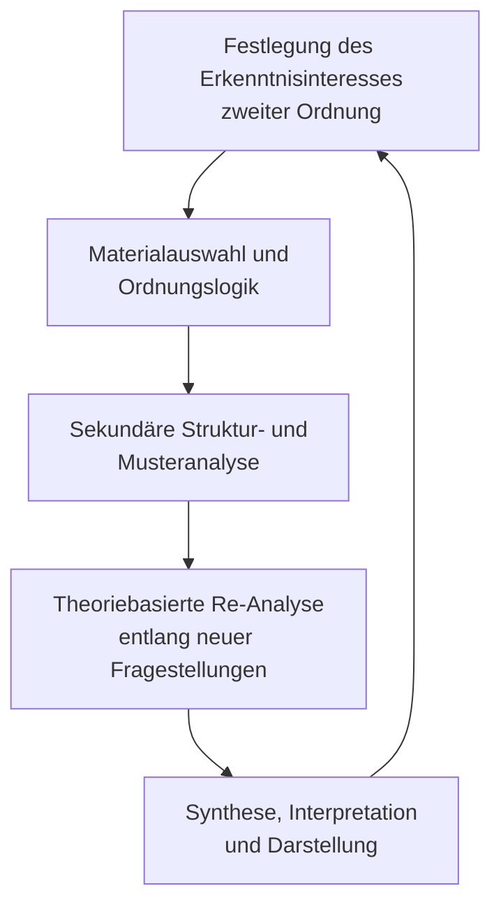

# Einleitung

Im Rahmen wissenschaftlicher Analyseverfahren hat sich zunehmend die Notwendigkeit herausgebildet, nicht nur empirische Phänomene, Texte oder Datenquellen selbst zum Gegenstand der Untersuchung zu machen, sondern auch die methodischen Operationen, mit denen diese Gegenstände analytisch erschlossen werden. Diese Verschiebung betrifft insbesondere Forschungskontexte, in denen Analyseprozesse nicht mehr ausschließlich von menschlichen Akteuren, sondern zunehmend auch von algorithmischen oder KI-basierten Systemen durchgeführt werden, wie etwa im Rahmen automatisierter Textauswertung, strukturierter Promptgenerierung oder maschinengestützter Kategorisierung.

Das hier verfolgte Erkenntnisinteresse richtet sich auf die konzeptionelle Fassung eines Analyseverfahrens, das sich nicht direkt auf Primärmaterial bezieht, sondern auf bereits vorliegende Analysehandlungen. Der Fokus verschiebt sich somit von der Beobachtung eines Gegenstandes zur Beobachtung der Analyse dieses Gegenstandes. Entscheidend ist dabei, dass diese Erstanalysen selbst als unterscheidbare, dokumentierte und rekonstruierbare Operationen vorliegen, d.h. unabhängig davon, ob sie von menschlichen, kollektiven oder maschinellen Instanzen durchgeführt wurden.

Die Bezeichnung Analyse zweiter Ordnung soll eine generalisierbare, theorieoffene und zugleich methodologisch präzise Kategorie bezeichnen, die erlaubt, Analyseprozesse selbst zum Gegenstand wissenschaftlicher Untersuchung zu machen. Dabei geht es nicht lediglich um eine metatheoretische Betrachtung im Sinne reflexiver Methodenkritik, sondern um die systematische Analyse von Struktur, Logik, epistemischen Voraussetzungen und heuristischen Entscheidungen innerhalb bereits durchgeführter Analysen. Die Analyse zweiter Ordnung zielt damit auf eine epistemologisch fundierte Erweiterung des wissenschaftlichen Analysebegriffs und damit anschlussfähig sowohl an qualitative wie quantitative Forschungstraditionen, an menschliche wie maschinengestützte Verfahren, an klassisch-hermeneutische wie digital-automatisierte Erkenntnissysteme.

# 1 Definition

Eine Analyse zweiter Ordnung ist ein wissenschaftlich-methodischer Analyseprozess, der nicht auf ein Untersuchungsobjekt selbst, sondern auf bereits vorliegende Analysen dieses Objekts zielt, um deren Struktur, Logik, Inhalte und epistemische Voraussetzungen systematisch zu rekonstruieren und zu befragen.

Im Unterschied zur Analyse erster Ordnung, bei der ein empirisches Phänomen, ein Text, ein Verhalten oder eine Datenreihe unmittelbar analysiert wird, nimmt die Analyse zweiter Ordnung die Analysehandlungen selbst zum Gegenstand. Sie versteht diese als dokumentierte, beobachtbare und systematisch untersuchbare Operationen, die einer erkenntnistheoretisch informierten Relektüre zugänglich gemacht werden.

Im Zentrum stehen dabei vier miteinander verschränkte Dimensionen:

1. Erstens die Strukturanalyse, die nach den methodischen Schritten, Kategorien und Heuristiken fragt, welche der Erstanalyse zugrunde liegen.
2. Zweitens die Logikprüfung, die auf Konsistenz, Nachvollziehbarkeit und Argumentationsführung der Analyseprozesse zielt.
3. Drittens die epistemische Rahmung, in der theoretische Prämissen, Begriffsverwendungen und analytische Perspektiven rekonstruiert und kritisch befragt werden.
4. Viertens die inhaltlich-musterbezogene Relektüre, in der die Ergebnisse der Erstanalyse, bspw. in Form von Clustern, Typologien oder kategorialen Verdichtungen, selbst erneut analysiert werden, um übergreifende Strukturen, latente Differenzen oder theoriegenerierende Muster sichtbar zu machen.

Die Analyse zweiter Ordnung kann auf Analysen unterschiedlicher Herkunft angewendet werden, unabhängig davon, ob diese von Einzelpersonen, Forschungsteams oder KI-Systemen durchgeführt wurden. Ihre methodische Relevanz zeigt sich insbesondere in Forschungskontexten, die versioniert, rekursiv oder automatisiert angelegt sind und in denen Analyseprozesse selbst dokumentiert, transformiert und reflektiert werden können.

In ihrem wissenschaftlichen Anspruch überschreitet die Analyse zweiter Ordnung bloße Metareflexion, indem sie analytisch kontrolliert jene Operationen sichtbar macht, aus denen wissenschaftliche Erkenntnis selbst hervorgeht. Ihr Wert liegt in der Möglichkeit zur theoriegeleiteten Synthese, zur methodischen Transparenz sowie zur Eröffnung eines strukturierten metaepistemischen Raums innerhalb erkenntnisorientierter Forschung.

# 2 Herleitung

Die folgende Herleitung zielt darauf, den Begriff „Analyse zweiter Ordnung“ sowohl begriffsgeschichtlich als auch methodologisch in seinen wissenschaftlichen Kontext einzuordnen. Ausgangspunkt ist die systemtheoretische Unterscheidung zwischen erster und zweiter Ordnung, wie sie insbesondere bei Heinz von Foerster und Niklas Luhmann entwickelt wurde. Diese Unterscheidung wird im vorliegenden Konzept nicht nur metaphorisch übernommen, sondern funktional weitergeführt: Die Analyse zweiter Ordnung bezeichnet eine wissenschaftliche Operation, die sich nicht auf ein empirisches Objekt, sondern auf dessen Analyse bezieht, einschließlich der darin wirksam gewordenen Unterscheidungen, Kategorien und heuristischen Strukturen.

Im weiteren Verlauf dieser Herleitung werden verschiedene theoretische Bezugspunkte herausgearbeitet, um die begriffliche Fundierung und methodische Reichweite der Analyse zweiter Ordnung zu klären. Dabei werden systemtheoretische Ursprünge, erkenntnistheoretische Grundlagen sowie angrenzende Analyseformate (z. B. Metaanalyse, Exzerption, KI-gestützte Verfahren) differenziert diskutiert und voneinander abgegrenzt. Ziel ist es, das Konzept sowohl theoretisch zu verankern als auch in seiner praktischen Anwendbarkeit nachvollziehbar zu machen.

## 2.1 Herkunft: Beobachtung zweiter Ordnung

Der Begriff der „zweiten Ordnung“ hat seine theoretische Herkunft in der Systemtheorie, insbesondere in der Kybernetik zweiter Ordnung bei Heinz von Foerster (1981) und später in der soziologischen Systemtheorie bei Niklas Luhmann (1990). Beide Autoren haben unabhängig voneinander, in methodischer und epistemologischer Anschlussfähigkeit, den Begriff der Beobachtung zweiter Ordnung entwickelt, um auf ein spezifisches Reflexionsniveau innerhalb systemischer Operationen aufmerksam zu machen.

Bei Heinz von Foerster findet sich die Unterscheidung im Rahmen seiner kybernetischen Überlegungen zur Selbstreferenz und zur Beobachterabhängigkeit von Erkenntnis. Während die Kybernetik erster Ordnung sich mit beobachteten Systemen befasst, also mit der Steuerung, Regelung und Rückkopplung innerhalb technischer oder biologischer Systeme, beschäftigt sich die Kybernetik zweiter Ordnung mit Systemen, die sich selbst beobachten, insbesondere mit Beobachtern, die andere Beobachter beobachten. Erkenntnis wird dadurch nicht mehr als Abbildung von Welt, sondern als operationale Konstruktion eines Beobachters innerhalb eines Systems beschrieben (vgl. Foerster, 1981, S. 255 ff.).

Niklas Luhmann greift diesen Begriff auf und überführt ihn in seine Gesellschaftstheorie. Beobachtungen sind in seiner Theorie grundlegend operative Akte sozialer Systeme, die Unterscheidungen treffen und bezeichnen. Eine Beobachtung erster Ordnung beschreibt demnach eine Unterscheidung zwischen einem untersuchten Phänomen und dem, was dieses nicht ist, in etwa: *Dies ist ein Interviewtext* (nicht eine Zahlentabelle). Eine Beobachtung zweiter Ordnung richtet sich dagegen auf diese Unterscheidung selbst, also auf die Art, wie etwas beobachtet und unterschieden wurde: *Warum wurde dieser Text als Interviewtext und nicht als Fallbeschreibung gelesen? Welche Kategorien, welche Dispositive, welche impliziten Prämissen steuern diese Unterscheidung?* (vgl. Luhmann, 1990, S. 15–18).

Diese Differenz ist erkenntnistheoretisch von erheblicher Bedeutung. Denn sie verschiebt den Fokus wissenschaftlicher Erkenntnis: von der Frage *Was ist das?* zur Frage *Wie kommt es, dass wir es so sehen?* Die zweite Ordnung macht damit die Erkenntnisoperation selbst zum Gegenstand wissenschaftlicher Reflexion und nicht bloß das Ergebnis. Mit dieser Verschiebung wird so möglich, auch die Struktur wissenschaftlicher Beobachtungen, ihre impliziten Theorien, Begriffe, Wertannahmen und Auswahlmechanismen systematisch zu untersuchen. Hier entsteht ein Raum der Meta-Erkenntnis, der insbesondere dort notwendig wird, wo Beobachtungen (und in unserem Fall: Analysen) nicht neutral, sondern kontingent, kontextabhängig und methodengeleitet erfolgen.

Diese Struktur lässt sich mit hoher theoretischer Präzision auf wissenschaftliches Analysieren übertragen. In der Analyse erster Ordnung wird ein Objekt, wie ein empirischer Text, eine Interviewpassage, ein Datensatz oder ein beobachtetes Verhalten, auf ein Erkenntnisinteresse hin untersucht. Die verwendeten Kategorien, Methoden oder Codierungen werden dabei oft als selbstverständlich vorausgesetzt oder nur am Rand thematisiert. Die Analyse zweiter Ordnung hingegen thematisiert genau diese Voraussetzungen: *Welche methodischen Entscheidungen wurden getroffen? Welche theoretischen Begriffe wurden implizit verwendet? Wie wurde der Gegenstand konstruiert?*

Die Analyse zweiter Ordnung übernimmt damit strukturell die Funktion der Beobachtung zweiter Ordnung: Sie beobachtet Analysehandlungen und fragt danach, wie diese selbst operieren: epistemisch, methodisch, heuristisch. Damit leistet sie einen Beitrag zur Reflexivierung wissenschaftlicher Praxis, der in modernen, komplexen Forschungskontexten nicht nur optional, sondern notwendig ist.

Sie schafft die methodologische Grundlage für jene Forschungssituationen, in denen sich nicht mehr nur das Was, sondern das Wie der Erkenntnis in den Mittelpunkt der Analyse verschiebt.

## 2.2 Abgrenzungen

Die Analyse zweiter Ordnung steht in einem Spannungsverhältnis zu mehreren etablierten wissenschaftlichen Analyseformen. Sie berührt Elemente der Metaanalyse, der Metasynthese, der methodenkritischen Reflexion und der Exzerption und übersteigt diese sowohl in ihrer erkenntnistheoretischen Zielrichtung als auch in ihrer systematischen Tiefe. Eine präzise Abgrenzung ist notwendig, um ihren methodologischen Eigenwert sichtbar zu machen.

Im Gegensatz zur klassischen Metaanalyse, die primär in der quantitativen Forschung verortet ist und auf die statistische Aggregation von Ergebnissen mehrerer empirischer Studien zielt (vgl. Borenstein et al., 2009), bezieht sich die Analyse zweiter Ordnung nicht lediglich auf eine Ergebniszusammenfassung. Zwar können auch hier verschiedene Analysen zu einem Thema oder einer Fragestellung zusammengeführt werden, doch geschieht dies nicht durch rein numerische Verfahren, sondern durch eine theoriebasierte und reflexive Relektüre der jeweils vorliegenden Analysen, inklusive ihrer methodischen Konstruktion, argumentativen Struktur und kontextuellen Einbettung.

Auch die qualitative Metasynthese (vgl. Sandelowski & Barroso, 2007), die eine theoriebildende Integration mehrerer qualitativer Studien verfolgt, unterscheidet sich fundamental. Zwar setzt auch die Analyse zweiter Ordnung an existierenden Analysen an, doch sie erweitert den Zugriff um eine unterscheidungsbasierte Strukturbetrachtung: Sie analysiert nicht nur, *was* in den vorliegenden Studien gesagt wurde, sondern *wie* dies strukturiert, interpretiert, kontextualisiert und methodisch generiert wurde und verbindet diese Zugriffe mit einer erneuten, forschungsfragengeleiteten inhaltlichen Untersuchung.

Denn die Analyse zweiter Ordnung erschöpft sich keineswegs in der Betrachtung von Verfahren oder Kategorien. Vielmehr gewinnt sie dann ihren heuristischen und wissenschaftlichen Wert, wenn eine Vielzahl von Analysen erster Ordnung zunächst entlang eines vorher definierten Ordnungskriteriums geclustert wird bspw. thematisch, theoretisch oder diskursiv, und anschließend entlang neuer oder vertiefter Forschungsfragen erneut analysiert wird. In diesem Schritt werden die inhaltlichen Ergebnisse der Erstanalysen nicht nur gesammelt oder paraphrasiert, sondern im Lichte neuer analytischer Raster systematisch ausgewertet. Die Analyse zweiter Ordnung erkennt in diesem Verfahren neue Muster, Differenzen, semantische Knotenpunkte oder Leerstellen, die in der Erstanalyse noch nicht sichtbar waren, weil dort die Erkenntnisperspektive eine andere war. 

Diese Fähigkeit zur inhaltlichen Neuerschließung durch strukturierte Relektüre macht die Analyse zweiter Ordnung zu mehr als einer bloß reflektierenden oder meta-analytischen Praxis. Sie wird zu einem eigenen wissenschaftlichen Erkenntnisverfahren, das sowohl methodenkritisch als auch theoriebildend operiert. Sie verbindet die reflexive Tiefenschärfe einer Beobachtung zweiter Ordnung mit der heuristischen Offenheit qualitativer Mustererkennung.

Gegenüber der Exzerption, die lediglich dokumentierend Inhalte sammelt, und der methodenkritischen Reflexion, die oft selbstbezüglich bleibt (z.B. in der Validierung eigener Kategoriensysteme), verfolgt die Analyse zweiter Ordnung einen doppelten Zugriff: Sie ist analytisch-rekonstruktiv auf der Prozessebene und inhaltsanalytisch-musterbildend auf der Ergebnissebene. 

_Tabelle 1: Typologische Matrix wissenschaftlicher Analyseformen_

| Kriterium                        | Exzerption                                | Metaanalyse                              | Metasynthese (qualitativ)                   | Methodenkritische Reflexion               | Analyse zweiter Ordnung                      |
|----------------------------------|--------------------------------------------|-------------------------------------------|---------------------------------------------|-------------------------------------------|------------------------------------------------|
| **Primäres Erkenntnisobjekt**    | Inhalte aus Quellen                        | Ergebnisse quantitativer Studien         | Ergebnisse qualitativer Studien            | eigene methodische Entscheidungen         | vorliegende Analysen (Prozesse und Ergebnisse) |
| **Zugriffsform**                 | dokumentierend                             | aggregierend (statistisch)               | interpretierend, theoriebildend            | kritisch-reflektierend                    | strukturierend, rekursiv, theoriebasiert        |
| **Analysefokus**                 | Inhalte (Zitate, Argumente)                | Effektgrößen, Signifikanzen              | Bedeutungsstrukturen, Konzepte             | Kategoriensysteme, Operationalisierungen  | Methodenlogik, Ergebnisstruktur, epistemische Muster |
| **Forschungslogik**              | vorbereitend, selektiv                     | hypothesenprüfend, quantitativ           | theoriebildend, interpretativ              | korrektiv, absichernd                     | reflexiv und heuristisch, theoriegenerierend     |
| **Ebene der Erkenntnisbildung**  | Text- oder Quellenebene                    | Ergebnis- und Studiendesign-Ebene        | Interpretationsebene                       | Methodenebene                             | Analyse- und Erkenntnisebene zweiter Ordnung     |
| **Theoriebezug**                 | schwach, implizit                          | moderat (je nach Fragestellung)          | stark (z.B. Grounded Theory)              | explizit theoriegeleitet                  | konstitutiv: Theorie als Analyseinstrument       |
| **Ergebnisform**                 | Exzerpt, Zitat, Kommentar                  | Effektzusammenfassung, Forest Plot       | Konzeptcluster, interpretative Typologien  | argumentativ-reflektierte Methodenkritik | neue Muster, Meta-Kategorien, epistemische Reentrys |
| **Reflexionsniveau**             | niedrig (Auswahlkriterium)                 | mittel (Biaskontrolle etc.)              | hoch (Interpretation der Interpretation)   | hoch (Selbstreflexion)                    | sehr hoch (Rekonstruktion epistemischer Operationen) |
| **Beispielhafte Anwendung**      | Literatursichtung                          | Medizinische Interventionsstudien        | Synthese qualitativer Interviewstudien     | Reflexion des eigenen Codierverfahrens   | Re-Analyse GPT-Cluster entlang theoretischer Raster |

Tabelle 1 zeigt, dass die Analyse zweiter Ordnung bildet eigene methodologische Kategorie eine, da sie: Reflexion und Theorieintegration systematisch verbindet, sowohl methodisch als auch inhaltlich strukturiert zugreift, rekursive Analysehandlungen sichtbar und auswertbar macht und für menschliche wie maschinelle Analysen offen ist.

Die Analyse zweiter Ordnung ist damit eine reflexive Re-Analyse strukturierter Einzelanalysen, die sowohl methodisch als auch inhaltlich neue Erkenntnis erzeugt. Sie unterscheidet sich von anderen Verfahren nicht allein durch ihren Gegenstand (die Analyse), sondern durch ihren erkenntnistheoretischen Zugriff, ihre rekursive Logik und ihre Fähigkeit zur theoriebasierten Mustererkennung. Damit ist sie weder bloße Meta- noch bloße Inhaltsanalyse, sondern eine eigenständige Form wissenschaftlicher Erkenntnisbildung zweiter Ordnung.

## 2.3 Anwendung

Die Analyse zweiter Ordnung ist grundsätzlich in solchen Forschungskontexten anwendbar, in denen bereits vorliegende Analysen als systematisch durchgeführte und dokumentierte Erkenntnishandlungen zugänglich sind. Dabei spielt hier zunächst keine Rolle, ob in diesem Fall qualitative oder quantitative Verfahren, hermeneutische, rekonstruktive oder deskriptive Analysen gehandelt werden. Entscheidend ist, dass eine erste analytische Operation stattgefunden hat, deren Struktur, Ergebnislogik und erkenntnistheoretische Rahmung sich beobachten und untersuchen lassen.

In klassischen Kontexten qualitativer Forschung kann dies etwa die erneute Analyse bereits codierter Interviewdaten sein. Die Analyse zweiter Ordnung würde sich in diesem Fall nicht auf das ursprüngliche Interview selbst richten, sondern auf die Art und Weise, wie bestimmte Textstellen codiert, welche Kategorien verwendet, welche theoretischen Begriffe aktiviert oder welche Argumentationsmuster reproduziert wurden. Ebenso lassen sich vergleichende Fallanalysen, Diskursanalysen, Grounded-Theory-Prozesse oder narrative Auswertungen im Rahmen einer Analyse zweiter Ordnung untersuchen,  insbesondere dann, wenn mehrere solcher Analysen in einem gemeinsamen Referenzraum (z.B. einer Forschungsgruppe, einem Themenfeld oder einer Untersuchungseinheit) stehen. 

Die Analyse zweiter Ordnung entfaltet dabei ihr Potenzial vor allem dann, wenn eine Vielzahl solcher Einzelanalysen entlang eines zuvor definierten Ordnungskriteriums, bspw. thematisch, methodisch oder diskursiv, geclustert und im Anschluss unter neuen, theoriebasierten Forschungsfragen einer erneuten Betrachtung unterzogen wird. Diese zweite Analyseebene ermöglicht sowohl die Identifikation wiederkehrender Muster und Unterschiede als auch die Sichtbarmachung epistemischer Voraussetzungsstrukturen, die in der Erstanalyse implizit geblieben sein mögen.

Diese grundlegende Anlage lässt sich methodologisch konsequent auf KI-basierte Analyseverfahren übertragen. Im spezifischen Fall der sogenannten KI-Analyse zweiter Ordnung richtet sich der Zugriff auf durch KI, insbesondere durch große Sprachmodelle wie GPT, erzeugte Einzelanalysen. Diese wurden in der Regel auf Grundlage zuvor formulierter Prompts und Fragestellungen durchgeführt und liegen als strukturierte, sprachlich ausgeformte Analyseausgaben vor. Die zweite Ordnung greift nun nicht auf die ursprüngliche Quelle (z.B. ein Textdokument), sondern auf diese KI-generierten Analysen zu und analysiert sie entweder hinsichtlich ihrer inhaltlichen Muster, ihrer sprachlichen Konstruktion, ihrer kategorialen Struktur oder ihrer epistemischen Orientierung.

Auch hier lassen sich mehrere Einzelanalysen zunächst clustern, etwa nach Themen, Textsorte oder Perspektive, und anschließend unter neuen Fragestellungen, d.h. etwa theoriebasierten Vergleichsrastern, erneut analysieren. So können Muster, Abweichungen, systematische Leerstellen oder emergente Strukturen identifiziert werden, die in der Erstanalyse nicht sichtbar waren. Darüber hinaus bietet die KI-Analyse zweiter Ordnung einen spezifischen Erkenntnisgewinn, der aus der Interaktion zwischen menschlicher Forschungslogik und maschineller Sprachgenerierung hervorgeht. Sie macht dadurch sichtbar, welche epistemischen Entscheidungen bereits im Prompting, im Modellverhalten oder in der Struktur der Antwort eingeschrieben sind und eröffnet damit einen reflexiven Raum über die erkenntnistheoretische Tragfähigkeit maschinell erzeugter Analysen selbst.

In dieser Form markiert die Analyse zweiter Ordnung nicht nur ein methodisches Verfahren, sondern eine eigene epistemologische Zugriffsweise auf die Bedingungen, Prozesse und Produkte wissenschaftlicher Erkenntnis.

## 2.4 Durchführung

Die Durchführung einer Analyse zweiter Ordnung erfordert eine methodisch kontrollierte Vorgehensweise, die sowohl die Rückbindung an ein präzises Erkenntnisinteresse als auch die systematische Strukturierung des Analyseprozesses selbst gewährleistet. Da sich die Analyse zweiter Ordnung nicht auf Primärdaten, sondern auf bereits vorliegende Analyseprozesse richtet, verschieben sich auch die Anforderungen an Materialbasis, Auswertungslogik und Reflexionsniveau. Die Operation zielt nicht auf die Beschreibung empirischer Phänomene, sondern auf die epistemische Rekonstruktion derjenigen Operationen, durch die solche Beschreibungen selbst zustande kommen.

_Abbildung 1: Schematischer Ablauf einer Analyse zweiter Ordnung (eig. Darstellung)_

Das Flussdiagramm (Abbildung 1) visualisiert die lineare Grundlogik der Analyse, erlaubt aber zugleich rekursive Erweiterungen. Die Rückkopplung von Schritt E zu A symbolisiert die zyklische Dynamik reflexiver Analyseverfahren: Erkenntnisse aus der Synthese können zur Präzisierung der Ausgangsfrage, zur Neukonfiguration des Analyseclusters oder zur Veränderung des theoretischen Rahmens führen. Auf diese Weise wird die Analyse zweiter Ordnung selbst zu einem iterativen Bestandteil wissenschaftlicher Erkenntnisprozesse. Je nach Erkenntnisinteresse kann das Verfahren linear, zyklisch oder netzwerkartig strukturiert sein. Die hier gewählte Darstellung markiert einen methodologischen Grundpfad, der adaptiv erweitert werden kann.

Die Analyse zweiter Ordnung lässt sich in fünf methodisch begründete Schritte gliedern. Diese sind nicht strikt linear, sondern können, je nach erkenntnistheoretischer Zielsetzung, so auch rekursiv oder iterativ angelegt sein.

1. **Präzisierung des Erkenntnisinteresses zweiter Ordnung**  
    Ausgangspunkt ist eine Fragestellung, die sich explizit nicht auf ein empirisches Objekt richtet, sondern auf eine Menge vorliegender Analysen erster Ordnung. Solche Fragestellungen können methodologischer Art sein (etwa: Welche heuristischen Muster strukturieren die Analysen?), theoriebezogen formuliert sein (z. B.: Wie wird ein Begriff wie „Lernen“ operationalisiert?), oder sich auf Differenzanalysen beziehen (z. B.: Welche erkenntnisleitenden Perspektiven lassen sich im Vergleich verschiedener Zugriffe rekonstruieren?). Das Erkenntnisinteresse legt den Bezugsrahmen sowie den Erkenntniswert der Analyse zweiter Ordnung fest und nicht das Untersuchungsmaterial selbst.
2. **Materialauswahl und explizite Ordnungslogik**  
    Ausgewählt wird eine Menge von Analysen erster Ordnung, die hinsichtlich ihrer Dokumentation, methodischen Anlage oder argumentativen Struktur eine Relektüre zulassen. Diese Analysen können aus wissenschaftlichen Publikationen, empirischen Forschungsberichten, KI-generierten Texten oder anderen Analyseartefakten stammen. Vergleichbarkeit ist dabei kein normativer Maßstab, sondern ein analytisches Kriterium unter mehreren. Entscheidend ist, dass eine transparente Ordnungslogik benannt wird, etwa nach Thema, Methode, Diskursposition, epistemischer Rahmung oder autorialer Herkunft. Die Clusterung ist dabei nicht deskriptiv, sondern heuristisch motiviert. Sie schafft die Voraussetzung für die Sichtbarmachung tieferliegender Muster.
3. **Struktur- und Musteranalyse der Erstanalysen**  
    Im dritten Schritt wird die Analyse erster Ordnung selbst zum Erkenntnisobjekt. Dabei werden typische Strukturmerkmale, epistemische Unterscheidungen, wiederkehrende Kategorien oder dominante Begriffe identifiziert. Ziel ist eine Sichtbarmachung der logischen, heuristischen und kategorialen Architektur der vorliegenden Analysen. Der Zugriff kann qualitativ-hermeneutisch (z. B. durch theoriegesteuerte Lektüre) oder systematisch-codierend erfolgen (z. B. durch inhaltliche Clusterung oder semi-formalisierte Kodierungen). Entscheidend ist, dass die Analyse nicht auf inhaltliche Exzerpte zielt, sondern auf die _Form epistemischer Operationen_.
4. **Theoriegeleitete Re-Analyse unter neuen Fragestellungen**  
    Aufbauend auf der strukturellen Relektüre erfolgt eine erneute Analyse entlang theoretisch präzisierter Perspektiven. Dabei werden latente Bedeutungsverschiebungen, inkonsistente Kategorienverwendungen, diskursive Leerstellen oder emergente Theorieansätze sichtbar. Dieser Schritt transformiert die Analyse zweiter Ordnung in eine erkenntnisgenerierende Methode: Die Analyse dient nicht bloß der Reflexion, sondern produziert neue Strukturen, durch die Erkenntnis gewonnen und rekonstruiert wird.
5. **Synthese, Interpretation und epistemische Darstellung**  
    Abschließend erfolgt eine theoriegeleitete Verdichtung der Befunde. Je nach Zielsetzung kann diese Synthese komparativ, typologisch, netzwerkartig oder modellbasiert angelegt sein. Möglich sind unter anderem: Metakategorien, epistemische Typen, Heuristiken zweiter Ordnung oder systemische Interdependenzmuster. In digitalen Kontexten (z. B. KI-gestützte Analysepfade) können zusätzlich versionierte Darstellungen erstellt werden, in etwa durch dokumentierte Promptverläufe, iterativ erzeugte Modifikationen oder differenziert annotierte Analyseverläufe. Ziel ist eine epistemisch rekonstruierbare Darstellung, die sowohl die Herkunft als auch die erkenntnistheoretische Qualität der Analyse zweiter Ordnung sichtbar macht.

Die Durchführung einer Analyse zweiter Ordnung setzt somit nicht nur methodische Klarheit, sondern auch eine explizite Trennung zwischen erster und zweiter Ordnung voraus. Diese Unterscheidung ist epistemologisch bedeutsam. Erst durch ihre methodische Trennung kann ihre theoretische Relation überhaupt sichtbar gemacht werden und damit auch der Beitrag, den eine Analyse zweiter Ordnung zur wissenschaftlichen Erkenntnisproduktion leistet.

# 3 Folgerungen

Aus der theoretischen Herleitung und methodischen Struktur der Analyse zweiter Ordnung ergeben sich mehrere grundlegende Folgerungen für die wissenschaftliche Praxis. Diese betreffen sowohl die methodologische Konzeption von Forschung als auch das epistemische Selbstverständnis wissenschaftlicher Erkenntnisprozesse.

- Analyse zweiter Ordnung ist reflexiv und relational.  
  Sie entsteht dort, wo nicht mehr das Untersuchungsobjekt selbst, sondern die Art und Weise seiner wissenschaftlichen Erschließung zum Gegenstand der Analyse wird. Damit verschiebt sich der Fokus vom empirischen Material auf die Struktur der Erkenntnisprozesse, die dieses Material erst als solches sichtbar gemacht haben. Reflexivität bedeutet hier nicht bloß Selbstbeobachtung, sondern eine systematische Rekonstruktion der Bedingungen, unter denen wissenschaftliche Aussagen zustande kommen.
- Sie ist unabhängig vom Analysemedium.  
  Die Analyse zweiter Ordnung ist nicht daran gebunden, wer oder was die Erstanalyse vorgenommen hat. Ob diese durch einen Menschen, ein KI-System, eine Forschungsgruppe oder ein automatisiertes Verfahren erzeugt wurde, ist für den Status der zweiten Ordnung unerheblich. Entscheidend ist allein, dass die Analysehandlungen dokumentiert, zugänglich und rekonstruktionsfähig sind. Nur dann können sie zum Gegenstand einer zweiten Analyse werden.
- Sie erfordert epistemische Sensibilität.  
  Die Analyse zweiter Ordnung macht sichtbar, welche Unterscheidungen, Kategorien und Heuristiken einer Erstanalyse zugrunde liegen. Sie fragt danach, welche Begriffe dominant, welche Perspektiven ausgeschlossen und welche impliziten Annahmen wirksam geworden sind. Dies erfordert eine besondere Aufmerksamkeit gegenüber den epistemischen Operationen, die Analysen strukturieren, also etwa gegenüber dem Verhältnis von Theorie und Empirie, von Operationalisierung und Interpretation, von Codierung und Bedeutungszuweisung.
- Sie schafft neue Erkenntnismöglichkeiten durch Rekursion.  
  Indem bereits vorhandene Analysen unter neuen theoretischen Fragestellungen erneut betrachtet werden, können Erkenntnisse generiert werden, die in der ursprünglichen Analyse nicht sichtbar waren. Dies betrifft insbesondere Musterbildungen, Leerstellen, semantische Konvergenzen oder diskursive Spannungen, die erst im Vergleich, in der Clusterung oder in der rekursiven Durcharbeitung verschiedener Analysen hervortreten. Die Analyse zweiter Ordnung ist somit nicht bloße Rückschau, sondern ein produktiver epistemischer Zugriff mit eigener heuristischer Kraft.
- Sie verändert das Verhältnis von Methode und Erkenntnis.  
  Die klassische Vorstellung, dass Methoden neutrale Werkzeuge zur Erkenntnisgewinnung sind, wird durch die Analyse zweiter Ordnung relativiert. Denn sie zeigt, dass jede Analyse bereits eine theoretisch gerahmte, methodisch strukturierte und epistemisch vorausgesetzte Operation darstellt. Die Analyse zweiter Ordnung macht diese Voraussetzungen sichtbar und kann dadurch auch zur methodologischen Weiterentwicklung beitragen.
- Sie ist anschlussfähig an versionierte, rekursive und kollaborative Forschungspraxis.  
  Insbesondere im Kontext digitaler Wissenschaft, etwa bei KI-gestützten Analysen oder in versionierten Analyseprozessen, eröffnet die Analyse zweiter Ordnung die Möglichkeit, Prozesse nicht nur transparent zu dokumentieren, sondern strukturell zu reflektieren. Sie erlaubt es, Forschung nicht nur als linearen, sondern als zirkulären, iterativen Prozess zu verstehen, in dem Analyseprodukte selbst wieder zum Ausgangspunkt neuer Erkenntnisoperationen werden können.

Diese Folgerungen machen deutlich, dass die Analyse zweiter Ordnung nicht nur eine Technik oder eine Methode darstellt, sondern eine epistemologische Haltung. Sie verschiebt die Aufmerksamkeit von Ergebnissen auf Prozesse, von Aussagen auf Operationen, von Daten auf Beobachtung und eröffnet damit neue Räume wissenschaftlicher Erkenntnisbildung.

# 4 Implikationen

Die Einführung des Begriffs „Analyse zweiter Ordnung“ hat weitreichende Implikationen für die wissenschaftliche Praxis. Sie betrifft nicht nur die Präzisierung analytischer Verfahren, sondern auch die Struktur epistemischer Prozesse, das Design von Forschungsarchitekturen sowie das Verhältnis von Methode und Erkenntnis in einer zunehmend digitalisierten Forschungsumgebung.

- Begriffliche Präzisierung  
  Der Begriff Analyse zweiter Ordnung erlaubt die systematische Benennung jener Analyseprozesse, die nicht auf Phänomene oder Primärdaten, sondern auf bestehende Analysehandlungen zielen. Er macht damit eine bislang weitgehend implizit gebliebene Ebene wissenschaftlicher Erkenntnis explizit beschreibbar. Diese begriffliche Klärung schafft eine Anschlussfähigkeit an bestehende Theorietraditionen, etwa in der Systemtheorie, der Wissenssoziologie oder der reflexiven Methodologie, ohne sich auf bestimmte Medienformen wie KI oder bestimmte disziplinäre Zugänge zu beschränken.
- Transparente und versionierte Forschungspraxis  
  Die Möglichkeit, Analyseprozesse selbst zum Gegenstand der Analyse zu machen, setzt voraus, dass diese Prozesse dokumentiert, rekonstruierbar und in ihrer Entstehungslogik nachvollziehbar sind. Damit rückt die Bedeutung versionierter Systeme, offener Protokolle und nachvollziehbarer Methodendokumentation ins Zentrum wissenschaftlicher Praxis. Die Analyse zweiter Ordnung operiert nicht nur mit Daten, sondern mit Prozessen und verlangt daher eine Forschungskultur, die epistemische Entscheidungen sichtbar macht und zur reflexiven Auseinandersetzung einlädt.
- Förderung methodischer Innovationsfähigkeit  
  Durch die Analyse bestehender Analysehandlungen wird nicht nur deren Struktur sichtbar, sondern auch deren Begrenztheit. Dies eröffnet den Raum für methodologische Innovation: neue Kategoriensysteme, hybride Analyseverfahren, rekursive Auswertungsformate oder integrative Zugriffsmethoden entstehen häufig erst dann, wenn bestehende Verfahren systematisch beobachtet und auf ihre epistemische Leistungsfähigkeit hin befragt werden. Die Analyse zweiter Ordnung wird damit zu einem Instrument der methodischen Weiterentwicklung.
- Erweiterung epistemischer Perspektiven  
  Indem nicht nur Objekte, sondern Beobachtungs- und Analyseoperationen selbst zum Gegenstand werden, verschiebt sich die wissenschaftliche Perspektive hin zu einer reflexiven Epistemologie. Forschung wird nicht länger als bloß abbildende, sondern als beobachtende und unterscheidende Praxis verstanden. Diese Verschiebung ermöglicht es, die Bedingungen von Erkenntnis systematisch mit in den Blick zu nehmenund trägt damit zur Selbstaufklärung der Wissenschaft bei.
- Anschlussfähigkeit an digitale Wissenschaft  
  Besonders im Kontext digitaler Wissenschaft, etwa bei der Nutzung von KI-Systemen, kollaborativen Plattformen oder versionierten Textumgebungen, wird die Analyse zweiter Ordnung operationalisierbar. Die digitale Verfügbarkeit von Analysepfaden, Promptstrukturen, Codierentscheidungen oder Modellantworten erlaubt erstmals eine systematische Beobachtung von Analyseoperationen in Echtzeit. Damit wird die Analyse zweiter Ordnung nicht nur theoretisch möglich, sondern praktisch umsetzbarund damit zu einem zentralen Werkzeug reflexiver Wissenschaftspraxis im digitalen Raum.
- Beitrag zur Wissenschaftstheorie  
  Schließlich eröffnet die Analyse zweiter Ordnung eine Perspektive auf Wissenschaft, die nicht auf Objektivität im Sinne von Abbildbarkeit zielt, sondern auf die strukturelle Rückbindung wissenschaftlicher Aussagen an ihre epistemischen Bedingungen. Sie operiert im Raum zwischen Erkenntnis und Erkenntnisrahmung, zwischen Analyse und Beobachtung, zwischen Methode und Reflexion und leistet so einen originären Beitrag zur wissenschaftstheoretischen Fundierung einer reflexiven, offenen und selbstbeobachtungsfähigen Forschungskultur.

Die Implikationen der Analyse zweiter Ordnung reichen damit weit über eine methodische Erweiterung hinaus: Sie betreffen die Grundstruktur von Erkenntnisprozessen in einer Zeit, in der Wissenschaft zunehmend als digitale, rekursive und kollaborative Praxis organisiert ist.

# 5 Kritik

Wie jeder neue methodologische Begriff steht auch die Analyse zweiter Ordnung vor der Herausforderung, sich gegen bestehende Konzepte abzugrenzen, in bestehende Diskurse einzuordnen und ihre theoretische Notwendigkeit plausibel zu machen. Im Folgenden werden zentrale Kritikpunkte formuliert und mögliche Entgegnungen aus Sicht einer reflexiv informierten Methodologie skizziert.

Ein naheliegender Einwand könnte die Gefahr begrifflicher Redundanz oder Vagheit adressieren. Ohne präzise Kontextualisierung könnte der Ausdruck „Analyse zweiter Ordnung“ als bloße Umschreibung bestehender Reflexions- oder Metaanalyseformen erscheinen, insbesondere wenn keine klare Abgrenzung zu etablierten Begriffen erfolgt. Diese Gefahr ist real, lässt sich jedoch durch systematische Herleitung und definitorische Schärfung vermeiden. Die Analyse zweiter Ordnung unterscheidet sich begrifflich und logisch von verwandten Konzepten durch ihren expliziten Fokus auf Analysehandlungen selbst, unabhängig von deren Medium, sowie durch die doppelte Strukturierung auf Prozess- und Ergebnisebene. Ihre systemtheoretische Verankerung (Beobachtung zweiter Ordnung) legitimiert eine eigene kategoriale Position im wissenschaftlichen Methodensystem.

Ein zweiter Kritikpunkt betrifft möglicherweise die methodologische Breite. Aufgrund ihrer universellen Anwendbarkeit auf verschiedenste Erstanalysen, d.h. qualitativ, quantitativ, KI-gestützt, hermeneutisch, besteht die Gefahr, dass der Begriff analytisch ausfranst oder inkonsistent verwendet wird. Dies betrifft insbesondere Arbeiten, die sich nicht explizit auf eine erkenntnistheoretische Rahmung beziehen und dadurch eine Beliebigkeit in der Anwendung riskieren. Doch genau hier liegt die Stärke des Konzepts. Die Analyse zweiter Ordnung ist nicht als universelles Analyseinstrument zu verstehen, sondern als analytische Haltung mit methodischer Struktur. Ihre Breite ist kein Mangel, sondern Ausdruck einer erkenntnistheoretischen Generalisierbarkeit. Die Lösung liegt in einer kontextabhängigen Präzisierung der jeweiligen Anwendungsform, etwa durch Begriffsvarianten wie „qualitative Analyse zweiter Ordnung“, „algorithmische Analyse zweiter Ordnung“ oder „KI-gestützte Analyse zweiter Ordnung“. Entscheidend ist die explizite Rahmung und Offenlegung der analytischen Zugriffsweise.

Ein weiterer kritischer Punkt bezieht sich auf die mögliche Verwechslung mit bekannten Verfahren wie der Metaanalyse oder der qualitativen Metasynthese. Beide beziehen sich ebenfalls auf bereits bestehende Studien oder Analysen und könnten daher fälschlich mit der Analyse zweiter Ordnung gleichgesetzt werden. Besonders die inhaltliche Relektüre in Clustern kann als funktional ähnlich erscheinen. Tatsächlich existieren strukturelle Überschneidungen, doch sie betreffen die Zugriffsebene, nicht die epistemische Struktur. Während Metaanalysen auf die Aggregation von Resultaten und Metasynthesen auf die interpretative Integration qualitativer Konzepte zielen, fokussiert die Analyse zweiter Ordnung die Operation selbst. Sie fragt, wie analysiert wurde, mit welchen epistemischen Mitteln, unter welchen theoretischen Prämissen und rekonstruiert daraus die erkenntnisleitenden Bewegungen der Erstanalysen. In dieser Hinsicht ist sie nicht reduzierbar auf Ergebnisintegration, sondern explizit reflexiv und prozessual.

Ein häufig formulierter Einwand könnte sich auf die Frage der praktischen Umsetzung beziehen. Wie lässt sich eine Analyse zweiter Ordnung konkret durchführen, ohne in beliebige Interpretationsbewegungen oder redundante Relektüren abzugleiten? Diese Herausforderung ist methodologisch ernst zu nehmen, verlangt aber keine Zurückweisung des Konzepts, sondern dessen präzise Ausgestaltung. In Kapitel 2.4 wurde ein strukturiertes Durchführungsschema formuliert, das eine analytisch kontrollierte Anwendung gewährleistet, inklusive Ordnungskriterium, Re-Analyse entlang forschungsleitender Fragen und theoriegeleiteter Synthese. Zudem lassen sich Anwendungsstandards, wie sie in qualitativer Forschung (z. B. Audit Trail) oder digitaler Wissenschaft (z. B. versionierte Promptanalysen) existieren, produktiv integrieren.

Schließlich könnte eingewandt werden, dass eine Analyse der Analyse Gefahr läuft, sich in epistemischer Selbstbezüglichkeit zu verlierenin  durch eine unendliche Regressstruktur: Wer analysiert die zweite Ordnung? Wo endet die Reflexion? Diese Sorge betrifft jede reflexive Wissenschaft und ist Ausdruck epistemischer Verantwortung, nicht methodologischer Beliebigkeit. Die Analyse zweiter Ordnung versteht sich nicht als unendliche Reflexionsspirale, sondern als kontrollierte Rekursion innerhalb erkenntnisleitender Rahmenbedingungen. Ihre Zielrichtung ist nicht Zirkularität, sondern strukturelle Transparenz: durch explizite Unterscheidungen, benennbare Ordnungen und theoriegeleitete Grenzziehungen. In dieser Hinsicht ist sie nicht regressiv, sondern erkenntniskonstitutiv.

In der Summe zeigt sich, dass die Kritik an der Analyse zweiter Ordnung ernst zu nehmen ist. Nicht als Infragestellung ihres Konzepts, sondern als Einladung zu präziser Ausarbeitung, methodischer Differenzierung und kontrollierter Anwendung. In dieser produktiven Spannung zwischen Kritik und Entgegnung wird der eigentliche erkenntnistheoretische Wert des Begriffs sichtbar.

# 6 Zusammenfassung

Die Analyse zweiter Ordnung bezeichnet einen wissenschaftlich-methodischen Analyseprozess, der sich nicht auf ein Untersuchungsobjekt selbst, sondern auf bereits vorliegende Analysen dieses Objekts richtet. Ziel ist es, die Struktur, Prämissen, Kategorien und erkenntnistheoretischen Voraussetzungen dieser Erstanalysen systematisch zu untersuchen. Der Begriff geht auf systemtheoretische Unterscheidungen der Beobachtung zweiter Ordnung zurück und erweitert diese um eine methodologisch kontrollierte und inhaltlich produktive Form wissenschaftlicher Re-Analyse. 

Die Analyse zweiter Ordnung ist unabhängig vom Medium der Erstanalyse. Sie kann auf menschlich oder maschinell erzeugte Analysen gleichermaßen angewendet werden, sofern diese in hinreichend dokumentierter Form vorliegen. Sie operiert entlang definierter Ordnungskriterien, ermöglicht eine theoriebasierte Relektüre vorhandener Auswertungen und eröffnet dadurch neue Erkenntnismöglichkeiten durch Mustererkennung, Differenzanalyse oder epistemische Kontextualisierung. 

In ihrer methodischen Ausgestaltung ist sie theorieoffen, reflexiv angelegt und anschlussfähig an qualitative, quantitative und hybride Forschungstraditionen. Besonders im Kontext digitaler, versionierter und rekursiver Wissenschaftspraxis entfaltet sie ihre volle Wirksamkeitin  in der KI-Analyse zweiter Ordnung, bei der GPT-gestützte Erstanalysen zum Ausgangspunkt einer strukturierten Meta-Auswertung werden. 

Als eigenständige Kategorie wissenschaftlicher Analyse leistet die Analyse zweiter Ordnung nicht nur einen Beitrag zur Differenzierung des Methodenkanons, sondern auch zur Stärkung einer transparenten, theoriegeleiteten und erkenntniskritischen Forschungspraxis.

# Quelle(n)

- Borenstein, M., Hedges, L. V., Higgins, J. P. T., & Rothstein, H. R. (2009). *Introduction to meta-analysis*. Chichester: Wiley.
- Denzin, N. K., & Lincoln, Y. S. (Eds.). (2018). *The SAGE handbook of qualitative research* (5th ed.). Thousand Oaks, CA: SAGE.
- Foerster, H. v. (1981). *Observing systems*. Seaside: Intersystems Publications.
- Glaser, B. G., & Strauss, A. L. (1967). *The discovery of grounded theory: Strategies for qualitative research.* Chicago: Aldine.
- Kuckartz, U. (2016). *Qualitative Inhaltsanalyse: Methoden, Praxis, Computerunterstützung.* Weinheim: Beltz Juventa.
- Luhmann, N. (1990). *Die Wissenschaft der Gesellschaft*. Frankfurt a. M.: Suhrkamp.
- Mayring, P. (2015). *Qualitative Inhaltsanalyse: Grundlagen und Techniken* (12. Aufl.). Weinheim: Beltz.
- Schütze, F. (1983). Biographieforschung und narratives Interview. *Neue Praxis*, 13(3), 283–293.
