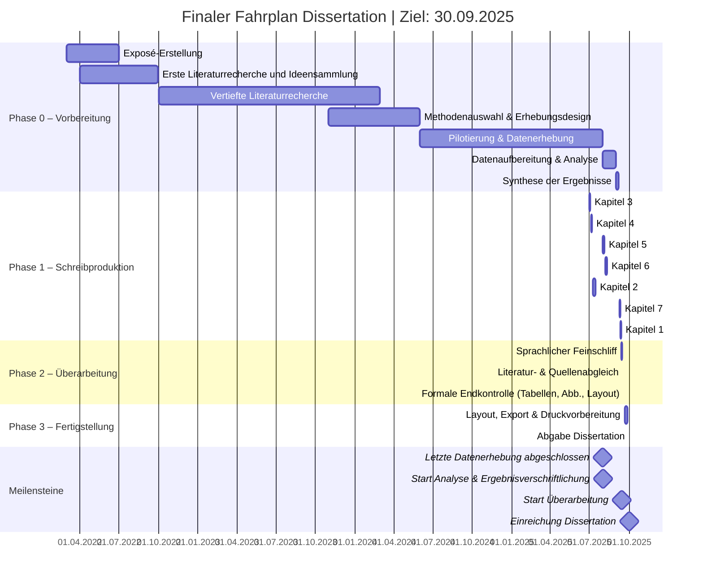

# Zeitplan Dissertation

(Stand: 112219jul25)

# Analyse und Fortschrittsbewertung Dissertation

## 1 Gesamtbewertung der Timeline

Die Vorbereitungsphase ist abgeschlossen, die Datenerhebung steht kurz vor dem Abschluss. Erste Kapitelentwürfe liegen vor, parallel wurden zentrale Bausteine in Git versioniert. Die Gesamtstruktur bleibt tragfähig, erfordert jedoch eine moderate zeitliche Streckung der Analyse- und Schreibphase. Daraus ergibt sich eine gesicherte Planungsperspektive bis September 2025. Die enge Verzahnung von Analyse, Synthese und Schreibarbeit bleibt ein kritischer Punkt, ist aber durch vorhandene Vorarbeiten und systematische Dokumentation gut vorbereitet.

## 2 Vorbereitung (01.11.2023 – 31.03.2024) – *Abgeschlossen*

### 2.1 Rückblick

Die Vorbereitung umfasste Literaturrecherche, methodische Klärung und Designentwicklung. Alle Teilprozesse wurden fristgerecht und vollständig abgeschlossen.

### 2.2 Bewertung

Die Phase verlief planmäßig und lieferte eine fundierte Basis. Risiken wurden minimiert, Übergänge zu Folgeschritten effektiv gestaltet.

## 3 Datenerhebung (01.04.2024 – 31.12.2024) – *Kurz vor Abschluss*

### 3.1 Status

Die Erhebungsinstrumente wurden implementiert und mehrfach angepasst. Fragebögen und Eye-Tracking-Verfahren sind nahezu vollständig durchgeführt. Daten liegen in konsolidierter Rohfassung vor.

### 3.2 Risiken

- Letzte Plausibilitätsprüfungen und Datenformatierungen stehen noch aus.
- Vereinzelte technische Unschärfen in Export-Formaten könnten zu Nacharbeiten führen.

### 3.3 Maßnahmen

- [ ] Vollständigkeitsprüfung und Datensicherung finalisieren.
- [ ] Überführung der Daten in Analyseumgebungen vorbereiten (R, MAXQDA, Zotero-Sync).

## 4 Datenanalyse (01.01.2025 – 30.06.2025)

### 4.1 Einschätzung

Die Phase bleibt ambitioniert, ist aber durch vorbereitende Vorarbeiten gut vorbereitet. Sowohl qualitative als auch quantitative Analysepfade sind methodisch geklärt.

### 4.2 Risiken

- Technische Barrieren bei der Zusammenführung verschiedener Datenquellen.
- Überschneidungen mit Schreibprozess bergen Konfliktpotenzial für Zeitmanagement.

### 4.3 Maßnahmen

- [ ] Kodierung qualitativ-interpretativer Daten vorziehen.
- [ ] Frühzeitige Identifikation statistisch signifikanter Muster.
- [ ] Abgleich mit theoretischem Bezugsrahmen laufend dokumentieren.

## 5 Schreibphase (01.05.2025 – 31.08.2025)

### 5.1 Einschätzung

Die Kapitelstruktur ist vollständig, mehrere Teile liegen als Vorfassungen vor (Kap. 3, 4, 5). Die Struktur ist so angelegt, dass Theorie, Methode und Ergebnisse iterativ ergänzt werden können.

### 5.2 Risiken

- Spät erkannte Inkonsistenzen zwischen Analyseergebnissen und Argumentation.
- Zeitdruck bei formaler Konsolidierung.

### 5.3 Maßnahmen

- [ ] Kapitel mit geringerer Analyseabhängigkeit (z.B. Methodik, Theorie) priorisieren.
- [ ] Fortlaufende Kapitelversionierung über Git sichern.
- [ ] Engmaschige Rückkopplung mit Betreuer in kritischen Passagen ermöglichen.

## 6 Abgabe und Disputation (01.09.2025 – 30.09.2025)

### 6.1 Einschätzung

Der Zeitraum nach Schreibschluss ist bewusst kompakt, aber durch hohe Vorbereitungsintensität tragfähig. Die Git-Dokumentation ermöglicht gezielte Recherchen zu allen Arbeitsschritten.

### 6.2 Risiken

- Zeitliche Engführung zwischen Layout, Einreichung und Disputationstermin.
- Inhaltliche Rückfragen aus dem Begutachtungsprozess könnten Nachjustierung erfordern.

### 6.3 Maßnahmen

- [ ] Proben der Disputation mit Fokus auf Argumentationskritik vorbereiten.
- [ ] Backup-Szenario für kurzfristige Anpassungen bereitstellen.

## 7 Zusammenfassung der Bewertung

| Phase                 | Zeitraum               | Bewertung                                                   |
|----------------------|------------------------|-------------------------------------------------------------|
| Vorbereitung          | 01.11.2023 – 31.03.2024 | Abgeschlossen, fundierte Basis geschaffen.                  |
| Datenerhebung         | 01.04.2024 – 31.12.2024 | Kurz vor Abschluss, konsolidierte Datenbasis vorhanden.     |
| Datenanalyse          | 01.01.2025 – 30.06.2025 | Ambitioniert, aber systematisch vorbereitet.                |
| Schreibphase          | 01.05.2025 – 31.08.2025 | Realistisch, durch Vorarbeiten und Versionierung abgesichert.|
| Abgabe & Disputation  | 01.09.2025 – 30.09.2025 | Kompakt, aber durch Planungsreserven tragfähig.             |

## 8 Empfehlungen

1. **Übergänge aktiv sichern:** Datenübertragung, Analyse und Schreiben müssen eng abgestimmt sein.
2. **Zeitrealismus behalten:** Keine weiteren Verdichtungen im Kalender zulassen – Puffer bleiben entscheidend.
3. **Iterativ dokumentieren:** Erkenntnisschritte laufend versionieren und reflektieren.
4. **Disputation antizipieren:** Wiederholbare Argumentationsketten vorbereiten, mögliche Angriffspunkte identifizieren.
5. **Erfolgssicherung durch Transparenz:** Git bleibt zentrales Kontroll- und Reflexionsinstrument bis zur Abgabe.
