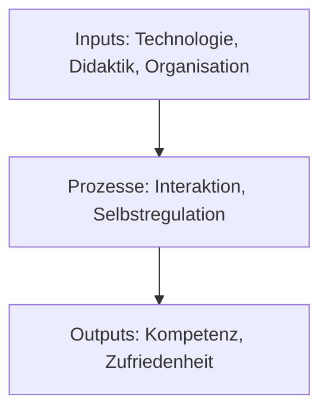

Die Methodik der Forschungsarbeit verfolgt einen interdisziplinären, theoriegestützten und praxisorientierten Ansatz, um das Wirkgefüge eines Learning-Management-Systems (LMS) im digitalen Bildungsraum der Gesundheitsberufe zu erfassen und zu erklären. Im Folgenden werden die Stärken und Schwächen der Methodik sowie mögliche Verbesserungen dargestellt.

# 1 Stärken der Methodik

# 1.1 Systematische Struktur und klare Zielsetzung

- Die Forschungsunterfragen (FU1–FU7) sind gut aufeinander abgestimmt und decken die zentralen Dimensionen des LMS ab, z. B.:
    - FU1–FU3 Untersuchung von Akzeptanz, didaktischen und bildungstechnologischen Mechanismen.
    - FU4a–FU4b Detaillierte Analyse der Wirk- und technisch-gestalterischen Mechanismen.
    - FU5 Klärung von Möglichkeiten und Grenzen.
    - FU6 Beurteilung des LMS als Kompetenzerwerbssystem.
    - FU7 Entwicklung eines kausalen Ursache-Wirkungs-Modells.
- Die Synthese in der HF baut kohärent auf den Ergebnissen der einzelnen FU auf und fokussiert auf die umfassende Erklärung des Wirkgefüges.

## 1.2 Vielfältige Methodenanwendung

- Die Kombination aus qualitativen Analysen (Mayring), Theorieentwicklung (Glaser & Strauss) und SWOT-Analyse ermöglicht eine differenzierte Betrachtung des LMS.
- Die Methoden decken sowohl empirische als auch theoretische Aspekte ab, z. B.:
    - Inhaltsanalyse zur systematischen Datenauswertung.
    - SWOT-Analyse zur Einordnung von Stärken, Schwächen, Chancen und Risiken.
    - Kausalmodellierung zur Erklärung von Wirkzusammenhängen.

## 1.3 Theoriegestützter Ansatz

- Die Methodik integriert eine Vielzahl relevanter theoretischer Ansätze, darunter:
    - Systemisch-konstruktivistische Didaktik Für die didaktische Gestaltung des LMS.
    - Kompetenzforschung Für die Bewertung des LMS als Kompetenzerwerbssystem.
    - Technologiedefizit-Theorie (Luhmann & Schorr) Für die Analyse technologischer und sozialer Wechselwirkungen.
- Dies schafft eine solide theoretische Fundierung und ermöglicht belastbare Aussagen.

## 1.4 Praktische Relevanz

- Die Betrachtung von Inputs, Mechanismen und Wirkungen auf Akteure fokussiert auf praxisnahe Fragestellungen im Gesundheitsbereich.
- Handlungsempfehlungen auf Basis der HF und FU-Ergebnisse sind direkt für die Optimierung von LMS anwendbar.

# 2 Schwächen der Methodik

## 2.1 Komplexität der Synthese

- Die Vielzahl an Forschungsunterfragen und methodischen Ansätzen erfordert eine aufwendige Integration, um Widersprüche oder Lücken zwischen den Ergebnissen zu vermeiden.
- Die Gefahr besteht, dass die Synthese zu generalisiert wird und wichtige Details verloren gehen.

Die Synthese von Erkenntnissen aus vielfältigen Forschungsunterfragen und methodischen Ansätzen ist anspruchsvoll, da Widersprüche vermieden und gleichzeitig relevante Details bewahrt werden müssen. Hier sind Vorschläge, wie du mit Tools wie Python und strukturierten Methoden die Synthese systematisch und effizient bewältigen kannst:

### 2.1.1 Herausforderungen der Synthese

1. Integration heterogener Daten:
    
    - Unterschiedliche Methoden (z. B. qualitative Inhaltsanalyse, SWOT-Analyse, Theorieentwicklung) erzeugen diverse Ergebnisse, die zusammengeführt werden müssen.
2. Widersprüche und Lücken:
    
    - Ergebnisse können methodisch oder inhaltlich divergieren, was eine kritische Reflexion erfordert.
3. Verlust wichtiger Details:
    
    - Bei der Synthese komplexer Daten besteht das Risiko, dass spezifizierte Erkenntnisse zugunsten einer Generalisierung vernachlässigt werden.

---

### 2.1.2 Lösungsansätze mit Tools und Methoden

 1. Systematische Integration mit Python

Python kann als zentrales Werkzeug zur Organisation und Analyse der Daten verwendet werden. Hier einige spezifische Anwendungen:

- Datenaufbereitung und Zusammenführung:  
    Verwende Python-Bibliotheken wie `pandas`, um qualitative und quantitative Daten in Tabellen zu strukturieren.  
    Beispiel: Ergebnisse aus FU1–FU7 in einer gemeinsamen Tabelle zusammenführen.
    
- Widerspruchsanalyse:  
    Nutze `numpy` oder `scipy`, um Widersprüche zwischen Ergebnissen quantitativ oder durch Textvergleiche (z. B. `difflib`) zu identifizieren.  
    Beispiel: Analyse divergierender Kategorien aus der Inhaltsanalyse.
    
- Erstellung von Visualisierungen:  
    Mit `matplotlib` oder `seaborn` kannst du Zusammenhänge zwischen Inputs, Prozessen und Outputs grafisch darstellen, um Kausalbeziehungen zu verdeutlichen.  
    Beispiel: Ein Balkendiagramm, das Inputs den beobachteten Outputs zuordnet.
    

 2. Modellierung von Beziehungen (Kausalpläne)

- Netzwerkanalyse:  
    Mit `networkx` kannst du komplexe Beziehungen zwischen den Dimensionen (Inputs, Mechanismen, Outputs) als Netzwerkmodell visualisieren. Dies hilft, Wechselwirkungen sichtbar zu machen.  
    Beispiel: Visualisierung der Beziehungen zwischen Inputs (Technologie, Didaktik) und Outputs (Kompetenzen).

 3. Automatisierte Textanalyse

- Verwende Natural Language Processing (NLP)-Bibliotheken wie `spaCy` oder `NLTK`, um qualitative Daten systematisch zu analysieren:
    - Extraktion zentraler Begriffe und Themen aus Inhaltsanalysen.
    - Sentiment-Analyse von Akteursmeinungen, um Stärken und Schwächen des LMS zu identifizieren.


### 2.1.3 Synthesemethoden

 1. Themen-Mapping

- Erstelle ein strukturiertes Themen-Mapping, das die Erkenntnisse der FU1–FU7 systematisch nach Dimensionen (z. B. Inputs, Prozesse, Outputs) ordnet.
- Tools wie Python (pandas, matplotlib) oder Mindmap-Software (z. B. Miro, XMind) können genutzt werden.

 2. Hierarchische Strukturierung

- Tabellarische Zusammenfassungen:  
    Entwickle eine Tabelle, die Ergebnisse aus verschiedenen FU mit ihrer Relevanz für die Hauptforschungsfrage verknüpft.  
    Beispiel:

|FU|Ergebnis|Relevanz für HF|
|---|---|---|
|FU1|Akzeptanzmechanismen der Akteure|Grundlegende Inputs für das Wirkgefüge.|
|FU2a|Wirkfaktoren eines konstruktiven LMS|Erklärung der Prozesse im Wirkgefüge.|

 3. Iterative Validierung

- Verwende iterative Ansätze, um Synthesen schrittweise zu überprüfen:
    - Nach jedem Syntheseschritt identifiziere und behebe Widersprüche oder Lücken.
    - Prüfe, ob alle Dimensionen (Inputs, Prozesse, Outputs) angemessen abgedeckt sind.


### 2.1.4 Praktische Umsetzung

Python-Code-Beispiel zur Integration und Visualisierung

```python

import pandas as pd
import matplotlib.pyplot as plt
import networkx as nx

# Beispiel: Datenintegration aus FU1–FU7
data = {
    "FU": ["FU1", "FU2a", "FU3", "FU4a", "FU4b", "FU5", "FU6", "FU7"],
    "Ergebnis": ["Akzeptanzmechanismen", "Wirkfaktoren", "Didaktik/Technologie", 
                 "Wirkmechanismen", "Technisch-gestalterische Faktoren", 
                 "Möglichkeiten/Grenzen", "Kompetenzerwerb", "Kausalmodell"],
    "Relevanz_HF": ["Inputs", "Prozesse", "Inputs", "Prozesse", "Inputs/Prozesse", "Grenzen", "Outputs", "Kausalbeziehungen"]
}

df = pd.DataFrame(data)

# Visualisierung als Balkendiagramm
df["Relevanz_HF"].value_counts().plot(kind="bar")
plt.title("Häufigkeit der Dimensionen in den Forschungsfragen")
plt.ylabel("Anzahl der Nennungen")
plt.xlabel("Dimension")
plt.show()

# Netzwerkanalyse
G = nx.DiGraph()
for _, row in df.iterrows():
    G.add_edge(row["FU"], row["Relevanz_HF"])
nx.draw_networkx(G, with_labels=True, node_size=3000, node_color="lightblue")
plt.title("Beziehungen zwischen FU und Wirkgefüge-Dimensionen")
plt.show()

```

### 2.1.5 Zusammenfassung der Lösungen

Die Synthese kann durch den Einsatz strukturierter Methoden und Tools wie Python erleichtert werden. Datenaufbereitung, Netzwerkanalyse und Visualisierung helfen, Widersprüche zu identifizieren und komplexe Beziehungen darzustellen. Der iterative Ansatz und die Nutzung eines einheitlichen Frameworks (Inputs, Prozesse, Outputs) minimieren das Risiko, dass wichtige Details verloren gehen oder Ergebnisse zu stark generalisiert werden.

## 2.2 Begrenzte empirische Validierung

- Einige Forschungsunterfragen (z. B. FU6 und FU7) basieren stark auf theoretischen Konstrukten und weniger auf empirischer Validierung.
- Eine stärkere Verknüpfung der Theorie mit empirischen Daten wäre wünschenswert, z. B. durch Experimente oder Langzeitstudien.

### 2.2.1 Ergänzung: Entgegnung zur begrenzten empirischen Validierung

Die Kritik an der begrenzten empirischen Validierung einiger Forschungsunterfragen, insbesondere bei FU6 („Wie wird ein Learning-Management-System als Kompetenzerwerbssystem beurteilt?“) und FU7 („Welche Inputs und Strategien werden als Erweiterung von Kausalgesetzen abgeleitet?“), ist im Kontext der durchgeführten Forschung nicht vollständig zutreffend.

### 2.2.2 Entgegnung: Abstrakt-theoretische Grundlagenforschung

1. Fokus auf bildungswissenschaftliche Grundlagenforschung:
    
    - In den betreffenden Forschungsunterfragen wird nicht primär eine empirische Validierung angestrebt, sondern eine abstrakt-theoretische Analyse, die auf der Entwicklung neuer Perspektiven und theoretischer Modelle basiert.
    - Diese Herangehensweise ist insbesondere in der Bildungswissenschaft notwendig, um theoretische Rahmenwerke zu schaffen, die später durch empirische Forschung operationalisiert und überprüft werden können.
2. Relevanz von Theoriemodellen in der Bildungswissenschaft:
    
    - Die Theoriemodelle in FU6 und FU7 sind konzeptionell darauf ausgelegt, komplexe Bildungsprozesse (z. B. Kompetenzerwerb, kausale Wirkzusammenhänge) im Kontext eines LMS zu erklären und vorherzusagen.
    - Diese theoretischen Grundlagen können in zukünftigen Studien als Basis für Hypothesenbildung und empirische Tests dienen.
3. Verbindung zur Praxis:
    
    - Trotz des Fokus auf Theoriearbeit bleiben die entwickelten Modelle praxisrelevant, da sie auf die Gestaltung und Optimierung von LMS abzielen.
    - Die abgeleiteten Handlungsempfehlungen in FU6 und FU7 bieten konkrete Ansätze für die Weiterentwicklung von LMS in den Gesundheitsberufen.
4. Verankerung in etablierter Methodologie:
    
    - Die gewählte Methodik, wie die Theorieentwicklung nach Glaser & Strauss in FU7, ist etabliert und anerkannt, um abstrakte Zusammenhänge und Theorien systematisch zu entwickeln.
    - Auch die Verschränkung von Kompetenzforschung und LMS-Analyse in FU6 zeigt, dass die Theoriearbeit in einem methodisch fundierten Rahmen stattfindet.


### 2.2.3 Zusammenfassung der Entgegnung

Die theoretische Herangehensweise in FU6 und FU7 ist nicht als Schwäche, sondern als Stärke der Methodik zu sehen. Sie ermöglicht die Entwicklung neuer theoretischer Modelle und Konzepte, die als Grundlage für zukünftige empirische Untersuchungen dienen können. Diese Art von Grundlagenforschung ist in der Bildungswissenschaft unverzichtbar, um langfristig nachhaltige Erkenntnisse zu gewinnen.

## 2.3 Abhängigkeit vom systemisch-konstruktivistischen Ansatz

- Der Fokus auf den systemisch-konstruktivistischen Ansatz schränkt die Generalisierbarkeit der Ergebnisse auf andere didaktische Ansätze oder Bildungsbereiche ein.

- [ ] Lösung durch die Elimination des systemisch-konstruktivistischen Ansatzes aus den Forschungsfragen.

### 2.3.1 Abhängigkeit vom systemisch-konstruktivistischen Ansatz: Lösungsansatz

Die Kritik, dass der Fokus auf den systemisch-konstruktivistischen Ansatz die Generalisierbarkeit der Ergebnisse einschränkt, ist berechtigt, insbesondere wenn das Ziel ist, die Erkenntnisse auch auf andere didaktische Ansätze oder Bildungsbereiche zu übertragen. Eine mögliche Lösung könnte darin bestehen, den Ansatz aus den Forschungsfragen zu eliminieren oder neu zu rahmen, ohne dabei die wissenschaftliche Kohärenz und Tiefe zu verlieren.

### 2.3.2 Lösung: Elimination des systemisch-konstruktivistischen Ansatzes aus den Forschungsfragen

 1. Neutralisierung der Formulierung der Forschungsfragen:

- Statt den systemisch-konstruktivistischen Ansatz explizit zu benennen, können die Forschungsfragen auf allgemeine didaktische Prinzipien, Inputs und Mechanismen fokussieren.
- Beispiel:
    - Ursprünglich: _„Welche Möglichkeiten und Grenzen werden bei Anwendung eines systemisch-konstruktivistischen Learning-Management-Systems analysiert?“_
    - Überarbeitet: _„Welche Möglichkeiten und Grenzen werden bei der Anwendung eines Learning-Management-Systems analysiert?“_

 2. Integration alternativer didaktischer Perspektiven:

- Ergänzung der Forschung durch andere didaktische Ansätze (z. B. behavioristische oder konstruktivistische Perspektiven), um die Ergebnisse universeller zu machen.
- Dies könnte durch die Einbeziehung von Fachliteratur oder empirischen Daten geschehen, die unterschiedliche Bildungsansätze reflektieren.

 3. Fokus auf Mechanismen statt Ansätze:

- Konzentration auf die Mechanismen (Inputs, Prozesse, Outputs) eines LMS, unabhängig von einem spezifischen theoretischen Ansatz.
- Die Analyse kann zeigen, welche Mechanismen unabhängig von der theoretischen Grundlage wirksam sind.

 4. Theorieoffene Methodik:

- Beibehaltung eines theorieoffenen Ansatzes, bei dem das LMS aus verschiedenen Perspektiven untersucht wird.
- Statt sich ausschließlich auf den systemisch-konstruktivistischen Ansatz zu stützen, können auch andere Modelle (z. B. Technology Acceptance Model, Theorien der Selbstregulation) integriert werden.


### 2.3.3 Vorteile der Lösung

- Erhöhung der Generalisierbarkeit:  
    Die Ergebnisse werden nicht auf einen spezifischen didaktischen Ansatz begrenzt und sind für andere Bildungsbereiche anwendbar.
    
- Breitere Akzeptanz:  
    Eine theorieoffene Methodik kann unterschiedliche wissenschaftliche und praktische Zielgruppen ansprechen.
    
- Flexibilität:  
    Die Forschungsergebnisse können unabhängig vom theoretischen Rahmen genutzt und interpretiert werden, was sie robuster gegenüber zukünftigen Paradigmenwechseln macht.
    


### 2.3.4 Kritische Reflexion zur Elimination

Es sollte sorgfältig abgewogen werden, ob die Elimination des systemisch-konstruktivistischen Ansatzes tatsächlich notwendig ist. Dieser Ansatz bietet eine solide Grundlage, die für den Kontext der Gesundheitsberufe sehr passend ist. Eine alternative Lösung könnte darin bestehen, den Ansatz beizubehalten, aber in den Forschungsfragen ergänzende Perspektiven einzubeziehen, um die Übertragbarkeit zu erweitern.

Die Elimination des systemisch-konstruktivistischen Ansatzes aus den Forschungsfragen erhöht die Generalisierbarkeit und breitere Anwendbarkeit der Ergebnisse. Alternativ könnte eine Kombination dieses Ansatzes mit anderen didaktischen Perspektiven eine fundierte und zugleich flexible Grundlage schaffen.

## 2.4 Herausforderung der Operationalisierung

- Der zentrale Begriff „Wirkgefüge“ ist theoretisch anspruchsvoll und operativ schwer zu fassen.
- Die Zuordnung von Indikatoren zu den theoretischen Konstrukten erfordert eine klare Definition und könnte komplexe Messverfahren erfordern.

### 2.4.1 Herausforderung der Operationalisierung: Lösungen für den Begriff „Wirkgefüge“

Die Operationalisierung des Begriffs „Wirkgefüge“ ist aufgrund seiner theoretischen Komplexität und seines abstrakten Charakters eine Herausforderung. Ein klar definierter und methodisch umsetzbarer Ansatz ist notwendig, um Indikatoren den theoretischen Konstrukten zuzuordnen und belastbare Ergebnisse zu erzielen.

---

### 2.4.2 Probleme der Operationalisierung

1. Theoretische Komplexität:
    
    - „Wirkgefüge“ umfasst verschiedene Dimensionen (Inputs, Prozesse, Outputs), die miteinander interagieren und kontextabhängig sind.
2. Messbarkeit:
    
    - Es fehlen etablierte Indikatoren, die den Begriff vollständig abdecken, sodass individuelle Konstrukte operationalisiert werden müssen.
3. Multidimensionalität:
    
    - Die Interaktionen zwischen technologischen, sozialen, didaktischen und organisatorischen Faktoren erschweren die Trennung einzelner Einflussgrößen.


### 2.4.3 Vorschläge zur Operationalisierung des Begriffs „Wirkgefüge“

 1. Definition und Abgrenzung:

- Wirkgefüge wird definiert als das Zusammenspiel von technologischen, didaktischen und sozialen Faktoren in einem LMS, das die Erfahrungen und Handlungen der Akteure beeinflusst.
- Zerlegung in drei Dimensionen:
    1. Inputs: Alle Ressourcen (technologisch, didaktisch, organisatorisch), die in das System eingebracht werden.
    2. Prozesse: Interaktionen zwischen Akteuren und dem System.
    3. Outputs: Beobachtbare Wirkungen auf Akteure, wie Kompetenzentwicklung oder soziale Integration.

 2. Ableitung spezifischer Indikatoren:

- Für jede Dimension werden messbare Indikatoren definiert:

|Dimension|Konstrukt|Indikatoren|Beispiel|
|---|---|---|---|
|Inputs|Technologische Faktoren|Anzahl verfügbarer interaktiver Tools|Anzahl der Quizmodule, adaptiver Lernpfade.|
||Didaktische Faktoren|Vielfalt der unterstützten Lehrmethoden|Nutzung von Szenariobasiertem Lernen.|
||Organisatorische Faktoren|Umfang der Schulung und Supportangebote|Anzahl der durchgeführten LMS-Trainings.|
|Prozesse|Interaktionsverhalten|Häufigkeit von Kollaboration und Austausch|Anzahl der Gruppenprojekte oder Forenbeiträge.|
||Selbstregulation|Einsatz von Fortschrittstracking-Tools|Anteil der Lernenden, die Lernpläne nutzen.|
|Outputs|Lernwirkungen|Kompetenzerwerb, Zufriedenheit|Ergebnisse aus Kompetenztests, Feedbackbögen.|
||Soziale Wirkungen|Teamfähigkeit, Netzwerkbildung|Teilnahme an kollaborativen Aufgaben.|

 3. Entwicklung eines Mixed-Methods-Ansatzes:

- Qualitative Daten:
    - Inhaltsanalysen von Foren, Feedbackbögen und Interaktionslogs, um die Wahrnehmung und Interaktionen der Akteure zu verstehen.
- Quantitative Daten:
    - Messung der definierten Indikatoren (z. B. Fortschrittskennzahlen, Nutzungsstatistiken) zur Überprüfung von Zusammenhängen und Wirkungen.

 4. Visuelle Darstellung des Wirkgefüges:

- Entwicklung eines Modells, das die Beziehungen zwischen Inputs, Prozessen und Outputs in Form eines Kausalplans zeigt.
- Beispiel:





### 2.4.4 Kritische Reflexion

1. Stärken des Ansatzes:
    - Die Zerlegung des Begriffs in Dimensionen macht das abstrakte Konzept messbar und ermöglicht eine systematische Analyse.
    - Ein Mixed-Methods-Ansatz kombiniert die Stärken qualitativer und quantitativer Methoden.
2. Herausforderungen:
    - Die Zuordnung von Indikatoren zu den Dimensionen erfordert eine sorgfältige Validierung.
    - Der Zusammenhang zwischen den Dimensionen kann durch unkontrollierte externe Faktoren beeinflusst werden.

Die Operationalisierung des Begriffs „Wirkgefüge“ kann durch eine klare Definition, die Zerlegung in Dimensionen und die Verwendung spezifischer Indikatoren erreicht werden. Ein Mixed-Methods-Ansatz gewährleistet, dass sowohl die theoretische Komplexität als auch die praktische Messbarkeit berücksichtigt werden. Der entwickelte Ansatz bietet eine belastbare Grundlage für die Untersuchung des LMS im digitalen Bildungsraum der Gesundheitsberufe.

## 2.5 Projektion der Kritik auf [[Forschungsparadigma]]

Auf Grundlage der ![[Forschungsparadigma#Theoretische Basis und Paradigma]]
Dein Forschungsparadigma bietet eine solide Grundlage für die Bewältigung der genannten Kritikpunkte. Hier ist eine gezielte Analyse, wie die Kritik an Komplexität der Synthese, Abhängigkeit vom systemisch-konstruktivistischen Ansatz, Herausforderung der Operationalisierung und begrenzte empirische Validierung in den Kontext deines Forschungsparadigmas eingebunden werden kann.

### 2.5.1 Komplexität der Synthese

Die Vielzahl an Forschungsunterfragen und methodischen Ansätzen erschwert die Integration und birgt das Risiko, wichtige Details zu verlieren oder Widersprüche zu übersehen.

Dein Forschungsparadigma ist durch die Verbindung von Grounded Theory und Simulationen bereits darauf ausgelegt, komplexe Prozesse iterativ zu integrieren. Die Kombination qualitativer und quantitativer Methoden (z. B. Eye-Tracking, Surveys, Simulationen) ermöglicht es, Daten systematisch zu ordnen und in einem dynamischen Modell zu vereinen.

- [ ] Die iterative Struktur deines Forschungsplans (besonders in den Phasen der Kodierung, Modellierung und Validierung) reduziert die Gefahr, Details zu verlieren.
- [ ] Die Verwendung von Simulationen zur Hypothesenprüfung ist besonders geeignet, um die Konsistenz der Synthese zu überprüfen. Dies stärkt die Verbindung zwischen theoretischen Modellen und empirischen Daten.
- [ ] Ergänze gezielt Algorithmische Unterstützung (z. B. Python) zur Widerspruchsanalyse und Visualisierung komplexer Zusammenhänge, wie von dir bereits angedacht.

### 2.5.2 Abhängigkeit vom systemisch-konstruktivistischen Ansatz

- Der Fokus auf den systemisch-konstruktivistischen Ansatz könnte die Generalisierbarkeit deiner Ergebnisse einschränken.

In deinem Paradigma wird der systemisch-konstruktivistische Ansatz als grundlegendes Orientierungskonzeptverwendet, doch dein Forschungsrahmen ermöglicht durch die Offenheit der Grounded Theory und die simulationsgestützte Modellbildung eine Methoden- und Theorienpluralität. Dies erlaubt eine Integration verschiedener didaktischer Perspektiven.

- [ ] Behalte den systemisch-konstruktivistischen Ansatz als Heuristik bei, erweitere jedoch deine Modelle durch zusätzliche Theorien (z. B. behavioristische Ansätze oder sozial-kognitive Lerntheorien), um die Generalisierbarkeit zu erhöhen.
- [ ] Nutze Simulationen, um verschiedene theoretische Annahmen parallel zu testen und deren Auswirkungen auf das Wirkgefüge des LMS zu vergleichen.
- [ ] Positioniere den systemisch-konstruktivistischen Ansatz nicht als alleinige Grundlage, sondern als eine von mehreren Perspektiven, um die Breite des Modells zu stärken.

### 2.5.3 Herausforderung der Operationalisierung

- Der Begriff „Wirkgefüge“ ist theoretisch anspruchsvoll und operativ schwer zu fassen.

Die iterative Verbindung von Grounded Theory und Simulationen in deinem Paradigma bietet bereits eine geeignete Methodologie, um abstrakte Begriffe wie „Wirkgefüge“ in konkrete, messbare Indikatoren zu überführen.

- [ ] Dimensionale Zerlegung: Gliedere das Wirkgefüge in klar definierte Dimensionen (Inputs, Prozesse, Outputs) und entwickle spezifische Indikatoren für jede Dimension. Dein Ansatz unterstützt dies durch die systematische Sammlung qualitativer Daten und die Überprüfung durch Simulationen.
- [ ] Visuelle Modelle: Ergänze die theoretische Operationalisierung durch visuelle Darstellungen (z. B. Kausaldiagramme, Netzwerke), die die Beziehungen zwischen den Dimensionen des Wirkgefüges verdeutlichen.
- [ ] Empirische Validierung: Nutze Eye-Tracking, Surveys und simulationsgestützte Szenarien, um die Operationalisierung kontinuierlich zu überprüfen und anzupassen.

### 2.5.4 Begrenzte empirische Validierung

- Einige Forschungsunterfragen (z. B. FU6 und FU7) basieren stark auf theoretischen Konstrukten und weniger auf empirischen Daten.

Dein Paradigma ist explizit auf abstrakt-theoretische Grundlagenforschung ausgelegt. Der Fokus liegt auf der Entwicklung generalisierbarer Theorien, die durch Simulationen und empirische Methoden stufenweise validiert werden können.

- [ ] Betone die Rolle der Simulationen als Bindeglied zwischen Theorie und Empirie. Simulationen können Hypothesen basierend auf theoretischen Konstrukten in kontrollierten Szenarien testen, bevor diese empirisch überprüft werden.
- [ ] Ergänze die theoretische Validierung durch qualitative (z. B. Inhaltsanalyse) und quantitative (z. B. Umfragen, Eye-Tracking) Daten, um eine triangulierte Evidenzbasis zu schaffen.
- [ ] Positioniere FU6 und FU7 explizit als theorieentwickelnde Phasen und nutze die späteren Forschungsphasen zur empirischen Validierung, wie in deinem Paradigma vorgesehen.

### 2.5.5 Zusammenfassung und Fazit

Dein Forschungsparadigma bietet bereits eine robuste Grundlage, um die genannten Kritikpunkte zu adressieren. Insbesondere die Kombination aus Grounded Theory, Simulationen und Mixed-Methods-Ansätzen erlaubt eine systematische und dynamische Synthese komplexer Zusammenhänge.

Hier einige abschließende Empfehlungen:

1. Komplexität der Synthese:
    - [ ] Nutze algorithmische Unterstützung (z. B. Python für Netzwerkanalysen und Datenintegration), um die Synthese zu erleichtern und Widersprüche zu identifizieren.
2. Abhängigkeit vom systemisch-konstruktivistischen Ansatz:
    - [ ] Positioniere den Ansatz als Heuristik und ergänze ihn durch andere Theorien, um die Generalisierbarkeit zu erhöhen.
3. Herausforderung der Operationalisierung:
    - [ ] Zerlege das Wirkgefüge in klar definierte Dimensionen und überprüfe die Operationalisierung iterativ durch Simulationen und empirische Daten.
4. Begrenzte empirische Validierung:
    - [ ] Betone die Rolle der Simulationen als Verbindung zwischen Theorie und Empirie und nutze triangulierte Methoden zur schrittweisen Validierung.

Dein Paradigma ist in seiner iterativen Struktur und methodischen Vielfalt gut aufgestellt, um die Kritikpunkte nicht nur zu adressieren, sondern sie in Stärken zu verwandeln.

# 3 Potenziale für Verbesserungen

1. Erweiterung der empirischen Grundlage
    - Ergänzung der qualitativen Methoden durch quantitative Daten, z. B.:
        - Eye-Tracking-Studien Zur Validierung der Inputs und Interaktionsmechanismen (FU4b).
        - Befragungen und Tests Zur Messung der Kompetenzentwicklung (FU6).
    - Langzeitstudien zur Untersuchung der nachhaltigen Wirkungen des LMS.
2. Generalisiertheit der Ergebnisse erhöhen
    - Überprüfung, ob die Erkenntnisse auf andere Bildungsbereiche übertragbar sind.
    - Einbindung weiterer didaktischer Ansätze zur Erweiterung des theoretischen Rahmens.
3. Operationalisierung vereinfachen
    - Entwicklung klar definierter und messbarer Indikatoren für zentrale Begriffe wie „Wirkgefüge“ und „Inputs“.
4. Integration externer Faktoren
    - Berücksichtigung von Kontextfaktoren wie institutionellen Rahmenbedingungen, technischen Infrastrukturen oder kulturellen Unterschieden.

# 4 Gesamteinschätzung

Die Methodik bietet eine fundierte und systematische Grundlage zur Beantwortung der Hauptforschungsfrage. Ihre Stärken liegen in der Interdisziplinarität, der Theorieintegration und der Praxisrelevanz. Die Schwächen beziehen sich vor allem auf die Herausforderungen der Synthese und Operationalisierung sowie auf die eingeschränkte empirische Validierung einiger theoretischer Konstrukte.

Die Methodik ist insgesamt geeignet, um das Wirkgefüge eines LMS im digitalen Bildungsraum der Gesundheitsberufe zu erklären und fundierte Handlungsempfehlungen abzuleiten. Eine stärkere empirische Absicherung und vereinfachte Operationalisierung könnten die Aussagekraft und Generalisierbarkeit der Ergebnisse weiter erhöhen.