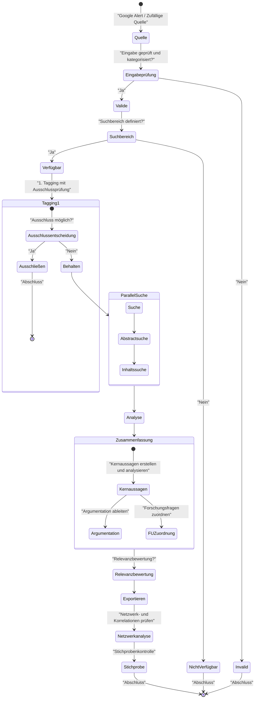

```mermaid
stateDiagram-v2
    %% Phase 1-2: Systematische Literaturauswertung zur theoretischen Sensibilisierung
    [*] --> Quelle: "Google Alert / Zufällige Quelle"
    Quelle --> Eingabeprüfung: "Eingabe geprüft und kategorisiert?"
    Eingabeprüfung --> Valide: "Ja"
    Eingabeprüfung --> Invalid: "Nein"
    Invalid --> [*]: "Abschluss"
    Valide --> Suchbereich: "Suchbereich definiert?"

    Suchbereich --> Verfügbar: "Ja"
    Suchbereich --> NichtVerfügbar: "Nein"
    NichtVerfügbar --> [*]: "Abschluss"

    Verfügbar --> Tagging1: "1. Tagging mit Ausschlussprüfung"

    state Tagging1 {
        [*] --> Ausschlussentscheidung: "Ausschluss möglich?"
        Ausschlussentscheidung --> Ausschließen: "Ja"
        Ausschließen --> [*]: "Abschluss"
        Ausschlussentscheidung --> Behalten: "Nein"
    }

    %% Phase 3: Anpassung und Erweiterung der Literaturbasis
    Behalten --> ParallelSuche

    state ParallelSuche {
        Suche --> Abstractsuche
        Abstractsuche --> Inhaltssuche
    }

    ParallelSuche --> Analyse

    %% Phase 4: Überprüfung der Modelle
    Analyse --> Zusammenfassung

    state Zusammenfassung {
        [*] --> Kernaussagen: "Kernaussagen erstellen und analysieren"
        Kernaussagen --> Argumentation: "Argumentation ableiten"
        Kernaussagen --> FUZuordnung: "Forschungsfragen zuordnen"
    }

    Zusammenfassung --> Relevanzbewertung: "Relevanzbewertung?"
    Relevanzbewertung --> Exportieren
    Exportieren --> Netzwerkanalyse: "Netzwerk- und Korrelationen prüfen"
    Netzwerkanalyse --> Stichprobe: "Stichprobenkontrolle"
    Stichprobe --> [*]: "Abschluss"

```
