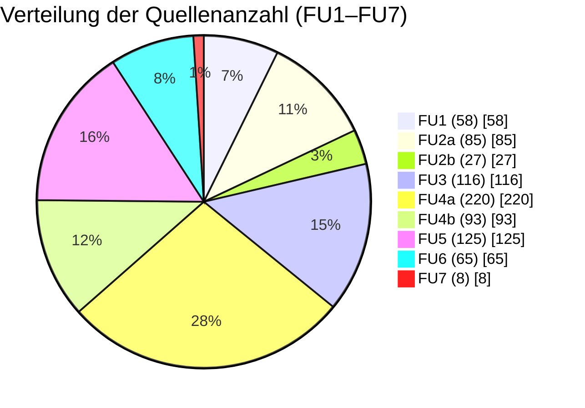
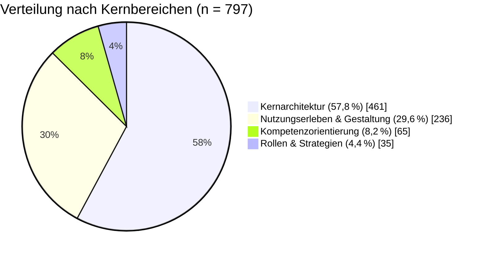

# Verteilung der Quellenanzahl nach Forschungsunterfragen (FU1–FU7)

Die folgende Tabelle und das Diagramm zeigen die Verteilung der verarbeiteten Analysen nach den sieben Forschungsunterfragen (FU1 bis FU7):

| FU  | Anzahl der verarbeiteten Analysen | Prozentualer Anteil |
| --- | --------------------------------- | ------------------- |
| 1   | 58                                | 7,28 %              |
| 2a  | 85                                | 10,66 %             |
| 2b  | 27                                | 3,39 %              |
| 3   | 116                               | 14,55 %             |
| 4a  | 220                               | 27,60 %             |
| 4b  | 93                                | 11,67 %             |
| 5   | 125                               | 15,68 %             |
| 6   | 65                                | 8,16 %              |
| 7   | 8                                 | 1,00 %              |
| **Summe** | **797**                     | **100,00 %**        |

Gesamtzahl der verarbeiteten Analysen über alle Forschungsunterfragen (FU1–FU7): **n = 797**.

# Tortendiagramm zur Verteilung der Quellenanzahl

# Auswertung

Über alle Forschungsunterfragen hinweg wurden 797 Analysen ausgewertet. Die Verteilung ist deutlich asymmetrisch, mit klaren Schwerpunkten auf FU3, FU4a und FU5.

- FU4a (bildungswissenschaftliche Mechanismen) weist mit 220 Analysen (27,60 %) den größten Anteil auf. Das unterstreicht, dass die theoretisch‑didaktische Fundierung der LMS‑Wirkmechanismen im Material besonders breit vertreten ist.
- FU5 (Möglichkeiten/Grenzen) und FU3 (Konzeption & Merkmale) folgen mit 125 (15,68 %) bzw. 116 Analysen (14,55 %). Zusammengenommen entfällt damit knapp 59 % des Materials auf die drei Fragen nach Konzeption, Wirkmechanismen sowie Möglichkeiten und Grenzen – also auf die „Kernarchitektur“ des digitalen Bildungsraums.
- FU4b (technisch‑gestalterische Mechanismen) und FU2a (Lernendensicht/Effekte) liegen mit 93 (11,67 %) bzw. 85 Analysen (10,66 %) im mittleren Bereich. Diese Dichte erlaubt differenzierte Aussagen zu Usability, Interface‑Design und subjektivem Lernerleben.
- FU6 (Kompetenzerwerbssystem) und FU1 (Akzeptanz/Nützlichkeit) sind mit 65 (8,16 %) bzw. 58 Analysen (7,28 %) moderat vertreten. Für diese Fragen liegt genügend Material für belastbare Muster vor, aber weniger Breite als bei den stark vertretenen FU3/FU4a/FU5.
- Die geringste Materialmenge entfällt auf FU2b (Lehrendensicht, 27 Analysen; 3,39 %) und FU7 (Inputs/Strategien, 8 Analysen; 1,00 %). Diese Bereiche liefern eher vertiefende, qualitativ reichhaltige Fallperspektiven als breit generalisierbare Häufigkeitsaussagen.

## Übergeordnete Kernbereiche

Zur besseren Einordnung lassen sich die neun Forschungsunterfragen in vier übergeordnete Kernbereiche bündeln. Die Verteilung der 797 Analysen stellt sich dann wie folgt dar:

- **Kernarchitektur** (Konzeption, Mechanismen, Möglichkeiten/Grenzen; FU3+FU4a+FU5): 461 Analysen (≈ 57,8 %)
- **Nutzungserleben & Gestaltung** (Akzeptanz/Nützlichkeit, Lernendensicht, technisch‑gestalterische Mechanismen; FU1+FU2a+FU4b): 236 Analysen (≈ 29,6 %)
- **Kompetenzorientierung** (LMS als Kompetenzerwerbssystem; FU6): 65 Analysen (≈ 8,2 %)
- **Rollen & Strategien** (Lehrendenperspektive, Inputs/Strategien; FU2b+FU7): 35 Analysen (≈ 4,4 %)

### Kernarchitektur (FU3, FU4a, FU5)

Die drei zentralen Forschungsunterfragen FU3, FU4a und FU5 bilden die „Kernarchitektur“ der LMS‑Metaanalyse. Ihre hohe Repräsentanz (insgesamt 461 Analysen; 57,83 %) reflektiert die grundlegende Bedeutung dieser Aspekte für das Verständnis digitaler Lernumgebungen:

- **FU3 (Konzeption & Merkmale)** legt die Basis, indem es die strukturellen und funktionalen Eigenschaften des LMS beschreibt.
- **FU4a (bildungswissenschaftliche Mechanismen)** vertieft das Verständnis der theoretischen Fundierung und der pädagogischen Wirkungsweisen.
- **FU5 (Möglichkeiten/Grenzen)** rundet das Bild ab, indem es die praktischen Potenziale und Limitationen beleuchtet.

Insgesamt zeigt die Verteilung, dass der Schwerpunkt der Metaanalyse klar auf Konzeption, Mechanismen und Möglichkeiten/Grenzen des LMS liegt, während Lehrendenperspektive und strategisch‑kausale Inputs/Wirkungen ergänzende, aber deutlich fokussiertere Stränge bilden. Diese Gewichtung sollte in der Argumentation (z.B. bei der Diskussion von Aussagekraft und Grenzen) transparent gemacht werden.
