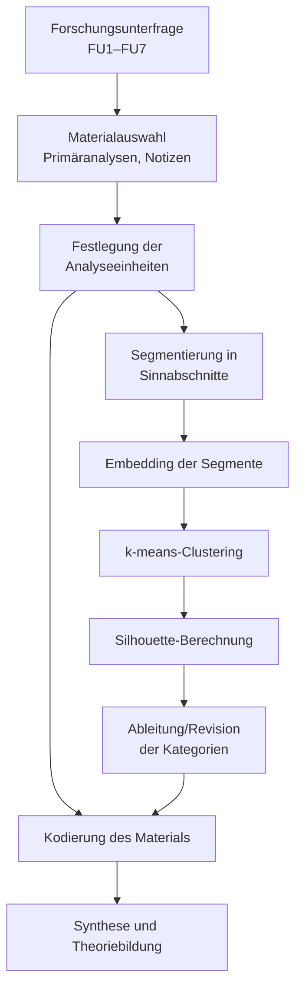

\newpage

# 4 Methodologie {#sec:4}

Kapitel 4 führt die angewendete Methodik aus und spiegelt sie an den wissenschaftlichen Gütekriterien. Die Methodik folgt konsequent den Forschungsfragen, orientiert sich an systemtheoretischen Prinzipien, bindet die in \hyperref[sec:2]{Kapitel 2} entwickelte Theorie sowie die in Kapitel \@ref(sec:3) beschriebene Architektur des Forschungsgegenstandes ein und bereitet die Ergebnisdarstellung in \hyperref[sec:5]{Kapitel 5} vor. Die Kombination aus geplanten Methoden, etwa Literaturanalyse und Eye-Tracking, unterstreicht die Flexibilität und den innovativen Anspruch der Arbeit.

## 4.1 Forschungsparadigma und methodologischer Ansatz {#sec:4-1}

Methodenkompetenz in den Human- und Sozialwissenschaften meint die Fähigkeit, empirische Studien zu lesen, zu interpretieren und eigenständig durchzuführen, um systematische und nachvollziehbare Erkenntnisse zu gewinnen. In der empirischen Sozialforschung stehen drei Paradigmen mit unterschiedlichen erkenntnistheoretischen Grundlagen und Logiken: (a) das quantitative Paradigma im kritischen Realismus, (b) das qualitative Paradigma im Sozialkonstruktivismus und (c) das im Pragmatismus verankerte Mixed-Methods-Paradigma [@doring_forschungsmethoden_2023, Seite 4-5; @doring_forschungsmethoden_2023, Seite 32-33].

Das quantitative Paradigma folgt einem linear-strukturierten Forschungsprozess mit vorab formulierten Hypothesen [@doring_forschungsmethoden_2023, Kapitel 2.2], das qualitative Paradigma bildet einen zirkulären, offen strukturierten Prozess mit explorativen Fragestellungen ab [@doring_forschungsmethoden_2023, Kapitel 2.3]. Mixed-Methods-Ansätze [@doring_forschungsmethoden_2023, Kapitel 2.4] kombinieren lineare und nichtlineare Logiken und verknüpfen Teilprozesse. Ausschlaggebend ist weniger die Datenform (numerisch oder textlich) als die Frage, mit welchem Vorgehen die vorliegenden oder noch zu erzeugenden Daten angemessen bearbeitet werden können. Das Begründungsgebot legitimiert die Wahl der Forschungslogik und die Bearbeitung der Daten.

### 4.1.1 Vorüberlegungen zur Methodologie {#sec:4-1-1}

Methodisch herausfordernd ist die Verbindung der unterschiedlichen Facetten dieses bildungstheoretischen Forschungsvorhabens. Quantitative Daten aus Eye-Tracking und begleitender Umfrage und qualitative Daten aus der systematischen Literaturanalyse werden zusammengeführt, um übergeordnete Erkenntnisse zu erzeugen. Die Hauptforschungsfrage legitimiert den Einsatz beider Paradigmen, da sie Muster und Regelmäßigkeiten im Learning Management System (LMS) sichtbar machen soll. Das Spannungsfeld zwischen Subjektivität (Wahrnehmung der Akteur*innen) und Objektivität (Kompetenzentwicklungssimulation) verlangt eine präzise methodische Betrachtung. Die strikt getrennte Zuschreibung „quantitativ = deduktiv“ und „qualitativ = induktiv“ greift dabei zu kurz, weil sie die Komplexität des Gegenstands nicht abbildet [@reinders_uberblick_2022, Seite 157].

Forschung in Gesundheitskontexten muss divergierende methodische Strömungen mehrerer Disziplinen integrieren. Komplexität, Vielfalt der Disziplinen und unterschiedliche Ressourcen sind auszubalancieren; deshalb werden hier die Stärken bestehender Methoden in einen neuen, interdisziplinären und generativen Kontext gestellt [@niederberger_qualitative_2021, Seite 4-5].

Mixed-Methods verbindet die Ansätze, steht aber in der Kritik, epistemologisch fragil zu bleiben (Inkommensurabilitäts- und Komplementaritäts-These) und wird oft pragmatisch genutzt, wodurch Verfahren unreflektiert nebeneinander stehen. Die rigide Trennung von deduktivem quantitativen und induktivem qualitativen Vorgehen verhindert zudem die Integration von Regelmäßigkeiten und subjektiven Kontexten [@doring_forschungsmethoden_2023, Kapitel 2].

Das Forschungsvorhaben verlangt aufgrund seiner zirkulären Komplexität einen mehrdimensionalen Ansatz, der die Ebenen systematisch koppelt. Wie Rosenthal und Witte ausführen, stützt sich die Methodik auf die Anerkennung unterschiedlicher Zugänge zur Erforschung sozialer Phänomene und auf die grundlagentheoretische Differenzierung zwischen quantitativen und qualitativen bzw. interpretativen Ansätzen [@mays_quanti_2020, Seite 198-199]. Die Arbeit positioniert sich als abstrakt-theoretische Grundlagenforschung und will methodische Vielfalt anerkennen sowie systematisch integrieren.

Das forschungsparadigmatische Spannungsfeld wird aufgelöst, indem die Methoden konsequent aus den Forschungsfragen abgeleitet werden. Dadurch entsteht eine zielgerichtete Auswahl, die Komplexität reduziert, der Mehrdimensionalität gerecht wird und die Stärken etablierter Methoden bündelt.

### 4.1.2 Systemisch-forschungsfragengeleiteter Ansatz {#sec:4-1-2}

Der systemische, forschungsfragengeleitete Ansatz fußt auf den Forschungsfragen FU1 bis FU7 (Kapitel [@sec:1-2-3]), abgeleitet aus Erkenntnisinteresse (Kapitel [@sec:1-1-1]) und LMS-Produkt (Kapitel [@sec:3]). Diese Fragen strukturieren sämtliche Entscheidungen und Analysen. Die hier entwickelte Methodik verbindet den systemischen Ansatz mit der konsequenten Ableitung der Methoden aus den Forschungsfragen und ist in dieser Form bislang nicht beschrieben. Interdependenz und Emergenz werden mit einer gezielten Integration qualitativer und quantitativer Methoden verknüpft, um die zirkuläre Komplexität des Gegenstandes abzubilden.

Interdependenz meint die enge Verknüpfung der Forschungsfragen und die Wechselwirkungen zwischen qualitativen und quantitativen Daten, die die Mehrdimensionalität erfassen. Emergenz beschreibt die Entstehung neuer Erkenntnisse [@bertalanffy_general_1968, Seite 16, 103], wenn Ergebnisse aus Literaturanalysen, Simulationen und empirischen Untersuchungen wie Eye-Tracking und Befragungen verbunden werden. Rückkopplung heißt, dass Analyseergebnisse iterativ in die Methodik zurückfließen und weitere Schritte steuern, sodass der Prozess dynamisch bleibt.

Konkret werden Methoden aus den Forschungsfragen abgeleitet; jede Frage bestimmt die Auswahl. Qualitative Literaturanalysen werden mit Eye-Tracking-Analysen (z.B. Heatmaps) und quantitativen Befragungen kombiniert, um subjektive Wahrnehmungen und objektive Muster zugleich abzubilden. Die passgenaue Methodenkombination reduziert Komplexität auf ein analytisch erfassbares Maß, ohne wesentliche Wirkungsmechanismen zu verlieren. Iterative Rückkopplung und systemische Verknüpfung erzeugen Einsichten, die isoliert verborgen blieben, und erweitern bestehende Ansätze um einen Rahmen, der Offenheit und strukturelle Präzision verbindet.

Table: Zuordnung der Bearbeitungsmethoden zu den Forschungsunterfragen {#tab:methoden_FU}

| Forschungsunterfrage | Bearbeitungsmethode | Erfüllungskriterien |
| --- | --- | --- |
| **FU1: Akzeptanz und Nützlichkeit** | Qualitative Metaanalyse zur Darstellung des aktuellen Forschungsstandes im Kontext digitaler Bildungsräume [@doring_forschungsmethoden_2023, Seite 194]. | Darstellung und Einordnung der Akzeptanz- und Nutzenargumente in das Gesamtgefüge. |
| **FU2a: Effekt auf Lernende** | Evaluationsframework nach Kirkpatrick sowie Training Evaluation Inventory zur Wirksamkeitsanalyse der Lernprozesse [@kirkpatrick_evaluating_1998; @ritzmann_training_2014; @ritzmann_tei_2020]. | Quantitative Evaluation der Kompetenzentwicklung und ihrer Unsicherheiten. |
| **FU2b: Effekt auf Lehrende** | Halbstrukturiertes Gruppeninterview im Face-to-Face-Kontakt mit Lernenden und Lehrenden [@doring_forschungsmethoden_2023, Kapitel 3.2; @doring_forschungsmethoden_2023, Kapitel 10.2]. | Ableitung generalisierbarer Aussagen zu wahrgenommenen Effekten und Einflussfaktoren. |
| **FU3: Didaktische und technologische Merkmale** | Theoriearbeit zur systemisch-konstruktivistischen Gestaltung des LMS und zur Beschreibung seiner Architektur [@doring_forschungsmethoden_2023, Kapitel 6.3.1]. | Herleitung, Beschreibung und Absicherung der relevanten Merkmale des LMS. |
| **FU4a: Bildungswissenschaftliche Mechanismen** | Qualitative Inhaltsanalyse nach Mayring sowie deren Weiterentwicklungen [@mey_qualitative_2010; @mayring_neuere_2008]. | Herleitung, Beschreibung und Absicherung der bildungswissenschaftlichen Wirkmechanismen. |
| **FU4b: Technisch-gestalterische Mechanismen** | Quantitative Beobachtung (inkl. Eye-Tracking) und simulationsgestützte Theorieprüfung [@doring_forschungsmethoden_2023, Kapitel 10.1.3; @doring_forschungsmethoden_2023, Kapitel 6.3.1]. | Datenerhebung, Auswertung sowie Rückbindung an die theoretische Modellierung. |
| **FU5: Möglichkeiten und Grenzen** | Kombination aus Qualitativer Inhaltsanalyse und SWOT-Analyse zur systemischen Bewertung [@mey_qualitative_2010; @niederberger_swot-analyse_2015]. | Strukturierte Darstellung der Potenziale und Limitationen des Trainingsmodells. |
| **FU6: LMS als Kompetenzerwerbssystem** | Systemische Theoriearbeit zur Verschränkung von Kompetenzforschung und LMS-Architektur [@doring_forschungsmethoden_2023, Kapitel 5]. | Transfer und Einordnung der Ergebnisse in ein konsistentes Kompetenzentwicklungsmodell. |
| **FU7: Erweiterung von Kausalgesetzen** | Grounded-Theory-basierte „Einfall und Theorieentwicklung“ sowie Analyse des Technologiedefizits [@pentzold_praxis_2018, Einleitung; @luhmann_technologiedefizit_1982]. | Entwicklung und Ableitung eines kausalen Ursachen-Wirkungstheoriemodells. |

Die Tabelle fasst die Forschungsunterfragen zusammen und verknüpft sie mit den jeweils eingesetzten Methoden sowie ihren Erfüllungskriterien. Auf diese Weise wird nachvollziehbar, wie qualitative Literaturarbeit, empirische Erhebungen (Eye-Tracking, Interviews, Umfragen) und simulationsbasierte Verfahren im Zusammenspiel verwendet wurden, um die unterschiedlichen Facetten des Lernmanagementsystems abzubilden.

Methodische Konsequenzen der Forschungsfragen

- Die Forschungsfragen bestimmten:
  - Auswahl und Strukturierung der Literatur.
  - Entwicklung von Kategorien und Schlagworten zur thematischen Verknüpfung.
  - Kombination und Anpassung klassischer Methoden.
- **Begründung**:
  - Die Komplexität des digitalen Bildungsraums erforderte eine Methodenkombination, um die Forschungsfragen adäquat zu beantworten.

## 4.2 Datenerhebung {#sec:4-2}

### 4.2.1 Systematische Literaturrecherche {#sec:4-2-1}

Die systematische Literaturrecherche bildet die Grundlage für die Beantwortung der Forschungsfragen FU1, FU3, FU4a und FU6. Ziel ist hierbei, ein umfassendes Verständnis der bestehenden wissenschaftlichen Diskussionen und Erkenntnisse im Bereich digitaler Bildungsräume zu erlangen. Die Analyse umfasst insgesamt 2.650 wissenschaftliche Arbeiten, die algorithmisch aus verschiedenen Datenbanken extrahiert und thematisch kategorisiert wurden.

Bemerkenswert ist, dass die Auswahl frei von subjektivem Eingreifen, thematischen Vorannahmen oder bewussten Schwerpunktsetzungen erfolgte und ausschließlich auf algorithmisch rekonstruierten Dichtefeldern innerhalb deduktiv-numerischer Vektorräume basiert. Die Aussagen aus diesem Literaturfeld können damit als stabil, kohärent und epistemisch tragfähig gelten; sie bilden gewissermaßen den empirischen Kern des aktuellen Diskurses.

Table: Jährliche Entwicklung der Clusterbildung und Silhouette-Scores \label{tab:cluster_silhouette}

| Jahr | $n$ | Cluster | Silhouette-Score |
| --- | --- | --- | --- |
| 2010 | 7 | 2 | 1.0000 |
| 2011 | 29 | 4 | 0.9655 |
| 2012 | 7 | 3 | 0.8571 |
| 2013 | 28 | 4 | 1.0000 |
| 2014 | 24 | 4 | 0.9583 |
| 2015 | 28 | 3 | 1.0000 |
| 2016 | 25 | 3 | 1.0000 |
| 2017 | 98 | 3 | 1.0000 |
| 2018 | 95 | 4 | 0.9895 |
| 2019 | 202 | 3 | 1.0000 |
| 2020 | 303 | 4 | 0.9968 |
| 2021 | 377 | 4 | 0.9854 |
| 2022 | 430 | 4 | 0.9916 |
| 2023 | 899 | 4 | 0.9702 |
| 2024 | 780 | 4 | 0.9208 |
| 2025 | 192 | 4 | 0.9696 |
| **Summe** | 3523 | — | — |

{#fig:silhouette-scores width=90%}

Trotz geringer Fallzahlen liefern die Jahre 2010–2016 nahezu perfekte Silhouette-Scores (≈1.0) und markieren eine hohe semantische Kohärenz des Korpus. Der Zeitraum 2018–2022 kombiniert steigende Fallzahlen mit Scores über dem Median ($Q_2 \approx 0{,}99$) und bildet damit das robuste Rückgrat der Literaturanalyse. Ab 2023 sinkt der Score bei weiterhin hohen n-Werten (Tiefpunkt 0,9208 in 2024), was auf eine inhaltliche Drift oder erhöhte Heterogenität hindeutet; 2025 erholt sich der Score moderat. Die zugehörige ΔSCₙ-Kurve (Abb.~\@ref(fig:delta-silhouette)) spiegelt diese Dynamik, mit Frühphasen und punktuellen Peaks bei sehr kleinen n, einer stabilen Verdichtung zwischen 2018 und 2022 und einer deutlichen Negativdrift ab 2023 trotz hoher Publikationszahlen. Das macht sichtbar, dass die Menge der Beiträge stabil bleibt, während die semantische Kohärenz erodiert, was auf thematische Reorganisation und fragmentierte Diskursstrukturen im Korpus hinweist.

{#fig:delta-silhouette width=90%}

{#fig:time-series width=90%}

Die Visualisierung verknüpft Silhouette-Scores (linke Achse) mit Fallzahlen (rechte Achse) und macht sichtbar, wie sich Kohärenz und Volumen gemeinsam entwickeln. 2010–2017 bleiben die Scores trotz kleiner n nahezu perfekt, 2018–2022 steigt n stark an und die Werte liegen über dem Median ($Q_2 \approx 0{,}9906$). Ab 2023 fällt der Score bei hohen Fallzahlen unter $Q_3$ und erreicht 2024 den Tiefpunkt, 2025 stabilisiert sich die Kurve. Die Quartile ($Q_1 \approx 0{,}9686$, $Q_3 = 1{,}0000$) und die Fatigue-Schwelle von 0,96 markieren die Schwellen zwischen hoher und erodierender Kohärenz. Damit lässt sich die Aussagekraft einzelner Jahrgänge gewichten, belastbare Kohärenzphasen identifizieren und die methodische Qualität retrospektiv validieren.

### 4.2.2 Systematisches Literaturmanagement {#sek:4-2-2}

Zur Vorbereitung der Datenanalyse wurden in Zotero 12 priorisierte Suchordner (0 bis b) angelegt. Jeder Ordner enthält eine Kombination aus Eintragstyp und Schlagwortkette. Die Titel wurden in der festgelegten Reihenfolge geprüft und beim ersten Treffer mit dem entsprechenden Tag versehen. Die folgende Tabelle zeigt die vollständige Struktur der Suchordner:

Anhang X: Struktur der Suchordner in Zotero nach semantischen Ebenen

Die folgende Tabelle dokumentiert die finale Systematik der Zotero-Suchordner. Diese ist entlang primärer, sekundärer und tertiärer Suchbegriffe gegliedert. Jeder Ordner beinhaltet strukturierte Suchen nach Eintragstypen und thematischen Schlagwörtern. Die ID der Ordner (z. B. `S:01`) korrespondiert mit der Ordnerstruktur in Zotero und wurde zur Tag-Kodierung verwendet.

Primäre Suchbegriffe

Table: Übersicht Primäre Suchbegriffe \label{tab:primaere_suchbegriffe}

| **Ordner-ID** | **Begriff**                | **Synonyme / Varianten**                  |
| ------------- | -------------------------- | ----------------------------------------- |
| `S:01`        | Learning Management System | LMS, Lernmanagementsystem, Kursplattform  |
| `S:02`        | Online-Lernplattform       | Lernplattform, Digitale Plattform         |
| `S:03`        | Online-Lernumgebung        | Virtuelle Lernumgebung, Digitale Umgebung |
| `S:05`        | E-Learning                 | Elektronisches Lernen, Digitales Lernen   |

Die primären Suchbegriffe adressieren den unmittelbaren Forschungsgegenstand. Sie bündeln alle Kombinationen, in denen das LMS oder der digitale Bildungsraum direkt benannt ist. Für diese Cluster gilt eine hohe Sichtungsquote (mindestens 80 %), weil sie die Kernbefunde zur Wirkweise des eingesetzten Systems liefern und den Ausgangspunkt für die Ableitung der Forschungsunterfragen bilden.

Sekundäre Suchbegriffe

Table: Übersicht Sekundäre Suchbegriffe \label{tab:sekundaere_suchbegriffe}

| **Ordner-ID** | **Begriff**         | **Synonyme / Varianten**                             |
| ------------- | ------------------- | ---------------------------------------------------- |
| `S:04`        | MOOC                | Massive Open Online Course                           |
| `S:06`        | Bildungstechnologie | EdTech, Technologie im Bildungssektor                |
| `S:07`        | Digitale Medien     | Medienkompetenz, Medientechnologie                   |
| `S:08`        | Blended Learning    | Integriertes Lernen, Hybridunterricht                |
| `S:09`        | Digitales Lernen    | Digital Learning (dt.), technologiegestütztes Lernen |
| `S:12`        | Digital Learning    | Digitales Lernen (engl.), tech-enhanced learning     |

Sekundäre Begriffe erweitern den Blick auf didaktische und organisatorische Kontexte. Sie erfassen hybride Arrangements, mediale Settings und bildungstechnologische Konzepte, die das LMS funktional einbetten. Die Sichtungsquote liegt hier bei 50 %, weil diese Ebene vor allem der Kontextualisierung und der Identifikation flankierender Mechanismen dient.

Tertiäre Suchbegriffe

Table: Übersicht Tertiäre Suchbegriffe \label{tab:tertiäre_suchbegriffe}

| **Ordner-ID** | **Begriff**     | **Synonyme / Varianten**                |
| ------------- | --------------- | --------------------------------------- |
| `S:10`        | Online Lernen   | Lernen im Netz, Web-basiertes Lernen    |
| `S:11`        | Online Learning | Online-based education, remote learning |

Tertiäre Begriffe erschließen angrenzende Innovations- und Technologiefelder, die Impulse für zukünftige Erweiterungen liefern. Sie besitzen die niedrigste Sichtungsquote (15 %), werden jedoch zur Validierung neuer Trends genutzt und helfen, emergente Muster in der Literatur frühzeitig zu erkennen.

Die Bool’sche Logik der Suchordner folgt einem konsistenten Ablauf, der von der Auswahl eines Begriffs (primär, sekundär, tertiär) über die Datenbankabfrage, die quotierte Sichtung der Trefferlisten und das Tagging in Zotero bis zur erneuten Suche oder der anschließenden Analyse reicht. Das folgende Mermaid-Diagramm hält den Workflow in textueller Form fest.

```mermaid
flowchart TD
    A[Suchbegriff wählen<br/>(primär / sekundär / tertiär)] --> B[Datenbanken abfragen]
    B --> C{Trefferliste}
    C --> D[Sichtung nach Quote<br/>(80 / 50 / 15 %)]
    D --> E[Tagging in Zotero<br/>Promotion:Literaturanalyse<br/>+ Argumentkategorie]
    E --> F{Quote erreicht?}
    F -->|nein| B
    F -->|ja| G[Analyse (z.B. P-QIA<br/>und Cluster)]
```

Das zugehörige Zotero-Suchordner-Fenster dokumentiert eine konsistente Bool’sche Suchdefinition für Zeitschriftenartikel im Schnittfeld von learning, management und system, ergänzt um die deutschsprachige Variante „Lernmanagementsystem“ und flankiert von negativen Tags (z.B. `Promotion:Ausschluss`, `#2–#b`) sowie dem Ausschluss übergeordneter Sammlungen (z.B. `S:01`). Damit werden nur begutachtete Fachbeiträge selektiert, die thematisch zum Kernfeld gehören, während redundante oder bereits als irrelevant bewertete Einträge ausgenommen bleiben. Methodisch verortet sich diese Definition in der qualitativ-kriterialen Dokumentenselektion nach @doring_forschungsmethoden_2023, Kapitel 10.6 und konkretisiert das dreistufige Suchmodell aus primären, sekundären und tertiären Begriffen: transparent, replizierbar und über die Tag-Struktur skalierbar.

### 4.2.3 Visualisierungen der Literaturbasis {#sec:4-2-3}

Die folgenden Abbildungen dokumentieren die Zusammensetzung und Relevanzbewertungen des analysierten Suchkorpus. Sie bilden die visuelle Grundlage für die in Abschnitt \hyperref[sec:4-3]{Abschnitt 4.3} beschriebene Datenanalyse.

{#fig:summary-suchergebnisse width=90%}

{#fig:categories-suchergebnisse width=90%}

{#fig:index-suchergebnisse width=90%}

{#fig:tags-suchergebnisse width=90%}

{#fig:research-questions-suchergebnisse width=90%}

{#fig:relevance-fu width=90%}

{#fig:relevance-categories width=90%}

{#fig:relevance-search width=90%}

{#fig:sources-status width=90%}

{#fig:top-authors width=90%}

{#fig:languages width=90%}

{#fig:language-entrytypes width=90%}

{#fig:path-diagram width=90%}

{#fig:sankey-diagram width=90%}

{#fig:network-suchergebnisse width=90%}

## 4.3 Datenanalyse {#sec:4-3}

### 4.3.1 Grundlogik der Datenanalyse: Analysen erster bis dritter Ordnung {#sec:4-3-1}

Die Datenanalyse folgt einem dreistufigen, systemisch gedachten Beobachtungsmodell, das deduktive Kategorienbildung mit probabilistischer Validierung verschränkt. Damit bleibt jeder Schritt eng an die Forschungsunterfragen gekoppelt und gleichzeitig anschlussfähig an die dokumentarischen Qualitätsanforderungen nach Döring [-@doring_forschungsmethoden_2023].

- **Analysen erster Ordnung (Primäranalysen):** Einzelquellen werden entlang vordefinierter Kategorien (Akzeptanz, Nutzen, Grenzen usw.) ausgewertet. Das Ergebnis ist eine strukturierte, FU-spezifische Inhaltsanalyse pro Dokument.
- **Analysen zweiter Ordnung (Sekundäranalysen):** Die Primäranalysen einer FU werden gespiegelt, verdichtet und theoriebezogen gerankt. Daraus entstehen deduktive Cluster, SWOT-Profile und Korrelationsmatrizen.
- **Analysen dritter Ordnung (P-QIA):** Die probabilistisch-qualitative Inhaltsanalyse überführt die Ergebnisse der zweiten Ebene in einen Vektorraum, prüft sie über k-means-Clustering und bewertet die Kohärenz mittels Silhouette-Scores.

Gemeinsam bilden diese Ordnungen einen iterativen Zyklus: Jede Stufe liefert die Grundlage für die nächste und fließt nach erfolgter Validierung wieder in die Forschungsunterfragen zurück.

### 4.3.2 Analyse 1. Ordnung: Primäranalysen {#sec:4-3-2}

Die Primäranalysen bilden das Fundament der weiteren Verdichtungen. Jede wissenschaftliche Quelle wird mit einem dedizierten Prompt ausgewertet, der aus der jeweiligen Forschungsunterfrage abgeleitet ist (z.B. `FU5 Primäranalysen (125).md`; siehe Anhang A.2, Prompt zur Analyse einer Quelle, {#sec:A-2}). Die Prompts stellen sicher, dass alle Analysen identische Bausteine enthalten (Kontext, Argument, Limitationen, Implikationen).

1. **Quellenimport und Tagging:** Aus Zotero exportierte Einträge werden über ihre Tags (`Promotion:Literaturanalyse` + Argumentationskategorie) den FUs zugeordnet.
2. **Promptbasierte Auswertung:** Ein KI-gestütztes Textanalysewerkzeug erzeugt strukturierte Markdown-Analysen, die deduktiv definierte Kategorien ausfüllen und mit Originalzitaten aus der Quelle verknüpfen.
3. **Dokumentation:** Jede Analyse erhält einen Header mit Metadaten (Quelle, Datum, Prompt-Version). Die Ergebnisse liegen versioniert in Obsidian vor und können jederzeit erneut validiert werden.
4. **Qualitätssicherung:** Quellen, die inhaltlich nicht in den digitalen Bildungsraum passen, werden bereits auf dieser Ebene identifiziert und als „irrelevant" markiert. So bleiben nur überprüfte Texte im weiteren Prozess.

### 4.3.3 Analyse 2. Ordnung: Sekundäranalysen {#sec:4-3-3}

Die zweite Ordnung synthetisiert alle Primäranalysen einer Forschungsunterfrage. Die entsprechenden Prompts (z.B. `FU1 Prompt Sekundäranalyse.md`) führen mehrere Einzelanalysen zusammen, spiegeln sie an theoretischen Bezugsrahmen und erzeugen daraus erste Metastrukturen:

- **Vergleich und Ranking:** Wiederkehrende Aussagen werden identifiziert, divergierende Befunde kontrastiert und entlang der FU priorisiert.
- **Theoriebasierte Spiegelung:** Konzepte wie TAM, SDT oder TPACK dienen als Referenz, um die Primäranalysen in bestehende Modelle einzubetten.
- **Manuelle Clusterlogik:** Vor der probabilistischen Verdichtung entstehen deduktive Cluster (z.B. „Akzeptanzmuster" oder „Risiko-Faktoren"), SWOT-Profile oder Korrelationsmatrizen.

Damit liefert die zweite Ordnung den semantischen Rahmen, in dem die probabilistische Verdichtung der dritten Ordnung operiert.

### 4.3.4 Analyse 3. Ordnung: Probabilistisch-Qualitative Inhaltsanalyse (P-QIA) {#sec:4-3-4}

Die P-QIA ergänzt die klassischen Methoden um eine reproduzierbare, embedding-basierte Strukturierung. Sie versteht sich als semantische Analyse im Sinne einer regelgeleiteten Erschließung, Verdichtung und relationalen Zuordnung bedeutungstragender Einheiten.

#### Konzept und Abgrenzung

- Deduktive Rahmung durch die Forschungsunterfragen (FU1–FU7).
- Segmentierung aller Texte in Sinnabschnitte (1–3 Sätze; bei FU7 1–2 Sätze).
- Transformation der Segmente in hochdimensionale Embeddings.
- k-means-Clustering und Gütebewertung via Silhouette-Koeffizient.
- KI-gestützte Label-Vorschläge, die durch die Forschende überprüft und theoretisch validiert werden.
- Ableitung konsistenter Kodiermanuale mitsamt Ankerbeispielen.

Die eingesetzten KI-basierten Textmodelle wirken als strukturierende Werkzeuge; Steuerung und Interpretation liegen vollständig bei der Forschenden.

#### Algorithmische Umsetzung

Der Workflow wurde in Anlehnung an Mayring gestaltet und verbindet klassische Schritte mit probabilistischen Erweiterungen:

1. **Forschungsunterfrage und Materialfestlegung (Mayring)** – Definition der FU und Auswahl des Materials (Primäranalysen, Notizen, Quellen).
2. **Festlegung der Analyseeinheiten (Mayring)** – Definition von Sinnabschnitten und Kontextebenen.
3. **Segmentierung (P-QIA)** – Automatische Zerlegung der Texte in 1–3 Sätze (bei FU7 1–2 Sätze) inklusive Dokumentation der Regeln.
4. **Embedding und probabilistische Strukturierung (P-QIA)** – vektorbasiert berechnete Textrepräsentationen und k-means-Clustering mit FU-spezifischem *k*.
5. **Qualitätssicherung der Cluster (P-QIA)** – Berechnung des Silhouette-Koeffizienten und Bereinigung instabiler Cluster.
6. **Ableitung und Revision der Kategorien (Mayring + P-QIA)** – KI-gestützte Label, theoretische Validierung, Kodiermanual.
7. **Kodierung des Materials (Mayring)** – Anwendung des Manuals, Dokumentation von Grenzfällen.
8. **Synthese, Metamodellierung und Theoriebildung (Mayring + P-QIA)** – Rückbindung an die FU und Dokumentation der Kennwerte.



#### Validierung und empirische Kennwerte

Die Datei [[P-QIA Statistik]] dokumentiert Segmentierungsregeln, Embedding-Modelle, gewählte *k*-Werte und Silhouette-Mittelwerte für alle FUs. Über alle Forschungsunterfragen hinweg liegt *k* zwischen 8 und 15, die Silhouette-Werte bewegen sich zwischen 0.87 und 0.93 (Mittelwert ca. 0.89).

|FU|k|Silhouette|Interpretation nach Rousseeuw (1987)|
|---|---|---|---|
|FU1|8|0.91|sehr starke Clustertrennung|
|FU2a|12|0.88|starke Clusterstruktur|
|FU2b|14|0.89|starke Clusterstruktur|
|FU3|15|0.87|starke Clusterstruktur|
|FU4a|12|0.90|sehr starke Clustertrennung|
|FU4b|12|0.92|nahezu perfekte Trennung|
|FU5|14|0.88|starke Clusterstruktur|
|FU6|12|0.89|starke Clusterstruktur|
|FU7|10|0.93|nahezu perfekte Trennung|

Rousseeuw [-@rousseeuw_silhouettes_1987] bewertet Werte > 0,70 als stark, > 0,90 als nahezu perfekt. Die dokumentierten Kennwerte zeigen somit, dass die vektorbasiert gefundenen Cluster sowohl interpretativ als auch statistisch stabil sind. Ergänzend verweisen Low & Kalender [-@low_data_2023] auf die Reproduzierbarkeit deterministischer Pipelines.

#### Qualitätssicherung und Beispiele

Die KI-gestützte Analyse dient auch der Plausibilitätsprüfung. So wurde der Artikel von Westlake und Mahan [-@westlake_international_2023] – trotz korrekter Schlagwortzuordnung – als thematisch irrelevant markiert, weil er BDSM-Praktiken untersucht und somit keinen Bezug zum digitalen Bildungsraum aufweist. Diese Prüfung geht über eine reine Stichwortsuche hinaus und verhindert, dass fachfremde Texte in die Auswertung gelangen.

Zur Überprüfung der Trennschärfe wurde die P-QIA auf die klassisch kodierte Studie von Kerman et al. [-@kerman_online_2024] angewendet. Die KI-gestützte Analyse erzielte einen Silhouette-Score von 0,92, die menschliche Kodierung lediglich 0,62. Damit wird sichtbar, dass die probabilistische Validierung methodische Schwächen in manuellen Kodierungen offenlegt und als Ergänzung zur klassischen Inhaltsanalyse fungiert.

#### Test- und Diskursbeiträge

Die Validierung umfasst automatische Kodierungstests, erneute Clusterbildungen mit k-means sowie Mehrfachberechnungen des Silhouette-Scores, um die Stabilität über verschiedene Läufe hinweg zu belegen. Zudem wurde geprüft, ob klassische Tools wie ATLAS.ti oder NVivo die gleichen Prüfungen leisten können. Da diese Werkzeuge primär der Unterstützung menschlicher Kodierung dienen, liefern sie keine belastbaren Kennwerte zur objektiven Clustervalidierung. Die P-QIA adressiert damit eine Lücke in der aktuellen Diskussion (z.B. [@biswas_chatgpt_2023; @van_niekerk_addressing_2025; @storey_ai_2023; @parker_negotiating_2024]), indem sie ein überprüfbares Verfahren zur Qualitätsbewertung KI-gestützter Analysen bereitstellt.

#### Rolle des Menschen und Grenzen

Trotz der probabilistischen Komponente bleibt die interpretative Verantwortung grundsätzlich menschlich. Grenzen ergeben sich aus:

- **Parameter- und Modellvariabilität:** Embedding-Modelle und Clusterparameter beeinflussen die Ergebnisse; Entscheidungen müssen dokumentiert und begründet werden.
- **Black-Box-Charakter der Modelle:** Interne Repräsentationen sind nur begrenzt interpretierbar. Transparente Protokolle mildern, aber eliminieren das Problem nicht.
- **Gefahr der Scheinobjektivität:** Statistische Kennwerte ersetzen keine inhaltliche Reflexion. Sie fungieren als Unterstützungs-, nicht als Entscheidungsinstanz.
- **Ethik und Bias:** Fragen nach Datensouveränität, Verzerrungen und Verantwortung müssen explizit adressiert werden.

### 4.3.5 Mehrdimensional-analytische Clustervalidierung (mdaCV) {#sec:4-3-5}

Im Zuge der systematischen Literaturarbeit wurde die statistische Clusteranalyse zunächst als Ergänzung zur P-QIA ausprobiert. Die Anwendung des $k$-Means-Algorithmus auf einen bereits deduktiv strukturierten Quellenkorpus bestätigte die bestehenden semantischen Erkenntnisse. Diese Stabilität wurde zur Grundlage eines eigenständigen Validierungsverfahrens, der mehrdimensional-analytischen Clustervalidierung (mdaCV). Sie spannt einen semantischen Raum entlang theoretisch begründeter Achsen (Kategorien, Forschungsfragen, Schlagworte) auf, positioniert die Datenpunkte darin und bewertet deren Trennschärfe über Silhouette-Scores [-@rousseeuw_silhouettes_1987].

Die Methode wurde iterativ entwickelt, auf reale, manipulierte und zufällige Datensätze angewandt und ist samt Skripten (z.B. `analyse_korrelation.py`, `analyse_netzwerk.py`) unter https://github.com/jochen-hanisch/charite-promotion dokumentiert. Ihre theoretische Herleitung fußt auf drei Komponenten:

1. **Deduktive Strukturierung des semantischen Raums:** Theoriegeleitete Dimensionen ([@baur_datenaufbereitung_2022; @baur_qualitative_2022]) definieren die Achsen und ermöglichen eine geordnete Positionierung der Daten.
2. **Geometrische Modellierung:** Begriffliche Relationen werden in numerische Vektoren überführt. Konzepte wie CBOW/Skip-gram [@mikolov_efficient_2013] zeigen, dass sich so hochdimensionale, semantisch präzise Repräsentationen erzeugen lassen.
3. **Statistische Validierung:** Die vorstrukturierten Daten werden mittels $k$-Means analysiert. Die Anzahl der Cluster $k$ wird theoriegeleitet festgelegt oder durch Silhouette-Kennwerte feinjustiert [@sud_k-means_2020; @rakhlin_stability_nodate].

Im Verlauf der Dissertation wurde die mdaCV als dauerhafte Feedback-Schleife eingesetzt. Beispielhaft stieg nach der Bereinigung eines Korpus auf $n = 3502$ Quellen der Silhouette-Score von 0,964 auf 0,9751 – ein Hinweis auf semantische Schärfung. Ein ergänzender methodischer Hinweis betrifft die Interpretation der ab 2023 sichtbar werdenden semantischen Drift im Literaturkorpus. Die Kombination aus steigenden Publikationszahlen bei gleichzeitig sinkenden Silhouette-Scores weist auf eine strukturelle Reorganisation der thematischen Landschaft hin. Dieses Muster ist in datenintensiven Diskursfeldern nicht ungewöhnlich und gilt als typischer Indikator dafür, dass sich die Begriffs- und Themenräume eines Forschungsfeldes verändern, ohne dass dies zwingend mit einer qualitativen Abwertung einhergeht. Vielmehr entstehen in solchen Phasen neue semantische Ankerpunkte, die die bisherigen Strukturzentren überlagern oder ergänzen.

Für die methodische Einordnung signalisiert der Rückgang der Clusterkohärenz verschobene epistemische Schwerpunkte, keine Schwäche der Datenbasis. In von technischer Innovation geprägten Feldern, etwa durch generative KI, die breitere Etablierung von Learning Analytics oder automatisierte Analyseverfahren, treten kurzfristige Fragmentierungen auf, die sich in den Kennwerten von mdaCV und Silhouette zeigen. Die Dynamik lässt sich als temporäre Reorganisation lesen: alte Strukturkerne verlieren an Stabilität, neue Cluster bilden sich aus. Methodisch folgt daraus, Übergänge als systemisch-epistemischen Beobachtungsgegenstand zu behandeln, statt sie als bloße Unschärfe abzutun. Die Drift verweist auf erhöhte Variabilität im Diskurs und macht sichtbar, dass sich die semantische Struktur des Feldes erweitert oder neu justiert. Eine interpretative Dimension ergänzt die empirische Bewertung der Clusterkohärenz und erlaubt eine präzisere Einordnung der Kennwerte. Nach erneuter Einbindung ausgeschlossener Konferenzbände ($n = 3572$) blieb der Score mit 0,9754 stabil. Selbst minimale Änderungen (ein entfernter Buchteil, $n = 3571$) führten zu messbaren Differenzen von 0,001 und machten mikrostrukturelle Effekte sichtbar.

Die mdaCV fungiert damit als seismografisches Instrument: Sie verbindet deduktive Kategorienstrukturen mit quantitativ validierbaren Kennwerten und eröffnet Analysepfade für mikrostrukturelle Dynamiken in semantisch strukturierten Räumen.

### 4.3.6 Epistemische Verlustfunktion ($\epsilon$) als Integritätsmaß {#sec:4-3-6}

Allein der Silhouette-Score erfasst nur die geometrische Separierbarkeit von Clustern. Um zusätzlich die Datenvollständigkeit zu berücksichtigen, wurde eine epistemische Verlustfunktion $\epsilon$ eingeführt. Sie kombiniert die Clusterdifferenzierungsleistung mit dem Verhältnis aus intendierter und tatsächlich verarbeiteter Quellenzahl und fungiert als Monitoring-Größe für datenintensive Prozesse.

Formel zur Definition der Verlustfunktion:

$$
\epsilon = (1 - S) + \frac{n_{\text{Soll}} - n_{\text{Ist}}}{n_{\text{Soll}}}
\label{eq:verlust}
$$

Ein Beispiel mit $S = 0{,}9754$, $n_{\text{Soll}} = 3585$ und $n_{\text{Ist}} = 3583$ ergibt $\epsilon \approx 0{,}0252$. Der Wert zeigt, dass trotz kleiner Datenlücken eine hohe Integrität erreicht wird. Die Verlustfunktion eignet sich insbesondere als Frühwarnsystem (Verlust von Quellen, unplausible Score-Sprünge) und als zusätzlicher Qualitätsindikator in reproduzierbaren Pipelines.

### 4.3.7 Synthese: Methodische Bedeutung für die Gesamtanalyse {#sec:4-3-7}

Die strukturierte Abfolge aus Analysen erster bis dritter Ordnung, P-QIA, mdaCV und epistemischer Verlustfunktion verbindet deduktive Theorietreue mit datenbasierter Validierungslogik. Damit entsteht ein geschlossenes, aber transparentes System, das qualitative Tiefenanalyse, probabilistische Robustheit und kontinuierliche Selbstüberwachung vereint. Diese Methodik bereitet den Boden für die simulationsgestützten Modellierungen des folgenden Abschnitts.

### 4.3.8 Visualisierte Korrelations- und Clusteranalysen {#sec:4-3-8}

Zur Absicherung der deduktiven Clusterlogik wurden die zentralen Korrelations- und Clusterauswertungen visualisiert. Sie zeigen, wie Forschungsunterfragen, Kategorien, Suchbegriffe und Indizes miteinander verknüpft sind.

{#fig:clusteranalyse-kmeans width=90%}

{#fig:kor-fu width=90%}

{#fig:kor-fu-kategorien width=90%}

{#fig:kor-fu-suchbegriffe width=90%}

{#fig:kor-fu-indizes width=90%}

{#fig:kor-indizes width=90%}

{#fig:kor-indizes-kategorien width=90%}

{#fig:kor-indizes-suchbegriffe width=90%}

{#fig:kor-kategorien width=90%}

{#fig:kor-suchbegriffe width=90%}

{#fig:kor-suchbegriffe-kategorien width=90%}

## 4.4 Simulationsgestützte Modellierung der Kompetenzentwicklung {#sec:4-4}

## 4.5 Reflexion der Methode {#sec:4-5}

Die kritische Methodenreflexion hat den Zweck, die eigene Arbeitsweise transparent, nachvollziehbar und anhand des wissenschaftlichen Qualitätskriteriums „Methodische Strenge“ [@doring_forschungsmethoden_2023, Seite 89-90] beurteilbar zu machen. Inwiefern diese Arbeit die Anforderungen an eine methodisch saubere, nachvollziehbare und theoriegeleitete Forschung erfüllt, ist in diesem Kapitel zu klären.

Als Herleitungsgrundlage kann ein systemisch-konstruktivistisches Verständnis von Erkenntnis angesetzt werden, das mit bewährten Evaluationsmodellen (z. B. dem CIPP-Modell nach Stufflebeam in [@hanisch_nachhaltiges_2017, Kapitel  3.1]) sowie analytischen Verfahren wie Korrelations- und deduktiven Clusteranalysen verbunden wird. Diese Kombination ist weder beliebig noch additiv, sondern strukturell aufeinander bezogen und somit theoriekompatibel. Die Auswahl der Methoden ergibt sich aus der forschungsfragengeleiteten Logik. Sie folgt keiner Paradigmentreue, sondern einem funktionalen Verständnis von Methodeneinsatz und hat zur Folge, dass qualitative und quantitative Verfahren entlang der FU dort eingesetzt werden, wo sie zur Bearbeitung beitragen. Die theoretischen Begriffe (z. B. Kompetenz, Selbstorganisation, Nachhaltigkeit) werden auf konkrete Analyseebenen übertragen, etwa über Prädiktorvariablen (z. B. PV1a-PV3 bei Hanisch [-@hanisch_nachhaltiges_2017, Kapitel  3.4]) oder KI-gestützte Analysen . Sämtliche Analyseprozesse, von der Auswahl der Quellen, über die Generierung und Anwendung der Prompts, bis hin zur Auswertung und Rückführung in die FU, sind dokumentiert, versioniert und theoretisch hergeleitet. Die Struktur folgt einer nachvollziehenden analytischen Logik, die von der FU über die erste KI-gestützte Analyse bis zur Metaebene mit Clusterauswertungen übergeht. Als kuratierende Hilfsmittel unterstützen digitale Werkzeuge, unter deren Verwendung das Literatur- und Notizmanagement (Zotero), die Versionierungen (Gitea), sowie die statistischen Berechnungen und Visualisierungen (Python) durchgeführt werden konnten. Diese Kombination von Methoden und Werkzeugen gewährleistet sowohl Reproduzierbarkeit als auch in sich Konsistenz.

Bereits in der Zusammenstellung der Analyseeinheiten erfolgen bewusste Entscheidungen, zum Beispiel zur Nichtberücksichtigung von Masterarbeiten und reiner „grauer Literatur“ in bestimmten Clusteranalysen. Diese Schritte werden transparent dokumentiert und theoriebezogen begründet, wodurch sich die Validität der Aussagen erhöht.

Ein wesentlicher Bestandteil des methodischen Vorgehens ist die fortlaufende Selbstprüfung und Justierung. Dazu gehören die Prüfung der Wirksamkeit der Prompts, die Diskussion der Silhouette-Werte zur Clustertrennschärfe, aber auch die bewusste Unterscheidung zwischen Analysen 1. Ordnung (einzelne Quelle) und Analysen 2. Ordnung (übergreifende Auswertung, Rückführung auf die FU).
Mein methodisches Vorgehen erfüllt, trotz seiner systemisch-flexiblen Struktur, zentrale Anforderungen wissenschaftlicher Strenge. Die Methoden sind theoriebasiert, nachvollziehbar, funktional gewählt und systematisch eingesetzt. Zugleich werden klassische Evaluationsverfahren in ein offenes, komplexitätssensibles Design integriert.

Infolgedessen liegt die wissenschaftliche Eigenleistung in der Strukturierung des Analyseprozesses, der Definition und Trennung der Ordnungsebenen (1. Ordnung: Analyse, 2. Ordnung: Bewertung), der methodologischen Fundierung (deduktiv und theoriebasiert) sowie in der reflexiven Kontrolle des Systems. Dieses Vorgehen ist originär, transparent dokumentiert und methodologisch innovativ.


### 4.5.1 Methodenkritische SWOT-Analyse zum KI-gestützten Vorgehen

Die SWOT-Analyse wird im Rahmen dieser Arbeit als methodisches Reflexionsinstrument eingesetzt, um die Anwendung generativer KI in der literatur- und datengestützten Analyse systematisch zu bewerten. Sie dient neben der Auflistung von Aspekten, weiterhin strukturiert die Auseinandersetzung mit methodischer Robustheit, epistemologischen Potenzialen und Grenzen des gewählten Vorgehens. Damit werden die systemtheoretisch motivierte Forschungsperspektive und eine strategische Betrachtung der methodischen Güte miteinander verknüpft. Hierbei finden interne Faktoren (Stärken, Schwächen) und externe Rahmenbedingungen (Chancen, Risiken) Berücksichtigung. Orientierung bieten die Leitlinien zur SWOT-Analyse im wissenschaftlichen Kontext bei @niederberger_swot-analyse_2015, Seite 35–38 und @hogan_swot-analyse_2009, Seite 258–259.

Table: SWOT-Analyse des KI-gestützten methodischen Vorgehens \label{tab:swot_ki_methodik}

| Kategorie | Inhalt | Maßnahme |
|----------|--------|----------|
| **Stärken** | Analysegeschwindigkeit; transparente Analysepfade; skalierbare Reproduktion (Prompts/Skripte); hohe Clustertrennschärfe; Verbindung qualitativer und quantitativer Auswertung. | Versionierung aller Schritte; reproduzierbare Dokumentation; Sensitivitätsanalysen (Variation von *k*, erneute Clusterläufe). |
| **Schwächen** | Interpretationsspielräume (Black-Box); mögliche algorithmische Verzerrungen; Gefahr, dass Kennwerte Reflexion überlagern; hoher Initialaufwand für Kategorien, Prompts und Pipelines. | Protokollierung aller Parameter; Abgleich der Clusterstruktur mit theoriegeleiteten Kategorien; iterative Prompt-Revision; Voranstellen inhaltlicher Interpretation vor Kennwerten. |
| **Chancen** | Ergänzung klassischer Verfahren um Prüfgrößen (Silhouette, mdaCV); methodische Innovation (P-QIA, mdaCV); Erschließung großer Literaturkorpora; Förderung kollaborativer, versionierter Erkenntnissysteme. | Anwendung auf alle relevanten FU; Vergleich unterschiedlicher Modellläufe; Veröffentlichung von Skripten und Dokumentation; Einbettung in eine datenbasierte Curriculumsforschung. |
| **Risiken** | Scheinobjektivität der Kennwerte; ethische Fragen (Delegation von Bewertung, Datenumgang); Abhängigkeit von Modellarchitekturen/Infrastruktur; Replikationsrisiken; Unterschätzung manueller Kontextkenntnis. | Reflexionspassagen im Methodikteil; Benennung von Grenzen und Annahmen; manuelle Stichproben-Codierungen; Auswahl datenschutzkonformer Umgebungen; Replikationsstrategien bei Modellaktualisierungen. |

Die Tabelle bündelt damit die zentralen Befunde und zeigt, welche Maßnahmen unmittelbar mitgeführt werden. Die Stärken (Transparenz, Reproduzierbarkeit und Trennschärfe) werden neben den abstrakten Zuschreibungen in Sensitivitätsanalysen, Versionierungen und reproduzierbaren Dokumentationsketten aktiv genutzt.

Die SWOT-Analyse zeigt Schwächen und Risiken als kontinuierliche Arbeitsaufträge. Interpretationsspielräume, algorithmische Verzerrungen oder Modellabhängigkeiten bleiben nicht unbenannt; sie werden durch theoriegeleitete Gegenlesungen, manuelle Plausibilitätsprüfungen und die bewusste Begrenzung einzelner Kennwerte adressiert. Chancen und Risiken greifen ineinander, und erst in einem verantwortungsbewussten, theorieorientierten und transparent dokumentierten Methodendesign entfalten KI-gestützte Analysen ihren Mehrwert als Ergänzung klassischer Verfahren.

Methodische Stärken

- Forschungsfragengeleiteter Ansatz mit systemischer Perspektive.
- Kombination klassischer Methoden (Literatur, Simulation, Eye-Tracking) mit innovativen Ansätzen (KI, Python).

Methodische Herausforderungen und Limitationen

- Herausforderungen:
  - Retrospektive Integration einiger Methoden.
  - Entwicklung eines eigenen Paradigmas zur Bearbeitung der Forschungsfragen.
- Limitationen:
  - Komplexität der Datenintegration.
  - Abhängigkeit von KI-Tools und Simulationen.
