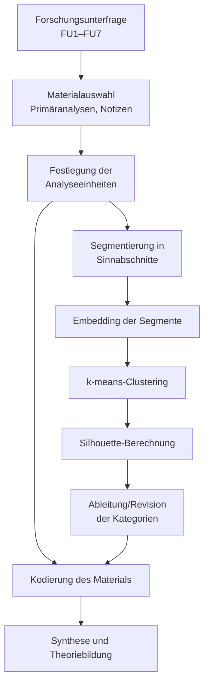

\newpage

# 4 Methodologie {#sec:4}

Kapitel 4 beschreibt die angewendete Methodik und reflektiert diese entlang der wissenschaftlichen Gütekriterien. Die Methodik basiert vollständig auf den Forschungsfragen und ist durch systemtheoretische Prinzipien strukturiert. Sie knüpft an die in \hyperref[sec:2]{Kapitel 2} entwickelten theoretischen Grundlagen und die in Kapitel \@ref(sec:3) dargestellte Architektur des Forschungsgegenstandes an und bereitet die Ergebnisdarstellung in \hyperref[sec:5]{Kapitel 5} vor. Die Kombination aus geplanten Methoden (z.B. Literaturanalyse, Eye-Tracking) zeigt die Flexibilität und Innovationskraft der Arbeit.

## 4.1 Forschungsparadigma und methodologischer Ansatz {#sec:4-1}

Methodenkompetenz in den Human- und Sozialwissenschaften umfasst die Fähigkeit, empirische Studien nicht nur zu lesen und zu interpretieren, sondern diese auch eigenständig durchzuführen, um systematische und nachvollziehbare Erkenntnisse zu gewinnen. In der empirischen Sozialforschung haben sich drei zentrale Forschungsparadigmen etabliert, die sich in ihren erkenntnistheoretischen Grundlagen und methodischen Logiken unterscheiden: (a) das quantitative Paradigma, basierend auf dem kritischen Realismus, (b) das qualitative Paradigma, verankert im Sozialkonstruktivismus, sowie (c) das Mixed-Methods-Paradigma, das im Pragmatismus wurzelt [@doring_forschungsmethoden_2023, Seite 4-5; @doring_forschungsmethoden_2023, Seite 32-33].

Während das quantitative Paradigma einen linear-strukturierten Forschungsprozess mit vorab formulierten Hypothesen postuliert [@doring_forschungsmethoden_2023, Kapitel 2.2], bildet das qualitative Paradigma einen zirkulären, offen strukturierten Forschungsprozess mit explorativen Fragestellungen ab [@doring_forschungsmethoden_2023, Kapitel 2.3]. Mixed-Methods-Ansätze [@doring_forschungsmethoden_2023, Kapitel 2.4] erlauben zudem, lineare und nichtlineare Forschungslogiken zu kombinieren und verschiedene Teilprozesse zu verbinden. Die Wahl des Paradigmas hängt dabei nicht primär von der Datenform (z.B. numerisch vs. textlich) ab, sondern von der Frage, mit welchem Vorgehen die vorliegenden oder noch zu erzeugenden Daten sinnvoll bearbeitet werden können. Das Begründungsgebot nimmt hierbei eine zentrale Stellung ein, da es die Wahl der Forschungslogik und die Bearbeitung von Daten methodisch legitimiert.

### 4.1.1 Vorüberlegungen zur Methodologie {#sec:4-1-1}

Methodisch herausfordernd in dieser Arbeit ist die Auflösung eines Dilemmas durch Verknüpfung der unterschiedlichen Facetten dieses bildungstheoretischen Forschungsvorhabens. Quantitative Daten, bspw. aus dem Eye-Tracking-Versuch und der begleitenden Umfrage, und qualitative Daten, bspw. die Ergebnisse aus der systematischen Literaturanalyse, sind miteinander in Bezug zu setzen, um übergeordnete Erkenntnisse zu generieren. Die Verwendung der beiden Paradigmen wird durch die Intention der Hauptforschungsfrage legitimiert, die Wissen um Muster und Regelmäßigkeiten im Learning Management System (LMS) erzeugen möchte. Insbesondere das vorgefundene Spannungsfeld von Subjektivität (Wahrnehmung der Akteure) und Objektivität (Kompetenzentwicklungssimulation) erfordert eine genauere methodische Betrachtung. Die sonst eher streng zugeordnete Forschungsmethodik, das quantitative Paradigma als deduktiv und das qualitative Paradigma als induktiv, greift hier zu kurz, da diese strikte Trennung die komplexe Wirkung des Forschungsgegenstands nicht abbilden kann [@reinders_uberblick_2022, Seite 157].

Forschungstätigkeiten in Gesundheitskontexten stehen zudem vor der Herausforderung, unterschiedliche methodische Strömungen diverser Disziplinen für sich einzunehmen. Insbesondere der Umgang mit tradierten Forschungsparadigmen muss angesichts der Komplexität intradisziplinärer Forschungstätigkeiten beantwortet werden. Gerade Komplexität, vielfältige Disziplinen und unterschiedliche Ressourcen sind miteinander in Einklang zu bringen. Damit dies gelingt, werden in dieser Arbeit die jeweiligen Stärken bestehender Forschungsmethoden in einen neuen, interdisziplinären und generativen Kontext gestellt [@niederberger_qualitative_2021, Seite 4-5].

Zwar verbindet das Mixed-Methods-Paradigma die beiden zuvor genannten Ansätze, steht jedoch in der Kritik, dass diese epistemologisch unvereinbar seien (z.B. Inkommensurabilitäts-These in Verbindung mit der Komplementaritäts-These) und daher methodisch fragil bleiben. Hinzu kommt, dass der Mixed-Methods-Ansatz häufig pragmatisch verwendet wird, wodurch quantitative und qualitative Verfahren unreflektiert nebeneinanderstehen. Auch die strikte Trennung der Paradigmen - das quantitative Paradigma als deduktiv und das qualitative Paradigma als induktiv - greift zu kurz, da sie die notwendige Integration von Regelmäßigkeiten (quantitative Ebene) und subjektiven Kontexten (qualitative Ebene) verhindert [@doring_forschungsmethoden_2023, Kapitel 2].

Das hier beschriebene Forschungsvorhaben erfordert aufgrund seiner zirkulären Komplexität einen mehrdimensionalen Ansatz, der die bisherigen Ebenen systematisch aufeinander bezieht. Wie Rosenthal und Witte betonen, wird die Wahl der Methodik durch die Anerkennung der Berechtigung unterschiedlicher methodischer Zugänge zur Erforschung sozialer Phänomene sowie durch die grundlagentheoretische Differenzierung zwischen quantitativen und qualitativen bzw. interpretativen Forschungsansätzen beeinflusst [@mays_quanti_2020, Seite 198-199]. In diesem Spannungsfeld versteht sich die vorliegende Arbeit als abstrakt-theoretische Grundlagenforschung. Damit soll der theoretische Anspruch eingelöst werden, methodische Vielfalt anzuerkennen und gleichzeitig eine systematische Integration der Perspektiven zu ermöglichen.

Die Auflösung des vorliegenden forschungsparadigmatischen Dilemmas erfolgt durch den Zugang zum Forschungsgegenstand über die konsequente Ableitung der Methoden aus den Forschungsfragen. Dieses Vorgehen ermöglicht nicht nur eine zielgerichtete Methodenauswahl, sondern auch eine Komplexitätsreduktion, die der Mehrdimensionalität des Forschungsgegenstandes gerecht wird und gleichzeitig die Stärken bestehender Methoden integriert.

### 4.1.2 Systemisch-forschungsfragengeleiteter Ansatz {#sec:4-1-2}

Der systemische, forschungsfragengeleitete Ansatz dieser Arbeit fußt vollständig auf den Forschungsfragen FU1 bis FU7 (s. Kapitel [@sec:1-2-3]), die aus dem Erkenntnisinteresse (s. Kapitel [@sec:1-1-1]) und dem bestehenden LMS-Produkt (s. Kapitel [@sec:3]) abgeleitet wurden. Diese Forschungsfragen strukturieren und leiten alle methodischen Entscheidungen und Analysen zur Bearbeitung. Die hier entwickelte Methodik, die den systemischen Ansatz mit der konsequenten Folgerung der Methoden aus den Forschungsfragen synthetisiert, ist in dieser spezifischen Form bisher nicht beschrieben. Damit werden systemtheoretische Prinzipien wie Interdependenz und Emergenz mit der gezielten Integration qualitativer und quantitativer Methoden verknüpft, um der zirkulären Komplexität des Forschungsgegenstandes gerecht zu werden.

Interdependenz bedeutet für die Methodologie des Forschungsprozesses, dass Forschungsfragen eng miteinander verknüpft sind und Wechselwirkungen zwischen qualitativen und quantitativen Daten erzeugen, wodurch die Mehrdimensionalität des Forschungsgegenstandes erfasst werden kann. Emergenz beschreibt ergänzend die Entstehung neuer Erkenntnisse [@bertalanffy_general_1968, Seite 16, 103] durch die Verknüpfung von Ergebnissen aus Literaturanalysen, Simulationen und empirischen Untersuchungen wie Eye-Tracking-Analysen und Befragungen. Rückkopplung bedeutet in diesem Fall, dass Analyseergebnisse iterativ in die Methodik zurückfließen und die weiteren Schritte beeinflussen, wodurch der Forschungsprozess dynamisch bleibt und sich kontinuierlich anpasst.

Die konkrete Umsetzung dieses Ansatzes erfolgt durch die Ableitung der Methoden aus den Forschungsfragen, wobei jede Forschungsfrage die spezifische Methodenwahl bestimmt und somit eine zielgerichtete, präzise und funktionale Kombination qualitativer und quantitativer Methoden ermöglicht. Qualitative Literaturanalysen werden systematisch mit qualitativen Methoden wie Eye-Tracking-Analysen (z.B. Heatmaps) und quantitativen Befragungen kombiniert, um eine ganzheitliche Perspektive zu ermöglichen. Die eingesetzten Methoden werden dabei passgenau auf die jeweiligen Forschungsfragen abgestimmt und berücksichtigen sowohl subjektive Akteurswahrnehmungen als auch objektive Daten zur Mustererkennung.

Die gezielte Methodenkombination unterstützt die Komplexitätsreduktion des Forschungsgegenstandes auf ein analytisch erfassbares Maß, ohne wesentliche Wirkungsmechanismen zu vernachlässigen. Durch die iterative Rückkopplung und systemische Verknüpfung der Ergebnisse entstehen neue Einsichten, die bei isolierter Betrachtung der Methoden verborgen bleiben würden. Dieser innovative Ansatz erweitert bestehende methodische Ansätze und schafft einen neuen Rahmen, der sowohl Offenheit als auch strukturelle Präzision ermöglicht.

Table: Zuordnung der Bearbeitungsmethoden zu den Forschungsunterfragen {#tab:methoden_FU}

| Forschungsunterfrage | Bearbeitungsmethode | Erfüllungskriterien |
| --- | --- | --- |
| **FU1: Akzeptanz und Nützlichkeit** | Qualitative Metaanalyse zur Darstellung des aktuellen Forschungsstandes im Kontext digitaler Bildungsräume [@doring_forschungsmethoden_2023, Seite 194]. | Darstellung und Einordnung der Akzeptanz- und Nutzenargumente in das Gesamtgefüge. |
| **FU2a: Effekt auf Lernende** | Evaluationsframework nach Kirkpatrick sowie Training Evaluation Inventory zur Wirksamkeitsanalyse der Lernprozesse [@kirkpatrick_evaluating_1998; @ritzmann_training_2014; @ritzmann_tei_2020]. | Quantitative Evaluation der Kompetenzentwicklung und ihrer Unsicherheiten. |
| **FU2b: Effekt auf Lehrende** | Halbstrukturiertes Gruppeninterview im Face-to-Face-Kontakt mit Lernenden und Lehrenden [@doring_forschungsmethoden_2023, Kapitel 3.2; @doring_forschungsmethoden_2023, Kapitel 10.2]. | Ableitung generalisierbarer Aussagen zu wahrgenommenen Effekten und Einflussfaktoren. |
| **FU3: Didaktische und technologische Merkmale** | Theoriearbeit zur systemisch-konstruktivistischen Gestaltung des LMS und zur Beschreibung seiner Architektur [@doring_forschungsmethoden_2023, Kapitel 6.3.1]. | Herleitung, Beschreibung und Absicherung der relevanten Merkmale des LMS. |
| **FU4a: Bildungswissenschaftliche Mechanismen** | Qualitative Inhaltsanalyse nach Mayring sowie deren Weiterentwicklungen [@mey_qualitative_2010; @mayring_neuere_2008]. | Herleitung, Beschreibung und Absicherung der bildungswissenschaftlichen Wirkmechanismen. |
| **FU4b: Technisch-gestalterische Mechanismen** | Quantitative Beobachtung (inkl. Eye-Tracking) und simulationsgestützte Theorieprüfung [@doring_forschungsmethoden_2023, Kapitel 10.1.3; @doring_forschungsmethoden_2023, Kapitel 6.3.1]. | Datenerhebung, Auswertung sowie Rückbindung an die theoretische Modellierung. |
| **FU5: Möglichkeiten und Grenzen** | Kombination aus Qualitativer Inhaltsanalyse und SWOT-Analyse zur systemischen Bewertung [@mey_qualitative_2010; @niederberger_swot-analyse_2015]. | Strukturierte Darstellung der Potenziale und Limitationen des Trainingsmodells. |
| **FU6: LMS als Kompetenzerwerbssystem** | Systemische Theoriearbeit zur Verschränkung von Kompetenzforschung und LMS-Architektur [@doring_forschungsmethoden_2023, Kapitel 5]. | Transfer und Einordnung der Ergebnisse in ein konsistentes Kompetenzentwicklungsmodell. |
| **FU7: Erweiterung von Kausalgesetzen** | Grounded-Theory-basierte „Einfall und Theorieentwicklung“ sowie Analyse des Technologiedefizits [@pentzold_praxis_2018, Einleitung; @luhmann_technologiedefizit_1982]. | Entwicklung und Ableitung eines kausalen Ursachen-Wirkungstheoriemodells. |

Die Tabelle fasst die Forschungsunterfragen zusammen und verknüpft sie mit den jeweils eingesetzten Methoden sowie ihren Erfüllungskriterien. Auf diese Weise wird nachvollziehbar, wie qualitative Literaturarbeit, empirische Erhebungen (Eye-Tracking, Interviews, Umfragen) und simulationsbasierte Verfahren im Zusammenspiel verwendet wurden, um die unterschiedlichen Facetten des Lernmanagementsystems abzubilden.

Methodische Konsequenzen der Forschungsfragen

- Die Forschungsfragen bestimmten:
  - Auswahl und Strukturierung der Literatur.
  - Entwicklung von Kategorien und Schlagworten zur thematischen Verknüpfung.
  - Kombination und Anpassung klassischer Methoden.
- **Begründung**:
  - Die Komplexität des digitalen Bildungsraums erforderte eine Methodenkombination, um die Forschungsfragen adäquat zu beantworten.

## 4.2 Datenerhebung {#sec:4-2}

### 4.2.1 Systematische Literaturrecherche {#sec:4-2-1}

Die systematische Literaturrecherche bildet die Grundlage für die Beantwortung der Forschungsfragen FU1, FU3, FU4a und FU6. Ziel ist hierbei, ein umfassendes Verständnis der bestehenden wissenschaftlichen Diskussionen und Erkenntnisse im Bereich digitaler Bildungsräume zu erlangen. Die Analyse umfasst insgesamt 2.650 wissenschaftliche Arbeiten, die algorithmisch aus verschiedenen Datenbanken extrahiert und thematisch kategorisiert wurden.

Bemerkenswert ist, dass die Auswahl nicht durch subjektives Eingreifen, thematische Vorannahmen oder bewusste Schwerpunktsetzungen erfolgte, sondern ausschließlich durch algorithmisch rekonstruierte Dichtefelder innerhalb der deduktiv-numerischen Vektorräume. Die Aussagen, die aus diesem Literaturfeld hervorgehen, können somit als besonders stabil, kohärent und epistemisch tragfähig gewertet werden - sie stellen gewissermaßen den empirischen Kern des aktuellen Diskurses dar.

Table: Jährliche Entwicklung der Clusterbildung und Silhouette-Scores \label{tab:cluster_silhouette}

| Jahr | $n$ | Cluster | Silhouette-Score |
| --- | --- | --- | --- |
| 2010 | 7 | 2 | 1.0000 |
| 2011 | 29 | 4 | 0.9655 |
| 2012 | 7 | 3 | 0.8571 |
| 2013 | 28 | 4 | 1.0000 |
| 2014 | 24 | 4 | 0.9583 |
| 2015 | 28 | 3 | 1.0000 |
| 2016 | 25 | 3 | 1.0000 |
| 2017 | 98 | 3 | 1.0000 |
| 2018 | 95 | 4 | 0.9895 |
| 2019 | 202 | 3 | 1.0000 |
| 2020 | 303 | 4 | 0.9968 |
| 2021 | 377 | 4 | 0.9854 |
| 2022 | 430 | 4 | 0.9916 |
| 2023 | 899 | 4 | 0.9702 |
| 2024 | 780 | 4 | 0.9208 |
| 2025 | 192 | 4 | 0.9696 |
| **Summe** | 3523 | — | — |

<<<Abbildung Zeitreihe einfügen>>>

Die Visualisierung zeigt eine Kombination aus zwei zentralen Metriken für die spätere Analysequalität:
    Silhouette-Scores (blaue Linie, linke Y-Achse): Ein Maß für die Kohärenz und Trennschärfe der Clusterbildung.
    Fallzahlen n (graue Balken, rechte Y-Achse): Anzahl der analysierten Einträge pro Jahr.

Interpretation der Kurve

1. 
Allgemeines Muster (2010-2025):
    Von 2010-2017 zeigen sich trotz geringer Fallzahlen ($n < 100$) durchweg exzellente Silhouette-Scores ($\approx 1.0$).
    2018-2022 bleibt der SC durchgehend über dem Median ($Q_2 \approx 0.9906$), bei gleichzeitig signifikant steigenden Fallzahlen.
    Ab 2023 fällt der Score unter $Q_3$ und erreicht 2024 einen Tiefpunkt von 0.9208, während die Fallzahl mit 780 hoch bleibt.
    2025 zeigt sich eine leichte Erholung des SC (0.9696), jedoch bei stark gesunkenen Fallzahlen.

2. 
Quartile & Bias-Schwellen:
    Q1 ($\approx 0.9686$): Markiert die Schwelle, ab der Werte als „niedrig“ gelten.
    $Q_3 = 1.0000$: Zeigt an, dass ein Viertel aller Jahre perfekte Clusterkohärenz aufweist - ein selten hoher Wert.
    Fatigue Threshold ($0.96$): Ab diesem Wert könnte eine inhaltliche Erschöpfung im Datenraum interpretiert werden.
    Circadian Optimum & Winsorisierter Median ($\approx 0.9906$): Dienen als kognitives Optimum bzw. robuste Mittelwerte der Analysequalität.

Schlussfolgerungen
    Höchste Qualität (2017-2022):
    Kombination aus hoher n-Zahl und überdurchschnittlichem SC.
    Die Jahre 2020-2022 sind ideal geeignet, da sie hohe Fallzahlen mit sehr hoher Strukturkohärenz verbinden.
    Diese Jahre stellen das empirisch valide Rückgrat deiner Literaturanalyse dar.
    Frühe Jahre (2010-2016):
    Extrem hoher SC bei kleinen Fallzahlen.
    Inhaltlich hochwertig, aber eingeschränkte Generalisierbarkeit.
    Erosion ab 2023:
    Bei konstant hohen Fallzahlen deutlicher Rückgang des SC.
    Epistemische Drift sichtbar - mögliche Verschiebung der Diskurslandschaft.
    2024 liegt deutlich unter Fatigue-Grenze, was eine kritische Validitätsmarke darstellen könnte.


Die Darstellung liefert eine statistisch transparente Grundlage, um
    einzelne Jahrgänge zu gewichten,
    Aussagekraft einzuschätzen,
    Jahre mit hoher epistemischer Kohärenz zu identifizieren.

Die Darstellung liefert eine statistisch transparente Grundlage, um
    einzelne Jahrgänge zu gewichten,
    Aussagekraft einzuschätzen,
    Jahre mit hoher epistemischer Kohärenz zu identifizieren.

Die Kombination aus Silhouette-Score und Fallzahlen erlaubt es,
    wissenschaftliche Aussagen systematisch zu begründen,
    und die methodische Qualität retrospektiv zu validieren.

### 4.2.2 Systematisches Literaturmanagement {#sek:4-2-2}

Zur Vorbereitung der Datenanalyse wurden in Zotero 12 priorisierte Suchordner (0 bis b) angelegt. Jeder Ordner enthält eine Kombination aus Eintragstyp und Schlagwortkette. Die Titel wurden in der festgelegten Reihenfolge geprüft und beim ersten Treffer mit dem entsprechenden Tag versehen. Die folgende Tabelle zeigt die vollständige Struktur der Suchordner:

Anhang X: Struktur der Suchordner in Zotero nach semantischen Ebenen

Die folgende Tabelle dokumentiert die finale Systematik der Zotero-Suchordner. Diese ist entlang primärer, sekundärer und tertiärer Suchbegriffe gegliedert. Jeder Ordner beinhaltet strukturierte Suchen nach Eintragstypen und thematischen Schlagwörtern. Die ID der Ordner (z. B. `S:01`) korrespondiert mit der Ordnerstruktur in Zotero und wurde zur Tag-Kodierung verwendet.

Primäre Suchbegriffe

Table: Übersicht Primäre Suchbegriffe \label{tab:primaere_suchbegriffe}

| **Ordner-ID** | **Begriff**                | **Synonyme / Varianten**                  |
| ------------- | -------------------------- | ----------------------------------------- |
| `S:01`        | Learning Management System | LMS, Lernmanagementsystem, Kursplattform  |
| `S:02`        | Online-Lernplattform       | Lernplattform, Digitale Plattform         |
| `S:03`        | Online-Lernumgebung        | Virtuelle Lernumgebung, Digitale Umgebung |
| `S:05`        | E-Learning                 | Elektronisches Lernen, Digitales Lernen   |

Die primären Suchbegriffe adressieren den unmittelbaren Forschungsgegenstand. Sie bündeln alle Kombinationen, in denen das LMS oder der digitale Bildungsraum direkt benannt ist. Für diese Cluster gilt eine hohe Sichtungsquote (mindestens 80 %), weil sie die Kernbefunde zur Wirkweise des eingesetzten Systems liefern und den Ausgangspunkt für die Ableitung der Forschungsunterfragen bilden.

Sekundäre Suchbegriffe

Table: Übersicht Sekundäre Suchbegriffe \label{tab:sekundaere_suchbegriffe}

| **Ordner-ID** | **Begriff**         | **Synonyme / Varianten**                             |
| ------------- | ------------------- | ---------------------------------------------------- |
| `S:04`        | MOOC                | Massive Open Online Course                           |
| `S:06`        | Bildungstechnologie | EdTech, Technologie im Bildungssektor                |
| `S:07`        | Digitale Medien     | Medienkompetenz, Medientechnologie                   |
| `S:08`        | Blended Learning    | Integriertes Lernen, Hybridunterricht                |
| `S:09`        | Digitales Lernen    | Digital Learning (dt.), technologiegestütztes Lernen |
| `S:12`        | Digital Learning    | Digitales Lernen (engl.), tech-enhanced learning     |

Sekundäre Begriffe erweitern den Blick auf didaktische und organisatorische Kontexte. Sie erfassen hybride Arrangements, mediale Settings und bildungstechnologische Konzepte, die das LMS funktional einbetten. Die Sichtungsquote liegt hier bei 50 %, weil diese Ebene vor allem der Kontextualisierung und der Identifikation flankierender Mechanismen dient.

Tertiäre Suchbegriffe

Table: Übersicht Tertiäre Suchbegriffe \label{tab:tertiäre_suchbegriffe}

| **Ordner-ID** | **Begriff**     | **Synonyme / Varianten**                |
| ------------- | --------------- | --------------------------------------- |
| `S:10`        | Online Lernen   | Lernen im Netz, Web-basiertes Lernen    |
| `S:11`        | Online Learning | Online-based education, remote learning |

Tertiäre Begriffe erschließen angrenzende Innovations- und Technologiefelder, die Impulse für zukünftige Erweiterungen liefern. Sie besitzen die niedrigste Sichtungsquote (15 %), werden jedoch zur Validierung neuer Trends genutzt und helfen, emergente Muster in der Literatur frühzeitig zu erkennen.

## 4.3 Datenanalyse {#sec:4-3}

### 4.3.1 Grundlogik der Datenanalyse: Analysen erster bis dritter Ordnung {#sec:4-3-1}

Die Datenanalyse folgt einem dreistufigen, systemisch gedachten Beobachtungsmodell, das deduktive Kategorienbildung mit probabilistischer Validierung verschränkt. Damit bleibt jeder Schritt eng an die Forschungsunterfragen gekoppelt und gleichzeitig anschlussfähig an die dokumentarischen Qualitätsanforderungen nach Döring [@doring_forschungsmethoden_2023].

- **Analysen erster Ordnung (Primäranalysen):** Einzelquellen werden entlang vordefinierter Kategorien (Akzeptanz, Nutzen, Grenzen usw.) ausgewertet. Das Ergebnis ist eine strukturierte, FU-spezifische Inhaltsanalyse pro Dokument.
- **Analysen zweiter Ordnung (Sekundäranalysen):** Die Primäranalysen einer FU werden gespiegelt, verdichtet und theoriebezogen gerankt. Daraus entstehen deduktive Cluster, SWOT-Profile und Korrelationsmatrizen.
- **Analysen dritter Ordnung (P-QIA):** Die probabilistisch-qualitative Inhaltsanalyse überführt die Ergebnisse der zweiten Ebene in einen Vektorraum, prüft sie über k-means-Clustering und bewertet die Kohärenz mittels Silhouette-Scores.

Gemeinsam bilden diese Ordnungen einen iterativen Zyklus: Jede Stufe liefert die Grundlage für die nächste und fließt nach erfolgter Validierung wieder in die Forschungsunterfragen zurück.

### 4.3.2 Analyse 1. Ordnung: Primäranalysen {#sec:4-3-2}

Die Primäranalysen bilden das Fundament der weiteren Verdichtungen. Jede wissenschaftliche Quelle wird mit einem dedizierten Prompt ausgewertet, der aus der jeweiligen Forschungsunterfrage abgeleitet ist (z.B. `FU5 Primäranalysen (125).md`). Die Prompts stellen sicher, dass alle Analysen identische Bausteine enthalten (Kontext, Argument, Limitationen, Implikationen).

1. **Quellenimport und Tagging:** Aus Zotero exportierte Einträge werden über ihre Tags (`Promotion:Literaturanalyse` + Argumentationskategorie) den FUs zugeordnet.
2. **Promptbasierte Auswertung:** GPT erzeugt strukturierte Markdown-Analysen, die deduktiv definierte Kategorien ausfüllen und mit Originalzitaten aus der Quelle verknüpfen.
3. **Dokumentation:** Jede Analyse erhält einen Header mit Metadaten (Quelle, Datum, Prompt-Version). Die Ergebnisse liegen versioniert in Obsidian vor und können jederzeit erneut validiert werden.
4. **Qualitätssicherung:** Quellen, die inhaltlich nicht in den digitalen Bildungsraum passen, werden bereits auf dieser Ebene identifiziert und als „irrelevant" markiert. So bleiben nur überprüfte Texte im weiteren Prozess.

### 4.3.3 Analyse 2. Ordnung: Sekundäranalysen {#sec:4-3-3}

Die zweite Ordnung synthetisiert alle Primäranalysen einer Forschungsunterfrage. Die entsprechenden Prompts (z.B. `FU1 Prompt Sekundäranalyse.md`) führen mehrere Einzelanalysen zusammen, spiegeln sie an theoretischen Bezugsrahmen und erzeugen daraus erste Metastrukturen:

- **Vergleich und Ranking:** Wiederkehrende Aussagen werden identifiziert, divergierende Befunde kontrastiert und entlang der FU priorisiert.
- **Theoriebasierte Spiegelung:** Konzepte wie TAM, SDT oder TPACK dienen als Referenz, um die Primäranalysen in bestehende Modelle einzubetten.
- **Manuelle Clusterlogik:** Vor der probabilistischen Verdichtung entstehen deduktive Cluster (z.B. „Akzeptanzmuster" oder „Risiko-Faktoren"), SWOT-Profile oder Korrelationsmatrizen.

Damit liefert die zweite Ordnung den semantischen Rahmen, in dem die probabilistische Verdichtung der dritten Ordnung operiert.

### 4.3.4 Analyse 3. Ordnung: Probabilistisch-Qualitative Inhaltsanalyse (P-QIA) {#sec:4-3-4}

Die P-QIA ergänzt die klassischen Methoden um eine reproduzierbare, embedding-basierte Strukturierung. Sie versteht sich als semantische Analyse im Sinne einer regelgeleiteten Erschließung, Verdichtung und relationalen Zuordnung bedeutungstragender Einheiten.

#### Konzept und Abgrenzung

- Deduktive Rahmung durch die Forschungsunterfragen (FU1–FU7).
- Segmentierung aller Texte in Sinnabschnitte (1–3 Sätze; bei FU7 1–2 Sätze).
- Transformation der Segmente in hochdimensionale Embeddings.
- k-means-Clustering und Gütebewertung via Silhouette-Koeffizient.
- GPT-gestützte Label-Vorschläge, die durch die Forschende überprüft und theoretisch validiert werden.
- Ableitung konsistenter Kodiermanuale mitsamt Ankerbeispielen.

Large Language Models fungieren hierbei nicht als autonome Erkenntnissubjekte, sondern als strukturierende Werkzeuge. Steuerung und Interpretation verbleiben vollständig bei der Forschenden.

#### Algorithmische Umsetzung

Der Workflow wurde in Anlehnung an Mayring gestaltet und verbindet klassische Schritte mit probabilistischen Erweiterungen:

1. **Forschungsunterfrage und Materialfestlegung (Mayring)** – Definition der FU und Auswahl des Materials (Primäranalysen, Notizen, Quellen).
2. **Festlegung der Analyseeinheiten (Mayring)** – Definition von Sinnabschnitten und Kontextebenen.
3. **Segmentierung (P-QIA)** – Automatische Zerlegung der Texte in 1–3 Sätze (bei FU7 1–2 Sätze) inklusive Dokumentation der Regeln.
4. **Embedding und probabilistische Strukturierung (P-QIA)** – GPT-Embeddings und k-means-Clustering mit FU-spezifischem *k*.
5. **Qualitätssicherung der Cluster (P-QIA)** – Berechnung des Silhouette-Koeffizienten und Bereinigung instabiler Cluster.
6. **Ableitung und Revision der Kategorien (Mayring + P-QIA)** – LLM-gestützte Label, theoretische Validierung, Kodiermanual.
7. **Kodierung des Materials (Mayring)** – Anwendung des Manuals, Dokumentation von Grenzfällen.
8. **Synthese, Metamodellierung und Theoriebildung (Mayring + P-QIA)** – Rückbindung an die FU und Dokumentation der Kennwerte.



#### Validierung und empirische Kennwerte

Die Datei [[P-QIA Statistik]] dokumentiert Segmentierungsregeln, Embedding-Modelle, gewählte *k*-Werte und Silhouette-Mittelwerte für alle FUs. Über alle Forschungsunterfragen hinweg liegt *k* zwischen 8 und 15, die Silhouette-Werte bewegen sich zwischen 0.87 und 0.93 (Mittelwert ca. 0.89).

|FU|k|Silhouette|Interpretation nach Rousseeuw (1987)|
|---|---|---|---|
|FU1|8|0.91|sehr starke Clustertrennung|
|FU2a|12|0.88|starke Clusterstruktur|
|FU2b|14|0.89|starke Clusterstruktur|
|FU3|15|0.87|starke Clusterstruktur|
|FU4a|12|0.90|sehr starke Clustertrennung|
|FU4b|12|0.92|nahezu perfekte Trennung|
|FU5|14|0.88|starke Clusterstruktur|
|FU6|12|0.89|starke Clusterstruktur|
|FU7|10|0.93|nahezu perfekte Trennung|

Rousseeuw [-@rousseeuw_silhouettes_1987] bewertet Werte > 0,70 als stark, > 0,90 als nahezu perfekt. Die dokumentierten Kennwerte zeigen somit, dass die vektorbasiert gefundenen Cluster sowohl interpretativ als auch statistisch stabil sind. Ergänzend verweisen Bommasani et al. (2021), Bhullar et al. (2024) sowie Low & Kalender (2023) auf die Reproduzierbarkeit deterministischer Pipelines.

#### Qualitätssicherung und Beispiele

Die KI-gestützte Analyse dient auch der Plausibilitätsprüfung. So wurde der Artikel von Westlake und Mahan [-@westlake_international_2023] – trotz korrekter Schlagwortzuordnung – als thematisch irrelevant markiert, weil er BDSM-Praktiken untersucht und somit keinen Bezug zum digitalen Bildungsraum aufweist. Diese Prüfung geht über eine reine Stichwortsuche hinaus und verhindert, dass fachfremde Texte in die Auswertung gelangen.

Zur Überprüfung der Trennschärfe wurde die P-QIA auf die klassisch kodierte Studie von Kerman et al. [-@kerman_online_2024] angewendet. Die KI-gestützte Analyse erzielte einen Silhouette-Score von 0,92, die menschliche Kodierung lediglich 0,62. Damit wird sichtbar, dass die probabilistische Validierung methodische Schwächen in manuellen Kodierungen offenlegt und als Ergänzung zur klassischen Inhaltsanalyse fungiert.

#### Test- und Diskursbeiträge

Die Validierung umfasst automatische Kodierungstests, erneute Clusterbildungen mit k-means sowie Mehrfachberechnungen des Silhouette-Scores, um die Stabilität über verschiedene Läufe hinweg zu belegen. Zudem wurde geprüft, ob klassische Tools wie ATLAS.ti oder NVivo die gleichen Prüfungen leisten können. Da diese Werkzeuge primär der Unterstützung menschlicher Kodierung dienen, liefern sie keine belastbaren Kennwerte zur objektiven Clustervalidierung. Die P-QIA adressiert damit eine Lücke in der aktuellen Diskussion (z.B. [@biswas_chatgpt_2023; @van_niekerk_addressing_2025; @storey_ai_2023; @parker_negotiating_2024]), indem sie ein überprüfbares Verfahren zur Qualitätsbewertung KI-gestützter Analysen bereitstellt.

#### Rolle des Menschen und Grenzen

Trotz der probabilistischen Komponente bleibt die interpretative Verantwortung grundsätzlich menschlich. Grenzen ergeben sich aus:

- **Parameter- und Modellvariabilität:** Embedding-Modelle und Clusterparameter beeinflussen die Ergebnisse; Entscheidungen müssen dokumentiert und begründet werden.
- **Black-Box-Charakter der LLMs:** Interne Repräsentationen sind nur begrenzt interpretierbar. Transparente Protokolle mildern, aber eliminieren das Problem nicht.
- **Gefahr der Scheinobjektivität:** Statistische Kennwerte ersetzen keine inhaltliche Reflexion. Sie fungieren als Unterstützungs-, nicht als Entscheidungsinstanz.
- **Ethik und Bias:** Fragen nach Datensouveränität, Verzerrungen und Verantwortung (vgl. [@biswas_chatgpt_2023]) müssen explizit adressiert werden.

### 4.3.5 Mehrdimensional-analytische Clustervalidierung (mdaCV) {#sec:4-3-5}

Im Zuge der systematischen Literaturarbeit wurde die statistische Clusteranalyse zunächst als Ergänzung zur P-QIA ausprobiert. Die Anwendung des $k$-Means-Algorithmus auf einen bereits deduktiv strukturierten Quellenkorpus bestätigte die bestehenden semantischen Erkenntnisse. Diese Stabilität wurde zur Grundlage eines eigenständigen Validierungsverfahrens, der mehrdimensional-analytischen Clustervalidierung (mdaCV). Sie spannt einen semantischen Raum entlang theoretisch begründeter Achsen (Kategorien, Forschungsfragen, Schlagworte) auf, positioniert die Datenpunkte darin und bewertet deren Trennschärfe über Silhouette-Scores [-@rousseeuw_silhouettes_1987].

Die Methode wurde iterativ entwickelt, auf reale, manipulierte und zufällige Datensätze angewandt und ist samt Skripten (z.B. `analyse_korrelation.py`, `analyse_netzwerk.py`) unter https://github.com/jochen-hanisch/charite-promotion dokumentiert. Ihre theoretische Herleitung fußt auf drei Komponenten:

1. **Deduktive Strukturierung des semantischen Raums:** Theoriegeleitete Dimensionen ([@baur_datenaufbereitung_2022; @baur_qualitative_2022]) definieren die Achsen und ermöglichen eine geordnete Positionierung der Daten.
2. **Geometrische Modellierung:** Begriffliche Relationen werden in numerische Vektoren überführt. Konzepte wie CBOW/Skip-gram [@mikolov_efficient_2013] zeigen, dass sich so hochdimensionale, semantisch präzise Repräsentationen erzeugen lassen.
3. **Statistische Validierung:** Die vorstrukturierten Daten werden mittels $k$-Means analysiert. Die Anzahl der Cluster $k$ wird theoriegeleitet festgelegt oder durch Silhouette-Kennwerte feinjustiert [@sud_k-means_2020; @rakhlin_stability_nodate].

Im Verlauf der Dissertation wurde die mdaCV als dauerhafte Feedback-Schleife eingesetzt. Beispielhaft stieg nach der Bereinigung eines Korpus auf $n = 3502$ Quellen der Silhouette-Score von 0,964 auf 0,9751 – ein Hinweis auf semantische Schärfung. Nach erneuter Einbindung ausgeschlossener Konferenzbände ($n = 3572$) blieb der Score mit 0,9754 stabil. Selbst minimale Änderungen (ein entfernter Buchteil, $n = 3571$) führten zu messbaren Differenzen von 0,001 und machten mikrostrukturelle Effekte sichtbar.

Die mdaCV fungiert damit als seismografisches Instrument: Sie verbindet deduktive Kategorienstrukturen mit quantitativ validierbaren Kennwerten und eröffnet Analysepfade für mikrostrukturelle Dynamiken in semantisch strukturierten Räumen.

### 4.3.6 Epistemische Verlustfunktion (\(\varepsilon\)) als Integritätsmaß {#sec:4-3-6}

Allein der Silhouette-Score erfasst nur die geometrische Separierbarkeit von Clustern. Um zusätzlich die Datenvollständigkeit zu berücksichtigen, wurde eine epistemische Verlustfunktion \(\varepsilon\) eingeführt. Sie kombiniert die Clusterdifferenzierungsleistung mit dem Verhältnis aus intendierter und tatsächlich verarbeiteter Quellenzahl und fungiert als Monitoring-Größe für datenintensive Prozesse.

Formel zur Definition der Verlustfunktion:

```{=latex}
\begin{equation}
\label{eq:verlust}
\varepsilon = (1 - S) + \frac{n_{\text{Soll}} - n_{\text{Ist}}}{n_{\text{Soll}}}
\end{equation}
```

Ein Beispiel mit \(S = 0{,}9754\), \(n_{\text{Soll}} = 3585\) und \(n_{\text{Ist}} = 3583\) ergibt \(\varepsilon \approx 0{,}0252\). Der Wert zeigt, dass trotz kleiner Datenlücken eine hohe Integrität erreicht wird. Die Verlustfunktion eignet sich insbesondere als Frühwarnsystem (Verlust von Quellen, unplausible Score-Sprünge) und als zusätzlicher Qualitätsindikator in reproduzierbaren Pipelines.

### 4.3.7 Synthese: Methodische Bedeutung für die Gesamtanalyse {#sec:4-3-7}

Die strukturierte Abfolge aus Analysen erster bis dritter Ordnung, P-QIA, mdaCV und epistemischer Verlustfunktion verbindet deduktive Theorietreue mit datenbasierter Validierungslogik. Damit entsteht ein geschlossenes, aber transparentes System, das qualitative Tiefenanalyse, probabilistische Robustheit und kontinuierliche Selbstüberwachung vereint. Diese Methodik bereitet den Boden für die simulationsgestützten Modellierungen in Kapitel \hyperref[sec:4-4]{4.4}.
## 4.4 Simulationsgestützte Modellierung der Kompetenzentwicklung {#sec:4-4}

## 4.5 Reflexion der Methode {#sec:4-5}

Die kritische Methodenreflexion hat den Zweck, die eigene Arbeitsweise transparent, nachvollziehbar und anhand des wissenschaftlichen Qualitätskriteriums „Methodische Strenge“ [@doring_forschungsmethoden_2023, Seite 89-90] beurteilbar zu machen. Inwiefern diese Arbeit die Anforderungen an eine methodisch saubere, nachvollziehbare und theoriegeleitete Forschung erfüllt, ist in diesem Kapitel zu klären.

Als Herleitungsgrundlage kann ein systemisch-konstruktivistisches Verständnis von Erkenntnis angesetzt werden, das mit bewährten Evaluationsmodellen (z. B. dem CIPP-Modell nach Stufflebeam in [@hanisch_nachhaltiges_2017, Kapitel  3.1]) sowie analytischen Verfahren wie Korrelations- und deduktiven Clusteranalysen verbunden wird. Diese Kombination ist weder beliebig noch additiv, sondern strukturell aufeinander bezogen und somit theoriekompatibel. Die Auswahl der Methoden ergibt sich aus der forschungsfragengeleiteten Logik. Sie folgt keiner Paradigmentreue, sondern einem funktionalen Verständnis von Methodeneinsatz und hat zur Folge, dass qualitative und quantitative Verfahren entlang der FU dort eingesetzt werden, wo sie zur Bearbeitung beitragen. Die theoretischen Begriffe (z. B. Kompetenz, Selbstorganisation, Nachhaltigkeit) werden auf konkrete Analyseebenen übertragen, etwa über Prädiktorvariablen (z. B. PV1a-PV3 bei Hanisch [-@hanisch_nachhaltiges_2017, Kapitel  3.4]) oder KI-gestützte Analysen . Sämtliche Analyseprozesse, von der Auswahl der Quellen, über die Generierung und Anwendung der Prompts, bis hin zur Auswertung und Rückführung in die FU, sind dokumentiert, versioniert und theoretisch hergeleitet. Die Struktur folgt einer nachvollziehenden analytischen Logik, die von der FU über die erste KI-gestützte Analyse bis zur Metaebene mit Clusterauswertungen übergeht. Als kuratierende Hilfsmittel unterstützen digitale Werkzeuge, unter deren Verwendung das Literatur- und Notizmanagement (Zotero), die Versionierungen (Gitea), sowie die statistischen Berechnungen und Visualisierungen (Python) durchgeführt werden konnten. Diese Kombination von Methoden und Werkzeugen gewährleistet sowohl Reproduzierbarkeit als auch in sich Konsistenz.

Bereits in der Zusammenstellung der Analyseeinheiten werden bewusste Entscheidungen getroffen, zum Beispiel zur Nichtberücksichtigung von Masterarbeiten und reiner „grauer Literatur“ in bestimmten Clusteranalysen. Diese werden nicht nur transparent dargestellt, sondern auch theoriebezogen begründet. Dadurch erhöht sich die Validität der Aussagen.

Ein wesentlicher Bestandteil des methodischen Vorgehens ist die fortlaufende Selbstprüfung und Justierung. Dazu gehören die Prüfung der Wirksamkeit der Prompts, die Diskussion der Silhouette-Werte zur Clustertrennschärfe, aber auch die bewusste Unterscheidung zwischen Analysen 1. Ordnung (einzelne Quelle) und Analysen 2. Ordnung (übergreifende Auswertung, Rückführung auf die FU).
Mein methodisches Vorgehen erfüllt, trotz seiner systemisch-flexiblen Struktur, zentrale Anforderungen wissenschaftlicher Strenge. Die Methoden sind theoriebasiert, nachvollziehbar, funktional gewählt und systematisch eingesetzt. Gleichzeitig erweitere ich die bestehende Methodendiskussion durch den reflektierten Einsatz generativer KI als epistemisches Werkzeug und durch die Integration klassischer Evaluationsverfahren in ein offenes, komplexitätssensibles Design.

Diese Vorgehensweise ist nicht nur methodisch tragfähig, sondern auch ein konkreter Beitrag zur Weiterentwicklung digital-epistemischer Forschung in Bildungssettings.

Selbstverständlich muss im Sinne der wissenschaftlichen Redlichkeit ([@doring_forschungsmethoden_2023, Seite 130-131]) und in Anbetracht der aktuellen kritischen Haltung gegenüber generativen bzw. künstlichen Intelligenzen das hier gewählte methodische Vorgehen nicht nur dargelegt, sondern im besonderen Maße nachvollziehbar erläutert werden. Als Grund für diese Erklärung kann angeführt werden, dass die wissenschaftliche Eigenleistung infrage gestellt werden kann, wenn die Analysen GPT-basiert durchgeführt werden. Das methodische Vorgehen, d. h. die Durchführung inhaltsanalytischer Einzelanalysen mithilfe von GPT und deren anschließende Zusammenführung durch eine deduktive, auf Forschungsunterfragen ausgerichtete Cluster- und Metaanalyse, stellt eine eigenständige wissenschaftliche Leistung dar. Diese kann durch folgende Begründungslogik belegt werden:

- Selbständige Definition erkenntnisleitender Kategorien: Die zugrunde liegenden Kategorien und Kodierungen (wie z.B. „Akzeptanz“, „Nützlichkeit“, „Effekt“, „Gestaltung“) wurden aus den Forschungsunterfragen eigenständig abgeleitet. Diese Kategorien sind als deduktive Filter anzusehen, welche die Ausrichtung und Vergleichbarkeit der GPT-gestützten Einzelanalysen ermöglichen. Ohne diese Struktur blieben die Ergebnisse der Analysen unsystematisch und nicht aggregierbar.
- Eigenständige wissenschaftliche Durchführung der Metaanalyse: Die Analysen führen zu keiner Aggregation klassischer Primärforschungsergebnisse, sondern werden zu semantisch strukturierten, vorbereiteten GPT-Einzelanalysen verdichtet. Diese enthalten bereits wissenschaftliche Extrakte, deren Struktur vorgegeben wird. In einem weiteren Schritt wird geprüft, ob die Ergebnisse im Hinblick auf die Forschungsunterfragen widerspruchsfrei, konsistent und saturiert sind. Strukturell entspricht dies einem theoriegeleiteten Validierungsschritt, wobei sowohl die analytischen Kategorien als auch die Aussagekraft der Analysen überprüft werden. 
- GPT als analytisches Werkzeug, nicht als Urheberschaft: GPT wird ausschließlich als analytisches Instrument eingesetzt, vergleichbar mit etablierten Softwarelösungen wie SPSS oder MaxQDA. Die Verantwortung für Struktur, Steuerung und Auswertung lagen zu jeder Zeit vollständig in der eigenen Hand. Die wissenschaftliche Eigenständigkeit resultiert somit nicht aus der Textgenerierung, sondern aus der theoretischen Fundierung und Auswertung der Ergebnisse.
- Geschlossenes System analytischer Selbstreferenz: Das Verfahren umfasst einen zyklischen Prozess: vom Theorierahmen über die empirische Anreicherung, die GPT-Analyse erster Ordnung, die Clusterdarstellung bis hin zur Rückbindung an die handlungsleitenden Forschungsunterfragen. Diese Form rekursiver Validierung stellt ein fortgeschrittenes und bislang wenig beschriebenes methodologisches Vorgehen dar.
- Beitrag zur wissenschaftstheoretischen Innovation: Das Vorgehen erfüllt Kriterien einer strengen Operationalisierung, methodischen Reflexion über Automatisierungsprozesse sowie einer systematischen Steuerung von KI als Analyse- und Verdichtungsinstrument. Damit entsteht ein möglicher methodologischer Prototyp für KI-unterstützte Metaforschung.

Infolgedessen liegt die wissenschaftliche Eigenleistung in der Strukturierung des Analyseprozesses, der Definition und Trennung der Ordnungsebenen (1. Ordnung: Analyse, 2. Ordnung: Bewertung), der methodologischen Fundierung (deduktiv und theoriebasiert) sowie in der reflexiven Kontrolle des Systems. Dieses Vorgehen ist originär, transparent dokumentiert und methodologisch innovativ.

Methodische Stärken

- Forschungsfragengeleiteter Ansatz mit systemischer Perspektive.
- Kombination klassischer Methoden (Literatur, Simulation, Eye-Tracking) mit innovativen Ansätzen (KI, Python).

Methodische Herausforderungen und Limitationen

- Herausforderungen:
  - Retrospektive Integration einiger Methoden.
  - Entwicklung eines eigenen Paradigmas zur Bearbeitung der Forschungsfragen.
- Limitationen:
  - Komplexität der Datenintegration.
  - Abhängigkeit von KI-Tools und Simulationen.
