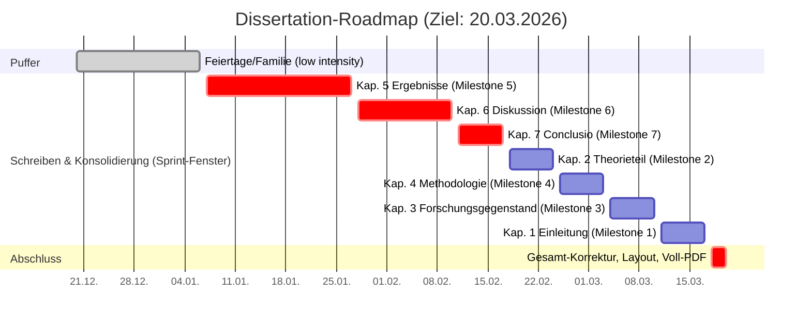

# Promotion / Dissertation

Dieses Verzeichnis enthält die Arbeitsmaterialien, Kapiteltexte und Build-Artefakte der Dissertation.

## Struktur (Kurzüberblick)

- `dissertation.md` – zentrales Hauptdokument (Steuer-/Klammerdokument).
- `04 Kapitelstruktur/` – Kapiteldateien (Einleitung, Theorieteil, Methodologie, …) + Anhänge.
- `08 Metaquellen/` – Daten, Metadaten, Literaturverzeichnis/Exports.
- `build-dissertation.sh` – baut die Dissertation als PDF (Pandoc → LaTeX).

## GitHub-Projekt: Aufgaben aus `#todo`

Empfehlung: **ein** GitHub Project für die ganze Dissertation, mit Feldern wie `Status`, `Kapitel`, `Typ`, `Priorität`.

### Schnell-Workflow (manuell, aber schnell)

1. In VS Code den `#todo`-Text markieren (oder Cursor in der Zeile).
2. `Cmd+Shift+P` → `GitHub Issues: Create Issue`.
3. Issue-Titel/Body aus dem Todo ableiten, Issue erstellen.
4. Im Markdown den Bezug festhalten, z. B. `#todo: Erkenntnisinteresse skizzieren (#123)`.

Optional (wenn du am Todo “sauber” arbeiten willst): Branch + PR erstellen und in der PR-Beschreibung `Closes #123` setzen.

## Zeitplan (Roadmap bis 20.03.2026)

## PDF Build

Voraussetzungen (lokal installiert): `pandoc`, `pandoc-crossref`, `latexmk` und XeLaTeX.

- Fast build (Standard): `./build-dissertation.sh` oder `./build-dissertation.sh fast`
- Full build (inkl. großer Anhänge): `./build-dissertation.sh full`
