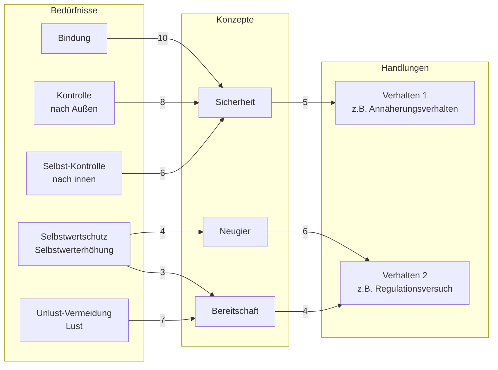
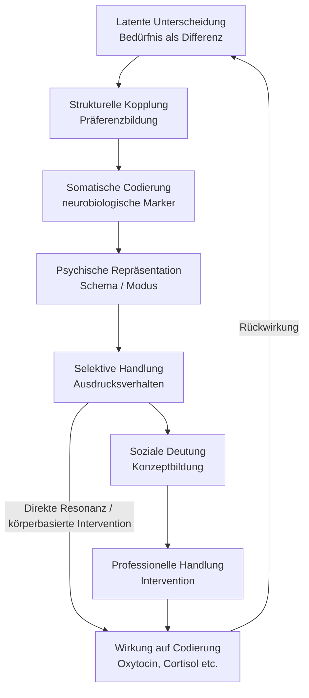

created: 01.10.2024 | [updated](https://git.jochen-hanisch.de/jochen-hanisch/research): 27.11.2024 | [published](https://zenodo.org/records/16413805): 24.7.2025 | [Austausch](https://lernen.jochen-hanisch.de/course/view.php?id=4) | [[Allgemein beruflich/Webseite Jochen Hanisch/Hinweise|Hinweise]]

**Bedürfnis als Differenz: Eine systemisch-schematherapeutische Rekonstruktion**

# Einleitung

Kaum ein Begriff ist theoretisch so aufgeladen und zugleich praktisch so vorausgesetzt wie der des Bedürfnisses. Ob in Therapie, Pädagogik oder Sozialarbeit – Bedürfnisse gelten als Erklärungsmuster für Verhalten, als Zielgrößen professionellen Handelns und als Indikatoren für Entwicklungsbedingungen. Und doch bleibt oft unklar, was mit einem Bedürfnis eigentlich gemeint ist: biologischer Impuls, psychische Sehnsucht, soziale Zuschreibung?

Die vorliegende Arbeit unternimmt den Versuch, den Begriff des Bedürfnisses systematisch zu rekonstruieren, nicht im Sinne einer disziplinären Vereinheitlichung, sondern als funktional verschaltetes Konzept, das verschiedene Theorieansätze strukturell verbindet. Im Zentrum steht dabei die These, dass Bedürfnisse als latent wirksame Unterscheidungen in lebenden Systemen auftreten, die sich durch somatische Codierung, psychische Repräsentation und soziale Anschlussfähigkeit konkretisieren lassen.

An dieser Stelle wird der Anspruch formuliert, ein Modell zu entwickeln, das sowohl theoretisch konsistent als auch praktisch anschlussfähig ist, insbesondere in pädagogischen, psychologischen und therapeutischen Kontexten. Es wird dabei bewusst auf die Vorstellung verzichtet, das Phänomen Bedürfnis abschließend zu definieren. Stattdessen wird ein heuristischer Zugang vorgeschlagen, der die ontologische Einschichtung biologischer, psychischer und sozialer Prozesse ernst nimmt und damit neue Wege eröffnet, Bedürfnisarbeit jenseits normativer Hierarchien zu denken.

# 1 Definition

Ein Bedürfnis ist eine latent wirksame Unterscheidung innerhalb eines lebenden Systems, durch die ein Unterschied zwischen einem aktuellen und einem präferierten Zustand erzeugt wird. Diese Unterscheidung manifestiert sich somatisch, wird psychisch repräsentiert und kann durch selektive Handlungsausdrücke sozial anschlussfähig interpretiert werden. Bedürfnisse sind somit operative Knotenpunkte zwischen biologischer Selbstregulation, subjektiver Erfahrung und sozialer Kommunikation.

Die einzelnen Elemente dieser Definition lassen sich wie folgt spezifizieren:

  - **Latent wirksame Unterscheidung**: Bedürfnisse sind systeminterne Unterscheidungen zwischen einem gegenwärtigen und einem präferierten Zustand. Diese Differenz ist zunächst latent wirksam, also nicht zwingend bewusst oder sprachlich gefasst, sondern operativ im Sinne einer Orientierungsdifferenz innerhalb biologischer oder psychischer Systeme.

  - **Präferenzzustände und strukturelle Kopplung**: Präferierte Zustände entstehen nicht aus dem System selbst, sondern durch strukturelle Kopplung mit der Umwelt. Bedürfnisse wirken als operative Mechanismen, die dem System erlauben, auf externe Reize selektiv zu reagieren und sich durch diese Umweltkontakte selbst zu stabilisieren.

  - **Somatische Codierung**: Die latente Differenz wird körperlich codiert, etwa durch spezifische neurobiologische Marker wie Oxytocin, Cortisol oder Dopamin. Diese Codierungen sind keine eindeutigen Indikatoren für bestimmte Bedürfnisse, ermöglichen aber eine physiologische Rückbindung subjektiver Regulation an verkörperte Prozesse.

  - **Konzeptionelle Handlungen**: Bedürfnisse erzeugen selektive Ausdruckshandlungen innerhalb psychischer Systeme. Diese werden in sozialen Systemen als Bedeutungseinheiten interpretiert und bilden so die Grundlage für sozial geteilte Konzepte, an denen weitere Kommunikation, Intervention und Handlung anknüpfen kann.

# 2 Herleitung

Die in Kapitel 1 dargestellte Definition beschreibt ein Bedürfnis als strukturiertes, verkörpertes und anschlussfähiges Element im Zusammenspiel biologischer, psychischer und sozialer Systeme. Um diesen Begriff funktional zu verwenden, also theoretisch zu analysieren und empirisch zu operationalisieren, werden im Folgenden die vier konstitutiven Elemente der Definition einzeln hergeleitet:
(1) latent wirksame Unterscheidung, (2) strukturelle Kopplung, (3) somatische Codierung und (4) konzeptionelle Handlung.[^1]

Das hier entwickelte Modell beansprucht dabei weder Vollständigkeit noch theoretische Exklusivität. Es versteht sich als heuristische Strukturierungsperspektive, die verschiedene Theorieelemente entlang eines gemeinsamen Phänomens verschaltet, ohne sich auf eine disziplinäre Deutungshoheit festzulegen.

Ziel ist zu zeigen, dass Bedürfnisse nicht nur theoretisch modellierbar, sondern auch praktisch erfassbar sind, etwa über somatische Marker, beobachtbare Handlungstendenzen oder systematisch strukturierte Konzeptbildung. Keine Einzeltheorie kann diesen Zugriff vollständig leisten. Erst die Kombination der Schematherapie d.h. mit ihrer Fähigkeit, psychische Muster körperlich zu verankern und der Systemtheorie, mit ihrem Fokus auf Anschlussfähigkeit und Beobachtbarkeit, ermöglicht einen methodisch konsistenten Umgang mit Bedürfnissen in pädagogisch-therapeutischen Kontexten.

## 2.1 Latente Unterscheidung als systeminterner Prozess

Bedürfnisse beginnen als implizite Differenz zwischen einem aktuellen und einem präferierten Zustand. Diese Differenz konstituiert sich nicht spontan, sondern wird durch systeminterne [[Elementaroperationen]] erzeugt. Erst durch Feedback, Reflexion und Reentry entsteht eine funktionale Unterscheidung, die dem System als Orientierung dient, ohne dass ein bewusster oder sprachlich formulierter Zugriff erforderlich wäre.

In der Systemtheorie nach Luhmann (1984) wird deutlich, dass Systeme sich durch operative Unterscheidungen strukturieren. Sinn entsteht durch Differenz. Auch in der Embodiment-Forschung (Damasio, 1994) zeigt sich, dass affektive Bewertungen zunächst körperlich verankert sind, bevor sie kognitiv verfügbar werden. Ebenso verweisen autopoietische Modelle nach Maturana und Varela (1987) darauf, dass lebende Systeme auf Umweltabweichungen nicht direkt reagieren, sondern über interne Differenzierungsprozesse. Bedürfnisse lassen sich somit als intern erzeugte und operativ stabilisierte Differenzen verstehen, die systemisches Verhalten orientieren.

## 2.2 Präferenzzustände und strukturelle Kopplung

Die Unterscheidung zwischen einem aktuellen und einem präferierten Zustand impliziert, dass ein System in der Lage ist, sich auf alternative Möglichkeiten zu orientieren. Diese Orientierung entsteht nicht aus einem intentionalen Akt im System selbst, sondern als Ergebnis struktureller Kopplung mit Umwelt, auf die das System selektiv anschlussfähig ist. In der Theorie der strukturellen Kopplung (Luhmann, 1984) wird deutlich, dass lebende Systeme keine direkten Reize verarbeiten, sondern nur das, woran sie intern anschlussfähig sind. Präferenzzustände sind demnach keine bewusst gesetzten Ziele, sondern selektiv wirksame Resonanzfiguren, d.h. wiederkehrende Umweltkonstellationen, die im System eine intern stabilisierte Ausrichtung erzeugen.

In pädagogisch-psychologischen Kontexten lassen sich solche Präferenzen als emergente Selektivitäten beschreiben, etwa die Bevorzugung von Sicherheit, Zugehörigkeit oder Selbstwirksamkeit. Diese Zustände sind nicht im Sinne eines inneren Wollens zu verstehen, sondern als strukturierte Orientierungen, die über wiederholte Kopplungserfahrungen operationalisiert werden. So wird etwa das Bedürfnis nach Zugehörigkeit durch kontinuierliche Interaktion mit anerkennenden Bezugspersonen verstärkt und damit systemisch realisiert.

Motivationstheorien wie die Selbstbestimmungstheorie (Deci & Ryan, 1985) und die Bedürfnishierarchie nach Maslow (1943) können als psychologische Modellierungen solcher Kopplungsprozesse gelesen werden. Sie beschreiben, wie Systeme bestimmte Umweltangebote (z. B. soziale Anerkennung) intern präferieren und daran ihre Handlungstendenzen ausrichten. Damit liefern sie psychologisch lesbare Korrelate zur systemischen Idee der präferierten Zustände.

## 2.3 Somatische Codierung als physiologische Grundlage

Die latente Unterscheidung zwischen aktuellem und präferiertem Zustand bleibt nicht rein kognitiv oder abstrakt, sondern ist auch somatisch fundiert. Neurobiologische Marker wie Oxytocin (Bindung), Cortisol (Stress) oder Dopamin (Motivation) begleiten typischerweise bestimmte Bedürfnislagen, auch wenn diese Marker multifunktional codiert und kontextabhängig interpretierbar sind (Panksepp, 1998; Damasio, 1994).

Diese physiologischen Marker dienen nicht der eindeutigen Diagnostik eines spezifischen Bedürfnisses, sondern sind Ausdruck systemischer Zustandsveränderungen. Sie sind als Rückbindungen verkörperter Regulation zu verstehen. Der Körper markiert Differenzzustände, etwa durch Erregung, Spannung oder Entspannung, und macht sie damit im System zugänglich. Bedürfnisse sind in diesem Sinne nicht nur psychische Repräsentationen, sondern verkörperte Orientierungen, die sich unter bestimmten Bedingungen auch objektiv (z. B. hormonell, nerval) beobachten lassen.

In der pädagogischen Praxis eröffnet dieser Zugriff die Möglichkeit, körperlich wahrnehmbare Zustände als Indikatoren für Bedürfnislagen zu deuten, ohne sie jedoch vorschnell zu pathologisieren oder zu objektivieren.

## 2.4 Konzeptionelle Handlungen und soziale Anschlussfähigkeit

Bedürfnisse erzeugen innerhalb psychischer Systeme selektive Handlungen, etwa Rückzug, Näheverhalten oder Irritation, die nach außen hin beobachtbar werden. Erst wenn sie durch ein soziales System als bedeutungshaltig adressiert und als Mitteilung lesbar gemacht werden, entsteht Anschlussfähigkeit im kommunikativen Sinn. Was vorher Ausdruck war, wird zur Information und nur unter dieser Bedingung kann ein Konzept entstehen.

In pädagogischen und therapeutischen Kontexten beruhen solche Konzepte wie bspw. „Sicherheit“, „Neugier“ oder „soziale Eingebundenheit“ auf wiederkehrenden Zuschreibungen. Sie sind keine Repräsentationen innerer Zustände, sondern Beobachtungsdispositive, d.h. strukturierte Erwartungen an das, was ein bestimmtes Verhalten bedeuten könnte. Diese Konzepte stabilisieren professionelles Handeln (s. [[Professionalisierung]]) im Modus kontrollierter Unsicherheit nicht durch Gewissheit, sondern durch operationalisierbare Deutungsrahmen.

Konzeptionelle Handlungen entstehen also nicht durch das Wissen um ein Bedürfnis, sondern durch das Erkennen eines Musters, das als Bedürfnis beobachtbar gemacht wurde. Bedürfnis → Konzept → Handlung (s. Abbildung 1): Eine Übersetzung ohne Original.

## 2.5 Schemata als Bindeglied zwischen Bedürfnissen und Handlungen

Die Schematherapie bietet ein theoriepraktisch anschlussfähiges Modell, das die in Kapitel 1 hergeleiteten Elemente – Unterscheidung, strukturelle Kopplung, somatische Codierung und konzeptionelle Handlung – funktional zusammenführt. Sie verbindet frühe Beziehungserfahrungen mit körperlich-affektiven Reaktionen und kognitiven Repräsentationen in Form stabiler Schemata und Modi. (Young, Klosko & Weishaar, 2003; Roediger, 2010)

### 2.5.1 Grundlegendes

Bedürfnisse erscheinen in diesem Rahmen nicht als abstrakte Konzepte, sondern als erfahrbare Orientierungsgrößen, die in biografischen Kontexten kondensiert wurden (Roediger, 2010). Diese kondensierten Muster, z.B. Verlassenheit, Unterordnung oder emotionale Entbehrung, bilden spezifische Differenzzustände, die im System aktiviert werden können. Aus systemischer Sicht lassen sie sich als stabilisierte Differenzreaktionen verstehen, d.h. intern erzeugte, aber durch wiederholte Kopplungserfahrungen strukturierte Selektivitätsmuster.

Die körperlich markierten Spannungslagen (z. B. Unsicherheit, Scham, Hyperarousal) sind Ausdruck dieser latenten Differenzen. Sie codieren das Bedürfnis somatisch, bevor es psychisch und sozial deutbar wird (Damasio, 1994; Panksepp, 1998). In der pädagogischen und therapeutischen Praxis treten diese Muster als wiederkehrende Handlungstendenzen in Erscheinung, die, wenn sie professionell beobachtet und gedeutet werden, zu konzeptionellen Handlungsfiguren führen können.

### 2.5.2 Schemata, Grundbedürfnisse und Modi

Diese Tabelle zeigt eine strukturierte Darstellung typischer maladaptiver Schemata, deren Zuordnung zu Domänen und Grundbedürfnissen sowie die entsprechenden Modi, die in der Schematherapie auftreten können. Die Tabelle hilft, die Zusammenhänge zwischen den verschiedenen Konzepten besser zu verstehen und zuzuordnen.

Während die Tabelle eine strukturierte Aufschlüsselung typischer Schema-Bedürfnis-Zuordnungen bietet, zeigt die nachfolgende Abbildung eine dynamische Verschaltung der daraus abgeleiteten Konzepte mit konkreten Handlungsformen.

*Tabelle 1: Übersicht über typische Schemata, zugehörige Domänen, Grundbedürfnisse und mögliche Modi*

| **Schema (Situation / Reaktion)**                 | **Domäne / Bereich**                               | **Grundbedürfnis**                     | **Mögliche Modi**                                |
| ------------------------------------------------- | -------------------------------------------------- | -------------------------------------- | ------------------------------------------------ |
| **Emotionale Vernachlässigung**                   | Abgetrenntheit und Ablehnung                       | Bindung                                | Verletzbares oder Wütendes Kind                  |
| **Verlassenheit / Instabilität**                  | Abgetrenntheit und Ablehnung                       | Bindung                                | Verletzbares oder Wütendes Kind                  |
| **Misstrauen / Missbrauch**                       | Abgetrenntheit und Ablehnung                       | Bindung                                | Rückzug, Misstrauisches Kind                     |
| **Soziale Isolation**                             | Abgetrenntheit und Ablehnung                       | Bindung                                | Einsames Kind                                    |
| **Unzulänglichkeit / Scham**                      | Abgetrenntheit und Ablehnung                       | Bindung                                | Verletzbares oder Wütendes Kind                  |
| **Erfolglosigkeit / Versagen**                    | Beeinträchtigung von Autonomie und Leistung        | Autonomie, Leistung                    | Rückzugsmodus                                    |
| **Abhängigkeit / Inkompetenz**                    | Beeinträchtigung von Autonomie und Leistung        | Autonomie, Selbstbestimmung            | Verletzbares Kind, Passiver Modus                |
| **Verletzbarkeit**                                | Beeinträchtigung von Autonomie und Leistung        | Autonomie                              | Ängstliches Kind                                 |
| **Verstrickung / Unentwickeltes Selbst**          | Beeinträchtigung von Autonomie und Leistung        | Autonomie, Identität                   | Verschmelzender Modus                            |
| **Anspruchshaltung / Grandiosität**               | Beeinträchtigung von Autonomie und Leistung        | Selbstkontrolle, Autonomie             | Selbstüberhöhender Modus                         |
| **Aufopferung**                                   | Fremdbezogenheit                                   | Selbstwert-Erhöhung, Selbstwert-Schutz | Unterordnungsmodus                               |
| **Streben nach Zustimmung und Anerkennung**       | Fremdbezogenheit                                   | Selbstwert-Erhöhung, Bindung           | Angepasstes Kind                                 |
| **Emotionale Gehemmtheit**                        | Übertriebene Wachsamkeit und Gehemmtheit           | Lust, Unlust-Vermeidung                | Gehemmtes Kind, Strenger Modus                   |
| **Überhöhte Standards (unerbittliche Ansprüche)** | Übertriebene Wachsamkeit und Gehemmtheit           | Leistung, Selbstwert                   | Perfektionistischer Modus                        |
| **Bestrafungsneigung**                            | Übertriebene Wachsamkeit und Gehemmtheit           | Kontrolle, Grenzsetzung                | Kritischer oder Strafender Elternmodus           |
| **Impulsivität / Undiszipliniertheit**            | Beeinträchtigung der Selbstkontrolle und Disziplin | Selbstkontrolle                        | Undiszipliniertes Kind, Verantwortungsloses Kind |

Die Tabelle zeigt eine strukturierte Zuordnung typischer maladaptiver Schemata zu übergeordneten Domänen, zentralen Grundbedürfnissen und den entsprechenden Modi, wie sie in der Schematherapie beschrieben werden. Die Schemata repräsentieren stabile Verarbeitungsmuster früher Beziehungserfahrungen, die mit spezifischen Bedürfniskonflikten und emotionalen Reaktionsweisen verknüpft sind. Die Zuordnung zu Grundbedürfnissen erlaubt eine funktionale Rückbindung der Schemata an biografisch erlebte Defiziterfahrungen. Die Modi verweisen auf erlebens- und verhaltensnahe Zustände, in denen sich diese Muster aktuell manifestieren können. Die Tabelle dient damit als heuristische Orientierung zur Analyse von Bedürfnisstrukturen und deren Ausdrucksformen im pädagogisch-therapeutischen Kontext.

### 2.5.3 Bedürfnisse, Konzepte und Handlungen

Die hier verwendeten Konzepte wie „Sicherheit“, „Neugier“ oder „Bereitschaft“ sind als professionell strukturierte Deutungsmuster zu verstehen, die aus wiederkehrenden Bedürfnis-Konstellationen hervorgehen. Sie ermöglichen eine anschlussfähige Interpretation von Verhaltensmustern im pädagogisch-therapeutischen Kontext.

*Abbildung 1: Flowchart der Verknüpfung von Bedürfnissen, Konzepte und Handlungen (eig. Darstellung)*

Die Abbildung zeigt eine strukturierte Verschaltung elementarer Bedürfnisse mit professionellen Konzepten und daraus abgeleiteten Handlungsmustern. Fünf grundlegende Bedürfnisbereiche – etwa Bindung, Kontrolle (nach außen und innen), Selbstwertschutz sowie Lustvermeidung bzw. Lustgewinn – wirken selektiv auf die Konzeptbildung ein. Diese Konzepte wie „Sicherheit“, „Neugier“ oder „Bereitschaft“ entstehen nicht direkt aus den Bedürfnissen, sondern als abstrahierende Deutungsfiguren, die pädagogisch-therapeutisches Handeln strukturieren. Sie dienen als vermittelnde Größen zwischen dem subjektiven Bedürfniszustand und beobachtbarem Verhalten. Die Gewichtung der Verbindungslinien (Zahlenwerte) verdeutlicht die relative Einflussstärke bestimmter Bedürfnis-Konstellationen auf die jeweilige Konzeptbildung bzw. Handlungsanbahnung. Es handelt sich dabei um eine normierte Ordinalskala, die keine metrischen Abstände ausdrückt, sondern ein relationales Ranking ermöglicht. Dadurch lässt sich modellieren, welche Bedürfnisbereiche im Verhältnis zueinander besonders stark zur Konzeptbildung beitragen, ohne dies empirisch quantifizieren zu müssen.

## 2.6 Kausalkette als zentraler Befund

Die in diesem Kapitel hergeleiteten Strukturmerkmale eines Bedürfnisses – Unterscheidung, strukturelle Kopplung, somatische Codierung und konzeptionelle Handlung – lassen sich als funktionale Kausalkette beschreiben. Diese Kette verbindet systemtheoretische, psychologische und neurobiologische Perspektiven in einem dynamischen Zusammenhang.

- Ein Bedürfnis entsteht als intern erzeugte Differenz (vgl. Luhmann, 1984),
- wird somatisch codiert (vgl. Damasio, 1994; Panksepp, 1998),
- psychisch repräsentiert (vgl. Young, Klosko & Weishaar, 2003) und
- durch selektive Handlungen sozial anschlussfähig gemacht (vgl. Luhmann, 1997).

Entscheidend ist dabei, dass diese Kette nicht nur konzeptionell beschreibbar, sondern auch biologisch begründbar und empirisch beobachtbar ist. Insbesondere durch die Forschung zur Rolle von Neurotransmittern wie Oxytocin, Cortisol und Dopamin wird deutlich, dass bestimmte Bedürfnislagen regelmäßig mit spezifischen neurobiologischen Mustern einhergehen (vgl. Uvnäs-Moberg et al., 2005; Heinrichs et al., 2003). Die Ausschüttung dieser Marker ist dabei nicht zufällig, sondern folgt erkennbaren situativen und relationalen Bedingungen, etwa Berührung, Sicherheit, Anerkennung oder Kontrolle.

Daraus ergibt sich ein zentrales Argument. Pädagogisch-therapeutische Handlungen sind nicht bloß symbolische Antworten auf Verhalten, sondern greifen, sofern sie gezielt, wiederholt und relational eingebettet sind, in die somatische Codierung selbst ein. Körperliche Nähe, ritualisierte Interaktion oder affektive Abstimmung sind nicht nur kommunikativ deutbar, sondern verändern messbar die neurobiologische Struktur, durch die ein Bedürfnis codiert ist (vgl. Feldman, 2012). Die Handlung wirkt somit nicht lediglich auf der Ebene der Interpretation, sondern auf der Ebene der Regulation.

Diese Kausalkette erlaubt somit, das Bedürfnis nicht nur als abstrakten Mangel oder psychologische Kategorie zu fassen, sondern als biologisch codierbare, systemisch beobachtbare und professionell adressierbare Struktur. Damit wird auch die klassische Trennung zwischen Bedürfnisdiagnostik und Handlungspraxis systematisch überschritten. Theoretisch gesehen entsteht eine rekursive Struktur. Die Handlung verändert den Codierungszustand des Bedürfnisses und erzeugt damit neue Differenzlagen, die wiederum neue Handlungen ermöglichen oder erforderlich machen.

Abbildung 2: Kausalkette der Bedürfnisentstehung und -adressierung (eig. Darstellung)

Die Abbildung 2 zeigt die Kausalkette der Bedürfnisentstehung und -adressierung. Sie verdeutlicht, wie Bedürfnisse als latente Unterscheidungen entstehen, durch strukturelle Kopplung mit Umwelt stabilisiert werden, somatisch codiert sind und schließlich in psychischen Repräsentationen (Schemata/Modi) münden. Diese Repräsentationen führen zu selektiven Handlungen, die sozial interpretiert und professionell adressiert werden können. Die Rückwirkung auf die somatische Codierung schließt den Kreis und zeigt die dynamische Wechselwirkung zwischen Bedürfnis, Handlung und biologischer Regulation.

Neben dem konzeptionell vermittelten Weg von Bedürfnis über Konzept zu professioneller Handlung existiert eine zweite Schleife: Ausdruckshandlungen können direkt eine Intervention auslösen, die nicht über explizite Konzeptbildung geht, sondern durch affektive Resonanz oder körperliche Ko-Regulation unmittelbar in die somatische Codierung zurückwirkt. Diese zirkuläre Figur macht das Modell anschlussfähig für alltagspraktische, intuitive oder nicht-theoretisch vermittelte Interaktionsformen – insbesondere im Bereich der Bindungs- und Beziehungsarbeit.

Die Kombination aus Schematherapie und Systemtheorie eröffnet somit eine methodisch konsistente, interdisziplinär anschlussfähige Perspektive auf Bedürfnisarbeit. Bedürfnisse werden als latente Differenz codiert, durch Umweltkontakt stabilisiert, biologisch markiert und durch konzeptionelle Handlung adressierbar. Aus dieser Konstellation ergibt sich ein praxisrelevanter Zugang zu einer präzisen, aber dynamischen Bedürfnislogik.

## 2.6 Beispiele

Die folgenden Beispiele verdeutlichen, wie die in Kapitel 2 hergeleiteten Strukturmerkmale eines Bedürfnisses – Unterscheidung, Kopplung, Codierung und konzeptionelle Handlung – in konkreten Fallkonstellationen beobachtbar und interpretierbar werden.

- **Beispiel 1: Bindungsbedürfnis und das Schema der Verlassenheit**

  Ein Kind, dessen Bedürfnis nach emotionaler Zuwendung und Sicherheit über längere Zeit nicht erfüllt wird, erlebt intern eine latente Unterscheidung zwischen einem gegenwärtigen Zustand (emotionale Unsicherheit) und einem präferierten Zustand (Bindung, Verlässlichkeit). Diese Differenz wird im Verlauf der Entwicklung durch wiederholte strukturelle Kopplung mit instabilen oder abweisenden Bezugspersonen stabilisiert. Das maladaptive Schema der Verlassenheit/Instabilität (Young et al., 2003) entsteht dabei als kognitive Repräsentation dieser Differenz.

  Somatisch manifestiert sich dieses Bedürfnis etwa durch erhöhte Stressmarker wie Cortisol, chronische Anspannung oder Rückzugsverhalten (Damasio, 1994; Panksepp, 1998). Ausdruckshandlungen wie Klammern, regressives Verhalten oder emotionale Ambivalenz werden sozial lesbar, wenn sie im Kontext professioneller Deutung als Bedürfnis nach Bindung interpretiert werden. Daraus kann im pädagogischen oder therapeutischen Handlungsraum das Konzept „Beziehungsunsicherheit“ entstehen – als strukturierte Erwartung, die Interventionen leitet.

- **Beispiel 2: Bedürfnis nach Selbstwertstabilisierung und das Schema des Anerkennungsstrebens**

  Ein Erwachsener, der in seiner Biografie wiederholt nur dann Anerkennung erfahren hat, wenn er sich den Erwartungen anderer unterordnet, bildet eine latente Differenz zwischen Fremd- und Selbstbestimmung aus. Diese Unterscheidung bleibt zunächst unbewusst, strukturiert aber Wahrnehmung und Handlung. Die Kopplung an ein externalisiertes Bezugssystem (z. B. autoritäre Eltern, Leistungskontexte) stabilisiert ein Muster der Selbstverleugnung zugunsten von Zugehörigkeit.

  Auf der Ebene somatischer Codierung zeigt sich dieses Muster in chronischer Anspannung, Nervosität oder psychosomatischen Stressreaktionen. Der daraus resultierende Modus ist häufig das „Angepasste Kind“, verbunden mit dem Schema „Streben nach Zustimmung und Anerkennung“. Professionell beobachtbar wird dieses Bedürfnis durch Verhalten wie Überanpassung, Perfektionismus oder Angst vor Kritik. Das daraus abgeleitete Konzept könnte „Selbstwertunsicherheit“ lauten – ein strukturierter Deutungsrahmen, der gezielte Unterstützung in pädagogischen oder beratenden Settings ermöglicht.

# 3 Folgerungen

Die vorangegangene Herleitung erlaubt, grundlegende Schlussfolgerungen im Hinblick auf die Theorie-, Praxis- und Erkenntnisstruktur von Bedürfnissen zu formulieren. Diese Folgerungen betreffen insbesondere das Verhältnis von Bedürfnis, Handlung und somatischer Codierung und markieren zentrale Denkbewegungen, die das hier entwickelte Modell trägt.

- **Folgerung 1: Bedürfnisse sind nicht direkt beobachtbar, sondern funktional rekonstruierbar.**
  Bedürfnisse liegen nicht offen zutage, sondern erscheinen als latente Differenz innerhalb lebender Systeme. Erst durch systemisch anschlussfähige Handlungen, also durch Ausdruck, Reaktion und Interpretation, können sie sichtbar gemacht und in professionelle Konzepte überführt werden. Daraus ergibt sich eine beobachtungstheoretische Perspektive auf Bedürfnisdiagnostik.

- **Folgerung 2: Bedürfnisarbeit erfordert eine Kopplung von biologischer, psychischer und sozialer Ebene.**
  Ein Bedürfnis lässt sich weder rein biologisch (z. B. über Marker wie Oxytocin) noch ausschließlich psychologisch (z. B. über subjektives Erleben) oder sozial (z. B. über Rollenerwartungen) bestimmen. Erst im Zusammenspiel dieser Ebenen wird Bedürfnisarbeit methodisch greifbar. Dies verlangt eine interdisziplinäre Perspektive, wie sie durch die Verbindung von Systemtheorie und Schematherapie ermöglicht wird.

- **Folgerung 3: Pädagogisch-therapeutische Handlungen wirken auf Codierungen zurück.**  
  Professionelles Handeln ([[Professionalisierung]]) adressiert nicht nur kognitive Repräsentationen, sondern kann über ritualisierte Interaktionen auch auf die neurobiologische Codierung von Bedürfnissen einwirken. Die Trennung zwischen Deutung und Intervention wird damit systemisch aufgehoben: Eine Handlung ist dann nicht Ausdruck, sondern Teil der Regulation.

- **Folgerung 4: Antinomien wie Nähe vs. Distanz sind funktional auflösbar.**
  Was klassisch als Spannungsfeld gilt, lässt sich im Lichte der Kausalkette neu denken. Wenn Nähe als konkrete, körperlich adressierbare Antwort auf eine somatische Differenz begriffen wird, ist sie keine Haltung, sondern eine physiologische Intervention. Pädagogische Dilemmata lassen sich dadurch funktional rekonstruieren und handlungspraktisch entlasten.

- **Folgerung 5: Konzeptbildung ist keine Interpretation, sondern eine Form der Kopplung.**
  Wenn professionelle Begriffe wie „Beziehungsunsicherheit“ oder „Selbstwertinstabilität“ verwendet werden, handelt es sich nicht um bloße Diagnosen, sondern um strukturierte Reaktionsformen auf beobachtbare Ausdrucksformen. Konzepte sind damit nicht reduktionistisch, sondern ermöglichen Anschlussfähigkeit im Modus kontrollierter Unschärfe.

# 4 Implikationen

Die im vorangegangenen Kapitel formulierten theoretischen Folgerungen haben direkte Auswirkungen auf das pädagogische, therapeutische und sozialarbeiterische Handeln. Sie eröffnen neue Perspektiven auf Diagnostik, Beziehungsgestaltung und Intervention, ohne dabei normative Vorgaben zu machen. Implikationen betreffen somit nicht die Gültigkeit von Theorie, sondern deren Umsetzung unter Bedingungen professioneller Praxis.

- **Implikation 1: Bedürfnisorientierung ermöglicht kontextsensitive Intervention.**
  Wenn Bedürfnisse als latente Differenz, somatisch codiert und selektiv beobachtbar gedacht werden, lässt sich professionelles Handeln nicht mehr rein auf Verhaltensregulation stützen. Es bedarf gezielter Interventionen, die die individuelle Bedürfnisstruktur adressieren, etwa durch körperbasierte Ko-Regulation, ritualisierte Beziehungsgestaltung oder strukturelle Verlässlichkeit. Die Schematherapie liefert hierfür praktikable Konzepte (vgl. Roediger, 2010).

- **Implikation 2: Starre Bedürfnishierarchien sind praxisfern.**  
  Die Vorstellung, dass Bedürfnisse in stufenförmiger Reihenfolge erfüllt werden müssen (Maslow, 1943), wird in der pädagogischen Praxis zunehmend problematisch. Die hier entwickelte Modelllogik legt nahe, dass Bedürfnisse als simultan wirksame Differenzlagen auftreten, die je nach Kontext unterschiedlich salient werden. Dies erfordert eine flexible, situationsbezogene Bedürfnisdiagnostik und keine schematische Bedürfnisabfolge[^2].

- **Implikation 3: Prävention basiert auf der Lesbarkeit von Differenzen.**  
  In sozialpädagogischen Handlungsfeldern ist die frühzeitige Erkennung von Bedürfnislagen zentral. Die hier entwickelte Systematik erlaubt es, Verhalten nicht vorschnell zu pathologisieren, sondern als Ausdruck einer verkörperten, noch nicht beantworteten Differenz zu lesen. Daraus ergeben sich präventive Möglichkeiten, etwa durch die Gestaltung sicherer Bindungserfahrungen, verlässlicher Übergänge oder affektiv abgestimmter Resonanzangebote (vgl. Roediger, 2010).

# 5 Kritik

Das hier entwickelte Modell eines systemisch codierten, konzeptionell adressierbaren Bedürfnisses erhebt weder Absolutheits- noch Exklusivitätsanspruch. Dennoch ist dieses theoretisch exponiert genug, um Kritik hervorzurufen. Diese Kritik ist nicht als Widerlegung, sondern als Reflexionsangebot zu verstehen, sie schärft das Modell in seiner Reichweite und Kontur. Damit ist diese Kritik kein Widerspruch zur Theorie, sondern eine produktive Spannung, sie erweitert den Möglichkeitsraum des Modells, ohne dessen Kerngedanken zu beschädigen.

## 5.1 Kritische Einwände

**Reduktionistische Verkürzung**

Die enge Verbindung von Bedürfnissen mit somatischen Markern wie Oxytocin, Cortisol oder Dopamin könnte als biologischer Reduktionismus gelesen werden. Kritiker könnten einwenden, dass dadurch komplexe emotionale, soziale und biografische Prozesse auf messbare physiologische Zustände verkürzt werden – und damit ein funktional reduziertes Menschenbild entsteht (vgl. Metz-Göckel, 2022).

**Kulturalität und soziale Kontexte**

Bedürfnisse erscheinen im Modell primär als individuell verankerte Orientierungen. Dass sie jedoch stets auch kulturell geformt, sozial vermittelt und historisch situiert sind, wird hier nur indirekt berücksichtigt. Es ließe sich einwenden, dass das Modell universelle Marker (z. B. Oxytocin) betont, ohne die kulturelle Codierung von Bedürfnissemantik ausreichend zu thematisieren.

**Agency und Selbstgestaltung**

Die logische Stringenz der Kausalkette (Kap. 2.6) suggeriert eine gewisse Determiniertheit. Kritisch gefragt: Wo bleibt das kreative Potenzial des Subjekts, Bedürfnisse nicht nur zu erleben oder zu regulieren, sondern selbstreflexiv zu transformieren, zu verwerfen oder neu zu konstruieren? Bedürfnisarbeit als emanzipatorische Praxis scheint hier unterbelichtet (vgl. Roediger, 2010).

**Begriffliche Unschärfe und Theoriepluralität**

Der Begriff „Bedürfnis“ wird in verschiedenen Disziplinen unterschiedlich verwendet. Das hier vorgeschlagene Modell könnte als theoretische Überformung eines alltagssprachlich offenen Begriffs erscheinen – ohne dessen semantische Spannweite systematisch zu reflektieren.

## 5.2 Erwiderung und Klärung

Die genannten Einwände verweisen auf reale Spannungsfelder, denen sich das Modell nicht entziehen will. Gerade der Anspruch, zwischen biologischer Konstanz und sozialer Variabilität, zwischen systemischer Funktionalität und subjektiver Reflexivität eine tragfähige Struktur zu schaffen, erfordert eine differenzierte Auseinandersetzung mit diesen Kritikpunkten. Im Folgenden werden die zentralen Einwände aufgegriffen und im Sinne des Modells beantwortet.

**Zur Frage des Reduktionismus**

Die Bezugnahme auf somatische Marker ist keine Reduktion, sondern ein Hinweis auf die ontologische Einschichtung lebender Systeme: Ohne physikalisch-chemische Grundlagen kein biologisches Leben; ohne lebendes System keine psychische Regulation; ohne psychisches System keine soziale Kommunikation. Die biologische Codierung ist notwendige Bedingung, nicht hinreichende Erklärung.

**Zur kulturellen Situiertheit von Bedürfnissen**

Das Modell behauptet nicht, dass Bedürfnisse unabhängig von Kultur existieren. Es differenziert vielmehr zwischen biologisch konstanten Codierungsmechanismen und sozial variabler Deutung. Die konzeptionelle Handlung (Kap. 2.4) zeigt gerade, wie soziale Systeme über kulturelle Semantiken auf körperlich codierte Differenzen reagieren. Kultur ist nicht ausgeschlossen, sondern funktional integriert.

**Zur Frage von Agency**

Die systemtheoretische Anlage des Modells erlaubt über die Elementaroperationen (Feedback, Reflexion, Reentry) genau jene Schleifen, in denen Selbstbeobachtung, Transformation und Neuschöpfung von Bedürfnissen möglich sind. Der Mensch ist in diesem Modell nicht nur reguliertes, sondern auch reflexiv fähiges System d.h. Agency ist implizit mitgedacht.

**Zur Theoriepluralität**

Der Begriff „Bedürfnis“ wird hier nicht vereinheitlicht, sondern funktional verschaltet. Das Modell versteht sich als Strukturangebot. Es will nicht definitorisch festlegen, sondern konvergente Anschlussstellen schaffen zwischen biologischer Empirie, psychischer Repräsentation und sozialer Konzeptbildung.

# 6 Zusammenfassung

Das hier entwickelte Modell versteht Bedürfnisse als systemisch strukturierte Differenzphänomene, die biologisch codiert, psychisch repräsentiert und sozial interpretierbar sind. Im Zentrum steht eine dynamische Kausalkette, die von latenter Unterscheidung über strukturelle Kopplung und somatische Codierung zur selektiven Handlung und schließlich zur professionellen Konzeptbildung führt. Diese Kette ist nicht linear, sondern rekursiv: Jede Handlung kann auf die ursprüngliche Bedürfnisstruktur zurückwirken und neue Differenzlagen erzeugen.

Das Besondere an diesem Modell ist die Integration verschiedener theoretischer Perspektiven, insbesondere der Schematherapie und der Systemtheorie, ohne diese zu vereinheitlichen. Bedürfnisse werden dadurch nicht als abstrakte Konzepte behandelt, sondern als real erfahrbare, beobachtbare und professionell anschlussfähige Strukturen. Die Verbindung von neurobiologischen Markern, kognitiv-emotionalen Mustern und sozial vermittelten Konzepten erlaubt einen differenzierten Zugang zu Bedürfnislagen, sowohl in der Diagnostik als auch in der Intervention.

Im Unterschied zu traditionellen Bedürfnistheorien, betont dieses Modell die Gleichzeitigkeit, Kontextabhängigkeit und Dynamik von Bedürfnisprozessen. Bedürfnisse sind keine Stufen, die nacheinander erklommen werden müssen, sondern simultan wirksame Orientierungsfiguren innerhalb lebender Systeme.

Damit bietet das Modell eine theoretisch fundierte und praktisch anschlussfähige Grundlage für Bedürfnisarbeit in pädagogischen, therapeutischen und sozialwissenschaftlichen Kontexten.

# Quelle(n)

- Metz-Göckel, H. (2022). Bedürfnis. In M. A. Wirtz (Hrsg.), _Dorsch Lexikon der Psychologie_. Hogrefe Verlag.
- Roediger, E. (2010). _Raus aus den Lebensfallen: Das Schematherapie-Patientenbuch_. Junfermannsche Verlagsbuchhandlung.
- Maslow, A. H. (1943). _A Theory of Human Motivation_.
- Young, J. E., Klosko, J. S., & Weishaar, M. E. (2003). _Schematherapie: Ein kognitives Modell der emotionalen Störungen_. Klett-Cotta.
- Damasio, A. R. (1994). _Descartes' Error: Emotion, Reason, and the Human Brain_. Putnam.
- Panksepp, J. (1998). _Affective Neuroscience: The Foundations of Human and Animal Emotions_. Oxford University Press.
- Luhmann, N. (1984). _Soziologische Aufklärung 1: Aufsätze zur Theorie sozialer Systeme_. Westdeutscher Verlag.
- Luhmann, N. (1997). _Soziologische Aufklärung 2: Aufsätze zur Theorie sozialer Systeme_. Westdeutscher Verlag.
- Maturana, H. R., & Varela, F. J. (1987). _The Tree of Knowledge: The Biological Roots of Human Understanding_.  Shambhala.
- Deci, E. L., & Ryan, R. M. (1985). _Intrinsic Motivation and Self-Determination in Human Behavior_. Plenum Press.
- Feldman, R. (2012). _Oxytocin and Social Affiliation in Humans_. In _Biological Psychology_ (S. 1-10). Elsevier.

[^1]: In einer späteren Version könnte eine explizitere begriffliche Differenzierung zwischen Konzept, Schema und Modus hilfreich sein, etwa in Form eines Mini-Glossars oder durch knappe Erläuterungen im Fließtext. Derzeit wird auf eine solche Klärung zugunsten der Lesbarkeit und Argumentationsdichte bewusst verzichtet.
[^2]: Die weit verbreitete Darstellung einer Maslow’schen Bedürfnispyramide stammt nicht von Maslow selbst, sondern wurde später (vermutlich aus didaktischen Gründen) von Managementtheorien popularisiert. Maslow selbst hat in seinen Texten keine Pyramide gezeichnet und betonte die Dynamik, Überlappung und Reversibilität von Bedürfnissen; also genau das, was das hier entwickelte Modell ebenfalls stark macht.

---

#Bedürfnis #Theorieintegration #Schematherapie #Systemtheorie #Neurobiologie #Pädagogik #Psychologie #Handlungstheorie #Konzeptbildung #Professionalisierung #Forschung #Strukturmodell
