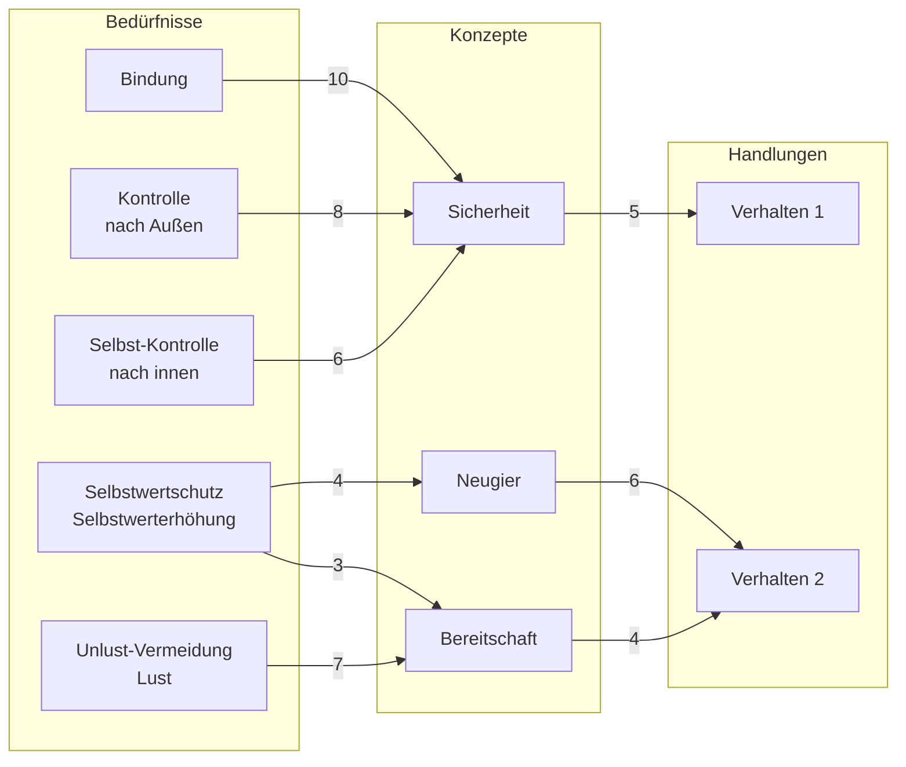

created: 01.10.2024 | updated: 27.11.2024 | [[Hinweise]]

# 1 Definition

Ein Bedürfnis ist eine latent wirksame Unterscheidung innerhalb eines lebenden Systems, durch die ein Unterschied zwischen einem aktuellen und einem bevorzugten Zustand erzeugt wird. Diese Unterscheidung wird durch somatische Marker codiert, psychisch repräsentiert und durch sozial anschlussfähige Handlungen bearbeitbar gemacht. Bedürfnisse sind somit operative Knotenpunkte zwischen biologischer Selbstregulation, subjektiver Erfahrung und sozialer Kommunikation.

# 2 Herleitung

## 2.0 Neurobiologische Fundierung

Aus neurobiologischer Perspektive lassen sich zentrale Bedürfnisse durch spezifische somatische Marker begleiten. Diese stellen jedoch keine eindeutige Kausalrelation dar, sondern sind multifunktional codiert und kontextabhängig interpretierbar. Dennoch bilden sie eine notwendige physiologische Grundlage für die psychologische Repräsentation von Bedürfnissen: Oxytocin kann z. B. als Hinweis auf Bindungsaktivität gelesen werden, Cortisol auf Stress im Zusammenhang mit Kontrollverlust, Serotonin auf Selbstwert und Stimmungsregulation, während Dopamin mit Lust und Motivation in Verbindung steht. Diese Marker zeigen, dass Bedürfnisse in einem verkörperten Substrat operieren – und dass psychologische Modelle wie die Bedürfnishierarchie oder Schematherapie auf biologisch fundierte Zustände rückführbar sind.

## 2.1 Psychologische Sicht

Aus psychologischer Sicht werden Bedürfnisse als zentrale Antriebe für Verhalten und Emotionen betrachtet. Maslow hat eine „Hierarchie der Bedürfnisse“ entwickelt, die in einer relativen Reihenfolge organisiert ist, aber nie als feste Pyramidenstruktur dargestellt wurde. Laut Maslow gibt es fünf Grundbedürfnisse, die in der Regel in einer bestimmten Reihenfolge aktiviert werden, wobei die Erfüllung der unteren Bedürfnisse die Grundlage für die höheren Ebenen bildet. Jedoch räumte Maslow selbst ein, dass diese Reihenfolge variabel ist und von individuellen Lebenssituationen abhängt. Er wies darauf hin, dass es keine starren Übergänge zwischen den Bedürfnissen gibt, und dass Menschen oftmals in allen Bedürfniskategorien gleichzeitig teilweise erfüllt und unvollständig bleiben.

## 2.2 Philosophische Sicht

In der Philosophie wird das Bedürfnis häufig im Kontext von Freiheit und Notwendigkeit diskutiert. Der Begriff leitet sich von der Idee ab, dass ein Bedürfnis eine Art von „Unfreiheit“ darstellt, die das Individuum zwingt, nach Erfüllung zu streben. Hier wird zwischen „objektiven“ (allgemein gültigen) und „subjektiven“ (individuell variierenden) Bedürfnissen unterschieden, die das Handeln beeinflussen (Metz-Göckel, 2022).

## 2.3 Soziologische Sicht

Soziologisch betrachtet, stellen Bedürfnisse die Grundlage für soziale Systeme und Institutionen dar. Bedürfnisse wie Zugehörigkeit und Anerkennung sind in der Gesellschaft verankert und wirken als Treiber für Gruppenbildung, soziale Rollen und soziale Normen. Durch die Nichterfüllung von sozialen Bedürfnissen können Phänomene wie soziale Isolation und Exklusion entstehen (Metz-Göckel, 2022).

## 2.4 Beispiele

- **Beispiel 1:** Ein Kind, dessen Bedürfnis nach emotionaler Zuwendung nicht erfüllt wird, entwickelt möglicherweise das maladaptive Schema der Verlassenheit / Instabilität, was zu einem ständigen Gefühl der Unsicherheit führt (Roediger, 2010).
- **Beispiel 2:** Ein Erwachsener mit einem hohen Bedürfnis nach Anerkennung kann dazu neigen, sich übermäßig an die Erwartungen anderer anzupassen und seine eigenen Wünsche zu vernachlässigen. Dies kann zur Entwicklung eines Unterordnungsmodus führen (Roediger, 2010).
# 3 Schemata, Grundbedürfnisse und Modi

Diese Tabelle zeigt eine strukturierte Darstellung typischer maladaptiver Schemata, deren Zuordnung zu Domänen und Grundbedürfnissen sowie die entsprechenden Modi, die in der Schematherapie auftreten können. Die Tabelle hilft, die Zusammenhänge zwischen den verschiedenen Konzepten besser zu verstehen und zuzuordnen.

*Tabelle 1: Übersicht über typische Schemata, zugehörige Domänen, Grundbedürfnisse und mögliche Modi*

| **Schema (Situation / Reaktion)**                 | **Domäne / Bereich**                               | **Grundbedürfnis**                     | **Mögliche Modi**                                |
| ------------------------------------------------- | -------------------------------------------------- | -------------------------------------- | ------------------------------------------------ |
| **Emotionale Vernachlässigung**                   | Abgetrenntheit und Ablehnung                       | Bindung                                | Verletzbares oder Wütendes Kind                  |
| **Verlassenheit / Instabilität**                  | Abgetrenntheit und Ablehnung                       | Bindung                                | Verletzbares oder Wütendes Kind                  |
| **Misstrauen / Missbrauch**                       | Abgetrenntheit und Ablehnung                       | Bindung                                | Rückzug, Misstrauisches Kind                     |
| **Soziale Isolation**                             | Abgetrenntheit und Ablehnung                       | Bindung                                | Einsames Kind                                    |
| **Unzulänglichkeit / Scham**                      | Abgetrenntheit und Ablehnung                       | Bindung                                | Verletzbares oder Wütendes Kind                  |
| **Erfolglosigkeit / Versagen**                    | Beeinträchtigung von Autonomie und Leistung        | Autonomie, Leistung                    | Rückzugsmodus                                    |
| **Abhängigkeit / Inkompetenz**                    | Beeinträchtigung von Autonomie und Leistung        | Autonomie, Selbstbestimmung            | Verletzbares Kind, Passiver Modus                |
| **Verletzbarkeit**                                | Beeinträchtigung von Autonomie und Leistung        | Autonomie                              | Ängstliches Kind                                 |
| **Verstrickung / Unentwickeltes Selbst**          | Beeinträchtigung von Autonomie und Leistung        | Autonomie, Identität                   | Verschmelzender Modus                            |
| **Anspruchshaltung / Grandiosität**               | Beeinträchtigung von Autonomie und Leistung        | Selbstkontrolle, Autonomie             | Selbstüberhöhender Modus                         |
| **Aufopferung**                                   | Fremdbezogenheit                                   | Selbstwert-Erhöhung, Selbstwert-Schutz | Unterordnungsmodus                               |
| **Streben nach Zustimmung und Anerkennung**       | Fremdbezogenheit                                   | Selbstwert-Erhöhung, Bindung           | Angepasstes Kind                                 |
| **Emotionale Gehemmtheit**                        | Übertriebene Wachsamkeit und Gehemmtheit           | Lust, Unlust-Vermeidung                | Gehemmtes Kind, Strenger Modus                   |
| **Überhöhte Standards (unerbittliche Ansprüche)** | Übertriebene Wachsamkeit und Gehemmtheit           | Leistung, Selbstwert                   | Perfektionistischer Modus                        |
| **Bestrafungsneigung**                            | Übertriebene Wachsamkeit und Gehemmtheit           | Kontrolle, Grenzsetzung                | Kritischer oder Strafender Elternmodus           |
| **Impulsivität / Undiszipliniertheit**            | Beeinträchtigung der Selbstkontrolle und Disziplin | Selbstkontrolle                        | Undiszipliniertes Kind, Verantwortungsloses Kind |

*Abbildung 1: Flowchart der Verknüpfung von Bedürfnissen, Konzepte und Handlungen (eig. Darstellung)*

# 4 Folgerungen

- **Aspekt 1:** Die Nichterfüllung grundlegender Bedürfnisse führt häufig zur Ausbildung maladaptiver Schemata und Verhaltensmuster (Roediger, 2010).
- **Aspekt 2:** Bedürfnisse sind nicht statisch, sondern können sich je nach Entwicklungsstand und Lebenssituation verändern (Metz-Göckel, 2022).
- **Aspekt 3:** Ein zentrales Ziel in der Schematherapie ist es, die zugrunde liegenden Bedürfnisse zu identifizieren und Wege zu entwickeln, diese auf gesunde Weise zu erfüllen (Roediger, 2010).

**1. Bedürfnisse als Trigger:**

• **Theoretische Grundlage:** Bedürfnisse sind in vielen psychologischen und systemischen Ansätzen zentrale Auslöser für Handlung und Lernen. Sie motivieren ein System, aktiv nach Veränderungen oder Lösungen zu suchen. In der **Bedürfnishierarchie nach Maslow** sind physiologische und psychologische Bedürfnisse die Grundlage menschlicher Motivation, während in der **Selbstbestimmungstheorie** (Deci & Ryan) Bedürfnisse wie Kompetenz, Autonomie und soziale Eingebundenheit die treibenden Kräfte sind.

• **Richtigkeit deines Ansatzes:** Du hast korrekt erkannt, dass Bedürfnisse den Lernprozess in Gang setzen. Ohne ein wahrgenommenes Defizit oder Bedürfnis (z. B. Sicherheit, Kompetenz, soziale Akzeptanz) fehlt der Anreiz, sich mit Feedback auseinanderzusetzen oder Reflexion zu betreiben.
# 5 Implikationen

- **Implikation 1:** Das Verständnis der individuellen Bedürfnisstruktur ermöglicht es Therapeuten, gezielte Interventionen zu entwickeln, die auf die spezifischen Bedürfnisse des Klienten abgestimmt sind (Roediger, 2010).
- **Implikation 2:** Die Flexibilität der Bedürfnishierarchie zeigt, dass starre Vorstellungen zur Erfüllung von Bedürfnissen in der Praxis vermieden werden sollten (Maslow, zitiert in 【24†source】).
- **Implikation 3:** In der sozialen Arbeit und Pädagogik kann das Wissen um die Bedürfnisstruktur von Kindern und Jugendlichen dazu beitragen, präventive Maßnahmen gegen emotionale Vernachlässigung und Bindungsstörungen zu ergreifen (Roediger, 2010).
# 6 Zusammenfassung

Der **Begriff „Bedürfniss“** beschreibt grundlegende Anforderungen des Individuums, die für das emotionale und psychologische Wohlbefinden notwendig sind. Er wird in der Psychologie, Schematherapie und Soziologie angewendet und beeinflusst das Verständnis von Verhaltensmustern und deren Entwicklung. Der Begriff trägt zu relevanten Erkenntnissen über die Entstehung von maladaptiven Schemata bei und ist entscheidend für die gezielte therapeutische Arbeit und die Prävention von Verhaltensauffälligkeiten (Metz-Göckel, 2022; Roediger, 2010; Maslow).

# Quelle(n)

- Metz-Göckel, H. (2022). Bedürfnis. In M. A. Wirtz (Hrsg.), _Dorsch Lexikon der Psychologie_. Hogrefe Verlag.
- Roediger, E. (2010). _Raus aus den Lebensfallen: Das Schematherapie-Patientenbuch_. Junfermannsche Verlagsbuchhandlung.
- Maslow, A. H. (1943). _A Theory of Human Motivation_.

todo
- [ ] Wäre nicht die Strukturelle Kopplung aus dem Bedürfnis nach Bildung abzuleiten?