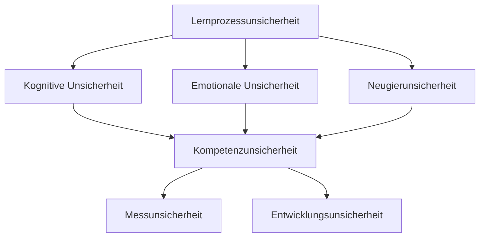
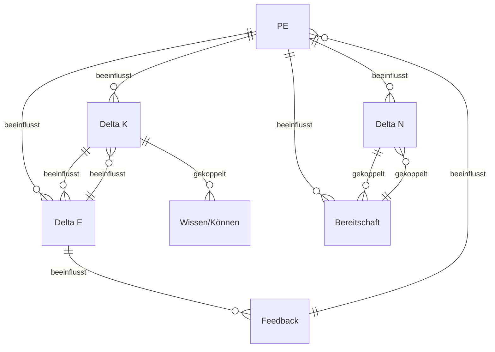

# 1 Definition

Die [[Lernprozessunsicherheit]] und die Kompetenzunsicherheit sind zwei zentrale Konzepte zur Beschreibung der Unsicherheiten im Bildungsprozess. Während die Lernprozessunsicherheit die internen, dynamischen Unsicherheiten beschreibt, die während des Lernens auftreten, umfasst die Kompetenzunsicherheit die Unsicherheiten, die bei der Messung und Entwicklung von Kompetenzen entstehen. Beide Konzepte stehen miteinander in Beziehung, unterscheiden sich jedoch in ihrer Ausrichtung und ihrem Fokus.

Lernprozessunsicherheiten betreffen insbesondere die kognitiven, emotionalen und neugierbezogenen Schwankungen, die sich im Verlauf des Lernprozesses ergeben. Diese Unsicherheiten sind stark von den individuellen Lernbedingungen und sozialen Interaktionen abhängig.

Kompetenzunsicherheiten beziehen sich auf die Herausforderungen und Unschärfen, die bei der Erfassung und Förderung von Kompetenzen auftreten. Dazu gehören die Unsicherheit in der Messung von Kompetenzen sowie die Unsicherheit, wie sich Kompetenzen über die Zeit entwickeln.

# 2 Herleitung

## 2.1 Lernprozessunsicherheit

### 2.1.1 Kognitive Unsicherheit

Die kognitive Unsicherheit ($\Delta K_L$) beschreibt die Unsicherheiten, die während des Lernprozesses auftreten, wenn Lernende Schwierigkeiten haben, Wissen zu verstehen oder auf neue Situationen anzuwenden. Sie resultiert aus der Komplexität des Lernmaterials, dem Vorwissen und den individuellen Lernvoraussetzungen. Diese Unsicherheit führt dazu, dass Lernende sich über die Korrektheit ihrer Gedankengänge und Lösungen unsicher fühlen.

- **Beispiel**: Ein Lernender hat Schwierigkeiten, ein mathematisches Problem zu lösen, weil er nicht sicher ist, ob er das zugrunde liegende Konzept vollständig verstanden hat. Diese Unsicherheit hindert ihn daran, das Problem selbstständig zu lösen und erfordert zusätzliche Unterstützung.

### 2.1.2 Emotionale Unsicherheit

Die emotionale Unsicherheit ($\Delta E_L$) umfasst Schwankungen im emotionalen Zustand der Lernenden, die den Lernprozess maßgeblich beeinflussen. Emotionen wie Angst, Frustration oder mangelndes Selbstvertrauen können dazu führen, dass Lernende ihre Fähigkeiten unterschätzen oder sich überfordert fühlen. Diese Unsicherheiten haben direkten Einfluss auf die Lernbereitschaft und das Verhalten gegenüber Herausforderungen.

- **Beispiel**: Ein Lernender, der sich vor Prüfungen besonders gestresst fühlt, könnte trotz guter Vorbereitung unter Prüfungsangst leiden, was zu einer emotionalen Unsicherheit führt. Diese Unsicherheit beeinträchtigt seine Leistungsfähigkeit während der Prüfung.

### 2.1.3 Neugierunsicherheit

Die Neugierunsicherheit ($\Delta N_L$) bezieht sich auf die Schwankungen in der intrinsischen Motivation eines Lernenden, neue Inhalte zu erkunden und zu verstehen. Diese Unsicherheit ist dynamisch und stark abhängig von der persönlichen Relevanz der Lerninhalte und der Komplexität der Aufgaben. Wenn die [[Neugier]] hoch ist, motiviert sie den Lernenden, auch schwierige oder uninteressante Inhalte zu bewältigen. Bei sinkender Neugier nimmt die Lernbereitschaft ab, was den Lernprozess erheblich beeinträchtigen kann.

- **Beispiel**: Ein Lernender könnte anfänglich von einem Thema begeistert sein, verliert jedoch das Interesse, wenn die Inhalte zu abstrakt oder zu schwierig werden. Diese Schwankung in der Neugier beeinflusst, wie engagiert der Lernende weiterhin mit dem Thema umgeht.

## 2.2 Kompetenzunsicherheit

### 2.2.1 Kompetenzmessunsicherheit

Die [[Kompetenzmessunsicherheit]] ($\Delta K$) beschreibt die Unschärfen und Unsicherheiten, die auftreten, wenn versucht wird, das Kompetenzniveau eines Lernenden zu erfassen. Dies betrifft sowohl formale Tests als auch informelle Beobachtungen. Die Unsicherheit ergibt sich daraus, dass keine Messung vollständig objektiv ist, da sie von vielen externen Faktoren wie der Tagesform, dem emotionalen Zustand des Lernenden oder der Qualität der Aufgaben beeinflusst wird.

- **Beispiel**: Ein Lernender könnte aufgrund von Prüfungsangst schlechter in einem Test abschneiden, obwohl seine tatsächliche Kompetenz in dem Bereich deutlich höher ist. Diese Messunsicherheit verfälscht das Bild seiner tatsächlichen Fähigkeiten.

### 2.2.2 Kompetenzentwicklungsunsicherheit

Die [[Kompetenzentwicklungsunsicherheit]] ($\Delta E$) bezieht sich auf die Unvorhersehbarkeit des Lernfortschritts. Diese Unsicherheit entsteht durch Schwankungen im Lernverhalten, die von Motivation, äußeren Einflüssen oder emotionaler Stabilität abhängig sind. Lernprozesse verlaufen selten linear und können durch unerwartete Ereignisse oder Stimmungen der Lernenden beeinflusst werden, was die Vorhersage der Kompetenzentwicklung erschwert.

- **Beispiel**: Ein Lernender zeigt in einem Monat signifikante Fortschritte, stagniert jedoch im darauffolgenden Monat aufgrund von mangelnder Motivation oder externen Stressfaktoren. Diese Schwankungen in der Kompetenzentwicklung führen zu einer Unsicherheit darüber, wann und wie der Lernende seine Ziele erreichen wird.

## 2.3 Vergleich der Unsicherheiten

Die **Lernprozessunsicherheit** und die **Kompetenzunsicherheit** sind eng miteinander verwoben, da beide Unsicherheiten zentrale Aspekte des Bildungsprozesses betreffen. Dennoch unterscheiden sie sich in ihrer Ausrichtung und den Dimensionen, die sie betreffen:

- **Lernprozessunsicherheit** bezieht sich auf die dynamischen Schwankungen innerhalb des Lernprozesses selbst. Sie umfasst die kognitive, emotionale und neugierbezogene Unsicherheit, die sich während des Lernens verändern und gegenseitig beeinflussen.
  
- **Kompetenzunsicherheit** bezieht sich auf die Unsicherheiten, die bei der Messung und Entwicklung von Kompetenzen auftreten. Sie betrifft vor allem die Genauigkeit der Kompetenzmessung und die Vorhersagbarkeit der Kompetenzentwicklung.

*Abbildung 1: Zusammenwirken der Unsicherheiten (eig. Darstellung)*

Die beiden Konzepte sind insofern miteinander verknüpft, als dass Unsicherheiten im Lernprozess (zum Beispiel emotionale Unsicherheiten) sich direkt auf die Kompetenzentwicklung auswirken können, wodurch die Kompetenzunsicherheit erhöht wird.

### 2.3.1 Gemeinsamkeiten

- Beide Konzepte erfassen Unsicherheiten, die durch individuelle, emotionale und kognitive Variablen beeinflusst werden.
- Sowohl Lernprozessunsicherheit als auch Kompetenzunsicherheit sind dynamisch und unterliegen externen Einflüssen wie dem sozialen Umfeld oder der psychischen Verfassung der Lernenden.
- Beide Unsicherheiten spielen eine wesentliche Rolle bei der Anpassung und Gestaltung von Bildungsprozessen, da sie aufzeigen, wo potenzielle Störfaktoren und Hindernisse liegen könnten.

### 2.3.2 Unterschiede

- Die **Lernprozessunsicherheit** konzentriert sich auf die internen Schwankungen, die während des Lernens auftreten, und ist stärker mit den direkten Erfahrungen und Emotionen der Lernenden verbunden.
- Die **Kompetenzunsicherheit** zielt darauf ab, die externen Schwierigkeiten bei der Messung und Vorhersage von Kompetenzen zu erfassen. Sie betrifft eher die langfristige Entwicklung und das externe Feedback über die erbrachten Leistungen der Lernenden.

# 3 Folgerungen

- **Komplexe Wechselwirkungen**: Die Lernprozessunsicherheiten wirken sich direkt auf die Kompetenzunsicherheiten aus. Wenn die kognitive, emotionale oder neugierbezogene Unsicherheit hoch ist, steigt auch die Unsicherheit in der Kompetenzentwicklung. Dies bedeutet, dass Lehrende und Lernplattformen ein flexibles System benötigen, um auf diese dynamischen Unsicherheiten zu reagieren.

Legende
- PE : Persönliche Ereignisse
- "Delta K" : Kognitive Unsicherheit
- "Delta E" : Emotionale Unsicherheit
- "Delta N" : Neugierige Unsicherheit
- Wissen : Wissensaufbau
- Feedback : Feedback, das Lernende erhalten
- Bereitschaft : Bereitschaft der Lernenden

*Abbildung 2: Erklärung der genauen Beziehungen im ERD:
	1.	Delta K (kognitive Unsicherheit) und Delta E (emotionale Unsicherheit) sind wechselseitig gekoppelt, da sie sich gegenseitig beeinflussen.
	2.	Delta N (neugierige Unsicherheit) und Bereitschaft sind ebenfalls gekoppelt, was sowohl in den Berechnungen als auch in der Logik des Modells sinnvoll ist.
	3.	Feedback ist Teil der Lernschleife und beeinflusst PE, die wiederum alle Unsicherheiten beeinflussen.
	4.	Die Unsicherheiten beeinflussen jeweils die Wissensentwicklung (Delta K) und die Feedback-Verarbeitung (Delta E).
(eig. Darstellung)*

- **Systemische Betrachtung**: Um Bildungsprozesse effektiv zu gestalten, müssen Lernprozessunsicherheiten und Kompetenzunsicherheiten in einem ganzheitlichen Ansatz betrachtet werden. Nur wenn beide Unsicherheiten verstanden und berücksichtigt werden, können Lernprozesse optimiert werden.

# 4 Implikationen

- **Adaptive Lernsysteme**: Lernsysteme müssen sowohl Lernprozessunsicherheiten als auch Kompetenzunsicherheiten erfassen und dynamisch darauf reagieren. Systeme, die auf den emotionalen Zustand, die kognitiven Herausforderungen und die Motivation der Lernenden eingehen, können die Qualität der Lernprozesse und die Genauigkeit der Kompetenzmessung verbessern.
  
- **Frühe Interventionen**: Die Verknüpfung von Lernprozessunsicherheiten und Kompetenzunsicherheiten legt nahe, dass frühzeitige Interventionen bei emotionalen oder kognitiven Unsicherheiten auch langfristig die Kompetenzentwicklung stabilisieren können. Durch gezielte Unterstützung können Unsicherheiten im Lernprozess reduziert und dadurch auch die Messung und Entwicklung von Kompetenzen verbessert werden.

# 5 Zusammenfassung

Die **Lernprozessunsicherheit** und die **Kompetenzunsicherheit** sind zwei eng verbundene Konzepte, die zentrale Aspekte des Bildungsprozesses abdecken. Lernprozessunsicherheiten betreffen vor allem die dynamischen Schwankungen in den Bereichen Kognition, Emotion und Neugier während des Lernens. Kompetenzunsicherheiten hingegen beziehen sich auf die Unsicherheiten bei der Messung und Vorhersage von Kompetenzentwicklung. Obwohl die beiden Konzepte unterschiedliche Dimensionen des Bildungsprozesses betreffen, stehen sie in einer engen Wechselwirkung, die zeigt, wie stark Unsicherheiten im Lernprozess die langfristige Entwicklung von Kompetenzen beeinflussen können. Ein ganzheitliches Verständnis beider Unsicherheiten ist notwendig, um Bildungsprozesse effektiv zu gestalten und die Lernenden optimal zu unterstützen.

# Quelle(n)

- Luhmann, N. (1997). *Soziale Systeme: Grundriss einer allgemeinen Theorie*. Suhrkamp Verlag.
- Vygotsky, L. S. (1978). *Mind in Society: The Development of Higher Psychological Processes*. Harvard University Press.
- Deci, E. L., & Ryan, R. M. (1985). *Intrinsic Motivation and Self-Determination in Human Behavior*. Plenum Press.
- Einstein, A. (1915). *Die Grundlage der allgemeinen Relativitätstheorie*. Annalen der Physik.
