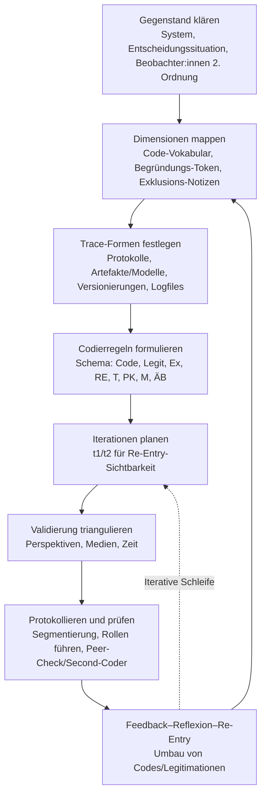

created: 31.10.2024 | [updated](https://github.com/jochen-hanisch/research/blob/main/Systemtheorie/Beobachtung%20dritter%20Ordnung.md): 27.11.2024 | published: 27.11.2024 | [Austausch](https://lernen.jochen-hanisch.de/course/view.php?id=4) | [[Hinweise]]

**Beobachtung dritter Ordnung: Re-Entry als Motor der Selbsttransformation**

# Einleitung

Die Beobachtung dritter Ordnung stellt eine weitere Perspektive innerhalb der Systemtheorie dar, die das bestehende Verständnis von Selbstreferenz, Autopoiesis und der Unterschiedlichkeit von Systemen grundlegend erweitert. Die klassische Systemtheorie, wie sie insbesondere durch die Arbeiten von Niklas Luhmann geprägt wurde, unterscheidet zwischen der Beobachtung erster und zweiter Ordnung, die jeweils unterschiedliche Ebenen der Wahrnehmung und [[Reflexion]] beschreiben (Luhmann, 1984; Luhmann, 1995). Diese Konzepte bieten die theoretische Grundlage für das Verständnis von Systemen als selbstreferenziellen Einheiten, die durch interne Prozesse und Rückkopplungen stabilisiert und weiterentwickelt werden können.

Die Beobachtung dritter Ordnung beschreibt eine zusätzliche Meta-Ebene, in der das System nicht nur sich selbst und seine Beobachtungsprozesse reflektiert, sondern auch die Mechanismen und Strukturen hinter diesen Prozessen analysiert und anpasst. Diese Meta-Ebene eröffnet dem System die Möglichkeit, sich unabhängig von äußeren Anreizen weiterzuentwickeln und neue, interne Handlungsoptionen zu generieren. Diese Überlegungen greifen auf die Idee der Autopoiesis zurück, wie sie in den Arbeiten von Maturana und Varela entwickelt wurde, um die Fähigkeit von Systemen zur Selbstorganisation und -erzeugung zu beschreiben.

Das zentrale Erkenntnisinteresse dieser Analyse liegt darin, die Beobachtung dritter Ordnung als eigenständigen Begriff innerhalb der Systemtheorie zu etablieren und ihre Rolle für die Selbstentwicklung, die Erzeugung von Unterschiedlichkeit und die dynamische Autopoiesis von Systemen zu beleuchten. Durch die Untersuchung dieses neuen Konzepts kann aufgezeigt werden, wie [[Systeme]] über basale Reiz-Reaktionsmuster hinaus eine eigenständige Selbsttransformation vollziehen und sich durch intern generierte Erkenntnisprozesse kontinuierlich neu erschaffen können.

Die systematische Erarbeitung der Beobachtung dritter Ordnung wird dazu beitragen, das Verständnis komplexer, selbstreferenzieller [[Systeme]] – insbesondere psychischer und sozialer [[Systeme]] – zu vertiefen und auf eine Weise zu erweitern, die sowohl theoretische als auch praktische Implikationen für selbstgesteuerte Lernprozesse, adaptive Bildungskonzepte und die Gestaltung resilienter [[Systeme]] in verschiedenen Kontexten bieten könnte.

# 1 Definition

Der Begriff Beobachtung dritter Ordnung bezieht sich auf eine erweiterte Form der Selbstbeobachtung in komplexen, selbstreferenziellen Systemen. Er beschreibt eine Meta-Ebene, in der ein System nicht nur seine Umwelt oder internen Zustände beobachtet, sondern auch die Mechanismen und Prozesse, durch die es selbst wahrnimmt und sich strukturiert. Diese Beobachtung geht über die klassische Selbstreferenz hinaus und kann das System in die Lage versetzen, die eigenen Beobachtungs- und Reflexionsprozesse als Gegenstand der Analyse zu betrachten und dadurch potenziell neue Handlungsmöglichkeiten und Strukturen zu schaffen.

Die Beobachtung dritter Ordnung ist durch drei zentrale Merkmale gekennzeichnet:

1. **Internes [[Feedback]]**: Das System generiert [[Feedback]], das aus seinen eigenen Operationen und Strukturen hervorgeht. Im Gegensatz zu externem [[Feedback]] speist sich dieses selbstbezogene [[Feedback]] aus internen Rückkopplungsschleifen, die es dem System ermöglichen, eigenständig über seine Prozesse zu reflektieren. Hierdurch wird das System in die Lage versetzt, eine kontinuierliche Selbstüberprüfung vorzunehmen, die auf intern generierten Rückkopplungen basiert.

2. **Meta-[[Reflexion]]**: Die Beobachtung dritter Ordnung beinhaltet eine [[Reflexion]] über die eigenen Beobachtungsprozesse. Dies befähigt das System potenziell dazu, die Mechanismen der eigenen Wahrnehmung und deren Grenzen zu hinterfragen. Es entwickelt ein Bewusstsein für die Funktionsweise und Einflüsse seiner eigenen Struktur, was gezielte neue [[Erkenntnis|Erkenntnisse]] und Handlungsoptionen eröffnet. Die Meta-[[Reflexion]] beschreibt eine selbstreferenzielle Fähigkeit, die über die einfache Selbstreflexion hinausgeht und den Weg zur autonomen Wissensentwicklung freimacht.

3. **Reentry**: Die durch die Meta-[[Reflexion]] gewonnenen [[Erkenntnis|Erkenntnisse]] werden in einem Reentry-Prozess wieder in das System integriert. Dieser Reentry-Prozess sorgt dafür, dass neue [[Erkenntnis|Erkenntnisse]] die bestehende Systemstruktur erweitern und neue Operationen ermöglichen. Reentry trägt dazu bei, dass das System sich nicht nur stabilisiert, sondern durch selbstgenerierte [[Erkenntnis|Erkenntnisse]] aktiv transformiert und weiterentwickelt (Luhmann, 1995; Spencer-Brown, 1969).

Die Beobachtung dritter Ordnung kann in der Systemtheorie verwendet werden, um die kontinuierliche Selbsterschaffung und dynamische Autopoiesis in selbstreferenziellen Systemen zu beschreiben. Sie könnte dabei helfen, die Eigenständigkeit und Unterschiedlichkeit von Systemen zu erklären, da jedes System durch die individuelle Generierung und Verarbeitung interner Rückkopplungen spezifische Werte, Handlungsoptionen und Strukturen entwickelt.

# 2 Herleitung

Die Herleitung des Begriffs Beobachtung dritter Ordnung erfolgt vor dem Hintergrund bestehender systemtheoretischer Konzepte, insbesondere der Autopoiesis und Selbstreferenz. Diese Konzepte gehen auf die grundlegenden Arbeiten von Niklas Luhmann sowie die frühen Konzepte von Humberto Maturana und Francisco Varela zurück. Diese Theorien haben das Verständnis von Systemen als selbstreferenzielle und sich selbst erhaltende Einheiten geprägt und bilden die Grundlage für eine erweiterte Perspektive auf Selbstorganisation und Autonomie in komplexen Systemen (Luhmann, 1984; Maturana & Varela, 1980).

Ausgangspunkt dieser Herleitung sind die klassischen Unterscheidungen in der Systemtheorie zwischen der Beobachtung erster und zweiter Ordnung, die jeweils unterschiedliche Ebenen der Wahrnehmung und [[Reflexion]] beschreiben. Die Beobachtung erster Ordnung beschreibt die direkte Wahrnehmung und Beschreibung von Zuständen oder Ereignissen, während die Beobachtung zweiter Ordnung eine Ebene der Selbstreflexion einführt, in der das System seine eigenen Wahrnehmungsprozesse und Bedingungen hinterfragen kann (Luhmann, 1995). Diese Unterscheidung erlaubt es dem System, nicht nur seine Umwelt zu beobachten, sondern auch die eigenen Voraussetzungen und Prozesse der Wahrnehmung kritisch zu reflektieren.

Jedoch bleibt in den klassischen systemtheoretischen Konzepten die [[Reflexion]] in der Regel stabilisierend und reaktiv, was bedeutet, dass das System primär auf äußere Reize angewiesen ist und seine Selbstanpassung und -entwicklung in einem stabilen Wechselspiel mit der Umwelt erfolgt. Die Fähigkeit des Systems, eine autonome, aus sich selbst generierte Transformation zu durchlaufen, wird jedoch nur bedingt beschrieben (Luhmann, 1995; Spencer-Brown, 1969).

Hier setzt die Beobachtung dritter Ordnung an, indem sie eine Meta-Ebene der Selbstbeobachtung einführt, die es dem System erlaubt, über die eigenen Strukturen und Mechanismen nachzudenken und diese intern zu verändern. Die Theorie der Beobachtung dritter Ordnung erweitert das klassische Modell durch die Einführung eines Reentry-Prozesses, der die durch Meta-[[Reflexion]] gewonnenen [[Erkenntnis|Erkenntnisse]] wieder in das System zurückführt und so eine eigenständige, dynamische Autopoiesis ermöglicht (Spencer-Brown, 1969; Luhmann, 1986).

Dieser erweiterte Ansatz beschreibt eine Form der Selbstentwicklung, die nicht nur reaktiv, sondern autonom und intern generiert ist und damit ein tieferes Verständnis der Selbstorganisation und Unterschiedlichkeit selbstreferenzieller [[Systeme]], wie psychischer und sozialer [[Systeme]], erlaubt.

## 2.1 Ausgangspunkt: Klassische Unterscheidungen in der Systemtheorie

Die klassischen Unterscheidungen in der Systemtheorie zwischen Beobachtungen erster und zweiter Ordnung bilden einen zentralen Ausgangspunkt für das Verständnis komplexer [[Systeme]] und deren Reflexionsprozesse. Die Konzepte basieren auf den Arbeiten von Niklas Luhmann und stellen die theoretische Grundlage dar, um die Funktionsweise und Selbststrukturierung von Systemen als Prozesse selbstreferenzieller Beobachtung und [[Reflexion]] zu analysieren (Luhmann, 1984; Luhmann, 1995).

- **Beobachtung erster Ordnung** bezieht sich auf die direkte und unmittelbare Wahrnehmung und Beschreibung von Ereignissen, Zuständen oder Objekten innerhalb eines Systems. Diese Form der Beobachtung erfolgt ohne [[Reflexion]] über die eigenen Wahrnehmungsprozesse und ohne eine kritische Analyse der Bedingungen, unter denen diese Wahrnehmung stattfindet. Beobachtungen erster Ordnung sind daher durch eine primär reaktive Beziehung zur Umwelt gekennzeichnet. Das System nimmt Informationen auf und interpretiert diese, ohne die eigenen Vorannahmen, Filter oder strukturellen Bedingungen, die die Wahrnehmung beeinflussen, zu hinterfragen. Der Fokus liegt hier auf dem „Was“ der Wahrnehmung, und die beobachteten Phänomene werden aus der Perspektive einer objektiven Beschreibung erfasst (Luhmann, 1984; Luhmann, 1995).

- **Beobachtung zweiter Ordnung** erweitert die systemtheoretische Perspektive um eine Ebene der Selbstreflexion, die es dem System ermöglicht, nicht nur seine Umwelt, sondern auch seine eigenen Beobachtungs- und Bewertungsprozesse kritisch zu hinterfragen. Diese Ebene beschreibt eine Meta-[[Reflexion]], die es dem System erlaubt, die Bedingungen, Einschränkungen und Subjektivität seiner eigenen Wahrnehmung zu analysieren. In dieser zweiten Ordnung erkennt das System nicht nur die wahrgenommenen Phänomene, sondern auch die strukturellen und kognitiven Rahmenbedingungen, die die Wahrnehmung des Systems prägen. Die Beobachtung zweiter Ordnung konzentriert sich daher auf das „Wie“ und „Warum“ der Beobachtungen und schafft die Möglichkeit, die eigenen Wahrnehmungsprozesse und deren Grenzen zu reflektieren (Luhmann, 1995).

Diese Unterscheidung zwischen Beobachtungen erster und zweiter Ordnung hat die Systemtheorie grundlegend geprägt, da sie es einem System erlaubt, über seine eigene Funktionsweise und die Wirklichkeit, die es durch seine Beobachtungen konstruiert, zu reflektieren. Die Fähigkeit, durch die Beobachtung zweiter Ordnung die Subjektivität und Kontextabhängigkeit der eigenen Beobachtungen zu erkennen, eröffnet dem System neue Handlungsoptionen und eine Flexibilität, die über das bloße Reagieren auf Umweltreize hinausgeht. Damit bildet diese Unterscheidung die Basis für das Verständnis von Systemen als autonom operierende, selbstreferenzielle Einheiten, die ihre eigene Strukturierung und Anpassung reflektieren und gezielt steuern können (Luhmann, 1984).

## 2.2 Erweiterung der klassischen Konzepte: Von Selbstreferenz zur Beobachtung dritter Ordnung

Obwohl die klassischen systemtheoretischen Konzepte fortgeschrittene Reflexionsebenen beschreiben, bleibt die [[Reflexion]] in der Beobachtung zweiter Ordnung auf die bestehenden Strukturen und Funktionsweisen des Systems fokussiert. Diese Ebene ist stabilisierend und primär reaktiv, da das System über die zweite Ordnung primär in der Lage ist, durch externe Reize und Rückkopplungsschleifen auf Veränderungen zu reagieren und diese im Rahmen seiner etablierten Strukturen zu reflektieren. Diese Art der [[Reflexion]] erlaubt es dem System zwar, sich flexibel an seine Umwelt anzupassen und bestehende Strukturen zu optimieren, bietet jedoch keine umfassende Erklärung dafür, wie ein System sich aus sich selbst heraus autonom transformieren kann. Es stellt sich somit die Frage, wie ein System neue Strukturen und [[Erkenntnis|Erkenntnisse]] entwickeln kann, die nicht allein auf externen Rückmeldungen basieren (Luhmann, 1984; Maturana & Varela, 1980).

Die Beobachtung dritter Ordnung greift diese Reflexionsebene auf und erweitert sie, indem sie eine zusätzliche Meta-Ebene einführt, die das System in die Lage versetzt, seine eigenen Mechanismen und Strukturen, durch die es operiert, systematisch zu analysieren und zu verändern. Diese zusätzliche Ebene der Selbstbeobachtung führt eine Form der Selbststrukturierung ein, die es dem System erlaubt, über die bestehenden Strukturen hinauszuwachsen und neue Handlungsmöglichkeiten und Operationen zu generieren. Anders als die Beobachtungen erster und zweiter Ordnung, die primär auf die [[Reflexion]] äußerer und innerer Umwelten fokussiert sind, beschreibt die Beobachtung dritter Ordnung einen prozessualen Wandel, der durch intern generiertes [[Feedback]] und eine intensive Meta-[[Reflexion]] in Gang gesetzt wird (Maturana & Varela, 1980; Luhmann, 1995).

Die Idee eines autopoietischen Wandels durch internes [[Feedback]] und Meta-[[Reflexion]] erweitert das klassische Modell der Selbstreferenz und bietet eine tiefere Form der Selbstentwicklung, die nicht nur reaktiv, sondern durch innere Antriebskräfte und selbstgenerierte Rückkopplungen angetrieben wird. Diese Form der Selbstbeobachtung stellt somit eine Erweiterung dar, die es dem System erlaubt, über die bloße Anpassung hinaus neue Strukturen und Handlungsmöglichkeiten zu schaffen und sich aus sich selbst heraus zu transformieren (Spencer-Brown, 1969).

## 2.3 Reentry und die Selbsterschaffung des Systems

Eine zentrale Komponente der Beobachtung dritter Ordnung ist der Prozess des **Reentry**, wie er in der Systemtheorie beschrieben wird. Reentry bezeichnet die Wiedereinführung der eigenen Unterscheidungen in das System, sodass durch die gewonnenen [[Erkenntnis|Erkenntnisse]] nicht nur neue Operationen entstehen, sondern das System seine Strukturen in einem kontinuierlichen Zyklus der Selbsterschaffung weiterentwickelt. Der Reentry-Prozess sorgt dafür, dass die durch die Meta-[[Reflexion]] gewonnenen [[Erkenntnis|Erkenntnisse]] nicht nur stabilisierend wirken, sondern eine fortlaufende Anpassung und Neustrukturierung des Systems fördern. Dieser Prozess beschreibt eine dynamische Form der Autopoiesis, in der das System sich kontinuierlich selbst erschafft und durch intern generierte Rückkopplungen und [[Erkenntnis|Erkenntnisse]] anpasst (Spencer-Brown, 1969; Luhmann, 1986).

Anders als einfache Rückkopplungen oder Reflexionsprozesse, die primär auf äußere Veränderungen und Anpassungen reagieren, führt der Reentry-Prozess zu einer eigenständigen, aktiven Selbsterschaffung. Hierbei werden die durch die Meta-[[Reflexion]] entwickelten neuen Strukturen und Handlungsoptionen in das System integriert, was zu einer ständigen Weiterentwicklung und Differenzierung führt. Der Reentry ermöglicht eine Form der dynamischen Autopoiesis, die es dem System erlaubt, eigenständig neue Strukturen zu schaffen, die nicht ausschließlich reaktiv auf externe Reize basieren (Luhmann, 1986; Spencer-Brown, 1969).

Durch den Reentry-Prozess wird das System in die Lage versetzt, sich durch die ständige Wiedereinführung seiner eigenen Unterscheidungen kontinuierlich neu zu strukturieren und zu entwickeln. Die dadurch entstehende **dynamische Autopoiesis** geht über die klassische Selbstreferenz hinaus und erlaubt dem System eine Form der Selbsterschaffung, die sich unabhängig von äußeren Impulsen entfalten kann. Diese Form der Autopoiesis stellt eine tiefgreifende Erweiterung der systemtheoretischen Konzepte dar, da sie die Fähigkeit beschreibt, durch intern generierte Rückkopplungen und Selbststrukturierung autonom zu operieren und sich kontinuierlich weiterzuentwickeln (Luhmann, 1986; Maturana & Varela, 1980).

## 2.4 Bedeutung der Herleitung für selbstreferenzielle [[Systeme]]

Durch die Erweiterung der klassischen systemtheoretischen Konzepte um die Beobachtung dritter Ordnung wird es möglich, selbstreferenzielle [[Systeme]] wie psychische und soziale [[Systeme]] umfassender zu verstehen. Diese [[Systeme]] sind nicht nur in der Lage, sich an die Umwelt anzupassen, sondern auch, sich aus inneren Antriebskräften heraus autonom zu entwickeln. Die Beobachtung dritter Ordnung liefert eine theoretische Grundlage, um die dynamische Selbsttransformation dieser [[Systeme]] zu erklären. Sie beschreibt eine Form der Selbstorganisation und Autopoiesis, die das System in die Lage versetzt, durch selbstgenerierte Rückkopplungen und eine intensive Meta-[[Reflexion]] eigene Strukturen und Handlungsoptionen zu schaffen, die es kontinuierlich erweitern und differenzieren (Maturana & Varela, 1980; Luhmann, 1984).

Die Fähigkeit eines Systems, intern neue Strukturen zu schaffen und autonom auf die eigene Weiterentwicklung Einfluss zu nehmen, ist grundlegend für die Differenzierung und Individualität selbstreferenzieller [[Systeme]]. Da jedes System in der Beobachtung dritter Ordnung eine eigene Art und Weise der internen Rückkopplung und [[Reflexion]] entwickelt, entstehen einzigartige Strukturen und Wertorientierungen, die das System von anderen Systemen unterscheiden und seine Eigenständigkeit stärken (Luhmann, 1986).

Zusammenfassend bietet die Beobachtung dritter Ordnung eine neue Perspektive auf die Autonomie und Selbsterschaffung selbstreferenzieller [[Systeme]]. Sie beschreibt die Fähigkeit dieser [[Systeme]], sich unabhängig von äußeren Einflüssen kontinuierlich weiterzuentwickeln und differenzierte, eigenständige Strukturen zu bilden. Dies eröffnet in der Systemtheorie eine tiefere und umfassendere Perspektive auf die Selbstorganisation und Autopoiesis, die sowohl theoretische als auch praktische Implikationen für das Verständnis und die Gestaltung komplexer [[Systeme]] bietet.

## 2.5 Systemunterschiede

Die Beobachtung dritter Ordnung ermöglicht ein vertieftes Verständnis der Unterschiedlichkeit von Systemen, indem sie zeigt, wie diese durch intern generierte Rückkopplungen, Meta-[[Reflexion]] und den Re-Entry-Prozess zu eigenständigen Strukturen und spezifischen Handlungslogiken gelangen. Diese Prozesse führen dazu, dass jedes System im Laufe seiner Selbststrukturierung eine unverwechselbare Identität entwickelt, die es grundlegend von anderen Systemen abgrenzt.

### 2.5.1 Interne Strukturierung durch Meta-[[Reflexion]]

Ein wesentlicher Faktor für die Unterschiedlichkeit von Systemen liegt in der internen Strukturierung, die durch die Beobachtung dritter Ordnung gefördert wird. Während klassische Ansätze der Systemtheorie die Selbstreferenz und Rückkopplung eines Systems vorwiegend als stabilisierenden Prozess zur Anpassung an externe Bedingungen beschreiben (Luhmann, 1984; Luhmann, 1995), bietet die Beobachtung dritter Ordnung eine zusätzliche Meta-Reflexionsebene, auf der das System nicht nur externe Einflüsse und seine internen Prozesse analysiert, sondern auch die Mechanismen, durch die es operiert, systematisch hinterfragt und adaptiert.

Diese Meta-[[Reflexion]] ermöglicht es dem System, interne Bewertungs- und Entscheidungskriterien zu entwickeln, die über extern geprägte Anpassungsstrategien hinausgehen. Durch diesen selbstreferenziellen Prozess entstehen spezifische Werte, Entscheidungsstrukturen und Handlungsmuster, die individuell auf das jeweilige System zugeschnitten sind. Da jedes System eigene Bedeutungshorizonte und Bewertungsmechanismen etabliert, resultiert eine autonome Strukturierung und Anpassungsfähigkeit, die das System in seiner Einzigartigkeit charakterisiert (Maturana & Varela, 1980).

### 2.5.2 Unterschiedlichkeit durch Re-Entry und autopoietische Selbststrukturierung

Ein weiterer Mechanismus zur Erklärung der Systemunterschiede ergibt sich aus dem Re-Entry-Prozess, durch den die durch Meta-[[Reflexion]] gewonnenen [[Erkenntnis|Erkenntnisse]] in das System reintegriert und in Form neuer Operationen und Strukturen verankert werden. Der Re-Entry-Prozess beschreibt eine autopoietische Selbststrukturierung, die unabhängig von externen Einflüssen verläuft (Spencer-Brown, 1969; Luhmann, 1986). 

Dieser kontinuierliche Prozess der Selbstwiedereinführung generiert spezifische Denk- und Handlungsoptionen, die das System in seiner Entwicklung differenzieren und seine Eigenständigkeit fördern. Jede Iteration des Re-Entry-Prozesses trägt zur fortschreitenden Differenzierung des Systems bei, indem intern generierte Rückkopplungen genutzt werden, um neue Strukturen zu etablieren, die nicht allein auf externe Anreize reagieren, sondern die Eigenlogik des Systems reflektieren. Dies schafft spezifische Mechanismen der Selbstanpassung und -entwicklung, die für jedes System einzigartig sind und zur ausgeprägten Individualität selbstreferenzieller [[Systeme]] führen (Luhmann, 1986).

### 2.5.3 Unterschiedliche Handlungsmöglichkeiten und Entscheidungslogiken

Die durch die Beobachtung dritter Ordnung ermöglichten internen Rückkopplungen und Meta-Reflexionsprozesse führen zu systeminternen Unterscheidungen in den Handlungsmöglichkeiten und Entscheidungslogiken. Jedes System entwickelt auf Basis des Re-Entry-Prozesses eine spezifische Art, Umweltinformationen zu verarbeiten und darauf zu reagieren. Die durch die kontinuierliche Selbststrukturierung gewonnenen Handlungsoptionen und Entscheidungsstrukturen werden von den spezifischen Wert- und Entscheidungskriterien des Systems geprägt, was eine fortlaufende Differenzierung zwischen den Systemen bewirkt.

Durch den Re-Entry-Prozess entstehen so systeminterne Strukturen und Operationen, die das System unabhängig von äußeren Rückkopplungen dynamisch weiterentwickeln und individuelle Anpassungsstrategien hervorbringen. Diese Differenzierung resultiert in spezifischen Entscheidungsmustern und Handlungslogiken, die jedes System von anderen abgrenzen und die Grundlage für seine Eigenständigkeit bilden (Luhmann, 1995).

### 2.5.4 Die Eigenständigkeit und Differenzierung durch Beobachtung dritter Ordnung

Zusammenfassend bietet die Beobachtung dritter Ordnung eine theoretische Grundlage, um die Eigenständigkeit und Unterschiedlichkeit selbstreferenzieller [[Systeme]] systematisch zu erklären. Durch die Kombination von Meta-[[Reflexion]], Re-Entry und intern generierten Rückkopplungsprozessen entstehen spezifische Strukturen und Handlungsoptionen, die die Eigenlogik jedes Systems betonen und ihm eine individuelle Identität verleihen. Diese intern generierten Prozesse fördern eine kontinuierliche Selbstentwicklung und Differenzierung, die das System zu einer autonomen und einzigartigen Einheit formt. Damit erweitert die Beobachtung dritter Ordnung das klassische Verständnis der Systemtheorie, indem sie das dynamische Potenzial selbstorganisierter [[Systeme]] aufzeigt (Luhmann, 1986; Maturana & Varela, 1980).

## 2.6 Mathematische Formeln

Die Beobachtung dritter Ordnung lässt sich durch eine formale Herleitung darstellen, die von der ersten grundlegenden Unterscheidung ausgeht und schrittweise über die Beobachtungen erster und zweiter Ordnung zur dritten Ebene führt. Spencer-Browns Konzept der Unterscheidung in *Laws of Form* bietet dabei eine mathematische Grundlage, um diese Prozesse zu formalisieren. Der Re-Entry-Prozess, wie er von Spencer-Brown beschrieben und von Luhmann weiterentwickelt wurde, bildet die Basis für die rekursiven Mechanismen der Selbstreferenz und Meta-[[Reflexion]].

### 2.6.1 Herleitung von der ersten Unterscheidung über die erste und zweite bis zur dritten Beobachtung

Die mathematische Darstellung der Beobachtungen erster, zweiter und dritter Ordnung basiert auf einer schrittweisen Erweiterung der Unterscheidung, die das Verhältnis von System und Umwelt definiert und kontinuierlich durch interne Prozesse reflektiert.

#### 2.6.1.1 Erste Unterscheidung (Beobachtung erster Ordnung)

Die erste Unterscheidung stellt den Ausgangspunkt für die System-Umwelt-Trennung dar. Diese grundlegende Unterscheidung trennt das Innere (System) vom Äußeren (Umwelt) und bildet die Grundlage für die Beobachtung erster Ordnung, in der das System sich selbst in Relation zur Umwelt wahrnimmt. In der Notation von Spencer-Brown lässt sich diese erste Unterscheidung als Markierung $\bigcirc$ oder als Grenzziehung formulieren:

$$
\text{Markierung: } \ \bigcirc = \text{Unterscheidung zwischen Innen (System) und Außen (Umwelt)}
$$

Hierbei definiert $\bigcirc$ das grundlegende Setzen einer Grenze, bei der das System beginnt, sich selbst von seiner Umwelt abzugrenzen und durch diese Unterscheidung eine systeminterne Perspektive auf äußere Reize zu entwickeln (Luhmann, 1984; Spencer-Brown, 1969). Diese Ebene beschreibt eine grundlegende Reaktivität gegenüber externen Einflüssen, ohne eine selbstkritische [[Reflexion]] der Beobachtungsprozesse.

#### 2.6.1.2 Zweite Unterscheidung (Beobachtung zweiter Ordnung)

Die zweite Unterscheidung führt eine Ebene ein, auf der das System seine eigene Beobachtung reflektiert. An dieser Stelle analysiert das System nicht nur die äußeren Reize, sondern auch die Bedingungen und Voraussetzungen seiner eigenen Wahrnehmung und Bewertungen. Die mathematische Formulierung dieser Reflexionsebene kann durch einen Re-Entry-Prozess symbolisiert werden, bei dem das System sich selbst innerhalb der zuvor gesetzten Unterscheidung als Beobachtungsobjekt einführt:

$$
\bigcirc(\bigcirc) = \text{[[Reflexion]] über die ursprüngliche Unterscheidung}
$$

In der Sprache von Spencer-Brown bedeutet dies, dass das System die zuvor gesetzte Grenze in sich selbst wieder einführt, wodurch eine selbstreferentielle Schleife entsteht, die die Basis für die Meta-Reflexionsebene bildet (Luhmann, 1995). An dieser Stelle wird die Selbstbeobachtung des Systems zentral, da es seine eigenen Prozesse und Entscheidungsstrukturen als Teil des Beobachtungsprozesses begreift und reflektiert.

#### 2.6.1.3 Dritte Unterscheidung (Beobachtung dritter Ordnung)

Die Beobachtung dritter Ordnung erweitert diesen selbstreferenziellen Prozess, indem das System nicht nur über seine Wahrnehmungen und Prozesse reflektiert, sondern auch die Mechanismen hinter diesen Reflexionen analysiert und systematisch anpasst. Mathematisch ließe sich dies als iterativer Re-Entry-Prozess darstellen, bei dem die Unterscheidung wiederholt in das System eingeführt wird und sich so zusätzliche Reflexionsebenen bilden:

$$
\bigcirc(\bigcirc(\bigcirc)) = \text{Meta-[[Reflexion]] über die eigenen Beobachtungsmechanismen}
$$

Jede weitere Iteration dieses Re-Entry-Prozesses schafft neue Möglichkeiten zur Differenzierung und Anpassung. Die Beobachtung dritter Ordnung beschreibt demnach eine Rekursionsebene, die nicht nur statisch ist, sondern das System dynamisch transformiert und neue Strukturen generiert. Diese Form der rekursiven Selbstreferenz erklärt die Fähigkeit zur kontinuierlichen Selbsterschaffung und Autonomie des Systems (Spencer-Brown, 1969).

### 2.6.2 Mathematische Beweisführung der Beobachtung dritter Ordnung

Um die Beobachtung dritter Ordnung mathematisch zu beweisen, kann das Konzept der rekursiven Rückkopplung genutzt werden. Der Prozess des Re-Entry stellt eine wiederholte Rückführung der Unterscheidung in das System dar, wodurch sich das System kontinuierlich neu erschafft und selbst reguliert. 

#### 2.6.2.1 Re-Entry als rekursive Rückkopplung

Sei $R_n$ die $n$-te Rückkopplung innerhalb eines Systems. Jede Rückkopplung basiert auf der vorhergehenden und verändert das System intern. Dies kann durch eine rekursive Gleichung dargestellt werden:

$$
R_n = R(R_{n-1})
$$

In dieser Gleichung symbolisiert $R(R_{n-1})$ die Funktion, die eine neue Rückkopplung auf Grundlage der vorherigen erzeugt. Der Prozess beschreibt, wie das System durch die kontinuierliche Integration vorhergehender Beobachtungen und Unterscheidungen seine eigene Struktur schrittweise anpasst und sich somit in jeder Iteration neu definiert.

#### 2.6.2.2 Selbstreferenz und Stabilität durch unendliche Rekursion

Die Stabilität und Eigenständigkeit eines Systems durch die Beobachtung dritter Ordnung kann durch unendliche Rekursion beschrieben werden, bei der das System potenziell unbegrenzt viele Re-Entries durchführt. Der folgende Ausdruck zeigt eine mathematische Darstellung dieses Selbstreferenzprozesses:

$$
\lim_{n \to \infty} R_n = R(R(...R(R_0)...))
$$

Dieser Grenzwert symbolisiert, dass die Rückkopplungsschleifen endlos fortgeführt werden können und das System somit eine dynamische und stetig sich verändernde Struktur erreicht. Da jede Iteration eine neue Reflexionsebene erzeugt, beschreibt diese Formel die kontinuierliche Autopoiesis des Systems, die über einfache Anpassung hinausgeht und das System als dynamisch selbsterschaffende Einheit begreift.

#### 2.6.2.3 Schlussfolgerung

In der mathematischen Sprache von Spencer-Brown würde die Beobachtung dritter Ordnung als rekursiver Prozess der Selbstbeobachtung und Selbsterschaffung dargestellt. Durch die fortlaufende Einführung der eigenen Unterscheidung (Re-Entry) erzeugt das System kontinuierlich neue Strukturen und Handlungsmöglichkeiten, die es von anderen unterscheiden. Dies ist eine dynamische Interpretation der Selbstreferenz, die das Konzept der Autopoiesis in eine rekursive mathematische Form bringt und die Einzigartigkeit und Differenzierung selbstreferenzieller [[Systeme]] erklärt.

## 2.7 Beispiele

Die Anwendung der Beobachtung dritter Ordnung in verschiedenen Kontexten veranschaulicht, wie [[Systeme]] durch selbstgenerierte [[Reflexion]] und Re-Entry-Prozesse neue Strukturen und Handlungsmöglichkeiten schaffen können. Diese Beispiele zeigen, wie soziale und individuelle [[Systeme]] ihre Anpassungsfähigkeit und Selbstorganisation durch interne Rückkopplung und Meta-[[Reflexion]] steigern.

### 2.7.1 Organisationale Transformation durch Beobachtung dritter Ordnung

  In einem sozialen System wie einer Organisation führt die Beobachtung dritter Ordnung dazu, dass die Organisation nicht nur reaktiv auf äußere Veränderungen wie Markt- und Umweltbedingungen reagiert, sondern ihre eigenen internen Strukturen und Entscheidungsprozesse kritisch hinterfragt und weiterentwickelt. Ein typisches Beispiel wäre eine Organisation, die auf Marktveränderungen und technologische Innovationen nicht nur durch Anpassung bestehender Prozesse reagiert, sondern tiefgehende Reflexionsprozesse darüber anstößt, wie Entscheidungsfindung, Hierarchie und Kommunikationsstrukturen innerhalb der Organisation gestaltet sind.

  Durch diesen selbstreflexiven Prozess kann die Organisation ihre strategischen Entscheidungen und Strukturen auf einer tieferen Ebene analysieren und grundlegend neu gestalten. Beispielsweise könnte sie erkennen, dass starre hierarchische Strukturen ihre Anpassungsfähigkeit einschränken und stattdessen dezentrale, selbstorganisierte Teams fördern, die sich flexibel an neue Herausforderungen anpassen können. Dies stellt eine dynamische Anpassung dar, die nicht durch externe Rückmeldungen allein ausgelöst wird, sondern aus einer internen Meta-[[Reflexion]] hervorgeht, bei der die Organisation die Grundlagen ihrer eigenen Entscheidungsmechanismen kritisch bewertet.

  Durch diese Form der Beobachtung dritter Ordnung gelingt es der Organisation, nicht nur bestehende Prozesse zu verbessern, sondern sich als Ganzes neu zu strukturieren. Solche tiefgehenden Re-Entry-Prozesse erweitern die Organisation langfristig in ihrer Anpassungsfähigkeit und Resilienz, da sie auf einem selbstreflexiven Verständnis von Anpassung basieren und über reine Reaktionen auf externe Anforderungen hinausgehen. 

### 2.7.2 Lernende als selbstorganisierte Akteure

  Die Beobachtung dritter Ordnung zeigt sich ebenfalls deutlich im Bildungs- und Lernkontext, insbesondere in der Art und Weise, wie Lernende ihre Lernstrategien und -prozesse selbstorganisiert gestalten. Ein Lernender, der über die Beobachtung dritter Ordnung seine eigene Lernstrategie hinterfragt und an neue Herausforderungen anpasst, verdeutlicht, wie [[Neugier]] als Re-Entry-Prozess funktionieren kann. Anders als bei einem Lernprozess, der lediglich auf externe Rückmeldungen (z. B. Prüfungsnoten oder Lehrerkritik) reagiert, initiiert der Lernende hier einen selbstgesteuerten Reflexionsprozess, durch den er seine Lernmethoden, Strategien und Ziele regelmäßig überprüft und anpasst.

  Ein solcher Lernender reflektiert nicht nur über seine Ergebnisse, sondern auch über die zugrunde liegenden Annahmen und Methoden, die seinen Lernprozess steuern. Beispielsweise könnte er bemerken, dass eine bestimmte Strategie, wie das bloße Auswendiglernen von Fakten, nicht mehr den gewünschten Lernerfolg bringt. Durch die Beobachtung dritter Ordnung erkennt der Lernende die eigenen Lerngewohnheiten und adaptiert sie, etwa indem er analytische oder kreative Methoden in seine Routine integriert, die tiefere Verstehensprozesse fördern.

  Dieser Lernprozess ist selbstgeneriert und entwickelt sich in einem Zyklus fortlaufender Selbstanpassung und Strukturierung weiter. Die [[Neugier]] des Lernenden spielt hier eine zentrale Rolle als autokatalytischer Antrieb, der nicht durch externe Anreize ausgelöst wird, sondern als Re-Entry-Prozess aus den eigenen Bedürfnissen und inneren Antrieben heraus operiert. Durch diesen selbstgenerierten Antrieb kann der Lernende kontinuierlich neue [[Erkenntnis|Erkenntnisse]] und Handlungsoptionen entwickeln und so eine Form der intrinsischen Motivation und Anpassungsfähigkeit kultivieren, die auf langfristiges, nachhaltiges Lernen abzielt.

### 2.7.3 Systemunterschiede durch Beobachtung dritter Ordnung

Ein prägnantes Beispiel für die Systemunterschiede, die durch die Beobachtung dritter Ordnung entstehen, zeigt sich in zwei Unternehmen, die auf den gleichen Markt und vergleichbare Herausforderungen treffen. Während beide Unternehmen auf äußere Marktbedingungen reagieren müssen, entwickelt jedes durch unterschiedliche intern generierte Rückkopplungen und Meta-[[Reflexion]] eigene Strategien und Strukturen zur Problembewältigung.

Unternehmen A verfolgt eine zentralisierte, hierarchische Struktur mit klar definierten Entscheidungsprozessen und starkem Fokus auf Effizienz. Die Beobachtung erster und zweiter Ordnung ermöglicht es diesem Unternehmen, flexibel auf äußere Marktveränderungen zu reagieren und die bestehenden Abläufe kontinuierlich zu verbessern. Jedoch zeigt sich, dass Unternehmen A in Situationen, die neue, kreative Lösungen erfordern, eingeschränkt bleibt, da die Entscheidungsstrukturen auf Stabilität und Kontrolle ausgerichtet sind.

Unternehmen B hingegen nutzt dezentrale, agile Strukturen, die auf eigenverantwortliche Teams setzen und eine hohe Flexibilität fördern. Die Beobachtung dritter Ordnung ermöglicht es diesem Unternehmen, nicht nur die äußeren Marktbedingungen zu analysieren, sondern die eigenen internen Strukturen und Entscheidungsmechanismen kontinuierlich zu reflektieren und anzupassen. Durch intern generierte Rückkopplungsprozesse und Re-Entry verankert das Unternehmen adaptive Denkweisen und Handlungsmöglichkeiten in seiner Struktur. Dies ermöglicht eine autonome Weiterentwicklung, bei der das Unternehmen flexibel auf neue Herausforderungen reagiert, indem es die eigenen Prozesse intern transformiert und neu gestaltet.

Dieses Beispiel verdeutlicht, dass die Meta-[[Reflexion]] und internen Rückkopplungsprozesse der Beobachtung dritter Ordnung Unternehmen B eine kontinuierliche Selbstanpassung und Selbsterschaffung ermöglichen, die über reine Reaktivität hinausgeht. Die beiden Unternehmen entwickeln dadurch spezifische Organisationsstrukturen und Handlungsmuster, die nicht nur an externe Bedingungen angepasst sind, sondern die individuelle Identität und Handlungslogik jedes Unternehmens widerspiegeln.

Diese Beispiele veranschaulichen, wie die Beobachtung dritter Ordnung eine transformative Fähigkeit in sozialen und individuellen Systemen darstellt. Sie ermöglicht eine Form der kontinuierlichen Selbsterschaffung, die nicht nur reaktiv, sondern aus intern generierten Rückkopplungsprozessen hervorgeht. Sowohl Organisationen als auch Lernende können durch die Einführung dieser Meta-[[Reflexion]] und die damit verbundenen selbstgenerierten Anpassungen eine erweiterte, flexible und autonome Weiterentwicklung erreichen. Auf diese Weise wird die Fähigkeit zur Differenzierung und Selbstentwicklung gestärkt, was die Eigenständigkeit und Resilienz der [[Systeme]] nachhaltig fördert.

## 2.8 Beobachtung dritter Ordnung in lebenden, psychischen und sozialen Systemen

Die Beobachtung dritter Ordnung erfordert eine bestimmte Abstraktionsfähigkeit und eine Fähigkeit zur internen Selbstbeobachtung, die nicht in allen Systemen gleichermaßen ausgeprägt ist. Während psychische und soziale [[Systeme]] durch ihre komplexen Reflexions- und Kommunikationsprozesse dazu in der Lage sind, stellt sich die Frage, ob auch lebende [[Systeme]] unter bestimmten Voraussetzungen Mechanismen der Selbstbeobachtung entwickeln können. Die folgenden Abschnitte beleuchten die jeweilige Ausprägung der Beobachtung dritter Ordnung in lebenden, psychischen und sozialen Systemen.

### 2.8.1 Beobachtung dritter Ordnung in lebenden Systemen

In lebenden Systemen basiert die Interaktion mit der Umwelt häufig auf Reiz-Reaktions-Mustern, die auf physikalisch-chemische Signale und deren Verarbeitung zurückzuführen sind. Diese Muster lassen eine interne Selbstbeobachtung im Sinne der Beobachtung dritter Ordnung meist nicht zu. Einzeller oder Zellverbände besitzen zwar komplexe Regulationsmechanismen, die eine Reaktion auf Umwelteinflüsse ermöglichen, jedoch ohne eine höhere Reflexionsebene über die eigenen Prozesse zu bilden.
Dennoch könnte die Beobachtung der dritten Ordnung für lebende [[Systeme]] eingeschränkte Gültigkeit besitzen. Durch die interne Überwachungsfunktion von Organismen Findet eine permanente Beobachtung durch internes [[Feedback]] Stadt auf die, wenn gleich auch auf das beschriebene Reizreaktion Schema zurückzuführen, [[Reflexion]] Stadt mit dem darauf folgenden re-entry, welches die jeweiligen Optionen bildet. 

Ein Beispiel hierfür sind körpereigene Abwehrmechanismen, bei denen Zellen wie die Immunzellen fremde oder fehlerhafte Zellen (z. B. Krebszellen) erkennen und bekämpfen. Dieser Mechanismus ist zwar adaptiv und reaktiv, basiert jedoch auf festen Reiz-Reaktions-Schemata und nicht auf einer selbstreferenziellen Reflexionsebene, die die Grundlagen der eigenen Beobachtungen hinterfragt. Daher kann die Beobachtung dritter Ordnung in lebenden Systemen nur eingeschränkt zur Anwendung kommen und bleibt primär eine Reaktion auf äußere Reize, ohne die Fähigkeit zur eigenständigen Differenzierung der internen Struktur.

### 2.8.2 Beobachtung dritter Ordnung in psychischen Systemen

Psychische [[Systeme]], die durch Bewusstsein und abstrakte Denkvorgänge gekennzeichnet sind, besitzen die Fähigkeit zur Selbstbeobachtung und Meta-[[Reflexion]]. Hier ist die Beobachtung dritter Ordnung in Form einer fortlaufenden Selbstreflexion und Selbsthinterfragung möglich. Ein psychisches System kann nicht nur seine Wahrnehmungen und Denkprozesse reflektieren, sondern auch die Bedingungen, unter denen diese [[Reflexion]] stattfindet. 

Dieser Re-Entry-Prozess erlaubt es psychischen Systemen, interne Gedankenstrukturen und Wahrnehmungsmuster kontinuierlich zu hinterfragen und anzupassen. Die Fähigkeit zur Meta-[[Reflexion]] und zur Strukturierung der eigenen Sinngebung ist ein zentraler Mechanismus psychischer [[Systeme]], der weit über eine Reizreaktionslogik hinausgeht. Die Beobachtung dritter Ordnung in psychischen Systemen stellt somit eine Grundlage für abstraktes Denken und die Fähigkeit zur Sinngebung dar, da das System durch die [[Reflexion]] seiner eigenen Strukturen autonome Bedeutungen und Handlungsoptionen generiert.

### 2.8.3 Beobachtung dritter Ordnung in sozialen Systemen

Soziale [[Systeme]], die durch Kommunikation und interaktive Netzwerke definiert sind, bieten eine weitere Dimension der Beobachtung dritter Ordnung. Hier kann das System seine eigenen Kommunikations- und Entscheidungsprozesse nicht nur beobachten, sondern systematisch hinterfragen und anpassen. In sozialen Systemen führt der Re-Entry-Prozess dazu, dass das System seine Regeln, Normen und Kommunikationswege fortlaufend reflektiert und damit die Grundlagen für kollektive Sinngebung und gemeinsame Entscheidungsfindung schafft.

Durch die Beobachtung dritter Ordnung in sozialen Systemen ist eine kollektive Meta-[[Reflexion]] möglich, bei der die internen Kommunikationsstrukturen und Sinnrahmen kontinuierlich geprüft und gegebenenfalls angepasst werden. Soziale [[Systeme]] können durch diesen Mechanismus eine dynamische Anpassungsfähigkeit entwickeln, die auf selbstreferenzieller [[Reflexion]] beruht und es dem System ermöglicht, nicht nur auf äußere Anforderungen zu reagieren, sondern eigenständige Bedeutungen und kollektive Werte zu schaffen.

### 2.8.4 Zusammenfassung

Zusammengefasst zeigt sich, dass die Beobachtung dritter Ordnung je nach Systemtyp unterschiedlich ausgeprägt ist. Während lebende [[Systeme]] häufig auf feste Reiz-Reaktions-Muster beschränkt bleiben, bieten psychische und soziale [[Systeme]] durch ihre Fähigkeit zur Meta-[[Reflexion]] und Sinngebung eine deutlich ausgeprägtere Möglichkeit zur Selbstbeobachtung. Die fortlaufende interne Differenzierung und Sinngebung, die durch die Beobachtung dritter Ordnung ermöglicht wird, stellt insbesondere in psychischen und sozialen Systemen eine Grundlage für Anpassungsfähigkeit und Eigenständigkeit dar.

## 2.9 Operationalisierung

Die Operationalisierung setzt Meta-Reflexion als beobachtbaren Prozess, ohne die Eigenlogik autopoietischer Systeme zu unterlaufen (Luhmann, 1995, S. 446; Luhmann, 2000, S. 182 ff.), in deren Zentrum Re-Entry-Prozesse stehen. Ein System führt seine eigenen Unterscheidungen erneut ein und verändert damit die Bedingungen seiner Beobachtung (Spencer-Brown, 1969; Foerster, 1981). Empirisch anschlussfähig wird dies über Spuren – Artefakte, Protokolle, Versionierungen, Entscheidungswege –, nicht über Introspektionen (Seidl, 2005; Baecker, 2007).

Vier Leitmarker strukturieren die Beobachtung:

1. Re-Entry-Fokus (sichtbar machen, wo Unterscheidungen wiederaufgenommen und verändert werden),
2. Beobachtung der Beobachtung (Legitimationen und blinde Flecken vor Inhalt; Foerster, 1981),
3. Vergleich über Zeit und Perspektiven (Verschiebungen von Codes und Ketten als Prüfstein),
4. Spurenzentrierung (Artefakte und Kommunikationsverläufe als Daten).

Daraus ergeben sich die Dimensionen:

Unterscheidungslogik und Legitimationsketten (Luhmann, 1995), blinde Flecken, Re-Entry- bzw. Transformationspunkte, Temporalität, Perspektivenkopplung (Seidl, 2005), Medien/Kanäle sowie der Grad der Änderungsbereitschaft. Indikatoren sind Anzahl und Typ expliziter versus impliziter Codes, Kettenlängen und -brüche, benannte blinde Flecken oder blockierte Kanäle; hinzu treten ein Re-Entry-Index (Hinzufügen/Entfernen/Umdeuten), der Grad der Perspektivenintegration und ein Flexibilitätsindex (beweglich/fix) (Baecker, 2007).

Das Vorgehen lässt sich als Sequenz modellieren:

**Beispiel (Organisation, Strategieentscheidung)**

Auslöser: internes Spannungsfeld „Effizienz vs. Experiment“.
 
1) Gegenstand/Dimensionen: Codes Effizienz/Experiment, Legitimation über Budget/Nutzen, Exklusion radikaler Ideen.  
2) Trace: Protokolle aus Lenkungsausschuss, Roadmap-Versionen, Kommentarschleifen im Dokumententool.  
3) Codierung t1: `Code_effizienz` primär, `Legit_Nutzen`, `Ex_experiment` (wegen Risiko), `PK_parallel` (Innovationsteam getrennt).  
4) Irritation: internes Memo weist auf Innovationsstau; Reflexion der Reflexion im Steering (Foerster).  
5) Re-Entry t2: neue Unterscheidung „Portfolio-Balance“ ergänzt `Code_balance`, Legitimationskette wechselt zu `Legit_Autorität + Legit_Evidenz` (Board + Pilotdaten), `Ex_experiment` entfällt; `PK_integriert` (Innovationsteam koppelt an Linie); Medienwechsel von PPT zu Living-Doc mit offenen Kommentaren.  
6) Indikatoren: Re-Entry-Index +2 (Hinzufügen/Umdeuten), Kettenbruch (Autorität/Evidenz), Flexibilitätsindex steigt (mehr bewegliche Elemente als fixe Vorgaben).  
7) Stabilisierungsphase: neue Governance für Pilotbudgets etabliert; erneute Schleife t3 geplant.

Ein schlankes Codierschema nutzt `Code_{Wert}`, `Legit_{Typ}`, `Ex_{Kategorie}`, `RE_{Art}`, `T_{Phase}`, `PK_{Status}`, `M_{Medium}`, `ÄB_{Status}`. Für sprachliche Daten dienen Transkripte, Mitschnitte oder Dokument-Versionen; segmentiert wird nach Sprechzug oder Entscheidungseinheit, Codes werden je Segment vergeben, t1/t2-Vergleiche markieren Re-Entry, Rollen werden mitgeführt, Peer-Check oder Second-Coder sichern die Codierung.

Phänomenologisch wird Drittordnung erkennbar, wenn selbstinitiierte Strukturveränderungen ohne externen Anlass auftreten, neuartige Unterscheidungen und Sinnhorizonte emergieren, eigene Beobachtungsbedingungen verschoben und Legitimationsketten abgebrochen oder neu gebaut werden oder wenn selbstgenerierte Optionen und Motive sichtbar werden (Luhmann, 1995; Luhmann, 2000, S. 182 ff.; Spencer-Brown, 1969). Prozessual lässt sich ein Zyklus rekonstruieren: interne Irritation oder Widerspruch (Foerster, 1981), Reflexion der Reflexion (Luhmann, 1995), Re-Entry der veränderten Unterscheidung (Spencer-Brown, 1969), Stabilisierungsphase neuer Operationen (Luhmann, 2000) und iterierende Schleifen (Seidl, 2005). Strukturell treten Verschiebungen von Codes und Entscheidungsprämissen, neue Selbstbeschreibungen und Sinnhorizonte, Neuordnungen von Außen-/Innen-Grenzen sowie Umbauten informeller Strukturen (sozial), semantischer Felder (psychisch) oder regulatorischer Mechanismen (biologisch) hervor (Luhmann, 1995; Luhmann, 2000; Maturana & Varela, 1980; Seidl, 2005). Indikatorisch zeigen sich unerwartete Re-Entry-Marker, Wechsel der Perspektivenkopplung (abwehrend → hybrid → integriert), erhöhte Perspektivübernahmen in sozialen Systemen, neue Selbstbeschreibungsnarrative in psychischen Systemen oder Neuordnungen von Funktionskreisen in lebenden Systemen (Baecker, 2007; Maturana & Varela, 1980; Seidl, 2005). Die Abgrenzung bleibt strikt: Beobachtung erster Ordnung reagiert auf Reiz/Wahrnehmung, zweite Ordnung reflektiert das Wie und stabilisiert Strukturen (Luhmann, 1995), dritte Ordnung reflektiert das Warum, transformiert die Unterscheidung und nutzt Beobachtung als Hebel der Strukturänderung (Luhmann, 2000; Spencer-Brown, 1969).

# 3 Folgerungen

Die Beobachtung dritter Ordnung ermöglicht, die Funktionsweise, Anpassungsfähigkeit und Differenzierung selbstreferenzieller [[Systeme]] neu zu betrachten und zu analysieren. Diese erweiterte Perspektive auf Rückkopplung und Meta-[[Reflexion]] bietet tiefgreifende [[Erkenntnis|Erkenntnisse]] über die Art und Weise, wie [[Systeme]] intern Veränderungen generieren, sich autonom weiterentwickeln und sich von anderen Systemen differenzieren. Die folgenden Folgerungen verdeutlichen die zentrale Bedeutung der Beobachtung dritter Ordnung für das Verständnis dynamischer Selbststrukturierung in sozialen und individuellen Systemen.

### 3.1 Autonomie und Selbstorganisation als Grundlage dynamischer Entwicklung

Die Beobachtung dritter Ordnung stärkt die Autonomie und Selbstorganisationsfähigkeit eines Systems, indem sie es dem System ermöglicht, nicht nur auf externe Einflüsse zu reagieren, sondern eigenständig neue Strukturen und Operationen zu entwickeln. Dies führt zu einer autonomen Transformation, die sich unabhängig von äußeren Anreizen vollzieht und das System in die Lage versetzt, auf internen Rückkopplungen und Re-Entry-Prozessen basierende Entwicklungen zu initiieren (Maturana & Varela, 1980; Luhmann, 1984).

Dieser Prozess erweitert das klassische systemtheoretische Verständnis von Selbstreferenz und Autopoiesis, das Selbstorganisation primär als stabilisierende Anpassung an Umweltveränderungen beschreibt (Luhmann, 1995). Durch die zusätzlichen Ebenen der Meta-[[Reflexion]] und der intern generierten Rückkopplung werden [[Systeme]] dazu befähigt, nicht nur bestehende Strukturen zu stabilisieren, sondern neue, selbstreferenzielle Mechanismen zu etablieren. Dadurch entwickeln sie eine Form dynamischer Autopoiesis, die es ihnen erlaubt, sich aktiv und flexibel auf interne und externe Herausforderungen einzustellen.

### 3.2 Förderung der Differenzierung und Einzigartigkeit von Systemen

Ein zentrales Merkmal der Beobachtung dritter Ordnung ist ihre Rolle in der Förderung der Differenzierung und Einzigartigkeit von Systemen. Durch die kontinuierliche Meta-[[Reflexion]] und die internen Rückkopplungsprozesse entwickelt jedes System spezifische Bewertungs- und Entscheidungslogiken, die es von anderen Systemen unterscheiden. Diese Differenzierung führt zur Ausbildung individueller Strukturen und Handlungsmuster, die die Identität des Systems prägen und seine Anpassungsstrategie eigenständig formen (Luhmann, 1986; Spencer-Brown, 1969).

Da die durch Re-Entry-Prozesse integrierten [[Erkenntnis|Erkenntnisse]] nicht von externen Reizen bestimmt sind, sondern durch die inneren Prozesse des Systems selbst, entstehen spezifische Eigenlogiken und Anpassungsstrukturen. Diese internen Mechanismen fördern eine individuelle Weiterentwicklung, die sich über bloße Anpassungsfähigkeit hinaus zur eigenständigen, selbstgesteuerten Differenzierung entwickelt. Die Fähigkeit, spezifische Handlungsmuster und Entscheidungslogiken zu etablieren, trägt zur Eigenständigkeit des Systems bei und erhöht seine Flexibilität gegenüber veränderlichen Bedingungen.

### 3.3 Steigerung der Resilienz und Anpassungsfähigkeit

Eine weitere Folgerung der Beobachtung dritter Ordnung ist die erhöhte Resilienz und Anpassungsfähigkeit von Systemen. Da der Re-Entry-Prozess kontinuierlich intern generierte Rückkopplungen in das System reintegriert, wird das System in die Lage versetzt, flexibel auf komplexe und wechselnde Anforderungen zu reagieren und seine Funktionsweise stetig anzupassen (Luhmann, 1986). Durch diesen Mechanismus der internen Selbstanpassung entwickelt das System nicht nur Anpassungsstrategien, sondern auch eine fortlaufende Selbststrukturierung, die es resilient gegenüber externen und unvorhergesehenen Veränderungen macht.

Insbesondere in dynamischen Umfeldern, die von hoher Unsicherheit geprägt sind, ermöglicht es die Beobachtung dritter Ordnung dem System, eigenständig und proaktiv auf neue Herausforderungen zu reagieren. Die intern generierten Anpassungsprozesse stärken die Stabilität des Systems und fördern die langfristige Widerstandsfähigkeit, da die Anpassung nicht von äußeren Anreizen abhängt, sondern aus selbstreferenziellen Prozessen hervorgeht.

### 3.4 Erweiterung des systemtheoretischen Verständnisses von Autopoiesis

Die Beobachtung dritter Ordnung erweitert das systemtheoretische Verständnis von Selbstreferenz und Autopoiesis grundlegend. Klassische Ansätze fokussieren auf Rückkopplungen, die durch externe Reize ausgelöst werden und vorrangig zur Stabilisierung des Systems beitragen (Luhmann, 1984; Maturana & Varela, 1980). Die Beobachtung dritter Ordnung ergänzt diese Sichtweise, indem sie zeigt, dass [[Systeme]] nicht nur stabilisiert, sondern kontinuierlich transformiert und in sich differenziert werden können.

Durch die zusätzlichen Reflexionsebenen und Re-Entry-Prozesse wird eine tiefere Selbstreferenz etabliert, die es Systemen erlaubt, sich kontinuierlich zu verändern und weiterzuentwickeln, ohne dabei auf externe Anreize angewiesen zu sein. Dieser Ansatz beschreibt [[Systeme]] als dynamische Einheiten, die nicht nur auf äußere Reize reagieren, sondern eigenständig neue Strukturen und Operationen entwickeln. Die Erweiterung des Autopoiesis-Begriffs ermöglicht es, [[Systeme]] als sich selbst kontinuierlich transformierende Einheiten zu betrachten, die durch intern generierte Prozesse evolutionäre Entwicklung und Differenzierung erfahren.

Die Folgerungen verdeutlichen, dass die Beobachtung dritter Ordnung eine innovative Perspektive für das Verständnis dynamischer Selbstorganisation und Eigenständigkeit in sozialen und individuellen Systemen bietet. Die Fähigkeit zur selbstgesteuerten Differenzierung und internen Anpassung stellt eine tiefgehende Weiterentwicklung klassischer Konzepte dar und hebt das Potenzial von Systemen hervor, sich langfristig unabhängig von externen Einflüssen zu entwickeln und ihre spezifische Identität zu stärken.

# 4 Implikationen

Die Implikationen der Beobachtung dritter Ordnung reichen über theoretische Konzepte hinaus und haben praktische Bedeutung für eine Vielzahl von Anwendungsfeldern, darunter Bildungsprozesse, Organisationsentwicklung und individuelle Selbstgestaltung. Die Fähigkeit von Systemen, durch intern generierte Rückkopplungen und Meta-[[Reflexion]] eigenständig zu lernen und sich anzupassen, eröffnet neue Wege zur Förderung von Anpassungsfähigkeit, Autonomie und nachhaltiger Entwicklung in dynamischen Umfeldern.

### 4.1 Bildungsprozesse und Lernumgebungen

Die Beobachtung dritter Ordnung kann in Bildungsprozessen eine neue Qualität der Selbststeuerung und Eigenverantwortung fördern. Anstatt ausschließlich auf externes [[Feedback]] und bewertende Rückmeldungen angewiesen zu sein, könnten Lernende angeregt werden, ihre eigenen Lernprozesse durch Meta-[[Reflexion]] zu hinterfragen und kontinuierlich zu optimieren. Diese Form der selbstreferenziellen Anpassung befähigt Lernende, eigenständig Strukturen und Methoden zu entwickeln, die ihre individuelle Neugier und intrinsische Motivation unterstützen.

In der Praxis könnte dies zu Bildungskonzepten führen, die Lernende in Meta-[[Reflexion]] und intern generierte Rückkopplungsprozesse einbinden, um langfristige, intrinsisch motivierte Lernprozesse zu fördern. Indem Neugier und selbstgesteuertes Lernen als eigenständige Re-Entry-Prozesse anerkannt werden, könnten Bildungsumgebungen geschaffen werden, die die Selbstwirksamkeit und Anpassungsfähigkeit der Lernenden stärken. Dies würde sowohl im formalen Bildungswesen als auch in der Erwachsenenbildung eine Erweiterung des traditionellen pädagogischen Ansatzes bedeuten.

### 4.2 Organisationsentwicklung und strategische Anpassungsfähigkeit

Die Anwendung der Beobachtung dritter Ordnung auf Organisationen bietet das Potenzial für eine tiefere Form der Organisationsentwicklung. Organisationen könnten durch intern generierte Rückkopplungen und Meta-[[Reflexion]] nicht nur auf Marktveränderungen und externe Anforderungen reagieren, sondern eigene Anpassungsprozesse entwickeln, die aus der internen Struktur und den spezifischen Bedürfnissen der Organisation hervorgehen. 

Dies eröffnet die Möglichkeit, Strukturen zu schaffen, die nicht nur reaktiv, sondern proaktiv und flexibel sind. Organisationen könnten beispielsweise selbstkritisch ihre Entscheidungsprozesse, Kommunikationswege und Wertorientierungen analysieren und anpassen, um langfristige Resilienz und Anpassungsfähigkeit zu fördern. Dieser Ansatz könnte insbesondere für Organisationen in komplexen, dynamischen Märkten von Vorteil sein, in denen schnelle und agile Reaktionen auf Veränderungen erforderlich sind. Die Einführung von Meta-[[Reflexion]] und Re-Entry-Prozessen ermöglicht es ihnen, intern neue Strukturen zu etablieren, die sich flexibel an neue Herausforderungen anpassen und eine fortlaufende Transformation fördern.

### 4.3 Förderung individueller Selbstgestaltung und Autonomie

Im Bereich der individuellen Selbstgestaltung bietet die Beobachtung dritter Ordnung einen Ansatz, durch den Einzelpersonen ihre eigenen Verhaltensmuster, Denkmuster und Ziele regelmäßig hinterfragen und anpassen können. Anstatt auf externe Einflüsse zu warten, können Individuen die Fähigkeit zur Meta-[[Reflexion]] nutzen, um intern generierte Rückkopplungen zu erzeugen und ihr Verhalten bewusst zu gestalten. 

Die Anwendung dieses Konzepts ermöglicht es, eine erhöhte Selbstwirksamkeit und Autonomie zu entwickeln, indem innere Antriebe, Werte und Ziele reflektiert und wiederkehrend in den individuellen Handlungsprozess reintegriert werden. Für Menschen in therapeutischen, beratenden oder selbstreflexiven Kontexten könnte die Beobachtung dritter Ordnung als Methode zur Bewusstmachung und systematischen Integration persönlicher Entwicklungspotenziale dienen. Sie erlaubt eine nachhaltige Selbststrukturierung und eine stärkere Kontrolle über persönliche Entwicklungsprozesse.

### 4.4 Innovationsmanagement und kreative Prozesse

Die Anwendung der Beobachtung dritter Ordnung auf Innovationsmanagement und kreative Prozesse erlaubt es Teams und Organisationen, kreative Potenziale nicht nur durch externe Ideen oder Benchmarks zu fördern, sondern auch durch eine interne [[Reflexion]] und kontinuierliche Selbstanpassung. Die Integration intern generierter Rückkopplungsprozesse schafft eine dynamische Umgebung, in der sich kreative Lösungen und Innovationen durch eine eigenständige Analyse und Anpassung interner Prozesse entwickeln.

Dies könnte beispielsweise dazu führen, dass Unternehmen nicht nur Markt- und Wettbewerbsanalysen durchführen, sondern auch ihre internen Innovationsstrategien kontinuierlich reflektieren und anpassen. Durch die Beobachtung dritter Ordnung entwickeln sie ein flexibles Innovationsmanagement, das aus selbstreferenziellen Prozessen gespeist wird und über reaktive Innovationsansätze hinausgeht. Dies fördert langfristige Innovationsfähigkeit und ermöglicht eine anhaltende Anpassung an neue Technologien und Anforderungen.

### 4.5 Erweiterte Anwendungsmöglichkeiten für die Systemtheorie

Die Beobachtung dritter Ordnung bietet zudem neue Perspektiven für die Weiterentwicklung der Systemtheorie. Indem sie beschreibt, wie [[Systeme]] intern generierte Rückkopplungen und Meta-[[Reflexion]] nutzen, um sich kontinuierlich zu strukturieren und zu differenzieren, eröffnet sie eine erweiterte theoretische Basis für die Erforschung selbstreferenzieller [[Systeme]]. Diese Form der Selbststrukturierung und Differenzierung erlaubt es, komplexe soziale und psychische [[Systeme]] besser zu verstehen und ihre langfristigen Anpassungsprozesse detaillierter zu analysieren.

In der Systemtheorie könnte die Beobachtung dritter Ordnung als Grundlage für eine vertiefte Analyse der Dynamik und des Wachstums selbstreferenzieller [[Systeme]] dienen. Die Erweiterung des Verständnisses von Autopoiesis und Re-Entry durch intern generierte Prozesse und Rückkopplung bietet eine fundierte Grundlage, um die Eigenständigkeit und Resilienz von Systemen umfassender zu erfassen und neue Modelle der Selbstorganisation zu entwickeln.

Die Implikationen der Beobachtung dritter Ordnung verdeutlichen, dass dieses Konzept das Potenzial hat, verschiedene Anwendungsfelder grundlegend zu erweitern. Die Fähigkeit zur selbstgesteuerten [[Reflexion]] und Anpassung bietet Systemen in Bildungsprozessen, Organisationen, individuellen Kontexten und Innovationsfeldern neue Möglichkeiten, langfristige Anpassungsfähigkeit und Selbstorganisation zu fördern. Diese Erweiterung systemtheoretischer Konzepte bildet eine wertvolle Basis für nachhaltige Entwicklung und Resilienz in komplexen Umfeldern.

# 5 Kritik

Die Beobachtung dritter Ordnung erweitert das Verständnis selbstreferenzieller [[Systeme]] und ihrer dynamischen Anpassungsprozesse erheblich. Trotz ihres innovativen Potenzials bleiben jedoch einige theoretische und praktische Herausforderungen bestehen. Die folgenden Abschnitte untersuchen die wesentlichen Kritikpunkte und beinhalten Entgegnungen, die zeigen, wie diese Herausforderungen durch weiterführende theoretische und methodische Überlegungen adressiert werden könnten.

### 5.1 Begrenzte empirische Überprüfbarkeit

Eine zentrale Herausforderung der Beobachtung dritter Ordnung besteht in ihrer begrenzten empirischen Überprüfbarkeit. Da das Konzept stark auf internen Rückkopplungen, Meta-[[Reflexion]] und selbstreferenziellen Prozessen basiert, gestaltet sich die Erfassung und Messung dieser Vorgänge in der Praxis als schwierig. Die selbstorganisierende und autopoietische Natur dieser Prozesse erschwert es, sie in kontrollierten Studien oder durch standardisierte Messungen zu validieren (Luhmann, 1984). Dies wirft die Frage auf, ob und wie sich die Beobachtung dritter Ordnung empirisch überprüfen lässt.

Entgegen dieser Einschränkung kann jedoch argumentiert werden, dass qualitative Methoden wie Fallstudien, ethnografische Analysen oder simulationsbasierte Untersuchungen wertvolle [[Erkenntnis|Erkenntnisse]] bieten können, ohne dabei den Anspruch auf Quantifizierbarkeit zu erheben. Solche Ansätze könnten eine detaillierte Prozessanalyse ermöglichen und die Dynamiken der Meta-[[Reflexion]] und der internen Rückkopplung in selbstreferenziellen Systemen sichtbar machen. Eine Verschiebung des Forschungsschwerpunktes auf qualitative, prozessuale Analysen und dynamische Fallstudien könnte somit eine Möglichkeit bieten, die empirische Zugänglichkeit der Beobachtung dritter Ordnung zu erhöhen.

### 5.2 Komplexität und Abstraktionsgrad des Konzepts

Die hohe Komplexität und der Abstraktionsgrad der Beobachtung dritter Ordnung stellen eine weitere Herausforderung dar. Die Meta-[[Reflexion]], auf der das Konzept basiert, setzt ein tiefes Verständnis systemtheoretischer Grundlagen voraus und erfordert eine theoretische Auseinandersetzung, die in praxisorientierten Anwendungsfeldern, wie z. B. der Organisationsentwicklung, oft nicht vorhanden ist. Die Umsetzbarkeit des Konzepts in praktischen Kontexten wird dadurch erschwert, dass die Interpretation und Implementierung komplexer Theorien oft eine erhebliche Reduktion der Abstraktionsebene erfordern (Luhmann, 1995).

Jedoch kann hier argumentiert werden, dass eine schrittweise Einführung praxisorientierter Modelle und methodischer Ansätze zur Reduktion des Abstraktionsgrades beitragen könnte. Eine stärkere methodische Ausarbeitung könnte das Konzept zugänglicher machen, ohne die konzeptionelle Integrität zu gefährden. Durch die Entwicklung von Leitlinien und praxisorientierten Modellen ließe sich die Beobachtung dritter Ordnung möglicherweise auf eine Weise operationalisieren, die Anwendungsfelder besser zugänglich macht, ohne die theoretische Tiefe zu verlieren.

### 5.3 Risiko der Überinterpretation und Selbstreferenzialität

Ein weiterer Kritikpunkt an der Beobachtung dritter Ordnung betrifft das Risiko der Überinterpretation und einer zu starken Selbstreferenzialität. Da das Konzept auf internen Rückkopplungen und selbstreferenziellen Re-Entry-Prozessen basiert, könnte es dazu führen, dass [[Systeme]] in einem geschlossenen Selbstreferenzzyklus verharren und dabei potenziell relevante externe Informationen vernachlässigen. In sozialen Systemen wie Organisationen könnte dies zu einer Form der „Selbstabschottung“ führen, bei der intern generierte Strukturen und Werte überbetont werden und die Fähigkeit zur Anpassung an externe Veränderungen eingeschränkt wird.

Eine mögliche Entgegnung zu diesem Punkt ist, dass die Beobachtung dritter Ordnung keine absolute Isolation vom Umfeld impliziert, sondern vielmehr eine Balance zwischen intern generierter Rückkopplung und externer Anpassung ermöglicht. Das Konzept könnte so verstanden werden, dass es eine aktive Einbindung externer Reize durch Meta-[[Reflexion]] fördert, ohne dabei in reiner Selbstreferenzialität zu verharren. Eine pragmatische Umsetzung des Konzepts könnte also darauf abzielen, selbstreferenzielle Prozesse in einem offenen Austausch mit der Umwelt zu integrieren und dadurch die Gefahr einer übermäßigen Selbstreferenzialität zu mindern.

### 5.4 Unklare Abgrenzung zur Beobachtung zweiter Ordnung

Die Unterscheidung zwischen der Beobachtung zweiter und dritter Ordnung stellt eine weitere konzeptionelle Herausforderung dar. Während die Beobachtung zweiter Ordnung als Meta-Ebene der [[Reflexion]] gilt, auf der [[Systeme]] ihre eigenen Wahrnehmungs- und Bewertungsprozesse analysieren, könnte die Grenze zur Beobachtung dritter Ordnung in der praktischen Anwendung unscharf erscheinen (Luhmann, 1984; Luhmann, 1995). Dies erschwert eine klare Definition und Abgrenzung des Konzepts, insbesondere in praktischen Anwendungsfeldern, in denen theoretische Unterscheidungen oft schwer abgebildet werden können.

Um diese Herausforderung zu bewältigen, könnte eine weitergehende theoretische Differenzierung zwischen der zweiten und dritten Ordnung hilfreich sein. Diese könnte spezifische Merkmale der Beobachtung dritter Ordnung herausarbeiten und klarstellen, dass es sich dabei nicht nur um eine intensivere Form der Selbstreflexion, sondern um eine zusätzliche Dimension der internen Selbsterschaffung und Transformation handelt. Eine präzisere Definition könnte zur theoretischen Schärfung des Konzepts beitragen und die Anwendung in verschiedenen Kontexten erleichtern.

### 5.5 Bedarf an weiterführender Forschung zur praktischen Anwendbarkeit

Schließlich bleibt die praktische Anwendbarkeit der Beobachtung dritter Ordnung bisher weitgehend ungetestet. Um das Konzept in verschiedenen Kontexten tatsächlich nutzbar zu machen, ist weiterführende Forschung erforderlich, die die konkreten Anwendungsfelder und möglichen praktischen Nutzen dieses Ansatzes untersucht. Dies betrifft insbesondere die Bereiche der Organisationsentwicklung, der Bildung und der therapeutischen Praxis, in denen pragmatische Leitlinien und Modelle erforderlich sind, um die hohen Abstraktionsebenen des Konzepts in konkrete Handlungsanweisungen zu übersetzen.

Eine mögliche Entgegnung zu diesem Punkt ist, dass die Weiterentwicklung praxisorientierter Methoden und Modelle eine notwendige, jedoch durchaus erreichbare Aufgabe darstellt. Durch empirische Studien und experimentelle Ansätze könnte untersucht werden, wie sich die Beobachtung dritter Ordnung in spezifischen Anwendungsbereichen operationalisieren lässt. Dabei könnten verschiedene Anwendungsfelder von systematisch entwickelten Leitlinien profitieren, die die theoretische Tiefe des Konzepts erhalten und dennoch praktikable Umsetzungsmöglichkeiten bieten.

Zusammenfassend bietet die Beobachtung dritter Ordnung eine innovative Perspektive auf die Selbstorganisation und Anpassungsfähigkeit komplexer [[Systeme]]. Gleichzeitig bestehen theoretische und praktische Herausforderungen, die durch gezielte Weiterentwicklungen und methodische Anpassungen adressiert werden könnten. Die Entgegnungen zeigen, dass eine Abgrenzung zur Beobachtung zweiter Ordnung, die empirische Erfassbarkeit interner Prozesse sowie die Anpassung des Abstraktionsgrades wesentliche Schritte darstellen, um die Anwendbarkeit und Relevanz des Konzepts in verschiedenen Bereichen zu fördern.

# 6 Zusammenfassung

Die Beobachtung dritter Ordnung stellt eine innovative Erweiterung der klassischen systemtheoretischen Konzepte dar, indem sie eine zusätzliche Ebene der Meta-[[Reflexion]] und Selbststrukturierung in selbstreferenziellen Systemen einführt. Während die Beobachtungen erster und zweiter Ordnung auf unmittelbare Wahrnehmung und einfache [[Reflexion]] ausgerichtet sind, eröffnet die Beobachtung dritter Ordnung eine tiefere Form der Selbstbeobachtung. Diese Meta-Ebene ermöglicht es einem System, nicht nur externe Informationen und eigene Prozesse zu verarbeiten, sondern die internen Strukturen und Mechanismen der Selbstreferenz zu hinterfragen und kontinuierlich anzupassen.

Durch intern generierte Rückkopplungsprozesse und Re-Entry wird das System zu einem eigenständigen Akteur, der sich fortlaufend selbst transformiert und anpasst. Diese Fähigkeit zur dynamischen Autopoiesis und kontinuierlichen Selbsterschaffung bietet eine Grundlage für die Entwicklung spezifischer, individueller Strukturen und Handlungsmuster, die das System von anderen differenzieren. Die Beobachtung dritter Ordnung erklärt damit die Einzigartigkeit und Resilienz von Systemen und bietet eine Grundlage, um Differenzierung und Anpassungsfähigkeit in komplexen sozialen und psychischen Systemen zu verstehen (Luhmann, 1986; Maturana & Varela, 1980).

Praktische Implikationen dieses Konzepts reichen von der Förderung selbstgesteuerter Lernprozesse und innovativer Organisationsstrukturen bis zur individuellen Selbstentwicklung. Bildungs- und Organisationssysteme können durch die Anwendung dieser Meta-[[Reflexion]] neue, nachhaltige Wege zur Förderung von Anpassungsfähigkeit und Eigenständigkeit eröffnen, indem Lernende und Akteure in die Lage versetzt werden, sich unabhängig von externen Reizen weiterzuentwickeln und neue Handlungsmöglichkeiten zu erschließen. 

Zusammenfassend stellt die Beobachtung dritter Ordnung eine Erweiterung der systemtheoretischen Selbstorganisation dar und erlaubt eine kontinuierliche Transformation, die auf internen Rückkopplungsprozessen basiert. Diese Perspektive bietet wertvolle theoretische und praktische Ansätze, um die Entwicklung und Eigenständigkeit von Systemen nachhaltig zu fördern und die Anpassungsfähigkeit in komplexen Umfeldern zu stärken.

# Quelle(n)

- Luhmann, N. (1984). *Soziale Systeme: Grundriß einer allgemeinen Theorie.* Suhrkamp.
- Luhmann, N. (1986). *Ökologische Kommunikation: Kann die moderne Gesellschaft sich auf ökologische Gefährdungen einstellen?* Westdeutscher Verlag.
- Luhmann, N. (1995). *Die Realität der Massenmedien.* Westdeutscher Verlag.
- Maturana, H. R., & Varela, F. J. (1980). *Autopoiesis and Cognition: The Realization of the Living.* D. Reidel Publishing Company.
- Spencer-Brown, G. (1969). *Laws of Form.* Allen & Unwin.
