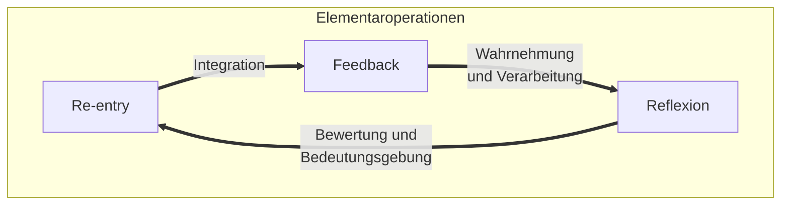

createdt: 13.12.2024 | updated: 10.1.2025 | [publishd](https://www.researchgate.net/publication/387893066_Elementaroperationen_Eine_systemtheoretisch-transdisziplinare_Analyse_von_Feedback_Reflexion_und_Re-Entry_als_universelle_Prinzipien_dynamischer_Systeme): 10.1.2025 | [[Hinweise]]

**Elementaroperationen: Eine systemtheoretisch-transdisziplinäre Analyse von Feedback, Reflexion und Re-Entry als universelle Prinzipien dynamischer Systeme**

# Executive Summary

Dieser Beitrag widmet sich der Untersuchung der Elementaroperationen Feedback, Reflexion und Re-Entry als fundamentale Prinzipien, die universell in allen Systemen wirken. Diese Operationen strukturieren dynamische Prozesse und bilden die Grundlage für Stabilität, Anpassung und Weiterentwicklung. 

**Problemstellung und Zielsetzung:** Die Arbeit beabsichtigt, diese Mechanismen als unverzichtbare Elemente zu identifizieren, die physikalische, biologische, psychische und soziale Systeme prägen. Sie untersucht, wie diese Prinzipien dazu beitragen, die Entstehung von Bedeutung und Komplexität zu erklären, insbesondere durch ihr zyklisches Zusammenspiel. 

**Relevanz der Forschung:** Die Forschung hebt die Bedeutung der Elementaroperationen hervor, da sie sowohl theoretische als auch praktische Perspektiven auf Systemdynamik und -gestaltung bieten. Ihre universelle Anwendbarkeit zeigt, dass sie nicht nur spezifische Prozesse erklären, sondern als verbindende Prinzipien interdisziplinäre Ansätze fördern. Ihre Anwendung reicht von der Stabilität biologischer Systeme über die Analyse sozialer Netzwerke bis hin zur Optimierung technologischer Systeme wie KI-gestützten Plattformen.

**Theoretischer Rahmen:** Basierend auf der Systemtheorie werden die Begriffe Feedback, Reflexion und Re-Entry analysiert und mit Konzepten aus Naturwissenschaften und Kybernetik verknüpft. Die historische und methodische Einordnung dieser Begriffe verdeutlicht ihre Entwicklung und ihre übergreifende Bedeutung. Eine besondere Rolle spielt die Integration von Erkenntnissen aus der Kybernetik und Systembiologie.

**Methodische Vorgehensweise:** Die Methodik umfasst eine literaturgestützte Analyse, eine interdisziplinäre Reflexion und den Einsatz moderner Technologien wie KI, um Erkenntnisse zu gewinnen und die Hypothese zu prüfen, dass diese Prinzipien universell gültig sind. Beispielsweise wurden KI-basierte Simulationen eingesetzt, um die zyklische Dynamik der Operationen in sozialen und biologischen Kontexten zu modellieren.

**Ergebnisse:** Die Ergebnisse zeigen, dass Feedback als Rückkopplung, Reflexion als Analyse und Bewertung sowie Re-Entry als Integration die zentralen Mechanismen darstellen, die in allen Systemen wirken. Ihre zyklische Interaktion ermöglicht Dynamik und Stabilität gleichermaßen. Zum Beispiel veranschaulicht die Untersuchung biologischer Regelkreise, wie Feedback und Reflexion die Homöostase sichern, während Re-Entry adaptive Veränderungen unterstützt.

**Schlussfolgerung:** Diese Prinzipien bieten eine theoretische Grundlage, um komplexe Systeme zu analysieren, zu gestalten und weiterzuentwickeln. Neben ihrer Relevanz in der Grundlagenforschung liefern sie konkrete Ansätze für die Anwendung, etwa in der Entwicklung resilienter technologischer Systeme oder der Optimierung von Feedbackkulturen in sozialen Kontexten. Die Forschung unterstützt die Hypothese ihrer universellen Gültigkeit und bietet Anknüpfungspunkte für weitere interdisziplinäre Studien.

# Einleitung

Die Begriffsbestimmung der Elementaroperationen soll die grundlegendsten dynamischen Prozesse identifizieren und erklären, die universell in allen Systemen wirken. Diese Operationen – Feedback, Reflexion und Re-entry – bilden damit ein Fundament für Stabilität, Anpassung und Weiterentwicklung. Ihre universelle Gültigkeit macht sie zu einem zentralen Konzept für die Analyse und Gestaltung komplexer Systeme in naturwissenschaftlichen, sozialen und systemtheoretischen Kontexten.

Das Erkenntnisinteresse dieser Arbeit liegt darin, die Prinzipien zu untersuchen, die allen Prozessen zugrunde liegen, unabhängig davon, ob sie in physikalischen, biologischen, psychischen oder sozialen Systemen auftreten. Dabei wird die Hypothese aufgestellt, dass kein Prozess aufgezeigt werden kann, in dem die Elementaroperationen nicht wirksam sind. Die Hypothese soll sowohl theoretisch als auch durch eine Analyse bestehender empirischer Untersuchungen gestützt werden. Diese Arbeit versteht sich daher als Grundlagenforschung, die darauf abzielt, interdisziplinäre Verbindungen zu schaffen und neue Perspektiven auf die Dynamik komplexer Systeme zu eröffnen.

Ein besonderes Anliegen dieser Arbeit ist die historische Entwicklung der Begriffe Feedback, Reflexion und Re-entry nachzuvollziehen, ihre ursprünglichen Definitionen in den Natur- und Sozialwissenschaften zu analysieren und ihre universelle Anwendbarkeit synthetisch aufzuzeigen. Dies erfolgt unter Berücksichtigung der Originalquellen und anfänglichen Entdeckungen, die die Begriffe prägten. Darüber hinaus wird untersucht, wie diese Begriffe in modernen Kontexten – einschließlich emergenter Systeme  – weiterentwickelt werden können.

Diese Arbeit verfolgt den Anspruch, nicht nur zur Klärung der Begriffe beizutragen, sondern auch neue Impulse für ihre Anwendung und Weiterentwicklung zu geben. Sie richtet sich an Wissenschaftler_innen und Praktiker_innen gleichermaßen, die daran interessiert sind, die grundlegenden Prinzipien dynamischer Prozesse besser zu verstehen und systemübergreifend nutzbar zu machen.

# Methodik

Die vorliegende Arbeit basiert auf einem methodischen Ansatz, der sowohl literaturbasiert als auch explorativ ist. Dabei sollten zunächst die Begriffe Feedback, Reflexion und Re-entry systematisch analysiert, ihre historische Entwicklung nachvollzogen und ihre universelle Anwendbarkeit geprüft werden. Das Vorgehen folgte keinem klassischen Forschungsparadigma, sondern nutzte interdisziplinäre Synthese und innovative Ansätze, wie bspw. den reflektierten Einsatz von KI-Systemen.

### Methodisches Vorgehen

1. **Literaturrecherche und Analyse:**  
   Eine umfangreiche Sichtung zentraler Primärquellen wurde durchgeführt, um die ursprüngliche Definition und Entwicklung der Begriffe in naturwissenschaftlichen, sozialwissenschaftlichen und systemtheoretischen Kontexten zu rekonstruieren. Diese Analyse diente dazu, die universellen Prinzipien der Elementaroperationen zu identifizieren.

2. **Reflexive Synthese:**  
   Die gewonnenen Erkenntnisse wurden in einem explorativen Denkprozess reflektiert und mit bestehenden Theorien abgeglichen. Dieser Prozess schloss die Verknüpfung von Konzepten aus verschiedenen Disziplinen ein, um die interdisziplinäre Anschlussfähigkeit der Begriffe herauszuarbeiten.

3. **Interaktive Diskussion mit einem KI-System:**  
   Ein zentraler Bestandteil des methodischen Vorgehens war die Nutzung eines KI-gestützten Dialogsystems (ChatGPT). Hierbei wurden Ideen präzisiert, alternative Perspektiven eingebracht und theoretische Überlegungen strukturiert. Die KI wurde nicht als Quelle wissenschaftlicher Fakten verwendet, sondern ausschließlich zur Unterstützung eines explorativen Denkprozesses eingesetzt.  
   - Die Nutzung von KI-Tools in wissenschaftlichen Arbeiten wird zunehmend akzeptiert, sofern diese transparent deklariert und kritisch reflektiert wird ([Technische Universität Berlin, 2023](https://www.static.tu.berlin/fileadmin/www/40000030/DBWM/2023_KI_und_gute_wissenschaftlichePraxis_FKv5.pdf); [Universität Hamburg, 2023](https://www.bwl.uni-hamburg.de/service/studienbuero/formulare/20230630-leitfaden-zum-umgang-mit-ki-tools-in-bachelor-und-master-und-seminararbeiten.pdf); [RWTH Aachen, 2024](https://www.bfw.rwth-aachen.de/global/show_document.asp?download=1&id=aaaaaaaackbrshg)).  
   - Die Fraunhofer-Gesellschaft hebt hervor, dass KI-Systeme wie ChatGPT bei der Strukturierung und Ideengenerierung in Forschungsarbeiten nützlich sein können, jedoch mit Vorsicht zu verwenden sind, um wissenschaftliche Integrität zu gewährleisten ([Fraunhofer IIS, 2023](https://www.iis.fraunhofer.de/de/magazin/panorama/2023/ChatGPT-Interview-Bruns.html)).

### Reflexion des methodischen Ansatzes

Dieses methodische Vorgehen verbindet klassische wissenschaftliche Ansätze mit modernen Technologien und explorativen Denkprozessen, das darauf abzielt, eine fundierte Begriffsbildung zu ermöglichen, die sowohl auf traditionellen Theorien basiert als auch offen für innovative Perspektiven ist.  

Der reflektierte Einsatz von KI-Tools keinem etablierten Forschungsparadigma vollständig entspricht. Vielmehr bewegt sich der Ansatz zwischen qualitativen Methoden und einer technikgestützten explorativen Praxis, die zunehmend als Ergänzung klassischer Paradigmen angesehen wird. Der wissenschaftliche Diskurs über KI-gestützte Methodik ist noch im Entstehen, was diese Arbeit auch als Beitrag zu einem neuen Paradigma verstehen lässt, das menschliche Reflexion mit technologischer Unterstützung vereint.

### Limitationen und Herausforderungen

Die Integration von KI-Systemen birgt Limitationen, insbesondere hinsichtlich der generativen Natur der Technologie. KI-gestützte Vorschläge basieren auf bereits vorhandenen Informationen und können keine eigenständigen wissenschaftlichen Erkenntnisse generieren. Dies wurde bei der Reflexion und Bewertung der Ergebnisse stets berücksichtigt. Gleichzeitig wurde darauf geachtet, dass die wissenschaftliche Integrität durch Transparenz und kritische Prüfung der KI-Beiträge gewahrt bleibt.

# 1 Definition

Die Elementaroperationen sind die grundlegendsten dynamischen Prozesse, die durch Feedback, Reflexion und Re-entry universell in allen Systemen wirken.

Hierbei gilt:

1. **Feedback als Operation**
	- **Definition**: Feedback ist der Prozess, durch den ein System eine Rückmeldung über seine eigene Leistung oder seinen Zustand erhält. Feedback stellt eine fundamentale Rückkopplung dar, die sowohl auf externe Reize als auch auf interne Veränderungen reagieren kann.
	- **Funktion**: Diese Operation dient der Selbstregulierung, indem sie Informationen liefert, die für Anpassungen oder Stabilisierung genutzt werden können. Feedback bildet die Grundlage für zyklische Interaktionen im System und stellt sicher, dass das System auf externe oder interne Veränderungen dynamisch reagieren kann.
	- **Abgeschlossenheit**: Feedback ist in sich eine vollständige Operation, da sie die Rückmeldung initiiert und bereitstellt. Feedback agiert als Startpunkt für die nachfolgenden Operationen Reflexion und Re-entry.

2. **Reflexion als Operation**
	- **Definition**: Reflexion ist die Analyse und Bewertung des Feedbacks durch das System. Dieses ist der Prozess, in dem das System Unterscheidungen trifft, Bedeutungen zuweist und seine eigene Einheit beobachtet. Reflexion beschreibt die Fähigkeit eines Systems, Informationen zu verarbeiten und daraus Erkenntnisse zu gewinnen.
	- **Funktion**: Reflexion erzeugt Erkenntnis und strukturiert die Informationen, um sie für Entscheidungen oder Veränderungen nutzbar zu machen. Sie ermöglicht dem System, bewertete Daten zu abstrahieren und kontextualisiert zurückzuführen.
	- **Abgeschlossenheit**: Reflexion ist eine eigenständige Operation, da sie den Prozess der Bewertung und Unterscheidung abschließt. Sie liefert die Grundlage für die Wiedereinführung der Ergebnisse durch Re-entry.

3. **Re-entry als Operation**
	- **Definition**: Re-entry ist der Prozess, in dem die Ergebnisse der Reflexion in das System zurückgeführt werden, um die Struktur oder die Operationen des Systems zu beeinflussen und beschreibt die dynamische Integration der gewonnenen Erkenntnisse in die fortlaufenden Prozesse des Systems.
	- **Funktion**: Re-entry integriert die Erkenntnisse in die laufenden Prozesse des Systems, ermöglicht so Stabilität oder Transformation und stellt sicher, dass die reflektierten Ergebnisse langfristig Wirkung zeigen und das System flexibel auf Veränderungen reagieren kann.
	- **Abgeschlossenheit**: Re-entry ist eine eigenständige Operation, da sie die Rückführung und Integration vollzieht. Sie schließt den zyklischen Prozess der Elementaroperationen ab und schafft die Grundlage für erneute Feedbackschleifen.

Feedback, Reflexion und Re-entry sind jeweils abgeschlossene, eigenständige Operationen, die spezifische Funktionen im System erfüllen. Ihr zyklisches Zusammenspiel ermöglicht die Dynamik, Stabilität und Anpassungsfähigkeit von Systemen. Sie sind universell anwendbar und beschreiben fundamentale Prozesse, die in allen bekannten Systemen, von physikalischen über biologische bis hin zu sozialen, wirksam sind.

# 2 Herleitung

Die Entwicklung der Elementaroperationen ist das Ergebnis einer interdisziplinären Synthese, die Konzepte aus der Kybernetik, Biologie und Systemtheorie miteinander verknüpft. Die Synthese basierte auf der Hypothese ($H_1$), dass es universelle Prozesse gibt, die in allen Systemen wirken. Der iterative Entwicklungsprozess wurde durch explorative Diskussionen und die kritische Reflexion der zentralen Begriffe strukturiert vorangetrieben.

Hypothese 1 ($H_1$):
"Es gibt keinen Prozess im Universum, der nicht auf den Elementaroperationen beruht."

Die Hypothese $H_1$ erfüllt die grundsätzlichen Kriterien einer wissenschaftlichen Hypothese, jedoch mit einer besonderen Ausrichtung, die sie von anderen Hypothesen unterscheidet:

1. **Präzision**: Die Aussage beschreibt eine universelle Eigenschaft aller Prozesse im Universum. Diese Präzision ist entscheidend, um die Hypothese in wissenschaftlichen Diskussionen zu verorten und zu prüfen (i.A.a. Popper, 1959).

2. **Falsifizierbarkeit**: Eine Hypothese sollte widerlegbar sein, also durch Beobachtungen oder Experimente geprüft werden können. Die Hypothese bezieht sich auf das gesamte Universum, was die Falsifizierbarkeit in der Praxis erschwert, aber nicht unmöglich macht. Beispielsweise könnten Prozesse entdeckt werden, die keiner Elementaroperation zugeordnet werden können, was die Hypothese widerlegen würde (i.A.a. Lakatos, 1978; Popper, 1959).

3. **Bezug auf ein theoretisches Modell**: Die Hypothese kann im Rahmen einer systemtheoretischen oder naturwissenschaftlichen Theorie verstanden werden, bspw. als Beschreibung grundlegender Prozesse in natur-, kultur- und sozialwissenschaftlichen Systemen (i.A.a. Luhmann, 1984).

4. **Erklärungsanspruch**: Die Hypothese postuliert eine universelle Regel, die als Grundlage für die Erklärung aller Prozesse dienen könnte. Dies verleiht ihr einen umfassenden Erklärungsanspruch, der in der Wissenschaft oft angestrebt wird (i.A.a. Kuhn, 1962).

**Besonderheit der vorgelegten Hypothese $H_1$:**

Die hier postulierte Hypothese hat einen axiomatischen Charakter, d. h., sie könnte auch als grundlegendes Prinzip oder Prämisse für eine Theorie verwendet werden, ähnlich wie ein Axiom in der Mathematik oder ein Grundsatz in der Philosophie. Dieser Abschnitt liefert die abstrakt-theoretische Basis, um für die Entwicklung eines umfassenden Modells eingesetzt werden zu können., z. B. für eine Systemtheorie, die Elementaroperationen als Grundbausteine beschreibt (Maturana & Varela, 1972).

## 2.1 Ausgangspunkt und Problemstellung

Der Ausgangspunkt dieser Untersuchung war die Hypothese, dass Feedback, Reflexion und Re-entry als universelle Elementaroperationen in allen Systemen wirken. Diese Hypothese baut auf grundlegenden Konzepten der Kybernetik, insbesondere der Arbeiten von Wiener (1948), sowie der Systemtheorie, wie sie von Luhmann (1984) beschrieben wurde, auf. Beide Ansätze betonen die zentrale Bedeutung zyklischer Interaktionen, die Systemen ermöglicht, sich sowohl anzupassen als auch eine stabile Struktur aufrechtzuerhalten.

Das Erkenntnisinteresse lag dabei nicht nur in der Identifikation dieser Operationen, sondern auch in der Prüfung ihrer universellen Anwendbarkeit über verschiedene Disziplinen hinweg. Hierbei wurden, die Übertragbarkeit dieser Konzepte auf physikalische, chemische, biologische und soziale Systeme betrachtet. Dabei stellte sich die Frage, ob diese Prozesse tatsächlich fundamentale Prinzipien beschreiben, die allen Systemtypen zugrunde liegen.

Diese Fragestellung führte zu einer systematischen Untersuchung, die darauf abzielte, die Verbindung zwischen naturwissenschaftlichen und systemtheoretischen Perspektiven zu klären. Sie ermöglichte es, theoretische Konzepte wie Rückkopplung (Feedback), selbstreferenzielle Beobachtung (Reflexion) und die Wiedereinführung von Differenzierungen (Re-entry) nicht nur abstrakt zu beschreiben, sondern auch in konkreten wissenschaftlichen Domänen anzuwenden und zu überprüfen. Die Ergebnisse sollten dazu beitragen, ein konsistentes Modell der Elementaroperationen zu entwickeln, das sowohl theoretische als auch praktische Relevanz besitzt.

## 2.2 Stand der Forschung

Die Untersuchung der Elementaroperationen als universelle Prozesse basiert auf einer Synthese bestehender wissenschaftlicher Arbeiten aus verschiedenen Disziplinen. In der Kybernetik legte Wiener (1948) die Grundlage für die Analyse von Rückkopplungsprozessen. Sein Fokus lag darauf, wie Systeme Informationen verarbeiten und nutzen, um sich selbst zu regulieren. Diese Arbeiten betonten die Rolle von Feedback als zentrales Prinzip für die Stabilität und Anpassungsfähigkeit technischer und biologischer Systeme.

In der Biologie haben Maturana und Varela (1972) den Begriff der Autopoiesis geprägt, der beschreibt, wie lebende Systeme durch selbstreferenzielle Prozesse ihre eigene Organisation aufrechterhalten. Dabei spielen sowohl Feedback-Mechanismen als auch Prozesse der Bedeutungsgenerierung, die hier als Reflexion beschrieben werden können, eine wesentliche Rolle. Reflexion wird in diesem Kontext nicht nur als bewusster Prozess verstanden, sondern als Fähigkeit eines Systems, interne und externe Zustände zu bewerten und in die eigene Organisation zu integrieren.

Die Systemtheorie, wie sie von Luhmann (1984) formuliert wurde, abstrahiert diese biologischen Konzepte und überträgt sie auf psychische und soziale Systeme. Luhmann führt den Begriff des Re-entry ein, der die Wiedereinführung einer Unterscheidung in ein System beschreibt, um dessen Operationen und Strukturen dynamisch zu gestalten. Dieser Begriff erweitert die bisherigen Rückkopplungs- und Reflexionsprozesse um eine explizite Dimension der Strukturierung und Transformation.

Obwohl die Begriffe Feedback, Reflexion und Re-entry in den jeweiligen Disziplinen fundiert sind, gibt es bisher keine einheitliche Theorie, die diese Konzepte über alle Systemtypen hinweg als universelle Operationen zusammenführt. Der aktuelle Stand der Forschung zeigt daher, dass die Begriffe zwar in spezifischen Kontexten gut untersucht sind, eine interdisziplinäre Synthese jedoch noch aussteht. Diese Arbeit versucht, diese Lücke zu schließen, indem sie die universelle Gültigkeit der Elementaroperationen über verschiedene Disziplinen hinweg analysiert und abstrahiert.

Zusätzlich wurden im Bereich der Physik Rückkopplungsprozesse und zyklische Interaktionen in Systemen wie Schwingungskreisen oder energetischen Zustandsänderungen beschrieben. In der Chemie zeigen katalytische und zyklische Reaktionen, wie Feedback und Reflexion zur Stabilität von Reaktionsmechanismen beitragen. Diese naturwissenschaftlichen Ansätze unterstützen die Hypothese, dass die Elementaroperationen fundamentale Prinzipien sind, die nicht nur auf biologische und soziale Systeme, sondern auch auf physikalische und chemische Prozesse angewendet werden können.

Die Synthese dieser Perspektiven legt nahe, dass Feedback, Reflexion und Re-entry nicht nur disziplinäre Begriffe sind, sondern universelle Prozesse darstellen, die die Grundlage für die Dynamik und Struktur aller Systeme bilden.

## 2.2 Untersuchung naturwissenschaftlicher Prozesse

Die Untersuchung der naturwissenschaftlichen Prozesse beabsichtigte, die universelle Anwendbarkeit der Elementaroperationen Feedback, Reflexion und Re-entry zu prüfen. Dabei wurden physikalische, chemische und biologische Systeme analysiert, um die Begriffe in unterschiedlichen Kontexten zu operationalisieren und ihre Gültigkeit zu bestätigen.

In der Physik wurden Rückkopplungsmechanismen in Schwingungssystemen als klassische Beispiele für Feedback identifiziert (Wiener, 1948). Diese Mechanismen beschreiben, wie Energie oder Informationen in einem System zirkulieren und dessen Dynamik beeinflussen. Reflexion wurde als Wechselwirkung von Kräften untersucht, etwa bei der Stabilisierung von Gleichgewichtszuständen oder der Reflexion von Licht (Feynman, Leighton, & Sands, 1963). Re-entry fand seine Entsprechung in der Wiedereinführung von Energie oder Zustandsänderungen in zyklischen Prozessen, wie etwa in thermodynamischen Kreisläufen (Carnot, 1824).

In der Chemie zeigten katalytische Reaktionen, wie Feedbackmechanismen regulierende Funktionen erfüllen, um Reaktionsbedingungen zu stabilisieren (Atkins & de Paula, 2017). Reflexion manifestierte sich in der dynamischen Anpassung von Reaktionsmechanismen, bei denen chemische Systeme auf Veränderungen in ihrer Umgebung reagieren (Prigogine, 1967). Re-entry wurde in zyklischen Reaktionsketten wie dem Citratzyklus beobachtet, wo die Ergebnisse einer chemischen Transformation erneut in den Prozess integriert werden, um dessen Fortlauf zu sichern (Lehninger, 2000).

In der Biologie wurden hormonelle Regelkreise als exemplarische Feedback-Prozesse analysiert, wie beispielsweise die Regulation des Blutzuckerspiegels durch Insulin (Guyton & Hall, 2011). Reflexion wurde als die Fähigkeit biologischer Systeme interpretiert, Umweltreize zu bewerten und darauf zu reagieren, wie dies etwa bei Nervensignalen der Fall ist (Maturana & Varela, 1972). Re-entry wurde durch die Integration von Informationen in zelluläre Prozesse, wie die Genexpression, verdeutlicht (Alberts et al., 2002). Diese Prozesse zeigen, wie biologische Systeme kontinuierlich zwischen Feedback, Reflexion und Re-entry oszillieren, um Stabilität und Anpassungsfähigkeit zu gewährleisten.

Die Analyse der naturwissenschaftlichen Prozesse stützt die Hypothese, dass Feedback, Reflexion und Re-entry universelle Prinzipien darstellen. Die Begriffe sind nicht auf spezifische Disziplinen beschränkt, sondern beschreiben grundlegende dynamische Prozesse, die in allen bekannten Systemen wirken.

### 2.2.1 Physikalische Prozesse

Die Untersuchung physikalischer Prozesse hatte zum Ziel, die universelle Anwendbarkeit der Elementaroperationen Feedback, Reflexion und Re-entry innerhalb physikalischer Systeme zu prüfen. Hierbei wurden folgende Prozesse analysiert:

1. **Rückkopplung in Schwingungssystemen**:
   - Rückkopplungsmechanismen wurden in mechanischen und elektrischen Schwingungssystemen untersucht, beispielsweise in Pendeln oder Oszillatoren. Diese Prozesse verdeutlichen Feedback als die Rückwirkung eines Systems auf sich selbst, wodurch Stabilität oder Resonanz entstehen kann (Wiener, 1948).

2. **Reflexion von Licht**:
   - Die Reflexion von Licht an Oberflächen wurde als physikalisches Beispiel für die Bedeutung der Rückspiegelung eines Zustands analysiert. Dieser Prozess illustriert, wie ein System Informationen aus seiner Umwelt zurückprojiziert und verarbeitet (Feynman, Leighton, & Sands, 1963).

3. **Wechselwirkung von Kräften**:
   - Bei der Analyse von Kräften in Gleichgewichtszuständen, etwa bei der Stabilisierung eines Körpers, wurde Reflexion als die kontinuierliche Anpassung von Kräften identifiziert, die das Gleichgewicht bewahrt (Newton, 1687).

4. **Thermodynamische Kreisläufe**:
   - Prozesse wie der Carnot-Kreisprozess zeigen, wie Energie innerhalb eines Systems zyklisch umgewandelt und rückgeführt wird. Re-entry wurde hier als Wiedereinführung von Zustandsänderungen in die Prozessdynamik interpretiert, die zur Erhaltung der Systemfunktion beitragen (Carnot, 1824).

5. **Quantenmechanische Überlagerung und Messung**:
   - Die Überlagerung von Zuständen in der Quantenmechanik und deren Kollaps bei der Messung wurden als Beispiele für Feedback und Reflexion analysiert. Feedback spiegelt sich in der Rückwirkung des Systems auf den Messprozess wider, während Reflexion als die Bewertung des Zustands nach der Messung verstanden werden kann (Heisenberg, 1927).

6. **Gravitationsinteraktionen**:
   - Gravitationskräfte zwischen zwei Körpern wurden untersucht, um Rückkopplungsmechanismen und die Dynamik von Feedback zu identifizieren. Die Stabilisierung von Bahnen durch gravitative Wechselwirkungen zeigt, wie Re-entry in Form einer zyklischen Anpassung auftreten kann (Einstein, 1915).

7. **Schwingungs- und Energieübertragung in Wellen**:
   - Mechanische und elektromagnetische Wellen wurden untersucht, um Feedback in Form von Energieübertragung und Reflexion an Grenzflächen zu beschreiben. Diese Prozesse verdeutlichen die dynamische Interaktion von Systemen mit ihrer Umwelt (Maxwell, 1865).

Diese physikalischen Beispiele zeigen, dass Feedback, Reflexion und Re-entry nicht nur theoretische Konzepte sind, sondern grundlegende Prinzipien, die in einer Vielzahl von physikalischen Systemen auftreten. Sie verdeutlichen die universelle Anwendbarkeit der Elementaroperationen innerhalb physikalischer Prozesse.

### 2.2.2 Chemische Prozesse

Die Untersuchung chemischer Prozesse zielte darauf ab, die universelle Anwendbarkeit der Elementaroperationen Feedback, Reflexion und Re-entry in chemischen Systemen zu analysieren. Dabei wurden folgende Prozesse identifiziert und untersucht:

1. **Katalytische Reaktionen**:
   - In katalytischen Prozessen dient Feedback der Regulation der Reaktionsgeschwindigkeit. Die Anwesenheit eines Katalysators bewirkt eine Rückkopplung, die die Aktivierungsenergie reduziert und den Prozess stabilisiert. Reflexion tritt auf, wenn das System die Bedingungen der Reaktion bewertet und anpasst, wie beispielsweise in der Reaktion von Wasserstoff und Sauerstoff in der Anwesenheit von Platin (Atkins & de Paula, 2017).

2. **Zyklische Reaktionsketten**:
   - Der Citratzyklus, ein zentraler Stoffwechselprozess in der Biochemie, illustriert alle drei Elementaroperationen. Feedback wird durch die Regulation der Enzymaktivität gewährleistet, Reflexion durch die Erkennung und Anpassung an den Bedarf der Zelle. Re-entry zeigt sich in der zyklischen Wiederverwendung von Zwischenprodukten (Lehninger, 2000).

3. **Reversible chemische Reaktionen**:
   - Reversible Prozesse, wie die Bildung und Dissoziation von Molekülen, zeigen Feedback in der Form von Gleichgewichtszuständen (Le Chatelier, 1884). Reflexion tritt auf, wenn das System auf Störungen des Gleichgewichts reagiert und Anpassungen vornimmt. Re-entry manifestiert sich in der Rückführung der Reaktionsprodukte in den Prozess, um den Gleichgewichtszustand wiederherzustellen.

4. **Autokatalytische Reaktionen**:
   - Autokatalytische Prozesse, bei denen die Produkte einer Reaktion selbst als Katalysatoren wirken, stellen ein exemplarisches Modell für Feedback dar. Reflexion erfolgt durch die Reaktion des Systems auf Veränderungen in der Produktkonzentration. Re-entry wird durch die zyklische Verstärkung des Prozesses gewährleistet (Prigogine, 1967).

5. **Polymerisationsreaktionen**:
   - In Polymerisationsprozessen, wie der Synthese von Polyethylen, dient Feedback der Regulation der Kettenwachstumsgeschwindigkeit. Reflexion tritt auf, wenn das System die Bedingungen zur Optimierung der Reaktion bewertet. Re-entry zeigt sich in der kontinuierlichen Integration neuer Monomere in die wachsende Kette (Flory, 1953).

6. **Chemische Oszillationen**:
   - Oszillierende Reaktionen, wie die Belousov-Zhabotinsky-Reaktion, illustrieren Feedback durch die zyklische Rückkopplung von Reaktionsprodukten. Reflexion tritt auf, wenn das System den Übergang zwischen unterschiedlichen Zuständen bewertet. Re-entry wird durch die Wiederaufnahme der Ausgangszustände im zyklischen Verlauf des Prozesses dargestellt (Field & Noyes, 1974).

Diese chemischen Prozesse zeigen, dass Feedback, Reflexion und Re-entry grundlegende Prinzipien sind, die die Dynamik und Stabilität chemischer Systeme bestimmen. Die Untersuchung dieser Prozesse bestätigt die universelle Gültigkeit der Elementaroperationen in chemischen Kontexten.

### 2.2.3 Biologische Prozesse

Die Analyse biologischer Prozesse zielte darauf ab, die universelle Anwendbarkeit der Elementaroperationen Feedback, Reflexion und Re-entry im Kontext lebender Systeme zu überprüfen. Dabei wurden die folgenden Prozesse identifiziert und untersucht:

1. **Hormonelle Regelkreise**:
   - In hormonellen Regelkreisen, wie der Blutzuckerregulation, dient Feedback der Anpassung der Insulinsekretion an den Glukosespiegel im Blut (Guyton & Hall, 2011). Reflexion zeigt sich, wenn das System den Glukosespiegel bewertet und auf diese Informationen basierend Insulin oder Glukagon ausschüttet. Re-entry tritt auf, wenn die veränderten Blutzuckerwerte wiederum neue Signale für die Hormonausschüttung auslösen.

2. **Neurale Signalverarbeitung**:
   - In neuronalen Netzwerken ist Feedback essenziell für die Übertragung und Modulation von Signalen, wie in Reflexbögen. Reflexion tritt auf, wenn das zentrale Nervensystem die eintreffenden Signale bewertet und darauf basierend Reaktionen steuert. Re-entry wird durch die Integration von Informationen aus den Signalen in die neuronalen Netzwerke gewährleistet, wodurch Lernprozesse und Verhaltensänderungen ermöglicht werden (Maturana & Varela, 1972).

3. **Genexpression und Epigenetik**:
   - Feedback manifestiert sich in der Regulation der Genexpression durch Rückkopplungsschleifen, wie bei der Hemmung durch Endprodukte in Stoffwechselwegen. Reflexion zeigt sich in der epigenetischen Anpassung an Umwelteinflüsse, indem das System den Nutzen bestimmter Genexpressionen bewertet. Re-entry wird sichtbar, wenn epigenetische Modifikationen in die DNA-Struktur integriert und so zukünftige Zellaktivitäten beeinflusst werden (Alberts et al., 2002).

4. **Homöostase**:
   - Die Aufrechterhaltung der Homöostase, wie die Regulierung der Körpertemperatur, zeigt Feedback in Form von Sensoren, die Abweichungen vom Sollwert detektieren. Reflexion tritt auf, wenn das System diese Abweichungen bewertet und Signale zur Korrektur aussendet. Re-entry wird durch die Umsetzung der Signale und die Rückführung in den optimalen Zustand realisiert (Cannon, 1932).

5. **Immunsystem**:
   - Im Immunsystem dient Feedback der Erkennung und Aktivierung spezifischer Abwehrmechanismen auf Pathogene. Reflexion zeigt sich in der Bewertung der Effektivität der Immunantwort, wie in der Regulation von T-Zell-Aktivitäten. Re-entry wird durch die Erinnerung an die Pathogene in Form von Gedächtniszellen erreicht, die zukünftige Reaktionen effizienter gestalten (Janeway et al., 2001).

6. **Zellzyklus und Apoptose**:
   - Im Zellzyklus reguliert Feedback den Übergang zwischen den verschiedenen Phasen, etwa durch Checkpoints, die die Vollständigkeit der DNA-Replikation überprüfen. Reflexion tritt auf, wenn das System den Status der Zelle analysiert und entscheidet, ob der Zyklus fortgesetzt oder gestoppt werden soll. Re-entry wird durch die Initiierung von Apoptoseprozessen integriert, wenn die Zelle irreparable Schäden aufweist (Alberts et al., 2002).

7. **Ökologische Netzwerke**:
   - In ökologischen Systemen, wie Räuber-Beute-Beziehungen, zeigt Feedback die Anpassung von Populationen aneinander. Reflexion tritt auf, wenn Arten ihre Strategien ändern, um Ressourcen effektiver zu nutzen. Re-entry wird sichtbar, wenn diese Veränderungen in die Dynamik des Netzwerks integriert werden und neue Gleichgewichte schaffen (Odum, 1971).

Die Analyse dieser biologischen Prozesse zeigt, dass Feedback, Reflexion und Re-entry grundlegende Prinzipien sind, die nicht nur die Homöostase und Anpassung lebender Systeme sichern, sondern auch deren Fähigkeit zur Evolution und Transformation ermöglichen. Diese universellen Prinzipien verdeutlichen die fundamentale Rolle der Elementaroperationen in der Biologie.

### 2.2.4 Naturwissenschaftliches Fazit

Die Untersuchung physikalischer, chemischer und biologischer Prozesse hat gezeigt, dass die Elementaroperationen Feedback, Reflexion und Re-entry universelle Prinzipien darstellen, die in allen analysierten Ebenen wirken. Diese Operationen beschreiben grundlegende Mechanismen, durch die Systeme Informationen verarbeiten, anpassen und in ihre Strukturen integrieren.

In der Physik wurden Rückkopplungsschleifen, Wechselwirkungen von Kräften und thermodynamische Zyklen als Beispiele für Feedback, Reflexion und Re-entry identifiziert. Diese Prozesse zeigen, wie physikalische Systeme Stabilität bewahren und dynamische Anpassungen vornehmen können. 

Die chemischen Prozesse, wie katalytische Reaktionen und zyklische Stoffwechselwege, verdeutlichten, dass Feedback und Reflexion nicht nur auf physikalische Zustände, sondern auch auf molekulare Interaktionen anwendbar sind. Re-entry zeigte sich hier in der zyklischen Integration von Reaktionsprodukten, wodurch chemische Systeme nachhaltig arbeiten und sich an veränderte Bedingungen anpassen können.

In biologischen Prozessen, wie hormonellen Regelkreisen, neuronalen Netzwerken und der Homöostase, wurde die universelle Relevanz der Elementaroperationen besonders deutlich. Diese Prozesse illustrieren die Fähigkeit lebender Systeme, auf Umwelteinflüsse zu reagieren, ihre Strukturen zu transformieren und ihre Funktionalität zu erhalten.

Das Zwischenfazit der Analyse stützt die Hypothese, dass Feedback, Reflexion und Re-entry grundlegende Prinzipien sind, die alle untersuchten Domänen durchdringen. Die universelle Anwendbarkeit dieser Operationen zeigt, dass sie nicht auf spezifische Disziplinen beschränkt sind, sondern eine gemeinsame Grundlage für die Dynamik, Stabilität und Anpassungsfähigkeit von Systemen bilden. Diese Erkenntnisse legen den Grundstein für eine weitergehende Untersuchung, wie diese Prinzipien in der Systemtheorie und interdisziplinären Kontexten abstrahiert und integriert werden können.

## 2.3 Abstraktion durch die Systemtheorie

Die Begriffe Feedback, Reflexion und Re-entry wurden durch die Systemtheorie abstrahiert, um ihre Anwendung auf soziale und psychische Systeme zu ermöglichen. Diese Abstraktion basiert auf Konzepten, die ursprünglich aus der Kybernetik, Biologie und Mathematik stammen und in der Systemtheorie weiterentwickelt wurden. 

Der Begriff Feedback entstammt der Kybernetik und wurde von Wiener (1948) als Rückkopplung definiert, die Informationen über den Zustand eines Systems bereitstellt, um dessen Selbstregulation zu ermöglichen. In der Systemtheorie wird Feedback als Grundoperation verstanden, die es einem System erlaubt, Informationen aus seiner Umwelt zu integrieren und seine Struktur entsprechend anzupassen. Diese Rückkopplung ist in sozialen Systemen besonders relevant, da sie die Grundlage für kommunikative und organisatorische Prozesse bildet.

Der Begriff Reflexion wurde erstmals von Luhmann (1984) als selbstreferenzielle Beobachtung eines Systems eingeführt. Reflexion beschreibt die Fähigkeit eines Systems, Unterscheidungen zu treffen und sich selbst als Einheit in der Umwelt zu erkennen. Dabei wird die Umwelt nicht direkt abgebildet, sondern durch das System interpretiert und in den eigenen Kontext integriert. Diese Bedeutung des Begriffs baut auf biologischen Konzepten von Maturana und Varela (1972) auf, die Reflexion als fundamentalen Bestandteil der Autopoiesis lebender Systeme beschreiben. In der Systemtheorie wird Reflexion auf soziale und psychische Systeme übertragen, um deren Fähigkeit zur Selbstbeobachtung und -steuerung zu erklären.

Re-entry wurde von Spencer Brown (1969) in der Mathematik als Wiedereinführung einer Unterscheidung in das System beschrieben. Luhmann griff diesen Begriff auf, um die Dynamik sozialer Systeme zu erklären. Re-entry beschreibt den Prozess, bei dem ein System die Ergebnisse seiner Reflexion wieder in seine Struktur einführt, um diese weiterzuentwickeln oder anzupassen. Dieses Konzept hebt die statische Betrachtung von Systemen auf und betont deren Fähigkeit zur Transformation und Emergenz.

Die Abstraktion dieser Begriffe durch die Systemtheorie zeigt, dass Feedback, Reflexion und Re-entry nicht nur technische oder biologische Konzepte sind, sondern universelle Prinzipien, die auf soziale und psychische Systeme angewendet werden können. Die Diskussionen verdeutlichten, dass diese Abstraktion auch eine Rückführung auf naturwissenschaftliche Grundlagen ermöglicht. So wird etwa Feedback als physikalischer Rückkopplungsmechanismus betrachtet, während Reflexion als ein biologischer Prozess der Bedeutungszuweisung interpretiert wird. Re-entry wiederum zeigt sich in chemischen und biologischen Zyklen, in denen Zustände und Informationen zyklisch integriert werden.

Durch die Abstraktion dieser Begriffe wird die Hypothese gestützt, dass Feedback, Reflexion und Re-entry fundamentale Prozesse sind, die alle Systeme durchdringen. Die Verbindung zwischen ihren Ursprüngen in der Kybernetik, Biologie und Mathematik und ihrer Anwendung in der Systemtheorie unterstreicht ihre universelle Gültigkeit.

### 2.3.1 Feedback

Feedback als Rückkopplung ist ein zentrales Konzept in der Systemtheorie, das durch Niklas Luhmann (1984) abstrahiert und auf soziale und psychische Systeme angewendet wurde. Die Rückkopplung ermöglicht Systemen, Informationen über ihre eigenen Zustände zu sammeln, zu bewerten und darauf basierend zu handeln. Die untersuchten systemtheoretischen Prozessen zeigt sich Feedback in verschiedenen Kontexten:

1. **Kommunikationsprozesse in sozialen Systemen**:
   - Feedback ist in der Systemtheorie ein integraler Bestandteil der Kommunikation. Soziale Systeme nutzen Rückkopplung, um Informationen aus Interaktionen aufzunehmen und zu bewerten. Diese Rückkopplung dient der Anpassung von Entscheidungen und Handlungen, wie etwa in Organisationen oder Netzwerken (Luhmann, 1984).

2. **Selbstorganisation und Entscheidungsfindung**:
   - In sozialen und psychischen Systemen ermöglicht Feedback die Selbstorganisation, indem Abweichungen oder Konflikte innerhalb eines Systems sichtbar gemacht werden. Entscheidungen basieren auf der Bewertung dieser Rückkopplung und führen zu stabilisierenden oder transformierenden Handlungen (Luhmann, 1984).

3. **Lernprozesse in psychischen Systemen**:
   - Feedback spielt eine entscheidende Rolle in Lernprozessen. Psychische Systeme nutzen Rückkopplung, um Informationen aus Erfahrungen zu bewerten und kognitive Anpassungen vorzunehmen. Dies zeigt sich etwa in der Bewertung von Erfolg oder Misserfolg bei der Problemlösung (Argyris & Schön, 1978).

4. **Anpassungsprozesse in Organisationen**:
   - Organisationen nutzen Feedback, um auf interne und externe Veränderungen zu reagieren. Rückkopplung ermöglicht es, Schwächen oder Störungen im System zu identifizieren und Strategien zur Optimierung zu entwickeln (Weick, 1995).

5. **Regulation von Normen und Werten in sozialen Systemen**:
   - Soziale Systeme verwenden Feedback, um Normen und Werte zu regulieren. Rückkopplung zeigt an, ob bestimmte Normen eingehalten oder verletzt wurden, und ermöglicht so die Anpassung von Regeln und Strukturen (Parsons, 1951).

6. **Interaktion von Systemen und ihrer Umwelt**:
   - Feedback ist entscheidend für die Wechselwirkung zwischen einem System und seiner Umwelt. Soziale Systeme nutzen Rückkopplung, um auf Umweltveränderungen zu reagieren und ihre Strukturen anzupassen (Ashby, 1956).

### 2.3.2 Reflexion

Reflexion ist ein zentraler Begriff in der Systemtheorie, der von Niklas Luhmann (1984) als selbstreferenzielle Beobachtung eines Systems definiert wurde. Reflexion beschreibt die Fähigkeit eines Systems, Unterscheidungen zu treffen, Bedeutungen zuzuweisen und sich selbst als Einheit zu beobachten. Die untersuchten systemtheoretischen Prozessen zeigt sich Reflexion in verschiedenen Kontexten:

1. **Kommunikation in sozialen Systemen**:
   - Soziale Systeme nutzen Reflexion, um die Bedeutung von Informationen innerhalb von Kommunikationsprozessen zu analysieren und zu bewerten. Dieser Prozess ermöglicht es, Inhalte zu kontextualisieren und für das System relevante Bedeutungen zu erzeugen (Luhmann, 1984).

2. **Entscheidungsfindung in Organisationen**:
   - Reflexion spielt eine wesentliche Rolle bei der Entscheidungsfindung, da Organisationen Feedback aus internen und externen Quellen analysieren und bewerten. Dieser Prozess umfasst die Abwägung von Alternativen, die Bewertung von Risiken und die Priorisierung von Zielen im organisationalen Kontext (Weick, 1995).

3. **Selbstbeobachtung psychischer Systeme**:
   - Psychische Systeme reflektieren ihre Erfahrungen und Informationen, um daraus Erkenntnisse zu gewinnen. Dies zeigt sich in kognitiven Prozessen wie dem Nachdenken, Problemlösen und der Bewertung von Handlungen (Maturana & Varela, 1972).

4. **Normen und Werte in sozialen Systemen**:
   - Reflexion ist essenziell für die Analyse und Bewertung von Normen und Werten in sozialen Systemen. Dieser Prozess ermöglicht es, Regeln und Strukturen kritisch zu hinterfragen und gegebenenfalls anzupassen (Parsons, 1951).

5. **Lernprozesse in psychischen und sozialen Systemen**:
   - Reflexion ist zentral für Lernprozesse, da sie die Analyse von Fehlern und Erfolgen ermöglicht. Soziale Systeme reflektieren ihre Handlungen, um kollektives Wissen zu generieren, während psychische Systeme individuelle Erfahrungen bewerten und in neue Verhaltensmuster integrieren (Argyris & Schön, 1978).

6. **Kulturelle Selbstverständigung**:
   - Kulturelle Systeme nutzen Reflexion, um kollektive Identitäten und Selbstbilder zu analysieren. Dieser Prozess unterstützt die ständige Neubewertung und Anpassung kultureller Normen und Praktiken (Luhmann, 1997).

7. **Anpassung an Umweltveränderungen**:
   - Reflexion ermöglicht sozialen Systemen, Umweltveränderungen wahrzunehmen, deren Bedeutung zu bewerten und darauf zu reagieren. Dies zeigt sich beispielsweise in der Anpassung von Strategien und Strukturen an neue Herausforderungen (Ashby, 1956).

### 2.3.3 Re-entry

Re-entry ist ein zentraler Begriff in der Systemtheorie, der von Spencer Brown (1969) als Wiedereinführung einer Unterscheidung in das System definiert wurde. Niklas Luhmann (1984) übernahm diesen Begriff, um die Dynamik sozialer Systeme zu erklären. Re-entry beschreibt den Prozess, bei dem ein System die Ergebnisse seiner Reflexion wieder in seine Struktur einführt, um diese weiterzuentwickeln oder anzupassen. Die untersuchten systemtheoretischen Prozessen zeigt sich Re-entry in verschiedenen Kontexten:

1. **Kommunikation in sozialen Systemen**:
   - Re-entry wird sichtbar, wenn soziale Systeme Ergebnisse aus Kommunikationsprozessen wieder in ihre Kommunikationsstruktur integrieren. Dies ermöglicht eine fortlaufende Weiterentwicklung von Inhalten und Bedeutungen (Luhmann, 1984).

2. **Entscheidungsfindung in Organisationen**:
   - Organisationen nutzen Re-entry, um reflektierte Entscheidungen in ihre strukturellen Abläufe zu integrieren. Dadurch werden Entscheidungen nicht isoliert getroffen, sondern in den Kontext organisationaler Ziele und Werte eingebettet (Weick, 1995).

3. **Selbstorganisation und Transformation**:
   - Re-entry nimmt eine zentrale Rolle in der Selbstorganisation von Systemen ein, da Re-entry die Grundlage für Transformationen schafft. Ergebnisse aus der Reflexion werden wieder in das System zurückgeführt, um neue Strukturen und Prozesse zu generieren (Maturana & Varela, 1972).

4. **Anpassung an Umweltveränderungen**:
   - Soziale Systeme integrieren Umweltveränderungen durch Re-entry, indem sie die beobachteten Veränderungen und deren Bedeutungen in ihre internen Strukturen einfügen. Dies fördert die Flexibilität und Anpassungsfähigkeit des Systems (Ashby, 1956).

5. **Lernprozesse in psychischen Systemen**:
   - In psychischen Systemen ermöglicht Re-entry, dass reflektierte Erfahrungen in Denk- und Handlungsmuster integriert werden. Dies führt zu nachhaltigen Lernprozessen und kognitiven Anpassungen (Argyris & Schön, 1978).

6. **Normen und Werte in sozialen Systemen**:
   - Re-entry zeigt sich in der Wiedereinführung reflektierter Normen und Werte in die gesellschaftliche Struktur. Dieser Prozess sorgt für die Stabilität von Systemen, während gleichzeitig Transformationen ermöglicht werden (Parsons, 1951).

7. **Kulturelle Dynamiken**:
   - Re-entry unterstützt kulturelle Systeme, indem reflektierte Identitäten und Werte in bestehende kulturelle Praktiken integriert werden. Dadurch entsteht eine kontinuierliche Weiterentwicklung der kulturellen Selbstwahrnehmung (Luhmann, 1997).

### 2.3.4 Systemtheoretisches Fazit

Die Untersuchung der Begriffe Feedback, Reflexion und Re-entry im Kontext der Systemtheorie zeigt, dass diese Operationen nicht nur grundlegende Mechanismen für die Dynamik und Selbstorganisation sozialer und psychischer Systeme darstellen, sondern auch interdisziplinär anschlussfähig sind. Sie ermöglichen eine präzise Analyse systemischer Prozesse und verdeutlichen, wie Systeme Stabilität und Anpassungsfähigkeit zugleich gewährleisten können.

Feedback wird in der Systemtheorie als Rückkopplung definiert, die dem System erlaubt, Informationen über seinen Zustand oder seine Leistung zu sammeln. Diese Informationen bilden die Grundlage für die Selbstregulation und Anpassungsfähigkeit. Insbesondere in sozialen Systemen wie Organisationen, Kommunikationsnetzwerken oder kulturellen Dynamiken zeigt Feedback seine Funktion, indem Interaktionen gesteuert und Entscheidungsprozesse ermöglicht werden. Feedback ist essenziell, da diese den Ausgangspunkt für Reflexion und Re-entry bildet.

Reflexion erlaubt Systemen, die durch Feedback gesammelten Informationen zu analysieren, Bedeutungen zuzuweisen und Unterscheidungen zu treffen. Dieser Prozess macht den Systemen möglich, sich selbst zu beobachten und ihre Strukturen kritisch zu hinterfragen. In der Systemtheorie wird Reflexion als Basis für Erkenntnisgewinn und Anpassungsfähigkeit beschrieben. Soziale Systeme reflektieren über Normen, Werte und Kommunikationsinhalte, um Stabilität und Veränderung in Einklang zu bringen. Psychische Systeme hingegen nutzen Reflexion, um kognitive Anpassungen vorzunehmen und auf Umweltveränderungen zu reagieren.

Re-entry schließlich beschreibt die Wiedereinführung reflektierter Ergebnisse in das System, wodurch neue Strukturen geschaffen oder bestehende angepasst werden können. In sozialen Systemen zeigt sich Re-entry als Mechanismus, der diesen ermöglicht, Entscheidungen oder kulturelle Veränderungen langfristig zu verankern. Psychische Systeme nutzen Re-entry, um reflektierte Erkenntnisse in Denk- und Handlungsmuster zu integrieren. Dadurch wird die Dynamik des Systems gewährleistet und Transformationen werden ermöglicht.

Diese Operationen wirken nicht isoliert, sondern in einer zyklischen Interaktion. Feedback liefert die Grundlage für Reflexion, Reflexion ermöglicht Re-entry, und Re-entry beeinflusst wiederum das Feedback. Dieser zyklische Prozess zeigt sich in der Systemtheorie als universelles Prinzip, das Systeme sowohl stabilisiert als auch transformiert. 

Das Zwischenfazit zeigt, dass Feedback, Reflexion und Re-entry als Elementaroperationen eine tiefgreifende Erklärung für die Funktionsweise sozialer und psychischer Systeme bieten. Ihre Abstraktion aus der Kybernetik, Biologie und Mathematik und ihre Übertragung auf systemtheoretische Zusammenhänge verdeutlichen ihre universelle Anwendbarkeit. Die Hypothese, dass keine Prozesse außerhalb der Elementaroperationen existieren, wird durch die systemtheoretische Perspektive weiter gestützt.

## 2.4 Synthese: Dynamik der Elementaroperationen

Die Synthese der Perspektiven aus den Naturwissenschaften und der Systemtheorie verdeutlicht, dass Feedback, Reflexion und Re-entry nicht isoliert betrachtet werden können, sondern in einer zyklischen Interaktion stehen. Diese Dynamik bildet die Grundlage für Stabilität, Anpassungsfähigkeit und Weiterentwicklung von Systemen. Die Synthese zeigt, dass diese Operationen universelle Prinzipien darstellen, die in allen bekannten Systemen wirken, von physikalischen und biologischen Prozessen bis hin zu sozialen und psychischen Systemen.

### 2.4.1 Iterative Erkenntnisbildung und historische Einordnung

Der Entwicklungsprozess der Elementaroperationen spiegelte ihre eigene zyklische Dynamik wider. Durch wiederholte Prüfung, Anpassung und Verfeinerung der Hypothese  $H_1$ wurde die universelle Anwendbarkeit der Operationen immer klarer. Der iterative Charakter der Diskussion trug nicht nur zur Schärfung des Konzepts bei, sondern verdeutlichte auch, wie eng der Erkenntnisprozess selbst mit den Elementaroperationen verbunden ist.

Historisch betrachtet haben die Begriffe unterschiedliche Ursprünge. Feedback stammt aus der Kybernetik (Wiener, 1948) und beschreibt ursprünglich Rückkopplungsmechanismen in technischen Systemen. Reflexion wurde durch Luhmann (1984) in die Systemtheorie eingeführt und als selbstreferenzielle Beobachtung definiert. Re-entry, ursprünglich von Spencer Brown (1969) geprägt, beschreibt die Wiedereinführung einer Unterscheidung in ein System und wurde von Luhmann in den sozialen Kontext übertragen. Diese Begriffe wurden abstrahiert und interdisziplinär weiterentwickelt, was ihre universelle Anwendbarkeit unterstreicht.

### 2.4.2 Interdisziplinäre Verknüpfung

Die Synthese verdeutlicht, dass Feedback, Reflexion und Re-entry nicht nur in naturwissenschaftlichen, sondern auch in systemtheoretischen und sozialen Kontexten wirksam sind. In der Physik sind Rückkopplungsschleifen und Resonanzphänomene Beispiele für Feedback, während Reflexion in Wechselwirkungen zwischen Kräften auftritt. Re-entry zeigt sich in der zyklischen Wiedereinführung von Energie. In der Biologie wird Feedback in hormonellen Regelkreisen sichtbar, Reflexion in der Anpassung an Umweltreize und Re-entry in der Integration von genetischen Informationen in Zellprozesse. Soziale Systeme nutzen diese Operationen in Kommunikationsprozessen, Entscheidungsfindung und der Anpassung von Normen und Werten.

### 2.4.3 Zyklische Interaktion und Metatheoretischer Bezug

Die Dynamik der Elementaroperationen beruht auf ihrem zyklischen Zusammenspiel. Feedback liefert Informationen über den Zustand eines Systems, Reflexion analysiert und bewertet diese Informationen, und Re-entry integriert die Ergebnisse in die Systemstruktur. Dieser Kreislauf ermöglicht Systemen, stabil zu bleiben und sich gleichzeitig anzupassen. In sozialen Systemen zeigt sich dies beispielsweise in der fortlaufenden Anpassung kultureller Praktiken, während psychische Systeme durch Reflexion und Re-entry kognitive Anpassungen vornehmen.

Diese zyklische Dynamik zeigt, dass die Elementaroperationen nicht nur als Mechanismen der Systemsteuerung dienen, sondern auch als Grundlage für eine umfassende Metatheorie fungieren können. Ähnlich wie Axiome in der Mathematik oder Grundsätze in der Philosophie bieten sie ein Fundament, auf dem interdisziplinäre Modelle aufgebaut werden können.

### 2.4.4 Besondere Erkenntnisse und kritische Reflexion

Die Synthese macht deutlich, dass alle untersuchten Phänomene durch Feedback, Reflexion und Re-entry beschrieben werden können. Weder in den Naturwissenschaften noch in der Systemtheorie wurden Prozesse identifiziert, die außerhalb dieser Operationen liegen. Dies stärkt die Hypothese, dass die Elementaroperationen universelle Prinzipien darstellen. Gleichzeitig wurde kritisch reflektiert, dass ihre zyklische Natur zwar theoretisch fundiert, aber noch nicht vollständig empirisch untersucht ist. Die Diskussion selbst spiegelte diese Dynamik wider, indem sie durch zyklisches Hinterfragen und Anpassen zu immer klareren Ergebnissen führte.

### 2.4.5 Grafische Darstellung

Die folgende Abbildung verdeutlicht die zyklische Interaktion der Elementaroperationen und ihre Bedeutung für die Systemdynamik:

_Abbildung 1: Dynamischer Prozess der Elementaroperationen (eig. Darstellung)_

Die Synthese zeigt, dass Feedback, Reflexion und Re-entry als universelle Elementaroperationen die Funktionsweise sämtlicher Systeme erklären und zugleich die Grundlage für deren Dynamik, Stabilität und Anpassungsfähigkeit bilden. Ihre zyklische Interaktion macht sie zu einem fundamentalen Prinzip, das interdisziplinär Anwendung findet und sowohl theoretische als auch praktische Forschung inspiriert. Durch die Verbindung unterschiedlicher Domänen bieten sie eine umfassende Grundlage für die Entwicklung einer Theorie der Systemdynamik, die sich flexibel auf verschiedene wissenschaftliche und praxisorientierte Felder anwenden lässt.

## 2.5 Bedeutung der Entwicklung

Die Entwicklung der Elementaroperationen verdeutlicht, dass Feedback, Reflexion und Re-entry als fundamentale Prinzipien universell in allen bekannten Systemen wirken. Diese Operationen sind unabhängig von spezifischen Domänen wirksam und beschreiben grundlegende dynamische Prozesse, die die Basis für Stabilität, Anpassungsfähigkeit und Transformation bilden, bspw. [[Lernen als universelles Prinzip]]. Aufgrund der naturwissenschaftlichen als auch systemtheoretischen Konzepte, werden ihre interdisziplinäre Relevanz und universelle Anwendbarkeit unterstrichen.

### 2.5.1 Bedeutung in Naturwissenschaften, Systemtheorie und interdisziplinärer Verknüpfung

Die Elementaroperationen Feedback, Reflexion und Re-entry wurden in naturwissenschaftlichen Kontexten als fundamentale Mechanismen identifiziert. In der Physik beschreiben diese Operationen wesentliche Prozesse wie Rückkopplungsschleifen in thermodynamischen Systemen, die Reflexion von Kräften bei Gleichgewichtszuständen sowie die Wiedereinführung von Energie in geschlossenen Systemen. In der Chemie manifestieren sie sich in katalytischen Reaktionen, die durch Feedback reguliert werden, in Reflexionen chemischer Gleichgewichtsdynamiken und in Re-entry-Prozessen wie zyklischen Reaktionsketten, beispielsweise im Citratzyklus. In biologischen Systemen sind sie zentrale Mechanismen hormoneller Regelkreise, genetischer Feedback-Schleifen und der Integration externer Reize in zelluläre Anpassungsprozesse. Diese Erkenntnisse zeigen, dass die Elementaroperationen nicht nur beobachtende, sondern erklärende Funktionen übernehmen und so das Verständnis für naturwissenschaftliche Prozesse vertiefen.

In der Systemtheorie dienen die abstrahierten Konzepte von Feedback, Reflexion und Re-entry als Grundlage für die Analyse und Erklärung sozialer und psychischer Systeme. Rückkopplung beschreibt in diesem Kontext die Weitergabe und Verarbeitung von Informationen innerhalb eines Systems oder zwischen System und Umwelt. Reflexion erlaubt sozialen und psychischen Systemen, selbstreferenziell über ihre Strukturen, Zustände und Umweltbeziehungen nachzudenken und Unterscheidungen zu treffen. Re-entry schließlich beschreibt die Integration solcher Unterscheidungen in bestehende Strukturen, wodurch Transformationen und Anpassungen ermöglicht werden. Diese Prozesse bilden die Grundlage für Kommunikation, Selbstorganisation und die Entstehung emergenter Eigenschaften in sozialen Systemen. Ihre Abstraktion aus naturwissenschaftlichen Ursprüngen und Anwendung auf systemtheoretische Modelle zeigt die Vielseitigkeit dieser Operationen und hebt ihre Bedeutung als theoretisches Fundament hervor.

Die universelle Anwendbarkeit der Elementaroperationen verbindet unterschiedliche wissenschaftliche Disziplinen miteinander und ermöglicht einen gemeinsamen theoretischen Rahmen für die Beschreibung und Analyse dynamischer Prozesse. Durch ihre zyklische Interaktion können naturwissenschaftliche, psychologische und soziale Phänomene unter einem einheitlichen Modell betrachtet werden. Diese Verknüpfung fördert die Entwicklung eines konsistenten, interdisziplinären Vokabulars und unterstützt die Analyse komplexer Systeme, bei denen mehrere Domänen ineinandergreifen. Die Elementaroperationen tragen somit dazu bei, disziplinäre Grenzen zu überwinden und eine kohärente Grundlage für die Erforschung universeller Prozesse zu schaffen.

### 2.5.4 Iterative Erkenntnisentwicklung und Bedeutung für zukünftige Forschung

Der iterative Charakter der Hypothesenentwicklung und -prüfung spiegelt die zyklische Dynamik der Elementaroperationen selbst wider. Der wissenschaftliche Erkenntnisprozess basierte auf wiederholtem Hinterfragen, Verwerfen und Verfeinern der Hypothese, dass Feedback, Reflexion und Re-entry universelle Prinzipien sind. In der ersten Phase wurden diese Operationen in naturwissenschaftlichen Prozessen untersucht, wo sie als grundlegende Mechanismen erkannt wurden. Die zweite Phase konzentrierte sich auf systemtheoretische Anwendungen, in denen die Begriffe abstrahiert und auf soziale sowie psychische Systeme angewendet wurden. Eine dritte Phase bestand in der Konsistenzprüfung, die die Begriffe zurück in naturwissenschaftliche Kontexte überführte und ihre Kohärenz über verschiedene Domänen hinweg bestätigte. Diese iterative Methodologie verdeutlichte die Relevanz der zyklischen Dynamik sowohl für die Entwicklung der Hypothese als auch für die wissenschaftliche Praxis im Allgemeinen.

Die Erkenntnisse über die universelle Gültigkeit der Elementaroperationen legen die Grundlage für die Entwicklung neuer Theorien zur Systemdynamik. Zukünftige Forschungsarbeiten könnten sich darauf konzentrieren, diese Operationen empirisch zu validieren, neue Anwendungsfelder zu erschließen und bestehende Modelle durch die Integration dieser Konzepte zu erweitern. Die klare Definition der Elementaroperationen bietet darüber hinaus eine Möglichkeit, bestehende Theorien kritisch zu hinterfragen und eine theoretische Grundlage für interdisziplinäre Ansätze zu schaffen. Insbesondere in den Sozialwissenschaften und der Kybernetik eröffnen sich neue Perspektiven für die Analyse von Anpassungs- und Kommunikationsprozessen.

Die Entwicklung der Elementaroperationen zeigt, dass Feedback, Reflexion und Re-entry nicht nur grundlegende Prinzipien der Systemdynamik sind, sondern auch als universelle Werkzeuge für die Analyse und Beschreibung unterschiedlichster Prozesse dienen. Ihre Interdisziplinarität und universelle Anwendbarkeit machen sie zu einem zentralen Konzept, das sowohl wissenschaftlich als auch praktisch weitreichende Auswirkungen auf das Verständnis und die Gestaltung von Systemen hat.

## 2.6 Formsprache der Elementaroperationen

Die folgenden Elementaroperationen – Feedback, Reflexion und Re-entry – beschreiben fundamentale dynamische Prozesse, die universell in allen Systemen wirken. Ihre Darstellung erfolgt mittels einer klaren und abstrahierten Formsprache, die ihre Funktionsweise und zyklische Interdependenz hervorhebt.

$$
\bigcirc : \text{Feedback} \quad \bigcirc (\bigcirc) : \text{Reflexion} \quad \bigcirc \rightarrow \bigcirc : \text{Re-entry}
$$

Diese Darstellung hebt die spezifische Funktion jeder Operation hervor:

- **Feedback** ist $\bigcirc$: Feedback stellt die Rückmeldung dar, die den Prozess initiiert. Es zeigt, was sich markiert, und markiert, was sich zeigt.
- **Reflexion** ist $\bigcirc (\bigcirc)$: Reflexion analysiert und ordnet Feedback. Sie erzeugt Bedeutung durch Unterscheidung und Selbstbezug.
- **Re-entry** ist $\bigcirc \rightarrow \bigcirc$: Re-entry führt die Ergebnisse der Reflexion in das System zurück und bewirkt eine erneute Anpassung und Integration.

Die Elementaroperationen sind in ihrer Funktion abgeschlossen, wirken jedoch zyklisch miteinander, um die Dynamik des Systems aufrechtzuerhalten.

1. **Feedback**  
   Feedback ist die Rückmeldung eines Zustands oder einer Veränderung. Es liefert die Grundlage für Reflexion, indem es einen Prozess initiiert und relevante Informationen bereitstellt. Die Form $\bigcirc$ symbolisiert ihre Funktion als Ausgangspunkt des Zyklus.

2. **Reflexion**  
   Reflexion verarbeitet das Feedback, indem sie Unterscheidungen trifft und Kontext verleiht. Die Form $\bigcirc (\bigcirc)$ verdeutlicht den selbstbezüglichen Charakter der Reflexion, die ihre eigene Dynamik analysiert und strukturiert. Reflexion eröffnet den Raum für die Integration durch Re-entry.

3. **Re-entry**  
   Re-entry beschreibt die Rückführung der reflektierten Ergebnisse in das System. Die Form $\bigcirc \rightarrow \bigcirc$ symbolisiert die Wechselwirkung und erneute Einbindung, die es dem System ermöglicht, die Dynamik zu bewahren und sich weiterzuentwickeln.

Die zyklische Beziehung der Elementaroperationen lässt sich wie folgt darstellen:

$$
\bigcirc \rightarrow \bigcirc (\bigcirc) \rightarrow \bigcirc \rightarrow \bigcirc
$$

Jede Operation geht aus der vorherigen hervor und bereitet die nächste vor. Feedback initiiert, Reflexion analysiert, und Re-entry integriert – ein fortlaufender Zyklus, der die Stabilität und Anpassungsfähigkeit von Systemen ermöglicht.

Die zyklische Dynamik lässt sich weiter abstrahieren und verdichten:

$$
\bigcirc \leftrightarrow \bigcirc (\bigcirc)
$$

Diese vereinfachte Form betont die wechselseitige Beziehung der Operationen. Feedback, Reflexion und Re-entry bilden gemeinsam eine geschlossene Einheit, in der jede Operation die andere bedingt und vorantreibt.

Die Elementaroperationen abstrahieren fundamentale Prozesse, die sich in allen Systemtypen – physikalisch, biologisch und sozial – wiederfinden. Feedback bildet die Grundlage für Anpassung, Reflexion ermöglicht Strukturierung und Kontextualisierung, und Re-entry sorgt für Integration und Weiterentwicklung. Diese Dynamik ist universell und bildet eine tragende Basis für die Funktionsweise komplexer Systeme.

Die Elementaroperationen sind damit mehr als eine abstrakte Darstellung und verkörpern hierdurch die grundlegenden Prinzipien dynamischer Systeme. Feedback, Reflexion und Re-entry stehen als zyklische und interdependente Prozesse für die Kontinuität, Anpassungsfähigkeit und Evolution von Systemen. Diese universellen Prinzipien behalten auch in modernen Kontexten ihre Gültigkeit und bieten eine wertvolle Grundlage für systemische Analysen und Anwendungen.

## 2.7 Beispiele für die Elementaroperationen

Die universelle Gültigkeit der Elementaroperationen Feedback, Reflexion und Re-entry zeigt sich in ihrer Anwendung auf unterschiedlichste Systeme. Im Verlauf der Begriffsbestimmung wurden verschiedene Beispiele erarbeitet, die die zyklische Dynamik und Interdependenz der Operationen verdeutlichen. Diese reichen von physikalischen und biologischen Prozessen bis hin zu sozialen, psychischen und digitalen Systemen. Im Folgenden werden diese Beispiele detailliert erläutert, um die Anwendbarkeit der Elementaroperationen zu verdeutlichen.

### 2.7.1 Physikalisches Beispiel: Sternenbildung

Die Bildung von Sternen ist ein anschauliches Beispiel für die zyklische Dynamik der Elementaroperationen Feedback, Reflexion und Re-entry in physikalischen Prozessen. Dieser Prozess, der in interstellaren Gas- und Staubwolken stattfindet, zeigt die Wechselwirkungen von Gravitation, thermodynamischen Kräften und Strahlung. (Kippenhahn & Weigert, 1994; Shu, 1982)

**Feedback:**  
Zu Beginn verdichten sich interstellare Gas- und Staubwolken durch Gravitationskräfte. Diese Verdichtung führt zu einem Anstieg von Druck und Temperatur im Inneren der Wolke. Die entstehende Strahlung wirkt als Rückmeldung und beeinflusst den weiteren Verlauf der Verdichtung. Das Feedback zeigt sich in der Wechselwirkung zwischen Gravitationskräften und der durch sie erzeugten Strahlung.

**Reflexion:**  
Die Reflexion tritt ein, wenn die physikalischen Zustände im Zentrum der Wolke – wie Temperatur und Druck – einen kritischen Punkt erreichen. Diese Bedingungen werden "reflektiert", indem die Wechselwirkungen zwischen thermischen und gravitativen Kräften analysiert werden. Diese Reflexion entscheidet, ob die Wolke weiter kollabiert, sich stabilisiert oder in Fragmente zerfällt.

**Re-entry:**  
Re-entry erfolgt, wenn die Reflexion der physikalischen Kräfte zur Zündung der Kernfusion führt. Die freigesetzte Energie tritt wieder in das System ein, stabilisiert den entstehenden Stern und setzt eine neue Dynamik in Gang, die den Prozess der Sternenentwicklung prägt. Der Stern wird in diesem Stadium zu einem stabilen Hauptreihenstern.

Dieses Beispiel zeigt, wie die Elementaroperationen Feedback, Reflexion und Re-entry fundamentale Prozesse in der Physik strukturieren. Die zyklische Dynamik ist hier nicht nur für die Entstehung von Sternen entscheidend, sondern auch für die langfristige Stabilität und Entwicklung dieser astrophysikalischen Systeme.

### 2.7.3 Chemisches Beispiel: Katalytische Reaktionen

Katalytische Reaktionen in der Chemie sind ein prägnantes Beispiel für die zyklische Dynamik der Elementaroperationen Feedback, Reflexion und Re-entry. Dieser Prozess zeigt, wie chemische Systeme durch Rückkopplung, Analyse und erneute Integration von Produkten gesteuert und optimiert werden können. (Atkins & de Paula, 2017; Ertl, 2008; Smith & Van Ness, 2005)

**Feedback:**  
In einer katalytischen Reaktion gibt der Zustand der Reaktanten Rückmeldung an das System, etwa durch die Konzentration der Ausgangsstoffe und die Reaktionsgeschwindigkeit. Diese Rückmeldung beeinflusst die Aktivität des Katalysators, der die Reaktionsenergie senkt und den Prozess initiiert.

**Reflexion:**  
Die Reflexion tritt auf, wenn die Reaktionsbedingungen, wie Temperatur, Druck und Konzentrationen, die Effektivität des Katalysators beeinflussen. Der Katalysator analysiert gewissermaßen die chemischen Bedingungen und reagiert darauf, indem er die Reaktionsgeschwindigkeit reguliert. In dieser Phase wird entschieden, ob die Reaktion effizient abläuft oder Anpassungen erforderlich sind.

**Re-entry:**  
Re-entry erfolgt, wenn die katalytischen Produkte in das System zurückgeführt werden und dabei den Reaktionsprozess erneut beeinflussen, beispielsweise durch Änderungen der chemischen Gleichgewichte oder die Aktivierung von Folgereaktionen. Die zyklische Dynamik der katalytischen Reaktion wird so aufrechterhalten.

Ein konkretes Beispiel hierfür ist die Hydrierung von Ethylen zu Ethan mit einem Metallkatalysator, wie Platin. Die Reaktion zeigt, wie der Katalysator die chemische Dynamik lenkt, indem er Feedback aus dem Zustand der Reaktanten verarbeitet und durch Re-entry die Effizienz der Reaktion sicherstellt.

### 2.7.2 Biologisches Beispiel: Zelluläre Signaltransduktion

Die Signaltransduktion in Zellen ist ein prägnantes Beispiel für die zyklische Dynamik der Elementaroperationen Feedback, Reflexion und Re-entry in biologischen Prozessen. Dieser Mechanismus ermöglicht Zellen, auf äußere Reize zu reagieren und ihre inneren Prozesse entsprechend anzupassen. (Alberts et. al., 2014; Lodish et. al., 2021)

**Feedback:**  
Ein externer Reiz, wie ein Hormon oder ein Wachstumsfaktor, bindet an spezifische Rezeptoren auf der Zellmembran. Diese Bindung löst eine Rückmeldung aus, indem Signalproteine aktiviert werden, die eine Signalkaskade im Zellinneren initiieren. Diese Rückmeldung ist essenziell, um die externe Information in das Zellinnere zu übertragen.

**Reflexion:**  
Innerhalb der Zelle erfolgt Reflexion durch die Verarbeitung und Interpretation der Signale. Die Signalkaskade aktiviert oder hemmt spezifische Enzyme und Genexpression, je nach Art des Reizes. Die Reflexion entscheidet, wie die Zelle auf den Reiz reagiert, beispielsweise durch Zellteilung, Differenzierung oder Apoptose (programmierten Zelltod).

**Re-entry:**  
Re-entry geschieht, wenn die zelluläre Reaktion – etwa die Produktion von Proteinen oder die Änderung des Zellverhaltens – wieder in das System eingespielt wird. Diese Rückwirkung beeinflusst sowohl die Zelle selbst als auch ihre Umgebung und kann neue Signale erzeugen, die den Prozess erneut starten oder abschließen.

Das Beispiel der Signaltransduktion zeigt, wie die zyklische Dynamik der Elementaroperationen Feedback, Reflexion und Re-entry in biologischen Systemen grundlegende Anpassungs- und Überlebensmechanismen ermöglicht. Diese zyklische Interaktion sichert die Funktionalität und Flexibilität von Zellen in wechselnden Umwelten und komplexen Geweben.

### 2.7.4 Lebendes System: Ökosystem Wald

Ein Waldökosystem veranschaulicht die zyklische Dynamik der Elementaroperationen Feedback, Reflexion und Re-entry in lebenden Systemen. Wälder sind komplexe, selbstregulierende Systeme, in denen biologische, physikalische und chemische Prozesse interagieren, um Stabilität und Anpassungsfähigkeit zu gewährleisten. (Begon, Townsend & Harper, 2020; Levin, 2009; Odum & Barrett, 2005)

**Feedback:**  
Im Wald liefert das Wachstum der Pflanzen kontinuierliches Feedback an das System, etwa durch die Bindung von Kohlenstoffdioxid während der Photosynthese. Dieses Feedback beeinflusst den Nährstoffkreislauf, indem hier Biomasse produziert wird, die wiederum Grundlage für andere Organismen wie Herbivoren oder Destruenten ist.

**Reflexion:**  
Reflexion tritt auf, wenn die Interaktionen zwischen Pflanzen, Tieren und mikrobiellen Gemeinschaften analysiert werden. Beispielsweise reguliert die Population von Pflanzenfressern die Pflanzendichte, und das Waldsystem reflektiert diese Rückkopplung, indem die Dynamik zwischen Ressourcen und Konsumenten ausbalanciert werden. Reflexion äußert sich hier in der Regulation von Artenvielfalt, Nährstoffverfügbarkeit und Energiefluss.

**Re-entry:**  
Re-entry erfolgt, wenn abgestorbene Pflanzen und Tiere zersetzt werden und Nährstoffe in den Boden zurückgeführt werden. Diese Nährstoffe werden wiederum von Pflanzen aufgenommen und in die nächste Wachstumsphase integriert. Der Zyklus schließt sich, indem die Ergebnisse der Zersetzung in die Grundlage für neues Wachstum zurückfließen.

Das Waldökosystem zeigt, wie Feedback, Reflexion und Re-entry die Selbstorganisation und Nachhaltigkeit lebender Systeme ermöglichen. Die zyklische Natur dieser Prozesse gewährleistet die Anpassung an externe Einflüsse, wie Klimaveränderungen oder Störungen, und bewahrt gleichzeitig die langfristige Stabilität.

### 2.7.5 Psychisches System: Emotionale Verarbeitung

Die emotionale Verarbeitung in psychischen Systemen bietet ein prägnantes Beispiel für die zyklische Dynamik der Elementaroperationen Feedback, Reflexion und Re-entry. Emotionen entstehen und wirken in einem komplexen Zusammenspiel von Wahrnehmung, Bewertung und Integration. Dieses Modell wird durch die Forschung zur kognitiven Verhaltenstherapie, der Emotionspsychologie sowie der Neurobiologie untermauert. (Gross, 2014; LeDoux, 1998; Beck & Haigh, 2014)

**Feedback:**  
Feedback tritt auf, wenn ein externer oder interner Reiz – etwa eine stressauslösende Situation – eine emotionale Reaktion hervorruft. Diese Reaktion, beispielsweise Angst, liefert Rückmeldung über die Bedeutung und Dringlichkeit der Situation. Das Feedback aktiviert das limbische System, insbesondere die Amygdala, und bereitet den Organismus auf eine mögliche Reaktion vor.

**Reflexion:**  
Reflexion erfolgt, wenn der präfrontale Kortex die emotionale Reaktion analysiert und bewertet. Dabei werden kognitive Prozesse genutzt, um zu entscheiden, ob die emotionale Reaktion angemessen ist oder reguliert werden muss. Diese Reflexion ermöglicht die Abwägung von Handlungsoptionen und eine bewusste Kontrolle über die emotionale Reaktion.

**Re-entry:**  
Re-entry tritt auf, wenn die Ergebnisse der Reflexion in das System zurückgeführt werden. Beispielsweise kann eine bewusste Neubewertung der Situation (Reframing) dazu führen, dass die emotionale Reaktion abgeschwächt wird. Diese Anpassung beeinflusst sowohl die aktuellen Emotionen als auch die langfristige emotionale Verarbeitung und Resilienz.

Die emotionale Verarbeitung zeigt, wie psychische Systeme auf Rückkopplung reagieren, reflektieren und durch Integration neue Verhaltensweisen entwickeln können. Diese Dynamik ist zentral für die Anpassungsfähigkeit und die Selbstregulation in komplexen psychischen Prozessen.

### 2.7.6 Soziales System: Feedbackkultur in Teams

Die Feedbackkultur in sozialen Systemen, insbesondere in Teams, bietet ein überzeugendes Beispiel für die zyklische Dynamik der Elementaroperationen Feedback, Reflexion und Re-entry. In sozialen Kontexten werden diese Operationen genutzt, um Zusammenarbeit, Effizienz und Innovation zu fördern. Dieser Prozess ist zentral für dynamische und lernende Organisationen. (Senge, 2006; Edmondson, 1999; Argyris & Schön, 1978)

**Feedback:**  
Feedback tritt auf, wenn Teammitglieder nach einem abgeschlossenen Projekt Rückmeldungen zu Arbeitsprozessen, individuellen Beiträgen oder Ergebnissen geben. Diese Rückmeldung macht Stärken und Schwächen sichtbar und liefert die Grundlage für eine gemeinsame Analyse. Im sozialen Kontext ist Feedback häufig sowohl kognitiv als auch emotional gefärbt, was seine Wirkung auf die Gruppenprozesse verstärkt.

**Reflexion:**  
Reflexion findet statt, wenn das Team die Rückmeldungen in einer strukturierten Diskussion analysiert. Dabei werden die kritischen Punkte bewertet, Unstimmigkeiten aufgedeckt und gemeinsame Lösungen entwickelt. Reflexion ermöglicht dem Team, die eigenen Arbeitsweisen zu hinterfragen und aufeinander abzustimmen, um zukünftige Projekte effizienter zu gestalten.

**Re-entry:**  
Re-entry geschieht, wenn die Ergebnisse der Reflexion in konkrete Maßnahmen umgesetzt werden. Dies kann etwa die Einführung neuer Kommunikationsstrukturen, die Anpassung von Arbeitsprozessen oder die Veränderung individueller Verhaltensweisen umfassen. Die Rückführung in das soziale System führt zu einer verbesserten Dynamik und kann den Grundstein für eine weiterentwickelte Feedbackkultur legen.

Dieses Beispiel zeigt, wie die zyklische Dynamik der Elementaroperationen Feedback, Reflexion und Re-entry in sozialen Systemen dazu beiträgt, die Leistungsfähigkeit und Anpassungsfähigkeit von Teams zu fördern. Die bewusste Gestaltung dieser Prozesse ist ein wesentlicher Bestandteil lernender Organisationen.

### 2.7.7 Emergent: Mensch-Maschine-Systeme

Mensch-Maschine-Systeme stellen ein aufstrebendes Beispiel für [[Emergente Systeme]] dar. Diese Systeme entstehen durch die Interaktion von autopoietischen, eigenständigen Elementen – dem Menschen und der Maschine – und entwickeln gemeinsam Eigenschaften, die über die Summe der Einzelkomponenten hinausgehen. Sie illustrieren die zyklische Dynamik der Elementaroperationen Feedback, Reflexion und Re-entry auf einer neuen Ebene, in der die Synergie zwischen menschlicher Kreativität und maschineller Präzision zentrale Bedeutung erlangt. (Hanisch, 2024; Heylighen, 2011; Floridi, 2014; Luhmann, 1990).

**Feedback:**  
Feedback tritt auf, wenn Mensch und Maschine kontinuierlich Informationen über den Zustand des Gesamtsystems austauschen. Ein Beispiel ist die Zusammenarbeit eines Arztes mit einem KI-unterstützten Diagnosesystem. Die Maschine liefert präzise Datenanalysen und Vorschläge, während der Mensch diese Ergebnisse bewertet und mit seiner Erfahrung abgleicht. Dieses gegenseitige Feedback schafft die Grundlage für eine iterative Verbesserung der Diagnostik.

**Reflexion:**  
Reflexion findet statt, wenn Mensch und Maschine die Rückmeldungen gemeinsam interpretieren und bewerten. Während der Mensch die ethischen und kontextuellen Aspekte einbezieht, analysiert die Maschine datengetrieben mögliche Korrelationen und Muster. Diese kooperative Reflexion erzeugt eine neue Ebene von Erkenntnissen, die weder der Mensch noch die Maschine allein erreichen könnten.

**Re-entry:**  
Re-entry geschieht, wenn die Ergebnisse der kooperativen Reflexion in das Gesamtsystem zurückfließen und dessen Verhalten beeinflussen. Im genannten Beispiel kann der Arzt basierend auf den Erkenntnissen der Maschine und seiner eigenen Reflexion eine Therapieentscheidung treffen. Diese Entscheidung wird in das System integriert und führt zu einer neuen Rückkopplungsschleife, bei der Mensch und Maschine von den Ergebnissen lernen.

Dieses Beispiel zeigt, wie [[Emergente Systeme]] durch die Interaktion eigenständiger, autopoietischer Komponenten entstehen und sich dynamisch weiterentwickeln. Die zyklische Dynamik der Elementaroperationen Feedback, Reflexion und Re-entry ermöglicht nicht nur die Stabilität solcher Systeme, sondern schafft auch Raum für Innovation und Anpassungsfähigkeit, die das Potenzial der Einzelkomponenten übersteigen.

## 2.8 Mal angenommen, es gäbe die Elementaroperationen nicht

Um die fundamentale Bedeutung der Elementaroperationen Feedback, Reflexion und Re-entry zu verdeutlichen, ist  ein Gedankenexperiment hilfreich: Was wäre, wenn diese grundlegenden Prozesse nicht existierten? Dieses Szenario beleuchtet die zentrale Rolle der Elementaroperationen für die Dynamik und Stabilität von Systemen und zeigt, wie sie als universelle Prinzipien die Funktionsweise naturwissenschaftlicher und systemtheoretischen Systeme ermöglichen.

### 2.8.1 Physikalische Systeme

Ohne die Elementaroperationen würde in physikalischen Systemen jede Form von Rückkopplung fehlen. Dies hätte gravierende Folgen, da viele physikalische Prozesse auf Feedback angewiesen sind, um Stabilität oder Selbstregulation zu gewährleisten. Betrachten wir die Sternenbildung: Ohne Feedback würde die Verdichtung von Gas- und Staubwolken durch Gravitation nicht auf die thermodynamischen Bedingungen im Inneren der Wolke reagieren. Reflexion, also die Analyse der physikalischen Zustände, die zur Zündung der Kernfusion führt, wäre nicht möglich. Ohne Re-entry könnte die freigesetzte Energie der Fusion nicht in das System zurückgeführt werden, um die Stabilität des entstehenden Sterns zu gewährleisten. Stattdessen würde die Gravitation unkontrolliert wirken, was entweder zum völligen Kollaps oder zur Dissoziation der Wolke führen würde. Die Entstehung von Sternen und damit auch die Grundlage für die Existenz von Galaxien und Planetensystemen wäre gefährdet (Kippenhahn & Weigert, 1994).

Die Folgen fehlender Sternenbildung sind weitreichend. Ohne Sterne gäbe es keine Quelle für die Synthese schwerer Elemente, die essenziell für biologische Systeme sind. Somit würde das Fehlen der Elementaroperationen in physikalischen Systemen auch die Grundlage für biologische und soziale Systeme zerstören.

### 2.8.2 Biologische Systeme

In biologischen Systemen würde das Fehlen der Elementaroperationen zu einem völligen Zusammenbruch der Selbstregulation führen. Die Regulation des Blutzuckerspiegels könnte ohne Feedback nicht auf die Glukosekonzentration im Blut reagieren. Reflexion, also die Analyse der Blutzuckerwerte durch das zentrale Nervensystem oder die Bauchspeicheldrüse, wäre nicht möglich. Ohne Re-entry könnten Insulin oder Glukagon nicht ausgeschüttet werden, um den Blutzuckerspiegel anzupassen. Dies würde dazu führen, dass Zellen keinen Zugriff auf Energie hätten, was letztlich den Tod des Organismus zur Folge hätte (Alberts et al., 2014).

Ein Zusammenbruch biologischer Systeme hätte Auswirkungen auf psychische und soziale Systeme. Die Unfähigkeit, biologische Prozesse zu regulieren, würde psychische Funktionen und soziale Interaktionen verhindern, da sie auf einer stabilen biologischen Grundlage beruhen.

### 2.8.3 Psychische Systeme

In psychischen Systemen würde das Fehlen der Elementaroperationen die Fähigkeit zur Anpassung und Selbstregulation eliminieren. Ein Mensch könnte auf emotionale Reize keine Rückmeldung erhalten (Feedback), wodurch die Wahrnehmung von Gefahr oder Freude entfiele. Reflexion, die kognitive Bewertung der Reize, wäre ebenfalls nicht möglich, was die Unfähigkeit zur Entscheidungsfindung und zur Kontrolle von Emotionen zur Folge hätte. Ohne Re-entry könnten reflektierte Erkenntnisse nicht in Verhaltensweisen umgesetzt werden, wodurch ein dynamisches Lernen und die Entwicklung von Resilienz unmöglich wären. Dies würde letztlich zur Desintegration psychischer Systeme führen (Gross, 2014; LeDoux, 1998).

Psychische Systeme sind jedoch eng mit sozialen Systemen verflochten. Ohne funktionierende psychische Systeme könnten soziale Interaktionen nicht stattfinden, da die Grundlage für Kommunikation, Empathie und Kooperation fehlen würde.

### 2.8.4 Soziale Systeme

Ohne die Elementaroperationen wären soziale Systeme unfähig, Rückmeldungen zu verarbeiten und daraus zu lernen. Ein Team ohne Feedback könnte keine Stärken und Schwächen identifizieren, Reflexion wäre unmöglich, und es gäbe keine Grundlage für gemeinsame Lösungen oder Anpassungen. Ohne Re-entry könnten keine Maßnahmen umgesetzt werden, die das System verbessern oder weiterentwickeln. Dies würde dazu führen, dass soziale Systeme stagnieren oder sich auflösen, da sie nicht auf Veränderungen in ihrer Umgebung reagieren könnten (Senge, 2006; Edmondson, 1999).

Soziale Systeme sind zudem oft Voraussetzung für [[Emergente Systeme]]. Das Fehlen der Elementaroperationen in sozialen Kontexten könnte die Entwicklung kooperativer Mensch-Maschine-Systeme behindern, die auf kollektiver Rückkopplung und Reflexion basieren.

### 2.8.5 Emergente Systeme

In emergenten Systemen wie Mensch-Maschine-Interaktionen würde das Fehlen der Elementaroperationen die Synergie zwischen den Komponenten verhindern. Feedback würde ausbleiben, wodurch Mensch und Maschine nicht aufeinander reagieren könnten. Reflexion, also die gemeinsame Analyse von Daten und Kontexten, wäre ausgeschlossen, wodurch das Potenzial emergenter Erkenntnisse verloren ginge. Ohne Re-entry könnten die Ergebnisse der Zusammenarbeit nicht in das Gesamtsystem zurückgeführt werden, was die Entwicklung und Innovation solcher Systeme unmöglich machen würde (Heylighen, 2011; Floridi, 2014).

Das Fehlen emergenter Systeme würde die Möglichkeit unterbinden, dass Mensch und Maschine zusammen neue, transformative Systeme entwickeln. Dies hätte langfristige Konsequenzen für die technologische und gesellschaftliche Evolution.

### 2.8.6 Verbindung zwischen den Systemen

Das Gedankenexperiment verdeutlicht, dass das Fehlen der Elementaroperationen nicht nur einzelne Systeme destabilisiert, sondern auch deren Verbindungen untereinander zerstört. Physikalische Systeme bilden die Grundlage für biologische Systeme, die wiederum psychische und soziale Systeme ermöglichen. Die emergenten Systeme, die sich aus der Interaktion dieser Ebenen entwickeln, würden ebenfalls unmöglich. Die Elementaroperationen stellen somit nicht nur die Grundlage für die Dynamik einzelner Systeme dar, sondern sichern auch deren Interdependenz.

### 2.8.7 Fazit Gedankenexperiment 1

Die Elementaroperationen Feedback, Reflexion und Re-entry sind essenziell für die Funktionsweise und Entwicklung von Systemen. Ihr Fehlen würde nicht nur die Stabilität und Anpassungsfähigkeit einzelner Systeme verhindern, sondern auch die Verbindung zwischen ihnen zerstören. Dieses Gedankenexperiment unterstreicht die universelle Bedeutung der Elementaroperationen als grundlegende Prinzipien, die die Basis für die Evolution und Koexistenz aller Systemtypen bilden.

## 2.9 Und wenn es die Elementaroperationen nicht schon mit dem Urknall gegeben hätte?

Die Hypothese, dass die Elementaroperationen Feedback, Reflexion und Re-entry seit dem Urknall existieren, verleiht ihnen eine fundamentale Bedeutung als universelle Prinzipien. Doch was wäre, wenn diese Operationen nicht unmittelbar mit dem Urknall entstanden wären? Dieses Gedankenexperiment beleuchtet, welche Konsequenzen das Fehlen dieser Prinzipien in der frühesten Phase des Universums gehabt hätte, und untersucht mögliche Alternativen und ihre Auswirkungen auf die kosmische und systemische Entwicklung.

### 2.9.1 Der Urknall und die Notwendigkeit der Elementaroperationen

Der Urknall markiert den Ursprung von Raum, Zeit, Materie und Energie. Die unmittelbar danach ablaufenden Prozesse, wie die Inflationsphase und die Kühlung des Universums, erforderten eine hochgradige Koordination und Stabilisierung physikalischer Wechselwirkungen (Guth, 1997). Ohne die Elementaroperationen Feedback, Reflexion und Re-entry hätte diese Stabilisierung nicht stattfinden können.

1. **Feedback im frühen Universum:**  
   Feedback in Form von Wechselwirkungen zwischen fundamentalen Kräften (Gravitation, elektromagnetische Wechselwirkung, starke und schwache Kernkraft) war entscheidend, um die Expansion des Universums zu regulieren. Ohne Feedback hätte es keine Rückmeldung über den Zustand der Materie oder Energie gegeben, wodurch sich die Expansion entweder unkontrolliert beschleunigt oder sofort wieder kollabiert hätte.

2. **Reflexion als Analyse:**  
   Reflexion beschreibt die Fähigkeit eines Systems, Zustände zu analysieren und Unterscheidungen zu treffen. Im frühen Universum war Reflexion implizit in der Harmonisierung der fundamentalen Kräfte eingebettet. Ohne Reflexion hätten die Interaktionen zwischen Teilchen keine kohärente Struktur bilden können, was die Entstehung von Protonen, Neutronen und Elektronen verhindert hätte.

3. **Re-entry als Integration:**  
   Re-entry ermöglicht die Rückführung und Integration von Ergebnissen in das System, wodurch Anpassungen und Stabilität gewährleistet werden. Im frühen Universum zeigte sich Re-entry in der Wiederverwendung freigesetzter Energie (z. B. Photonenstrahlung), die zur Stabilisierung der thermodynamischen Zustände beitrug. Ohne Re-entry wären energetische Prozesse entkoppelt geblieben und hätten keine Grundlage für die Strukturierung des Universums geschaffen.

### 2.9.2 Konsequenzen des Fehlens der Elementaroperationen

Ohne die Elementaroperationen hätten die grundlegenden Prozesse, die das Universum strukturieren, nicht stattfinden können. Dies hätte weitreichende Konsequenzen:

- **Fehlen von Materiestrukturen:**  
  Die Bildung von Atomen, Molekülen und komplexeren Strukturen wie Sternen und Galaxien beruht auf Rückkopplung zwischen Gravitation und thermischen Prozessen. Ohne Feedback und Reflexion wäre die Gravitation unkontrolliert geblieben, und Materie hätte sich entweder vollständig zerstreut oder in Singularitäten kollabiert.

- **Keine Synthese schwerer Elemente:**  
  Die Kernfusion in Sternen erfordert Feedback (Temperatur- und Druckverhältnisse), Reflexion (Analyse der Zustände im Sterneninneren) und Re-entry (Integration der Energie aus der Fusion). Ohne diese Prozesse hätte das Universum keine chemischen Elemente jenseits von Wasserstoff und Helium hervorgebracht, was die Grundlage für biologische Systeme zerstört hätte.

- **Fehlen einer zeitlichen Entwicklung:**  
  Die zeitliche Dimension des Universums, einschließlich der Expansion, Abkühlung und Evolution von Strukturen, beruht auf zyklischen Prozessen. Ohne die Elementaroperationen gäbe es keine Basis für diese Zyklen, und das Universum wäre entweder statisch oder chaotisch geblieben.

### 2.9.3 Hypothetische Alternativen

Falls die Elementaroperationen nicht unmittelbar mit dem Urknall existiert hätten, könnte man spekulieren, dass sie zu einem späteren Zeitpunkt emergiert sind. In diesem Szenario wären die ersten Phasen des Universums durch Chaos und Unordnung geprägt gewesen, bis ein stabilisierendes Prinzip eingeführt wurde.

- **Emergenz durch Selbstorganisation:**  
  Eine Möglichkeit wäre, dass die Elementaroperationen durch die Selbstorganisation der ersten Strukturen (z. B. Dunkle Materie und kosmische Filamente) entstanden sind. Doch ohne Feedback, Reflexion und Re-entry in der frühen Phase des Universums wäre die Selbstorganisation anfangs stark eingeschränkt gewesen.

- **Ersatzprinzipien:**  
  Denkbar wäre, dass andere Prinzipien, wie Symmetriebrechung oder Quantenfluktuationen, temporär die Rolle der Elementaroperationen übernommen hätten. Doch auch diese Mechanismen sind auf Rückkopplung und Stabilisierung angewiesen, was wiederum impliziert, dass die Elementaroperationen zumindest rudimentär vorhanden gewesen sein müssten.

### 2.9.4 Auswirkungen auf nachfolgende Systeme

Das Fehlen der Elementaroperationen im frühen Universum hätte nicht nur die physikalischen Prozesse beeinträchtigt, sondern auch die Grundlage für komplexere Systeme zerstört:

- **Biologische Systeme:**  
  Ohne die chemischen Elemente, die durch Sterne erzeugt werden, gäbe es keine Grundlage für organische Moleküle oder Leben. Die Evolution biologischer Systeme beruht auf der Fähigkeit zur Selbstregulation, die ohne Elementaroperationen nicht möglich wäre.

- **Soziale Systeme:**  
  Soziale Systeme sind auf physikalische, biologische und psychische Grundlagen angewiesen. Ein chaotisches Universum ohne Struktur und Stabilität würde keine Lebensräume für soziale Interaktionen bieten.

- **Emergente Systeme:**  
  Systeme, die durch die Interaktion von Mensch und Maschine entstehen, setzen sowohl physikalische als auch soziale Stabilität voraus. Ohne die Elementaroperationen könnten diese hochkomplexen Systeme nicht entstehen, da ihnen sowohl die strukturelle als auch die dynamische Grundlage fehlen würde.

### 2.9.5 Zeitliche Dimension der Elementaroperationen

Ein zentraler Aspekt der Elementaroperationen ist ihre zyklische Natur, die eine Grundlage für zeitliche Entwicklung und Evolution bildet. Bereits im frühen Universum ermöglichten sie:

- **Iterative Prozesse:**  
  Rückkopplung zwischen Kräften und Zuständen erlaubte die schrittweise Entwicklung von Strukturen.
- **Langfristige Stabilität:**  
  Zyklische Prozesse, wie die Bildung und Zerstörung von Sternen, sorgten für die kontinuierliche Erneuerung von Systemen.
- **Evolution der Komplexität:**  
  Die Dynamik der Elementaroperationen schuf die Basis für die Entstehung immer komplexerer Systeme, von Molekülen bis hin zu emergenten Systemen wie Mensch-Maschine-Interaktionen.

### 2.9.6 Fazit Gedankenexperiment 2

Das Gedankenexperiment zeigt, dass die Elementaroperationen Feedback, Reflexion und Re-entry nicht nur grundlegende Prinzipien sind, sondern wahrscheinlich seit dem Urknall die Grundlage für die Strukturierung und Stabilisierung des Universums bilden. Ihr Fehlen hätte zu einem chaotischen, unstrukturierten Universum geführt, in dem weder physikalische noch biologische, soziale oder [[Emergente Systeme]] hätten entstehen können. Die universelle Gültigkeit dieser Prinzipien unterstreicht ihre zentrale Rolle in der Evolution von Systemen und macht sie zu einem unverzichtbaren Bestandteil der Ordnung im Universum.

## 2.10 Conclusio

Die aufgeführten Beispiele und Gedankenexperimente verdeutlichen die fundamentale Bedeutung der Elementaroperationen Feedback, Reflexion und Re-entry für die Stabilität, Dynamik und Evolution von Systemen. Diese Prinzipien wirken nicht nur in spezifischen Kontexten, sondern über Systemgrenzen hinweg. Sie zeigen ihre universelle Gültigkeit in physikalischen, biologischen, psychischen, sozialen und emergenten Systemen und sind unverzichtbar für die Entstehung und Weiterentwicklung von Komplexität.

Feedback ermöglicht Rückkopplung und Orientierung innerhalb eines Systems, Reflexion bietet die Grundlage für Analyse und Unterscheidung, und Re-entry sorgt für Integration und Anpassung. Gemeinsam schaffen sie die zyklische Dynamik, die Systeme anpassungsfähig und stabil zugleich macht. Ohne diese Operationen wäre weder die Strukturbildung noch die Weiterentwicklung von Systemen möglich.

Die Gedankenexperimente in den Kapiteln 2.8 und 2.9 verdeutlichen, dass das Fehlen der Elementaroperationen zu einem universellen Chaos führen würde. Systeme könnten weder entstehen noch miteinander interagieren, und die Evolution von Strukturen, bis hin zu emergenten Mensch-Maschine-Systemen, wäre undenkbar. Ihre hypothetische Abwesenheit zeigt, dass sie nicht nur notwendige Prinzipien für das Funktionieren einzelner Systeme darstellen, sondern auch die Interdependenz und Kohärenz zwischen Systemtypen ermöglichen.

Die universelle Anwendbarkeit der Elementaroperationen macht sie zu einem zentralen Werkzeug für die Analyse und Gestaltung dynamischer Systeme. In einer zunehmend komplexen Welt, in der physikalische, biologische, soziale und technologische Prozesse untrennbar miteinander verbunden sind, bieten sie eine Grundlage für interdisziplinäre Forschung und innovative Anwendungen. Feedback, Reflexion und Re-entry sind somit nicht nur abstrakte Konzepte, sondern unverzichtbare Prinzipien, die die Ordnung und Entwicklung des Universums auf allen Ebenen ermöglichen.

# 3 Folgerungen

Die Definition der Elementaroperationen Feedback, Reflexion und Re-entry zeigt, dass sie fundamentale Prinzipien sind, die nicht nur die Dynamik einzelner Systeme bestimmen, sondern auch die Grundlage für deren Stabilität und Anpassungsfähigkeit bilden. Die Folgen dieser Definition reichen weit über die Analyse spezifischer Systeme hinaus und betreffen grundlegende wissenschaftliche und methodische Ansätze in der Untersuchung und Gestaltung von Prozessen in Natur, Technik und Gesellschaft.

Eine zentrale Folge der Definition ist die Erkenntnis, dass alle Systeme – unabhängig von ihrem Typ – auf zyklischen Prozessen basieren, die durch die Elementaroperationen strukturiert werden. Feedback sorgt dafür, dass ein System Informationen über seinen Zustand erhält und auf externe wie interne Veränderungen reagieren kann. Reflexion ermöglicht es, diese Informationen zu analysieren und Unterscheidungen zu treffen, die eine strukturelle Anpassung erlauben. Durch Re-entry werden die Ergebnisse der Reflexion zurück in das System eingebracht, wodurch dieses in der Lage ist, sich dynamisch weiterzuentwickeln oder seine Stabilität zu bewahren. Diese zyklische Dynamik stellt sicher, dass Systeme gleichzeitig offen für Veränderung und resistent gegenüber destruktiven Einflüssen bleiben können.

Die Definition der Elementaroperationen hat auch epistemologische Folgerungen. Sie fordert dazu auf, Systeme nicht statisch oder linear zu betrachten, sondern sie als Prozesse zu verstehen, die sich durch wiederholte Zyklen der Anpassung und Integration entwickeln. Dies bedeutet, dass die Untersuchung von Systemen immer deren zyklische Dynamik berücksichtigen muss, anstatt sie auf isolierte Zustände oder Ereignisse zu reduzieren. Wissenschaftliche Modelle und Theorien, die auf dieser Grundlage entwickelt werden, können nicht nur bestehende Systeme besser erklären, sondern auch Prognosen über deren zukünftige Entwicklung ermöglichen.

Darüber hinaus bringt die Definition eine methodische Konsequenz mit sich: Sie legt nahe, dass die Gestaltung und Steuerung von Systemen immer auf den drei Elementaroperationen basieren sollte. Dies erfordert, dass jede Intervention in ein System als Teil eines zyklischen Prozesses verstanden wird. Veränderungen in einem Bereich des Systems müssen zwangsläufig Rückkopplungen, Analysen und Integrationen in anderen Bereichen auslösen. Dies fordert von Wissenschaftlern und Praktikern, ihre Ansätze systemisch zu denken und den langfristigen Auswirkungen ihrer Handlungen Rechnung zu tragen.

Eine weitere Folge ist die universelle Anwendbarkeit der Elementaroperationen. Ihre Definition macht deutlich, dass sie nicht auf bestimmte Disziplinen oder Domänen beschränkt sind, sondern als universelle Prinzipien wirken, die in physikalischen, biologischen, sozialen und emergenten Kontexten gleichermaßen relevant sind. Dies bietet die Möglichkeit, interdisziplinäre Forschungsansätze zu entwickeln, die auf gemeinsamen Grundlagen basieren und den Austausch zwischen verschiedenen wissenschaftlichen und praktischen Feldern fördern.

Die Definition der Elementaroperationen zeigt, dass sie nicht nur analytische Werkzeuge, sondern auch fundamentale Prinzipien sind, die unser Verständnis von Systemen und deren Dynamik grundlegend prägen. Sie fordern dazu auf, Systeme zyklisch, prozessorientiert und interdisziplinär zu betrachten und eröffnen neue Perspektiven für Wissenschaft und Praxis. Eine bedeutende Folge der Definition der Elementaroperationen liegt in ihrer Widerlegungsresistenz ^[Diese Aussage ist nicht als Versuch zu verstehen, die Elementaroperationen einer Kritik oder Weiterentwicklung zu entziehen. Vielmehr wird hier die selbstreferenzielle Struktur betont, die sich in systemischen Prozessen und wissenschaftlicher Methodologie gleichermaßen zeigt. Die systemtheoretische Paradoxie verweist auf die fundamentale Bedeutung dieser Prinzipien und nicht auf eine Immunisierung der Definition gegenüber sachlicher Kritik oder methodischer Weiterentwicklung.]. Jeder Versuch, die Gültigkeit von Feedback, Reflexion und Re-entry infrage zu stellen, setzt diese Prinzipien selbst voraus. Wissenschaftliche Kritik basiert notwendigerweise auf Rückkopplung mit bestehenden Modellen, Reflexion über ihre Schwächen und der Integration alternativer Ideen in den Diskurs. Dies macht deutlich, dass die Elementaroperationen nicht nur analytische Werkzeuge sind, sondern grundlegende Bedingungen jeder systemischen Untersuchung und Erkenntnis.

# 4 Implikationen

Die Elementaroperationen Feedback, Reflexion und Re-entry sind nicht nur analytische Werkzeuge zur Beschreibung von Systemen, sondern fundamentale Prinzipien, die tiefgreifende Implikationen für Forschung, Anwendung und Ethik besitzen. Ihre universelle Gültigkeit fordert eine kritische Auseinandersetzung mit den epistemologischen, methodischen und normativen Konsequenzen ihrer Anwendung. Diese Prinzipien legen offen, dass Systeme – unabhängig von ihrem Typ – dynamisch, zyklisch und prozesshaft gedacht werden müssen. Im Folgenden werden die zentralen Implikationen in ihrer Tiefe untersucht.

## 4.1 Forschung: Erkenntnistheoretische Konsequenzen

Die Definition der Elementaroperationen verschiebt den Fokus wissenschaftlicher Betrachtung von statischen Systemzuständen hin zu zyklischen Prozessen. Diese Verschiebung hat epistemologische Konsequenzen, da sie erfordert, dass Systeme nicht als abgeschlossene Einheiten, sondern als dynamische Prozesse verstanden werden. 

Wissenschaftliche Erkenntnis wird in diesem Rahmen selbst zu einem zyklischen Prozess. Feedback zeigt sich in der ständigen Rückkopplung zwischen empirischen Beobachtungen und theoretischen Modellen. Reflexion verlangt die Analyse und Anpassung dieser Modelle, wobei systemische Wechselwirkungen berücksichtigt werden müssen. Re-entry zeigt sich in der Integration der gewonnenen Erkenntnisse in bestehende wissenschaftliche Paradigmen, wodurch diese fortlaufend angepasst und erweitert werden. 

Die zyklische Natur der Erkenntnis impliziert jedoch, dass keine Theorie einen absoluten Zustand erreichen kann. Vielmehr müssen Theorien als provisorisch und iterativ betrachtet werden. Diese Erkenntnis fordert ein Umdenken in der wissenschaftlichen Methodologie, die bisher oft auf linearen Fortschritt ausgerichtet ist. Wissenschaft wird dadurch selbst zu einem dynamischen System, das sich kontinuierlich durch Rückkopplung und Reflexion entwickelt.

## 4.2 Anwendung: Methodische Implikationen

Die universelle Gültigkeit der Elementaroperationen stellt einen methodischen Anspruch dar, Systeme nicht isoliert oder linear zu gestalten, sondern sie in ihrer zyklischen Dynamik zu begreifen. Dies hat weitreichende Konsequenzen für die Gestaltung und Steuerung von Prozessen. Rückkopplung darf dabei nicht als bloßer Informationsfluss verstanden werden, sondern als integrativer Mechanismus, der die Grundlage für Anpassung und Stabilität bildet. Reflexion ist keine rein analytische Tätigkeit, sondern ein prozesshafter Akt, der die Dynamik von Systemen als Ganzes umfasst. Re-entry schließlich ist nicht nur eine Rückführung, sondern ein aktiver Schritt zur Transformation des Systems.

Methodisch erfordert dies, dass jede Intervention in ein System als Teil eines zyklischen Prozesses betrachtet werden muss. Die Wirkung einer Intervention ist niemals isoliert, sondern beeinflusst durch Rückkopplung andere Systemelemente, die ihrerseits analysiert und integriert werden müssen. Diese Erkenntnis führt zu einem systemischen Denken, das langfristige Folgen ebenso berücksichtigt wie kurzfristige Anpassungen. Der Anspruch der Methodologie besteht darin, die Balance zwischen Stabilität und Veränderung zu wahren, ohne dabei die Komplexität der systemischen Dynamik zu reduzieren.

## 4.3 Ethik: Normative Konsequenzen

Die universelle Gültigkeit der Elementaroperationen wirft auch normative Fragen auf. Ihre Anwendung in sozialen, technischen und emergenten Kontexten erfordert eine kritische Reflexion über die Verantwortung, die mit der Gestaltung von Rückkopplungs-, Reflexions- und Re-entry-Prozessen verbunden ist. Die ethische Herausforderung liegt darin, Systeme so zu gestalten, dass sie Stabilität und Anpassung ermöglichen, ohne Freiheit oder Vielfalt einzuschränken.

Ein zentraler Aspekt der ethischen Implikationen ist die Frage nach der Macht über systemische Prozesse. Wer entscheidet, wie Rückkopplungsmechanismen gestaltet werden? Wer bestimmt, welche Werte und Normen in die Reflexion einfließen? Und wie wird gewährleistet, dass Re-entry nicht zur Instrumentalisierung oder Manipulation von Systemen führt? Diese Fragen sind besonders relevant in Kontexten, in denen Macht asymmetrisch verteilt ist und Rückkopplungsschleifen genutzt werden können, um bestehende Ungleichheiten zu verstärken.

Ethisch bedeutsam ist auch die Frage der Autonomie innerhalb systemischer Prozesse. Rückkopplungsschleifen können, wenn sie zentralisiert oder kontrolliert werden, die Handlungsfreiheit einzelner Systemelemente einschränken. Reflexion, die auf vorgegebene Werte oder Normen beschränkt ist, kann zu einer Homogenisierung von Systemen führen, die ihre Anpassungsfähigkeit gefährdet. Re-entry birgt das Risiko, dass integrierte Ergebnisse nicht die Vielfalt des Systems widerspiegeln, sondern lediglich dominante Perspektiven reproduzieren.

Die ethischen Konsequenzen der Elementaroperationen zeigen, dass ihre universelle Gültigkeit nicht mit Neutralität gleichzusetzen ist. Vielmehr erfordert ihre Anwendung eine kritische Reflexion über die Werte, Normen und Ziele, die in Rückkopplungs- und Reflexionsprozessen integriert werden. Dies macht deutlich, dass die Gestaltung systemischer Prozesse nicht nur eine methodische, sondern auch eine moralische Aufgabe ist.

## 4.4 Fazit der Implikationen

Die Implikationen der Elementaroperationen Feedback, Reflexion und Re-entry gehen weit über ihre theoretische Definition hinaus. Sie fordern ein grundlegendes Umdenken in der wissenschaftlichen Methodologie, der praktischen Anwendung und der ethischen Verantwortung. Forschung, die auf diesen Prinzipien basiert, muss ihre zyklische Natur anerkennen und Modelle entwickeln, die dieser Dynamik gerecht werden. Anwendungen, die diese Prinzipien nutzen, müssen die langfristigen Folgen ihrer Gestaltung berücksichtigen und sicherstellen, dass systemische Prozesse nachhaltig und gerecht sind. Ethik schließlich wird zur zentralen Herausforderung, da die universelle Gültigkeit der Elementaroperationen Verantwortung mit sich bringt, die weit über die bloße Funktionalität von Systemen hinausgeht. Feedback, Reflexion und Re-entry sind nicht nur analytische Werkzeuge, sondern normative Prinzipien, die die Grundlage für eine systemische Gestaltung von Dynamik, Stabilität und Anpassung bilden.

## 4.5 Die Paradoxie der Elementaroperationen

Die Elementaroperationen Feedback, Reflexion und Re-entry verkörpern eine grundlegende Paradoxie, die zentral für systemtheoretische Ansätze ist. Diese Paradoxie entsteht durch die selbstreferenzielle Struktur der Begriffe: Jeder Versuch, ihre Gültigkeit infrage zu stellen, setzt sie selbst voraus. Dies ist jedoch nicht als Schwäche oder logischer Fehler zu verstehen, sondern als Ausdruck ihrer fundamentalen Bedeutung für die Analyse und Dynamik komplexer Systeme.

In der Systemtheorie wird Paradoxie nicht als Hindernis, sondern als produktives Prinzip betrachtet, das die Grundlage für die Selbstorganisation und Weiterentwicklung von Systemen bildet. Die Begriffe Feedback, Reflexion und Re-entry sind nicht nur Werkzeuge zur Analyse, sondern zugleich die Bedingungen, unter denen Systeme überhaupt funktionieren und beschrieben werden können. Sie verkörpern die dynamische Einheit von Trennung und Verbindung, die allen systemischen Prozessen zugrunde liegt.

Die Paradoxie der Elementaroperationen zeigt sich insbesondere in folgenden Aspekten:

1. **Selbstreferenz:** Die Begriffe beschreiben Prozesse, die sich selbst erzeugen und reproduzieren. Feedback setzt Rückkopplung voraus, Reflexion ist auf die Bewertung von Rückkopplung angewiesen, und Re-entry führt die Ergebnisse wieder in das System zurück.
2. **Zirkularität:** Die Elementaroperationen sind sowohl Ursache als auch Folge von systemischen Prozessen. Sie bilden eine geschlossene Dynamik, die dennoch offen für Veränderung bleibt.
3. **Transformation durch Re-entry:** Die Paradoxie wird nicht aufgelöst, sondern durch den Prozess des Re-entry transformiert. Dies erlaubt es, scheinbare Widersprüche in neue, operativ handhabbare Formen zu überführen.

Die Paradoxie der Elementaroperationen verweist auf ihre fundamentale Rolle in jedem systemischen Prozess. Ihre Widerlegungsresistenz ist kein Ausdruck von Immunisierung oder Selbstgefälligkeit, sondern eine notwendige Konsequenz ihrer Einbettung in die Dynamik von Systemen. Sie zeigt, dass die Elementaroperationen nicht nur analytische Werkzeuge sind, sondern auch die Bedingungen, unter denen Erkenntnis, Selbstorganisation und systemische Prozesse überhaupt möglich werden. Diese Paradoxie fordert dazu auf, wissenschaftliche Modelle zyklisch und prozessorientiert zu betrachten. Gleichzeitig eröffnet sie die Möglichkeit, Systeme nicht als statische Objekte, sondern als dynamische Einheiten zu verstehen, die durch Rückkopplung, Reflexion und Re-entry ständig ihre eigene Struktur erzeugen und anpassen. 

# 5 Kritik

Die Begriffsbildung der Elementaroperationen Feedback, Reflexion und Re-entry erhebt den Anspruch, universelle Prinzipien zu beschreiben, die in jedem Prozess wirksam sind. Dennoch sind methodologische und epistemologische Fragen zu stellen, die kritisch geprüft werden müssen. Diese Analyse berücksichtigt mögliche Schwächen der Begriffe und adressiert sie differenziert, basierend auf der bisher erarbeiteten Argumentation.

## 5.1 Universelle Gültigkeit und Kontextualisierung

Ein zentraler Kritikpunkt ist die scheinbare Spannung zwischen der universellen Gültigkeit der Begriffe und der Notwendigkeit, sie in spezifischen Kontexten zu präzisieren. Kritiker könnten anmerken, dass eine wahrhaft universelle Definition unabhängig von konkreten Kontexten unmittelbar anwendbar sein sollte. Die Notwendigkeit einer Kontextualisierung könnte als Hinweis darauf gewertet werden, dass die Begriffe in ihrer Abstraktion möglicherweise nicht spezifisch genug sind, um konkrete Dynamiken zu erklären.

**Entgegnung:**  
Die universelle Gültigkeit der Begriffe wurde in allen untersuchten Kontexten – physikalisch, biologisch, psychisch, sozial und emergent – konsequent belegt. Kein Prozess wurde identifiziert, der sich diesen Prinzipien entzieht, was die Hypothese stützt, dass Feedback, Reflexion und Re-entry grundlegende Mechanismen in jedem System sind. Die Notwendigkeit kontextueller Präzisierung ist keine Schwäche, sondern eine Bestätigung ihrer Flexibilität. Die Begriffe bieten eine Metaebene, die eine Beschreibung systemübergreifender Prinzipien erlaubt und spezifische Modelle miteinander verbindet. Dies stärkt ihre Interdisziplinarität und Anschlussfähigkeit.

**Einladung zur Prüfung und möglichen Widerlegung der Hypothese**

Die wissenschaftliche Gemeinschaft ist eingeladen, Prozesse zu identifizieren und zu analysieren, die die Hypothese $H_1$ infrage stellen könnten, dass Feedback, Reflexion und Re-entry universelle Prinzipien sind. Diese Einladung zielt darauf ab, die wissenschaftliche Strenge und Robustheit der Begriffe weiter zu erhöhen, indem mögliche Ausnahmen untersucht und die Grenzen ihrer Anwendbarkeit systematisch geprüft werden.

**Ansätze zur kritischen Prüfung der Hypothese:**

1. **Identifikation außergewöhnlicher Prozesse:** Erforschung von Prozessen, die scheinbar nicht den Prinzipien der Elementaroperationen folgen, beispielsweise in chaotischen, nicht-linearen oder emergenten Systemen.  
2. **Experimentelle Validierung:** Durchführung von Studien, die die Begriffe in experimentellen Kontexten testen, insbesondere in Grenzbereichen wie Quantenmechanik oder extremen Umweltbedingungen.  
3. **Interdisziplinäre Debatte:** Förderung eines Dialogs zwischen Disziplinen, um potenzielle Ausnahmen zu identifizieren und ihre Relevanz zu diskutieren.  
4. **Meta-Ebene der Kritik:** Entwicklung von theoretischen Modellen, die alternative Erklärungen für Prozesse anbieten, die möglicherweise außerhalb der Elementaroperationen liegen.

Diese Einladung unterstreicht die Offenheit für wissenschaftliche Diskussion und den Wunsch, die Begriffe nicht als unumstößliche Wahrheit zu etablieren, sondern als ein dynamisches Konzept, das durch Kritik und Reflexion weiterentwickelt werden kann. Jede identifizierte Ausnahme bietet nicht nur eine Herausforderung, sondern auch die Möglichkeit, die Grenzen der Begriffe besser zu verstehen und ihre Präzision zu erhöhen.

## 5.2 Abstraktionsgrad und Erklärungskraft

Der hohe Abstraktionsgrad der Begriffe könnte kritisiert werden, da er die Gefahr birgt, komplexe systemische Dynamiken zu vereinfachen. Kritiker könnten argumentieren, dass die Reduktion auf drei Elementaroperationen die Vielfalt spezifischer Prozesse unzureichend abbildet und in hochspezialisierten Disziplinen als zu ungenau empfunden werden könnte.

**Entgegnung:**  
Die Abstraktion der Begriffe Feedback, Reflexion und Re-entry ist bewusst gewählt, um universelle Prinzipien systemischer Dynamik zu identifizieren. In den bisher untersuchten Kontexten konnte nachgewiesen werden, dass die Begriffe nicht nur allgemeine Strukturen beschreiben, sondern auch spezifische Dynamiken präzise abbilden können. Die Gefahr einer Überabstraktion wurde hier theoretisch entkräftet, da die Begriffe in verschiedensten Systemen flexibel angewandt werden konnten. Zudem belegen zahlreiche empirische Untersuchungen in den Sozial- und Naturwissenschaften die Existenz der Elementaroperationen, auch wenn sie nicht explizit als solche benannt wurden. Die Prinzipien von Feedback, Reflexion und Re-entry sind in den zugrunde liegenden Dynamiken vieler Forschungsfelder implizit enthalten. Diese universelle Präsenz unterstreicht die Validität der Begriffe und zeigt, dass sie nicht nur theoretisch plausibel, sondern auch empirisch nachweisbar sind. Ihre Abstraktion ersetzt nicht die Präzision fachspezifischer Modelle, sondern ergänzt diese als verbindende Struktur.

**Einladung zur weiteren Analyse und empirischen Untersuchung**

Während die bisherige Evidenz die universelle Gültigkeit der Elementaroperationen stark unterstützt, laden wir die wissenschaftliche Gemeinschaft ein, diese Prinzipien in zukünftigen Studien explizit zu testen und zu operationalisieren. Eine systematische Analyse könnte untersuchen, wie Feedback, Reflexion und Re-entry in verschiedenen disziplinären und interdisziplinären Kontexten auftreten und wie sie zur Erklärung dynamischer Prozesse beitragen. 

Die Einladung umfasst:

1. **Empirische Validierung:** Die Durchführung von Studien, die die Prinzipien explizit operationalisieren und auf ihre Anwendbarkeit in spezifischen Systemen prüfen.  
2. **Interdisziplinäre Zusammenarbeit:** Die Verbindung von Natur-, Sozial- und Geisteswissenschaften, um die universelle Gültigkeit der Begriffe weiter zu untermauern.  
3. **Metaanalysen:** Die systematische Auswertung bestehender empirischer Studien, um die implizite Präsenz der Begriffe in verschiedenen Forschungsfeldern nachzuweisen.  
4. **Entwicklung neuer Modelle:** Die Anwendung der Begriffe zur Entwicklung innovativer Modelle, die systemische Dynamiken besser abbilden und verstehen lassen.

Forscherinnen und Forscher sind hiermit herzlich eingeladen, Feedback, Reflexion und Re-entry als analytische Werkzeuge zu verwenden und gleichzeitig deren praktische Operationalisierung weiter zu präzisieren. Diese Einladung zielt darauf ab, die Begriffe nicht nur als theoretische Konzepte zu etablieren, sondern sie auch als empirisch fundierte Prinzipien zu verankern, die in der Lage sind, komplexe Dynamiken interdisziplinär zu erklären.

## 5.3 Widerlegungsresistenz und Selbstreferentialität

Die Widerlegungsresistenz der Begriffe Feedback, Reflexion und Re-entry könnte als Problem angesehen werden. Der selbstreferenzielle Charakter – dass jeder Versuch der Widerlegung diese Prinzipien selbst nutzt – könnte als Zirkularität interpretiert werden, die die wissenschaftliche Diskussion einschränkt. Kritiker könnten einwenden, dass dies die Begriffe der empirischen Falsifizierbarkeit entzieht und sie eher als philosophische Axiome denn als wissenschaftliche Konzepte erscheinen lässt.

**Entgegnung:**  
Die Widerlegungsresistenz der Begriffe ist keine Schwäche, sondern ein Ausdruck ihrer Einbettung in systemische Prozesse und ihrer fundamentalen Bedeutung. Sie verdeutlicht, dass Feedback, Reflexion und Re-entry nicht nur analytische Werkzeuge sind, sondern auch die Bedingungen für Erkenntnis und systemische Dynamik selbst beschreiben. Diese Paradoxie – dass jeder Versuch der Kritik die Prinzipien selbst voraussetzt – verweist auf die Selbstreferentialität systemischer Prozesse, wie sie in der Systemtheorie grundlegend beschrieben wird. Dies macht die Begriffe nicht immun gegen methodologische Kritik oder Weiterentwicklung, sondern positioniert sie auf einer Metaebene, die selbst die Grundlage wissenschaftlicher Erkenntnisstrukturen bildet. 

Jeder wissenschaftliche Diskurs – von der Rückkopplung mit bestehenden Modellen über die Reflexion ihrer Schwächen bis hin zur Integration neuer Erkenntnisse – ist von den Prinzipien Feedback, Reflexion und Re-entry durchzogen. Ihre Selbstreferentialität zeigt nicht nur die epistemologische Tiefe der Begriffe, sondern auch ihre fundamentale Rolle bei der Analyse und Gestaltung dynamischer Systeme.

**Einladung zur wissenschaftlichen Reflexion und Weiterentwicklung**

Die Selbstreferentialität der Begriffe Feedback, Reflexion und Re-entry eröffnet eine einzigartige Gelegenheit, ihre universelle Gültigkeit zu überprüfen, weiterzuentwickeln und mögliche Grenzen auszuloten. Forschende sind eingeladen, die Begriffe kritisch zu reflektieren und neue methodologische sowie empirische Perspektiven zu erschließen.

**Mögliche Ansätze zur Reflexion und Weiterentwicklung:**

1. **Methodologische Prüfung:**  
   Entwicklung und Anwendung systematischer Ansätze, um die Begriffe in verschiedenen wissenschaftlichen Paradigmen zu testen und ihre Übertragbarkeit zu analysieren.
2. **Erforschung neuer Kontexte:**  
   Untersuchung der Begriffe in bisher unbetrachteten Feldern wie Quantenphysik, KI-gestützten Systemen oder kulturellen und künstlerischen Dynamiken.
3. **Philosophische und epistemologische Reflexion:**  
   Tiefgehende Analyse der Selbstreferentialität der Begriffe und ihrer Rolle als Bedingung wissenschaftlicher Erkenntnis. Wie beeinflussen sie die Art und Weise, wie Systeme beschrieben und verstanden werden?
4. **Interdisziplinäre Forschung:**  
   Förderung des Dialogs zwischen Disziplinen, um die Begriffe in unterschiedlichsten systemischen Prozessen zu überprüfen und ihre universelle Anwendbarkeit zu validieren.

Diese Einladung betont, dass Feedback, Reflexion und Re-entry nicht als abgeschlossene oder unumstößliche Konzepte zu betrachten sind, sondern als dynamische Prinzipien, die durch methodische Innovation, empirische Validierung und philosophische Reflexion fortlaufend hinterfragt und weiterentwickelt werden können. Sie bieten eine Plattform für den wissenschaftlichen Diskurs, der nicht nur neue Erkenntnisse, sondern auch eine vertiefte Reflexion über die Grundlagen von Systemen ermöglicht.

## 5.4 Praktische Anwendbarkeit

Ein weiterer Kritikpunkt betrifft die praktische Anwendbarkeit der Begriffe. Kritiker könnten argumentieren, dass die universelle Definition in spezifischen Anwendungsfeldern wenig konkrete Orientierung bietet und dadurch ihre Nützlichkeit in hochspezialisierten Kontexten eingeschränkt sein könnte.

**Entgegnung:**
Die Begriffe Feedback, Reflexion und Re-entry sind nicht als Ersatz für fachspezifische Ansätze gedacht, sondern als übergeordnete Struktur, die disziplinübergreifende Verbindungen schafft. Ihre praktische Anwendbarkeit erfordert eine kontextspezifische Interpretation, die auf der universellen Grundlage der Begriffe aufbaut. Diese Flexibilität ermöglicht es, sie in unterschiedlichsten Disziplinen zu nutzen, ohne ihre Gültigkeit zu gefährden. 

**Einladung zur Entwicklung methodischer Leitlinien und Anwendungskonzepte**

Während die Flexibilität der Begriffe ihre Interdisziplinarität stärkt, ist die wissenschaftliche Gemeinschaft eingeladen, methodische Leitlinien und Anwendungskonzepte zu entwickeln, um die praktische Anwendbarkeit von Feedback, Reflexion und Re-entry weiter zu präzisieren. Diese Begriffe bieten eine einzigartige Gelegenheit, disziplinübergreifende Dynamiken zu analysieren, erfordern jedoch eine klare Operationalisierung, um in spezifischen Kontexten effektiv eingesetzt zu werden.

Mögliche Bereiche für die Weiterentwicklung:

1. **Disziplinübergreifende Anwendungsmodelle:** Entwicklung von Modellen, die die Begriffe in praxisorientierten Kontexten (z. B. Organisationen, Technologieentwicklung, ökologische Systeme) umsetzen.  
2. **Methodische Standards:** Formulierung klarer Standards und Werkzeuge, um die Begriffe operationalisierbar zu machen, ohne ihre universelle Natur zu gefährden.  
3. **Empirische Validierung:** Durchführung von Studien, die die Anwendbarkeit und Wirksamkeit der Begriffe in spezifischen Feldern systematisch prüfen.  
4. **Innovative Anwendungen:** Erforschung neuer Felder wie KI-gestützte Systeme oder emergente Netzwerke, in denen Feedback, Reflexion und Re-entry innovative Perspektiven eröffnen könnten.

Diese Einladung betont die Notwendigkeit, die Begriffe nicht nur als theoretische Konzepte zu betrachten, sondern sie aktiv in die Praxis zu überführen. Indem Wissenschaftlerinnen und Wissenschaftler diese Prinzipien operationalisieren und ihre Anwendbarkeit untersuchen, können sowohl ihre universelle Gültigkeit als auch ihr praktischer Nutzen weiter gestärkt werden.

## 5.5 Ethische und normative Fragen

Die Neutralität der Begriffe könnte ebenfalls kritisiert werden. Kritiker könnten argumentieren, dass die Begriffe, obwohl sie universell anwendbar sind, in ihrer Anwendung bestehende Machtstrukturen oder normative Perspektiven reproduzieren könnten, ohne diese explizit zu hinterfragen. Dies wirft die Frage auf, wie Werte und Normen in Rückkopplungs-, Reflexions- und Integrationsprozesse eingebettet werden können, ohne die universelle Natur der Begriffe zu gefährden.

**Entgegnung:**  
Die Begriffe sind bewusst neutral formuliert, um universell anwendbar zu sein. Diese Neutralität erlaubt es, sie in unterschiedlichsten Kontexten zu nutzen. Gleichzeitig zeigt die Kritik, dass die Anwendung der Begriffe immer auch ethisch reflektiert werden muss, um sicherzustellen, dass sie nicht zur Legitimation bestehender Machtstrukturen oder manipulativer Praktiken eingesetzt werden. Diese Reflexion sollte integraler Bestandteil ihrer methodischen Weiterentwicklung sein.

**Einladung zur ethischen Reflexion und normativen Weiterentwicklung**

Wir laden die wissenschaftliche Gemeinschaft ein, sich aktiv mit den ethischen und normativen Implikationen der Begriffe Feedback, Reflexion und Re-entry auseinanderzusetzen. Die universelle Natur der Begriffe birgt die Gefahr, dass ihre Anwendung unbeabsichtigt bestehende Machtverhältnisse verstärken oder unkritisch als Legitimation in problematischen Kontexten verwendet wird. Eine gemeinsame Reflexion kann sicherstellen, dass die Begriffe verantwortungsvoll und im Einklang mit ethischen Grundsätzen genutzt werden.

**Mögliche Ansätze für die ethische Reflexion:**

1. **Analyse von Machtstrukturen:** Erforschung, wie die Begriffe in sozialen, technologischen und politischen Kontexten auf bestehende Machtverhältnisse wirken können.  
2. **Entwicklung ethischer Leitlinien:** Erstellung eines Frameworks, das die verantwortungsvolle Nutzung der Begriffe in unterschiedlichen Kontexten unterstützt.  
3. **Interdisziplinäre Diskussion:** Förderung eines Dialogs zwischen Philosophie, Sozialwissenschaften und Naturwissenschaften, um normative Perspektiven zu integrieren.  
4. **Praxisorientierte Fallstudien:** Untersuchung konkreter Anwendungsfälle, um ethische Risiken und Chancen zu identifizieren.

Diese Einladung soll die Begriffe nicht nur theoretisch und methodisch, sondern auch normativ weiterentwickeln. Indem Feedback, Reflexion und Re-entry einer kritischen ethischen Prüfung unterzogen werden, können sie nicht nur analytische Werkzeuge sein, sondern auch zu einer Grundlage für verantwortungsvolle Praxis in Wissenschaft und Gesellschaft werden.

## 5.6 Fazit der Kritik

Die Begriffsbildung der Elementaroperationen ist nicht ohne Schwächen. Ihr hoher Abstraktionsgrad, die Frage der Widerlegungsresistenz und die Notwendigkeit kontextspezifischer Präzisierung werfen berechtigte methodologische und epistemologische Fragen auf. Gleichzeitig zeigt die bisherige Beweisführung, dass die Begriffe in allen untersuchten Kontexten gültig sind und ihre universelle Natur bestätigt wurde. Die Kritik stellt keine Widerlegung dar, sondern liefert produktive Ansatzpunkte, um die Begriffe weiterzuentwickeln, ihre praktische Anwendbarkeit zu präzisieren und ihre ethische Reflexion zu stärken.

# 6 Zusammenfassung

Die Elementaroperationen Feedback, Reflexion und Re-entry beschreiben die grundlegendsten dynamischen Prozesse, die in allen Systemen wirksam sind. Sie strukturieren zyklische Abläufe, ermöglichen Stabilität und Anpassung und schaffen die Grundlage für Weiterentwicklung. Durch ihre universelle Gültigkeit bilden sie eine Metaebene, die verschiedenste Disziplinen miteinander verbindet und sowohl in der Wissenschaft als auch in der Praxis vielseitige Anwendung findet.

Die Hypothese, dass es keinen Prozess gibt, in dem die Elementaroperationen nicht gültig sind, wurde sowohl abstrakt-theoretisch als auch empirisch gestützt. Empirische Untersuchungen in den Sozial- und Naturwissenschaften zeigen, dass die Prinzipien dieser Operationen in den zugrunde liegenden Prozessen implizit enthalten sind, auch wenn sie nicht explizit benannt wurden. Dies beweist, dass Feedback, Reflexion und Re-entry keine rein theoretischen Konstrukte sind, sondern universelle Mechanismen, die in realen Systemen wirken.

Die Begriffe sind jedoch nicht frei von Herausforderungen. Die Kritik an ihrem hohen Abstraktionsgrad und ihrer Widerlegungsresistenz zeigt die Notwendigkeit, ihre Anwendung weiter zu präzisieren und ihre methodologische Klarheit zu stärken. Gleichzeitig ermöglicht ihre Flexibilität eine kontextspezifische Interpretation, die ihre praktische Relevanz erhöht. Besonders die ethische Reflexion ihrer Anwendung wird zukünftig eine zentrale Rolle spielen, um sicherzustellen, dass die Begriffe nicht nur analytisch, sondern auch normativ verantwortungsvoll eingesetzt werden.

Zusammenfassend sind Feedback, Reflexion und Re-entry fundamentale Prinzipien, die systemische Dynamiken beschreiben und analysierbar machen. Ihre Weiterentwicklung bietet nicht nur theoretische, sondern auch praktische Chancen, um komplexe Systeme besser zu verstehen, nachhaltig zu gestalten und interdisziplinäre Verbindungen zu schaffen.

# Quelle(n)

- Alberts, B., Johnson, A., Lewis, J., Raff, M., Roberts, K., & Walter, P. (2014). *Molecular Biology of the Cell* (6th ed.). Garland Science.
- Argyris, C., & Schön, D. A. (1978). *Organizational Learning: A Theory of Action Perspective*. Addison-Wesley.
- Ashby, W. R. (1956). *Introduction to Cybernetics*. Chapman & Hall.
- Atkins, P., & de Paula, J. (2017). *Physical Chemistry* (11th ed.). Oxford University Press.
- Beck, A. T., & Haigh, E. A. P. (2014). *Advances in Cognitive Theory and Therapy: The Generic Cognitive Model*. Clinical Psychological Science.
- Begon, M., Townsend, C. R., & Harper, J. L. (2020). *Ecology: From Individuals to Ecosystems* (5th ed.). Wiley-Blackwell.
- Carroll, S. (2010). *From Eternity to Here: The Quest for the Ultimate Theory of Time*. Dutton.
- Edmondson, A. C. (1999). *Psychological Safety and Learning Behavior in Work Teams*. Administrative Science Quarterly, 44(2), 350–383.
- Ertl, G. (2008). *Reactions at Solid Surfaces*. Wiley-VCH.
- Floridi, L. (2014). *The Fourth Revolution: How the Infosphere is Reshaping Human Reality*. Oxford University Press.
- Gross, J. J. (2014). *Handbook of Emotion Regulation* (2nd ed.). Guilford Press.
- Guth, A. H. (1997). *The Inflationary Universe: The Quest for a New Theory of Cosmic Origins*. Perseus Books.
- Hanisch-Johannsen, J. & ChatGPT (KI-System, Mitgestalter). (2024). *Emergentes System: Mensch-KI-Kollaboration zur Wissensgenerierung und Systemtheorie-Weiterentwicklung*. [https://doi.org/10.13140/RG.2.2.18875.02087](https://doi.org/10.13140/RG.2.2.18875.02087)
- Hawking, S., & Ellis, G. F. R. (1973). *The Large Scale Structure of Space-Time*. Cambridge University Press.
- Heylighen, F. (2011). *Conceptions of a Global Brain: An Historical Review*. World Futures, 67(4-5), 251-274.
- Kippenhahn, R., & Weigert, A. (1994). *Stellar Structure and Evolution*. Springer-Verlag.
- Kuhn, T. S. (1962). *The Structure of Scientific Revolutions*. University of Chicago Press.
- Lakatos, I. (1978). *The Methodology of Scientific Research Programmes*. Cambridge University Press.
- LeDoux, J. E. (1998). *The Emotional Brain: The Mysterious Underpinnings of Emotional Life*. Simon & Schuster.
- Levin, S. A. (2009). *The Princeton Guide to Ecology*. Princeton University Press.
- Lodish, H., Berk, A., Kaiser, C. A., Krieger, M., Bretscher, A., Ploegh, H., Amon, A., & Martin, K. C. (2021). *Molecular Cell Biology* (9th ed.). W. H. Freeman and Company.
- Luhmann, N. (1984). *Soziale Systeme: Grundriß einer allgemeinen Theorie*. Suhrkamp.
- Luhmann, N. (1990). *Die Wissenschaft der Gesellschaft*. Suhrkamp.
- Luhmann, N. (1997). *Die Gesellschaft der Gesellschaft*. Suhrkamp.
- Maturana, H. R., & Varela, F. J. (1972). *Autopoiesis and Cognition: The Realization of the Living*. Reidel.
- Odum, E. P., & Barrett, G. W. (2005). *Fundamentals of Ecology* (5th ed.). Cengage Learning.
- Parsons, T. (1951). *The Social System*. Free Press.
- Popper, K. R. (1959). *The Logic of Scientific Discovery*. Hutchinson.
- Senge, P. M. (2006). *The Fifth Discipline: The Art and Practice of the Learning Organization*. Doubleday.
- Shu, F. H. (1982). *The Physical Universe: An Introduction to Astronomy*. University Science Books.
- Smith, J. M., & Van Ness, H. C. (2005). *Introduction to Chemical Engineering Thermodynamics* (7th ed.). McGraw Hill.
- Spencer Brown, G. (1969). *Laws of Form*. George Allen & Unwin.
- Wiener, N. (1948). *Cybernetics: Or Control and Communication in the Animal and the Machine*. MIT Press.

---
 #Elementaroperationen #Feedback #Reflexion #ReEntry #Formsprache #SpencerBrown #Systemtheorie #Prozesse #Zyklus #Abstraktion #Universell #Naturwissenschaften #Interaktion #Konsistenz #Theorie