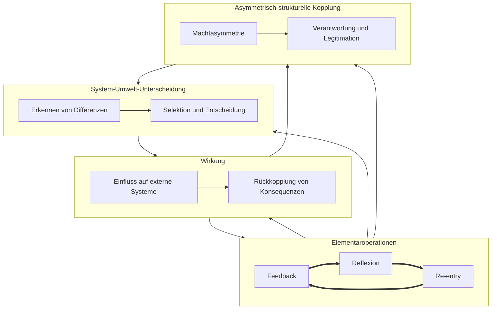

created: 05.12.2024 | updated: 27.12.2024 | [published](https://www.researchgate.net/publication/387527749_Systemtheoretischer_Professionalisierungsansatz): 27.12.2024 | [[Allgemein beruflich/Webseite Jochen Hanisch/Hinweise|Hinweise]]

**Systemtheoretischer Professionalisierungsansatz**
# Einleitung

Professionen nehmen eine Schlüsselstellung in modernen Gesellschaften ein, da sie in zentralen Bereichen wie Gesundheit, Recht und Bildung wirken und maßgeblich zur sozialen Stabilität und Entwicklung beitragen. Die wissenschaftliche Auseinandersetzung mit Professionen hat zahlreiche Theorien hervorgebracht, die sich mit ihrer Entstehung, ihren Merkmalen und ihrer gesellschaftlichen Rolle befassen. Dabei dominieren in der traditionellen Forschung merkmalstheoretische, machttheoretische und funktionalistische Ansätze, die Professionen durch feste Eigenschaften oder normative Ideale definieren.  

Der hier vorgestellte systemtheoretische Professionalisierungsansatz verfolgt einen alternativen Weg, indem er Professionen nicht als statische Kategorien begreift, sondern als autopoietische, dynamische Systeme, die sich in permanenter Wechselwirkung mit ihrer Umwelt befinden. Dieser Ansatz lehnt sich an die Systemtheorie von Niklas Luhmann an und erweitert bestehende Professionstheorien um eine prozesshafte, selbstreferenzielle Perspektive.  

Das Hauptziel besteht darin, die spezifische Dynamik, Struktur und Entwicklung von Professionen zu erfassen und zugleich ihre Unterscheidbarkeit von anderen Berufsfeldern systematisch herauszuarbeiten. Durch die Fokussierung auf prozessorientierte Merkmale wie System-Umwelt-Unterscheidung, Wirkung, Entwicklungsdynamik und asymmetrisch-strukturelle Kopplung bietet der Ansatz die Möglichkeit, Professionen nicht nur in ihrer aktuellen Gestalt zu analysieren, sondern auch ihre Veränderungsprozesse und Anpassungsmechanismen zu untersuchen.  

Das Erkenntnisinteresse liegt insbesondere in der Fähigkeit, Professionen operationalisierbar und empirisch vergleichbar zu machen. Dies ermöglicht eine zukunftsorientierte Analyse, die nicht allein auf historische oder normative Definitionen zurückgreift, sondern die funktionale Dynamik professioneller Systeme in den Vordergrund rückt. Indem der Ansatz die Selbstorganisation und die spezifischen Kommunikationsprozesse von Professionen untersucht, wird eine Grundlage geschaffen, um Professionalisierungsprozesse zu begleiten, zu reflektieren und in ihrer gesellschaftlichen Relevanz zu bewerten.

# 1 Definition

Professionen sind autopoetische Systeme mit einfacher, asymmetrisch-strukturellen Kopplung, die mittels der Elementaroperationen ihre System-Umwelt-Unterscheidung konstruieren und dadurch wirksam werden.

Der systemtheoretische Ansatz zur Definition von Professionen basiert auf wenigen, aber hochdynamischen Kennzeichen. Autopoiesis, asymmetrische Kopplung, Elementaroperationen und die System-Umwelt-Unterscheidung interagieren in einem zyklischen Prozess und verleihen Professionen ihre strukturelle Stabilität sowie ihre Fähigkeit zur kontinuierlichen Weiterentwicklung. Professionen zeichnen sich durch spezifische systemische Merkmale aus, die ihre Funktionsweise, Stabilität und gesellschaftliche Wirksamkeit bestimmen. Diese Merkmale lassen sich auf vier zentrale Prämissen zurückführen:  

**1. System-Umwelt-Unterscheidung**  
Professionen sind in der Lage, relevante Differenzen zwischen ihrem eigenen System und der Umwelt zu erkennen, zu beschreiben und zu interpretieren. Diese Differenzierung bildet die Grundlage für Entscheidungen und Handlungen, die innerhalb des Systems getroffen werden und sich gleichzeitig auf die Umwelt auswirken. Die Fähigkeit zur System-Umwelt-Unterscheidung ermöglicht es, komplexe Umweltanforderungen zu strukturieren und selektiv zu verarbeiten.  

**2. Asymmetrisch-strukturelle Kopplung**  
Professionen agieren in asymmetrischen Beziehungen zu anderen Systemen und Akteuren. Während sie erheblichen Einfluss auf diese Systeme ausüben (z. B. durch medizinische, juristische oder pädagogische Entscheidungen), unterliegen sie selbst nur begrenzt der Rückwirkung externer Einflüsse. Diese asymmetrische Kopplung verleiht Professionen eine besondere Verantwortung und Macht, die sie dazu verpflichtet, ihre Entscheidungen kritisch zu reflektieren und an gesellschaftliche Normen und Werte anzupassen.  

**3. Wirkung**  
Die Handlungen von Professionen entfalten weitreichende und tiefgreifende Konsequenzen. Diese Wirkungen können kurzfristig oder langfristig sein und sich sowohl positiv als auch negativ auf die Umwelt auswirken. Professionen werden durch die Wirksamkeit ihrer Entscheidungen und Handlungen definiert. Die Wirkung professionellen Handelns bildet die Grundlage für Verantwortung, die als Reaktion auf die Folgen dieser Handlungen entsteht.  

**4. Lernen und Entwicklungsdynamik**  
Professionen entwickeln sich durch kontinuierliches Lernen und die Anpassung an sich verändernde Umweltbedingungen. Dieser Lernprozess ist zirkulär und ergibt sich aus der Rückkopplung von Erfahrungen und Wirkungen (Feedback), der Reflexion interner Prozesse sowie der Wiedereinführung von Unterscheidungen in das System (Re-entry). Die Fähigkeit zur Selbstkorrektur und Weiterentwicklung ermöglicht es Professionen, langfristig stabil und handlungsfähig zu bleiben.  

Diese Merkmale sind nicht nur theoretische Konstrukte, sondern dienen auch als praktische Analyseinstrumente, um Professionen zu beschreiben, zu vergleichen und in ihrer gesellschaftlichen Relevanz zu verorten. Die enge Verknüpfung von Theorie und Praxis ermöglicht, Professionalisierungsprozesse in verschiedenen Bereichen systematisch zu erfassen und zu bewerten.

**1. Autopoiesis**  
Professionen sind autopoietische Systeme, die ihre eigenen Strukturen und Elemente kontinuierlich durch interne Operationen erzeugen und aufrechterhalten. Sie reproduzieren sich selbst und bleiben durch ihre internen Prozesse operativ geschlossen, während sie sich gleichzeitig an externe Anforderungen anpassen.  

**2. Asymmetrische Kopplung**  
Die Beziehung zwischen Profession und Umwelt ist asymmetrisch. Die Profession trifft Entscheidungen, die auf die Umwelt einwirken, während die Umwelt nur in begrenztem Maße auf die internen Strukturen der Profession Einfluss hat. Diese gerichtete Kopplung stellt sicher, dass Professionen eine gewisse Unabhängigkeit und Autonomie wahren, während sie gleichzeitig auf Umweltreize reagieren.  

**3. Elementaroperationen**  
Elementaroperationen sind die grundlegenden, nicht weiter reduzierbaren Prozesse, durch die Professionen ihre Strukturen stabilisieren und fortentwickeln. Sie bestehen aus der kontinuierlichen Anwendung von Unterscheidungen, die es dem System ermöglichen, sich zu orientieren, Entscheidungen zu treffen und mit der Umwelt zu interagieren.  

**4. Stabilität durch System-Umwelt-Unterscheidung**  
Professionen erzeugen und bewahren eine e Differenzierung zwischen sich selbst und ihrer Umwelt. Diese Unterscheidung sichert die Stabilität und Funktionsfähigkeit des Systems und definiert, welche Informationen und Ereignisse als relevant erachtet werden und welche nicht.  

**5. Wirksamkeit und Einfluss**  
Die Wirksamkeit professionellen Handelns ergibt sich aus der Fähigkeit, durch Elementaroperationen und die System-Umwelt-Unterscheidung auf die Umwelt einzuwirken. Diese Wirksamkeit ist das Ergebnis der asymmetrischen Kopplung und ermöglicht es Professionen, nachhaltige Veränderungen in ihrer Umwelt herbeizuführen, ohne ihre innere Autonomie aufzugeben.  

## 1.2 Schematische Darstellung

Das Systemtheoretische Professionalisierungsmodell beschreibt die systemischen Wechselwirkungen von Professionen durch System-Umwelt-Unterscheidungen, Elementaroperationen und asymmetrisch-strukturelle Kopplung. Im Zentrum steht die [[Allgemein beruflich/Research/Bildungswissenschaft/Wirkung]], die aus Differenzierung und Entscheidungsgrundlagen hervorgeht. Sie beeinflusst Systeme durch Rückkopplung, Anpassung und Einflussnahme.

_Abbildung 1: Ganzheitliches Modell der Professionalisierung auf Basis systemtheoretischer Prinzipien (eig. Abbildung)_

Der systemtheoretische Professionsansatz lässt sich durch eine strukturierte Darstellung der zentralen Prozesse und ihrer Wechselwirkungen veranschaulichen. Dabei stehen vier wesentliche Subsysteme im Mittelpunkt: die System-Umwelt-Unterscheidung, die Wirkung, die Elementaroperationen sowie die asymmetrisch-strukturelle Kopplung. Diese Subsysteme sind dynamisch miteinander verbunden und bilden einen geschlossenen Regelkreis, der die Funktionsweise von Professionen als autopoietische Systeme verdeutlicht.  

Die System-Umwelt-Unterscheidung markiert den Ausgangspunkt professionellen Handelns. Innerhalb dieses Subsystems erfolgt zunächst das Erkennen von Differenzen (A1) zwischen dem professionellen System und seiner Umwelt. Dieses Erkennen bildet die Grundlage für die darauffolgende Selektion und Entscheidung (A2), die bestimmt, welche Umweltaspekte als relevant betrachtet und in das System integriert werden. Dadurch grenzt sich die Profession operativ von ihrer Umwelt ab und definiert fortlaufend die relevanten Handlungsspielräume.  

Das Subsystem der Wirkung ist eng mit der System-Umwelt-Unterscheidung verknüpft. Professionelles Handeln entfaltet sich durch den Einfluss auf externe Systeme (B1). Diese Einflussnahme kann sich in Form von Entscheidungen, Interventionen oder diagnostischen Prozessen manifestieren. Die Umwelt reagiert auf diese Einwirkungen, wodurch es zur Rückkopplung von Konsequenzen (B2) an das professionelle System kommt. Diese Rückkopplung stellt sicher, dass die Profession die Auswirkungen ihrer Handlungen reflektiert und in zukünftige Entscheidungen integriert.  

Die Verarbeitung der Rückkopplung erfolgt durch die Elementaroperationen. Diese bestehen aus drei eng miteinander verbundenen Prozessen: Feedback (C1), Reflexion (C2) und Re-entry (C3). Feedback beschreibt die unmittelbare Rückmeldung aus der Umwelt, die zur Analyse und Bewertung aktueller Handlungen genutzt wird. Reflexion ist die vertiefte Betrachtung und Bewertung dieser Rückmeldungen, wodurch neue Einsichten und Unterscheidungen entstehen. Re-entry beschreibt die Wiedereinführung dieser Unterscheidungen in das System, wodurch bestehende Strukturen erneuert oder angepasst werden. Die Elementaroperationen sind zyklisch miteinander verbunden und gewährleisten die kontinuierliche Selbstkorrektur und Weiterentwicklung des professionellen Systems.  

Parallel dazu wird das Subsystem der asymmetrisch-strukturellen Kopplung durch die Wirkung und die Elementaroperationen beeinflusst. Asymmetrische Kopplung bedeutet, dass Professionen in ihrer Interaktion mit anderen Systemen eine überlegene Position einnehmen. Diese Beziehung ist geprägt durch Machtasymmetrie (D1), da die Profession auf die Umwelt einwirkt, während umgekehrt nur begrenzter Einfluss auf die internen Prozesse der Profession ausgeübt werden kann. Diese Machtasymmetrie bringt jedoch auch eine besondere Verantwortung mit sich. Verantwortung und Legitimation (D2) bilden daher die zweite zentrale Komponente der asymmetrischen Kopplung. Die Profession wird durch ihre Fähigkeit zur Reflexion und Anpassung legitimiert, da sie nicht nur extern handelt, sondern ihre Handlungen durch interne Prozesse kontinuierlich überprüft und an die Umwelt anpasst.  

Die Verbindung zwischen den Subsystemen verdeutlicht die zyklische Natur des professionellen Handelns. Die System-Umwelt-Unterscheidung beeinflusst direkt die Wirkung auf externe Systeme. Die Rückkopplung dieser Wirkung wird durch die Elementaroperationen verarbeitet, die wiederum die Grundlage für zukünftige Unterscheidungen und Entscheidungen liefern. Schließlich stabilisiert die asymmetrisch-strukturelle Kopplung das gesamte System, indem sie die Legitimation und Verantwortungsübernahme sicherstellt, während sie gleichzeitig die System-Umwelt-Unterscheidung erneut stärkt und modifiziert.  

Die interne Dynamik innerhalb der Subsysteme wird durch verschiedene Wechselwirkungen dargestellt. So ist die System-Umwelt-Unterscheidung in sich geschlossen und basiert auf der Interaktion zwischen Erkennen von Differenzen (A1) und Selektion und Entscheidung (A2). Die Rückkopplung innerhalb des Wirkungssystems erfolgt zwischen Einfluss auf externe Systeme (B1) und der Rückmeldung von Konsequenzen (B2). Ebenso bestehen zyklische Verbindungen innerhalb der Elementaroperationen zwischen Feedback, Reflexion und Re-entry.  

Insgesamt veranschaulicht diese Darstellung die Komplexität und Dynamik professionellen Handelns. Die zyklische Verknüpfung der Subsysteme sichert die kontinuierliche Reproduktion und Anpassung des professionellen Systems und macht deutlich, dass professionelle Prozesse nicht linear verlaufen, sondern in einem fortlaufenden Regelkreis agieren. Dies hebt die Selbstreferentialität und Autopoiesis professioneller Systeme hervor und betont ihre Fähigkeit zur ständigen Selbstregulation und Weiterentwicklung.

# 2 Herleitung

Die klassischen Professionstheorien bieten unterschiedliche Zugänge zur Definition und Analyse von Professionen. Merkmalsorientierte Ansätze betonen die Eigenschaften, Normen und Standards, die eine Profession kennzeichnen. Sie definieren diese durch objektive Kriterien wie Autonomie, wissenschaftliches Wissen und ethische Verantwortung (z. B. Wilensky, 1964). Machttheoretische Modelle hingegen richten ihren Fokus auf die sozialen und politischen Mechanismen, durch die Professionen ihre Kontrolle und gesellschaftliche Dominanz etablieren oder verteidigen (z. B. Freidson, 2001). Funktionalistische Ansätze betrachten Professionen vor allem in Bezug auf ihre gesellschaftliche Rolle und ihre Beiträge zur Stabilisierung und Weiterentwicklung sozialer Systeme.

Obwohl sich diese Ansätze in ihrer Perspektive unterscheiden, ergänzen sie sich in vielerlei Hinsicht: Während Merkmalstheorien den strukturellen Rahmen von Professionen beschreiben, analysieren machttheoretische Modelle die Prozesse der Kontrolle und Abgrenzung, und funktionalistische Theorien heben die systemische Relevanz und die gesellschaftliche Vermittlungsrolle von Professionen hervor. 

Der hier entwickelte systemtheoretische Professionalisierungsansatz integriert diese Perspektiven, indem dieser die Dynamik und Komplexität professionellen Handelns betont. Dieser erweitert die klassischen Theorien durch vier zentrale Kennzeichen, die Professionen als dynamische, selbstreferenzielle und systemisch eingebettete Akteure beschreiben:

1. System-Umwelt-Unterscheidung  
   Professionen zeichnen sich durch ihre Fähigkeit aus, komplexe Umweltanforderungen wahrzunehmen, zu beschreiben und zu interpretieren. Diese Differenzierungsfähigkeit ist die Grundlage für handlungsrelevante Entscheidungen und die Legitimation professioneller Eingriffe.

2. Wirkung
   Professionen erzeugen weitreichende und ambivalente Wirkungen, die sowohl in ihrer zeitlichen Dimension (kurz- und langfristige Konsequenzen) als auch in ihrer Intensität (positiv oder negativ) herausstechen. Diese [[Allgemein beruflich/Research/Bildungswissenschaft/Wirkung]] macht die gesellschaftliche Relevanz von Professionen deutlich und geht der Verantwortung voraus, die sie übernehmen müssen.

3. Entwicklungsdynamik
   Professionen entwickeln sich kontinuierlich durch das Zusammenspiel der Trias aus Feedback, Reflexion und Reentry. Diese Mechanismen ermöglichen die aktive Transformation von Systemen und die Anpassung an neue gesellschaftliche Anforderungen.

4. asymmetrisch-strukturelle Kopplung  
   Professionen agieren in asymmetrischen Beziehungen zu anderen Systemen, in denen sie entscheidend handeln und direkten Einfluss ausüben, während das abhängige System nur eingeschränkt auf die Profession zurückwirken kann. Diese Kopplung verdeutlicht die Macht und Verantwortung von Professionen und ihre transformative Rolle über systemische Grenzen hinweg.

Mit diesem Ansatz wird die klassische Trennung zwischen Merkmalstheorien, Machttheorien und funktionalistischen Modellen überwunden. Statt statische Kategorien zu definieren, beschreibt der systemtheoretische Ansatz Professionen als dynamische und systemisch verankerte Akteure, die durch ihre spezifische [[Entwicklungsdynamik]] und ihre strukturellen Kopplungen einzigartige gesellschaftliche Funktionen erfüllen. Die Integration der vier Kennzeichen ermöglicht eine Analyse und Operationalisierung professionellen Handelns und unterstreicht deren Relevanz in einer komplexen, sich stetig wandelnden Gesellschaft.

## 2.1 Klassische Professionstheorien

Die klassischen Professionstheorien bieten unterschiedliche Ansätze zur Analyse und Definition von Professionen. Drei zentrale Strömungen prägen die historische und aktuelle Diskussion: Merkmalstheorien, machttheoretische Modelle und funktionalistische Perspektiven. Diese Theorien entstanden in verschiedenen sozialen und wissenschaftlichen Kontexten und beleuchten die Rolle und Merkmale von Professionen aus unterschiedlichen Blickwinkeln.  

Merkmalstheorien entwickelten sich insbesondere in den 1960er Jahren und zielen darauf ab, objektive Kriterien zu identifizieren, die Professionen von anderen Berufen abgrenzen. Harold L. Wilensky gehört zu den einflussreichsten Vertretern dieser Strömung. In seinem Aufsatz The Professionalization of Everyone? aus dem Jahr 1964 schlägt Wilensky ein Rahmenwerk vor, das anhand spezifischer Merkmale die Unterscheidung von Professionen ermöglicht. Zentrale Kriterien sind dabei Autonomie, wissenschaftsbasiertes Wissen und ethische Verantwortung. Autonomie beschreibt die Fähigkeit von Professionen, unabhängig von externen Einflüssen wie politischen oder wirtschaftlichen Interessen zu agieren. Wissenschaftsbasiertes Wissen wird durch lange Ausbildungszeiten und kontinuierliche Forschung erworben und bildet die Grundlage professionellen Handelns. Die ethische Verantwortung verweist auf die Verpflichtung, Entscheidungen zu treffen, die dem Wohl der Gesellschaft und der betroffenen Individuen dienen.  

Merkmalstheorien wurden wiederholt für ihren normativen und idealisierenden Charakter kritisiert. Burrage et al. argumentieren 1990, dass die Realität vieler Berufe häufig von diesen Idealmerkmalen abweicht und es in der Praxis schwierig ist, e Abgrenzungen vorzunehmen. Die theoretische Annahme einer  Trennlinie zwischen Professionen und anderen Berufen erscheint daher problematisch und wird als zu starr empfunden.  

In den 1970er Jahren gewannen machttheoretische Ansätze an Bedeutung, die als Reaktion auf die normativen Vorstellungen der Merkmalstheorien verstanden werden können. Eliot Freidson gilt als einer der führenden Vertreter dieser Strömung. In seinem Werk Professionalism: The Third Logic aus dem Jahr 2001 sowie in früheren Arbeiten analysiert Freidson die sozialen und politischen Mechanismen, die zur Sicherung der privilegierten Stellung von Professionen beitragen. Im Zentrum seiner Analyse steht die Frage, wie Professionen ihre Machtposition durch Kontrolle über spezifische Wissensbereiche und durch die Regulierung von Zugang und Zertifizierung verteidigen.  

Freidson betont, dass Autonomie nicht als neutral oder selbstverständlich betrachtet werden sollte, sondern als Resultat gesellschaftlicher Machtstrategien. Während Wilensky Autonomie als objektives Merkmal professionellen Handelns begreift, sieht Freidson sie als Instrument, das Professionen nutzen, um ihre privilegierte Position zu behaupten. Abgrenzung gegenüber anderen Berufen wird dabei als bewusster Prozess verstanden, der darauf abzielt, Monopolstellungen zu sichern und Konkurrenz zu vermeiden.  

Machttheoretische Ansätze werden häufig für ihren reduktionistischen Fokus auf Macht und Kontrolle kritisiert. Ihnen wird vorgeworfen, die gesellschaftlichen Funktionen von Professionen sowie deren positive Beiträge zu vernachlässigen. Kritiker heben hervor, dass Professionen nicht nur aus Eigeninteresse handeln, sondern oft auch wesentliche gesellschaftliche Aufgaben erfüllen. Die einseitige Betrachtung der Machtaspekte kann dazu führen, dass der komplexe Zusammenhang zwischen professionellem Wissen, ethischer Verantwortung und gesellschaftlicher Funktion unterbelichtet bleibt.  

Funktionalistische Ansätze zur Professionalisierung entstanden bereits in den 1930er Jahren und wurden maßgeblich durch Talcott Parsons geprägt. In seinem Werk The Social System aus dem Jahr 1951 beschreibt Parsons Professionen als zentrale Akteure, die durch normorientiertes Handeln zur sozialen Integration und Stabilität beitragen. Funktionalistische Ansätze betonen die Bedeutung von Werten und Normen für das professionelle Handeln und gehen davon aus, dass Professionen gesellschaftliche Funktionen übernehmen, die auf das Gemeinwohl ausgerichtet sind.  

Parsons argumentiert, dass Professionen durch ihre normorientierte Praxis und ihre spezialisierten Fähigkeiten Stabilität und Ordnung in die Gesellschaft bringen. Sie erfüllen spezifische Aufgaben, etwa die Förderung von Gesundheit im medizinischen Bereich oder die Sicherstellung von Recht und Gerechtigkeit im juristischen Sektor. Altruismus spielt in diesem Zusammenhang eine zentrale Rolle, da professionelles Handeln primär durch das Interesse am Gemeinwohl und nicht durch individuelle Vorteile motiviert sei.  

Kritik am Funktionalismus richtet sich vor allem gegen den idealisierenden Charakter dieser Theorien. Johnson bemängelte bereits 1972, dass funktionalistische Modelle die Eigeninteressen von Professionen verkennen und die potenziellen Konflikte innerhalb der Professionalisierungsprozesse ausblenden. Die Vorstellung, dass Professionen ausschließlich altruistisch handeln, wird als naiv betrachtet und entspricht nicht den komplexen Realitäten professioneller Praxis. Zudem wird kritisiert, dass funktionalistische Ansätze dazu tendieren, bestehende soziale Hierarchien zu legitimieren, anstatt sie kritisch zu hinterfragen.

Die klassischen Professionstheorien bieten unterschiedliche Perspektiven auf die Entstehung und Rolle von Professionen. Während Merkmalstheorien versuchen, e Kriterien für die Abgrenzung von Professionen zu formulieren, konzentrieren sich machttheoretische Ansätze auf die sozialen und politischen Dynamiken professioneller Macht. Funktionalistische Theorien hingegen betrachten Professionen als integrale Bestandteile der gesellschaftlichen Ordnung und betonen deren stabilisierende Funktion. Trotz ihrer jeweiligen Schwächen und Kritiken haben alle drei Strömungen zur Weiterentwicklung der Professionalisierungsforschung beigetragen und liefern wertvolle Einsichten für die Analyse moderner Berufe.

## 2.2 Klasisch-systemtheoretische Perspektive

Die systemtheoretische Perspektive eröffnet neue Wege zur Analyse und Interpretation von Professionen, indem sie sich von traditionellen, merkmalsbasierten und normativen Definitionen distanziert. Statt Professionen als statische Konstrukte zu betrachten, untersucht der systemtheoretische Ansatz, ob und inwiefern Professionen als eigenständige soziale Einheiten beschrieben werden können. Dabei wird die Frage aufgeworfen, ob Professionen lediglich Produkte historischer und gesellschaftlicher Entwicklungen sind oder ob ihnen eine systemische Eigenlogik zugrunde liegt.  

In der Systemtheorie von Niklas Luhmann, wie er sie in *Soziale Systeme* (1984) entwickelt hat, sind soziale Systeme durch autopoietische Prozesse und ihre spezifische Kommunikationslogik definiert. Jedes Funktionssystem in der Gesellschaft operiert auf Grundlage eines eigenen binären Codes, der seine zentrale Unterscheidung bildet. So unterscheidet das Rechtssystem zwischen rechtmäßig und unrechtmäßig, die Wissenschaft zwischen wahr und unwahr und das Gesundheitssystem zwischen krank und gesund. Berufe nehmen innerhalb dieser Funktionssysteme eine Rolle ein, die sich aus der jeweiligen Systemlogik und den daran geknüpften Erwartungen ableitet. Beispielsweise ist die Rolle eines Arztes oder einer Ärztin durch die Logik des Gesundheitssystems geprägt, während die Tätigkeit von Juristinnen und Juristen der internen Logik des Rechtssystems folgt.  

Professionen lassen sich in diesem Rahmen als spezialisierte Rollen innerhalb von Funktionssystemen beschreiben. Sie existieren nicht unabhängig, sondern leiten ihre Funktion und Legitimation aus der jeweiligen Logik des Systems ab, in dem sie agieren. Während ein Arzt auf die Differenzierung zwischen krank und gesund angewiesen ist, operiert eine Lehrerin innerhalb der Unterscheidung zwischen Wissen und Nichtwissen, die für das Bildungssystem charakteristisch ist. Die professionsspezifischen Rollen sind daher immer an die Codes und Programme der Funktionssysteme gebunden, wodurch sie keine eigene, systemische Funktionslogik entwickeln.  

Ein zentrales Argument gegen die systemische Eigenständigkeit von Professionen ist das Fehlen eines universellen Codes, der sie von anderen sozialen Akteuren unterscheidet. Anders als Funktionssysteme wie Recht, Politik oder Wissenschaft, die durch  definierte Unterscheidungen operieren, verfügen Professionen über keine einheitliche Unterscheidungslogik, die sie als eigenständige Systeme qualifizieren könnte. Die Medizin, das Recht und das Bildungswesen folgen jeweils den Anforderungen und Erwartungen des Funktionssystems, dem sie zugeordnet sind. Professionen lassen sich daher nicht als geschlossene soziale Systeme begreifen, sondern als gesellschaftliche Konstrukte, die sich in die bestehenden Funktionssysteme einfügen und von diesen abhängig bleiben.  

Trotzdem weisen Professionen Eigenschaften auf, die sie innerhalb der Systemtheorie von anderen Rollen abheben. Eine dieser Eigenschaften ist ihre ausgeprägte Reflexivität. Professionen agieren häufig an der Schnittstelle mehrerer Funktionssysteme und sind dadurch in der Lage, die Logiken verschiedener Systeme zu integrieren und aufeinander zu beziehen. Ärztinnen und Ärzte operieren nicht nur innerhalb des Gesundheitssystems, sondern müssen ethische, rechtliche und wirtschaftliche Aspekte in ihre Entscheidungen einfließen lassen. Diese Fähigkeit zur systemübergreifenden Reflexion verleiht Professionen eine besondere Stellung und befähigt sie, in komplexen und verantwortungsvollen Bereichen zu agieren.  

Ein weiteres Merkmal professionellen Handelns ist die Fähigkeit zur System-Umwelt-Unterscheidung. Professionen sind in der Lage, sich von ihrer Umwelt abzugrenzen und autonome Entscheidungen zu treffen, ohne dabei vollständig den Logiken einzelner Funktionssysteme unterworfen zu sein. Dies zeigt sich insbesondere in Situationen, in denen professionelle Akteure auf unvorhergesehene oder unstrukturierte Problemstellungen reagieren müssen, die nicht durch standardisierte Programme oder Regeln gelöst werden können.  

Professionen übernehmen zudem eine wichtige Rolle bei der Reduktion von Komplexität in hochsensiblen Bereichen. In Situationen mit hoher Unsicherheit, etwa in der medizinischen Diagnostik oder der juristischen Fallbearbeitung, entwickeln professionelle Akteure Verfahren und Entscheidungsroutinen, die über die binären Codes der Funktionssysteme hinausgehen. So ist die Diagnose eines Arztes nicht ausschließlich durch die Unterscheidung zwischen krank und gesund erklärbar, sondern erfordert eine weitergehende Abwägung individueller Faktoren, die in die Entscheidungsfindung einfließen.  

Die historische Entwicklung von Professionen zeigt, dass ihre gesellschaftliche Stellung durch die Fähigkeit zur Übernahme von Verantwortung und zur Legitimation von Entscheidungen geprägt ist. Professionen besitzen die Kompetenz, in hochsensiblen Bereichen wie Gesundheit, Recht und Bildung tiefgreifende Entscheidungen zu treffen, die das Leben und Wohl von Individuen maßgeblich beeinflussen. Diese Legitimation resultiert jedoch nicht aus einer systemischen Eigenlogik, sondern ist das Produkt gesellschaftlicher und kultureller Prozesse, die den Professionen diese Rolle zuschreiben.  

Systemtheoretisch betrachtet sind Professionen keine eigenständigen sozialen Systeme, sondern Rollen innerhalb von Funktionssystemen. Ihre Bedeutung und Legitimation gewinnen sie durch ihre Reflexivität, ihre Vermittlungsrolle und ihre Fähigkeit zur System-Umwelt-Unterscheidung. Obwohl sie keine autarken Einheiten darstellen, übernehmen Professionen eine zentrale gesellschaftliche Funktion, indem sie an den Schnittstellen verschiedener Funktionssysteme agieren und zur Integration und Stabilisierung sozialer Prozesse beitragen.

## 2.3 Systemtheoretischer Professionsansatz  

Der systemtheoretische Professionsansatz eröffnet eine innovative Perspektive auf die Analyse und Definition von Professionen, indem er sich von traditionellen, statischen Konzepten abwendet und stattdessen die Prozesshaftigkeit und Selbstorganisation professioneller Systeme betont. Im Mittelpunkt steht die Annahme, dass Professionen autopoietische Systeme sind, die sich durch fortlaufende Selbsterschaffung und -erhaltung auszeichnen. Diese Selbstreferenzialität unterscheidet sie von anderen sozialen Akteuren und ermöglicht es ihnen, sich dynamisch an veränderte Umweltbedingungen anzupassen und ihre internen Strukturen zu reproduzieren und weiterzuentwickeln.  

Ein zentrales Element dieses Ansatzes ist die Konstruktion und Stabilisierung der System-Umwelt-Unterscheidung. Professionen existieren nicht in einem vorgegebenen, objektiven Umfeld, sondern erschaffen ihre Umwelt aktiv durch die fortwährende Differenzierung zwischen relevanten und irrelevanten Informationen. Diese Differenzierung erfolgt durch spezifische Operationen, die es dem professionellen System ermöglichen, komplexe Umweltanforderungen zu selektieren, zu deuten und in handlungsleitende Prozesse zu überführen. Die Umwelt erscheint somit nicht als externer Einfluss, sondern als Produkt systeminterner Selektionsprozesse, die durch Wahrnehmung, Beschreibung und Interpretation strukturiert werden.  

Die Wahrnehmung professioneller Systeme basiert auf der Fähigkeit, Umweltreize zu erkennen und gezielt zu filtern. Diese Selektion geschieht nicht willkürlich, sondern folgt der Logik des jeweiligen Systems, die durch spezifisches Wissen, Erfahrung und institutionalisierte Leitdifferenzen geprägt ist. Die Fähigkeit zur Wahrnehmung ist grundlegend für die Stabilisierung der System-Umwelt-Grenze, da sie bestimmt, welche Informationen in das System aufgenommen und welche ausgeblendet werden.  

Die Beschreibung erweitert diesen Prozess, indem sie die wahrgenommenen Differenzen in eine sprachliche oder symbolische Form überführt. Professionen operieren nicht ausschließlich durch Handlungen, sondern auch durch Beschreibungen, die ihre Entscheidungen legitimieren und nachvollziehbar machen. In der Beschreibung manifestiert sich die innere Logik des Systems, die es ermöglicht, komplexe Sachverhalte zu strukturieren und in die Kommunikation mit der Umwelt einzubringen.  

Die Interpretation bildet die Schnittstelle zwischen Wahrnehmung und Handeln. Sie setzt die beschriebenen Informationen in einen systemrelevanten Kontext und überführt sie in konkrete Entscheidungen und Maßnahmen. Interpretation ist daher keine passive Reaktion auf Umweltanforderungen, sondern ein aktiver Prozess, der die interne Logik des Systems stabilisiert und es handlungsfähig macht.  

Ein weiteres zentrales Merkmal des systemtheoretischen Professionsansatzes ist die asymmetrisch-strukturelle Kopplung zwischen Profession und Umwelt. Diese Kopplung beschreibt eine Beziehung, in der die Profession direkten Einfluss auf externe Systeme oder Individuen ausübt, während diese nur begrenzt auf die internen Prozesse der Profession einwirken können. Die Asymmetrie dieser Beziehung liegt in der besonderen Macht- und Verantwortungsposition der Profession, die es ihr ermöglicht, weitreichende Entscheidungen zu treffen, ohne dass die Umwelt diese in gleicher Weise beeinflussen kann.  

Die asymmetrische Kopplung ist nicht nur Ausdruck professioneller Autonomie, sondern auch eine Quelle von Legitimation und Verantwortung. Professionen agieren in hochsensiblen Bereichen wie Gesundheit, Recht oder Bildung, in denen ihre Entscheidungen tiefgreifende Konsequenzen für Individuen und gesellschaftliche Systeme haben. Diese Machtposition erfordert eine kontinuierliche Reflexion und ethische Abwägung, um die Interessen der betroffenen Systeme zu wahren und die Legitimität professionellen Handelns zu sichern.  

Die Entwicklungsdynamik professioneller Systeme ergibt sich aus der Fähigkeit zur Selbstkorrektur und Innovation. Professionen sind nicht statisch, sondern unterliegen einem permanenten Wandel, der durch Feedbackprozesse, Reflexion und Reentry gesteuert wird. Feedback beschreibt die Rückmeldungen aus der Umwelt, die es dem System ermöglichen, seine Wirksamkeit zu überprüfen und Abweichungen zu identifizieren. Reflexion analysiert diese Rückmeldungen und hinterfragt bestehende Strukturen und Entscheidungslogiken. Reentry schließlich führt die Ergebnisse dieser Reflexion in das System zurück und generiert neue Handlungslogiken und Strukturen.  

Die Entwicklungsdynamik verleiht Professionen eine hohe Anpassungsfähigkeit und Innovationskraft, da sie in der Lage sind, auf veränderte Umweltbedingungen flexibel zu reagieren und gleichzeitig ihre Autonomie zu wahren. Dieser kontinuierliche Prozess der Selbstbeobachtung und Selbstmodifikation unterscheidet Professionen von anderen sozialen Akteuren und ermöglicht es ihnen, in komplexen und sich wandelnden gesellschaftlichen Kontexten wirksam zu bleiben.  

Ein weiteres zentrales Element des systemtheoretischen Professionsansatzes ist die Wirkung professionellen Handelns. Professionen zeichnen sich durch Entscheidungen aus, deren Folgen sich nicht nur auf den unmittelbaren Handlungskontext beschränken, sondern langfristige und systemübergreifende Auswirkungen entfalten. Diese Entscheidungen erzeugen Kausalitätsketten, die verschiedene soziale Systeme durchdringen und sowohl positive als auch negative Konsequenzen nach sich ziehen können.  

Die Reflexion und Steuerung dieser Wirkungen ist ein wesentlicher Bestandteil professioneller Verantwortung. Professionen müssen sich der Reichweite und Intensität ihrer Entscheidungen bewusst sein und Strategien entwickeln, um die damit verbundenen Unsicherheiten und Ambivalenzen zu bewältigen. Die Fähigkeit zur Antizipation und Kontrolle von Wirkungen ist daher nicht nur eine praktische Notwendigkeit, sondern auch ein zentrales Merkmal professioneller Kompetenz.  

Der systemtheoretische Professionsansatz bietet eine präzise und anschlussfähige Möglichkeit, die Besonderheiten und Herausforderungen professionellen Handelns zu analysieren. Er verdeutlicht, dass Professionen nicht allein durch ihr Wissen oder ihren Status definiert sind, sondern durch ihre Fähigkeit, komplexe Umweltanforderungen zu verarbeiten, verantwortungsvolle Entscheidungen zu treffen und ihre Strukturen durch fortlaufende Reflexion und Anpassung zu stabilisieren. Dieser Ansatz erweitert die klassische Professionstheorie und bietet eine tiefgehende Analyse der gesellschaftlichen Funktion und Bedeutung von Professionen.

### 2.3.1 System-Umwelt-Unterscheidung  

Die System-Umwelt-Unterscheidung bildet die essenzielle Grundlage für die Existenz und das Handeln von Professionen innerhalb der systemtheoretischen Perspektive. In diesem Rahmen wird davon ausgegangen, dass Professionen nicht durch äußere Zuschreibungen oder gesellschaftliche Konstruktionen definiert werden, sondern durch ihre Fähigkeit, sich selbst von ihrer Umwelt abzugrenzen und diese Abgrenzung aktiv zu gestalten. Diese Differenzierung ist kein statischer Zustand, sondern das Resultat fortlaufender Operationen, die darauf abzielen, die Stabilität und Identität des Systems zu sichern.  

Der zentrale Gedanke liegt in der Annahme, dass Professionen ihre Umwelt nicht in einem objektiven Sinne vorfinden, sondern diese durch interne Selektionsmechanismen erst erzeugen. Die Umwelt ist damit kein fixer Bestandteil der externen Realität, sondern eine Konstruktion, die sich aus der internen Logik der Profession ergibt. Die Unterscheidung zwischen dem, was zur Profession gehört, und dem, was als Umwelt wahrgenommen wird, bildet das Fundament für professionelle Entscheidungs- und Handlungsprozesse.  

Die Fähigkeit zur System-Umwelt-Unterscheidung manifestiert sich in drei eng miteinander verwobenen Dimensionen: Wahrnehmung, Beschreibung und Interpretation. Diese Dimensionen bilden keine isolierten, linear ablaufenden Prozesse, sondern stehen in ständiger Wechselwirkung zueinander und verstärken sich gegenseitig.  

Die Wahrnehmung stellt den ersten und grundlegenden Schritt dar, in dem Professionen Umweltreize selektieren und zwischen relevanten und irrelevanten Informationen unterscheiden. Diese Selektion ist kein zufälliger oder beliebiger Vorgang, sondern beruht auf spezialisierten Wissensbeständen, beruflicher Erfahrung und der Orientierung an systeminternen Differenzierungsprinzipien. Durch die Wahrnehmung wird festgelegt, welche Aspekte der Umwelt für die Profession zugänglich sind und welche ausgeblendet werden.  

Die Beschreibung bildet die nächste Stufe der System-Umwelt-Unterscheidung. In diesem Prozess werden die durch Wahrnehmung gewonnenen Unterscheidungen in sprachlicher, symbolischer oder formaler Weise dokumentiert und operationalisiert. Die Beschreibung dient nicht nur der internen Kommunikation innerhalb der Profession, sondern ermöglicht auch den Austausch mit anderen Systemen und Akteuren. Sie transformiert Wahrnehmungen in nachvollziehbare, überprüfbare und verallgemeinerbare Formen, die als Grundlage für nachfolgende Entscheidungsprozesse dienen.  

In der Interpretation erhalten die beschriebenen Informationen schließlich ihre spezifische Bedeutung. Dieser Schritt setzt die wahrgenommenen und beschriebenen Umweltaspekte in Bezug zur internen Logik der Profession und ermöglicht es, aus den Unterscheidungen konkrete Handlungen und Entscheidungen abzuleiten. Interpretation ist daher nicht nur die abschließende, sondern zugleich die entscheidende Dimension der System-Umwelt-Unterscheidung, da sie die Brücke zwischen der internen Ordnung der Profession und der externen Umwelt schlägt.  

Insgesamt zeigt sich, dass die System-Umwelt-Unterscheidung nicht nur eine theoretische Kategorie darstellt, sondern die Grundlage für jede Form professionellen Handelns bildet. Ohne diese Fähigkeit zur Differenzierung wäre es für Professionen unmöglich, komplexe Umweltbedingungen zu analysieren, zu strukturieren und auf sie einzuwirken. Die System-Umwelt-Unterscheidung ist damit nicht nur ein Merkmal professioneller Systeme, sondern deren konstituierendes Prinzip.

### 2.3.2 Wirkung  

Die Wirkung professionellen Handelns stellt innerhalb des systemtheoretischen Professionsansatzes ein fundamentales Unterscheidungsmerkmal dar, das über die bloße Ausführung beruflicher Tätigkeiten hinausgeht. Professionen agieren in gesellschaftlichen Funktionsbereichen, deren Entscheidungen und Interventionen nicht nur kurzfristige, sondern langfristige und weitreichende Konsequenzen nach sich ziehen. Diese Wirkung ist nicht lokal begrenzt, sondern entfaltet sich über unterschiedliche soziale, politische oder wirtschaftliche Systeme hinweg und kann Kettenreaktionen auslösen, die sowohl intendierte als auch nicht intendierte Folgen haben.  

Die Bedeutung der Wirkung liegt darin, dass sie den Kern professioneller Praxis und deren Legitimation bildet. Professionen gewinnen ihre gesellschaftliche Relevanz nicht allein durch die Erfüllung technischer Aufgaben oder die Anwendung spezialisierten Wissens, sondern durch ihre Fähigkeit, nachhaltige Veränderungen zu initiieren und komplexe Problemlagen zu beeinflussen. Diese Wirkung unterscheidet sie von anderen Berufen, deren Handlungsfelder auf engere, direkt abschließbare Aufgaben beschränkt sind.  

Ein charakteristisches Merkmal der Wirkung professioneller Handlungen ist ihre Ambivalenz. Professionelle Entscheidungen können sowohl positive als auch negative Effekte nach sich ziehen, die oft erst mit zeitlichem Abstand erkennbar werden. Diese Ambivalenz impliziert eine besondere Verantwortung für Professionen, da ihre Entscheidungen nicht nur punktuell wirken, sondern langfristige gesellschaftliche Entwicklungen mitgestalten.  

Von besonderer Bedeutung ist die Rückkopplung der Wirkung auf das professionelle System selbst. Die durch professionelles Handeln erzeugten externen Veränderungen wirken auf die internen Strukturen der Profession zurück, indem sie deren Handlungslogiken und Entscheidungsprozesse beeinflussen. Professionen sind daher gezwungen, kontinuierlich zu reflektieren und sich an die durch ihre eigenen Interventionen geschaffenen neuen Rahmenbedingungen anzupassen.  

Diese Rückkopplungsmechanismen verdeutlichen, dass Professionen nicht nur aktive Akteure in ihrer Umwelt sind, sondern auch selbst von den Effekten ihrer Entscheidungen betroffen werden. Die Fähigkeit zur Selbstbeobachtung und Anpassung wird damit zu einem integralen Bestandteil professionellen Handelns. Dieser Prozess der fortwährenden Selbstregulation und Weiterentwicklung ist entscheidend für die Stabilität und Innovationskraft von Professionen und trägt zur Aufrechterhaltung ihrer gesellschaftlichen Legitimation bei.  

Demnach stellt Wirkung professionellen Handelns ein zentrales Kriterium für die Definition von Professionen im systemtheoretischen Sinne dar. Die besondere Qualität professioneller Praxis ergibt sich aus ihrer Reichweite, ihrer Ambivalenz und der Notwendigkeit kontinuierlicher Reflexion. Dies unterstreicht die transformative Rolle von Professionen innerhalb der Gesellschaft und verdeutlicht, dass ihre Existenz auf der Fähigkeit beruht, systemübergreifende Entwicklungen zu initiieren und langfristig zu gestalten.

### 2.3.3 Entwicklungsdynamik  

Die Entwicklungsdynamik von Professionen ist ein wesentliches Charakteristikum, das ihre Fähigkeit zur kontinuierlichen Anpassung und Transformation unterstreicht. Im Gegensatz zu festen, einmal etablierten Strukturen, zeichnen sich Professionen durch eine inhärente Beweglichkeit aus, die ihnen erlaubt, auf Veränderungen in ihrer Umwelt zu reagieren und zugleich ihre eigenen internen Prozesse fortlaufend zu optimieren. Diese Dynamik basiert auf drei eng miteinander verknüpften Mechanismen: Feedback, Reflexion und Reentry.  

Feedback beschreibt den Prozess, durch den Professionen Rückmeldungen aus ihrer Umwelt aufnehmen. Diese Rückmeldungen entstehen aus den Wirkungen professioneller Entscheidungen und Handlungen und dienen als Indikatoren für die Angemessenheit und Wirksamkeit des professionellen Handelns. Feedback fungiert als eine Art Frühwarnsystem, das Abweichungen und unvorhergesehene Entwicklungen sichtbar macht und somit die Grundlage für Anpassungsprozesse legt.  

Die Reflexion setzt an diesem Punkt an, indem die erhaltenen Rückmeldungen systemintern verarbeitet und analysiert werden. Dabei geht es nicht nur um eine oberflächliche Bewertung der aktuellen Praxis, sondern um eine tiefgehende Auseinandersetzung mit den eigenen Strukturen, Entscheidungsprozessen und Handlungsmustern. Reflexion ist die Fähigkeit professioneller Systeme, sich selbst zu beobachten und die eigene Funktionsweise zu hinterfragen. Sie dient der kritischen Prüfung bestehender Routinen und eröffnet neue Handlungsoptionen.  

Reentry beschreibt schließlich den entscheidenden Schritt, in dem die aus der Reflexion gewonnenen Erkenntnisse in das System zurückgeführt werden. Dies bedeutet, dass neue Unterscheidungen, Entscheidungslogiken oder Strukturen nicht nur theoretisch erarbeitet, sondern in die operative Praxis integriert werden. Reentry ist damit die Wiederaufnahme veränderter Strukturen in den laufenden Entscheidungsprozess und bildet den Mechanismus, durch den sich Professionen selbst erneuern und weiterentwickeln.  

Die Kombination dieser drei Mechanismen – Feedback, Reflexion und Reentry – erzeugt eine zirkuläre Dynamik, die Professionen in die Lage versetzt, nicht nur auf Umweltveränderungen zu reagieren, sondern diese aktiv zu gestalten. Professionen sind somit nicht bloße Adressaten externer Einflüsse, sondern entwickeln durch ihre Entwicklungsdynamik die Fähigkeit, auf Umweltbedingungen einzuwirken und ihre eigene Evolution voranzutreiben.  

Ein zentraler Aspekt dieser Dynamik ist die Balance zwischen Anpassung und Autonomie. Während der Anpassungsprozess es ermöglicht, flexibel auf externe Anforderungen zu reagieren, sorgt die Reflexion dafür, dass die grundlegende Systemlogik der Profession erhalten bleibt. Reentry wiederum stellt sicher, dass Veränderungen nicht beliebig erfolgen, sondern in den bestehenden Kontext eingebunden werden. Diese Gleichzeitigkeit von Stabilität und Wandel verleiht Professionen ihre besondere Innovationskraft und strukturelle Resilienz.  

Die Entwicklungsdynamik ist damit nicht nur ein Ausdruck professioneller Flexibilität, sondern auch eine Bedingung für ihre langfristige Existenz und Legitimation. In einer sich stetig wandelnden Gesellschaft wäre eine Profession ohne die Fähigkeit zur kontinuierlichen Erneuerung nicht überlebensfähig. Die systemtheoretische Perspektive verdeutlicht, dass die Dynamik professioneller Systeme nicht zufällig oder punktuell auftritt, sondern eine grundlegende strukturelle Eigenschaft darstellt, die das Wesen von Professionen maßgeblich prägt.

### 2.3.4 Asymmetrisch-strukturelle Kopplung  

Die asymmetrisch-strukturelle Kopplung bildet den Kern der systemtheoretischen Betrachtung von Professionen und hebt diese deutlich von anderen sozialen Systemen ab. Sie beschreibt eine Beziehung, in der Professionen durch ihr spezialisiertes Wissen und ihre Entscheidungsbefugnis direkten Einfluss auf andere Systeme ausüben, während diese anderen Systeme nur in begrenztem Maße auf die internen Abläufe der Professionen zurückwirken können. Diese Einseitigkeit ist charakteristisch für die besondere Stellung und Verantwortung, die Professionen in komplexen gesellschaftlichen Strukturen einnehmen.  

Im Rahmen dieser Kopplung fungiert die Profession als operativ geschlossenes, autopoietisches System, das durch interne Prozesse fortlaufend seine eigenen Strukturen reproduziert und weiterentwickelt. Das bedeutet, dass die Umwelt – in Form von Klientinnen und Klienten, Patientinnen und Patienten oder Rechtssubjekten – zwar als Auslöser für professionelle Entscheidungen wahrgenommen wird, jedoch nicht unmittelbar in die Entscheidungsfindung der Profession eingreifen kann. Das System verarbeitet Umweltreize nach eigenen Kriterien und bleibt in seiner operativen Geschlossenheit unangetastet.  

Die Asymmetrie dieser Kopplung manifestiert sich insbesondere in Entscheidungsprozessen, die gravierende und oft irreversible Konsequenzen für die Umwelt haben. In medizinischen, juristischen oder pädagogischen Kontexten treffen Professionen Entscheidungen, die tief in die Lebensrealität der betroffenen Personen eingreifen, ohne dass diese über das gleiche Maß an Wissen oder Entscheidungsbefugnis verfügen. Dadurch ergibt sich eine strukturelle Ungleichheit, die es erforderlich macht, dass professionelle Entscheidungen besonders reflektiert und verantwortungsvoll getroffen werden.  

Gleichzeitig zeigt sich in dieser Kopplung eine gewisse Vulnerabilität der Professionen. Da die betroffenen Systeme – seien es Individuen, Organisationen oder gesellschaftliche Subsysteme – kaum Einfluss auf die interne Logik der Profession haben, wächst die Notwendigkeit einer fortlaufenden gesellschaftlichen Legitimation. Professionen müssen ihre Machtposition stets rechtfertigen und sich durch Transparenz, ethische Reflexion und e Kommunikationsprozesse absichern. Die Legitimität professionellen Handelns beruht nicht allein auf fachlicher Expertise, sondern auch auf der Fähigkeit, Vertrauen zu schaffen und gesellschaftliche Erwartungen zu erfüllen.  

Diese Kopplung ist zudem nicht statisch, sondern dynamisch und unterliegt einer fortlaufenden Aushandlung. Die Grenzen professioneller Entscheidungsgewalt werden in Interaktionen mit der Umwelt immer wieder neu definiert. Dies zeigt sich etwa in der Weiterentwicklung berufsethischer Standards, der Etablierung von Kontrollmechanismen oder der Einbindung externer Feedbacksysteme. In diesem Sinne fungiert die asymmetrisch-strukturelle Kopplung nicht nur als Ausdruck professioneller Macht, sondern auch als Mechanismus zur Sicherung und Anpassung der eigenen Handlungsautonomie.  

In der systemtheoretischen Analyse wird deutlich, dass die asymmetrisch-strukturelle Kopplung nicht als statische Hierarchie zu begreifen ist, sondern als dynamische Beziehung, die durch komplexe Wechselwirkungen zwischen Profession und Umwelt geprägt ist. Sie bildet den Ausgangspunkt für die besondere gesellschaftliche Rolle von Professionen und erklärt, warum sie in zentralen gesellschaftlichen Funktionsbereichen eine herausgehobene Stellung einnehmen. Gleichzeitig zeigt sich in dieser Kopplung die Notwendigkeit professioneller Selbstregulierung und ethischer Reflexion, um den mit der Asymmetrie verbundenen Herausforderungen gerecht zu werden.

##### Excurs: Mehrfache asymmetrisch-strukturelle Kopplungen

Mehrfache asymmetrisch-strukturelle Kopplungen stellen eine zentrale Herausforderung für professionelle Handlungsfelder dar, da sie das Potenzial haben, die Autonomie und Entscheidungsfähigkeit einer Profession erheblich einzuschränken. In der Praxis führt dies häufig dazu, dass die drei anderen Kennzeichen – System-Umwelt-Unterscheidung, Wirkung und Entwicklungsdynamik – nicht mehr in vollem Umfang wirksam werden können.  

**Die Problemstellung der Mehrfachkopplung**  
Während eine einfache asymmetrisch-strukturelle Kopplung die Grundlage professionellen Handelns bildet, da sie die  Trennung von System und Umwelt ermöglicht, führt die Existenz mehrerer gleichzeitiger asymmetrisch-strukturelle Kopplungen zu einer Fragmentierung professioneller Entscheidungsräume. Diese Fragmentierung kann so weit gehen, dass keine der Kopplungen eine hinreichende Dominanz aufweist, um eine kohärente System-Umwelt-Unterscheidung zu gewährleisten.  

Notfallsanitäter:innen beispielsweise agieren in akuten Situationen oft in einer doppelten asymmetrisch-strukturellen Kopplung: Einerseits in der direkten Interaktion mit Patient:innen, andererseits in der Bindung an ärztliche Weisungen und rechtliche Rahmenbedingungen. In diesen Fällen wird die Entscheidungsfreiheit der Notfallsanitäter:innen durch die externe Kontrolle so weit eingeschränkt, dass die für Professionen notwendige System-Umwelt-Unterscheidung verwischt. Sie operieren nicht mehr als autonomes System, sondern als Teil eines größeren Netzwerks, in dem sie gleichzeitig mehreren Autoritäten unterliegen.  

**Einfluss auf die System-Umwelt-Unterscheidung**  
Die Fähigkeit, zwischen relevanten und irrelevanten Umweltreizen zu unterscheiden, wird durch mehrfache asymmetrisch-strukturelle Kopplungen geschwächt, da die Differenzierung nicht mehr aus einem einzigen professionellen Funktionssystem heraus erfolgt. Stattdessen wird diese Differenzierung durch konkurrierende Anforderungen verschiedener Kopplungspartner überlagert. Dies führt zu Unsicherheiten in der Priorisierung und erschwert eine  Unterscheidung, die für professionelle Handlungsfähigkeit notwendig ist.  

**Reduzierte Wirkung**  
Mehrfache asymmetrisch-strukturelle Kopplungen mindern die Wirkung professioneller Entscheidungen, da diese Entscheidungen nicht mehr isoliert aus der internen Logik des professionellen Systems heraus getroffen werden können. Die Notwendigkeit, die Interessen mehrerer Kopplungspartner zu berücksichtigen, führt oft zu Kompromissen, die die Effektivität und Durchschlagskraft professioneller Handlungen einschränken. Die ursprünglich starke Wirkung, die in einer einfachen Kopplung die Unabhängigkeit und Macht der Profession unterstreicht, wird durch die geteilte Verantwortung und das Eingreifen externer Instanzen geschwächt.  

**Hemmung der Entwicklungsdynamik**  
Die kontinuierliche Weiterentwicklung und Innovation, die Professionen auszeichnet, wird durch mehrfache asymmetrische Kopplungen ebenfalls behindert. Professionen sind darauf angewiesen, ihre Strukturen und Entscheidungsprozesse durch Feedback und Reflexion fortlaufend anzupassen. Wenn jedoch mehrere Kopplungspartner gleichzeitig Einfluss auf diese Prozesse nehmen, wird die Fähigkeit zur eigenständigen Entwicklung stark eingeschränkt. Das System verliert an Flexibilität und ist stärker an externe Vorgaben und Erwartungen gebunden, was die Innovationskraft hemmt und zu einer statischen Arbeitsweise führen kann.  

**Verlust der Professionalität**  
In Summe führt die Existenz mehrfacher asymmetrisch-struktureller Kopplungen dazu, dass Professionen in ihrer Handlungsfähigkeit so stark eingeschränkt werden, dass sie die für Professionalität grundlegenden Kennzeichen nicht mehr vollständig erfüllen können. Professionen verlieren ihren autonomen Charakter und werden in ein Netzwerk eingebunden, in dem sie nicht mehr als eigenständige Systeme agieren, sondern als abhängige Akteure, die sich im Spannungsfeld divergierender Interessen und Anforderungen bewegen.  

**Konsequenzen für die Praxis**  
Die Analyse zeigt, dass mehrfache asymmetrisch-strukturelle Kopplungen die Grenze professionellen Handelns markieren. Wo diese Kopplungen auftreten, müssen Strategien entwickelt werden, um die Autonomie der Profession zu schützen und die Handlungsfähigkeit zu erhalten. Dies könnte durch die Einführung r Entscheidungsbefugnisse, die Schaffung von Pufferzonen zwischen den Kopplungen oder die verstärkte Betonung interner Reflexionsprozesse erreicht werden. In Fällen, in denen eine vollständige Entkopplung nicht möglich ist, bleibt die Herausforderung bestehen, professionelle Handlungsfelder so zu gestalten, dass sie trotz externer Einflüsse einen Kern an Autonomie und Selbststeuerung bewahren.  

Die Betrachtung mehrfacher asymmetrisch-struktureller Kopplungen verdeutlicht, dass Professionalität an ihre Grenzen stößt, wenn die Entscheidungsfreiheit durch externe Einflüsse zu stark fragmentiert wird. Professionen können nur dann als eigenständige, leistungsfähige Systeme agieren, wenn die Zahl der asymmetrisch-strukturellen Kopplungen begrenzt bleibt und die interne Systemlogik dominiert. Andernfalls droht der Verlust der Professionalität, und es entstehen hybride Handlungsfelder, die zwar professionelle Elemente aufweisen, jedoch keine vollwertigen Professionen im systemtheoretischen Sinne darstellen.

## 2.4 Beziehungen der Kennzeichen untereinander

Die Beziehungen zwischen den vier zentralen Kennzeichen des systemtheoretischen Professionsansatzes – System-Umwelt-Unterscheidung, Wirkung, Entwicklungsdynamik und asymmetrisch-strukturelle Kopplung – sind von wechselseitiger Abhängigkeit und fortlaufender Rückkopplung geprägt. Jedes dieser Merkmale trägt zur Stabilisierung und Weiterentwicklung professioneller Systeme bei, während es gleichzeitig durch die Interaktion mit den anderen Kennzeichen beeinflusst wird. Die Dynamik dieser Beziehungen bildet die Grundlage für das Verständnis von Professionen als autopoietische, sich selbst erhaltende und verändernde soziale Systeme.  

Die System-Umwelt-Unterscheidung ist die primäre Operation, die es Professionen ermöglicht, sich als eigenständige Systeme von ihrer Umwelt abzugrenzen und innerhalb dieser Abgrenzung Entscheidungen zu treffen. Diese Differenzierung ist nicht statisch, sondern wird kontinuierlich durch Wahrnehmung, Beschreibung und Interpretation erzeugt und stabilisiert. Ohne die Fähigkeit zur System-Umwelt-Unterscheidung wären Professionen nicht in der Lage, komplexe Umweltanforderungen zu analysieren und in handlungsrelevante Informationen zu transformieren. In diesem Sinne fungiert die System-Umwelt-Unterscheidung als Ausgangspunkt für alle weiteren Prozesse professioneller Systeme und schafft die Grundlage für die Ausübung von Wirkung, die Anpassung an veränderte Bedingungen und die Etablierung asymmetrisch-struktureller Kopplungen.  

Die Wirkung professionellen Handelns ist unmittelbar mit der System-Umwelt-Unterscheidung verknüpft. Nur durch die Differenzierung zwischen internem System und externer Umwelt können Professionen gezielte Entscheidungen treffen, deren Auswirkungen über den unmittelbaren Handlungskontext hinausreichen. Diese Wirkung manifestiert sich nicht nur in konkreten Ergebnissen, sondern auch in langfristigen Kausalitätsketten, die sowohl das betroffene System als auch die Profession selbst beeinflussen. Die Rückkopplung der Wirkung auf das professionelle System führt zur Reflexion und Neubewertung bestehender Entscheidungsstrukturen, was die Entwicklungsdynamik der Profession in Gang setzt.  

Die Entwicklungsdynamik professioneller Systeme ist das Resultat fortlaufender Rückmeldungen aus der Umwelt, die durch die Wirkung professioneller Entscheidungen generiert werden. Dieser Prozess ist durch die Trias von Feedback, Reflexion und Reentry gekennzeichnet. Feedback liefert Informationen über die Konsequenzen professionellen Handelns, Reflexion analysiert diese Rückmeldungen und identifiziert mögliche Anpassungsbedarfe, während Reentry die reflektierten Erkenntnisse in die operative Praxis des Systems integriert. Die Entwicklungsdynamik stellt sicher, dass Professionen nicht starr an bestehenden Strukturen festhalten, sondern sich kontinuierlich weiterentwickeln, indem sie neue Informationen verarbeiten und ihre Handlungslogiken an veränderte Umweltbedingungen anpassen.  

Die asymmetrisch-strukturelle Kopplung schließlich ist die spezifische Beziehung, die Professionen zu anderen sozialen Systemen oder Individuen eingehen. Diese Kopplung ist durch eine ungleiche Verteilung von Einfluss und Kontrolle gekennzeichnet: Während Professionen tiefgreifende Entscheidungen treffen und die Umwelt maßgeblich beeinflussen können, ist die Rückwirkung der Umwelt auf die internen Prozesse der Profession stark begrenzt. Die Grundlage für diese asymmetrische Beziehung bildet die System-Umwelt-Unterscheidung, die es der Profession erlaubt, sich von der Umwelt abzugrenzen und ihre Entscheidungsautonomie zu wahren. Gleichzeitig wird die asymmetrische Kopplung durch die Wirkung professionellen Handelns verstärkt, da die weitreichenden Konsequenzen professioneller Entscheidungen die Abhängigkeit anderer Systeme von der Profession verdeutlichen.  

Die Entwicklungsdynamik spielt auch in der Stabilisierung asymmetrisch-struktureller Kopplungen eine zentrale Rolle. Professionen sind gezwungen, ihre Machtposition fortlaufend zu reflektieren und zu legitimieren, um gesellschaftliche Akzeptanz und Vertrauen zu sichern. Die kontinuierliche Anpassung an veränderte Erwartungen und Anforderungen trägt dazu bei, dass asymmetrische Kopplungen nicht als starre Dominanzverhältnisse, sondern als dynamische und verhandelbare Beziehungen verstanden werden, die auf der Grundlage von Kompetenz, Verantwortung und ethischer Reflexion aufrechterhalten werden.  

Zusammenfassend zeigt sich, dass die vier Kennzeichen des systemtheoretischen Professionsansatzes in einem wechselseitigen Abhängigkeitsverhältnis zueinander stehen und nur im Zusammenspiel ihre volle Bedeutung entfalten. Die System-Umwelt-Unterscheidung bildet die Grundlage für professionelles Handeln, das durch Wirkung in die Umwelt eingreift und Rückkopplungsprozesse in Gang setzt. Diese Rückmeldungen initiieren die Entwicklungsdynamik, die es der Profession ermöglicht, sich an veränderte Bedingungen anzupassen und ihre Strukturen zu transformieren. Die asymmetrisch-strukturelle Kopplung schließlich verdeutlicht die besondere Macht- und Verantwortungsposition professioneller Systeme und wird durch die fortlaufende Reflexion und Anpassung stabilisiert und legitimiert.  

Dieses Zusammenspiel macht deutlich, dass Professionen nicht als isolierte, statische Entitäten verstanden werden können, sondern als dynamische, sich selbst organisierende Systeme, die in einem fortlaufenden Wechselspiel mit ihrer Umwelt stehen und deren Existenz und Funktionsweise durch das komplexe Zusammenspiel ihrer zentralen Kennzeichen bestimmt wird.

## 2.5 Beispiele

Die Differenzierung zwischen Professionen und Nicht-Professionen wird im systemtheoretischen Ansatz anhand der vier zentralen Kennzeichen – System-Umwelt-Unterscheidung, Wirkung, Entwicklungsdynamik und asymmetrisch-strukturelle Kopplung – vorgenommen. Diese Merkmale verdeutlichen, dass Professionen nicht nur durch spezialisiertes Wissen oder bestimmte Tätigkeiten definiert werden, sondern durch ihre Fähigkeit, komplexe Umweltanforderungen in interne Entscheidungsprozesse zu überführen und langfristige, weitreichende gesellschaftliche Wirkungen zu erzeugen.  

Ein anschauliches Beispiel für eine Profession ist die Medizin. Ärztinnen und Ärzte agieren innerhalb eines autopoietischen Systems, das Gesundheit von Krankheit unterscheidet und diese Differenz zur Grundlage ihrer Entscheidungsprozesse macht. Sie analysieren Symptome, diagnostizieren Krankheiten und leiten daraus therapeutische Maßnahmen ab. Die System-Umwelt-Unterscheidung zeigt sich hier in der  Differenzierung zwischen biologischen, psychischen und sozialen Aspekten der Patientinnen und Patienten, die innerhalb der medizinischen Logik verarbeitet werden.  

Die Wirkung medizinischer Entscheidungen ist oft unmittelbar und weitreichend. Eine erfolgreiche Operation oder Diagnose kann das Leben einer Patientin retten, während Fehldiagnosen oder Behandlungsfehler schwerwiegende Folgen bis hin zum Tod haben können. Die Medizin entwickelt sich zudem kontinuierlich weiter, indem neue Forschungsergebnisse, Technologien und therapeutische Ansätze in die Praxis integriert werden. Dies verdeutlicht die hohe Entwicklungsdynamik der Profession.  

Darüber hinaus besteht eine deutliche asymmetrisch-strukturelle Kopplung zwischen Ärztinnen und Patienten. Während Patientinnen Rückmeldungen über Symptome oder Schmerzen geben können, liegt die letztendliche Entscheidung über die Behandlung bei den Ärztinnen, die aufgrund ihres spezialisierten Wissens und ihrer Erfahrung handeln. Die Abhängigkeit der Patientinnen von ärztlichen Entscheidungen verdeutlicht diese Asymmetrie.  

Im Gegensatz dazu steht das Schuhmacherhandwerk als Beispiel für eine Nicht-Profession. Schuhmacherinnen und Schuhmacher agieren in einem handwerklichen Umfeld, das durch  definierte Arbeitsprozesse und technische Fertigkeiten geprägt ist. Während ihre Arbeit eine unmittelbare Wirkung auf die Qualität und Funktionalität von Schuhen hat, sind die langfristigen gesellschaftlichen Wirkungen vergleichsweise begrenzt.  

Die Entwicklungsdynamik im Schuhmacherhandwerk ist in der Regel reaktiv und erfolgt durch Anpassung an neue Materialien oder modische Trends, jedoch selten durch grundlegende Innovationen oder die Generierung neuer Wissenssysteme. Zudem besteht keine asymmetrische strukturelle Kopplung zwischen Schuhmacherinnen und ihren Kundinnen, da die Beziehung auf einem symmetrischen Austausch basiert: Kundinnen äußern Wünsche, und die Schuhmacherin setzt diese um.  

Ähnliche Analysen lassen sich für Kaufleute und Industriearbeiterinnen anstellen. Kaufleute agieren marktabhängig und treffen wirtschaftliche Entscheidungen, deren Wirkung auf Unternehmen und Märkte beschränkt ist. Ihre Tätigkeiten sind oft von äußeren Rahmenbedingungen und Wettbewerb geprägt, was die System-Umwelt-Unterscheidung relativiert. Entwicklungsdynamik findet in Form von Anpassung an Marktveränderungen statt, jedoch ohne dass Kaufleute eigenständig neue wirtschaftliche Logiken generieren. Die Beziehung zu Kundinnen ist weitgehend symmetrisch, da diese die Möglichkeit haben, sich für andere Anbieter zu entscheiden.  

Industriearbeiterinnen führen vorgegebene Arbeitsprozesse aus und sind in ihrer Tätigkeit stark von technischen und organisatorischen Vorgaben abhängig. Ihre Arbeit hat unmittelbare Auswirkungen auf die Produktion, jedoch fehlt eine tiefergehende Entwicklungsdynamik, da die Weiterentwicklung der Arbeitsprozesse in der Regel von Ingenieurinnen oder Technikerinnen übernommen wird. Auch die asymmetrische Kopplung ist gering ausgeprägt, da Industriearbeiterinnen und Unternehmen in einer wechselseitigen, jedoch gleichwertigen Beziehung stehen.  

Zusammenfassend zeigt sich, dass Professionen wie die Medizin durch ihre Fähigkeit zur System-Umwelt-Unterscheidung, ihre weitreichenden Wirkungen, ihre kontinuierliche Entwicklungsdynamik und die asymmetrische Kopplung charakterisiert sind. Handwerksberufe, kaufmännische Tätigkeiten und industrielle Arbeitsfelder erfüllen diese Kriterien hingegen nur in eingeschränktem Maße oder gar nicht, wodurch sie nicht als Professionen im systemtheoretischen Sinne gelten.

>Dieser Vergleich dient ausschließlich der Verdeutlichung theoretischer Konzepte und erhebt keinen Anspruch auf eine abschließende Bewertung und soll auf gar keinen Fall herabsetzen, sondern Unterschiede zwischen professionellen und nicht-professionellen Kontexten verständlich machen.

| **Beruf**                  | **System-Umwelt-Unterscheidung**                     | **Wirkung**                                         | **Entwicklungsdynamik**                               | **Asymmetrisch-strukturelle Kopplung**                       | **Erfüllt (alle 4)** |
| -------------------------- | ---------------------------------------------------- | --------------------------------------------------- | ----------------------------------------------------- | ------------------------------------------------------------ | -------------------- |
| **Architekt:innen**        | Architektur trennt Design von Bauphysik              | Bauwerke prägen Städte und Lebensräume              | Architektur entwickelt sich durch Innovationen        | Bauherr:innen sind von Entwürfen abhängig                    | **Ja**               |
| **Ärzt:innen**             | Medizin trennt Krankheit von Gesundheit              | Medizinische Eingriffe beeinflussen Leben           | Kontinuierliche Forschung und Praxisentwicklung       | Patient:innen sind auf ärztliche Entscheidungen angewiesen   | **Ja**               |
| **Facharbeitende**         | Handeln nach standardisierten Normen und Vorgaben    | Technische Arbeit beeinflusst Infrastruktur         | Anpassung an Technologien, keine Eigenentwicklung     | Symmetrische Beziehung zu Auftraggebenden                    | **Nein**             |
| **Ingenieur:innen**        | Technische Planung und Problemlösung durch Fachlogik | Infrastruktur und Innovation wirken langfristig     | Ständige Entwicklung neuer Technologien               | Auftraggebende sind abhängig von Berechnungen                | **Ja**               |
| **Journalist:innen**       | Trennung von Fakt und Meinung (Medienlogik)          | Medien beeinflussen Öffentlichkeit und Politik      | Entwicklung neuer Formate und medialer Reflexion      | Leser:innen können Inhalte frei wählen                       | **Nein**             |
| **Jurist:innen**           | Rechtssystem basiert auf eigenständiger Logik        | Urteile beeinflussen Gesellschaft und Freiheit      | Rechtsfortbildung durch Präzedenzfälle                | Mandant:innen sind abhängig vom Urteil                       | **Ja**               |
| **Kaufleute**              | Marktabhängigkeit und wirtschaftliche Logik          | Entscheidungen wirken auf Unternehmen und Märkte    | Reaktive Anpassung an Markt und Wirtschaft            | Kund:innen können Geschäftsbeziehungen beenden               | **Nein**             |
| **Lehrende**               | Differenzierung von Wissen und Unwissen              | Unterricht prägt Bildungsbiografien                 | Umsetzung bestehender Lehrpläne                       | Lernende sind von Bewertungen abhängig                       | **Nein**             |
| **Notfallsanitäter:innen** | Eigenständigkeit nur in Notfällen                    | Akutversorgung wirkt direkt auf Leben               | Arbeit nach standardisierten Leitlinien               | Patient:innen sind in Notfallsituationen abhängig            | **Nein**             |
| **Pädagog:innen**          | Bildungssystem mit eigener Logik                     | Pädagogische Entscheidungen beeinflussen Lebenswege | Entwicklung neuer Konzepte und Methoden               | Lernende sind abhängig von Bewertungen und Förderung         | **Ja**               |
| **Pflegefachkräfte**       | Arbeiten weisungsgebunden unter ärztlicher Kontrolle | Pflege hat Einfluss auf Gesundheit und Wohlbefinden | Anpassung an Pflegeleitlinien                         | Patient:innen sind abhängig, aber unter ärztlicher Leitung   | **Nein**             |
| **Pilot:innen**            | Flugwesen agiert autonom,  von Boden getrennt    | Entscheidungen betreffen Sicherheit und Leben       | Reaktive Anpassung an Technik, keine Eigenentwicklung | Passagier:innen sind während des Fluges vollständig abhängig | **Nein**             |
| **Politiker:innen**        | Politik operiert nach eigenen Spielregeln            | Politische Entscheidungen beeinflussen Gesellschaft | Gesetzesentwicklung und politische Anpassung          | Demokratien ermöglichen Abwahl                               | **Nein**             |
| **Psychotherapeut:innen**  | Psychologie und Psychotherapie als eigene Systeme    | Therapie beeinflusst mentale Gesundheit             | Neue Therapieansätze und psychologische Forschung     | Patient:innen sind von therapeutischen Prozessen abhängig    | **Ja**               |
| **Religionsvertretende**   | Theologie als eigenständiges System                  | Religiöse Lehren prägen Werte und Ethik             | Theologie entwickelt sich durch Reformen              | Gläubige sind von religiöser Deutung abhängig                | **Ja**               |
| **Wissenschaftler:innen**  | Wissenschaft unterscheidet Wissen von Hypothese      | Forschung wirkt auf Gesellschaft und Technik        | Innovation durch kontinuierliche Forschung            | Ergebnisse sind überprüfbar, keine asymmetrische Kopplung    | **Nein**             |
_Tabelle 1: (nicht-vollständige) Erste Berufliche Einordnung als Professionen_

Professionen im systemtheoretischen Sinne zeichnen sich nicht durch klassische Autonomie oder soziale Zuschreibungen aus, sondern durch ihre Fähigkeit, sich als autopoietische, dynamische Systeme zu entwickeln. Dabei stehen vier zentrale Merkmale im Mittelpunkt: die Unterscheidung zwischen System und Umwelt, die weitreichende Wirkung der Entscheidungen, die kontinuierliche Entwicklungsdynamik sowie die asymmetrisch-strukturelle Kopplung zu den betroffenen Systemen oder Personen.  

Berufe, die diese vier Kriterien vollständig erfüllen, gelten als Professionen im systemtheoretischen Ansatz. Die System-Umwelt-Unterscheidung ermöglicht es diesen Berufen, komplexe Umweltanforderungen zu analysieren und in ihre eigene Logik zu überführen. Die Wirkung ihrer Entscheidungen erstreckt sich nicht nur auf den unmittelbaren Handlungskontext, sondern erzeugt oft langfristige und tiefgreifende Veränderungen in anderen Systemen.  

Ein weiteres entscheidendes Merkmal ist die Entwicklungsdynamik, die es Professionen erlaubt, sich kontinuierlich anzupassen und aus sich selbst heraus neue Handlungslogiken zu generieren. Die asymmetrisch-strukturelle Kopplung verdeutlicht schließlich die besondere Verantwortung, die Professionen tragen. In dieser Beziehung agieren sie mit erheblichem Einfluss auf die betroffenen Systeme, ohne dass diese in gleicher Weise zurückwirken können.  

Berufe, die in einem oder mehreren dieser Bereiche Einschränkungen aufweisen, gelten nicht als vollständige Professionen. Beispielsweise fehlt es Pilotinnen und Piloten an eigenständiger Entwicklungsdynamik, da sie weitgehend auf technische Fortschritte reagieren, diese aber nicht aktiv vorantreiben. Lehrende setzen vor allem bestehende Curricula um und haben nur eingeschränkt Einfluss auf deren Weiterentwicklung. Journalistinnen und Journalisten sowie Wissenschaftlerinnen und Wissenschaftler erfüllen zwar viele der systemischen Anforderungen, jedoch fehlt die asymmetrische Kopplung, da ihre Ergebnisse offen zur Diskussion stehen und Leserinnen oder Leser sich frei für oder gegen deren Inhalte entscheiden können.  

Insgesamt zeigt der systemtheoretische Ansatz, dass Professionen nicht allein durch formale Ausbildung oder gesellschaftliche Anerkennung definiert werden, sondern durch die Art und Weise, wie sie mit Komplexität, Unsicherheit und weitreichenden Entscheidungsfolgen umgehen. Nur Berufe, die alle vier Merkmale erfüllen, können als vollständige Professionen im systemtheoretischen Sinne betrachtet werden (vgl. Kapitel 3.3).

# 3 Folgerungen

Der systemtheoretische Professionsansatz führt zu mehreren zentralen Folgen, die die Analyse, Bewertung und Weiterentwicklung von Professionen grundlegend beeinflussen. Diese Folgen ergeben sich aus der Art und Weise, wie der Ansatz Professionen als dynamische, autopoietische Systeme begreift, die sich durch vier Merkmale definieren: die Fähigkeit zur System-Umwelt-Unterscheidung, die weitreichende Wirkung ihrer Entscheidungen, die kontinuierliche Entwicklungsdynamik und die asymmetrisch-strukturelle Kopplung zu den betroffenen Systemen und Personen.  

## 3.1 Allgemeine Folgen 

Eine erste Folge des systemtheoretischen Ansatzes ist die Abkehr von traditionellen, statusbasierten Konzepten der Profession. Während klassische Ansätze Professionen häufig als starre Kategorien betrachten, die auf festgelegten Merkmalen wie akademischer Ausbildung, gesellschaftlichem Ansehen oder berufsständischen Strukturen beruhen, stellt der systemtheoretische Ansatz die Prozesshaftigkeit und Dynamik in den Vordergrund. Professionen werden nicht als fertige,  abgrenzbare Einheiten verstanden, sondern als Systeme, die sich fortlaufend entwickeln und ihre Grenzen durch Interaktionen mit ihrer Umwelt neu definieren.  

Diese Perspektive hat weitreichende Folgen für die Bewertung und Klassifikation von Berufsfeldern. Anstelle eines festen Katalogs an Professionen entsteht ein flexibles Modell, das es ermöglicht, Berufsbilder neu zu bewerten und in Bewegung zu sehen. Berufe, die in der klassischen Betrachtung möglicherweise nicht als Profession anerkannt wurden, können sich durch steigende Eigenständigkeit, zunehmende Spezialisierung oder eine wachsende gesellschaftliche Verantwortung schrittweise professionalisieren. Ein Beispiel hierfür ist der Bereich der Pflege. Während Pflegeberufe traditionell als weisungsgebunden galten, zeigt sich in der gegenwärtigen Entwicklung eine zunehmende System-Umwelt-Unterscheidung, die sich in spezialisierten Pflegekonzepten und erweiterten Kompetenzen niederschlägt. Die kontinuierliche Erweiterung von Handlungsspielräumen, wie etwa in der Notfallpflege oder der palliativen Versorgung, verdeutlicht, wie die Entwicklungsdynamik auch in vormals nicht-professionellen Berufsfeldern an Bedeutung gewinnt.  

Ein weiteres zentrales Ergebnis des Ansatzes ist die Möglichkeit einer dynamischen Re-Klassifikation von Berufen. Die systemtheoretischen Merkmale erlauben es, Berufe nicht mehr auf Grundlage historischer Traditionen zu bewerten, sondern entlang der vier Kernkriterien kontinuierlich zu überprüfen. Dies bedeutet, dass sich Berufsbilder, die ehemals als Professionen galten, aufgrund fehlender Entwicklungsdynamik oder einer abnehmenden Wirkung auf andere Systeme, neu positionieren können. Gleichzeitig können neue Berufsfelder, beispielsweise im Bereich der Informationstechnologie oder der psychischen Gesundheitsversorgung, durch die zunehmende Erfüllung der systemtheoretischen Merkmale als Professionen anerkannt werden.  

Ein drittes Ergebnis ist die verstärkte Betonung der Rolle von Verantwortung und Macht in der Analyse von Professionen. Die asymmetrisch-strukturelle Kopplung hebt hervor, dass Professionen nicht nur durch ihre Fähigkeit zur Problemlösung, sondern auch durch die spezifische Beziehung zu den betroffenen Systemen gekennzeichnet sind. In dieser Beziehung besitzen Professionen eine deutliche Handlungsmacht, während die Klientinnen und Klienten auf die Entscheidungen der Professionellen angewiesen sind. Diese Asymmetrie erzeugt nicht nur Vertrauen, sondern auch Abhängigkeit und macht die Notwendigkeit einer kritischen Reflexion professionellen Handelns besonders deutlich. Professionen tragen demnach eine besondere gesellschaftliche Verantwortung, da ihre Entscheidungen tiefgreifende und oft unumkehrbare Auswirkungen haben. Dies zeigt sich exemplarisch im medizinischen Bereich, wo ärztliche Entscheidungen nicht nur unmittelbare Konsequenzen für die Patientinnen und Patienten haben, sondern langfristige Entwicklungen in der Gesundheitspolitik und in der medizinischen Forschung prägen.  

Ein weiterer Effekt ist die Hervorhebung von Interdisziplinarität und Kooperation in der Entwicklung und Praxis von Professionen. Da der systemtheoretische Ansatz die Fähigkeit zur System-Umwelt-Unterscheidung als zentrales Merkmal definiert, wird deutlich, dass Professionen nicht isoliert agieren, sondern in ständiger Wechselwirkung mit anderen Systemen stehen. Dies fördert interdisziplinäre Zusammenarbeit und eröffnet neue Perspektiven für Synergien zwischen verschiedenen Berufsgruppen. Besonders in hochkomplexen Bereichen wie der Gesundheitsversorgung, der sozialen Arbeit oder der technologischen Entwicklung wird deutlich, dass professionelles Handeln zunehmend in Netzwerken erfolgt, in denen verschiedene Professionen ihre spezifischen Kompetenzen einbringen und gemeinsam zur Lösung komplexer Probleme beitragen.  

Ein wesentliches Ergebnis des Ansatzes ist zudem die Möglichkeit, Professionalisierungsprozesse frühzeitig zu erkennen und zu begleiten. Da der Ansatz nicht auf statischen Merkmalen beruht, sondern die Entwicklungsdynamik betont, können neue Berufsfelder bereits in ihrer Entstehung analysiert und gefördert werden. Dies ist insbesondere in Zeiten technologischen und gesellschaftlichen Wandels von Bedeutung, in denen sich neue berufliche Anforderungen und Tätigkeitsprofile herausbilden. Die systemtheoretische Perspektive erlaubt es, diese Entwicklungen nicht nur retrospektiv zu betrachten, sondern als aktive Prozesse zu begleiten und gezielt zu steuern.  

Schließlich führt der systemtheoretische Professionsansatz zu einer verstärkten Reflexion über die gesellschaftliche Funktion und Legitimation von Professionen. Da der Ansatz die Wirkung professionellen Handelns und die asymmetrische Kopplung in den Mittelpunkt rückt, wird deutlich, dass Professionen nicht nur durch interne Logiken und Fachwissen definiert sind, sondern durch ihre Fähigkeit, gesellschaftliche Probleme zu lösen und neue Strukturen zu schaffen. Dies unterstreicht die Notwendigkeit, professionelle Entscheidungen transparent und nachvollziehbar zu gestalten, um das Vertrauen der Gesellschaft zu wahren und der besonderen Machtposition von Professionen gerecht zu werden.  

Der systemtheoretische Professionsansatz trägt nicht nur zur Analyse bestehender Professionen bei, sondern eröffnet auch neue Perspektiven für die Bewertung, Entwicklung und Steuerung von Berufsfeldern. Die Betonung von Dynamik, Verantwortung und Interdisziplinarität macht den Ansatz zu einem wertvollen Instrument für die Analyse moderner Berufswelten und deren zukünftige Entwicklung.

## 3.2 Operationalisierung  

Die Operationalisierung des systemtheoretischen Professionsansatzes dient dazu, die vier zentralen Kennzeichen – System-Umwelt-Unterscheidung, Wirkung, Entwicklungsdynamik und asymmetrisch-strukturelle Kopplung – in unterschiedlichen professionellen Kontexten messbar und überprüfbar zu machen. Dies geschieht durch die Definition von Merkmalen und Indikatoren, die eine konkrete Anwendung des Modells in der Praxis ermöglichen. Ziel ist es, die Erfüllung der Kennzeichen nachweisbar zu machen und damit Professionen  von anderen Berufsfeldern abzugrenzen.  

**Vorgehensweise der Operationalisierung**  

Die Operationalisierung erfolgt in vier Schritten, die aufeinander aufbauen:  

1. **Identifikation der Hauptkennzeichen**  
   Jedes der vier Kennzeichen wird isoliert betrachtet und in seinen grundlegenden Bestandteilen analysiert. Dies schafft die Grundlage für eine differenzierte Bewertung der professionellen Tätigkeit.  

2. **Definition von Merkmalen**  
   Für jedes Hauptkennzeichen werden vier Merkmale definiert, die verschiedene Facetten des jeweiligen Kennzeichens abbilden. Die Merkmale sind hierarchisch strukturiert – von allgemeinen zu spezifischen Aspekten.  

3. **Formulierung von Indikatoren**  
   Die Merkmale werden durch Indikatoren weiter konkretisiert. Diese Indikatoren formulieren einfache Fragen, die positiv beantwortet werden müssen, um die Erfüllung des jeweiligen Merkmals nachzuweisen. Maximal vier Indikatoren pro Merkmal gewährleisten die Handhabbarkeit und verhindern eine Überfrachtung des Modells.  

4. **Auswertung und Bewertung**  
   Eine Profession gilt als durch ein Hauptkennzeichen charakterisiert, wenn alle zugehörigen Merkmale und deren Indikatoren erfüllt sind. Werden einzelne Indikatoren nicht erfüllt, erfolgt eine Reflexion, ob dies auf eine unvollständige Professionalisierung oder auf die Abwesenheit des jeweiligen Kennzeichens hindeutet.  

**Anwendungsbereiche der Operationalisierung**  

Die Operationalisierung ist flexibel und lässt sich auf unterschiedliche Berufsfelder und Handlungsbereiche anwenden. Sie ist besonders geeignet für:  

- **Selbstbewertung von Professionen:** Organisationen und Berufsverbände können den Grad der Professionalisierung ihrer Mitglieder evaluieren.  
- **Externe Bewertung:** Die Operationalisierung ermöglicht es, Berufe im Hinblick auf ihre Professionalisierung zu klassifizieren und zu vergleichen.  
- **Förderung von Professionalisierungsprozessen:** Indem Schwächen und Lücken identifiziert werden, können gezielte Maßnahmen zur Weiterentwicklung und Professionalisierung ergriffen werden.  

**Wichtige Hinweise zur Durchführung der Operationalisierung**  

- **Eindeutigkeit und Transparenz:** Die Indikatoren sollten so formuliert sein, dass sie eindeutig interpretierbar sind und keine Mehrdeutigkeiten zulassen.  
- **Flexibilität in der Anwendung:** In bestimmten Berufsfeldern können einige Indikatoren nicht vollumfänglich zutreffen. In solchen Fällen ist es wichtig, Anpassungen vorzunehmen, ohne die Grundstruktur der Operationalisierung zu verändern.  
- **Iterativer Prozess:** Die Operationalisierung ist kein einmaliger Vorgang, sondern sollte regelmäßig wiederholt werden, um die fortschreitende Professionalisierung zu reflektieren und weiterzuentwickeln.  

Die folgende Darstellung zeigt die konkrete Operationalisierung der vier Hauptkennzeichen im Detail.
### 3.2.1 Operationalisierung der System-Umwelt-Unterscheidung  

Die System-Umwelt-Unterscheidung ist das Fundament professionellen Handelns und bildet die zentrale Trennlinie zwischen den internen Prozessen eines professionellen Systems und den äußeren Einflüssen der Umwelt. Um diese Unterscheidung in der Praxis zu operationalisieren, müssen  Kriterien vorliegen, anhand derer sich erkennen lässt, ob eine Profession fähig ist, ihre Umwelt differenziert zu erfassen und sich von dieser abzugrenzen.  

Zur Operationalisierung der System-Umwelt-Unterscheidung werden vier grundlegende Merkmale identifiziert. Jedes Merkmal wird durch spezifische Indikatoren konkretisiert, die als **Ja/Nein-Fragen** formuliert sind. Nur wenn alle Indikatoren eines Merkmals positiv beantwortet werden, gilt das Merkmal als erfüllt.  

**Merkmal 1:  Trennung von internen und externen Prozessen**  
Die Fähigkeit eines professionellen Systems, sich von seiner Umwelt abzugrenzen, zeigt sich in der n Trennung interner Entscheidungsprozesse von äußeren Einflüssen.  
- **Indikatoren:**  
  1. Sind die Entscheidungswege formal festgelegt und von externen Einflüssen unabhängig?  
  2. Existieren interne Kontrollmechanismen zur Sicherstellung der Unabhängigkeit der Entscheidungsprozesse?  
  3. Wird die Trennung von internen und externen Faktoren regelmäßig überprüft?  
  4. Gibt es dokumentierte Leitlinien, die diese Trennung explizit festhalten?  

**Merkmal 2: Eigenständige Deutungs- und Bewertungslogik**  
Professionelle Systeme konstruieren ihre Umwelt aktiv und interpretieren externe Informationen durch die Linse ihrer eigenen Funktionslogik.  
- **Indikatoren:**  
  1. Werden externe Informationen systematisch auf ihre Relevanz für interne Prozesse geprüft?  
  2. Verfügt das System über eigene Kriterien zur Bewertung von Umweltveränderungen?  
  3. Ist eine interne Methodik zur Interpretation externer Daten vorhanden?  
  4. Gibt es regelmäßig Schulungen oder Reflexionsprozesse zur Weiterentwicklung der Deutungslogik?  

**Merkmal 3: Stabilität der Unterscheidung**  
Die Fähigkeit zur Unterscheidung von System und Umwelt muss langfristig stabil sein, um die Autonomie der Profession zu gewährleisten.  
- **Indikatoren:**  
  1. Wird die System-Umwelt-Unterscheidung auch unter Druck oder Krisen beibehalten?  
  2. Sind Rückmeldungen der Umwelt in einem geregelten Verfahren in die internen Prozesse integriert?  
  3. Wird Stabilität durch kontinuierliche interne Evaluation gesichert?  
  4. Gibt es institutionalisierte Reflexionsmechanismen zur Sicherstellung der Unterscheidungsfähigkeit?  

**Merkmal 4: Transparenz und Kommunizierbarkeit der Unterscheidung**  
Die System-Umwelt-Unterscheidung muss für interne und externe Akteure nachvollziehbar und vermittelbar sein.  
- **Indikatoren:**  
  1. Wird die Unterscheidung zwischen internen und externen Prozessen in Dokumentationen  beschrieben?  
  2. Können die internen Akteure die Unterscheidung  kommunizieren?  
  3. Ist die System-Umwelt-Unterscheidung Teil der internen Weiterbildung und Schulung?  
  4. Werden externe Akteure über die Grenzen und Zuständigkeiten der Profession informiert?  

Diese vier Merkmale bilden die Grundlage der System-Umwelt-Unterscheidung. Ihre vollständige Erfüllung ist notwendig, um professionelles Handeln gegenüber externen Einflüssen abzugrenzen und die operative Autonomie zu gewährleisten. Die Operationalisierung macht es möglich, die Fähigkeit zur Unterscheidung systematisch zu analysieren und gezielt weiterzuentwickeln.

### 3.2.2 Operationalisierung der Wirkung  

Die Wirkung professionellen Handelns ist eines der zentralen Unterscheidungsmerkmale von Professionen gegenüber anderen Berufen. Professionen agieren in gesellschaftlich relevanten Bereichen, deren Entscheidungen und Handlungen weit über den unmittelbaren Handlungskontext hinausreichen. Diese Wirkung kann langfristige Kausalitätsketten auslösen und beeinflusst nicht nur das betroffene Individuum, sondern häufig auch angrenzende soziale, rechtliche oder gesundheitliche Systeme.  

Um die Wirkung einer Profession zu operationalisieren, werden vier zentrale Merkmale definiert, die die Reichweite, Intensität und Verantwortung des professionellen Handelns beschreiben. Jedes dieser Merkmale wird durch spezifische Indikatoren konkretisiert, die als **Ja/Nein-Fragen** formuliert sind. Nur wenn alle Indikatoren eines Merkmals erfüllt sind, gilt die Wirkung als ausreichend ausgeprägt, um eine professionelle Tätigkeit von nicht-professionellen Tätigkeiten abzugrenzen.  

**Merkmal 1: Reichweite der Wirkung**  
Professionelle Entscheidungen haben Auswirkungen, die über den unmittelbaren Kontext hinausgehen und sich auf verschiedene gesellschaftliche Systeme erstrecken.  
- **Indikatoren:**  
  1. Hat die Handlung Auswirkungen auf Personen oder Systeme außerhalb des direkten Einflussbereichs?  
  2. Entfalten die getroffenen Entscheidungen mittel- oder langfristige Effekte?  
  3. Kann die Wirkung der Entscheidung in angrenzende Funktionssysteme (z. B. Recht, Gesundheit, Bildung) übertragen werden?  
  4. Werden externe Systeme in Entscheidungsprozesse einbezogen oder durch diese beeinflusst?  

**Merkmal 2: Intensität der Wirkung**  
Die Intensität beschreibt die Tiefe und Tragweite professioneller Entscheidungen, die potenziell weitreichende Konsequenzen für Einzelne oder Gruppen nach sich ziehen können.  
- **Indikatoren:**  
  1. Hat die Handlung das Potenzial, den Status oder die Lebensqualität der betroffenen Personen erheblich zu verändern?  
  2. Sind irreversible oder schwer umkehrbare Folgen zu erwarten?  
  3. Erfordert die Entscheidung eine detaillierte Abwägung der Risiken und Chancen?  
  4. Wird die Wirkung der Handlung regelmäßig überprüft und bewertet?  

**Merkmal 3: Ambivalenz der Wirkung**  
Professionelles Handeln ist oft ambivalent und kann sowohl positive als auch negative Konsequenzen nach sich ziehen. Die Fähigkeit, diese Ambivalenz zu erkennen und zu steuern, ist essenziell für die Professionalität.  
- **Indikatoren:**  
  1. Werden mögliche positive und negative Konsequenzen der Handlung systematisch abgewogen?  
  2. Ist die Reflexion über ambivalente Handlungsfolgen Teil des Entscheidungsprozesses?  
  3. Gibt es etablierte Verfahren zur Minimierung von negativen Wirkungen?  
  4. Werden negative Wirkungen dokumentiert und für zukünftige Entscheidungsprozesse berücksichtigt?  

**Merkmal 4: Verantwortung für die Wirkung**  
Professionen übernehmen Verantwortung für die kurz- und langfristigen Auswirkungen ihrer Entscheidungen und reflektieren die damit verbundenen ethischen Dimensionen.  
- **Indikatoren:**  
  1. Ist die Übernahme der Verantwortung für die Folgen professioneller Handlungen formal festgelegt?  
  2. Werden Rückmeldungen von Betroffenen in die Entscheidungsprozesse integriert?  
  3. Existieren Reflexionsmechanismen, die sicherstellen, dass Entscheidungen im Nachgang bewertet werden?  
  4. Gibt es  Zuständigkeiten für die Bewertung und Steuerung der Wirkung professionellen Handelns?  

Diese vier Merkmale und ihre Indikatoren bieten eine  Grundlage zur Operationalisierung der Wirkung professioneller Tätigkeiten. Sie ermöglichen eine systematische Analyse der Reichweite und Tiefe von Entscheidungen sowie eine kritische Reflexion der Ambivalenz und Verantwortung, die mit professionellem Handeln verbunden ist. Die vollständige Erfüllung dieser Kriterien ist notwendig, um die spezifische gesellschaftliche Relevanz und Tragweite von Professionen gegenüber anderen Berufen  abzugrenzen.

### 3.2.3 Operationalisierung der Entwicklungsdynamik  

Die Entwicklungsdynamik beschreibt die Fähigkeit von Professionen, sich kontinuierlich an veränderte Umweltbedingungen anzupassen und ihre internen Strukturen durch Lern- und Reflexionsprozesse fortlaufend zu optimieren. Professionen sind dynamische Systeme, die nicht statisch agieren, sondern durch Feedbackschleifen, Reflexion und Reentry neue Handlungsmuster und Entscheidungslogiken entwickeln. Diese Anpassungsfähigkeit ermöglicht es ihnen, auf komplexe Herausforderungen zu reagieren und langfristig ihre Relevanz und Wirksamkeit zu erhalten.  

Um die Entwicklungsdynamik einer Profession zu operationalisieren, werden vier zentrale Merkmale definiert, die die Prozesse von Rückkopplung, Selbstbeobachtung und kontinuierlicher Transformation beschreiben. Jedes Merkmal wird durch Indikatoren konkretisiert, die als **Ja/Nein-Fragen** formuliert sind. Eine Profession erfüllt die Entwicklungsdynamik nur dann vollständig, wenn alle Indikatoren der vier Merkmale positiv beantwortet werden.  

**Merkmal 1: Feedbackprozesse und Rückkopplung**  
Professionen sind in der Lage, Rückmeldungen aus ihrer Umwelt wahrzunehmen und in ihre internen Entscheidungsprozesse zu integrieren.  
- **Indikatoren:**  
  1. Werden Rückmeldungen aus der Umwelt systematisch erfasst und analysiert?  
  2. Gibt es etablierte Verfahren zur regelmäßigen Evaluation von Entscheidungen und Handlungen?  
  3. Wird Feedback in strukturelle oder prozessuale Anpassungen überführt?  
  4. Existieren Mechanismen zur Identifikation von Fehlentwicklungen durch externe Rückkopplung?  

**Merkmal 2: Reflexion und Selbstbeobachtung**  
Professionen verfügen über die Fähigkeit zur Selbstbeobachtung und reflektieren regelmäßig ihre Entscheidungsprozesse und Handlungslogiken.  
- **Indikatoren:**  
  1. Werden interne Prozesse regelmäßig kritisch hinterfragt und bewertet?  
  2. Gibt es Formate oder Gremien, die Reflexion strukturell verankern (z. B. Fallbesprechungen, Supervisionen)?  
  3. Fließen neue Erkenntnisse aus der Reflexion in die Gestaltung zukünftiger Entscheidungen ein?  
  4. Ist die Bereitschaft zur Selbstkritik und Veränderung im professionellen Selbstverständnis verankert?  

**Merkmal 3: Reentry und Prozessrückführung**  
Neue Erkenntnisse und reflektierte Erfahrungen werden aktiv in das System rückgeführt und tragen zur Erneuerung professioneller Praxis bei.  
- **Indikatoren:**  
  1. Werden aus Reflexion und Feedback neue Handlungsleitlinien oder Standards entwickelt?  
  2. Gibt es Verfahren zur Implementierung neuer Entscheidungslogiken in den Arbeitsalltag?  
  3. Werden Best-Practice-Ansätze regelmäßig angepasst und kommuniziert?  
  4. Bestehen systemische Mechanismen, die sicherstellen, dass vergangene Fehler zur Weiterentwicklung des Systems führen?  

**Merkmal 4: Innovations- und Anpassungsfähigkeit**  
Professionen zeigen die Fähigkeit, innovative Ansätze zu entwickeln und sich flexibel an neue gesellschaftliche, technologische oder rechtliche Rahmenbedingungen anzupassen.  
- **Indikatoren:**  
  1. Werden regelmäßig neue Entwicklungen und Trends analysiert und bewertet?  
  2. Besteht eine Offenheit gegenüber interdisziplinären Einflüssen und neuen Erkenntnissen?  
  3. Gibt es etablierte Prozesse zur schnellen Implementierung von Innovationen in den Arbeitsalltag?  
  4. Werden Fort- und Weiterbildungsmaßnahmen regelmäßig durchgeführt und verpflichtend integriert?  

Die Entwicklungsdynamik ist für Professionen essenziell, um langfristig handlungsfähig und gesellschaftlich relevant zu bleiben. Die vier Merkmale – Feedbackprozesse, Reflexion, Reentry und Innovationsfähigkeit – verdeutlichen, dass Professionen nicht durch statische Wissensbestände oder rigide Strukturen definiert werden, sondern durch ihre Fähigkeit zur ständigen Anpassung und Weiterentwicklung. Nur wenn alle Indikatoren erfüllt sind, kann eine Profession als dynamisches und lernendes System gelten, das in der Lage ist, auf die sich wandelnden Anforderungen und Herausforderungen der Umwelt zu reagieren.

### 3.2.4 Operationalisierung der asymmetrisch-strukturellen Kopplung  

Die asymmetrisch-strukturelle Kopplung beschreibt die Beziehung zwischen Professionen und den Systemen oder Individuen, auf die sie einwirken. Charakteristisch für diese Kopplung ist, dass die Profession erheblichen Einfluss auf externe Systeme ausübt, während diese Systeme nur begrenzt oder gar nicht in der Lage sind, auf die internen Prozesse der Profession zurückzuwirken. Diese Asymmetrie spiegelt sich in der Verantwortung und Macht wider, die mit professionellem Handeln verbunden ist.  

Besonders in hochkomplexen und verantwortungsvollen Kontexten zeigt sich, dass Professionen oft nicht nur in einer einfachen Kopplung agieren, sondern in mehrfachen oder doppelten Kopplungsverhältnissen stehen. Dies bedeutet, dass eine Profession zeitgleich mit mehreren Systemen verbunden ist und auf diese unterschiedlich einwirkt. So kann beispielsweise ein Notfallsanitäter sowohl in asymmetrischer Beziehung zu Patient:innen als auch zu ärztlichem Personal stehen.  

Um die asymmetrisch-strukturelle Kopplung zu operationalisieren, werden vier Merkmale definiert, die diese besondere Beziehungsstruktur abbilden. Jedes Merkmal wird durch konkrete Indikatoren beschrieben, die die asymmetrische Einwirkung und die begrenzte Rückwirkung messen.  

**Merkmal 1: Entscheidungsmacht und Einfluss**  
Professionen besitzen die Fähigkeit, weitreichende Entscheidungen zu treffen, die andere Systeme direkt betreffen, ohne dass diese Systeme die Entscheidungen maßgeblich beeinflussen können.  
- **Indikatoren:**  
  1. Werden Entscheidungen getroffen, die unmittelbare Auswirkungen auf andere Systeme oder Individuen haben?  
  2. Besteht in der Entscheidungsfindung eine geringe oder keine Einflussmöglichkeit der betroffenen Systeme?  
  3. Sind die durch die Profession getroffenen Entscheidungen in ihrem Kern unumkehrbar oder nur schwer revidierbar?  
  4. Tragen die Entscheidungen langfristige Konsequenzen für das betroffene System oder die betroffenen Individuen?  

**Merkmal 2: Abhängigkeit und Unumkehrbarkeit**  
Die betroffenen Systeme oder Individuen sind in hohem Maße von den Handlungen der Profession abhängig, während die Profession selbst kaum auf Rückmeldungen angewiesen ist.  
- **Indikatoren:**  
  1. Sind die betroffenen Systeme in kritischen Situationen auf die Entscheidungen der Profession angewiesen?  
  2. Besteht ein Informations- oder Kompetenzgefälle zwischen der Profession und dem betroffenen System?  
  3. Ergeben sich irreversible Folgen für das betroffene System, wenn die Profession nicht handelt?  
  4. Ist das betroffene System nicht in der Lage, eigenständig eine Lösung herbeizuführen, ohne die Profession zu involvieren?  

**Merkmal 3: Mehrfach- und Doppelkoppelung**  
Professionen agieren häufig nicht nur in einer, sondern in mehreren asymmetrischen Kopplungen gleichzeitig.  
- **Indikatoren:**  
  1. Bestehen Kopplungen zu mehreren Systemen oder Akteuren, die zeitgleich beeinflusst werden?  
  2. Üben die Kopplungen unterschiedliche Arten von Einfluss aus (z. B. beratend und entscheidend)?  
  3. Sind die betroffenen Systeme oder Akteure in unterschiedlichen Rollen (z. B. Patient:in und Ärzt:in) involviert?  
  4. Entstehen Zielkonflikte oder Abstimmungsbedarfe zwischen den kopplungsbeteiligten Systemen?  

**Merkmal 4: Legitimation und Verantwortung**  
Die asymmetrische Einwirkung von Professionen erfordert eine besondere Form der Legitimation und ethischen Reflexion. 
- **Indikatoren:**  
  1. Gibt es  rechtliche oder institutionelle Regelungen zur Ausgestaltung der Entscheidungs- und Handlungsmacht?  
  2. Wird die Machtposition der Profession regelmäßig reflektiert und auf ethische Vertretbarkeit überprüft?  
  3. Bestehen Mechanismen, die Transparenz und Nachvollziehbarkeit professionellen Handelns sicherstellen?  
  4. Ist die Profession verpflichtet, ihre Entscheidungen gegenüber den betroffenen Systemen zu kommunizieren und zu begründen?  

Die asymmetrisch-strukturelle Kopplung ist ein zentrales Kennzeichen professionellen Handelns, da sie die besondere Verantwortung und Machtposition von Professionen abbildet. Die hier beschriebenen Merkmale verdeutlichen, dass diese Kopplung nicht nur durch eine einfache Einwirkung gekennzeichnet ist, sondern in vielen Fällen multiple und mehrschichtige Beziehungen umfasst. Durch die Operationalisierung wird es möglich, die Ausprägung und Qualität asymmetrischer Kopplungen in verschiedenen Berufsfeldern systematisch zu erfassen und zu bewerten.

## 3.3 Perspektivänderung  

Der Gedanke, dass es Handlungsfelder innerhalb von Berufen gibt, deren Professionalität maßgeblich vom Kontext abhängt, lässt sich im Rahmen des systemtheoretischen Professionsansatzes durch die Anwendung der vier zentralen Kennzeichen – System-Umwelt-Unterscheidung, Wirkung, Entwicklungsdynamik und asymmetrisch-strukturelle Kopplung – differenziert betrachten.  

Kontextabhängigkeit bedeutet in diesem Zusammenhang, dass die Ausübung bestimmter Tätigkeiten nicht durchgehend den gleichen Grad an Professionalität aufweist, sondern sich in Abhängigkeit von situativen, organisatorischen oder gesellschaftlichen Rahmenbedingungen verändert. Dies führt dazu, dass ein und dasselbe Handlungsfeld innerhalb eines Berufs in unterschiedlichen Kontexten entweder alle Merkmale einer Profession erfüllt oder nur teilweise professionelle Merkmale aufweist.  

Ein besonders deutlicher Ausdruck dieser Kontextabhängigkeit zeigt sich im Handlungsfeld der Notfallversorgung durch Notfallsanitäterinnen und Notfallsanitäter. In lebensbedrohlichen medizinischen Notfällen agieren sie oft in einem hochkomplexen Umfeld, in dem schnelle Entscheidungen mit weitreichenden Konsequenzen getroffen werden müssen. In diesen Situationen lassen sich alle vier Kennzeichen des systemtheoretischen Professionsansatzes erkennen:  

Die System-Umwelt-Unterscheidung wird sichtbar in der Fähigkeit der Notfallsanitäterinnen, kritische Zustände von stabilen zu differenzieren und daraus abgeleitet Maßnahmen einzuleiten. Die Wirkung ihrer Handlungen ist in Notfallsituationen unmittelbar und tiefgreifend, da sie potenziell über Leben und Tod entscheiden. Die Entwicklungsdynamik manifestiert sich in der kontinuierlichen Weiterbildung und der Integration neuer medizinischer Standards und Technologien in die Praxis. Besonders hervorzuheben ist die asymmetrisch-strukturelle Kopplung, die in akuten Notfallsituationen mehrfach ausgeprägt ist: Notfallsanitäterinnen sind gleichzeitig mit Patientinnen und Patienten, ärztlichem Personal und der Leitstelle gekoppelt. Diese Mehrfachkopplung erzeugt eine besondere Verantwortung, da Entscheidungen auf mehreren Ebenen getroffen werden müssen, während Patientinnen und Patienten vollständig von den Handlungen der Notfallsanitäterinnen abhängig sind und kaum Einfluss auf die Situation nehmen können.  

Außerhalb dieser akuten Notfallkontexte verändert sich jedoch der Grad der Professionalität im Handlungsfeld der Notfallsanitäterinnen. In Routineeinsätzen oder nicht-akuten Transporten agieren sie häufig weisungsgebunden und unter ärztlicher Supervision. In diesen Situationen schwächt sich die System-Umwelt-Unterscheidung ab, da standardisierte Abläufe und vorgegebene Handlungsleitlinien dominieren. Die asymmetrisch-strukturelle Kopplung reduziert sich auf eine einfache Kopplung zwischen Patientinnen und Notfallsanitäterinnen, wobei ärztliches Personal oder Pflegekräfte stärker in den Entscheidungsprozess integriert werden. Dies verringert die Autonomie der Notfallsanitäterinnen, und die Wirkung ihrer Handlungen ist in diesen Kontexten weniger weitreichend.  

Eine vergleichbare Dynamik lässt sich im Handlungsfeld der Lehrenden beobachten. Während schulischer Unterrichtssituationen erfüllen Lehrkräfte viele Merkmale einer Profession. Die System-Umwelt-Unterscheidung zeigt sich in der Differenzierung zwischen Wissen und Nicht-Wissen, und die Entscheidungen der Lehrkräfte beeinflussen langfristig die Bildungsbiografien der Schülerinnen und Schüler. Die Entwicklungsdynamik zeigt sich in der kontinuierlichen Anpassung an neue Lehrpläne, didaktische Methoden und gesellschaftliche Anforderungen. In dieser Umgebung besteht eine ausgeprägte asymmetrisch-strukturelle Kopplung, da Schülerinnen und Schüler auf die Anleitung und Bewertung der Lehrkräfte angewiesen sind.  

In außerschulischen Bildungsprojekten oder freiwilligen Kursen verändert sich jedoch die Art dieser Kopplung. Die Machtposition der Lehrenden relativiert sich, da Teilnehmende freier in ihrer Entscheidung sind, Angebote wahrzunehmen oder abzubrechen. Die Wirkung der Lehrkräfte beschränkt sich in diesen Kontexten häufig auf persönliche Entwicklungen der Teilnehmenden, während sich der Einfluss auf offizielle Bildungsabschlüsse verringert.  

Pflegefachkräfte agieren in einem weiteren Beispielfeld kontextabhängiger Professionalität. In intensivmedizinischen Abteilungen oder spezialisierten Pflegeeinheiten agieren sie mit hoher Autonomie und Entscheidungsfreiheit. Die System-Umwelt-Unterscheidung erfolgt hier durch die Differenzierung zwischen stabilen und instabilen Patientinnen und Patienten, während die Wirkung ihrer Handlungen in diesen Bereichen oft lebensentscheidend ist. In diesen Fällen sind Pflegefachkräfte nicht nur mit Patientinnen und Patienten gekoppelt, sondern auch mehrfach mit Ärztinnen, Angehörigen und anderen Fachkräften.  

In der Grundpflege oder weisungsgebundenen Tätigkeiten außerhalb der Intensivmedizin hingegen schwächt sich diese Kopplung ab. Pflegefachkräfte agieren hier häufig in einfacher Kopplung mit Patientinnen, deren Fähigkeit zur Selbstbestimmung größer ist. Die System-Umwelt-Unterscheidung erfolgt durch standardisierte Abläufe, und die Wirkung beschränkt sich meist auf das Wohlbefinden der Patientinnen, nicht aber auf lebensentscheidende Eingriffe.  

Die Hypothese der kontextabhängigen Professionalität wird durch diese Beispiele gestützt. Es zeigt sich, dass die vier zentralen Merkmale des systemtheoretischen Ansatzes nicht in jedem beruflichen Handlungsfeld gleichermaßen ausgeprägt sind. Stattdessen variieren sie in Abhängigkeit von situativen und strukturellen Rahmenbedingungen.  

Professionalisierung kann somit nicht als statischer Prozess betrachtet werden, sondern als dynamisches Zusammenspiel, das kontextabhängig in einzelnen Handlungsfeldern aktiviert wird. Diese Perspektive ermöglicht es, spezifische Professionalitätsgrade zu identifizieren und gezielte Maßnahmen zur Weiterentwicklung und Stabilisierung professioneller Handlungsfelder zu ergreifen.  

Ein wesentlicher Vorteil dieser Sichtweise ist die Möglichkeit, Professionalisierungsprozesse nicht nur auf der Ebene ganzer Berufe, sondern innerhalb spezifischer Handlungsfelder zu analysieren. Dies eröffnet neue Perspektiven für die gezielte Förderung von Professionalität durch Erweiterung von Handlungsspielräumen, spezifische Qualifikationsangebote oder institutionelle Unterstützung in besonders anspruchsvollen Handlungsfeldern.  

Die Anwendung des systemtheoretischen Professionsansatzes zeigt, dass Professionalität kontextabhängig ist und in verschiedenen Handlungsfeldern eines Berufs unterschiedliche Ausprägungen annehmen kann. Dieses dynamische Verständnis von Professionalität erfordert eine flexible Betrachtung und die Bereitschaft, situative Unterschiede in den Vordergrund zu stellen.
Hier ist die überarbeitete Tabelle zur Operationalisierung der vier Kennzeichen des systemtheoretischen Professionsansatzes, angepasst an spezifische Handlungsfelder:  

| **Handlungsfeld**                           | **Kontext**                                  | **System-Umwelt-Unterscheidung**     | **Wirkung**                                    | **Entwicklungsdynamik**                          | **Asymmetrische Kopplung**               | **Professioneller Charakter** |
| ------------------------------------------- | -------------------------------------------- | ------------------------------------ | ---------------------------------------------- | ------------------------------------------------ | ---------------------------------------- | ----------------------------- |
| **Notfallmedizin (NotSan)**                 | Akute Notfallsituationen                     | Stabil/Kritisch                      | Lebensentscheidende Maßnahmen                  | Ständige Weiterbildung                           | Patient:innen vollständig abhängig       | ✅                             |
| **Krankentransporte (NotSan)**              | Nicht-akute Transporte                       | Stabil/Routine                       | Komfort, keine akute Lebensgefahr              | Begrenzte Anpassung                              | Weisungsgebunden, ärztliche Kontrolle    | ❌                             |
| **Schulunterricht (Lehrende)**              | Regelschule, prüfungsrelevant                | Wissen/Nicht-Wissen                  | Langfristige Bildungswirkung                   | Anpassung an Lehrpläne und Didaktik              | Schüler:innen abhängig von Bewertungen   | ✅                             |
| **Projektunterricht (Lehrende)**            | Projektarbeit ohne Prüfungsrelevanz          | Geringere Differenzierung            | Persönliche Entwicklung                        | Weniger institutionell geprägt                   | Schüler:innen können frei teilnehmen     | ❌                             |
| **Pflege (Intensivmedizin)**                | Intensivpflege                               | Akut/Stabil                          | Einfluss auf Leben und Gesundheit              | Weiterbildung in Spezialbereichen                | Patient:innen stark abhängig             | ✅                             |
| **Pflege (Allgemeine Grundpflege)**         | Routinepflege, nicht-kritische Patient:innen | Standardisierte Abläufe              | Wohlbefinden, keine lebensbedrohliche Wirkung  | Anpassung an Leitlinien                          | Patient:innen teils selbstbestimmt       | ❌                             |
| **Juristische Verfahren (Gericht)**         | Gerichtliche Verfahren                       | Rechtlich relevant/irrelevant        | Urteile mit gesellschaftlicher Tragweite       | Präzedenzfälle und Rechtsfortbildung             | Angeklagte/Mandant:innen abhängig        | ✅                             |
| **Juristische Beratung (ohne Rechtsfolge)** | Beratungstätigkeit ohne bindende Urteile     | Beratend, geringere Differenzierung  | Einfluss auf individuelle Beratung             | Wenig Dynamik, da keine bindenden Entscheidungen | Mandant:innen können Vorschläge ablehnen | ❌                             |
| **Luftfahrt (Pilot:innen, Notfallflug)**    | Notfallsituationen während des Fluges        | Sicher/Unsicher                      | Einfluss auf Sicherheit und Leben              | Technische Weiterbildung                         | Passagier:innen vollständig abhängig     | ✅                             |
| **Luftfahrt (Routineflug)**                 | Standardisierte Flugabläufe                  | Sicher, keine kritischen Situationen | Reibungsloser Ablauf                           | Reaktive Anpassung an Technik                    | Passagier:innen gering abhängig          | ❌                             |
| **Architektur (Entwurfsphase)**             | Komplexe Planungsprozesse                    | Design/Bauphysik                     | Bauwerke beeinflussen Städte und Infrastruktur | Innovationsprozesse und Materialforschung        | Bauherr:innen sind abhängig              | ✅                             |
| **Architektur (Ausführungsphase)**          | Bauphase, Umsetzung                          | Detail-/Gesamtstruktur               | Umsetzung, aber begrenzte langfristige Wirkung | Anpassung an Bauvorschriften                     | Bauunternehmen übernimmt Kontrolle       | ❌                             |
| **Medizin (Notfallchirurgie)**              | Akute medizinische Notfälle                  | Leben/Tod                            | Direkter Einfluss auf Leben                    | Forschung und Innovation in der Notfallmedizin   | Patient:innen vollständig abhängig       | ✅                             |
| **Medizin (Routineuntersuchung)**           | Vorsorge und Kontrolle                       | Normal/Auffällig                     | Frühzeitige Erkennung                          | Fortlaufende Anpassung an Leitlinien             | Patient:innen weniger abhängig           | ❌                             |
| **Psychotherapie (Akutbehandlung)**         | Krisenintervention                           | Gesund/Krank                         | Einfluss auf Lebensqualität                    | Entwicklung neuer Therapieverfahren              | Patient:innen sind abhängig              | ✅                             |
| **Psychotherapie (Beratungssitzung)**       | Präventive oder beratende Tätigkeit          | Geringere Differenzierung            | Persönliche Entwicklung, weniger akut          | Weniger Dynamik, Fokus auf Stabilisierung        | Patient:innen können Therapie abbrechen  | ❌                             |
| **Wissenschaft (Grundlagenforschung)**      | Forschung mit offenem Ausgang                | Hypothese/Wissen                     | Einfluss auf Wissenschaft und Gesellschaft     | Permanente Innovation                            | Ergebnisse sind überprüfbar              | ❌                             |
| **Wissenschaft (Angewandte Forschung)**     | Praxisorientierte Forschung                  | Technische/Anwendungsforschung       | Direkte Umsetzung                              | Entwicklung neuer Produkte und Verfahren         | Industrie oder Partner:innen abhängig    | ❌                             |
_Tabelle 2: Operationalisierung Berufe_

Erklärung der Struktur:  

**Handlungsfeld:**  
Das Handlungsfeld beschreibt den spezifischen Bereich oder die Tätigkeit, innerhalb derer die Profession agiert.  

**Kontext:**  
Der Kontext präzisiert die Rahmenbedingungen, unter denen das Handlungsfeld operiert. Unterschiedliche Kontexte innerhalb eines Berufs führen zu variierenden Graden der Professionalität.  

**System-Umwelt-Unterscheidung:**  
Hier wird dargestellt, wie deutlich die Profession zwischen internen (System) und externen (Umwelt) Faktoren unterscheidet. Je präziser die Differenzierung, desto höher der Grad der Professionalität.  

**Wirkung:**  
Dieser Indikator beschreibt die Tiefe und Reichweite der Entscheidungen und Handlungen. Lebensentscheidende oder gesellschaftlich prägende Wirkungen erhöhen den Grad der Professionalität.  

**Entwicklungsdynamik:**  
Erfasst die Innovations- und Anpassungsfähigkeit des Handlungsfeldes. Je mehr Weiterentwicklung und Reflexion erfolgt, desto stärker ist die Dynamik ausgeprägt.  

**Asymmetrische Kopplung:**  
Beschreibt die Abhängigkeit der betroffenen Personen oder Systeme von der Profession. Hohe Asymmetrie deutet auf eine hohe Professionalität hin.  

**Professioneller Charakter:**  
Berufsfelder, die alle vier Kennzeichen erfüllen, werden als voll professionelle Handlungsfelder bewertet. Teilbereiche, die nicht alle Kriterien erfüllen, werden als teilweise professionell eingestuft.

Tabelle 2 verdeutlicht, dass sich der Grad der Professionalität nicht ausschließlich auf den gesamten Beruf bezieht, sondern vielmehr auf spezifische Handlungsfelder innerhalb eines Berufs. In kritischen, hochkomplexen oder verantwortungsvollen Kontexten treten alle vier Kennzeichen des systemtheoretischen Professionsansatzes deutlich hervor. In weniger anspruchsvollen, standardisierten oder routinierten Handlungsfeldern hingegen sind diese Merkmale weniger stark ausgeprägt, wodurch der professionelle Charakter teilweise reduziert wird.  

Diese Handlungsfeld-orientierte Perspektive macht deutlich, dass die Professionalität nicht als binäre Eigenschaft eines Berufs betrachtet werden kann, sondern sich dynamisch in Abhängigkeit der jeweiligen Handlungsanforderungen und Rahmenbedingungen entfaltet. Der systemtheoretische Ansatz ermöglicht es, diese Unterschiede präzise zu erfassen und zu analysieren, indem er die Fluide Natur professioneller Handlungen sichtbar macht.  

Das Modell hebt hervor, dass die Bewertung der Professionalität nicht allein durch den formalen Berufstitel erfolgt, sondern durch die konkrete Situation und die damit verbundenen Anforderungen. Dadurch wird es möglich, spezifische Professionalisierungsstrategien zu entwickeln, die gezielt auf jene Handlungsfelder abzielen, in denen eine stärkere Ausprägung professioneller Merkmale erforderlich ist.  

Die Handlungsfeld-orientierte Betrachtung legt den Fokus auf die prozesshafte und adaptive Natur von Professionalisierung. Sie verdeutlicht, dass Berufe nicht in starren Kategorien erfasst werden können, sondern dass sich der Grad der Professionalität innerhalb eines Berufs in Abhängigkeit der Handlung in der Wirkung und der asymmetrisch-strukturellen Kopplung kontinuierlich verändert.

## 3.4 Abgrenzung

Der systemtheoretische Professionsansatz hebt sich deutlich von klassischen Professionstheorien ab, indem er die Prozesshaftigkeit und dynamische Struktur von Professionen in den Mittelpunkt stellt. Während merkmalstheoretische Ansätze (z. B. Wilensky 1964) versuchen, Professionen anhand fester Kriterien wie wissenschaftlicher Fundierung, Autonomie und ethischer Verantwortung abzugrenzen, geht der systemtheoretische Ansatz davon aus, dass Professionalität nicht statisch ist. Stattdessen wird sie als Ergebnis fortlaufender Selbstorganisation und Umweltinteraktion verstanden.  

Merkmalstheorien tendieren dazu, Professionen als abgeschlossene Kategorien zu betrachten, die durch bestimmte Eigenschaften  von anderen Berufen getrennt sind. Diese Perspektive ist jedoch wenig flexibel und stößt in dynamischen Berufsfeldern, die sich stetig weiterentwickeln, an ihre Grenzen. Der systemtheoretische Ansatz löst dieses Problem, indem er die Differenzierung von Professionen als ein Ergebnis kontinuierlicher System-Umwelt-Unterscheidungen begreift. Die Fähigkeit zur Differenzierung ist nicht einmalig zu erreichen, sondern muss durch laufende Reflexion und Anpassung aufrechterhalten werden.  

Machttheoretische Ansätze, wie sie von Eliot Freidson (2001) vertreten werden, legen den Fokus auf die Kontrolle von Wissen und die Abgrenzung zu anderen Berufsgruppen. Professionen werden als soziale Gruppen verstanden, die durch ihre Wissensmonopole Macht ausüben und dadurch ihren Status sichern. Obwohl der systemtheoretische Ansatz Machtasymmetrien ebenfalls berücksichtigt, etwa durch das Konzept der asymmetrisch-strukturellen Kopplung, geht er darüber hinaus. Er betrachtet diese Asymmetrien nicht als stabil, sondern als dynamische Beziehungen, die immer wieder neu legitimiert und reflektiert werden müssen.  

Ein weiterer wichtiger Unterschied zeigt sich im Verhältnis zur funktionalistischen Professionstheorie, die insbesondere durch Talcott Parsons geprägt wurde. Parsons (1951) beschreibt Professionen als Träger gesellschaftlicher Stabilität und sieht in ihnen zentrale Akteure, die durch ihre normorientierten Handlungen zur Integration und Aufrechterhaltung sozialer Ordnung beitragen. Der systemtheoretische Ansatz hingegen betont weniger die normativen Aspekte, sondern die operative Geschlossenheit und die Fähigkeit zur Selbstreferenz von Professionen. Sie wirken nicht primär durch Normtreue, sondern durch die Fähigkeit, komplexe Umweltbedingungen zu verarbeiten und daraus handlungsleitende Unterscheidungen abzuleiten.  

Der größte Unterschied liegt in der Flexibilität des systemtheoretischen Modells. Während klassische Theorien oft an einer n Trennung zwischen Professionen und Nicht-Professionen festhalten, ermöglicht der systemtheoretische Ansatz eine graduelle Betrachtung. Professionalität wird als skalierbares Merkmal verstanden, das je nach Kontext unterschiedlich stark ausgeprägt sein kann. Diese Perspektive erlaubt es, auch hybride oder sich im Wandel befindliche Berufsfelder zu erfassen, ohne dabei in starre Kategorien zu verfallen.  

Durch die Integration klassischer Elemente wie Autonomie, Expertise und ethische Verantwortung in ein dynamisches Rahmenwerk bietet der systemtheoretische Ansatz nicht nur eine Erweiterung bestehender Theorien, sondern auch eine tiefere Analyse der Prozesse, die zur Entstehung und Stabilisierung von Professionalität führen. Er schafft damit eine Anschlussfähigkeit an traditionelle Theorien, während er gleichzeitig neue Wege eröffnet, um die Entwicklung und Veränderung professioneller Handlungsfelder in einer zunehmend komplexen Gesellschaft zu erfassen.

## 3.5 Deprofessionalisierungstendenzen  

Der Prozess der Deprofessionalisierung beschreibt eine schrittweise Erosion oder Abschwächung der Merkmale, die Professionen in ihrer Eigenlogik und gesellschaftlichen Rolle auszeichnen. Im Rahmen des systemtheoretischen Professionsansatzes zeigt sich Deprofessionalisierung vor allem dort, wo die vier zentralen Kennzeichen – System-Umwelt-Unterscheidung, Wirkung, Entwicklungsdynamik und asymmetrisch-strukturelle Kopplung – nicht mehr in vollem Umfang erfüllt werden.  

Deprofessionalisierung ist kein plötzliches oder lineares Phänomen, sondern ein gradueller Prozess, der häufig durch externe Einflüsse, interne Dysfunktionen oder strukturelle Veränderungen innerhalb der Profession selbst ausgelöst wird. Sie ist häufig das Resultat mehrfacher asymmetrischer Kopplungen, regulatorischer Eingriffe oder der zunehmenden Standardisierung und Bürokratisierung professioneller Tätigkeiten.  

### 3.5.1 Ursachen der Deprofessionalisierung  

1. **Verlust der System-Umwelt-Unterscheidung**  
   Ein zentrales Merkmal professioneller Systeme ist die Fähigkeit, zwischen relevanten und irrelevanten Umweltreizen zu differenzieren. Wenn diese Differenzierungsfähigkeit durch äußere Standardisierungen, gesetzliche Regulierungen oder technologische Automatisierung eingeschränkt wird, verlieren Professionen ihre Autonomie in der Entscheidungsfindung. Beispielsweise führt eine zunehmende Digitalisierung im Gesundheitswesen, die durch algorithmengesteuerte Diagnosesysteme ergänzt wird, dazu, dass ärztliches Fachwissen zunehmend externalisiert wird.  

2. **Abschwächung der Wirkung**  
   Professionen zeichnen sich durch weitreichende, tiefgreifende und oft irreversible Wirkungen aus. Wenn professionelle Entscheidungen zunehmend durch andere Systeme beeinflusst oder korrigiert werden, reduziert sich ihre Wirkung. Dies ist häufig in juristischen und medizinischen Berufen zu beobachten, in denen regulatorische Instanzen oder versicherungstechnische Vorschriften die Entscheidungskompetenz einschränken.  

3. **Einschränkung der Entwicklungsdynamik**  
   Professionen müssen sich kontinuierlich an neue gesellschaftliche Anforderungen, wissenschaftliche Erkenntnisse und technologische Innovationen anpassen. Wird diese Dynamik durch starre Hierarchien, geringe Investitionen in Fortbildung oder mangelnde Innovationsanreize behindert, kommt es zu einer schleichenden Deprofessionalisierung. Dies betrifft insbesondere pädagogische Berufe, in denen Lehrkräfte zwar über hohe fachliche Expertise verfügen, jedoch durch rigide Lehrpläne und Prüfungsformate in ihrer Entwicklung gehemmt werden.  

4. **Verstärkung der asymmetrischen Kopplung oder Einführung multipler Kopplungen**  
   Eine der bedeutendsten Deprofessionalisierungstendenzen ergibt sich aus der Multiplikation asymmetrischer Kopplungen. Während eine  asymmetrische Kopplung als Kennzeichen von Professionen gilt – etwa zwischen Ärzt:innen und Patient:innen oder Jurist:innen und Mandant:innen – führt die Einführung zusätzlicher Kopplungspartner zu einer Fragmentierung professioneller Entscheidungsräume. In der Notfallmedizin agieren Notfallsanitäter:innen nicht nur in der Kopplung zu Patient:innen, sondern unterliegen gleichzeitig ärztlichen Weisungen, gesetzlichen Vorgaben und betriebswirtschaftlichen Anforderungen, wodurch ihre Autonomie eingeschränkt wird.  

### 3.5.2 Konsequenzen der Deprofessionalisierung  

Die Auswirkungen von Deprofessionalisierung sind vielfältig und betreffen sowohl die Professionen selbst als auch die Gesellschaft insgesamt.  

- **Verlust gesellschaftlicher Anerkennung**  
  Deprofessionalisierung kann zu einem schwindenden Vertrauen in die Kompetenz und Integrität von Professionen führen. Wenn professionelle Entscheidungen zunehmend durch externe Faktoren geprägt werden, nimmt die gesellschaftliche Wahrnehmung der Eigenständigkeit und Autorität der Profession ab.  

- **Abnahme der Attraktivität professioneller Berufe**  
  Wenn Professionen an Autonomie und Handlungsspielraum verlieren, sinkt die Attraktivität dieser Berufe. Junge Fachkräfte orientieren sich verstärkt an Tätigkeitsfeldern, die mehr Flexibilität und Gestaltungsmöglichkeiten bieten, was langfristig zu Nachwuchsproblemen und Kompetenzverlusten in professionellen Bereichen führen kann.  

- **Erhöhte Fehleranfälligkeit und Verantwortungsdiffusion**  
  In komplexen, mehrfach gekoppelten Strukturen steigt das Risiko von Fehlern und Verantwortungsdiffusion. Da die Entscheidungsprozesse von verschiedenen Akteur:innen beeinflusst werden, ist die Zuweisung von Verantwortung schwieriger. Dies kann dazu führen, dass Fehler nicht eindeutig zugeordnet werden können und professionelle Standards verwässert werden.  

- **Standardisierung und Verlust individueller Falllösungen**  
  Eine der wesentlichen Stärken professionellen Handelns liegt in der Fähigkeit, individuelle Lösungen für komplexe Problemstellungen zu entwickeln. Deprofessionalisierung geht häufig mit einer stärkeren Standardisierung von Prozessen einher, wodurch die Flexibilität zur Berücksichtigung individueller Fälle verloren geht. Dies zeigt sich etwa im Gesundheitswesen, wo Diagnostik und Therapie zunehmend algorithmisiert werden.  

### 3.5.3 Strategien zur Vermeidung von Deprofessionalisierung  

Um Deprofessionalisierungstendenzen entgegenzuwirken, müssen gezielte Maßnahmen auf individueller, organisatorischer und gesellschaftlicher Ebene ergriffen werden.  

1. **Stärkung der Reflexivität und Selbstkontrolle**  
   Professionen müssen verstärkt Mechanismen der Selbstkontrolle und Reflexion etablieren, um ihre Autonomie zu sichern. Dazu gehört die regelmäßige Überprüfung professioneller Standards und die Anpassung an neue gesellschaftliche Anforderungen.  

2. **Erhalt und Förderung der System-Umwelt-Unterscheidung**  
   Es gilt, professionelle Entscheidungsräume zu schützen und externe Eingriffe auf ein notwendiges Maß zu beschränken. Dies kann durch institutionelle Pufferzonen oder die Schaffung unabhängiger Professionenräte erreicht werden, die zwischen politischen Vorgaben und professionellem Handeln vermitteln.  

3. **Vermeidung multipler asymmetrischer Kopplungen**  
   Die Einführung zusätzlicher Kopplungspartner sollte sorgfältig abgewogen werden. In komplexen Bereichen, in denen multiple Kopplungen unvermeidbar sind, muss definiert werden, wer die letzte Entscheidungsbefugnis trägt.  

4. **Förderung von Entwicklungsdynamik und Innovation**  
   Professionen müssen kontinuierlich in die Fortbildung und Weiterentwicklung ihrer Mitglieder investieren. Dies erfordert sowohl institutionelle Unterstützung als auch die Bereitschaft der Professionellen, sich aktiv in Innovationsprozesse einzubringen.  

Deprofessionalisierung ist kein irreversibler Prozess. Durch gezielte Interventionen und eine Stärkung professioneller Selbstkontrolle kann der Trend umgekehrt werden. Dies setzt jedoch voraus, dass die Bedeutung professioneller Autonomie, Verantwortung und Reflexivität nicht nur innerhalb der Professionen selbst, sondern auch auf gesellschaftlicher Ebene anerkannt und gefördert wird.

# 4 Implikationen

Der systemtheoretische Professionsansatz führt zu mehreren zentralen Implikationen, die sich sowohl auf die theoretische Analyse von Professionen als auch auf deren praktische Anwendung und Weiterentwicklung auswirken. Diese Implikationen ergeben sich direkt aus der Art und Weise, wie der Ansatz Professionen als autopoietische, dynamische Systeme begreift, die sich durch vier Kernmerkmale definieren: die System-Umwelt-Unterscheidung, die Wirkung professionellen Handelns, die Entwicklungsdynamik und die asymmetrisch-strukturelle Kopplung.  
## 4.1 Grundlegende Implikationen

Eine erste wesentliche Implikation betrifft die Neubewertung des Begriffs der Profession. Der Ansatz weicht deutlich von klassischen Modellen ab, die Professionen anhand festgelegter Kriterien wie akademischer Ausbildung, berufsständischen Organisationen oder gesellschaftlichem Prestige definieren. Stattdessen wird Professionalität im systemtheoretischen Sinne als eine prozessuale Kategorie verstanden, die sich in der Fähigkeit zeigt, komplexe Umweltanforderungen zu identifizieren, zu verarbeiten und in interne Entscheidungslogiken zu überführen (Luhmann, 1995). Diese Verschiebung hat zur Folge, dass nicht länger die institutionelle Verankerung eines Berufsfeldes oder seine historische Entwicklung im Mittelpunkt steht, sondern die Art und Weise, wie der Beruf mit Unsicherheiten, Ambivalenzen und Kontingenzen umgeht (Schoeneborn et al., 2014).  

Ein bedeutender Effekt dieser theoretischen Perspektive ist die Möglichkeit, Professionen dynamisch zu re-klassifizieren. Da sich der professionelle Charakter eines Berufes nicht an statischen Merkmalen festmacht, sondern an der Erfüllung der vier systemtheoretischen Kriterien, können sich Berufsfelder im Laufe der Zeit verändern und ihre Position innerhalb der beruflichen Hierarchie verschieben. So kann es vorkommen, dass traditionell als Professionen anerkannte Berufsfelder, wie der Lehrberuf, in bestimmten Kontexten an Professionalität verlieren, wenn beispielsweise die Wirkung ihrer Entscheidungen abnimmt oder ihre Autonomie durch externe Vorgaben eingeschränkt wird (Abbott, 1988). Gleichzeitig können Berufe, die historisch nicht als Professionen galten, wie Pflegefachkräfte oder Sozialarbeiterinnen, durch wachsende Eigenständigkeit, erweiterte Kompetenzen und zunehmende System-Umwelt-Unterscheidung an Professionalität gewinnen (Evetts, 2011).  

Eine weitere zentrale Implikation des systemtheoretischen Ansatzes ist die Kontextabhängigkeit professioneller Handlungen. Anders als in traditionellen Berufstheorien, die eine starre Unterscheidung zwischen Professionen und Nicht-Professionen vornehmen, erlaubt es der systemtheoretische Ansatz, Berufe kontextabhängig zu bewerten. Dies bedeutet, dass ein Berufsfeld in bestimmten Situationen alle Merkmale einer Profession erfüllen kann, während in anderen Kontexten die Professionalität abgeschwächt oder gar nicht vorhanden ist (Freidson, 2001).  

Ein anschauliches Beispiel hierfür ist der Beruf der Notfallsanitäterinnen und Notfallsanitäter. In akuten Notfallsituationen agieren sie mit hoher Autonomie, treffen eigenständige Entscheidungen und tragen unmittelbare Verantwortung für das Leben der Patientinnen und Patienten. In diesen Kontexten erfüllen sie alle vier Kennzeichen des systemtheoretischen Professionsansatzes: Die System-Umwelt-Unterscheidung zeigt sich in der Differenzierung zwischen lebensbedrohlichen und stabilen Zuständen, die Wirkung ihrer Handlungen ist unmittelbar und oft lebensrettend, die Entwicklungsdynamik wird durch fortlaufende Schulungen und technische Neuerungen geprägt, und die asymmetrisch-strukturelle Kopplung manifestiert sich in der vollständigen Abhängigkeit der Patientinnen und Patienten von den Entscheidungen der Notfallsanitäterinnen. In weniger akuten Kontexten, wie Routineeinsätzen oder Transportfahrten, reduziert sich jedoch die Komplexität der Entscheidungen, und die professionelle Autonomie wird durch ärztliche Weisungen eingeschränkt (Schirmer, 2010).  

Diese Kontextabhängigkeit zeigt sich auch in anderen Berufen, etwa im Lehrberuf. Während Lehrkräfte im formalen Unterrichtsrahmen alle Merkmale einer Profession aufweisen – insbesondere die Unterscheidung zwischen Wissen und Nicht-Wissen sowie die langfristige Wirkung auf die Bildungsbiografien der Schülerinnen und Schüler – verlieren sie diesen professionellen Charakter in außerschulischen Projekten oder informellen Bildungsangeboten, in denen Teilnehmende freiwillig agieren und die Wirkung begrenzter ist (Kussau & Brüsemeister, 2007).  

Ein weiterer wesentlicher Effekt des Ansatzes ist die verstärkte Betonung der Macht- und Abhängigkeitsverhältnisse in professionellen Beziehungen. Die asymmetrisch-strukturelle Kopplung hebt hervor, dass Professionen nicht nur durch ihr Fachwissen und ihre Problemlösungskompetenz, sondern auch durch ihre spezifische Beziehung zu den Klientinnen und Klienten gekennzeichnet sind. Diese asymmetrische Beziehung bringt eine erhebliche Verantwortung mit sich, da professionelle Entscheidungen oft unumkehrbare Folgen haben und die betroffenen Personen in hohem Maße auf die Expertise der Professionellen angewiesen sind (Luhmann, 2000). Diese Erkenntnis führt zu der Implikation, dass professionelles Handeln einer kontinuierlichen ethischen Reflexion und Kontrolle unterliegt, um Machtmissbrauch zu vermeiden und das Vertrauen in professionelle Systeme zu sichern.  

Eine weitere praktische Konsequenz des Ansatzes ist die Möglichkeit zur Förderung und Steuerung von Professionalisierungsprozessen in neuen und entstehenden Berufsfeldern. Da der Ansatz auf dynamischen Kriterien beruht, erlaubt er es, Professionalisierungsentwicklungen bereits in frühen Stadien zu identifizieren und zu begleiten. Dies ist insbesondere in Berufsfeldern relevant, die sich durch technologische Innovationen oder gesellschaftliche Veränderungen herausbilden, wie etwa im Bereich der digitalen Forensik, der Umwelttechnologien oder der psychosozialen Beratung (Wilkesmann, 2008).  

Zusammenfassend lässt sich sagen, dass der systemtheoretische Professionsansatz nicht nur die klassische Berufstheorie erweitert, sondern auch weitreichende Implikationen für die Praxis mit sich bringt. Die Neubewertung des Begriffs der Profession, die Kontextabhängigkeit professioneller Handlungen, die Betonung von Machtverhältnissen und die Möglichkeit zur dynamischen Re-Klassifikation von Berufen führen zu einer flexibleren und differenzierteren Sicht auf berufliche Tätigkeiten und tragen dazu bei, neue gesellschaftliche Entwicklungen in der Arbeitswelt frühzeitig zu erkennen und zu gestalten.

## 4.2 Ethisches Potential

Der systemtheoretische Professionsansatz eröffnet zahlreiche ethische Potenziale und Gestaltungsmöglichkeiten, die sich auf das professionelle Handeln und die Struktur von Berufsfeldern auswirken können. Diese Potenziale sind jedoch keine zwingenden Implikationen des Ansatzes, sondern Möglichkeiten, die sich durch eine bewusste Anwendung des Modells in beruflichen und organisationalen Kontexten entfalten können.  

Ein zentrales Potenzial liegt in der Förderung von Transparenz und der Reflexion professioneller Machtverhältnisse. Der Ansatz macht deutlich, dass Professionen in asymmetrischen Beziehungen agieren, in denen die Betroffenen stark von den Entscheidungen der Professionellen abhängig sind. Diese Asymmetrie birgt nicht nur Risiken, sondern eröffnet auch die Möglichkeit, Mechanismen zu schaffen, die professionelle Macht transparent und nachvollziehbar gestalten. Organisationen und Fachverbände können durch den Ansatz Anreize für eine stärkere Selbstregulation und kritische Reflexion etablieren, die es ermöglichen, Machtverhältnisse innerhalb professioneller Felder fortlaufend zu hinterfragen.  

Ein weiteres ethisches Potenzial zeigt sich in der Möglichkeit, Partizipation und Mitbestimmung zu stärken. Obwohl Professionen oft in Entscheidungspositionen agieren, in denen Klientinnen und Klienten eine passive Rolle einnehmen, lässt der Ansatz Raum für partizipative Modelle. Konzepte wie Shared Decision Making, bei denen Patientinnen und Patienten aktiv in medizinische Entscheidungen eingebunden werden, gewinnen an Bedeutung, wenn professionelle Systeme als dynamische und interaktive Strukturen verstanden werden. Professionen könnten ihre Asymmetrie durch eine bewusste Förderung von Mitsprachemöglichkeiten abmildern, um Klientinnen und Klienten stärker in Entscheidungsprozesse einzubinden und ihre Handlungsmacht zu erweitern.  

Der systemtheoretische Ansatz betont die Prozesshaftigkeit professionellen Handelns und verdeutlicht, dass Fehler und Unsicherheiten integrale Bestandteile professioneller Entwicklungen sind. Dies eröffnet die Möglichkeit, Fehler nicht als Versagen, sondern als Teil eines lernenden Systems zu begreifen. Die Etablierung einer offenen Fehlerkultur könnte zu einem zentralen Bestandteil professioneller Praxis werden, indem Institutionen und Organisationen Strukturen schaffen, die es ermöglichen, Fehler systematisch zu analysieren und daraus institutionelle Lernprozesse abzuleiten. Auf diese Weise könnten Professionen nicht nur ihre eigenen Fähigkeiten weiterentwickeln, sondern auch das Vertrauen der Öffentlichkeit in professionelle Systeme langfristig stärken.  

Ein weiteres ethisches Potenzial liegt in der gerechten Verteilung von Ressourcen und im Zugang zu professionellen Dienstleistungen. Da Professionen oft in Bereichen agieren, in denen Ressourcen begrenzt sind, wie in der Gesundheitsversorgung oder der sozialen Arbeit, eröffnet der Ansatz die Möglichkeit, Verteilungsmechanismen stärker an ethischen Prinzipien der Gerechtigkeit und des sozialen Ausgleichs auszurichten. Professionen könnten gezielt dazu beitragen, soziale Ungleichheiten abzubauen, indem sie vulnerable Gruppen priorisieren und ihre Dienstleistungen so ausrichten, dass gesellschaftliche Teilhabe gestärkt wird.  

Der Ansatz unterstreicht auch die Bedeutung interdisziplinärer Zusammenarbeit. Professionen agieren selten isoliert, sondern sind Teil komplexer Netzwerke, in denen sie mit anderen Berufen kooperieren und sich gegenseitig beeinflussen. Diese Vernetzung bietet das Potenzial, Synergien zu fördern und blinde Flecken innerhalb einzelner Professionen durch den Austausch mit anderen Disziplinen zu minimieren. In der Praxis könnte dies zu einer intensiveren Zusammenarbeit zwischen medizinischen, pflegerischen und sozialen Berufsfeldern führen, was zu ganzheitlicheren und ethisch fundierten Entscheidungen beitragen kann.  

Die ethischen Potenziale, die sich aus dem systemtheoretischen Professionsansatz ableiten lassen, richten sich nicht ausschließlich auf die Vermeidung von Fehlverhalten, sondern betonen die aktive Gestaltung professioneller Strukturen. Der Ansatz macht deutlich, dass Professionen nicht nur durch Fachwissen und Problemlösungskompetenz definiert sind, sondern auch durch ihre Verantwortung gegenüber den Menschen, die von ihrem Handeln betroffen sind. Diese Verantwortung erfordert eine kontinuierliche ethische Auseinandersetzung und die Bereitschaft, bestehende Strukturen fortlaufend zu hinterfragen und weiterzuentwickeln.  

Der systemtheoretische Professionsansatz bietet erhebliche Möglichkeiten für die Förderung ethischer Reflexion und Praxis. Er eröffnet einen Raum für Transparenz, Partizipation und die Entwicklung gerechter Strukturen, die das professionelle Handeln auf eine Weise formen können, die der gesellschaftlichen Verantwortung von Professionen gerecht wird. Diese Potenziale sind jedoch keine automatischen Folgen des Ansatzes, sondern hängen maßgeblich davon ab, inwieweit Professionen und Organisationen bereit sind, die Erkenntnisse des Ansatzes aktiv in ihre Praxis zu integrieren und weiterzuentwickeln.

# 5 Kritik

Der systemtheoretische Professionsansatz begegnet den klassischen Herausforderungen der Professionstheorie durch eine prägnante Fokussierung auf vier strukturelle Kennzeichen: System-Umwelt-Unterscheidung, Wirkung, Entwicklungsdynamik und asymmetrisch-strukturelle Kopplung. Was auf den ersten Blick als Reduktion erscheint, entpuppt sich bei näherer Betrachtung als methodische Stärke, die in der Lage ist, Ungleichheiten abzubauen, Professionalisierungsprozesse dynamisch abzubilden und neue sowie hybride Berufsfelder angemessen zu erfassen.  

Ein häufiger Kritikpunkt an diesem Ansatz ist die Reduktion auf strukturelle Merkmale, die soziale und kulturelle Dynamiken vermeintlich ausblendet. Diese Kritik greift jedoch zu kurz, da die Konzentration auf Handlungsfelder anstelle von institutionellen oder historischen Privilegien gerade dazu beiträgt, bestehende Ungleichheiten zu überwinden. Indem nicht die Geschichte eines Berufsfeldes, sondern die Fähigkeit zur Bearbeitung komplexer Umweltanforderungen in den Mittelpunkt rückt, werden auch aufstrebende oder bisher marginalisierte Berufsfelder in ihrer Professionalität anerkannt. So können Pflegeberufe, Sozialarbeit oder IT-Sicherheitsberufe als hochgradig professionalisiert gelten, wenn ihre Handlungsfelder den vier Kennzeichen entsprechen. Die Professionalisierung wird damit nicht als statischer Status verstanden, sondern als ein Prozess, der durch die strukturelle Beschaffenheit eines Handlungsfeldes bestimmt wird.  

Ein weiterer Kritikpunkt betrifft die angeblich fehlende normative Dimension des Ansatzes. Kritiker könnten argumentieren, dass der Fokus auf strukturelle Merkmale gesellschaftliche Werte, ethische Fragestellungen und normative Erwartungen außer Acht lasse. Diese Argumentation verkennt jedoch, dass Handlungsfelder nie wertfrei sind. Vielmehr agiert jedes professionelle Feld innerhalb eines Rahmens, der durch ethische, rechtliche und gesellschaftliche Vorgaben definiert wird. Ärztinnen und Ärzte, Juristinnen und Juristen oder Sozialarbeiterinnen und Sozialarbeiter handeln stets in einem normativen Kontext, der ihre Entscheidungen und Interaktionen leitet. Die Kennzeichen des systemtheoretischen Ansatzes spiegeln diese normative Einbettung wider, indem sie die Wirkung professionellen Handelns und die asymmetrische Kopplung zu den Klientinnen und Klienten explizit berücksichtigen. Professionelles Handeln ist immer in bestehende normative Ordnungen eingebettet, und der Ansatz macht deutlich, wie diese Normen durch konkrete Tätigkeiten wirksam werden.  

Die Behauptung, dass der Ansatz individuelle Akteurinnen und Akteure vernachlässige und sich zu stark auf systemische Strukturen fokussiere, lässt sich bei genauerer Analyse ebenfalls nicht aufrechterhalten. Handlungsfelder werden durch Individuen konstituiert und weiterentwickelt. Die vier Kennzeichen beziehen sich auf die Struktur des Berufsfeldes, doch diese Strukturen existieren nur durch das konkrete Handeln der darin tätigen Personen. Professionelle Entscheidungen werden von Individuen getroffen, die in spezifischen Situationen Verantwortung übernehmen. Der Ansatz abstrahiert von der individuellen Handlungsebene, um die kollektive Struktur des Berufsfeldes zu erfassen, ohne dabei die Rolle der einzelnen Akteurinnen und Akteure zu ignorieren.  

Die Abstraktheit der Begriffe und die damit verbundenen Vermittlungsschwierigkeiten sind eine der wenigen Herausforderungen, die nicht unmittelbar aus dem Ansatz selbst heraus gelöst werden können. Begriffe wie System-Umwelt-Unterscheidung oder asymmetrisch-strukturelle Kopplung erfordern ein fundiertes Verständnis systemtheoretischer Konzepte, das in praxisorientierten Berufsfeldern nicht selbstverständlich ist. Diese Abstraktheit ist jedoch keine Schwäche des Modells, sondern eine notwendige Konsequenz seiner analytischen Tiefe. Die Herausforderung liegt in der Entwicklung geeigneter Vermittlungsstrategien, die den Ansatz für Praktikerinnen und Praktiker zugänglich machen. Praxisanleitungen, Fallstudien und Workshops könnten dazu beitragen, die theoretische Komplexität zu entschärfen und den Ansatz in die Breite zu tragen.  

Eine weitere Kritik betrifft die Gefahr einer Verwässerung des Begriffs der Profession durch die graduelle Natur der Abgrenzung. Kritiker befürchten, dass nahezu jedes Berufsfeld, das bestimmte professionelle Merkmale aufweist, als Profession klassifiziert werden könnte, was die analytische Schärfe des Begriffs untergräbt. Diese Sorge wird jedoch durch die Fokussierung auf Handlungsfelder entkräftet. Der Ansatz differenziert innerhalb von Berufsfeldern und betrachtet spezifische Tätigkeitsbereiche isoliert. Dadurch wird verhindert, dass ein gesamtes Berufsfeld automatisch als Profession gilt, wenn nur bestimmte Teilbereiche die Kriterien erfüllen. So kann beispielsweise der Bereich der Notfallversorgung innerhalb der Medizin oder der Pflege als hochprofessionell gelten, während andere, weniger kritische Bereiche dieser Berufsfelder nicht alle vier Kennzeichen aufweisen und daher nicht denselben Grad an Professionalität erreichen.  

Zusammenfassend lässt sich feststellen, dass viele der gängigen Kritikpunkte am systemtheoretischen Professionsansatz bei näherer Betrachtung nicht als Schwächen, sondern als Stärken zu bewerten sind. Die Reduktion auf vier strukturelle Merkmale ermöglicht eine analytische heit, die klassischen Modellen oft fehlt. Anstatt auf historische Privilegien oder institutionelle Zugehörigkeit zu setzen, bewertet der Ansatz die tatsächliche Funktionsweise und Wirkung professionellen Handelns. Dies fördert nicht nur die Anerkennung aufstrebender Berufsfelder, sondern trägt auch dazu bei, bestehende Ungleichheiten abzubauen und neue Formen von Professionalität sichtbar zu machen. Die verbleibenden Herausforderungen betreffen weniger den Ansatz selbst als die Frage, wie er vermittelt und operationalisiert werden kann, um seine Anwendung in verschiedenen beruflichen Kontexten zu erleichtern.

# 6 Zusammenfassung

Die Zusammenfassung des systemtheoretischen Professionalisierungsansatzes hebt die wesentlichen Elemente und Erkenntnisse hervor, die im Verlauf der Analyse entwickelt wurden. Der Ansatz stellt Professionen als dynamische und autopoietische Systeme dar, deren Funktionsweise auf vier fundamentalen Kennzeichen beruht: der System-Umwelt-Unterscheidung, der Wirkung, der Entwicklungsdynamik und der asymmetrisch-strukturellen Kopplung. Diese Merkmale verdeutlichen, dass Professionen nicht durch statische Merkmalskataloge oder normative Zuschreibungen definiert werden, sondern durch ihre Fähigkeit, sich selbst zu erhalten, Umweltanforderungen zu verarbeiten und auf diese mit nachhaltigen und weitreichenden Entscheidungen zu reagieren.  

Die System-Umwelt-Unterscheidung bildet die Grundlage professionellen Handelns, da sie es ermöglicht, relevante Informationen aus einer komplexen Umwelt zu selektieren und in systeminterne Entscheidungsprozesse zu überführen. Professionen konstruieren ihre Umwelt aktiv durch Wahrnehmung, Beschreibung und Interpretation und schaffen so die Voraussetzung für gezielte Interventionen. Diese Fähigkeit, die Umwelt zu strukturieren und handlungsrelevante Differenzen zu erzeugen, ist für die Wirksamkeit professioneller Entscheidungen unerlässlich.  

Die Wirkung professionellen Handelns ist ein weiteres zentrales Unterscheidungsmerkmal. Professionelle Entscheidungen entfalten ihre Konsequenzen nicht nur im unmittelbaren Handlungskontext, sondern wirken langfristig und systemübergreifend. Diese weitreichenden und oft irreversiblen Folgen verdeutlichen die Verantwortung, die mit professionellem Handeln verbunden ist. Gleichzeitig führt die Rückkopplung der Wirkung auf das professionelle System zur fortlaufenden Reflexion und Anpassung, was die Entwicklungsdynamik in Gang setzt.  

Die Entwicklungsdynamik von Professionen ist ein Ausdruck ihrer Anpassungs- und Innovationsfähigkeit. Sie basiert auf einem kontinuierlichen Prozess von Feedback, Reflexion und Reentry, der es ermöglicht, neue Informationen zu integrieren und bestehende Strukturen zu transformieren. Durch diese dynamische Selbstkorrektur bleiben Professionen in der Lage, sich an veränderte gesellschaftliche, technische und wissenschaftliche Anforderungen anzupassen, ohne dabei ihre Autonomie zu verlieren.  

Die asymmetrisch-strukturelle Kopplung schließlich beschreibt die spezifische Beziehung zwischen Professionen und den Systemen oder Individuen, mit denen sie interagieren. Diese Kopplung zeichnet sich durch eine ungleiche Verteilung von Einfluss und Kontrolle aus. Während Professionen weitreichende Entscheidungen treffen können, ist der Rückfluss externer Einwirkungen auf die internen Entscheidungsprozesse der Profession stark begrenzt. Diese Asymmetrie verdeutlicht die besondere gesellschaftliche Rolle von Professionen und erfordert eine fortlaufende Legitimation durch ethische Reflexion und transparente Kommunikation.  

Der systemtheoretische Professionsansatz wird zunehmend sowohl in wissenschaftlichen als auch in praktischen Kontexten angewendet. Er dient nicht nur der Analyse bestehender Professionen, sondern auch der Bewertung und Förderung von Professionalisierungsprozessen in neuen oder sich entwickelnden Berufsfeldern. Der Ansatz bietet Werkzeuge, um Professionen von anderen Berufen zu unterscheiden und deren strukturelle, funktionale und entwicklungsbezogene Besonderheiten präzise zu erfassen.  

Ein wesentlicher Beitrag dieses Ansatzes liegt in der Erweiterung klassischer Professionstheorien. Während traditionelle Modelle häufig auf statische Merkmale oder normative Idealtypen setzen, betont der systemtheoretische Ansatz die Prozesshaftigkeit und Zirkularität professioneller Entwicklung. Diese Perspektive ermöglicht es, Professionen als flexible und dynamische Systeme zu verstehen, die durch fortlaufende Interaktionen mit ihrer Umwelt geprägt werden.  

Trotz der zahlreichen Stärken sind auch Herausforderungen mit dem Ansatz verbunden. Seine Komplexität und Abstraktheit erfordern ein hohes Maß an systemtheoretischem Verständnis und erschweren die direkte Anwendung in nicht-akademischen Kontexten. Die Vermittlung der grundlegenden Konzepte und Mechanismen ist daher eine zentrale Aufgabe, um die praktische Relevanz und Anwendbarkeit des Ansatzes zu gewährleisten.  

Dennoch stellt der systemtheoretische Professionsansatz eine innovative und differenzierte Grundlage dar, um die Rolle und Bedeutung von Professionen in einer zunehmend komplexen und dynamischen Gesellschaft zu erfassen. Er ermöglicht eine präzise Analyse der strukturellen und funktionalen Merkmale von Professionen und bietet gleichzeitig die Flexibilität, um die vielfältigen Herausforderungen und Transformationen moderner Berufsfelder zu berücksichtigen.

# Quelle(n)

**Gesetzliche Quellen:**

- Gesetz über die Pflegeberufe (Pflegeberufegesetz – PflBG), §§ 4, 5 (Stand: 2023).
- Notfallsanitätergesetz (NotSanG), § 2a: Eigenverantwortliche Durchführung heilkundlicher Maßnahmen.
- Notfallsanitätergesetz (NotSanG), § 4: Erstversorgung, Mitwirkung und Assistenz bei ärztlichen Maßnahmen.

**Literaturquellen:**

- Freidson, E. (2001). _Professionalism: The third logic._ University of Chicago Press.
- Luhmann, N. (1984). _Soziale Systeme: Grundriss einer allgemeinen Theorie._ Suhrkamp.
- Parsons, T. (1951). _The social system._ The Free Press.
- Schütze, F. (1992). Narrative Ansätze in der Professionstheorie. In H. Weiß (Hrsg.), _Theorie der Profession und professionelle Praxis_ (S. 48–78). Suhrkamp.
- Spencer-Brown, G. (1969). _Laws of form._ George Allen & Unwin.
- Wilensky, H. L. (1964). The professionalization of everyone? _American Journal of Sociology, 70_(2), 137–158.

---
#Professionalisierung #Systemtheorie #Wirkung #Entwicklungsdynamik #asymmetrisch-strukturell #Kopplung