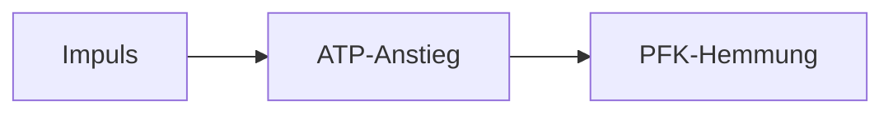
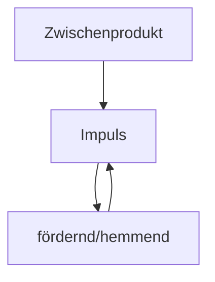

createdt: 13.12.2024 | [updated](https://github.com/jochen-hanisch/research/blob/main/Systemtheorie/Reflexion.md): | [publishd](https://zenodo.org/records/16174315): 10.1.2025 | [Austausch](https://github.com/jochen-hanisch/research/discussions) |  [[Hinweise]]

# Einleitung

Reflexion ist ein zentraler Begriff im Kontext von Lernen, Feedback und Bedeutungskonstruktion. Sie wird als Prozess verstanden, der Wahrnehmung, Bewertung und Integration von Erfahrungen miteinander verbindet und dadurch nachhaltige Lernprozesse ermöglicht. Ziel dieser Arbeit ist es, den Begriff Reflexion umfassend herzuleiten, zu definieren und seine Bedeutung für unterschiedliche Kontexte und Perspektiven darzustellen.  

Die folgende Notiz untersucht Reflexion aus verschiedenen disziplinären Perspektiven, bettet sie in theoretische Modelle ein und zeigt ihre universelle Anwendbarkeit für das Lernen in biologischen, psychischen, sozialen und emergenten Systemen auf.

Reflexion ist zugleich Teil des Dreier-Modells der Elementaroperationen (Feedback – Reflexion – Reentry). Feedback liefert den Differenzimpuls, Reflexion verarbeitet und invertiert ihn, Reentry integriert das Ergebnis in die Systemstruktur. In diesem Sinn ist Reflexion keine isolierte Fähigkeit, sondern die mittlere Elementaroperation einer universalen Schleife, die in allen Systemtypen beobachtbar ist.

# 1 Definition

Der Begriff Reflexion bezieht sich auf den systemischen Prozess, durch den Feedback interpretiert, bewertet und in Bedeutungen umgewandelt wird (Schön, 1983). Er ist durch die Merkmale der Bewusstheit, Multidimensionalität und Transformation gekennzeichnet. Reflexion wird in Kontexten wie Bildung, Psychologie und Systemtheorie verwendet und trägt zu nachhaltigem Lernen, Anpassungsfähigkeit und der Entwicklung von Systemen bei (Hattie & Timperley, 2007).

**Reflexion als Elementaroperation (Operation vs. Prozess):** In der Theorie der Elementaroperationen bezeichnet Reflexion die kleinste nicht weiter zerlegbare Operation, in der ein System auf eigene Zustände zurückwirkt (Feedback → Inversion → Reflexion → Re-Inversion → Reentry). Diese Operation liefert die operative Genese von Selbstbezug. Davon zu unterscheiden ist die prozessuale Form der Reflexion in psychischen Systemen (Günther), die beschreibt, wie diese Operation dort strukturell erscheint (Reflexionsidentität, Zweiwertigkeit, Selbstbruch). Der kleinste gemeinsame Nenner bleibt: ein System bezieht sich auf eigene Operationen und transformiert sie.

**Kleinster gemeinsamer Nenner (KGN) Reflexion:** interne Verarbeitung eines Differenzimpulses ([[Feedback]]) als Selbstbezug zweiter Ordnung; das System transformiert eigene Zustände/Operationen entlang seiner Struktur. Vgl. [[Elementaroperationen]], [[Elementarkommunikation]].

**Größter gemeinsamer Teiler (GGT) Reflexion:** selbstreferenzieller Transformationszyklus zweiter Ordnung mit fünf invarianten Merkmalen, die alle Perspektiven teilen:

1. Differenzimpuls ([[Feedback]]) als Auslöser.
2. Interne Inversion/Bewertung entlang systemeigener Struktur ([[Reflexion]]).
3. Rückführung/Integration des transformierten Ergebnisses in laufende Operation (Re-entry).
4. Strukturkopplung: Zugriff auf eigene Struktur und Möglichkeit ihrer Modifikation (Luhmann, 1984; Günther, 1963/2021).
5. Persistenz: Das System verhält sich danach anders (Lernen/Anpassung).

Damit ist GGT > KGN: Er fordert die vollständige Schleife, expliziten Selbstbezug und bleibende Strukturwirkung (vgl. [[Elementaroperationen]], [[Elementarkommunikation]]).

**Kongruenz/Abgrenzung:** KGN benennt den minimalen Kern (Differenzimpuls + interne Transformation). GGT ergänzt die nötigen Anschlussbedingungen, damit Reflexion empirisch als Lernen/Anpassung nachweisbar wird (Re-entry, Strukturkopplung, Persistenz). Beide sind konsistent: Jeder GGT-Fall enthält den KGN, aber nicht jeder KGN-Fall erfüllt die erweiterten GGT-Bedingungen (z. B. fehlende Persistenz).

# 2 Herleitung

Der Begriff Reflexion hat eine lange Geschichte und wird in verschiedenen Disziplinen unterschiedlich definiert. Diese Herleitung zeigt die historische und interdisziplinäre Entwicklung des Begriffs.

## 2.1 Perspektive: Physik

Die physikalische Perspektive beschreibt Reflexion als eine fundamentale Operation an Grenzflächen zwischen unterschiedlichen Medien. Sie ist die basalste, nicht‑semantische Ausprägung der Elementar‑Operation Reflexion und liefert damit die unterste Ebene der universalen Selbstbezüglichkeit. Physikalische Reflexion entsteht immer dann, wenn ein ausbreitendes Feld (z. B. Licht) auf eine Systemgrenzfläche trifft und dort eine gerichtete Transformation erfährt. Diese Transformation ist nicht psychisch oder sozial, sondern rein strukturell und wird durch die Materialeigenschaften der Grenzfläche bestimmt.

Trotz fehlender Semantik ist dies eine Form von Selbstbezüglichkeit: Die Grenzfläche reagiert entlang ihrer eigenen Struktur (Material, Geometrie) auf einen Impuls und gibt ihn systemtypisch verändert zurück.

### 2.1.1 Grenzflächen, Flächennormale und Einfallsebene

Wie Rupp (2022) herausarbeitet, entsteht physikalische Reflexion ausschließlich an einer inhomogenen Grenzfläche zwischen zwei Medien A und B. Innerhalb der Medien breitet sich Licht geradlinig aus, doch an der Grenzfläche ändert sich sein Verlauf abrupt (Rupp, 2022, S. 29–31). Um dieses Phänomen empirisch reproduzierbar zu beschreiben, werden drei grundlegende Bezugselemente eingeführt:

- **Flächennormale**: eine orthogonale Gerade zur Grenzfläche am Auftreffpunkt des Strahls;  
- **Einfallsebene**: die von einfallendem Strahl und Flächennormalen aufgespannte Ebene;  
- **Drehsinn**: rechtshändige Konvention zur Bestimmung des Vorzeichens der Winkelmessung.

Alle Strahlen – einfallender, reflektierter und transmittierter – liegen in dieser Einfallsebene. Damit wird eine minimale, aber präzise Geometrie geschaffen, die Reflexion als gerichtete Transformation beschreibbar macht.

### 2.1.2 Reflexionsgesetz als elementare Transformationsregel

Das seit der Antike bekannte Reflexionsgesetz lautet:

„Einfallswinkel = Ausfallswinkel“ (Rupp, 2022, S. 30f.).

Gemessen wird stets relativ zur Flächennormale. Entscheidend ist dabei nicht der mathematische Ausdruck, sondern die strukturelle Tatsache. Ein einfallender Impuls trifft auf eine Systemgrenzfläche, und diese Grenzfläche erzwingt eine gerichtete Rücklenkung.

Die physikalische Rücklenkung lässt sich auch formal fassen. Sei $\mathbf{k}$ der Richtungsvektor des einfallenden Strahls und $\mathbf{n}$ die normierte Flächennormale am Auftreffpunkt. Dann ergibt sich der reflektierte Richtungsvektor aus dem klassischen Reflexionsoperator als:

$$
\mathbf{k}' = \mathbf{k} - 2(\mathbf{k} \cdot \mathbf{n})\,\mathbf{n}
\tag{1}
$$

Diese Gleichung zeigt, dass Reflexion eine strukturelle Transformation darstellt. Der einfallende Impuls wird anhand der Systemstruktur (Flächennormale, Material, Geometrie) invertiert und als neuer Impuls zurückgegeben. Damit ist (1) die formal-physikalische Entsprechung der Elementar‑Operation Reflexion. Ein externer Differenzimpuls (Feedback) wird systemintern prozessiert (Reflexion) und in transformierter Form ausgegeben (Reentry, sofern Rückwirkung auf die Quelle entsteht).

Das Medium führt also eine elementare Operation aus, die einer Inversion ähnelt: Der Strahl wird nicht erzeugt, sondern strukturell umgelenkt.

Empirischer Anker: Laser auf Planspiegel, Messung von Einfalls- und Ausfallswinkel mit Goniometer; die Winkeltreue bestätigt, dass die Grenzfläche ihren Zustand (Material/Geometrie) als Operator ausführt.

Für die Theorie der Elementar‑Operationen bedeutet das:

- Die Grenzfläche übernimmt die Rolle des systeminternen Operators.
- Der einfallende Strahl fungiert als Feedback‑Impuls.
- Die Rücklenkung ist die Ausführung der Operation Reflexion in ihrer basalsten Form.

Physikalische Reflexion ist damit weniger eine mathematische Abbildung als vielmehr eine systemische Struktur: Ein System reagiert auf einen externen Impuls, indem es diesen entlang seiner eigenen Struktur anders zurückgibt. Diese Strukturhaftigkeit – nicht die Geometrie an sich – ist der Anschluss an die universale Elementar‑Operation Reflexion.

### 2.1.3 Reguläre, diffuse und strukturierte Reflexion

Harten (2024) unterscheidet drei grundlegende Ausprägungen physikalischer Reflexion:

1. **Diffuse Reflexion**: matte Oberflächen streuen Licht in viele Richtungen; keine gerichtete Rücklenkung.  
2. **Reguläre Reflexion**: glänzende Flächen erzeugen eine klare, winkeltreue Rücklenkung des Strahls; Grenzfall ist der ideale Spiegel (Harten, 2024, S. 313).  
3. **Strukturierte Reflexion**: Lenkung durch Krümmung, z. B. konvexe oder konkave Spiegel, die Öffnungswinkel erweitern oder fokussieren (Harten, 2024, S. 314f.).

Alle diese Formen sind Varianten derselben Operation: ein ausbreitender Impuls trifft auf eine strukturierte Systemgrenzfläche und wird entsprechend ihrer Geometrie transformiert.

### 2.1.4 Bildentstehung: Virtuell und reell

Die physikalische Betrachtung zeigt, dass Reflexion nicht nur Richtungen verändert, sondern auch die **räumliche Zuschreibung von Quellen** beeinflusst:

- **Ebenen Spiegel**: Das reflektierte Bündel erscheint, als komme es von einem Punkt hinter der Oberfläche – ein **virtuelles Bild** (Harten, 2024, S. 314).  
- **Konvexe Spiegel**: Vergrößerung des Öffnungswinkels → verkleinertes virtuelles Bild.  
- **Konkave Spiegel**: Fokussierung kann ein **reelles Bild** erzeugen, an dem das Licht tatsächlich war (Harten, 2024, S. 315).

Diese Bildentstehungen zeigen, dass bereits physikalische Reflexion komplexe Zuordnungsoperationen hervorbringen kann, jedoch ohne Bewusstsein – rein strukturell abgebildet durch die Geometrie des Systems.

### 2.1.5 Physikalische Reflexion und Elementar‑Operationen

Innerhalb der Theorie der Elementar‑Operationen lässt sich physikalische Reflexion präzise verorten:

- **Feedback**: Jeder einfallende Strahl ist ein Differenzimpuls, der das System an seiner Grenzfläche trifft.  
- **Reflexion**: Das System transformiert diesen Impuls deterministisch gemäß Gleichung (1).  
- **Reentry**: Tritt nur dann auf, wenn der Strahl zur Quelle zurückgeführt wird (z. B. Katzenauge, Winkelspiegel), wodurch eine echte Rückwirkung entsteht (Harten, 2024, S. 313f.).

Damit zeigt die Physik die unterste Ebene der universalen Operation Reflexion: ein System verarbeitet einen externen Impuls durch geordnete Transformation seiner Richtung. Reflexion entsteht also nicht „aus sich heraus“, sondern immer auf Grundlage eines vorhergehenden Feedbacks. Physikalische Reflexion bestätigt das axiomatische Prinzip der Elementaroperationen: **Ohne Feedback keine Reflexion.**

### 2.1.6 Physikalische Beweisbarkeit der Elementar‑Operation Reflexion

Die physikalische Optik erlaubt es, die Existenz der Elementar‑Operation Reflexion unabhängig von psychischen, biologischen oder sozialen Prozessen empirisch nachzuweisen. Die Argumentation stützt sich auf drei miteinander verbundene Befunde:

1. **Jede Reflexion setzt einen Differenzimpuls (Feedback) voraus.**  
   Einfallende Strahlung ist ein externer Wirkungsimpuls, der auf eine Systemgrenzfläche trifft. Dieser Impuls erzeugt eine messbare Differenz zwischen Einfall und Ausfall (Rupp, 2022, S. 29–31). Ohne diesen Impuls findet keine Richtungsänderung statt – damit ist das axiomatische Prinzip der Elementar‑Operationen erfüllt: *Ohne Feedback keine Reflexion.*

2. **Die Grenzfläche führt eine systeminterne Transformation aus.**  
   Die Rücklenkung des Strahls folgt nicht dem Strahl selbst, sondern den Materialeigenschaften und der Struktur der Oberfläche (Harten, 2024, S. 313–315). Das System „entscheidet“ nicht psychisch, sondern strukturell, wie der Impuls verarbeitet wird. Diese Transformation ist die minimalistische Realisierung der universalen Operation Reflexion: *Ein System verarbeitet einen externen Impuls entlang seiner eigenen Struktur.*

3. **Die Operation ist reproduzierbar, invariant und systemtypisch.**  
   Die regelmäßige Gültigkeit des Reflexionsgesetzes („Einfallswinkel = Ausfallswinkel“) zeigt, dass Reflexion eine stabile Systemoperation ist, die auf der internen Ordnung der Grenzfläche beruht. Sie tritt unter denselben Bedingungen jederzeit wieder auf – ein starkes empirisches Kriterium für eine universale Elementar‑Operation.

Damit ist die Elementar‑Operation Reflexion auch physikalisch belegbar:  
Sie ist die generative Grundoperation, durch die ein System einen externen Impuls entlang seiner Struktur invertiert oder transformiert. Die Physik liefert damit den Nachweis, dass Reflexion nicht erst in psychischen oder sozialen Systemen entsteht, sondern als basalste Form systemischer Selbstbezüglichkeit bereits im Verhalten von Licht an Grenzflächen empirisch beobachtbar ist.

## 2.2 Perspektive: Chemie

Die chemische Perspektive zeigt, dass Reflexion auch im Bereich chemischer Reaktionssysteme als genuine, nicht‑metaphorische Operation auftritt. Chemische Systeme reagieren nicht nur linear auf äußere Einflüsse, sondern produzieren interne Rückwirkungen, die die weitere Reaktionsdynamik modulieren. Damit verfügen sie über strukturelle Selbstbezüglichkeit, d.h. mit physikalischen, biologischen und psychischen Systemen vergleichbar. Reflexion erscheint hier als reaktive Selbststeuerung chemischer Prozesse, die durch Rückkopplung, Autokatalyse, Inhibition und oszillierende Dynamiken erzeugt wird.

### 2.2.1 Negative Rückkopplung: Chemische Inhibition

Negative chemische Rückkopplung liegt vor, wenn ein Produkt seine eigene Entstehung hemmt. Ein klassisches Beispiel ist der Pasteur‑Effekt: Das bei der Atmung gebildete ATP hemmt das Schlüsselenzym der Glykolyse, die Phosphofructokinase (Bannwarth et al., 2025, S. 225). Das Produkt (ATP) wirkt rück auf die Ursache (Glykolyse), indem es den Fluss der Reaktion drosselt.  

Strukturell entspricht dies der Elementar‑Operation Reflexion:

- Feedback: ATP‑Anstieg als Differenzimpuls,
- Reflexion: Hemmung der PFK durch ATP,
- Reentry: veränderte metabolische Flussrate.

Chemische Inhibition ist damit eine negative Reflexionsform, in der ein System seine eigene Aktivität durch interne Rückwirkung reguliert.

Operator-Kette (Elementar‑Operation):  
- Feedback: $\Delta c_{\text{ATP}}$ durch $u(t)$  
- Reflexion: PFK als Transformationsoperator hemmt Fluss $v_{\text{gly}}(t)$.

Abbildung: Feedback (ATP-Anstieg) triggert die Transformation (PFK-Hemmung).

### 2.2.2 Positive Rückkopplung: Autokatalyse

Autokatalytische Systeme sind klassische Beispiele positiver Rückkopplung. Ein Produkt fördert seine eigene Entstehung, etwa in Reaktionen des Typs:

$$
A + B → 2B \tag{2}
$$

Manfred Eigen beschreibt Autokatalyse als grundlegendes Prinzip der Selbstorganisation chemischer Systeme (Bannwarth et al., 2025). Der Reaktionsverlauf wird verstärkt, indem das System eigene Zwischenprodukte als Impulse nutzt.

Dies bildet eine *positive Reflexionsform* ab:
- Feedback: Produkt B entsteht,
- Reflexion: B katalysiert seine eigene Produktion,
- Reentry: verstärkter Reaktionsfluss.

Autokatalyse ist daher die chemische Entsprechung einer selbstverstärkenden Elementar‑Reflexion.

Operator-Kette (Elementar‑Operation):  
- Feedback: $\Delta c_B > 0$ nach erstem Produkt  
- Reflexion: katalytische Rückwirkung $B$ auf Reaktionsrate $v$.

Abbildung: Produkt B erzeugt einen Differenzimpuls und wirkt katalytisch zurück (Reflexion).

### 2.2.3 Oszillierende Reaktionen und dissipative Muster

Die Belousov‑Zhabotinsky‑Reaktion ist ein paradigmatisches Beispiel chemischer Selbstbezüglichkeit fern des Gleichgewichts: Zwischenprodukte fördern und hemmen sich zyklisch gegenseitig, sodass periodische Farb‑ und Konzentrationsmuster entstehen (Bannwarth et al., 2025, S. 225–226).  

Eine Standarddarstellung (Oregonator) ist:

$$
\begin{aligned}
\mathrm{A} + \mathrm{Y} &\to \mathrm{X} + \mathrm{P} \\
\mathrm{X} + \mathrm{Y} &\to 2\,\mathrm{P} \\
\mathrm{A} + \mathrm{X} &\to 2\,\mathrm{X} + 2\,\mathrm{Z} \\
2\,\mathrm{X} &\to \mathrm{A} + \mathrm{P} \\
\mathrm{B} + \mathrm{Z} &\to \tfrac{1}{2}\,\mathrm{f}\,\mathrm{Y}
\end{aligned}
\tag{3}
$$

Messpraxis: Die Oszillation lässt sich über periodische Farbwechsel (z.B. blau ↔ farblos bei Stärkezusatz) verfolgen; Zeitreihen der Extinktion oder des Redoxpotenzials (Elektrodenmessung) zeigen die zyklischen Rückkopplungen. Damit ist die Reflexionsschleife experimentell direkt sichtbar.

Hier bildet sich eine geschlossene Reflexionsschleife:
- Ein Zwischenprodukt verändert Reaktionsbedingungen,
- diese Änderung wirkt auf den nächsten Schritt zurück,
- der Prozess kehrt zum Ausgangszustand zurück und beginnt erneut.

Prigogines Theorie dissipativer Strukturen zeigt, dass solche Muster nur durch permanente Energiezufuhr stabil bleiben – chemische Systeme erzeugen Reflexionsdynamik als *Nichtgleichgewichtsphänomen*.

Operator-Kette (Elementar‑Operation):  
- Feedback: Zwischenprodukt-Konzentrationen $\Delta c_i(t)$  
- Reflexion: fördernde/hemmende Teilreaktionen als interne Transformation $f(c)$.

Abbildung: Zwischenprodukt-Impulse werden intern transformiert (fördernd/hemmend) und speisen das nächste Feedback.

### 2.2.4 Chemische Inhibition als Informationsrückwirkung

Als weiteres Beispiel beschreibt Krois (2017) die enzymatische Inhibition in der quantitativen Analyse (IC₅₀‑Bestimmung): Ein inhibierender Stoff blockiert die Weiterleitung eines Signals (z.B. TRPM5‑Blockade durch Chinin). Das entstehende Produkt verändert die Signalweiterleitung und damit die Bewertung des initialen chemischen Impulses. Das System moduliert die eigene Reaktionsantwort anhand seiner Produkte – eine typische Reflexionsstruktur.

### 2.2.5 Anschluss an die Elementar‑Operation Reflexion

Damit ist Reflexion auch in chemischen Systemen empirisch beobachtbar und lässt sich als universale Rückbezüglichkeit interpretieren, die nicht an Bewusstsein oder Leben gebunden ist. Entscheidend ist jedoch die strukturelle Kopplung: Chemische Systeme führen dieselbe Operation (Reflexion) aus wie physikalische, biologische und psychische Systeme, jedoch in systemtypischer Form.

Die Kopplung lässt sich präzise fassen:

- **Strukturträger**: In chemischen Systemen übernehmen Enzyme, Energielandschaften, Katalysatoren und Reaktionsnetzwerke dieselbe Rolle wie Grenzflächen in der Physik oder logische Strukturen im psychischen System.  
- **Impulsgenerator**: Konzentrationsänderungen, Zwischenprodukte oder energetische Gradienten erzeugen Differenzimpulse, die funktional identisch zu physikalischen Einfallsimpulsen oder psychischen Wahrnehmungsimpulsen sind.  
- **Transformationsoperator**: Die Reaktionswege, Aktivierungsenergien oder regulatorischen Hemm- bzw. Verstärkungsmechanismen funktionieren als chemische Operatoren, die den Impuls intern verarbeiten.  
- **Reentry**: Jede Veränderung der Reaktionsbedingungen wirkt unmittelbar auf Folgereaktionen zurück und erzeugt damit eine geschlossene Reflexionsschleife.

Chemische Systeme besitzen damit eine strukturelle Kopplung zur Elementar‑Operation Reflexion und nutzen somit eigene Systemstrukturen, um externe oder interne Differenzen aufzunehmen, zu transformieren und in den weiteren Verlauf der Systemdynamik zurückzuführen. Diese operative Gleichform macht die chemische Perspektive zu einem essenziellen Baustein für die universale Theorie der Elementar‑Operationen.

## 2.3 Perspektive: Biologie

Die biologische Perspektive (organismisch und populationsbezogen) zeigt Reflexion als regulatorische Selbstbezüglichkeit: Systeme verarbeiten interne Differenzen, gleichen Abweichungen aus und transformieren Zustände entlang eigener Strukturen. Fokus hier: Variabilität, Regulationsnetzwerke und Oszillation als biologische Grundformen von Reflexionsoperationen.

### 2.3.1 Genetische und phänotypische Variabilität als differenzbasierte Rückkopplung

Komplexe biologische Merkmale wie Körpergröße oder Augenfarbe entstehen durch das Zusammenspiel vieler Gene und Umweltfaktoren. Diese Merkmale variieren kontinuierlich innerhalb einer Population (Sadava et al., 2019, S. 365). Die Variation entsteht durch unterschiedliche Ausprägungen genetischer Aktivität und deren Reaktion auf Umweltbedingungen.

Biologisch zeigt sich hier:

- **Feedback**: genetische und Umweltimpulse erzeugen Differenzen im Phänotyp,
- **Reflexion**: das System reagiert differenziell, indem genregulatorische Netzwerke die Expression modulieren,
- **Reentry**: die resultierenden Phänotypen beeinflussen wiederum Entwicklung, Verhalten und Fitness.

Damit wird Variabilität nicht als zufällige Streuung verstanden, sondern als Ergebnis systemischer Selbstbezüglichkeit. Gene, Regulationsmechanismen und Umweltfaktoren wirken rekursiv aufeinander ein.

Ein einfaches Modell der Genregulation (Hill-Kinetik):

$$
\dot{x} = \frac{d^n}{K^n + d^n} - \gamma x
\tag{4}
$$

### 2.3.2 Regulationsnetzwerke als biologische Reflexionsoperatoren

Biologische Regulationsnetzwerke sind die zentralen Operatoren, durch die lebende Systeme Differenzen aufnehmen, transformieren und in veränderte Zustände zurückführen. Sie erfüllen damit strukturell exakt jene Funktion, die die Elementar‑Operation Reflexion beschreibt: ein System verarbeitet eine interne oder externe Differenz entlang seiner eigenen Struktur.

Regulationsnetzwerke umfassen Genregulationssysteme, Signaltransduktionskaskaden, Hormonsysteme, neuronale Netzwerke und metabolische Kontrollzyklen. Allen gemeinsam ist eine dreistufige Operation:

Mathematisch lässt sich diese Operation als nichtlineares dynamisches System fassen:

$$
\dot{x}(t) = f(x(t), u(t))
\tag{5}
$$

mit internem Zustand $x(t)$, Impuls $u(t)$ (Feedback) und Transformationsoperator $f$ (Reflexion).

**Feedback-Operator**

$$
F: X \times U \to D, \qquad F(x,u) = u - h(x)
\tag{6}
$$

$h(x)$ repräsentiert interne Referenz/Sollwert/Sensorik; $F$ liefert die Differenz $d$.

**Reflexionsoperator**

$$
R: D \times X \to X, \qquad R(d, x) = g(d, x)
\tag{7}
$$

Allgemein:

$$
g(d, x) = \sigma(Ax + Bd)
\tag{8}
$$

mit Netzwerkstruktur $A$, Eingangssensitivität $B$ und nichtlinearer Aktivierung $\sigma$ (z. B. Hill, sigmoid, Heaviside, Rectifier).

**Reentry / Systemdynamik**

$$
x(t+\Delta t) = x(t) + R(F(x(t),u(t)), x(t)) \cdot \Delta t
\tag{9}
$$

Einsetzen ergibt:

$$
\dot{x}(t) = R(F(x(t), u(t)), x(t)) = g(u(t) - h(x(t)),\, x(t))
\tag{10}
$$

Universale Operatorform:

$$
\boxed{\dot{x}(t) = g\big(u(t) - h(x(t)),\, x(t)\big)}
\tag{11}
$$

Abbildung auf die Elementaroperationen:

- Feedback: $d = u - h(x)$
- Reflexion: $g(d,x)$
- Reentry: Dynamik $x(t+\Delta t)$

- **Feedback**: Eine Abweichung wird registriert – Konzentration, Energiezustand, Ligandenbindung, Membranpotenzial oder mechanischer Impuls.
- **Reflexion**: Die Abweichung wird entlang der Systemstruktur verarbeitet. Dies geschieht etwa durch Transkriptionsfaktoren, second messenger, Kinasenkaskaden oder elektrische Aktivierung.
- **Reentry**: Die resultierende Reaktionsantwort verändert den Systemzustand und wirkt damit rück in die Struktur, die die Operation erzeugt hat.

Diese Schleife zeigt sich in allen Regulationsmechanismen:

1. **Genregulationsnetzwerke**  
   Gene werden nicht linear aktiviert, sondern in Abhängigkeit von internen und externen Differenzen. Eine erhöhte Konzentration eines Proteins kann seine eigene Transkription hemmen (negatives Feedback) oder fördern (positives Feedback). Die Genexpression ist somit ein Reflexionsoperator: Sie verarbeitet Differenzen und verändert die Reaktionslage des Systems (Alon, 2019).

2. **Signaltransduktion**  
   Rezeptoren erkennen Liganden oder mechanische Impulse. Die Aktivierung löst eine intrazelluläre Kaskade aus, etwa über Kinasen (MAPK, PI3K). Diese Transformation ist die biologische Entsprechung der Reflexionsoperation: Ein Eingangssignal wird innerhalb der Systemstruktur verarbeitet und invertiert, moduliert oder verstärkt (Lemmon & Schlessinger, 2010).

3. **Metabolische Kontrollzyklen**  
   Metabolismen reagieren auf Energie- oder Substratdifferenzen, etwa in der Regulation von ATP/AMP‑Quotienten. AMP‑aktivierte Proteinkinase (AMPK) fungiert als sensorischer Reflexionsoperator: Sie erkennt ATP‑Mangel und invertiert den metabolischen Fluss hin zu ATP‑Produktion. Dies ist strukturelle Reflexion in Reinform.
   
   $$ 
   \dot{x} = \sigma\big(\alpha\,\text{AMP/ATP} - \theta\big)
   \tag{12}
   $$
   (Hardie et al., 2012)

4. **Neuronale Netzwerke**  
   Neurone integrieren kontinuierlich synaptische Eingänge. Die somatische Summation ist eine biophysikalische Reflexionsoperation: Eingänge (Feedback) werden transformiert (Postsynaptisches Potential), und die resultierende neuronale Antwort wirkt zurück in das Netzwerk (Reentry). Die neuronale Plastizität (LTP/LTD) verstärkt diese Rückwirkung (Dayan & Abbott, 2001).

5. **Hormonsysteme**  
   Hormone werden in Abhängigkeit von systemischen Parametern (z. B. Blutzucker, Stress, Wasserhaushalt) ausgeschüttet. Die hormonelle Antwort verändert die Zielorgane und damit die Systemzustände, die wiederum die Hormonfreisetzung regulieren. Solche endokrinen Rückkopplungen bilden geschlossene Reflexionsschleifen (Guyton & Hall, 2021).

Regulationsnetzwerke erfüllen damit alle strukturellen Merkmale der Elementar‑Operation Reflexion. Sie transformieren Differenzen entlang eigener Systemstrukturen und führen die Ergebnisse in die Systemdynamik zurück. Diese Operation ist universell in der Biologie und bildet die Grundlage aller adaptiven Prozesse lebender Systeme.

Homeostases ist entgegen der ersten Intuition kaum als Reflexion zu verstehen und muss als das beobachtbare Ergebnis solcher Reflexionsketten eingeordnet werden. Feedback und interne Verarbeitung stellen einen Parameter neu ein, die stabile Ausprägung ist der Effekt der zugrunde liegenden Operationen.

### 2.3.3 Biologische Oszillation als zyklische Reflexionsschleife

Viele biologische Prozesse sind oszillatorisch: circadiane Rhythmik, Glykolyse­oszillationen, neuronale Rhythmen. Diese entstehen durch interne Rückkopplungsschleifen, in denen die Produkte eines Schritts den nächsten Schritt modulieren. Sie werden nicht ausschließlich durch Umweltreize erzeugt, sondern beruhen auf endogenen Regelkreisen (Sadava et al., 2019).

Die Oszillation selbst ist eine Reflexionsschleife:

- Feedback: Zustandsänderung im metabolischen oder genetischen Netzwerk,
- Reflexion: Transformation durch regulatorische Mechanismen,
- Reentry: zyklische Rückführung in eine neue Ausgangslage.

### 2.3.4 Biologische Grundlagen von Intuition und heuristischen Entscheidungen

Voland (2013) zeigt, dass viele menschliche Entscheidungen durch evolutionär geformte intuitive Mechanismen gesteuert werden, die schnell, regelhaft und ohne bewusste Reflexion operieren. Intuitionen verbinden externe Informationen mit internen Bewertungsmechanismen (Gaissmaier & Gigerenzer, 2006). Moralische Emotionen wirken als automatische Rückkopplungen, die Verhalten regulieren (Fessler & Haley, 2003; Haidt, 2003).

Strukturell:

- Feedback: Wahrnehmung eines sozialen oder emotionalen Stimulus,
- Reflexion: unbewusste heuristische Verarbeitung,
- Reentry: verhaltensleitende Emotion oder Intuition.

Neurales Integrationsmodell (vereinfachte lineare Form):

$$
\dot{V} = -\frac{1}{\tau}V + \sum_i w_i u_i
\tag{13}
$$

Auch hier zeigt sich: biochemische und neurokognitive Prozesse implementieren die Elementar‑Operation Reflexion vor jeder bewussten Bewertung.

## 2.4 Naturwissenschaftlicher Sockel → systemtheoretische Abstraktion

Die naturwissenschaftlichen Perspektiven – Physik, Chemie und Biologie – zeigen, dass Reflexion als Elementar‑Operation eine grundlegende, systemübergreifende Struktur besitzt: Ein System empfängt einen Differenzimpuls, verarbeitet ihn entlang seiner eigenen Struktur und führt das transformierte Ergebnis in seine Systemdynamik zurück. Diese Operation ist in allen drei Perspektiven nachweisbar, jedoch jeweils in einer systemtypischen Realisationsform.

Physikalische Grenzflächen (Reflexion von Lichtfeldern), chemische Rückkopplungs‑ und Regulationsdynamiken (Inhibition, Autokatalyse, Oszillation) und biologische Regulationsnetzwerke (Genregulation, Signaltransduktion, neuronale Integration) sind keine voneinander unabhängigen Mechanismen. Sie sind Ausprägungen derselben universalen Operation: Feedback → Reflexion → Reentry. Damit liefern die Naturwissenschaften nicht den „Sockel“ im Sinne eines Fundamentes unterhalb der Operation, sondern die empirisch beobachtbaren Realisationsformen der Operation selbst. Die Elementar‑Operation Reflexion ist das eigentliche Fundament, das in unterschiedlichen Systemtypen je eigene Prozessformen hervorbringt.

Mit dem Übergang zu lebenden Systemen tritt zu den biochemischen Regulationsprozessen eine weitere strukturelle Dimension hinzu: Autopoiesis. Lebende Systeme realisieren die Elementar‑Operation Reflexion nicht nur als Reaktion auf Differenzen, sondern als Bestandteil ihres Selbsterhalts. Sie ziehen Systemgrenzen, regulieren Zustände, erzeugen eigene Impulse und formen damit die operative Grundlage ihrer Umweltbeziehungen. Die systemtheoretische Perspektive beginnt nicht „statt“ der Biologie, sondern als nächsthöhere Abstraktionsebene über biologischen Regulationsprozessen. 

Diese Überleitung bildet die Grundlage für die folgenden Abschnitte: Die Elementar‑Operation Reflexion erscheint in lebenden, psychischen und sozialen Systemen nicht als neue Operation, sondern als systemtypische Prozessform derselben universalen Struktur. Damit schlagen die Naturwissenschaften einen konsistenten Bogen zur Systemtheorie, ohne kategoriale Sprünge zu erzwingen: Alle weiteren Prozessformen (Autopoiesis, Bewusstsein, Kommunikation) bleiben Variationen derselben Operation.

## 2.5 Perspektive: Lebende Systeme

Lebende Systeme als Subklasse biologischer Systeme sind durch metabolische Autonomie, Selbsterhalt und eigenständige Grenzziehung (Autopoiesis) charakterisiert. Reflexion meint hier: ein Organismus reagiert auf eigene Zustände und Umweltimpulse so, dass Organisation und Funktion erhalten und angepasst werden.

### 2.5.1 Autopoiesis und Selbsterhalt

- Feedback: metabolische Flüsse, die Differenzen (Energie, Konzentrationen) anzeigen.
- Reflexion: interne Regulation (Enzyme, Membrantransporte, Signalwege) zur Stabilisierung.
- Reentry: angepasster Stoffwechselzustand, der wiederum zukünftige Reaktionen beeinflusst.

### 2.5.2 Sensorische Inversion und Verhalten

- Feedback: sensorische Reize (Schmerz, Temperatur, Licht).
- Reflexion: Inversion in interne Signale, Bewertung und Aktivierung motorischer Programme.
- Reentry: verändertes Verhalten (Flucht, Regulation, Anpassung) verändert Umweltkopplung.

### 2.5.3 Entwicklung und Plastizität

- Feedback: Umwelt- und interne Signale, die Entwicklungspfade modulieren.
- Reflexion: genetisch-regulatorische Programme reagieren adaptiv (z. B. epigenetische Markierung).
- Reentry: veränderte Morphologie/Physiologie beeinflusst weitere Entwicklung und Umweltinteraktion.

## 2.6 Perspektive: Psychische Systeme

### 2.6.1 Teilperspektive Psychologie

In der Psychologie wird Reflexion vor allem in Bezug auf Metakognition untersucht.  
- **John Flavell** (1976): Reflexion ist die Fähigkeit, über die eigenen kognitiven Prozesse nachzudenken, sie zu überwachen und zu steuern.  
- **Entwicklungspsychologie**: Reflexion fördert die Selbstregulation und Identitätsbildung (Zimmerman, 2002).  

Diese Perspektive zeigt, wie Reflexion zu einem besseren Verständnis der eigenen Denkprozesse führt und selbstgesteuertes Lernen ermöglicht.

### 2.6.2 Teilperspektive Philosophie

In der Philosophie wird Reflexion als Prozess des Nachdenkens über die eigenen Gedanken und Handlungen verstanden.  
- **René Descartes** (1641): Reflexion ist die Grundlage des Selbstbewusstseins und des rationalen Denkens (*cogito ergo sum*).  
- **John Locke** (1690): Er unterschied zwischen Sinneserfahrung und Reflexion, die Wissen über mentale Prozesse ermöglicht.  
- **Immanuel Kant** (1781): Reflexion wird als notwendige Fähigkeit des Verstandes betrachtet, um Erfahrungen zu bewerten und Erkenntnisse zu gewinnen.  

Die philosophische Perspektive betont die Rolle von Reflexion als Grundlage für Selbstbewusstsein und Erkenntnisbildung (Kant, 1781).

### 2.6.3 Teilperspektive Günther (transklassische Logik)

Eine für psychische Systeme grundlegende Perspektive liefert Gotthard Günther in *Das Bewußtsein der Maschinen* (Günther, 1963/2021). Günther entwickelt eine transklassische, mehrwertige Logik, in deren Zentrum der Reflexionsprozess als Strukturmoment des Bewusstseins steht. Reflexion wird hier nicht als psychologische Fähigkeit verstanden, sondern als ontologische Zweiwertigkeit des Ich, das niemals vollständig mit sich selbst identisch ist. 

Günthers transklassische Logik beantwortet die Frage, wie Reflexion im psychischen System formal möglich wird: durch eine Logik, die Selbstnegation und gebrochene Identität ausdrücken kann. Für die Theorie der Elementaroperationen liefert er damit die systemtypische Prozessform des psychischen Systems, nicht jedoch die universale Operation selbst.

#### 2.6.3.1 Reflexionsidentität und Zweiwertigkeit

Günther beschreibt, dass ein Ich sich nur durch einen inneren Bruch, also durch die Fähigkeit zur Selbstnegation, konstituieren kann:

> „Kein Ich ist je ganz das, was es ist. Es ist nie völlig identisch mit sich selbst, weil es in sich reflektiert und damit in seiner Identität gebrochen ist.“  
> (Günther, 1963/2021, Seite 46)

Hier entsteht eine strukturelle Spannung zwischen Selbstheit und Nicht‑Selbstheit, die Günther als „Reflexionsidentität“ bezeichnet. Entscheidend ist, dass diese Identitätsform erst im psychischen System auftritt, d.h. biologische Systeme besitzen keine Subjekt‑Objekt‑Relation, sondern nur operative Rückkopplungsprozesse.

#### 2.6.3.2 Reflexion 1., 2. und 3. Ordnung

Auf Seite 51 zeigt Günther anhand seiner logischen Tafeln (I–IV), dass Reflexion in verschiedenen Ordnungen auftreten kann. Die dritte Ordnung („Reflexion auf Reflexion“) überschreitet beide einfachen Reflexionsverhältnisse und bildet eine übergreifende, dreiwertige Struktur, die nicht Wahrheit/Falschheit abbildet, sondern Reflexionsdifferenzen:

> „Sie repräsentiert also ein höheres Reflexionsniveau […] Diese vermittelte Reflexion auf die Reflexion aber ist ‚absolut‘.“  
> (Günther, 1963/2021, Seite 51)

#### 2.6.3.3 Strukturelle Kopplung zur Elementar‑Operation Reflexion

Im Rahmen der Theorie der Elementar‑Operationen lässt sich Günthers Ansatz wie folgt einordnen: Die Operation Reflexion ist eine universelle, systemübergreifende Grundoperation, während Günther die prozessuale Form beschreibt, die diese Operation speziell im Systemtyp *psychisches System* annimmt. Reflexion ist damit systemisch gesehen die kleinste nicht weiter teilbare Operation der Bedeutungsbildung; Günthers „Reflexionsidentität“ zeigt die innere Form dieser Operation im Bewusstsein.

Diese Kopplung ermöglicht eine eindeutige Unterscheidung:

- **Operation Reflexion**: universaler Systemoperator (physikalisch, biologisch, psychisch, sozial).
- **Reflexionsprozess (Günther)**: systemtypische Ausprägung im Bewusstsein, geprägt durch Zweiwertigkeit und Selbstbruch.

Damit erweitert die Elementar‑Operation Reflexion die klassische kybernetische und logiktheoretische Perspektive Günthers, ohne diese zu ersetzen. Sie zeigt, wie Reflexion als Operation entsteht (Feedback → Inversion → Reflexion → Re‑Inversion → Reentry), während Günther die innere logische Struktur dieser Operation liefert.

#### 2.6.3.4 Mathematisch‑logische Beweisführung der strukturellen Kopplung an den Elementaroperator Feedback

Die dreiwertige Reflexionslogik Günthers (Tafeln I–IV) lässt sich modelltheoretisch als strukturell abhängig von einem vorgängigen Differenzoperator darstellen, der durch Feedback erzeugt wird. Damit kann gezeigt werden, dass die Reflexionslogik psychischer Systeme auf der Operation Feedback als universaler Differenzquelle beruht.

**Feedback als Differenzoperator**

Sei ein System $S$ mit Zustandsraum $X$ gegeben. Der Feedback‑Operator

$$
F: X \times U \to X
\tag{14}
$$

führt zu einer Veränderung des Systemzustands. Entscheidend ist die dadurch induzierte Differenz

$$
\Delta_F(x, u) := \delta(x, F(x,u)),
\tag{15}
$$

wobei $\delta$ eine Systemmetrik oder Äquivalenzrelation darstellt. Diese Differenzinformation ist die minimale Voraussetzung für jede Form von Reflexion, denn ohne Differenz gibt es keinen Grund für Inversion, Bewertung oder Reentry.

**Abstrakte Modellierung der Günther‑Logik**

Günther unterscheidet:

- zweiwertige Logiken (Tafeln I und II),  
- eine dreiwertige Reflexionslogik (Tafel III),  
- eine integrierende Logik (Tafel IV), die Reflexionsdifferenzen ausdrückt (Günther, 1963/2021, S. 51).

Formal lässt sich eine dreiwertige Wahrheitsmenge einführen:

$$
T = \{+, -, 0\},
\tag{16}
$$

wobei „0“ den genuin reflexiven Fall der gebrochenen Identität abbildet. Eine Reflexionsdifferenzfunktion

$$
r: B \times B \to T,
\tag{17}
$$

mit $B = \{0,1\}$, klassifiziert Differenzen zwischen zwei Bewertungen. Die dreiwertige Logik ist damit Funktion zweier zweiwertiger Perspektiven.

**Konstruktion der strukturellen Kopplung**

Um den Übergang von Feedback zu Günthers Reflexionswerten zu modellieren, lässt sich eine Abbildung

$$
\Phi: D \to B \times B
\tag{18}
$$

definieren, welche die durch Feedback erzeugte Differenz $\Delta_F(x,u)$ in zwei interne Bewertungen überführt. Damit ergibt sich die Komposition:

$$
R := r \circ \Phi \circ \Delta_F : X \times U \to T.
\tag{19}
$$

Diese Abbildung liefert genau jene Dreiwertigkeit, die Günther als „Reflexionsdifferenz im Bewusstsein“ beschreibt (Günther, 1963/2021, S. 51). Der Feedback‑Operator fungiert hier als strukturelle Voraussetzung, indem er die Differenz liefert, die durch $r$ klassifiziert wird.

**Proposition (strukturelle Kopplung)**

Für jedes System ($S$) mit einem Feedback‑Operator ($F$) existiert eine Abbildung ($\Phi$), so dass eine Günther‑artige Reflexionslogik ($R$) konstruiert werden kann. Damit ist jede dreiwertige Reflexionsdifferenz logisch auf einen durch Feedback erzeugten Differenzimpuls rückführbar.

> [!note] Diese Beweisführung zeigt:
Günthers Reflexionslogik ist die systemtypische Form der durch Feedback induzierten Differenzverarbeitung im psychischen System.
Die Elementar‑Operation Feedback liefert die Differenz; die Operation Reflexion realisiert deren interne Verarbeitung; Günther formalisiert die prozessuale Gestalt dieser Verarbeitung im Bewusstsein.

**Hinweis zur Modellierung:**

Die Existenz von $\Phi: D \to B \times B$ ist schwach gefordert (jede sinnvolle Zuordnung genügt), daher handelt es sich um eine modelltheoretische Rekonstruktion von Günthers Tafeln und absichtlich nicht um eine historische Replikation. Für stärkere Beweisansprüche können zusätzliche Bedingungen an $\Phi$ (z. B. Monotonie, Kontexttreue) eingeführt werden.

| Ebene | Inhalt | Reichweite |
| --- | --- | --- |
| Operation Reflexion | kleinste universale Selbstbezüglichkeit (Feedback → Reflexion → Reentry) | alle Systemtypen (physikalisch, chemisch, biologisch, lebend, psychisch, sozial) |
| Prozessform (Günther) | Reflexionsidentität, Zweiwertigkeit, gebrochene Identität | psychische Systeme |
| Systemvergleich | unterschiedliche Prozessformen derselben Operation | optische Reflexion, reaktive Rückwirkung, autopoietische Schleife, regulativer Selbstbezug, Reflexionsidentität, kommunikative Selbstbeobachtung |

### 2.6.4 Teilperspektive Kybernetik

Die Kybernetik liefert die ersten systematischen Beschreibungen reflexiver Operationen im Sinne von Selbstbezüglichkeit und Rückkopplung. Dabei wird Reflexion nicht als psychologischer Prozess verstanden, sondern als strukturelle Operation eines Systems auf eigene Zustände oder eigene Beobachtung.

#### 2.6.4.1 Norbert Wiener – Rückkopplung als Grundform reflexiver Systeme

Wiener (1948) beschreibt Rückkopplung („feedback“) als die grundlegende Operation, durch die Maschinen und Organismen ihr Verhalten anhand eigener Outputs modifizieren. Obwohl der Begriff Reflexion nicht explizit verwendet wird, stellt Rückkopplung die erste formal beschreibbare Form der Selbstbezüglichkeit dar, die später zur Reflexion zweiter Ordnung weitergeführt wird. Die systemische Logik lautet: Ein System reagiert auf die Wirkung seiner eigenen Aktionen und erzeugt so eine regulierte Veränderung.

#### 2.6.4.2 W. Ross Ashby – Reflexion als Stabilitätsoperator

Ashby (1956) entwickelt das Konzept selbstregulierender Systeme, in denen eine Rückwirkung auf eigene Zustände erfolgt. Er unterscheidet negative und positive Rückkopplung und zeigt, dass jedes stabile System operative Selbstbezüglichkeit benötigt. Reflexion erscheint hier als Transformation eigener Zustände entlang interner Strukturen – eine frühe explizite Form systemischer Reflexion.

#### 2.6.4.3 Heinz von Foerster – Reflexion zweiter Ordnung

Von Foerster (1974, 1981) führt den Begriff „reflexive Systeme“ explizit ein. Reflexion bedeutet hier: Ein System beobachtet sich selbst beim Beobachten. Diese Beobachtung zweiter Ordnung ist der erste präzise kybernetische Reflexionsbegriff. Reflexion wird als Operation verstanden, die die eigene Operation zum Gegenstand macht („self-observing systems“). Die Unterscheidung zwischen Beobachtung erster und zweiter Ordnung macht Reflexion als eigene Systemoperation sichtbar.

#### 2.6.4.4 George Spencer Brown – Re-entry als formalisierte Reflexion

In „Laws of Form“ (1969) beschreibt Spencer Brown die Operation des Re-entry: Eine Form wird in dieselbe Unterscheidung wieder eingeführt, die sie hervorbringt. Re-entry ist formal eine Reflexionsoperation: die Rückführung einer Unterscheidung auf sich selbst. Dies ist die erste logische Formalisierung reflexiver Selbstbezüglichkeit, die später bei Luhmann aufgegriffen wird.

#### 2.6.4.5 Maturana & Varela – Reflexion als autopoietische Selbstbezüglichkeit

In der Autopoiesis-Theorie (1972–1984) beschreiben Maturana und Varela lebende Systeme als operativ geschlossene Einheiten, die ihre eigenen Elemente produzieren. Reflexion erscheint als strukturelle Kopplung innerer Prozesse: Das System verändert sich aufgrund eigener Operationen. Reflexion ist hier keine mentale Fähigkeit, sondern ein systemischer Mechanismus der Selbsterhaltung.

#### 2.6.4.6 Systematische Bedeutung für die Elementar‑Operation Reflexion

Die kybernetische Perspektive zeigt, dass Reflexion als Operation nicht erst im psychischen System entsteht. Kybernetische Modelle liefern die ersten expliziten Beschreibungen reflexiver Selbstbezüglichkeit, die später von Günther formal und von Luhmann soziologisch ausdifferenziert werden. Die Kybernetik bildet damit die historische und konzeptionelle Brücke zwischen naturwissenschaftlichen Rückkopplungsoperationen und bewusstseins‑ bzw. kommunikationstheoretischen Reflexionsprozessen.

### 2.6.5 Teilperspektive Systemtheorie

In der Systemtheorie wird Reflexion als Mechanismus beschrieben, durch den Systeme Feedback verarbeiten.  
- **Niklas Luhmann** (1984): Reflexion ermöglicht es sozialen Systemen, ihre Umwelt zu beobachten und sich selbst daran anzupassen.  
- Reflexion ist hier ein zirkulärer Prozess, der Bedeutungen konstruiert und die Systemstruktur weiterentwickelt.  

Systemtheoretisch ist Reflexion die systemtypische Prozessform der Elementar‑Operationen: Feedback liefert die Differenz, Reflexion verarbeitet sie rekursiv im System, Re‑entry integriert das Ergebnis in die laufende Kommunikation. In sozialen Systemen ist das genau der Übergang von Beobachtung (Feedback) zu Selbstbeobachtung (Reflexion) und weiter zur Strukturänderung (Re‑entry).

Die systemtheoretische Perspektive erweitert den Begriff auf kollektive und adaptive Prozesse in sozialen und emergenten Systemen.

Disziplinübergreifend zeigt sich damit eine strukturelle Gemeinsamkeit: Reflexion ist stets ein Selbstbezug zweiter Ordnung, unabhängig davon, ob sie philosophisch als Bewusstseinsbedingung, psychologisch als Metakognition oder systemtheoretisch als rekursive Selbstbeschreibung gefasst wird. Diese gemeinsame Struktur wird im psychischen System (Bewusstsein) durch Günther formal präzisiert.

### Reflexion

Reflexion bezeichnet eine Form zweiter Ordnung: Ein System bezieht sich nicht nur auf Wirkungen, sondern auf die eigene Beobachtung dieser Wirkungen. Dies impliziert eine interne Differenzierung: Das System entwickelt eine Struktur, die zwischen Operation und Selbstbezug unterscheidet. In Luhmanns Theorie ist Reflexion die Voraussetzung für Selbstbeschreibung.

Mathematisch schlägt sich Reflexion in der Dynamik des Operators

$$
e^{-i H t} \tag{20}
$$

nieder. Der Ausdruck beschreibt eine zeitabhängige Transformation, die nicht extern aufgeprägt wird, sondern vom [[Interdependenzoperator]] $H$ abhängt – einem Maß für die interne Kopplungsstruktur des Systems. Die Verwendung von $e^{-iHt}$ dient hier als abstrakte, nicht-physikalische Analogie für interne Zustandsdynamik; sie soll nicht als physikalische Definition von Reflexion verstanden werden. Diese Transformation lässt sich nicht umkehren, ohne Bezug auf die interne Struktur zu nehmen. Reflexion ist somit keine externe Betrachtung, sondern ein struktureller Bestandteil der Wahrscheinlichkeitsdynamik selbst.

## 2.7 Beispiele

- **Physikalisch**: Optische Reflexion – Licht trifft auf eine Oberfläche und wird an diese zurückgeworfen; die Operation ist eine unmittelbare Rückführung des Outputs auf das System.
- **Chemisch**: Reaktive Rückwirkungen – ein Reaktionsprodukt verändert die weitere Reaktionsgeschwindigkeit (autokatalytische oder inhibierende Effekte).
- **Biologisch**: Hormonelle Regelkreise (z. B. Hypothalamus‑Hypophysen‑Achse) als Reflexionsvorgang; Homöostase ist der resultierende Effekt.
- **Lebend**: Sensorische Inversion – ein Organismus invertiert einen Reiz (Schmerz, Temperatur) in regulatives Verhalten.
- **Psychisch**: Eine Lehrkraft reflektiert Unterricht und passt Methoden an (Schön, 1983) – Reflexionsidentität als Form. Zudem: Eine Person ringt mit widersprüchlichen Selbstzuschreibungen („Ich bin kompetent“ vs. „Ich habe versagt“) und erlebt die Zweiwertigkeit des Selbst als gebrochene Identität (Günther).
- **Sozial**: Organisation evaluiert eigene Kommunikationsmuster und ändert Entscheidungsprozesse (kommunikative Selbstbeobachtung).
- **Technisch/KI**: Reinforcement-Learning-Agent passt Policy nach Reward-Feedback an; Reflexion als Anpassung des internen Modells.

Alle Beispiele erfüllen den KGN (Differenzimpuls + interne Transformation). Der GGT ist erfüllt, wenn Re-entry/Strukturkopplung/Persistenz belegbar ist: physikalisch nur im Rückführungsfall (Katzenauge), chemisch/biologisch/lebend durch regulatorische Setpoints, psychisch durch veränderte Selbst-/Handlungsprogramme, sozial durch beschlossene Strukturänderungen, technisch durch persistente Policy-Updates.

# 3 Folgerungen

Die Folgerungen ergeben sich direkt aus der Elementaroperations-Schleife ([[Feedback]] → [[Reflexion]] → [[Re-entry]]): Ohne Differenzimpuls keine interne Verarbeitung, ohne Reflexion keine Bewertung, ohne Re-entry keine Integration. In der Bildung zeigt sich das als metakognitive Lernschleife: Lernende erhalten Rückmeldung, reflektieren sie bewusst (Schön, 1983; Hattie & Timperley, 2007) und führen sie als angepasstes Handeln wieder ein. Damit erklärt die Theorie, warum reine Rückmeldung ohne Reflexion nur kurzfristig wirkt und warum Reflexion ohne Re-entry verpufft – erst die Kombination stabilisiert Lernen ([[Elementaroperationen]], [[Elementarkommunikation]]).

Soziale Systeme reproduzieren Sinn über Kommunikation und Selbstbeobachtung. Reflexion bezeichnet hier die Beobachtung der eigenen Beobachtung (Luhmann, 1984) und ist auf fortlaufendes Feedback aus Umwelt und internen Kommunikationen angewiesen. Re-entry beschreibt die Wiedereinführung reflexiver Unterscheidungen in laufende Kommunikation; ohne diesen Schritt bleiben Einsichten folgenlos. Damit wird verständlich, warum Organisationen nur dann adaptiv bleiben, wenn Feedback institutionalisiert, Reflexion kollektiv ermöglicht und Re-entry strukturell gesichert ist (z. B. Qualitätszirkel, Reviews; vgl. [[Beobachtung dritter Ordnung]], [[Professionalisierung]]).

Für technische/KI-Systeme ist die Schleife formal abbildbar: In Reinforcement Learning fungiert Reward als Feedback, das Modellupdate als Reflexion und die neue Policy als Re-entry in die Umweltinteraktion (Dayan & Abbott, 2001). Dieselbe Struktur gilt für dynamische Regelungen oder adaptive Simulationen ([[Systemsimulation]]): Ohne explizite Reflexionsschicht bleiben Modelle statisch, ohne Re-entry wirken Updates nicht auf das Verhalten.

Elementaroperations-Architektur: Die Theorie begründet, warum Reflexion immer eingebettet ist und nicht als isolierte Fähigkeit existiert. Der kleinste gemeinsame Nenner bleibt: System verarbeitet eigenen Differenzimpuls (Feedback), transformiert ihn (Reflexion) und führt das Ergebnis in die eigene Operation zurück (Re-entry). Der größte gemeinsame Teiler konkretisiert dies als minimale dreigliedrige Lern- und Änderungs-Schleife, die systemtypisch ausdifferenziert wird (psychisch: metakognitiv; sozial: kommunikativ; technisch: algorithmisch). Damit ist Reflexion zugleich notwendige Bedingung für nachhaltige Anpassung und hinreichende Erklärung für beobachtbare Stabilitätsgewinne in unterschiedlichen Systemtypen.

# 4 Implikationen

Die Implikationen der Elementaroperations-Schleife ([[Feedback]] → [[Reflexion]] → [[Re-entry]]) erstrecken sich auf mehrere Praxisfelder. In der Bildung lässt sich die Wirksamkeit von Feedback nur dann entfalten, wenn es metakognitiv verarbeitet und in Handlung übersetzt wird (Hattie & Timperley, 2007; Schön, 1983; Flavell, 1976). Reflexion fungiert dabei als bewusste Inversion des Differenzimpulses, Re-entry als erneute Einführung der Einsicht in das eigene Lernen. Curricula und Unterrichtsdesigns, die diese Schleife systematisch vorsehen, erhöhen Transfer und Selbststeuerung ([[Elementaroperationen]], [[Elementarkommunikation]]).

In sozialen Systemen und Organisationen markiert Reflexion den Übergang von Beobachtung erster zu zweiter Ordnung (Luhmann, 1984). Nur wenn Rückmeldungen strukturell verankert, reflexiv ausgewertet und über Re-entry in Entscheidungsprozesse zurückgeführt werden, entstehen belastbare Anpassungsleistungen (z. B. Qualitätszirkel, Retrospektiven; vgl. [[Beobachtung dritter Ordnung]], [[Professionalisierung]]). Ohne diesen Zyklus bleiben Feedbacks folgenlos oder erzeugen nur lokale Korrekturen ohne Strukturwirkung.

Technische und KI-Systeme benötigen dieselbe Schleifenlogik: In Reinforcement Learning liefert der Reward das Feedback, das Modellupdate bildet die Reflexion, und die angepasste Policy wirkt als Re-entry auf das Verhalten in der Umwelt (Dayan & Abbott, 2001). In adaptiven Simulationen oder Regelungen ([[Systemsimulation]]) gilt analog: Ohne explizite Reflexionsschicht stagnieren Modelle; ohne Re-entry erreichen Updates keine operative Ebene. Die Theorie erklärt damit, warum kontinuierliche Optimierung technisch nur gelingt, wenn alle drei Operationen explizit modelliert und gekoppelt sind.

# 5 Kritik

Die Theorie adressiert Reflexion als universale Operation, birgt aber Grenzen und offene Flanken. Erstens ist Reflexion ressourcenintensiv: Zeit, Aufmerksamkeit und kognitive Kapazität sind begrenzt (Moon, 1999). Ohne strukturelle Entlastung (z. B. Phasen, Werkzeuge) bleibt die Schleife [[Feedback]] → [[Reflexion]] → [[Re-entry]] oft unvollständig. Zweitens kann Überreflexion zu Entscheidungsparalyse führen (Dewey, 1910), wenn Bewertungszyklen länger dauern als die Handlungsspielräume erlauben; das gilt besonders in Organisationen, die hoher Umweltkomplexität ausgesetzt sind ([[Beobachtung dritter Ordnung]]).

Drittens bestehen systemtypische Grenzen: In sozialen Systemen hängt der Erfolg reflexiver Programme von Anschlusskommunikation ab (Luhmann, 1984); ohne Re-entry bleiben Einsichten folgenlos. In technischen Kontexten wird Reflexion oft in Optimierungspipelines gepresst, wobei die semantische Tiefe auf Parameterupdate schrumpft; hier fehlt die Breite intentionaler Bewertung (vgl. [[Systemsimulation]]). Viertens: Philosophische Modelle (Kant, Hegel, Husserl) liefern starke Bewusstseins- und Dialektikbegriffe, aber keine operative Genese; Günther fokussiert die Prozessform im psychischen System. Die universale Operation bleibt damit erklärungsbedürftig – [[Elementaroperationen]] und [[Elementarkommunikation]] beanspruchen diese Lücke zu schließen, müssen jedoch empirisch weiter geprüft werden (Falsifizierbarkeit: Nachweis von Systemen ohne Feedback/Reflexion/Re-entry steht aus).

Schließlich ist die Balance von Minimalität und Spezifizität heikel: Der kleinste gemeinsame Nenner darf die Operation nicht trivialisieren; der größte gemeinsame Teiler darf sie nicht überdehnen. Die hier gewählte Dreigliederung (Differenzimpuls, interne Transformation, Reintegration) braucht weitere Validierung in unterschiedlichen Domänen (Labor, Feld, Simulation) und über Systemtypen hinweg (physikalisch, biologisch, psychisch, sozial, technisch). Ohne solche Prüfungen bleibt die Universalitätsbehauptung programmatisch.

# 6 Zusammenfassung

Reflexion ist die mittlere Operation der Elementaroperations-Schleife ([[Feedback]] → [[Reflexion]] → [[Re-entry]]) und beschreibt den systemischen Selbstbezug zweiter Ordnung: Ein System verarbeitet Differenzimpulse entlang eigener Struktur und führt das transformierte Ergebnis in die eigene Operation zurück. Der kleinste gemeinsame Nenner ist damit: interne Transformation eines eigenen Differenzimpulses; der größte gemeinsame Teiler präzisiert drei Schritte – Differenz, Inversion/Bewertung, Reintegration ([[Elementaroperationen]], [[Elementarkommunikation]]).

Die universale Operation nimmt systemtypische Prozessformen an: physikalisch als Grenzflächeninversion, biologisch als Regulation, lebend als autopoietische Schleife, psychisch als Reflexionsidentität (Günther, 1963/2021), sozial als kommunikative Selbstbeobachtung (Luhmann, 1984), technisch als modellbasiertes Update (Dayan & Abbott, 2001). Diese Differenzierung verbindet Genese (Operation) und Form (Prozess) und erklärt, warum Reflexion sowohl empirisch beobachtbar als auch formal anschlussfähig bleibt. Ihre Relevanz liegt darin, Lernen, Anpassung und Selbstbeschreibung in allen Systemtypen minimal zu begründen und zugleich disziplinspezifisch auszuprägen.

# Quellen

- Ashby, W. R. (1956). *An Introduction to Cybernetics*. Chapman & Hall.
- Bateson, G. (1972). *Steps to an Ecology of Mind*. Chandler.
- Brown, G. Spencer. (1969). *Laws of Form*. Allen & Unwin.
- Dayan, P., & Abbott, L. F. (2001). *Theoretical Neuroscience: Computational and Mathematical Modeling of Neural Systems*. MIT Press.
- Dewey, J. (1910). *How We Think*. Boston: D.C. Heath.  
- Flavell, J. H. (1976). Metacognitive aspects of problem solving. *The Nature of Intelligence*, 12(1), 231–235.
- Günther, Gotthard. (2021). Das Bewußtsein der Maschinen: Eine Metaphysik der Kybernetik. (2. Aufl. (1963)). Klostermann.
- Guyton, A. C., & Hall, J. E. (2021). *Textbook of Medical Physiology* (14. Aufl.). Elsevier.
- Hattie, J., & Timperley, H. (2007). The power of feedback. *Review of Educational Research*, 77(1), 81–112.  
- Hardie, D. G., Ross, F. A., & Hawley, S. A. (2012). AMPK: a nutrient and energy sensor that maintains energy homeostasis. *Nature Reviews Molecular Cell Biology*, 13(4), 251–262.
- Kant, I. (1781). *Kritik der reinen Vernunft*. Berlin: De Gruyter.  
- Lemmon, M. A., & Schlessinger, J. (2010). Cell signaling by receptor tyrosine kinases. *Cell*, 141(7), 1117–1134.
- Maturana, H. R., & Varela, F. J. (1980). *Autopoiesis and Cognition: The Realization of the Living*. D. Reidel.
- von Foerster, H. (1984). *Observing Systems*. Intersystems.
von Foerster, H. (1974). *Cybernetics of Cybernetics*. University of Illinois / Biological Computer Laboratory.
- Shannon, C. E., & Weaver, W. (1949). *The Mathematical Theory of Communication*. University of Illinois Press.
- Luhmann, N. (1984). *Soziale Systeme: Grundriss einer allgemeinen Theorie*. Frankfurt am Main: Suhrkamp.  
- Wiener, N. (1948). *Cybernetics: Or Control and Communication in the Animal and the Machine*. MIT Press.
- Schön, D. A. (1983). *The Reflective Practitioner: How Professionals Think in Action*. New York: Basic Books.  

- Bannwarth, H., Kremer, B. P., & Schulz, A. (2025). *Basiswissen Physik, Chemie und Biochemie: Vom Atom bis zur Atmung – für Biologen, Mediziner, Pharmazeuten und Agrarwissenschaftler*. Springer Berlin Heidelberg. https://doi.org/10.1007/978-3-662-70696-1  
- Krois, D. (2017). *Organisch-chemische Methoden*. Springer Berlin Heidelberg. https://doi.org/10.1007/978-3-662-53013-9

- Sadava, D., Hillis, D. M., Heller, H. C., & Hacker, S. D. (2019). *Purves Biologie* (J. Markl, Hrsg.). Springer Berlin Heidelberg. https://doi.org/10.1007/978-3-662-58172-8  
- Voland, E. (2013). *Soziobiologie*. Springer Berlin Heidelberg. https://doi.org/10.1007/978-3-642-34541-8
