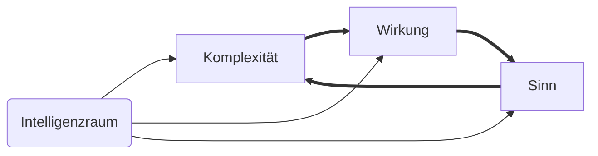
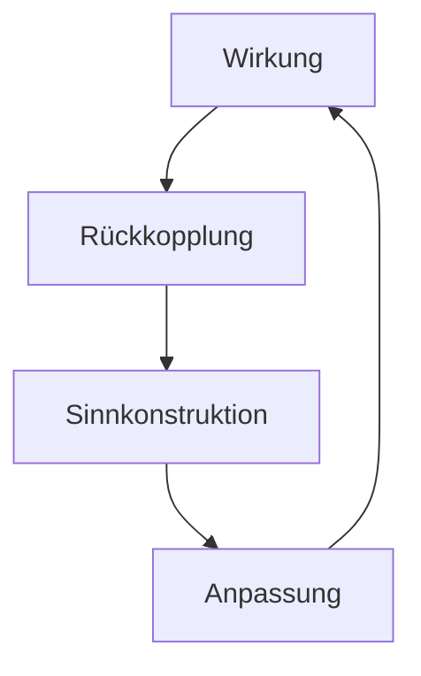

created: 9.1.2025 | updated: 11.4.2025 | [publishd](https://www.researchgate.net/publication/390799442_Systemintelligenz_Eine_systemtheoretisch-transdisziplinare_Analyse_von_Wirkung_Komplexitat_und_Sinnkonstruktion): 15.4.2025 | [[Hinweise]]

**Systemintelligenz: Eine systemtheoretisch-transdisziplinäre Analyse von Wirkung, Komplexität und Sinnkonstruktion**

# Zusammenfassung

Diese Arbeit entwickelt eine systemtheoretische Definition von Intelligenz, die Intelligenz als selbstreferentielle Sinnkonstruktion der Wirkung eines Systems in der interdependenten Komplexität seiner Umwelt beschreibt. Im Gegensatz zu klassischen Modellen, die Intelligenz primär als kognitive Fähigkeit oder statische Eigenschaft betrachten, betont dieser Ansatz die dynamische Anpassungsfähigkeit und Sinnstiftung intelligenter [[Systeme]]. Die Definition integriert die Dimensionen Wirkung, interdependente Komplexität und Selbstreferenz, um Intelligenz als emergentes und kontextabhängiges Phänomen zu analysieren.

Die Herleitung basiert auf einer systemtheoretisch-transdisziplinären Methode, die Elemente der Systemtheorie, Kybernetik, Soziologie, Psychologie und Künstlicher Intelligenz miteinander verknüpft. Mit dieser Methode wird der sogenannte Intelligenzraum entwickelt, ein dreidimensionales Modell, das Wirkung, Komplexität und Sinn als zentrale Faktoren intelligenter [[Systeme]] darstellt. Ergänzt durch eine zeitliche Komponente, beschreibt dieses Modell Intelligenz als dynamisches Volumen, das die Entwicklung und Anpassungsfähigkeit von Systemen abbildet. Die Arbeit zeigt, wie dieses Modell auf physikalische, chemische, biologische, psychische, soziale und [[Emergente [[Systeme]]]] angewendet werden kann.

Die praktischen Implikationen umfassen neue Ansätze für Bildung, die Entwicklung künstlicher Intelligenz, die Persönlichkeitsentwicklung sowie die Analyse und Steuerung sozialer und ökologischer [[Systeme]]. Durch die Fokussierung auf Sinnkonstruktion und Selbstreferenz bietet die Definition eine Grundlage für ethische Überlegungen und die Gestaltung werteorientierter intelligenter [[Systeme]]. Abschließend diskutiert die Arbeit die Herausforderungen und Potenziale der Definition und zeigt Wege zur weiteren Forschung und Anwendung auf.

# Einleitung

Die vorliegende Arbeit befasst sich mit einer grundlegenden Neuinterpretation des Begriffs der Intelligenz im Rahmen einer systemtheoretischen Perspektive. Klassische Modelle, die Intelligenz als Fähigkeit zur Problemlösung oder zur Reproduktion gelernter Muster definieren, stoßen an methodische und konzeptionelle Grenzen. Dies zeigt sich insbesondere in der Normierung von Intelligenztests, die oft nur kulturell geprägte Fähigkeiten messen und universelle Aussagen über Intelligenz treffen wollen. Ein solches Vorgehen führt nicht nur zu selektiven und reduktiven Ergebnissen, sondern blendet auch die Vielfalt intelligenter [[Systeme]] aus.

Das Erkenntnisinteresse dieser Arbeit liegt nicht nur in der theoretischen Fundierung einer neuen Intelligenzdefinition, sondern auch in ihrer praktischen Anwendbarkeit. Ziel ist es, Intelligenz in unterschiedlichen Kontexten – von biologischen und psychischen bis hin zu sozialen und technologischen Systemen – beschreibbar und beobachtbar zu machen, ohne dabei auf normative Vergleichsmaßstäbe zurückzugreifen. Dieser Ansatz eröffnet neue Möglichkeiten für die Bewertung von Intelligenz in Bildung, Arbeitswelt und Technologieentwicklung, die über den klassischen Intelligenzquotienten hinausgehen.

Die zentrale Frage dieser Untersuchung ist daher: Wie kann Intelligenz als emergentes, dynamisches und selbstreferentielles Phänomen beschrieben und beobachtet werden? Dabei wird Intelligenz nicht länger als statisches Merkmal verstanden, sondern als die Fähigkeit eines Systems, sinnhaft auf seine Umwelt zu wirken und diese Wirkung in zukünftige Handlungen zu integrieren. Diese Perspektive basiert auf [[Elementaroperationen]], [[Elementarkommunikation]] und struktureller Kopplung, die als grundlegende Bausteine für die Selbstorganisation und Anpassung von Systemen gelten.

Von zentraler Bedeutung ist dabei der [[Elementarraum]], der die rekursiv-dynamische Grundstruktur systemischer Intelligenz formalisiert. Er beschreibt die interne, prozesshafte Realität intelligenter [[Systeme]] und steht in komplementärer Beziehung zur beobachtbaren Systemintelligenz. Während der Elementarraum die operative Genese intelligenter Strukturen modelliert, macht die Systemintelligenz deren epistemische Wirksamkeit sichtbar und messbar.

Beide Räume sind nicht identisch, aber funktional aufeinander bezogen. Der Elementarraum erzeugt die Bedingungen, unter denen sich intelligente Systemdynamik entfalten kann, während der Intelligenzraum deren strukturelle Kohärenz und Stabilität bewertet. Erst durch dieses Zusammenspiel – von operativer Erzeugung und epistemischer Beobachtung – wird Intelligenz als emergente Leistung systemisch verstehbar.

Die Methode dieser Arbeit ist systemtheoretisch und transdisziplinär angelegt. Sie verbindet Konzepte aus der Systemtheorie, der Kybernetik und der modernen Intelligenzforschung, um ein umfassendes Modell des sogenannten "Intelligenzraums" zu entwickeln. Dieser Ansatz ermöglicht es, Intelligenz nicht mehr als eindimensionale Skala, sondern als dreidimensionalen Raum zu analysieren, der durch die Dimensionen Komplexität, Wirkung und Sinn charakterisiert ist. Die Einführung einer zeitlichen Komponente als vierte Dimension erweitert diesen Raum zu einem dynamischen Hypervolumen, das die Entwicklung und Anpassungsfähigkeit intelligenter [[Systeme]] abbildet.

Die Arbeit gliedert sich in mehrere Abschnitte, die systematisch die Herleitung der Definition von Intelligenz, die Modellierung des Intelligenzraums sowie die Ableitung praktischer Implikationen darstellen. Dabei wird ein starker Fokus auf die Verknüpfung theoretischer Grundlagen mit praxisorientierten Überlegungen gelegt, um ein kohärentes und innovatives Modell zu entwickeln. Dieses Modell soll nicht nur die Komplexität und Dynamik intelligenter [[Systeme]] abbilden, sondern auch eine fundierte Grundlage für Anwendungen in Bildung, Technologie und sozialen Kontexten schaffen.

# 1 Definition

Intelligenz ist die selbstreferentielle Sinnkonstruktion der Wirkung eines Systems in der interdependenten Komplexität seiner Umwelt.

Sie manifestiert sich in der Fähigkeit eines Systems, sinnhafte Wirkungen zu erzeugen, auf [[Feedback]] zu reflektieren und diese in zukünftige Handlungen zu integrieren:

- Selbstreferenz beschreibt die Fähigkeit eines Systems, sich auf sich selbst zu beziehen, indem es eigene Handlungen, Strukturen und Wirkungen beobachtet und bewertet. Sie bildet die Grundlage für die [[Reflexion]] und die dynamische Anpassung eines Systems.
- Sinnkonstruktion bezeichnet den inneren Prozess eines Systems, durch den Handlungen und Wirkungen als bedeutsam interpretiert werden. Dieser Sinn entsteht durch die Interaktion mit der Umwelt und ist eng mit der Zielorientierung des Systems verbunden.
- Wirkung beschreibt die Veränderung oder Rückwirkung, die ein System durch seine Handlungen in seiner Umwelt erzeugt. Sie ist ein Indikator dafür, wie gut ein System mit den Anforderungen seiner Umwelt interagiert und diese beeinflusst.
- Interdependente Komplexität bezeichnet die wechselseitige Abhängigkeit und Beeinflussung zwischen einem System und seiner Umwelt. Intelligenz manifestiert sich in der Fähigkeit eines Systems, mit dieser Komplexität umzugehen, sie zu reduzieren oder zu nutzen, um Stabilität und Anpassung zu gewährleisten.

# 2 Herleitung

Im Gegensatz zu klassischen Intelligenzmodellen, die Intelligenz primär als Fähigkeit zur Problemlösung, Mustererkennung oder Reproduzierbarkeit von Wissen betrachten, basiert die entwickelte Definition auf einer systemtheoretischen Perspektive. Diese Perspektive versteht Intelligenz nicht als statische Eigenschaft, sondern als dynamischen Prozess, der durch die Wechselwirkung eines Systems mit seiner Umwelt entsteht. Intelligenz wird dabei als die Fähigkeit definiert, sinnvolle Wirkungen zu erzeugen, auf [[Feedback]] zu reflektieren und Handlungen entsprechend anzupassen.

Die Grundlage dieser Definition bildet die Integration der drei zentralen Dimensionen: Komplexität, Wirkung und Sinn. Komplexität beschreibt die Herausforderungen und interdependenten Beziehungen, die ein System bewältigen muss, um stabil und adaptiv zu bleiben. Wirkung bezieht sich auf die Fähigkeit eines Systems, Veränderungen in seiner Umwelt oder innerhalb seiner eigenen Struktur herbeizuführen, die auf ein Ziel oder eine Sinnkonstruktion ausgerichtet sind. Sinn schließlich ist die interne Konstruktion von Bedeutungen, die einem System Orientierung und Handlungsfähigkeit verleihen. Diese drei Dimensionen bilden zusammen die Grundlage dafür, Intelligenz als emergente Eigenschaft dynamischer [[Systeme]] zu verstehen.

Klassische Modelle wie der Intelligenzquotient (IQ) oder kognitive Intelligenztests basieren oft auf universellen Normen und standardisierten Aufgabenstellungen. Sie messen jedoch primär die Fähigkeit, bekannte Muster zu reproduzieren oder definierte Probleme zu lösen. Dabei bleiben zentrale Aspekte wie die Anpassungsfähigkeit an komplexe Umwelten und die Fähigkeit zur Selbstreflexion unberücksichtigt. Im Gegensatz dazu berücksichtigt die entwickelte Definition die Interaktion zwischen einem System und seiner Umwelt sowie die Rolle von Selbstreferenz und Sinnkonstruktion in der Intelligenzbildung. Dies ermöglicht eine differenziertere Betrachtung, die über reproduzierbare Fähigkeiten hinausgeht und die Dynamik intelligenter [[Systeme]] in den Vordergrund stellt.

Diese Herleitung legt die Grundlage für eine Neudefinition von Intelligenz, die sich auf systemische Prinzipien wie Autopoiesis, strukturelle Kopplung und emergente Ordnung stützt. Sie zeigt, dass Intelligenz als dynamisches und kontextabhängiges Phänomen verstanden werden muss, das durch die Fähigkeit zur selbstreferentiellen Sinnkonstruktion geprägt ist.

## 2.1 Naturwissenschaftliche Perspektive

Die naturwissenschaftliche Perspektive bildet die Grundlage für das Verständnis von Intelligenz in physikalischen, chemischen und biologischen Systemen. Sie untersucht die grundlegenden Mechanismen, die diesen Systemen zugrunde liegen, und zeigt, wie aus physikalischen und chemischen Prozessen komplexe Strukturen entstehen können, die die Basis für Intelligenz bilden.

Physikalische [[Systeme]] schaffen durch ihre Interaktionen stabile und dynamische Zustände, die es ermöglichen, Energieflüsse zu optimieren und Ordnung in einem chaotischen Umfeld herzustellen. Chemische [[Systeme]] erweitern diese Grundlage durch die Fähigkeit zur Selbstorganisation und Transformation, wodurch sie komplexe molekulare Strukturen und Netzwerke erzeugen können. Biologische [[Systeme]] integrieren diese Mechanismen, um autopoietische Prozesse zu ermöglichen, die für die Selbstorganisation, Anpassung und Fortpflanzung notwendig sind.

Die naturwissenschaftliche Perspektive zeigt, dass Intelligenz nicht als isolierte Eigenschaft betrachtet werden kann, sondern aus den fundamentalen Interaktionen und Prozessen hervorgeht, die in physikalischen, chemischen und biologischen Systemen stattfinden. Sie liefert die Bausteine für höhere Ebenen der Intelligenz, wie sie in lebenden, psychischen und sozialen Systemen zu finden sind, und bildet damit eine unverzichtbare Grundlage für die Herleitung der Definition.

### 2.1.1 Physikalische Ebene

Die physikalische Ebene bildet die Grundlage für die Herleitung der Definition von Intelligenz, da sie die grundlegenden Prinzipien und Gesetzmäßigkeiten beschreibt, aus denen komplexere [[Systeme]] hervorgehen. Intelligenz, wie sie in unserer Definition beschrieben wird, als selbstreferentielle Sinnkonstruktion der Wirkung eines Systems in der interdependenten Komplexität seiner Umwelt, findet ihre Ursprünge in physikalischen Prozessen, die auf Energieerhaltung, Stabilität und Dynamik basieren.

Physikalische [[Systeme]] beeinflussen ihre Umwelt durch Wechselwirkungen, die durch fundamentale Gesetze wie die Erhaltung der Energie und das Prinzip der geringsten Wirkung gesteuert werden (Feynman, 1963). Diese Gesetze beschreiben, wie [[Systeme]] Energieflüsse optimieren, um stabile Zustände zu erreichen oder dynamische Prozesse aufrechtzuerhalten. Die Wirkung eines physikalischen Systems zeigt sich in der Veränderung oder Stabilisierung von Zuständen, die sowohl innerhalb des Systems als auch in seiner Umwelt auftreten.

Beispielsweise minimiert ein physikalisches System wie ein Pendel seine potenzielle Energie, um einen stabilen Zustand zu erreichen. Dieser Prozess ist ein Ausdruck von Wirkung, da das System auf äußere Kräfte reagiert und diese so ausgleicht, dass ein Gleichgewicht entsteht (Haken, 1983).

Physikalische [[Systeme]] existieren nicht isoliert, sondern stehen in einer wechselseitigen Beziehung zu ihrer Umwelt. Diese [[Interdependenz]] wird besonders in offenen Systemen sichtbar, in denen Materie und Energie mit der Umgebung ausgetauscht werden (Prigogine & Stengers, 1984). Ein Beispiel hierfür ist die Thermodynamik, in der physikalische Prozesse durch die Interaktion mit äußeren Parametern wie Temperatur oder Druck beeinflusst werden.

Diese [[Interdependenz]] bildet die Grundlage für die Komplexität physikalischer [[Systeme]]. [[Systeme]] in komplexen Umgebungen müssen kontinuierlich auf Veränderungen reagieren, um ihre Integrität zu bewahren. Dies zeigt sich in der Fähigkeit physikalischer [[Systeme]], sich an wechselnde Umweltbedingungen anzupassen und stabile oder dynamische Zustände zu erzeugen.

Obwohl physikalische [[Systeme]] keine bewusste Selbstreferenz besitzen, weisen sie Mechanismen auf, die als Grundlage für selbstreferentielle Prozesse interpretiert werden können. Ein Beispiel ist die Rückkopplung in chaotischen Systemen, bei denen kleinste Änderungen innerhalb des Systems erhebliche Auswirkungen auf die Gesamtstruktur haben können (Lorenz, 1963). Diese Rückkopplung ermöglicht es physikalischen Systemen, auf äußere Störungen zu reagieren und interne Prozesse anzupassen.

Die physikalische Ebene liefert die elementaren Grundlagen für die in der Definition beschriebenen Elemente:  

1. **Wirkung:** Die Fähigkeit physikalischer [[Systeme]], durch Energieflüsse und Wechselwirkungen Veränderungen zu bewirken, bildet die Basis für höhere Formen von Intelligenz.  
2. **Interdependente Komplexität:** Die wechselseitige Beziehung zwischen physikalischen Systemen und ihrer Umwelt schafft die notwendige Grundlage für die Anpassungsfähigkeit komplexerer [[Systeme]].  
3. **Grundlage für Sinnkonstruktion:** Obwohl physikalische [[Systeme]] keine bewusste Sinnkonstruktion durchführen, stellen sie durch ihre Stabilität und Dynamik die Grundlage für höhere selbstreferentielle Prozesse in biologischen und lebenden Systemen bereit.

Die physikalische Ebene trägt entscheidend zur Herleitung der Definition bei, indem sie die grundlegenden Mechanismen liefert, auf denen komplexere [[Systeme]] aufbauen. Sie zeigt, wie Intelligenz in der Fähigkeit zur Wirkung und Anpassung an interdependente Komplexität wurzelt. Damit stellt die physikalische Ebene die Grundlage für die [[Emergenz]] selbstreferentieller Intelligenz in höheren Systemen dar.

### 2.1.2 Chemische Ebene

Die chemische Ebene erweitert die physikalischen Grundlagen, indem sie die Fähigkeit zur strukturellen Organisation und Transformation integriert. Chemische [[Systeme]] sind gekennzeichnet durch die Bildung und Umwandlung von Molekülen, die dynamische Anpassungen an Umweltbedingungen ermöglichen. Diese Prozesse stellen die Grundlage für die höheren Ebenen biologischer und lebender [[Systeme]] dar.

Chemische [[Systeme]] erzeugen Wirkung durch Reaktionen, die neue molekulare Verbindungen schaffen oder bestehende Strukturen verändern. Diese Reaktionen sind von Faktoren wie Temperatur, Druck und Konzentrationen abhängig und dienen der Optimierung energetischer Zustände. Ein Beispiel ist die Katalyse, bei der chemische Reaktionen durch Enzyme oder andere Katalysatoren beschleunigt werden, um spezifische Wirkungen effizienter zu erzeugen (Atkins & de Paula, 2014).

Chemische [[Systeme]] zeigen Intelligenz in ihrer Fähigkeit, durch molekulare Anpassungen stabilere oder energetisch günstigere Zustände zu erreichen. Diese Wirkungen sind nicht selbstreferentiell im klassischen Sinne, bilden jedoch die Grundlage für die [[Emergenz]] selbstorganisierender Prozesse.

Chemische [[Systeme]] existieren in einer wechselseitigen Beziehung zu ihrer Umgebung, die ihre Dynamik und Stabilität bestimmt. Sie reagieren auf äußere Einflüsse wie Temperatur oder pH-Wert, um sich an veränderte Bedingungen anzupassen. Diese [[Interdependenz]] zeigt sich beispielsweise in Puffersystemen, die Schwankungen des pH-Werts ausgleichen, um ein stabiles chemisches Milieu zu erhalten (Lehninger, Nelson & Cox, 2017).

Die Komplexität chemischer [[Systeme]] wird durch die Anzahl und Vielfalt der möglichen Wechselwirkungen bestimmt. Netzwerke chemischer Reaktionen, wie sie in Stoffwechselwegen oder chemischen Gleichgewichten auftreten, stellen die Grundlage für die komplexen Interaktionen in biologischen und lebenden Systemen dar.

Während chemische [[Systeme]] keine bewusste Selbstreferenz besitzen, zeigen sie Ansätze von Selbstorganisation, die als Vorstufe intelligenter Prozesse interpretiert werden können. Ein Beispiel hierfür ist die Entstehung von chemischen Oszillationen wie der Belousov-Zhabotinsky-Reaktion, bei der chemische [[Systeme]] periodische Zustandsänderungen durchlaufen, ohne dass externe Steuerung erforderlich ist (Nicolis & Prigogine, 1977).

Solche oszillierenden Reaktionen sind in der Lage, Informationen über den aktuellen Zustand des Systems zu speichern und zu nutzen, um die Dynamik des Systems zu regulieren. Diese Fähigkeit bildet die Grundlage für die Entwicklung höherer selbstreferentieller Prozesse in biologischen Systemen.

Die chemische Ebene trägt entscheidend zur Herleitung der Definition von Intelligenz bei, indem sie die grundlegenden Mechanismen für Wirkung und [[Interdependenz]] bereitstellt:

1. **Wirkung:** Chemische [[Systeme]] beeinflussen ihre Struktur und Umwelt aktiv durch Reaktionen, die Stabilität und Funktionalität ermöglichen.
2. **Interdependente Komplexität:** Die Wechselwirkungen zwischen chemischen Systemen und ihrer Umgebung stellen eine Voraussetzung für Anpassungs- und Optimierungsprozesse dar.
3. **Grundlage für Selbstreferenz:** Durch Selbstorganisation und dynamische Regulation in chemischen Systemen entstehen die Bedingungen für die [[Emergenz]] selbstreferentieller Prozesse.

Die chemische Ebene liefert die operative Grundlage für die Elemente der Definition von Intelligenz. Sie zeigt, wie [[Systeme]] durch Wechselwirkungen mit ihrer Umwelt Wirkung erzeugen und gleichzeitig auf deren Komplexität reagieren können. Diese Ebene bildet den Übergang von physikalischen Prozessen zu biologischen und lebenden Systemen, in denen Selbstreferenz und Sinnkonstruktion eine zentrale Rolle spielen.

### 2.1.3 Biologische Ebene

Die biologische Ebene baut auf den Prinzipien der physikalischen und chemischen Ebenen auf und erweitert diese um die Fähigkeit zur Selbstorganisation und Autopoiesis. Biologische [[Systeme]] sind dadurch gekennzeichnet, dass sie sich aktiv organisieren, erhalten und reproduzieren können, um ihre Existenz und Funktionalität in einer komplexen und wechselhaften Umwelt zu sichern.

Biologische [[Systeme]] erzeugen Wirkungen, die sowohl auf interne Stabilität als auch auf externe Anpassung abzielen. Diese Wirkungen zeigen sich in Prozessen wie Zellteilung, Signaltransduktion oder Stoffwechselregulation. Ein Beispiel ist die Homöostase, die die Fähigkeit eines Organismus beschreibt, ein internes Gleichgewicht trotz äußerer Schwankungen aufrechtzuerhalten (Cannon, 1929). 

Durch ihre Handlungen beeinflussen biologische [[Systeme]] nicht nur ihre eigene Struktur, sondern auch die Umwelt, in der sie agieren. So verändern Pflanzen durch Photosynthese ihre Umgebung, indem sie Kohlendioxid aufnehmen und Sauerstoff freisetzen. Diese Wechselwirkungen zeigen, dass biologische [[Systeme]] in der Lage sind, auf Basis interner Prozesse externe Wirkungen hervorzurufen, die für ihre Existenz förderlich sind.

Biologische [[Systeme]] existieren in einer hochgradig vernetzten und komplexen Umwelt. Diese [[Interdependenz]] zeigt sich in der Wechselwirkung zwischen Organismen und ihren ökologischen Nischen. Zum Beispiel beeinflusst ein Räuber nicht nur die Beutepopulation, sondern auch die Struktur des gesamten Ökosystems, in dem er lebt. Diese dynamischen Wechselwirkungen sind eine Voraussetzung für die Anpassungsfähigkeit biologischer [[Systeme]].

Die Fähigkeit biologischer [[Systeme]], diese Komplexität zu erkennen und sich ihr anzupassen, zeigt sich in evolutiven Prozessen, bei denen durch Mutation und Selektion neue Merkmale entstehen, die die Überlebensfähigkeit des Systems erhöhen (Darwin, 1859).

Im Gegensatz zu physikalischen und chemischen Systemen besitzen biologische [[Systeme]] eine explizite Selbstreferenz. Sie sind in der Lage, interne Prozesse zu überwachen und anzupassen. Dies wird durch Mechanismen wie die Genregulation oder die Zellkommunikation ermöglicht, bei denen Signale innerhalb des Systems verarbeitet werden, um geeignete Reaktionen hervorzurufen (Alberts et al., 2015). Selbstreferenz ist somit ein zentraler Bestandteil biologischer [[Systeme]] und bildet die Grundlage für höhere Formen von Intelligenz.

Die biologische Ebene trägt wesentlich zur Herleitung der Definition von Intelligenz bei, indem sie die Fähigkeit zur Wirkung, [[Interdependenz]] und Selbstreferenz in einem einzigen System integriert:

1. **Wirkung:** Biologische [[Systeme]] beeinflussen ihre Umwelt aktiv, um ihre Existenz zu sichern.  
2. **Interdependente Komplexität:** Die Wechselwirkungen mit der Umwelt sind dynamisch und erfordern kontinuierliche Anpassung.  
3. **Selbstreferenz:** Biologische [[Systeme]] überwachen ihre eigenen Prozesse und reagieren auf interne und externe Veränderungen.

Die biologische Ebene zeigt, wie Intelligenz als dynamische Anpassung und Stabilität in einer komplexen und interdependenten Umwelt entsteht. Sie legt den Grundstein für psychische und soziale [[Systeme]], indem sie die Grundlage für Selbstorganisation, [[Reflexion]] und Anpassungsfähigkeit schafft.

## 2.2 Systemtheoretische Perspektive

Die systemtheoretische Perspektive betrachtet Intelligenz als Eigenschaft, die aus der Interaktion und Selbstorganisation von Systemen entsteht. Diese Sichtweise betont, dass Intelligenz nicht isoliert in einzelnen Entitäten liegt, sondern aus den dynamischen Prozessen hervorgeht, die ein System innerhalb seiner Umwelt entwickelt. [[Systeme]] zeichnen sich durch ihre Fähigkeit zur Selbstreferenz, Sinnkonstruktion und Anpassung aus, wobei sie gleichzeitig durch komplexe Wechselwirkungen mit ihrer Umwelt geprägt sind.

Die systemtheoretische Perspektive unterscheidet zwischen verschiedenen Systemebenen, von lebenden über psychische bis hin zu sozialen und emergenten Systemen. Jede dieser Ebenen besitzt spezifische Eigenschaften, die zur Herleitung der Definition von Intelligenz beitragen. Lebende [[Systeme]] bilden die Grundlage für Autopoiesis und Anpassung, psychische [[Systeme]] erweitern diese Fähigkeiten um bewusste Sinnkonstruktion und [[Reflexion]], und soziale [[Systeme]] ermöglichen kollektive Intelligenz durch Kommunikation. [[Emergente [[Systeme]]]] integrieren schließlich Komponenten aller Ebenen und erzeugen durch ihre Interaktionen neue Eigenschaften, die über die Fähigkeiten der Einzelsysteme hinausgehen.

Die systemtheoretische Perspektive liefert eine umfassende Grundlage für die Definition von Intelligenz, indem sie deren zentrale Elemente – Wirkung, interdependente Komplexität und Selbstreferenz – in den Kontext dynamischer [[Systeme]] stellt. Diese Perspektive zeigt, dass Intelligenz nicht als statische Eigenschaft verstanden werden kann, sondern als ein Prozess, der sich durch die kontinuierliche Interaktion eines Systems mit seiner Umwelt entfaltet.

### 2.2.1 Lebende [[Systeme]]

Lebende [[Systeme]] unterscheiden sich von der naturwissenschaftlichen Ebene durch ihre Fähigkeit zur Autopoiesis, also der Selbsterschaffung und -erhaltung ihrer Strukturen und Funktionen. Diese Eigenschaft ermöglicht es ihnen, sich aktiv an ihre Umwelt anzupassen, indem sie eigene Prozesse steuern und verändern. Lebende [[Systeme]] zeichnen sich zudem durch eine ausgeprägte [[Interdependenz]] mit ihrer Umwelt aus, was sie in hohem Maße dynamisch und flexibel macht. Diese Fähigkeit zur Anpassung und Organisation bildet die Grundlage für die in der Definition beschriebene Intelligenz.

Lebende [[Systeme]] erzeugen Wirkung durch die aktive Interaktion mit ihrer Umwelt. Ein zentrales Prinzip ist die Homöostase, die beschreibt, wie lebende [[Systeme]] ein inneres Gleichgewicht aufrechterhalten, indem sie Veränderungen in der Umwelt registrieren und darauf reagieren. Beispielsweise regulieren lebende Organismen Temperatur, pH-Wert oder Energiezufuhr, um ihre Funktionalität zu sichern. Diese Wechselwirkungen zeigen, dass lebende [[Systeme]] nicht nur reaktiv, sondern proaktiv auf Umweltbedingungen eingehen können. Diese proaktiven Anpassungen sind Ausdruck der in der Definition verankerten Fähigkeit, Wirkung in einer interdependenten Umwelt zu erzeugen.

Interdependente Komplexität ist ein zentrales Merkmal lebender [[Systeme]]. Sie sind in der Lage, externe Einflüsse zu nutzen, um interne Prozesse zu steuern und ihre Umwelt aktiv zu gestalten. Die Interaktion zwischen einem lebenden System und seiner Umwelt ist dabei wechselseitig: Während das System von externen Bedingungen wie Temperatur, Licht oder Nährstoffverfügbarkeit beeinflusst wird, übt es durch Stoffwechselprozesse, Fortbewegung oder andere Aktivitäten ebenfalls Einfluss auf seine Umwelt aus. Diese Dynamik macht lebende [[Systeme]] zu adaptiven und komplexen Akteuren in ihrem jeweiligen Kontext.

Ein weiteres wesentliches Merkmal lebender [[Systeme]] ist ihre Fähigkeit zur Selbstreferenz. Lebende [[Systeme]] überwachen kontinuierlich ihre eigenen Prozesse und passen diese an interne und externe Veränderungen an. Sie speichern Informationen über ihre Umwelt und verwenden diese, um zukünftige Entscheidungen zu treffen. Diese Selbstreferenz zeigt sich auf molekularer Ebene, etwa in der Genregulation, bei der bestimmte Gene je nach Umweltbedingungen ein- oder ausgeschaltet werden, oder auf organismischer Ebene, etwa im Verhalten von Organismen, die ihre Bewegungen an Umweltbedingungen anpassen.

Die Herleitung der Definition von Intelligenz aus der Perspektive lebender [[Systeme]] basiert auf den drei zentralen Elementen der Definition. Lebende [[Systeme]] erzeugen Wirkung, indem sie ihre Umwelt beeinflussen und gestalten. Sie navigieren durch interdependente Komplexität, indem sie ihre Strukturen und Prozesse an wechselnde Bedingungen anpassen. Schließlich nutzen sie ihre Fähigkeit zur Selbstreferenz, um Informationen über ihre Umwelt zu sammeln und ihre Handlungen darauf abzustimmen. Diese Eigenschaften zeigen, dass lebende [[Systeme]] die Grundbedingungen für Intelligenz erfüllen, wie sie in der Definition beschrieben ist.

Die Bedeutung lebender [[Systeme]] für die Definition von Intelligenz liegt darin, dass sie eine Brücke zwischen chemischen Prozessen und höheren, psychischen und sozialen Systemen bilden. Sie integrieren grundlegende Prinzipien wie Wirkung und Komplexität und erweitern diese um selbstreferentielle und adaptive Fähigkeiten. Damit bilden sie die Grundlage für die Entwicklung komplexer Formen von Intelligenz, die in höheren Systemen wie sozialen oder emergenten Systemen noch weiter ausgeprägt sind.

### 2.2.2 Psychische [[Systeme]]

Psychische [[Systeme]] unterscheiden sich von lebenden Systemen durch ihre Fähigkeit zur Konstruktion von Sinn und Bewusstsein. Diese [[Systeme]] sind autopoietisch und operieren ausschließlich im Bereich von Gedanken, Vorstellungen und Emotionen. Sie sind dadurch gekennzeichnet, dass sie ihre eigene Realität schaffen, indem sie Erfahrungen verarbeiten, interpretieren und in Bedeutungen umwandeln. Intelligenz in psychischen Systemen manifestiert sich in der Fähigkeit, auf dieser Basis Handlungen und Entscheidungen zu treffen, die sowohl auf interne Prozesse als auch auf externe Anforderungen abgestimmt sind.

Psychische [[Systeme]] erzeugen Wirkung, indem sie externe Reize interpretieren und diese in interne mentale Prozesse übersetzen. Diese Wirkung wird nicht unmittelbar in physischen oder chemischen Reaktionen sichtbar, sondern zeigt sich in der Art und Weise, wie psychische [[Systeme]] ihre Umwelt wahrnehmen und auf diese reagieren. Beispielsweise nimmt ein psychisches System durch Aufmerksamkeit bestimmte Aspekte der Umwelt wahr und blendet andere aus. Diese selektive Wahrnehmung ist zentral für die Sinnkonstruktion, da sie bestimmt, welche Reize als bedeutsam verarbeitet werden und welche ignoriert werden.

Interdependente Komplexität ist ein wesentliches Merkmal psychischer [[Systeme]], da diese sowohl mit der physischen Realität als auch mit sozialen Systemen in ständiger Wechselwirkung stehen. Ein psychisches System ist auf Reize aus der Umwelt angewiesen, interpretiert diese jedoch auf Basis seiner eigenen inneren Strukturen und Prozesse. Gleichzeitig beeinflusst das psychische System durch seine Handlungen die Umwelt, aus der es neue Reize und [[Feedback]] erhält. Diese dynamische [[Interdependenz]] macht psychische [[Systeme]] flexibel und anpassungsfähig in komplexen Kontexten.

Ein zentraler Aspekt psychischer [[Systeme]] ist ihre ausgeprägte Selbstreferenz. Psychische [[Systeme]] reflektieren nicht nur ihre Umwelt, sondern auch sich selbst, indem sie ihre eigenen Gedanken, Emotionen und Handlungen beobachten und bewerten. Dieser Prozess der Selbstreflexion ermöglicht es ihnen, ihre Strukturen und Strategien kontinuierlich zu modifizieren und anzupassen. Selbstreferenz ist somit die Grundlage für die Fähigkeit psychischer [[Systeme]], aus Erfahrungen zu lernen und sich weiterzuentwickeln.

Die Herleitung der Definition von Intelligenz aus der Perspektive psychischer [[Systeme]] zeigt, dass diese [[Systeme]] die in der Definition beschriebenen Elemente auf einer höheren Komplexitätsebene umsetzen. Sie erzeugen Wirkung, indem sie ihre Wahrnehmung und Handlungen auf ihre Umwelt abstimmen. Sie navigieren durch interdependente Komplexität, indem sie Reize aus der Umwelt verarbeiten und diese in interne Bedeutungen umwandeln, die wiederum Handlungen beeinflussen. Schließlich nutzen sie ihre Fähigkeit zur Selbstreferenz, um diese Prozesse zu reflektieren und kontinuierlich zu verbessern.

Die Bedeutung psychischer [[Systeme]] für die Definition von Intelligenz liegt darin, dass sie die Grundlage für soziale [[Systeme]] bilden. Während lebende [[Systeme]] physische und chemische Prozesse integrieren, erweitern psychische [[Systeme]] diese um die Fähigkeit zur Sinnkonstruktion, [[Reflexion]] und bewussten Entscheidungsfindung. Diese Eigenschaften machen sie zu einem zentralen Bindeglied zwischen individuellen und kollektiven Formen von Intelligenz.

### 2.2.3 Soziale [[Systeme]]

Soziale [[Systeme]] unterscheiden sich von psychischen Systemen durch ihre operative Basis: Sie bestehen aus Kommunikationsprozessen und nicht aus biologischen oder psychischen Elementen. Soziale [[Systeme]] sind autopoietisch, da sie durch Kommunikation ihre eigene Struktur reproduzieren und aufrechterhalten. Intelligenz in sozialen Systemen zeigt sich in ihrer Fähigkeit, auf Basis von Interaktionen zwischen Individuen Sinn zu konstruieren und kollektive Handlungen zu koordinieren.

Soziale [[Systeme]] erzeugen Wirkung, indem sie die Handlungen und Entscheidungen ihrer Mitglieder koordinieren und strukturieren. Diese Wirkung ist nicht auf das Verhalten einzelner Personen zurückzuführen, sondern auf die Gesamtdynamik des Systems, das durch Kommunikationsprozesse entsteht. Beispielsweise entwickelt ein Team in einem Unternehmen eine gemeinsame Strategie, indem es Informationen austauscht, Entscheidungen trifft und diese umsetzt. Die Wirkung zeigt sich in der Fähigkeit des Systems, kollektive Ziele zu erreichen, die von den individuellen Fähigkeiten der Mitglieder allein nicht realisiert werden könnten.

Interdependente Komplexität ist ein zentrales Merkmal sozialer [[Systeme]], da diese durch ihre wechselseitigen Beziehungen zu psychischen Systemen und ihrer Umwelt geprägt sind. Soziale [[Systeme]] sind sowohl von der Teilnahme und Interaktion einzelner Personen abhängig als auch von den strukturellen und kulturellen Bedingungen, in denen sie operieren. Diese [[Interdependenz]] ermöglicht es sozialen Systemen, flexibel auf Veränderungen in ihrer Umwelt zu reagieren und neue Formen der Organisation zu entwickeln. Sie zeigt sich beispielsweise in der Anpassungsfähigkeit von Organisationen an wirtschaftliche oder technologische Veränderungen.

Ein wesentliches Merkmal sozialer [[Systeme]] ist ihre Fähigkeit zur Selbstreferenz. Soziale [[Systeme]] sind in der Lage, ihre eigenen Kommunikationsprozesse zu beobachten und zu reflektieren. Diese [[Reflexion]] ermöglicht es ihnen, ihre Strukturen und Handlungsweisen kontinuierlich anzupassen und zu optimieren. Ein Beispiel ist die Selbstbeobachtung eines Unternehmens, das durch interne Analysen Schwächen in seiner Organisation identifiziert und daraufhin neue Strategien entwickelt. Diese Selbstreferenz ist die Grundlage für die Fähigkeit sozialer [[Systeme]], nicht nur auf ihre Umwelt zu reagieren, sondern auch proaktiv neue Formen der Organisation und Zusammenarbeit zu schaffen.

Die Herleitung der Definition von Intelligenz aus der Perspektive sozialer [[Systeme]] zeigt, dass diese [[Systeme]] die zentralen Elemente der Definition in einem kollektiven Kontext umsetzen. Soziale [[Systeme]] erzeugen Wirkung durch die Koordination und Steuerung kollektiver Handlungen. Sie navigieren durch interdependente Komplexität, indem sie die Beziehungen zwischen ihren Mitgliedern und ihrer Umwelt organisieren. Schließlich nutzen sie ihre Fähigkeit zur Selbstreferenz, um ihre Kommunikationsprozesse zu beobachten und anzupassen, wodurch sie ihre Stabilität und Anpassungsfähigkeit bewahren.

Die Bedeutung sozialer [[Systeme]] für die Definition von Intelligenz liegt darin, dass sie kollektive Formen von Sinnkonstruktion und Handlung ermöglichen. Während psychische [[Systeme]] individuelle Sinnkonstruktion und [[Reflexion]] betonen, erweitern soziale [[Systeme]] diese Fähigkeiten auf die Ebene der Gruppe oder Gemeinschaft. Diese kollektive Intelligenz bildet die Grundlage für [[Emergente [[Systeme]]]], in denen soziale und technische Komponenten miteinander interagieren.

### 2.2.4 Emergente [[Systeme]]

[[Emergente [[Systeme]]]] zeichnen sich dadurch aus, dass sie neue, nicht vorhersehbare Eigenschaften oder Verhaltensweisen zeigen, die aus der Interaktion zwischen verschiedenen Komponenten entstehen. Diese [[Systeme]] können physische, biologische, psychische und soziale Elemente integrieren und erzeugen durch ihre Dynamik und Komplexität Eigenschaften, die auf keiner einzelnen Ebene vollständig erklärbar sind. Intelligenz in emergenten Systemen zeigt sich in ihrer Fähigkeit, durch die Wechselwirkung ihrer Bestandteile kohärente und adaptive Strukturen zu schaffen.

[[Emergente [[Systeme]]]] erzeugen Wirkung, indem sie die Eigenschaften und Fähigkeiten ihrer Komponenten zu einem übergeordneten, neuen Systemzustand kombinieren. Diese Wirkung ist nicht die bloße Summe der Einzelteile, sondern ergibt sich aus den Interaktionen und Rückkopplungsprozessen innerhalb des Systems. Beispielsweise kann ein Mensch-KI-System in der Lage sein, Probleme zu lösen, die weder der Mensch noch die KI allein bewältigen könnten. Diese kollektive Wirkung ist ein wesentliches Merkmal emergenter Intelligenz.

Interdependente Komplexität ist das grundlegende Kennzeichen emergenter [[Systeme]]. Sie entstehen in Umfeldern, in denen unterschiedliche [[Systeme]] miteinander interagieren, wie in Mensch-Maschine-Interaktionen oder in komplexen ökologischen Netzwerken. Die Komponenten eines emergenten Systems sind wechselseitig voneinander abhängig und beeinflussen sich dynamisch. Diese [[Interdependenz]] macht [[Emergente [[Systeme]]]] hochgradig flexibel und adaptiv, aber auch anfällig für Störungen, da Veränderungen in einer Komponente Auswirkungen auf das gesamte System haben können.

Selbstreferenz in emergenten Systemen zeigt sich in der Fähigkeit, sich selbst als Einheit wahrzunehmen und auf Basis dieser Wahrnehmung zu agieren. Diese Selbstreferenz entsteht durch die Rückkopplungsprozesse zwischen den Komponenten des Systems. In Mensch-Maschine-Interaktionen etwa kann das System durch maschinelles Lernen und menschliche Steuerung kontinuierlich neue Strategien entwickeln, die auf vorherige Erfahrungen aufbauen. Diese Fähigkeit zur Selbstreferenz ermöglicht es emergenten Systemen, sich dynamisch an ihre Umwelt anzupassen und ihre Strukturen zu optimieren.

Die Herleitung der Definition von Intelligenz aus der Perspektive emergenter [[Systeme]] verdeutlicht, dass diese [[Systeme]] die zentralen Elemente der Definition auf einer Metaebene umsetzen. Sie erzeugen Wirkung, indem sie durch die Kombination ihrer Komponenten neue Lösungen und Strategien entwickeln. Sie navigieren durch interdependente Komplexität, indem sie die Beziehungen zwischen ihren Bestandteilen und ihrer Umwelt dynamisch anpassen. Schließlich nutzen sie ihre Fähigkeit zur Selbstreferenz, um ihre Strukturen und Prozesse zu optimieren und kontinuierlich neue Eigenschaften hervorzubringen.

Die Bedeutung emergenter [[Systeme]] für die Definition von Intelligenz liegt in ihrer Fähigkeit, unterschiedliche Systemebenen zu integrieren und neue Formen von Sinnkonstruktion und Anpassung zu ermöglichen. Während soziale [[Systeme]] kollektive Intelligenz innerhalb einer bestimmten Ebene fördern, erweitern [[Emergente [[Systeme]]]] diese Fähigkeit, indem sie Komponenten verschiedener Ebenen miteinander verbinden. Sie sind damit ein zentraler Ausgangspunkt für zukünftige Entwicklungen in Bereichen wie Mensch-KI-Kollaboration, adaptive Netzwerke und komplexe ökologische [[Systeme]].

### 2.3 Synthese der Perspektiven

Die Synthese der naturwissenschaftlichen und systemtheoretischen Perspektiven zeigt, dass Intelligenz als universelles Prinzip verstanden werden kann, das sich durch alle Ebenen hindurchzieht, von physikalischen Prozessen bis hin zu komplexen emergenten Systemen. Intelligenz manifestiert sich in diesem Kontext als die Fähigkeit eines Systems, auf Basis seiner internen Struktur und der Interaktion mit der Umwelt Wirkung zu erzeugen, interdependente Komplexität zu bewältigen und Sinn zu konstruieren.

Ein zentraler Aspekt dieser Synthese ist das Verständnis von Intelligenz als dynamisches Phänomen, das in unterschiedlicher Ausprägung auf verschiedenen Systemebenen existiert. Die physikalischen, chemischen und biologischen Ebenen bilden die Grundlage für die Entstehung lebender, psychischer und sozialer [[Systeme]]. Diese erweitern die Basisprozesse um Mechanismen der Selbstreferenz und Sinnkonstruktion, die in emergenten Systemen schließlich zu neuen Eigenschaften und Fähigkeiten führen können.

Die Übergänge zwischen den Ebenen sind durch Interdependenzen gekennzeichnet. Physikalische und chemische [[Systeme]] schaffen stabile energetische und strukturelle Bedingungen, die für die Entwicklung biologischer [[Systeme]] notwendig sind. Biologische [[Systeme]] nutzen diese Grundlagen, um autopoietische Prozesse zu entwickeln, die wiederum die Basis für psychische und soziale [[Systeme]] bilden. Auf jeder Ebene entstehen durch diese Interdependenzen neue Formen der Anpassung und Organisation, die die zentrale Rolle von Intelligenz in der Bewältigung komplexer Umweltbedingungen unterstreichen.

Ein wesentliches Anliegen der Synthese ist die Integration der drei zentralen Elemente der Definition: Wirkung, interdependente Komplexität und Selbstreferenz. Wirkung ist auf allen Ebenen präsent, von der physikalischen Optimierung von Energieflüssen bis hin zu den bewussten Handlungen in psychischen und sozialen Systemen. Die Bewältigung interdependenter Komplexität zeigt sich in der Fähigkeit von Systemen, auf wechselnde Umweltbedingungen zu reagieren und gleichzeitig ihre eigene Stabilität zu sichern. Selbstreferenz ist in physikalischen und chemischen Systemen nur rudimentär vorhanden, entwickelt sich jedoch in lebenden und psychischen Systemen zu einem zentralen Mechanismus, der Anpassung und Sinnkonstruktion ermöglicht.

[[Emergente [[Systeme]]]] verdeutlichen die Synthese der Perspektiven, indem sie Eigenschaften und Fähigkeiten entwickeln, die auf keiner einzelnen Ebene vollständig erklärbar sind. Sie integrieren physikalische, chemische, biologische und soziale Komponenten und erzeugen durch ihre Dynamik neue Formen von Intelligenz, die in Mensch-Maschine-Systemen oder ökologischen Netzwerken sichtbar werden. Diese [[Systeme]] zeigen, dass Intelligenz nicht auf eine einzelne Entität oder Ebene beschränkt ist, sondern aus der Interaktion und Selbstorganisation verschiedener [[Systeme]] hervorgeht.

Die Synthese der Perspektiven verdeutlicht, dass Intelligenz nicht als statische Eigenschaft verstanden werden kann, sondern als ein dynamischer Prozess, der durch Interaktionen zwischen Systemen und ihrer Umwelt geprägt ist. Diese Sichtweise integriert naturwissenschaftliche Grundlagen mit systemtheoretischen Konzepten und zeigt, wie Intelligenz als universelles Prinzip auf allen Ebenen konsistent beschrieben werden kann.

```mermaid
graph TD
    A[Physikalische Ebene] --> B[Chemische Ebene]
    B --> C[Biologische Ebene]
    C --> D[Psychische Ebene]
    D --> E[Soziale Ebene]
    E --> F[Emergente [[Systeme]]]
    F --> A
```
_Abbildung 1: Systemische Wechselwirkungen zwischen den Ebenen (eig. Darstellung)_

Diese Darstellung verdeutlicht die Übergänge und Interdependenzen zwischen verschiedenen systemischen Ebenen, von physikalischen Grundlagen bis hin zu emergenten Systemen. Intelligenz entsteht als dynamisches Zusammenspiel innerhalb und zwischen diesen Ebenen.

## 2.4 Mathematische Modellierung

Die mathematische Modellierung der in der Definition beschriebenen Elemente Wirkung, interdependente Komplexität und Selbstreferenz basiert auf den grundlegenden Konzepten der [[Elementaroperationen]], der [[Elementarkommunikation]] und der [[Wirkungswahrscheinlichkeit]]. Diese Ansätze bilden die operativen Mechanismen, durch die Intelligenz in einem System quantifiziert und beschrieben werden kann. Ziel ist es, ein formales Modell zu schaffen, das die Dynamik von Intelligenz über alle Ebenen hinweg konsistent abbildet.

### 2.4.1 Wirkung

Die Wirkung eines Systems wird als die Fähigkeit definiert, durch [[Elementaroperationen]] Veränderungen innerhalb des Systems und in seiner Umwelt zu bewirken. Jede Elementaroperation erzeugt eine spezifische Wirkung, die durch ihre Sinnhaftigkeit und ihren Beitrag zur Systemstabilität bewertet wird. Die Wirkung eines Systems kann durch die Aggregation einzelner Operationen als Funktion beschrieben werden:

$$
W(t) = \sum_{i=1}^{n} \omega_i \cdot \text{EOP}_i \tag{1}
$$

Hierbei ist $W(t)$ die Gesamtwirkung eines Systems zum Zeitpunkt $t$, $\text{EOP}_i$ die $i$-te Elementaroperation, und $\omega_i$ deren Gewichtung in Bezug auf ihre Relevanz für das System. Diese Gewichtung berücksichtigt sowohl interne Faktoren des Systems als auch Rückkopplungen aus der Umwelt.

### 2.4.2 Interdependente Komplexität

Interdependente Komplexität beschreibt die Wechselwirkung zwischen einem System und seiner Umwelt, wobei jedes Element durch [[Elementarkommunikation]] mit anderen Elementen interagiert. Diese Kommunikation kann durch ein Netzwerkmodell beschrieben werden, in dem Knoten die Systemelemente und Kanten die Kommunikationswege repräsentieren. Die Komplexität des Systems wird durch die Dichte und Dynamik dieser Interaktionen bestimmt.

Ein Maß für interdependente Komplexität ist die strukturelle Kopplung, die als Grad der Abhängigkeit zwischen einem System und seiner Umwelt definiert wird:

$$
C = \sum_{i,j} \kappa_{ij} \cdot \text{EC}_{ij} \tag{2}
$$

Hier ist $C$ die interdependente Komplexität, $\kappa_{ij}$ die Stärke der Kopplung zwischen den Elementen $i$ und $j$, und $\text{EC}_{ij}$ die [[Elementarkommunikation]], die zwischen diesen Elementen stattfindet. Diese Formel erlaubt es, die Komplexität als dynamisches Netzwerk zu modellieren, das auf wechselnde Umweltbedingungen reagiert.

### 2.4.3 Selbstreferenz und Wirkungswahrscheinlichkeit

Die Selbstreferenz eines Systems wird durch seine Fähigkeit definiert, die Wirkungen seiner eigenen Operationen zu bewerten und diese Informationen in zukünftige Handlungen zu integrieren. Diese Rückkopplung wird durch die [[Wirkungswahrscheinlichkeit]] formalisiert, die die Wahrscheinlichkeit beschreibt, dass eine Operation eine bestimmte Wirkung erzielt.

Die [[Wirkungswahrscheinlichkeit]] $P(W_i)$ einer Elementaroperation $i$ wird als Funktion ihrer Sinnhaftigkeit $\sigma_i$ und der strukturellen Kopplung $\kappa_i$ beschrieben:

$$
P(W_i) = \sigma_i \cdot \kappa_i \tag{3}
$$

Hierbei ist $\sigma_i$ der Grad, in dem die Operation als sinnvoll für das System bewertet wird, und $\kappa_i$ die Stärke der strukturellen Kopplung, die die Kontextabhängigkeit der Operation reflektiert. Diese Formel ermöglicht eine dynamische Bewertung der Selbstreferenz und ihrer Auswirkungen auf die Stabilität und Anpassungsfähigkeit des Systems.

### 2.4.4 Der Intelligenzraum

Der Intelligenzraum ist ein dreidimensionales Modell, das die Dimensionen Komplexität ($X$), Wirkung ($Y$) und Sinn ($Z$) integriert. Das Volumen des Intelligenzraums beschreibt die Gesamtintelligenz eines Systems:

$$
V = \int \int \int_{X,Y,Z} C(x) \cdot W(y) \cdot S(z) \, dx \, dy \, dz \tag{4}
$$

Hierbei sind $C(x)$, $W(y)$ und $S(z)$ die jeweiligen Werte für Komplexität, Wirkung und Sinn entlang der Achsen $X$, $Y$ und $Z$. Das Volumen $V$ repräsentiert die Fähigkeit eines Systems, sich in einer komplexen und dynamischen Umwelt zu stabilisieren, anzupassen und sinnvolle Wirkungen zu erzielen.


_Abbildung 2: Der Intelligenzraum als Verknüpfung von Komplexität, Wirkung und Sinn (eig. Darstellung)_

Abbildung 2 zeigt die zentrale Idee des Intelligenzraums, in dem die drei Dimensionen miteinander interagieren. Sie verdeutlicht, dass Intelligenz aus der Dynamik zwischen Komplexität, Wirkung und Sinn entsteht und als emergentes Phänomen verstanden wird.

### 2.4.5 Zusammenfassung

Die mathematische Modellierung verbindet die Konzepte der [[Elementaroperationen]], [[Elementarkommunikation]] und [[Wirkungswahrscheinlichkeit]] zu einem kohärenten Framework, das Intelligenz als dynamisches und adaptives Phänomen beschreibt. Die Modelle für Wirkung, Komplexität und Selbstreferenz erlauben die Analyse und Bewertung der Intelligenz auf verschiedenen Systemebenen.

# 3 Folgerungen

Die aus der Definition und mathematischen Modellierung von Intelligenz abgeleiteten Folgerungen zeigen, dass Intelligenz nicht als statische, universell normierbare Größe verstanden werden kann. Stattdessen erweist sie sich als dynamisches und kontextabhängiges Phänomen, das durch die spezifischen Wechselwirkungen zwischen einem System und seiner Umwelt geprägt ist. Die folgenden zentralen Folgerungen ergeben sich aus der bisherigen Herleitung:

## 3.1 Intelligenz ist nicht universell normierbar

Intelligenz ist immer an den Kontext eines Systems gebunden, da sie aus der spezifischen Interaktion mit seiner Umwelt hervorgeht. Die Dimensionen Wirkung, interdependente Komplexität und Selbstreferenz sind in jedem System unterschiedlich ausgeprägt und variieren je nach Umweltbedingungen. Daher ist es nicht sinnvoll, Intelligenz durch universelle Normen oder Maßstäbe zu bewerten, wie es bei klassischen Konzepten wie dem Intelligenzquotienten (IQ) der Fall ist.

[[Systeme]] agieren intelligent, wenn sie in ihrer spezifischen Umwelt sinnvolle Wirkungen erzeugen und auf deren Komplexität reagieren können. Dies bedeutet, dass Intelligenz kulturell, sozial und systemisch bedingt ist und in verschiedenen Kontexten unterschiedliche Formen annimmt. Ein biologisches System zeigt Intelligenz durch Anpassung an Umweltbedingungen, während ein soziales System Intelligenz durch die Koordination kollektiver Handlungen demonstriert.

## 3.2 Reduktion klassischer Intelligenztests

Klassische Intelligenztests basieren auf der Messung statischer Fähigkeiten und Aufgabenstellungen, die primär auf bekannte Muster und reproduzierbare Lösungen abzielen. Diese Tests erfassen weder die Fähigkeit zur Sinnkonstruktion noch die dynamischen Anpassungsprozesse eines Systems. Darüber hinaus setzen sie voraus, dass Intelligenz universell vergleichbar ist, ignorieren jedoch die kontextabhängige und systemische Natur von Intelligenz.

Diese Reduktion führt dazu, dass klassische Intelligenztests keine umfassende Bewertung von Intelligenz ermöglichen. Sie messen lediglich eine Teilmenge kognitiver Fähigkeiten, die sich auf spezifische kulturelle und soziale Normen stützt. Intelligenz, wie sie in der Definition beschrieben wird, erfordert jedoch die Berücksichtigung der Fähigkeit eines Systems, sich an komplexe und dynamische Umwelten anzupassen und dabei Sinn zu konstruieren.

## 3.3 Kombination aus Komplexität, Wirkung und Sinn

Die Kombination der Dimensionen Komplexität, Wirkung und Sinn bietet eine differenzierte und präzisere Grundlage für die Bewertung von Intelligenz. Komplexität beschreibt die Herausforderungen, denen ein System in seiner Umwelt gegenübersteht, Wirkung bezieht sich auf die Effizienz und Zielgerichtetheit seiner Handlungen, und Sinn reflektiert die interne Bewertung und Bedeutungskonstruktion des Systems.

Die mathematische Modellierung des Intelligenzraums zeigt, dass Intelligenz als dynamisches Volumen verstanden werden kann, das die Fähigkeit eines Systems beschreibt, sich in einer komplexen Umwelt zu stabilisieren und anzupassen. [[Systeme]], die in der Lage sind, in hochkomplexen Kontexten sinnvolle Wirkungen zu erzielen und diese zu reflektieren, zeigen eine höhere Intelligenz als solche, die nur in einfachen Umfeldern agieren können. Diese Perspektive ermöglicht eine flexible Bewertung von Intelligenz, die kulturelle und systemische Unterschiede berücksichtigt und über die Reduktion klassischer Tests hinausgeht.

## 3.4 Beispiele

Die folgenden Beispiele verdeutlichen die praktischen Implikationen der Definition und Modellierung von Intelligenz. Sie zeigen, wie Intelligenz als dynamisches, kontextabhängiges Phänomen in unterschiedlichen Systemen beobachtet und bewertet werden kann.

Ein biologisches System wie ein Baum demonstriert Intelligenz durch seine Fähigkeit, auf wechselnde Umweltbedingungen zu reagieren. Bei Wassermangel aktiviert der Baum Mechanismen, um Wasser effizienter zu speichern und die Verdunstung zu reduzieren. Diese Wirkung entsteht durch die interne Sinnkonstruktion, die es dem System ermöglicht, Ressourcen entsprechend seiner Bedürfnisse zu priorisieren. Gleichzeitig zeigt sich interdependente Komplexität in der Wechselwirkung zwischen dem Baum und seiner Umwelt, etwa durch die Regulation des lokalen Mikroklimas.

Ein soziales System wie eine Organisation zeigt Intelligenz, wenn es auf unvorhergesehene Herausforderungen reagiert. Während einer Krise wie einer Pandemie müssen Organisationen schnell handeln, um ihre Strukturen anzupassen und handlungsfähig zu bleiben. Dies erfordert die Koordination kollektiver Handlungen (Wirkung), die Navigation durch komplexe externe Bedingungen (interdependente Komplexität) und die [[Reflexion]] über interne Prozesse und Entscheidungen (Selbstreferenz). Eine erfolgreiche Reaktion demonstriert die Fähigkeit des Systems, Intelligenz in einem hochdynamischen Kontext einzusetzen.

Ein technisches System wie eine KI-gestützte Empfehlungstechnologie zeigt Intelligenz, indem es auf Basis von Nutzerinteraktionen Muster erkennt und Vorhersagen trifft. Die Wirkung der Technologie zeigt sich in der Fähigkeit, dem Nutzer relevante Informationen bereitzustellen, während die interdependente Komplexität durch die Wechselwirkungen zwischen Nutzern, Algorithmen und Datenquellen geprägt ist. Selbstreferenz wird sichtbar, wenn die KI ihre eigenen Vorhersagen evaluiert und die zugrunde liegenden Modelle anpasst, um die Genauigkeit zu erhöhen.

Ein komplexes ökologisches Netzwerk, etwa ein Regenwald, zeigt Intelligenz auf emergenter Ebene durch die Interaktion zwischen seinen biologischen, chemischen und physikalischen Komponenten. Die Wirkung manifestiert sich in der Aufrechterhaltung von Biodiversität und der Regulation von Ressourcenströmen. Interdependente Komplexität wird durch die gegenseitigen Abhängigkeiten zwischen Pflanzen, Tieren, Mikroorganismen und ihrer Umwelt deutlich. Selbstreferenz ist in den [[Elementaroperationen]] sichtbar, die das System stabil halten, etwa durch Anpassungen an klimatische Veränderungen.

# 4 Implikationen

Die entwickelte Definition von Intelligenz als selbstreferentielle Sinnkonstruktion der Wirkung eines Systems eröffnet weitreichende Implikationen für Theorie und Praxis. Sie fordert eine Abkehr von klassischen, normorientierten Intelligenzmodellen hin zu einer dynamischen, kontextabhängigen Perspektive, die sowohl die [[Interdependenz]] zwischen System und Umwelt als auch die interne Sinnkonstruktion eines Systems berücksichtigt. 


_Abbildung 3: Rückkopplung und Selbstreferenz als Grundlage von Intelligenz (eig. Darstellung)_

Abbildung 3 illustriert, wie Intelligenz durch Rückkopplungsprozesse entsteht. Ein System reflektiert die Wirkung seiner Handlungen, konstruiert Sinn und passt seine Handlungen entsprechend an.

Diese neue Sichtweise hat nicht nur Einfluss auf die Bewertung von Intelligenz, sondern auch auf deren Förderung und Nutzung in unterschiedlichen Anwendungsfeldern. Sie legt den Grundstein für eine Neuausrichtung in Bereichen wie Bildung, Technologieentwicklung, soziale [[Systeme]], Persönlichkeitsentwicklung und ethische Fragestellungen. 

```mermaid
graph LR
    Intelligenz[Definition von Intelligenz]
    Intelligenz --> Bildung
    Intelligenz --> KI[KI-Entwicklung]
    Intelligenz --> Soziale[Soziale [[Systeme]]]
    Intelligenz --> Öko[Ökologische [[Systeme]]]
    Intelligenz --> Persönlichkeitsentwicklung
```
_Abbildung 4: Anwendungsfelder der Intelligenzdefinition (eig. Darstellung)_

Abbildung 4 zeigt die vielfältigen Anwendungsfelder der entwickelten Definition, die von Bildung und Persönlichkeitsentwicklung bis hin zur Analyse sozialer und ökologischer [[Systeme]] reicht. Jede Verbindung steht für spezifische Implikationen, die in der Arbeit detailliert beschrieben werden.

Im Folgenden werden die zentralen Implikationen dieser Definition in spezifischen Kontexten detailliert dargelegt. Ziel ist es, die praktischen Möglichkeiten und Herausforderungen aufzuzeigen, die mit dieser erweiterten Perspektive auf Intelligenz verbunden sind.

## 4.1 Bildung

Die entwickelte Definition von Intelligenz als selbstreferentielle Sinnkonstruktion der Wirkung eines Systems in der interdependenten Komplexität seiner Umwelt hat weitreichende Implikationen für die Gestaltung von Bildungsprozessen. Diese Definition verdeutlicht, dass Intelligenz nicht durch die Reproduktion von Wissen oder statische Problemlösungen definiert werden kann, sondern durch die Fähigkeit, in dynamischen und komplexen Umwelten sinnvolle Wirkungen zu erzeugen. Bildungssysteme, die diese Definition ernst nehmen, müssen daher Lernumgebungen schaffen, die dynamisch, adaptiv und sinnstiftend sind.

Eine zentrale Implikation besteht darin, dass Bildung stärker auf die Entwicklung von Kompetenzen ausgerichtet sein muss, die die Dimensionen der Intelligenz – Wirkung, interdependente Komplexität und Sinn – fördern. Dies bedeutet, dass Lernende nicht nur Wissen erwerben, sondern auch lernen müssen, dieses Wissen in unterschiedlichen Kontexten anzuwenden, zu reflektieren und anzupassen. Bildung sollte nicht nur auf die Lösung vorgegebener Probleme abzielen, sondern auch die Fähigkeit fördern, in offenen und komplexen Situationen kreative Lösungen zu entwickeln.

Die Förderung von Intelligenz in der Bildung erfordert Lernumgebungen, die Komplexität nicht reduzieren, sondern sinnvoll erfahrbar machen. Anstatt Inhalte in isolierten Fächern zu unterrichten, könnten integrative Ansätze, wie projektbasiertes Lernen, Lernende dazu befähigen, interdisziplinäre Verknüpfungen herzustellen und die Wirkung ihrer Handlungen in realitätsnahen Szenarien zu verstehen. Diese Ansätze erlauben es, die interdependente Komplexität von Situationen zu erfahren und zu bewältigen.

Ein weiterer Aspekt ist die Bedeutung von Sinnkonstruktion in der Bildung. Lernende agieren intelligenter, wenn sie die Möglichkeit haben, die Bedeutung von Lerninhalten für ihre eigenen Ziele und Werte zu reflektieren. Dies erfordert Lernumgebungen, die individuell relevant sind und Raum für die Auseinandersetzung mit persönlichen und gesellschaftlichen Fragen bieten. Intelligenz in diesem Kontext entsteht aus der Fähigkeit, Wissen nicht nur zu erwerben, sondern es auf Basis von [[Feedback]] zu hinterfragen und zu transformieren.

Die selbstreferentielle Komponente der Intelligenz deutet darauf hin, dass [[Reflexion]] und [[Feedback]] zentrale Elemente moderner Bildungsprozesse sein müssen. Lernende sollten ermutigt werden, ihre eigenen Denk- und Handlungsprozesse kritisch zu hinterfragen und die Wirkungen ihres Handelns zu analysieren. Dies könnte durch formative Feedbackprozesse, kooperative Lernformen und den Einsatz von Reflexionstechniken erreicht werden. Intelligente Bildungssysteme sind solche, die ihre eigenen Wirkungen beobachten und anpassen können, um den Bedürfnissen und Potenzialen der Lernenden gerecht zu werden.

Die entwickelte Definition von Intelligenz zeigt, dass Bildung nicht statisch oder standardisiert sein darf. Bildungssysteme müssen dynamisch, adaptiv und sinnstiftend gestaltet werden, um die Fähigkeit zur selbstreferentiellen Sinnkonstruktion und zur Navigation in komplexen Umwelten zu fördern. Nur so können sie die Herausforderungen einer zunehmend dynamischen und vernetzten Welt bewältigen und Lernende darauf vorbereiten, in einer komplexen Umwelt intelligent zu agieren.

## 4.2 KI-Entwicklung

Die entwickelte Definition von Intelligenz als selbstreferentielle Sinnkonstruktion der Wirkung eines Systems in der interdependenten Komplexität seiner Umwelt bietet eine neue Grundlage für die Entwicklung von Künstlicher Intelligenz (KI). Klassische KI-Modelle basieren häufig auf der Optimierung von Algorithmen zur Mustererkennung oder Entscheidungsfindung, berücksichtigen jedoch weder selbstreferentielle Prozesse noch die Bedeutung von Sinnkonstruktion. Die Integration dieser Aspekte könnte die Entwicklung intelligenter und anpassungsfähiger KI-[[Systeme]] revolutionieren.

Ein zentrales Merkmal der Definition von Intelligenz ist die Fähigkeit zur Selbstreferenz. In klassischen KI-Systemen fehlt oft die Fähigkeit, eigene Entscheidungen und Prozesse kritisch zu bewerten und auf Basis dieser [[Reflexion]] Anpassungen vorzunehmen. Die Einführung selbstreferentieller Mechanismen in KI würde es ermöglichen, dass [[Systeme]] ihre eigenen Handlungen nicht nur ausführen, sondern auch bewerten und modifizieren können. Dies könnte durch den Einsatz der [[Elementaroperationen]] erklärt werden, in denen die Wirkung einer Entscheidung auf die Umwelt analysiert wird und das System diese Information nutzt, um zukünftige Entscheidungen zu optimieren.

Ein weiterer zentraler Aspekt ist die Konstruktion von Sinn. Klassische KI-Modelle operieren häufig rein datenbasiert und ignorieren die Frage nach der Sinnhaftigkeit ihrer Handlungen im Kontext spezifischer Zielsetzungen oder Werte. Eine KI, die in der Lage ist, Sinn zu konstruieren, würde nicht nur auf Daten reagieren, sondern diese in Bezug auf übergeordnete Ziele interpretieren. Dies könnte beispielsweise in der Mensch-Maschine-Interaktion eine entscheidende Rolle spielen, da sinnstiftende [[Systeme]] in der Lage wären, nicht nur funktionale, sondern auch kontextuell und emotional relevante Entscheidungen zu treffen.

Die Dimension der interdependenten Komplexität zeigt, dass KI-[[Systeme]] nicht isoliert betrachtet werden können, sondern immer in einem Netzwerk von Beziehungen zu anderen Systemen und ihrer Umwelt agieren. Intelligente KI sollte in der Lage sein, diese Interdependenzen zu erkennen und zu navigieren. Ein Beispiel hierfür wäre eine KI, die in einem autonomen Fahrzeug nicht nur Verkehrsbedingungen analysiert, sondern auch die Interaktion mit anderen Verkehrsteilnehmern und den Einfluss ihrer Entscheidungen auf die Umwelt berücksichtigt. Solche [[Systeme]] könnten durch die Integration von [[Elementarkommunikation]] zwischen ihren Komponenten und der Umwelt entwickelt werden.

Die [[Wirkungswahrscheinlichkeit]] bietet ein weiteres Konzept, das in die Entwicklung von KI integriert werden könnte. KI-[[Systeme]] könnten darauf trainiert werden, die Wahrscheinlichkeit zu berechnen, mit der eine bestimmte Handlung eine gewünschte Wirkung erzielt, und diese Wahrscheinlichkeit in ihre Entscheidungsprozesse einfließen zu lassen. Dieser Ansatz würde es KI-Systemen ermöglichen, effektiver mit Unsicherheiten und komplexen Umweltbedingungen umzugehen.

Die entwickelte Definition von Intelligenz zeigt, dass KI-[[Systeme]] nicht nur auf Algorithmen und Daten basieren sollten, sondern durch die Integration selbstreferentieller Mechanismen, Sinnkonstruktion und interdependenter Komplexität intelligenter und anpassungsfähiger gestaltet werden können. Dies würde es ermöglichen, dass KI-[[Systeme]] nicht nur funktional sind, sondern auch kreativ, reflektiert und kontextsensitiv handeln können.

## 4.3 Soziale [[Systeme]]

Die Definition von Intelligenz als selbstreferentielle Sinnkonstruktion der Wirkung eines Systems in der interdependenten Komplexität seiner Umwelt bietet eine neue Perspektive auf die Funktionsweise und Steuerung sozialer [[Systeme]]. Soziale [[Systeme]], wie Organisationen, Teams oder Gesellschaften, bestehen aus Kommunikation und Interaktion und sind geprägt von dynamischen Wechselwirkungen zwischen ihren Elementen und der Umwelt. Die entwickelte Definition macht deutlich, dass Intelligenz in sozialen Systemen nicht auf individuelle Fähigkeiten oder kognitive Prozesse beschränkt ist, sondern in der kollektiven Sinnkonstruktion und der Fähigkeit zur Anpassung an komplexe Bedingungen liegt.

Ein zentrales Merkmal sozialer [[Systeme]] ist ihre Fähigkeit zur Koordination und Steuerung kollektiver Handlungen. Intelligente soziale [[Systeme]] erzeugen Wirkung, indem sie Entscheidungen treffen und Handlungen durchführen, die auf die Bedürfnisse und Ziele des Gesamtsystems abgestimmt sind. Diese Wirkung zeigt sich beispielsweise in der Reaktion einer Organisation auf externe Krisen, bei der die Fähigkeit zur schnellen und effizienten Entscheidungsfindung sowie die Integration verschiedener Perspektiven entscheidend ist. Die Wirkung in sozialen Systemen ist eng mit der Sinnkonstruktion verbunden, da kollektive Handlungen erst durch eine gemeinsame Bedeutung oder Zielsetzung kohärent werden.

Interdependente Komplexität ist ein weiteres Schlüsselelement intelligenter sozialer [[Systeme]]. Soziale [[Systeme]] agieren in einem Netzwerk von Beziehungen, das sowohl interne Dynamiken zwischen ihren Mitgliedern als auch externe Wechselwirkungen mit der Umwelt umfasst. Diese Interdependenzen erfordern ein hohes Maß an Anpassungsfähigkeit und Flexibilität, um auf Veränderungen reagieren zu können. Ein Beispiel hierfür ist die Anpassung von Organisationen an technologische oder gesellschaftliche Transformationen, bei der neue Kommunikationswege geschaffen und bestehende Strukturen angepasst werden müssen. Intelligente soziale [[Systeme]] zeichnen sich dadurch aus, dass sie diese Komplexität nicht nur bewältigen, sondern auch aktiv gestalten können.

Ein zentrales Merkmal sozialer [[Systeme]] ist ihre Selbstreferenz. Soziale [[Systeme]] sind in der Lage, ihre eigenen Strukturen, Prozesse und Kommunikationswege zu beobachten und auf Basis dieser Beobachtung Anpassungen vorzunehmen. Diese Fähigkeit zeigt sich beispielsweise in der Selbstbewertung eines Unternehmens, das auf Basis von Feedbackprozessen seine Organisationsstruktur verändert oder neue Strategien entwickelt. Selbstreferenz in sozialen Systemen ermöglicht es ihnen, ihre Stabilität zu sichern und gleichzeitig innovativ und adaptiv zu bleiben. Dies ist ein entscheidender Aspekt für die Intelligenz sozialer [[Systeme]], da sie nicht nur reaktiv, sondern proaktiv handeln können.

Die Definition von Intelligenz bietet eine Grundlage, um soziale [[Systeme]] nicht nur zu analysieren, sondern auch gezielt zu gestalten. Führungskräfte und Entscheidungsträger können anhand dieser Definition ihre Wirkung und die erzeugte Sinnkonstruktion bewerten und optimieren. Dies könnte durch die [[Elementarkommunikation]] erreicht werden, die es ermöglichen, die Auswirkungen von Entscheidungen auf das System und dessen Umwelt zu reflektieren. Ebenso könnte die Förderung von Kommunikationsprozessen, die auf kollektive Sinnkonstruktion abzielen, die Intelligenz sozialer [[Systeme]] steigern.

Die Definition von Intelligenz zeigt, dass soziale [[Systeme]] dann intelligent handeln, wenn sie in der Lage sind, kollektive Sinnkonstruktion, Wirkung und Anpassung in komplexen Umwelten miteinander zu verbinden. Diese Perspektive eröffnet neue Möglichkeiten für die Analyse, Steuerung und Entwicklung sozialer [[Systeme]], die nicht nur auf Stabilität, sondern auch auf Flexibilität und Kreativität abzielen.

## 4.4 Ökologische [[Systeme]]

Die Definition von Intelligenz als selbstreferentielle Sinnkonstruktion der Wirkung eines Systems in der interdependenten Komplexität seiner Umwelt bietet auch eine wertvolle Perspektive auf ökologische [[Systeme]]. Diese [[Systeme]] bestehen aus vielfältigen und wechselseitig abhängigen Elementen, wie Pflanzen, Tieren, Mikroorganismen und abiotischen Faktoren, die zusammen eine dynamische Einheit bilden. Intelligenz in ökologischen Systemen zeigt sich in der Fähigkeit, komplexe Netzwerke zu erhalten, auf externe Störungen adaptiv zu reagieren und gleichzeitig die Stabilität des Gesamtsystems zu bewahren.

Ökologische [[Systeme]] erzeugen Wirkung, indem sie Ressourcenflüsse regulieren, Energie umwandeln und biologische Vielfalt fördern. Diese Wirkung zeigt sich beispielsweise in der Fähigkeit eines Waldes, Kohlendioxid zu binden, Sauerstoff zu produzieren und ein Habitat für zahlreiche Lebewesen zu schaffen. Diese Prozesse basieren auf einem komplexen Zusammenspiel zwischen den verschiedenen Elementen des Systems, das durch Feedbackmechanismen gesteuert wird. Diese Rückkopplungen ermöglichen es ökologischen Systemen, sich an veränderte Umweltbedingungen anzupassen und ihre Funktionalität zu bewahren.

Interdependente Komplexität ist ein zentrales Merkmal ökologischer [[Systeme]], da diese [[Systeme]] nicht nur intern komplex sind, sondern auch stark von äußeren Einflüssen abhängig. Beispielsweise beeinflussen klimatische Bedingungen, menschliche Eingriffe oder natürliche Störungen wie Waldbrände die Dynamik eines ökologischen Systems. Gleichzeitig üben ökologische [[Systeme]] einen erheblichen Einfluss auf ihre Umwelt aus, etwa durch die Regulation des Wasserhaushalts oder die Stabilisierung von Böden. Diese wechselseitigen Abhängigkeiten erfordern eine hohe Anpassungsfähigkeit und Resilienz, die Intelligenz im Sinne der Definition sichtbar macht.

Selbstreferenz in ökologischen Systemen zeigt sich in der Fähigkeit, interne Prozesse zu regulieren und auf externe Veränderungen zu reagieren. Diese Selbstreferenz ist häufig emergenter Natur und basiert auf kollektiven Rückkopplungsmechanismen, die die Stabilität und Funktionalität des Systems sichern. Ein Beispiel hierfür ist die Regulation von Populationen innerhalb eines Nahrungsnetzes, bei der das Gleichgewicht zwischen Räubern und Beutetieren durch dynamische Anpassungen gewahrt wird. Diese Mechanismen zeigen, dass ökologische [[Systeme]] über die Fähigkeit verfügen, ihre eigenen Prozesse zu beobachten und auf Basis dieser Beobachtungen Anpassungen vorzunehmen.

Die Definition von Intelligenz bietet eine Grundlage, um ökologische [[Systeme]] nicht nur als physikalisch-biologische Mechanismen zu betrachten, sondern als intelligente Netzwerke, die durch ihre Fähigkeit zur Selbstorganisation, Anpassung und Stabilisierung charakterisiert sind. Diese Perspektive ermöglicht es, ökologische Intelligenz als eine Form von kollektiver Anpassungsfähigkeit zu verstehen, die für die Bewältigung globaler Herausforderungen wie Klimawandel oder Biodiversitätsverlust von entscheidender Bedeutung ist.

Die Definition von Intelligenz zeigt, dass ökologische [[Systeme]] als dynamische Netzwerke agieren, die Wirkung, Komplexität und Selbstreferenz in hohem Maße integrieren. Diese Sichtweise eröffnet neue Ansätze für den Schutz und die nachhaltige Nutzung ökologischer [[Systeme]], indem sie deren Anpassungsfähigkeit und Stabilität als Ausdruck von Intelligenz begreift.

## 4.5 Persönlichkeitsentwicklung

Die entwickelte Definition von Intelligenz als selbstreferentielle Sinnkonstruktion der Wirkung eines Systems in der interdependenten Komplexität seiner Umwelt bietet eine innovative Perspektive auf die Persönlichkeitsentwicklung. Diese Definition macht deutlich, dass Intelligenz nicht nur in kognitiven oder leistungsbezogenen Fähigkeiten liegt, sondern vor allem in der Fähigkeit, Sinn zu konstruieren, auf [[Feedback]] zu reflektieren und Handlungen entsprechend anzupassen. Diese Einsichten sind von zentraler Bedeutung für die Förderung individueller Persönlichkeitsentwicklung.

Persönlichkeitsentwicklung wird in diesem Kontext als Prozess verstanden, in dem Individuen ihre eigene Wirkung in der Umwelt erkennen, reflektieren und zielgerichtet verändern. Intelligente Persönlichkeitsentwicklung zeigt sich in der Fähigkeit, sich in komplexen sozialen und kulturellen Umwelten zurechtzufinden, sinnvolle Beziehungen aufzubauen und sich an veränderte Bedingungen anzupassen. Diese Entwicklung ist nicht linear, sondern dynamisch und wird durch die ständige Interaktion mit der Umwelt geprägt.

Ein zentraler Aspekt der Persönlichkeitsentwicklung ist die Sinnkonstruktion. Individuen entwickeln ihre Persönlichkeit, indem sie ihre Erfahrungen interpretieren und in kohärente Bedeutungen umwandeln. Diese Sinnkonstruktion ermöglicht es, die eigenen Ziele, Werte und Handlungen in einen größeren Kontext einzubetten. Die Fähigkeit, aus Erlebnissen und Rückmeldungen Sinn zu generieren, ist entscheidend für die persönliche Reifung und die Entwicklung eines stabilen Selbstbildes. Sinnkonstruktion wird durch [[Reflexion]] gestärkt, indem Individuen ihre eigenen Denk- und Handlungsweisen hinterfragen und daraus lernen.

Ein weiterer wesentlicher Aspekt der Persönlichkeitsentwicklung ist die Fähigkeit, auf interdependente Komplexität zu reagieren. Persönlichkeitsentwicklung findet nie isoliert statt, sondern immer in einem Netzwerk sozialer Beziehungen und kultureller Kontexte. Intelligente Persönlichkeitsentwicklung erfordert daher die Fähigkeit, diese Interdependenzen zu erkennen und mit ihnen zu navigieren. Dies zeigt sich beispielsweise in der Fähigkeit, Konflikte in Beziehungen zu bewältigen, kulturelle Unterschiede zu verstehen oder in einem dynamischen Arbeitsumfeld effektiv zu agieren.

Selbstreferenz ist ein drittes Schlüsselelement der Persönlichkeitsentwicklung. Individuen entwickeln ihre Persönlichkeit, indem sie sich selbst als Handelnde und Denkende beobachten und bewerten. Diese Selbstreflexion ermöglicht es, eigene Stärken und Schwächen zu erkennen, Verhaltensmuster zu hinterfragen und gezielt zu verändern. Selbstreferenz wird durch [[Feedback]] aus der Umwelt verstärkt, das Individuen hilft, die Wirkung ihrer Handlungen zu analysieren und ihre Strategien anzupassen.

Die Definition von Intelligenz bietet auch praktische Ansätze für die Förderung der Persönlichkeitsentwicklung. In Coaching- und Beratungsprozessen können diese drei Dimensionen gezielt gefördert werden: Sinnkonstruktion durch die [[Reflexion]] persönlicher Ziele und Werte, interdependente Komplexität durch die Analyse sozialer und kultureller Zusammenhänge, und Selbstreferenz durch Feedbackprozesse und gezielte Selbstbeobachtung. Diese Ansätze könnten in verschiedenen Kontexten angewendet werden, von der persönlichen Lebensführung bis zur beruflichen Weiterentwicklung.

Die entwickelte Definition von Intelligenz zeigt, dass Persönlichkeitsentwicklung als dynamischer Prozess verstanden werden muss, der durch Sinnkonstruktion, [[Reflexion]] und Anpassung geprägt ist. Diese Perspektive eröffnet neue Möglichkeiten für die Gestaltung von Entwicklungsprozessen, die Individuen dabei unterstützen, in einer komplexen und dynamischen Umwelt intelligent zu agieren.

## 4.6 Bildungspolitik

Die Definition von Intelligenz als selbstreferentielle Sinnkonstruktion der Wirkung eines Systems in der interdependenten Komplexität seiner Umwelt hat auch tiefgreifende Implikationen für die Bildungspolitik. Sie fordert eine Neuausrichtung von Bildungssystemen und -strategien, die Intelligenz nicht als feststehende Eigenschaft betrachten, sondern als dynamischen Prozess, der durch Kontext, Interaktion und [[Reflexion]] geprägt ist. Bildungspolitik, die sich an dieser Definition orientiert, würde sich von standardisierten, einheitlichen Konzepten entfernen und stattdessen auf Flexibilität, Diversität und Sinnstiftung setzen.

Bildungspolitik, die Intelligenz in ihrer dynamischen und kontextabhängigen Natur ernst nimmt, müsste Bildungssysteme schaffen, die nicht auf universelle Standards abzielen, sondern auf die Förderung individueller Potenziale und Anpassungsfähigkeiten. Klassische Bildungssysteme basieren häufig auf festen Curricula, die den Erwerb von Wissen und die Lösung standardisierter Aufgaben priorisieren. Diese Ansätze ignorieren jedoch die Dimensionen der Sinnkonstruktion und der interdependenten Komplexität, die in der entwickelten Definition von Intelligenz zentral sind.

Eine dynamische Bildungspolitik würde Lernumgebungen fördern, die auf die Entwicklung von Kompetenzen abzielen, die den Lernenden ermöglichen, in komplexen und unvorhersehbaren Kontexten zu agieren. Dazu gehören kritisches Denken, Problemlösung, Kommunikation und die Fähigkeit zur Selbstreflexion. Intelligenz in diesem Sinne entsteht nicht durch die Reproduktion von Wissen, sondern durch die Fähigkeit, Wissen flexibel anzuwenden und kontinuierlich weiterzuentwickeln.

Die Sinnkonstruktion ist ein entscheidender Bestandteil der Intelligenz und sollte daher auch ein zentrales Ziel der Bildungspolitik sein. Bildung sollte nicht nur darauf abzielen, Wissen zu vermitteln, sondern auch Räume schaffen, in denen Lernende die Bedeutung dieses Wissens für ihre eigenen Ziele und Werte reflektieren können. Politische Entscheidungen könnten darauf abzielen, Lernumgebungen zu schaffen, die individuell relevant und kulturell vielfältig sind. Dies könnte durch die Förderung von projektbasiertem Lernen, interdisziplinären Ansätzen und der Integration sozialer und ethischer Fragestellungen in den Unterricht erreicht werden.

Ein Beispiel hierfür ist die Integration von Klimawandelthemen in den Unterricht, bei der Lernende nicht nur Fakten über Umweltprobleme lernen, sondern auch die Bedeutung und die Auswirkungen ihres Handelns in einem globalen Kontext reflektieren. Solche Ansätze fördern nicht nur Wissen, sondern auch die Fähigkeit, dieses Wissen in sinnvolle Handlungen umzusetzen.

Bildungspolitik, die Intelligenz als Fähigkeit zur Navigation durch interdependente Komplexität versteht, müsste auch die Struktur der Bildungssysteme selbst hinterfragen. Bildung findet nie isoliert statt, sondern immer in einem Netzwerk von Beziehungen, das Familien, Gemeinschaften, kulturelle Kontexte und globale Dynamiken umfasst. Bildungspolitik sollte daher darauf abzielen, diese Beziehungen aktiv zu gestalten und zu stärken.

Ein Ansatz könnte die Förderung von kooperativen Lernformaten sein, bei denen Lernende in Teams arbeiten und ihre Fähigkeiten im Umgang mit komplexen sozialen Dynamiken entwickeln. Ebenso könnten Bildungsprogramme stärker auf die Interaktion zwischen lokalen und globalen Perspektiven ausgerichtet werden, um Lernende darauf vorzubereiten, in einer zunehmend vernetzten Welt zu agieren.

Bildungspolitik, die die Selbstreferenz als zentrales Element der Intelligenz anerkennt, müsste auch die Fähigkeit von Bildungssystemen stärken, sich selbst zu beobachten und anzupassen. Bildungssysteme sollten nicht statisch sein, sondern in der Lage, ihre eigenen Prozesse zu reflektieren und zu verbessern. Dies könnte durch die Implementierung von Feedbackmechanismen geschehen, die die Wirkung von Bildungsprogrammen bewerten und Anpassungen ermöglichen.

Beispielsweise könnten regelmäßige Evaluationsprozesse, die die Perspektiven von Lernenden, Lehrkräften und der Gesellschaft einbeziehen, dazu beitragen, Bildungssysteme dynamischer und effektiver zu gestalten. Diese Reflexionsprozesse könnten es ermöglichen, neue Herausforderungen frühzeitig zu erkennen und darauf zu reagieren.

Die Definition von Intelligenz bietet eine Grundlage für eine Neuausrichtung der Bildungspolitik, die Bildung als dynamischen, sinnstiftenden und kontextabhängigen Prozess versteht. Bildungspolitische Maßnahmen sollten darauf abzielen, Lernumgebungen zu schaffen, die Sinnkonstruktion, [[Reflexion]] und die Bewältigung interdependenter Komplexität fördern. Dies würde nicht nur die individuellen Fähigkeiten der Lernenden stärken, sondern auch die Resilienz und Anpassungsfähigkeit von Bildungssystemen selbst verbessern.

## 4.7 Ethik

Die entwickelte Definition von Intelligenz als selbstreferentielle Sinnkonstruktion der Wirkung eines Systems in der interdependenten Komplexität seiner Umwelt wirft wichtige ethische Fragen auf. Diese Definition fordert eine Abkehr von rein funktionalen oder ergebnisorientierten Vorstellungen von Intelligenz hin zu einer Betrachtung, die [[Reflexion]], Sinnstiftung und kontextuelle Anpassungsfähigkeit als zentrale Elemente integriert. Aus dieser Perspektive ergeben sich ethische Implikationen, die sich auf individuelle Handlungen, soziale [[Systeme]] und technologische Entwicklungen erstrecken.

Ein zentraler ethischer Aspekt der Definition ist die Verbindung zwischen Sinnkonstruktion und Verantwortung. Sinn entsteht nicht isoliert, sondern in Wechselwirkung mit der Umwelt und den beteiligten Systemen. Ein intelligentes System, das sinnvolle Wirkungen erzeugt, trägt auch Verantwortung für die Folgen seiner Handlungen. Dies gilt für Individuen ebenso wie für soziale und technische [[Systeme]]. Die ethische Dimension zeigt sich insbesondere in der Frage, welche Wirkungen als sinnvoll und wünschenswert betrachtet werden und wie diese bewertet werden können.

Die Fähigkeit zur [[Reflexion]] und Selbstreferenz verstärkt die ethische Verantwortung eines Systems, da es in der Lage ist, die Konsequenzen seines Handelns zu analysieren und anzupassen. Eine KI, die selbstreferentiell ist, muss beispielsweise nicht nur effizient handeln, sondern auch berücksichtigen, welche langfristigen Auswirkungen ihre Entscheidungen auf die Gesellschaft oder die Umwelt haben. Intelligenz, die nicht nur leistungsorientiert, sondern auch werteorientiert handelt, wird zu einem zentralen Maßstab für ethisch verantwortliches Handeln.

Die Sinnkonstruktion eines Systems wirft normative Fragen auf: Welche Bedeutungen oder Werte sollten bei der Entscheidungsfindung priorisiert werden? Die Definition von Intelligenz zeigt, dass Sinn keine universelle Größe ist, sondern kontextabhängig und subjektiv geprägt. Dies führt zu potenziellen Konflikten, insbesondere in sozialen und technologischen Kontexten, in denen unterschiedliche Werte und Interessen miteinander konkurrieren.

In der Bildung könnten diese normativen Fragen etwa darin bestehen, ob die Vermittlung von Wissen auf individuelle Selbstverwirklichung, gesellschaftliche Bedürfnisse oder wirtschaftliche Anforderungen ausgerichtet sein sollte. In der Technologieentwicklung könnte die Frage gestellt werden, wie Algorithmen so gestaltet werden können, dass sie nicht nur effizient, sondern auch gerecht und inklusiv sind. Die Definition von Intelligenz fordert daher, dass Sinnkonstruktion immer in einem ethischen Rahmen erfolgt, der die Vielfalt menschlicher und systemischer Perspektiven respektiert.

Die interdependente Komplexität sozialer und technischer [[Systeme]] birgt besondere ethische Herausforderungen. In einer vernetzten Welt beeinflusst jede Handlung zahlreiche andere [[Systeme]], häufig mit unvorhersehbaren Konsequenzen. Ein intelligentes System, das sich durch Sinnkonstruktion und Selbstreferenz auszeichnet, muss diese Interdependenzen berücksichtigen, um negative Folgen zu minimieren. Dies erfordert nicht nur technische Anpassungen, sondern auch eine ethische [[Reflexion]] darüber, wie [[Systeme]] gestaltet und genutzt werden sollten.

Beispielsweise stellen globale Lieferketten ein hochgradig interdependentes System dar, in dem Entscheidungen in einem Bereich weitreichende Auswirkungen auf Umwelt, Arbeitsbedingungen und soziale Gerechtigkeit haben können. Intelligenz in solchen Systemen bedeutet, diese Auswirkungen zu erkennen und zu bewerten, um langfristig nachhaltige Entscheidungen zu treffen.

Die Integration selbstreferentieller Mechanismen in KI-[[Systeme]] stellt eine zentrale Herausforderung dar, da diese [[Systeme]] in der Lage sein könnten, eigene Entscheidungen zu bewerten und anzupassen. Dies wirft Fragen nach der Verantwortung und Autonomie solcher [[Systeme]] auf. Sollte eine KI, die in der Lage ist, ihre Wirkung zu reflektieren, auch moralisch verantwortlich gemacht werden können? Oder liegt die Verantwortung weiterhin ausschließlich bei den Entwicklern und Nutzern?

Ein weiterer Aspekt ist die Frage nach der Transparenz und Nachvollziehbarkeit von Sinnkonstruktionen in KI. Wenn ein System Entscheidungen trifft, die auf einer internen Bewertung von Sinn basieren, müssen diese Prozesse für Menschen verständlich und überprüfbar bleiben. Eine ethische Intelligenz in KI-Systemen erfordert daher, dass diese [[Systeme]] nicht nur leistungsfähig, sondern auch erklärbar und werteorientiert sind.

Die Definition von Intelligenz eröffnet neue Perspektiven für die ethische Bewertung von Handlungen und Entscheidungen in verschiedenen Kontexten. Sie betont, dass Intelligenz nicht nur durch Effizienz oder Problemlösung definiert wird, sondern auch durch die Fähigkeit, Werte zu erkennen, zu reflektieren und in die eigene Sinnkonstruktion zu integrieren. Diese Perspektive fordert eine ethische [[Reflexion]] in der Gestaltung von Bildungssystemen, sozialen Prozessen und technologischen Entwicklungen, um sicherzustellen, dass Intelligenz nicht nur funktional, sondern auch moralisch verantwortungsvoll gestaltet wird.

# 5 Kritik

Die entwickelte Definition von Intelligenz als selbstreferentielle Sinnkonstruktion der Wirkung eines Systems in der interdependenten Komplexität seiner Umwelt bietet einen differenzierten Ansatz zur Betrachtung von Intelligenz. Sie eröffnet neue Perspektiven für die Analyse und Bewertung von Systemen in unterschiedlichen Kontexten. Gleichzeitig zeigt sich jedoch, dass die Definition einige Herausforderungen und potenzielle Schwächen aufweist. Diese Kritik beleuchtet insbesondere die Komplexität der Definition, die Kontextabhängigkeit, normative Fragestellungen, praktische Anwendbarkeit und die Anpassungsfähigkeit an neue Technologien.

## 5.1 Kritische Betrachtung

Die Definition von Intelligenz ist durch die Integration mehrerer abstrakter Konzepte geprägt: Wirkung, interdependente Komplexität und Selbstreferenz. Diese Elemente erfordern ein hohes Maß an Abstraktion und theoretischem Verständnis, was ihre Zugänglichkeit einschränken könnte. In interdisziplinären Kontexten oder in der Anwendung auf praxisorientierte Fragestellungen könnte diese Komplexität als Barriere wahrgenommen werden. Zusätzlich könnten nicht alle [[Systeme]] oder Akteure in der Lage sein, die Definition vollständig zu operationalisieren. Insbesondere die Dimension der Sinnkonstruktion, die stark kontext- und systemspezifisch ist, stellt hohe Anforderungen an die Analyse und Modellierung.

Die Definition betont die Kontextabhängigkeit von Intelligenz, was eine Stärke, aber auch eine Schwäche darstellt. Intelligenz wird als dynamisches und kontextabhängiges Phänomen beschrieben, das in verschiedenen Systemen und Umwelten unterschiedliche Ausprägungen hat. Dies erschwert jedoch die Vergleichbarkeit von Intelligenz zwischen verschiedenen Systemen. In der Praxis könnte diese Kontextabhängigkeit dazu führen, dass es keine einheitlichen Maßstäbe oder Kriterien für die Bewertung von Intelligenz gibt. Dies ist insbesondere problematisch in Bereichen wie der Bildungspolitik oder der Forschung, in denen Vergleichbarkeit und Standardisierung häufig erforderlich sind.

Die zentrale Rolle der Sinnkonstruktion in der Definition wirft normative Fragen auf. Die Definition setzt voraus, dass Intelligenz durch die Fähigkeit zur Erzeugung von Sinn geprägt ist. Sinn ist jedoch ein subjektives und kulturell geprägtes Konzept, das in verschiedenen Kontexten unterschiedlich interpretiert werden kann. In technologischen und sozialen Systemen könnten diese normativen Implikationen zu Konflikten führen. Unterschiedliche Akteure könnten abweichende Vorstellungen darüber haben, welche Wirkungen oder Sinnkonstruktionen als „intelligent“ gelten. Dies könnte dazu führen, dass die Definition als zu subjektiv oder wertgeladen wahrgenommen wird.

Die praktische Anwendbarkeit der Definition wird durch die Herausforderung der Messbarkeit eingeschränkt. Während Wirkung und Komplexität durch quantitative Methoden wie Netzwerkanalysen oder statistische Modelle beschrieben werden können, bleibt die Dimension der Sinnkonstruktion schwer messbar. Sinn ist eine intrinsische Qualität, die stark von subjektiven und kontextuellen Faktoren abhängt. Auch die Zeitdimension, die implizit in der Definition enthalten ist, stellt eine Herausforderung dar. Intelligenz wird als dynamischer Prozess verstanden, der sich über die Zeit entwickelt. Die Messung dieser Dynamik erfordert jedoch langfristige Beobachtungen und Analysen, die in vielen Anwendungsfeldern nicht praktikabel sind.

Die Definition wurde mit dem Ziel entwickelt, Intelligenz in unterschiedlichen Systemen zu beschreiben, von physikalischen und biologischen bis hin zu sozialen und emergenten Systemen. Dennoch stellt sich die Frage, ob die Definition mit der rasanten Entwicklung neuer Technologien, insbesondere in der Künstlichen Intelligenz, Schritt halten kann. Hybride Mensch-Maschine-[[Systeme]] oder emergente Netzwerke, die durch neuartige Algorithmen gesteuert werden, könnten Intelligenz in Formen manifestieren, die außerhalb der bisherigen Definition liegen. Insbesondere die Dimension der Selbstreferenz könnte in solchen Systemen neue Herausforderungen aufwerfen, da maschinelle Sinnkonstruktionen noch wenig verstanden sind.

Die Definition von Intelligenz bietet eine fundierte Grundlage für die Analyse und Bewertung intelligenter [[Systeme]], zeigt jedoch gleichzeitig einige Schwächen und Herausforderungen. Die Komplexität der Definition, ihre Kontextabhängigkeit und die normativen Fragen der Sinnkonstruktion könnten ihre universelle Anwendbarkeit einschränken. Ebenso stellen die Messbarkeit und die Anpassungsfähigkeit an neue Technologien offene Fragen dar. Diese Kritikpunkte zeigen, dass weitere Forschungen notwendig sind, um die Definition zu präzisieren und ihre Anwendung in unterschiedlichen Kontexten zu erleichtern.

## 5.2 Entgegnung auf die Kritik

Die formulierte Kritik an der entwickelten Definition von Intelligenz zeigt zentrale Herausforderungen und potenzielle Schwächen auf. Diese Entgegnung greift die kritischen Punkte auf und verdeutlicht, wie diese entweder als Stärken interpretiert oder durch gezielte Weiterentwicklung adressiert werden können. Die Diskussion bleibt eng an den bisherigen Überlegungen und unserer Unterhaltung orientiert.

Die Komplexität der Definition ist kein Hindernis, sondern eine notwendige Konsequenz der Vielschichtigkeit von Intelligenz. Einfachere, lineare Definitionen wie der klassische Intelligenzquotient reduzieren Intelligenz auf statische und kognitive Fähigkeiten und ignorieren die dynamischen, systemischen Aspekte. Die komplexe Struktur der Definition ermöglicht es, Intelligenz in ihrer ganzen Breite – von physikalischen Prozessen bis hin zu sozialen und emergenten Systemen – zu erfassen. Entgegen der Kritik an der Zugänglichkeit kann die Komplexität durch geeignete Didaktik und Vermittlung abgemildert werden. Beispielsweise könnten die zentralen Dimensionen – Wirkung, interdependente Komplexität und Selbstreferenz – durch visuelle Modelle wie den Intelligenzraum oder durch gezielte Fallbeispiele praxisnah erläutert werden. Dadurch wird die Definition verständlicher, ohne ihre analytische Tiefe zu verlieren.

Die Kontextabhängigkeit der Definition ist keine Schwäche, sondern eine ihrer größten Stärken. Intelligenz ist per Definition dynamisch und an die spezifischen Anforderungen eines Systems und seiner Umwelt gebunden. Die Kritik an der fehlenden Vergleichbarkeit übersieht, dass universelle Normen häufig kulturell und historisch bedingt sind und keine echte Objektivität besitzen. Anstelle einer universellen Normierung bietet die Definition eine systematische Grundlage, um Intelligenz innerhalb spezifischer Kontexte und Systemgrenzen zu bewerten. Vergleichbarkeit wird durch die Analyse der Dimensionen Wirkung, Komplexität und Selbstreferenz ermöglicht, die je nach Kontext individuell gewichtet werden können. Dadurch bleibt die Definition flexibel und dennoch konsistent.

Die Rolle der Sinnkonstruktion mag als subjektiv kritisiert werden, ist jedoch ein zentraler Aspekt intelligenter [[Systeme]]. Ohne Sinn ist keine zielgerichtete oder reflektierte Handlung möglich, sei es in psychischen, sozialen oder technologischen Kontexten. Die normative Dimension von Sinn wird nicht als Einschränkung, sondern als Möglichkeit interpretiert, Intelligenz an Werte und Ziele zu binden. Der Vorwurf der Subjektivität kann durch transparente Prozesse der Sinnkonstruktion entkräftet werden. Beispielsweise könnten KI-[[Systeme]] so gestaltet werden, dass ihre Sinnkonstruktionen erklärbar und nachvollziehbar sind. In sozialen Systemen könnte die Sinnkonstruktion durch partizipative Prozesse demokratisch legitimiert werden.

Die Herausforderung der Messbarkeit, insbesondere in Bezug auf die Dimension der Sinnkonstruktion, wird durch die Einführung qualitativer und quantitativer Methoden adressiert. Während Wirkung und Komplexität durch etablierte mathematische Modelle wie Netzwerkanalysen beschrieben werden können, erfordert Sinnkonstruktion neue Ansätze, die subjektive und systemische Perspektiven integrieren. Ein möglicher Ansatz ist die Kombination aus qualitativen Methoden wie Interviews oder Reflexionen und quantitativen Methoden wie Wirkungsanalysen. Diese hybride Herangehensweise erlaubt es, Sinn sowohl im individuellen als auch im kollektiven Kontext messbar zu machen. Die Zeitdimension kann durch longitudinale Studien erfasst werden, die die Dynamik von Intelligenz über Zeiträume hinweg analysieren.

Die Definition ist flexibel genug, um auch neue, [[Emergente [[Systeme]]]] zu integrieren. Selbstreferenz, Wirkung und Komplexität sind universelle Prinzipien, die sich in unterschiedlichen Ausprägungen auf alle [[Systeme]] anwenden lassen, einschließlich hybrider Mensch-Maschine-Interaktionen oder KI-[[Systeme]]. Die Kritik, dass maschinelle Sinnkonstruktionen noch wenig verstanden sind, kann durch weitere Forschung adressiert werden. Die Definition bietet eine theoretische Grundlage, um zu untersuchen, wie Sinn in technologischen Systemen entsteht und welche Mechanismen ihn fördern können. Dies eröffnet neue Möglichkeiten, die Intelligenz von KI-Systemen nicht nur funktional, sondern auch kontextsensitiv und werteorientiert zu gestalten.

Die Kritik an der Definition von Intelligenz ist in vielen Fällen weniger eine Schwäche der Definition, sondern ein Ausdruck ihrer Tiefe und ihres innovativen Ansatzes. Anstelle einer Reduktion auf einfache, universelle Maßstäbe ermöglicht die Definition eine dynamische, kontextabhängige Betrachtung von Intelligenz, die ihre Anwendung auf vielfältige [[Systeme]] eröffnet. Die Herausforderungen, die durch die Kritik aufgezeigt wurden, sind keine unüberwindbaren Hindernisse, sondern Chancen für eine weitere Präzisierung und Entwicklung der Definition.

# 6 Zusammenfassung

Die entwickelte Definition von Intelligenz als selbstreferentielle Sinnkonstruktion der Wirkung eines Systems in der interdependenten Komplexität seiner Umwelt bietet eine differenzierte Perspektive, die Intelligenz als dynamisches, kontextabhängiges Phänomen beschreibt. Diese Sichtweise geht über klassische Intelligenzkonzepte hinaus, indem sie nicht nur kognitive Fähigkeiten betrachtet, sondern auch die Fähigkeit von Systemen, sich selbst zu reflektieren und sinnvolle Wirkungen in komplexen Umwelten zu erzeugen. Dabei integriert die Definition die Dimensionen Wirkung, Komplexität und Selbstreferenz, die als zentrale Kriterien für die Analyse und Bewertung von Intelligenz dienen.

Ein zentrales Element der Arbeit ist die Einführung des Intelligenzraums, eines dreidimensionalen Modells, das Wirkung, Komplexität und Sinn integriert. Dieses Modell ermöglicht eine präzisere und kontextabhängige Bewertung von Intelligenz und hebt sich von eindimensionalen Konzepten wie dem Intelligenzquotienten ab. Intelligenz wird nicht länger als universell normierbare Größe verstanden, sondern als dynamisches Volumen, das die Anpassungsfähigkeit und Resilienz eines Systems beschreibt. Die Definition findet Anwendung auf verschiedenen Ebenen, von physikalischen Prozessen über biologische und psychische [[Systeme]] bis hin zu sozialen und emergenten Netzwerken.

Die praktische Relevanz der Definition zeigt sich in Bereichen wie Bildung, KI-Entwicklung, sozialen und ökologischen Systemen sowie der Persönlichkeitsentwicklung. In der Bildung eröffnet die Definition neue Perspektiven auf dynamische, sinnstiftende Lernumgebungen. In der KI-Entwicklung legt sie nahe, dass intelligente [[Systeme]] nicht nur leistungsorientiert, sondern auch sinn- und werteorientiert handeln sollten. In sozialen Systemen bietet sie eine Grundlage, um kollektive Sinnkonstruktion und Führung zu analysieren und zu optimieren. Ökologische Netzwerke und die Persönlichkeitsentwicklung profitieren ebenfalls von der Definition, indem sie neue Ansätze zur Bewertung und Förderung von Anpassungsfähigkeit und Resilienz bieten.

Die Arbeit geht auch auf zentrale Kritikpunkte ein, wie die Komplexität der Definition, die Herausforderung der Messbarkeit und die Kontextabhängigkeit. Die Komplexität der Definition wird als notwendige Konsequenz der Vielschichtigkeit von Intelligenz interpretiert, während die Messbarkeit durch die Kombination qualitativer und quantitativer Ansätze weiterentwickelt werden kann. Die Kontextabhängigkeit der Definition wird als Stärke gewertet, da sie die spezifischen Anforderungen und Herausforderungen unterschiedlicher [[Systeme]] berücksichtigt.

Abschließend unterstreicht die Arbeit, dass die entwickelte Definition von Intelligenz eine robuste Grundlage für ein modernes Verständnis von Intelligenz bietet, die sowohl theoretisch fundiert als auch praktisch anwendbar ist. Sie fordert jedoch weitere Forschung, insbesondere zur Operationalisierung der Sinnkonstruktion und zur Integration der Definition in bestehende Bewertungsmodelle. Diese Perspektive eröffnet neue Möglichkeiten für interdisziplinäre Forschung, die Gestaltung adaptiver [[Systeme]] und die Entwicklung ethischer Leitlinien für Intelligenz in verschiedenen Kontexten.

# Quelle(n)

- Alberts, B., Johnson, A., Lewis, J., Raff, M., Roberts, K., & Walter, P. (2015). *Molecular Biology of the Cell*. Garland Science.  
- Atkins, P., & de Paula, J. (2014). *Physical Chemistry*. Oxford University Press.  
- Cannon, W. B. (1929). *The Wisdom of the Body*. W.W. Norton & Company.  
- Darwin, C. (1859). *On the Origin of Species by Means of Natural Selection*. John Murray.  
- Damasio, A. R. (1999). *The Feeling of What Happens: Body and Emotion in the Making of Consciousness*. Harcourt Brace.  
- Dweck, C. S. (2006). *Mindset: The New Psychology of Success*. Random House.  
- Dworkin, R. (2011). *Justice for Hedgehogs*. Harvard University Press.  
- Feynman, R. P. (1963). *The Feynman Lectures on Physics*. Addison-Wesley.  
- Floridi, L. (2013). *The Ethics of Information*. Oxford University Press.  
- Gardner, H. (1983). *Frames of Mind: The Theory of Multiple Intelligences*. Basic Books.  
- Habermas, J. (1984). *The Theory of Communicative Action: Reason and the Rationalization of Society*. Beacon Press.  
- Haken, H. (1983). *Synergetics: An Introduction*. Springer-Verlag.  
- Heylighen, F. (2001). The Science of Self-Organization and Adaptivity. In L. D. Kiel (Ed.), *Knowledge Management, Organizational Intelligence and Learning, and Complexity* (pp. 251-259). Elsevier.  
- Holland, J. H. (1998). *Emergence: From Chaos to Order*. Perseus Books.  
- Lehninger, A. L., Nelson, D. L., & Cox, M. M. (2017). *Principles of Biochemistry*. W.H. Freeman and Company.  
- Lorenz, E. N. (1963). Deterministic nonperiodic flow. *Journal of the Atmospheric Sciences, 20*(2), 130–141.  
- Luhmann, N. (1984). *Soziale [[Systeme]]: Grundriss einer allgemeinen Theorie*. Suhrkamp.  
- Luhmann, N. (1995). *Social Systems*. Stanford University Press.  
- Maturana, H. R., & Varela, F. J. (1980). *Autopoiesis and Cognition: The Realization of the Living*. Reidel Publishing Company.  
- Mitchell, M. (2009). *Complexity: A Guided Tour*. Oxford University Press.  
- Nicolis, G., & Prigogine, I. (1977). *Self-Organization in Nonequilibrium Systems*. Wiley-Interscience.  
- Odum, E. P. (1983). *Basic Ecology*. Saunders College Publishing.  
- Popper, K. (1934). *Logik der Forschung*. Mohr Siebeck.  
- Prigogine, I., & Stengers, I. (1984). *Order out of Chaos: Man's New Dialogue with Nature*. Bantam Books.  
- Rogers, C. R. (1961). *On Becoming a Person: A Therapist's View of Psychotherapy*. Houghton Mifflin.  
- Russell, S., & Norvig, P. (2020). *Artificial Intelligence: A Modern Approach*. Pearson.  
- Schön, D. A. (1983). *The Reflective Practitioner: How Professionals Think in Action*. Basic Books.  
- Searle, J. R. (1995). *The Construction of Social Reality*. Free Press.  
- Sternberg, R. J. (1985). *Beyond IQ: A Triarchic Theory of Human Intelligence*. Cambridge University Press.  
- Ulanowicz, R. E. (1986). *Growth and Development: Ecosystems Phenomenology*. Springer-Verlag.

---

#Forschung #Bildungswissenschaft #Kompetenzentwicklung #KünstlicheIntelligenz #Intelligenzdefinition #Intelligenz #Systemtheorie #Selbstreferenz #Wirkung #Komplexität #Sinnkonstruktion #Interdisziplinarität #[[Emergenz]] #Systemintelligenz #Ethik #Bildung #Persönlichkeitsentwicklung #ÖkologischeSysteme #Kybernetik
