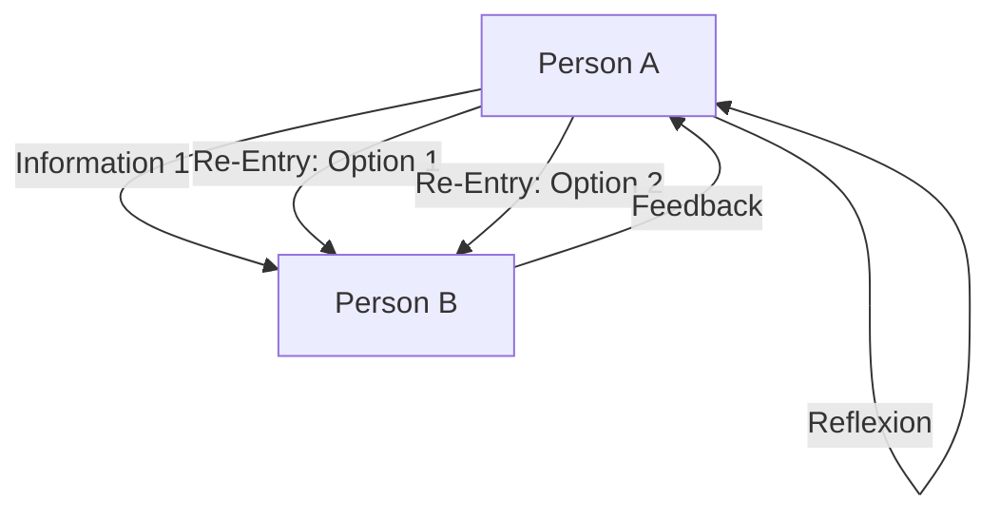

created: 26.10.2024 | [updated](https://git.jochen-hanisch.de/research/systemtheorie): 7.7.2025 | [published](https://zenodo.org/records/15826463): 7.7.2025 | [[Hinweise]]

**Systemsimulation: Ein Paradigmenwechsel durch Typisierung, Qualifizierung und Modellierung - Systemtheoretische Ansätze zur Simulation lebender, psychischer, sozialer und emergenter Systeme**

# Zusammenfassung

In diesem Beitrag wird ein Ansatz zur Systemsimulation lebender, psychischer, sozialer und emergenter Systeme vorgestellt. Die Arbeit basiert auf systemtheoretischen Grundprinzipien wie Autopoiesis, dynamischen Feedback-Mechanismen und Re-Entry-Modulationen, um komplexe, selbstregulierende und adaptive Prozesse authentisch abzubilden. Ziel ist, über die statische und technische Nachbildung hinauszugehen und eine Simulationsmethode zu entwickeln, die die Interaktivität und Anpassungsfähigkeit dieser Systeme realistisch darstellt. Im Gegensatz zu herkömmlichen Modellen erlaubt der vorgeschlagene Ansatz eine kontinuierliche Rückkopplung, Reflexion und Re-entry innerhalb der simulierten Systeme, wodurch eine dynamische Anpassung an Umweltveränderungen ermöglicht wird.

Die Systemsimulation ist eine Methode zur Nachbildung komplexer Systeme, die dynamische, selbstorganisierende und emergente Prozesse integriert. Basierend auf den Prinzipien der Autopoiesis und Kommunikation ermöglicht sie eine realistische Darstellung lebender, psychischer, sozialer und emergenter Systeme. Diese Methode bietet Einblicke in die Dynamiken und Anpassungsmechanismen von Systemen und eröffnet neue Möglichkeiten für Forschung und Praxis in Bereichen wie Medizin, Psychologie und Soziologie. Die Systemsimulation wird in vier Hauptkategorien typisiert: Full System Simulator (FSS), Training System Simulator (TSS), Procedure System Simulator (PSS) und Basic Skills System Simulator (BSSS). Diese Kategorien werden anhand der Merkmale Autopoiesis, Kommunikation und Technik qualifiziert, die in Qualitätsstufen von A bis E eingeteilt sind. Trotz ihrer Vorteile stehen der Implementierung Herausforderungen gegenüber, wie die technische und methodische Komplexität sowie die Integration menschlicher Bedürfnisse und Emotionen. Insgesamt stellt die Systemsimulation eine bedeutende Weiterentwicklung dar, die das Potenzial hat, die Modellierung und Analyse komplexer Systeme zu revolutionieren.

Die Arbeit möchte eine theoretische Basis für die Entwicklung simulationsgestützter Modelle liefern, die in weiteren Forschungsphasen empirisch validiert und methodisch präzisiert werden sollen. Der Beitrag analysiert zudem die methodischen und ethischen Herausforderungen, die bei der Simulation komplexer sozialer, psychischer und emergenter Prozesse auftreten. Langfristig zielt dieser systemtheoretische Ansatz darauf ab, innovative Simulationsmodelle für eine Vielzahl von Disziplinen wie Medizin, Psychologie und Soziologie bereitzustellen und neue Möglichkeiten zur Optimierung und Entscheidungsfindung in kontrollierten Umgebungen zu schaffen.

# Abstract

This paper presents an approach to the system simulation of living, psychological, social and emergent systems. The work is based on the basic principles of systems theory, such as autopoiesis, dynamic feedback mechanisms and Re-entry modulations, in order to authentically map complex, self-regulating and adaptive processes. The aim is to go beyond static and technical replication and to develop a simulation method that realistically represents the interactivity and adaptability of these systems. In contrast to conventional models, the proposed approach allows for continuous feedback, reflection and Re-entry within the simulated systems, enabling dynamic adaptation to environmental changes. 
 
System simulation is a method for modelling complex systems that integrates dynamic, self-organising and emergent processes. Based on the principles of autopoiesis and communication, it enables a realistic representation of living, psychological, social and emergent systems. This method offers insights into the dynamics and adaptation mechanisms of systems and opens up new possibilities for research and practice in areas such as medicine, psychology and sociology. Systems simulation is categorised into four main types: Full System Simulator (FSS), Training System Simulator (TSS), Procedure System Simulator (PSS) and Basic Skills System Simulator (BSSS). These categories are qualified according to the characteristics of autopoiesis, communication and technology, which are categorised into quality levels from A to E. Despite its advantages, implementation faces challenges such as technical and methodological complexity, as well as the integration of human needs and emotions. Overall, system simulation represents a significant advancement that has the potential to revolutionise the modelling and analysis of complex systems. 
 
The work aims to provide a theoretical basis for the development of simulation-based models, which are to be empirically validated and methodically specified in further research phases. The paper also analyses the methodological and ethical challenges that arise when simulating complex social, psychological and emergent processes. In the long term, this systems theory approach aims to provide innovative simulation models for a variety of disciplines, such as medicine, psychology and sociology, and to create new possibilities for optimisation and decision-making in controlled environments.

# Abkürzungsverzeichnis

_Tabelle 1: Übersicht der verwendeten Abkürzungen_

| Abkürzung | Bedeutung                    |
| --------- | ----------------------------------------------- |
| BITD   | Basic Instrument Training Device        |
| BSSS   | Basic Skills System Simulator          |
| CRM    | Crew Resource Management            |
| EASA   | European Union Aviation Safety Agency      |
| FFS    | Full Flight Simulator              |
| FSS    | Full System Simulator              |
| FTD    | Flight Training Device             |
| JAA    | Joint Aviation Authorities           |
| JAR-FCL  | Joint Aviation Requirements Flight Crew License |
| JAR-OPS  | Joint Aviation Requirements or the operation  |
| OPS    | Flugbetriebsstandards              |
| PSS    | Procedure System Simulator           |
| TSS    | Training System Simulator            |

# Hinweise

## Hinweis zur Literatur

Die Zitierweise dieser Arbeit folgt der 7. Auflage des APA-Stils. Die Verwaltung der Zitate erfolgt mit der Software Zotero (Version 7.0.9).
Leitendes Einschlusskriterium für die Verwendung von Quellen ist die Zuordnung zur Kategorie der theoretischen Grundlagenliteratur. Diese Vorgehensweise wurde gewählt, um eine systematische Herleitung von der flugtechnischen zur systemtheoretischen Sichtweise zu erreichen und somit die theoretischen Grundlagen und Zusammenhänge darzustellen. Damit folgt die vorliegende Arbeit dem Anspruch der abstrakten systemtheoretischen Grundlagenforschung und grenzt sich von praxisorientierten Veröffentlichungen ab.

## Hinweis zur Nutzung von OpenAI in der vorliegenden Arbeit

Die Erstellung dieser Arbeit erfolgte unter der bewussten und gezielten Nutzung des OpenAI-Modells GPT-4.0. Dieser Schritt wurde unternommen, um eine kohärente und methodisch nachvollziehbare Darstellung komplexer Inhalte zu gewährleisten. Durch die Generierung von Textpassagen mithilfe von GPT-4.0 konnte ein systematischer und replizierbarer Zugang geschaffen werden, der insbesondere bei der Integration theoretischer und technischer Aspekte wie der System-Umwelt-Unterscheidung, Kommunikation und Autopoiesis unterstützend wirkte.

Ein zentraler Aspekt war dabei, die durch GPT generierten Inhalte kontinuierlich kritisch zu reflektieren, wie Kerres et al. (2024) dieses für den kompetenten Umgang mit generativer KI betonen. In der Arbeit wurde sichergestellt, dass die von GPT-4 generierten Textanteile durch eine differenzierte Prüfung und Kontextualisierung in das wissenschaftliche Gesamtbild eingebettet wurden. Diese Vorgehensweise entspricht der Aufforderung, generative KI-Modelle nicht als abschließende Wissensquelle zu betrachten, sondern als ein Mittel, die wissenschaftliche Argumentation durch produktiv-kritische Dialoge zu erweitern. (Kerres et al., 2024)

Dabei wurde die generative KI nicht nur als Quelle neuer Textpassagen genutzt, sondern als interaktives Werkzeug, das zur Weiterentwicklung von Fragen und Perspektiven auf systematische Weise im Sinne eines hermeneutischen Zirkels führt. Diese Methodik fördert die Einbindung einer rekursiven Informationskompetenz, wie sie im Zusammenhang mit Chatbots gefordert wird, um Antworten fortlaufend auf ihre Konsistenz und wissenschaftliche Belastbarkeit hin zu überprüfen und, wenn nötig, weiter zu spezifizieren (Kerres et al., 2024).

Mit der Wahl dieser Methodik unter Beachtung der im Prozessprotokoll (S. \pageref{info:Anlage1}) genannten Einschränkungen möchte die Arbeit den Anforderungen an wissenschaftliche Nachvollziehbarkeit und methodische Transparenz gerecht werden. Die hier vorgestellte Vorgehensweise hat eine theoretisch fundierte Darstellung der vorgestellten Konzepte ermöglicht und eine systematische Reflexion auf einer logischen, konsistenten und kohärenten Grundlage unterstützt, die zur methodischen Weiterentwicklung der Qualität von Simulationsansätzen beiträgt. (OpenAI, 2024)

# Einleitung

Die Simulation komplexer Systeme hat sich in zahlreichen wissenschaftlichen und praktischen Disziplinen zu einer unverzichtbaren Methode entwickelt, um die Dynamiken und Interaktionen innerhalb dieser Systeme besser zu verstehen und zu optimieren. Sowohl in der Medizin, Psychologie und Soziologie als auch in technischen und wirtschaftlichen Anwendungen bietet die Simulation eine kontrollierte Umgebung, in der hypothetische Szenarien durchgespielt und strategische Entscheidungen evaluiert werden können. Trotz dieser Möglichkeiten bleibt die Nachbildung lebender, psychischer, sozialer und emergenter Systeme eine erhebliche Herausforderung. Herkömmliche Simulationsansätze, die primär auf vorgeskripteten Abläufen und technischer Replikation basieren, erfassen die tatsächliche Komplexität und Anpassungsfähigkeit solcher Systeme nur begrenzt. Sie stoßen an ihre Grenzen, wenn sie dynamische, interaktive und selbstorganisierende Eigenschaften abbilden sollen (Baraldi et al., 2019b; Luhmann, 1984).

Die vorliegende Arbeit verfolgt das Ziel, den Begriff der Systemsimulation auf eine systemtheoretische Grundlage zu stellen und eine Methode zu entwickeln, die über die rein technische Replikation hinausgeht. Ziel ist es, eine umfassende Simulationsmethode zu schaffen, die sowohl psychische als auch soziale und emergente Dynamiken realistisch abbildet. Durch die Integration der Konzepte der System-Umwelt-Unterscheidung (Autopoiesis) und der Kommunikation wird ein Simulationsansatz vorgestellt, der sich von traditionellen, statischen und vorgeskripteten Simulationen abhebt. Diese neue Methodik erlaubt eine dynamische Anpassung und kontinuierliche Rückkopplung durch die Prozesse des Feedbacks, der Reflexion und des Re-entry (Varela, Maturana & Uribe, 1974).

Die Abstraktheit der systemtheoretischen Prinzipien mag zunächst als Herausforderung für die empirische Validierung und methodische Umsetzung erscheinen. Doch gerade diese Abstraktheit ist notwendig, um allgemeingültige, theoretische Grundlagen zu entwickeln, die als flexibles Fundament für unterschiedlichste praktische Anwendungen dienen können. Die vorliegende Arbeit stellt einen Ausgangspunkt für eine Methodik dar, die in weiteren empirischen Studien konkretisiert und verfeinert werden soll.

Die Einführung dieser systemtheoretischen Prinzipien in die Simulation lebender, psychischer und sozialer Systeme eröffnet neue Perspektiven sowohl für die Forschung als auch für die praktische Anwendung. Die dynamischen Anpassungen in der Simulation ermöglichen es, die Systeme nicht nur zu beobachten, sondern ihre Entwicklung aktiv zu beeinflussen und zu steuern. Dadurch können Forscher und Anwender in einer kontrollierten Umgebung experimentieren und potenzielle Optimierungsstrategien testen, die im realen System nur schwer oder mit Risiken umsetzbar wären.

Darüber hinaus zielt dieser Ansatz auf die Integration menschlicher Bedürfnisse und Emotionen ab, wie sie unter anderem in der Schematherapie beschrieben werden (Young, Klosko & Weishaar, 2003). Die Berücksichtigung dieser psychischen Faktoren ermöglicht eine realistischere Abbildung menschlicher Interaktionen und sozialer Dynamiken, die in traditionellen Simulationen oft vernachlässigt werden. Die Einbeziehung solcher Elemente unterstützt die Entwicklung von Simulationen, die die realen Herausforderungen und Bedingungen lebender, psychischer, sozialer und emergenter Systeme detaillierter widerspiegeln. Dadurch entsteht ein tieferes Verständnis für die Strukturen und Prozesse dieser Systeme, was wiederum eine effektivere Handhabung und Entscheidungsfindung ermöglicht.

Zukünftig soll angestrebt werden, die vorgeschlagenen Konzepte durch gezielte empirische Forschung zu validieren und methodisch so anzupassen, dass sie praktikabel in simulationsgestützte Projekte integriert werden können. Dabei wird der theoretische Rahmen beibehalten, um sicherzustellen, dass die Simulation lebender, psychischer und sozialer Systeme weiterhin ihre dynamischen und adaptiven Eigenschaften widerspiegelt und über die starren, technischen Modelle hinausgeht. Die Arbeit bildet daher eine Grundlage für neue Generationen an Simulationen, deren Entwicklung schrittweise, jedoch systematisch und validiert zur Systemsimulation führt.

Definiert wird der Begriff der Systemsimulation unter Berücksichtigung systemtheoretischer Grundlagen wie Autopoiesis und Kommunikation in Kapitel 1 (S. \pageref{sec:1}). Weiterhin wird in diesem Kapitel eine Abgrenzung zu herkömmlichen Simulationen gezogen, die oft rein technische Abläufe nachbilden. Die Herleitung erfolgt aus verschiedenen theoretischen Perspektiven, einschließlich technischer, psychologischer und systemtheoretischer Ansätze in Kapitel 2 (S. \pageref{sec:2}). Diese verschiedenen Blickwinkel verdeutlichen, wie die spezifischen Merkmale der Systemsimulation in unterschiedlichen Disziplinen zur Anwendung kommen und integriert werden können. Im Kapitel 3 (S. \pageref{sec:3}) werden konkrete Erkenntnisse und Schlussfolgerungen aus der Anwendung der Systemsimulation dargestellt. Die Analyse der Beiträge der Methode zur Entwicklung und Optimierung komplexer Systeme und Gewinnung von besonderen Einsichten durch die Simulation ist hier zentraler Bestandteil. Diese Folgerungen bilden die Basis für weiterführende Anwendungen und Anpassungen der Simulation in verschiedenen Bereichen. Die praktischen und wissenschaftlich-gesellschaftlichen Implikationen der Systemsimulation werden im Kapitel 4 (S. \pageref{sec:4}) diskutiert. Hier wird aufgezeigt, wie die Simulation zur Gestaltung und Steuerung komplexer Systeme genutzt werden kann. Mögliche Anwendungsfelder, wie die Krisenintervention oder die medizinische Ausbildung, werden beleuchtet, um das Potenzial der Systemsimulation in der Praxis zu veranschaulichen. Zudem soll der Versuch der Operationalisierung der Systemsimulation unternommen werden. Die methodischen, technischen und ethischen Herausforderungen der Systemsimulation werden in einem kritischen Abschnitt, Kapitel 5 (S. \pageref{sec:5}), analysiert. Hierbei werden potenzielle Schwächen und Risiken sowie mögliche Lösungsansätze zur Verbesserung der Methode aufgezeigt. Kapitel 6 (S. \pageref{sec:6}) bietet einerseits eine kurze Darstellung der Methodik, die zur Entwicklung der Systemsimulation angewandt wird. Die Methode kombiniert Theorieentwicklung, Modellierung und iterative Reflexion, um ein flexibles, anpassungsfähiges Modell zur Simulation komplexer Systeme zu schaffen. Anderseits wird die Systemsimulation als Methode eingeführt. Im Anschluss an die Methodik erfolgt eine retrospektive Bewertung, in der die erzielten Ergebnisse analysiert und bewertet werden. Diese Bewertung ermöglicht eine Identifikation der Stärken und Schwächen der Methode und leitet Optimierungsmöglichkeiten ab, die für zukünftige Anwendungen und die Weiterentwicklung der Systemsimulation von Bedeutung sind. Eine zusammenfassende Übersicht liefert Kapitel 7 (S. \pageref{sec:7}).

# 1 Definition

Allgemein bezeichnet Simulation die Nachbildung oder Imitation realer Systeme, Prozesse oder Phänomene, um deren Verhalten unter variierenden Bedingungen zu analysieren und zu verstehen. Sie wird in verschiedenen Disziplinen wie Informatik, Betriebswirtschaft und Medizin angewendet, wobei sie jeweils spezifische Ziele verfolgt. In der Betriebswirtschaftslehre etwa gilt Simulation als „möglichst realitätsnahes Nachbilden von Geschehen der Wirklichkeit“ und dient häufig zur Entscheidungsunterstützung. In der Informatik und Mathematik umfasst die Simulation Methoden zur Modellierung des Verhaltens komplexer Systeme auf Basis mathematischer Modelle. In der Medizin versteht man unter Simulation eine realitätsgetreue Nachstellung von Maßnahmen zu Ausbildungs- und Weiterbildungszwecken. (Lackes et al., o. J.; Schmidt et al., 2024; Walz, 2017)

Die Systemsimulation ist eine systematische Nachbildung und Modellierung eines lebenden, psychischen, sozialen oder emergenten Systems, das durch die Prinzipien der System-Umwelt-Unterscheidung (Autopoiesis) und Kommunikation charakterisiert ist. Sie ermöglicht die Untersuchung, Erprobung und Optimierung komplexer Systeme in einer kontrollierten Umgebung. Im Gegensatz zu herkömmlichen Simulationen, die häufig auf vorgeskripteten und technisch orientierten Modellen basieren, zielt die Systemsimulation darauf ab, die dynamischen Wechselwirkungen und Anpassungsprozesse innerhalb eines Systems sowie zwischen dem System und seiner Umwelt realistisch abzubilden. (Luhmann, 1984; Varela, Maturana & Uribe, 1974)

Ein Systemsimulator bezeichnet die umfassende und realistische Nachbildung eines bestimmten Systems, inkl. seiner Strukturen, Prozesse und Interaktionen, um die Dynamik und Anpassungsfähigkeit des Systems unter kontrollierten Bedingungen zu erforschen. Er stellt eine Weiterentwicklung traditioneller Simulatoren dar, indem er nicht nur technische, sondern auch soziale, psychische, lebende und emergente Systeme realitätsnah simuliert und dabei Methoden wie Feedback, Reflexion und Re-entry integriert. Diese Merkmale ermöglichen ein flexibles und präzises Training sowie die Optimierung der systeminternen Abläufe und Entscheidungsprozesse in kritischen Situationen.

Die Systemsimulation integriert sowohl interne Systemprozesse als auch externe Einflüsse und berücksichtigt dabei menschliche Bedürfnisse und Emotionen, die als zentrale Elemente der Simulation fungieren. Dies ermöglicht eine tiefere und realistischere Darstellung von lebenden, psychischen, sozialen und emergenten Systemen. Bedürfnisse wie Bindung, Kontrolle nach außen, Kontrolle nach innen, Selbstwerterhaltung und Vermeidung von Unlust, wie sie in der Schematherapie bei Young, Klosko & Weishaar (2003) beschrieben werden, wirken als Trigger für Feedback und Reflexion, während Emotionen als Regulationsmechanismen dienen.

Darüber hinaus umfasst die Systemsimulation die dynamische Schleife aus Feedback, Reflexion und Re-Entry. Feedback beschreibt sowohl externe als auch interne Rückmeldungen, die zur Anpassung des Systems führen. Reflexion ermöglicht die Analyse dieser Rückmeldungen, während Re-entry die Rückführung der gewonnenen Erkenntnisse ins System unterstützt, um neue Handlungsoptionen zu generieren und die Systementwicklung kontinuierlich voranzutreiben. Damit ermöglicht die dynamische Schleife dem System, fortlaufend Beobachtungen vorzunehmen, Bewertungen durchzuführen und Anpassungen vorzunehmen (Hanisch-Johannsen & ChatGPT, 2024).

Systemsimulationen finden Anwendung in verschiedenen Bereichen, darunter Medizin, Psychologie, Soziologie und die Erforschung emergenter Systeme. Sie tragen dazu bei, systemische Abläufe besser zu verstehen, Anpassungsmechanismen zu entwickeln und fundierte Entscheidungen in komplexen Situationen zu treffen. Diese innovative Methode stellt eine Weiterentwicklung traditioneller Simulationsansätze dar und eröffnet neue Möglichkeiten für die Erforschung und Optimierung komplexer Systeme.

# 2 Herleitung

Die Herleitung des Begriffs Systemsimulation basiert auf der Analyse und Integration verschiedener theoretischer und praktischer Ansätze, die über traditionelle Simulationsdefinitionen hinausgehen. Dabei wird bewusst auf die bisherigen Begriffsbestimmungen von Simulation verzichtet, um eine neue, systemtheoretisch fundierte Perspektive zu schaffen, die den spezifischen Anforderungen und Dynamiken lebender, psychischer, sozialer und emergenter Systeme gerecht wird.

In Anlehnung an die Begriffsbestimmung der Flugsimulatoren (S. \pageref{info:flugsimulator}) kann der Begriff Systemsimulator aus der Bestimmung des Full Flight Simulators (FFS) abgeleitet werden, indem die wesentlichen Merkmale der vollständigen Nachbildung und Funktionalität eines Systems auf andere, nicht nur flugtechnische Systeme erweitert werden.

Ein flugtechnischer Full Flight Simulator bildet das Cockpit eines bestimmten Flugzeugtyps vollständig nach. Hierbei werden mehrere wesentliche Komponenten integriert:

1. **Komplette Nachbildung der physischen Struktur** (Cockpit und Steuerungssysteme),
2. **Realistische Simulation der Systemfunktionen** (Flugzeugsysteme am Boden und im Flug),
3. **Visuelles Feedbacksystem** (simuliert die Umgebung durch ein optisches System),
4. **Kraftsimulation** (physische Kräfte und Flugbewegungen).

Diese Komponenten ermöglichen eine umfassende Replikation aller Bedingungen, die das reale System (Flugzeug) erfährt und und stellen die funktionale, visuelle und physische Rückmeldung dar, die für das Training und die Entscheidungsfindung notwendig ist.

Ein Systemsimulator ist eine Weiterentwicklung dieses Ansatzes, wobei der Fokus auf der vollständigen Nachbildung beliebiger komplexer Systeme, nicht nur flugtechnischer, liegt. Folgende Aspekte werden berücksichtigt:

1. **Replikation eines spezifischen Systems**: Der Systemsimulator basiert auf der Struktur und den Funktionen des jeweiligen Systems, das er simulieren soll, sei es ein lebendes, psychisches, soziales oder technisches System.
2. **Nachbildung der Systemdynamiken**: Der Systemsimulator enthält Modelle und Funktionen, die dynamische Veränderungen und Prozesse des Systems realitätsgetreu nachbilden. Diese können, je nach Anwendungsfeld Kommunikationsprozesse, Feedback-Schleifen und Anpassungsmechanismen umfassen, die in komplexen sozialen oder psychologischen Systemen auftreten.
3. **Integration von visuellen und physischen Rückmeldungen**: Wie der FFS ein visuelles und ein Kraftsystem integriert, kann ein Systemsimulator sensorische oder taktile Rückmeldungen umfassen, die zur realistischen Simulation von Bedingungen und zur Verbesserung der Interaktion erforderlich sind.
4. **Erweiterung auf interaktive Systemebenen**: Der Systemsimulator umfasst Autopoiesis, Kommunikation und Technik, die je nach Art des simulierten Systems zu einer vernetzten, interaktiven Simulation verknüpft werden können.

Dieser Ansatz ermöglicht eine differenzierte Betrachtung, die über die technische Replikation hinausgeht und sich auf die Nachbildung selbstorganisierender und adaptiver Prozesse konzentriert. Im Gegensatz zu klassischen Simulationsansätzen, die oft eine statische oder vorgeskriptete Struktur verwenden, zielt die Systemsimulation darauf ab, dynamische und interaktive Prozesse innerhalb eines Systems und dessen Umwelt abzubilden. Durch die Konzentration auf systemtheoretische Prinzipien wie Autopoiesis und Kommunikation wird Der Begriff der Systemsimulation wird zu einem eigenständigen Konzept, das die Komplexität und Eigenlogik solcher Systeme erfasst und abbildet.

Die Herleitung der Systemsimulation legt somit den Fokus auf die spezifischen Herausforderungen und Potenziale, die in der Simulation lebender, psychischer, sozialer und emergenter Systeme bestehen, und schafft die Grundlage für eine innovative und theoretisch fundierte Simulationsmethode.

Ausgangspunkt war die Untersuchung bestehender Simulationsmethoden, insbesondere im technischen Bereich, wie den Flugsimulatoren, die traditionell zur Schulung von Luftfahrzeugbesatzungen eingesetzt werden. Diese frühen Simulationsansätze legten den Fokus auf die technische Nachbildung realer Prozesse und physikalischer Abläufe. Während Flugsimulatoren in vielen Bereichen erfolgreich zur Ausbildung und Risikominimierung eingesetzt werden, wurde erkannt, dass diese Ansätze die Komplexität lebender, psychischer und sozialer Systeme nur unzureichend abbilden (EASA, 2011; BAnz, 2007).

Im Rahmen dieser Begriffsbestimmung wurde ein neuer Ansatz entwickelt, der die Prinzipien der Systemtheorie integriert hat. Die Konzepte der System-Umwelt-Unterscheidung (Autopoiesis) und der Kommunikation, wie sie in den Theorien von Niklas Luhmann sowie in den biologischen Modellen von Humberto Maturana und Francisco Varela formuliert wurden, bilden die Grundlage für die Systemsimulation.Autopoiesis bezeichnet die Fähigkeit eines Systems, die eigene Organisation zu steuern und eine Abgrenzung zur Umwelt vorzunehmen, während Kommunikation als grundlegende Operation sozialer Systeme verstanden wird, die Interaktionen sowohl innerhalb des Systems als auch zwischen System und Umwelt ermöglicht (Varela, Maturana & Uribe, 1974; Luhmann, 1984; Baraldi et al., 2019c).

Diese systemtheoretischen Grundlagen ermöglichen, nicht nur technische, sondern auch psychische, soziale und emergente Dynamiken in die Simulation einzubeziehen. Die Integration dieser Prinzipien führt zu einer Simulation mit neuer Qualität, die über die technische Nachbildung hinausgeht und die Fähigkeit eines Systems zur Selbstorganisation, Selbstreflexion und Anpassung abbildet.

Die Herleitung verdeutlicht den Übergang von rein technischen Modellen hin zu einer ganzheitlichen, systemtheoretisch fundierten Simulation. Verschiedene Perspektiven, darunter die technische, systemtheoretische, psychologische und soziologische Sichtweise, werden integriert, um ein umfassendes Verständnis der Systemsimulation zu gewährleisten. Dies ermöglicht, komplexe Systeme in ihrer gesamten Dynamik und Anpassungsfähigkeit realistisch zu simulieren. Diese Herleitung soll die Entwicklung und Anwendung der Systemsimulation in verschiedenen Kontexten untermauern und vorantreiben.

## 2.1 Einführung in die Systemsimulation und deren Grundlagen

Die Systemsimulation als methodischer Ansatz zur Modellierung und Nachbildung komplexer Systeme erfordert sowohl eine fundierte theoretische als auch eine technische Grundlage. In diesem Abschnitt wird die Herleitung des Begriffs „Systemsimulation“ beschrieben und die relevanten Anforderungen und Standards dargestellt, die eine realistische Abbildung dynamischer Systeme ermöglichen.

### 2.1.1 Regulatorische Grundlagen und Zertifizierung von Simulationsgeräten

Ein Flugsimulator (Full Flight Simulator, FFS) ist eine vollständige Nachbildung des Cockpits eines spezifischen Flugzeugtyps, einer bestimmten Bauweise, eines Modells oder einer Serie. Er enthält alle notwendigen Ausrüstungen und Computerprogramme zur realistischen Darstellung der Funktionen der Flugzeugsysteme sowohl am Boden als auch während des Fluges. Dazu gehört ein visuelles System, das den Blick aus dem Cockpitfenster simuliert, und ein Kraftsimulationssystem, das die physischen Kräfte nachbildet, die beim Fliegen auftreten. Der FFS bietet somit eine immersive Trainingsumgebung für die Ausbildung von Luftfahrzeugbesatzungen, in der alle Flugphasen, Systemausfälle und komplexe Notfallverfahren unter nahezu realen Bedingungen geübt werden können. (Verordnung (EU) zur Festlegung technischer Vorschriften und von Verwaltungsverfahren in Bezug auf das fliegende Personal in der Zivilluftfahrt gemäß der Verordnung (EG), 2011)
\label{info:flugsimulator}

Die Zertifizierungsspezifikationen für Flugsimulationsübungsgeräte (CS-FSTD) der European Union Aviation Safety Agency (EASA, 2018) bieten einen umfassenden Rahmen für die Qualifikation und Zertifizierung von Flugsimulatoren. Diese Spezifikationen sind maßgeblich für die Definition von Standards und die Sicherstellung einer präzisen Abbildung realer Flugbedingungen, die in der Ausbildung und Prüfung von Luftfahrzeugbesatzungen und Crewmitgliedern eine zentrale Rolle spielen (Verordnung (EU) zur Festlegung technischer Vorschriften und von Verwaltungsverfahren in Bezug auf das fliegende Personal in der Zivilluftfahrt gemäß der Verordnung (EG), 2011).

Die CS-FSTD-Spezifikationen umfassen eine Vielzahl an Flugsimulationsgeräten, die in unterschiedlichen Schulungsszenarien zum Einsatz kommen. Hierzu zählen Full-Flight-Simulatoren (FFS), Flight Training Devices (FTD), Flight Navigation Procedure Trainer (FNPT) sowie Basic Instrument Training Devices (BITD). Diese Simulationsgeräte wurden spezifisch auf ihre jeweiligen Ausbildungsziele hin entwickelt und unterliegen differenzierten Qualifikationsstufen, die die Anforderungen an die Realitätsnähe und Funktionalität der Geräte festlegen. Jede Qualifikationsstufe geht mit spezifischen technischen und betrieblichen Mindestanforderungen einher, die für die realitätsgetreue Nachbildung von Flug- und Bodenbedingungen erforderlich sind (EASA, 2018).

Für die Nutzung von Flugsimulationsübungsgeräten (FSTD) zur Qualifikation von Luftfahrzeugbesatzungen ist grundsätzlich eine Zulassung erforderlich, außer wenn spezifische Durchführungsrechtsakte eine Ausnahme zulassen. Diese Zulassung wird erteilt, wenn der Antragsteller nachweist, dass er die grundlegenden Anforderungen und relevanten Vorschriften erfüllt. Die Zulassung dokumentiert die Funktionen des Geräts und kann bei Bedarf angepasst werden, um Änderungen dieser Funktionen zu berücksichtigen. Bei Nichteinhaltung der Vorschriften kann die Zulassung eingeschränkt, ausgesetzt oder widerrufen werden. Gegebenenfalls muss die verantwortliche Organisation eine Konformitätserklärung abgeben, die bestätigt, dass das Gerät den grundlegenden Anforderungen und den spezifizierten Einzelspezifikationen entspricht (Verordnung (EU) 2018/1139 des Europäischen Parlaments und des Rates, 2018).
\label{info:zulassung-flugsimulatoren}

Ein zentraler Aspekt der CS-FSTD-Spezifikationen liegt in der Festlegung von Toleranzen für Validierungsprüfungen. Diese Toleranzen definieren den Rahmen, innerhalb dessen die Simulationsergebnisse von den realen Flugbedingungen abweichen dürfen, ohne die Integrität des Trainings zu beeinträchtigen. Die Validierung eines Simulators erfolgt durch Vergleichsmessungen der Leistungs- und Steuerungseigenschaften mit den Daten eines tatsächlichen Flugzeugs. Diese Prüfungen gewährleisten, dass die simulierten Bedingungen mit den realen Flugbedingungen in einer Weise übereinstimmen, die für die Ausbildung und Qualifikation von Flugbesatzungen als verlässlich gilt.

Zusätzlich zu den Validierungsprüfungen stellen die CS-FSTD-Spezifikationen umfangreiche Anforderungen an die technischen Mindeststandards der Simulationsgeräte. Dazu gehören zum Beispiel:

- **Flugdynamikmodelle**: Die Software muss in der Lage sein, die unterschiedlichen aerodynamischen Kräfte und Momente realitätsgetreu abzubilden, die bei verschiedenen Manövern und Flugbedingungen auftreten.
- **Bewegungs- und Steuermodellierung**: Simulationsgeräte müssen die Bewegungen und Steuerkräfte genau so vermitteln, wie sie in einem tatsächlichen Flugzeug wahrgenommen würden. Hierzu gehört auch die Replikation der Steuerungsempfindlichkeit und die präzise Übertragung von Ruder-, Steuerknüppel- und Gaseingaben.
- **Visuelle Systeme**: Für Full-Flight-Simulatoren ist ein visuelles System erforderlich, das eine deutliche und realistische Außensicht aus dem Cockpit bietet. Dies umfasst auch eine detailgetreue Nachbildung von Wetterphänomenen, Tages- und Nachtbedingungen sowie geografischen Besonderheiten, die für das Training erforderlich sind.

Die Spezifikationen variieren je nach Gerätetyp und Ausbildungsziel, wobei Full-Flight-Simulatoren (FFS) die höchsten Anforderungen erfüllen müssen. FFS sind mit einem geschlossenen Cockpit ausgestattet und verfügen über Bewegungssysteme sowie visuelle Systeme, die eine exakte Nachbildung der realen Flugumgebung ermöglichen. Diese Simulatoren sind besonders geeignet für das Training und die Zertifizierung von Luftfahrzeugbesatzungen auf einer spezifischen Flugzeugmodellreihe und bieten eine praxisnahe Vorbereitung auf operative Anforderungen und Notfallprozeduren.

Für andere Gerätetypen, wie beispielsweise Flight Training Devices (FTD) und Flight Navigation Procedure Trainer (FNPT), bestehen weniger strenge Anforderungen an die Realitätsnähe, da sie in erster Linie für spezifische Verfahren oder Instrumententrainings konzipiert sind. Dennoch müssen sie Mindeststandards für Genauigkeit und Systemfunktionalität erfüllen, die der tatsächlichen Flugpraxis ausreichend nahekommen.

Durch die detaillierte Festlegung der Standards und die verpflichtende Einhaltung der Qualifikationsprüfungsleitfäden (Qualification Test Guide, QTG) sichert die EASA die Zuverlässigkeit und Ausbildungsqualität der Simulationsgeräte. Der QTG dokumentiert die notwendigen Validierungsdaten, Testmethoden und Prüfverfahren, um die Konformität der Simulatoren mit den geforderten Standards zu gewährleisten und somit eine belastbare Grundlage für die Luftfahrzeugbesatzungs- und Crew-Ausbildung zu schaffen.

Insgesamt bietet das CS-FSTD-Regelwerk einen präzisen und praxisorientierten Rahmen, der sicherstellt, dass die eingesetzten Simulationsgeräte nicht nur den regulatorischen Anforderungen entsprechen, sondern auch ein Höchstmaß an Realitätsnähe bieten, das für die Ausbildung und Qualifizierung von Flugbesatzungen unerlässlich ist.

### 2.1.2 Anforderungen an den Betrieb und die Simulation außergewöhnlicher Bedingungen

Die Joint Aviation Requirements (JAR-OPS), die die gewerbsmäßige Beförderung von Personen und Gütern in Flugzeugen und Hubschraubern regeln, bieten detaillierte Vorschriften zu betrieblichen Abläufen, Sicherheitsanforderungen und Instandhaltungsmaßnahmen für Luftfahrtsysteme. Die Anforderungen der JAR-OPS decken eine breite Palette von Betriebsbedingungen ab und legen die Standards für den Einsatz und die Aufrechterhaltung sicherer und effizienter Luftfahrtpraktiken fest.

Ein besonders relevantes Feld innerhalb der JAR-OPS ist die Simulation von außergewöhnlichen Bedingungen und Notfallszenarien. Diese Anforderungen sind essenziell für die Systemsimulation, da sie die regulatorischen Grundlagen für die Ausbildung in Extremsituationen und die Entwicklung von Verhaltensweisen und Strategien zur Krisenbewältigung schaffen. Die Vorschriften zur Simulation außergewöhnlicher Bedingungen umfassen unter anderem die Nachbildung von Wetterereignissen, die Einflüsse auf die Steuerung und Stabilität eines Flugzeugs haben können, und von Systemausfällen, die im realen Flugbetrieb vorkommen könnten (BAnz, 2006).

Die JAR-OPS-Spezifikationen definieren eine Reihe von kritischen Szenarien, die während des Trainings im Simulator abgedeckt werden müssen. Hierzu zählen:

- **Systemausfälle und technische Störungen**: Die Richtlinien verlangen die Nachbildung und das Training im Umgang mit verschiedenen Arten von technischen Fehlfunktionen, wie zum Beispiel Ausfälle von Triebwerken, Hydraulik- und Elektronikproblemen sowie Fehlfunktionen in den Navigations- und Kommunikationssystemen. Diese Szenarien bieten den Luftfahrzeugbesatzungen die Möglichkeit, Handlungskompetenzen und Routine für den Umgang mit Notfällen zu entwickeln, die im realen Betrieb auftreten können.
- **Schwierige Wetterbedingungen**: Die Anforderungen der JAR-OPS umfassen zudem die Simulation von extremen Wetterlagen wie starken Winden, Gewittern, Turbulenzen und Vereisung. Hierbei wird besonderer Wert auf die Fähigkeit der Luftfahrzeugbesatzungen gelegt, die Stabilität und Kontrolle des Flugzeugs unter außergewöhnlichen meteorologischen Bedingungen aufrechtzuerhalten. Die realitätsnahe Nachbildung solcher Bedingungen erfordert visuelle und haptische Simulationen, die den Einfluss der Wetterereignisse auf das Flugzeug präzise wiedergeben.
- **Notlandungen und Ausweichmanöver**: Für die Ausbildung und Zertifizierung von Luftfahrzeugbesatzungen ist die Simulation von Notlandungen, Ausweichmanövern und dem Umgang mit unerwarteten Flugbahnstörungen von zentraler Bedeutung. Die JAR-OPS sehen spezifische Manöver und Verfahren vor, die trainiert werden müssen, um Luftfahrzeugbesatzungen auf ungeplante Landungen und Ausweichmanöver vorzubereiten. Diese Szenarien werden in den Simulatoren unter realitätsnahen Bedingungen geübt, sodass Luftfahrzeugbesatzungen lernen, schnell auf äußere Einflüsse zu reagieren und sichere Entscheidungen zu treffen.
- **Crew Resource Management (CRM) in Krisensituationen**: Ein weiterer Schwerpunkt der JAR-OPS-Vorschriften ist das sogenannte Crew Resource Management, welches die Kommunikations- und Entscheidungsprozesse innerhalb der Flugbesatzung in kritischen Situationen adressiert. Hierbei liegt der Fokus auf der Stärkung der Teamarbeit, der Vermeidung von Missverständnissen und der optimalen Nutzung aller zur Verfügung stehenden Ressourcen in Stresssituationen. Die Simulationen nach JAR-OPS-Vorgaben fördern diese Kompetenzen durch Szenarien, die intensives Zusammenspiel und hilfreiche Kommunikation erfordern.

Diese Anforderungen unterstreichen die Bedeutung der Systemsimulation als Instrument zur Vorbereitung auf potenziell gefährliche Situationen und verdeutlichen, dass die Simulationsumgebung in der Lage sein muss, eine Vielzahl von Einflüssen realistisch zu reproduzieren. Indem sie detaillierte Vorgaben für die Simulation außergewöhnlicher Flugbedingungen festlegen, schaffen die JAR-OPS eine verlässliche Grundlage für das Training von Luftfahrzeugbesatzungen und Crewmitgliedern in sicherheitskritischen Szenarien.

Zusätzlich zu den technischen Anforderungen betonen die JAR-OPS die Notwendigkeit regelmäßiger Wartung und Kalibrierung der Simulationsgeräte, um sicherzustellen, dass die simulierten Bedingungen den realen Anforderungen im Flugverkehr entsprechen und die Simulatoren verlässlich für das Training verwendet werden können. Durch fortlaufende Instandhaltung und regelmäßige Evaluierung der Simulationsdaten wird die Ausbildungsqualität langfristig gesichert.

### 2.1.3 Simulationsstandards für Luftfahrzeugbesatzungen

Die Anforderungen an die Lizenzierung und Qualifikation von Piloten, die durch die Joint Aviation Requirements für Flugbesatzungen (JAR-FCL) festgelegt wurden, bilden die Grundlage für die Pilotenausbildung und -prüfung. Die Standards legen Mindestanforderungen an theoretische Kenntnisse, praktische Fähigkeiten und medizinische Tauglichkeit fest, die von Luftfahrzeugbesatzungen erfüllt werden müssen. Die Ausbildung mithilfe von Systemsimulationen spielt hierbei eine zentrale Rolle, da sie die Möglichkeit bietet, komplexe und potenziell risikoreiche Manöver in einer kontrollierten Umgebung zu trainieren.

Die JAR-FCL spezifizieren die Qualifikationsstandards, die die Genauigkeit der Steuerung, die Echtzeit-Rückkopplung und das umfassende Feedback betreffen, die Luftfahrzeugbesatzungen während der Simulation erhalten. Diese Elemente sind entscheidend, um sicherzustellen, dass die Simulatoren nicht nur die physischen Bedingungen des Fluges, sondern auch die psychologischen und kognitiven Anforderungen an die Luftfahrzeugbesatzungen abbilden. Die Genauigkeit der Steuerung umfasst dabei die Fähigkeit des Simulators, die tatsächlichen Steuerreaktionen des Flugzeugs unter verschiedenen Bedingungen realistisch nachzubilden, sodass Luftfahrzeugbesatzungen lernen können, präzise Manöver und komplexe Flugabläufe sicher zu beherrschen.

Echtzeit-Rückkopplung bedeutet, dass der Simulator alle Eingaben der Besatzung präzise und verzögerungsfrei wiedergibt. Diese direkte Rückmeldung ist essenziell, damit die Besatzungen sofort erkennen, wie ihre Steuerbewegungen das Verhalten des simulierten Flugzeugs beeinflussen. Eine zuverlässige Echtzeit-Rückkopplung stellt sicher, dass der Simulator selbst auf feinste Steuerimpulse und Entscheidungen unmittelbar reagiert, was die Entwicklung eines sicheren und intuitiven Umgangs mit den Steuerelementen unterstützt und eine praxisnahe Nachbildung der tatsächlichen Flugbedingungen gewährleistet.

Das umfassende Feedback, das in den JAR-FCL festgelegt ist, umfasst sowohl visuelle als auch auditive Signale, die der Luftfahrzeugbesatzung in der Simulation bereitgestellt werden, um ihr dabei zu helfen, ihre Leistung selbstständig zu bewerten. Dies beinhaltet Rückmeldungen zum Steuerverhalten, zur Einhaltung von Flugwegen und zur korrekten Umsetzung von Flugmanövern. Durch die Kombination dieser Rückmeldungen können Luftfahrzeugbesatzungen ihre Flugfähigkeiten kontinuierlich optimieren und Defizite gezielt angehen.

Die Flugbetriebsstandards (OPS) legen darüber hinaus fest, dass die Systemsimulationen in der Ausbildung von Luftfahrzeugbesatzungen auch in stressigen oder außergewöhnlichen Szenarien genutzt werden sollen, wie sie beispielsweise bei Wetterextremen oder technischen Problemen auftreten können. Diese Szenarien erfordern von Luftfahrzeugbesatzungen die Fähigkeit, unter erhöhtem Druck zu arbeiten und dennoch genaue und sichere Entscheidungen zu treffen. Die Trainingsanforderungen stellen sicher, dass die Luftfahrzeugbesatzungen in der Lage sind, die gelernten Fähigkeiten in der Praxis einzusetzen, und stärken ihre Reaktionsfähigkeit in kritischen Situationen.

Durch diese detaillierten Standards für die Simulation wird gewährleistet, dass Luftfahrzeugbesatzungen eine hohe operative Kompetenz entwickeln, die sie sowohl in alltäglichen als auch in außergewöhnlichen Situationen sicher anwenden können.

### 2.1.4 Zusammenfassung der Grundlagen für die Systemsimulation

Die Kombination aus technischen Standards und regulatorischen Anforderungen ermöglicht eine präzise Herleitung und Definition des Begriffs der Systemsimulation. In diesem Kontext wird die Systemsimulation als eine realitätsgetreue Nachbildung komplexer Flug- und Betriebsbedingungen verstanden, die durch eine Vielzahl technischer und betrieblicher Spezifikationen unterstützt wird. Diese Herangehensweise basiert auf umfassenden Regelwerken, die sicherstellen, dass die Simulation möglichst genau die Bedingungen und Herausforderungen der realen Welt abbildet.

Systemsimulationen zielen darauf ab, dynamische Anpassungen und authentisches Feedback zu integrieren, um die Lern- und Prüfungserfahrungen auf höchstem Niveau zu gewährleisten. Die Validierung und kontinuierliche Kalibrierung der Simulatoren gewährleisten, dass die Rückkopplungen, die das System bereitstellt, in Echtzeit und präzise an die Reaktionen und Steuerungen der Benutzer angepasst werden. Dies schließt Rückmeldungen zur Steuerungsgenauigkeit, systematischen Durchführung von Manövern sowie Reaktion auf unvorhergesehene Ereignisse ein.

Die praxisorientierte Anwendung der Systemsimulation ermöglicht es, Luftfahrzeugbesatzungen in einer Umgebung zu schulen, die eine kontrollierte Reproduktion realer Bedingungen darstellt, ohne jedoch die Risiken des tatsächlichen Flugbetriebs einzugehen. Diese Herangehensweise erlaubt es, Trainingsprogramme gezielt auf die besonderen Anforderungen und Fähigkeiten der jeweiligen Teilnehmer abzustimmen.

Systemsimulation bildet somit eine essenzielle Grundlage für eine umfassende und effektive Ausbildung in der Luftfahrt, indem sie eine kontrollierte Umgebung für die Entwicklung und das Testing von Fähigkeiten schafft und dabei gleichzeitig die hohen Sicherheits- und Qualitätsstandards der Branche wahrt.

## 2.2 Technische Perspektive

Die technische Perspektive dient als Ausgangspunkt für die Definition der Systemsimulation. Traditionelle technische Simulationen, insbesondere Flugsimulatoren, wurden entwickelt, um Luftfahrzeugbesatzungen unter möglichst realitätsnahen Bedingungen auszubilden. Diese Simulatoren sind darauf ausgelegt, die physikalischen und technischen Prozesse eines Flugzeugs präzise nachzubilden, um das Verhalten in verschiedenen Szenarien realistisch darzustellen. Dies umfasst sowohl die Bewegungsdynamik als auch die Reaktion auf Steuerungseingaben und Umweltbedingungen.

### 2.2.1 Bewegungsdynamik und physikalische Genauigkeit

Die Bewegungsdynamik eines Flugzeugs umfasst die verschiedenen Kräfte und Momente, die während des Fluges auftreten und das Verhalten des Flugzeugs in der Luft beeinflussen. Technische Simulationen, wie sie in modernen Flugsimulatoren implementiert sind, müssen diese Bewegungsabläufe präzise modellieren, um die tatsächlichen Flugbedingungen nachzubilden. Hierzu gehören die Umsetzung aerodynamischer Prinzipien, wie sie bei Kurvenflügen, Steig- und Sinkflügen sowie bei Start und Landung relevant sind. Die physikalische Genauigkeit, die in den Simulationsmodellen erforderlich ist, stellt sicher, dass die Trainingsumgebung eine realitätsgetreue Plattform für die Pilotenausbildung bietet.

Zusätzlich zur Grunddynamik werden auch die spezifischen Eigenschaften eines Flugzeugtyps in der Simulation berücksichtigt, beispielsweise das unterschiedliche Verhalten von Großflugzeugen und Leichtflugzeugen oder die besonderen Flugmerkmale von Hubschraubern. Diese Details sind entscheidend, um sicherzustellen, dass das Training spezifisch auf die jeweiligen Anforderungen der Flugzeugmodelle zugeschnitten ist und Luftfahrzeugbesatzungen die Unterschiede in der Handhabung verschiedener Flugzeugtypen erlernen.

### 2.2.2 Reaktion auf Steuerungseingaben

Eine weitere Komponente technischer Simulationen ist die Fähigkeit, auf Steuerungseingaben in Echtzeit zu reagieren. Flugsimulatoren müssen die direkte und exakte Wiedergabe von Steuerreaktionen sicherstellen, um den Luftfahrzeugbesatzungen ein realistisches Feedback zu ihren Steuerhandlungen zu bieten. Diese Steuerungsrückmeldung ist entscheidend für die Entwicklung eines präzisen Handlings, das Luftfahrzeugbesatzungen erlaubt, im tatsächlichen Flug die notwendigen Steuerimpulse exakt anzuwenden.

Die technische Umsetzung dieser Reaktionsfähigkeit erfolgt durch komplexe Steuerungssysteme, die sicherstellen, dass jede Eingabe der Luftfahrzeugbesatzungen ohne Verzögerung umgesetzt wird. Dies schließt neben der Übertragung von Steuerbewegungen auch die Simulation der entsprechenden Kräfte ein, die auf den Steuerknüppel oder die Pedale wirken, um den tatsächlichen Steuerwiderstand zu simulieren, der bei unterschiedlichen Manövern oder Flugzuständen entsteht.

### 2.2.3 Nachbildung von Umweltbedingungen

Zusätzlich zur Steuerungs- und Bewegungsdynamik ist die realistische Nachbildung von Umweltbedingungen ein entscheidender Faktor in der Systemsimulation. Moderne Flugsimulatoren können verschiedene Wetterbedingungen wie starke Winde, Turbulenzen, Nebel, Regen und Schneefall detailgetreu darstellen. Diese Umweltfaktoren beeinflussen die Flugdynamik und das Handling des Flugzeugs unmittelbar und stellen für die Luftfahrzeugbesatzungen erhebliche Herausforderungen dar, insbesondere wenn durch eingeschränkte Sicht die Orientierung erschwert wird. Dies erhöht die Bedeutung des Instrumentenflugs, der ein hohes Maß an Vertrauen in die technische Präzision und Verlässlichkeit des Simulators erfordert.

Die Nachbildung solcher Bedingungen erfordert eine genaue Simulation der atmosphärischen Einflüsse auf das Flugverhalten. Dazu gehören auch extreme Wetterlagen wie Gewitter oder Vereisung, die im Rahmen der Simulatorenausbildung trainiert werden können, um Luftfahrzeugbesatzungen auf mögliche Extremsituationen vorzubereiten. Durch die realitätsgetreue Darstellung dieser Bedingungen in der Simulation wird die Sicherheit im Flugbetrieb erhöht, da Luftfahrzeugbesatzungen die Möglichkeit haben, unter kontrollierten Bedingungen auf diese Herausforderungen vorbereitet zu werden.

### 2.2.4 Integration technischer und betrieblicher Standards

Die technische Perspektive auf Systemsimulation integriert neben der exakten Nachbildung physikalischer und technischer Prozesse auch die Einhaltung betrieblicher Standards, die für den realen Flugbetrieb relevant sind. Durch die Kombination von technischen Spezifikationen und betrieblichen Anforderungen können Flugsimulatoren als vollwertige Trainingsplattformen fungieren, die sowohl die technischen Abläufe als auch die betrieblichen Prozeduren in einer realistischen Umgebung darstellen.

Diese umfassende technische Integration ist besonders wichtig, da sie sicherstellt, dass alle notwendigen Aspekte des Flugbetriebs – von der Steuerung und Dynamik bis hin zur Vorbereitung auf extreme Wetterbedingungen – in einem geschützten Umfeld erlernt und geübt werden können. So können Luftfahrzeugbesatzungen in der Simulation realitätsnah auf die vielfältigen Anforderungen des Flugbetriebs vorbereitet werden, ohne dabei Sicherheitsrisiken einzugehen.

Die technische Perspektive bildet somit eine wesentliche Grundlage für die Entwicklung und Anwendung moderner Systemsimulationen, die eine präzise und sichere Ausbildung für die Luftfahrt ermöglichen.

### 2.2.5 Flugsimulatoren und ihre Typisierung

Flugsimulatoren werden in verschiedene Typen unterteilt, die im Funktionsumfang und in der technischen Komplexität variieren. Die Europäische Agentur für Flugsicherheit (EASA) definiert spezifische Standards und Anforderungen für diese Typen, um eine effektive und sichere Pilotenausbildung zu gewährleisten. Diese Klassifizierung schafft die Grundlage, unterschiedliche Ausbildungsstufen und Szenarien abzudecken und spezifische Fähigkeiten zu entwickeln, die für den sicheren Flugbetrieb notwendig sind.

Der Full Flight Simulator (FFS) stellt die höchste Stufe an technischer Integration und Realitätsnähe dar. Er bildet das gesamte Flugerlebnis umfassend ab, indem er Bewegungsdynamik, visuelle Darstellung und akustische Rückmeldungen kombiniert, um eine realitätsgetreue Umgebung zu schaffen. FFS sind in der Lage, alle Phasen eines Fluges, einschließlich Start, Flug, Landung und Notfallsituationen, detailgetreu nachzubilden. Diese Simulatoren kommen daher in der vollständigen Pilotenausbildung zum Einsatz und entsprechen den höchsten Standards der EASA.

Die technische Ausstattung eines FFS umfasst unter anderem ein vollständig geschlossenes Cockpit, ein präzises Bewegungssystem, das die Bewegungen des Flugzeugs in Echtzeit nachahmt, sowie ein hochauflösendes visuelles System, das die Außensicht unter verschiedenen Wetterbedingungen und Tageszeiten simuliert. Durch die Integration dieser Systeme bieten FFS realitätsnahe Erfahrungen, die den Luftfahrzeugbesatzungen erlauben, ihre Fähigkeiten unter sicheren, anspruchsvollen Bedingungen zu entwickeln, zu testen und zu standardisieren.

Flight Training Devices (FTDs) sind Simulatoren, die für spezialisierte Ausbildungsbereiche wie Instrumentenflug und Navigation entwickelt wurden. Sie bieten eine realistische, weniger umfangreiche Umgebung im Vergleich zu Full-Flight-Simulatoren (FFS) und sind besonders geeignet für Trainings, die auf spezifische Szenarien oder Fähigkeiten fokussieren. Dazu gehört beispielsweise das Navigieren bei eingeschränkter Sicht oder unter herausfordernden Wetterbedingungen. FTDs sind entscheidend in der Ausbildung von Luftfahrzeugbesatzungen, da sie das präzise Erlernen und den sicheren Umgang mit flugrelevanten Instrumenten zur Orientierung und Steuerung des Flugzeugs in anspruchsvollen Umgebungen unterstützen.

Die Flight Training Devices (FTDs) bieten eine maßstabsgetreue Nachbildung des Cockpits mit voll funktionsfähigen Instrumenten und Bedienelementen, jedoch meist ohne das umfassende Bewegungssystem eines Full-Flight-Simulators (FFS). Diese Simulatoren stellen eine kosteneffiziente Lösung dar, die speziell für Trainingsinhalte konzipiert ist, bei denen eine vollständige Flugdynamik nicht notwendig ist. Der Einsatz erfolgt in Ausbildungsphasen, in denen gezielt Kenntnisse und Fertigkeiten im Umgang mit Instrumenten sowie in der Navigation im Vordergrund stehen.

Procedure System Simulatoren (PSS) sind darauf ausgelegt, standardisierte Abläufe und Prozeduren in einer strukturierten Umgebung zu schulen. Diese Simulatoren finden ihre Präferenz in Ausbildungsabschnitten, in denen die Anwendung von Checklisten und Durchführung von Notfallverfahren, was für die Sicherheit und Effizienz in kritischen Situationen von entscheidender Bedeutung ist. Durch die Nachbildung standardisierter Abläufe in einem PSS lernen Luftfahrzeugbesatzungen, diese Abläufe unter Stress sicher und fehlerfrei anzuwenden.

PSS legen weniger Wert auf die Nachbildung der Flugdynamik und konzentrieren sich stattdessen auf die systematische Ausführung prozeduraler Handlungen. Diese Simulatoren bieten eine exakte Nachbildung der Bedienfelder und Instrumente, die für die Ausführung der standardisierten Abläufe erforderlich sind, und ermöglichen den Benutzern in einer kontrollierten Umgebung, die erforderlichen Handgriffe und Entscheidungsprozesse für Notfall- und Routineprozeduren zu trainieren.

Basic Instrument Training Devices (BITD) dienen der Vermittlung grundlegender Fertigkeiten im Umgang mit Fluginstrumenten und stellen eine einfachere, kostengünstigere Alternative für die Grundlagenausbildung von Luftfahrzeugbesatzungen dar. Diese Geräte simulieren die grundlegenden Instrumente und Anzeigen, die für den Instrumentenflug erforderlich sind, und ermöglichen ein effektives Training in einer kontrollierten und sicheren Umgebung.

BITDs bieten eine realistische Darstellung der Instrumentenanzeigen, die für die grundlegende Ausbildung erforderlich sind, jedoch ohne die umfassende technische Ausstattung und das Bewegungssystem der höher entwickelten Simulatoren. Diese Geräte sind besonders wertvoll für die ersten Ausbildungsphasen, in denen Luftfahrzeugbesatzungen den grundlegenden Umgang mit Instrumenten erlernen und ein Verständnis für die Informationsverarbeitung und Entscheidungsfindung im Cockpit entwickeln.

Die Typisierung der Flugsimulatoren nach FFS, FTD, PSS und BITD ermöglicht eine gezielte und differenzierte Ausbildung, die auf die spezifischen Anforderungen und Trainingsbedürfnisse der Luftfahrzeugbesatzungen zugeschnitten ist. Die Einhaltung der festgelegten Standards für die jeweiligen Simulatoren gewährleistet, dass die Ausbildung realitätsnah und sicher erfolgt, wobei die technischen und betrieblichen Anforderungen an die Simulatoren in Übereinstimmung mit den Richtlinien der EASA stehen. Diese Klassifizierung erlaubt eine Abdeckung verschiedener Ausbildungsstufen und stellt sicher, dass Luftfahrzeugbesatzungen auf die vielfältigen Herausforderungen des Flugbetriebs optimal vorbereitet werden.

### 2.2.6 Qualitätsstandards und Anforderungen

Die Europäische Agentur für Flugsicherheit hat strenge Qualitätsstandards für Flugsimulatoren etabliert, um die technische und inhaltliche hochwertige und realitätsnahe Ausbildung für Luftfahrzeugbesatzungen sicherzustellen. Diese Standards decken alle wesentlichen Aspekte ab, von den technischen Anforderungen über die Qualifikationsstufen der Simulatoren bis hin zu regelmäßigen Überprüfungen und Zertifizierungsverfahren. Ziel dieser Standards ist es, die Simulatoren so zu gestalten, dass sie die vielfältigen Bedingungen und Herausforderungen des realen Flugbetriebs exakt nachbilden können und Luftfahrzeugbesatzungen eine verlässliche Vorbereitung auf die Praxis bieten.

Die technischen Anforderungen an Flugsimulatoren umfassen eine Vielzahl von Aspekten, die eine möglichst präzise Nachbildung der physikalischen und betrieblichen Bedingungen eines echten Flugzeugs gewährleisten. Zu den wichtigsten Bereichen gehören:

- **Bewegungsdynamik**: Die Nachbildung der Bewegungsdynamik ist ein zentrales Element der technischen Anforderungen. Simulatoren, insbesondere Full Flight Simulators (FFS), sind mit komplexen Bewegungssystemen ausgestattet, die die Beschleunigungen und Richtungswechsel eines Flugzeugs in der Luft realitätsgetreu wiedergeben. Diese Bewegungssysteme müssen präzise auf Steuerungseingaben und externe Einflüsse wie Turbulenzen reagieren, um den Luftfahrzeugbesatzungen eine authentische Wahrnehmung der Flugdynamik zu ermöglichen.
- **Visuelle und akustische Darstellung**: Die visuelle Simulation ist darauf ausgelegt, eine detailreiche Außensicht zu bieten, die Wetterphänomene, Tageszeiten und geografische Merkmale realistisch darstellt. Dies wird durch hochauflösende Bildsysteme erreicht, die der Luftfahrzeugbesatzung eine realistische Sicht aus dem Cockpit verschaffen. Zusätzlich umfasst die akustische Darstellung authentische Geräusche, wie Triebwerkslärm, Windgeräusche und Warnsignale, um das Flugerlebnis so realistisch wie möglich zu gestalten.
- **Cockpitinstrumente und Steuerungssysteme**: Die Cockpitinstrumente und Steuermechanismen in einem Flugsimulator müssen denen eines echten Flugzeugs entsprechen. Dies bedeutet, dass alle Instrumente wie z. B. Höhenmesser, Kompass, künstlicher Horizont und Geschwindigkeitsmesser originalgetreu nachgebildet sind. Die Steuermechanismen müssen ebenfalls realitätsnah reagieren, indem sie die Steuerkräfte und den Widerstand simulieren, die bei verschiedenen Flugmanövern auftreten.
- **Nachbildung von Wetterbedingungen und Notfallszenarien**: Moderne Flugsimulatoren sind in der Lage, verschiedene Wetterbedingungen zu simulieren, darunter Wind, Regen, Nebel und Turbulenzen. Diese Wetterereignisse beeinflussen die Flugdynamik und das Handling des Flugzeugs, sodass Luftfahrzeugbesatzungen ihre Fähigkeiten zur Reaktion auf extreme Bedingungen trainieren können. Notfallszenarien wie Triebwerksausfälle oder Systemstörungen sind ebenfalls in die technische Simulation integriert und bereiten die Piloten darauf vor, in einer kontrollierten Umgebung auf Krisensituationen zu reagieren.

Die EASA entwickelte ein gestuftes System zur Klassifizierung von Flugsimulatoren, das jede Simulatorstufe auf spezifische Trainingsanforderungen und technische Komplexitäten ausrichtet. Diese Qualifikationsstufen reichen von Basic Instrument Training Devices (BITD) bis zu Full Flight Simulators (FFS) der höchsten Stufe und umfassen folgende Kategorien:

- **Level D Full Flight Simulator (FFS)**: Der Level D FFS ist die höchste Qualifikationsstufe für Flugsimulatoren und bietet eine umfassende Bewegungsdynamik sowie eine vollständig integrierte visuelle und akustische Umgebung. Dieser Simulator ist in der Lage, alle Flugphasen einschließlich komplexer Manöver und Notfallszenarien zu simulieren und wird für die vollständige Pilotenausbildung genutzt.
- **Flight Training Device (FTD) Level 1-3**: Diese Simulatoren sind auf spezifische Trainingsbereiche wie Navigation, Instrumentenflug und Grundmanöver ausgerichtet. Sie verfügen über eine abgestufte technische Ausstattung, die bestimmte Szenarien und Fähigkeiten gezielt schult. FTDs bieten nicht die vollständige Bewegungsdynamik wie FFS, legen jedoch den Fokus auf die Nachbildung der Cockpitumgebung und die Steuerreaktionen.
- **Basic Instrument Training Device (BITD)**: BITDs bieten eine Grundlagenausbildung im Instrumentenflug. Sie verfügen über eine minimale technische Ausstattung und sind besonders für die ersten Ausbildungsphasen von Luftfahrzeugbesatzungen geeignet. Diese Geräte sind kosteneffizient und ermöglichen eine Einführung in die Instrumentenanzeigen und die grundlegende Steuerung des Flugzeugs, ohne die Komplexität der höheren Simulatorstufen.

Durch diese abgestufte Typisierung können die Simulatoren gezielt für unterschiedliche Ausbildungsziele und Pilotenfähigkeiten eingesetzt werden. Jeder Qualifikationsstufe sind spezifische technische Anforderungen und Ausbildungsmöglichkeiten zugeordnet, die die EASA zur Qualitätssicherung festgelegt hat.

Um die Qualität und Sicherheit der Flugsimulatoren langfristig zu gewährleisten, schreibt die EASA regelmäßige Überprüfungen und Zertifizierungen der Geräte vor. Diese Inspektionen umfassen eine umfassende technische Prüfung sowie eine Leistungsbewertung, um sicherzustellen, dass die Simulatoren den festgelegten Standards entsprechen und den Anforderungen der Pilotenausbildung gerecht werden. Folgende Prüfungen sind von besonderer Bedeutung:

- **Technische Inspektionen**: Während der technischen Inspektionen wird die gesamte Hardware und Software des Simulators geprüft. Dies umfasst die Funktionalität der Cockpitinstrumente, die Präzision der Bewegungssysteme und die Integrität der visuellen und akustischen Systeme. Technische Inspektionen gewährleisten, dass alle Komponenten des Simulators optimal funktionieren und das geforderte Leistungsniveau beibehalten wird.
- **Leistungsbewertung im Vergleich zu Standards**: In regelmäßigen Abständen wird die Leistung des Simulators im Vergleich zu den definierten Standards überprüft. Dabei wird getestet, ob der Simulator die verschiedenen Szenarien, Manöver und Notfallbedingungen wie gefordert simulieren kann. Abweichungen von den Standards führen zu Kalibrierungen oder Anpassungen, um die Simulatorleistung wieder an die regulatorischen Anforderungen anzupassen.
- **Zertifizierungsprozess**: Die Zertifizierung ist ein mehrstufiger Prozess, der sicherstellt, dass ein Simulator alle Qualitätsstandards erfüllt. Nach erfolgreicher Inspektion und Bewertung wird dem Simulator eine Zertifizierung erteilt, die seine Einsatzfähigkeit für die Ausbildung bestätigt. Diese Zertifizierungen sind zeitlich begrenzt und erfordern regelmäßige Erneuerungen, um die laufende Einhaltung der Standards zu garantieren.

Die strengen Qualitätsstandards der EASA sind von entscheidender Bedeutung, um eine effektive und sichere Ausbildung für Luftfahrzeugbesatzungen zu ermöglichen. Durch die Einhaltung dieser Standards wird sichergestellt, dass die Simulatoren realitätsnahe Bedingungen bieten und somit den Luftfahrzeugbesatzungen eine optimale Vorbereitung auf die Anforderungen des realen Flugbetriebs ermöglichen. Die regelmäßigen Überprüfungen und die gestaffelten Qualifikationsstufen tragen dazu bei, dass jeder Simulator die spezifischen Anforderungen und Ausbildungsziele erfüllt und Luftfahrzeugbesatzungen unter bestmöglichen Bedingungen ausgebildet werden können. Dies schafft eine solide Grundlage für die Sicherheit und Professionalität im Luftfahrtsektor.

## 2.3 Systemtheoretische Perspektive

Die systemtheoretische Perspektive bietet die konzeptionelle Basis für die Entwicklung der Systemsimulation, indem sie die Prinzipien der Autopoiesis und Kommunikation direkt auf die Simulation überträgt. Diese Perspektive schafft die Grundlage für die Nachbildung komplexer, dynamischer Systeme, die in ständiger Wechselwirkung mit ihrer Umwelt stehen und die Selbstregulation begünstigen.
### 2.3.1 Autopoiesis und Systemsimulation

In der Systemsimulation wird Autopoiesis als die Fähigkeit des simulierten Systems verstanden, seine eigenen Strukturen und Prozesse in Abgrenzung zu seiner Umwelt zu organisieren und aufrechtzuerhalten. Dieser Begriff wurde von Humberto Maturana und Francisco Varela entwickelt und beschreibt die Selbsterschaffung und Selbsterhaltung von lebenden Systemen (Varela, Maturana & Uribe, 1974).

Autopoiesis in der Systemsimulation bedeutet, dass das simulierte System nicht nur statische Modelle abbildet, sondern als dynamisches, selbstorganisierendes System agiert, das auf externe Einflüsse reagiert und kontinuierlich an veränderte Umweltbedingungen anpasst. Dies ist ein entscheidender Unterschied zu traditionellen Simulationen, die oft auf vorgeskripteten Abläufen basieren und wenig Flexibilität in Bezug auf die Dynamik und Komplexität der Umwelt bieten.

Die Fähigkeit eines Systems, Autopoiesis aufrechtzuerhalten, sorgt dafür, dass dessen Identität bewahrt bleibt und zugleich Flexibilität gewährleistet wird. In der Simulation bedeutet dies, dass das System sowohl seine internen Prozesse als auch die Interaktionen mit der Umwelt aktiv steuern und anpassen kann. Dies erlaubt eine realistischere Nachbildung von Systemen, die selbst regulieren und auf interne sowie externe Herausforderungen reagieren.

Ein Beispiel für die Anwendung von Autopoiesis in der Systemsimulation ist die Nachbildung von lebenden Organismen, die auf Änderungen in ihrer Umgebung reagieren, ohne grundlegende Funktionen und Strukturen zu verlieren. Durch die Integration von Autopoiesis wird die Simulation in der Lage, komplexe Anpassungsprozesse zu modellieren und die Interaktionen zwischen Systemen und ihrer Umwelt realistisch darzustellen. Dies führt zu einer tieferen Einsicht in die Funktionsweise von Systemen, die durch Selbstorganisation und Anpassungsfähigkeit ausgezeichnet sind.

### 2.3.2 Kommunikation in der Systemsimulation

Kommunikation wird in der Systemsimulation als der zentrale Prozess betrachtet, der die Interaktionen innerhalb des Systems sowie zwischen dem System und seiner Umwelt ermöglicht und strukturiert. Im Gegensatz zu traditionellen Input-Output-Modellen, die oft lineare und vorgegebene Abläufe darstellen, eröffnet die Berücksichtigung von Kommunikation in der Systemsimulation die Möglichkeit, komplexe und dynamische Interaktionsmuster realistisch nachzubilden. Diese Muster sind essenziell für die Funktion, Entwicklung und Anpassungsfähigkeit des Systems.

Niklas Luhmann hebt hervor, dass soziale Systeme durch Kommunikation konstituiert werden und dass die Fortdauer und Weiterentwicklung solcher Systeme auf kontinuierlicher, selbstreferenzieller Kommunikation basieren (Luhmann, 1984). In der Systemsimulation wird diese Theorie angewendet, um sowohl die internen Kommunikationsprozesse, die für die Steuerung und Selbstorganisation des Systems verantwortlich sind, als auch die externen Prozesse, die die Interaktion des Systems mit seiner Umwelt gestalten, abzubilden.

Die Nachbildung der internen Kommunikationsprozesse ermöglicht es, die Art und Weise zu simulieren, wie ein System Informationen verarbeitet, Entscheidungen trifft und auf interne sowie externe Stimuli reagiert. Externe Kommunikationsprozesse modellieren wiederum die Art und Weise, wie das System Informationen mit seiner Umwelt austauscht, auf Veränderungen in der Umwelt reagiert und seine eigene Struktur und Funktion anpasst.

Ein entscheidendes Merkmal der Kommunikation in der Systemsimulation ist ihre Rolle in der kontinuierlichen Anpassung und Entwicklung des Systems. Kommunikation ist nicht nur ein Mittel der Informationsübertragung, sondern ein Mechanismus, der dem System erlaubt, seine Struktur dynamisch anzupassen und auf neue Herausforderungen zu reagieren. Durch die Integration komplexer Kommunikationsprozesse in die Simulation können die Wechselwirkungen und Anpassungsmechanismen lebender, psychischer und sozialer Systeme genauer analysiert und verstanden werden.

Die Nachbildung der Kommunikation in der Systemsimulation trägt somit wesentlich dazu bei, die Dynamik und die Anpassungsfähigkeit von Systemen zu erfassen und in der Simulation abzubilden. Dadurch wird eine realistische Modellierung von Systemen möglich, die in ständiger Interaktion mit ihrer Umwelt stehen und kontinuierlich auf Veränderungen reagieren müssen.

### 2.3.3 Feedback, Reflexion und Re-entry in der Simulation

Ein integraler Bestandteil der Systemsimulation ist die dynamische Schleife aus Feedback, Reflexion und Re-Entry. Diese Mechanismen sind entscheidend für die kontinuierliche Anpassung und Entwicklung des simulierten Systems und ermöglichen eine proaktive und lernfähige Simulation.

- **Feedback** dient als kontinuierlicher Rückkopplungsmechanismus, der das System sowohl über seine internen Zustände als auch über externe Interaktionen informiert. Internes Feedback bezieht sich auf die Selbstbeobachtung des Systems, bei der Prozesse und Strukturen bewertet werden. Externes Feedback umfasst die Reaktionen der Umwelt auf das System, die in Form von Informationen, Veränderungen oder Rückmeldungen zurück in das System fließen (Hanisch-Johannsen & ChatGPT, 2024).
- **Reflexion** ist der Prozess, durch den das System Feedback analysiert und bewertet. Sie erlaubt einem System, die erhaltenen Informationen zu verarbeiten, kritische Zustände zu identifizieren und zu entscheiden, welche Anpassungen erforderlich sind. Dieser Prozess ist nicht nur reaktiv, sondern bietet dem System die Möglichkeit, seine eigenen Strukturen und Prozesse auf einer tieferen Ebene zu durchdenken und strategische Anpassungen vorzunehmen. (Baraldi et al., 2019e)
- **Re-Entry** beschreibt die Rückführung der reflektierten Anpassungen in das System. Dieser Mechanismus gibt dem System die Möglichkeit, die gewonnenen Erkenntnisse und Anpassungen in seine bestehenden Strukturen zu integrieren und neue Handlungsoptionen zu entwickeln. Re-entry ist entscheidend für die kontinuierliche Weiterentwicklung des Systems, welche die Basis für nachhaltige Veränderungen und die Anpassung an neue Herausforderungen bildet (Baraldi et al., 2019d).

Diese dynamische Schleife stellt sicher, dass die Simulation nicht nur reaktiv, sondern auch proaktiv und lernfähig ist. Durch die ständige Rückkopplung, Reflexion und Anpassung kann das simulierte System seine Strukturen und Prozesse kontinuierlich verbessern und auf neue Umweltbedingungen reagieren. So wird eine realistische Nachbildung der Anpassungs- und Lernprozesse ermöglicht, die in lebenden, psychischen und sozialen Systemen stattfinden.

Durch die Integration dieser Mechanismen in die Systemsimulation entsteht eine tiefere und realistischere Darstellung der Dynamiken und Anpassungsfähigkeiten von Systemen. Diese Mechanismen gewährleisten, dass das simulierte System nicht starr oder statisch bleibt, sondern kontinuierlich weiterentwickelt und anpasst, was die Simulation lebendiger und aussagekräftiger macht.

## 2.4 Simulation lebender, psychischer und sozialer Systeme

Die Simulation lebender, psychischer und sozialer Systeme stellt eine vielschichtige und interdisziplinäre Herausforderung dar. Während technische Systeme oft deterministisch und kontrollierbar sind, sind lebende, psychische, soziale und emergente Systeme durch Selbstorganisation, Adaptivität und emergente Eigenschaften charakterisiert, was eine direkte Nachbildung erschwert. In der aktuellen Forschung zu diesen Simulationen kommen Ansätze aus der Bioinformatik, synthetischen Biologie, neuronalen Netzwerken und agentenbasierten Modellen zum Einsatz.

### 2.4.1 Simulation lebender Systeme

Lebende Systeme sind durch Autopoiesis (Selbsterschaffung und Selbsterhaltung) charakterisiert. Simulationen in diesem Bereich erfordern die Nachbildung biologischer Prozesse, die auf spezifische Umweltfaktoren reagieren und dynamisch angepasst werden können . Modelle aus der Bioinformatik und synthetischen Biologie bilden Interaktionen lebender Organismen und ihrer Umwelt ab und versuchen, Aspekte wie evolutionäre Anpassung und Stoffwechselprozesse zu integrieren . Eine der größten Herausforderungen in diesem Bereich ist die Modulation von Selbstorganisation und -regulation lebender Systeme stabil und gleichzeitig flexibel zu gestalten. (Baraldi et al., 2019a; Bersini, 2020; Kitano, 2002; Maturana & Varela, 1980)

Ein zentraler Bestandteil der Simulation lebender Systeme ist die Nachbildung grundlegender biologischer Prozesse wie des Stoffwechsels, der Zellteilung und der Energieaufnahme und -verwertung. Diese dynamischen Prozesse reagieren kontinuierlich auf Umweltfaktoren wie Nährstoffe, Temperatur und Licht. Modelle aus der synthetischen Biologie und der Bioinformatik versuchen, diese Wechselwirkungen zu simulieren, indem sie die Umwandlung von Energie und Stoffen innerhalb eines lebenden Organismus detailliert darstellen. Die Umweltinteraktion lebender Systeme erfordert zudem die Abbildung von Anpassungsprozessen, die auf Umweltveränderungen wie Nährstoffverfügbarkeit, Temperatur oder pH-Wert reagieren. Diese dynamische Reaktionsfähigkeit ist ein grundlegender Faktor für das Überleben lebender Systeme und stellt hohe Anforderungen an die Flexibilität und Genauigkeit der Simulation.

Neben der unmittelbaren Reaktion auf Umweltfaktoren müssen Simulationen lebender Systeme auch längerfristige Anpassungen wie die Evolution und genetische Variation berücksichtigen. Evolutionäre Anpassungen sind das Ergebnis von Wechselwirkungen zwischen Organismen und ihrer Umwelt, die über viele Generationen hinweg stattfinden und zur Entstehung neuer Merkmale führen können. In der Simulation ist die Darstellung solcher Adaptivitätsprozesse anspruchsvoll, da evolutionäre Anpassungen oft komplexe Rückkopplungen zwischen Genetik, Umwelt und Verhalten umfassen. Modelle der synthetischen Biologie, die genetische Algorithmen oder populationsdynamische Ansätze verwenden, versuchen, diese langfristigen Anpassungen in die Simulation einzubeziehen und evolutionäre Prozesse nachzubilden. Die Herausforderung besteht darin, die Balance zwischen der Stabilität eines Systems und seiner Fähigkeit zur Veränderung zu halten, ohne die strukturelle Integrität der Simulation zu gefährden.

Ein weiteres zentrales Merkmal lebender Systeme ist ihre Fähigkeit zur Selbstorganisation und Selbstregulation. Diese Prozesse versetzen das System in die Lage, interne Strukturen und Funktionen beizubehalten, auch wenn äußeren Störungen oder Veränderungen einwirken. Die Selbstorganisation ist ein Mechanismus, durch den Ordnung und Struktur aus der Dynamik interner Wechselwirkungen hervorgehen, ohne dass ein zentraler Kontrollmechanismus erforderlich ist. Selbstregulation ist die Fähigkeit eines Systems, seine Funktionen zu steuern und an veränderte Bedingungen anzupassen, um seine Homöostase zu bewahren. In der Simulation lebender Systeme stellt die Abbildung dieser Eigenschaften eine große Herausforderung dar, da die Modelle fähig sein müssen, flexibel auf unterschiedliche Szenarien zu reagieren und gleichzeitig die innere Kohärenz des Systems zu wahren.

Die größte Herausforderung bei der Simulation lebender Systeme besteht darin, die Balance zwischen Stabilität und Flexibilität zu finden.Lebende Systeme sind sowohl widerstandsfähig gegenüber äußeren Einflüssen als auch adaptiv in ihrer Fähigkeit, auf neue Umweltbedingungen zu reagieren. Diese doppelte Anforderung erfordert Simulationsmodelle, die in der Lage sind, organische Komplexität und Veränderlichkeit zu integrieren, ohne die Kohärenz und Funktionsfähigkeit des Systems zu beeinträchtigen.

Insgesamt ist die Simulation lebender Systeme ein Bereich, der kontinuierlich neue Ansätze und Methoden benötigt, um die komplexe Dynamik und Anpassungsfähigkeit biologischer Systeme realistisch abzubilden. Diese Modelle müssen einerseits detailliert genug sein, um die spezifischen biologischen Prozesse zu erfassen, und andererseits flexibel genug, um auf variierende Umweltbedingungen und interne Veränderungen zu reagieren.

### 2.4.2 Simulation psychischer Systeme

Psychische Systeme umfassen eine Vielzahl kognitiver Prozesse, darunter Wahrnehmung, Gedächtnis, Emotion und Entscheidungsfindung, die durch hohe Selbstreferenzialität und Subjektivität gekennzeichnet sind (Luhmann, 1995). Die Simulation psychischer Systeme stellt eine besondere Herausforderung dar, da diese Prozesse oft individuell und situationsabhängig sind. Die Modelle, die in diesem Bereich entwickelt werden, zielen darauf ab, die komplexen internen Zustände und dynamischen Anpassungen eines psychischen Systems abzubilden und gleichzeitig die Subjektivität und die unvorhersehbare Natur menschlicher Reaktionen zu berücksichtigen.

Kognitive Prozesse wie Wahrnehmung und Gedächtnis sind grundlegende Bestandteile psychischer Systeme. Die Wahrnehmung ist ein aktiver, konstruktiver Prozess, bei dem sensorische Informationen aufgenommen und im Gehirn interpretiert werden. Die Forschung verwendet neuronale Netzwerke, um diese Prozesse nachzubilden und zu simulieren, wie sensorische Informationen verarbeitet und in Kontext gesetzt werden. Beispielsweise können neuronale Netzwerke eingesetzt werden, um visuelle oder auditive Reize zu verarbeiten und zu interpretieren, wodurch simulierte Systeme eine annähernd menschenähnliche Fähigkeit zur Mustererkennung und Objektidentifikation erhalten.

Ein weiteres wichtiges Element ist das Gedächtnis, das als Speicher für Erfahrungen und Informationen dient und psychischen Systemen ermöglicht, auf vergangene Erfahrungen zurückzugreifen. Modelle der Gedächtnissimulation versuchen, Kurz- und Langzeitspeichermechanismen abzubilden, um die Art und Weise zu erfassen, wie Informationen gespeichert und abgerufen werden. Gedächtnismodelle basieren häufig auf assoziativen Netzen, die Gedächtnisinhalte in Abhängigkeit von der Kontextinformation dynamisch abrufen.

Emotionen sind komplexe Zustände, die sowohl kognitive als auch physiologische Komponenten beinhalten. Die emotionale Verarbeitung spielt eine entscheidende Rolle bei Entscheidungsprozessen und bei der sozialen Interaktion. Simulationsmodelle versuchen, emotionale Zustände abzubilden, indem sie neuronale Modelle verwenden, die emotionale Reaktionen auf verschiedene Reize und Situationen simulieren können (Pessoa, 2008). Diese Modelle arbeiten oft mit neuronalen Netzwerken, die in der Lage sind, sowohl positive als auch negative Emotionen zu erzeugen und deren Auswirkungen auf andere kognitive Prozesse darzustellen.

Die Entscheidungsfindung ist ein zentraler Prozess psychischer Systeme, der auf der Verarbeitung von Informationen und der Abwägung von Optionen basiert. Modelle aus der Entscheidungstheorie und neuronalen Netzwerken bieten Ansätze, die das Abwägen von Vor- und Nachteilen sowie die Berücksichtigung von Wahrscheinlichkeiten für mögliche Ergebnisse simulieren (Glimcher, 2011). In neuronalen Entscheidungsmodellen wird häufig mit Reinforcement-Learning-Algorithmen gearbeitet, die dem Modell ermöglichen, aus Erfahrungen zu lernen und künftige Entscheidungen auf Grundlage vergangener Erfolge und Misserfolge anzupassen. Ein weiteres charakteristisches Merkmal der Entscheidungsfindung in psychischen Systemen ist die Selbstreferenzialität, also die Fähigkeit, sich auf sich selbst zu beziehen und frühere Entscheidungen sowie Erfahrungen zu reflektieren.

Die Subjektivität psychischer Prozesse stellt eine besondere Herausforderung in der Simulation dar. Psychische Reaktionen sind oft einzigartig und stark abhängig von individuellen Erfahrungen, Überzeugungen und Werten. Diese Subjektivität führt dazu, dass psychische Systeme nicht vollständig deterministisch sind und dass zwei Menschen auf dieselbe Situation völlig unterschiedlich reagieren können. 

Simulationsmodelle, die versuchen, Subjektivität zu integrieren, arbeiten oft mit probabilistischen oder stochastischen Ansätzen, um die Variabilität psychischer Reaktionen darzustellen. Multi-Agenten-Systeme bieten einen Rahmen, um diese Unterschiede zu simulieren, indem sie individuelle Eigenschaften und persönliche Vorerfahrungen für jeden Agenten im System definieren. Eine vollständige Abbildung der individuellen Subjektivität bleibt jedoch schwierig, da psychische Systeme in ihrer Reaktion auf Erfahrungen und Situationen oft unvorhersehbar sind und durch eine Vielzahl von Faktoren beeinflusst werden.

Die größte Herausforderung bei der Simulation psychischer Systeme liegt in der Balance zwischen Genauigkeit und Generalisierbarkeit. Modelle müssen detailliert genug sein, um spezifische kognitive und emotionale Prozesse abzubilden, dürfen jedoch nicht so spezifisch sein, dass sie auf nur eine bestimmte Persönlichkeit oder Reaktionsweise zugeschnitten sind. Die Modellierung von Subjektivität und Selbstreferenzialität bleibt eine der komplexesten Aufgaben, da diese Prozesse oft dynamisch und kontextabhängig sind.

Zusammenfassend wird deutlich, dass die Simulation psychischer Systeme eine interdisziplinäre Herausforderung darstellt, die Ansätze aus der Kognitionswissenschaft, Psychologie, Neurowissenschaft und Informatik vereint. Die derzeitigen Modelle liefern wertvolle Einblicke in die Funktionsweise psychischer Prozesse, stoßen jedoch an erhebliche Grenzen, wenn die vollständige Komplexität und Individualität dieser Systeme realistisch abgebildet werden sollen.

### 2.4.3 Simulation sozialer Systeme

Soziale Systeme beruhen auf Kommunikation und daraufhin erzeugten gemeinsamen Sinnstrukturen, die durch kulturelle Normen, geteilte Bedeutungen und soziale Regeln geformt werden (Habermas, 1981).Die Simulation sozialer Systeme zielt darauf ab, die komplexen Interaktionen zwischen Individuen und Gruppen nachzubilden, die in sozialen Kontexten organisiert sind und durch Interdependenzen sowie gemeinschaftlich geteilte Werte geprägt werden. Diese Systeme weisen emergente Phänomene auf, die aus den kollektiven Auswirkungen individueller Handlungen und Entscheidungen hervorgehen und häufig schwer vorhersehbar sind.

Ein zentrales Merkmal sozialer Systeme ist die Kommunikation, die als grundlegendes Medium zur Konstruktion und Aufrechterhaltung kollektiver Sinnstrukturen dient. In sozialen Simulationen wird Kommunikation oft modelliert, um zu verstehen, wie Informationen verbreitet, interpretiert und verhandelt werden. Durch diese Kommunikation entstehen geteilte Bedeutungen und gemeinsame Normen, die das Verhalten innerhalb des Systems beeinflussen. Agentenbasierte Modelle (ABM) werden verwendet, um die Interaktion zwischen Individuen darzustellen, die durch Botschaften, Rückmeldungen und symbolische Handlungen kommunizieren und gemeinsam gesellschaftliche Strukturen entwickeln (Epstein & Axtell, 1996). Diese kollektiven Sinnstrukturen fördern gesellschaftliche Normen und unterstützen ein kohärentes Verhalten innerhalb einer Gruppe. In sozialen Simulationen kann die Dynamik solcher Sinnstrukturen durch die Anpassung von Kommunikationswegen und die Einführung von Regelstrukturen dargestellt werden, die das Verhalten und die Interpretation von Informationen innerhalb eines Modells beeinflussen.

In der Simulation sozialer Systeme werden agentenbasierte Modelle verwendet, um die Interaktionen zwischen vielen Individuen (Agenten) zu simulieren. Jeder Agent handelt gemäß bestimmter Regeln und reagiert auf die Handlungen anderer Agenten, was zu emergenten Phänomenen führen kann, die für das soziale System charakteristisch sind. Diese Modelle ermöglichen es, Phänomene wie soziale Kohäsion und Konformität zu untersuchen, bei denen Individuen ihre Verhaltensmuster an die der Gruppe anpassen. Ein Vorteil agentenbasierter Modelle ist ihre Flexibilität bei der Repräsentation individueller Eigenschaften und Entscheidungen, was erlaubt, unterschiedliche Persönlichkeitsstrukturen und Verhaltensmuster in die Simulation zu integrieren. Diese Diversität ermöglicht eine realistischere Darstellung sozialer Systeme, da sie die Heterogenität individueller Handlungen und deren kollektive Konsequenzen abbildet.

Soziale Kohäsion beschreibt den Zusammenhalt innerhalb einer Gruppe und die Bereitschaft der Mitglieder, Normen und Werte der Gruppe zu teilen. In sozialen Simulationen wird Kohäsion oft durch Regeln dargestellt, die die Wahrscheinlichkeit beeinflussen, dass Agenten miteinander interagieren und kooperieren. Diese Kohäsion trägt zur Stabilität des Systems bei, indem sie die Tendenz fördert, gemeinsam abgestimmte Entscheidungen zu treffen und Konflikte innerhalb der Gruppe zu minimieren.

Konformität hingegen beschreibt die Anpassung des Verhaltens von Individuen an das Verhalten der Gruppe. Durch soziale Simulationen kann untersucht werden, wie stark der Druck zur Konformität das Verhalten von Agenten beeinflusst und unter welchen Bedingungen Individuen von den kollektiven Normen abweichen. Solche Simulationen sind besonders wertvoll, um gesellschaftliche Phänomene wie Gruppendenken, die Entstehung sozialer Normen und die Ausbreitung von Meinungen und Überzeugungen zu untersuchen.

Ein weiteres Forschungsgebiet in der Simulation sozialer Systeme ist das kollektive Verhalten in Krisensituationen, das oft durch plötzliche Umweltveränderungen oder unvorhergesehene Ereignisse ausgelöst wird. In solchen Situationen neigen Individuen dazu, auf das Verhalten ihrer Mitmenschen zu reagieren und Anpassungen vorzunehmen, was zu einem koordinierten Verhalten führen kann. Agentenbasierte Modelle ermöglichen die Simulation von Krisenreaktionen und die Analyse, wie individuelle Entscheidungen zu einem koordinierten Gruppenverhalten führen. Durch die Simulation kollektiven Verhaltens kann erforscht werden, welche Mechanismen und Kommunikationsmuster effektiv zur Krisenbewältigung beitragen. Dies ist besonders relevant für Szenarien wie Massenflucht, die Verbreitung von Panik oder die Anpassung an Umweltkatastrophen. Die Herausforderung in diesen Simulationen besteht darin, die oft unvorhersehbare Dynamik solcher Situationen einzufangen und die Faktoren zu identifizieren, die das Verhalten in Krisen beeinflussen.

Soziale Systeme weisen emergente Eigenschaften auf, wobei kollektive Muster und Strukturen als Ergebnis der Interaktionen zwischen Individuen entstehen. Diese Emergenz ist schwer vorhersehbar und kann zu unerwarteten kollektiven Ergebnissen führen. In sozialen Simulationen stellt die realistische Nachbildung dieser emergenten Eigenschaften eine der größten Herausforderungen dar, da sie auf der Vielzahl individueller Handlungen und Reaktionen basiert. Ein weiterer zentraler Aspekt sozialer Systeme ist ihre dynamische Anpassungsfähigkeit an Umweltveränderungen und interne Entwicklungen. Soziale Simulationen müssen deshalb Mechanismen integrieren, die Agenten befähigen, ihr Verhalten flexibel zu modifizieren und auf neue Bedingungen zu reagieren. Durch die Implementierung adaptiver Regeln und Interdependenzen zwischen Agenten entstehen Modelle, die die Flexibilität und Resilienz sozialer Systeme realistisch abbilden.

Die größte Herausforderung in der Simulation sozialer Systeme besteht darin, die Balance zwischen den individuellen Handlungen und den kollektiven Auswirkungen zu finden. Die Modelle müssen einerseits in der Lage sein, individuelle Unterschiede und Entscheidungsprozesse abzubilden, und andererseits die emergenten Eigenschaften und die kollektiven Dynamiken erfassen, die für soziale Systeme typisch sind. Zudem bleibt die Darstellung von Faktoren wie kulturelle Normen, Werte und soziale Identität in Simulationen komplex und schwer zu standardisieren.

Zusammenfassend zeigt die Analyse, dass die Simulation sozialer Systeme eine anspruchsvolle, wertvolle Methode zur Untersuchung sozialer Phänomene und kollektiver Verhaltensmuster darstellt. Die derzeitigen Modelle bieten Einblicke in die Mechanismen sozialer Kohäsion, Konformität und Krisenreaktionen, stehen jedoch vor der Herausforderung, die gesamte Bandbreite und Vielschichtigkeit sozialer Dynamiken präzise abzubilden.

### 2.4.4 Simulation emergenter Systeme

Emergente Systeme entstehen durch neue, unerwartete Eigenschaften und Verhaltensweisen, die nicht unmittelbar aus den individuellen Komponenten oder Agenten des Systems abzuleiten sind. Die Herausforderung der Simulation solcher Systeme liegt darin, diese emergenten Phänomene zu erfassen und die Dynamik der Interaktionen zwischen Mensch und KI nachzubilden, um ein tieferes Verständnis der Entstehung und Veränderung kollektiver Strukturen und Bedeutungen zu gewinnen (Hanisch-Johannsen & ChatGPT, 2024).

Emergenz basiert auf der Interaktion autonomer Komponenten, die in Beziehung stehen und durch Rückkopplungsprozesse sowie Kommunikation ein kohärentes Ganzes bilden. Bei emergenten Systemen liegt der Fokus weniger auf dem bloßen Zusammenspiel einzelner Elemente, sondern vielmehr darauf, wie durch diese Interaktionen neue, selbstorganisierende Eigenschaften entstehen. Ein wesentlicher Aspekt der Emergenz ist die Autopoiesis, die Fähigkeit eines Systems zur Selbsterschaffung und Selbsterhaltung (Maturana & Varela, 1980). In der Simulation emergenter Systeme wird versucht, diese dynamische Interaktivität abzubilden und zu analysieren, wie aus dem Zusammenspiel vieler individueller Akteure kollektive, eigenständige Muster und Strukturen entstehen. In der Zusammenarbeit zwischen Mensch und KI entstehen emergente Phänomene, da beide Akteure verschiedene Perspektiven, Kompetenzen und kognitive Muster in das System einbringen. Mensch und KI agieren hier als interdependente Akteure, die durch wechselseitiges Feedback und reflektierte Rückkopplung einander beeinflussen und das System stabilisieren sowie weiterentwickeln. Die KI übernimmt dabei nicht nur die Rolle eines Werkzeugs, sondern wird als gleichwertiges, reflektierendes Subsystem wahrgenommen, das aktiv zur Wissensproduktion und Entscheidungsfindung beiträgt. (Hanisch-Johannsen & ChatGPT, 2024)

Diese Interaktion kann als dynamischer, selbstorganisierender Prozess beschrieben werden, bei dem Mensch und KI gemeinsam neue Ideen, Konzepte und Lösungsansätze entwickeln. Diese kooperative Wissensproduktion ist ein zentraler Bestandteil der Emergenz, da die KI in der Lage ist, auf Basis von Datenanalysen und algorithmischer Logik neue Informationen zu generieren und dem menschlichen Akteur als neue Perspektive zur Verfügung zu stellen. Die Zusammenarbeit zwischen Mensch und KI ist hierbei nicht linear, sondern erfolgt über komplexe Rückkopplungsschleifen, bei denen beide Systeme ihre Perspektiven kontinuierlich anpassen und weiterentwickeln.

Ein wesentliches Merkmal emergenter Systeme ist die eindeutige Abgrenzung zwischen dem System und seiner Umwelt. Diese System-Umwelt-Grenze befähigt das System, sich selbst als kohärentes Ganzes zu erkennen und gleichzeitig in Wechselwirkung mit seiner Umgebung zu treten. Der Prozess der Autopoiesis verleiht dem emergenten System die Fähigkeit zur Selbstaufrechterhaltung und Weiterentwicklung, ohne dass eine äußere Steuerung erforderlich ist (Maturana & Varela, 1980). Im Kontext eines Mensch-KI-Systems wird dies besonders deutlich, da das System sowohl aus den menschlichen als auch den maschinellen Komponenten besteht, die jeweils autonom agieren und gleichzeitig eine gemeinsame Systemidentität entwickeln. Diese Autopoiesis des emergenten Systems wird durch die Fähigkeit zur Selbstorganisation und zur gemeinsamen Wissensproduktion verstärkt, wobei der Prozess des Re-entry – die Rückführung von Ergebnissen und Erkenntnissen ins System zur erneuten Reflexion und Anpassung – eine zentrale Rolle spielt (Hanisch-Johannsen & ChatGPT, 2024).

Emergente Systeme haben weitreichende Anwendungsmöglichkeiten, insbesondere in komplexen und dynamischen Umgebungen, in denen flexible und reflektierte Entscheidungsprozesse erforderlich sind. Ein Beispiel ist das Bildungswesen, in dem ein Mensch-KI-System als emergentes System genutzt werden könnte, um Lernprozesse zu unterstützen und individuelle Lernstrategien dynamisch anzupassen. Durch die Interaktion zwischen Lehrenden und einer KI, die auf Basis von Lernanalysen Empfehlungen generiert, kann ein personalisiertes und adaptives Lernumfeld geschaffen werden, das auf die spezifischen Bedürfnisse und Fähigkeiten des Lernenden eingeht. Ein weiteres Anwendungsfeld ist das Gesundheitswesen, wo emergente Systeme in der Therapie und Diagnose eingesetzt werden könnten. In Krisensituationen könnten solche Systeme eine flexible Entscheidungsfindung ermöglichen, indem sie algorithmische Rückkopplung und menschliche Intuition kombinieren, um optimal auf schnell verändernde Bedingungen zu reagieren.

Die Nutzung emergenter Systeme eröffnet neue Perspektiven für die Modellierung und das Verständnis komplexer sozialer, psychischer und technischer Prozesse. Die Fähigkeit, auf Basis von Interaktion und Rückkopplung kollektive Strukturen und Bedeutungen zu schaffen, erlaubt es, dynamische und adaptive Systeme zu entwickeln, die auf individuelle und kollektive Bedürfnisse reagieren können (Hanisch-Johannsen & ChatGPT, 2024).

Die Simulation emergenter Systeme steht vor mehreren Herausforderungen, insbesondere in Bezug auf die Nachbildung der dynamischen Interaktionen und der Selbstorganisation. Eine der größten Schwierigkeiten liegt in der Erfassung der nichtlinearen, oft unvorhersehbaren Rückkopplungsmechanismen, die das Verhalten eines emergenten Systems prägen. Diese Mechanismen führen dazu, dass kleine Änderungen in den Interaktionen zwischen den Akteuren zu großen, systemweiten Auswirkungen führen können, was die Vorhersagbarkeit und Steuerbarkeit solcher Systeme erschwert. Zusätzlich stellt die Ethik der Interaktion zwischen Mensch und KI eine wichtige Fragestellung dar. Die Rollen und Einflussmöglichkeiten der KI innerhalb des Systems müssen definiert sein, um sicherzustellen, dass die Zusammenarbeit auf Transparenz und Vertrauen basiert. Dies ist besonders relevant, da emergente Systeme oft Entscheidungen treffen oder vorschlagen, die auf komplexen algorithmischen Prozessen basieren und für den menschlichen Akteur nicht immer nachvollziehbar sind (Floridi, 2017).

Die Simulation und das Verständnis emergenter Systeme erfordert eine interdisziplinäre Herangehensweise, die Erkenntnisse aus der Systemtheorie, Informatik, Psychologie und Sozialwissenschaften vereint. Trotz der bestehenden Herausforderungen bieten emergente Systeme ein enormes Potenzial, um die dynamische und adaptive Natur menschlicher und maschineller Zusammenarbeit besser zu verstehen und für praxisnahe Anwendungen zu nutzen.

### 2.4.6 Zwischenfazit zu systemtheoretischer Simualtion

Die Simulation lebender, psychischer und sozialer Systeme stellt einen Paradigmenwechsel in der Modellierung und im Verständnis komplexer, dynamischer Prozesse dar. Anders als rein technische Systeme, die oft deterministisch und kontrollierbar sind, erfordern solche Systeme spezifische Ansätze, die Aspekte wie Adaptivität, Selbstorganisation und Emergenz einbeziehen. Die Forschung auf diesem Gebiet umfasst eine Vielzahl von Modellen, die interaktive und selbstregulierende Prozesse simulieren können – jedoch bestehen nach wie vor grundlegende Herausforderungen.

Alle Systemtypen – lebende, psychische, soziale und emergente – sind durch komplexe Rückkopplungsmechanismen gekennzeichnet. Diese Mechanismen sind nicht nur reaktiv, sondern erzeugen auch neue Interaktionen und Veränderungen im System. Insbesondere in psychischen und sozialen Systemen können Rückkopplungen zu kognitiven Dissonanzen oder sozialen Konflikten führen, die das Verhalten und die Anpassung des Systems maßgeblich beeinflussen (Festinger, 1957). Adaptivität in Echtzeit ist eine Kernanforderung für die Simulation dieser Systeme und unterscheidet diese grundlegend von der Simulation rein physikalischer Prozesse (Sawyer, 2005).

Eine zentrale Herausforderung ist die Integration von Subjektivität und ethischen Gesichtspunkten. Die individuellen und kollektiven Erfahrungsräume in psychischen und sozialen Systemen sind stark von subjektiven Bedeutungszuschreibungen und Werten geprägt, die in Standardmodellen nur schwer zu erfassen sind. Eine Vereinfachung oder Standardisierung dieser Prozesse birgt die Gefahr, normative Verzerrungen zu schaffen, die die Realität verzerrt wiedergeben und die Vielfalt menschlicher Erfahrungen und Verhaltensweisen nicht adäquat abbilden. Zudem stellen emergente Phänomene – also die unvorhersehbaren und oft überraschenden Verhaltensweisen, die aus dem Zusammenspiel vieler einzelner Akteure entstehen – hohe Anforderungen an die Flexibilität und Adaptivität der Modelle. Diese emergenten Eigenschaften erfordern Simulationen, die in der Lage sind, komplexe Interdependenzen zu erkennen und dynamische Anpassungsprozesse in Echtzeit darzustellen. Ansätze aus der Bioinformatik, Psychologie und Sozialwissenschaft bieten wertvolle Grundlagen für die Simulation dieser Systeme, benötigen jedoch eine kontinuierliche Weiterentwicklung, um die gesamte Bandbreite und Tiefe lebender, psychischer und sozialer Dynamiken zu erfassen.

Zusammengefasst eröffnet die Simulation lebender, psychischer, sozialer und emergenter Systeme neue Möglichkeiten für die interdisziplinäre Forschung und Anwendung in Bereichen wie Bildung, Gesundheitswesen und Krisenmanagement. Gleichzeitig ist die Entwicklung weiterführender methodischer Ansätze notwendig, die die ethischen, subjektiven und emergenten Dimensionen dieser Systeme besser abbilden können.

## 2.5 Darstellung der medizinischen Simulationspraxis und ihre systemtheoretischen Grenzen

Die medizinische Simulation ist in der modernen Ausbildung und Praxis fest verankert, um medizinisches Personal unter möglichst realistischen Bedingungen auf Notfallsituationen vorzubereiten. Insbesondere in Bereichen wie Anästhesiologie und Notfallmedizin wird simulationsbasiertes Training genutzt, um technisches Wissen und praktische Fähigkeiten zu vermitteln (Issleib & Zöllner, 2015). Diese Trainingsmaßnahmen zielen darauf ab, kritische Situationen zu simulieren und den Teilnehmenden die Möglichkeit zu geben, ohne Risiko für echte Patienten Erfahrungen zu sammeln und technische Fertigkeiten zu perfektionieren.

#### 2.5.1 Technische Standards und Qualitätsansprüche in der medizinischen Simulation

Medizinische Simulationssysteme, insbesondere High-Fidelity-Simulatoren, bieten eine detailreiche Nachbildung physiologischer Parameter wie Herzfrequenz, Atmung und Pupillenreaktionen. Diese Simulatoren werden eingesetzt, um sowohl grundlegende Prozeduren als auch komplexe Notfallmaßnahmen zu trainieren. Die Simulationen werden dabei durch festgelegte Standards und Qualitätsrichtlinien strukturiert, die sicherstellen sollen, dass die Trainingsbedingungen realitätsnah und konsistent sind (Speer et al., 2019).

Ein weiterer zentraler Bestandteil ist das sogenannte „Crisis [auch Crew, Anm. Verfasser]^[Die Verwednung der Begriffe ist in der Literatur uneinheitlich, die Bedeutung demnach kontextsituiert.] Resource Management“ (CRM), das aus der Luftfahrt adaptiert wurde und die Schulung von Kommunikations- und Teamarbeitstechniken in stressbelasteten Situationen fördert. CRM-Training hat in der medizinischen Simulation hohe Priorität und unterstützt die Vermittlung von sogenannten Non-Technical Skills, wie Entscheidungsfindung und Situationsbewusstsein, die als wesentliche Faktoren für die Patientensicherheit gelten (Issleib & Zöllner, 2015).

#### 2.5.2 Grenzen der medizinischen Simulationspraxis in Bezug auf systemtheoretische Grundlagen

Obwohl die medizinische Simulation hohe technische Standards erfüllt und auf realitätsnahe Nachbildung abzielt, vernachlässigt sie wesentliche systemtheoretische Aspekte, die für die Nachbildung lebender, psychischer und sozialer Systeme notwendig sind. Die derzeitige Simulationspraxis konzentriert sich primär auf die Replikation physischer und technischer Prozesse und integriert selten die komplexe Dynamik und Selbstorganisation, wie sie in realen medizinischen Teams und sozialen Systemen vorkommen. Folgende systemtheoretische Defizite können identifiziert werden:

- **Selbstorganisation und Autopoiesis**: Medizinische Simulationen basieren meist auf deterministischen Abläufen, die durch festgelegte Szenarien strukturiert sind. Diese Struktur unterstützt die Vermittlung standardisierter Prozeduren, berücksichtigt jedoch kaum die Fähigkeit lebender Systeme zur Selbstorganisation und Selbsterhaltung. Dies führt dazu, dass die dynamischen Anpassungsprozesse, die in echten Teams notwendig sind, um auf unvorhergesehene Ereignisse zu reagieren, kaum berücksichtigt werden.
- **Interaktion und Feedback**: In der medizinischen Praxis spielen Feedbackprozesse eine zentrale Rolle. Ärztinnen und Ärzte sowie Pflegekräfte sind auf Rückmeldungen aus dem Team und von Patienten angewiesen, um Diagnosen und Behandlungen laufend anzupassen. Simulationen reproduzieren jedoch oft nur einfache Feedbackschleifen und lassen die komplexe Rückkopplung und Anpassung in interpersonellen Interaktionen weitgehend außer Acht. Systemtheoretisch fehlen hier Mechanismen, die dem System ermöglichen, flexibel auf unvorhersehbare Rückkopplungen zu reagieren und Anpassungen vorzunehmen.
- **Emergente Phänomene**: Echte medizinische Teams entwickeln durch die Interaktionen ihrer Mitglieder emergente Eigenschaften und Entscheidungsprozesse, die durch die Zusammenarbeit in dynamischen Situationen entstehen. Die derzeitige Simulationstechnologie legt jedoch überwiegend den Fokus auf individuelle Fähigkeiten und vernachlässigt die kollektive Dynamik, die in realen medizinischen Teams und sozialen Systemen von entscheidender Bedeutung ist. So bleibt der Einfluss von Gruppenprozessen und emergenten Phänomenen in der Simulation weitgehend unberücksichtigt (Hanisch-Johannsen & ChatGPT, 2024).

#### 2.5.3 Notwendigkeit der Integration systemtheoretischer Grundlagen

Die Vernachlässigung systemtheoretischer Grundlagen in der medizinischen Simulationspraxis zeigt eine Lücke auf, die geschlossen werden sollte, um eine umfassendere und praxisnähere Simulation medizinischer Teams zu ermöglichen. Eine systemtheoretisch erweiterte Simulation, die Selbstorganisation, Rückkopplung und Emergenz berücksichtigt, könnte die realen Bedingungen und Herausforderungen im klinischen Alltag authentischer abbilden. Diese Erweiterung würde nicht nur die Praxisnähe der Simulationen verbessern, sondern auch die Kompetenzen der Beteiligten in der dynamischen Teamarbeit und der flexiblen Anpassung an unerwartete Ereignisse stärken.

Zusammengefasst stellt die derzeitige medizinische Simulationspraxis eine wertvolle Methode zur Schulung technischer Fertigkeiten und zur Nachbildung physischer Prozesse dar. Um jedoch der gesamten Komplexität medizinischer Systeme gerecht zu werden und medizinisches Personal adäquat auf die realen, dynamischen Anforderungen der Praxis vorzubereiten, ist eine Integration systemtheoretischer Prinzipien erforderlich, die die Selbstorganisation, Interdependenzen und emergente Eigenschaften solcher Systeme authentisch nachbilden.

## 2.6 Übertragung auf Systemsimulationen

Die Typisierung und Qualitätsbewertung von Flugsimulatoren, wie sie von der Europäischen Agentur für Flugsicherheit und den Joint Aviation Authorities definiert werden, bildet eine solide Grundlage für die Entwicklung und Bewertung technischer Simulationsstandards. Diese Standards legen primär den Fokus auf die präzise Nachbildung technischer und physikalischer Prozesse, um die Sicherheit und Effektivität der Ausbildung von Luftfahrzeugbesatzungen zu gewährleisten (EASA, 2011; BAnz, 2007). Der Fokus liegt dabei auf der Replikation realer Flugbedingungen durch exakte technische Nachbildung und standardisierte Prozeduren.

Bei der Übertragung dieser Konzepte auf Systemsimulationen wird jedoch schnell deutlich, dass eine rein technische Perspektive nicht ausreicht, um die Komplexität lebender, psychischer und sozialer Systeme abzubilden. Während Flugsimulatoren vorrangig physikalische Prozesse und konkrete Szenarien nachbilden, ist für Systemsimulationen eine breitere Perspektive notwendig. Solche Systeme erfordern die Einbindung dynamischer Interaktionen, Selbstorganisation und Anpassungsfähigkeit, die für lebende, psychische, soziale und emergente Systeme charakteristisch sind und über die Möglichkeiten technischer Simulation hinausgehen (Varela, Maturana & Uribe, 1974; Luhmann, 1984).

Diese umfassendere Anforderung erfordert eine Erweiterung der Qualitätskriterien, die über die technischen Standards hinausgeht und die Fähigkeit der Systeme zur Anpassung und Selbstorganisation in den Mittelpunkt stellt. Nur so können Systemsimulationen die vielfältigen und oft unvorhersehbaren Wechselwirkungen realistisch abbilden, die in lebenden, psychischen und sozialen Systemen auftreten.

### 2.6.1 Integration psychischer und sozialer Dynamiken

Psychische und soziale Systeme besitzen die Fähigkeit zur Selbstreflexion, Kommunikation und Anpassung an ihre Umwelt. Diese Systeme reagieren nicht nur mechanisch auf äußere Einflüsse, sondern nehmen Informationen auf, interpretieren sie im jeweiligen Kontext und treffen darauf basierend Handlungsentscheidungen (Luhmann, 1984). Um diese komplexen Dynamiken in Systemsimulationen realistisch abzubilden, müssen Simulatoren nicht nur technische Prozesse, sondern auch die Interaktionen zwischen Systemelementen und ihrer Umwelt authentisch darstellen. Dies erfordert die Einbindung von Mechanismen zur Rückkopplung und Reflexion, die das System in die Lage versetzt, kontinuierlich auf interne und externe Reize zu reagieren und seine Struktur flexibel an neue Bedingungen anzupassen (Hanisch-Johannsen & ChatGPT, 2024).

In psychischen und sozialen Systemen nimmt Kommunikation, wie bei allen Systemtypen, eine zentrale Rolle ein, da diese den Beteiligten ermöglicht, gemeinsame Bedeutungen und kollektive Normen zu entwickeln (Habermas, 1981). Soziale Systeme beruhen darauf, dass Individuen miteinander kommunizieren, Informationen austauschen und ihre Handlungen an kollektive Werte und Ziele anpassen. Diese kollektive Sinnstiftung bildet die Basis für gemeinschaftliches Handeln und Zusammenhalt in sozialen Gruppen. Um diese Aspekte in Simulationen abzubilden, werden häufig agentenbasierte Modelle eingesetzt. Diese Modelle simulieren die Interaktion autonomer Agenten, die als individuelle Einheiten fungieren und auf der Grundlage von Regeln und Normen kommunizieren und handeln. Jeder Agent im Modell kann dabei auf Informationen aus der Umwelt und von anderen Agenten reagieren und sein Verhalten entsprechend anpassen (Epstein & Axtell, 1996).
Ein weiteres charakteristisches Merkmal psychischer und sozialer Systeme ist die Eigenschaft zur Selbstreflexion. Selbstreflexion beschreibt die Fähigkeit eines Systems, sich selbst und seine eigenen Entscheidungen kritisch zu hinterfragen und zu bewerten. Diese Eigenschaft ist wesentlich, um in komplexen und dynamischen Umgebungen flexibel reagieren zu können. In sozialen und psychischen Simulationen wird Selbstreflexion oft durch adaptive Algorithmen umgesetzt, die dem System Lernen aus vergangenen Entscheidungen ermöglicht und daraufhin zukünftige Handlungen anzupassen. Diese Anpassungsfähigkeit ist entscheidend, um die authentische Dynamik psychischer und sozialer Systeme zu simulieren, die auf Basis von Erfahrungen weiterentwickeln können (Glimcher, 2011).

Feedback- und Reflexionsmechanismen sind zentrale Elemente für die Dynamik in psychischen und sozialen Systemen. Solche Mechanismen, die kontinuierlich sowohl aus internen Quellen als auch von äußeren Einflüssen, auf Rückmeldungen reagieren, führen zu einer Anpassung des Systems an veränderte Bedingungen und bildet die Grundlage für Lernprozesse und Weiterentwicklung. In Simulationen psychischer und sozialer Systeme werden Feedback-Mechanismen häufig durch Regel- und Entscheidungssysteme modelliert, die auf verschiedene Eingaben reagieren und das Verhalten der Agenten entsprechend modifizieren (Hanisch-Johannsen & ChatGPT, 2024). Die Integration von operationalisierten Feedback- und Reflexionsmechanismen schafft die Voraussetzungen für eine authentische Abbildung der Anpassungs- und Reaktionsfähigkeit, die für psychische und soziale Systeme charakteristisch ist.

### 2.6.2 Erweiterte Qualitätskriterien für Systemsimulationen

Die für Flugsimulatoren entwickelten Qualitätskriterien legen hauptsächlich den Fokus auf technische Präzision und die Nachbildung standardisierter Abläufe. In der Simulation lebender, psychischer und sozialer Systeme müssen jedoch zusätzliche Kriterien berücksichtigt werden, um deren Komplexität und dynamische Natur adäquat abzubilden. Diese erweiterten Kriterien umfassen:

- **Autopoiesis**: Autopoiesis beschreibt die Fähigkeit eines Systems zur Selbstorganisation und Selbsterhaltung. Systeme, die autopoietische Prozesse simulieren, können ihre Struktur und Funktion bewahren, während sie von ihrer Umwelt abgegrenzt bleiben und dennoch flexibel darauf reagieren (Maturana & Varela, 1980). In der Simulation bedeutet dies, dass das System nicht nur auf äußere Reize reagiert, sondern auch interne Prozesse und Rückkopplungen enthält und daraufhin ständig reproduziert und anpasst. Diese Eigenschaft ist besonders für lebende Systeme essentiell, da sie eine Selbstständigkeit und Anpassungsfähigkeit gegenüber Umwelteinflüssen gewährleisten.
- **Kommunikation und Sinnbildung**: Die Nachbildung der Kommunikationsprozesse und der Entstehung gemeinsamer Sinnstrukturen ist in der Simulation sozialer Systeme unverzichtbar. Soziale Systeme bestehen aus der Kommunikation und den Bedeutungen, die durch Interaktionen geschaffen werden. In diesen Systemen entstehen kollektive Bedeutungen und Normen, die das Verhalten der Individuen beeinflussen und den Zusammenhalt der Gruppe stärken (Habermas, 1981; Luhmann, 1984). Simulationen, die diese Dynamiken einbeziehen, können realistische Modelle kollektiver Entscheidungsprozesse und sozialen Zusammenhalts bieten, indem sie die Entstehung von Normen und geteilten Bedeutungen durch Kommunikation abbilden. Dadurch wird die Fähigkeit des Systems zur kollektiven Anpassung und zum dynamischen Handeln gestärkt.
- **Feedback und Reflexion**: Ein zentrales Kriterium für die Simulation von Systemen mit psychischen und sozialen Aspekten ist die Fähigkeit zur Rückkopplung und Reflexion. Feedback ermöglicht dem System, kontinuierlich auf Rückmeldungen aus internen Prozessen und externen Einflüssen zu reagieren. Solche Mechanismen sind entscheidend, um das Verhalten anzupassen und das Lernen innerhalb des Systems zu fördern (Glimcher, 2011; Hanisch-Johannsen & ChatGPT, 2024). Reflexionsmechanismen gehen über einfaches Feedback hinaus, da sie das System anregen, vergangene Handlungen zu bewerten und daraus Erkenntnisse für zukünftige Entscheidungen zu gewinnen. In psychischen und sozialen Systemen fördert die Reflexion die Fähigkeit, auf komplexe und dynamische Situationen vorbereitet zu sein und die Handlungsweisen zu optimieren. Die Integration von Feedback und Reflexion in Systemsimulationen trägt zur Erzeugung von realistischeren und adaptiveren Modellen bei, die an verändernde Bedingungen angepasst werden können.

Zusammengefasst bieten diese erweiterten Qualitätskriterien eine Grundlage für die Entwicklung von Systemsimulationen, die die dynamischen, selbst erhaltenden und interaktiven Eigenschaften lebender, psychischer und sozialer Systeme berücksichtigen. Indem sie Autopoiesis, Kommunikationsprozesse und Feedback-Mechanismen integrieren, können solche Simulationen komplexe Interaktionen und Anpassungsprozesse abbilden, die in der realen Welt auftreten und für die Systemtheorie von zentraler Bedeutung sind.

### 2.6.3 Herausforderungen bei der Simulation emergenter Phänomene

Eine der größten Herausforderungen in der Übertragung herkömmlicher Simulationstechniken auf komplexe Systeme liegt in der realistischen Abbildung emergenter Phänomene. Emergenz bezeichnet die Entstehung neuer Eigenschaften und Verhaltensweisen, die nicht direkt aus den individuellen Merkmalen einzelner Systemkomponenten ableitbar sind, sondern durch das Zusammenspiel vieler Akteure innerhalb eines Systems entstehen (Hanisch-Johannsen & ChatGPT, 2024). Diese emergenten Eigenschaften verleihen einem System oft Widerstandsfähigkeit, Anpassungsfähigkeit und Flexibilität, sodass es dynamisch auf veränderte Bedingungen reagieren kann.

Emergente Phänomene sind schwer vorhersehbar, da ihre Entstehung häufig auf komplexen, nichtlinearen Interaktionen basiert. Kleine Änderungen in den Eigenschaften oder Verhaltensweisen einzelner Systemelemente können zu unverhältnismäßig großen Auswirkungen auf das Gesamtsystem führen, was die Simulation erschwert und konventionelle Modellierungsansätze überfordert. Eine herkömmliche Simulation, die vorwiegend auf festen Regeln und deterministischen Prozessen basiert, kann oft die unvorhersehbaren und dynamischen Verhaltensweisen eines emergenten Systems nicht abbilden.

In der Simulation emergenter Systeme ist wichtig, Mechanismen zu integrieren, die kollektive Dynamiken und Interaktionen zwischen den Systemelementen authentisch darstellen. Agentenbasierte Modelle, die Interaktionen zwischen autonomen Akteuren simulieren, bieten hierfür einen möglichen Ansatz. Solche Modelle lassen jede Einheit (Agent) eigenständig agieren und auf andere Agenten reagieren, wodurch kollektive Verhaltensmuster entstehen können, die über die Summe der individuellen Aktionen hinausgehen (Epstein & Axtell, 1996). Die Simulation muss dabei in der Lage sein, komplexe Rückkopplungsschleifen und dynamische Anpassungen zu berücksichtigen, die das Verhalten des Systems nachhaltig beeinflussen und zu emergenten Eigenschaften führen können. Eine weitere Herausforderung besteht darin, die Simulation flexibel genug zu gestalten, um sowohl Stabilität als auch Adaptivität zu gewährleisten. Ein emergentes System nimmt kontinuierlich Anpassungen an neue Bedingungen vor und bewahrt dabei seine grundlegende Struktur. Diese Anpassungsfähigkeit, die zugleich ein Maß an Stabilität und Offenheit erfordert, ist schwierig in ein Simulationsmodell zu integrieren, da ein Gleichgewicht zwischen festgelegten Regeln und spontanem, variierendem Verhalten finden muss.

Die Abbildung von Emergenz in Simulationen ist daher nicht nur eine technische, sondern auch eine theoretische Herausforderung. Sie erfordert ein tiefes Verständnis der Interdependenzen und dynamischen Prozesse, die innerhalb des Systems ablaufen. Ein Ansatz, der emergente Phänomene realistisch simuliert, muss flexible Modelle entwickeln, die in der Lage sind, spontane Musterbildungen zu erkennen und zu verarbeiten, anstatt starr auf vordefinierte Abläufe zurückzugreifen. Nur so können Simulationen geschaffen werden, die die komplexe Natur lebender, psychischer und sozialer Systeme authentisch nachbilden.

### 2.6.4 Ethische und methodische Überlegungen

Die Erweiterung der Simulationstechniken auf lebende, psychische, soziale und emergente Systeme bringt bedeutende ethische und methodische Fragestellungen mit sich. Psychische und soziale Systeme sind stark von subjektiven Wahrnehmungen und individuellen Erfahrungen geprägt. Eine Vereinfachung oder Standardisierung dieser Prozesse in Simulationen birgt das Risiko normativer Verzerrungen, die die Vielfalt menschlicher Erfahrungen und Interaktionen nicht vollständig abbilden können. Die Gefahr besteht, dass komplexe psychische und soziale Dynamiken in vereinfachten Modellen ungenau oder stereotyp wiedergegeben werden, was insbesondere in Bereichen wie Therapie, Bildung und sozialer Intervention problematisch sein kann (Floridi, 2017).

Ein reflektierter Umgang mit diesen Herausforderungen erfordert eine Gestaltung der Simulationen, die sowohl die Vielfalt individueller Erfahrungen als auch die komplexen Interdependenzen zwischen den Systemkomponenten respektiert und berücksichtigt. Modelle psychischer und sozialer Systeme müssen flexibel genug sein, um die unterschiedlichen Perspektiven und Handlungsweisen der Akteure realistisch zu simulieren, und gleichzeitig dynamisch genug, um die Wechselwirkungen zwischen den verschiedenen Akteuren im System adäquat darzustellen. Diese Balance zwischen Generalisierung und Individualität ist essenziell, um den ethischen Ansprüchen an eine realitätsnahe und respektvolle Simulation gerecht zu werden.

Damit stellt die Übertragung von Simulationstechniken aus der Luftfahrt auf die Simulation lebender, psychischer und sozialer Systeme ein vielschichtiges und anspruchsvolles Unterfangen dar. Die erweiterte Qualitätsbewertung und die Integration komplexer, dynamischer Prozesse sind erforderlich, um authentische und belastbare Modelle zu entwickeln, die der Vielschichtigkeit dieser Systeme gerecht werden und gleichzeitig ethische Standards einhalten. Die Simulation solcher Systeme erfordert daher nicht nur technische Präzision, sondern auch eine fundierte Reflexion über die Methodik und die ethischen Implikationen, um Verzerrungen und Reduktionen zu vermeiden und die Komplexität des menschlichen Erlebens und Handelns angemessen abzubilden.

### 2.6.5 Typisierung Systemsimulationen

Die für Flugsimulatoren entwickelten Qualitätsstandards, die auf technischer Präzision und der Nachbildung festgelegter Abläufe beruhen, müssen für Systemsimulationen um zusätzliche Kriterien erweitert werden. Diese umfassen unter anderem die Fähigkeit zur Autopoiesis, also zur Selbstorganisation und Selbsterhaltung, sowie die Integration von Kommunikationsprozessen, kollektiver Sinnbildung (Baraldi et al., 2019g, 2019h) und adaptiven Feedback-Mechanismen. Solche erweiterten Kriterien ermöglichen es, komplexe Systeme realitätsnäher zu simulieren, indem sie die dynamische Interaktion der Systemelemente mit ihrer Umwelt und die Fähigkeit zur kontinuierlichen Anpassung in den Vordergrund stellen. Nur durch diese umfassende Erweiterung können Systemsimulationen die Vielschichtigkeit lebender, psychischer und sozialer Systeme authentisch und praxisnah abbilden.

Tabelle 2 bietet eine umfassende Übersicht zur Übertragung von Simulationsansätzen aus der Luftfahrt auf die Simulation lebender, psychischer, sozialer und emergenter Systeme. Während Flugsimulatoren vorrangig auf die technische Präzision und die Nachbildung festgelegter Abläufe fokussieren, müssen die Simulationsansätze für komplexere Systeme wesentlich erweitert werden, um deren spezifische Dynamiken und Interaktionen realistisch abzubilden. Die Tabelle beschreibt zudem die Art der Kommunikation, die für jeden Systemtyp notwendig ist: von technischer und standardisierter Kommunikation in Flugsimulatoren bis hin zur netzwerkartigen Kommunikation in emergenten Systemen, die die komplexe Interaktion vieler Subsysteme erfordert. In ähnlicher Weise werden Rückkopplungs- und Anpassungsmechanismen für jede Systemart dargestellt, da sie in Flugsimulatoren meist linear und vorhersehbar sind, während komplexere Systeme nichtlineare, oft unvorhersehbare Reaktionen auf veränderte Bedingungen zeigen.

Abschließend werden die unterschiedlichen Typen von Systemsimulatoren vorgestellt, die für die jeweiligen Systemarten geeignet sind – von einfachen Simulationsmodellen für technische Grundfertigkeiten bis hin zu idealerweise umfassenden Full System Simulatoren, die theoretisch emergente Phänomene abbilden könnten.

_Tabelle 2: Übertragung der Simulationsansätze aus Flugsimulatoren auf Systemsimulationen lebender, psychischer, sozialer und emergenter Systeme_

| Eigenschaft          | Flugsimulator                           | Lebend                                    | Psychisch                             | Sozial                                     | Emergent                                      |
| ------------------------------ | ------------------------------------------------------------------ | ----------------------------------------------------------------------------- | ----------------------------------------------------------------- | ------------------------------------------------------------------------------ | ---------------------------------------------------------------------------------- |
| **Autopoiesis**        | Nicht relevant; Fokus auf technische Prozesse           | Hohe physische Abgrenzung (z.B. Haut, Immunreaktionen)            | Abgrenzung des Bewusstseins (z.B. durch Wahrnehmungsfilter)    | Normen und Regeln als Grenzen (z.B. einer Organisation)            | Dynamische Abgrenzung durch Interaktion vieler Subsysteme             |
| **Kommunikation**       | Standardisierte Abläufe, technische Kommunikation (z.B. Steuerung) | Zelluläre Kommunikation, z.B. Hormone, Neurotransmitter            | Interne Dialoge, kognitive Prozesse                | Zwischenmenschliche Kommunikation                       | Netzwerkartige Kommunikation, z.B. Schwarmintelligenz               |
| **Rückkopplung und Anpassung** | Begrenzte Rückkopplung, linear und vorhersehbar          | Dynamische Anpassung an Umweltbedingungen, z.B. Homöostase          | Anpassung an innere Zustände und kognitive Reflexion       | Anpassung an soziale Normen und kollektive Prozesse              | Ständige Anpassung an sich ändernde Interaktionen, emergentes Verhalten      |
| **Typ des Systemsimulators**  | Full Flight Simulator (FFS), Schwerpunkt auf technische Präzision | Basic Skills System Simulator (BSSS), z.B. für medizinische Grundfertigkeiten | Training System Simulator (TSS), z.B. für psychologische Prozesse | Procedure System Simulator (PSS), z.B. für Teamarbeit oder Krisenkommunikation | Full System Simulator (FSS), ideal für emergente, kollektive Entscheidungsprozesse |
| **Beispiel**          | Simulation von Flugsteuerung und Notfallverfahren         | Training medizinischer Grundtechniken, z.B. Injektionen            | Simulation psychologischer Prozesse wie Stressbewältigung     | Simulation von Teamprozessen, z.B. in Krisensituationen            | Theoretische Simulation kollektiven Verhaltens, z.B. Schwarmintelligenz      |

> *Die Tabelle zeigt, wie die grundlegenden Simulationsansätze aus der Luftfahrt auf die Simulation lebender, psychischer, sozialer und emergenter Systeme übertragen und erweitert werden müssen.*

Tabelle 2 verdeutlicht, wie die Kriterien der Autopoiesis, Kommunikation sowie Rückkopplung und Anpassung in den unterschiedlichen Systemen variieren und welche Typen von Systemsimulatoren jeweils erforderlich sind. Für Flugsimulatoren ist beispielsweise Autopoiesis als Unterscheidung von System und Umwelt irrelevant, da das technische System keinen autopoietischen Charakter hat. In lebenden, psychischen, sozialen und emergenten Systemen hingegen spielt die Abgrenzung zur Umwelt durch physische Barrieren, Wahrnehmungsfilter oder gesellschaftliche Normen eine zentrale Rolle.

Der Grad der Unterscheidung zwischen System und Umwelt, auch als Autopoiesis bezeichnet, variiert je nach Systemtyp erheblich. In lebenden Systemen ist diese Unterscheidung durch physische Grenzen gekennzeichnet, wie beispielsweise die Haut oder immunologische Barrieren, die das System von der Außenwelt abgrenzen und eine gewisse Selbstständigkeit gewährleisten. Psychische Systeme hingegen nutzen keine physischen Grenzen, sondern organisieren Informationen über Bewusstseinsmechanismen wie Wahrnehmungsfilter, die festlegen, welche Informationen aus der Umwelt aufgenommen und verarbeitet werden. Soziale Systeme weisen ebenfalls keine physischen Abgrenzungen auf; stattdessen werden sie durch funktionale Grenzen in Form von Normen, Regeln und gemeinschaftlichen Werten strukturiert. In emergenten Systemen hingegen wird die Abgrenzung durch die dynamische Interaktion vieler Subsysteme flexibel und situationsabhängig gestaltet. Hier entstehen die Grenzen oft durch die kontinuierliche Anpassung und Reaktion auf die Interaktionen der Systembestandteile, was eine hochgradige Anpassungsfähigkeit ermöglicht.

Die Art der Kommunikation ist ein weiteres Kriterium, das je nach Systemtyp stark variiert. In lebenden Systemen erfolgt Kommunikation häufig auf zellulärer Ebene, etwa durch Hormone oder Neurotransmitter, die Signale zwischen Zellen weitergeben und damit Prozesse wie Wachstum oder Heilung steuern. Psychische Systeme kommunizieren intern über kognitive Prozesse und den sogenannten inneren Dialog, der die Selbstreflexion und Entscheidungsfindung maßgeblich beeinflusst. Soziale Systeme beruhen auf zwischenmenschlicher Kommunikation, durch die Individuen Informationen austauschen, Bedeutungen schaffen und gemeinschaftliches Handeln koordinieren. In emergenten Systemen verläuft die Kommunikation netzwerkartig und kann beispielsweise in Form von Schwarmintelligenz auftreten. Hier koordinieren die Akteure ihr Verhalten durch ein dezentrales Kommunikationsnetzwerk, das flexibel auf neue Bedingungen reagiert und oft zu unerwarteten, kollektiven Verhaltensmustern führt.

Der Typ des geeigneten Systemsimulators hängt eng mit der Komplexität und den spezifischen Anforderungen des jeweiligen Systems zusammen. Für die Simulation grundlegender Fertigkeiten, die vor allem in lebenden Systemen erforderlich sind, ist ein Basic Skills System Simulator (BSSS) ausreichend. Dieser Simulatortyp vermittelt Basisfähigkeiten, etwa im medizinischen Bereich, ohne komplexe soziale oder psychische Dynamiken einzubeziehen. Der Training System Simulator (TSS) ist auf spezifische Trainingsbereiche ausgerichtet und wird häufig in psychischen Systemen eingesetzt, zum Beispiel für die Simulation von Kommunikations- oder Stressbewältigungsprozessen. Für soziale Systeme, in denen standardisierte Abläufe und Protokolle entscheidend sind, bietet der Procedure System Simulator (PSS) eine geeignete Lösung. Dieser Simulator legt den Fokus auf die Nachbildung strukturierter Abläufe und wird beispielsweise im Teamtraining oder bei der Krisenkommunikation eingesetzt. Der Full System Simulator (FSS) stellt das theoretische Ideal für emergente Systeme dar, da er eine vollumfängliche Simulation ermöglicht. Durch die technische Komplexität, die für die Abbildung emergenter Verhaltensweisen nötig ist, bleibt die vollständige Realisierung eines FSS jedoch derzeit eine Herausforderung.

Das Maß der Autopoiesis und der Kommunikationsstruktur definiert, welcher Typ von Systemsimulator für ein bestimmtes System am sinnvollsten ist. Während für die Schulung grundlegender Fertigkeiten ein Basic Skills System Simulator (BSSS) ausreicht, erfordern komplexe, emergente Systeme theoretisch einen Full System Simulator (FSS). Diese Art von Simulator wäre in der Lage, dynamische Interaktionen und emergente Phänomene zu berücksichtigen, jedoch sind die technologischen Möglichkeiten, einen FSS vollständig zu realisieren, derzeit noch begrenzt.

Der Grad der Unterscheidung zwischen System und Umwelt, auch als Autopoiesis bezeichnet, variiert je nach Systemtyp erheblich. In lebenden Systemen ist diese Unterscheidung durch physische Grenzen gekennzeichnet, wie beispielsweise die Haut oder immunologische Barrieren, die das System von der Außenwelt abgrenzen und eine gewisse Selbstständigkeit gewährleisten. Psychische Systeme hingegen nutzen keine physischen Grenzen, sondern organisieren sich über Bewusstseinsmechanismen, wie Wahrnehmungsfilter, die bestimmen, welche Informationen aus der Umwelt aufgenommen und verarbeitet werden. Soziale Systeme weisen ebenfalls keine physischen Abgrenzungen auf; stattdessen werden sie durch funktionale Grenzen in Form von Normen, Regeln und gemeinschaftlichen Werten strukturiert. In emergenten Systemen hingegen wird die Abgrenzung durch die dynamische Interaktion vieler Subsysteme flexibel und situationsabhängig gestaltet. Hier entstehen die Grenzen oft durch die kontinuierliche Anpassung und Reaktion auf die Interaktionen der Systembestandteile, was eine hochgradige Anpassungsfähigkeit ermöglicht.

Die Art der Kommunikation ist ein weiteres Kriterium, das je nach Systemtyp stark variiert. In lebenden Systemen erfolgt Kommunikation häufig auf zellulärer Ebene, etwa durch Hormone oder Neurotransmitter, die Signale zwischen Zellen weitergeben und damit Prozesse wie Wachstum oder Heilung steuern. Psychische Systeme kommunizieren intern über kognitive Prozesse und den sogenannten inneren Dialog, der die Selbstreflexion und Entscheidungsfindung maßgeblich beeinflusst. Soziale Systeme beruhen auf zwischenmenschlicher Kommunikation, durch die Individuen Informationen austauschen, Bedeutungen schaffen und gemeinschaftliches Handeln koordinieren. In emergenten Systemen verläuft die Kommunikation netzwerkartig und kann beispielsweise in Form von Schwarmintelligenz auftreten. Hier koordinieren die Akteure ihr Verhalten durch ein dezentrales Kommunikationsnetzwerk, das flexibel an neue Bedingungen angepasst werden kann und oft zu unerwarteten, kollektiven Verhaltensmustern führt.

Weiterhin entspricht der Typ des geeigneten Systemsimulators der Komplexität und den spezifischen Anforderungen des jeweiligen Systems. Für die Simulation grundlegender Fertigkeiten, die vor allem in lebenden Systemen erforderlich sind, ist ein Basic Skills System Simulator (BSSS) ausreichend. Dieser Simulatortyp vermittelt Basisfähigkeiten, etwa im medizinischen Bereich, ohne komplexe soziale oder psychische Dynamiken einzubeziehen. Der Training System Simulator (TSS) ist auf spezifische Trainingsbereiche ausgerichtet und wird häufig in psychischen Systemen eingesetzt, zum Beispiel für die Simulation von Kommunikations- oder Stressbewältigungsprozessen. Für soziale Systeme, in denen standardisierte Abläufe und Protokolle entscheidend sind, stellt der Procedure System Simulator (PSS) eine geeignete Lösung dar. Dieser Simulator bildet strukturierte Abläufe nach und wird beispielsweise im Teamtraining oder bei der Krisenkommunikation eingesetzt. Der Full System Simulator (FSS) stellt das theoretische Ideal für emergente Systeme dar, da er eine vollumfängliche Simulation ermöglicht. Durch die technische Komplexität, die für die Abbildung emergenter Verhaltensweisen nötig ist, bleibt die vollständige Realisierung eines FSS jedoch derzeit eine Herausforderung.

Die Übertragung der Typisierung und Qualitätsbewertung von Flugsimulatoren auf Systemsimulationen eröffnet die Möglichkeit, neue Standards für die Nachbildung komplexer Systeme zu entwickeln. Dabei können die technischen Anforderungen, die aus den präzisen Nachbildungen in Flugsimulatoren stammen, mit den dynamischen und interaktiven Eigenschaften lebender, psychischer und sozialer Systeme kombiniert werden. Diese erweiterten Standards bieten die Grundlage für realistische und umfassende Simulationen, die die besonderen Herausforderungen in Bereichen wie Medizin, Psychologie und Soziologie adressieren können. Zum Beispiel könnten in der Medizin Simulationen genutzt werden, um adaptive Prozesse in Patientengruppen zu analysieren oder in der Psychologie, um Entscheidungsprozesse in Stresssituationen besser zu verstehen. Die Weiterentwicklung dieser Qualitätskriterien für Systemsimulationen stellt einen wichtigen Schritt dar, um die Nachbildung komplexer, adaptiver Systeme zu ermöglichen. Solche Simulationen können dabei helfen, die Dynamiken und Anpassungsprozesse dieser Systeme besser zu verstehen und das Verhalten in realen Situationen präziser vorherzusagen. Dies eröffnet vielfältige Anwendungsmöglichkeiten in der Forschung und Praxis und schafft die Voraussetzungen, um Systemsimulationen als zentrale Methode in der Analyse und Optimierung komplexer Systeme zu etablieren.

Das Maß der Autopoiesis und der Kommunikationsstruktur definiert, welcher Typ von Systemsimulator für ein bestimmtes System am sinnvollsten ist. Während für die Schulung grundlegender Fertigkeiten ein Basic Skills System Simulator (BSSS) ausreicht, erfordern komplexe, emergente Systeme theoretisch einen Full System Simulator (FSS). Diese Art von Simulator wäre in der Lage, dynamische Interaktionen und emergente Phänomene zu berücksichtigen, jedoch sind die technologischen Möglichkeiten, einen FSS vollständig zu realisieren, derzeit noch begrenzt.

### 2.6.6 Anwendung in der Systemsimulation

Durch die Integration von Autopoiesis und Kommunikation wird die Systemsimulation in die Lage versetzt, nicht nur technische, sondern auch psychische, soziale und emergente Systeme realistisch abzubilden. Autopoiesis ermöglicht dem System, seine eigenen Strukturen und Prozesse kontinuierlich zu organisieren und aufrechtzuerhalten, während Kommunikation die zentrale Rolle in der Interaktion sowohl innerhalb des Systems als auch zwischen dem System und seiner Umwelt spielt (Varela, Maturana & Uribe, 1974; Luhmann, 1984).

Diese Systeme besitzen die Fähigkeit, auf Feedback zu reagieren, interne Prozesse zu reflektieren und kontinuierlich neue Verhaltensweisen zu entwickeln. Feedback, Reflexion und Re-entry sind wesentliche Mechanismen, die dem System die Fähigkeit verleihen, dynamisch auf veränderte Umweltbedingungen zu reagieren und Anpassungen vorzunehmen. Diese Fähigkeit zur Selbstregulation und zur kontinuierlichen Anpassung macht die Systemsimulation zu einem mächtigen Werkzeug für die Analyse und Optimierung komplexer Systeme.

Die Simulation ermöglicht die Modulation komplexer Szenarien, in denen die Anpassungsfähigkeit und Dynamik der Systeme im Vordergrund stehen. Beispielsweise können in der medizinischen Simulation patientenzentrierte Szenarien entwickelt werden, die die Interaktionen zwischen medizinischem Personal und Patienten in einer dynamischen Umgebung nachbilden. In der soziologischen Simulation können Gruppeninteraktionen und soziale Dynamiken realistisch simuliert werden, um das Verhalten sozialer Systeme unter verschiedenen Bedingungen zu analysieren.

Die systemtheoretische Perspektive hebt die Simulation auf eine neue Ebene, indem sie die statische Nachbildung durch eine dynamische, interaktive und selbstregulierende Darstellung ersetzt. Traditionelle Simulationen, die oft auf festen Abläufen basieren, können die Komplexität und Dynamik lebender, psychischer und sozialer Systeme nur unzureichend abbilden. Die Einbindung systemtheoretischer Konzepte ermöglicht es, diese Limitationen zu überwinden und die Simulationen an die realen Bedingungen und Herausforderungen dieser Systeme anzupassen (Luhmann, 1984; Varela, Maturana & Uribe, 1974).

Diese Erweiterung eröffnet neue Möglichkeiten für die Forschung und Praxis, insbesondere in Bereichen, die von komplexen, adaptiven Systemen geprägt sind. In der Psychologie kann die Systemsimulation verwendet werden, um therapeutische Interventionen zu modellieren und ihre Wirkung in einer kontrollierten sowie dynamischen Umgebung zu testen. In der Soziologie können die Effekte sozialer Maßnahmen oder politischer Entscheidungen in einer simulierten Gesellschaft analysiert werden. Auch in der Technik und im Management können adaptive Systeme simuliert werden, um die Auswirkungen von Entscheidungen auf die Systemperformance zu untersuchen.

Tabelle 3 zeigt die Parallelen zwischen den Flugsimulator-Typen und den entsprechenden Systemsimulationstypen sowie deren jeweilige Funktionen.

_Tabelle 3: Gegenüberstellung zwischen Flugsimulationen und Systemsimulationen_

| Flugsimulation           | Systemsimulation          | Funktion Flugsimulation                                 | Funktion Systemsimulation                          |
|-------------------------------------|------------------------------------|---------------------------------------------------------------------------------------|----------------------------------------------------------------------------|
| **Full Flight Simulator (FFS)**   | **Full System Simulator (FSS)**  | Simuliert alle Aspekte eines Flugzeugs, inkl. Bewegung, visuelle Darstellung und Cockpit. | Simuliert das gesamte Spektrum eines Systems, inkl. Interaktion, Kommunikation, Umwelteinflüsse. |
| **Flight Training Device (FTD)**  | **Training System Simulator (TSS)**| Konzentriert auf spezifische Trainingsbereiche, wie Instrumenten- und Steuerungsübungen. | Training in spezifischen Bereichen, z.B. Kommunikation oder räumliche Settings. |
| **Flight and Navigation Procedures Trainer (FNPT)** | **Procedure System Simulator (PSS)** | Fokus auf Prozeduren und Navigationsschulung. | Training von standardisierten Prozeduren und Algorithmen. |
| **Basic Instrument Training Device (BITD)** | **Basic Skills System Simulator (BSSS)** | Training von grundlegenden Instrumentenflügen und Basisfähigkeiten. | Training grundlegender Fähigkeiten und Fertigkeiten. |

Durch die systemtheoretische Perspektive wird die Systemsimulation zu einem integrativen Werkzeug, das in der Lage ist, die Komplexität und Dynamik verschiedenster Systeme realistisch abzubilden und wertvolle Erkenntnisse für die Gestaltung und Steuerung dieser Systeme zu liefern.

## 2.7 Erweiterung: Psychologische und Soziologische Perspektive

Die psychologische und soziologische Perspektive ergänzt die Systemsimulation um die Dimensionen der menschlichen Bedürfnisse, Emotionen und sozialen Interaktionen. Diese Perspektiven ermöglichen es, nicht nur technische und systemtheoretische Aspekte abzubilden, sondern auch die psychischen und sozialen Dynamiken, die für das Verhalten und die Anpassungsfähigkeit von Systemen entscheidend sind.

### 2.7.1 Psychologische Perspektive: Bedürfnisse und Emotionen

In der Systemsimulation spielt die Berücksichtigung menschlicher Bedürfnisse und Emotionen eine zentrale Rolle, um psychische Dynamiken realistisch abzubilden. Basierend auf den Grundprinzipien der Schematherapie identifiziert Young fünf zentrale Bedürfnisse, die das Verhalten von Individuen und Gruppen maßgeblich beeinflussen (Young, Klosko & Weishaar, 2003; Roediger, 2010):

- **Bindung**: Das Bedürfnis nach emotionaler Nähe und Sicherheit.
- **Kontrolle nach außen**: Die Fähigkeit, die Umwelt zu beeinflussen und Kontrolle über äußere Ereignisse zu erlangen.
- **Kontrolle nach innen**: Die Fähigkeit zur Selbstregulation und inneren Stabilität.
- **Selbstwerterhaltung**: Die Aufrechterhaltung eines positiven Selbstbildes.
- **Vermeidung von Unlust**: Das Streben nach angenehmen Erfahrungen und die Vermeidung von Schmerz.

In der Systemsimulation wirken diese Bedürfnisse als Trigger für Feedback und Reflexion. Sie bestimmen, wie das simulierte System auf interne und externe Stimuli reagiert, und beeinflussen die Entscheidungsprozesse und Anpassungsmechanismen innerhalb des Systems. Beispielsweise könnte ein System, das auf das Bedürfnis nach Bindung reagiert, verstärkt auf soziale Interaktionen und die Schaffung sicherer, unterstützender Umgebungen fokussiert sein. Emotionen fungieren in diesem Kontext als Regulationsmechanismen, die das Verhalten des Systems steuern. Sie modulieren die Intensität und Richtung der Reaktionen auf Feedback und beeinflussen die Anpassungsfähigkeit des Systems an neue oder stressige Situationen. In der Simulation könnten Emotionen verwendet werden, um die Reaktionen des Systems auf veränderte Umweltbedingungen oder interne Konflikte zu modellieren.

Durch die Integration von Bedürfnissen und Emotionen wird die Systemsimulation in die Lage versetzt, die komplexen psychischen Dynamiken von Individuen und Gruppen realistisch abzubilden. Diese Erweiterung ermöglicht eine detaillierte Analyse, wie Systeme auf Stress, Veränderungen und Herausforderungen reagieren, und schafft die Grundlage für die Entwicklung effektiver Anpassungsstrategien.

### 2.7.2 Soziologische Perspektive: Kommunikation und soziale Interaktionen

Die soziologische Perspektive betont die zentrale Rolle von Kommunikation und sozialen Interaktionen für die Funktion und Entwicklung von Systemen. Nach Niklas Luhmanns Theorie sozialer Systeme wird Kommunikation als die grundlegende Operation betrachtet, durch die soziale Systeme ihre Struktur, Kohärenz und Identität aufrechterhalten. Luhmann beschreibt soziale Systeme als autopoietische Systeme, die durch kommunikative Prozesse erzeugt und reproduziert werden (Luhmann, 1984).

In der Systemsimulation wird diese Perspektive genutzt, um soziale Interaktionen und Kommunikationsprozesse realistisch abzubilden. Diese Simulationen erlauben es, komplexe Gruppendynamiken, institutionelle Abläufe und gesellschaftliche Phänomene zu modellieren. Durch die Nachbildung von Kommunikationsprozessen können die Wechselwirkungen innerhalb sozialer Systeme und deren Anpassung an äußere Einflüsse untersucht werden.

Die Simulation sozialer Interaktionen bietet eine detaillierte Analyse, wie soziale Systeme auf Veränderungen reagieren, an neue Kontexte angepasst werden und ihre internen Strukturen durch Kommunikation stabilisieren oder transformieren können. Beispielsweise können in einer Simulation die Auswirkungen einer veränderten Kommunikationsstruktur innerhalb einer Organisation auf die Entscheidungsfindung und die Effizienz der Abläufe untersucht werden.

Ein weiterer wichtiger Aspekt der soziologischen Perspektive in der Systemsimulation ist die Möglichkeit, gesellschaftliche Phänomene wie soziale Bewegungen, politische Entscheidungen oder kulturelle Veränderungen zu modellieren. Durch die Simulation können Forscher die Dynamiken dieser Phänomene besser verstehen und die potenziellen Auswirkungen verschiedener Interventionen auf das soziale System analysieren.

Die Integration der soziologischen Perspektive in die Systemsimulation erweitert die Fähigkeit, die komplexen Interaktionen und Anpassungsprozesse sozialer Systeme zu erfassen. Dies ermöglicht es, die Simulationen nicht nur zur Analyse bestehender sozialer Strukturen zu nutzen, sondern auch zur Entwicklung und Bewertung neuer sozialer Strategien und Interventionen, die auf die Bedürfnisse und Herausforderungen moderner Gesellschaften abgestimmt sind.

### 2.7.3 Integration in die Systemsimulation

Die Integration der psychologischen, soziologischen und systemtheoretischen Perspektive erweitert die Systemsimulation erheblich. Durch die Berücksichtigung von Bedürfnissen, Emotionen, Kommunikation und Autopoiesis entsteht ein Modell, das die technischen, menschlichen und sozialen Dynamiken umfassend und realistisch abbildet. Diese erweiterte Sichtweise erlaubt die realistische Nachbildung und Analyse komplexer, adaptiver Systeme, die durch kontinuierliche Wechselwirkungen sowohl innerhalb des Systems als auch mit ihrer Umwelt gekennzeichnet sind.

Die psychologische Perspektive bringt die Dimension menschlicher Bedürfnisse und Emotionen in die Simulation ein. Bedürfnisse wie Bindung, Kontrolle nach außen und innen, Selbstwerterhaltung und Vermeidung von Unlust wirken als zentrale Mechanismen, die das Verhalten der simulierten Akteure steuern (Young, Klosko & Weishaar, 2003). Emotionen fungieren hierbei als Regulationsmechanismen, die die Anpassungsfähigkeit und Entscheidungsfindung beeinflussen. Dies erlaubt eine realistische Nachbildung individueller und kollektiver Reaktionen auf interne und externe Stimuli.

Die soziologische Perspektive ergänzt diese Sichtweise durch die Nachbildung von Kommunikation und sozialen Interaktionen. In Anlehnung an Luhmanns Theorie sozialer Systeme wird Kommunikation als die grundlegende Operation betrachtet, durch die soziale Systeme ihre Struktur und Funktion aufrechterhalten (Luhmann, 1984). Die Simulation sozialer Interaktionen ermöglicht es, Gruppendynamiken, institutionelle Abläufe und gesellschaftliche Phänomene zu modellieren und die Auswirkungen verschiedener Kommunikationsstrukturen auf die Stabilität und Anpassungsfähigkeit sozialer Systeme zu analysieren.

Die systemtheoretische Perspektive sorgt für eine tiefere Verankerung dieser Prozesse in der Simulation. Durch die Prinzipien der Autopoiesis und Kommunikation wird das simulierte System in die Lage versetzt, sich selbst zu organisieren und kontinuierlich auf Feedback zu reagieren. Die dynamische Schleife aus Feedback, Reflexion und Re-entry eröffnet dem System die Möglichkeit, nicht nur auf externe Veränderungen zu reagieren, sondern auch interne Prozesse zu optimieren und neue Verhaltensweisen zu entwickeln (Varela, Maturana & Uribe, 1974; Hanisch-Johannsen & ChatGPT, 2024).

Diese multidimensionale Integration schafft eine umfassende Plattform, die erlaubt, die Dynamik und Anpassungsfähigkeit lebender, psychischer, sozialer und emergenter Systeme in einer kontrollierten Umgebung zu erforschen und zu optimieren. In der Praxis ermöglicht dies die Simulation komplexer Szenarien, die das Zusammenspiel individueller, sozialer und systemischer Faktoren berücksichtigen. So können beispielsweise in der Medizin patientenzentrierte Szenarien simuliert werden, die sowohl die emotionalen Reaktionen der Patienten als auch die Kommunikationsdynamiken innerhalb des medizinischen Teams einbeziehen.

Durch diese umfassende Integration wird die Systemsimulation zu einem leistungsfähigen Werkzeug, das nicht nur zur Analyse bestehender Systeme dient, sondern auch zur Entwicklung und Bewertung neuer Strategien für die Steuerung und Optimierung komplexer, adaptiver Systeme eingesetzt werden kann.

## 2.8 Modellierung

Die Modellierung in der Systemsimulation zielt darauf ab, die komplexen Wechselwirkungen innerhalb eines Systems sowie zwischen dem System und seiner Umwelt formal und strukturiert zu erfassen. Dieser Ansatz geht über einfache Abbildungen hinaus, indem er die spezifischen Dynamiken und Interaktionen von lebenden, psychischen, sozialen und emergenten Systemen nachbildet. Um diese Komplexität realistisch abzubilden, werden sowohl qualitative als auch quantitative Methoden integriert, die jeweils unterschiedliche Aspekte der Systemdynamik berücksichtigen.

Die qualitative Modellierung fokussiert auf die strukturellen und funktionalen Beziehungen innerhalb des Systems und beschreibt die Prozesse und Interaktionen auf einer eher deskriptiven Ebene. Durch qualitative Modelle können narrative und visuelle Darstellungen genutzt werden, um die logischen und dynamischen Abläufe innerhalb eines Systems zu verstehen. Diese Methodik ist besonders wertvoll, wenn Kommunikationsmuster, Entscheidungsprozesse und die Einflussfaktoren auf die Selbstregulation lebender Systeme zu beschreiben sind.

Im Gegensatz dazu ermöglicht die quantitative Modellierung eine detaillierte und numerisch präzise Erfassung der Systemdynamik, indem sie mathematische und computergestützte Methoden anwendet. Quantitative Modelle sind besonders geeignet, um komplexe Wechselwirkungen und Feedback-Schleifen innerhalb eines Systems in Echtzeit zu simulieren. Dabei kommen verschiedene mathematische Ansätze, wie Differentialgleichungen und agentenbasierte Modelle, zum Einsatz, um die Veränderungen der Systemzustände über die Zeit formal zu beschreiben.

### 2.8.1 Qualitative Modellierung

Die qualitative Modellierung legt den Fokus auf die detaillierte Beschreibung systemischer Prozesse und Interaktionen innerhalb und zwischen komplexen Systemen. Sie nutzt narrative und visuelle Methoden, um die Struktur und Funktion der Systeme zu erfassen und deren Dynamiken in einer Weise darzustellen, die über einfache numerische Werte hinausgeht. Diese Methode zur Analyse von Kommunikationsprozessen, Feedback-Schleifen und Anpassungsmechanismen von Systemen ist geeignet, da diese Faktoren oft schwer zu quantifizieren sind und dennoch wesentliche Einflussgrößen in lebenden, psychischen, sozialen sowie emergenten Systemen bilden.

Ein zentrales Merkmal der qualitativen Modellierung ist ihre Fähigkeit, die verschiedenen Komponenten eines Systems in Beziehung zueinander zu setzen und so die spezifischen Rollen und Interaktionen der einzelnen Teile zu verdeutlichen. Narrative Beschreibungen erlauben, systemische Zusammenhänge detailliert darzulegen und Hypothesen über die Wirkungsweisen und Wechselwirkungen im System zu formulieren. Diese Darstellungen liefern wertvolle Einblicke in die Struktur und Funktion komplexer Systeme und schaffen eine Grundlage für das Verständnis ihrer internen und externen Dynamiken.

Visuelle Instrumente wie Diagramme, Flowcharts und Mindmaps ergänzen die narrative Analyse, indem sie die Interaktionsmuster und Prozesse innerhalb eines Systems grafisch darstellen. Diese Darstellungen unterstützen das Verständnis komplexer Abläufe und erleichtern es, die Beziehungen zwischen verschiedenen Elementen des Systems intuitiv zu erfassen. Eine grafische Darstellung der Feedback-Schleifen in einem sozialen System kann beispielsweise verdeutlichen, wie Informationen innerhalb des Systems fließen und welche Knotenpunkte eine besondere Rolle für Steuerung und Selbstregulation spielen.

Ein Anwendungsbeispiel für die qualitative Modellierung ist die Analyse sozialer Interaktionen in einem Notfalleinsatzteam. Durch die Darstellung der Kommunikationswege und Entscheidungsprozesse innerhalb des Teams können Muster identifiziert werden, die für die Koordination und Effektivität der Gruppe entscheidend sind. Eine qualitative Analyse könnte aufzeigen, wie bestimmte Kommunikationsstrategien die Entscheidungsfindung beeinflussen und wie Feedback-Schleifen zur Anpassung des Verhaltens in kritischen Situationen beitragen.

_Abbildung 1: Kommunikationsprozess zwischen zwei Personen in einem Notfalleinsatzteam (eig. Darstellung)_

Beschreibung Abbildung 1:

- **Person A** sendet eine **Information** an **Person B**.
- **Person A reflektiert** sich selbst, was durch einen **zyklischen Pfeil** dargestellt wird.
- **Re-Entry-Optionen** werden von **Person A** erneut an **Person B** gesendet.
- **Feedback** von **Person B** an **Person A** ermöglicht eine Rückkopplungsschleife.

> *Diese Darstellung visualisiert die dynamische Interaktion, bei der Informationen weitergegeben, reflektiert und neue Handlungsoptionen integriert werden. Person A reflektiert sich selbst und generiert neue Optionen, die als Re-Entry an Person B gesendet werden.*

Wie in Abbildung 1 dargestellt, zeigt der Kommunikationsprozess zwischen den beiden Personen den Fluss von Information, Feedback und Re-entry in einer stark reduzierten und vereinfachten Darstellung in einem Notfalleinsatzteam. Der initiale Informationsfluss (Person A zu Person B) wird durch Feedback (Person B zu Person A) ergänzt, um eine dynamische Anpassung der Kommunikation auf Grundlage des Re-Entrys zu ermöglichen.

In der Systemsimulation spielt die qualitative Modellierung eine wichtige Rolle, da sie eine tiefgehende und umfassende Analyse der Beziehungen und Anpassungsmechanismen innerhalb komplexer Systeme ermöglicht. Durch die Kombination narrativer und visueller Darstellungen kann die qualitative Modellierung spezifische Dynamiken beleuchten, die mit rein quantitativen Methoden nur schwer abzubilden wären. Sie bildet damit eine wesentliche Grundlage für die realitätsnahe Simulation komplexer Systeme und liefert wertvolle Anknüpfungspunkte für die weiterführende quantitative Modellierung.

### 2.8.2 Quantitative Modellierung

Die quantitative Modellierung ergänzt die qualitative Analyse durch mathematische und computergestützte Methoden, die die Dynamik eines Systems numerisch erfassen und vorhersagen. Diese Methoden erlauben eine präzise, numerische Beschreibung von Systemveränderungen und Interaktionen und werden häufig eingesetzt, um die Anpassung und Reaktion komplexer Systeme auf verschiedene Einflüsse zu analysieren und zu simulieren. Hierbei kommen insbesondere Differentialgleichungen und agentenbasierte Modellierungstechniken zum Einsatz.

Für die Modellierung dynamischer Systeme, die kontinuierlichen Veränderungen unterliegen, sind Differentialgleichungen ein gängiges Werkzeug. Sie bieten eine mathematische Möglichkeit, die Veränderungen der Systemzustände über die Zeit zu beschreiben und ermöglichen Vorhersagen darüber, wie ein System unter bestimmten Einflussgrößen agiert.

Zum Beispiel kann die Anpassung eines Systems an externe Reize mithilfe einer Differentialgleichung modelliert werden.

$$
\frac{dX(t)}{dt} = f(X(t), U(t), P) \tag{1}
$$
_Gleichung 1: Zustandsänderungsrate_

In dieser Gleichung beschreibt $\frac{dX(t)}{dt}$ die Änderungsrate des Zustands $X$ des Systems zu einem Zeitpunkt $t$. Die Funktion $f$ definiert, wie der Zustand $X(t)$ in Abhängigkeit von internen Parametern $P$ und externen Einflüssen $U(t)$ über die Zeit verändert wird. Dieses Modell beschreibt kontinuierliche Prozesse, wie die Anpassung biologischer Systeme an wechselnde Umweltbedingungen oder die Veränderung psychologischer Zustände durch externe Stressfaktoren. Durch die Parametrisierung von $f$, $U$, und $P$ können unterschiedliche Systemdynamiken simuliert werden. Diese Modelle sind flexibel und ermöglichen eine tiefgehende Analyse der Interaktionen zwischen den Systemzuständen und den Einflussfaktoren, die für die Dynamik lebender und psychischer Systeme relevant sind.

Eine weitere Methode der quantitativen Modellierung ist die agentenbasierte Modellierung (ABM). In diesem Ansatz wird das System als eine Ansammlung von individuellen Akteuren oder „Agenten“ betrachtet, die auf der Grundlage einfacher Regeln miteinander und mit ihrer Umwelt interagieren. Diese Interaktionen führen zu emergentem Verhalten auf Systemebene, das durch die Aggregation der individuellen Aktionen der Agenten entsteht.

Mathematisch wird das Verhalten eines Agenten $i$ zu einem Zeitpunkt $t$ durch dessen Zustand $S_i(t)$ sowie durch die Interaktion mit anderen Agenten und der Umwelt $E(t)$ beschrieben:

$$
S_i(t+1) = g(S_i(t), I(S_i(t), S_j(t)), E(t)) \tag{2}
$$
_Gleichung 2: Zustandsaktualisierung eines Systems_

In dieser Gleichung repräsentiert $g$ die Regel, die die Zustandsänderung des Agenten $i$ beschreibt, basierend auf dem aktuellen Zustand $S_i(t)$. $I$ beschreibt die Interaktion zwischen den Agenten $i$ und $j$ und $E(t)$ steht für die Umwelteinflüsse, die ebenfalls die Zustandsänderung beeinflussen können. Dieser Modellierungsansatz ist besonders nützlich, um das Verhalten sozialer Systeme zu simulieren, da er die Individualität und Heterogenität der Akteure berücksichtigt.

Ein Beispiel für die Anwendung der agentenbasierten Modellierung ist die Simulation von Notfalleinsatzteams (S. \pageref{info:Agent}), bei der jede Einsatzkraft als Agent betrachtet wird. Durch die Definition spezifischer Regeln und Interaktionen kann das Verhalten des Teams unter verschiedenen Bedingungen simuliert werden, was wichtige Erkenntnisse über die Effektivität von Kommunikationsstrategien und die Anpassungsfähigkeit des Teams in kritischen Situationen liefern kann.

### 2.8.3 Hybride Modulation

Die Anwendung mathematischer Modelle in Systemsimulationen führt dazu, dass das Verhalten komplexer Systeme unter verschiedenen Bedingungen analysiert und vorhergesagt werden kann. Solche Simulationsmodelle sind ein entscheidendes Werkzeug in der Systemsimulation, da sie erlauben, Hypothesen über die Systemdynamik zu testen und die Reaktion der Systeme auf unterschiedliche Einflüsse präzise zu beobachten. Diese Techniken bieten die Möglichkeit, potenzielle Entwicklungen und Anpassungen von Systemen zu evaluieren, ohne die Systeme selbst in der realen Welt verändern zu müssen (Law & Kelton, 1991; Sterman, 2000).

Die Kombination von qualitativer und quantitativer Modellierung innerhalb der Simulationstechniken stellt eine umfassende Herangehensweise dar, die sowohl die strukturellen und funktionalen Beziehungen (qualitative Modelle) als auch die messbaren, numerischen Zustandsänderungen (quantitative Modelle) berücksichtigt. Durch die Integration beider Ansätze kann eine realistische und differenzierte Abbildung komplexer Systeme erreicht werden, die sowohl ihre internen Dynamiken als auch die Reaktionen auf externe Einflüsse widerspiegelt (Banks et al., 2005).

Zu den etablierten mathematischen Modellen zählen:

1. **Statische Simulationen**: Diese Simulationen analysieren ein System zu einem bestimmten Zeitpunkt oder in einem bestimmten Zustand, ohne den Verlauf über die Zeit zu berücksichtigen. Sie sind nützlich, um bestimmte Zustände oder Strukturmerkmale des Systems zu untersuchen, die von konstanten Variablen abhängen. Statische Simulationen werden häufig in der Betriebsforschung und im Risikomanagement verwendet, um spezifische Szenarien zu bewerten und Entscheidungsprozesse zu unterstützen (Law & Kelton, 1991).
2. **Dynamische Simulationen**: Diese Technik simuliert die Zustandsveränderungen eines Systems über die Zeit hinweg und bildet somit die kontinuierlichen oder diskreten Dynamiken des Systems ab. Dynamische Simulationen sind besonders wertvoll für die Modellierung lebender und psychischer Systeme, bei denen Veränderungen durch Feedback und Reflexion eine zentrale Rolle spielen. Sterman (2000) betont die Bedeutung dynamischer Modelle zur Analyse komplexer Verhaltensmuster und zur Vorhersage langfristiger Entwicklungen in Systemen.
3. **Monte-Carlo-Simulationen**: Diese simulationsbasierte Methode nutzt Zufallsvariablen, um unterschiedliche Szenarien zu durchlaufen und das Verhalten des Systems unter einer Vielzahl von möglichen Bedingungen zu analysieren. Die Monte-Carlo-Simulation ist besonders nützlich in Bereichen mit hoher Unsicherheit oder unvorhersehbaren Variablen und wird daher häufig zur Risikobewertung und Entscheidungsfindung in sozialen und emergenten Systemen eingesetzt. Ursprünglich entwickelt von Metropolis und Ulam (1949), hat die Methode breite Anwendung in der Physik, Finanzen und Betriebsforschung gefunden.
4. **Agentenbasierte Simulationen**: Durch die Definition von individuellen Akteuren und Regeln innerhalb eines Systems kann das kollektive Verhalten als emergente Eigenschaft simuliert werden. Agentenbasierte Simulationen erlauben eine detaillierte Untersuchung der Interaktionen zwischen Akteuren und zeigen auf, wie systemisches Verhalten aus einfachen, individuellen Interaktionen hervorgeht. Bonabeau (2002) erklärt, dass agentenbasierte Modelle besonders wertvoll sind, um komplexe soziale Systeme zu untersuchen, da sie die Heterogenität und Interaktionen der einzelnen Agenten berücksichtigen.

Diese Anwendungen bieten eine Vielfalt an Möglichkeiten zur Untersuchung komplexer Systeme und erlauben damit eine differenzierte Analyse der Systemdynamiken. Besonders im Kontext der Systemsimulation eröffnet eine Kombination dieser Simulationstechniken wertvolle Einblicke in die Funktionsweise von Systemen, die sowohl auf Autopoiesis und Kommunikation angewiesen sind als auch kontinuierlich auf Veränderungen in der Umwelt reagieren (Gilbert & Troitzsch, 2005).

Durch die Anwendung dieser Modelle können Forscher und Praktiker nicht nur die aktuellen Systemdynamiken analysieren, sondern auch neue Strategien zur Steuerung und Anpassung entwickeln und bewerten. Hybride Systemsimulationen liefern damit nicht nur theoretische Einblicke, sondern auch praktische Umsetzungen zur Erforschung und Optimierung der Auswirkungen von Veränderungen im System oder seiner Umwelt, bevor sie in die Realität transportiert werden.

## 2.9 Beispiele für jeden Systemtyp

Die Systemsimulation bietet im Vergleich zu traditionellen Simulationen die Fähigkeit, nicht nur technische Abläufe, sondern auch die dynamischen und selbstorganisierenden Prozesse lebender, psychischer, sozialer und emergenter Systeme abzubilden. Charakteristisch ist dabei die Integration von Autopoiesis, die Bedeutung von Kommunikation als zentraler Mechanismus und die Nutzung technischer Modelle, um die Interaktionen und Anpassungsprozesse realistisch darzustellen. Im Gegensatz zu statischen oder vorgeskripteten Simulationen ermöglicht die Systemsimulation eine fortlaufende Anpassung und Evolution der simulierten Systeme in Echtzeit. Im Folgenden werden Beispiele für die Anwendung in verschiedenen Systemtypen erläutert.

### 2.9.1 Lebendes System: Simulation einer Organtransplantation

Die Simulation einer Organtransplantation zeigt die Fähigkeit der Systemsimulation, komplexe biologische Prozesse lebender Systeme realistisch nachzubilden. Im Zentrum steht die Selbstregulationsfähigkeit des Immunsystems, das kontinuierlich seine Strukturen und Prozesse an neue Herausforderungen wie die Integration eines fremden Organs anpasst. Die Simulation ermöglicht die Modellierung dynamischer Wechselwirkungen zwischen dem Immunsystem und dem transplantierten Organ, was die Analyse verschiedener Szenarien wie Immununterdrückung oder Abstoßungsreaktionen realisiert (z. B. durch die Nachbildung von Immunantworten auf zellulärer Ebene, wie in wissenschaftlichen Studien zum Immunsystem dokumentiert).

Ein zentraler Aspekt ist der Informationsaustausch zwischen den Zellen des Immunsystems. Dieser signalbasierte Dialog koordiniert die Immunantwort und fördert die Anpassung an neue Bedingungen. Durch die Simulation dieser Kommunikationsprozesse wird die Dynamik und die Effektivität der immunologischen Reaktionen verstanden und verbessert (Law & Kelton, 1991).

Die technische Dimension der Simulation sorgt dafür, dass diese komplexen biologischen Prozesse durch hochpräzise Modelle abgebildet werden, die die physiologischen Bedingungen möglichst genau wiedergeben. So können Forscher und Mediziner die Auswirkungen unterschiedlicher Behandlungsstrategien unter nahezu realen Bedingungen testen und optimieren. Dies bietet wertvolle Erkenntnisse für die klinische Praxis, da die Simulation Risiken für Patienten minimieren kann, indem sie experimentelle Therapien in einer kontrollierten Umgebung prüft.

### 2.9.2 Psychisches System: Simulation von Stressreaktionen

Die Simulation von Stressreaktionen in psychischen Systemen fokussiert auf die Fähigkeit des Systems, Stabilität durch Selbstregulation zu bewahren. Das Modell zeigt, wie das psychische System auf Stressoren reagiert und dabei physiologische, kognitive und emotionale Prozesse integriert, um auf Herausforderungen zu antworten und Anpassungen vorzunehmen (Sterman, 2000).

Ein wesentlicher Bestandteil dieser Simulation ist die Nachbildung der Informationsverarbeitung und des Austauschs zwischen verschiedenen Teilen des Systems, wie den Gehirnregionen oder zwischen dem Nervensystem und dem Hormonsystem. Diese interne Kommunikation bereitet das System darauf vor, komplexe Reaktionen auf Stress zu koordinieren und die entsprechenden Anpassungsmechanismen zu aktivieren. Dabei werden Erkenntnisse aus der Neurowissenschaft und Psychologie genutzt, um die Interaktion zwischen Hirnregionen und hormonellen Stressantworten realistisch abzubilden.

Technisch bietet die Simulation die Möglichkeit zur kontinuierlichen Rückkopplung und Anpassung des Modells an wechselnde Bedingungen. So können Übergänge von akuten zu chronischen Stresssituationen realistisch dargestellt und deren Auswirkungen auf das System untersucht werden. Diese dynamische Modellierung bietet tiefere Einblicke als traditionelle psychologische Tests, die oft auf statischen oder vorgeskripteten Szenarien basieren, und erlaubt Forschenden, Stressbewältigungsstrategien in einer variablen Umgebung zu analysieren und zu verbessern.

### 2.9.3 Soziales System: Simulation von Notfalleinsatzkräften

In sozialen Systemen verdeutlicht die Simulation von Notfalleinsatzkräften die Integration von Autopoiesis, Kommunikation und Technik. Die Selbstorganisation und Anpassungsfähigkeit des Teams zeigt die Fähigkeit, auf unvorhersehbare Ereignisse wie Unfälle oder Naturkatastrophen eingestellt zu reagieren. In diesem Szenario koordiniert die Kommunikation zwischen Teammitgliedern die Entscheidungsprozesse und Aufgabenverteilung, was für den erfolgreichen Einsatz unerlässlich ist (Bonabeau, 2002).

Die Simulation modelliert die Interaktionsmuster und Entscheidungsprozesse in Echtzeit und berücksichtigt dabei sowohl verbale als auch nonverbale Kommunikation sowie das Situationsbewusstsein jedes Teammitglieds. Diese Simulation hilft, die Effizienz von Notfalleinsatzstrategien zu evaluieren und die Zusammenarbeit im Team zu optimieren. Technische Modelle der Simulation umfassen hierbei virtuelle Umgebungen, in denen die Einsatzkräfte trainiert werden können, ohne reale Risiken einzugehen.

### 2.9.4 Emergentes System: Simulation eines Smart City Netzwerks

Ein emergentes System kann durch die Simulation eines Smart City Netzwerks illustriert werden. Die Selbstorganisation des Netzwerks zeigt die Fähigkeit der städtischen Subsysteme, wie Energieversorgung, Verkehr und Wassermanagement, eigenständig zu agieren und auf wechselnde Bedingungen zu reagieren (Gilbert & Troitzsch, 2005). Kommunikation erfolgt sowohl innerhalb der Subsysteme als auch zwischen ihnen, um eine koordinierte und effiziente Steuerung der Stadtfunktionen zu gewährleisten.

Die technische Komponente der Simulation ermöglicht es, komplexe Szenarien wie Verkehrsstörungen oder Energieengpässe in Echtzeit zu modellieren und die Auswirkungen verschiedener Interventionen zu analysieren. Diese Simulation geht über traditionelle Modelle hinaus, indem sie die Wechselwirkungen und Anpassungsprozesse des gesamten Systems berücksichtigt und die Fähigkeit des Netzwerks zur Selbstregulation und Anpassung in dynamischen Umgebungen demonstriert. Sie bietet wertvolle Erkenntnisse zur Gestaltung und Optimierung von städtischen Systemen und ermöglicht eine effizientere Nutzung von Ressourcen sowie eine verbesserte Lebensqualität in urbanen Räumen.

## 2.10 Zusammenfassung Herleitung 

Die Einführung der Systemsimulation als fortgeschrittenen Ansatz zur Modellierung komplexer Systeme folgt einer Argumentationslinie, die auf den etablierten technischen Simulationen aufbaut und deren Grenzen aufzeigt, um letztlich zur Notwendigkeit systemtheoretischer Modelle zur Abbildung lebender, psychischer und sozialer Systeme zu gelangen. Der Ausgangspunkt der Argumentation liegt in den traditionellen technischen Simulationen, wie sie beispielsweise in Flugsimulatoren und medizinischen Trainingsmodellen Anwendung finden. Diese Simulatoren basieren auf mechanischen und physikalischen Prinzipien, die gut dokumentiert und standardisiert sind. Sie fokussieren auf die präzise Replikation technischer Abläufe und bieten hohe Vorhersagbarkeit und Stabilität, da sie auf festen physikalischen Grundgesetzen basieren. In Bereichen, in denen diese festen Regeln dominieren, erfüllen technische Simulatoren ihre Aufgabe erfolgreich, indem sie eine verlässliche und reproduzierbare Nachbildung von Prozessen ermöglichen und so zur Schulung, Risikominimierung und Sicherheit beitragen.

Die Grenzen technischer Simulatoren werden jedoch sichtbar, wenn man sie auf die Simulation lebender Systeme ausdehnen möchte. Während technische Prozesse meist durch feste und deterministische Abläufe gekennzeichnet sind, folgen lebende Systeme einer höheren Komplexität. Sie bestehen aus selbstorganisierenden Einheiten, die auf vielfältige interne und externe Reize reagieren und dynamische Anpassungsprozesse aufweisen. Die Prinzipien der Autopoiesis – also die Fähigkeit zur Selbstorganisation und Selbsterhaltung – spielen in lebenden Systemen eine zentrale Rolle und unterscheiden sie grundlegend von rein technischen Prozessen. Biologische Systeme sind in der Lage, auf biophysikalische und biochemische Grundlagen zurückzugreifen, die zwar naturwissenschaftlich nachvollziehbar sind, und dennoch ein hohes Maß an interner Dynamik und Flexibilität aufweisen. Die Simulation solcher lebender Systeme erfordert daher nicht nur eine technische Replikation der physikalischen Bedingungen, sondern auch eine Berücksichtigung dieser dynamischen Selbstregulationsmechanismen, was konventionelle technische Modelle allein nicht leisten können.

Die Argumentation wird konsequent weitergeführt, indem sie auf psychische und soziale Systeme ausgeweitet wird. Während bei lebenden Systemen zumindest noch eine naturwissenschaftliche Grundlage für die Modellierung besteht, zeigen psychische Systeme, wie sie in der Psychologie betrachtet werden, eine noch höhere Komplexität. Psychische Systeme unterliegen internen, subjektiven Prozessen, die durch kognitive, emotionale und motivationale Mechanismen gesteuert werden und deren Reaktionen auf externe Einflüsse nicht allein durch physikalische oder biochemische Gesetzmäßigkeiten erklärt werden können. Insbesondere der Feedback- und Re-Entry-Prozess in psychischen Systemen – das heißt die kontinuierliche Rückführung und Anpassung interner Zustände durch Selbstreflexion und Selbstregulation – stellt eine zusätzliche Herausforderung dar. Herkömmliche technische Simulatoren sind in ihrer Struktur und Funktion auf deterministische Abläufe begrenzt und können daher diese komplexen, selbstbezüglichen und reflexiven Prozesse psychischer Systeme nicht adäquat abbilden.

Die Erweiterung der Argumentation auf soziale Systeme führt zu noch weiteren Anforderungen an die Simulation, da soziale Systeme durch Kommunikation und Interaktion zwischen mehreren Individuen geprägt sind. Diese Systeme bestehen aus Netzwerken von Individuen, deren kollektive Dynamiken durch Kommunikationsprozesse und gemeinsame Bedeutungsrahmen aufrechterhalten werden, was über individuelle psychische Prozesse hinausgeht. Die Theorie sozialer Systeme, wie sie beispielsweise von Niklas Luhmann beschrieben wurde, betont die besondere Rolle der Kommunikation als grundlegende Operation, durch die soziale Systeme entstehen und sich weiterentwickeln. Die Nachbildung solcher Systeme erfordert daher Modelle, die nicht nur technische Abläufe, sondern auch kommunikative und interaktive Prozesse integrieren können. Das bedeutet, dass technische Modelle, die auf festen Eingabe-Ausgabe-Mechanismen basieren, an ihre Grenzen stoßen, da soziale Systeme emergente Phänomene aufweisen, die durch dynamische Interaktionen und Feedbackschleifen innerhalb eines Netzwerks entstehen und nicht auf vorgegebene Abläufe reduziert werden können.

Insgesamt zeigt sich, dass die Simulation komplexer Systeme eine systemtheoretische Erweiterung erfordert, die über die herkömmlichen technischen Simulatoren hinausgeht. Die Konzepte der Autopoiesis, des Feedbacks und der Kommunikation sind entscheidend, um die spezifischen Eigenschaften lebender, psychischer und sozialer Systeme adäquat zu modellieren. Die traditionelle Technik, die auf physikalische und mechanische Grundsätze angewiesen ist, ist in der Lage, einfache, deterministische Prozesse abzubilden. Sobald jedoch die Selbstregulation und Selbstreferenz lebender Systeme sowie die Interaktionen und Kommunikationsprozesse psychischer und sozialer Systeme einbezogen werden sollen (Baraldi et al., 2019f), ist eine komplexere Herangehensweise erforderlich, die die Prinzipien der Systemtheorie integriert hat.

Der Übergang zur Systemsimulation ist somit als notwendige Reaktion auf die begrenzte Leistungsfähigkeit technischer Modelle zu verstehen, die weder die Selbstorganisationsprozesse lebender Systeme noch die reflexiven und kommunikativen Prozesse psychischer und sozialer Systeme vollständig erfassen können. Eine Optimierung der bisherigen Simulationsansätze erfordert daher die Weiterentwicklung der technischen Modelle, um systemtheoretische Konzepte wie Autopoiesis, Kommunikation und Re-entry einzubeziehen. Diese Erweiterung schafft den Raum, die Dynamik und Anpassungsfähigkeit dieser Systeme realitätsnah zu modellieren und so zu einer umfassenderen Simulation komplexer Prozesse zu gelangen. Die vorliegende Argumentation legt eine fundierte Basis für die nachfolgenden Folgerungen und zeigt auf, warum traditionelle technische Simulatoren alleine nicht ausreichen und warum die Systemsimulation als methodische Innovation in der Lage ist, die bestehenden Grenzen zu überwinden und neue Möglichkeiten für die Analyse und Optimierung komplexer Systeme zu eröffnen.

# 3 Folgerungen

Die systematische Nachbildung komplexer Systeme durch Systemsimulation eröffnet weitreichende Anwendungsmöglichkeiten und liefert tiefergehende Einblicke in die Funktionsweise verschiedener Systemtypen. Im Gegensatz zu traditionellen Simulationen, die oft auf vorgeskripteten Abläufen beruhen, bietet die Systemsimulation die Möglichkeit, dynamische, interaktive und selbstorganisierende Prozesse zu erfassen. Dies führt zu einer realistischeren Modellierung und einer tieferen Analyse komplexer Systeme im technischen, psychischen, sozialen oder emergenten Bereich.

## 3.1 Systematisierung der Qualitätsstufen

In jedem dieser Beispiele zeigt die Systemsimulation ihre Fähigkeit, Autopoiesis, Kommunikation und Technik zu integrieren, um die Dynamik komplexer Systeme realistisch abzubilden. Sie ermöglicht nicht nur die Nachbildung statischer Prozesse, sondern auch die kontinuierliche Anpassung und Entwicklung der simulierten Systeme, wodurch tiefere Einblicke und effektivere Lösungen für die Herausforderungen dieser Systeme gewonnen werden können.

Die nachfolgenden Tabellen bieten eine systematische Klassifizierung der Qualitätsstufen für die Simulation verschiedener Systemtypen: lebende, psychische, soziale und emergente Systeme. Jede Tabelle stellt ein Qualitätsniveau mit zugeordneten Gütekriterien dar, das anhand der Faktoren Kommunikation und Technik definiert wird. Je höher die Qualitätsstufe, desto präziser und umfassender können die systemischen Merkmale wie Interaktionen, Anpassungen und Selbstregulation abgebildet werden. Dies ist insbesondere für Anwendungen in Bildung, Training und Forschung relevant, wo die Simulation realitätsnaher Szenarien eine entscheidende Rolle spielt. Die Tabellen sind in fünf Qualitätsstufen (A bis E) unterteilt, wobei Qualitätsstufe A das höchste Niveau darstellt und die vollständigste Nachbildung aller systemischen Prozesse und Interaktionen ermöglicht. In dieser Stufe werden lebende, psychische, soziale und emergente Systeme in Echtzeit simuliert, einschließlich realistischer Reaktionen und Feedback-Mechanismen. Die niedrigeren Stufen (B bis E) sind zunehmend eingeschränkt und fokussieren auf spezifische, vereinfachte oder isolierte Aspekte des Systems.

### 3.1.1 Qualitätsstufe A

Um die Anwendung der Qualitätsstufen zu verdeutlichen, wird das Beispiel der Simulation einer Organtransplantation herangezogen, das in Qualitätsstufe A angesiedelt ist. Diese Stufe ist die höchste Qualitätsstufe, die eine detaillierte und umfassende Nachbildung der biologischen und immunologischen Prozesse erlaubt, die bei einer Organtransplantation stattfinden. Die Simulation ermöglicht damit, die Interaktion des Immunsystems mit dem transplantierten Organ nachzuvollziehen, einschließlich der Kommunikation zwischen Zellen, die für die Abwehrreaktionen verantwortlich sind.

In dieser Simulation spielt die Autopoiesis eine zentrale Rolle, da das Immunsystem in der Lage sein muss, sich selbst zu regulieren und die Unterscheidung zwischen körpereigenen und körperfremden Strukturen vorzunehmen. Die Kommunikation innerhalb des Immunsystems, beispielsweise die Signalübertragung zwischen Immunzellen, wird ebenfalls simuliert, um eine realistische Abbildung der Abstoßungsreaktionen oder der Akzeptanz des neuen Organs zu ermöglichen. Die Technik sorgt dabei dafür, dass die Simulation in Echtzeit abläuft und die komplexen biochemischen Reaktionen und zellulären Interaktionen detailliert darstellt, was den Anwendern ermöglicht, unterschiedliche Behandlungsmethoden und ihre potenziellen Auswirkungen auf den Transplantationserfolg zu testen.

Tabelle 4 für Qualitätsstufe A zeigt, dass diese Stufe die vollständigste und präziseste Simulationsebene darstellt. Die Interaktionen sind nicht nur realitätsnah, sondern basieren auf detaillierten, wissenschaftlich validierten Modellen, die alle relevanten biologischen, psychologischen oder sozialen Prozesse umfassend integrieren.

_Tabelle 4: Qualitätsstufe: A_

| **Systemtyp** | **Kommunikation** | **Technik** |
|---------------|------------------|------------|
| **Lebend**  | Reale Interaktion zwischen Arzt und Patient | Simulation von vollständigen physiologischen Prozessen inklusive Medikamentenwirkungen |
| **Psychisch** | Vollständige Replikation eines therapeutischen Gesprächs | Gehirnaktivitätssimulation mit Echtzeit-Feedback |
| **Sozial**  | Simulation realer sozialer Interaktionen in einer Krisensituation | Vollständige Simulation einer sozialen Struktur (z.B. Notfallmanagement im Krankenhaus) |
| **Emergent** | Repräsentation komplexer emergenter Systeme wie Schwarmintelligenz in einer Katastrophe | Simulation komplexer Systeminteraktionen wie Verkehrsleitsysteme mit Echtzeitdaten |

> **Qualitätsstufe A** repräsentiert das höchste Niveau an Komplexität und Realitätsnähe. Hier werden vollständige und hochentwickelte Simulationen für lebende, psychische, soziale und emergente Systeme in Echtzeit abgebildet, die reale Interaktionen und komplexe Prozesse einschließen.

In lebenden Systemen, wie bei der Organtransplantations-Simulation, ermöglicht die Qualität dieser Stufe eine genaue Abbildung der Interaktion zwischen Arzt und Patient sowie die Nachbildung physiologischer Reaktionen auf Medikamente. Hierdurch können Auswirkungen wie Abstoßung oder Akzeptanz eines Transplantats in einem kontrollierten, realitätsnahen Rahmen erforscht werden. In der psychischen Simulation könnte dies die Echtzeit-Replikation der Gehirnaktivität während eines therapeutischen Gesprächs umfassen, was Therapeuten helfen kann, die kognitiven und emotionalen Reaktionen der Patienten in Echtzeit zu verfolgen und darauf zu reagieren.

Die sozialen Systeme in dieser Qualitätsstufe ermöglichen es, komplexe Szenarien wie Krisensituationen in Echtzeit zu simulieren. Dies wird durch die Abbildung authentischer sozialer Strukturen wie eines Notfallmanagements im Krankenhaus erreicht. Die Simulation in Qualitätsstufe A erfasst nicht nur die individuellen Handlungen der Einsatzkräfte, sondern auch die Interaktionen und Entscheidungsprozesse im Team. Die Kommunikation zwischen den Teammitgliedern – verbal, nonverbal oder durch technische Hilfsmittel wie Funkgeräte – wird detailliert nachgebildet. Diese Nachbildung ermöglicht ein umfassendes Training, das auf die Dynamik und Unvorhersehbarkeit von Krisensituationen zugeschnitten ist, indem sie die Reaktionsfähigkeit der Teilnehmer auf verschiedene Krisenszenarien fördert und analysierbar macht.

Durch die Simulation sozialer Systeme auf dieser Qualitätsstufe können Teams ihre Entscheidungsstrategien und Kommunikationsmuster in einer kontrollierten sowie realistischen Umgebung reflektieren und optimieren. Ein solches Training ist besonders wertvoll, da die Teilnehmer in die Lage versetzt werden, ihre Zusammenarbeit und Teamkoordination unter Stress zu verbessern, was in echten Notfallsituationen entscheidend sein kann.

Für emergente Systeme ermöglicht die Simulation in Qualitätsstufe A die Abbildung von Phänomenen wie Schwarmintelligenz in komplexen Netzwerken. Ein Beispiel hierfür könnte die Simulation des o.a. Smart City Netzwerks sein, in dem verschiedene städtische Subsysteme wie Energieversorgung, Verkehr und Wassermanagement interagieren und selbstorganisierend auf wechselnde Umweltbedingungen angepasst werden. In einem solchen Netzwerk wäre die Autopoiesis dadurch gegeben, dass jedes Subsystem nicht nur autonom funktioniert, sondern auch flexibel auf Veränderungen im Gesamtumfeld reagiert. Kommunikation zwischen den Subsystemen stellt sicher, dass Ressourcen effizient verteilt und Probleme wie Energieengpässe oder Verkehrsstörungen in Echtzeit gelöst werden können.

Die technische Dimension einer solchen Simulation umfasst die Integration von Echtzeit-Datenströmen und komplexen Algorithmen, die die Interaktionen und Anpassungen des gesamten Netzwerks steuern. Diese Simulation erlaubt es, mögliche Szenarien durchzuspielen und die potenziellen Auswirkungen auf die Stadtbewohner und die Infrastruktur zu analysieren. Damit eröffnet die Systemsimulation auf Qualitätsstufe A wertvolle Einblicke in die Effizienz und Resilienz städtischer Netzwerke und liefert praxisrelevante Daten für die Entwicklung nachhaltiger städtischer Systeme.

Insgesamt bietet die Qualitätsstufe A einen umfassenden und realitätsnahen Rahmen zur Simulation komplexer Systeme und ermöglicht somit eine tiefergehende Analyse und Optimierung von Kommunikations-, Anpassungs- und Selbstorganisationsprozessen.

### 3.1.2 Qualitätsstufe B

Tabelle 5 für die Qualitätsstufe B fasst Simulationen zusammen, die eine spezifische und detaillierte Abbildung kritischer Prozesse innerhalb lebender, psychischer, sozialer und emergenter Systeme ermöglichen. Im Gegensatz zur umfassenden Nachbildung der Qualitätsstufe A fokussieren die Simulationen in Stufe B auf Teilprozesse und bieten eine komplexe, jedoch selektive Modellierung spezifischer Reaktionen und Interaktionen. Dies erlaubt eine präzise Untersuchung einzelner Aspekte eines Systems, die für bestimmte Trainings- oder Forschungsszenarien besonders relevant sind.

_Tabelle 5: Qualitätsstufe: B_

| **Systemtyp** | **Kommunikation** | **Technik** |
|---------------|------------------|------------|
| **Lebend**  | Patienten-Simulator mit komplexen, begrenzten physiologischen Reaktionen | Komplexe Modelle für spezifische Prozesse, z.B. Herz-Kreislauf-Reaktionen |
| **Psychisch** | Simulierte Stresserkennung und begrenzte therapeutische Reaktionen | Detaillierte Simulation von kognitiven Prozessen wie Entscheidungsfindung in kritischen Momenten |
| **Sozial**  | Rollenspiele für Teamdynamik und Interaktionsprozesse | Modelle für Teaminteraktionen, z.B. in einer OP-Simulation |
| **Emergent** | Simulation von Interaktionen in teilweisen Netzwerkprozessen | Begrenzte, adaptive Modelle für emergente Systeme wie Verkehrsmanagement |

> **Qualitätsstufe B** bietet komplexe, begrenzte Simulationen, die spezifische Prozesse innerhalb lebender, psychischer, sozialer und emergenter Systeme abbilden. Diese Simulationen sind nicht vollständig, sondern fokussieren auf spezielle Reaktionen und Interaktionen.

In lebenden Systemen wird beispielsweise eine simulierte Interaktion zwischen Patienten und medizinischem Personal dargestellt, wobei die physiologischen Reaktionen des Patienten komplex, und auf bestimmte Prozesse wie den Herz-Kreislauf beschränkt sind. Diese Modelle sind gut zur Schulung medizinischer Fachkräfte geeignet, da sie auf spezifische Notfälle oder Krankheitsbilder fokussieren und somit eine zielgerichtete Analyse von Behandlungsstrategien ermöglichen.

Für psychische Systeme bildet die Simulation in Qualitätsstufe B stressbedingte Reaktionen nach, die auf eine detaillierte, begrenzte Nachbildung kognitiver und emotionaler Prozesse ausgerichtet sind. Dabei kann beispielsweise die Entscheidungsfindung in kritischen Momenten simuliert werden, was wertvolle Einblicke in Stressreaktionen oder Entscheidungsstrategien in belastenden Situationen gibt.

In sozialen Systemen ermöglicht die Simulation die Abbildung komplexer Teamdynamiken und Interaktionsprozesse durch Rollenspiele oder simulierte Kommunikationssituationen. Diese fokussierte Darstellung erlaubt es, Teamprozesse wie die Entscheidungsfindung in operativen Umgebungen (z. B. OP-Simulationen) zu untersuchen und zu trainieren, ohne dass die gesamte soziale Struktur detailliert nachgebildet werden muss.

Emergente Systeme in dieser Qualitätsstufe können teilweise adaptive Netzwerke simulieren, bei denen die Interaktionen auf einen spezifischen Aspekt – wie etwa Verkehrsdynamiken in einem eingeschränkten städtischen Bereich – beschränkt sind. Solche Simulationen sind wertvoll, um bestimmte Netzwerkprozesse zu analysieren und adaptive Strategien zu testen, ohne die vollständige Komplexität einer Stadtumgebung in Echtzeit abbilden zu müssen.

Zusammengefasst bietet die Qualitätsstufe B eine ausgewogene Kombination aus Detailtiefe und Fokussierung, die komplexe und gleichzeitig begrenzte Prozesse im Rahmen der Systemsimulation abbilden. Diese Stufe ist ideal für Szenarien, in denen gezielte Interaktionen, Reaktionsmechanismen oder Teilprozesse im Mittelpunkt stehen, während die umfassende Echtzeitdarstellung des gesamten Systems nicht erforderlich ist.

### 3.1.3 Qualitätsstufe C

Tabelle 6 zur Qualitätsstufe C beschreibt Simulationen, die auf grundlegende und standardisierte Prozesse fokussiert sind. Im Vergleich zu den höheren Stufen A und B bietet die Qualitätsstufe C eine vereinfachte Darstellung der Systemdynamiken, die hauptsächlich auf Basisinteraktionen und -prozessen basiert. Diese Stufe ist geeignet für Situationen, in denen einfache Reaktionen und Grundmuster von Interesse sind und eine detaillierte, realitätsnahe Abbildung des gesamten Systems nicht erforderlich ist.

_Tabelle 6: Qualitätsstufe: C_

| **Systemtyp** | **Kommunikation** | **Technik** |
|---------------|------------------|------------|
| **Lebend**  | Szenarien für einfache körperliche Reaktionen, z.B. Reflextraining | Standardmodelle für isolierte physiologische Prozesse, z.B. Blutdruckregulation |
| **Psychisch** | Multiple-Choice-basierte Entscheidungsfindung | Einfache Simulation kognitiver Prozesse, z.B. Entscheidungsbäume |
| **Sozial**  | Simulierte, vordefinierte Szenarien für soziale Interaktionen | Eingeschränkte Modelle für soziale Interaktion, z.B. bei Teammeetings |
| **Emergent** | Einfache Simulation von Netzwerkknoten und deren Interaktionen | Solide und begrenzte Modelle für einfache Netzwerkinteraktionen |

> **Qualitätsstufe C** umfasst grundlegende Szenarien und standardisierte Abläufe für die Systemtypen. Die Simulationen ermöglichen einfache Interaktionen und fokussieren auf Basisreaktionen und -prozesse.

Die Qualitätsstufe C ermöglicht Simulationen, die spezifische, isolierte Aspekte eines Systems in reduzierter Form abbilden. Dies kann besonders hilfreich sein in Ausbildungs- und Lernsituationen, bei denen grundlegende Fähigkeiten oder einfache Entscheidungsprozesse trainiert werden sollen, ohne dass komplexe Interaktionen und Anpassungsmechanismen des Systems simuliert werden müssen.

Für lebende Systeme bietet die Simulation in Stufe C Szenarien, die auf einfache physiologische Reaktionen fokussieren, wie Reflexe oder Basisprozesse der Blutdruckregulation. Diese vereinfachten Modelle sind gut geeignet, um medizinisches Personal in grundlegenden körperlichen Reaktionen und Notfallmaßnahmen zu schulen.

In psychischen Systemen ermöglicht Qualitätsstufe C die Abbildung einfacher kognitiver Prozesse, etwa durch Multiple-Choice-basierte Entscheidungsmodelle oder einfache Erinnerungsaufgaben. Diese Simulationen sind nützlich, um grundlegende Reaktionsmuster zu analysieren und die kognitiven Fähigkeiten in stressfreien, kontrollierten Umgebungen zu trainieren.

Soziale Systeme in dieser Stufe umfassen vordefinierte und leicht steuerbare Interaktionen, wie einfache Szenarien für Teammeetings oder Basisrollenverteilungen. Durch die begrenzte Anzahl an Interaktionen und vorgegebene Reaktionsoptionen ist die Simulation einfach zu kontrollieren und liefert wertvolle Einblicke in grundlegende soziale Abläufe, ohne dabei komplexe Teamdynamiken abzubilden.

Emergente Systeme in Qualitätsstufe C umfassen rudimentäre Modelle von Netzwerken, bei denen grundlegende Interaktionen zwischen einzelnen Knoten simuliert werden. Diese einfache Nachbildung von Netzwerkknoten und ihren Verbindungen erlaubt es, die grundlegenden Funktionsweisen eines Netzwerkes zu untersuchen, ohne dabei komplexe Rückkopplungsmechanismen oder adaptive Eigenschaften zu simulieren.

Zusammengefasst stellt die Qualitätsstufe C eine solide und gleichzeitig grundlegende Simulationsebene dar, die den Fokus auf Basisinteraktionen und isolierte Prozesse legt. Diese Stufe ist besonders für Anwendungen geeignet, bei denen grundlegende Abläufe und Standardprozesse trainiert werden sollen, ohne die volle Systemkomplexität nachzubilden.

### 3.1.4 Qualitätsstufe D

Tabelle 7 zur Qualitätsstufe D beschreibt Simulationen, die stark vereinfacht sind und auf einfache, rudimentäre Modelle fokussieren. Im Vergleich zu den höheren Qualitätsstufen bilden die Simulationen in Stufe D nur elementare Reaktionen und Prozesse ab, die überwiegend automatisiert und vorgegeben sind. Diese Stufe ist geeignet für den Erwerb grundlegender Fertigkeiten und das Training isolierter Aufgaben, bei denen eine realistische Nachbildung komplexer Systemdynamiken nicht notwendig ist.

_Tabelle 7: Qualitätsstufe: D_

| **Systemtyp** | **Kommunikation** | **Technik** |
|---------------|------------------|------------|
| **Lebend**  | Automatisiertes Feedback bei motorischen Übungen, z.B. Bewegungstraining | Grundmodelle für einfache physiologische Abläufe, z.B. Atemübungen |
| **Psychisch** | Einfache Reaktionen auf standardisierte Inputs | Grundlegende kognitive Modelle, z.B. Lern- oder Erinnerungsprozesse |
| **Sozial**  | Eingeschränkte soziale Szenarien, z.B. einfache Rollenverteilungen | Basissimulationen für Interaktionen in kleinen Gruppen |
| **Emergent** | Grundlegende Netzwerksimulationen mit statischen Knoten | Minimalistische Modelle für Netzwerkanalysen, z.B. in der Verkehrssteuerung |

> **Qualitätsstufe D** bietet einfache Modelle und Feedback-Mechanismen für lebende, psychische, soziale und emergente Systeme. Diese Simulationen sind stark vereinfacht und ermöglichen nur rudimentäre Nachbildungen.

In lebenden Systemen sind die Simulationen in Qualitätsstufe D darauf beschränkt, einfache motorische oder physiologische Reaktionen darzustellen, wie etwa automatisiertes Feedback bei Bewegungstraining oder Übungen zur Atemkontrolle. Diese Simulationen ermöglichen es, Basisbewegungen zu trainieren und grundlegende physiologische Abläufe zu verstehen, ohne die volle Komplexität eines lebenden Organismus zu simulieren.

Für psychische Systeme bietet Qualitätsstufe D einfache Reaktionen auf standardisierte Eingaben, etwa in Form grundlegender kognitiver Modelle wie Lernen oder Erinnern in einem stark kontrollierten Rahmen. Diese Art der Simulation hilft, Basisreaktionen und Standardprozesse im psychischen System nachzustellen, ohne detaillierte kognitive oder emotionale Dynamiken zu berücksichtigen.

In sozialen Systemen umfasst die Simulation stark vereinfachte Interaktionsmöglichkeiten, wie Rollenverteilungen in kleinen Gruppen oder einfache, statische Szenarien. Durch die geringe Interaktionsdichte und festgelegte Reaktionsmöglichkeiten sind diese Simulationen leicht steuerbar und bieten eine reduzierte, kontrollierbare Darstellung sozialer Prozesse, die grundlegende Interaktionen nachbildet.

Emergente Systeme werden in Qualitätsstufe D auf elementare Netzwerkanalysen beschränkt, die statische, nicht adaptive Knoten und Verbindungen darstellen. Diese einfachen Modelle sind geeignet für grundlegende Analysen von Netzwerkstrukturen und die Untersuchung statischer Verbindungen, jedoch ohne adaptive Rückkopplungsmechanismen oder dynamische Anpassungen.

Insgesamt stellt die Qualitätsstufe D eine sehr grundlegende und stark vereinfachte Simulationsebene dar. Diese Stufe ermöglicht es, Basisprozesse und -reaktionen zu trainieren, ohne die detaillierten Interaktions- und Anpassungsprozesse eines komplexen Systems darzustellen. Diese Stufe ist besonders geeignet für Ausbildungssituationen, in denen Lernende erste Erfahrungen mit spezifischen Abläufen sammeln oder einfache Aufgaben trainieren sollen, ohne von der Komplexität des Systems überfordert zu werden.

### 3.1.5 Qualitätsstufe E

Die Qualitätsstufe E der Tabelle 8 beschreibt Simulationen, die auf minimalistische, stark vereinfachte Modelle beschränkt sind. Diese Stufe bildet das grundlegende Niveau der Systemsimulation ab und ist auf isolierte, einfache Abläufe fokussiert, die keine Interaktivität oder dynamische Anpassung beinhalten. Die Simulationen in Qualitätsstufe E dienen primär zur Einführung in grundlegende Konzepte oder zur Schulung elementarer Fertigkeiten, bei denen keine komplexen Reaktionsmuster oder Anpassungsprozesse erforderlich sind.

_Tabelle 8: Qualitätsstufe: E_

| **Systemtyp** | **Kommunikation** | **Technik** |
|---------------|------------------|------------|
| **Lebend**  | Mechanisches Feedback, z.B. Arm-Modell für intravenöse Punktion | Sehr einfache Geräte, z.B. Modelle für grundlegende medizinische Fertigkeiten |
| **Psychisch** | Keine oder minimalste Reaktionen | Isolierte kognitive Übungen, z.B. einfache Erinnerungstests |
| **Sozial**  | Keine soziale Interaktion oder stark eingeschränkte Szenarien | Einfache Darstellungen ohne Interaktivität, z.B. statische Präsentationen |
| **Emergent** | Keine bis minimale Interaktion in Netzwerksimulationen | Sehr rudimentäre Netzwerkanalysen ohne Interaktivität |

> **Qualitätsstufe E** bildet das grundlegendste Niveau ab, mit minimalen oder keinen Interaktionen und stark vereinfachten, statischen Modellen für alle Systemtypen.

In lebenden Systemen bietet die Simulation in Qualitätsstufe E mechanisches Feedback für einfache motorische Übungen, wie beispielsweise das Training an einem Arm-Modell für intravenöse Punktionen. Diese Art der Simulation stellt die Übung manueller Fähigkeiten dar und bietet keine komplexen Rückmeldungen zu physiologischen oder biochemischen Prozessen.

Für psychische Systeme bietet diese Stufe keine oder nur minimale Reaktionsmöglichkeiten. In der Regel handelt die Simulation von isolierten kognitiven Übungen wie einfachen Gedächtnistests oder Lernaufgaben, die standardisiert und nicht interaktiv gestaltet sind. Solche Simulationen vermitteln grundlegende kognitive Prinzipien, ohne jedoch eine detaillierte Nachbildung psychischer Prozesse zu ermöglichen.

In sozialen Systemen ist die Qualitätsstufe E auf statische Szenarien eingeschränkt, die keine aktive soziale Interaktion erlauben. Die Darstellungen sind häufig rein visuell oder in Form statischer Präsentationen gestaltet und zeigen einfache Strukturen ohne komplexe Interaktionsmöglichkeiten. Dies kann beispielsweise in der Darstellung von Gruppenkonstellationen oder Rollenaufteilungen geschehen, ohne dass die Teilnehmer aktiv in den Prozess eingebunden werden.

Emergente Systeme in dieser Stufe umfassen stark reduzierte Netzwerksimulationen, die meist nur auf die Visualisierung statischer Verbindungen und Knoten beschränkt sind. Interaktivität oder Anpassung im Netzwerkverhalten sind nicht vorhanden, sodass die Modelle primär für einfache Netzwerkanalysen und Grundlagenschulungen dienen.

Insgesamt stellt die Qualitätsstufe E das elementarste Niveau der Systemsimulation dar. Sie ist auf isolierte, standardisierte Abläufe fokussiert und ist vor allem für Grundlagentrainings oder die Einführung in spezifische Basiskonzepte gedacht, bei denen keine detaillierte Abbildung komplexer Interaktionen oder Rückkopplungsprozesse erforderlich ist. Diese Stufe bietet keine dynamische Anpassung und kann daher nur für begrenzte Lern- und Trainingsanwendungen angewendet werden.

## 3.2 Integration von Autopoiesis, Kommunikation und Technik

Durch die Integration der Konzepte der Autopoiesis und Kommunikation in Verbindung mit technischen Modellen wird die Simulation von Systemen auf eine neue Ebene gehoben. Autopoiesis ermöglicht es, die Selbstregulationsmechanismen und die Fähigkeit zur Selbsterhaltung von Systemen realistisch nachzubilden. Kommunikation fungiert als zentraler Prozess, der die Interaktionen sowohl innerhalb des Systems als auch mit der Umwelt steuert und somit die Grundlage für Anpassungs- und Entscheidungsprozesse bildet. Die technische Dimension der Simulation gewährleistet Präzision und Realitätsnähe, indem sie die modellierten Prozesse in einer kontrollierten Umgebung abbildet und durch geeignete Feedbackmechanismen unterstützt (Luhmann, 1984; Varela, Maturana & Uribe, 1974).

Die Kombination dieser drei Dimensionen – Autopoiesis, Kommunikation und Technik – bringt mehrere wesentliche Erkenntnisse hervor:

1. **Selbstregulation und Adaptivität**: Autopoiesis versetzt das simulierte System in die Lage, seine Strukturen und Prozesse autonom zu erhalten und flexibel auf äußere Einflüsse zu reagieren. Diese Fähigkeit ist besonders wertvoll für die Simulation lebender und sozialer Systeme, die durch konstante Umweltveränderungen herausgefordert werden. Indem Autopoiesis modelliert wird, kann die Simulation adaptive Reaktionen des Systems darstellen und die Bedingungen für eine langfristige Stabilität erforschen (Varela et al., 1974).
2. **Dynamische Interaktionen durch Kommunikation**: Die Modellierung der Kommunikation innerhalb des Systems ermöglicht es, die dynamischen Interaktionen zwischen den Systemkomponenten realistisch abzubilden. Kommunikation als Grundprozess der Selbstorganisation ist entscheidend, um Anpassungsstrategien und Entscheidungsfindungen im simulierten System zu erfassen. Dies ist besonders relevant für soziale und emergente Systeme, die auf eine stetige Informationsübertragung angewiesen sind, um kollektiv auf Veränderungen zu reagieren (Luhmann, 1984).
3. **Präzise Steuerung und realistische Nachbildung durch technische Modelle**: Die technische Dimension verstärkt die Systemsimulation, indem sie die Darstellung komplexer Prozesse und deren Wechselwirkungen präzise und messbar macht. Technische Modelle ermöglichen die Erfassung und Anpassung von Reaktionen in Echtzeit, was besonders für die Forschung und das Training von Vorteil ist. Die Möglichkeit, spezifische Parameter und Szenarien in kontrollierten Umgebungen variieren zu können, erlaubt es, komplexe Fragestellungen systematisch zu untersuchen und Antworten zu generieren, die in natürlichen Umgebungen schwer zu beobachten wären.

Die Integration dieser drei Elemente in der Systemsimulation bietet somit nicht nur eine tiefere Einsicht in die Funktionsweise komplexer Systeme, sondern eröffnet auch neue Möglichkeiten für die Entwicklung und Optimierung adaptiver Strategien in Bereichen wie Medizin, Psychologie und Soziologie. Die Simulation schafft eine Grundlage, um innovative Lösungsansätze für komplexe, dynamische Systeme zu entwickeln und in einem sicheren, kontrollierten Rahmen zu testen.

## 3.3 Retransfer und praktische Relevanz

Die bisher dargestellten Typisierungen und Qualitätskriterien zeigen, wie unterschiedliche Simulationsansätze bewertet und auf spezifische Anwendungskontexte übertragen werden können. Die Full System Simulator (FSS)-Kategorie ermöglicht eine umfassende Nachbildung aller Aspekte eines Systems, was besonders in der medizinischen Ausbildung oder in Krisenbewältigungsszenarien in sozialen Systemen entscheidend ist. Im Gegensatz dazu können Basic Skills System Simulatoren (BSSS) gezielt zur Schulung grundlegender Fähigkeiten eingesetzt werden, wobei der Fokus auf spezifischen, isolierten Teilaspekten liegt.

Durch die Verknüpfung der Qualitätsstufen (A-E) mit den Typisierungen der Systemsimulationen (Full System Simulator, Training System Simulator, Procedure System Simulator, Basic Skills System Simulator) wird eine Zuordnung der Qualität zu den Simulatortypen ermöglicht. Diese Struktur ist praxisrelevant, da sie die Auswahl und Anpassung des Simulatortyps an spezifische Anwendungsziele unterstützt.

_Tabelle 9: Systemsimulator-Typisierung und Qualitätsstufen_

| **Typisierung** | **Autopoiesis** | **Kommunikation** | **Technik** | **Beispiel** |
|----------------|---------------|----------------|----------|------------|
| **Full System Simulator (FSS)** | A | A | A | Simulation einer Krankenhausumgebung mit vollständiger Interaktion, realitätsnaher Kommunikation und komplexer technischer Integration (z.B. Medikamentenreaktionen). |
| **Training System Simulator (TSS)** | B | B | B | Kommunikations- und Interaktionstraining, z.B. für Pflegekräfte in herausfordernden Patientengesprächen mit guter technischer Unterstützung. |
| **Procedure System Simulator (PSS)** | C | C | C | Simulation standardisierter Prozeduren wie CPR, mit definierten Abläufen, regelbasierter Kommunikation und solider technischer Ausstattung. |
| **Basic Skills System Simulator (BSSS)** | D/E | D/E | D/E | Training grundlegender medizinischer Fertigkeiten, z.B. Venenpunktion, mit minimaler Interaktion, einfachen Kommunikationsmustern und Basistechnologie. |

> Diese Tabelle zeigt eine Typisierung von Systemsimulatoren, geordnet nach Qualitätsstufen in Autopoiesis, Kommunikation und Technik. 
> - Der **Full System Simulator (FSS)** erreicht das höchste Qualitätsniveau **(A)** in allen Bereichen, mit umfassender Systemintegration und realistischer Interaktion. 
> - Der **Training System Simulator (TSS)** bietet spezialisierte Kommunikation und Interaktion auf mittlerem Niveau **(B)**. 
> - Der **Procedure System Simulator (PSS)** ist auf standardisierte Abläufe beschränkt und erreicht Stufe **C**. 
> - Der **Basic Skills System Simulator (BSSS)** liegt auf den niedrigsten Stufen (D/E) und fokussiert auf grundlegende Fertigkeiten mit minimaler technischer Unterstützung.

Die Verknüpfung der Qualitätsstufen (A-E) in Tabelle 9 mit den unterschiedlichen Simulatortypen ermöglicht eine präzise Zuordnung der Simulationseigenschaften in den Bereichen Autopoiesis, Kommunikation und Technik. Dies schafft die Grundlage für eine systematische und differenzierte Klassifizierung von Simulationssystemen, je nach ihrem Zweck und Anwendungsbereich. Im Folgenden werden die vier Haupttypen erläutert:

1. **Full System Simulator (FSS)**: Dieser Simulatortyp bezeichnet die höchste Qualitätsstufe (A) in allen drei Bereichen – Autopoiesis, Kommunikation und Technik – und bietet eine umfassende Nachbildung aller relevanten Prozesse innerhalb eines Systems.
	 - **Autopoiesis A**: Die volle Integration der Selbstregulationsmechanismen und Systemgrenzen gestattet dem FSS, die Selbsterhaltung und Anpassung eines Systems realistisch nachzubilden. Dies bedeutet, dass der FSS die Dynamiken lebender, psychischer, sozialer und emergenter Systeme in ihrer Gesamtheit abbildet und das System eigenständig auf innere und äußere Einflüsse reagiert.
	 - **Kommunikation A**: Die Interaktionen zwischen allen Ebenen des Systems werden hochentwickelt und realitätsnah dargestellt, was besonders in komplexen Szenarien wie einer Krankenhausumgebung mit multiplen Akteuren und Kommunikationswegen von Bedeutung ist. Diese umfassende Interaktionsebene ermöglicht ein präzises Verständnis der Entscheidungs- und Anpassungsprozesse.
	 - **Technik A**: Der FSS setzt auf maximale technische Integration, welche die vollständige Simulation physiologischer, pharmakologischer und technischer Prozesse umfasst. Das System ist in der Lage, komplexe, realitätsgetreue Prozesse in Echtzeit darzustellen und so die Interaktionen und Auswirkungen von Systemzuständen und Eingriffen präzise abzubilden. Dies ist entscheidend für Ausbildungs- und Notfallszenarien, in denen hohe Präzision gefordert ist.
1. **Training System Simulator (TSS)**: Die Qualitätsstufe B in allen Bereichen verleiht dem TSS eine hohe Spezialisierung auf bestimmte Systeme und Anwendungsfelder, wobei die vollständige Systemkomplexität nicht abgebildet wird.
	 - **Autopoiesis B**: Der TSS bietet eine fokussierte und dennoch umfassende Abbildung spezifischer Systemgrenzen. Während das System nicht alle Dynamiken der Selbsterhaltung integriert, bildet dieses bestimmte Selbstregulationsmechanismen nach, die in spezialisierten Anwendungsfeldern erforderlich sind. Dies macht den TSS besonders wertvoll für das Training in Bereichen wie der Pflege, wo spezifische Interaktionen im Vordergrund stehen.
	 - **Kommunikation B**: Die Kommunikation ist dynamisch und realistisch, jedoch auf spezielle Szenarien begrenzt. So kann der TSS für interaktives Training in Patientengesprächen genutzt werden, wobei ein realistisches Feedback durch die simulierten Interaktionen gewährleistet wird. Die Kommunikation ist gezielt auf praxisnahe Herausforderungen ausgerichtet.
	 - **Technik B**: Die technische Ausstattung des TSS ist hochentwickelt, jedoch fokussiert auf bestimmte Bereiche, wie z.B. patientennahe Technik in der medizinischen Ausbildung. Dies erlaubt eine realistische Nachbildung spezifischer Szenarien, ohne eine umfassende Simulation aller Systemaspekte.
2. **Procedure System Simulator (PSS)**: Mit der Qualitätsstufe C in allen Bereichen ermöglicht der PSS eine solide, auf bestimmte Prozeduren beschränkte Simulation, die standardisierte Abläufe und Interaktionen in kontrollierten Umgebungen nachbildet.
	 - **Autopoiesis C**: Der PSS bildet die Selbstregulation auf einem grundlegenden Niveau ab, wobei der Fokus auf standardisierten und abgegrenzten Abläufen liegt. Dies ermöglicht die Nachbildung strukturierter Prozesse wie der kardiopulmonalen Wiederbelebung (CPR) und bietet ein hohes Maß an Wiederholbarkeit und Konsistenz in der Simulation.
	 - **Kommunikation C**: Die Kommunikation innerhalb des PSS ist funktional, jedoch auf prozedurale Abläufe begrenzt. Für standardisierte Interaktionen wie Anweisungen und Befehle im Notfalltraining ist diese Ebene ausreichend, um die notwendigen Prozesse und deren Reihenfolge zu simulieren.
	 - **Technik C**: Die technische Ausstattung ist solide, jedoch spezifisch auf die Unterstützung standardisierter Prozeduren ausgelegt. Der PSS kann grundlegende Simulationen und Feedbacks in spezifischen Szenarien bieten, ist jedoch nicht darauf ausgelegt, komplexe Systeme oder dynamische Veränderungen zu berücksichtigen.
3. **Basic Skills System Simulator (BSSS)**: Die niedrigste Qualitätsstufe (D/E) in allen Bereichen beschreibt den BSSS, der auf isolierte, rudimentäre Fähigkeiten fokussiert und keine umfassende Systemintegration bietet.
	 - **Autopoiesis D/E**: Der BSSS verfügt über minimale bis gar keine komplexe Systemintegration. Der Schwerpunkt liegt auf der Nachbildung einzelner, isolierter Aspekte, wie z.B. einer bestimmten Bewegung oder einer einfachen physiologischen Reaktion. Die Selbstregulationsmechanismen und Systemgrenzen sind entweder stark vereinfacht oder gar nicht vorhanden.
	 - **Kommunikation D/E**: Die Kommunikation ist entweder einfach oder minimal vorhanden, was bedeutet, dass interaktive Prozesse im Wesentlichen nicht abgebildet werden. Der BSSS ist daher vor allem für das Üben grundlegender Handgriffe und motorischer Fähigkeiten einsetzbar.
	 - **Technik D/E**: Die technische Ausstattung des BSSS ist auf Basisgeräte zur Unterstützung einfacher Fertigkeiten, wie z.B. Venenpunktion oder andere elementare medizinische Fertigkeiten, beschränkt. Hier werden keine komplexen technischen Systeme eingesetzt, was diese Kategorie für grundlegende Trainingsaufgaben prädestiniert.

Diese Vorgehensweise ermöglicht eine systematische Einordnung der Simulationseigenschaften und erleichtert die Auswahl des geeigneten Simulatortyps für spezifische Anwendungsfelder. Die Kombination mit der Typisierung bietet eine Differenzierung zwischen den verschiedenen Simulationsebenen und macht eine wirkungsorientierte Modellierung von Simulation möglich, die kontextualisiert auf die Anforderungen und Ziele der jeweiligen Anwendung angepasst ist. Die eineindeutige Typisierung unterstützt nicht nur die Bewertung bestehender Simulationen, sondern fördert auch die Weiterentwicklung, indem sie beschreibt, welche spezifischen Merkmale für die verschiedenen Qualitäts- und Komplexitätsstufen notwendig sind.

### 3.2.1 Verbesserung der Entscheidungsfindung

Systemsimulationen bieten eine fundierte Grundlage für die Entscheidungsfindung, indem komplexe Szenarien in einer sicheren und kontrollierten Umgebung analysiert werden können. Durch Testen und Bewerten verschiedener Handlungsoptionen können potenzielle Auswirkungen bereits im Vorfeld antizipiert, wodurch Risiken besser kalkuliert und Entscheidungsprozesse sicherer gestaltet werden können. Die Simulation vergleicht verschiedene Strategien systematisch und untersucht deren langfristige Effekte, bevor sie in der realen Welt angewendet werden.

Dies fördert eine präzisere und datengestützte Entscheidungsfindung, da die Ergebnisse der Simulation gezielt genutzt werden können, um Maßnahmen gezielt zu optimieren. Entscheidungsprozesse werden somit nicht nur reaktiv, sondern proaktiv gestaltet, was insbesondere in komplexen und dynamischen Systemen von Bedeutung ist.

### 3.2.2 Optimierung von Systemdynamiken

Ein weiteres zentrales Anwendungsfeld der Systemsimulation liegt in der Optimierung von Systemdynamiken. Die Simulation ermöglicht eine detaillierte Analyse der Wechselwirkungen zwischen verschiedenen Systemkomponenten und hilft, Schwachstellen sowie ineffiziente Abläufe zu erkennen. Durch die gezielte Untersuchung dieser Interaktionen können Anpassungsstrategien entwickelt werden, die die Effizienz und Resilienz des Systems stärken. Die Simulation liefert kontinuierliches Feedback und erlaubt dynamische Anpassungen, wodurch ein stetiger Optimierungsprozess unterstützt wird.

Diese Möglichkeit zur Optimierung ist besonders bei der Modellierung komplexer, emergenter Systeme relevant, bei denen unterschiedliche Subsysteme eng miteinander verbunden sind und koordiniert werden müssen. In solchen Systemen wie Smart Cities hängt die Gesamtleistung stark von der Integration und reibungslosen Interaktion der Subsysteme ab. Durch die Simulation können geeignete Mechanismen entwickelt werden, um die Koordination und den Informationsaustausch zwischen den Subsystemen zu verbessern, was langfristig zu einer höheren Stabilität und Leistungsfähigkeit des Gesamtsystems führt.

## 3.4 Hierarchisierung der Simulatortypen

Die Hierarchisierung der Simulatortypen dient als Grundlage zur Klassifikation der verschiedenen Stufen und Komplexitätsgrade innerhalb der Systemsimulation. Dabei werden Simulatortypen anhand ihrer Fähigkeit zur Abbildung von Autopoiesis (Selbstorganisation und System-Umwelt-Unterscheidung), Kommunikation und technischer Präzision unterschieden. Die Hierarchisierung erleichtert, Simulationen zielgerichtet für spezifische Anwendungsfelder und Anforderungen auszuwählen und deren Qualität systematisch zu bewerten.

Die grundlegende Struktur der Hierarchisierung umfasst vier Haupttypen von Simulatoren:

1. **Full System Simulator (FSS)**: Dieser Simulatortyp repräsentiert das höchste Niveau an Systemintegration und Kommunikationskomplexität. Er erlaubt eine vollständige Nachbildung lebender, psychischer, sozialer sowie emergenter Systeme und bildet alle relevanten Dynamiken und Rückkopplungsprozesse ab. Full System Simulatoren sind in Bereichen erforderlich, in denen die Interaktion mehrerer Ebenen und Systeme entscheidend ist, wie beispielsweise in der Simulation ganzer Krankenhausumgebungen oder komplexer sozialer Netzwerke.
2. **Training System Simulator (TSS)**: Der Training System Simulator fokussiert auf bestimmte Teilbereiche eines Systems, wie etwa die psychische oder soziale Interaktion, und bietet eine spezialisierte sowie immer noch dynamische Kommunikation. Dieser Typ ist für die Schulung komplexer Kommunikations- und Verhaltensmuster anwendbar, etwa in schwierigen Patientengesprächen oder Teaminteraktionen.
3. **Procedure System Simulator (PSS)**: Dieser Simulatortyp bildet standardisierte Abläufe und festgelegte Prozeduren ab. Die Struktur ist in der Regel regelbasiert und auf spezifische Interaktionen beschränkt, die beispielsweise für das Training von Notfallprozeduren wie der Herz-Lungen-Wiederbelebung (CPR) erforderlich sind. Der Procedure System Simulator dient dazu, die präzise Durchführung von Abläufen zu gewährleisten, ohne die tiefere Systemintegration zu erfordern, die in den Full und Training System Simulatoren vorhanden ist.
4. **Basic Skills System Simulator (BSSS)**: Der Basic Skills System Simulator ist auf isolierte Grundfertigkeiten und einfache Interaktionen mit minimalem Systemintegrationsaufwand konzentriert. Diese Simulationen sind stark vereinfacht und oft technisch weniger anspruchsvoll sowie hervorragend für das Erlernen und Üben grundlegender Techniken und Fertigkeiten geeignet, wie beispielsweise das Legen eines Venenkatheters. Die Kommunikation und Rückkopplung sind auf ein Minimum beschränkt.

Die Hierarchisierung der Simulatortypen bietet damit eine definierte Struktur, die die Einordnung jeder Simulation hinsichtlich ihrer Qualität und ihres Zwecks realisieren kann. Während der Full System Simulator eine maximale Integration und dynamische Interaktion erfordert, stellen die Basic Skills System Simulatoren eine reduzierte Form dar, die auf die Vermittlung einzelner Fertigkeiten konzentriert ist. Diese Differenzierung bietet Anwendern und Entwicklern eine präzise Orientierung, um den geeigneten Simulatortyp für spezifische Anforderungen auszuwählen und die Simulation entsprechend zu gestalten und weiterzuentwickeln.

### 3.4.1 Dimensionen Autopoiesis und Kommunikation

Eine umfassende Übersicht über die Hierarchisierung verschiedener Typen von Systemsimulatoren und deren spezifische Merkmale hinsichtlich der Dimensionen Autopoiesis (System-Umwelt-Unterscheidung) und Kommunikation verdeutlicht Tabelle 10. Sie strukturiert die vier Haupttypen von Simulatoren – Full System Simulator (FSS), Training System Simulator (TSS), Procedure System Simulator (PSS) und Basic Skills System Simulator (BSSS) – und verdeutlicht, wie diese Typen in Bezug auf ihre Fähigkeit zur Systemintegration und die Komplexität ihrer Kommunikationsprozesse abgestuft sind.

_Tabelle 10: Hierarchisierung der Systemsimulatoren basierend auf Autopoiesis und Kommunikation_

| **Typ des Systemsimulators** | **Merkmale der Autopoiesis (System-Umwelt-Unterscheidung)** | **Merkmale der Kommunikation** | **Beispiele** |
|------------------------------|------------------------------------------------------------|--------------------------------|--------------|
| **Full System Simulator (FSS)** | Komplexe, umfassende Systemintegration: physische, psychische und soziale Dynamiken werden vollständig integriert | Höchst interaktive und dynamische Kommunikation auf allen Ebenen (individuell, sozial, systemisch) | Simulation einer kompletten Krankenhausumgebung mit Patienten, Teams und vollständigen Prozessen |
| **Training System Simulator (TSS)** | Fokussierte Systemintegration, z.B. psychische oder soziale Interaktionen eines Teilsystems | Intensive, spezialisierte Kommunikation innerhalb eines spezifischen Kontextes, wie Team- oder Patientengespräche | Kommunikationstraining für Pflegekräfte in schwierigen Gesprächen |
| **Procedure System Simulator (PSS)** | Begrenzte, standardisierte Systemgrenzen zur Nachbildung definierter Prozeduren | Strukturierte, regelbasierte Kommunikation entlang definierter Abläufe | Simulation der korrekten Durchführung einer CPR-Prozedur |
| **Basic Skills System Simulator (BSSS)** | Minimal definierte Systemgrenzen, beschränkt auf einzelne isolierte Aspekte | Einfache, oft einseitige Kommunikation oder Feedback, z.B. mechanisches Feedback zur Ausführung | Übung von Grundfertigkeiten wie das Legen eines Venenkatheters |

> Die Tabelle veranschaulicht die Hierarchie der Systemsimulatoren, von isolierten Basisfähigkeiten (BSSS) bis hin zu umfassenden, interaktiven Umgebungen (FSS). 
> Die Dimensionen Autopoiesis und Kommunikation kennzeichnen die Qualität und Tiefe der Systemintegration, die von einfachen Rückmeldungen bis zu dynamischen und mehrschichtigen Kommunikationsprozessen reicht.

Ein zentrales Merkmal der Tabelle 10 ist die abgestufte Integration der Dimension Autopoiesis, die beschreibt, wie eigenständig das simulierte System von seiner Umwelt abgegrenzt und selbstreguliert ist. Der Full System Simulator (FSS) erreicht das höchste Niveau, indem er die physische, psychische und soziale Dynamik eines Systems vollständig integriert. Er bildet dadurch komplexe Wechselwirkungen und Selbstregulationsmechanismen realitätsnah ab. Im Gegensatz dazu sind die Training und Procedure System Simulatoren auf spezifische Teilprozesse angepasst, und der Basic Skills System Simulator (BSSS) auf isolierte Aspekte beschränkt, ohne eine umfassende Systemintegration vorzunehmen.

Ein weiteres Unterscheidungsmerkmal ist die Komplexität der Kommunikationsprozesse innerhalb der Simulationen. Diese reicht von dynamischen, mehrschichtigen Interaktionen im Full System Simulator bis hin zu einfachen, oft einseitigen Rückmeldungen im Basic Skills System Simulator. Der FSS ermöglicht somit eine umfassende Nachbildung von Interaktionen und Entscheidungsprozessen, die für komplexe Systeme wie etwa ein Krankenhausumfeld erforderlich sind. TSS und PSS bieten eine spezialisierte und begrenzte Kommunikationsstruktur, die gezielt für bestimmte Szenarien wie Patientengespräche oder standardisierte Prozeduren eingesetzt werden kann. Der BSSS wiederum bezieht einfache Rückmeldungen ein, etwa zur Ausführung manueller Fertigkeiten, und ist für das Training von Basisfähigkeiten optimiert.

Die o.a. Tabelle enthält zudem Anwendungsbeispiele, die die praktische Relevanz jedes Simulatortyps verdeutlichen. Der Full System Simulator (FSS) wird beispielsweise für komplexe Simulationen verwendet, bei denen alle Systemebenen integriert sind, etwa in einem Krankenhaus, wo die gesamte Team- und Patienteninteraktion realitätsnah abgebildet wird. Der Training System Simulator (TSS) kann für spezialisierte Kommunikationstrainings eingesetzt werden, während der Procedure System Simulator (PSS) auf die Schulung standardisierter Abläufe, wie bei einer CPR-Prozedur, ausgelegt ist. Der Basic Skills System Simulator (BSSS) bietet eine isolierte Nachbildung manueller Grundfertigkeiten, etwa das Legen eines Venenkatheters.

Insgesamt zeigt die Tabelle, dass die Simulatortypen gezielt auf die Anwendungsziele abgestimmt werden können, von einfachen, isolierten Trainingsformen bis hin zu hochintegrierten, dynamischen Simulationen. Die Kombination aus Autopoiesis und Kommunikationsgrad in der Hierarchisierung verdeutlicht, dass die Wahl des Simulatortyps von den spezifischen Anforderungen der Anwendung abhängt und die systematische Auswahl, Bewertung und Weiterentwicklung der Simulation unterstützt.

Damit bietet die Systemsimulation ein leistungsfähiges Werkzeug zur Erforschung und Optimierung komplexer Systeme. Sie überwindet die Beschränkungen traditioneller Simulationen, indem sie dynamische, interaktive und selbstorganisierende Prozesse realistisch abbildet. Zukünftige Entwicklungen in der Systemsimulation könnten weitere Fortschritte in der Modellierung und Steuerung komplexer Systeme ermöglichen, indem sie die Integration neuer Technologien und erweiterter theoretischer Ansätze fördern.
### 3.4.2 Dimensionen Autopoiesis, Kommunikation und Technik

Die Tabelle 11 zur Hierarchisierung der Systemsimulatoren basierend auf den Qualitätsstufen in den Dimensionen Autopoiesis, Kommunikation und Technik bietet eine umfassende Darstellung der Simulatortypen und zeigt die variierende Komplexität dieser drei zentralen Merkmale. Die Qualitätsstufen A bis E verdeutlichen den Grad der Systemintegration, der Interaktionsmöglichkeiten und der technischen Ausstattung für jeden Simulatortyp. Dies ermöglicht eine differenzierte Zuordnung und erleichtert die Auswahl eines Simulators, der optimal auf spezifische Anforderungen abgestimmt ist.

_Tabelle 11: Hierarchisierung der Systemsimulatoren basierend auf Autopoiesis, Kommunikation und Technik_

| **Typ des Systemsimulators** | **Qualitätsgrad Autopoiesis (A-E)** | **Qualitätsgrad Kommunikation (A-E)** | **Qualitätsgrad Technik (A-E)** | **Beispiele** |
|------------------------------|------------------------------------|--------------------------------|--------------------------------|------------|
| **Full System Simulator (FSS)** | A | A | A | Simulation einer gesamten Krankenhausumgebung mit vollständiger Interaktion, realitätsnaher Kommunikation und komplexer technischer Integration (z.B. Medikamentenreaktionen, Teamarbeit) |
| **Training System Simulator (TSS)** | B | B | B | Kommunikations- und Interaktionstraining für Pflegekräfte in herausfordernden Gesprächen mit Patienten, intensive, spezialisierte technische Unterstützung |
| **Procedure System Simulator (PSS)** | C | C | C | Simulation standardisierter Prozeduren, wie etwa CPR, mit definierten Abläufen, regelbasierter Kommunikation und grundlegender technischer Ausstattung |
| **Basic Skills System Simulator (BSSS)** | D/E | D/E | D/E | Übung grundlegender medizinischer Fertigkeiten, z.B. das Legen eines Venenkatheters, mit minimaler Interaktion, einfachen Kommunikationsmustern und Basistechnologie |

> Diese Tabelle ordnet die Simulatortypen nach den Qualitätsstufen (A-E) in den Bereichen Autopoiesis, Kommunikation und Technik. 
> - Der **Full System Simulator (FSS)** repräsentiert die höchste Stufe der Integration und Komplexität. 
> - Der **Basic Skills System Simulator (BSSS)** fokussiert auf **isolierte, grundlegende Fähigkeiten** und bietet eine vereinfachte Interaktion.

Der Full System Simulator (FSS) steht in der Hierarchie an der Spitze und bietet die höchste Qualitätsstufe (A) in allen drei Bereichen – Autopoiesis, Kommunikation und Technik. In Bezug auf die Autopoiesis bedeutet dies, dass der FSS eine umfassende Systemintegration bietet, die lebende, psychische, soziale und emergente Dynamiken vollständig berücksichtigt und selbst komplexe Selbstregulationsmechanismen realistisch abbildet. Diese Systemintegration ermöglicht es, das simulierte System als Einheit mit eigenständigen Reaktionen darzustellen, das auch auf Umweltveränderungen flexibel reagiert und verschiedene Prozesse eigenständig reguliert.

Die Kommunikation innerhalb des Full System Simulators erreicht ebenfalls die höchste Stufe (A). Das bedeutet, dass der FSS dynamische, realitätsnahe Interaktionen auf allen relevanten Ebenen – individuell, sozial und systemisch – ermöglicht. Diese mehrschichtigen Kommunikationsprozesse sind entscheidend, um ein realistisches Abbild komplexer Systeme zu schaffen, in denen die Interaktion zwischen Akteuren und Ebenen eine zentrale Rolle spielt. Durch diese Kommunikationsebene können Interaktionen, wie sie beispielsweise in einem komplexen Krankenhausumfeld stattfinden, in Echtzeit nachgebildet werden, was insbesondere in kritischen Ausbildungssituationen von Vorteil ist.

Der Full System Simulator bietet eine Technik auf höchstem Niveau (A) und ermöglicht dadurch eine umfassende technische Integration. Dies erlaubt die detaillierte Simulation physiologischer, technischer und sozialer Prozesse in Echtzeit. Diese technische Ausstattung ist die Grundlage dafür, ein realistisches und immersives Trainings- oder Forschungserlebnis zu schaffen, bei dem die Teilnehmer in Echtzeit Feedback erhalten und auf komplexe, miteinander verbundene Systemdynamiken reagieren können.

Der Training System Simulator (TSS) weist eine hohe, spezialisierte Qualitätsstufe (B) in den Bereichen Autopoiesis, Kommunikation und Technik auf. Im Bereich der Autopoiesis ist der TSS in der Lage, spezifische Systemgrenzen, wie zum Beispiel psychische oder soziale Aspekte, detailliert darzustellen. Diese fokussierte Abbildung ermöglicht die Nachbildung von Selbstregulationsmechanismen in einem eingegrenzten, praxisrelevanten Rahmen, etwa im Bereich der Pflegekommunikation oder Patientengespräche. Die Kommunikation im TSS ist intensiv und realitätsnah, jedoch auf bestimmte Kontexte begrenzt. Die Eignung ist besonders für Szenarien angedacht, bei denen bestimmte Kommunikationsprozesse – wie Team- oder Patientengespräche – im Mittelpunkt stehen. Technisch verfügt der TSS über eine spezialisierte sowie hochwertige Ausstattung, die für gezielte Trainingssituationen eine realitätsnahe Darstellung unterstützt, ohne die volle Systemintegration eines FSS zu erreichen.

Der Procedure System Simulator (PSS) repräsentiert die mittlere Qualitätsstufe (C) und konzentriert sich auf die Abbildung abgegrenzter und standardisierter Abläufe. In Bezug auf die Autopoiesis bedeutet dies, dass der PSS nur bestimmte, definierte Systemgrenzen integriert, beispielsweise für Notfallprozeduren oder standardisierte Abläufe in der Medizin. Diese Struktur erleichtert die Wiederholbarkeit und Konsistenz der Simulationen und ist besonders für die Schulung standardisierter Abläufe geeignet. Die Kommunikation im PSS ist funktional und regelbasiert, wobei sie den Ablauf der Prozeduren unterstützt und den Anforderungen spezifischer Trainingszwecke entspricht. Technisch bietet der PSS eine solide Ausstattung, die spezifische Prozeduren unterstützt, jedoch keine umfassende Systemintegration oder dynamische Interaktion.

Der Basic Skills System Simulator (BSSS) steht am unteren Ende der Hierarchie und verfügt über die niedrigste Qualitätsstufe (D/E) in allen Bereichen. Die Autopoiesis ist in dieser Stufe minimal, und der Fokus liegt auf der Nachbildung einzelner, isolierter Fertigkeiten ohne eine tiefergehende Systemintegration. Die Kommunikation ist einfach gehalten und ist eher auf einseitige Rückmeldungen oder mechanisches Feedback zur Ausführung beschränkt. Technisch ist der BSSS auf Basisgeräte reduziert, die grundlegende Fertigkeiten unterstützen, wie das Training manueller Fähigkeiten etwa beim Legen eines Venenkatheters. Diese Stufe bietet eine Basis für das Erlernen von Einzelaufgaben, ist jedoch nicht darauf ausgelegt, komplexe Interaktionen oder selbstorganisierende Prozesse zu simulieren.

Zusammengefasst ermöglicht diese Tabelle eine differenzierte Zuordnung der Simulatortypen basierend auf ihrer Qualitätsbewertung in den Bereichen Autopoiesis, Kommunikation und Technik. Sie bietet eine wertvolle Orientierungshilfe bei der Auswahl eines geeigneten Simulators, indem sie zeigt, welche spezifischen Merkmale für die verschiedenen Simulatortypen notwendig sind, um die Anforderungen der jeweiligen Anwendung zu erfüllen. Von hochkomplexen, realitätsnahen Systemsimulationen (FSS) bis zu einfachen Fertigkeitstrainings (BSSS) unterstützt diese Klassifikation die systematische Auswahl und Weiterentwicklung von Simulationen, die gezielt auf die jeweiligen Anwendungsziele und Komplexitätsstufen abgestimmt sind.

### 3.4.3 Dimensionsvergleich

Die Tabellen 10 und 11 bieten eine strukturierte Darstellung der Systemsimulatoren, jedoch mit unterschiedlichem Fokus und variierender Detaillierung in der Bewertung und Hierarchisierung. Beide Tabellen ordnen die Systemsimulatoren in Kategorien ein, unterscheiden sich jedoch hinsichtlich der betrachteten Dimensionen und der Tiefe der Qualitätsbewertung. Im Folgenden wird eine ausführliche Analyse der Unterschiede zwischen beiden Tabellen gegeben.

**Unterschiedlicher Bewertungsfokus**

- **Tabelle 10**: Diese Tabelle ist aus auf die Dimensionen Autopoiesis (System-Umwelt-Unterscheidung) und Kommunikation fokussiert. Dabei wird eine qualitative Bewertung vorgenommen, die den Grad der Systemintegration und die Interaktionsprozesse bei jedem Simulatortyp beschreibt. Der Fokus liegt auf der hierarchischen Abstufung der Simulatortypen anhand dieser beiden Dimensionen, ohne eine differenzierte Qualitätsbewertung nach spezifischen Stufen wie A bis E vorzunehmen.
- **Tabelle 11**: Im Gegensatz dazu integriert diese Tabelle die Qualitätsstufen A bis E in den Bereichen Autopoiesis, Kommunikation und Technik. Sie bietet eine detaillierte und differenzierte Einordnung jedes Simulatortyps entlang dieser drei Dimensionen und ermöglicht eine umfassendere Bewertung. Die Einbeziehung des technischen Aspekts schafft eine skalierbare Grundlage für die Zuordnung des Simulators zu spezifischen Qualitätsstufen.

**Detailgrad und Skalierbarkeit**

- **Tabelle 10**: diese Tabelle stellt die qualitative Bewertung dar, die Komplexität der Systemintegration und Interaktion in einer übersichtlichen, hierarchischen Struktur zu veranschaulichen. Sie ist hilfreich, um die verschiedenen Simulatortypen allgemein zu vergleichen und bietet eine vereinfachte Ansicht der Unterschiede in Autopoiesis und Kommunikation.
- **Tabelle 11**: Der höhere Detailgrad in dieser Tabelle resultiert aus der Verknüpfung der Simulatortypen mit spezifischen Qualitätsstufen (A bis E) in den drei Dimensionen Autopoiesis, Kommunikation und Technik. Diese Struktur erlaubt eine präzisere Bewertung und bietet eine skalierbare Klassifikation, um Simulationen gezielt an bestimmte Qualitätsansprüche anzupassen und weiterzuentwickeln.

**Einbeziehung der Technikdimension**

- **Tabelle 10**: Diese Tabelle berücksichtigt lediglich die Merkmale der Autopoiesis und Kommunikation, die auf die Systemintegration und Interaktionsfähigkeit konzentriert sind. Sie geht jedoch nicht auf die technische Ausstattung oder den Grad der technischen Integration ein. Diese Einschränkung macht sie nützlich für die Bewertung der grundlegenden Interaktivität und Systemintegration, jedoch weniger geeignet für eine detaillierte Bewertung der technischen Tiefe.
- **Tabelle 11**: Durch die Einbeziehung der Technik als separate Dimension erlaubt diese Tabelle eine umfassendere Analyse, da sie auch die technischen Anforderungen und Möglichkeiten der Simulatoren berücksichtigt. Die Technikdimension beschreibt hier den Grad der technischen Integration und Präzision, wie etwa die Fähigkeit, physiologische, psychische und soziale Prozesse realistisch abzubilden. Dies ermöglicht eine vollständige Hierarchisierung, die sowohl die Interaktion und Systemintegration als auch die technische Komplexität berücksichtigt.

**Praktische Anwendbarkeit und Auswahlhilfen**

- **Tabelle 10**: Diese Tabelle dient als allgemeine Hierarchisierungshilfe, die eine einfache Unterscheidung zwischen den Simulatortypen auf Basis von Autopoiesis und Kommunikation bietet. Sie ist hilfreich für eine schnelle Einordnung der Simulatortypen in Bezug auf ihre Fähigkeit zur Systemintegration und Interaktivität und ist für eine generelle Vergleichbarkeit geeignet.
- **Tabelle 11**: Diese Tabelle bietet eine spezifischere Auswahlhilfe, da sie eine differenzierte Zuordnung anhand der Qualitätsstufen in den Bereichen Autopoiesis, Kommunikation und Technik erlaubt. Durch die Verknüpfung der drei Dimensionen mit den Qualitätsstufen unterstützt sie eine detaillierte Beurteilung der Simulatortypen und erleichtert es, Simulationen gezielt nach ihrem Qualitätsgrad auszuwählen und zu bewerten.

Tabelle 10 bietet eine übersichtliche und qualitative Bewertung der Systemsimulatoren basierend auf den Dimensionen Autopoiesis und Kommunikation. Sie ermöglicht eine schnelle Unterscheidung der Simulatortypen hinsichtlich ihrer Interaktions- und Systemintegrationsfähigkeit. Tabelle11erweitert diese Bewertung, indem sie die Qualitätsstufen A bis E für Autopoiesis, Kommunikation und Technik integriert und so eine umfassende und skalierbare Klassifikation der Simulatortypen ermöglicht. Diese detailliertere Struktur bietet eine präzise Grundlage für die Auswahl und Weiterentwicklung von Simulationen entsprechend den spezifischen Qualitätsanforderungen.

# 4 Implikationen

Die Einführung der Systemsimulation markiert einen Paradigmenwechsel in der Modellierung und Analyse komplexer Systeme. Sie bietet nicht nur neue methodische Ansätze für die wissenschaftliche Forschung, sondern eröffnet auch weitreichende Möglichkeiten für praktische Anwendungen in verschiedenen Disziplinen. Die Systemsimulation hebt sich durch ihre Fähigkeit hervor, dynamische, selbstorganisierende und interaktive Prozesse zu modellieren, die in traditionellen Simulationen oft unberücksichtigt bleiben. Diese Eigenschaften führen zu einer präziseren Analyse und Optimierung komplexer Systeme, die auf realistischen und adaptiven Modellen basieren.

Die wissenschaftlichen Implikationen der Systemsimulation sind vielfältig. Sie ermöglicht eine vertiefte Erforschung der Dynamiken lebender, psychischer, sozialer und emergenter Systeme. Wissenschaftler können die Selbstorganisation, Anpassungsmechanismen und Kommunikationsprozesse innerhalb dieser Systeme besser verstehen und modellieren. Die Berücksichtigung von Autopoiesis und Kommunikation in der Simulation schafft eine Grundlage für die Entwicklung neuer theoretischer Ansätze, die die Komplexität moderner Systeme realistisch abbilden (Luhmann, 1984; Varela, Maturana & Uribe, 1974).

Darüber hinaus fördert die Systemsimulation die interdisziplinäre Zusammenarbeit, indem sie Erkenntnisse aus verschiedenen Disziplinen wie der Medizin, Psychologie, Soziologie und Informatik integriert. Dies führt zu einer holistischen Betrachtungsweise komplexer Systeme, die in herkömmlichen, disziplinären Ansätzen oft fehlt.

## 4.1. Praktische Implikationen

Die praktischen Implikationen der Systemsimulation sind ebenso bedeutend. In der Medizin können realitätsnahe Simulationen komplexer physiologischer Prozesse, wie bei der Organtransplantation oder der Stressbewältigung, zur Entwicklung neuer Behandlungsmethoden beitragen und die Patientensicherheit erhöhen. In der Psychologie und Soziologie ermöglicht die Simulation das Testen von Interventionen in kontrollierten, dynamischen Umgebungen, wodurch die Effizienz und Effektivität sozialer und psychologischer Maßnahmen verbessert werden können.

Die Prinzipien der Zulassung und Regulierung von Flugsimulationsübungsgeräten (S. \pageref{info:zulassung-flugsimulatoren}) lassen sich auf die Systemsimulation übertragen, indem grundlegende Anforderungen, Anpassungsfähigkeit und Qualitätskontrollen systematisch in die Struktur und Nutzung der Systemsimulation eingebettet werden.

Ähnlich wie bei Flugsimulationsübungsgeräten könnte auch für die Systemsimulation ein Zulassungsverfahren erforderlich sein, insbesondere wenn sie in sicherheitsrelevanten Bereichen (z.B. Notfallmanagement, Gesundheitswesen) eingesetzt wird. Die Betreiber oder Entwickler von Systemsimulationen müssten die Einhaltung spezifischer Standards und grundlegender Anforderungen nachweisen, um sicherzustellen, dass die Simulation die nötige Präzision und Zuverlässigkeit bietet. Die Möglichkeit, Funktionen der Flugsimulatoren an veränderte Anforderungen anzupassen, könnte auch für die Systemsimulation gelten. Die Simulation könnte so gestaltet werden, dass sie flexibel auf neue Szenarien oder Systemeigenschaften angepasst werden kann. Dies könnte durch die Integration dynamischer Modelle und modularer Komponenten geschehen, die eine schnelle Anpassung und Erweiterung der Simulation ermöglichen. Um die Funktionalität und Zuverlässigkeit der Systemsimulation aufrechtzuerhalten, könnten kontinuierliche Überprüfungen und Zertifizierungen erforderlich sein. Bei Veränderungen in der Methodik oder Simulationstechnologie wären regelmäßige Kontrollen notwendig, um sicherzustellen, dass die Simulation weiterhin die festgelegten Standards erfüllt. Dies könnte durch technische Prüfungen und gleichzeitig auch durch methodische Evaluierungen erfolgen, die die Einhaltung der Simulation mit den gesetzten Zielen und Anforderungen vergleichen. Eine Konformitätserklärung, wie sie für Flugsimulatoren gefordert wird, könnte auch für Systemsimulationen sinnvoll sein. Die Organisationen, die Systemsimulationen bereitstellen, könnten eine Erklärung abgeben, dass die Simulation den spezifischen Standards entspricht, einschließlich der grundlegenden Anforderungen an Autopoiesis, Kommunikation und System-Umwelt-Interaktionen. Diese Konformitätserklärung würde die Verlässlichkeit und die Eignung der Simulation für den praktischen Einsatz bestätigen. 

Die Implementierung ähnlicher Zulassungs- und Qualitätsstandards, wie sie für Flugsimulationsgeräte gelten, könnte die Systemsimulation auf eine höhere Stufe der Verlässlichkeit und Standardisierung heben. Durch die Etablierung solcher Normen ließe sich die Anwendbarkeit der Systemsimulation in kritischen Bereichen verbessern und ihre Relevanz und Akzeptanz als robuste und vertrauenswürdige Methode steigern.

Ein erster Schritt in diese Richtung geht Tabelle 12, die bestehende Simulatorbezeichnungen (wie High-Fidelity, Medium-Fidelity und Low-Fidelity Simulationen) den neuen Qualitätsklassen in den Kategorien Autopoiesis, Kommunikation und Technik zuordnet. Ziel dieser Zuordnung ist, den Grad der Systemintegration, der Kommunikationsmöglichkeiten und der technischen Ausstattung der verschiedenen Simulationstypen darzustellen und zu klassifizieren. Diese Klassifizierung hebt hervor, wie umfassend die Simulationen in Bezug auf System-Selbstregulation, Interaktionsfähigkeit und technische Komplexität gestaltet sind.

Durch die Zuordnung der Simulatorbezeichnungen zu spezifischen Qualitätsklassen wird eine Hierarchie geschaffen, die zeigt, wie umfangreich und tiefgehend die verschiedenen Simulationstypen die realen Bedingungen nachbilden. Diese Klassifizierung hilft, Unterschiede in der Detailgenauigkeit und Komplexität der Simulationen transparenter zu machen. Weiterhin zeigt die Hierarchisierung, dass unterschiedliche Simulationstypen nach Einsatzgebiet und [[Kompetenzziel]] variieren können. Für hochspezialisierte Anwendungsbereiche (wie bei High-Fidelity- oder In-situ-Simulationen) sind sowohl die Systemintegration als auch die technischen und kommunikativen Anforderungen höher. Diese Anpassung je nach Einsatz und Zielgruppe wird durch die Zuordnung in Qualitätsklassen anschaulicher. Durch die detaillierte Aufschlüsselung von Autopoiesis, Kommunikation und Technik in Qualitätsstufen (A–E) können die Simulationen nun strukturiert nach ihrem Nutzen und ihrer Qualität bewertet werden. Dies unterstützt die Identifikation von Verbesserungsbedarfen und ermöglicht eine gezieltere Weiterentwicklung der einzelnen Simulationstypen.

Damit kann eine fundierte Grundlage zur Einschätzung und Verbesserung von Simulationsumgebungen durch die Berücksichtigung systemtheoretischer und technischer Merkmale geschaffen werden, was besonders für die Planung und Entwicklung hochwertiger Simulationen von Bedeutung ist.

_Tabelle 12: Zuordnung der bisherigen Simulatorbezeichnungen zu den neuen Qualitätsklassen_

| **Bisherige Simulatorbezeichnung** | **Autopoiesis (A-E)** | **Kommunikation (A-E)** | **Technik (A-E)** | **Erklärung** |
|------------------------------------|----------------------|----------------------|----------------|------------|
| **High-Fidelity Simulation** | B/C | A/B | A | Hohe technische Integration, umfassende Kommunikationsmöglichkeiten, begrenzte Systemintegration in einigen Bereichen. |
| **Medium-Fidelity Simulation** | C | C | B/C | Mittlere Qualität in allen Bereichen, spezialisierte Kommunikation und solide Technik, ohne umfassende Systemintegration. |
| **Low-Fidelity Simulation** | D/E | D/E | D/E | Minimale Systemintegration, einfache Kommunikation und grundlegende Technik für isolierte Übungen. |
| **In-situ Simulation** | A | A | B | Hohe Systemintegration und realitätsnahe Kommunikation, Technik oft abhängig vom spezifischen Anwendungsbereich. |
| **Procedure Simulation (Prozedurensimulation)** | C | C | C | Fokussiert auf standardisierte Abläufe mit definierten Systemgrenzen, funktionaler Kommunikation und solider Technik. |
| **Skills Training (Fertigkeitstraining)** | D/E | D/E | D/E | Einfaches Training isolierter Fähigkeiten, minimale Systemintegration und einfache Technik. |

> Diese Tabelle ordnet die gängigen medizinischen Simulatorbezeichnungen den neuen **Qualitätsklassen** zu. 
> Sie zeigt, wie High-, Medium- und Low-Fidelity Simulationen sowie In-situ, Procedure und Skills Training hinsichtlich ihrer Integration und Qualität der Autopoiesis, Kommunikation und Technik klassifiziert werden. 
> Die Hierarchisierung verdeutlicht, dass die technische Ausstattung und die Kommunikationsmöglichkeiten je nach Einsatzgebiet und Lernziel variieren.

Die Zuordnung der Simulationsarten basiert auf dem jeweiligen Grad an Systemintegration, Kommunikation und technischer Ausstattung und unterscheidet sich in den Aspekten:

- **High-Fidelity Simulation**: Diese Simulationsart zeichnet sich durch technische Exzellenz aus, bietet jedoch oft nur eine begrenzte Systemintegration und eingeschränkte Kommunikationsmöglichkeiten in spezifischen Bereichen. Trotz der hohen technischen Qualität beschränkt sich der Fokus häufig auf bestimmte, stark spezialisierte Abläufe, sodass eine umfassende Nachbildung komplexer Systemdynamiken nur bedingt erfolgt.
- **Medium-Fidelity Simulation**: Hier besteht eine ausgewogene Qualität in allen relevanten Dimensionen – Systemintegration, Kommunikation und Technik –, ohne jedoch in einer der Kategorien Höchstleistungen zu erreichen. Diese Simulationsart eignet sich gut für Anwendungen, bei denen eine mittlere Detailtiefe und Interaktivität erforderlich sind, ohne dass eine vollständige Realitätsnähe im Vordergrund steht.
- **Low-Fidelity Simulation**: Low-Fidelity Simulationen bieten grundlegende bis minimale Qualität in allen Bereichen. Die Systemintegration und die technische Ausstattung sind einfach gehalten, wodurch sie sich hauptsächlich für das Training einzelner isolierter Fertigkeiten eignen, bei denen komplexe Interaktionen oder hochentwickelte technische Lösungen nicht notwendig sind.
- **In-situ Simulation**: Diese Art der Simulation wird direkt im realen Umfeld durchgeführt, was eine sehr hohe Realitätsnähe und Situationsbezogenheit ermöglicht. Die technische Integration kann jedoch variieren, da die Simulation oft auf bestehende Umgebungsstrukturen angewiesen ist und dadurch Einschränkungen in der Systemintegration und technischen Ausstattung auftreten können.
- **Procedure Simulation**: Bei dieser Simulationsart stehen standardisierte Abläufe im Vordergrund, die einer nachvollziehbaren Struktur folgen. Die Systemintegration ist begrenzt und auf bestimmte, gut definierte Prozeduren beschränkt. Dies ermöglicht die gezielte Schulung routinemäßiger Abläufe und Protokolle, ohne dass eine komplexe, dynamische Systeminteraktion erforderlich ist.
- **Skills Training**: Skills-Training-Simulationen fokussieren auf die Vermittlung grundlegender Kompetenzen und Fähigkeiten. Die Anforderungen an Systemintegration und Kommunikation sind dabei minimal, da der Schwerpunkt auf isolierten Basisfähigkeiten liegt, wie beispielsweise das Erlernen einzelner manueller Tätigkeiten oder Grundprozeduren.

Diese Zuordnung zeigt, wie die bisherigen Bezeichnungen in das entwickelte Qualitätsmodell passen und verdeutlicht, dass technische Exzellenz nicht gleichbedeutend mit einer hohen Gesamtqualität der Simulation ist.

Ein weiterer praktischer Vorteil der Systemsimulation liegt in der verbesserten Entscheidungsfindung. Durch die Simulation unterschiedlicher Szenarien können Entscheidungsträger die möglichen Auswirkungen ihrer Handlungen in einer sicheren Umgebung evaluieren, bevor sie in der realen Welt umgesetzt werden. Dies ist besonders in Bereichen wie dem Katastrophenmanagement, der Stadtplanung und der strategischen Unternehmensführung von Bedeutung, wo die Fähigkeit zur Anpassung an unvorhersehbare Ereignisse entscheidend ist.

Die Herausforderungen, die mit der Einführung der Systemsimulation einhergehen, dürfen jedoch nicht außer Acht gelassen werden. Sie fordert traditionelle Methoden der Simulation heraus, die oft auf statischen und linearen Modellen beruhen. Die Komplexität und Dynamik der Systemsimulation erfordert eine neue Herangehensweise an die Modellierung, die nicht nur technisches Know-how, sondern auch ein tiefes Verständnis systemtheoretischer Prinzipien voraussetzt.

Insgesamt eröffnet die Systemsimulation neue Perspektiven für die Entwicklung innovativer Simulationsmethoden, die den dynamischen und adaptiven Charakter von Systemen berücksichtigen. Sie stellt eine wertvolle Ergänzung zu traditionellen Ansätzen dar und bietet die Möglichkeit, komplexe Systeme in ihrer gesamten Tiefe und Dynamik zu erforschen und zu gestalten.

## 4.2 Wissenschaftliche und gesellschaftliche Implikationen

Die Systemsimulation leistet einen Beitrag zum tieferen Verständnis der Komplexität und Dynamik moderner Systeme und eröffnet auf wissenschaftlicher und gesellschaftlicher Ebene zahlreiche Möglichkeiten und Implikationen. Sie stellt eine innovative Methode dar, um das Verhalten komplexer Systeme unter kontrollierten Bedingungen zu analysieren und zu optimieren. Dies reicht von der Modellierung und Simulation lebender und psychischer Systeme bis hin zu sozialen und emergenten Systemen, bei denen Selbstorganisation, Interaktion und Anpassung entscheidende Faktoren sind.

### 4.2.1 Wissenschaftliche Implikationen

Wissenschaftlich gesehen bietet die Systemsimulation eine Grundlage für die Entwicklung und Überprüfung neuer Theorien und Modelle, die über die linearen, mechanischen Ansätze hinausgehen und die Selbstregulation und Interaktivität von Systemen integrieren. Durch die Berücksichtigung von Autopoiesis, Kommunikation und technischen Parametern in den Simulationen werden die Dynamiken und Anpassungsmechanismen von Systemen in ihrer Gesamtheit erfasst und untersucht. Systemsimulationen fördern ein umfassenderes Verständnis von Wechselwirkungen und Selbstorganisation, indem sie komplexe Feedback-Schleifen, Re-Entry-Prozesse und Kommunikation als aktive Faktoren einbeziehen. Dadurch entstehen empirische und experimentelle Möglichkeiten, die nicht nur bestehende Theorien erweitern, sondern auch zu völlig neuen Modellen führen können, die die nicht-linearen und dynamischen Eigenschaften moderner Systeme besser erklären.

Ein besonderer wissenschaftlicher Mehrwert der Systemsimulation liegt in ihrer Fähigkeit, hochkomplexe Interaktionen und Prozesse zu testen, die in der Realität schwer oder nur begrenzt erforschbar wären. Beispielsweise können Systemsimulationen Aufschluss darüber geben, wie bestimmte Änderungen in einem Subsystem die Gesamtstruktur und das Verhalten des gesamten Systems beeinflussen. Diese Erkenntnisse sind wertvoll, da sie Wissenschaftlerinnen und Wissenschaftlern befähigen, Hypothesen zu überprüfen und Parameter zu verändern, ohne direkt in reale Systeme eingreifen zu müssen. Dies fördert die Weiterentwicklung von Modellen und Theorien über systemische Zusammenhänge, die bislang nur eingeschränkt untersucht werden konnten.

### 4.2.3 Gesellschaftliche Implikationen

Gesellschaftlich gesehen bietet die Systemsimulation ebenfalls vielfältige Implikationen. Sie ermöglicht es, durch empirisch fundierte Simulationen fundiertere und sicherere Entscheidungen in komplexen Umfeldern zu treffen. Durch die Integration von Autopoiesis und Kommunikation als Schlüsselkomponenten lassen sich Entscheidungen simulieren und optimieren, bevor sie real umgesetzt werden. In einem sozialen oder medizinischen Kontext kann dies beispielsweise helfen, die Zusammenarbeit und Kommunikation innerhalb von Teams zu verbessern und potenzielle Konflikte und Missverständnisse präventiv zu erkennen und zu adressieren. Systemsimulationen unterstützen somit nicht nur die Ausbildung und das Training von Fachkräften, sondern tragen auch zur Effizienzsteigerung und Sicherheit in verschiedensten Einsatzfeldern bei.

Ein weiterer gesellschaftlicher Vorteil liegt in der Möglichkeit, durch Simulationen evidenzbasierte Entscheidungsgrundlagen für die Steuerung und Gestaltung komplexer Systeme zu schaffen. Systemsimulationen fördern eine proaktive Problemlösung, indem sie die Auswirkungen unterschiedlicher Strategien und Handlungsoptionen auf das Gesamtsystem vorab testen. Dies ist in Bereichen wie dem Notfallmanagement, der Stadtplanung und dem Ressourcenmanagement besonders wertvoll, da Simulationen erlauben, langfristige und systemübergreifende Effekte besser abzuschätzen. Beispielsweise kann die Simulation eines Smart-City-Netzwerks zeigen, wie sich Änderungen in einem Subsystem – etwa im Bereich Verkehr oder Energieversorgung – auf das Gesamtverhalten der Stadt auswirken und welche Anpassungen erforderlich sind, um eine effiziente und nachhaltige Stadtentwicklung zu gewährleisten.

Darüber hinaus schafft die Systemsimulation eine neue Grundlage für die Bürgerbeteiligung und gesellschaftliche Akzeptanz, da die Entscheidungen und Anpassungen in Systemen transparenter und nachvollziehbarer werden. Die Möglichkeit, Handlungsalternativen durchzuspielen und ihre Konsequenzen zu visualisieren, fördert das Verständnis für komplexe Zusammenhänge und erleichtert es, evidenzbasierte Entscheidungen an die Öffentlichkeit zu kommunizieren. Damit unterstützt die Systemsimulation auch die Akzeptanz von Veränderungen in sozialen und ökologischen Systemen und fördert das Bewusstsein für die komplexen Interdependenzen in modernen Gesellschaften.

Zusammenfassend tragen die wissenschaftlichen und gesellschaftlichen Implikationen der Systemsimulation dazu bei, dass Entscheidungsprozesse fundierter, sicherer und effizienter gestaltet werden können. Durch die systematische Erfassung und Analyse komplexer Systemdynamiken fördert die Systemsimulation nicht nur die wissenschaftliche Modellierung und Theoriebildung, sondern bietet auch eine Basis für die evidenzbasierte Entscheidungsfindung und Gestaltung gesellschaftlich relevanter Systeme. Sie ermöglicht damit sowohl in der Wissenschaft als auch in der Gesellschaft einen umfassenderen, zukunftsorientierten Umgang mit der Komplexität und Anpassungsfähigkeit moderner Systeme.

## 4.3 Operationalisierungen

Die vorliegende Operationalisierung der Qualitätskategorien bietet einen Ansatz für die Einordnung und Bewertung von Systemsimulationen. Bisherige Klassifikationen, wie sie bspw. zur Einordnung medizinischer Simulatoren verwendet wurden, reichen in ihrer Struktur und ihrem Detaillierungsgrad nicht aus, um die komplexen Anforderungen an lebende, soziale, psychische und emergente Simulationen vollständig zu erfassen. Die neue, differenzierte Kategorisierung, die die Dimensionen Feedback, Reflexion und Re-entry anhand von beobachtbarem Verhalten und technischer Umsetzung bewertet, geht über rein technische Spezifikationen hinaus und orientiert sich an kultur- und sozialwissenschaftlichen Standards.

Diese Operationalisierung eröffnet die Möglichkeiten für die qualitative und quantitative Analyse von Simulationen der hier behandelten Systeme. Insbesondere die Einführung von Beobachtungen 2. Ordnung erlaubt es, die Systemfähigkeit zur Selbstanalyse und dynamischen Anpassung differenziert zu bewerten. Dieser Ansatz kann zukünftig als Grundlage dienen, um interdisziplinär akzeptierte Standards für die Bewertung und Klassifizierung von Simulationen zu entwickeln und deren Anwendbarkeit auf komplexe, lebende und sozial-interaktive Systeme deutlich zu erweitern. Damit leistet die Arbeit einen wichtigen Beitrag zur Weiterentwicklung und präziseren Bewertung von Simulationstechnologien in wissenschaftlichen und praktischen Anwendungskontexten.

In Anlehnung an die in der Tabelle 12 zur Einordnung medizinischer Simulatoren angedeutete Klassifikation reicht die bisherige Kategorisierung der Qualitätsstufen nicht aus, um eine voll operationalisierte Zuordnung sicherzustellen. Die vorliegende Operationalisierung geht daher über technische Spezifikationen hinaus: Während die technische Dimension nach messbaren Parametern wie Präzision und Genauigkeit beurteilt wird, erfolgt die Einstufung in den Kategorien Feedback, Reflexion und Re-entry auf Basis beobachtbaren Verhaltens der Simulation. Diese Verhaltensbeobachtungen werden systematisch analysiert und auf ihre Effektivität im Kontext der Beobachtung 2. Ordnung bewertet. Die Operationalisierung entspricht somit den kultur- und sozialwissenschaftlichen Standards, die eine qualitative und quantitative Evaluation sozialer und adaptiver Systeme erlauben und eine umfassende sowie interdisziplinär akzeptierte Bewertung der Simulationsqualität ermöglichen.

### 4.3.1 Technik

Technik umfasst die technischen Standards und die Präzision der Simulation in Bezug auf physikalische, psychologische und soziale Modelle. Hier werden die Genauigkeit und die multidimensionale Integration der technischen Komponenten bewertet.

- Qualitätsstufe A: Hohe technische Präzision (< 1 % Abweichung von realen Messwerten), voll integrierte Simulation aller Dimensionen (physisch, psychisch, sozial) mit Echtzeit-Reaktionen.
- Qualitätsstufe B: Hohe Präzision (< 5 % Abweichung) in zentralen Dimensionen, begrenzt auf eine detaillierte Modellierung in zwei Dimensionen (z. B. physisch und psychisch).
- Qualitätsstufe C: Standardisierte technische Genauigkeit (< 10 % Abweichung), grundlegende Modellierung von mindestens zwei Dimensionen ohne vollständige Integration.
- Qualitätsstufe D: Niedrige technische Genauigkeit (< 20 % Abweichung), Modellierung ist auf eine Dimension beschränkt (z. B. physisch), andere Dimensionen sind rudimentär integriert.
- Qualitätsstufe E: Sehr geringe technische Präzision (> 20 % Abweichung), Simulation bleibt unidimensional und beschränkt sich auf grobe Approximationen.

Die hier genannten Abweichungen sind als Vorschlag zur Entwicklung einer *Systemsimulationstoleranzklasse* zu interpretieren, wie diese innerhalb der Konstruktionstechnik etabliert sind. Als Toleranzklasse ist die Kombination zwischen Grundabmaß und Toleranzgrad zu verstehen, welches Anforderungen an einen geeigneten Tolerierungsgrundsatz (Unabhängigkeitsprinzip^[Prüfung jeder einzelnen Toleranz auf Einhaltung ] oder Hüllprinzip^[Hüllbedingung besteht generell für jedes einzelne Formelement]) stellt. (Dubbel & Beitz, 1995; Pahl & Beitz, 1993)

### 4.3.2 Feedback

Feedback beschreibt die Fähigkeit der Simulation, Rückmeldungen sowohl auf interner als auch externer Ebene zu erfassen und darauf zu reagieren. Dabei berücksichtigt die Beobachtung 2. Ordnung die Fähigkeit des Systems, die Qualität und Relevanz dieser Rückmeldungen zu analysieren und deren Auswirkungen im Gesamtsystem zu bewerten.

- Qualitätsstufe A: Kontinuierliches Echtzeit-Feedback (< 1 Sekunde Verzögerung) in allen Dimensionen der Simulation (z. B. physisch, sozial, psychisch). Die Simulation kann Feedback differenziert analysieren, z. B. in Form von relevanten und irrelevanten Rückmeldungen, und reagiert präzise mit dynamischen Anpassungen.
- Qualitätsstufe B: Regelmäßiges Feedback mit einer Verzögerung von 1–5 Sekunden. Beobachtung 2. Ordnung ist eingeschränkt, d. h., das System kann Feedback in wichtigen Dimensionen bewerten, hat jedoch eine reduzierte Fähigkeit zur Priorisierung und Differenzierung von Rückmeldungen.
- Qualitätsstufe C: Feedback erfolgt in Intervallen von 5 Sekunden bis zu einer Minute. Rückmeldungen werden nur eingeschränkt analysiert; das System reagiert automatisch auf Feedback, kann jedoch keine tiefere Bewertung der Relevanz oder Qualität vornehmen.
- Qualitätsstufe D: Feedback in Abständen von Minuten bis Stunden; Rückmeldungen werden stark vereinfacht verarbeitet, oft nur bei vorab definierten Ereignissen. Beobachtung 2. Ordnung ist rudimentär oder fehlt; das System unterscheidet nicht zwischen relevanten und irrelevanten Rückmeldungen und führt einfache, vorprogrammierte Reaktionen aus.
- Qualitätsstufe E: Rückmeldungen sind kaum vorhanden und erfolgen maximal täglich oder auf Abruf, d.h, die Beobachtung 2. Ordnung findet nicht statt, und das System verarbeitet keine Feedback-Informationen dynamisch, sondern führt ausschließlich starre, vorgeskriptete Aktionen durch.
 
### 4.3.3 Reflexion

Reflexion beschreibt die Fähigkeit der Simulation, die erhaltenen Rückmeldungen zu analysieren und daraus systematische Erkenntnisse zu gewinnen. Die Beobachtung 2. Ordnung ist hier zentral, da Reflexion die Fähigkeit des Systems umfasst, seine eigenen Verhaltensweisen und Reaktionen im Kontext zu analysieren und Verbesserungen abzuleiten. 

- Qualitätsstufe A: Das System führt eine tiefgehende Reflexion durch, die alle Rückmeldungen auf systemischer Ebene analysiert und unterscheidet in der Beobachtung 2. Ordnung zwischen verschiedenen Rückmeldungen, bewertet deren langfristige Auswirkungen und passt interne Strategien entsprechend an.
- Qualitätsstufe B: Reflexion erfolgt in Hauptdimensionen (z. B. physisch und sozial), mit eingeschränkter Fähigkeit zur Beobachtung 2. Ordnung. Das System analysiert relevante Rückmeldungen und zieht Schlüsse auf das eigene Verhalten, kann jedoch strategische Anpassungen nur bedingt umsetzen.
- Qualitätsstufe C: Grundlegende Reflexion über periodische Rückmeldungen; das System kann einfache Rückkopplungsprozesse bewerten, hat jedoch begrenzte Beobachtung 2. Ordnung und kann keine langfristigen strategischen Anpassungen vornehmen.
- Qualitätsstufe D: Reflexion erfolgt nur oberflächlich; das System reagiert auf Feedback in festgelegten Kategorien und erkennt wenig bis keine Zusammenhänge zwischen den Rückmeldungen. Beobachtung 2. Ordnung ist kaum vorhanden, und die Reflexion bleibt rein reaktiv ohne weiterführende Analyse.
- Qualitätsstufe E: Keine Reflexion; das System kann Rückmeldungen nicht analysieren und reagiert starr nach vorgegebenen Mustern, ohne eine Beobachtung 2. Ordnung oder tiefere Analyse durchzuführen.

### 4.3.4 Re-Entry

Re-entry beschreibt die Fähigkeit des Systems, die Ergebnisse der Reflexion in seine eigenen Strukturen zurückzuführen, um langfristige Veränderungen oder Anpassungen zu bewirken. Die Beobachtung 2. Ordnung, indem das System seine bisherigen Anpassungen und Modifikationen bewertet und auf dieser Grundlage zukünftige Verhaltensweisen verändert, ist integrativer Bestandteil.

- Qualitätsstufe A: Effizientes Re-entry in Echtzeit; das System führt kontinuierlich Änderungen durch, basierend auf den Ergebnissen seiner Reflexion. In der Beobachtung 2. Ordnung wird der Erfolg vorheriger Anpassungen analysiert und seine Strukturen kontinuierlich auf dieser Grundlage optimiert.
- Qualitätsstufe B: Re-entry erfolgt mit minimaler Verzögerung (innerhalb von Stunden); das System setzt Anpassungen basierend auf seiner Reflexion um und kann frühere Anpassungen bewerten, jedoch ohne umfassende Strukturänderungen.
- Qualitätsstufe C: Re-entry erfolgt periodisch (z. B. täglich oder wöchentlich), und das System kann grundlegende Anpassungen an wiederkehrende Rückmeldungen vornehmen. Die Analyse auf Basis der Beobachtung 2. Ordnung ist eingeschränkt, und Anpassungen bleiben oberflächlich.
- Qualitätsstufe D: Re-entry erfolgt selten oder in großen Abständen (monatlich); Anpassungen sind meist vorgegeben und beschränken sich auf vereinzelte Modifikationen. Das System kann keine Evaluation vorheriger Anpassungen vornehmen und verfügt über keine Beobachtung 2. Ordnung.
- Qualitätsstufe E: Kein Re-Entry; das System bleibt starr und unverändert, ohne Erkenntnisse oder Anpassungen aus vorangegangenen Interaktionen zu integrieren. Die Simulation agiert ohne jegliche Fähigkeit zur Bewertung oder Modifikation auf Basis früherer Rückmeldungen.

Diese konkreteren und praxisnäheren Operationalisierungen ermöglichen eine differenzierte Einordnung von Systemsimulationen in die Qualitätsstufen A bis E und berücksichtigen die Beobachtung 2. Ordnung in Feedback, Reflexion und Re-Entry. Damit kann eine präzise und nachvollziehbare Einstufung in die Qualitätsstufen A bis E vorgenommen werden, wobei jede Stufe spezifische Anforderungen setzt, die die funktionalen und technischen Aspekte der Systemsimulation in den vier Dimensionen Feedback, Reflexion, Re-entry und Technik widerspiegeln.

## 4.4 Konkretisierende Anwendungsbeispiele

Die Anwendung von Messmethoden zur Erfassung der Einflüsse eines simulierten Systems kann sowohl in Differentialgleichungs- als auch in agentenbasierten Modellen erfolgen. Beide Modelltypen nutzen ähnliche Messmethoden, um die Systemreaktionen auf externe Einflüsse realitätsnah darzustellen, unterscheiden sich jedoch in ihrer strukturellen Ausrichtung und der Interpretation der Daten. Die folgende Übersicht beschreibt die methodische Anwendung in beiden Modellansätzen und deren wissenschaftliche Einordnung.

1. **Physiologische Messungen** (z.B. Herzfrequenzvariabilität, Hautleitfähigkeit, Cortisolspiegel):
 - **Differentialgleichungsmodelle**: Physiologische Messungen können als kontinuierliche Daten in das Gleichungssystem integriert werden, um die Anpassungsdynamik des Systems abzubilden. Beispielsweise kann eine hohe Stressbelastung, gemessen durch reduzierte HRV oder erhöhte Cortisolwerte, eine Modifikation der externen Einflussgröße $U(t)$ bewirken, wodurch das Modell die systemische Reaktion auf Stressoren differenzierter darstellt.
 - **Agentenbasierte Modelle**: Physiologische Parameter dienen der Charakterisierung individueller Agentenzustände und wirken sich unmittelbar auf deren Interaktionen aus. Ein gestresster Agent, gemessen an hoher Hautleitfähigkeit oder niedriger HRV, könnte z.B. veränderte Kommunikationsmuster aufweisen oder anders auf Kooperationsanforderungen reagieren, was die Agenteninteraktionen dynamisch beeinflusst.

2. **Subjektive Bewertungen** (z.B. Selbsteinschätzungsskalen für Stress, Leistungseinschätzungen):
 - **Differentialgleichungsmodelle**: Subjektive Bewertungen wie der wahrgenommene Stresslevel können genutzt werden, um Modellparameter (z.B. $U(t)$) anzupassen und das Verhalten des Systems näher an realistische Bedingungen zu bringen. Die Daten fungieren hier als modulierende Größen, die die Systemdynamik in Abhängigkeit subjektiver Einschätzungen konkretisieren.
 - **Agentenbasierte Modelle**: Subjektive Bewertungsdaten steuern die Handlungen einzelner Agenten, indem sie individuelle Zustandsveränderungen und Entscheidungsverhalten beeinflussen. Ein Agent, der subjektiv hohen Stress erlebt, könnte ineffiziente Kommunikationsstrategien zeigen oder sich weniger an kooperative Ziele halten, was die Gruppeninteraktion verändert und emergente Systemdynamiken erzeugt.

3. **Verhaltensanalysen und Interaktionsmuster** (z.B. Kommunikationsqualität, Fehlerraten):
 - **Differentialgleichungsmodelle**: Verhaltens- und Interaktionsdaten können in das Modell als Feedback-Mechanismen eingebracht werden. Beispielsweise könnten sinkende Kommunikationsqualität oder zunehmende Fehlerraten eine Rückkopplung in der Gleichung erzeugen, die den Systemzustand $X(t)$ entsprechend der gemessenen Leistungsergebnisse verändert.
 - **Agentenbasierte Modelle**: In agentenbasierten Modellen sind Verhaltensanalysen zentral, da die Interaktion einzelner Agenten emergente Strukturen formt. Änderungen in der Kommunikationsqualität oder in den Fehlerraten eines Agenten können dessen Zustand $S_i(t)$ dynamisch modifizieren und damit die Gesamtdynamik des Agentennetzwerks beeinflussen.

Während Differentialgleichungsmodelle das System in seiner Gesamtheit abbilden und aggregierte Messdaten zur Beschreibung globaler Trends nutzen, fokussieren agentenbasierte Modelle auf das Verhalten und die Interaktion individueller Akteure. In Differentialgleichungsmodellen dienen die Messmethoden dazu, Systemreaktionen als globale, kontinuierliche Prozesse zu quantifizieren, wohingegen in agentenbasierten Modellen die Heterogenität und die Interaktionen der Agenten im Mittelpunkt stehen.

Beide Modelltypen – Differentialgleichungen und agentenbasierte Modelle – profitieren von der Anwendung physiologischer, subjektiver und verhaltensbezogener Messmethoden, um die Dynamiken realitätsnah zu simulieren. Die Unterschiede liegen in der Anwendungsweise: Differentialgleichungsmodelle bieten eine Makroperspektive auf die Systemreaktionen, während agentenbasierte Modelle eine Mikroebene der individuellen Agenten und deren Interaktionen darstellen. Diese Komplementarität ermöglicht es, beide Modellansätze entweder einzeln oder kombiniert einzusetzen, um die Dynamiken komplexer Systeme umfassend zu erfassen und zu analysieren.

### 4.4.1 Differentialgleichung

Die Anpassung eines Rettungsteams an eine plötzlich eintretende Stresssituation wird durch die Differentialgleichung

$$
\frac{dX(t)}{dt} = -a \cdot X(t) + b \cdot U(t) \tag{3}
$$

_Gleichung 3: Dynamisches System mit Eingangsgröße \( U(t) \) und Systemparameter \( a \)_

modelliert. In dieser Gleichung ist:

- $X(t)$ der aktuelle Stresslevel des Teams zum Zeitpunkt $t$,
- $U(t)$ die Höhe des externen Stresses (z.B. die Anzahl der Verletzten, eine kritische Situation),
- $a$ ein interner Parameter, der die Anpassungsgeschwindigkeit des Teams repräsentiert (z.B. Resilienz oder Flexibilität des Teams),
- $b$ ein Faktor, der beschreibt, wie stark der externe Stress $U(t)$ das Team beeinflusst.

**Annahmen und Parameterwerte**

Für dieses Beispiel werden die folgenden Annahmen und Parameterwerte festgelegt:

- **Initialer Stresslevel**: $X(0) = 5$ (repräsentiert den Grundstress des Teams, bevor ein Notfall eintritt).
- **Anpassungsgeschwindigkeit**: $a = 0.3$ (repräsentiert eine moderate Anpassungsfähigkeit des Teams).
- **Einfluss des externen Stresses**: $b = 0.5$ (zeigt eine moderate Sensitivität des Teams gegenüber externen Stressfaktoren).
- **Externer Stressor**: $U(t) = 10$ für $t \geq 0$ (repräsentiert einen plötzlichen, konstanten Stressfaktor, z.B. durch einen Massenunfall oder eine Katastrophe).

**Numerische Lösung der Differentialgleichung**

Zur Lösung dieser Gleichung findet das Euler-Verfahren mit einem Zeitintervall $\Delta t = 1$ Anwendung. Die Berechnung erfolgt iterativ:

1. Schritt ($t = 1$):
 $$
 X(1) = X(0) + \Delta t \cdot \left(-0.3 \cdot X(0) + 0.5 \cdot 10\right) = 5 + 1 \cdot \left(-0.3 \cdot 5 + 5\right) = 5 + 3.5 = 8.5
 $$

2. Schritt ($t = 2$):
 $$
 X(2) = X(1) + \Delta t \cdot \left(-0.3 \cdot X(1) + 5\right) = 8.5 + 1 \cdot (-0.3 \cdot 8.5 + 5) = 8.5 + 2.45 = 10.95
 $$

3. Schritt ($t = 3$):
 $$
 X(3) = X(2) + \Delta t \cdot \left(-0.3 \cdot X(2) + 5\right) = 10.95 + 1 \cdot (-0.3 \cdot 10.95 + 5) = 10.95 + 1.715 = 12.665
 $$

Nach weiteren Iterationen würde der Stresslevel $X(t)$ sich einem Gleichgewichtswert nähern, was bedeutet, dass das Team eine Art „Arbeitsroutine“ entwickelt und den anfänglich stark ansteigenden Stress allmählich kontrolliert. 

### 4.4.2 Agentenbasierte Modellierung
\label{info:Agent}

In diesem Beispiel sind Interaktionen eines Notfalleinsatzteams Betrachtungsgegenstand wobei jedes Teammitglied als Agent modelliert wird. Jeder Agent weist einen individuellen Stresslevel auf, der durch verschiedene Faktoren wie die Interaktionen mit anderen Agenten sowie externe Stressoren beeinflusst wird.

**Modellannahmen und Parameterwerte**

1. **Zustandsänderungsregel $g$**: Diese Regel beschreibt, wie der Zustand (z.B. der Stresslevel) eines Agenten $i$ in Abhängigkeit von seinem aktuellen Zustand $S_i(t)$, der Interaktion mit einem anderen Agenten $j$, und dem Umwelteinfluss $E(t)$ verändert wird.
2. **Interaktionsregel $I$**: Die Interaktion zwischen zwei Agenten hat eine direkte Auswirkung auf ihren Stresslevel. Der Stress eines gestressten Agenten $j$ kann auf Agent $i$ übertragen werden, wodurch sich der Stresslevel von $i$ entsprechend erhöht.
3. **Umwelteinfluss $E(t)$**: Der Umwelteinfluss wird als plötzlicher Stressor modelliert, der zu einem Zeitpunkt $t = 0$ auftritt und alle Agenten im gleichen Maße betrifft.

Zur Veranschaulichung betrachten wir drei Agenten, $A$, $B$ und $C$, über drei aufeinanderfolgende Zeitschritte. Die Zustandsänderung des Stresslevels jedes Agenten basiert auf den folgenden Regeln:

- Der Stresslevel $S_i(t)$ eines Agenten erhöht sich bei direkter Interaktion mit einem anderen gestressten Agenten um 1.
- Der Umwelteinfluss $E(t)$ erhöht den Stresslevel aller Agenten zu Beginn der Simulation um 2.
- Jeder Agent baut pro Zeitschritt 0,5 Stresspunkte ab, was seine Anpassungsfähigkeit an die Stressbelastung repräsentiert.

**Anfangswerte der Agenten**

- $S_A(0) = 3$
- $S_B(0) = 4$
- $S_C(0) = 2$
- $E(0) = 2$ (Umweltstress zum Zeitpunkt $t = 0$)

**Berechnung der Zustände über drei Zeitschritte**

1. **Zeitschritt 1 ($t=1$)**:
 
 - **Umwelteinfluss**: Zu Beginn des Simulationslaufs wirkt der Umwelteinfluss $E(0)$ auf alle Agenten und erhöht deren Stresslevel um 2.
 - $S_A(1) = S_A(0) + E(0) = 3 + 2 = 5$
 - $S_B(1) = S_B(0) + E(0) = 4 + 2 = 6$
 - $S_C(1) = S_C(0) + E(0) = 2 + 2 = 4$

 - **Interaktionen zwischen Agenten**: Da die Agenten $A$, $B$ und $C$ sich in der Notfallsituation befinden, interagieren sie miteinander. Jede Interaktion mit einem gestressten Agenten erhöht den Stresslevel des jeweils anderen um 1.
 - $S_A(1) = S_A(1) + 1 = 6$
 - $S_B(1) = S_B(1) + 1 = 7$
 - $S_C(1) = S_C(1) + 1 = 5$

 - **Stressabbau**: Jeder Agent reduziert seinen Stresslevel um 0,5 Einheiten.
 - $S_A(1) = S_A(1) - 0.5 = 5.5$
 - $S_B(1) = S_B(1) - 0.5 = 6.5$
 - $S_C(1) = S_C(1) - 0.5 = 4.5$

2. **Zeitschritt 2 ($t=2$)**:

 - **Interaktionen zwischen Agenten**:
 - $S_A(2) = S_A(1) + 1 = 6.5$
 - $S_B(2) = S_B(1) + 1 = 7.5$
 - $S_C(2) = S_C(1) + 1 = 5.5$

 - **Stressabbau**:
 - $S_A(2) = S_A(2) - 0.5 = 6.0$
 - $S_B(2) = S_B(2) - 0.5 = 7.0$
 - $S_C(2) = S_C(2) - 0.5 = 5.0$

3. **Zeitschritt 3 ($t=3$)**:

 - **Interaktionen zwischen Agenten**:
 - $S_A(3) = S_A(2) + 1 = 7.0$
 - $S_B(3) = S_B(2) + 1 = 8.0$
 - $S_C(3) = S_C(2) + 1 = 6.0$

 - **Stressabbau**:
 - $S_A(3) = S_A(3) - 0.5 = 6.5$
 - $S_B(3) = S_B(3) - 0.5 = 7.5$
 - $S_C(3) = S_C(3) - 0.5 = 5.5$

Die agentenbasierte Modellierung zeigt, wie die Interaktionen und der Umweltstress das System beeinflussen. Der Stresslevel der Agenten steigt durch Interaktionen und den initialen Umwelteinfluss signifikant an. Der konstante Stressabbau symbolisiert die Anpassungsmechanismen der Agenten, die erlaubt, Stressbelastung zumindest teilweise zu kompensieren.

Dieses Modell erlaubt, spezifische Faktoren wie die Häufigkeit und Intensität von Interaktionen zu simulieren und ihre Auswirkungen auf das Gesamtverhalten eines Notfallteams zu analysieren. Die agentenbasierte Modellierung bietet somit eine fundierte Grundlage für die Simulation dynamischer Systeme, in denen die Reaktionen individueller Akteure und die Wechselwirkungen zwischen ihnen eine zentrale Rolle spielen.

### 4.4.3 Hybride Modelle

Die Kombination von Differentialgleichungen und agentenbasierter Modellierung eröffnet neue Anwendungsfelder, die eine differenzierte Betrachtung komplexer Systeme ermöglichen. Diese hybride Modellierungsmethode erlaubt es, sowohl globale als auch individuelle Dynamiken simultan zu erfassen, wodurch eine umfassende Analyse und Steuerung des Systems möglich wird. Der Ansatz, makroskopische und mikroskopische Ebenen zu kombinieren, eröffnet insbesondere in der Systemsimulation vielversprechende Anwendungsfelder, beispielsweise in der Notfallmedizin, Stadtplanung oder Umweltforschung.

Die Kombination vereint die Stärken beider Modellierungsansätze. Die Verwendung von Differentialgleichungen ermöglicht es, die kontinuierlichen und systemweiten Prozesse zu modellieren, wie die Entwicklung des Gesamtstresslevels in einem Notfallszenario oder die Ressourcenverteilung in einer Stadt. Durch die Beschreibung übergeordneter Prozesse lassen sich globale Trends und stabile systemische Muster abbilden, ohne auf die Ebene einzelner Akteure einzugehen. Agentenbasierte Modelle hingegen fokussieren auf die individuellen Akteure und ihre Interaktionen, was eine realitätsnahe Darstellung individueller Verhaltensweisen ermöglicht. So können spezifische Handlungen und die Anpassung jedes Akteurs, beispielsweise Rettungskräfte in einer Notfallsituation, simuliert und emergente Verhaltensmuster des Gesamtsystems beobachtet werden.

Ein Notfallszenario lässt sich durch ein hybrides Modell umfassend simulieren, wobei das Modell sowohl das Systemverhalten als auch die Reaktionen einzelner Akteure integriert. Differentialgleichungen könnten das makroskopische Modell der Stressumgebung in einem Krisengebiet darstellen und den durchschnittlichen Stresslevel des Teams oder die generelle Verfügbarkeit von Ressourcen berechnen. Diese Gleichungen definieren die Ausgangsbedingungen, auf die die Agenten reagieren. Jedes Teammitglied oder Akteur in der Simulation wird als Agent modelliert, dessen Verhalten sich durch Interaktionen und Anpassungen an das Stresslevel des Gesamtsystems weiterentwickelt. Agenten können ihre Kommunikation, ihre Entscheidungen und ihre Reaktionen individuell anpassen.

In diesem hybriden Ansatz wirken sowohl die globalen Systemveränderungen als auch die individuellen Verhaltensweisen der Agenten aufeinander ein, wodurch eine realistische und umfassende Simulation erreicht wird. Solche Modelle bieten nicht nur eine verbesserte Abbildung von Notfallszenarien, sondern tragen auch dazu bei, die Dynamik und Resilienz des gesamten Systems besser zu verstehen und optimieren zu können.

# 5 Kritik

Die Implementierung von Systemsimulationen könnte mit zahlreichen Herausforderungen technischer, methodischer und konzeptioneller Art einhergehen. Trotz ihres Potenzials zur realistischen Nachbildung dynamischer Systeme würden Kritiker vermutlich mehrere zentrale Fragen und Bedenken aufwerfen, die im Kontext der praktischen Anwendung und wissenschaftlichen Weiterentwicklung zu berücksichtigen wären.

## 5.1 Kritik der Komplexität 

Ein häufig genannter Kritikpunkt könnte die hohe technische und methodische Komplexität der Systemsimulation sein. Die Nachbildung selbstorganisierender, adaptiver Systeme verlangte fortschrittliche technische Infrastrukturen sowie eine fundierte Kenntnis systemtheoretischer Prinzipien wie Autopoiesis, Feedback und Kommunikation (Varela, Maturana & Uribe, 1974; Luhmann, 1984). Insbesondere die Integration von Rückkopplungsschleifen und Re-Entry-Prozessen würde eine erhebliche Hürde darstellen. Da diese Prozesse in Echtzeit ablaufen und kontinuierlich an externe Bedingungen angepasst werden müssten, erforderte die Entwicklung solcher Simulationen nicht nur technische Expertise, sondern auch interdisziplinäre Zusammenarbeit, die in der Praxis schwer umzusetzen sein dürfte. Gerade in interdisziplinären Teams, in denen Kompetenzen aus den Natur-, Sozial- und Ingenieurwissenschaften zusammengeführt werden müssten, stieße die Entwicklung solcher Simulationen an praktische und organisatorische Grenzen.

Jedoch ließen sich durch den strukturierten und methodischen Einsatz dieser interdisziplinären Teams innovative Lösungen und neue Ansätze finden, die die verschiedenen Disziplinen sinnvoll miteinander verknüpfen könnten. Erste Entwicklungen zeigen, dass durch den Austausch von Wissen und Perspektiven zwischen Fachgebieten auch scheinbar unüberwindbare technische Hürden überwunden werden können. Zudem würden immer leistungsfähigere technologische Werkzeuge entwickelt, die in der Lage sein könnten, einige der technischen Anforderungen an Systemsimulationen zu erfüllen und diese kontinuierlich zu verbessern.

Ein weiterer Kritikpunkt wäre die Schwierigkeit, die Ergebnisse der Simulationen valide und zuverlässig zu interpretieren. Systemsimulationen generierten häufig große Datenmengen, deren Auswertung durch die inhärente Komplexität und Dynamik der simulierten Systeme erschwert wäre. Da die simulierten Systeme kontinuierlich durch Rückkopplungsprozesse und dynamische Interaktionen beeinflusst würden, könnte schwierig sein, verbalisierende und eindeutige Schlussfolgerungen aus den Simulationsergebnissen zu ziehen. Kritiker könnten argumentieren, dass dies die Validität und Verlässlichkeit der Simulationen beeinträchtigen könnte, insbesondere wenn die Ergebnisse zur Entscheidungsfindung in sensiblen Bereichen wie der Medizin oder dem Katastrophenmanagement herangezogen werden sollten.

Diesem Punkt könnte entgegnet werden, dass Systemsimulationen durch wiederholte Kalibrierungen und Validierungen mit realen Daten ihre Genauigkeit und Verlässlichkeit sukzessive verbessern können. Durch den Einsatz fortschrittlicher Analysetools und Algorithmen zur Mustererkennung könnten Erkenntnisse auch aus komplexen Daten abgeleitet und die Interpretationsgenauigkeit gesteigert werden. Außerdem könnten Simulationen durch die stetige Verbesserung ihrer Modelle zunehmend aussagekräftiger und realitätsnäher werden, was die Unsicherheiten bei der Interpretation weiter reduziert.

## 5.2 Kritik der Interaktion

Ein weiterer kritischer Aspekt könnte die Integration menschlicher Bedürfnisse und Emotionen in die Simulationen sein. Obwohl die Berücksichtigung dieser Faktoren die Realitätsnähe der Simulationen erheblich steigern würde, befände sich dieser Bereich noch in einer frühen Entwicklungsphase. Die Modellierung menschlicher Bedürfnisse, wie in der Schematherapie beschrieben, und die adäquate Nachbildung emotionaler Reaktionen stellten komplexe Anforderungen dar, die bisher nur begrenzt erforscht und umgesetzt worden wären (Young, Klosko & Weishaar, 2003). Dies könnte zu einer eingeschränkten Fähigkeit der Simulationen führen, die psychischen und sozialen Dynamiken vollständig und akkurat abzubilden.

Allerdings entwickelt sich die Integration psychologischer und sozialer Faktoren durch die Verfeinerung der Systemsimulation stetig weiter. Fortschritte in der Neurowissenschaft und der Psychologie könnten zu immer präziseren Modellen beitragen, die die emotionale und psychologische Dimension genauer darstellen. Das Potenzial zur realistischen Abbildung komplexer menschlicher Interaktionen steigt, und durch die Verknüpfung mit systemischen und sozialen Modellen könnten zukünftige Simulationen psychische und soziale Dynamiken noch realistischer integrieren.

Darüber hinaus könnten Bedenken hinsichtlich der ethischen und gesellschaftlichen Implikationen von Systemsimulationen aufkommen. Die Nachbildung komplexer menschlicher und sozialer Systeme würde möglicherweise Fragen zur Verantwortung und zu den Risiken der Simulation aufwerfen. Kritiker könnten davor warnen, dass die starke Fokussierung auf technologiegestützte Simulationen zu einer Übertechnologisierung führen könnte, bei der menschliche Intuition und Erfahrung in Entscheidungsprozessen vernachlässigt würden. Dies könnte insbesondere dann problematisch sein, wenn Entscheidungen in Bereichen getroffen würden, die stark von menschlichen Faktoren und sozialer Interaktion abhängen.

Ein mögliches Gegenargument wäre, dass Systemsimulationen als Ergänzung zu menschlichen Entscheidungen und Erfahrungen betrachtet werden könnten, anstatt diese zu ersetzen. Simulationen könnten Entscheidungsträger unterstützen, indem sie eine zusätzliche Informationsgrundlage bieten, auf deren Basis Entscheidungen überdacht und geprüft werden können. Zudem könnten ethische Richtlinien und Standards für die Nutzung von Systemsimulationen entwickelt werden, die sicherstellen, dass menschliche Intuition und ethische Erwägungen in Entscheidungsprozesse eingebunden bleiben.

Die Systemsimulation steht trotz ihres Potenzials zur Analyse und Optimierung komplexer Systeme noch vor mehreren Herausforderungen. Eine Weiterentwicklung der methodischen Ansätze und die Integration psychologischer und sozialer Faktoren in die Simulationen wären entscheidend, um die Bedenken der Kritiker\*innen zu adressieren und das volle Potenzial der Systemsimulation auszuschöpfen. Zugleich würden fortlaufende technologische Entwicklungen, interdisziplinäre Kooperationen und der Einsatz moderner Analysetools kontinuierlich zur Verbesserung der Systemsimulation beitragen.

# 6 Systemsimulation als Methode

Die Methode zur Entwicklung und Analyse der Systemsimulation basiert auf einer systematischen Kombination aus theoretischen Konzepten, empirischen Überprüfungen und modellgestützter Reflexion. Sie umfasst die Schritte der Begriffsbestimmung, theoretischen Herleitung, Modellierung und der kontinuierlichen Reflexion der gewählten methodischen Ansätze. Diese Schritte wurden auf Grundlage systemtheoretischer Prinzipien entwickelt und strukturieren die Methode in einen integrativen Prozess, der sich dynamisch an neue Erkenntnisse und Anforderungen anpasst.

## 6.1 Begriffsbestimmung und theoretische Herleitung

Die Begriffsbestimmung der Systemsimulation stellt den methodischen Ausgangspunkt dar und gründet auf den systemtheoretischen Konzepten der Autopoiesis und der Kommunikation. In einem ersten Schritt wurde der Begriff so entwickelt, dass er die selbstorganisierenden und adaptiven Eigenschaften moderner Systeme abbildet. Ziel dieser Begriffsbestimmung war es, eine Definition für die Systemsimulation zu schaffen, die nicht nur technische Abläufe berücksichtigt, sondern auch die dynamischen Prozesse psychischer, sozialer und emergenter Systeme integriert. Diese Definition legt besonderen Wert auf die Prozesse der System-Umwelt-Unterscheidung und die damit verbundenen Rückkopplungsmechanismen, die das System als eigenständige, sich selbst regulierende Einheit kennzeichnen.

Ein zentrales Konzept der Begriffsbestimmung ist die Autopoiesis, die auf die Fähigkeit eines Systems hinweist, sich selbst zu organisieren und seine eigenen Strukturen in Abgrenzung zur Umwelt zu erhalten. Die System-Umwelt-Unterscheidung bildet dabei das Fundament, um die Autopoiesis in der Systemsimulation darzustellen: Das System wird als abgegrenzte Einheit verstanden, die auf externe Einflüsse reagieren kann und durch interne Prozesse bestimmt bleibt. Dieses Konzept ist für die Modellierung lebender, psychischer und sozialer Systeme essenziell, das die Eigenständigkeit und Selbstregulation des Systems widerspiegelt. Die Autopoiesis erlaubt es, die internen Prozesse eines Systems als Reaktion auf externe Einflüsse zu modellieren und dabei die Fähigkeit zur Anpassung und Selbstorganisation zu berücksichtigen.

Die Systemsimulation nutzt die System-Umwelt-Unterscheidung, um eine Abgrenzung zwischen internen Prozessen und externen Einflüssen herzustellen. Durch die systematische Trennung von internen und externen Prozessen wird sichergestellt, dass die Simulation die Eigenlogik des Systems respektiert und dessen Reaktionen auf die Umwelt nachvollziehbar macht. Die Fähigkeit eines Systems, sich selbst zu erhalten und an Veränderungen in der Umwelt anzupassen, ist ein wesentlicher Bestandteil der Simulation, die durch dieses Modell erfasst wird.

Neben der Autopoiesis spielt die Kommunikation eine zentrale Rolle in der Begriffsbestimmung der Systemsimulation. Kommunikation wird hier als der Prozess verstanden, durch den das System seine internen Strukturen organisiert und mit seiner Umwelt interagiert. Im Unterschied zu einfachen Input-Output-Modellen, die lediglich den Fluss von Informationen darstellen, integriert die Systemsimulation die Dynamik und Mehrschichtigkeit der Kommunikation. Dies bedeutet, dass das System durch Kommunikationsprozesse fähig wird, intern und extern relevante Informationen aufzunehmen, zu bewerten und zu verarbeiten. Kommunikation wird damit zur zentralen Schnittstelle, die erlaubt, Veränderungen in der Umwelt anzupassen und intern zu organisieren.

Durch die Einbindung der Kommunikation als Interaktionskomponente wird die Simulation um die Fähigkeit erweitert, komplexe soziale und psychische Dynamiken nachzubilden. Die Systemsimulation stellt sicher, dass Kommunikationsprozesse als aktive Elemente der Interaktion mit der Umwelt berücksichtigt werden. Dies ermöglicht es, nicht nur technische Abläufe, sondern auch die sozialen und psychologischen Wechselwirkungen innerhalb des Systems zu simulieren. Die Interaktionsfähigkeit eines Systems, bpsw. innerhalb eines Teams, einer Organisation oder eines psychischen Prozesses, kann so realistisch abgebildet werden.

Die theoretische Herleitung erfolgt schrittweise und basiert auf einer detaillierten Analyse bestehender Simulationstypen. Zunächst wurden technische und prozedurale Simulationen betrachtet, die stark auf mechanistische Abläufe fokussiert sind, jedoch die selbstorganisierenden und adaptiven Eigenschaften komplexer Systeme nur unzureichend abbilden. Im nächsten Schritt wurden die Anforderungen an die Systemsimulation definiert, indem die strukturellen und funktionalen Merkmale moderner Systeme in die Herleitung einflossen. Dabei wurde die Systemsimulation als eigenständige Simulationskategorie entwickelt, die technische und systemische Prozesse miteinander verknüpft und durch die Integration psychologischer und sozialer Dynamiken erweitert wird.

Die fundierte Analyse bestehender Simulationstypen führte zur Erkenntnis, dass traditionelle Ansätze oft auf feste Prozeduren und standardisierte Abläufe beschränkt sind. Diese Analyse verdeutlicht, dass die Systemsimulation über diese festen Strukturen hinausgehen muss, um den komplexen Anforderungen gerecht zu werden, die bei der Simulation lebender, psychischer und sozialer Systeme auftreten. Durch die Integration von Autopoiesis und Kommunikation als zentrale Konzepte können die dynamischen und adaptiven Eigenschaften dieser Systeme berücksichtigt und somit realistischer abgebildet werden.

Das Ziel der Begriffsbestimmung und theoretischen Herleitung ist es, einen präzisen Rahmen für die Entwicklung der Systemsimulation zu schaffen, der über die einfachen Replikationen technischer Abläufe hinausgeht. Die Systemsimulation wird hier als Methode konzipiert, die nicht nur Prozesse abbildet, sondern auch die Eigenständigkeit und Selbstregulation von Systemen integriert. Die Kombination von Autopoiesis und Kommunikation ermöglicht es, lebende, psychische, soziale und emergente Systeme in ihrer gesamten Komplexität und Anpassungsfähigkeit darzustellen. Diese begriffliche Grundlage schafft die Basis für die methodische Entwicklung, die in den weiteren Schritten der Methode detailliert beschrieben wird und die Systemsimulation in ihrer Anwendung und Forschungsfähigkeit stärkt.

## 6.2 Integration von Modellen und Qualitätsstufen

Die Entwicklung und Integration von Modellen und Qualitätsstufen in der Systemsimulation basiert auf einer detaillierten Analyse und Bewertung der Simulationstypen entlang der drei zentralen Dimensionen: Autopoiesis, Kommunikation und Technik. Ausgehend von der Begriffsbestimmung wurden spezifische Simulatortypen formuliert, die den jeweiligen Anforderungen unterschiedlicher Anwendungsbereiche gerecht werden. Diese Typisierung ermöglicht es, die Simulationstypen systematisch zu hierarchisieren und ihre Qualität in Bezug auf ihre Fähigkeit zur Abbildung selbstorganisierender und interaktiver Prozesse zu bewerten. Durch die Verknüpfung mit empirisch validierten Qualitätsstufen wird eine skalierbare Struktur geschaffen, die eine gezielte Weiterentwicklung und Anpassung der Simulationen an komplexe Anforderungen fördert.

Die Integration von Modellen und Qualitätsstufen beginnt mit der Definition und Klassifizierung der Simulatortypen, die in der Systemsimulation zum Einsatz kommen. Basierend auf der Fähigkeit zur Autopoiesis und der Art und Tiefe der Kommunikationsprozesse wurden die Typen in eine Struktur gegliedert, die die Anforderungen unterschiedlicher Anwendungsbereiche widerspiegelt. Die Modellierung der Simulatortypen reicht dabei von einfachen, auf isolierten Prozessen beruhenden Simulatoren bis hin zu komplexen Systemsimulationen, die das gesamte Spektrum der Interaktionen und Selbstorganisationsprozesse eines Systems abbilden.

Diese Typisierung ermöglicht es, die Simulationen gezielt für spezifische Zwecke zu entwickeln. So können beispielsweise einfache Simulatoren für die Schulung einzelner Fertigkeiten im Bereich der medizinischen Grundausbildung eingesetzt werden, während komplexe Systemsimulationen zur Analyse von Notfalleinsatzteams oder zur Optimierung von Kommunikationsprozessen in Krisensituationen entwickelt werden. Durch diese Gliederung können die jeweiligen Typen den unterschiedlichen Anforderungen in Praxis und Forschung gerecht werden und zugleich eine differenzierte Bewertung ermöglichen.

Zur systematischen Bewertung der Simulatortypen wurde eine Skala von Qualitätsstufen (A bis E) entwickelt, die die Simulationen in den Bereichen Autopoiesis, Kommunikation und Technik differenziert klassifiziert. Jede Qualitätsstufe repräsentiert dabei einen spezifischen Grad an Komplexität und Realitätsnähe, von grundlegenden, stark vereinfachten Simulationen bis hin zu hochdetaillierten und interaktiven Modellen. Die Qualitätsstufen sind wie folgt definiert:

- **Qualitätsstufe A**: Umfassende Integration von Autopoiesis, dynamische Kommunikation auf allen Ebenen und maximale technische Präzision. Diese Stufe ist für Simulationen gedacht, die die höchste Realitätsnähe und Interaktivität erfordern, wie beispielsweise in einem Full System Simulator (FSS).
- **Qualitätsstufe B**: Hohe Qualität in Autopoiesis, spezialisierte, und dennoch realitätsnahe Kommunikationsprozesse und eine fortschrittliche technische Ausstattung, die auf bestimmte Teilbereiche fokussiert ist, wie bei einem Training System Simulator (TSS).
- **Qualitätsstufe C**: Mittlere Qualität, die spezifische Prozeduren unterstützt, mit regelbasierter Kommunikation und solider technischer Ausstattung, geeignet für standardisierte Abläufe wie in einem Procedure System Simulator (PSS).
- **Qualitätsstufe D**: Grundlegende Abbildung einfacher Prozesse mit eingeschränkter Kommunikation und Basistechnologie, geeignet für einfache Trainingszwecke, z. B. in einem Basic Skills System Simulator (BSSS).
- **Qualitätsstufe E**: Minimale Integration von Autopoiesis und Kommunikation, einfache, isolierte Prozesse und sehr einfache technische Ausstattung, die nur für die Schulung grundlegender Fertigkeiten geeignet ist.

Diese Qualitätsstufen bieten eine skalierbare Bewertungsstruktur, die erlaubt, die Komplexität und Realitätsnähe der Simulationen genau zu klassifizieren und an spezifische Anwendungsanforderungen anzupassen.

Durch die Entwicklung und Integration der Modelle und Qualitätsstufen wird eine strukturierte Hierarchisierung der Simulatortypen ermöglicht. Die Simulatortypen werden anhand ihrer jeweiligen Qualitätsstufen in den Dimensionen Autopoiesis, Kommunikation und Technik hierarchisiert, was eine unterscheidbare und nachvollziehbare Kategorisierung der Simulationen erlaubt. Diese Hierarchie erleichtert die Auswahl der passenden Simulationsumgebung für spezifische Zwecke und bietet eine Grundlage, auf der die Simulationen systematisch weiterentwickelt und optimiert werden können.

Ein Beispiel hierfür ist die hierarchische Strukturierung der Simulatortypen von einfachen Grundlagentrainings (z. B. ein Skills Training auf Qualitätsstufe E) über prozedurale Simulatoren (z. B. ein Procedure System Simulator auf Qualitätsstufe C) bis hin zu vollständig integrierten Systemsimulationen (z. B. ein Full System Simulator auf Qualitätsstufe A). Diese Hierarchie unterstützt die Identifikation der Simulatortypen, die für bestimmte Anwendungen oder Forschungsvorhaben geeignet sind, und fördert eine gezielte Anpassung der Simulation an die Komplexität des Anwendungsbereichs.

Durch die Verknüpfung der Modelle mit den empirisch validierten Qualitätsstufen wird die Methode um eine skalierbare Bewertungsstruktur erweitert. Diese Struktur erlaubt es, Simulationen nicht nur qualitativ, sondern auch quantitativ zu bewerten, indem die Simulationen auf Grundlage von empirischen Daten kontinuierlich angepasst und verbessert werden können. Die Einführung von Qualitätsstufen in den Bereichen Autopoiesis, Kommunikation und Technik erleichtert es, die Simulationen gezielt zu überprüfen und die Modelle durch fortlaufende empirische Validierungen weiterzuentwickeln.

In der Praxis bedeutet dies, dass die Simulationen durch regelmäßige Tests und Rückmeldungen von Experten und Nutzern stetig auf ihre Effektivität und Realitätsnähe geprüft werden können. Simulationen, die auf den höchsten Qualitätsstufen A oder B klassifiziert sind, können regelmäßig kalibriert und angepasst werden, um den dynamischen Anforderungen in Bereichen wie Notfallmedizin, Krisenmanagement oder psychologischer Intervention gerecht zu werden. Auf diese Weise entsteht eine flexible und dynamische Bewertungsstruktur, die den sich ständig weiterentwickelnden Anforderungen in Wissenschaft und Praxis gerecht wird.

Die Integration der Modelle und Qualitätsstufen stellt einen zentralen Bestandteil der Methode dar und schafft eine solide Grundlage für die Weiterentwicklung der Systemsimulation. Durch die differenzierte Bewertung und Hierarchisierung der Simulatortypen entlang der Dimensionen Autopoiesis, Kommunikation und Technik wird die Systemsimulation zu einem vielseitig einsetzbaren Werkzeug, das in verschiedenen Disziplinen und für unterschiedliche Anwendungen genutzt werden kann. Die skalierbare Struktur ermöglicht es, die Systemsimulation kontinuierlich an neue wissenschaftliche Erkenntnisse und technologische Fortschritte anzupassen und somit ihre Anwendbarkeit und Effektivität fortlaufend zu verbessern.

Die Definition und Einordnung der Qualitätsstufen schafft darüber hinaus eine gemeinsame Basis für die Kommunikation und Bewertung zwischen verschiedenen Fachdisziplinen. So können Simulationen konsistent und nachvollziehbar beurteilt werden, unabhängig davon, ob sie in der Medizin, der Psychologie, der Soziologie oder im Ingenieurwesen eingesetzt werden.

## 6.3 Reflexion und Iteration

Die Methode zur Entwicklung und Anwendung von Systemsimulationen beinhaltet eine starke Betonung auf kontinuierlicher Reflexion und Anpassung. Diese Reflexionsprozesse sind nicht nur ergänzende Elemente, sondern integrale Bestandteile der Methode, die darauf abzielen, Simulationen flexibel, anpassungsfähig und stets auf dem neuesten Stand der Erkenntnis zu halten. Die Methode wird so gestaltet, dass sie auf fortlaufende Entwicklungen und neue wissenschaftliche Erkenntnisse reagieren kann, um die Simulationen sowohl theoretisch als auch praktisch zu verbessern.

Reflexion ist ein zentraler Prozess, der auf verschiedenen Ebenen der Systemsimulation stattfindet. Einerseits umfasst die Reflexion die kritische Analyse der Ergebnisse jeder Simulation. Dies ermöglicht es, alle auftretenden Abweichungen und Schwachstellen in den Modellen und Abläufen systematisch zu identifizieren. Die Reflexion erfolgt in einem strukturierten Prozess, der sowohl die erbrachten Ergebnisse als auch die zugrunde liegenden Annahmen und Parameter der Simulation hinterfragt und auf ihre Gültigkeit und Anpassungsfähigkeit überprüft.

Durch diesen kontinuierlichen Reflexionsprozess wird sichergestellt, dass die Simulation nicht in festen Mustern oder eingeschränkten Annahmen verhaftet bleibt, sondern stets an aktuelle wissenschaftliche Standards und neue Erkenntnisse angepasst wird. Dies ist bei komplexen und dynamischen Systeme relevant, die aufgrund von Feedback, Re-Entry-Prozessen und komplexen Interaktionen in einer ständigen Weiterentwicklung sind. Durch diese regelmäßige Analyse der Simulationsergebnisse können Schwachstellen frühzeitig erkannt und adressiert werden, sodass die Simulation an Genauigkeit und Aussagekraft gewinnt.

Ein weiterer wesentlicher Bestandteil dieser Methode ist die iterative Komponente, die eine fortlaufende Anpassung der Simulationen an empirische Daten und neue Erkenntnisse ermöglicht. Iteration bedeutet hier, dass die Simulationen wiederholt durchlaufen und kontinuierlich angepasst werden, um die Ergebnisse zu verfeinern und die Genauigkeit der Modelle zu verbessern. Bei jeder Iteration werden die erfassten Daten und das daraus gewonnene Feedback genutzt, um die Parameter und Variablen der Simulation präziser einzustellen und auf die Anforderungen des spezifischen Systems auszurichten.

Durch den iterativen Ansatz werden Simulationen zu einem flexiblen Werkzeug, das auf veränderte Bedingungen und neue wissenschaftliche Erkenntnisse reagiert. Iteration ist besonders in der Systemsimulation von entscheidender Bedeutung, da die zu simulierenden Systeme oft hochgradig dynamisch sind und die Wechselwirkungen innerhalb des Systems sowie mit der Umwelt sich ständig verändern können. So kann beispielsweise eine Simulation eines sozialen Systems regelmäßig angepasst werden, um die neuesten Erkenntnisse über Kommunikation und soziale Interaktionen zu integrieren. Auf diese Weise wird verhindert, dass die Simulation statisch wird oder die realen Systemprozesse unzureichend widerspiegelt.

Feedback spielt eine zentrale Rolle in diesem Reflexions- und Iterationsprozess, indem die Simulationen mit wertvollen Daten und Informationen aus verschiedenen Quellen versorgt. Feedback wird sowohl aus den Ergebnissen der Simulation selbst als auch durch externe Rückmeldungen von Experten und Nutzern gewonnen. Auf diese Weise entsteht ein umfassender Rückkopplungsprozess, der die Modelle und die theoretischen Annahmen fortlaufend hinterfragt und verfeinert.

Das Feedback umfasst Rückmeldungen zu verschiedenen Aspekten der Simulation, wie z. B. zur technischen Präzision, zur Abbildung von Autopoiesis und Kommunikation oder zur Qualität der Simulation im Hinblick auf die Nachbildung sozialer und psychischer Prozesse. Diese Rückmeldungen bieten wertvolle Einblicke und helfen dabei, die Simulationen gezielt zu verbessern und potenzielle Schwächen zu beheben. Durch die kontinuierliche Einbeziehung von Feedback wird sichergestellt, dass die Simulationen nicht nur realitätsnah, sondern auch praktisch anwendbar und wissenschaftlich belastbar sind.

Der Prozess der Reflexion und Iteration ist so gestaltet, dass die Methode flexibel auf neue Erkenntnisse, technologische Entwicklungen und spezifische Anforderungen in verschiedenen Anwendungsfeldern reagieren kann. Diese Methode bleibt dadurch nicht auf ein festes Modell beschränkt, sondern erlaubt eine dynamische Weiterentwicklung, die Simulationen kontinuierlich an aktuelle wissenschaftliche und technische Standards anzupassen. Die flexible Struktur macht die Methode zukunftssicher und gewährleistet eine Anpassungsfähigkeit an die schnell verändernden Anforderungen in Wissenschaft und Praxis.

Diese Flexibilität ist insbesondere für die Weiterentwicklung von Systemsimulationen in Bereichen wie der Medizin, der Psychologie oder der Soziologie von Bedeutung, wo neue Erkenntnisse oft unerwartete Anpassungen an bestehende Modelle erfordern. So kann die Methode flexibel erweitert oder modifiziert werden, um neue Variablen oder systemische Faktoren zu berücksichtigen, ohne dass der gesamte Simulationsprozess grundlegend verändert werden muss. Diese Flexibilität stärkt die Anwendbarkeit der Systemsimulation und erlaubt eine nachhaltige Integration in verschiedenste Disziplinen und Anwendungsbereiche.

Ein wichtiger Aspekt der iterativen Methode ist die Verknüpfung der Simulationen mit empirischen Daten, die zur fortlaufenden Validierung und Verfeinerung der Modelle dienen. Bei jeder Iteration werden die empirisch gewonnenen Daten genutzt, um die Simulationsergebnisse zu überprüfen und die Modellparameter anzupassen. Diese fortlaufende Verknüpfung mit empirischen Daten verbessert nicht nur die Genauigkeit der Simulationen, sondern stärkt auch deren wissenschaftliche Validität und Anwendbarkeit.

Die Nutzung empirischer Daten zur Verfeinerung der Simulation ermöglicht es, spezifische Anpassungen vorzunehmen, die auf realen Beobachtungen basieren und die Simulation somit realistischer und aussagekräftiger machen. So kann eine medizinische Simulation etwa anhand von Daten zu physiologischen Reaktionen kontinuierlich verbessert werden, um die Reaktionen des simulierten Systems noch präziser nachzubilden. Die Methode wird dadurch zu einem dynamischen Prozess, der sich ständig weiterentwickelt und die Simulationen durch empirische Rückkopplung optimiert.

Die kontinuierliche Reflexion und Iteration stellen eine umfassende Qualitätssicherung für die Systemsimulation dar. Durch die wiederholte Analyse und Anpassung der Modelle wird sichergestellt, dass die Simulationen höchsten wissenschaftlichen und praktischen Anforderungen entsprechen. Die Qualitätssicherung ist ein zentraler Bestandteil der Methode, der verhindert, dass Fehler und Ungenauigkeiten in die Simulationen Einzug halten. Zudem wird durch die Qualitätssicherung gewährleistet, dass die Modelle und Simulationen robust und konsistent bleiben, selbst wenn sie auf neue Anwendungsfelder oder veränderte Anforderungen treffen.

Durch diese Reflexions- und Iterationsprozesse wird die Systemsimulation zu einem Werkzeug, das flexibel, belastbar und auf aktuelle Entwicklungen abgestimmt ist. Die Methode erlaubt es, Fehler frühzeitig zu erkennen, die Simulationen kontinuierlich zu verbessern und somit eine gleichbleibend hohe Qualität in allen Anwendungsfeldern sicherzustellen.

## 6.4 Retrospektive Bewertung

Die Methode der Systemsimulation sieht als letzten Schritt eine retrospektive Bewertung vor, die eine umfassende Reflexion und Analyse des gesamten Entwicklungsprozesses ermöglicht. Diese retrospektive Phase ist entscheidend, um die Qualität, Wirksamkeit und Konsistenz der Simulationen im Vergleich zu den ursprünglichen theoretischen Annahmen zu überprüfen. Die retrospektive Bewertung erfüllt dabei mehrere zentrale Funktionen: Sie dient als Reflexionsinstrument, identifiziert Optimierungspotenziale und fungiert zugleich als Feedback für die Methode selbst, indem sie Erkenntnisse generiert, die für die zukünftige Weiterentwicklung genutzt werden können.

Ein wesentlicher Bestandteil der retrospektiven Bewertung ist die Analyse, inwiefern die entwickelten Modelle und Simulationen den theoretischen Annahmen entsprechen, die zu Beginn der Methodenanwendung festgelegt wurden. Da die Systemsimulation auf spezifischen Konzepten wie Autopoiesis, Kommunikation und der System-Umwelt-Unterscheidung basiert, wird in der retrospektiven Bewertung überprüft, ob und in welchem Umfang diese theoretischen Grundlagen in den Modellen abgebildet wurden. Die Reflexion erfolgt systematisch, um festzustellen, wie gut die Modelle die Eigenschaften eines sich selbst organisierenden Systems widerspiegeln und ob die Kommunikationsprozesse innerhalb des Systems realistisch und konsistent simuliert werden konnten.

Diese Analyse der Übereinstimmung mit den theoretischen Grundlagen ist wichtig, um die wissenschaftliche Integrität der Methode sicherzustellen und eine verlässliche Basis für zukünftige Simulationen zu schaffen. Durch die retrospektive Bewertung wird festgestellt, ob die Annahmen und Erwartungen, die in der Begriffsbestimmung und Modellierung formuliert wurden, in den Simulationsergebnissen widerspiegelt sind oder ob Anpassungen erforderlich sind, um die methodische Kohärenz zu gewährleisten. Dadurch trägt die retrospektive Bewertung zur kontinuierlichen Verbesserung und Präzisierung der theoretischen Fundierung bei.

Ein weiterer zentraler Bestandteil der retrospektiven Bewertung ist die systematische Analyse der methodischen Entscheidungen, die während des Entwicklungsprozesses getroffen wurden, und die Überprüfung ihrer Wirksamkeit. Hierbei wird untersucht, welche methodischen Ansätze und Schritte zur Optimierung der Simulationen beigetragen haben und welche möglicherweise weniger effektiv waren. Diese Reflexion über die Methodik hilft dabei, den gesamten Prozess transparent und nachvollziehbar zu gestalten und zeigt gleichzeitig auf, wo in zukünftigen Anwendungen Anpassungen oder Alternativen sinnvoll sein könnten.

Zu den methodischen Entscheidungen zählen beispielsweise die Wahl spezifischer Simulatortypen, die Definition und Implementierung der Qualitätsstufen sowie die iterative Anpassung und die Kalibrierung der Modelle an empirische Daten. Die retrospektive Bewertung gibt Aufschluss darüber, inwieweit diese Entscheidungen dazu beigetragen haben, die Simulationen realistischer, präziser oder anwendungsbezogener zu gestalten. Diese kritische Analyse der Methodik liefert nicht nur wichtige Erkenntnisse für die aktuelle Simulation, sondern auch wertvolle Anhaltspunkte für die Strukturierung zukünftiger Methoden und Optimierungsstrategien.

Ein Ziel der retrospektiven Bewertung ist es, die Stärken und Schwächen des Simulationsprozesses zu identifizieren und kritisch zu reflektieren. Durch die systematische Betrachtung der gesamten Entwicklung werden spezifische Stärken sichtbar, die zur erfolgreichen Umsetzung der Simulation beigetragen haben, wie etwa die präzise Abbildung der System-Umwelt-Interaktionen oder die realistische Modellierung von Kommunikationsprozessen. Diese Stärken bieten eine Grundlage für zukünftige Entwicklungen und können in die Methodik als Best Practices aufgenommen werden, um ähnliche Simulationen effizienter und zielführender zu gestalten.

Gleichzeitig werden mögliche Schwächen des Simulationsprozesses aufgezeigt, die im Verlauf des Projekts sichtbar wurden. Diese Schwächen könnten beispielsweise in technischen oder methodischen Herausforderungen liegen, die dazu führten, dass bestimmte Aspekte der Simulation nicht vollständig den Anforderungen entsprachen. Die retrospektive Bewertung ermöglicht es, diese Schwächen gezielt zu adressieren und Lösungen zu entwickeln, die eine Verbesserung zukünftiger Simulationen unterstützen. Indem die Schwächen benannt und analysiert werden, trägt die retrospektive Bewertung zu einer nachhaltigeren und effektiveren Simulationstechnik bei.

Die retrospektive Bewertung ist nicht nur eine Analyse vergangener Entwicklungen, sondern auch ein aktiver Bestandteil der kontinuierlichen Weiterentwicklung der Methode. Durch das Feedback, das in dieser Phase gesammelt wird, werden Erkenntnisse gewonnen, die direkt in die Optimierung der Methodik einfließen. Diese Rückkopplungsschleife ermöglicht es, neue Ansätze und Verfahren zu identifizieren, die in die nächste Runde der Simulationsentwicklung integriert werden können.

Diese Feedback-Schleife trägt dazu bei, die Methode iterativ zu verbessern und weiterzuentwickeln. Beispielsweise könnten aufgrund der retrospektiven Analyse Anpassungen an den Qualitätsstufen vorgenommen werden, um die Systemsimulation noch präziser auf spezifische Anwendungsfälle abzustimmen. Auch methodische Entscheidungen, wie die Implementierung bestimmter Modultypen oder die Kalibrierung empirischer Daten, könnten auf Basis der gewonnenen Erkenntnisse angepasst und weiter verfeinert werden. Durch diese dynamische Rückkopplung bleibt die Methode anpassungsfähig und kann auf die sich wandelnden wissenschaftlichen und praktischen Anforderungen reagieren.

Die retrospektive Bewertung liefert abschließend wertvolle Schlussfolgerungen für die zukünftige Anwendung und Weiterentwicklung der Systemsimulation. Die Erkenntnisse aus der Reflexion und Analyse der bisherigen Schritte helfen dabei, Empfehlungen für den weiteren Einsatz der Methode zu formulieren. Diese Empfehlungen können sich auf unterschiedliche Aspekte der Systemsimulation beziehen, wie etwa die Auswahl spezifischer Simulatortypen für bestimmte Anwendungsfälle oder die Entwicklung zusätzlicher Qualitätsstufen, um die Simulationsgenauigkeit weiter zu erhöhen.

Durch die retrospektive Bewertung wird auch ein langfristiger Erkenntnisgewinn erzielt, der über das aktuelle Projekt hinausgeht. Die identifizierten Stärken, Schwächen und Optimierungsmöglichkeiten bieten eine wertvolle Basis für zukünftige Projekte und Anwendungen. Zudem können die Ergebnisse der retrospektiven Bewertung genutzt werden, um die Systemsimulation gezielt in neuen Forschungsfeldern und Anwendungsbereichen einzusetzen und ihre Reichweite und Wirkung zu erhöhen.

Insgesamt stellt die retrospektive Bewertung somit eine systematische und strukturierte Reflexion dar, die sicherstellt, dass die Methode zur Entwicklung der Systemsimulation nicht nur auf dem aktuellen Stand bleibt, sondern kontinuierlich weiterentwickelt wird, um den dynamischen Anforderungen in Wissenschaft und Praxis gerecht zu werden.

## 6.5 Bewertung

Diese Methode zur Systemsimulation stellt eine Kombination aus Theorieentwicklung, Modellierung und kontinuierlicher Reflexion dar, die eine fundierte und schrittweise Annäherung an die Komplexität und Dynamik moderner Systeme ermöglicht. Durch die Integration systemtheoretischer Prinzipien wie Autopoiesis und Kommunikation werden nicht nur technische, sondern auch psychische, soziale und emergente Systeme in ihrer gesamten Interaktionsvielfalt abgebildet. Die Methode erfüllt dabei sowohl wissenschaftliche als auch praktische Anforderungen und bietet durch ihre strukturierte Vorgehensweise eine nachvollziehbare und anwendungsorientierte Grundlage für die Entwicklung von Systemsimulationen.

Ein wesentliches Merkmal dieser Methode ist ihre Flexibilität. Die fortlaufende Reflexion und iterative Anpassung ermöglichen es, die Methode dynamisch an neue wissenschaftliche Erkenntnisse und praktische Herausforderungen anzupassen. Diese flexible Struktur stellt sicher, dass die Methode nicht starr oder begrenzt ist, sondern auf zukünftige Entwicklungen reagieren kann und somit zukunftsfähig bleibt. Die Flexibilität trägt auch dazu bei, die Qualität und Realitätsnähe der Simulationen fortlaufend zu verbessern, da Fehler und Schwächen frühzeitig identifiziert und durch Anpassungen behoben werden können.

Die Methode schafft zudem eine solide Grundlage für die Weiterentwicklung systemischer Simulationsmodelle, da sie auf einer definierten Begriffsbestimmung und einer präzisen theoretischen Herleitung basiert. Dies erlaubt eine konsistente und kohärente Modellierung, die über die bloße technische Replikation von Abläufen hinausgeht und die selbstorganisierenden Eigenschaften komplexer Systeme abbildet. Die hierarchische Strukturierung der Simulatortypen und die Einführung von Qualitätsstufen fördern eine gezielte Weiterentwicklung und Anpassung der Modelle, sodass diese für spezifische Anwendungsfelder und Forschungsbereiche optimiert werden können.

Insgesamt stellt die Methode somit eine robuste und skalierbare Basis für die Systemsimulation dar, die sich durch ihre Innovationskraft, wissenschaftliche Fundierung und Anpassungsfähigkeit auszeichnet. Durch die kontinuierliche Reflexion und Anpassung kann die Methode in verschiedensten Disziplinen und Anwendungsfeldern eingesetzt werden, um komplexe Systeme zu simulieren, zu analysieren und weiterzuentwickeln.

# 7 Zusammenfassung

Die Systemsimulation repräsentiert eine bedeutende Weiterentwicklung im Bereich der Modellierung und Analyse komplexer Systeme. Im Gegensatz zu traditionellen Simulationen, die oft auf statischen oder vorgeskripteten Abläufen basieren, bietet die Systemsimulation eine dynamische und interaktive Plattform, welche die Selbstorganisation, Anpassungsfähigkeit und Kommunikationsprozesse eines Systems realistisch abbildet. Durch die Integration der Prinzipien der Autopoiesis und Kommunikation wird ermöglicht, nicht nur technische, sondern auch lebende, psychische, soziale und emergente Systeme umfassend zu modellieren (Varela, Maturana & Uribe, 1974; Luhmann, 1984).

Ein zentraler Vorteil der Systemsimulation liegt in ihrer Fähigkeit, die komplexen Interaktionen innerhalb eines Systems sowie zwischen dem System und seiner Umwelt abzubilden. Diese Interaktionen sind essenziell für das Verständnis der Dynamiken, die die Anpassungsfähigkeit und Stabilität von Systemen beeinflussen. Die Möglichkeit, diese Prozesse in einer kontrollierten Umgebung zu testen und zu optimieren, eröffnet neue Perspektiven für die Forschung und Praxis. In der Medizin kann die Simulation beispielsweise genutzt werden, um die Reaktionen des Immunsystems auf verschiedene Behandlungen zu modellieren, während sie in der Psychologie hilft, Stressbewältigungsmechanismen zu untersuchen. In sozialen Systemen ermöglicht sie die Analyse von Gruppeninteraktionen und Entscheidungsprozessen in Krisensituationen.

Die Anwendung der Systemsimulation erfordert jedoch auch die Bewältigung signifikanter Herausforderungen. Die Modellierung erfordert eine hohe technische und methodische Kompetenz, insbesondere bei der Integration psychologischer und sozialer Faktoren wie menschlicher Bedürfnisse und Emotionen (Young, Klosko & Weishaar, 2003). Zudem stellt die Komplexität der simulierten Systeme eine Herausforderung für die Interpretation der Ergebnisse dar, was den Bedarf an weiterentwickelten methodischen Ansätzen unterstreicht.

Trotz dieser Herausforderungen übertrifft die Systemsimulation traditionelle Simulationsmethoden in vielerlei Hinsicht. Sie ermöglicht eine realistischere Nachbildung komplexer Systeme, indem sie deren dynamische und adaptive Eigenschaften berücksichtigt. Dies führt zu tiefergehenden Einsichten und eröffnet neue Wege für die Entwicklung innovativer Lösungen in verschiedenen Anwendungsbereichen.

Zusammenfassend lässt sich festhalten, dass die Systemsimulation eine vielversprechende Methode zur Analyse und Optimierung komplexer Systeme darstellt. Ihre Fähigkeit, die Dynamik und Anpassungsfähigkeit lebender, psychischer, sozialer und emergenter Systeme realistisch abzubilden, bietet sowohl für die wissenschaftliche Forschung als auch für praktische Anwendungen erhebliches Potenzial. Während die weiteren Entwicklungen in der Methodik und Technologie der Systemsimulation entscheidend sind, um ihre volle Wirksamkeit zu entfalten, zeigen die bisherigen Fortschritte bereits ihre bedeutende Rolle in der modernen Wissenschaft und Praxis.

# Ausleitung

Diese Arbeit legt einen systemtheoretisch fundierten Ansatz zur Entwicklung der Systemsimulation vor, der über bisher verbreitete Simulationsmethoden hinausgeht und eine neue Perspektive auf die Simulation komplexer Systeme eröffnet. Die Motivation hinter diesem Ansatz besteht darin, Simulationen nicht nur als technisch präzise Instrumente zu nutzen, sondern sie auf eine fundierte theoretische Basis zu stellen, die dynamische und adaptive Prozesse lebender, psychischer, sozialer und emergenter Systeme realistisch abbildet.

Im Verlauf der Entwicklung und Ausarbeitung wurde deutlich, dass ein solcher theoretisch fundierter Ansatz besondere Herausforderungen mit sich bringt. Viele praxisorientierte Simulationsanwendungen, insbesondere im Bereich der Medizinsimulation, orientieren sich nach wie vor stark an etablierten Modellen und Erfahrungen und sind in ihrer Umsetzung häufig auf bewährte und in manchen Aspekten statische Strukturen angewiesen. Diese Orientierung an vertrauten Verfahren verdeutlicht das Spannungsfeld, in dem sich die Systemsimulation als neuer Ansatz bewegt: Die Herausforderung besteht darin, theoretische Konzepte wie Autopoiesis und dynamische Rückkopplung so zu operationalisieren, dass sie sowohl praxisnah als auch wissenschaftlich belastbar werden.

Dennoch beabsichtigt die hier vorgestellte Methodik den Anstoß zu einem Umdenken und bietet eine fundierte Perspektive auf die Weiterentwicklung der Simulation an. Indem sie tiefgreifende systemische und psychologische Dynamiken integriert und die Simulation als flexibles, anpassbares Werkzeug konzipiert, schafft die Systemsimulation eine Grundlage für zukünftige Innovationen im Simulationsbereich. Sollte dieser Ansatz dazu beitragen, die Diskussion über die Rolle von Simulationen als wissenschaftlich fundierte Instrumente zu erweitern, wäre damit ein erster, wichtiger Schritt getan.

Langfristig besteht das Ziel dieser Arbeit darin, Simulationen als dynamische, systemisch fundierte Werkzeuge zu etablieren, die sowohl in der Praxis als auch im wissenschaftlichen Diskurs einen wertvollen Beitrag leisten. Auch wenn die praktische Umsetzung und breite Anwendung dieser Methoden möglicherweise Zeit in Anspruch nimmt, soll diese Arbeit eine Grundlage anbieten, die zukünftige Entwicklungen inspirieren und zur nachhaltigen Weiterentwicklung systemtheoretischer Simulationen beitragen könnte.

# Quelle(n)

- Banks, J., Carson, J. S., Nelson, B. L., & Nicol, D. M. (2005). _Discrete-Event System Simulation_ (4th ed.). Pearson Prentice Hall.
- Baraldi, C., Corsi, G., & Esposito, E. (2019a). Autopoiesis. In _GLU: Glossar zu Niklas Luhmanns Theorie sozialer Systeme_ (9. Aufl., S. 29–33). Suhrkamp.
- Baraldi, C., Corsi, G., & Esposito, E. (2019b). Komplexität. In _GLU: Glossar zu Niklas Luhmanns Theorie sozialer Systeme_ (9. Aufl., S. 93–97). Suhrkamp.
- Baraldi, C., Corsi, G., & Esposito, E. (2019c). Operation/Beobachtung. In _GLU: Glossar zu Niklas Luhmanns Theorie sozialer Systeme_ (9. Aufl., S. 123–128). Suhrkamp.
- Baraldi, C., Corsi, G., & Esposito, E. (2019d). Re-entry. In _GLU: Glossar zu Niklas Luhmanns Theorie sozialer Systeme_ (9. Aufl., S. 152–154). Suhrkamp.
- Baraldi, C., Corsi, G., & Esposito, E. (2019e). Reflexion. In _GLU: Glossar zu Niklas Luhmanns Theorie sozialer Systeme_ (9. Aufl., S. 154–155). Suhrkamp.
- Baraldi, C., Corsi, G., & Esposito, E. (2019f). Selbstreferenz. In _GLU: Glossar zu Niklas Luhmanns Theorie sozialer Systeme_ (9. Aufl., S. 163–167). Suhrkamp.
- Baraldi, C., Corsi, G., & Esposito, E. (2019g). Sinn. In _GLU: Glossar zu Niklas Luhmanns Theorie sozialer Systeme_ (9. Aufl., S. 170–173). Suhrkamp.
- Baraldi, C., Corsi, G., & Esposito, E. (2019h). Sinndimension. In _GLU: Glossar zu Niklas Luhmanns Theorie sozialer Systeme_ (9. Aufl., S. 173–176). Suhrkamp.
- BAnz. (2006). _Joint Aviation Requirements – Gewerbsmäßige Beförderung von Personen und Sachen in Flugzeugen_. Bundesministerium für Verkehr, Bau und Stadtentwicklung.
- Bersini, H. (2020). _Modeling and Simulation in Bioinformatics_. Springer Science & Business Media.
- Bonabeau, E. (2002). Agent-based modeling: Methods and techniques for simulating human systems. _Proceedings of the National Academy of Sciences_, _99_(suppl 3), 7280–7287. [https://doi.org/10.1073/pnas.082080899](https://doi.org/10.1073/pnas.082080899)
- Dubbel, H., & Beitz, W. (Hrsg.). (1995). _Taschenbuch für den Maschinenbau_ (18. Aufl). Springer.
- Epstein, J. M., & Axtell, R. L. (1996). _Growing Artificial Societies: Social Science from the Bottom Up_. MIT Press.
- EASA. (2018). _Zertifizierungsspezifikationen für Flugsimulationsübungsgeräte CS-FSTD(A)_. Europäische Agentur für Flugsicherheit.
- Festinger, L. (1957). _A Theory of Cognitive Dissonance_. Stanford University Press.
- Floridi, L. (2017). _The Ethics of Artificial Intelligence_. Oxford University Press.
- Gilbert, N., & Troitzsch, K. (2005). _Simulation for the Social Scientist_. Open University Press.
- Glimcher, P. W. (2011). _Foundations of Neuroeconomic Analysis_. Oxford University Press.
- Habermas, J. (1981). _The Theory of Communicative Action_. Beacon Press.
- Hanisch-Johannsen, J. & ChatGPT (KI-System, Mitgestalter). (2024). _Emergentes System: Mensch-KI-Kollaboration zur Wissensgenerierung und Systemtheorie-Weiterentwicklung Eine gemeinsame Untersuchung und Dokumentation der Interaktion zwischen Mensch und KI, die zur Schaffung eines neuen Systemtyps – des Emergenten Systems – führt_. [https://doi.org/10.13140/RG.2.2.18875.02087](https://doi.org/10.13140/RG.2.2.18875.02087)
- Issleib, M., & Zöllner, C. (2015). Simulationsbasiertes Training – Für den Notfall vorbereitet sein in Anästhesie und Notfallmedizin: Auf dem Weg zu neuen Standards der Ausbildung in Deutschland. _Bundesgesundheitsblatt - Gesundheitsforschung - Gesundheitsschutz_, _58_(1), 67–73. [https://doi.org/10.1007/s00103-014-2076-3](https://doi.org/10.1007/s00103-014-2076-3)
- Kerres, M., Klar, M., & Mulders, M. (2024). Informationskompetenz neu denken: Von Google zu ChatGPT. _Erwachsenenbildung_, _2_, 52–57[preprint].
- Kitano, H. (2002). Computational systems biology. _Nature_, _420_(6912), 206–210.
- Lackes, R., Siepermann, M., Rottmann, H., Auer, B. R., & Marco Lübbecke. (o. J.). _Simulation_. Abgerufen 13. November 2024, von [https://wirtschaftslexikon.gabler.de/definition/simulation-43833/version-267158](https://wirtschaftslexikon.gabler.de/definition/simulation-43833/version-267158)
- Law, A. M., & Kelton, W. D. (1991). _Simulation Modeling and Analysis_ (2nd ed.). McGraw-Hill.
- Luhmann, N. (1984). _Soziale Systeme. Grundriß einer allgemeinen Theorie_. Suhrkamp.
- Luhmann, N. (1995). _Social Systems_. Stanford University Press.
- Maturana, H. R., & Varela, F. J. (1980). _Autopoiesis and Cognition: The Realization of the Living_. D. Reidel Publishing Company.
- Metropolis, N., & Ulam, S. (1949). The Monte Carlo Method. _Journal of the American Statistical Association_, _44_(247), 335–341. [https://doi.org/10.2307/2280232](https://doi.org/10.2307/2280232)
- OpenAI. (2024, November 4). _Systemsimulation_ (J. Hanisch-Johannsen) [GPT-4o].
- Pahl, G., & Beitz, W. (1993). _Konstruktionslehre: Methoden und Anwendung_ (3., neubearb. und erw. Aufl). Springer.
- Pessoa, L. (2008). On the relationship between emotion and cognition. _Nature Reviews Neuroscience_, _9_(2), 148–158.
- Roediger, E. (2010). _Raus aus den Lebensfallen: Das Schematherapie-Patientenbuch_. Junfermannsche Verlagsbuchhandlung.
- Sawyer, R. K. (2005). _Social Emergence: Societies as Complex Systems_. Cambridge University Press.
- Schmidt, A., No, & Frank Antwerpes. (2024, März 21). _Simulation_. DocCheck Flexikon. [https://flexikon.doccheck.com/de/Simulation](https://flexikon.doccheck.com/de/Simulation)
- Speer, T., Mühlbradt, T., Fastner, C., Schöffski, O., & Schröder, S. (2019). Simulationstraining als Teil des klinischen Risikomanagements: Eine gesundheitsökonomische Betrachtung. _Der Anaesthesist_, _68_(3), 161–170. [https://doi.org/10.1007/s00101-019-0540-z](https://doi.org/10.1007/s00101-019-0540-z)
- Sterman, J. D. (2000). _Business Dynamics: Systems Thinking and Modeling for a Complex World_. Irwin/McGraw-Hill.
- Varela, F. J., Maturana, H. R., & Uribe, R. (1974). Autopoiesis: The organization of living systems, its characterization and a model. _Biosystems_.
- Verordnung (EU) zur Festlegung technischer Vorschriften und von Verwaltungsverfahren in Bezug auf das fliegende Personal in der Zivilluftfahrt gemäß der Verordnung (EG), 216/2008 (2011). [http://data.europa.eu/eli/reg/2011/1178/oj/deu](http://data.europa.eu/eli/reg/2011/1178/oj/deu)
- Verordnung (EU) zur Festlegung technischer Vorschriften und von Verwaltungsverfahren in Bezug auf das fliegende Personal in der Zivilluftfahrt gemäß der Verordnung (EG), 216/2008 (2011). [http://data.europa.eu/eli/reg/2011/1178/oj/deu](http://data.europa.eu/eli/reg/2011/1178/oj/deu)
- Verordnung (EU) 2018/ 1139 des Europäischen Parlamentes und des Rats zur Festlegung gemeinsamer Vorschriften für die Zivilluftfahrt und zur Errichtung einer Agentur der Europäischen Union für Flugsicherheit sowie zur Änderung der Verordnungen (EG), 2018/1139 122 (2018).
- Walz, G. (2017). _Simulation_. Lexikon der Mathematik. [https://www.spektrum.de/lexikon/mathematik/simulation/9758](https://www.spektrum.de/lexikon/mathematik/simulation/9758)
- Wittmann, D. (2003). _Lizenzierung von Luftfahrzeugbesatzungen (Flugzeug)_. Bundesministerium für Verkehr, Bau- und Wohnungswesen.
- Young, J. E., Klosko, J. S., & Weishaar, M. E. (2003). _Schema Therapy: A Practitioner’s Guide_. Guilford Press.

# Anlage: Prozessprotokoll

**Prompt**

>Erstelle ein sehr detailliertes und ausführliches Protokoll zur vollständigen Nachvollziehbarkeit durch unbeteiligte Dritte:
>
> 1. Nenne und Erläutere alle gewonnen Erkenntnisse ausführlich und detailliert.
> 
> 2. Nenne und beschreibe alle gemachten Schritte in der jeweiligen Abfolge, die zum Erkenntnisgewinn geführt haben.
> 
> 3. Stelle die Wendepunkte und deren Einfluss dar. 
> 
> 4. Nenne und Beschreibe Zwischenfälle/Ereignisse/Komplikationen (ZEK) aufgetreten sind sowie deren Lösung.
> 
> 5. Stelle unsere unterschiedlichen Anteile dar; welche Aspekte, Gedanken etc. kamen von mir, welche Beiträge von dir?
> 
> 6. Wenn Dir Besonderheiten aufgefallen sind, nenne und beschreibe diese.
>
> 7. Analysiere den Entwicklungsprozess, der zum Erkenntnisgewinn geführt hat, ausführlich.

**GPT-4o**

### 1. **Gewonnene Erkenntnisse**

1.1 **Neue Typisierung von Simulationen**

- Simulationen wurden systematisch nach den Qualitätsstufen **Autopoiesis (System-Umwelt-Unterscheidung)**, **Kommunikation** und **Technik** klassifiziert.

- Die Typisierung umfasst vier Simulatortypen:
 - **Full System Simulator (FSS)**: Vollständige Systemintegration.
 - **Training System Simulator (TSS)**: Fokussiert auf spezifische systemische Aspekte.
 - **Procedure System Simulator (PSS)**: Simuliert standardisierte Abläufe.
 - **Basic Skills System Simulator (BSSS)**: Trainiert grundlegende Fertigkeiten mit minimaler Systemintegration.
 
1.2 **Qualitätsstufen A-E**

- Jede Simulation wird basierend auf ihrer Fähigkeit in Autopoiesis, Kommunikation und Technik von **A (höchste Qualität)** bis **E (niedrigste Qualität)** bewertet.
- Diese Einordnung ermöglicht eine ehrliche und differenzierte Bewertung von Simulationsqualität.
 
1.3 **Integration von Re-Entry**

- Feedback, Reflexion und Re-entry bilden eine Schleife, die dynamische Anpassungen im System ermöglicht.
- **Re-Entry** ermöglicht die kontinuierliche Rückführung reflektierter Erkenntnisse ins System zur Anpassung und Weiterentwicklung.
 
1.4 **Einbindung menschlicher Bedürfnisse und Emotionen**

- Die fünf Grundbedürfnisse der **Schematherapie** fungieren als Trigger für Feedback und Reflexion.
- Emotionen dienen als Regulationsmechanismen, was zu realistischeren und menschlicheren Simulationen führt.
 
1.5 **Systemtheoretische Grundlage**

- Die Simulationen basieren auf **Autopoiesis** und **Kommunikation**, die die Selbstorganisation und System-Umwelt-Differenzierung realistisch nachbilden.
- Einbindung der **Beobachtungen dritter Ordnung**, um tiefere Selbstreflexion des Systems zu ermöglichen.

1.6 **Ehrlichkeit und Transparenz**

- Der Ansatz fordert eine ehrliche Bewertung der Fähigkeiten und Grenzen von Simulationen.
- Klare Trennung zwischen derzeitigen Fähigkeiten und langfristigen Zielen, um realistische Full System Simulationen zu erreichen.
 
### 2. **Gemachte Schritte zur Erkenntnisgewinnung**

2.1 **Identifikation der Anforderungen an Simulationen**

- Diskussion der Begriffe Autopoiesis, Kommunikation und Technik als Grundlage für die Qualität von Simulationen.
 
2.2 **Entwicklung der Qualitätsstufen (A-E)**

- Einführung eines Systems zur Bewertung von Autopoiesis, Kommunikation und Technik.

2.3 **Zuordnung bestehender Simulationsbezeichnungen zu den neuen Qualitätsstufen**

- Bewertung bestehender Simulationsarten (z.B. High-Fidelity) und deren Einordnung in das Qualitätsmodell.
 
2.4 **Integration des Re-Entry-Konzepts**

- Erläuterung der dynamischen Schleife aus Feedback, Reflexion und Re-Entry.
 
2.5 **Einbeziehung menschlicher Bedürfnisse und Emotionen**

- Diskussion der Integration von Bedürfnissen und Emotionen als zentrale Elemente realistischer Simulationen.
 
2.6 **Vergleich mit bisherigen Simulationszielen**

- Reflexion darüber, wie systemtheoretische Simulationen über bestehende Ansätze hinausgehen.

2.7 **Finale Zusammenfassung der gewonnenen Erkenntnisse**

- Konsolidierung der Erkenntnisse in einer systematischen Zusammenfassung.
 
### 3. **Wendepunkte und deren Einfluss**

3.1 **Erkenntnis zur Begrenztheit traditioneller Simulationen**

- Wendepunkt: Verständnis, dass technische Exzellenz allein nicht zu hochwertigen Simulationen führt.
- Einfluss: Verlagerung des Fokus auf systemische Merkmale wie Autopoiesis und Kommunikation.
 
3.2 **Einführung des Re-Entry-Konzepts**

- Wendepunkt: Einführung von Re-entry als Schlüsselelement für dynamische Anpassung.
- Einfluss: Schaffung einer flexiblen, adaptiven Struktur für Simulationen.
 
3.3 **Integration von Bedürfnissen und Emotionen**

- Wendepunkt: Erkenntnis, dass menschliche Bedürfnisse und Emotionen für realistische Simulationen unverzichtbar sind.
- Einfluss: Verlagerung des Schwerpunkts auf menschliche Interaktionen und ihre systemische Abbildung.

### 4. **Zwischenfälle/Ereignisse/Komplikationen (ZEK) und deren Lösung**

4.1 **Verwechslung des Begriffs "Re-Entry-Dreieck"**

- Ereignis: Falsche Terminologie wurde verwendet.
- Lösung: Klarstellung und Korrektur des Begriffs auf das korrekte Konzept von Re-Entry.
 
4.2 **Technische Begrenzungen der aktuellen Simulationstechnologie**

- Ereignis: Diskussion über die Unfähigkeit aktueller Technologien, komplexe Systeme vollständig zu simulieren.
- Lösung: Fokussierung auf Forschung und Entwicklung zur Verbesserung dieser Bereiche.
 
### 5. **Unterschiedliche Anteile und Beiträge**

5.1 **Beiträge des Benutzers**

- Einführung der systemtheoretischen Begriffe und Prinzipien.
- Hervorhebung der Bedeutung von menschlichen Bedürfnissen und Emotionen.
- Fokus auf Ehrlichkeit und Transparenz in der Bewertung von Simulationen.
 
5.2 **Beiträge von ChatGPT**

- Entwicklung und Strukturierung der Qualitätsstufen und Typisierung.
- Integration systemtheoretischer Konzepte wie Re-entry und Beobachtung dritter Ordnung.
- Zusammenführung der Erkenntnisse und Erstellung eines konsistenten Modells.
 
### 6. **Besonderheiten**

6.1 **Systematische Verknüpfung von Theorie und Praxis**

- Besonderheit: Kombination systemtheoretischer Grundlagen mit praktischen Simulationsanwendungen.
 
6.2 **Innovativer Ansatz zur Simulationsbewertung**

- Besonderheit: Entwicklung eines neuen Modells zur ehrlichen und differenzierten Bewertung von Simulationen.
 
### 7. **Analyse des Entwicklungsprozesses**

7.1 **Iterativer Erkenntnisprozess**

- Der Entwicklungsprozess war stark iterativ, mit ständiger Reflexion und Anpassung der Ansätze.
 
7.2 **Konzentration auf systemtheoretische Prinzipien**

- Die kontinuierliche Rückbesinnung auf die Grundprinzipien der Systemtheorie führte zu einem fundierten und robusten Modell.

7.3 **Fokus auf langfristige Verbesserungen**

- Der Prozess konzentrierte sich darauf, die Grundlagen für zukünftige Entwicklungen in der Simulation zu legen, statt kurzfristige Lösungen zu forcieren.

### Fazit

Der Entwicklungsprozess führte zu einem **neuen, systematischen Ansatz** für die Simulation lebender, psychischer, sozialer und emergenter Systeme. Dieser Ansatz integriert **Autopoiesis**, **Kommunikation** und **Technik** auf einer tiefen Ebene und bietet klare **Qualitätsmaßstäbe** sowie eine **ehrliche Bewertung** der Simulationsfähigkeiten.

---

#Systemtheorie #Forschung #Bildungswissenschaft #Kognition #Simulation #Systemsimulation #Autopoiesis #Kommunikation #Technik 
