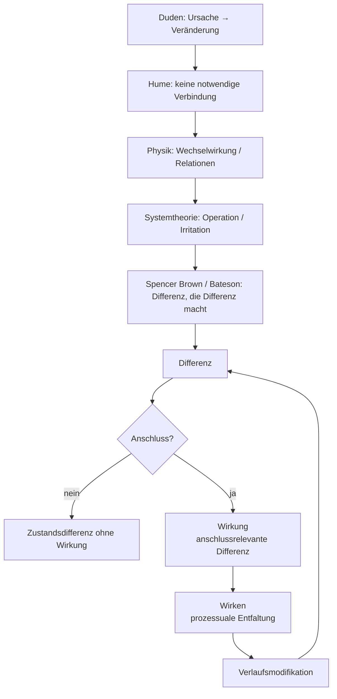

created: 21.2.2026 | [updated](): 22.2.2026 | [published](https://zenodo.org/records/###):  | [Austausch](https://github.com/jochen-hanisch/research/discussions) | [[Hinweise]]

# Einleitung

Der Begriff der Wirkung gehört zu den zentralen, zugleich jedoch selten explizit definierten Grundbegriffen wissenschaftlicher Praxis. In medizinischen, psychologischen, sozialwissenschaftlichen und bildungswissenschaftlichen Kontexten wird Wirkung regelmäßig verwendet, um Veränderungen, Effekte oder Resultate von Interventionen, Einflüssen oder Konstellationen zu beschreiben. Eine systematisch ausgearbeitete, disziplinübergreifend tragfähige Definition findet sich jedoch nur selten.

In der Medizin wird Wirkung typischerweise als messbarer Effekt eines Wirkstoffs oder therapeutischen Verfahrens verstanden. Im Mittelpunkt stehen beobachtbare Veränderungen, Dosis‑Wirkungs‑Beziehungen und Reproduzierbarkeit. In der empirischen Wirkungsforschung bezeichnet Wirkung meist eine statistisch erfassbare Veränderung, die auf eine Intervention zurückgeführt wird. Sozial‑ und bildungswissenschaftliche Diskurse erweitern diesen Rahmen um Kontextabhängigkeit, Nachhaltigkeit und gesellschaftliche Relevanz, ohne jedoch den Wirkbegriff selbst grundlegend zu klären.

Gemeinsam ist diesen Perspektiven die Orientierung an Veränderung, Relationalität und Zuschreibung. Unterschiedlich sind hingegen die impliziten Annahmen über Kausalität, Notwendigkeit und Determination. Klassische Ursache‑Wirkung‑Modelle unterstellen häufig eine lineare Verknüpfung zwischen Ereignissen, während komplexe Systeme, insbesondere soziale und pädagogische Kontexte, durch Kontingenz, Mehrdimensionalität und Selbstreferenzialität gekennzeichnet sind.

Vor diesem Hintergrund verfolgt die vorliegende Begriffsarbeit das Ziel, einen disziplinübergreifend anschlussfähigen Wirkbegriff zu entwickeln, der weder auf eine kraftbasierte Kausalmetapher reduziert noch in bloßer Beobachterrelativität aufgelöst wird. Ausgangspunkt ist die formale Bestimmung von Differenz, die unter Bedingungen von Anschlussrelevanz zur Wirkung wird. Damit wird Wirkung als verlaufsmodifizierende Differenz innerhalb eines relationalen Gefüges gefasst.

Die nachfolgende Herleitung entfaltet diesen Begriff schrittweise – von der alltagssprachlichen Semantik über erkenntnistheoretische und physikalische Perspektiven bis hin zur systemtheoretischen und formaltheoretischen Fundierung.

# 1 Definition

Wirkung bezeichnet eine im Verlauf rekonstruierbare Differenz zwischen Zuständen, die auf eine Konstellation bezogen wird und weitere Zustandsverläufe verändert.

Eine Differenz liegt vor, wenn zwischen mindestens zwei Zuständen ein unterscheidbarer Unterschied markiert werden kann. Nicht jede Differenz ist jedoch Wirkung. Zur Wirkung wird eine Differenz erst dann, wenn sie anschlussrelevant wird, das heißt, wenn sie weitere Operationen eines Systems verändert oder die Wahrscheinlichkeit zukünftiger Zustände verschiebt.

Wirkung ist damit weder als notwendige Verknüpfung zwischen Ereignissen noch als übertragene Kraft zu verstehen. Wirkung bezeichnet vielmehr eine verlaufsmodifizierende Differenz innerhalb eines relationalen Gefüges.

Zwei Präzisierungen sind dafür zentral. Erstens ist „Konstellation“ nicht bloß ein Auslöser im Sinne eines singulären Ereignisses, sondern ein Bündel aus Bedingungen, Relationen, Zeitpunkten und Anschlussmöglichkeiten, auf das die Differenz zugerechnet wird. Zweitens ist „Verlauf“ mehr als ein Vorher‑Nachher‑Vergleich: Wirkung zeigt sich dort, wo sich Anschlussoptionen verschieben, wo also nach der Differenz etwas anderes wahrscheinlicher wird, stabil bleibt oder ausbleibt.

Für Modellierungen kann es hilfreich sein, dieses Bündel als [[Wirkungsraum]] zu fassen: als den (konzeptionellen) Bereich, in dem relevante Einflüsse zusammenkommen und sich in ihren fördernden und hemmenden Anteilen überlagern. Der Wirkbegriff selbst hängt aber nicht an einer bestimmten Modellform; entscheidend bleibt die Anschlussrelevanz im Verlauf.

Praktisch lässt sich der Unterschied an einfachen Beispielen markieren. Eine neue Medikationsroutine kann eine messbare Zustandsänderung erzeugen (z. B. weniger Schmerzen); zur Wirkung im hier verwendeten Sinn wird sie erst, wenn diese Änderung weitere Operationen verändert (z. B. mehr Mobilität, andere Therapieentscheidungen, veränderte Interaktionsmuster im Alltag). Ähnlich in pädagogischen Kontexten: Eine Unterrichtsmethode ist nicht schon „wirksam“, weil ein Testwert steigt, sondern dann, wenn sich Lernanschlüsse stabilisieren, vertiefen oder neue Lernwege eröffnen.

Der Wirkbegriff verbindet damit Realitätsbezug und Zuschreibung, ohne beides zu verwechseln. Differenzen sind nicht beliebig; zugleich ist „Wirkung“ kein naturhaftes Etikett, das an einem Ereignis klebt. Wirkung ist eine begründete Zurechnung zu einer Konstellation, die sich an Anschlussveränderungen im Verlauf prüfen lässt.

# 2 Herleitung

Die Herleitung des Wirkbegriffs erfolgt schrittweise entlang unterschiedlicher theoretischer Bezugsebenen. Ziel ist keine historische Rekonstruktion, sondern eine systematische Verdichtung. Ausgangspunkt bildet die alltagssprachliche Semantik, da sie den impliziten Hintergrund vieler wissenschaftlicher Verwendungen markiert. Darauf aufbauend wird die erkenntnistheoretische Problematisierung entfaltet, welche die Annahme notwendiger Verknüpfungen relativiert. Die physikalische Perspektive führt eine relationale Bestimmung von Zustandsänderungen ein. In der systemtheoretischen Reformulierung wird Wirkung operativ bestimmt. Abschließend erfolgt eine formaltheoretische Präzisierung über den Begriff der Differenz.

Die Abfolge folgt einer begrifflichen Bewegung von intuitiver Veränderungszuschreibung hin zu einer strukturell bestimmten, operativ anschlussfähigen Differenzbestimmung. Jede Ebene reduziert implizite Annahmen und erhöht zugleich die formale Präzision des Begriffs.

## 2.1 Alltagssprachliche Grundsemantik (Duden)

Der Duden definiert Wirkung als „durch eine verursachende Kraft bewirkte Veränderung, Beeinflussung, bewirktes Ergebnis“. Diese Bestimmung enthält drei strukturelle Elemente: eine verursachende Instanz, eine Veränderung sowie ein Ergebnis. Wirkung erscheint hier als lineare Ursache‑Wirkung‑Relation. Diese Semantik ist kraftbasiert und impliziert eine notwendige Verknüpfung zwischen Ereignissen.

Für die vorliegende Arbeit ist diese Definition Ausgangspunkt, jedoch epistemisch zu eng. Sie liefert das Motiv der Veränderung, bleibt jedoch hinsichtlich Kontingenz, Beobachterabhängigkeit und relationaler Vermittlung unterbestimmt.

## 2.2 Erkenntnistheoretische Problematisierung (Hume)

David Hume zeigt, dass in der Beobachtung lediglich zeitliche Abfolge und regelmäßige Kopplung von Ereignissen wahrgenommen werden, nicht jedoch eine notwendige Verbindung. Kausalität erscheint damit als Zuschreibung stabiler Regularitäten. Wirkung ist demnach keine unmittelbar beobachtbare Kraft, sondern eine interpretative Struktur, die aus wiederholten Mustern abgeleitet wird.

Diese Einsicht entzieht der Wirkung jede metaphysische Notwendigkeit und verschiebt sie in den Bereich der Beobachtung und Erwartungsbildung.

Wichtig ist: Diese Verschiebung leugnet nicht, dass in der Welt etwas passiert. Sie verschiebt lediglich den Status dessen, was „Wirkung“ heißen soll. Statt „Wirkung“ als innere Kraft zu hypostasieren, wird sie als begründete Zurechnung verstanden, die sich an Regelmäßigkeiten, Abweichungen und an der Stabilität von Erwartungsstrukturen orientiert.

## 2.3 Physikalische Perspektive (Wechselwirkung)

In der modernen Physik werden Kräfte als Wechselwirkungen verstanden. Wirkung entsteht nicht durch einseitige Einwirkung, sondern innerhalb relationaler Strukturen. Felder vermitteln Zustandsänderungen; Energiezustände bestimmen mögliche Verläufe. Damit verschiebt sich das Wirkverständnis von isolierter Ursache zu strukturvermittelter Dynamik.

In dieser Perspektive wird „Wirkung“ häufig als Zustandsänderung innerhalb eines Gefüges von Relationen beschrieben. Für den hier entwickelten Wirkbegriff ist Zustandsänderung jedoch nur die notwendige Differenzbasis: Zur Wirkung im strengen Sinn wird eine Zustandsdifferenz erst dann, wenn sie anschlussrelevant wird, also weitere Operationen verändert oder Anschlusswahrscheinlichkeiten verschiebt.

## 2.4 Systemtheoretische Semantik (Operation und Anschluss)

Die Systemtheorie ersetzt die Kraftmetapher durch Operationslogik. Systeme operieren selbstreferenziell; Umwelt kann lediglich irritieren. Eine systeminterne Veränderung entsteht nur, wenn das System die Irritation in eigene Operationen überführt.

Wirkung ist damit keine Übertragung, sondern eine systeminterne Differenz, die anschlussrelevant wird. Entscheidend ist nicht die bloße Zustandsänderung, sondern die Veränderung weiterer Operationen.

Damit wird eine verbreitete Intuition korrigiert: „Wir haben X getan, also hat es Y bewirkt.“ Aus systemtheoretischer Sicht ist das zu grob. Man kann eine Irritation anbieten, Bedingungen verändern, Optionen öffnen oder schließen – ob und wie daraus Wirkung wird, entscheidet sich daran, ob das System (oder mehrere gekoppelte Systeme) diese Differenzen anschlussfähig verarbeitet. Wirkung ist also nicht „Input → Output“, sondern eine Frage der Anschlusslogik.

## 2.5 Formale Fundierung (Spencer Brown und Bateson)

Spencer Brown bestimmt mit dem Begriff der Unterscheidung die elementare Operation jeder Formbildung. Eine Differenz entsteht durch Markierung. Gregory Bateson präzisiert: Information ist „a difference that makes a difference“. Nicht jede Differenz ist wirksam; wirksam wird sie erst, wenn sie weitere Differenzen erzeugt.

Hier erreicht der Wirkbegriff seine formale Verdichtung: Wirkung bezeichnet eine Differenz, die anschlussrelevant wird und weitere Differenzen im Verlauf generiert. Damit wird Wirkung als verlaufsmodifizierende Differenz innerhalb eines relationalen Gefüges bestimmbar.

## 2.6 Prozessdimension: Wirken

Während „Wirkung“ die anschlussrelevante Differenz bezeichnet, verweist „wirken“ auf die prozessuale Dimension ihrer Hervorbringung. Wirken beschreibt den operativen Verlauf, in dem durch Unterscheidungen, Irritationen und Anschlussoperationen Differenzen entstehen, stabilisiert oder transformiert werden.

Wirken ist damit keine Übertragung von Kraft, sondern die zeitliche Entfaltung operativer Differenzerzeugung innerhalb eines relationalen Gefüges. Es bezeichnet die Dynamik, durch die Zustände sich verändern und Anschlusswahrscheinlichkeiten verschoben werden. Wirkung ist das als relevant markierte Resultat dieses Verlaufs; Wirken ist dessen operative Vollzugsform.

Im praktischen Sprachgebrauch zeigt sich diese Prozessdimension oft daran, dass Wirkungen zeitversetzt eintreten und sich erst im Nachlauf einer Intervention, einer Entscheidung oder eines Ereignisses stabilisieren. Gerade dort, wo Rückkopplungen wirksam werden, kann dieselbe Konstellation kurzfristig „erwünschte“ Effekte erzeugen und mittel‑ bis langfristig unerwünschte Nebenwirkungen nachziehen – oder umgekehrt. Deshalb ist Wirkung im strengen Sinn nicht mit dem ersten sichtbaren Effekt gleichzusetzen, sondern mit der anschlussrelevanten Veränderung von Verlaufsstrukturen.

Emergenz markiert dabei eine Grenze naiver Erwartung: Wirkungen können als Eigenschaften des Gesamtsystems auftreten, obwohl sie aus den Einzelelementen nicht ohne Weiteres ableitbar sind. Das spricht nicht gegen Wirkung, sondern gegen zu einfache Modelle ihrer Entstehung. Es erklärt auch, warum Wirkungszuschreibungen häufig mit Unsicherheit umgehen müssen, statt sie nur zu „reduzieren“.

## 2.7 Strukturdiagramm: Wirkung als verlaufsmodifizierende Differenz

Das Diagramm visualisiert die begriffliche Herleitung und die formale Struktur des Wirkbegriffs. In der oberen Ebene wird die argumentative Verdichtung dargestellt: von der alltagssprachlichen Ursache‑Wirkung‑Relation über die erkenntnistheoretische Problematisierung (Hume) und die physikalische Relationalität bis hin zur systemtheoretischen Operationslogik und der formalen Fundierung bei Spencer Brown und Bateson.

Die untere Ebene zeigt die operative Struktur: Ausgangspunkt ist eine Differenz. Erst wenn diese Differenz anschlussrelevant wird, entsteht Wirkung. Bleibt Anschluss aus, handelt es sich lediglich um eine Zustandsdifferenz ohne operative Konsequenz. Wird Anschluss generiert, entfaltet sich Wirken als prozessuale Dynamik, die den weiteren Verlauf modifiziert und wiederum neue Differenzen erzeugt. Das Diagramm bildet somit die zyklische Struktur von Differenz, Anschluss und Verlaufsmodifikation ab.

# 3 Folgerungen

Aus der Definition von Wirkung als verlaufsmodifizierende, anschlussrelevante Differenz ergeben sich folgende notwendige Konsequenzen:

## 3.1 Ontologische Folgerung

Nicht jede Zustandsänderung ist schon Wirkung. Eine Zustandsänderung ist zunächst eine Differenz; zur Wirkung wird sie ausschließlich dann, wenn sie weitere Zustandsverläufe verändert oder Anschlusswahrscheinlichkeiten verschiebt. Der Begriff zwingt damit zu einer sauberen Unterscheidung zwischen „es ist anders geworden“ und „es ist so anders geworden, dass es weiterwirkt“.

Damit ist Wirkung kategorial von bloßer Differenz zu unterscheiden. Jede Wirkung ist Differenz; nicht jede Differenz ist Wirkung.

## 3.2 Epistemologische Folgerung

Wirkung ist nicht unmittelbar als solche beobachtbar. Beobachtbar sind Zustände und Zustandsverläufe; Wirkung wird über den Vergleich mindestens zweier Zustände sowie deren Anschlussrelation bestimmt. Wer „Wirkung“ behauptet, behauptet damit immer auch eine bestimmte Rekonstruktion: Welche Differenz wurde markiert, auf welche Konstellation wurde sie bezogen, und woran zeigt sich der Anschluss?

Die Zuschreibung von Wirkung setzt somit die Markierung von Differenz und die Feststellung von Anschluss voraus.

## 3.3 Systemisch‑operative Folgerung

Wirkung wird nicht „zwischen Systemen“ übertragen wie ein Paket. Sie entsteht als systeminterne Modifikation von Operationsverläufen – auch dann, wenn mehrere Systeme strukturell gekoppelt sind und sich wechselseitig irritieren. Für Praxis und Forschung heißt das: Man kann Einflüsse beschreiben, Interventionen ansetzen und Kopplungen analysieren, aber die Entstehung von Wirkung bleibt an die jeweilige Anschlusslogik gebunden.

Eine Differenz wird zur Wirkung, sofern sie weitere Operationen verändert oder die Wahrscheinlichkeit zukünftiger Zustände verschiebt. Wirkung ist daher operativ bestimmt und nicht als notwendige Kausalverknüpfung zu verstehen.

# 4 Implikationen

Aus dem bestimmten Wirkbegriff ergeben sich Implikationen für Theorie, Methodologie und Praxis. Diese Implikationen betreffen nicht die interne Logik des Begriffs, sondern dessen Anwendung und Reichweite.

## 4.1 Methodologische Implikation

Methodologisch folgt: Wirkung ist nicht punktuell messbar. Die Identifikation von Wirkung erfordert Verlaufsbeobachtung – mindestens in dem Sinn, dass Anschlussveränderungen sichtbar werden müssen. Vorher‑Nachher‑Vergleiche können ausreichen, aber nur dann, wenn sie mehr leisten als ein Differenzsignal: Sie müssen die Anschlussstruktur mit abbilden (z. B. Stabilität, Folgeentscheidungen, Rückkopplungen, Abbruch‑ oder Verstärkungseffekte).

Wirkungsanalyse muss daher Differenzketten rekonstruieren: Es ist zu prüfen, ob eine Zustandsänderung weitere Operationen verändert oder Anschlusswahrscheinlichkeiten verschiebt. Wirkungsmessung wird damit zur Analyse von Verlaufsstrukturen.

Das schließt klassische Designs nicht aus; es verschiebt nur den Fokus. Eine Effektstärke kann ein Hinweis sein, aber noch kein Wirkungsbegriff. Wo möglich, sind Ergänzungen hilfreich: Prozessdaten, Zeitreihen, qualitative Verlaufsrekonstruktion, Vergleich von Anschlussmustern in ähnlichen Konstellationen. Kurz: Nicht „tritt etwas auf?“, sondern „wie setzt es sich fort?“

## 4.2 Modelltheoretische Implikation

Weil Wirkung innerhalb eines relationalen Gefüges entsteht, sind lineare Ursache‑Wirkung‑Ketten modelltheoretisch unzureichend. Modelle müssen Relationen, Rückkopplungen und Anschlussbedingungen darstellen.

Wirkmodelle sind daher als Gefügemodelle zu konzipieren. Interventionen wirken nicht isoliert, sondern verändern Konstellationen. Jede Maßnahme modifiziert strukturelle Bedingungen und damit zukünftige Anschlussmöglichkeiten.

Das kann sehr unterschiedliche Modellformen annehmen – vom Kausaldiagramm mit Rückkopplungen über Netzwerke bis zu simulationsbasierten Ansätzen. Entscheidend ist nicht die Modellfamilie, sondern die Fähigkeit, Anschlussbedingungen explizit zu machen: Wo werden Optionen geöffnet, wo werden sie geschlossen, und welche Stabilisierungseffekte treten auf?

## 4.3 Probabilistische Implikation

Wird Wirkung als Verschiebung von Anschlusswahrscheinlichkeiten verstanden, ist sie nicht deterministisch bestimmbar. Wirkung ist graduell, kontextabhängig und kontingent.

Theoretische und empirische Modelle müssen daher mit Wahrscheinlichkeitsräumen operieren. Aussagen über Wirkung beziehen sich auf Erhöhungen oder Verringerungen von Anschlusswahrscheinlichkeiten, nicht auf notwendige Resultate.

In dieser Lesart ist „wirksam“ kein Alles‑oder‑Nichts‑Prädikat. Plausibler ist eine Abstufung: Eine Konstellation kann die Wahrscheinlichkeit bestimmter Anschlüsse deutlich erhöhen, leicht erhöhen oder auch senken. Für die Kommunikation von Ergebnissen bedeutet das: Statt „hat gewirkt“ sind Aussagen wie „macht X unter Bedingungen Y wahrscheinlicher“ häufig präziser.

Für eine formale Modellierung lässt sich diese probabilistische Perspektive mit dem Begriff des [[Wirkungsraum]]s verbinden: Als Modellrahmen macht er explizit, dass gleichzeitig fördernde und hemmende Einflüsse auftreten können. Die [[Wirkungswahrscheinlichkeit]] bietet dann eine Operationalisierung, um Verschiebungen im Anschlussgeschehen zu beschreiben. Wichtig ist dabei, „Wahrscheinlichkeit“ nicht vorschnell im engeren, klassischen Sinn zu lesen: Der in diesen Notizen verwendete Wertebereich von −1 bis +1 ist eine vorzeichenbehaftete Maßzahl, die Richtung (erwünscht/unerwünscht relativ zu einem Kriterium) und Intensität abbildet.

## 4.4 Bildungstheoretische Implikation

Für pädagogische Kontexte folgt, dass Lernen nicht erzeugt, sondern nur wahrscheinlicher gemacht werden kann. Didaktische Gestaltung bedeutet Strukturierung von Anschlussmöglichkeiten.

Erfolg kann nicht als garantierte Wirkung einer Maßnahme verstanden werden. Verantwortlich ist die Gestaltung der Bedingungen, unter denen Differenzen anschlussrelevant werden können.

Didaktisch rückt damit die Frage in den Vordergrund, welche Anschlüsse vorbereitet werden: Welche Unterscheidungen sollen Lernende treffen können? Welche Übungsformen stabilisieren diese Unterscheidungen? Welche Rückmeldeschleifen ermöglichen Korrektur, Vertiefung oder Transfer? Wirkung zeigt sich dann weniger in einem punktuellen Output, sondern in der Qualität der Anschlussfähigkeit.

## 4.5 Verantwortungstheoretische Implikation

Unter Bedingungen kontingenter, anschlussrelevanter Wirkung kann Verantwortung nicht auf garantierbare Ergebnisse bezogen werden. Da Wirkung keine notwendige Kausalfolge darstellt, lässt sich Verantwortung nicht als Ergebnisverantwortung im Sinne sicherer Wirkungsproduktion bestimmen.

Verantwortung ist damit als Verantwortung für die Gestaltung von Bedingungen zu präzisieren. Verantwortlich ist die Strukturierung von Relationen, Anschlussmöglichkeiten und Wahrscheinlichkeitsräumen, innerhalb derer Differenzen wirksam werden können. In medizinischen wie pädagogischen Kontexten bedeutet dies ein Primat der Gefügegestaltung gegenüber dem Anspruch determinierter Resultate.

Diese Perspektive entlastet nicht von Verantwortung, sondern präzisiert sie: Verantwortung bezieht sich auf die reflexive Gestaltung operativer Bedingungen unter Anerkennung von Kontingenz.

# 5 Kritik

Wie bei jeder Begriffsarbeit lässt sich auch hier an mehreren Stellen nachhaken: nach dem Realitätsbezug, nach dem Verhältnis zu Kausalität, nach der empirischen Handhabbarkeit, nach praktischen Verantwortungsfragen und nach der Anschlussfähigkeit innerhalb der Systemtheorie selbst. Die folgenden Punkte nehmen typische Einwände auf und beantworten sie so, dass die tragenden Unterscheidungen des Wirkbegriffs sichtbar bleiben.

## 5.1 Ontologische Kritik: Verlust von Realitätsgehalt

Ein naheliegender Einwand lautet: Wenn Wirkung als anschlussrelevante Differenz bestimmt wird, verliere der Begriff seinen Realitätsgehalt und werde zur bloßen Zuschreibung. Dann wäre „Wirkung“ nicht mehr Eigenschaft der Welt, sondern nur ein Etikett des Beobachters.

Dagegen spricht, dass der Wirkbegriff die Realität von Zustands‑ und Strukturveränderungen ausdrücklich nicht bestreitet. Die Anschlussdimension sagt nicht, *ob* es Differenzen gibt, sondern *wann* eine Differenz als Wirkung zu bestimmen ist. Wirkung ist damit weder Projektion noch metaphysische Kraft, sondern eine reale Differenz, die sich in Anschlussveränderungen niederschlägt und als solche rekonstruierbar ist.

## 5.2 Kausalitätstheoretische Kritik: Aufgabe von Ursache-Wirkung-Logik

Man kann außerdem fragen, ob die Abkehr von einer linearen Ursache‑Wirkung‑Relation nicht letztlich Kausalität relativiert. Gerade in medizinischen Kontexten wirkt eine probabilistische Bestimmung schnell wie eine Abschwächung: „Wenn es nur Wahrscheinlichkeiten sind, ist es dann überhaupt noch Kausalität?“

Der Vorschlag ist jedoch kein Ersatz, sondern eine Reformulierung: Kausalität wird als Struktur von Anschlusswahrscheinlichkeiten und als Modifikation von Anschlussbedingungen verstanden. In komplexen Systemen steigt damit die Erklärungskraft, weil Kontextabhängigkeit, Rückkopplungen und Mehrdimensionalität nicht als Störfaktoren, sondern als Teil des Modells erscheinen. Deterministische Beschreibungen bleiben möglich – allerdings als Spezialfall relativ stabiler Konstellationen.

## 5.3 Operationalisierungskritik: Empirische Unschärfe

Auf der Ebene empirischer Forschung liegt ein dritter Einwand nahe: Wenn Wirkung als verlaufsmodifizierende Differenz verstanden wird, wird sie schwerer zu identifizieren. Der Begriff scheint analytisch anspruchsvoll, aber praktisch kaum messbar.

Tatsächlich erhöht die Präzisierung zunächst die Komplexität – sie ersetzt dafür Unschärfe durch Kriterien. Wirkung wird nicht an einem isolierten Effekt festgemacht, sondern an rekonstruierbaren Differenzketten und an Anschlussveränderungen. Genau dadurch werden Evaluationsdesigns differenzierbar, insbesondere dort, wo dynamische Kontexte (Bildung, Versorgung, Organisation) punktuelle Messungen systematisch überfordern.

## 5.4 Verantwortungspraktische Kritik: Verschiebung von Ergebnisverantwortung

Auch normativ ist Kritik erwartbar: Die Verschiebung von Ergebnis‑ zu Strukturverantwortung könnte wie eine Entlastungsstrategie wirken („Wenn niemand Ergebnisse garantieren kann, ist am Ende niemand verantwortlich“).

Genau das ist nicht gemeint. Die Argumentation entzieht Verantwortung nicht, sie präzisiert ihren Bezugspunkt. Unter Kontingenzbedingungen sind Ergebnisgarantien schlicht begrenzt; verantwortlich bleibt, wer Bedingungen gestaltet, Relationen strukturiert und Wahrscheinlichkeitsräume eröffnet oder verengt. Ethisch wird dadurch deutlicher unterscheidbar, was intendiert war, welche Bedingungen tatsächlich geschaffen wurden und wie sich der Verlauf realisiert hat.

## 5.5 Systemtheorie‑interne Kritik: Reduktion auf Anschluss

Schließlich kann man aus systemtheoretischer Perspektive einwenden, der Wirkbegriff sei redundant: Am Ende beschreibe er doch nur Anschlussfähigkeit oder Anschlussoperationen und füge nichts Eigenständiges hinzu.

Der Unterschied liegt in der Beobachtungsebene. Anschluss bezeichnet die operative Fortsetzung von Kommunikation oder Systemoperation; Wirkung bezeichnet die spezifische Differenz, die diese Fortsetzung verschiebt, auslöst oder modifiziert. Während Anschluss eine Strukturkategorie der Fortlauf‑Operation ist, markiert Wirkung die differenzielle Veränderung *im* Verlauf. Als Beobachtungskategorie macht sie damit sichtbar, *wodurch* und *wie* Anschlussmuster verändert werden – und eröffnet genau deshalb eine probabilistische Analyse von Verlaufsmodifikationen.

# 6 Zusammenfassung

Der entwickelte Wirkbegriff bestimmt Wirkung als verlaufsmodifizierende, anschlussrelevante Differenz innerhalb eines relationalen Gefüges. Ausgangspunkt bildet die formale Bestimmung von Differenz. Eine Zustandsänderung erhält den Status von Wirkung, sofern sie weitere Operationen verändert oder Anschlusswahrscheinlichkeiten verschiebt.

Die Herleitung zeigt eine begriffliche Verdichtung über mehrere Ebenen: Die alltagssprachliche Veränderungssemantik wird erkenntnistheoretisch relativiert, relational präzisiert und systemtheoretisch operativ reformuliert. In der formaltheoretischen Fundierung erhält Wirkung ihre strukturelle Bestimmung als Differenz, die weitere Differenzen generiert.

Realitätsbezogen bleibt Wirkung als Zustands‑ bzw. Strukturveränderung bestimmbar. Epistemologisch ist sie über Differenzmarkierung und Anschlussanalyse erschließbar. Systemisch ist sie als interne Modifikation von Operationsverläufen zu verstehen. Diese dreifache Perspektive integriert Realitätsbezug, Beobachtungslogik und Operationsstruktur.

Die daraus abgeleiteten Implikationen betreffen Methodologie, Modellbildung, Wahrscheinlichkeitstheorie, Didaktik und Verantwortung. Wirkungsmessung erfordert Verlaufsanalyse, Wirkmodelle sind als Gefügemodelle zu konzipieren, Aussagen über Wirkung beziehen sich auf Wahrscheinlichkeitsverschiebungen. Verantwortung richtet sich auf die reflexive Gestaltung von Bedingungen innerhalb kontingenter Strukturen.

Der Wirkbegriff erhält damit eine formale, theoretisch anschlussfähige und interdisziplinär tragfähige Gestalt. Er erlaubt die Beschreibung dynamischer Prozesse, ohne auf kraftbasierte Kausalannahmen zurückzugreifen, und eröffnet eine differenzierte Analyse komplexer Bildungs- und Versorgungskontexte.

# Quelle(n)

- Bateson, G. (1985). *Geist und Natur. Eine notwendige Einheit* (Übers. aus dem Engl.). Suhrkamp. (Originalarbeit veröffentlicht 1979)
- Bandura, A. (1997). *Self-Efficacy: The Exercise of Control*. W.H. Freeman.
- Brown, G. S. (1972). *Laws of Form*. Allen & Unwin.
- Deci, E. L., & Ryan, R. M. (1985). *Intrinsic Motivation and Self-Determination in Human Behavior*. Plenum Press.
- Dudenredaktion. (2023). *Duden – Die deutsche Rechtschreibung* (28. Aufl.). Dudenverlag.
- Feynman, R. P. (1987). *Negative Probability*. In H. Wolfe (Ed.), *Quantum Implications: Essays in Honour of David Bohm*. Routledge & Kegan Paul.
- Hanisch, J. (2020). *Notfallsanitäter. Systemische Interventionskompetenz durch High Responsibility Teams in kritischen Situationen: Eine qualitative Inhaltsanalyse der berufsausbildenden Grundlagenliteratur*. GRIN Publishing GmbH.
- Hume, D. (1993). *Eine Untersuchung über den menschlichen Verstand* (Übers. von J. Kulenkampff). Meiner. (Originalarbeit veröffentlicht 1748)
- Luhmann, N. (1984). *Soziale Systeme. Grundriß einer allgemeinen Theorie*. Suhrkamp.
- Luhmann, N. (1997). *Die Gesellschaft der Gesellschaft*. Suhrkamp.
- Niedrig, H. (1992). Übersicht über die fundamentalen Wechselwirkungen. In H. Niedrig (Hrsg.), *Physik* (S. 1–15). Springer.
- Vygotsky, L. S. (1978). *Mind in Society: The Development of Higher Psychological Processes*. Harvard University Press.
