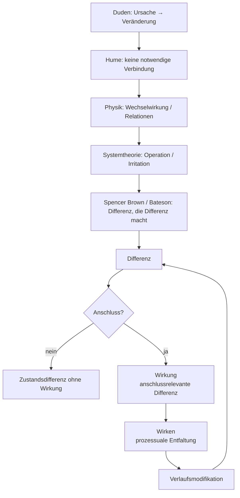

created: 21.2.2026 | [updated](): 21.2.2026 | [published](https://zenodo.org/records/###):  | [Austausch](https://github.com/jochen-hanisch/research/discussions) | [[Hinweise]]

# Einleitung

Der Begriff der Wirkung gehört zu den zentralen, zugleich jedoch selten explizit definierten Grundbegriffen wissenschaftlicher Praxis. In medizinischen, psychologischen, sozialwissenschaftlichen und bildungswissenschaftlichen Kontexten wird Wirkung regelmäßig verwendet, um Veränderungen, Effekte oder Resultate von Interventionen, Einflüssen oder Konstellationen zu beschreiben. Eine systematisch ausgearbeitete, disziplinübergreifend tragfähige Definition findet sich jedoch nur selten.

In der Medizin wird Wirkung typischerweise als messbarer Effekt eines Wirkstoffs oder therapeutischen Verfahrens verstanden. Im Mittelpunkt stehen beobachtbare Veränderungen, Dosis‑Wirkungs‑Beziehungen und Reproduzierbarkeit. In der empirischen Wirkungsforschung bezeichnet Wirkung meist eine statistisch erfassbare Veränderung, die auf eine Intervention zurückgeführt wird. Sozial‑ und bildungswissenschaftliche Diskurse erweitern diesen Rahmen um Kontextabhängigkeit, Nachhaltigkeit und gesellschaftliche Relevanz, ohne jedoch den Wirkbegriff selbst grundlegend zu klären.

Gemeinsam ist diesen Perspektiven die Orientierung an Veränderung, Relationalität und Zuschreibung. Unterschiedlich sind hingegen die impliziten Annahmen über Kausalität, Notwendigkeit und Determination. Klassische Ursache‑Wirkung‑Modelle unterstellen häufig eine lineare Verknüpfung zwischen Ereignissen, während komplexe Systeme, insbesondere soziale und pädagogische Kontexte, durch Kontingenz, Mehrdimensionalität und Selbstreferenzialität gekennzeichnet sind.

Vor diesem Hintergrund verfolgt die vorliegende Begriffsarbeit das Ziel, einen disziplinübergreifend anschlussfähigen Wirkbegriff zu entwickeln, der weder auf eine kraftbasierte Kausalmetapher reduziert noch in bloßer Beobachterrelativität aufgelöst wird. Ausgangspunkt ist die formale Bestimmung von Differenz, die unter Bedingungen von Anschlussrelevanz zur Wirkung wird. Damit wird Wirkung als verlaufsmodifizierende Differenz innerhalb eines relationalen Gefüges gefasst.

Die nachfolgende Herleitung entfaltet diesen Begriff schrittweise – von der alltagssprachlichen Semantik über erkenntnistheoretische und physikalische Perspektiven bis hin zur systemtheoretischen und formaltheoretischen Fundierung.

# 1 Definition

Wirkung bezeichnet eine im Verlauf beobachtbare Differenz zwischen Zuständen, die auf eine Konstellation bezogen wird und weitere Zustandsverläufe verändert.

Eine Differenz liegt vor, wenn zwischen mindestens zwei Zuständen ein unterscheidbarer Unterschied markiert werden kann. Nicht jede Differenz ist jedoch Wirkung. Zur Wirkung wird eine Differenz erst dann, wenn sie anschlussrelevant wird, das heißt, wenn sie weitere Operationen eines Systems verändert oder die Wahrscheinlichkeit zukünftiger Zustände verschiebt.

Wirkung ist damit weder als notwendige Verknüpfung zwischen Ereignissen noch als übertragene Kraft zu verstehen. Wirkung bezeichnet vielmehr eine verlaufsmodifizierende Differenz innerhalb eines relationalen Gefüges.

# 2 Herleitung

## 2.1 Alltagssprachliche Grundsemantik (Duden)

Der Duden definiert Wirkung als „durch eine verursachende Kraft bewirkte Veränderung, Beeinflussung, bewirktes Ergebnis“. Diese Bestimmung enthält drei strukturelle Elemente: eine verursachende Instanz, eine Veränderung sowie ein Ergebnis. Wirkung erscheint hier als lineare Ursache‑Wirkung‑Relation. Diese Semantik ist kraftbasiert und impliziert eine notwendige Verknüpfung zwischen Ereignissen.

Für die vorliegende Arbeit ist diese Definition Ausgangspunkt, jedoch epistemisch zu eng. Sie liefert das Motiv der Veränderung, bleibt jedoch hinsichtlich Kontingenz, Beobachterabhängigkeit und relationaler Vermittlung unterbestimmt.

## 2.2 Erkenntnistheoretische Problematisierung (Hume)

David Hume zeigt, dass in der Beobachtung lediglich zeitliche Abfolge und regelmäßige Kopplung von Ereignissen wahrgenommen werden, nicht jedoch eine notwendige Verbindung. Kausalität erscheint damit als Zuschreibung stabiler Regularitäten. Wirkung ist demnach keine unmittelbar beobachtbare Kraft, sondern eine interpretative Struktur, die aus wiederholten Mustern abgeleitet wird.

Diese Einsicht entzieht der Wirkung jede metaphysische Notwendigkeit und verschiebt sie in den Bereich der Beobachtung und Erwartungsbildung.

## 2.3 Physikalische Perspektive (Wechselwirkung)

In der modernen Physik werden Kräfte als Wechselwirkungen verstanden. Wirkung entsteht nicht durch einseitige Einwirkung, sondern innerhalb relationaler Strukturen. Felder vermitteln Zustandsänderungen; Energiezustände bestimmen mögliche Verläufe. Damit verschiebt sich das Wirkverständnis von isolierter Ursache zu strukturvermittelter Dynamik.

Wirkung erscheint hier als Zustandsänderung innerhalb eines Gefüges von Relationen.

## 2.4 Systemtheoretische Semantik (Operation und Anschluss)

Die Systemtheorie ersetzt die Kraftmetapher durch Operationslogik. Systeme operieren selbstreferenziell; Umwelt kann lediglich irritieren. Eine Veränderung entsteht nur, wenn das System die Irritation in eigene Operationen überführt.

Wirkung ist damit keine Übertragung, sondern eine systeminterne Differenz, die anschlussrelevant wird. Entscheidend ist nicht die bloße Zustandsänderung, sondern die Veränderung weiterer Operationen.

## 2.5 Formale Fundierung (Spencer Brown und Bateson)

Spencer Brown bestimmt mit dem Begriff der Unterscheidung die elementare Operation jeder Formbildung. Eine Differenz entsteht durch Markierung. Gregory Bateson präzisiert: Information ist „a difference that makes a difference“. Nicht jede Differenz ist wirksam; wirksam wird sie erst, wenn sie weitere Differenzen erzeugt.

Hier erreicht der Wirkbegriff seine formale Verdichtung: Wirkung bezeichnet eine Differenz, die anschlussrelevant wird und weitere Differenzen im Verlauf generiert. Damit wird Wirkung als verlaufsmodifizierende Differenz innerhalb eines relationalen Gefüges bestimmbar.

## 2.6 Prozessdimension: Wirken

Während „Wirkung“ die anschlussrelevante Differenz bezeichnet, verweist „wirken“ auf die prozessuale Dimension ihrer Hervorbringung. Wirken beschreibt den operativen Verlauf, in dem durch Unterscheidungen, Irritationen und Anschlussoperationen Differenzen entstehen, stabilisiert oder transformiert werden.

Wirken ist damit keine Übertragung von Kraft, sondern die zeitliche Entfaltung operativer Differenzerzeugung innerhalb eines relationalen Gefüges. Es bezeichnet die Dynamik, durch die Zustände sich verändern und Anschlusswahrscheinlichkeiten verschoben werden. Wirkung ist das als relevant markierte Resultat dieses Verlaufs; Wirken ist dessen operative Vollzugsform.

## 2.7 Strukturdiagramm: Wirkung als verlaufsmodifizierende Differenz

Das Diagramm visualisiert die begriffliche Herleitung und die formale Struktur des Wirkbegriffs. In der oberen Ebene wird die argumentative Verdichtung dargestellt: von der alltagssprachlichen Ursache‑Wirkung‑Relation über die erkenntnistheoretische Problematisierung (Hume) und die physikalische Relationalität bis hin zur systemtheoretischen Operationslogik und der formalen Fundierung bei Spencer Brown und Bateson.

Die untere Ebene zeigt die operative Struktur: Ausgangspunkt ist eine Differenz. Erst wenn diese Differenz anschlussrelevant wird, entsteht Wirkung. Bleibt Anschluss aus, handelt es sich lediglich um eine Zustandsdifferenz ohne operative Konsequenz. Wird Anschluss generiert, entfaltet sich Wirken als prozessuale Dynamik, die den weiteren Verlauf modifiziert und wiederum neue Differenzen erzeugt. Das Diagramm bildet somit die zyklische Struktur von Differenz, Anschluss und Verlaufsmodifikation ab.

# 3 Folgerungen

Aus der Definition von Wirkung als verlaufsmodifizierende, anschlussrelevante Differenz ergeben sich folgende notwendige Konsequenzen:

## 3.1 Ontologische Folgerung (A)

Wenn Wirkung eine anschlussrelevante Differenz ist, folgt, dass nicht jede Zustandsänderung Wirkung darstellt. Eine Zustandsänderung ist als Differenz zu bestimmen; zur Wirkung wird sie ausschließlich dann, wenn sie weitere Zustandsverläufe verändert.

Damit ist Wirkung kategorial von bloßer Differenz zu unterscheiden. Jede Wirkung ist Differenz; nicht jede Differenz ist Wirkung.

## 3.2 Epistemologische Folgerung (B)

Wenn Wirkung eine Differenz bezeichnet, die weitere Differenzen erzeugt, folgt, dass Wirkung nicht unmittelbar als solche beobachtbar ist. Beobachtbar sind Zustände und Zustandsverläufe; Wirkung wird über den Vergleich mindestens zweier Zustände sowie deren Anschlussrelation bestimmt.

Die Zuschreibung von Wirkung setzt somit die Markierung von Differenz und die Feststellung von Anschluss voraus.

## 3.3 Systemisch‑operative Folgerung (C)

Wenn Wirkung als anschlussrelevante Differenz innerhalb eines Systems bestimmt wird, folgt, dass Wirkung nicht zwischen Systemen übertragen wird, sondern als systeminterne Modifikation entsteht.

Eine Differenz wird zur Wirkung, sofern sie weitere Operationen verändert oder die Wahrscheinlichkeit zukünftiger Zustände verschiebt. Wirkung ist daher operativ bestimmt und nicht als notwendige Kausalverknüpfung zu verstehen.

# 4 Implikationen

# 5 Kritik

# 6 Zusammenfassung

# Quelle(n)

---

#Begriff #Definition #Research #Wahrscheinlichkeitstheorie #Systemtheorie #Psychologie #Forschung #Bildungswissenschaft #Wirkungsraum