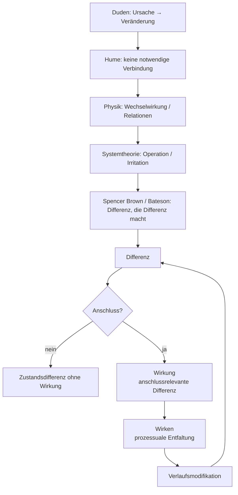

created: 21.2.2026 | [updated](): 22.2.2026 | [published](https://zenodo.org/records/###):  | [Austausch](https://github.com/jochen-hanisch/research/discussions) | [[Hinweise]]

# Einleitung

Der Begriff der Wirkung gehört zu den zentralen, zugleich jedoch selten explizit definierten Grundbegriffen wissenschaftlicher Praxis. In medizinischen, psychologischen, sozialwissenschaftlichen und bildungswissenschaftlichen Kontexten wird Wirkung regelmäßig verwendet, um Veränderungen, Effekte oder Resultate von Interventionen, Einflüssen oder Konstellationen zu beschreiben. Eine systematisch ausgearbeitete, disziplinübergreifend tragfähige Definition findet sich jedoch nur selten.

In der Medizin wird Wirkung typischerweise als messbarer Effekt eines Wirkstoffs oder therapeutischen Verfahrens verstanden. Im Mittelpunkt stehen beobachtbare Veränderungen, Dosis‑Wirkungs‑Beziehungen und Reproduzierbarkeit. In der empirischen Wirkungsforschung bezeichnet Wirkung meist eine statistisch erfassbare Veränderung, die auf eine Intervention zurückgeführt wird. Sozial‑ und bildungswissenschaftliche Diskurse erweitern diesen Rahmen um Kontextabhängigkeit, Nachhaltigkeit und gesellschaftliche Relevanz, ohne jedoch den Wirkbegriff selbst grundlegend zu klären.

Gemeinsam ist diesen Perspektiven die Orientierung an Veränderung, Relationalität und Zuschreibung. Unterschiedlich sind hingegen die impliziten Annahmen über Kausalität, Notwendigkeit und Determination. Klassische Ursache‑Wirkung‑Modelle unterstellen häufig eine lineare Verknüpfung zwischen Ereignissen, während komplexe Systeme, insbesondere soziale und pädagogische Kontexte, durch Kontingenz, Mehrdimensionalität und Selbstreferenzialität gekennzeichnet sind.

Vor diesem Hintergrund verfolgt die vorliegende Begriffsarbeit das Ziel, einen disziplinübergreifend anschlussfähigen Wirkbegriff zu entwickeln, der weder auf eine kraftbasierte Kausalmetapher reduziert noch in bloßer Beobachterrelativität aufgelöst wird. Ausgangspunkt ist die formale Bestimmung von Differenz, die unter Bedingungen von Anschlussrelevanz zur Wirkung wird. Damit wird Wirkung als verlaufsmodifizierende Differenz innerhalb eines relationalen Gefüges gefasst.

Die nachfolgende Herleitung entfaltet diesen Begriff schrittweise – von der alltagssprachlichen Semantik über erkenntnistheoretische und physikalische Perspektiven bis hin zur systemtheoretischen und formaltheoretischen Fundierung.

# 1 Definition

Wirkung bezeichnet eine im Verlauf rekonstruierbare Differenz zwischen Zuständen, die auf eine Konstellation bezogen wird und weitere Zustandsverläufe verändert.

Eine Differenz liegt vor, wenn zwischen mindestens zwei Zuständen ein unterscheidbarer Unterschied markiert werden kann. Nicht jede Differenz ist jedoch Wirkung. Zur Wirkung wird eine Differenz erst dann, wenn sie anschlussrelevant wird, das heißt, wenn sie weitere Operationen eines Systems verändert oder die Wahrscheinlichkeit zukünftiger Zustände verschiebt.

Wirkung ist damit weder als notwendige Verknüpfung zwischen Ereignissen noch als übertragene Kraft zu verstehen. Wirkung bezeichnet vielmehr eine verlaufsmodifizierende Differenz innerhalb eines relationalen Gefüges.

# 2 Herleitung

Die Herleitung des Wirkbegriffs erfolgt schrittweise entlang unterschiedlicher theoretischer Bezugsebenen. Ziel ist keine historische Rekonstruktion, sondern eine systematische Verdichtung. Ausgangspunkt bildet die alltagssprachliche Semantik, da sie den impliziten Hintergrund vieler wissenschaftlicher Verwendungen markiert. Darauf aufbauend wird die erkenntnistheoretische Problematisierung entfaltet, welche die Annahme notwendiger Verknüpfungen relativiert. Die physikalische Perspektive führt eine relationale Bestimmung von Zustandsänderungen ein. In der systemtheoretischen Reformulierung wird Wirkung operativ bestimmt. Abschließend erfolgt eine formaltheoretische Präzisierung über den Begriff der Differenz.

Die Abfolge folgt einer begrifflichen Bewegung von intuitiver Veränderungszuschreibung hin zu einer strukturell bestimmten, operativ anschlussfähigen Differenzbestimmung. Jede Ebene reduziert implizite Annahmen und erhöht zugleich die formale Präzision des Begriffs.

## 2.1 Alltagssprachliche Grundsemantik (Duden)

Der Duden definiert Wirkung als „durch eine verursachende Kraft bewirkte Veränderung, Beeinflussung, bewirktes Ergebnis“. Diese Bestimmung enthält drei strukturelle Elemente: eine verursachende Instanz, eine Veränderung sowie ein Ergebnis. Wirkung erscheint hier als lineare Ursache‑Wirkung‑Relation. Diese Semantik ist kraftbasiert und impliziert eine notwendige Verknüpfung zwischen Ereignissen.

Für die vorliegende Arbeit ist diese Definition Ausgangspunkt, jedoch epistemisch zu eng. Sie liefert das Motiv der Veränderung, bleibt jedoch hinsichtlich Kontingenz, Beobachterabhängigkeit und relationaler Vermittlung unterbestimmt.

## 2.2 Erkenntnistheoretische Problematisierung (Hume)

David Hume zeigt, dass in der Beobachtung lediglich zeitliche Abfolge und regelmäßige Kopplung von Ereignissen wahrgenommen werden, nicht jedoch eine notwendige Verbindung. Kausalität erscheint damit als Zuschreibung stabiler Regularitäten. Wirkung ist demnach keine unmittelbar beobachtbare Kraft, sondern eine interpretative Struktur, die aus wiederholten Mustern abgeleitet wird.

Diese Einsicht entzieht der Wirkung jede metaphysische Notwendigkeit und verschiebt sie in den Bereich der Beobachtung und Erwartungsbildung.

## 2.3 Physikalische Perspektive (Wechselwirkung)

In der modernen Physik werden Kräfte als Wechselwirkungen verstanden. Wirkung entsteht nicht durch einseitige Einwirkung, sondern innerhalb relationaler Strukturen. Felder vermitteln Zustandsänderungen; Energiezustände bestimmen mögliche Verläufe. Damit verschiebt sich das Wirkverständnis von isolierter Ursache zu strukturvermittelter Dynamik.

In dieser Perspektive wird „Wirkung“ häufig als Zustandsänderung innerhalb eines Gefüges von Relationen beschrieben. Für den hier entwickelten Wirkbegriff ist Zustandsänderung jedoch nur die notwendige Differenzbasis: Zur Wirkung im strengen Sinn wird eine Zustandsdifferenz erst dann, wenn sie anschlussrelevant wird, also weitere Operationen verändert oder Anschlusswahrscheinlichkeiten verschiebt.

## 2.4 Systemtheoretische Semantik (Operation und Anschluss)

Die Systemtheorie ersetzt die Kraftmetapher durch Operationslogik. Systeme operieren selbstreferenziell; Umwelt kann lediglich irritieren. Eine systeminterne Veränderung entsteht nur, wenn das System die Irritation in eigene Operationen überführt.

Wirkung ist damit keine Übertragung, sondern eine systeminterne Differenz, die anschlussrelevant wird. Entscheidend ist nicht die bloße Zustandsänderung, sondern die Veränderung weiterer Operationen.

## 2.5 Formale Fundierung (Spencer Brown und Bateson)

Spencer Brown bestimmt mit dem Begriff der Unterscheidung die elementare Operation jeder Formbildung. Eine Differenz entsteht durch Markierung. Gregory Bateson präzisiert: Information ist „a difference that makes a difference“. Nicht jede Differenz ist wirksam; wirksam wird sie erst, wenn sie weitere Differenzen erzeugt.

Hier erreicht der Wirkbegriff seine formale Verdichtung: Wirkung bezeichnet eine Differenz, die anschlussrelevant wird und weitere Differenzen im Verlauf generiert. Damit wird Wirkung als verlaufsmodifizierende Differenz innerhalb eines relationalen Gefüges bestimmbar.

## 2.6 Prozessdimension: Wirken

Während „Wirkung“ die anschlussrelevante Differenz bezeichnet, verweist „wirken“ auf die prozessuale Dimension ihrer Hervorbringung. Wirken beschreibt den operativen Verlauf, in dem durch Unterscheidungen, Irritationen und Anschlussoperationen Differenzen entstehen, stabilisiert oder transformiert werden.

Wirken ist damit keine Übertragung von Kraft, sondern die zeitliche Entfaltung operativer Differenzerzeugung innerhalb eines relationalen Gefüges. Es bezeichnet die Dynamik, durch die Zustände sich verändern und Anschlusswahrscheinlichkeiten verschoben werden. Wirkung ist das als relevant markierte Resultat dieses Verlaufs; Wirken ist dessen operative Vollzugsform.

## 2.7 Strukturdiagramm: Wirkung als verlaufsmodifizierende Differenz

Das Diagramm visualisiert die begriffliche Herleitung und die formale Struktur des Wirkbegriffs. In der oberen Ebene wird die argumentative Verdichtung dargestellt: von der alltagssprachlichen Ursache‑Wirkung‑Relation über die erkenntnistheoretische Problematisierung (Hume) und die physikalische Relationalität bis hin zur systemtheoretischen Operationslogik und der formalen Fundierung bei Spencer Brown und Bateson.

Die untere Ebene zeigt die operative Struktur: Ausgangspunkt ist eine Differenz. Erst wenn diese Differenz anschlussrelevant wird, entsteht Wirkung. Bleibt Anschluss aus, handelt es sich lediglich um eine Zustandsdifferenz ohne operative Konsequenz. Wird Anschluss generiert, entfaltet sich Wirken als prozessuale Dynamik, die den weiteren Verlauf modifiziert und wiederum neue Differenzen erzeugt. Das Diagramm bildet somit die zyklische Struktur von Differenz, Anschluss und Verlaufsmodifikation ab.

# 3 Folgerungen

Aus der Definition von Wirkung als verlaufsmodifizierende, anschlussrelevante Differenz ergeben sich folgende notwendige Konsequenzen:

## 3.1 Ontologische Folgerung (A)

Wenn Wirkung eine anschlussrelevante Differenz ist, folgt, dass nicht jede Zustandsänderung Wirkung darstellt. Eine Zustandsänderung ist als Differenz zu bestimmen; zur Wirkung wird sie ausschließlich dann, wenn sie weitere Zustandsverläufe verändert.

Damit ist Wirkung kategorial von bloßer Differenz zu unterscheiden. Jede Wirkung ist Differenz; nicht jede Differenz ist Wirkung.

## 3.2 Epistemologische Folgerung (B)

Wenn Wirkung eine Differenz bezeichnet, die weitere Differenzen erzeugt, folgt, dass Wirkung nicht unmittelbar als solche beobachtbar ist. Beobachtbar sind Zustände und Zustandsverläufe; Wirkung wird über den Vergleich mindestens zweier Zustände sowie deren Anschlussrelation bestimmt.

Die Zuschreibung von Wirkung setzt somit die Markierung von Differenz und die Feststellung von Anschluss voraus.

## 3.3 Systemisch‑operative Folgerung (C)

Wenn Wirkung als anschlussrelevante Differenz innerhalb eines Systems bestimmt wird, folgt, dass Wirkung nicht zwischen Systemen übertragen wird, sondern als systeminterne Modifikation entsteht.

Eine Differenz wird zur Wirkung, sofern sie weitere Operationen verändert oder die Wahrscheinlichkeit zukünftiger Zustände verschiebt. Wirkung ist daher operativ bestimmt und nicht als notwendige Kausalverknüpfung zu verstehen.

# 4 Implikationen

Aus dem bestimmten Wirkbegriff ergeben sich Implikationen für Theorie, Methodologie und Praxis. Diese Implikationen betreffen nicht die interne Logik des Begriffs, sondern dessen Anwendung und Reichweite.

## 4.1 Methodologische Implikation

Wenn Wirkung als verlaufsmodifizierende, anschlussrelevante Differenz bestimmt ist, folgt methodologisch, dass Wirkung nicht punktuell messbar ist. Die Identifikation von Wirkung erfordert Verlaufsbeobachtung. Vorher‑Nachher‑Vergleiche sind nur dann hinreichend, wenn sie Anschlussveränderungen erfassen.

Wirkungsanalyse muss daher Differenzketten rekonstruieren: Es ist zu prüfen, ob eine Zustandsänderung weitere Operationen verändert oder Anschlusswahrscheinlichkeiten verschiebt. Wirkungsmessung wird damit zur Analyse von Verlaufsstrukturen.

## 4.2 Modelltheoretische Implikation

Wenn Wirkung innerhalb eines relationalen Gefüges entsteht, folgt modelltheoretisch, dass lineare Ursache‑Wirkung‑Ketten unzureichend sind. Modelle müssen Relationen, Rückkopplungen und Anschlussbedingungen darstellen.

Wirkmodelle sind daher als Gefügemodelle zu konzipieren. Interventionen wirken nicht isoliert, sondern verändern Konstellationen. Jede Maßnahme modifiziert strukturelle Bedingungen und damit zukünftige Anschlussmöglichkeiten.

## 4.3 Probabilistische Implikation

Wenn Wirkung als Verschiebung von Anschlusswahrscheinlichkeiten verstanden wird, folgt, dass Wirkung nicht deterministisch bestimmbar ist. Wirkung ist graduell, kontextabhängig und kontingent.

Theoretische und empirische Modelle müssen daher mit Wahrscheinlichkeitsräumen operieren. Aussagen über Wirkung beziehen sich auf Erhöhungen oder Verringerungen von Anschlusswahrscheinlichkeiten, nicht auf notwendige Resultate.

## 4.4 Bildungstheoretische Implikation

Für pädagogische Kontexte folgt, dass Lernen nicht erzeugt, sondern nur wahrscheinlicher gemacht werden kann. Didaktische Gestaltung bedeutet Strukturierung von Anschlussmöglichkeiten.

Erfolg kann nicht als garantierte Wirkung einer Maßnahme verstanden werden. Verantwortlich ist die Gestaltung der Bedingungen, unter denen Differenzen anschlussrelevant werden können.

## 4.5 Verantwortungstheoretische Implikation

Wenn Wirkung als kontingente, anschlussrelevante Differenz verstanden wird, folgt, dass Verantwortung nicht auf garantierbare Ergebnisse bezogen werden kann. Da Wirkung keine notwendige Kausalfolge darstellt, kann Verantwortung nicht als Ergebnisverantwortung im Sinne sicherer Wirkungsproduktion bestimmt werden.

Verantwortung ist damit als Verantwortung für die Gestaltung von Bedingungen zu präzisieren. Verantwortlich ist die Strukturierung von Relationen, Anschlussmöglichkeiten und Wahrscheinlichkeitsräumen, innerhalb derer Differenzen wirksam werden können. In medizinischen wie pädagogischen Kontexten bedeutet dies ein Primat der Gefügegestaltung gegenüber dem Anspruch determinierter Resultate.

Diese Perspektive entlastet nicht von Verantwortung, sondern präzisiert sie: Verantwortung bezieht sich auf die reflexive Gestaltung operativer Bedingungen unter Anerkennung von Kontingenz.

# 5 Kritik

Die folgende Kritik entfaltet mögliche Einwände gegen den entwickelten Wirkbegriff. Jedem Kritikpunkt wird eine systematisch begründete Antwort oder Präzisierung gegenübergestellt.

## 5.1 Ontologische Kritik: Verlust von Realitätsgehalt

**Einwand:**

Wenn Wirkung als anschlussrelevante Differenz bestimmt wird, droht der Vorwurf, der Begriff verliere seinen Realitätsgehalt. Wirkung erscheine lediglich als Beobachtungszuschreibung und nicht als objektive Eigenschaft der Welt.

**Antwort und Präzisierung:**

Der entwickelte Wirkbegriff negiert nicht die Realität von Zustandsveränderungen. Realitätsbezogen bleibt die Differenz als Zustands‑ bzw. Strukturveränderung bestimmbar. Die Anschlussdimension präzisiert lediglich, unter welchen Bedingungen eine Differenz als Wirkung bestimmt wird. Wirkung ist damit weder bloße Projektion noch metaphysische Kraft, sondern operativ erzeugte und real wirksame Strukturmodifikation.

## 5.2 Kausalitätstheoretische Kritik: Aufgabe von Ursache-Wirkung-Logik

**Einwand:**

Die Abkehr von einer linearen Ursache‑Wirkung‑Relation könnte als Relativierung von Kausalität verstanden werden. Insbesondere in medizinischen Kontexten erscheint eine probabilistische Bestimmung von Wirkung als theoretische Abschwächung.

**Antwort und Präzisierung:**

Der Wirkbegriff ersetzt nicht Kausalität, sondern reformuliert sie. Kausalität wird als Wahrscheinlichkeitsstruktur und Anschlussmodifikation bestimmt. In komplexen Systemen erhöht diese Perspektive die Erklärungskraft, da sie Kontingenz, Kontextabhängigkeit und Mehrdimensionalität berücksichtigt. Deterministische Modelle bleiben als Spezialfälle innerhalb stabiler Konstellationen integrierbar.

## 5.3 Operationalisierungskritik: Empirische Unschärfe

**Einwand:**

Wenn Wirkung als verlaufsmodifizierende Differenz verstanden wird, könnte die empirische Identifikation erschwert werden. Der Begriff erscheine analytisch anspruchsvoll und praktisch schwer messbar.

**Antwort und Präzisierung:**

Die theoretische Präzisierung erhöht zunächst die Komplexität, schafft jedoch methodische Klarheit. Wirkung wird nicht an isolierten Effekten festgemacht, sondern an rekonstruierbaren Differenzketten und Anschlussveränderungen. Dies ermöglicht differenziertere Evaluationsdesigns, insbesondere in dynamischen Bildungs- und Versorgungskontexten.

## 5.4 Verantwortungspraktische Kritik: Verschiebung von Ergebnisverantwortung

**Einwand:**

Die Verschiebung von Ergebnisverantwortung hin zu Strukturverantwortung könnte als Entlastungsstrategie interpretiert werden.

**Antwort und Präzisierung:**

Die Theorie verschiebt Verantwortung nicht im Sinne einer Entlastung, sondern präzisiert ihren Bezugspunkt. Ergebnisgarantien werden unter Bedingungen von Kontingenz begrenzt; Verantwortung besteht in der reflektierten Gestaltung von Gefügen und Wahrscheinlichkeitsräumen, die Anschlussmöglichkeiten eröffnen oder einschränken. Diese Perspektive erhöht die ethische Präzision, da sie zwischen intendierter Maßnahme, gestalteten Bedingungen und tatsächlichem Verlauf unterscheidet.

## 5.5 Systemtheorie‑interne Kritik: Reduktion auf Anschluss

**Einwand:**

Innerhalb systemtheoretischer Perspektiven könnte eingewendet werden, der entwickelte Wirkbegriff führe keinen eigenständigen Begriff ein, sondern paraphrasiere lediglich das Konzept des Anschlusses. Wirkung erscheine dann als redundante Bezeichnung für Anschlussfähigkeit oder Anschlussoperation.

**Antwort und Präzisierung:**

Der Wirkbegriff ist nicht mit Anschluss identisch. Anschluss bezeichnet die operative Fortsetzung von Kommunikation oder Systemoperation. Wirkung hingegen bestimmt die spezifische Differenz, die diese Anschlussveränderung auslöst oder modifiziert. Während Anschluss eine Strukturkategorie fortlaufender Operation darstellt, markiert Wirkung die differenzielle Verschiebung innerhalb dieses Verlaufs.

Wirkung ist somit kein Ersatzbegriff für Anschluss, sondern eine Beobachtungskategorie für verlaufsmodifizierende Differenzen. Sie ermöglicht es, operative Dynamiken als differenzielle Transformationen zu beschreiben und probabilistisch zu analysieren. Dadurch gewinnt der Anschlussbegriff eine zusätzliche analytische Tiefenschärfe.

# 6 Zusammenfassung

Der entwickelte Wirkbegriff bestimmt Wirkung als verlaufsmodifizierende, anschlussrelevante Differenz innerhalb eines relationalen Gefüges. Ausgangspunkt bildet die formale Bestimmung von Differenz. Eine Zustandsänderung erhält den Status von Wirkung, sofern sie weitere Operationen verändert oder Anschlusswahrscheinlichkeiten verschiebt.

Die Herleitung zeigt eine begriffliche Verdichtung über mehrere Ebenen: Die alltagssprachliche Veränderungssemantik wird erkenntnistheoretisch relativiert, relational präzisiert und systemtheoretisch operativ reformuliert. In der formaltheoretischen Fundierung erhält Wirkung ihre strukturelle Bestimmung als Differenz, die weitere Differenzen generiert.

Ontologisch bleibt Wirkung als reale Strukturveränderung bestimmbar. Epistemologisch ist sie über Differenzmarkierung und Anschlussanalyse erschließbar. Systemisch ist sie als interne Modifikation von Operationsverläufen zu verstehen. Diese dreifache Perspektive integriert Realitätsbezug, Beobachtungslogik und Operationsstruktur.

Die daraus abgeleiteten Implikationen betreffen Methodologie, Modellbildung, Wahrscheinlichkeitstheorie, Didaktik und Verantwortung. Wirkungsmessung erfordert Verlaufsanalyse, Wirkmodelle sind als Gefügemodelle zu konzipieren, Aussagen über Wirkung beziehen sich auf Wahrscheinlichkeitsverschiebungen. Verantwortung richtet sich auf die reflexive Gestaltung von Bedingungen innerhalb kontingenter Strukturen.

Der Wirkbegriff erhält damit eine formale, theoretisch anschlussfähige und interdisziplinär tragfähige Gestalt. Er erlaubt die Beschreibung dynamischer Prozesse, ohne auf kraftbasierte Kausalannahmen zurückzugreifen, und eröffnet eine differenzierte Analyse komplexer Bildungs- und Versorgungskontexte.

# Quelle(n)

- Bateson, G. (1985). *Geist und Natur. Eine notwendige Einheit* (Übers. aus dem Engl.). Suhrkamp. (Originalarbeit veröffentlicht 1979)
- Brown, G. S. (1972). *Laws of Form*. Allen & Unwin.
- Dudenredaktion. (2023). *Duden – Die deutsche Rechtschreibung* (28. Aufl.). Dudenverlag.
- Hume, D. (1993). *Eine Untersuchung über den menschlichen Verstand* (Übers. von J. Kulenkampff). Meiner. (Originalarbeit veröffentlicht 1748)
- Luhmann, N. (1984). *Soziale Systeme. Grundriß einer allgemeinen Theorie*. Suhrkamp.
- Luhmann, N. (1997). *Die Gesellschaft der Gesellschaft*. Suhrkamp.
- Niedrig, H. (1992). Übersicht über die fundamentalen Wechselwirkungen. In H. Niedrig (Hrsg.), *Physik* (S. 1–15). Springer.
