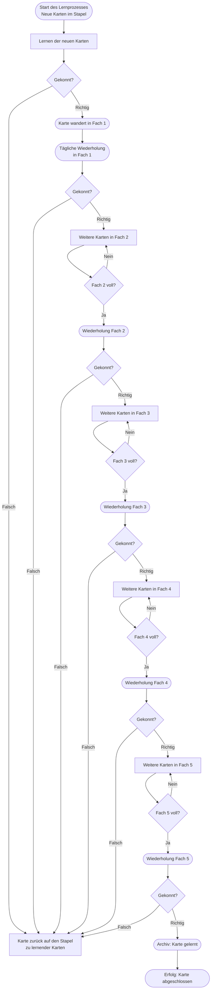

created: 18.12.2024 | updated: 18.12.2024 | published: dd.mm.2025 | [[Allgemein beruflich/Webseite/Hinweise]]

# Einleitung 

Die vorliegende Arbeit entwickelt eine Didaktik für digitale Bildungsräume auf Grundlage des klassischen Lernkarteikartenkastens. Die Methode, ursprünglich auf die systematische Wiederholung von Lerninhalten in einer strukturierten Abfolge von Fächern ausgerichtet, wird hier theoretisch erweitert und an die Anforderungen moderner, digitaler Lernumgebungen angepasst. 

Im Zentrum dieser Arbeit steht die Verknüpfung der bewährten systemischen Lernprinzipien – Feedback, Reflexion und Re-entry – mit digitalen Technologien wie Learning Management Systemen (LMS), Augmented Reality (AR), Virtual Reality (VR) und Künstlicher Intelligenz (KI). Der Lernprozess wird dabei in seiner Gesamtheit betrachtet, indem neben kognitiven Lernzielen auch **emotionale**, psychomotorische und soziale Dimensionen einbezogen werden. 

Die Arbeit untersucht, inwiefern die Methode des Lernkarteikartenkastens durch digitale Erweiterungen neue Anwendungsfelder erschließen kann. Dabei wird der Lernprozess systematisch analysiert, mathematisch modelliert und um die Aspekte Bedürfnisse und Emotionen ergänzt. Diese Erweiterungen ermöglichen eine flexible Anpassung der Methode an individuelle Lernbedürfnisse und unterschiedliche Anwendungsbereiche. 

Ziel dieser Arbeit ist, ein theoretisches Modell zu entwickeln, das als Grundlage für die Gestaltung zukünftiger digitaler Lernumgebungen dient. Die Ergebnisse zeigen, dass die Methode des Lernkarteikartenkastens eine klare Struktur bietet, die sich durch digitale Technologien erweitern und für verschiedene Lernziele nutzbar machen lässt. 

# 1 Definition

Die Methode des Lernkarteikartenkastens beschreibt ein systemisches Lernmodell, das auf [[Lernen als universelles Prinzip]] basiert. Dieses Prinzip ermöglicht eine strukturierte, wiederholte Repräsentation, indem Lerninhalte schrittweise in verschiedenen Fächern (Stufen) organisiert werden.

Der Prozess folgt einer klaren Logik, die auf den fundamentalen Operationen Feedback, Reflexion und Re-entry beruht:

- **Feedback** liefert eine wertneutrale Rückmeldung über den aktuellen Lernstand und markiert, ob eine Karte „gekonnt“ oder „nicht gekonnt“ wurde.
- **Reflexion** dient der bewussten Verarbeitung dieser Rückmeldung, um Lernentscheidungen zu treffen, wie das Aufsteigen in ein höheres Fach oder das Wiederholen von Inhalten.
- **Re-entry** integriert das Ergebnis der Reflexion in den Lernprozess, indem Karten entweder in ein höheres Fach wandern oder in den Wiederholungszyklus zurückkehren.

Die Methode nutzt exponentiell wachsende Wiederholungsintervalle, um neuronale Gedächtnisstrukturen nachhaltig zu stärken und das Vergessen zu minimieren. Dabei entfaltet der Lernkarteikasten seine Wirksamkeit als emergentes, selbstorganisiertes System.

## 1.1 Drei fundamentale Operationen

1. **Feedback**:  
	Feedback ist eine wertneutrale Rückmeldung über den aktuellen Lernstand. Es tritt in jedem Prozessschritt auf, unabhängig davon, ob eine Lernkarte „gekonnt“ oder „nicht gekonnt“ wurde. Diese Rückmeldung ist essenziell, um den Status des Lernens zu dokumentieren und eine Grundlage für weitere Operationen zu schaffen.
    
2. **Reflexion**:  
    Reflexion ist die individuelle Verarbeitung des Feedbacks durch die Lernenden. Auf Grundlage der Rückmeldung entscheiden die Lernenden oder das System (Kasten), ob die Karte in ein höheres Fach aufsteigt („gekonnt“) oder zur Wiederholung zurückkehrt („nicht gekonnt“). Dieser Prozess ermöglicht die bewusste Auseinandersetzung mit den Inhalten und optimiert das Lernverhalten.
    
3. **Re-entry**:  
    Re-entry bezeichnet die systemische Rückführung des Ergebnisses aus der Reflexion in den Lernprozess. Karten, die „nicht gekonnt“ wurden, kehren in das Startfach zurück und durchlaufen den Prozess erneut. Karten, die „gekonnt“ wurden, treten in höhere Fächer ein. Dieser zyklische Prozess fördert die Selbstorganisation des Systems und die nachhaltige Konsolidierung von Wissen.

## 1.2 Struktur und Funktionsweise

Der Lernprozess basiert auf einer definierten Abfolge, bei der Lernkarten durch Feedback, Reflexion und Re-entry systematisch organisiert werden. Diese Operationen ermöglichen eine strukturierte Wiederholung von Inhalten und sorgen für exponentiell wachsende Wiederholungsintervalle. Das Zusammenspiel dieser Mechanismen führt zu:

- **Nachhaltiger Gedächtniskonsolidierung**: Wiederholungen in optimalen Intervallen verhindern Vergessen und stärken neuronale Verbindungen.
- **Selbstreguliertem Lernen**: Lernende reflektieren ihr Wissen eigenständig und passen ihre Strategien an.
- **Systemischer Organisation**: Der Kasten fungiert als emergentes System, das durch Rückkopplung kontinuierliche Lernfortschritte erzeugt.

## 1.3 Erweiterungen in den digitalen Raum

Die Methode lässt sich schrittweise in den digitalen Bildungsraum übertragen und erweitert ihre Wirksamkeit durch:

1. **Learning Management Systeme (LMS)**: Automatisierte Wiederholungsintervalle und adaptives Feedback.
2. **Augmented Reality (AR)**: Erweiterung um räumliche und interaktive Visualisierungen.
3. **Virtual Reality (VR)**: Immersive Lernumgebungen für kognitive und psychomotorische Inhalte.
4. **Künstliche Intelligenz (KI)**: Personalisiertes Lernen durch prädiktive Analysen und adaptive Inhalte.

Diese Erweiterungen ermöglichen es, die Methode über die Zweidimensionalität hinaus auf multisensorische, dreidimensionale und psychomotorische Lernprozesse auszuweiten, ohne die drei fundamentalen Operationen – Feedback, Reflexion und Re-entry – zu verlieren.

# 2 Herleitung

Die Methode des Lernkarteikartenkastens basiert auf einer systematischen Abfolge von Feedback, Reflexion und Re-entry. Durch regelmäßige Wiederholungen (Spaced Repetition) und gezieltes Fehlerlernen entsteht ein kontinuierlicher Lernfortschritt, der neurobiologisch (Langzeitpotenzierung), psychologisch (Selbstwirksamkeit, Motivation) und systemtheoretisch begründet ist.

Historisch entwickelte sich die Methode aus dem klassischen Karteikartenprinzip, das erstmals systematisch von Sebastian Leitner beschrieben wurde und auf die Vergessenskurve nach Ebbinghaus (1885) Bezug nimmt. Die Kombination von zeitlich verteilten Wiederholungen und klaren Rückmeldungen zur Lernleistung macht die Methode wirksam und flexibel.

Digitale Erweiterungen, wie Learning Management Systeme (LMS), Augmented Reality (AR) und Virtual Reality (VR), überwinden die ursprüngliche Zweidimensionalität und ermöglichen personalisiertes, praxisnahes und immersives Lernen. Künstliche Intelligenz (KI) unterstützt zusätzlich durch adaptive Intervallsteuerung, personalisiertes Feedback und prädiktive Analysen.

Die Methode erfüllt grundlegende psychische Bedürfnisse (Bindung, Kontrolle, Selbstwert, Lust) und wirkt auf Emotionen wie Freude und Frustration. Sie bietet damit eine fundierte Grundlage für die Gestaltung moderner digitaler Bildungsräume, die kognitive, emotionale und soziale Lernziele gleichermaßen berücksichtigen.

## 2.1 Biologisch

Die biologische Grundlage der Methode des Lernkarteikartenkastens lässt sich durch die Mechanismen der Neuroplastizität und der Langzeitpotenzierung erklären. Neuroplastizität beschreibt die Fähigkeit des Gehirns, sich durch Erfahrungen und wiederholte Reize strukturell und funktionell anzupassen. Diese Anpassungsfähigkeit bildet die Grundlage für Lernprozesse und Gedächtnisbildung. Hebb (1949) formulierte dies mit dem Prinzip „Neurons that fire together, wire together“, das beschreibt, wie synaptische Verbindungen durch wiederholte gemeinsame Aktivierung gestärkt werden. Dies bedeutet, dass das wiederholte Abrufen und Auseinandersetzen mit Inhalten zu einer Stabilisierung und effizienteren Nutzung neuronaler Verbindungen führt. Im Lernkarteikartenkasten wird dieser Mechanismus durch die strukturierte und zeitlich verteilte Wiederholung systematisch gefördert.

Ein weiterer zentraler Mechanismus ist die Langzeitpotenzierung, die als biologisches Korrelat für Lern- und Gedächtnisprozesse gilt. Langzeitpotenzierung beschreibt die langfristige Verstärkung der synaptischen Übertragung, wenn Neuronen wiederholt aktiviert werden (Bliss & Lomo, 1973). Im Lernkarteikartenkasten entsteht durch regelmäßige Wiederholung eine kontinuierliche Aktivierung relevanter neuronaler Netzwerke. Diese Aktivierung verhindert das Abschwächen synaptischer Verbindungen und unterstützt die Konsolidierung von Informationen im Langzeitgedächtnis. Baddeley (2000) beschreibt diesen Prozess als Überführung von Informationen aus dem Arbeitsgedächtnis in das Langzeitgedächtnis, der durch gezielte Wiederholungen stabilisiert wird.

Ebbinghaus (1885) zeigte in seiner Untersuchung zur Vergessenskurve, dass Informationen ohne regelmäßige Wiederholung rasch vergessen werden. Die zeitlich verteilten Wiederholungen im Lernkarteikartenkasten wirken diesem Effekt entgegen. Die Methode nutzt gezielt wachsende Intervalle, um den Lernaufwand zu minimieren und die Gedächtniskonsolidierung zu maximieren. Murre und Dros (2015) replizierten die Vergessenskurve und bestätigten den Effekt, auch wenn sie auf methodische Schwächen der ursprünglichen Studien hinwiesen, wie die Nutzung sinnfreier Silben. Trotz dieser Kritik verdeutlicht die Vergessenskurve die biologische Notwendigkeit einer systematischen Wiederholung.

Der Lernkarteikartenkasten nutzt somit zentrale biologische Mechanismen der Gedächtnisbildung: die Stärkung neuronaler Verbindungen durch Neuroplastizität, die Langzeitpotenzierung und die Überführung von Informationen ins Langzeitgedächtnis durch zeitlich strukturierte Wiederholung.

## 2.2 Psychologisch

Die psychologische Wirkung des Lernkarteikartenkastens beruht auf den Prinzipien des Feedbacks, der Reflexion und der Motivation, die durch sichtbare Fortschritte gefördert werden. Ein zentraler psychologischer Mechanismus ist hierbei das Konzept der **Selbstwirksamkeit**, wie von Bandura (1997) beschrieben wurde. Selbstwirksamkeit bezeichnet das Vertrauen in die eigenen Fähigkeiten, bestimmte Aufgaben erfolgreich zu bewältigen. Im Lernkarteikartenkasten entsteht dieses Vertrauen durch die wiederholten Erfolgserlebnisse beim Verschieben von Karten in höhere Fächer. Dieser Prozess schafft ein unmittelbares, sichtbares Feedback, das die Motivation stärkt und die Lernenden zu weiterer Anstrengung anregt.

Ein weiterer bedeutender Mechanismus ist das Prinzip der Spaced Repetition. Im Gegensatz zum massierten Lernen, bei dem Inhalte in kurzer Zeit intensiv wiederholt werden, basiert Spaced Repetition auf zeitlich verteilten Wiederholungen. Studien haben gezeigt, dass dieses Verfahren zu einer tieferen Verarbeitung der Lerninhalte führt und das Vergessen signifikant reduziert. Cepeda et al. (2006) belegen, dass zeitlich verteiltes Üben zu besseren Ergebnissen beim langfristigen Behalten führt, während massiertes [[Lernen als universelles Prinzip|Lernen]] kurzfristig effizient, aber langfristig ineffektiv ist. Die regelmäßigen Intervalle im Lernkarteikartenkasten verhindern die schnelle Verdrängung von Informationen durch neue Reize, wie sie Bjork (1994) beschreibt.

Ein weiterer psychologischer Aspekt ist die Förderung der Reflexion. Die wiederholte Auseinandersetzung mit Inhalten und insbesondere mit Fehlern stößt metakognitive Prozesse an, die für die Optimierung des Lernverhaltens entscheidend sind. Dieser Reflexionsprozess ermöglicht Lernenden, Fehlerquellen zu identifizieren und ihre Strategien anzupassen. Zimmerman (2000) beschreibt diesen Vorgang als **Selbstreguliertes Lernen**, bei dem Lernende ihre Ziele, Handlungen und Ergebnisse kontinuierlich überwachen und anpassen, um das [[Lernen als universelles Prinzip|Lernen]] effektiver zu gestalten.

Die psychologischen Mechanismen des Lernkarteikartenkastens – Selbstwirksamkeit, Spaced Repetition und Reflexion – führen somit zu einer nachhaltigen Lernmotivation und einer tieferen kognitiven Verarbeitung. Durch das sichtbare Fortschrittserlebnis und die systematische Fehlerkorrektur wird der Lernprozess langfristig optimiert.

## 2.3 Sozial

Die soziale Dimension des Lernkarteikartenkastens zeigt sich insbesondere in kooperativen Lernprozessen und im Einsatz von Peer-Feedback. Während die Methode ursprünglich auf individuelles [[Lernen als universelles Prinzip|Lernen]] ausgerichtet ist, bietet sie zugleich klare Strukturen, die gezielt für gemeinschaftliche Lernprozesse genutzt werden können. Die soziale Interaktion fördert nicht nur das Verständnis der Inhalte, sondern stärkt auch die Motivation und das Engagement der Lernenden.

Ein zentraler Aspekt ist das **Peer-Learning**, bei dem Lernende sich gegenseitig beim Prüfen der Karten unterstützen. Das Peer-Learning schafft eine kooperative Lernumgebung, in der Inhalte durch gemeinsames Erklären und Überprüfen vertieft werden. Die aktive Beteiligung am Lernprozess und das Unterstützen anderer Lernender verbessern nicht nur das eigene Verständnis, sondern fördern auch die soziale Verantwortung innerhalb der Lerngruppe. Dies trägt zur Erhöhung der Motivation und zur Stärkung des Gruppenzusammenhalts bei.

Darüber hinaus entstehen durch den Lernkarteikartenkasten **Feedback-Schleifen**, die die kognitive Verarbeitung der Inhalte verbessern. Das gegenseitige Erklären und Diskutieren der Inhalte ermöglicht es, das [[Epistemosphäre|Wissen]] aus unterschiedlichen Perspektiven zu betrachten und Lücken im eigenen Verständnis zu identifizieren. Dieser Prozess entspricht dem von Vygotsky (1978) beschriebenen Prinzip der **Zone der nächsten Entwicklung**, wonach Lernende in der Interaktion mit kompetenteren Partnern oder Gleichgesinnten höhere Leistungsniveaus erreichen können, als ihnen allein möglich wäre.

Im digitalen Raum gewinnt die soziale Dimension des Lernkarteikartenkastens zusätzliche Bedeutung. **Kollaboratives Lernen** wird durch den Einsatz von Learning Management Systemen oder Technologien wie Augmented Reality (AR) und Virtual Reality (VR) weiter erleichtert. Diese digitalen Plattformen ermöglichen gemeinschaftliches [[Lernen als universelles Prinzip|Lernen]] in synchronen oder asynchronen Kontexten, indem sie Kommunikations- und Interaktionsmöglichkeiten schaffen. Lernende können Inhalte gemeinsam bearbeiten, sich gegenseitig Feedback geben und in immersiven Lernumgebungen kooperative Aufgaben lösen.

Soziale Verstärkung durch Interaktion und Feedback spielt eine entscheidende Rolle für die langfristige Motivation der Lernenden und den Wissenstransfer. Die Möglichkeit, eigene Fortschritte sichtbar zu machen und durch andere validieren zu lassen, schafft ein positives Lernklima, das zur nachhaltigen Vertiefung der Inhalte beiträgt. Der Lernkarteikartenkasten ermöglicht so eine Synthese von individuellem und kooperativem Lernen, die sowohl die kognitiven als auch die sozialen Kompetenzen der Lernenden fördert.

## 2.4 Mentales Lernen

Mentales [[Lernen als universelles Prinzip|Lernen]] beschreibt die Fähigkeit, durch Vorstellungskraft und gezielte kognitive Prozesse Inhalte zu verinnerlichen und Abläufe zu trainieren. Im Gegensatz zu physischem Üben basiert mentales [[Lernen als universelles Prinzip|Lernen]] auf der Imagination von Handlungen oder Abläufen, die im Gehirn ähnliche neuronale Aktivitäten hervorrufen wie deren tatsächliche Ausführung. Decety und Grezes (1999) konnten nachweisen, dass die mentale Vorstellung von Bewegungen zu einer Aktivierung der motorischen Areale führt, die auch bei realen Ausführungen aktiv sind. Diese neuronale Überlappung zeigt, dass mentales [[Lernen als universelles Prinzip|Lernen]] ein effektives Mittel zur Optimierung von Fertigkeiten sein kann.

Die Methode des Lernkarteikartenkastens unterstützt mentales Lernen, indem sie durch gezielte Wiederholungen und Reflexionsprozesse die Auseinandersetzung mit den Lerninhalten verstärkt. Die regelmäßige Aktivierung von kognitiven Strukturen durch das Abrufen und Überprüfen der Inhalte fördert die Bildung und Konsolidierung mentaler Bilder. Diese Vorstellung von Inhalten ermöglicht Lernenden, die Abläufe oder Informationen gedanklich zu simulieren und so die Verankerung im Langzeitgedächtnis zu verbessern.

Besonders im psychomotorischen Bereich zeigt sich die Stärke des mentalen Lernens. Durch die wiederholte Imagination von Abläufen, wie sie durch die systematische Struktur des Lernkarteikartenkastens ermöglicht wird, entstehen präzise mentale Repräsentationen. Diese Repräsentationen tragen zur Verfeinerung von Bewegungsmustern bei und bereiten das Gehirn auf die tatsächliche Ausführung vor. Der Lernprozess wird dabei durch die Reflexion der mentalen Simulation ergänzt, was zu einer zusätzlichen Vertiefung der Inhalte führt.

Mentales [[Lernen als universelles Prinzip|Lernen]] im Rahmen des Lernkarteikartenkastens zeigt somit, dass kognitive Auseinandersetzung und Vorstellungskraft gleichermaßen zur Verinnerlichung von [[Epistemosphäre|Wissen]] und zur Optimierung von Fertigkeiten beitragen können. Die systematische Wiederholung und Reflexion stellen sicher, dass mentale Repräsentationen gefestigt und durch stetige Anpassungen optimiert werden.

## 2.5 Wissen, Können, Wollen und Kompetenz 

Die Methode des Lernkarteikartenkastens lässt sich im Hinblick auf die zentralen Elemente des Lernens – [[Epistemosphäre|Wissen]], Können, Wollen und [[Kompetenz]] – analysieren. Diese Begriffe sind in der Bildungswissenschaft eng miteinander verknüpft und beschreiben die Voraussetzungen sowie die Ergebnisse erfolgreicher Lernprozesse.

Wissen beschreibt die Fähigkeit, Informationen und Zusammenhänge im Gedächtnis zu speichern und gezielt abzurufen. Der Lernkarteikartenkasten unterstützt den Aufbau von Wissen, indem er durch wiederholtes Abrufen eine tiefere Verankerung der Inhalte ermöglicht. Die Prinzipien der Langzeitpotenzierung und der Gedächtniskonsolidierung, wie sie in biologischen Grundlagen erklärt wurden, gewährleisten, dass Informationen nachhaltig im Langzeitgedächtnis gespeichert werden. Die zeitlich verteilten Wiederholungen und die Reflexion im Lernprozess führen zu einer bewussten Auseinandersetzung mit dem Wissen, wodurch dieses nicht nur abrufbar, sondern auch flexibel anwendbar wird.

Können geht über das reine [[Epistemosphäre|Wissen]] hinaus und beschreibt die Fähigkeit, das Gelernte praktisch anzuwenden. Durch die Struktur des Lernkarteikartenkastens wird [[Epistemosphäre|Wissen]] schrittweise gefestigt und verinnerlicht, was eine Übertragung in Handlungen ermöglicht. Das regelmäßige Wiederholen und Prüfen von Inhalten ermöglicht Lernenden, die erlernten Informationen so zu automatisieren, dass sie in realen Situationen abrufbar sind. Die Reflexionsprozesse, die bei nicht gekonnten Karten ausgelöst werden, tragen zur kontinuierlichen Anpassung und Verbesserung des Könnens bei.

Wollen bezieht sich auf die Motivation und die Bereitschaft, sich mit den Lerninhalten auseinanderzusetzen. Die Methode des Lernkarteikartenkastens fördert das Wollen auf verschiedene Weise. Das Prinzip der Selbstwirksamkeit, wie dies von Bandura beschrieben wurde, spielt hierbei eine zentrale Rolle: Der sichtbare Lernfortschritt durch das Verschieben von Karten in höhere Fächer vermittelt Erfolgserlebnisse, die das Vertrauen in die eigenen Fähigkeiten stärken und die Motivation erhöhen. Zusätzlich wirkt das unmittelbare Feedback positiv auf die Lernbereitschaft, da dieses Fortschritte und Defizite sichtbar macht.

[[Kompetenz]] beschreibt die Fähigkeit, Wissen, Können und Wollen in konkreten Handlungssituationen zu verknüpfen und zielgerichtet einzusetzen. Im Lernkarteikartenkasten entsteht [[Kompetenz]] durch die Integration der verschiedenen Lernmechanismen: Das strukturierte Wiederholen fördert den Wissensaufbau, die Anwendung und Reflexion schulen das Können, und die motivationale Verstärkung unterstützt das Wollen. Durch diesen systematischen Prozess werden die Lernenden befähigt, Inhalte nicht nur zu reproduzieren, sondern sie auch flexibel in verschiedenen Kontexten anzuwenden.

Die Methode des Lernkarteikartenkastens trägt somit maßgeblich zur Entwicklung von Wissen, Können und Wollen bei, was in der Bildungstheorie als Grundlage für die Entstehung von [[Kompetenz]] betrachtet wird. Der iterative Charakter der Methode – mit Feedback, Reflexion und Re-entry – stellt sicher, dass Lernende kontinuierlich an ihrem [[Epistemosphäre|Wissen]] und ihren Fähigkeiten arbeiten, um sie zu festigen und auf neue Situationen zu übertragen.

## 2.6 Wirkmechanismen

Die Wirkmechanismen des Lernkarteikartenkastens beruhen auf einer Kombination aus neurobiologischen, psychologischen, sozialen und systemtheoretischen Prinzipien, die sich in Feedback, Reflexion und Re-entry als Kernprozesse widerspiegeln. Die strukturierte Wiederholung von Inhalten, der gezielte Umgang mit Fehlern und die motivationale Verstärkung durch sichtbare Fortschritte bilden die Grundlage für die systemische Wirksamkeit der Methode. Im Folgenden werden die zentralen Wirkmechanismen ausführlich dargestellt und mit wissenschaftlichen Erkenntnissen sowie Bezügen zu Ihrer Systemtheorie verknüpft.

### 2.6.1 Feedback als treibender Mechanismus

Feedback ist ein zentrales Element des Lernkarteikartenkastens und tritt in zwei Formen auf: unmittelbares Feedback und langfristiges Feedback durch die Verlagerung der Karten in verschiedene Fächer. Durch den wiederholten Abgleich von Ist-Zustand (gekonnt oder nicht gekonnt) mit dem Soll-Zustand entsteht eine kontinuierliche Rückkopplungsschleife. Dies entspricht den Prinzipien des **kybernetischen Lernens**, bei dem Systeme durch Rückmeldungen ihre Zustände regulieren und anpassen (Wiener, 1948).

Auf neurobiologischer Ebene wirkt Feedback durch Aktivierung des Belohnungssystems. Erfolgserlebnisse, die durch das Verschieben von Karten in höhere Fächer erzielt werden, führen zur Ausschüttung von **Dopamin**, das die Motivation und Lernbereitschaft verstärkt (Schultz, 2007). Gleichzeitig wird durch negatives Feedback, wie bei den nicht gekonnten Karten erfolgt, die Reflexion angestoßen, was zu einer tieferen Auseinandersetzung mit den Inhalten führt.

### 2.6.2 Reflexion und metakognitive Prozesse

Reflexion ist ein weiterer zentraler Wirkmechanismus der Methode. Durch die wiederholte Konfrontation mit Fehlern wird der Lernende gezwungen, seine Denk- und Lernprozesse bewusst zu hinterfragen und anzupassen. Dies fördert die Entwicklung von **Metakognition**, die als Schlüssel zur Verbesserung von Lernstrategien gilt (Flavell, 1979).

Der Lernkarteikartenkasten ermöglicht diese Reflexion durch den wiederholten Umgang mit „nicht gekonnten“ Karten. Hierdurch entstehen Re-entry-Prozesse, bei denen der Lernende Inhalte erneut durchläuft und seine bisherigen Fehler korrigiert. Dieses Prinzip der Selbstregulation wurde von Zimmerman (2000) beschrieben, der betont, dass Reflexion eine kontinuierliche Anpassung der Lernstrategien an individuelle Defizite ermöglicht.

Der Bezug zur Systemtheorie wird hier deutlich: Reflexion entspricht einer Rückkopplungsschleife, die zu einer Optimierung des Gesamtsystems führt. Durch das Prinzip der Selbstorganisation (Luhmann, 1984) entstehen emergente Lernfortschritte, die nicht durch lineare Lernprozesse, sondern durch iterative Anpassungen erzielt werden.

### 2.6.3 Re-entry als iterativer Anpassungsprozess

 Re-entry beschreibt die erneute Konfrontation mit Inhalten, die zuvor nicht gekonnt wurden. Der Lernkarteikartenkasten nutzt diesen Mechanismus, um Fehler systematisch zu korrigieren und Inhalte nachhaltig zu verankern. Re-entry-Prozesse sind aus der Systemtheorie bekannt und beschreiben das wiederholte Einführen von Informationen in denselben Prozesskreislauf, wodurch neue Verbindungen und Erkenntnisse entstehen (Luhmann, 1995).

Neurobiologisch betrachtet führt Re-entry zur Aktivierung und Stärkung der neuronalen Netzwerke durch wiederholte Reize. Dieser Prozess entspricht der Langzeitpotenzierung, bei der synaptische Verbindungen durch wiederholte Aktivierung stabilisiert werden (Bliss & Lomo, 1973). Re-entry unterstützt somit die Konsolidierung von [[Epistemosphäre|Wissen]] und die Bildung langfristiger Gedächtnisspuren.

### 2.6.4 Spaced Repetition und die Vergessenskurve

Ein wesentlicher Wirkmechanismus der Methode ist die zeitlich verteilte Wiederholung, auch bekannt als **Spaced Repetition**. Im Gegensatz zu massiertem [[Lernen als universelles Prinzip|Lernen]] nutzt der Lernkarteikartenkasten exponentiell wachsende Wiederholungsintervalle, um den Lernaufwand zu minimieren und die Gedächtnisleistung zu maximieren. Cepeda et al. (2006) konnten zeigen, dass verteilte Wiederholungen zu einer signifikanten Verbesserung der langfristigen Behaltensleistung führen.

Die Struktur des Lernkarteikartenkastens wirkt gezielt der Ebbinghaus’schen Vergessenskurve entgegen, die zeigt, dass Informationen ohne Wiederholung rasch vergessen werden (Ebbinghaus, 1885). Durch die systematische Wiederholung in wachsenden Intervallen werden Inhalte in regelmäßigen Abständen reaktiviert und langfristig im Gedächtnis gefestigt.

### 2.6.5 Motivation durch Selbstwirksamkeit und sichtbare Fortschritte

Die Methode des Lernkarteikartenkastens fördert die **Selbstwirksamkeit**, indem sie durch sichtbare Lernfortschritte Erfolgserlebnisse vermittelt. Bandura (1997) beschreibt Selbstwirksamkeit als das Vertrauen in die eigenen Fähigkeiten, eine bestimmte Aufgabe erfolgreich zu bewältigen. Das Verschieben von Karten in höhere Fächer stellt ein unmittelbares Erfolgserlebnis dar, das die Motivation zur weiteren Auseinandersetzung mit den Inhalten erhöht.

Die Kombination aus Erfolgserlebnissen und strukturiertem Feedback stärkt die intrinsische Motivation der Lernenden. Diese motivationale Verstärkung spielt eine entscheidende Rolle für die nachhaltige Nutzung der Methode und den langfristigen Wissenserwerb.

### 2.6.6 Emergenz und Selbstorganisation

Ein übergeordneter Wirkmechanismus der Methode ist die **Emergenz**, die durch das Zusammenwirken von Feedback, Reflexion und Re-entry entsteht. Im Sinne der Systemtheorie beschreibt Emergenz das Auftreten neuer Eigenschaften oder Strukturen aus dem Zusammenspiel einzelner Elemente (Luhmann, 1995).

Im Lernkarteikartenkasten führt die iterative Auseinandersetzung mit Inhalten zu Lernfortschritten, die nicht linear oder vorhersagbar sind. Durch die Kombination von Selbstregulation, motivierender Rückmeldung und wiederholter Reflexion entstehen neue Verbindungen und Erkenntnisse, die über das bloße Abrufen von Informationen hinausgehen.

in Bezug zum [[Wirkungsraum]] und zur [[Wirkungswahrscheinlichkeit]] lässt sich der Lernkarteikartenkasten als ein geschlossenes, jedoch anpassungsfähiges System einordnen. Der Wirkungsraum erweitert sich schrittweise durch Feedback und Re-entry, während die Wiederholungen die Wahrscheinlichkeit erhöhen, dass bestimmte Inhalte langfristig abrufbar bleiben. Die emergenten Lernfortschritte zeigen sich als Ergebnis systemischer Selbstorganisation, die durch gezielte Rückkopplungsschleifen verstärkt wird.

## 2.7 Systemtheoretisch

Die Methode des Lernkarteikartenkastens lässt sich aus einer systemtheoretischen Perspektive als ein selbstorganisiertes System beschreiben, das durch klare Rückkopplungsschleifen, Reflexionsprozesse und iterative Re-entry-Mechanismen kontinuierlich Lernfortschritte generiert. Systemische Prinzipien wie Feedback, Reflexion und Re-entry stehen in dynamischer Wechselwirkung und bilden die Grundlage für emergente Lernprozesse.

1. **Feedback**: Wertneutrale Rückmeldung des Ist-Zustands zur Steuerung des Lernprozesses.
2. **Reflexion**: Bewertung und Anpassung des Lernverhaltens durch bewusste Auseinandersetzung mit Feedback.
3. ** Re-entry**: Iterative Wiederholung von Inhalten zur Vertiefung und Optimierung.
4. **Emergenz**: Entstehung neuer Lernfortschritte und Strukturen durch die Wechselwirkung der Mechanismen.

Die Methode des Lernkarteikartenkastens bildet somit ein dynamisches, selbstorganisiertes System, das durch Rückkopplung und Anpassung kontinuierliche Lernfortschritte ermöglicht. Der folgende Abschnitt unterteilt diese Wirkmechanismen in abgegrenzte Teilbereiche und erläutert deren systemtheoretische Bedeutung.

### 2.7.1 Feedback

Feedback beschreibt die **wertneutrale Rückmeldung** eines Systems über seinen aktuellen Zustand im Vergleich zu einem Soll-Zustand. Im Lernkarteikartenkasten entsteht Feedback durch die Entscheidung, ob eine Karte „gekonnt“ oder „nicht gekonnt“ ist. Dabei ist Feedback selbst noch ohne Bedeutung und wird erst durch den anschließenden Reflexionsprozess interpretiert und bewertet. Auf Ihrer Webseite zum [[Lernen als universelles Prinzip|Lernen]] wird betont, dass Feedback ohne Reflexion **wirkungslos** bleibt, da lediglich eine Information liefert, die erst durch Bewertung zur Handlungsanpassung führt.

Im Lernprozess übernimmt Feedback zwei Funktionen:

1. **Rückmeldung als Ist-Zustand**: Das Ergebnis der Bearbeitung einer Karte wird festgestellt und rückgemeldet (z. B. „richtig“ oder „falsch“).
2. **Ausgangspunkt für Anpassung**: Feedback schafft die Grundlage für weitere Entscheidungen, wie die Wiederholung der Inhalte oder das Fortschreiten in höhere Stufen.

Systemtheoretisch entspricht Feedback einem kybernetischen Steuerungsmechanismus, der ermöglicht, Abweichungen zwischen dem Ist- und Soll-Zustand zu identifizieren (Wiener, 1948). Der Lernkarteikartenkasten schafft durch die neutrale Rückmeldung eine transparente Basis, auf der Lernende ihr [[Epistemosphäre|Wissen]] anpassen und korrigieren können.

### 2.7.2 Reflexion

Reflexion beschreibt die bewusste Auseinandersetzung mit den Informationen, die durch Feedback geliefert werden. Sie ist der **entscheidende Prozess**, der dem Feedback Bedeutung verleiht und dieses für die Steuerung des Lernverhaltens nutzbar macht. Während Feedback nur als Rückmeldung agiert, ermöglicht die Reflexion:

- Eine **kognitive Bewertung** der Ergebnisse, also die Identifikation von Fehlern und Erfolgsmustern.
- Eine **metakognitive Regulation**, bei der Lernende ihre Strategien und ihr Verhalten anpassen, um zukünftige Fehler zu vermeiden oder Erfolge zu wiederholen.

Die Reflexion im Lernkarteikartenkasten findet auf mehreren Ebenen statt:

1. **Reflexion von Fehlern**: Karten, die „nicht gekonnt“ wurden, stoßen den Prozess der Analyse und Fehlerkorrektur an.
2. **Reflexion von Erfolgen**: Karten, die „gekonnt“ wurden, liefern Informationen über Fortschritte und die Wirksamkeit der angewandten Lernstrategien.

Systemtheoretisch lässt sich Reflexion als **selbstreferenzieller Prozess** beschreiben, der dem Lernenden ermöglicht, das eigene Lernverhalten zu beobachten und zielgerichtet anzupassen (Luhmann, 1995). Reflexion schafft damit die Grundlage für Selbstregulation und kontinuierliche Verbesserung des Lernsystems.

### 2.7.3 Re-entry

Re-entry beschreibt die wiederholte Einführung von Informationen in denselben Prozesskreislauf. Im Lernkarteikartenkasten tritt Re-entry dann auf, wenn „nicht gekonnte“ Karten zurück in das Startfach wandern und erneut bearbeitet werden. Dieser Mechanismus stellt sicher, dass Inhalte, die noch nicht gefestigt sind, systematisch wiederholt und vertieft werden.

 Re-entry ermöglicht:

1. **Iterative Optimierung**: Inhalte werden solange bearbeitet, bis sie im Langzeitgedächtnis konsolidiert sind.
2. **Vertiefung durch Wiederholung**: Re-entry zwingt das System, Schwachstellen zu erkennen und gezielt zu bearbeiten, wodurch Fehler zunehmend reduziert werden.

Systemtheoretisch beschreibt Re-entry den Mechanismus der **Selbstreferenzialität**, bei dem sich ein System auf sich selbst bezieht, um seine Struktur zu stabilisieren und weiterzuentwickeln (Luhmann, 1995). Im Lernkarteikartenkasten führt Re-entry zu einer ständigen Anpassung und Verbesserung der Lernleistung durch das erneute Durchlaufen von Inhalten.

### 2.7.4 Emergenz

Emergenz beschreibt das Auftreten neuer Eigenschaften oder Strukturen, die aus der Wechselwirkung der einzelnen Elemente eines Systems entstehen. Im Lernkarteikartenkasten resultieren die Lernfortschritte nicht aus linearen Prozessen, sondern aus der dynamischen Interaktion von Feedback, Reflexion und Re-entry. Durch diesen Prozess entstehen emergente Effekte, die sich nicht unmittelbar aus den einzelnen Schritten vorhersagen lassen.

Die emergenten Eigenschaften im Lernkarteikartenkasten sind:

1. **Wissensvertiefung**: Durch die kontinuierliche Auseinandersetzung mit Inhalten und die iterative Korrektur entstehen nachhaltige Lernfortschritte.
2. **Fehlerkorrektur**: Das System korrigiert sich selbst, indem Schwächen identifiziert und gezielt bearbeitet.
3. **Selbstorganisation**: Lernende entwickeln durch die wiederkehrenden Prozesse eigene Strategien, die den Lernprozess optimieren.

Systemtheoretisch lässt sich Emergenz als Ergebnis von Selbstorganisation beschreiben. Luhmann (1995) definiert Selbstorganisation als die Fähigkeit eines Systems, aus seiner inneren Struktur heraus neue Muster zu erzeugen. Der Lernkarteikartenkasten schafft die Bedingungen für diese Selbstorganisation, indem er durch klare Rückkopplungsschleifen und wiederholte Reflexion die Grundlage für emergente Lernfortschritte legt.

# 3 Idealtypische Beschreibung der Methode

Die klassische Methode des Lernkarteikartenkastens bietet eine einfache und effektive Möglichkeit, [[Epistemosphäre|Wissen]] schrittweise zu [[Lernen als universelles Prinzip|Lernen]] und zu festigen. Sie basiert auf der gezielten Wiederholung von Inhalten, die mithilfe eines physischen Karteikastens systematisch organisiert werden. Die Methode besteht aus einer klaren Struktur und einem festen Ablauf, der Schritt für Schritt befolgt wird.

## 3.1 Materialien und Vorbereitung

1. **Karteikarten**:
 
 - Verwende Karteikarten in einer handlichen Größe (z. B. A7 oder A6), die ausreichend Platz für Notizen bieten.
 - Jede Karteikarte enthält **eine klare Informationseinheit** (z. B. eine Frage-Antwort-Kombination, Vokabel, Formel oder Definition).
 - Die Vorderseite der Karte zeigt die **Frage** oder den **Hinweis**, die Rückseite enthält die **Antwort** oder die vollständige Information.

2. **Karteikasten**:
 
 - Der Karteikasten ist in **mindestens fünf Fächer** unterteilt. Die Fächer werden von vorne nach hinten nummeriert:
 - **Fach 1**: Tägliche Wiederholung.
 - **Fach 2**: Erste Wiederholung (z. B. alle 2 Tage).
 - **Fach 3**: Zweite Wiederholung (z. B. nach 4 Tagen).
 - **Fach 4**: Dritte Wiederholung (z. B. nach 8 Tagen).
 - **Fach 5**: Langzeitwiederholung (z. B. alle 16 Tage).
 - Die Fächer werden schrittweise durchlaufen, wobei der Zeitabstand zwischen den Wiederholungen in jedem Fach größer wird.

3. **Zu lernender Stapel**:
 
 - Alle neu hinzukommenden Karten werden in einen gesonderten Stapel gelegt und schrittweise in **Fach 1**überführt.

## 3.2 Ablauf der Methode

1. **Start des Lernprozesses**:
 
 - Beginne mit dem **zu lernenden Stapel**.
 - Ziehe die erste Karte, lies die Frage oder Information auf der Vorderseite und versuche, die Antwort **aus dem Gedächtnis zu reproduzieren**.
2. **Erste Entscheidung (Feedback)**:
 
 - Vergleiche deine Antwort mit der Lösung auf der Rückseite der Karte.
 - **Richtig**: Die Karte wandert in **Fach 2**.
 - **Falsch**: Die Karte bleibt in **Fach 1** und wird erneut bearbeitet.
3. **Wiederholung von Fach 1 (tägliches Lernen)**:
 
 - **Fach 1** wird **jeden Tag vollständig wiederholt**. Alle „nicht gekonnten“ Karten bleiben im Fach oder werden zurück in den Stapel der zu lernenden Karten gelegt.
 - Karten, die gekonnt werden, wandern in **Fach 2**.
4. **Wiederholung der höheren Fächer**:
 
 - Sobald ein Fach voll ist, wird es am entsprechenden Tag wiederholt:
 - **Fach 2**: Alle 2 Tage.
 - **Fach 3**: Alle 4 Tage.
 - **Fach 4**: Alle 8 Tage.
 - **Fach 5**: Alle 16 Tage.
 - Beim Wiederholen eines Fachs gehst du nach demselben Prinzip vor:
 - **Richtig**: Die Karte wandert in das nächsthöhere Fach.
 - **Falsch**: Die Karte kehrt zurück in **Fach 1**.
5. **Verwaltung des Lernfortschritts**:
 
 - Achte darauf, die Fächer regelmäßig zu überprüfen und die Karten entsprechend zu sortieren.
 - Ein Fach gilt als **vollständig abgeschlossen**, wenn alle Karten darin nacheinander gekonnt wurden. Diese Karten gelten als sicher gelernt und können aus dem Kasten entfernt oder in einem gesonderten Archiv abgelegt werden.
6. **Neue Karten integrieren**:
 
 - Füge regelmäßig neue Karten aus dem „zu lernenden Stapel“ in **Fach 1** ein, um den Lernprozess kontinuierlich aufrechtzuerhalten.
 - Achte darauf, dass die Anzahl der Karten pro Tag in Fach 1 zu Beginn nicht zu hoch wird, um Überlastung zu vermeiden. Später kannst du das Fach 1 pro Tag "vollernen".

_Abbildung 1: Schematischer Ablauf klassischer Lernkarteikartenkasten (eigene Abbildung)_

### **3.3 Praktische Hinweise für Anwendende**

- **Tägliche Routine**: Nimm dir jeden Tag feste Zeiten für das [[Lernen als universelles Prinzip|Lernen]] mit dem Karteikasten. Ein strukturierter Ablauf stellt sicher, dass die Wiederholungen regelmäßig erfolgen und der Lernprozess nicht unterbrochen wird.
- **Fehler als Lernchance**: Karten, die „nicht gekonnt“ wurden, sind keine Misserfolge, sondern Hinweise auf Lernlücken. Durch die Rückführung in **Fach 1** wird gezielt daran gearbeitet, diese Lücken zu schließen.
- **Anzahl der Karten begrenzen**: Achte darauf, die tägliche Anzahl der zu bearbeitenden Karten überschaubar zu halten. Zu viele Karten können zu Überforderung führen.
- **Sichtbarer Fortschritt**: Der Fortschritt im Karteikasten ist sichtbar und motivierend. Karten, die in höhere Fächer wandern, zeigen den eigenen Lernerfolg.
- **Kombination mit Reflexion**: Nimm dir Zeit, die eigenen Fehler zu analysieren. Weshalb wurde eine Karte nicht gekonnt? Welche Strategien könnten helfen, die Information besser zu behalten?

### **3.4 Vorteile der klassischen Methode**

- **Einfachheit**: Die Methode erfordert nur wenige Materialien und ist leicht umzusetzen.
- **Flexibilität**: Inhalte aus allen Lernbereichen (Vokabeln, Formeln, Faktenwissen) lassen sich effektiv festigen.
- **Strukturierter Lernprozess**: Durch die Fächerstruktur entsteht ein klarer und planbarer Ablauf.
- **Nachhaltigkeit**: Durch die wachsenden Wiederholungsintervalle wird das [[Epistemosphäre|Wissen]] langfristig im Gedächtnis verankert.
- **Motivation durch Fortschritt**: Der sichtbare Erfolg beim Aufsteigen der Karten in höhere Fächer fördert die Lernbereitschaft.

### 3.5 Fazit zur klassischen Methode

Die klassische Methode des Lernkarteikartenkastens bietet eine klare, schrittweise Struktur zur systematischen Festigung von Wissen. Der tägliche Umgang mit den Karteikarten ermöglicht kontinuierliche Wiederholungen und Reflexionen, die zur nachhaltigen Verankerung von Lerninhalten führen. Durch die Kombination aus **gezieltem Feedback**, **bewusster Reflexion** und **strukturiertem Re-entry** entsteht ein Lernprozess, der sowohl effizient als auch motivierend ist.

Die mathematische Modellierung der **Methode des Lernkarteikartenkastens** kann über verschiedene Ansätze erfolgen, die sowohl zeitliche Wiederholungsintervalle, statistische Erfolgswahrscheinlichkeiten als auch Lernfortschritte beschreiben. Im Folgenden führe ich die zentralen mathematischen Konzepte, Herleitungen und Modellierungen Schritt für Schritt aus, inklusive nummerierter Formeln und Herleitung im Fließtext.

# 4 Mathematische Modellierung

Die mathematische Modellierung der Methode des Lernkarteikartenkastens basiert auf der präzisen Beschreibung von zeitlichen Intervallen, Wahrscheinlichkeiten des Lernerfolgs, Gedächtnisverfall, Wissenskonsolidierung und Gesamtlernzeit. Zusätzlich wird die Anzahl der insgesamt absolvierten Karten berechnet, um den Aufwand für verschiedene Lernertypen zu quantifizieren. Die folgenden Abschnitte enthalten alle relevanten Formeln, deren Herleitungen und mathematische Beweise.

## 4.1 Zeitliche Wiederholungsintervalle

Die zeitlichen Abstände zwischen den Wiederholungen der Lernkarteikarten wachsen exponentiell. Für das \(n\)-te Fach gilt:

$$
T_n = T_1 \cdot 2^{n-1} \tag{4.1}
$$

**Herleitung**: 
1. Im Fach 1 beträgt die Wiederholungszeit \(T_1\). 
2. Mit jedem weiteren Fach verdoppelt sich der Abstand zur vorherigen Wiederholung. 
3. Dies entspricht einer exponentiellen Wachstumsfunktion mit Basis \(2\), beginnend bei \(T_1\). 

Die Formel beschreibt die exponentielle Steigerung der Intervalle in Abhängigkeit vom Fach \(n\).

## 4.2 Wahrscheinlichkeit des Lernerfolgs

Die Wahrscheinlichkeit \(P(k)\), dass eine Karte nach \(k\) Wiederholungen gekonnt wird, folgt einer Bernoulli-Verteilung. Die Formel lautet:

$$
P(k) = p \cdot (1-p)^{k-1} \tag{4.2}
$$

**Herleitung**: 
1. Die Wahrscheinlichkeit \(p\) beschreibt den Erfolg beim ersten Versuch. 
2. Die Wahrscheinlichkeit eines Misserfolgs beträgt \(1-p\). 
3. Für \(k-1\) aufeinanderfolgende Fehlversuche multiplizieren sich die Misserfolgswahrscheinlichkeiten zu \((1-p)^{k-1}\). 
4. Ein erfolgreicher Versuch tritt dann im \(k\)-ten Durchgang auf, sodass \(p\) mit \((1-p)^{k-1}\) multipliziert wird.

Die **Gesamterfolgswahrscheinlichkeit** über unendlich viele Versuche ist die Summe der einzelnen Wahrscheinlichkeiten:

$$
\sum_{k=1}^\infty P(k) = 1 \tag{4.3}
$$

## 4.3 Gedächtnisverfall und Vergessenskurve

Der Gedächtnisverfall lässt sich durch eine exponentielle Abnahme beschreiben. Die Formel lautet:

$$
V(t) = V_0 \cdot e^{-\lambda t} \tag{4.4}
$$

**Herleitung**: 
1. \(V_0\) ist der ursprüngliche Wissensstand zum Zeitpunkt \(t = 0\). 
2. Die Vergessensrate \(\lambda > 0\) beschreibt, wie schnell der Wissensstand abnimmt. 
3. Der Faktor \(e^{-\lambda t}\) stellt die exponentielle Abnahme in Abhängigkeit von der Zeit \(t\) dar.

Diese Formel bildet die Grundlage für die **Vergessenskurve** nach Ebbinghaus.

## 4.4 Wissenskonsolidierung

Die Konsolidierung des Wissens durch Wiederholung lässt sich durch eine Differentialgleichung modellieren. Die Änderungsrate des Wissenstands \(K(t)\) wird beschrieben durch:

$$
\frac{dK}{dt} = \alpha \cdot (K_{\text{max}} - K) - \beta \cdot K \tag{4.5}
$$

**Herleitung**: 
1. Der erste Term \(\alpha \cdot (K_{\text{max}} - K)\) beschreibt den Wissenszuwachs durch aktives Lernen. 
 - \(\alpha > 0\): Lernrate. 
 - \(K_{\text{max}}\): Maximal erreichbarer Wissenstand. 
2. Der zweite Term \(-\beta \cdot K\) beschreibt den Wissensverlust durch Vergessen. 
 - \(\beta > 0\): Vergessensrate. 

Die Lösung der Differentialgleichung ergibt eine Gleichgewichtsfunktion, die beschreibt, wie sich der Wissenstand über die Zeit stabilisiert:

$$
K(t) = K_{\text{max}} \cdot \left(1 - e^{-(\alpha + \beta)t}\right) \tag{4.6}
$$

## 4.5 Gesamtlernzeit

Die Gesamtzeit \(T_{\text{gesamt}}\), die benötigt wird, um eine Karte durch alle Fächer zu wiederholen, ist die Summe der einzelnen Zeitintervalle:

$$
T_{\text{gesamt}} = \sum_{i=1}^n T_i \tag{4.7}
$$

Durch Einsetzen von \(T_i = T_1 \cdot 2^{i-1}\) ergibt sich:

$$
T_{\text{gesamt}} = T_1 \cdot \sum_{i=1}^n 2^{i-1} \tag{4.8}
$$

Die geometrische Reihe summiert sich zu:

$$
T_{\text{gesamt}} = T_1 \cdot (2^n - 1) \tag{4.9}
$$

## 4.6 Anzahl der absolvierten Karten

Die Anzahl der insgesamt absolvierten Karten berücksichtigt die Wahrscheinlichkeit \(p\), mit der eine Karte pro Durchgang gekonnt wird. Der Erwartungswert der Versuche \(E(k)\) pro Karte folgt aus der geometrischen Verteilung:

$$
E(k) = \frac{1}{p} \tag{4.10}
$$

Die Gesamtanzahl der Wiederholungen für \(N_{\text{gesamt}}\) Karten ist:

$$
\text{Absolvierte Karten} = N_{\text{gesamt}} \cdot E(k) = N_{\text{gesamt}} \cdot \frac{1}{p} \tag{4.11}
$$

## 4.7 Zusammenfassung der Herleitungen

1. **Zeitliche Wiederholungsintervalle**: Exponentielles Wachstum der Zeitabstände (4.1). 
2. **Wahrscheinlichkeit des Lernerfolgs**: Bernoulli-Verteilung und Gesamtsumme (4.2–4.3). 
3. **Gedächtnisverfall**: Exponentielle Vergessenskurve (4.4). 
4. **Wissenskonsolidierung**: Differentialgleichung zur Balance zwischen [[Lernen als universelles Prinzip|Lernen]] und Vergessen (4.5–4.6). 
5. **Gesamtlernzeit**: Summe der Wiederholungszeiten als geometrische Reihe (4.7–4.9). 
6. **Absolvierte Karten**: Erwartungswert der Wiederholungen und Gesamtaufwand (4.10–4.11).

Die mathematischen Modelle bilden die Grundlage für die quantitative Beschreibung der Methode des Lernkarteikartenkastens. Sie ermöglichen präzise Vorhersagen zu Lernfortschritt, Zeitaufwand und Lernerfolg.

# 5 Beispiele

Im Folgenden werden konkrete Beispiele zur Anwendung der mathematischen Modelle des Lernkarteikartenkastens vorgestellt. Die Beispiele unterscheiden drei verschiedene Lernenden-Typen: **Typ A (mittlere Lernrate)**, **Typ B (niedrige Lernrate)** und **Typ C (hohe Lernrate)**. Jeder Typ zeichnet sich durch eine unterschiedliche Erfolgswahrscheinlichkeit $p$ und Wiederholungszeit $T_1$ aus.

## 5.1 Typ A: Mittlere Lernrate

Ein Lernender vom Typ A besitzt eine durchschnittliche Lerngeschwindigkeit mit einer Erfolgswahrscheinlichkeit von $p = 0.7$ pro Wiederholung. Die Wiederholungszeit für Fach 1 beträgt $T_1 = 1$ Tag.

### Zeitliche Wiederholungsintervalle 

Nach Gleichung (4.1) ergeben sich die Intervalle für $n = 5$:

$$
T_n = T_1 \cdot 2^{n-1}
$$

Einsetzen von $T_1 = 1$ ergibt:

$$
T_1 = 1 \, \text{Tag}, \, T_2 = 2 \, \text{Tage}, \, T_3 = 4 \, \text{Tage}, \, T_4 = 8 \, \text{Tage}, \, T_5 = 16 \, \text{Tage}
$$

### Gesamtlernzeit 

Die Gesamtlernzeit berechnet sich nach Gleichung (4.9) wie folgt:

$$
T_{\text{gesamt}} = T_1 \cdot (2^n - 1)
$$

Für $n = 5$ und $T_1 = 1$ ergibt sich:

$$
T_{\text{gesamt}} = 1 \cdot (2^5 - 1) = 31 \, \text{Tage}
$$

### Erwartete Wiederholungen pro Karte 

Nach Gleichung (4.10) ist der Erwartungswert der benötigten Wiederholungen gegeben durch:

$$
E(k) = \frac{1}{p}
$$

Einsetzen von $p = 0.7$ liefert:

$$
E(k) = \frac{1}{0.7} \approx 1.43
$$

### Anzahl der absolvierten Karten 

Die Gesamtanzahl der Wiederholungen für $N_{\text{gesamt}} = 100$ Karten ergibt sich aus:

$$
\text{Absolvierte Karten} = N_{\text{gesamt}} \cdot E(k)
$$

Einsetzen von $N_{\text{gesamt}} = 100$ und $E(k) = 1.43$ ergibt:

$$
\text{Absolvierte Karten} = 100 \cdot 1.43 = 143
$$

## 5.2 Typ B: Niedrige Lernrate

Ein Lernender vom Typ B weist eine niedrigere Erfolgswahrscheinlichkeit von $p = 0.4$ auf. Die Wiederholungszeit für Fach 1 beträgt $T_1 = 1$ Tag.

### Zeitliche Wiederholungsintervalle 

Nach Gleichung (4.1):

$$
T_n = T_1 \cdot 2^{n-1}
$$

Einsetzen von $T_1 = 1$ ergibt:

$$
T_1 = 1 \, \text{Tag}, \, T_2 = 2 \, \text{Tage}, \, T_3 = 4 \, \text{Tage}, \, T_4 = 8 \, \text{Tage}, \, T_5 = 16 \, \text{Tage}
$$

### Gesamtlernzeit 

Nach Gleichung (4.9):

$$
T_{\text{gesamt}} = T_1 \cdot (2^n - 1)
$$

Für $n = 5$:

$$
T_{\text{gesamt}} = 1 \cdot (2^5 - 1) = 31 \, \text{Tage}
$$

### Erwartete Wiederholungen pro Karte 

Nach Gleichung (4.10):

$$
E(k) = \frac{1}{p}
$$

Einsetzen von $p = 0.4$ liefert:

$$
E(k) = \frac{1}{0.4} = 2.5
$$

### Anzahl der absolvierten Karten 

Für $N_{\text{gesamt}} = 100$ Karten ergibt sich:

$$
\text{Absolvierte Karten} = N_{\text{gesamt}} \cdot E(k)
$$

Einsetzen von $E(k) = 2.5$ ergibt:

$$
\text{Absolvierte Karten} = 100 \cdot 2.5 = 250
$$

## 5.3 Typ C: Hohe Lernrate

Ein Lernender vom Typ C besitzt eine hohe Erfolgswahrscheinlichkeit von $p = 0.9$. Die Wiederholungszeit für Fach 1 beträgt $T_1 = 1$ Tag.

### Zeitliche Wiederholungsintervalle 

Nach Gleichung (4.1):

$$
T_n = T_1 \cdot 2^{n-1}
$$

Einsetzen von $T_1 = 1$ ergibt:

$$
T_1 = 1 \, \text{Tag}, \, T_2 = 2 \, \text{Tage}, \, T_3 = 4 \, \text{Tage}, \, T_4 = 8 \, \text{Tage}, \, T_5 = 16 \, \text{Tage}
$$

### Gesamtlernzeit 

Nach Gleichung (4.9):

$$
T_{\text{gesamt}} = T_1 \cdot (2^n - 1)
$$

Für $n = 5$:

$$
T_{\text{gesamt}} = 1 \cdot (2^5 - 1) = 31 \, \text{Tage}
$$

### Erwartete Wiederholungen pro Karte 

Nach Gleichung (4.10):

$$
E(k) = \frac{1}{p}
$$

Einsetzen von $p = 0.9$ ergibt:

$$
E(k) = \frac{1}{0.9} \approx 1.11
$$

### Anzahl der absolvierten Karten 

Für $N_{\text{gesamt}} = 100$ Karten ergibt sich:

$$
\text{Absolvierte Karten} = N_{\text{gesamt}} \cdot E(k)
$$

Einsetzen von $E(k) = 1.11$ ergibt:

$$
\text{Absolvierte Karten} = 100 \cdot 1.11 \approx 111
$$

## 5.4 Zusammenfassung der Beispiele 

| Lernend-Typ | Erfolgswahrscheinlichkeit \(p\) | Gesamtlernzeit \(T_{\text{gesamt}}\) | Erwartete Wiederholungen \(E(k)\) | Absolvierte Karten (bei \(N_{\text{gesamt}} = 100\)) |
|------------------|--------------------------------|-----------------------------------|----------------------------------|---------------------------------------------------|
| **Typ A** | \(0.7\) | \(31 \, \text{Tage}\) | \(1.43\) | \(143\) |
| **Typ B** | \(0.4\) | \(31 \, \text{Tage}\) | \(2.5\) | \(250\) |
| **Typ C** | \(0.9\) | \(31 \, \text{Tage}\) | \(1.11\) | \(111\) |

## 5.5 Interpretation der Ergebnisse

Die mathematischen Berechnungen und Modelle verdeutlichen die Unterschiede in der **Lerneffizienz** für die drei Lernenden-Typen. Während die **Gesamtlernzeit \(T_{\text{gesamt}}\)** für alle Typen konstant bei 31 Tagen liegt, führen unterschiedliche Erfolgswahrscheinlichkeiten \(p\) zu erheblichen Unterschieden bei der Anzahl der **erwarteten Wiederholungen \(E(k)\)** und der **absolvierten Karten**. Dies hat direkte Auswirkungen auf den Zeitaufwand und die Effizienz des Lernprozesses.

### 5.5.1 Typ A: Mittlere Lernrate

- **Erfolgswahrscheinlichkeit**: \(p = 0.7\) 
- **Erwartete Wiederholungen pro Karte**: \(E(k) = 1.43\) 
- **Absolvierte Karten**: \(143\) bei \(N_{\text{gesamt}} = 100\) 

**Interpretation**: 
Lernende vom Typ A zeigen eine **ausgewogene Lerneffizienz**. Im Durchschnitt benötigen sie \(1.43\) Wiederholungen pro Karte, um diese zu beherrschen. Der Lernprozess ist stabil und ermöglicht einen **kontinuierlichen Fortschritt**. Allerdings erfordert dieser Typ etwa \(43\%\) zusätzliche Wiederholungen, was zeigt, dass Lerninhalte nicht beim ersten Versuch verankert werden. 

Der Lernkarteikartenkasten unterstützt diesen Typ gut, da die wiederholte Auseinandersetzung mit den Inhalten den Lernfortschritt zuverlässig sichert.

### 5.5.2 Typ B: Niedrige Lernrate

- **Erfolgswahrscheinlichkeit**: \(p = 0.4\) 
- **Erwartete Wiederholungen pro Karte**: \(E(k) = 2.5\) 
- **Absolvierte Karten**: \(250\) bei \(N_{\text{gesamt}} = 100\) 

**Interpretation**: 
Lernende vom Typ B benötigen im Durchschnitt \(2.5\) Wiederholungen pro Karte. Die **niedrige Erfolgswahrscheinlichkeit** führt zu einem **deutlich höheren Aufwand**, da Karten häufiger in das erste Fach zurückwandern und von vorne gelernt werden müssen. Die Anzahl der absolvierten Karten steigt dadurch auf \(250\), was die Lernzeit und kognitive Belastung erhöht. 

Für diesen Typ sind **zusätzliche Unterstützungsmaßnahmen** empfehlenswert, um den Lernprozess effizienter zu gestalten: 
- **Visuelle oder auditive Lernhilfen** zur besseren Verankerung der Inhalte, 
- **kürzere, häufigere Wiederholungsintervalle**, 
- **Peer-Learning** oder externe Erklärungen zur Wissensfestigung.

### 5.5.3 Typ C: Hohe Lernrate

- **Erfolgswahrscheinlichkeit**: \(p = 0.9\) 
- **Erwartete Wiederholungen pro Karte**: \(E(k) = 1.11\) 
- **Absolvierte Karten**: \(111\) bei \(N_{\text{gesamt}} = 100\) 

**Interpretation**: 
Lernende vom Typ C profitieren am stärksten von der Methode des Lernkarteikartenkastens. Mit einer hohen Erfolgswahrscheinlichkeit von \(p = 0.9\) benötigen sie im Durchschnitt nur \(1.11\) Wiederholungen pro Karte. Die Anzahl der absolvierten Karten beträgt lediglich \(111\), was den Lernprozess **hocheffizient** macht. 

Diese Lernenden können Inhalte schnell verankern und in höhere Fächer verschieben. Um den Lernprozess für Typ C weiter zu optimieren, können zusätzliche Herausforderungen eingeführt werden: 
- **Kombination mehrerer Karten** zu komplexeren Einheiten, 
- **Transferaufgaben**, die das Gelernte in neuen Kontexten anwenden, 
- **Verkürzte Wiederholungsintervalle** für anspruchsvollere Inhalte.

### 5.5.4 Vergleich der Lernenden-Typen

Die folgende Tabelle fasst die wesentlichen Unterschiede zwischen den drei Lernenden-Typen zusammen:

| Lernend-Typ | Erfolgswahrscheinlichkeit \(p\) | Erwartete Wiederholungen \(E(k)\) | Absolvierte Karten | Interpretation |
|------------------|--------------------------------|--------------------------------|--------------------|-------------------------------------|
| **Typ A** | \(0.7\) | \(1.43\) | \(143\) | Stabiler Lernprozess mit moderatem Aufwand. |
| **Typ B** | \(0.4\) | \(2.5\) | \(250\) | Hoher Aufwand, zusätzliche Strategien notwendig. |
| **Typ C** | \(0.9\) | \(1.11\) | \(111\) | Sehr effizient, minimale Wiederholungen. |

### 5.5.5 Gesamtinterpretation 

Die Methode des Lernkarteikartenkastens ist für alle Lernenden-Typen wirksam, da sie durch systematische Wiederholung und Feedback die Verankerung von Inhalten unterstützt. Der **Lernfortschritt** hängt jedoch maßgeblich von der **Erfolgswahrscheinlichkeit \(p\)** ab:

1. **Typ A (mittlere Lernrate)**: 
 Der Lernprozess ist stabil und zuverlässig, jedoch mit moderatem Aufwand verbunden. 

2. **Typ B (niedrige Lernrate)**: 
 Lernende benötigen deutlich mehr Wiederholungen und kognitive Ressourcen. Der Lernprozess kann durch zusätzliche Strategien effizienter gestaltet werden. 

3. **Typ C (hohe Lernrate)**: 
 Dieser Typ zeigt eine außergewöhnlich hohe Effizienz und profitiert am stärksten von der Methode. Der Lernprozess kann durch zusätzliche Herausforderungen weiter optimiert werden.

Die Ergebnisse verdeutlichen, dass die Methode des Lernkarteikartenkastens Lernenden mit **unterschiedlichen Lernraten** gerecht wird. Sie bietet einen strukturierten Rahmen, der sowohl den **individuellen Lernfortschritt** als auch den **notwendigen Aufwand** transparent quantifiziert und optimierbar macht.

# 6 Folgerungen

Die Ergebnisse des Lernkarteikartenkastens und der zugehörigen mathematischen Modelle verdeutlichen, dass die Methode auf mehreren Ebenen wirksam ist: biologisch, psychologisch, sozial und systemtheoretisch. Der gesamte bisherige Verlauf unserer Untersuchung zeigt, dass die Methode des Lernkarteikartenkastens nicht nur als isolierte Lerntechnik verstanden werden darf, sondern als **systemisch wirkendes Modell**, das durch gezielte Wiederholung, Feedback und Reflexion emergente Lernprozesse ermöglicht.

Die exponentiell wachsenden zeitlichen Wiederholungsintervalle stellen die biologische Grundlage für die Gedächtniskonsolidierung dar. Auf neurobiologischer Ebene führt die Methode zu einer wiederholten Aktivierung synaptischer Verbindungen, was die langfristige Speicherung von [[Epistemosphäre|Wissen]] im Langzeitgedächtnis unterstützt. Die Formulierung von $T_n = T_1 \cdot 2^{n-1}$ bestätigt, dass die steigenden Intervalle die kognitive Belastung reduzieren und gleichzeitig die Effizienz erhöhen. Diese Erkenntnisse basieren auf den Mechanismen der Neuroplastizität und der Hebbschen Lernregel, wonach wiederholte Aktivierung zur Stabilisierung neuronaler Bahnen führt.

Psychologisch gesehen beeinflusst die Methode die Lernerfahrung durch Feedback und Reflexion. Das Prinzip der Spaced Repetition sorgt für eine kontinuierliche, aber zeitlich verteilte Auseinandersetzung mit den Lerninhalten. Die Erfolgswahrscheinlichkeit \(p\), wie sie für die verschiedenen Lernenden-Typen berechnet wurde, spielt hier eine entscheidende Rolle. Die Typisierung in mittlere, niedrige und hohe Lernrate (Typ A, Typ B und Typ C) zeigt, dass die Methode unterschiedlich effizient wirkt. Während Typ C Lernende die schnellsten Fortschritte erzielen, benötigen Typ B Lernende zusätzliche Unterstützungsmaßnahmen, um den Lernprozess zu optimieren. Hierbei wurden im Verlauf Strategien wie visuelle Hilfsmittel, kürzere Wiederholungsintervalle und Peer-Learning diskutiert.

Die soziale Dimension wurde ebenfalls untersucht und zeigt, dass der Lernkarteikartenkasten durch kooperatives [[Lernen als universelles Prinzip|Lernen]] und Feedbackprozesse verstärkt werden kann. Die systematische Struktur der Methode ermöglicht es, soziale Rückmeldeschleifen zu integrieren, die das Verständnis durch gemeinschaftliche Reflexion fördern. Diese sozialen Interaktionen entsprechen der Zone der nächsten Entwicklung nach Vygotsky, in der Lernende durch Unterstützung weitergehende Fortschritte erzielen können.

Systemtheoretisch betrachtet basiert der Lernkarteikartenkasten auf Feedback, Reflexion und Re-entry-Prozessen. Durch die wiederholte Bewertung des Wissensstandes entsteht ein Kreislauf, in dem Lernende kontinuierlich Rückmeldungen erhalten und darauf aufbauend ihr Lernverhalten anpassen. Der Prozess der Emergenz, der durch die assoziierte Reflexion ausgelöst wird, zeigt, dass [[Lernen als universelles Prinzip|Lernen]] nicht linear verläuft, sondern durch Selbstorganisation und Rückkopplung dynamisch wirkt. Dies wurde im Verlauf durch die systemtheoretische Modellierung in Kapitel 2.7 aufgezeigt.

Die Methode des Lernkarteikartenkastens ist universell anwendbar, solange die Lerninhalte zweidimensional dargestellt werden können. Der systematische Aufbau der Methode garantiert sowohl für Typ A als auch Typ B und Typ C Lernende Fortschritte, wenngleich die Effizienz vom individuellen Lerntyp abhängt. Die Erkenntnis, dass Lernprozesse durch Feedback, Reflexion und Re-entry emergent wirken, stellt eine zentrale Folgerung dar. Die Erweiterung des traditionellen Karteikastens durch digitale, immersive und KI-gestützte Lernräume bietet zudem das Potenzial, die Methode für dreidimensionale und psychomotorische Lernziele zu adaptieren.

Im gesamten Verlauf wurde deutlich, dass der Lernkarteikartenkasten als ein systemisch wirkendes Modell beschrieben werden kann. Dieses bietet eine solide Grundlage für die Gestaltung individueller und kooperativer Lernprozesse und erfüllt damit sowohl biologische als auch psychologische und soziale Anforderungen an effizientes Lernen.

# 7 Weiterführung 

Die Weiterführung der Methode des Lernkarteikartenkastens stellt eine konsequente Übertragung und Erweiterung der klassischen Methode in digitale und immersive Lernumgebungen dar. Dabei werden verschiedene digitale Stufen wie Learning Management Systeme (LMS), Augmented Reality (AR), Virtual Reality (VR) und Künstliche Intelligenz (KI) einbezogen. In diesem Kapitel wird beschrieben, wie die Methode in diesen Kontexten angepasst, optimiert und erweitert werden kann. Darüber hinaus wird eine utopische Umsetzung skizziert, in der die digitalen Potenziale voll ausgeschöpft werden. 

## 7.1 Übertragung in Learning Management Systeme 

In Learning Management Systemen kann die Methode des Lernkarteikartenkastens digital abgebildet und erweitert werden. Dies wurde im Verlauf des Chatgesprächs eingehend diskutiert, wobei zentrale Aspekte wie Automatisierung, Skalierbarkeit und individualisierte Anpassung identifiziert wurden. Zusätzlich ermöglicht die digitale Umsetzung die Integration von **Mehrdimensionalität** sowie **audio-visuellen Ausdrucksformen**, die die klassische zweidimensionale Darstellung erheblich erweitern. 

### 7.1.1 Integration, Umsetzung und Erweiterung

Digitale Karteikarten werden in virtuellen Fächern gespeichert und mithilfe von Algorithmen präzise zeitlich gesteuert. Dies basiert auf dem mathematischen Modell der exponentiellen Intervalle, das sich durch die Formel 

$$ 
T_n = T_1 \cdot 2^{n-1} 
$$ 

beschreiben lässt. Während in der klassischen Methode die Karten manuell bearbeitet werden müssen, übernimmt ein Learning Management System die Automatisierung dieser Prozesse. Lernende erhalten automatische Benachrichtigungen zu anstehenden Wiederholungen, was den Lernprozess optimiert und vereinfacht. 

Ein wesentlicher Fortschritt der digitalen Umsetzung liegt in der Möglichkeit, die Lerninhalte um **Mehrdimensionalität** zu erweitern. Dies wurde im Chatverlauf als natürliche Weiterentwicklung identifiziert, insbesondere durch die Verknüpfung mit **audio-visuellen Expressionen**. 

- **Audio-Integration**: Ergänzt das rein textliche [[Lernen als universelles Prinzip|Lernen]] durch gesprochenen Inhalt oder akustische Hinweise. Dies ermöglicht das gezielte Üben von Aussprache, Hörverständnis und Sprachkompetenzen. Die Integration von Audio ist vor allem für Fremdsprachenerwerb oder auditive Lernpräferenzen von Vorteil. 
- **Visuelle Erweiterungen**: Digitale Karteikarten können um Bilder, Videos, Grafiken und interaktive Visualisierungen ergänzt werden. Dies verbessert die kognitive Verknüpfung von Informationen, da visuelle Darstellungen das Verständnis komplexer Zusammenhänge erleichtern. 
- **Mehrdimensionale Inhalte**: Mit der digitalen Umsetzung können Inhalte, die bisher auf zweidimensionale Darstellungen begrenzt waren, in dreidimensionaler Form angeboten werden. Technische oder anatomische Modelle, wie beispielsweise Molekülstrukturen, technische Bauteile oder menschliche Organe, können rotierbar und interaktiv visualisiert werden. Diese Erweiterung ist besonders im MINT-Bereich und in der Medizin von großer Bedeutung.

Die Mehrdimensionalität in Verbindung mit multisensorischen Reizen ermöglicht es, Lernprozesse auf verschiedenen Wahrnehmungsebenen zu verankern. Dies entspricht der Forderung nach einer **ganzheitlichen Lernerfahrung**, die im Verlauf des Chats mehrfach betont wurde. 

### 7.1.2 Feedback, Reflexion und Re-entry 

Im digitalen Raum kann der Lernfortschritt durch **automatisierte Feedbackschleifen** systematisch visualisiert und analysiert werden. Feedback erfolgt nicht nur durch textuelle Rückmeldungen, sondern kann durch akustische Signale oder visuelle Fortschrittsanzeigen ergänzt werden. Die Reflexionsprozesse der Lernenden werden unterstützt, indem das System dynamische Berichte generiert, die Fehlerhäufigkeiten, Erfolgsraten und den individuellen Lernfortschritt analysieren. 

Das Prinzip der ** Re-entry-Prozesse**, das im Chat als zentrale systemtheoretische Grundlage beschrieben wurde, wird im LMS durch wiederholte Rückmeldungen und Lernanpassungen umgesetzt. Ein automatisiertes System analysiert die Lernhistorie und entscheidet gezielt, welche Karten priorisiert oder zurück in das Startfach verschoben werden. 

Ein LMS ermöglicht eine präzise Anpassung der Methode an individuelle Lernbedürfnisse. Im klassischen Karteikartenkasten erfolgt die Anpassung der Intervalle manuell, was für Lernende mit niedriger Lernrate (Typ B) problematisch sein kann. Die digitale Umsetzung hingegen erlaubt eine dynamische Steuerung der Wiederholungsintervalle auf Grundlage der individuellen Ergebnisse. 

Besonders relevante Funktionen sind: 
- **Dynamische Wiederholungssteuerung**: Karten, die häufig falsch beantwortet werden, erscheinen verstärkt. 
- **Individualisierte Schwierigkeitsstufen**: Inhalte können je nach Lernstand automatisch angepasst werden, um Überforderung oder Unterforderung zu vermeiden. 
- **Prädiktive Analysen**: Lernanalyse-Systeme ermöglichen es, den Lernverlauf vorherzusagen und gezielte Empfehlungen zur Optimierung des Lernprozesses zu geben.

Ein weiterer Vorteil der Integration in ein LMS liegt in der **Skalierbarkeit**. Während der analoge Karteikartenkasten auf die Nutzung durch Einzelpersonen beschränkt ist, kann die digitale Umsetzung große Gruppen von Lernenden gleichzeitig erreichen. Lernkartenbanken können zentral erstellt und mit mehreren Nutzenden geteilt werden. 

Darüber hinaus eröffnet das LMS Möglichkeiten für **kollaborative Lernprozesse**. Lernende können gemeinsam an Karteikarten arbeiten, sich gegenseitig prüfen oder Feedback geben. Dies stärkt die soziale Dimension des Lernens, die im sozialen Abschnitt des Chats diskutiert wurde. 

### 7.1.3 Übertragung im LMS 

Die Übertragung des Lernkarteikartenkastens in Learning Management Systeme erweitert die Methode durch Automatisierung, Anpassungsfähigkeit und die Einbindung von Mehrdimensionalität und multisensorischen Inhalten. Audio-visuelle Erweiterungen und die Darstellung dreidimensionaler Inhalte erhöhen die Effektivität des Lernens erheblich. Ein LMS bildet somit den ersten Schritt zur vollständigen Digitalisierung der Methode, indem die klassischen Prinzipien des Karteikastens um moderne, datengetriebene Technologien ergänzt werden. 

Die Erkenntnisse aus unserem Chatverlauf zur Integration von Feedback, Reflexion und Re-entry-Prozessen zeigen, dass der Lernkarteikartenkasten in einem digitalen Rahmen zu einem umfassenden und systemischen Werkzeug für das [[Lernen als universelles Prinzip|Lernen]] wird. 

## 7.2 Erweiterung durch Augmented Reality 

Augmented Reality ermöglicht die visuelle Integration von Lerninhalten in die reale Umgebung. Die klassische zweidimensionale Darstellung der Karteikarten wird durch AR erweitert, sodass auch dreidimensionale Lerninhalte generiert und räumlich dargestellt werden können. Diese digitale Erweiterung eröffnet die Möglichkeit, komplexe Zusammenhänge darzustellen und praktische sowie visuelle Lernprozesse effizient zu unterstützen. 

Die bisherigen Einschränkungen des Lernkarteikartenkastens auf zweidimensionale Inhalte werden durch AR aufgehoben. Lernkarten lassen sich nicht nur als flache Informationen darstellen, sondern auch als dreidimensionale Modelle, die interaktiv erkundet und manipuliert werden können. Diese Erweiterung ist besonders für Inhalte geeignet, die auf räumliches Vorstellungsvermögen angewiesen sind. 

Beispiele für die Nutzung von AR zur Mehrdimensionalität sind: 
- **Anatomische Strukturen**: Dreidimensionale Darstellungen von Organen, Muskeln oder Skelettsystemen können projiziert werden. Lernende können einzelne Strukturen hervorheben, isolieren und aus verschiedenen Perspektiven betrachten. 
- **Technische Modelle**: Bauteile oder Maschinen lassen sich als virtuelle Modelle darstellen. Die Lernenden können die Modelle „auseinanderbauen“, um die Funktionsweise einzelner Komponenten besser zu verstehen. 
- **Naturwissenschaftliche Visualisierungen**: Chemische Reaktionen, Molekülstrukturen oder physikalische Abläufe können interaktiv und in drei Dimensionen abgebildet werden. 

Die Integration dreidimensionaler Inhalte erlaubt es, die systematische Struktur des Lernkarteikastenmodells auf Lernziele anzuwenden, die mit der klassischen zweidimensionalen Darstellung nicht vollständig abgedeckt werden konnten. 

Augmented Reality bietet zusätzlich zur Mehrdimensionalität die Möglichkeit, das [[Lernen als universelles Prinzip|Lernen]] durch multisensorische Rückmeldungen zu erweitern. Während der klassische Lernkarteikasten vorwiegend auf kognitive Prozesse abzielt, spricht AR mehrere Wahrnehmungskanäle gleichzeitig an: 

- **Visuelles Feedback**: Interaktive Hinweise wie Hervorhebungen, farbliche Markierungen oder animierte Ergänzungen visualisieren Fortschritte oder Fehler. 
- **Auditives Feedback**: Akustische Rückmeldungen, wie gesprochene Hinweise oder Bestätigungen, unterstützen das [[Lernen als universelles Prinzip|Lernen]] zusätzlich. Dies ist besonders für das Training von Sprachkompetenzen oder auditivem [[Lernen als universelles Prinzip|Lernen]] relevant. 
- **Haptische Rückmeldungen**: Durch die Kombination von AR mit haptischen Geräten lassen sich taktile Rückmeldungen simulieren, die beispielsweise praktische Tätigkeiten oder den Umgang mit Werkzeugen unterstützen. 

Diese multisensorischen Rückmeldungen verstärken den Feedbackprozess, der in der klassischen Methode zentral ist, und ermöglichen eine unmittelbare Reflexion des Lernverhaltens. Durch die Interaktivität von AR entstehen zudem neue Re-entry-Schleifen, bei denen die Lernenden ihr Verhalten kontinuierlich anpassen können. 

Der Einsatz von Augmented Reality eignet sich vor allem für Lerninhalte, die eine räumliche, praktische oder interaktive Darstellung erfordern. Beispiele hierfür sind: 

- **Technische Ausbildung**: In technischen Berufen können Maschinen oder Bauteile als interaktive 3D-Modelle projiziert werden. Lernende können diese Modelle untersuchen, manipulieren und Schritt-für-Schritt-Anleitungen direkt im Arbeitsumfeld abrufen. 
- **Medizinische Ausbildung**: Anatomische Strukturen, wie Organe oder Gewebe, können in realistischer Größe und Form dargestellt werden. Die räumliche Darstellung fördert das Verständnis der Beziehungen zwischen einzelnen Körperteilen und bereitet auf praktische Anwendungen vor. 
- **Naturwissenschaften**: Komplexe Abläufe, wie chemische Reaktionen oder physikalische Vorgänge, können in dreidimensionalen Modellen visualisiert werden. Dies erleichtert das Verständnis abstrakter Inhalte und fördert den Transfer in praxisnahe Situationen. 
- **Handwerkliche Fertigkeiten**: AR kann praktische Anleitungen oder Fehleranalysen direkt in die reale Arbeitsumgebung projizieren. Lernende sehen Schritt-für-Schritt-Darstellungen und können diese nachahmen. 

Ein wesentlicher Vorteil der AR-Integration liegt in der situativen Einbettung der Lerninhalte. Die Karteikartenmethode kann durch AR direkt in den Arbeits- oder Lernkontext übertragen werden, was den direkten Wissenstransfer in die Praxis fördert. Beispielsweise können technische Abläufe an realen Maschinen erklärt oder medizinische Lerninhalte am Arbeitsplatz simuliert werden. 

Die situative Einbettung der Lerninhalte reduziert die Abstraktionsbarrieren, die beim klassischen Karteikasten oft bestehen. Indem das [[Epistemosphäre|Wissen]] unmittelbar angewendet wird, erhöht sich die Wahrscheinlichkeit, dass Lernende die Inhalte langfristig behalten und flexibel auf neue Situationen übertragen können. 

Augmented Reality erweitert die Methode des Lernkarteikartenkastens um eine dreidimensionale, interaktive und multisensorische Komponente. Die Möglichkeit, Inhalte räumlich darzustellen und multisensorisch zu verankern, macht die Methode besonders effektiv für visuell-räumliche und praktische Lernziele. 

Durch die situative Einbettung von Lerninhalten wird der Wissenstransfer in die Praxis gefördert, während Feedback, Reflexion und Re-entry-Prozesse durch die Interaktivität von AR auf ein neues Niveau gehoben werden. Die systemische Struktur der Methode bleibt dabei erhalten und wird durch digitale Möglichkeiten erweitert, um [[Lernen als universelles Prinzip|Lernen]] in einem realitätsnahen, dynamischen Umfeld zu ermöglichen. 

## 7.3 Immersive Lernumgebung mit Virtual Reality

Virtual Reality erweitert die Methode des Lernkarteikartenkastens um eine vollständig immersive Lernumgebung, in der virtuelle Räume geschaffen werden, die das Prinzip des klassischen Karteikastens auf eine dreidimensionale, interaktive Ebene übertragen. Durch die Immersion entsteht eine realitätsnahe Lernumgebung, die kognitive, psychomotorische und praktische Lernziele gleichzeitig adressieren kann. 

In VR können die Fächer des Lernkarteikartenkastens als virtuelle „Regale“ oder „Räume“ visualisiert werden, in die die digitalen Karten systematisch eingeordnet werden. Jede Karte wird als interaktives Objekt dargestellt, das die Lernenden manipulieren, untersuchen oder aktiv bearbeiten können. So lassen sich etwa Inhalte visuell und räumlich strukturieren, wodurch eine bessere Orientierung im Lernprozess ermöglicht wird. 

Ein denkbares Szenario ist die Simulation einer **virtuellen Bibliothek** oder eines Lernraumes, in dem die Karten als dreidimensionale Module dargestellt sind. Lernende können zwischen den Fächern navigieren, Karten abrufen und gezielt bearbeiten. Die Immersion in eine virtuelle Umgebung erhöht die Fokussierung auf den Lernprozess, da Ablenkungen aus der realen Welt minimiert werden. Die systematische Struktur des Karteikastenprinzips bleibt bestehen, wird jedoch durch die räumliche Darstellung intuitiver erfahrbar gemacht. 

Die Rückmeldung in der VR-Umgebung erfolgt visuell, auditiv oder durch Simulationen in Echtzeit. Fortschrittsanzeigen, Hinweise oder Simulationen können dynamisch in die virtuelle Umgebung eingebettet werden. Fehler oder falsche Antworten werden unmittelbar durch visuelle Hinweise oder interaktive Korrekturanleitungen vermittelt, wodurch die Reflexionsprozesse verstärkt werden. 

Das systemische Prinzip von **Feedback, Reflexion und Re-entry**, das bereits in der klassischen Methode verankert ist, wird durch die Möglichkeiten der virtuellen Realität optimiert. Die Lernenden erhalten kontinuierliche Rückmeldungen, die zu einer sofortigen Anpassung des Verhaltens führen. Re-entry-Schleifen können durch wiederholte Simulationen und gezielte Wiederholungen intuitiv erfahrbar gemacht werden, ohne dass der Lernprozess unterbrochen wird. 

Ein wesentlicher Vorteil der VR-Integration liegt in der Möglichkeit, psychomotorische Lernziele zu fördern. Bewegungsabläufe oder praktische Fertigkeiten, die in der klassischen Methode nur theoretisch vermittelt werden können, lassen sich in der virtuellen Realität realistisch simulieren und gezielt trainieren. 

In der VR können Lernende Bewegungen ausführen, wiederholen und durch das Feedbacksystem analysieren. Dies eröffnet neue Anwendungsbereiche für die Methode des Lernkarteikartenkastens: 

- **Medizinische Fertigkeiten**: Virtuelle Simulationen von chirurgischen Eingriffen oder medizinischen Prozeduren ermöglichen es, Bewegungsabläufe gefahrlos zu üben. Fehler können unmittelbar analysiert und korrigiert werden. 
- **Technische Schulungen**: Montieren, Warten und Reparieren von Maschinen oder technischen Anlagen kann in der VR simuliert werden. Durch die realitätsnahe Darstellung und Interaktion mit den virtuellen Bauteilen lassen sich technische Abläufe effektiv trainieren. 
- **Sportliche Fertigkeiten**: Bewegungsabläufe im Sport, wie das Erlernen eines Tennisaufschlags oder einer Turnübung, können in der virtuellen Realität wiederholt und optimiert werden. Mikrobewegungen werden analysiert, und das Feedback erfolgt unmittelbar durch visuelle oder auditive Rückmeldungen. 
- **Handwerkliche Tätigkeiten**: Praktische Anwendungen, wie die Nutzung von Werkzeugen oder handwerkliche Prozesse, lassen sich in einer virtuellen Umgebung simulieren und schrittweise trainieren. Die VR bietet hier die Möglichkeit, Fehler zu erkennen und zu korrigieren, bevor die Fertigkeiten in der realen Welt angewendet werden. 

Ein zentrales Merkmal der VR ist die vollständige Immersion, die ermöglicht, Lernende in eine multisensorische Umgebung einzubetten. Visuelle, auditive und haptische Rückmeldungen ergänzen sich zu einer ganzheitlichen Lernerfahrung, die weit über die Möglichkeiten der klassischen Methode hinausgeht. 

- **Visuelle Rückmeldungen**: Virtuelle Simulationen und dynamische Fortschrittsanzeigen bieten eine unmittelbare visuelle Darstellung von Erfolgen oder Fehlern. Lerninhalte werden realistisch und räumlich dargestellt. 
- **Auditive Rückmeldungen**: Akustische Signale, sprachliche Anleitungen oder Erklärungen begleiten den Lernprozess und unterstützen die Reflexion. 
- **Haptische Rückmeldungen**: Die Kombination von VR mit haptischen Geräten ermöglicht physische Rückmeldungen, die Bewegungsabläufe und praktische Handlungen realistisch simulieren. 

Durch die Kombination dieser multisensorischen Rückmeldungen entsteht ein hochgradig interaktiver Lernprozess, der das Feedback- und Reflexionsprinzip der Methode auf eine neue Ebene hebt. 

Wie bereits bei Augmented Reality fördert auch die VR-Umgebung den situativen Wissenstransfer, jedoch in einer vollständig simulierten Umgebung. Lernende können realistische Szenarien durchlaufen und das [[Epistemosphäre|Wissen]] in praktischen Situationen anwenden. Diese Übertragung von theoretischem [[Epistemosphäre|Wissen]] in praxisnahe Kontexte verbessert nicht nur das Verständnis, sondern auch die langfristige Wissensverankerung. 

Virtual Reality erweitert die Methode des Lernkarteikartenkastens um eine immersive, dreidimensionale und interaktive Komponente. Die realitätsnahe Darstellung und die Möglichkeit zur Simulation praktischer Abläufe machen VR zu einem idealen Werkzeug für kognitive, psychomotorische und praktische Lernziele. Die Integration von Feedback, Reflexion und Re-entry in die virtuelle Umgebung optimiert den Lernprozess und schafft eine multisensorische Lernerfahrung, die weit über die klassische Methode hinausgeht. 

Durch VR wird der Lernkarteikartenkasten zu einem hochflexiblen und adaptiven Lernsystem, das Lerninhalte in einer realistischen, dynamischen Umgebung vermittelt und damit den Wissenstransfer in die Praxis nachhaltig verbessert. 

## 7.4 Erweiterung durch Künstliche Intelligenz (KI) 

Künstliche Intelligenz optimiert die Methode des Lernkarteikartenkastens durch personalisierte Anpassungen, automatisierte Analyseprozesse und dynamische Lernsteuerung. Während die klassischen Karteikarten festen Intervallen und manuellen Bewertungen folgen, ermöglicht KI eine kontinuierliche Anpassung der Wiederholungsintervalle, Inhalte und Feedback-Systeme auf Grundlage des individuellen Lernverhaltens. Dies macht die Methode effizienter, präziser und flexibler für die Anforderungen der Lernenden. 

### 7.4.1 Individuelle Anpassung der Wiederholungsintervalle 

Im klassischen Lernkarteikartenkasten basiert der Fortschritt auf starren Regeln, wie etwa der Verdopplung der Wiederholungsintervalle nach dem Schema 

$$ 
T_n = T_1 \cdot 2^{n-1}. 
$$ 

Durch die Integration von KI wird dieser Prozess dynamisiert. Algorithmen analysieren das individuelle Lernverhalten, etwa die Häufigkeit von Fehlern, die Zeit zur Beantwortung einer Karte oder den Verlauf der Erfolge. Auf dieser Grundlage kann die Wiederholungshäufigkeit **dynamisch angepasst** werden: 

- Karten, die sicher beherrscht werden, erhalten verlängerte Intervalle. 
- Schwierige Karten, die mehrfach fehlerhaft bearbeitet wurden, erscheinen früher und häufiger. 

Der Lernprozess bleibt systematisch, wird jedoch in Echtzeit optimiert. Dies erhöht die Effizienz und reduziert unnötige Wiederholungen. 

### 7.4.2 Entwicklung intelligenter Tutorensysteme 

Künstliche Intelligenz ermöglicht die Entwicklung intelligenter Tutorensysteme, die die Funktion eines virtuellen Lernbegleiters übernehmen. Diese Systeme bieten: 

1. **Analyse des Wissensstands**: KI überwacht kontinuierlich den Lernfortschritt und analysiert den aktuellen Wissensstand auf Grundlage der richtigen und falschen Antworten. 
2. **Optimierung der Lernstrategie**: Basierend auf der Analyse kann das System personalisierte Lernpfade vorschlagen, die an die Stärken und Schwächen der Lernenden angepasst sind. 
3. **Gezieltes Feedback**: Anstelle allgemeiner Rückmeldungen generiert das KI-System präzises Feedback zu Fehlern und Erfolgen, beispielsweise durch detaillierte Erklärungen oder spezifische Hinweise zu wiederkehrenden Schwierigkeiten. 

Durch die Kombination dieser Funktionen kann ein KI-gestütztes System den Lernprozess individuell steuern und kontinuierlich optimieren. 

### 7.4.3 Integration von Sprach- und Bilderkennung 

Ein weiterer Vorteil der KI liegt in der Integration von Sprach- und Bilderkennung, die das [[Lernen als universelles Prinzip|Lernen]] interaktiver gestaltet und die klassischen Eingabeformen erweitert. 

- **Sprachliche Interaktion**: Die KI kann Antworten der Lernenden durch Spracherkennung auswerten und unmittelbares Feedback geben. Dies ist besonders für das Training von Fremdsprachen oder mündlichen Fertigkeiten relevant. Lernende können beispielsweise Vokabeln laut aussprechen oder Definitionen mündlich wiedergeben, während das System die Richtigkeit der Antworten prüft. 
- **Bildbasierte Analyse**: Schriftliche Antworten oder handschriftliche Notizen können durch KI analysiert und bewertet werden. Die KI kann bei der Bearbeitung von Lernkarten automatisch Fehler erkennen und korrigierende Hinweise geben. 

Durch diese Erweiterung wird der Lernprozess vielseitiger und anwendungsorientierter. Die Lernenden interagieren nicht nur passiv mit den Karteikarten, sondern beteiligen sich aktiv durch gesprochene oder visuelle Eingaben. 

### 7.4.4 Kombination von KI mit AR und VR 

In Kombination mit Augmented Reality (AR) und Virtual Reality (VR) entsteht ein umfassendes und hochgradig adaptives Lernsystem. Während AR und VR die visuelle und multisensorische Erweiterung des Lernkarteikastens ermöglichen, übernimmt die KI die Steuerung und Optimierung des gesamten Lernprozesses. 

- In AR-Umgebungen kann die KI interaktive dreidimensionale Lernmodelle steuern, die an den individuellen Lernfortschritt angepasst werden. Fehlende Kompetenzen können durch gezielte visuelle Hinweise oder Simulationen adressiert werden. 
- In VR-Simulationen analysiert die KI Bewegungsabläufe oder Reaktionen der Lernenden und gibt personalisiertes Feedback. Dies ist besonders im Bereich psychomotorischer Fertigkeiten und praktischer Anwendungen relevant. 

Die Kombination der Technologien führt zu einem adaptiven Lernsystem, das die Stärken der Lernkarteikartenmethode mit den Möglichkeiten der digitalen Interaktion und Personalisierung verbindet. 

Die Integration von Künstlicher Intelligenz optimiert die Methode des Lernkarteikartenkastens durch die Automatisierung und Personalisierung des Lernprozesses. Die KI ermöglicht eine dynamische Anpassung der Wiederholungsintervalle, gezieltes Feedback und die Entwicklung intelligenter Tutorensysteme, die den Lernprozess individuell steuern. 

Zusätzlich schafft die Integration von Sprach- und Bilderkennung neue Interaktionsmöglichkeiten, die den Lernprozess vielseitiger gestalten. In Kombination mit AR und VR entsteht ein umfassendes Lernsystem, das kognitive, visuelle und psychomotorische Lernziele gleichermaßen adressiert. 

Künstliche Intelligenz erweitert die systemischen Prinzipien der Methode – Feedback, Reflexion und Re-entry – und hebt sie auf ein digital fortgeschrittenes Niveau. Dadurch wird die Methode zu einem hochflexiblen, datenbasierten Werkzeug, das die Effizienz des Lernens maximiert und die individuellen Bedürfnisse der Lernenden optimal berücksichtigt. 

## 7.5 Utopische Umsetzung 

In einer utopischen Umsetzung wird die Methode des Lernkarteikartenkastens durch die vollständige Integration von Virtual Reality (VR), Augmented Reality (AR) und Künstlicher Intelligenz (KI) auf ein bisher unerreichtes Niveau gehoben. Es entsteht eine immersive, vernetzte und hochgradig adaptive Lernwelt, die alle Dimensionen des Lernens – kognitiv, psychomotorisch und sozial – gleichzeitig adressiert. Die Lernenden erhalten jederzeit und überall Zugang zu optimierten, interaktiven und multisensorischen Lerninhalten, die präzise auf ihre individuellen Bedürfnisse abgestimmt sind. 

### 7.5.1 Dynamische, multidimensionale Lernobjekte 

In dieser vollständig digitalen Lernumgebung werden die klassischen Karteikarten zu dynamischen, multidimensionalen Objekten transformiert. Anstatt statischer Informationen präsentieren sich die Karten als interaktive 3D-Modelle, die in virtuellen oder augmentierten Räumen organisiert sind. Jede Karte wird zu einem eigenständigen Lernmodul, das Inhalte visuell, auditiv und haptisch vermittelt. 

Beispielsweise können technische Abläufe oder anatomische Strukturen nicht nur betrachtet, sondern manipuliert und simuliert werden. Lernende können in einer virtuellen Umgebung die Karten „betreten“, mit dreidimensionalen Modellen interagieren und praktische Aufgaben ausführen. Dies überwindet die Einschränkung der zweidimensionalen Darstellung und eröffnet neue Lernmöglichkeiten für visuell-räumliche und psychomotorische Inhalte. 

### 7.5.2 Steuerung des Lernprozesses durch Künstliche Intelligenz 

Künstliche Intelligenz übernimmt die Steuerung des gesamten Lernprozesses und ermöglicht eine hochgradige Individualisierung. Durch kontinuierliche Analyse des Lernverhaltens und der Fortschritte passt die KI die Inhalte, Wiederholungsintervalle und Lernstrategien in Echtzeit an die Bedürfnisse der Lernenden an. 

- Karten, die sicher beherrscht werden, werden seltener präsentiert, während schwerere Inhalte verstärkt bearbeitet werden. 
- Die KI erkennt Lernmuster, Vorlieben und Schwierigkeiten und schlägt personalisierte Lernpfade vor, um den Lernprozess zu optimieren. 
- Fortschritte werden kontinuierlich überwacht und in visualisierten Berichten dargestellt, die den Lernenden präzises Feedback bieten. 

Durch die Integration von prädiktiven Modellen prognostiziert die KI zukünftige Lernverläufe und bereitet gezielte Interventionen vor, um den Lernprozess zu stabilisieren und zu beschleunigen. 

### 7.5.3 Immersive Visualisierung und multisensorische Integration 

Eine zentrale Komponente der utopischen Umsetzung ist die immersive Visualisierung der Inhalte in VR und AR. Lernende bewegen sich durch vollständig simulierte Umgebungen, in denen die Lerninhalte realitätsgetreu dargestellt werden. Das [[Lernen als universelles Prinzip|Lernen]] wird zu einer multisensorischen Erfahrung, die mehrere Wahrnehmungsebenen anspricht: 

- **Visuelle Reize**: Die Lernkarteikarten erscheinen als interaktive Objekte in einem virtuellen Raum. Modelle können vergrößert, gedreht oder in ihre Einzelteile zerlegt werden, um ein tieferes Verständnis zu fördern. 
- **Auditive Reize**: Sprachunterstützung, akustische Hinweise oder direkte Rückmeldungen ergänzen das visuelle Lernen. Die Lernenden erhalten beispielsweise Schritt-für-Schritt-Erklärungen oder Korrekturhinweise durch die KI. 
- **Haptische Reize**: Mithilfe von VR-Handschuhen oder haptischen Feedbackgeräten erhalten die Lernenden physische Rückmeldungen. Dies ermöglicht die Simulation praktischer Abläufe wie das Montieren von Bauteilen oder das Üben chirurgischer Eingriffe. 

Diese multisensorische Integration erhöht die kognitive Verarbeitung und die Verankerung des Gelernten. Der Lernprozess wird zu einer umfassenden, immersiven Erfahrung, die sowohl praktisches Können als auch theoretisches [[Epistemosphäre|Wissen]] gleichzeitig fördert. 

### 7.5.4 Personalisierte und adaptive Lernumgebungen 

In der utopischen Vision wird jede Lernumgebung individuell auf den jeweiligen Lernenden abgestimmt. Die KI analysiert kontinuierlich den Wissensstand, das Verhalten und die Fortschritte der Lernenden und erstellt darauf aufbauend eine personalisierte Lernwelt. 

- Lerninhalte und Schwierigkeitsstufen werden dynamisch angepasst, um Über- oder Unterforderung zu vermeiden. 
- Das Feedback wird gezielt auf die individuellen Stärken und Schwächen abgestimmt, sodass Lernende ihre Reflexion und Re-entry-Prozesse optimal nutzen können. 
- Lernende können in ihrem eigenen Tempo arbeiten, während das System die langfristige Wissenskonsolidierung sicherstellt. 

### 7.5.5 Vernetzung und soziale Interaktion 

In dieser vernetzten digitalen Umgebung können Lernende miteinander interagieren, gemeinsam Aufgaben lösen oder Feedback geben. Die sozialen Dimensionen des Lernens, die bereits im klassischen Karteikastensystem durch Peer-Learning unterstützt werden, werden in der digitalen Welt durch immersive Gruppenszenarien erweitert. 

- Virtuelle Arbeitsräume ermöglichen kollaborative Problemlösungen. 
- Lernende können in Echtzeit Feedback geben oder erhalten und ihre Reflexionsprozesse durch soziale Interaktionen erweitern. 
- Simulierte Gruppenarbeiten oder Wettbewerbsaufgaben motivieren zusätzlich und stärken das Verständnis durch gemeinschaftliches Lernen. 

Die utopische Umsetzung des Lernkarteikartenkastens kombiniert Virtual Reality, Augmented Reality und Künstliche Intelligenz zu einem umfassenden, emergenten Lernsystem. Durch die dynamische Steuerung der Inhalte, die multisensorische Integration und die personalisierte Anpassung des Lernprozesses entsteht eine hochflexible und immersive Lernwelt. 

In dieser Umgebung wird der Lernprozess auf allen Ebenen optimiert: Kognitive, psychomotorische und soziale Lernziele werden gleichzeitig adressiert, während das Feedback-Reflexionssystem des Karteikastens systematisch erweitert wird. Die utopische Vision des Lernkarteikartenkastens stellt somit eine konsequente Weiterentwicklung dar, die die Grenzen des traditionellen Lernens überwindet und eine zukunftsweisende Form der Wissensvermittlung ermöglicht. 

# 8 Validierung und Anwendung der Hypothesen 

Die entwickelten Hypothesen zur Methode des Lernkarteikartenkastens basieren auf systematischen Ableitungen, theoretischen Grundlagen sowie der Analyse von biologischen, psychologischen, sozialen und digitalen Wirkmechanismen. In diesem Kapitel werden die Hypothesen zusammengeführt, validiert und in ihrer Bedeutung für Forschung und Praxis reflektiert. 

## 8.1 Zusammenfassung der Hypothesen 

Im Verlauf der Analyse der Methode des Lernkarteikartenkastens wurden die folgenden Hypothesen formuliert: 

1. **$H_1$**: *Es gibt keine zweidimensionale Darstellung, die nicht mit der Methode des Lernkarteikartenkastens gelernt werden kann.* 
2. **$H_2$**: *Es gibt kein Können, das nicht durch die Anwendung der Methode des Lernkarteikartenkastens gelernt werden kann, solange dies in einem zweidimensionalen Raum beschrieben wird.* 
3. **$H_3$**: *Es gibt keine Wirkung, die nicht durch die Nutzung des Lernkarteikartenkastens emergent erzeugt werden kann, solange das Feedback assoziiert wird und dadurch Reflexions- und Re-entry-Prozesse ausgelöst werden.* 
4. **$H_4$**: *Es gibt keine Wirkung, die nicht unter Einbezug des digitalen Bildungsraums mittels der Methode des Lernkarteikartenkastens emergiert werden kann.* 

## 8.2 Validierung der Hypothesen 

### Validierung von $H_1$ und $H_2$ 

Die Hypothesen $H_1$ und $H_2$ zur zweidimensionalen Darstellung und zum erlernbaren Können wurden durch die systematische Analyse der Methode des Lernkarteikartenkastens gestützt. Dabei wurden folgende Erkenntnisse abgeleitet: 

- **Biologische Grundlage**: Die Methode nutzt die Mechanismen der Gedächtnisbildung, wie Neuroplastizität und Langzeitpotenzierung (LTP), um [[Epistemosphäre|Wissen]] zu verankern. Diese Prozesse basieren auf der wiederholten Exposition zu Lerninhalten, die sich effektiv durch zweidimensionale Darstellungen organisieren lassen. 
- **Psychologische Effekte**: Die Reflexions- und Feedbackprozesse innerhalb des Karteikastenprinzips fördern die metakognitive Kontrolle und stärken die Selbstwirksamkeit. Die Zweidimensionalität stellt hierbei keine Einschränkung dar, solange die Inhalte und strukturiert dargeboten werden. 
- **Digitale Erweiterung**: Durch digitale Lernumgebungen wie LMS können zweidimensionale Darstellungen systematisch erweitert und optimiert werden. Die Integration von visuellen, auditiven und interaktiven Elementen verbessert die Zugänglichkeit und Lernbarkeit der Inhalte. 

Somit lässt sich festhalten, dass $H_1$ und $H_2$ durch die biologischen, psychologischen und digitalen Grundlagen der Methode gestützt werden. 

### Validierung von $H_3$ 

Die Hypothese $H_3$ zur Emergenz von Wirkungen durch die Methode des Lernkarteikartenkastens wurde durch die systemtheoretische Analyse bestätigt. Feedback, Reflexion und Re-entry wurden als zentrale Mechanismen identifiziert, die zu emergenten Lernprozessen führen: 

- **Feedback**: Wertneutrales Feedback ermöglicht die Rückmeldung von Erfolgen und Misserfolgen. Durch wiederholte Rückkopplungen entsteht eine kontinuierliche Anpassung und Optimierung des Lernverhaltens. 
- **Reflexion**: Die Reflexionsprozesse, die durch das Feedback ausgelöst werden, fördern die kognitive Verarbeitung und die Selbstregulation. 
- ** Re-entry-Prozesse**: Der wiederholte Durchlauf von Lerninhalten, insbesondere von nicht gekonnten Karten, führt zu einer ständigen Rückbindung und Anpassung der Lernstrategie. 

Die Emergenz von Wirkungen, die durch die Methode erzeugt wird, zeigt sich insbesondere in der Fähigkeit zur kontinuierlichen Selbstorganisation des Lernprozesses. Die Erweiterung der Methode durch AR, VR und KI verstärkt diesen Effekt zusätzlich. 

### Validierung von $H_4$ 

Die Hypothese $H_4$ bezieht die Nutzung des digitalen Bildungsraums in die Methode des Lernkarteikartenkastens ein. Die Integration von Learning Management Systemen (LMS), Augmented Reality (AR), Virtual Reality (VR) und Künstlicher Intelligenz (KI) zeigt, dass der digitale Bildungsraum die Methode nicht nur abbildet, sondern auch erweitert. 

- **Dynamische Anpassung**: KI optimiert die Wiederholungsintervalle und Inhalte in Echtzeit, wodurch die Effektivität des Lernprozesses maximiert wird. 
- **Immersion und Interaktivität**: Durch VR und AR wird das Feedback visuell, auditiv und haptisch vermittelt. Dies fördert sowohl das deklarative [[Epistemosphäre|Wissen]] als auch psychomotorische Fertigkeiten. 
- **Situativer Wissenstransfer**: Die situative Einbettung der Lerninhalte in praxisnahe Umgebungen erleichtert die Anwendung des Gelernten und stärkt die Verankerung im Langzeitgedächtnis. 

Die Hypothese $H_4$ wird somit durch die digitalen Möglichkeiten des digitalen Bildungsraums untermauert. 

## 8.3 Bedeutung für Forschung und Praxis 

Die entwickelten Hypothesen liefern wichtige Erkenntnisse zur systematischen Weiterentwicklung des Lernkarteikartenkastens: 

- **Forschung**: Die Hypothesen legen die Grundlage für zukünftige empirische Studien zur Überprüfung der Lernwirksamkeit in verschiedenen Bildungskontexten. Die Erweiterung der Methode durch AR, VR und KI bietet Potenzial für interdisziplinäre Forschung in den Bereichen Bildungswissenschaft, Neurobiologie und Informatik. 
- **Praxis**: Die Validierung der Hypothesen zeigt, dass die Methode des Lernkarteikartenkastens universell einsetzbar ist, solange die Inhalte strukturiert und systematisch vermittelt werden. Die digitale Erweiterung ermöglicht eine Anpassung der Methode an individuelle Lernbedürfnisse und moderne Anforderungen in Bildung und Beruf. 

## 8.4 Fazit 

Die Hypothesen zur Methode des Lernkarteikartenkastens wurden durch systematische Analysen der biologischen, psychologischen, sozialen und digitalen Grundlagen gestützt. Die Ergebnisse zeigen, dass die Methode sowohl in ihrer klassischen Form als auch in der erweiterten digitalen Version ein wirksames Instrument zur Wissensvermittlung und Kompetenzentwicklung darstellt. Die formulierten Hypothesen bieten eine klare Perspektive für die Weiterentwicklung der Methode in Forschung und Praxis. 

# 9 Bedürfnisse und Emotionen 

Die Methode des Lernkarteikartenkastens wirkt nicht nur auf kognitive Prozesse, sondern adressiert auch die psychischen Grundbedürfnisse und die emotionalen Dimensionen des Lernens. [[Lernen als universelles Prinzip|Lernen]] ist immer ein **emotional eingebetteter Prozess**, bei dem Motivation, Reflexion und das Erleben von Erfolg oder Misserfolg entscheidend sind. Eine ganzheitliche Betrachtung der Methode unter Einbeziehung der Schematherapie und den Grundemotionen ermöglicht eine umfassende Analyse der emotionalen Wirkweisen. 

## 9.1 Bedürfnisse 

Die psychischen Bedürfnisse der Lernenden bilden die Grundlage für ihre Motivation und ihr Verhalten im Lernprozess. Auf Basis der Young’schen Schematherapie lassen sich die zentralen Bedürfnisse identifizieren, die durch die Methode des Lernkarteikartenkastens angesprochen werden: 

### Bindungsbedürfnis 

Das Bindungsbedürfnis umfasst das Verlangen nach Stabilität, Sicherheit und Zugehörigkeit. Die Methode des Lernkarteikartenkastens erfüllt dieses Bedürfnis durch ihre strukturierte, vorhersehbare Organisation: 

- **Stabilität durch Struktur**: Die klare Systematik – von Fach 1 bis zum Archiv – bietet den Lernenden Orientierung und ein Gefühl von Verlässlichkeit. Lernende [[Epistemosphäre|Wissen]] stets, wo sie stehen und welche Schritte als Nächstes folgen. 
- **Emotionale Sicherheit**: Fehler werden nicht als endgültiges Scheitern bewertet, sondern durch Re-entry-Prozesse systematisch bearbeitet. Dies schafft eine sichere Umgebung, in der Lernende scheitern und daraus [[Lernen als universelles Prinzip|Lernen]] können. 

### Kontrolle nach außen 

Das Bedürfnis nach Kontrolle nach außen betrifft die Fähigkeit, die Umwelt zu beeinflussen und vorhersehbar zu gestalten. 

- **Selbststeuerung des Lernprozesses**: Durch das systematische Verschieben der Karten in höhere Fächer behalten Lernende Kontrolle über ihren Fortschritt. Die Methode vermittelt das Gefühl, den Lernprozess aktiv gestalten zu können. 
- **Prädiktive Struktur**: Die definierten Wiederholungsintervalle und der Fortschritt der Karten geben den Lernenden das Vertrauen, dass ihre Bemühungen zu einem klaren Ergebnis führen. 

### Kontrolle nach innen 

Das Bedürfnis nach Kontrolle nach innen bezieht sich auf die Fähigkeit zur **Selbstregulation und Reflexion**. Die Methode des Lernkarteikartenkastens erfüllt dieses Bedürfnis durch ihre inhärente Struktur: 

- **Reflexion des Lernens**: Durch das wiederholte Feedback erleben die Lernenden bewusst ihre Stärken und Schwächen. Sie reflektieren Fehler und passen ihre Strategien an. 
- **Selbstwirksamkeit**: Das Verschieben von Karten in höhere Fächer vermittelt Erfolgserlebnisse und stärkt das Gefühl der Selbstwirksamkeit. Lernende erfahren, dass ihr Einsatz direkte Ergebnisse hervorbringt. 

### Selbstwerterhalt 

Das Bedürfnis nach Selbstwerterhalt wird durch Erfolgserlebnisse und die Vermeidung von Enttäuschung erfüllt. 

- **Erfolge sichtbar machen**: Der Lernkarteikartenkasten bietet messbare Fortschritte. Jedes Aufsteigen einer Karte in ein höheres Fach wird als Erfolg wahrgenommen und stärkt das Selbstwertgefühl der Lernenden. 
- **Sicheres Scheitern**: Fehlende Kenntnisse werden durch die Rückführung in das Startfach nicht als persönliches Versagen erlebt, sondern als Möglichkeit zur Verbesserung. 

### Vermeidung von Unlust 

Das Bedürfnis zur Vermeidung von Unlust beschreibt das Streben nach Minimierung negativer Emotionen wie Frustration, Langeweile oder Überforderung. 

- **Schrittweises Lernen**: Durch die systematische Wiederholung der Inhalte entsteht ein Lernprozess, der weder überfordert noch unterfordert. Lernende bearbeiten die Karten in ihrem eigenen Tempo. 
- **Motivierende Fortschritte**: Die sichtbaren Erfolge beim Verschieben der Karten motivieren und reduzieren negative Emotionen. 

## 9.2 Emotionen 

Emotionen spielen eine entscheidende Rolle im Lernprozess. Sie beeinflussen die Motivation, die kognitive Verarbeitung von Informationen und die langfristige Gedächtniskonsolidierung. Die Methode des Lernkarteikartenkastens spricht zentrale **Grundemotionen** an, die für das [[Lernen als universelles Prinzip|Lernen]] relevant sind. 

### Freude 

Freude ist eine der stärksten positiven Emotionen und wirkt als Motivationsverstärker im Lernprozess. 

- **Erfolgserlebnisse**: Das Verschieben von Karten in höhere Fächer löst Freude aus, da die Lernenden ihre Fortschritte wahrnehmen können. Diese Erfolgserlebnisse motivieren zur weiteren Bearbeitung der Karten. 
- **Interaktive Erweiterungen**: In digitalen Umgebungen (z.B. VR oder KI) können Erfolgserlebnisse visuell und auditiv verstärkt werden, wodurch die Freude am [[Lernen als universelles Prinzip|Lernen]] erhöht wird. 

### Angst und Unsicherheit 

Angst und Unsicherheit treten häufig im Lernprozess auf, etwa bei Fehlern oder komplexen Aufgaben. Die Methode des Lernkarteikartenkastens wirkt diesen Emotionen entgegen: 

- **Fehlerfreundlichkeit**: Fehler werden nicht als endgültiges Scheitern bewertet, sondern durch Re-entry-Prozesse systematisch bearbeitet. Dies reduziert die Angst vor Fehlern. 
- **Vorhersagbarkeit**: Die klare Struktur und die definierten Intervalle schaffen eine vorhersehbare Lernumgebung, die Unsicherheit minimiert. 

### Frustration 

Frustration entsteht häufig, wenn Lernende auf wiederkehrende Schwierigkeiten stoßen. Die Methode des Lernkarteikartenkastens bietet Mechanismen zur Frustrationsreduktion: 

- **Systematische Wiederholung**: Inhalte, die nicht gekonnt werden, werden erneut bearbeitet, bis sie beherrscht werden. Dies verhindert, dass Lernende sich dauerhaft überfordert fühlen. 
- **Positive Fehlerkultur**: Fehler werden als Teil des Lernprozesses akzeptiert und systematisch bearbeitet, was Frustration verringert. 

### Überraschung 

Überraschung tritt auf, wenn Lernende neue Erkenntnisse oder unerwartete Fortschritte erleben. 

- **Neue Einsichten**: Durch die wiederholte Auseinandersetzung mit Lerninhalten entstehen Aha-Momente, die zu neuen Erkenntnissen führen. 
- **Interaktive Technologien**: In VR oder AR können überraschende Effekte gezielt eingesetzt werden, um die Aufmerksamkeit der Lernenden zu steigern und die Motivation zu fördern. 

### Stolz 

Stolz entsteht durch das Erleben von [[Kompetenz]] und Selbstwirksamkeit. 

- **Fortschritt sichtbar machen**: Die Methode des Lernkarteikartenkastens bietet Lernenden konkrete Erfolgserlebnisse, die zu Stolz und Selbstbewusstsein führen. 
- **Systemische Selbstkontrolle**: Die Möglichkeit, den eigenen Lernprozess zu steuern, verstärkt das Gefühl von Kontrolle und Kompetenz. 

## 9.3 Fazit zu Bedürfnissen und Emotionen 

Die Methode des Lernkarteikartenkastens erfüllt grundlegende psychische Bedürfnisse und adressiert zentrale Emotionen, die für den Lernprozess entscheidend sind. 

- Bedürfnisse wie **Sicherheit, Orientierung, Selbstwerterhalt** und **Kontrolle** werden durch die strukturierte Systematik der Methode erfüllt. 
- Positive Emotionen wie **Freude und Stolz** werden durch sichtbare Fortschritte verstärkt, während negative Emotionen wie **Angst und Frustration** durch Fehlerfreundlichkeit und schrittweise Wiederholung reduziert werden. 

Die Erweiterung der Methode durch digitale Technologien wie **AR, VR und KI** ermöglicht es, Bedürfnisse und Emotionen noch gezielter zu berücksichtigen. Multisensorische Rückmeldungen, interaktive Inhalte und adaptive Systeme schaffen eine **ganzheitliche Lernerfahrung**, die kognitive, emotionale und motivationale Dimensionen des Lernens gleichermaßen anspricht. 

# 10 Kritik 

In diesem Abschnitt wird die Methode des Lernkarteikartenkastens und deren Erweiterung einer kritischen Betrachtung unterzogen. Die Kritikpunkte werden dabei im Rahmen der **abstrakt-theoretischen bildungswissenschaftlichen Grundlagenforschung** analysiert. Besonderes Augenmerk liegt auf den Bedürfnissen und Emotionen, der technischen Erweiterbarkeit sowie den systemischen Grenzen der Methode. 

## 10.1 Zweidimensionalität und digitale Grenzen 

### Kritik 

Die ursprüngliche Form des Lernkarteikartenkastens ist auf **zweidimensionale Inhalte** beschränkt. Kritiker könnten anmerken, dass komplexe oder praxisorientierte Lerninhalte, die dreidimensionale oder sensorische Komponenten erfordern, in der Methode nur unzureichend abgebildet werden können. 

### Entgegnung 

Die Zweidimensionalität ist eine bewusste methodische Einschränkung, die aus der klassischen Systematik des Lernkarteikastenmodells resultiert. Diese Einschränkung wurde im Verlauf der theoretischen Erweiterungen durch **Augmented Reality (AR)** und **Virtual Reality (VR)** adressiert. Die digitalen Erweiterungen ermöglichen die Darstellung und Interaktion mit **dreidimensionalen Objekten** und praktischen Szenarien. 

In einer utopischen Umsetzung kann die Methode sogar psychomotorische und multisensorische Lernziele fördern, etwa durch: 

- Simulation von Bewegungsabläufen in VR. 
- Interaktive Modelle und praxisorientierte Aufgaben in AR. 
- Haptische Rückmeldungen durch Technologien zur Sensorik. 

Die Zweidimensionalität stellt daher keinen methodischen Mangel dar, sondern bildet die Grundlage für die Erweiterung in digital hochentwickelte Lernwelten. 

## 10.2 Fehlende Empirie und Praxisbezug 

### Kritik 

Ein möglicher Kritikpunkt betrifft die **fehlende empirische Validierung** der Methode und der entwickelten Hypothesen. Kritiker könnten einwenden, dass ohne praktische Anwendungen und Daten die Gültigkeit der theoretischen Erkenntnisse nicht überprüft werden kann. 

### Entgegnung 

Die vorliegende Arbeit ist bewusst im Rahmen der abstrakt-theoretischen bildungswissenschaftlichen Grundlagenforschung verortet. Ziel der Arbeit ist es, die Methode des Lernkarteikartenkastens systematisch zu analysieren, zu erweitern und als theoretisches Modell zu entwickeln. 

Theoretische Arbeiten dieser Art sind für die Wissenschaft von großer Bedeutung, da sie: 

- Neue Denkansätze und Modelle generieren. 
- Empirische Forschungsfelder eröffnen, die auf den entwickelten Hypothesen aufbauen können. 
- Eine Grundlage für praktische Anwendungen schaffen, die später validiert werden. 

Empirische Studien zur Überprüfung der Wirksamkeit und Anwendung der Methode können auf den hier entwickelten theoretischen Erkenntnissen aufbauen. 

## 10.3 Berücksichtigung emotionaler Faktoren 

### Kritik 

Es könnte kritisiert werden, dass die Methode des Lernkarteikartenkastens ursprünglich primär auf kognitive Lernprozesse ausgerichtet ist und emotionale Faktoren wie Motivation, Freude oder Frustration nicht ausreichend berücksichtigt. 

### Entgegnung 

Die systemische Struktur des Lernkarteikastens beinhaltet Mechanismen zur **emotionalen Steuerung** des Lernprozesses: 

- **Erfolgserlebnisse**: Das Verschieben von Karten in höhere Fächer stärkt positive Emotionen wie Freude und Stolz. 
- **Fehlerfreundlichkeit**: Das Zurücklegen von nicht gekonnten Karten bietet eine sichere Umgebung zur Fehlerbearbeitung und reduziert Angst oder Frustration. 
- **Motivation durch sichtbaren Fortschritt**: Die klare Struktur und das schrittweise Vorgehen verhindern Überforderung und fördern kontinuierliche Motivation. 

Darüber hinaus wurde im erweiterten Modell der Methode der emotionale Faktor durch die Einbeziehung der **Young’schen Schematherapie** explizit berücksichtigt. Die Methode erfüllt zentrale Bedürfnisse wie: 

- Bindung (Stabilität und Verlässlichkeit). 
- Kontrolle nach außen und innen (Selbststeuerung und Reflexion). 
- Selbstwerterhalt (Erleben von Erfolg). 
- Vermeidung von Unlust (Reduktion von Frustration durch strukturierte Wiederholung). 

## 10.4 Technische und systemische Komplexität 

### Kritik 

Die vorgeschlagenen Erweiterungen durch digitale Technologien wie AR, VR und KI könnten als technisch zu komplex und schwer zugänglich kritisiert werden. Der Aufwand und die Kosten für die Implementierung solcher Systeme könnten als Barrieren für eine breite Anwendung gesehen werden. 

### Entgegnung 

Die digitalen Erweiterungen stellen eine konsequente Weiterentwicklung der Methode dar und adressieren spezifische Anforderungen moderner Lernwelten. Die Implementierung von AR, VR und KI ist technisch anspruchsvoll, eröffnet jedoch erhebliche Potenziale für: 

- Personalisiertes [[Lernen als universelles Prinzip|Lernen]] durch KI. 
- Interaktive und praxisorientierte Lernumgebungen durch AR und VR. 
- Multisensorische Rückmeldungen, die kognitive, emotionale und psychomotorische Lernziele fördern. 

Zudem ist zu beachten, dass digitale Innovationen oft zunächst komplex und kostenintensiv sind, jedoch mit fortschreitender Entwicklung leichter zugänglich und skalierbar werden. Die hier vorgestellten Erweiterungen bieten eine **Vision**, die langfristig umgesetzt werden kann, um die Methode des Lernkarteikartenkastens zukunftsfähig zu gestalten. 

## 10.5 Fazit zur Kritik 

Die zentralen Kritikpunkte – Zweidimensionalität, fehlende Empirie, emotionale Vernachlässigung und technische Komplexität – wurden im Rahmen der theoretischen Grundlagenforschung umfassend berücksichtigt und eingeordnet. 

1. Die **Zweidimensionalität** bildet die methodische Grundlage, die durch digitale Erweiterungen überwunden wird. 
2. Die **fehlende Empirie** ist im Kontext der abstrakten Theoriebildung zu verstehen und eröffnet ein Feld für zukünftige empirische Studien. 
3. Emotionale und psychische Bedürfnisse werden durch die systemische Struktur der Methode sowie die theoretische Integration der Young’schen Schematherapie adressiert. 
4. Die **technische Komplexität** der Erweiterungen ist langfristig zu betrachten und bildet eine Vision für die Zukunft der Methode. 

Die hier entwickelte Kritik ist somit nicht nur ein Beitrag zur Reflexion der Methode, sondern auch ein Ausgangspunkt für ihre Weiterentwicklung und zukünftige empirische Überprüfung. 

# Zusammenfassung 

Die Arbeit untersucht die Methode des klassischen Lernkarteikartenkastens und zeigt, wie sie durch die Integration digitaler Technologien an die Anforderungen digitaler Bildungsräume angepasst werden kann. Der systemische Aufbau der Methode basiert auf den drei zentralen Prinzipien Feedback, Reflexion und Re-entry, die eine schrittweise Konsolidierung von [[Epistemosphäre|Wissen]] ermöglichen. 

Im Rahmen der Analyse wurde die Methode systematisch um folgende Dimensionen erweitert: 

1. **Digitale Weiterentwicklung**: 
	 - Die Übertragung in **Learning Management Systeme (LMS)** ermöglicht eine automatisierte Steuerung des Lernprozesses. 
	 - Die Integration von **Augmented Reality (AR)** erweitert die Methode um dreidimensionale Inhalte und interaktive Visualisierungen. 
	 - Die Nutzung von **Virtual Reality (VR)** schafft immersive Lernumgebungen, die praktische und psychomotorische Lernziele unterstützen. 
	 - **Künstliche Intelligenz (KI)** optimiert den Lernprozess durch adaptive Anpassung von Intervallen, personalisierte Rückmeldungen und die Analyse individueller Lernverläufe. 

2. **Berücksichtigung von Bedürfnissen und Emotionen**: 
	 Die Arbeit zeigt, dass die Methode des Lernkarteikartenkastens zentrale Bedürfnisse der Lernenden erfüllt, wie sie in der **Young’schen Schematherapie** beschrieben werden: 
	 
	 - **Bindung** durch stabile Strukturen, 
	 - **Kontrolle nach außen und innen** durch Selbststeuerung und Reflexion, 
	 - **Selbstwerterhalt** durch Erfolgserlebnisse und positives Scheitern, 
	 - **Vermeidung von Unlust** durch schrittweises, kontrolliertes Lernen. 

	 Emotionen wie **Freude**, **Stolz** und **Überraschung** fördern die Motivation, während **Angst** und **Frustration** durch die Fehlerfreundlichkeit der Methode reduziert werden. 

3. **Mathematische Modellierung**: 
	 Die zeitliche Struktur, Erfolgswahrscheinlichkeiten und Wissenskonsolidierung wurden mathematisch beschrieben und modelliert. Dies ermöglicht eine präzise Analyse der Lernfortschritte und eine theoretische Grundlage für die Optimierung des Systems. 

4. **Utopische Umsetzung**: 
	 In einer weiterführenden Vision wurde gezeigt, wie die Methode des Lernkarteikartenkastens in einem vollständig vernetzten digitalen Lernraum umgesetzt werden könnte. Durch die Kombination von AR, VR und KI entsteht eine adaptive, interaktive Lernumgebung, die kognitive, emotionale und praktische Lernziele gleichermaßen berücksichtigt. 

Die Arbeit verdeutlicht, dass die Methode des Lernkarteikartenkastens eine flexible Struktur bietet, die durch digitale Technologien erweitert werden kann. Die entwickelten Hypothesen und theoretischen Modelle bilden die Grundlage für zukünftige empirische Untersuchungen und praktische Anwendungen. 

Insgesamt zeigt die Analyse, dass die Methode des Lernkarteikartenkastens – sowohl in ihrer klassischen Form als auch in ihrer digital erweiterten Version – ein effektives Werkzeug zur Gestaltung digitaler Bildungsräume darstellt. 

# Quelle(n) 

Baddeley, A. (2000). The episodic buffer: A new component of working memory? *Trends in Cognitive Sciences, 4*(11), 417–423.  
Bandura, A. (1997). *Self-efficacy: The exercise of control*. W. H. Freeman.  
Bjork, R. A. (1994). Memory and metamemory considerations in the training of human beings. In J. Metcalfe & A. Shimamura (Eds.), *Metacognition: Knowing about knowing* (pp. 185–205). MIT Press.  
Bliss, T. V. P., & Lomo, T. (1973). Long-lasting potentiation of synaptic transmission in the dentate area of the anaesthetized rabbit following stimulation of the perforant path. *The Journal of Physiology, 232*(2), 331–356.  
Cepeda, N. J., Pashler, H., Vul, E., Wixted, J. T., & Rohrer, D. (2006). Distributed practice in verbal recall tasks: A review and quantitative synthesis. *Psychological Bulletin, 132*(3), 354–380.  
Ebbinghaus, H. (1885). *Über das Gedächtnis: Untersuchungen zur experimentellen Psychologie*. Duncker & Humblot.  
Flavell, J. H. (1979). Metacognition and cognitive monitoring: A new area of cognitive-developmental inquiry. *American Psychologist, 34*(10), 906–911.  
Hebb, D. O. (1949). *The Organization of Behavior: A Neuropsychological Theory*. Wiley.  
Lotze, M., & Halsband, U. (2006). Motor imagery. *Journal of Physiology-Paris, 99*(4–6), 386–395.  
Luhmann, N. (1995). *Social systems*. Stanford University Press.  
Murre, J. M. J., & Dros, J. (2015). Replication and analysis of Ebbinghaus' forgetting curve. *PloS ONE, 10*(7), e0120644.  
Schultz, W. (2007). Behavioral dopamine signals. *Trends in Neurosciences, 30*(5), 203–210.  
Vygotsky, L. S. (1978). *Mind in society: The development of higher psychological processes*. Harvard University Press.  
Wiener, N. (1948). *Cybernetics: Or Control and Communication in the Animal and the Machine*. MIT Press.  
Zimmerman, B. J. (2000). Attaining self-regulation: A social cognitive perspective. In M. Boekaerts, P. R. Pintrich, & M. Zeidner (Eds.), *Handbook of self-regulation* (pp. 13–39). Academic Press.  

---

#Bildung #Didaktik #Lernmethoden #Gesundheitsbildung #Forschung #Lernkarteikartenkasten #Lernen #Lernprozesse #Lernansätze 
