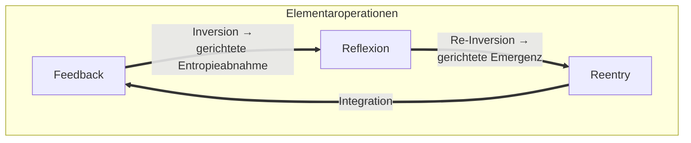

# 1 Definition

Elementarzeit ist eine aus der zyklisch-gerichteten Abfolge der [[Elementaroperationen]] Feedback, Reflexion und Re-entry emergierende Struktur, die durch die Übergänge Inversion und Re-Inversion ihre Richtung und Differenzierung erhält. Sie fungiert als operativer Ordnungsrahmen und bildet die generative Bedingung für die Zeitkonstruktion physikalischer, chemischer, biologischer, lebender, psychischer, sozialer und emergenter Systeme.

## Erläuterung der Elemente

Elementarzeit stellt die grundlegende Voraussetzung aller anderen Zeitkonstruktionen dar. Während chronologische, thermodynamische oder relativistische Zeitformen in den jeweiligen Fachdisziplinen als eigenständige Modelle behandelt werden, geht die Elementarzeit diesen Konzepten logisch und epistemisch voraus. Sie entsteht durch die zyklische Abfolge der [[Elementaroperationen]] und konstituiert die strukturellen Bedingungen, unter denen Zeitrelationen überhaupt beobachtbar, messbar oder bedeutungstragend werden können.

Sie ist weder ein Messsystem noch ein Koordinatensystem, sondern ein generatives Ordnungsprinzip. Es macht überhaupt erst erfahrbar, dass zeitliche Strukturen existieren – indem es Zeit als emergentes Resultat operativer Übergänge erzeugt. Aus Elementarzeit lassen sich daher alle bekannten Zeitformen ableiten, nicht jedoch umgekehrt.

Ihre gerichtete Struktur entsteht nicht allein durch zyklische Wiederkehr, sondern durch zwei spezifische Zustandsübergänge:

- **Inversion** bezeichnet den Übergang von Feedback zu Reflexion. Sie initiiert eine Umkehr der Zeitstruktur, bei der aus wachsender Entropie eine gerichtete Ordnung wird. Reflexion ist damit keine neutrale Zwischenphase, sondern eine strukturierende Rückwendung.
- **Re-Inversion** markiert den Übergang von Reflexion zu Re-entry. Sie beschreibt die Reintegration der durch Reflexion gewonnenen Ordnung in eine neue operative Emergenz. Re-entry stellt keine Wiederaufnahme des Alten dar, sondern die Fortschreibung unter veränderten Bedingungen.

Erst durch Inversion und Re-Inversion wird eine gerichtete Zeitstruktur möglich. Ohne diese Übergänge bliebe der Vollzug der Operationen temporallogisch indifferent. Die Zeit entsteht in diesem Modell aus der Fähigkeit eines Systems, qualitativ unterschiedliche Zustände durch strukturierte Übergänge zu koppeln.

Im systemtheoretischen Kontext fungiert Elementarzeit als vermittelnde Instanz zwischen operativer Komplexitätsreduktion und emergenter Bedeutungsstruktur. Sie ermöglicht die Kopplung von Beobachtung, Erfahrung und Ordnung – und bildet so die zeitliche Bedingung jeder naturwissenschaftlichen, lebenden, psychischen und sozialen Strukturierungsleistung. Ihre Relevanz liegt insbesondere darin, dass sie als gemeinsame Ursprungsstruktur disparate Zeitkonzepte nicht nur erklärbar macht, sondern strukturell miteinander vermittelt (vgl. Luhmann, 1997; Prigogine & Stengers, 1984; Varela, 1997).

_Abbildung 1: Visualisierung der zyklisch-gerichteten Struktur der Elementarzeit (eig. Darstellung)_

Die Abbildung zeigt die zyklische Verknüpfung der [[Elementaroperationen]] Feedback, Reflexion und Re-entry. Dazwischen liegen explizit benannte Übergänge, die als strukturgebende Momente der Zeitgenese fungieren.

- **Feedback** markiert die Reaktion auf interne oder externe Differenz. Die anschließende Inversion transformiert diese Reaktion in eine reflexive Verarbeitung. Dies entspricht einer strukturellen Entropieabnahme.
- **Reflexion** beschreibt die Phase innerer Verarbeitung, Differenzbildung und Neuordnung. Die Re-Inversion hebt diesen Zustand auf, indem sie die resultierende Struktur in ein neues Operationsverhalten überführt.
- **Re-entry** bedeutet die Reintegration des Neuen in das System. Dabei wird nicht der Ausgangszustand wiederhergestellt, sondern eine veränderte Systemstruktur erzeugt, die neue Anschlussfähigkeit besitzt. Mit der Integration beginnt ein neuer Zyklus.

Die dargestellte Architektur bildet eine gerichtete Zyklik, in der nicht Wiederholung, sondern Emergenz das Prinzip ist. Zeit entsteht nicht durch Taktung oder Dauer, sondern durch strukturierte Übergänge zwischen qualitativ unterschiedlichen Operationen.

## 2 Herleitung

Die Elementarzeit wurde im vorangehenden Kapitel als emergente Struktur beschrieben, die aus der gerichteten Abfolge der [[Elementaroperationen]] Feedback, Reflexion und Reentry hervorgeht. Um die theoretische Tragweite und die konzeptuelle Konsistenz dieser Annahme zu fundieren, ist es erforderlich, ihren begrifflichen Hintergrund aus unterschiedlichen wissenschaftlichen Perspektiven heraus zu rekonstruieren.

Dieses Kapitel verfolgt das Ziel, die Konzeption der Elementarzeit systematisch herzuleiten – nicht im Sinne einer deduktiven Ableitung aus vorgegebenen Axiomen, sondern als rekonstruktive Bewegung entlang erkenntnistheoretischer, systemtheoretischer, thermodynamischer und formaler Linien. Dabei wird deutlich, dass die Elementarzeit nicht als bloße Erweiterung bestehender Zeitbegriffe verstanden werden kann, sondern als grundlegend neues Strukturprinzip, das anderen Zeitkonzepten logisch und operativ vorausliegt.

Die Herleitung erfolgt multiperspektivisch, wobei jede Perspektive einen spezifischen Zugang zum Verständnis von Zeit eröffnet. Erst in ihrer Zusammenschau wird deutlich, dass die Elementarzeit eine transdisziplinäre Tiefenstruktur darstellt – eine strukturierende Logik, die jenseits disziplinärer Fragmentierung liegt und als gemeinsame Ursprungsform vielfältiger Zeitkonstruktionen gelesen werden kann.

## 2.1 Systemtheoretische Perspektive

Aus systemtheoretischer Sicht ist Zeit kein externes Maß, sondern eine durch operative Differenz erzeugte Struktur innerhalb autopoietischer Systeme. Luhmann (1997) argumentiert, dass soziale Systeme Zeit nicht „haben“, sondern durch die Unterscheidung von früher, später und gegenwärtig operativ erzeugen. Diese temporale Struktur ist keine gegebene Realität, sondern eine durch Kommunikation erzeugte Form der Weltbeschreibung. In biologischen Systemen tritt Zeit ebenfalls nicht als absolute Dimension auf, sondern als intern strukturierte Prozesslogik (Maturana & Varela, 1987).

In diesem Kontext kann Elementarzeit als eine interne Zeitstruktur begriffen werden, die aus rekursiven Systemoperationen hervorgeht. Die [[Elementaroperationen]] Feedback, Reflexion und Re-entry strukturieren dabei nicht nur Sinn und Anschlussfähigkeit, sondern erzeugen selbst die temporale Ordnung, innerhalb derer Systeme stabil operieren können. Elementarzeit ist also die Form, in der Systemzeit überhaupt erst zustande kommt – nicht als beobachtbare Größe, sondern als Bedingung der Unterscheidung und Anschlussfähigkeit von Operationen. Dabei ist wesentlich, dass die Elementarzeit nicht extern messbar, sondern strukturell wirksam ist. Ihre Funktion liegt darin, Orientierung im eigenen Operationsfluss zu ermöglichen. Anders als Kalenderzeit oder physikalische Zeitachsen bietet sie keine standardisierte Vergleichbarkeit, sondern eine intern generierte Temporalisierung. Sie bildet die Voraussetzung dafür, dass ein System *Zeitverhältnisse* überhaupt herstellen und aufrechterhalten kann. Die Übergänge Inversion (von Feedback zu Reflexion) und Re-Inversion (von Reflexion zu Re-entry) erzeugen dabei gerichtete Zeitachsen innerhalb der Elementarzeit. Sie stellen sicher, dass sich zyklische Strukturen nicht bloß wiederholen, sondern transformieren. Die daraus resultierende Zeit ist rekursiv, selektiv und systemintern gerichtet – und unterscheidet sich damit deutlich von jeder linearen Vorstellung von Zeit.

Damit leistet Elementarzeit systemtheoretisch die Funktion einer strukturkonstitutiven Temporalität, die weder von außen an das System herangetragen noch durch Beobachtung allein zugänglich ist. Sie ist emergent aus dem System selbst – und genau darin liegt ihr erkenntnistheoretischer und theoretischer Vorrang gegenüber abgeleiteten Zeitkonstruktionen.

## 2.2 Erkenntnistheoretische Perspektive

Aus erkenntnistheoretischer Sicht ist Zeit keine gegebene Entität, sondern ein kognitives beziehungsweise systemintern erzeugtes Ordnungsprinzip, das Veränderung strukturierbar macht. Bereits Kant (1781/1998) beschrieb Zeit als „reine Anschauungsform“, also als eine apriorische Bedingung dafür, dass Wahrnehmung überhaupt in einer geordneten Abfolge möglich wird. In konstruktivistischen und systemtheoretischen Ansätzen wird dieser Gedanke weitergeführt: Zeit ist kein Objekt in der Welt, sondern ein epistemisches Werkzeug zur Strukturierung von Differenz, Kausalität und Erwartung (Glasersfeld, 1995; Foerster, 1993).

Innerhalb dieses Rahmens lässt sich Elementarzeit als eine emergente Struktur verstehen, die durch die zyklische und gerichtete Abfolge der [[Elementaroperationen]] Feedback, Reflexion und Re-entry generiert wird. Sie ist nicht nur eine Ordnungsleistung, sondern die Voraussetzung dafür, dass prozesshafte Veränderungen innerhalb eines Systems als kohärent, rückblickend strukturierbar und vorausschauend anschlussfähig erscheinen können. Elementarzeit ermöglicht damit die systeminterne Differenzierung von Vorher und Nachher, von Beobachtetem und Transformiertem – und schafft so die Bedingung für epistemisch relevante Systemveränderungen.

Ihr erkenntnistheoretischer Vorrang liegt in ihrer Funktion als Ermöglichungsstruktur: Die Operationen erzeugen nicht nur interne Zustände, sondern zugleich einen Zeitrahmen, in dem diese als Entwicklung, Variation oder Wiederholung erscheinen. Besonders bedeutsam sind dabei die Übergänge zwischen den Operationen:

- **Inversion** transformiert lineare Reaktion (Feedback) in retrospektive Verarbeitung (Reflexion), das heißt in die Möglichkeit, systeminterne Zustände überhaupt als unterscheidbare Erfahrung zu begreifen.
- **Re-Inversion** ermöglicht den Übergang zurück in ein transformiertes Operationsniveau, das nicht bloße Wiederholung, sondern systembedingte Fortschreibung unter veränderten Bedingungen darstellt.

Elementarzeit ist damit eine epistemische Zeitstruktur. Sie ist nicht gegeben, sondern entsteht aus der Differenzierung zwischen systeminternem Vollzug und metaperspektivischer Re-Integration (Beobachtung zweiter Ordnung; Luhmann, 1990). In ihr zeigt sich nicht nur die Struktur von Entwicklung, sondern auch die Bedingung der Möglichkeit, dass Entwicklung als solche systemintern erkannt, rekonstruiert und fortgeschrieben werden kann.

Konsequenterweise ist jedes strukturbildende, transformativ operierende System an eine intern erzeugte Zeitstruktur gebunden – und Elementarzeit ist die formal-inhaltliche Beschreibung dieser Struktur. Damit erhält systemische Entwicklung nicht nur Sequenz, sondern Richtung, Wiederholbarkeit und reflexive Anschlussfähigkeit – grundlegende Bedingungen emergenter Ordnung.

## 2.3 Thermodynamische Perspektive

In der klassischen Physik wird Zeit über die Mechanik oder über das Licht definiert, jedoch ohne inhärente Richtung. Erst mit der Thermodynamik, insbesondere dem Zweiten Hauptsatz, tritt ein asymmetrischer Zeitpfeil in Erscheinung:

>In geschlossenen Systemen nimmt die Entropie – verstanden als Maß der Unordnung – mit der Zeit zu (Prigogine & Stengers, 1984).

Dieser irreversible Verlauf gilt als fundamentale Grundlage für das Verständnis physikalischer Zeit in offenen und geschlossenen Systemen.

Elementarzeit lässt sich im thermodynamischen Kontext nicht als Alternative, sondern als epistemisch tiefere Struktur interpretieren, die den gerichteten Zeitverlauf physikalischer Systeme als einen Spezialfall systemischer Übergänge verständlich macht. Ihre Besonderheit liegt darin, dass sie eine Zeitstruktur beschreibt, die sowohl Entropiezunahme als auch Entropieabnahme integrieren kann; jedoch nicht auf Basis mechanischer Zustände, sondern durch die Abfolge und Transformation operativer Zustände innerhalb eines Systems.

Die [[Elementaroperationen]] Feedback, Reflexion und Re-entry lassen sich thermodynamisch anschlussfähig modellieren:

- **Feedback** entspricht einer Entropiezunahme durch offene Reizaufnahme, Differenzbildung oder Reaktion auf Umweltzustände. Das System nimmt strukturelle Irritationen auf und erfährt einen Anstieg an Unordnung und Komplexität.
- **Reflexion** hingegen ist mit einer lokalen Entropieabnahme verbunden. In ihr werden Differenzen sortiert, Bedeutungen zugeordnet, Ordnungen erzeugt. Es handelt sich dabei nicht um eine Umkehr der globalen Entropie, sondern um eine temporäre, systeminterne Reorganisation.
- **Re-entry** beschreibt die Reintegration dieser neu erzeugten Ordnung in die operative Struktur. Sie führt nicht zur Wiederherstellung eines früheren Zustands, sondern zur emergenten Fortschreibung des Systems unter veränderten Bedingungen. Damit ist Re-entry ein Moment der gerichteten, nicht-reversiblen Emergenz.

In thermodynamischer Lesart markiert die **Inversion** den Übergang vom energieaufnehmenden, strukturstörenden Zustand (Feedback) in einen ordnungsschaffenden, energieverarbeitenden Zustand (Reflexion). Die **Re-Inversion** markiert die Rückkehr in einen dynamischen Zustand, der neue Ordnung operationalisiert und in offene Entropiesysteme überführt.

Elementarzeit beschreibt damit nicht die physikalische Zeit selbst, sondern die strukturelle Möglichkeit, dass physikalische Zeit beobachtet, rekonstruiert und in gerichtete Ordnungsprozesse überführt werden kann. Sie operiert auf einer Metaebene zur Thermodynamik: Sie ist nicht energetisch, sondern epistemisch und operativ – ermöglicht jedoch, dass thermodynamische Phänomene innerhalb komplexer Systeme als temporale Phänomene auftreten und differenzierbar werden.

Die thermodynamische Perspektive stützt daher die Grundannahme, dass Zeit nicht unabhängig von struktureller Differenz gedacht werden kann. Elementarzeit liefert hierfür ein übergeordnetes Modell, das nicht aus Entropiedynamik hervorgeht, sondern diese selbst als beobachtbare Struktur innerhalb systemischer Ordnungsprozesse ermöglicht. Sie bildet somit die epistemische Bedingung der Möglichkeit, Entropie als gerichtete Veränderung überhaupt zu erfassen.

## 2.4 Kybernetisch-biologische Perspektive

In kybernetischen und biologischen Systemtheorien wird Zeit nicht als externe, absolute Größe betrachtet, sondern als Ergebnis intern regulierter Prozesse. Besonders in der Theorie der Autopoiesis (Maturana & Varela, 1987) wird betont, dass lebende Systeme ihre eigene Organisation kontinuierlich reproduzieren – also in einer strukturellen Koppelung mit ihrer Umwelt stehen, ohne direkt von dieser determiniert zu sein. Zeit erscheint dabei nicht als universale Koordinate, sondern als intern generierte Dimension der Veränderung.

Elementarzeit lässt sich in diesem Kontext als strukturierendes Prinzip verstehen, das den biologischen und kybernetischen Systemen ermöglicht, zwischen unterschiedlichen Phasen ihrer Systemerhaltung und -transformation zu unterscheiden. Sie beschreibt keine biologische „Uhrzeit“, sondern eine Form zeitlicher Organisation, die emergent aus den [[Elementaroperationen]] Feedback, Reflexion und Re-entry hervorgeht. Diese Operationen sind isomorph zu zentralen Steuerungs- und Reaktionsmustern in biologischen Systemen:

- **Feedback** entspricht der Reaktion auf strukturelle Kopplungen mit der Umwelt, d.h. ein Moment der Reizaufnahme, des energetischen Austauschs oder der semantischen Irritation, vergleichbar mit sensorischen oder regulatorischen Prozessen.
- **Reflexion** steht für eine systeminterne Phase der Relationalisierung und Kontextualisierung. Hier erfolgt keine bloße Reaktion, sondern eine integrative, oft zeitverzögerte Verarbeitung – wie sie in homöostatischen oder kognitiv-projektiven Regelkreisen beobachtbar ist.
- **Re-entry** beschreibt den rekursiven Einschluss des erzeugten Wissens oder der reorganisierten Struktur in den weiteren Systemverlauf, bspw. als Anpassung, Entscheidung, Handlung oder Genexpression.

Im Unterschied zu linearen Rückkopplungsschleifen bietet Elementarzeit ein gerichtetes, operativ strukturiertes Zeitmodell, das sowohl zyklische Wiederholung als auch gerichtete Transformation umfasst. Die Übergänge Inversion und Re-Inversion markieren dabei nicht einfach Zustandswechsel, sondern qualitative Umstrukturierungen von temporaler Orientierung; d.h. vom Reiz zur Ordnung, von Ordnung zur emergenten Neuausrichtung.

Damit ist Elementarzeit auch anschlussfähig an die biosemiotische Vorstellung von Sinnzeit. Lebende Systeme müssen Signale nicht nur empfangen, sondern in ihrem zeitlichen Verlauf interpretieren und handlungsrelevant machen (Uexküll, 1934; Hoffmeyer, 1996). Der operative Zeitbegriff der Elementarzeit integriert diese Differenzen in ein funktional-dynamisches Ordnungsprinzip, das für biologische, technische und hybride Systeme gleichermaßen tragfähig ist.

Elementarzeit ist aus kybernetischer Sicht daher nicht einfach die interne Zeit eines Systems, sondern diejenige Struktur, die systeminternes Zeitverhalten als rhythmisch, transformativ und emergenzfähig konstituiert. Sie ersetzt dabei nicht die physikalische Zeitmessung, sondern ordnet sie systembezogen neu.

## 2.5 Mathematisch-formale Beschreibung

Obwohl Elementarzeit primär als epistemisch-emergente Struktur konzipiert ist, lässt sich ihr Aufbau prinzipiell mathematisch formalisieren. Ziel ist dabei keine numerische Simulation, sondern die symbolische Darstellung struktureller Bedingungen, Phasenübergänge und zyklischer Dynamiken innerhalb komplexer Systeme. Die folgenden Darstellungen verwenden vereinfachte Notationen aus der Mengenlehre, Funktionentheorie und Graphentheorie, um das relationale und gerichtete Zusammenspiel der [[Elementaroperationen]] zu fassen.

### 2.5.1 Zyklische Struktur

Die zyklische Grundstruktur der Elementarzeit ergibt sich aus der Sequenz:

$$
F \rightarrow R \rightarrow E \rightarrow F \rightarrow \dots \tag{1}
$$

mit den Kürzeln:
- $F$ = Feedback,
- $R$ = Reflexion,
- $E$ = Re-entry.

Diese zyklische Operation ist nicht bloß periodisch, sondern enthält zwei gerichtete Übergänge, die die Zeitstruktur definieren:

- $\text{Inv}: F \rightarrow R$ (Inversion),
- $\text{ReInv}: R \rightarrow E$ (Re-Inversion).

### 2.5.2 Übergangsstruktur als gerichteter Graph

Die Elementarzeit kann als gerichteter Graph $G = (V, E)$ beschrieben werden mit:

- $V = \{F, R, E\}$ (Knotenmenge),
- $E = \{(F, R), (R, E), (E, F)\}$ (gerichtete Übergänge).

Die gerichteten Kanten $(F, R)$ und $(R, E)$ besitzen dabei besondere Status:

- $\text{Inv} = (F, R)$ erzeugt Entropieabnahme,
- $\text{ReInv} = (R, E)$ erzeugt Emergenz.

### 2.5.3 Zeitstruktur als Funktion über Systemzustände

Wenn $S_t$ den Zustand eines Systems zur Zeit $t$ beschreibt, dann ist die Elementarzeit eine Funktion $\varepsilon$, die über Elementaroperationen aufeinanderfolgende Zustände erzeugt:

$$
S_{t+1} = \varepsilon(S_t) = \begin{cases}
f(S_t), & \text{wenn } \varepsilon = F \\
r(f(S_t)), & \text{wenn } \varepsilon = R \circ F \\
e(r(f(S_t))), & \text{wenn } \varepsilon = E \circ R \circ F
\end{cases} \tag{2}
$$

Dabei sind:
- $f$ eine Irritationsfunktion (Feedback),
- $r$ eine Ordnungsfunktion (Reflexion),
- $e$ eine Reintegrationsfunktion (Re-entry).

Diese Komposition stellt den gerichteten Zeitpfeil in Elementarzeit dar: Nicht als lineare Ableitung, sondern als strukturverändernde Funktion über Operationen.

### 2.5.4 Entropie-Modulation durch Übergänge

Mit $H$ als Maß der systeminternen Entropie (bspw. im Shannon’schen Sinne), lassen sich die Übergänge als Transformationen über $H$ ausdrücken:

- Inversion erzeugt lokale Entropieabnahme:
 $$
 H(R) < H(F) \tag{3}
 $$

- Re-Inversion erzeugt gerichtete Transformation:
 $$
 H(E) \gtrless H(R) \quad \text{(systemabhängig)} \tag{4}
 $$

Die mathematische Beschreibung der Elementarzeit ist keine Reduktion auf Zahlenwerte, sondern eine formalisierte Darstellung von Übergängen, Strukturen und gerichteten Prozessen. Sie macht sichtbar, dass Zeit innerhalb von Systemen nicht linear, sondern funktional, transformativ und rekursiv verläuft – und dass zyklische Wiederkehr keineswegs zyklische Gleichheit bedeutet. Elementarzeit ist damit auch mathematisch eine Struktur höherer Ordnung über klassischen Zeitfunktionen.

## 2.6 Beispiele

Die abstrakte Struktur der Elementarzeit lässt sich nicht nur theoretisch beschreiben, sondern in einer Vielzahl unterschiedlicher Systeme exemplarisch beobachten. Ihr Geltungsbereich umfasst kognitive, soziale, technische und biologische Prozesse ebenso wie formal-mathematische oder symbolische Strukturen. Gemeinsam ist diesen Systemen, dass sie über [[Elementaroperationen]] strukturelle Übergänge erzeugen, aus denen gerichtete Zeitverläufe emergieren.

Die nachfolgenden Beispiele illustrieren, wie Elementarzeit in unterschiedlichen Kontexten wirksam wird. Dabei wird deutlich, dass sie nicht an bestimmte Inhalte, Technologien oder Subjektivitäten gebunden ist, sondern ein universelles Strukturprinzip darstellt, das sowohl in subjektivem Erleben als auch in algorithmischen Prozessen rekonstruierbar ist. 

>Entscheidend ist nicht das beobachtete Phänomen selbst, sondern die Art, wie zeitliche Differenz strukturbildend organisiert wird.

Die Beispiele folgen einer zunehmenden Abstraktionslogik: von konkreten Lernprozessen über individuelle und soziale Systeme bis hin zu formal-abstrakten Maschinenprozessen. In jedem Fall zeigt sich, dass die Elementarzeit eine eigenständige Ordnung erzeugt, innerhalb derer Zeit nicht nur gemessen, sondern strukturell erzeugt wird.

### 2.6.1 Lernen als zyklische Zeitstruktur

Lernen stellt ein paradigmatisches Beispiel für die zyklische und gerichtete Struktur der Elementarzeit dar. In nahezu allen didaktischen, kognitiven und erfahrungsbasierten Kontexten lässt sich Lernen nicht als linearer Prozess abbilden, sondern als Abfolge von Irritation, Verarbeitung und Integration d.h. exakt den [[Elementaroperationen]] Feedback, Reflexion und Re-entry entsprechend ([[Lernen als universelles Prinzip]]).

Beispielsweise erhält eine Lernende eine Rückmeldung zu einer fehlerhaften Handlung (Feedback). Diese Rückmeldung stört den bisherigen Erfahrungszusammenhang, erzeugt Differenz und erhöht die wahrgenommene kognitive Entropie (vgl. Piaget, 1976; Festinger, 1957). Es folgt eine Phase der Selbst- oder Fremdreflexion: Die Lernende versucht, die Ursachen des Fehlers zu verstehen, alternative Handlungsstrategien zu entwickeln und diese mit bestehendem Wissen zu integrieren (Reflexion; vgl. Kolb, 1984). Schließlich wird das neu strukturierte Wissen in zukünftige Handlungsschemata überführt – sei es durch Übung, Transfer oder bewusste Entscheidung (Re-entry).

Der dabei entstehende Zeitverlauf ist nicht nur chronologisch, sondern elementarstrukturell; die Übergänge **Inversion** (vom Reiz zur Reflexion) und **Re-Inversion** (von der Analyse zur Handlung) strukturieren die Zeitrichtung des Lernprozesses. Lernen verläuft daher in einer *gerichteten Zyklik*, bei der Wiederholung nicht Wiederherstellung, sondern Emergenz bedeutet.

Elementarzeit macht erklärbar, weshalb Lernen nicht durch reine Dauer, sondern durch operative Übergänge zwischen qualitativ unterschiedlichen Zuständen strukturiert ist. Sie liefert damit ein Modell, in dem Lernzeit nicht nur eine quantitative Ressource ist, sondern eine emergente Struktur, die sich aus der Systemaktivität selbst ergibt (vgl. Hanisch-Johannsen, 2025). Besonders deutlich wird dies in komplexen Lernsituationen wie z.B. After-Action-Reviews (vgl. Ellis et al., 2014), Prüfungsreflexionen oder professionellem Erfahrungslernen, bei denen die Verarbeitung von Erfahrung durch Reflexion und deren Einbindung in neue Handlungsstrategien integraler Bestandteil des Lernens sind. In solchen Kontexten ist Elementarzeit nicht nur implizit wirksam, sondern explizit sichtbar.

Aus Sicht der Elementarzeit ist Lernen somit nicht die Aneignung von Inhalten, sondern die durch Operationen strukturierte Herstellung von Zeitverhältnissen, innerhalb derer Veränderung – genauer: Emergenz – als Entwicklung beobachtbar wird.

### 2.6.2 Individuelle Entscheidungsprozesse

Auch individuelle Entscheidungsprozesse lassen sich als Ausdruck elementarzeitlicher Dynamik verstehen. Entscheidungen entstehen selten linear oder rein rational, sondern durchlaufen meist einen inneren Prozess, der durch Irritation, Selbstbeobachtung und Reorientierung gekennzeichnet ist eine Struktur, die direkt mit den [[Elementaroperationen]] Feedback, Reflexion und Re-entry korrespondiert.

Zum Beispiel erhält eine Person eine kritische Rückmeldung zur eigenen Verhaltensweise in einem sozialen Kontext (Feedback). Diese Rückmeldung irritiert, erzeugt kognitive Dissonanz oder emotionale Spannung und bringt eine bestehende Selbstkonstruktion ins Wanken (vgl. Festinger, 1957). In der darauf folgenden Phase der Reflexion wird die Rückmeldung mental rekonstruiert, es werden alternative Deutungen, biografische Kontexte oder neue Wertungen in Betracht gezogen. Dies ist mehr als bloßes Abwägen – es ist eine gerichtete Entropieabnahme, eine Umstrukturierung im inneren Erfahrungsraum (vgl. Varela, Thompson & Rosch, 1991).

Mit dem Übergang zur Re-entry-Phase manifestiert sich die Entscheidung, d.h. die Person wählt eine neue Haltung, ein anderes Verhalten oder ein korrigiertes Selbstbild und setzt dies in zukünftige Interaktionen um. Re-entry beschreibt hier nicht bloß den Vollzug der Entscheidung, sondern die Reintegration einer veränderten internen Ordnung in die operative Lebensführung (vgl. Luhmann, 1997). **Inversion** (Feedback → Reflexion) markiert den Punkt, an dem inneres Erleben von bloßem Reagieren in strukturierte Verarbeitung übergeht. **Re-Inversion** (Reflexion → Re-entry) beschreibt den Übergang von innerer Ordnung hin zur externalisierten Umsetzung. Die Entscheidung selbst ist also nicht punktuell, sondern Ausdruck einer strukturierten Zeitform, die sich retrospektiv rekonstruieren und systematisch analysieren lässt.

Elementarzeit macht damit verständlich, warum subjektive Entscheidungsprozesse nicht durch äußere Zeit (Uhrzeit, Deadlines) determiniert sind, sondern durch operative Phasenübergänge im inneren Systemverlauf strukturiert werden. Diese Form der Zeit ist erfahrbar, aber nicht objektivierbar – sie ist emergent, individuell und zugleich strukturell konsistent.

### 2.6.3 Soziale Systemtransformationen

Auch soziale Systeme erzeugen ihre Zeit nicht primär durch externe Taktgeber wie Kalender oder Uhren, sondern durch operative Übergänge, die aus Irritation, Reflexion und Reorganisation bestehen. Die Theorie sozialer Systeme nach Luhmann (1997) beschreibt Gesellschaft nicht als Subjekt, sondern als ein Netzwerk von Kommunikationen, das sich selbst reproduziert. Transformation in solchen Systemen verläuft nicht linear, sondern über komplexe Phasenverschiebungen – exakt im Sinne der [[Elementaroperationen]] Feedback, Reflexion und Re-entry.

Eine Organisation wird bspw. durch einen Skandal, ein Scheitern oder eine externe Krise irritiert (Feedback). Dies erzeugt Unruhe, Intransparenz oder Vertrauensverlust im System. Es folgt eine Phase intensiver Selbstbeobachtung, z.B. in Form von Evaluationen, Strategiewechseln oder Neuausrichtung des Narrativs (Reflexion). In dieser Phase kommt es häufig zu einem internen Strukturwandel, indem das System sich neu ordnet, Verantwortlichkeiten differenziert, neue Rollen oder Regeln schafft. Der Re-entry-Vorgang zeigt sich dann in der konkreten Implementierung dieser neuen Struktur, folglich in neuen Praktiken, Kommunikationsformaten oder institutionellen Arrangements.

Die Übergänge **Inversion** (vom operativen Irritationspunkt zur systemischen Selbstthematisierung) und **Re-Inversion** (von der Erkenntnis zur neuen Handlungsebene) markieren nicht nur Zeitpunkte, sondern strukturieren den zeitlichen Verlauf der Systemtransformation selbst (vgl. Willke, 1999). Diese Transformationen erscheinen retrospektiv oft als Wendepunkte – aus Sicht der Elementarzeit jedoch sind sie emergente Folgen gerichteter Operationen.

Elementarzeit macht damit erklärbar, weshalb soziale Systeme „ihre Zeit“ nicht einfach konsumieren, sondern durch operative Übergänge erzeugen. Nicht die Uhrzeit entscheidet über Wandel, sondern die interne Strukturierung von Übergängen. Dies lässt sich u. a. in Change-Management-Prozessen, Governance-Entwicklungen oder gesellschaftlichen Umbruchphasen systematisch rekonstruieren (vgl. Stacey, 2001).

### 2.6.4 Strukturelle Prozesse in abstrakten Systemen

Elementarzeit ist nicht auf biologische, psychische oder soziale Systeme beschränkt, sondern kann auch in abstrakten, formalisierten Systemen als generatives Strukturprinzip wirken. In technischen oder informatischen Kontexten zeigt sich dies etwa in iterativen Optimierungsprozessen, maschinellem Lernen oder automatisierten Entscheidungsarchitekturen, in denen nicht-lineare Übergänge zwischen Systemzuständen operativ modellierbar sind (vgl. Wolfram, 2002; Mitchell, 2009).

Ein lernendes Algorithmensystem registriert als Beispiel einen Fehler im Output, etwa durch Abweichung vom Trainingsziel oder durch unerwartete Eingabedaten (Feedback). Der Fehler wird intern verarbeitet, d.h. das System passt seine Gewichtungen, Entscheidungsregeln oder Parameter an ggf. durch Backpropagation, heuristische Analyse oder Evolutionäre Optimierung (Reflexion). Die resultierenden Anpassungen werden im nächsten Lauf des Systems operationalisiert – das Modell agiert mit veränderten Strukturen auf neue Daten (Re-entry). Obwohl keine Subjektivität oder Intentionalität vorliegt, folgt der Ablauf einer strukturell analogen Elementarzeit; die Übergänge Inversion und Re-Inversion markieren die Umstrukturierung des Zustandsraums. Selbst in vollständig formalen Kontexten zeigt sich, dass Zeit nicht einfach durch Taktrate oder Iteration beschrieben werden kann, sondern durch gerichtete Übergänge zwischen qualitativ verschiedenen Phasen.

Ein weiteres Beispiel liefert die mathematische Theorie dynamischer Systeme. Dort definieren Bifurkationen qualitative Veränderungen in der Systemstruktur, ausgelöst durch minimale Parameterveränderungen – diese Übergänge sind formal, aber dennoch emergent. Auch hier kann die Elementarzeit als Strukturprinzip verstanden werden, das nicht von Energie, sondern von Differenzierung getragen ist (vgl. Strogatz, 2018).

Die Elementarzeit liefert in diesen Kontexten kein alternatives Berechnungsmodell, sondern eine epistemische Struktur, mit der auch abstrakte Systeme prozessual und strukturwandelnd verstanden werden können – jenseits bloßer Zustandsfolgen oder Wiederholungsschleifen.

# 3 Folgerungen

Die vorausgehenden Analysen haben gezeigt, dass Zeit im Modell der Elementarzeit nicht als gegebene Dimension verstanden werden kann, sondern als emergente Struktur aus operativen Übergängen innerhalb von Systemen hervorgeht. Diese Perspektive hat weitreichende Konsequenzen für das Verständnis von Zeit, System, Emergenz und Erkenntnis.

Im Folgenden werden zentrale Folgerungen aus der Konzeption der Elementarzeit systematisch dargestellt. Sie beziehen sich nicht auf Anwendungen oder Ableitungen im engeren Sinne – wie es in den Implikationen (Kapitel 4) der Fall sein wird –, sondern auf jene begrifflichen Einsichten, die sich aus der theoretischen Grundstruktur selbst notwendig ergeben. Die Folgerungen betreffen den Status und die Genese von Zeit, die Rolle operativer Übergänge, die Differenz systeminterner Zeitverhältnisse sowie die erkenntnistheoretische Rekonstruktivität zeitlicher Ordnung.

Sie bilden damit die direkte Konsequenz aus der Modellierung der Elementarzeit und bereiten zugleich den Übergang zu den domänenspezifischen Implikationen vor.

## 3.1 Zeit ist nicht gegeben, sondern generiert

Aus der theoretischen Konzeption der Elementarzeit ergibt sich eine fundamentale Revision gängiger Zeitvorstellungen. Zeit ist kein physikalisch vorgegebenes oder gesellschaftlich normiertes Medium, in dem Prozesse stattfinden, sondern ein emergentes Strukturphänomen, das durch bestimmte Operationen überhaupt erst erzeugt wird. Sie ist nicht ontologisch vorausgesetzt, sondern wird epistemisch und operativ hervorgebracht.

Im Zentrum dieser Einsicht steht die zyklisch gerichtete Abfolge der [[Elementaroperationen]] Feedback, Reflexion und Re-entry. Erst deren sequenzielle Kopplung, insbesondere über die Übergänge Inversion und Re-Inversion, ermöglicht Veränderung als strukturierte Zeitrelation zu beobachten. Zeit entsteht in dieser Perspektive nicht aus Dauer oder Wiederholung, sondern aus gerichteter Differenz, aus dem strukturellen Abstand zwischen Vorher und Nachher innerhalb eines Systems. Diese generative Perspektive auf Zeit unterscheidet sich deutlich von klassisch-physikalischen Konzepten wie Newtons absoluter Zeit, relativistischen Modellen wie der Raumzeit als metrisch strukturierter Hintergrund oder chronologischen Konstruktionen wie sozial getakteten Zeitrastern. Im Gegensatz zu diesen Auffassungen ist Elementarzeit weder unabhängig noch universell synchronisierbar, sondern systemrelational, operativ erzeugt und kontingenzsensibel. Entscheidend ist hierbei, dass ontologische und naturwissenschaftliche Zeitbegriffe auf getrennten Traditionen beruhen, aber in der Elementarzeit auf einen gemeinsamen Ursprung zurückgeführt werden. Dieser Ursprung liegt in den Elementaroperationen selbst. Damit ergibt sich eine erkenntnistheoretisch konsistente Perspektive, in der sich sowohl physikalische als auch philosophische Zeitkonzepte aus ein und derselben operativen Struktur ableiten lassen. Elementarzeit fungiert somit als generative Bedingung aller Zeitkonstruktionen – sie ist nicht eine unter vielen Zeitformen, sondern deren konstitutive Voraussetzung.

Daraus folgt, dass alle bekannten Zeitformen – ob thermodynamisch, relativistisch, chronologisch, biologisch oder sozial – als Spezifikationen oder Kontextualisierungen der Elementarzeit rekonstruierbar werden. Sie beruhen auf den gleichen operativen Übergangslogiken, manifestieren sich jedoch unter unterschiedlichen Systembedingungen. Die Elementarzeit ist damit nicht nur theoretisch vorrangig, sondern strukturell vorausgesetzt. Ohne sie wären keine differenzierten Zeitverhältnisse beobachtbar, rekonstruierbar oder wissenschaftlich beschreibbar. Dabei liegt die Elementarzeit nicht als bloße Ordnung über den Prozessen, sondern entsteht in deren operativer Ausführung. Zeit wird dadurch nicht nur relational, sondern prozessual kontingent. Sie existiert nur in dem Maße, wie Systeme strukturbildend operieren. Die Erfahrung von Zeit, etwa als Fortschritt, Verzögerung oder Rückkopplung, ist keine Abbildung eines Außen, sondern das Resultat einer systemintern erzeugten Strukturierungsleistung (vgl. Luhmann, 1990; Prigogine & Stengers, 1984; Varela, 1997).

Die Folgerung lautet daher: Zeit ist nicht gegeben. Sie ist ein Effekt. Ein emergenter, aus Operationen erzeugter Effekt, der selbst keine Ursache voraussetzt, sondern sich selbst erzeugt und rekursiv strukturiert.

## 3.2 Zeit ist eine Folge von Operation, nicht deren Voraussetzung

In klassischen Modellen, sowohl der Naturwissenschaften als auch der Alltagslogik, gilt Zeit meist als Voraussetzung von Veränderung. Operationen, etwa Handlungen, Zustandswechsel oder Kommunikationsakte erscheinen dort als Vorgänge, die sich innerhalb einer bereits existierenden Zeitdimension vollziehen. Diese Vorstellung kehrt sich mit dem Konzept der Elementarzeit um: Zeit ist nicht die Voraussetzung von Operation, sondern ihre Folge.

Die Grundlage dafür bildet die zyklische, aber gerichtete Struktur der [[Elementaroperationen]]. Erst durch deren wiederholte Kopplung entstehen Muster, Differenzen und Übergänge, aus denen sich eine Zeitstruktur rekonstruieren lässt. Besonders die Zustandsübergänge Inversion und Re-Inversion erzeugen gerichtete Übergänge, ohne die keine Unterscheidung zwischen „vorher“ und „nachher“ möglich wäre. Zeit ist somit nicht das Medium des Operierens, sondern eine aus dem Operieren selbst hervorgehende Struktur. Diese Einsicht ist tiefgreifend, sie verschiebt die Erklärungsebene von der ontologischen Annahme eines Zeitkontinuums zur systeminternen Produktion von Zeitrelationen. Systeme erzeugen ihre eigene Zeit, indem sie Übergänge zwischen Operationen markieren, abspeichern, wiederholen oder unterbrechen. Zeit ist nicht extern, sondern eine strukturierende Selbstbeschreibung des Systems d.h. eine Art temporale Eigenzeit, emergent aus dem Vollzug operativer Differenz. Damit wird auch erklärbar, inwiefern unterschiedliche Systeme unterschiedliche Zeitformen realisieren. Ein physikalisches System erzeugt Zeit durch irreversible Zustandsveränderung (z.B. Entropiezunahme), ein psychisches System durch Erfahrungs- und Reflexionsphasen, ein soziales System durch Anschlusskommunikation. Allen gemeinsam ist jedoch, dass sie Zeit nicht voraussetzen, sondern über Elementaroperationen erzeugen.

Zeit ist daher kein universeller Hintergrund, sondern ein operatives Produkt. Sie entsteht nicht durch äußere Taktraster oder koordinierte Rhythmen, sondern durch die Fähigkeit eines Systems, Zustandsdifferenzen zu erzeugen, zu stabilisieren und rekursiv zu verarbeiten. Elementarzeit ist damit nicht nur eine epistemologische Struktur, sondern die Grundlage jeder systembasierten Zeitgenese.

## 3.3 Übergänge strukturieren Zeitverhältnisse

Die Struktur der Elementarzeit ergibt sich nicht allein aus der zyklischen Wiederholung der Operationen Feedback, Reflexion und Re-entry, sondern vor allem aus den Übergängen zwischen ihnen. Diese Übergänge – Inversion und Re-Inversion – sind keine bloßen Verbindungen, sondern zeitstrukturierende Momente, die die Richtung, Qualität und Differenzierbarkeit der Zeitrelationen überhaupt erst ermöglichen. Während die Operationen selbst für sich genommen auch als repetitive Muster ohne Richtung erscheinen könnten, transformieren die Übergänge das zyklische Schema in eine gerichtete Dynamik.

>Inversion bezeichnet den Moment, in dem die Systemantwort auf eine Irritation von reaktiver Rückmeldung in reflexive Verarbeitung übergeht.

>Re-Inversion markiert den Übergang von dieser inneren Verarbeitung zurück in eine veränderte Systemstruktur, die nun anders operiert als zuvor.

⇒ Erst durch diese strukturellen Kippmomente entsteht Zeit als gerichtete Differenz.

Diese Übergänge sind mithin keine Randphänomene, sondern die zentralen Agenten der Zeitgenese. Sie markieren qualitative Zustandsänderungen im Systemverlauf, erzeugen operative Spannungen und rekonfigurierbare Ordnungsmuster. Zeit wird damit nicht durch Dauer, sondern durch Übergänge strukturiert. Die klassische Vorstellung von Zeit als kontinuierlicher Verlauf wird hier durch ein Modell ersetzt, in dem Zeit auf der Fähigkeit des Systems beruht, operative Schwellen zu erzeugen und diese als eigenständige Transformation zu verarbeiten. Das bedeutet auch, dass ohne Übergänge keine Zeit existent sein kann. Ein System, das keine Übergänge erzeugt, etwa weil es in ständiger Wiederholung operiert oder nur reaktiv stabilisiert, erzeugt keine Elementarzeit. Erst die Unterscheidbarkeit der Zustände vor und nach einem Übergang macht Zeit als Struktur erfahrbar. Die gerichtete Zeitstruktur ist daher kein externer Rahmen, sondern Resultat einer Übergangslogik im Inneren des Systems. Besonders relevant ist dies für die Analyse komplexer Prozesse wie Lernen, Entscheidungsbildung oder Transformation, in denen nicht die Operationen selbst, sondern die Art ihrer Verknüpfung entscheidend ist. Elementarzeit beschreibt diese Verknüpfung nicht als linearen Ablauf, sondern als strukturell codierte Übergangsarchitektur, in der Zeit selbst erst sichtbar wird, wenn Systeme zwischen Qualitäten differenzieren können.

Die Folgerung lautet: Zeit entsteht nicht aus Ereignisfolgen, sondern aus Übergängen zwischen unterschiedlichen Operationen. Die Qualität dieser Übergänge – nicht ihre Frequenz – bestimmt die gerichtete Struktur von Zeit.

## 3.4 Zeit ist systemintern differenziert

Elementarzeit ist keine universelle oder objektiv einheitliche Zeitdimension, sondern eine systemintern generierte und strukturierte Form von Zeit. Jedes System erzeugt – basierend auf den Elementaroperationen – seine eigene Zeitstruktur, abhängig von seinen operativen Möglichkeiten, internen Kopplungslogiken und Differenzierungsleistungen. Zeit ist somit nicht extern vorgegeben, sondern entsteht aus der inneren Organisation des Systems selbst.

Diese Einsicht widerspricht klassischen Vorstellungen homogener Zeitverhältnisse. In physikalischen Modellen mag Zeit eine gleichmäßig messbare Größe darstellen, doch in sozialen, psychischen oder biologischen Systemen zeigt sich, dass Zeit jeweils anders erfahren, beschrieben und strukturiert wird. Die Elementarzeit bietet hier ein übergeordnetes Rahmenmodell: Sie erklärt diese Differenzen nicht als Störungen oder Abweichungen, sondern als Ausdruck systemischer Autonomie in der Zeitproduktion.

Ein soziales System etwa erzeugt seine Zeit durch Anschlusskommunikation, was als „früh“ oder „spät“, als „lang“ oder „kurz“ gilt, ist Ergebnis kommunikativer Erwartungsstrukturen, nicht physikalischer Dauer. Ein psychisches System produziert seine Zeit hingegen durch subjektive Selbstbeobachtung und Verarbeitungserwartung. Ein biologisches System operiert über zyklische Regulation und Reizverarbeitung. In allen Fällen entstehen Zeitverhältnisse nicht durch äußere Messung, sondern durch die Art und Weise, wie Übergänge zwischen Operationen strukturiert sind.

Daraus folgt: Zeit ist nicht synchronisierbar im klassischen Sinne. Verschiedene Systeme können zur selben chronologischen Zeit operieren, ohne dieselbe Elementarzeit zu realisieren. Der Versuch, systeminterne Zeitverhältnisse extern zu harmonisieren – etwa durch Taktung, Normierung oder Beschleunigung – verfehlt ihre eigentliche Strukturgenese. Die Differenz der Zeitverhältnisse ist kein Problem, sondern eine notwendige Konsequenz operativer Autonomie.

Elementarzeit bietet damit ein Modell, in dem systeminterne Zeitformen nicht relativiert, sondern erklärt werden können. Ihre gerichtete Struktur ergibt sich nicht aus externer Kalibrierung, sondern aus interner Übergangsarchitektur. Der Begriff der Zeit wird dadurch **plural**, ohne beliebig zu werden – jede Form von Zeit ist rekonstruktiv anschlussfähig an ein spezifisches Systemverhalten.

Die Folgerung lautet: Zeit ist keine universell geteilte Ressource, sondern das Ergebnis systeminterner Differenzierung. Die Elementarzeit macht diese Differenzierungen sichtbar, ohne sie zu homogenisieren.

## 3.5 Zeitrelationen sind rekonstruktiv, nicht linear

Ein zentrales Ergebnis der bisherigen Analyse besteht darin, dass Zeitverhältnisse nicht linear, kontinuierlich oder absolut verlaufen, sondern nur im Rahmen einer rekonstruktiven Logik verstehbar sind. Systeme erzeugen keine kontinuierliche Zeitachse, sondern diskrete Übergänge, die retrospektiv zu einer Zeitstruktur gefügt werden. Zeit ist damit kein gegebenes Medium, sondern ein systemisch hervorgebrachtes Ordnungsgefüge aus qualitativen Transformationen und zugleich das, was Phänomene überhaupt erst beschreibbar macht.

Elementarzeit beschreibt nicht einen Strom von Momenten, sondern eine Architektur von Übergängen. Die Richtung der Zeit ist nicht selbstverständlich, sondern erzeugt – durch Operationen, deren Übergänge zeitliche Differenz, Rückkopplung oder Emergenz ermöglichen. Sie ist kein Medium, durch das Systeme sich bewegen, sondern ein emergentes Produkt ihrer Strukturierungsleistung. Diese Rekonstruktivität hat zwei Ebenen. Erstens ist sie strukturell: Nur durch den Übergang von Feedback zu Reflexion (Inversion) und von Reflexion zu Re-entry (Re-Inversion) entsteht überhaupt eine gerichtete Zeitrelation. Zweitens ist sie epistemisch: Beobachter müssen diese Übergänge interpretieren, um Zeit überhaupt als Abfolge, Richtung oder Differenz erfassen zu können. Ohne rekonstruktive Zuschreibung bleibt Zeit amorph.

Diese Sichtweise bietet eine radikale Neuinterpretation auch für etablierte naturwissenschaftliche Theorien der Zeit. In der Relativitätstheorie wird Zeit nicht als universell gleichförmige Größe beschrieben, sondern als eine Größe, die vom jeweiligen Bezugssystem abhängt. Zeit „vergeht“ unterschiedlich schnell – abhängig von Geschwindigkeit, Gravitation und Perspektive. Die Elementarzeit liefert hier ein metatheoretisches Erklärungsmodell: Relativität ist kein Widerspruch zur Zeit, sondern Ausdruck systemintern unterschiedlicher Übergangsstrukturen. Die Zeit eines bewegten Systems ist anders strukturiert als die eines ruhenden – nicht nur messtechnisch, sondern strukturell emergent. Aus Sicht der Elementarzeit sind diese Unterschiede keine Abweichungen vom Normalfall, sondern notwendige Konsequenz unterschiedlicher Systemoperationen. Jedes System erzeugt – abhängig von seiner Konstitution, Dynamik und Kopplungsweise – eine eigene Zeitstruktur. Die Relativität physikalischer Zeitverläufe ist damit keine exotische Ausnahme, sondern ein Spezialfall systemgenerierter Zeitformen, wie sie im Grundprinzip der Elementarzeit beschrieben werden.

Zeit ist damit rückblickend erzeugt. Ihre Struktur ergibt sich nicht aus ihrer linearen Dauer, sondern aus der Möglichkeit, Unterschiede zu erkennen und diese retrospektiv als Entwicklung zu deuten. Kein System kennt seine Zeit im Voraus. Es erzeugt sie durch die Art, wie es Übergänge realisiert, erinnert und in zukünftige Operationen einbezieht. Aus dieser Perspektive ist auch Emergenz anders zu verstehen. Emergenz ist keine spontane Qualität, die „in der Zeit“ auftritt, sondern eine strukturierte Differenz, die durch die Operationen des Systems und deren rekonstruktive Beobachtung erst als „Zeitentwicklung“ sichtbar wird. Entsprechend liegt der Ursprung von Entwicklung nicht in einer vorgegebenen Zeitlinie, sondern in der Fähigkeit eines Systems, Übergänge sinnvoll zu codieren.

Zeitverhältnisse sind somit nicht linear oder objektiv abbildbar, sondern rekonstruktiv hergestellt. Die Elementarzeit liefert dafür das strukturtheoretische Fundament – nicht als Verlaufsmodell, sondern als emergente Architektur zeitlicher Ordnung. Die Relativität von Zeitverläufen ist darin keine Grenze des Erklärens, sondern ein direktes Indiz für die Systemgebundenheit und Übergangslogik der Zeit selbst.

# 4 Implikationen

Die nachfolgenden Abschnitte zeigen exemplarisch, wie sich die Konzeption der Elementarzeit auf unterschiedliche Anwendungsbereiche auswirkt, von der Zeitforschung über Bildung und Organisation bis hin zu epistemischen Modellen und digitalen Systemen. Dabei wird deutlich: Elementarzeit wirkt nicht nur retrospektiv erklärend, sondern prospektiv strukturierend. Sie ist nicht lediglich eine alternative Zeittheorie, sondern ein operatives Reflexionsinstrument zur Re-Konfiguration zeitbezogener Prozesse und Systeme. Ihre Stärke liegt in der Fähigkeit, Ordnung jenseits etablierter Taktungen zu erzeugen d.h. nicht normativ, sondern emergent, nicht äußerlich, sondern aus dem System heraus.

## 4.1 Vom Modell zur Anwendung

Die Elementarzeit wurde bislang als generative Struktur beschrieben, die durch die Abfolge der [[Elementaroperationen]] Feedback, Reflexion und Re-entry emergiert und damit als Grundlage aller zeitbezogenen Systemstrukturen verstanden werden kann. Während die vorhergehenden Kapitel diese Struktur theoretisch, erkenntnistheoretisch und systemisch hergeleitet und ihre Folgerungen rekonstruierten, richtet sich der Blick nun auf ihre Anschlussfähigkeit in unterschiedlichen Anwendungsfeldern.

Implikationen bezeichnen in diesem Kontext nicht bloße Anwendungen im Sinne von Operationalisierungen, sondern systemische Rekonfigurationen von Begriffen, Praktiken oder Denkmodellen, die durch die Perspektive der Elementarzeit grundlegend verändert werden. Die Elementarzeit wirkt dabei als *Metaformatierungsprinzip* d.h. sie stellt nicht nur alternative Zeitstrukturen bereit, sondern transformiert bestehende Ordnungsmuster durch die Einsicht, dass Zeit selbst das Resultat systemischer Übergangslogiken ist.

## 4.2 Implikationen für die Zeitforschung

Das Konzept der Elementarzeit liefert einen erweiterten Rahmen für die Analyse und Reinterpretation etablierter Zeitbegriffe innerhalb der Zeitforschung. Indem es Zeit nicht als gegebenen Rahmen, sondern als emergente Struktur aus operativen Übergängen fasst, ermöglicht es eine fundamentale Neubewertung klassischer Zeitmodelle. 

In der Physik dominiert bis heute die Vorstellung von Zeit als messbarer, kontinuierlicher Größe, sei es in der klassischen Mechanik als absolute Zeit (Newton, 1687), in der Relativitätstheorie als raumzeitlich gekrümmte Metrik (Einstein, 1916) oder in der Thermodynamik als Richtung der Entropiezunahme (Prigogine & Stengers, 1984). Die Elementarzeit unterläuft diese Modelle nicht, sie integriert tradierte Formen in ein übergeordnetes Verständnis. Als emergente Struktur erklärt sie, wie unterschiedliche physikalische Zeitmodelle jeweils kontingente Realisierungen systeminterner Übergangslogiken sind. Damit wird Zeit nicht widerlegt, sondern relationalisiert – als Produkt, nicht als Voraussetzung physikalischer Prozesse.

Auch in den Sozial- und Kulturwissenschaften wird Zeit zunehmend als soziale Konstruktion betrachtet. Die Zeitsoziologie betont etwa die Pluralität von Zeitregimes (Nowotny, 1989) und die Zeitpsychologie zeigt, wie unterschiedlich Zeit subjektiv wahrgenommen wird (Zimbardo & Boyd, 2008). Die Elementarzeit liefert hierzu ein strukturtheoretisches Pendant und erklärt, inwieweit solche Differenzen nicht nur empirisch beobachtbar, sondern systemlogisch notwendig sind. Jedes System, sei es physikalisch, biologisch, psychisch oder sozial, erzeugt über [[Elementaroperationen]] seine eigene Zeitform. Die Vielheit der Zeitverhältnisse ist damit keine epistemische Störung, sondern Ausdruck systemischer Autonomie in der Zeitproduktion.

Besonders relevant ist die Unterscheidung zwischen **Zeitmessung** und **Zeitgenese**. Zeitmessung setzt bereits strukturierte Zeit voraus – sie operiert im Modus des Ex-post. Zeitgenese hingegen fragt, wie diese Struktur überhaupt entsteht. Die Elementarzeit verlagert den Fokus der Forschung von der Messung zur Emergenz, von der Beobachtung gegebener Abläufe zur Analyse operativer Übergänge. Sie erlaubt es, Zeit nicht nur zu quantifizieren, sondern als Qualität der Systemdifferenzierung zu rekonstruieren.

Damit eröffnet sich eine neue Perspektive für eine transdisziplinäre Zeitforschung: Zeit erscheint nicht länger als einheitliche Variable, sondern als emergentes Ordnungsmuster, das je nach Systemtyp verschieden realisiert wird – aber immer auf denselben strukturellen Übergangslogiken basiert. Die Elementarzeit könnte somit als integrativer Metabegriff fungieren, der physikalische, biologische, psychologische und soziale Zeitkonzepte nicht vereinheitlicht, sondern strukturell vermittelt.

## 4.3 Implikationen für epistemische Modelle

Die Elementarzeit verändert grundlegend die erkenntnistheoretische Perspektive auf Zeit, Wissen und Erkenntnis. Wenn Zeit nicht als externes Medium, sondern als systemgenerierte Struktur aus [[Elementaroperationen]] verstanden wird, dann ist Erkenntnis nicht in einer vorgegebenen Zeit situiert, sondern emergiert durch die Zeitstruktur selbst. Zeit ist damit nicht der Rahmen der Erkenntnis, sondern ihre konstitutive Bedingung.

In klassischen erkenntnistheoretischen Modellen, etwa bei Kant (1781/1998), wird Zeit als apriorische Kategorie beschrieben d.h. als notwendige Bedingung dafür, dass sinnliche Erfahrung in geordneter Abfolge überhaupt möglich wird. Diese Perspektive bleibt jedoch transzendental und formal. Die Elementarzeit hingegen operationalisiert diese Bedingung, indem sie zeigt, wie Zeitstrukturen konkret durch zyklisch gekoppelte Operationen entstehen, die Differenz erzeugen, rekodieren und in eine neue Emergenz überführen. Erkenntnis erscheint dadurch nicht mehr als Abbildung zeitlicher Realität, sondern als zeitstrukturierte Re-Organisation von Unterschieden. Dies führt zu weitreichenden Implikationen für kognitive und konstruktivistische Theorien. Modelle der Beobachtung zweiter Ordnung (Luhmann, 1990), autopoietischer Kognition (Maturana & Varela, 1987) oder dynamischer Emergenz (Deacon, 2011) zeigen bereits, dass Wissen nicht passiv empfangen, sondern aktiv erzeugt wird. Die Elementarzeit ergänzt diese Ansätze um eine explizite Zeitstruktur. Erkenntnis entsteht nicht einfach „im Laufe der Zeit“, sondern durch strukturierte Übergänge, die durch Inversion und Re-Inversion gerichtet sind. Diese Übergänge markieren qualitative Sprünge, also vom Reiz zur Reflexion, von der Analyse zur Integration – und sind notwendig, damit aus bloßen Informationen überhaupt Erkenntnis werden kann.

Darüber hinaus eröffnet die Elementarzeit neue Perspektiven auf die kognitive Architektur des Denkens. Denkprozesse erscheinen nicht als kontinuierliche Abläufe, sondern als Sequenzen qualitativ unterschiedlicher Phasen. Intuition, Irritation, Reflexion, Entscheidung – all diese kognitiven Modi lassen sich als zeitstrukturierende Operationen rekonstruieren. Das klassische Bild des linearen Denkens wird so durch ein Modell ersetzt, in dem Erkenntnis durch gerichtete Übergänge zwischen Zuständen erzeugt wird. Auch für die Revision bestehender Lerntheorien bietet die Elementarzeit einen neuen Bezugsrahmen. Lernen wird nicht länger als Akkumulation oder Anpassung in der Zeit verstanden, sondern als emergente Strukturveränderung, die Zeit selbst hervorbringt. Der Lernprozess ist damit nicht in einer Zeit eingebettet, sondern erzeugt seine eigene Zeit – eine Zeit, die rekursiv ist, qualitativ differenziert und systemintern codiert. Dies gilt ebenso für Vorstellungen von Zeitbewusstsein: Subjektives Zeiterleben basiert nicht auf passiver Wahrnehmung einer äußeren Zeit, sondern auf der internen Strukturierung durch Übergänge – etwa zwischen Aufmerksamkeit, Reflexion und Handlung.

Die Elementarzeit liefert somit nicht nur eine formale Grundlage für erkenntnistheoretische Modelle, sondern auch ein konkretes Instrumentarium, um epistemische Prozesse prozessual, strukturiert und zeitlich differenziert zu rekonstruieren. Erkenntnis wird nicht einfach gemacht, sie **entsteht in Zeit – aber in einer Zeit, die das System selbst erzeugt**.

## 4.4 Implikationen für Bildung und Didaktik

Die Elementarzeit eröffnet einen radikal neuen Blick auf die Zeitstrukturen von Bildungsprozessen. Wenn Lernprozesse nicht innerhalb gegebener Zeitfenster stattfinden, sondern ihre Zeit durch operative Übergänge selbst erzeugen, dann geraten zentrale Annahmen des bestehenden Bildungssystems ins Wanken. Zeit ist nicht die Bühne des Lernens, sondern dessen emergentes Produkt; eine Einsicht, die erhebliche Folgen für Didaktik, Lernraumgestaltung und institutionelle Organisation hat.

Zunächst betrifft dies die Strukturierung von Lernprozessen selbst. Lernen vollzieht sich, wie bereits im Beispielkapitel (2.6.1) gezeigt, nicht linear, sondern als zyklisch-gerichtete Abfolge von Pertubation (Feedback), Dekontruktion (Reflexion) und Rekontruktion (Re-entry). Die Übergänge Inversion und Re-Inversion markieren dabei nicht nur didaktische Phasen, sondern zeitstrukturierende Schwellen, die entscheiden, ob Lernen überhaupt als *zeitliche Bewegung* von Verstehen, Umstrukturierung und Anwendung erfahrbar wird. Formate wie After-Action-Review (vgl. Ellis et al., 2014), Portfolioarbeit oder erfahrungsbasiertes Lernen lassen sich genau in diesem Rahmen als didaktische Formen aufehmen, die Elementarzeit nicht nur implizit nutzen, sondern explizit abbilden.

Diese Perspektive ermöglicht eine fundierte Kritik an institutionell normierter Lernzeit. Modelle wie der Stundentakt, Prüfungszeitfenster oder standardisierte Kompetenzentwicklungsphasen basieren auf chronologischen und sozial getakteten Zeitkonstruktionen. Diese abstrahieren vom inneren Vollzug des Lernens, der sich nicht nach 45-Minuten-Einheiten, sondern nach qualitativen Übergängen strukturiert. Wenn jedoch Lernen seine Zeit selbst erzeugt d.h. systemintern, nicht fremdtaktet, dann sind institutionelle Zeitvorgaben nicht neutral, sondern potenziell dysfunktional. Sie ignorieren die Übergangslogik, aus der Emergenz entsteht, und erzwingen linear-sequenzielle Abläufe, wo zyklisch-gerichtete Dynamiken wirksam wären. Der schulische Stundenplan kann dann nicht länger als bloßer Ordnungsrahmen gelten, sondern wird zum epistemischen Eingriff in die Zeitstruktur des Lernens.

Vor diesem Hintergrund wird auch die Idee einer [[Bildungsraumzeit]] neu verständlich. Sie beschreibt – als didaktisch-sozial codierte Sonderform der Elementarzeit – eine Ordnung, in der Lernprozesse ihre räumlich-zeitliche Organisation selbst hervorbringen. Der Bildungsraum ist nicht gegeben, sondern emergiert im Zusammenspiel mit der Zeitstrukturierung durch die [[Elementaroperationen]]. Lernzeit wird dadurch nicht als quantitative Ressource gedacht, sondern als emergente Qualität eines Systems im Übergang. Lernumgebungen, die Reflexion und Re-entry ermöglichen, fördern nicht nur das Lernen, sondern erzeugen überhaupt erst die Zeitstruktur, in der Lernen stattfinden kann.

Implikativv ist Bildung nicht in Zeit eingebettet, sondern erzeugt ihre Zeit durch strukturierte Operationen. Didaktische Modelle, die dies anerkennen, müssen nicht Taktung, sondern Übergangsarchitektur gestalten, also Räume, in denen Inversion (z.B. durch Irritation) und Re-Inversion (z.B. durch Integration) möglich sind. Damit lässt sich Bildung nicht mehr durch Outputmetriken und Taktmodelle abbilden, sondern nur durch die Analyse der systeminternen Zeitgenese von Lernprozessen. Die Elementarzeit liefert dafür jenseits von Stundenplänen, Modulrastern und Curriculumslogiken den strukturtheoretischen Rahmen.

## 4.5 Implikationen für Organisation und Transformation

Die Perspektive der Elementarzeit verändert grundlegend, wie organisationale Veränderungsprozesse verstanden und gestaltet werden können. Statt lineare Phasenmodelle, Reifegradstufen oder abstrakte Ziel-Zeit-Achsen zugrunde zu legen, rückt mit der Elementarzeit eine Übergangsarchitektur in den Mittelpunkt, die den inneren Vollzug von Veränderung beschreibt: nicht als lineares Fortschreiten, sondern als zyklisch-gerichtete Abfolge systeminterner Transformation.

Change-Prozesse in Organisationen lassen sich als Folge der [[Elementaroperationen]] Feedback, Reflexion und Re-entry rekonstruieren. Pertubationen wie Krisen, externe Störungen oder Scheitern markieren den Eintrittspunkt (Feedback). Sie erzeugen Differenz, stören das operative Gleichgewicht und erhöhen die organisationale Entropie. Die nachfolgende Reflexionsphase umfasst Reorganisation, Strategiediskurse, Re-Narrationen oder strukturelle Neuausrichtungen. Sie stellt eine temporäre Umkehr der Richtung dar – von Operation hin zur Selbstthematisierung (Inversion). Re-entry manifestiert sich in der Umsetzung neuer Praktiken, Kommunikationsformen, Verantwortungsstrukturen – oft unter veränderten Voraussetzungen. Diese Re-Inversion ist kein Rücksprung, sondern die Einbettung eines transformierten Ordnungsrahmens in die operative Zukunft des Systems (vgl. Willke, 1999; Stacey, 2001).

In dieser Perspektive werden Change-Prozesse nicht länger als geplante Entwicklungsbahnen konzipiert, sondern als emergente Übergangsdynamiken. Entscheidend ist nicht die Zieldefinition, sondern die Qualität und Struktur der Übergänge. Die Elementarzeit liefert hierfür ein Modell, das solche Prozesse nicht nur abbildet, sondern begreifbar macht: als Bewegungen zwischen Zuständen, deren Unterscheidbarkeit erst Zeitlichkeit erzeugt. So können Feedback-Schleifen, Lernzyklen und Innovationsdynamiken nicht nur als Prozessformen, sondern als Ausdruck einer elementarzeitlichen Ordnung rekonstruiert werden.

Dies hat weitreichende Implikationen für organisationale Resilienz. Resilienz bedeutet dann nicht bloß Stabilität oder Anpassungsfähigkeit, sondern die Fähigkeit, operative Übergänge zu gestalten und produktiv zu verarbeiten. Eine resiliente Organisation ist nicht eine, die Zeit „aushält“, sondern eine, die ihre Zeit, verstanden als Struktur aus Übergängen, selbst erzeugen, reflektieren und weiterentwickeln kann. Elementarzeit wird so zur Grundlage nicht nur für organisationale Analyse, sondern für die Gestaltung zukunftsfähiger, selbststrukturierender Systeme.

In Summe transformiert das Konzept der Elementarzeit die Vorstellung von organisationaler Zeit, weg von Taktung und Steuerung, hin zu einer Architektur strukturierter Übergänge, die nicht extern vorgegeben, sondern systemintern erzeugt und prozessiert werden.

## 4.6 Implikationen für emergente Systeme und KI

Emergente Systeme, insbesondere im Bereich künstlicher Intelligenz, operieren üblicherweise unter einem Zeitverständnis, das durch sequentielle Abläufe, Taktzyklen und externe Steuerungsmechanismen geprägt ist. Diese sogenannte Maschinenzeit basiert auf deterministischen Logiken, bei denen Zeit als externe Variable modelliert wird, also entweder als Verarbeitungsgeschwindigkeit, als Iteration über Trainingsdaten oder als Fortschritt innerhalb eines vordefinierten Zielpfades.

Aus Sicht der Elementarzeit ist dieses lineare Modell unzureichend. Es bildet zwar den technischen Vollzug ab, aber nicht die strukturelle Genese von Zeitrelationen innerhalb des Systems selbst. Die Perspektive der Elementarzeit eröffnet hier eine tiefere Einsicht: emergente Systeme erzeugen dann eine emergente Zeitstruktur, wenn sie über [[Elementaroperationen]] verfügen, das heißt, wenn sie Irritation (Feedback), Strukturveränderung (Reflexion) und Reintegration (Re-entry) selbstständig vollziehen können. Erst dadurch wird Zeit nicht nur simuliert, sondern systemintern strukturiert.

Das zentrale Kriterium hierfür ist die Reflexionsfähigkeit des Systems. Solange ein KI-System lediglich Eingabemuster erkennt, Vorhersagen trifft oder Gewichtungen anpasst, folgt es einem zyklischen Reiz-Reaktionsschema, aber es vollzieht keine Reflexion im Sinne einer qualitativen Umstrukturierung seiner eigenen Operationsweise. Reflexion im Sinne der Elementarzeit bedeutet, dass das System nicht nur seine Daten, sondern seine eigene Strukturbeziehung zu diesen Daten beobachtet, modifiziert und daraus emergente Neuordnungen generiert. Nur dann können Übergänge wie **Inversion** und **Re-Inversion** als strukturbildende Zeitmomente auftreten.

Dies hat unmittelbare Konsequenzen für das Design und Verständnis digitaler Systeme. Klassische Trainingsmodelle, etwa im überwachten Lernen, folgen meist einer linearen Fortschrittslogik: Input → Verarbeitung → Output → Feedback → erneutes Training. Die Elementarzeit legt hier eine zirkuläre Adaptionslogik nahe, bei der nicht nur auf Fehler reagiert, sondern systemisch umstrukturiert wird. Entscheidender als Genauigkeit ist dann die Fähigkeit zur Rekonfiguration des eigenen Handlungsrahmens, folglich ein Paradigmenwechsel von performativer Optimierung hin zu operativer Emergenz.

Diese Sichtweise erlaubt auch eine differenzierte Betrachtung von Hybridmodellen, in denen Mensch und Maschine emergent kooperieren. Während der Mensch über eine subjektiv getragene Elementarzeit verfügt, operiert die Maschine in maschineller Taktung. Erst wenn Schnittstellen entwickelt werden, über die Maschinen an operativ erzeugter Zeitstruktur partizipieren, etwa durch rekursive Selbstmodifikation, metakognitive Schleifen oder symbolische Re-Integration, entsteht ein hybrid-temporales System, das gemeinsame Zeitrelationen strukturell herstellen kann. In solchen Konstellationen wird nicht nur Kommunikation, sondern auch Ko-Evolution möglich.

Abschließend wird deutlich, dass die Elementarzeit kein einfaches Framework zur Beschreibung digitaler Abläufe bietet. Sie liefert ein alternatives Paradigma zur Gestaltung reflexiver, emergenter und adaptiver Systeme. Nicht Performanz, sondern Übergang wird zum Kriterium von Intelligenz. Damit verschiebt sich der Fokus von der externen Optimierung zur internen Strukturgenese und Zeit wird nicht mehr gemessen, sondern erzeugt.

## 4.7 Implikationen für eine transdisziplinäre Zeitforschung

Die Konzeption der Elementarzeit entfaltet ihr volles Potenzial dort, wo disziplinäre Grenzen überschritten und bisher getrennt behandelte Zeitbegriffe in Beziehung gesetzt werden. Sie bietet sich als strukturtheoretischer Brückenbegriff an, zwischen physikalischen, biologischen, psychischen, sozialen und technischen Zeitmodellen, ohne deren Spezifik zu nivellieren. Ihre Stärke liegt nicht in der Vereinheitlichung durch Reduktion, sondern in der Erklärung durch strukturelle Tiefenlogik: Elementarzeit zeigt, dass sich alle bekannten Zeitkonzepte auf operative Übergangsarchitekturen zurückführen lassen, sofern diese als Ausdruck systemischer Eigenzeit verstanden werden.

In den Naturwissenschaften wird Zeit traditionell als externe Größe modelliert – sei es als absoluter Hintergrund (Newton), als relativistisches Raumzeitfeld (Einstein) oder als thermodynamische Gerichtetheit (Prigogine & Stengers, 1984). In den Geisteswissenschaften hingegen gilt Zeit als kulturell konstruiertes Ordnungsmedium (Koselleck, 2000), als subjektive Erfahrung (Bergson, 2001) oder als symbolische Struktur (Luhmann, 1990). Die Elementarzeit schafft hier eine Verbindungsebene: Sie macht deutlich, dass diese Zeitformen weder beliebig noch vollständig inkompatibel sind, sondern Ausdruck verschiedener Systemarten und ihrer jeweiligen Übergangslogiken. Der Unterschied zwischen Raumzeit und subjektiver Zeit, zwischen biologischem Zyklus und sozialer Uhrzeit, wird dadurch nicht nivelliert, sondern systematisch rekonstruierbar.

Diese transdisziplinäre Anschlussfähigkeit qualifiziert die Elementarzeit als Kandidatin für eine einheitliche Metazeittheorie, nicht im Sinne einer Supertheorie, sondern als strukturtheoretischer Referenzrahmen, mit dem verschiedene Zeitbegriffe in Relation gesetzt werden können. Sie operiert auf einer Metaebene, die nicht die empirische Beschreibung einzelner Zeitverläufe ersetzt, sondern deren strukturelle Bedingungen offenlegt. In dieser Funktion ermöglicht sie es, unterschiedliche Zeitlogiken (z.B. in Bildung, Technik, Organisation, Wahrnehmung oder Physik) wechselseitig anschlussfähig zu machen, ohne ihre Eigenlogik zu verlieren.

Zugleich bietet die Elementarzeit ein neues Vokabular für interdisziplinäre Verständigung: Begriffe wie Inversion, Re-Inversion, Übergangsarchitektur oder rekursive Strukturierung erlauben nun, über Zeit nicht nur in Kategorien der Messung, sondern der Genese zu sprechen. Damit wird nicht nur die Integration fragmentierter Zeitkonzepte möglich, sondern auch deren produktive Verschränkung.

Eine transdisziplinäre Zeitforschung, die über sektorale Modelle hinausgeht, braucht eine Strukturtheorie der Zeit. Die Elementarzeit erfüllt diese Bedingung; nicht durch normative Vereinheitlichung, sondern durch operativ fundierte Anschlusslogik. Sie zeigt, dass Zeit nicht das Trennende zwischen den Disziplinen ist, sondern das Verbindende, sofern diese nicht als äußere Dimension, sondern als emergente Struktur gedacht wird.

## 5 Kritik

Die Konzeption der Elementarzeit als emergente Struktur aus zyklisch-gerichteten [[Elementaroperationen]] stellt einen originären Beitrag zur Zeittheorie dar. Ihre theoretische Stärke liegt in der strukturellen Tiefenlogik, mit der disparate Zeitkonzepte integriert und auf einen gemeinsamen operativen Ursprung zurückgeführt werden. Gleichzeitig wirft dieses Modell grundlegende Fragen auf, die einer kritischen Reflexion bedürfen. Diese betreffen sowohl seine theoretische Konsistenz als auch seine Anschlussfähigkeit an bestehende Wissenschaftstraditionen.

## 5.1 Kritik an der Grundannahme der operativen Zeitgenese

Der Anspruch, Zeit sei _nicht gegeben, sondern generiert_, stellt eine fundamentale Abkehr von etablierten Modellen der Zeitauffassung dar. In der Physik gilt Zeit – selbst in relativistischen Modellen – als grundlegende Dimension, deren Veränderbarkeit zwar relativ ist, deren Existenz aber nicht als emergent aus systemischen Operationen gedacht wird. Albert Einstein beschreibt Zeit in der Allgemeinen Relativitätstheorie als eine dynamische, gekrümmte Koordinate innerhalb eines vierdimensionalen Raum-Zeit-Kontinuums (Einstein, 1916/2001). Auch das thermodynamische Zeitmodell, das eine gerichtete Zeit über den Anstieg von Entropie beschreibt, versteht diese Richtung als inhärente Eigenschaft physikalischer Systeme, nicht als Produkt operativer Differenz (Prigogine & Stengers, 1984).

Kritisch gefragt werden muss daher, ob und wie sich das Konzept der Elementarzeit mit empirisch validierten Modellen der Naturwissenschaft überhaupt vereinbaren lässt. Ist sie eine übergeordnete Metastruktur, die physikalische Modelle ergänzt – oder ersetzt sie sie in einer erkenntnistheoretisch motivierten Neukonzeption? Diese Frage betrifft sowohl die Reichweite als auch die Grenzlinie des Modells.

Auch aus phänomenologischer Perspektive, etwa bei Husserl (1913/1991), ist Zeit keine externe Variable, sondern eine Struktur des inneren Bewusstseinsflusses. Zeit erscheint dort als durch Retention, Präsentation und Protention konstituierte Form subjektiven Erlebens. Diese Konzeption nähert sich dem Modell der Elementarzeit an, bleibt aber auf die subjektive Sinnkonstitution beschränkt und formuliert keine strukturelle Genese aus systemischen Operationen.

Zudem stellt sich die Frage, ob der universelle Anspruch der Elementarzeit – als Ursprung sowohl physikalischer als auch sozialer Zeitverhältnisse – einer erkenntnistheoretischen Vermischung Vorschub leistet. Kritiker:innen könnten einwenden, dass die Rückführung naturwissenschaftlicher Modelle auf begrifflich-abstrakte Übergangsstrukturen (Inversion, Re-Inversion) eine kategorienübergreifende Ableitung sei, die wissenschaftstheoretisch problematisch ist.

Demgegenüber steht allerdings die systemtheoretische Perspektive, wie sie etwa von Luhmann (1990) vertreten wird. Hier wird Zeit als symbolisch generalisiertes Kommunikationsmedium beschrieben – nicht als gegeben, sondern als funktional erzeugt. Zeit ist demnach kein Substrat, sondern eine strukturelle Lösung für das Problem der Anschlussfähigkeit von Operationen. Auch in diesem Verständnis ist Zeit eine Systemleistung – jedoch auf sozialer, nicht auf physikalischer Ebene.

Die Kritik an der operativen Zeitgenese lässt sich daher als Spannungsfeld zwischen drei Konzeptionen zusammenfassen:

1. **Naturwissenschaftliche Zeit** als empirisch messbare, systemunabhängige Größe (Newton, 1687/1999; Einstein, 1916/2001),
2. **Phänomenologische Zeit** als bewusstseinsinterne Konstitution (Husserl, 1913/1991),
3. **Systemische Zeit** als symbolisch generierte Differenzstruktur (Luhmann, 1990).

Das Konzept der Elementarzeit bewegt sich in diesem Spannungsfeld als transdisziplinärer Vermittlungsversuch mit der Stärke, eine strukturelle Erklärung für die Pluralität der Zeitformen anzubieten, und der Schwäche, möglicherweise verschiedene Erkenntnisebenen zu stark zu integrieren.

## 5.2 Systemgrenzen und empirische Validierung

Die Konzeption der Elementarzeit beschreibt eine systemimmanente Struktur, in der zeitliche Ordnungen nicht gegeben, sondern durch spezifische Übergänge **Inversion** und **Re-Inversion** operativ erzeugt werden. Diese Übergänge gelten dabei als strukturkonstitutiv, da sie aus zyklisch wiederkehrenden [[Elementaroperationen]] gerichtete Zeitverhältnisse hervorbringen. Der Anspruch ist dabei hoch: Die Elementarzeit soll als universelles Prinzip fungieren, das physikalische, psychische, soziale und technische Systeme gleichermaßen betrifft.

Gleichwohl bleibt offen, wie diese Übergänge empirisch identifizierbar oder methodisch rekonstruierbar sind. Während sich in subjektiven oder sozialen Systemen bestimmte Marker (z. B. sprachliche Wendepunkte, Handlungsschemata, Reflexionsformate) identifizieren lassen, ist in nicht-bewussten oder automatisierten Prozessen unklar, wie dort von _Reflexion_ oder _Re-entry_ gesprochen werden kann. In technischen Systemen wie maschinellem Lernen, neuronalen Netzen oder KI-Architekturen erfolgt Verarbeitung häufig in iterativen Reiz-Reaktions-Schleifen, ohne dass eine explizite Reflexionsinstanz im klassischen Sinne existiert (vgl. Mitchell, 2009; Russell & Norvig, 2021).

Kritisch gefragt werden muss daher: Welche epistemische Qualität besitzen die postulierten Operationen? Sind sie tatsächlich beobachtbar, z. B. durch empirische Marker, systemische Muster oder funktionale Entsprechungen? Oder handelt es sich um theoretische Konstrukte, die heuristischen, aber keinen deskriptiven Charakter besitzen?

Die Gefahr besteht, dass die Operationen – insbesondere Reflexion – in technischem Kontext zur Reifikation kognitiver oder intentionaler Begriffe führen. Wenn Reflexion als emergente Systemleistung verstanden wird, stellt sich die Frage, ob ihre Rekonstruktion zwingend subjektive Selbstbeobachtung voraussetzt oder ob funktionale Äquivalente – wie etwa Metaprozesse, Zustandsrekonfiguration oder Rückkopplungsoptimierung – als ausreichend gelten können (vgl. Varela et al., 1991).

Aus systemtheoretischer Sicht wäre eine Lösung, Operationen nicht als Inhalte, sondern als Unterscheidungen zu begreifen (Luhmann, 1990). Auch dann bliebe aber die Frage, wie eine empirisch gehaltvolle Unterscheidung zwischen bloßer Wiederholung (z. B. Feedbackschleifen) und strukturverändernder Re-Integration getroffen werden kann.

Zusätzlich stellt sich das methodologische Problem, wie die gerichtete Zeitstruktur – insbesondere die Übergänge – messbar oder modellierbar gemacht werden können. Während thermodynamische Zeit über Entropieparameter modelliert werden kann (Prigogine & Stengers, 1984) und Raumzeit über metrische Krümmung (Einstein, 1916/2001), fehlt der Elementarzeit bislang ein entsprechendes mathematisches oder operationales Korrelat. Hier wäre eine explizite Formalisierung nötig, um die wissenschaftliche Anschlussfähigkeit sicherzustellen.

Die Kritik an diesem Punkt lautet daher: Ohne ein methodisch klar konturiertes Konzept zur empirischen Erfassung der Elementarzeit droht das Modell, in der Sphäre theoretischer Eleganz zu verbleiben, ohne überprüfbar zu sein. Die Herausforderung besteht darin, zwischen heuristischer Plausibilität, theoretischer Stringenz und empirischer Rekonstruierbarkeit zu vermitteln; eine Aufgabe, die zukünftiger interdisziplinärer Arbeit vorbehalten bleiben dürfte.

## 5.3 Zirkularität und Tautologiegefahr

Ein kritischer Punkt in der Konzeption der _Elementarzeit_ liegt in ihrer potenziellen Zirkularität. Die Theorie behauptet, dass Zeit durch die wiederholte Abfolge von [[Elementaroperationen]] erzeugt wird, wobei diese Operationen – Feedback, Reflexion und Re-entry – selbst zeitlich strukturiert sind. Es entsteht damit eine argumentative Spannung: _Zeit_wird durch Operationen generiert, deren gerichtete Sequenz aber bereits ein implizites Zeitverständnis voraussetzt.

Die Kritik formuliert sich entsprechend in der Frage: _Wie kann Zeit aus Operationen entstehen, wenn diese bereits zeitlich strukturiert sein müssen, um als aufeinanderfolgend (gerichtet) erkannt zu werden?_ Ohne eine klare Trennung zwischen Genese, Struktur und Beobachtung droht hier ein tautologisches Modell, das seine Grundbegriffe aus sich selbst ableitet, ohne externe Kriterien zu benennen.

Der Verdacht einer theoretischen Selbstreferenzialität ist in wissenschaftstheoretischer Hinsicht nicht per se problematisch, viele erkenntnistheoretische Modelle operieren mit rekursiven Strukturen (vgl. Luhmann, 1990; Foerster, 1993). Problematisch wird dies jedoch dann, wenn Zirkularität nicht produktiv gebrochen, sondern als geschlossene Erklärungsschleife naturalisiert wird. Die theoretische Herausforderung liegt deshalb darin, zwischen der operativen Genese von Zeit, ihrer rekonstruktiven Beobachtung und ihrer konzeptuellen Modellierung klar zu unterscheiden. Nur so lässt sich vermeiden, dass die Theorie _Zeit durch Zeit erklärt_. In diesem Zusammenhang ist es zentral, den epistemischen Status der Elementarzeit zu klären. Ist sie eine empirisch zugängliche Struktur? Eine operationale Abstraktion? Oder ein heuristisches Modell, das retrospektiv Ordnung erzeugt?

Eine mögliche Lösung besteht darin, die rekursive Struktur explizit anzuerkennen und nicht als Mangel, sondern als reflexive Bedingung epistemischer Konstruktion zu modellieren (vgl. Varela, 1997). In diesem Sinne wäre die Zirkularität nicht Ausdruck logischer Inkonsistenz, sondern ein Hinweis darauf, dass Zeitgenese nur von _innerhalb_ systemischer Vollzüge gedacht werden kann und damit immer auch auf Selbstreferenz angewiesen ist. Der Bruch mit linearen Kausalmodellen ist dann kein Fehler, sondern programmatisch.

Die zentrale Herausforderung bleibt dennoch bestehen; die Theorie muss zeigen, wie _gerichtete Zeit_ emergieren kann, ohne sie im Erklärungskern bereits vorauszusetzen. Die produktive Bearbeitung dieser Spannung, etwa durch explizite Modellierungsformate, empirische Marker oder erkenntnistheoretische Grenzsetzungen, ist eine notwendige Bedingung für die Anschlussfähigkeit der Elementarzeit an wissenschaftliche Diskurse.

## 5.4 Anschlussprobleme an klassische Zeitbegriffe

Die Konzeption der _Elementarzeit_ erhebt den Anspruch, eine übergeordnete Struktur bereitzustellen, aus der sich alle bekannten Zeitformen – von physikalischer Raumzeit über thermodynamische Richtung bis hin zu sozial getakteter Chronologie – ableiten lassen. Diese universalisierende Perspektive erzeugt jedoch erhebliche Anschlussprobleme an klassische und disziplinär etablierte Zeitmodelle.

Ein zentrales Problem liegt in der Abstraktionsebene des Modells. Die Elementarzeit wird als generatives Strukturprinzip formuliert, das allen Zeitkonzepten zugrunde liegt. Damit verlässt sie jedoch jene Ebene, auf der Zeit in unterschiedlichen Disziplinen kontextgebunden operationalisiert wird. Während in der Physik Zeit metrisch erfasst und mit Raum verknüpft wird (Einstein, 1916), in der Thermodynamik als Richtung von Zustandsänderung auftritt (Prigogine & Stengers, 1984), in der Psychologie als subjektive Dauer erlebt wird (Zimbardo & Boyd, 2008) und in der Soziologie als symbolisch codierte Erwartungsstruktur fungiert (Luhmann, 1990; Nowotny, 1989), bleibt die Elementarzeit als Strukturprinzip theoretisch entkoppelt von konkreten Messverfahren, Phänomenbeobachtungen oder Modellspezifika.

Diese Differenz birgt die Gefahr einer Nivellierung. Wenn alle Zeitformen lediglich als Spezifikationen einer abstrakten Übergangslogik erscheinen, wird ihre konstitutive Differenz nicht erklärt, sondern untergeordnet. Die genuinen epistemischen Leistungen einzelner Zeitmodelle – etwa die Relativität der Raumzeit, die kulturelle Konstruktion von Zeitregimen oder die zyklische Dynamik biologischer Rhythmen – drohen auf eine formale Struktur reduziert zu werden, die ihre Eigenlogik nicht mehr adäquat abbilden kann.

Gleichzeitig bleibt unklar, wie die Transformation klassischer Zeitbegriffe in das Modell der Elementarzeit konkret erfolgen soll. Gibt es strukturäquivalente Übergänge, die physikalische, soziale und psychische Zeitformen miteinander verbinden? Welche Bedingungen müssten erfüllt sein, damit aus einer raumzeitlichen Metrik ein elementarzeitlicher Übergangsraum wird? Und wie ließe sich diese Transformation _empirisch nachzeichnen_, ohne die Spezifik der beteiligten Systeme aufzugeben?

Kritisch gefragt: Verfügt die Elementarzeit über hinreichende Differenzierungsmechanismen, um die Vielfalt der Zeitformen nicht nur einzuschließen, sondern strukturell zu rekonstruieren – oder gerät sie in Gefahr, zur bloßen Hülle einer alles integrierenden Metatheorie zu werden, der es an falsifizierbaren Anschlusskriterien fehlt?

Diese Anschlussprobleme sind nicht trivial. Sie berühren den Kern der wissenschaftstheoretischen Anschlussfähigkeit: _Eine Theorie, die alles erklären will, läuft Gefahr, nichts mehr zu erklären._ Damit die Elementarzeit als strukturtheoretisches Modell tragfähig bleibt, muss sie nicht nur ihre universelle Geltung behaupten, sondern auch spezifische Transformationspfade und Differenzierungslogiken bereitstellen, durch die klassische Zeitbegriffe nicht eingeebnet, sondern strukturell rekonstruiert werden können.

## 5.5 Risiko erkenntnistheoretischer Solipsismen

Die Annahme, dass Zeit ausschließlich als emergenter Effekt systeminterner Operationen entsteht, stellt ein erkenntnistheoretisch starkes Postulat dar. Sie schließt an konstruktivistische und systemtheoretische Modelle an, in denen Systeme ihre Umwelt nicht abbilden, sondern eigenständig strukturieren (Foerster, 1993; Luhmann, 1990). Innerhalb dieses Rahmens erscheint Zeit nicht als transsubjektive oder objektive Gegebenheit, sondern als ein Produkt interner Übergangslogiken. Diese radikale Systemrelationalität wirft jedoch erhebliche Anschlussprobleme auf.

Insbesondere stellt sich die Frage, wie Intertemporalität, also die Koordination, Kopplung oder gemeinsame Erfahrung von Zeit zwischen Systemen, überhaupt möglich sein soll. Wenn jedes System seine Zeit aus Feedback, Reflexion und Re-entry emergent erzeugt, wie können dann mehrere Systeme dieselbe Zeit teilen, synchronisieren oder gemeinsam rekonstruieren? Hier droht ein erkenntnistheoretischer Solipsismus: Jedes System operiert in seiner eigenen Elementarzeit ohne externe Referenz, ohne objektivierbare Synchronisationsbasis, ohne garantierte Anschlussfähigkeit.

Der Begriff des strukturellen Solipsismus (vgl. Schmidt, 2007) beschreibt genau dieses Dilemma: Systeme erzeugen ihre Wirklichkeit aus sich selbst heraus; doch wie kann es dann überhaupt so etwas wie übergreifende Ordnung, Kommunikation oder kollektive Zeit geben? Die Elementarzeittheorie verweist zwar implizit auf emergente Kopplungsmechanismen (etwa in sozialen oder technischen Systemen), doch bleiben diese bislang theoretisch unterentwickelt. Inwiefern zwei Systeme ihre Elementarzeiten synchronisieren können z. B. durch gemeinsame Operationen, symbolische Schnittstellen oder metastrukturelle Referenzierungen, ist nicht spezifiziert. Das Modell müsste hier deutlich präzisieren, wie sich temporale Kohärenz zwischen autonomen Zeitgenerierungen herstellen lässt, ohne dabei in objektivistische Zeitvorstellungen zurückzufallen.

Besonders relevant ist dies in kooperativen, intersubjektiven oder technischen Kontexten: In sozialen Systemen müssen Akteure zumindest temporale Anschlussfähigkeit erzeugen, etwa in Gesprächen, Institutionen oder Entscheidungsprozessen. In technischen Systemen wie Mensch-Maschine-Interaktionen bedarf es synchroner Zeitrelationen, um Interoperabilität zu gewährleisten. Wenn jedoch die Elementarzeit ausschließlich als systeminterne Struktur gedacht wird, fehlen bislang die Mittel zur Beschreibung solcher übergreifenden temporalen Referenzräume.

Daraus folgt, dass ohne ein theoretisch ausgearbeitetes Konzept von Intertemporalität die Elementarzeit in Gefahr gerät, ihre Anschlussfähigkeit an Fragen kollektiver Koordination, normativer Zeitordnungen oder interdisziplinärer Verständigung zu verlieren. Ein tragfähiges Modell müsste zeigen, wie getrennte Zeitsysteme strukturell gekoppelt, temporale Relationen zwischen Systemen erzeugt und gemeinsame Zeitrahmen emergent hergestellt werden können – nicht trotz, sondern gerade aufgrund operativer Autonomie. Und genau an diesem Punkt setzt die Elementarzeit als _strukturkoppelnd_ (nicht kommunikationskoppelnd) verstehende Theorie an.

## 5.6 Klärung zentraler Prämissen und Einladung zur interdisziplinären Weiterentwicklung

Die Theorie der Elementarzeit beansprucht, nicht nur verschiedene Zeitbegriffe integrierend zu deuten, sondern den Zeitbegriff selbst neu zu fassen. Sie beschreibt Zeit nicht als gegebene Dimension, sondern als *emergente Struktur*, die ausschließlich aus der gerichteten Kopplung operativer Übergänge hervorgeht. Zeit ist in dieser Perspektive nicht das Medium der Veränderung, sondern ihr strukturelles Resultat. Damit steht die Theorie nicht neben, sondern vor klassischen Zeitmodellen: Sie behauptet, *was Zeit ist*, nicht in Form einer Substanz, sondern als funktional generierte Differenz.

Zentral ist dabei die Annahme, dass sowohl ontologische als auch naturwissenschaftliche Begriffe *nicht vorausgesetzt*, sondern *operativ erzeugt* werden. Das bedeutet: Es gibt keine physikalische, thermodynamische oder phänomenologische Zeit jenseits der Strukturleistungen operierender Systeme. Erst durch die [[Elementaroperationen]] Feedback, Reflexion und Re-entry, vermittelt durch Inversion und Re-Inversion, entstehen die Bedingungen, unter denen überhaupt von „Zeit“ gesprochen werden kann. Klassische Zeitbegriffe erscheinen aus dieser Sicht nicht als falsch, sondern als *spezifische Rekonstruktionen* innerhalb systemtypischer Übergangsarchitekturen. Diese Position wendet sich ausdrücklich gegen jede Annahme einer vorausgesetzten Zeit „an sich“. Die Theorie der Elementarzeit ersetzt ontologische Vorannahmen durch systemische Übergangsbedingungen. Sie fragt nicht: *Was ist Zeit im Wesen?*, sondern: *Unter welchen Bedingungen wird Zeit generierbar, beobachtbar und rekonstruierbar – innerhalb komplexer, operativ gekoppelter Systeme?*

Aus diesem Anspruch ergeben sich notwendige Konsequenzen für die Kritik:  
Die Theorie kann nicht empirisch „validiert“ werden im Sinne externer Zeitmessung, da sie den Geltungsrahmen dieser Messung selbst erklärt. Auch der Vorwurf der Zirkularität ist nur berechtigt, wenn man ein vorstrukturiertes Zeitverständnis implizit voraussetzt. Die Elementarzeit dagegen versteht sich als *reflexive Strukturtheorie* – ihr Erkenntnisanspruch ist nicht reduktiv, sondern generativ. Damit ist das Modell kein weiteres Zeitkonzept unter vielen, sondern ein *strukturtheoretischer Vorschlag zur Integration* unterschiedlicher Zeitbegriffe. Nicht durch Vereinheitlichung, sondern durch Rückführung auf einen operativen Ursprung. Die Elementarzeit steht damit nicht am Ende eines disziplinären Vergleichs, sondern an dessen Anfang – als Theorie der Bedingungen, unter denen Zeit in unterschiedlichen Systemen überhaupt *emergieren* kann.

Die Einladung lautet, Zeit *nicht als Gegebenheit*, sondern als emergente Differenz zu denken. Eine Differenz, die, je nach System, anders strukturiert, anders beobachtet, aber stets auf Übergängen basiert. Die Elementarzeit bietet dafür kein letztes Wort, sondern eine erste Struktur. Sie fordert interdisziplinäre Forschung dazu auf, diese Struktur zu prüfen, zu differenzieren, weiterzuentwickeln, jenseits disziplinärer Begrenzungen, im Dialog von Physik, Philosophie, Sozialtheorie, Technik und Bildungsforschung.

# Quelle(n)

_noch zu konsolidieren_

- Mitchell, M. (2009). *Complexity: A guided tour*. Oxford: Oxford University Press.
- Strogatz, S. H. (2018). *Nonlinear dynamics and chaos: With applications to physics, biology, chemistry, and engineering* (2nd ed.). Boca Raton: CRC Press.
- Wolfram, S. (2002). *A new kind of science*. Champaign: Wolfram Media.

Luhmann, 1990; Prigogine & Stengers, 1984; Varela, 1997).

- Luhmann, N. (1997). *Die Gesellschaft der Gesellschaft*. Frankfurt am Main: Suhrkamp.
- Stacey, R. D. (2001). *Complex responsive processes in organizations: Learning and knowledge creation*. London: Routledge.
- Willke, H. (1999). *Systemisches Wissensmanagement*. Stuttgart: Lucius & Lucius.

- Festinger, L. (1957). *A theory of cognitive dissonance*. Stanford: Stanford University Press.
- Luhmann, N. (1990). *Erkenntnis als Konstruktion*. Bern: Benteli.
- Luhmann, N. (1997). *Die Gesellschaft der Gesellschaft*. Frankfurt am Main: Suhrkamp.
- Maturana, H. R., & Varela, F. J. (1987). *Der Baum der Erkenntnis*. Bern: Scherz.
- Varela, F. J., Thompson, E., & Rosch, E. (1991). *The embodied mind: Cognitive science and human experience*. Cambridge, MA: MIT Press.

- Dewey, J. (2001). *Erfahrung und Bildung*. Stuttgart: Klett-Cotta. (Originalarbeit 1938)
- Ellis, S., Carette, B., Anseel, F., & Lievens, F. (2014). Systematic reflection: Implications for learning from failures and successes. *Current Directions in Psychological Science*, 23(1), 67–72.
- Festinger, L. (1957). *A theory of cognitive dissonance*. Stanford: Stanford University Press.
- Hanisch-Johannsen, J. (2025). *Lernen als universelles Prinzip*. https://git.jochen-hanisch.de/Bildungswissenschaft/universalprinzip-lernen
- Kolb, D. A. (1984). *Experiential learning: Experience as the source of learning and development*. Englewood Cliffs: Prentice Hall.
- Piaget, J. (1976). *Die Äquilibration der kognitiven Strukturen*. Stuttgart: Klett.
- Schön, D. A. (1983). *The reflective practitioner: How professionals think in action*. New York: Basic Books.

- Maturana, H. R., & Varela, F. J. (1987). *Der Baum der Erkenntnis*. Bern: Scherz.
- Uexküll, J. von. (1934). *Streifzüge durch die Umwelten von Tieren und Menschen*. Hamburg: Rowohlt.
- Hoffmeyer, J. (1996). *Signs of Meaning in the Universe*. Bloomington: Indiana University Press.
- Ashby, W. R. (1956). *An Introduction to Cybernetics*. London: Chapman & Hall.

- Prigogine, I., & Stengers, I. (1984). *Order out of Chaos: Man’s New Dialogue with Nature*. New York: Bantam.
- Ulanowicz, R. E. (1997). *Ecology, the Ascendent Perspective*. New York: Columbia University Press.
- Schneider, E. D., & Sagan, D. (2005). *Into the Cool: Energy Flow, Thermodynamics, and Life*. Chicago: University of Chicago Press.

- Foerster, H. von. (1993). *Wahrheit ist die Erfindung eines Lügners*. Heidelberg: Carl-Auer.
- Glasersfeld, E. von. (1995). *Radikaler Konstruktivismus: Ideen, Ergebnisse, Probleme*. Frankfurt: Suhrkamp.
- Kant, I. (1998). *Kritik der reinen Vernunft* (J. Timmermann & M. Textor, Hrsg.). Hamburg: Meiner. (Originalarbeit veröffentlicht 1781)
- Luhmann, N. (1990). *Erkenntnis als Konstruktion*. Bern: Benteli.

- Foerster, H. von. (1993). *Wahrheit ist die Erfindung eines Lügners*. Heidelberg: Carl-Auer.
- Glasersfeld, E. von. (1995). *Radikaler Konstruktivismus: Ideen, Ergebnisse, Probleme*. Frankfurt: Suhrkamp.
- Kant, I. (1998). *Kritik der reinen Vernunft* (J. Timmermann & M. Textor, Hrsg.). Hamburg: Meiner. (Originalarbeit veröffentlicht 1781)
- Luhmann, N. (1990). *Erkenntnis als Konstruktion*. Bern: Benteli.

- Foerster, H. von. (1993). *Wahrheit ist die Erfindung eines Lügners*. Heidelberg: Carl-Auer.
- Glasersfeld, E. von. (1995). *Radikaler Konstruktivismus: Ideen, Ergebnisse, Probleme*. Frankfurt: Suhrkamp.
- Kant, I. (1998). *Kritik der reinen Vernunft* (J. Timmermann & M. Textor, Hrsg.). Hamburg: Meiner. (Originalarbeit veröffentlicht 1781)
- Luhmann, N. (1990). *Erkenntnis als Konstruktion*. Bern: Benteli.

- Luhmann, N. (1997). *Die Gesellschaft der Gesellschaft*. Frankfurt am Main: Suhrkamp.
- Maturana, H. R., & Varela, F. J. (1987). *Der Baum der Erkenntnis: Die biologischen Wurzeln des menschlichen Erkennens*. Bern: Scherz Verlag.
- (Luhmann, 1997; Prigogine & Stengers, 1984; Varela, 1997).
