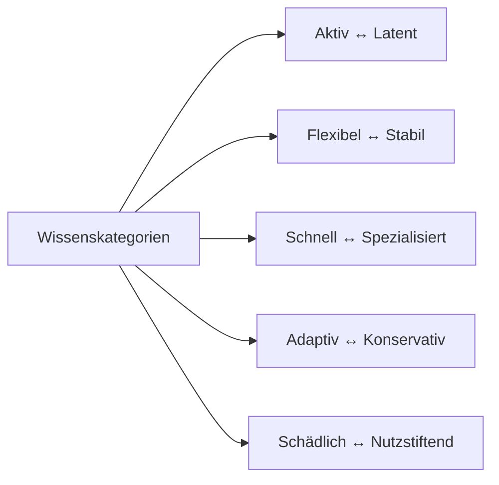

**Epistemosphäre als theoretisches Modell zur Beschreibung und Steuerung von Wissensprozessen**

created: 25.10.2024 | updated: 7.6.2025 [published](https://zenodo.org/records/15614717): 20.05.2025 | [[Hinweise]]

# Einleitung

In diesem Dokument wird die Epistemosphäre als neues theoretisches Modell zur Beschreibung und Steuerung von Wissensprozessen eingeführt. Das Konzept basiert auf biologischen Analogien und speziell auf der Dynamik von Viren, die Wissen als lebendigen, dynamischen Prozess in sozialen und psychischen Systemen beschreibt. Die Epistemosphäre geht davon aus, dass Wissen, ähnlich wie virale Prozesse, durch Aktivierung, Verbreitung, Stabilisierung und Zerfall charakterisiert ist (Wilson & Nagel, 2019). 

Die zentrale Hypothese hinter der Epistemosphäre ist, dass Wissen nicht nur als statische Information gesehen werden kann, sondern als Prozess, der durch soziale Interaktionen und innere kognitive Mechanismen lebendig wird (McKelvey, 2021). Der Ansatz beruht auf der Übertragung naturwissenschaftlicher Prinzipien, speziell aus der Biologie, auf soziale und psychische Systeme und postuliert, dass Wissen messbar und steuerbar gemacht werden kann, wenn es als dynamisches System verstanden wird.

Dieses Modell verspricht insbesondere für die Bildungswissenschaft und das Wissensmanagement neue Perspektiven, indem es eine genauere Klassifikation, eine gezielte Steuerung und möglicherweise eine verfeinerte Messbarkeit von Wissensprozessen ermöglicht. Das Hauptziel der Epistemosphäre ist es daher, Wissen systematisch zu strukturieren und steuerbar zu machen, um es bewusster in Bildungsprozessen zu integrieren (Nagel et al., 2018). 

Die Epistemosphäre bietet somit eine theoretische Grundlage für die Entwicklung präziserer Messinstrumente, die Wissen nicht nur als isolierte Information, sondern als interaktives, sich veränderndes Konstrukt erfasst, ähnlich wie es bei viralen Prozessen der Fall ist. Dieser Ansatz adressiert eine lang bestehende Herausforderung im Bildungsbereich, nämlich das Wissen dynamisch und nicht bloß als statisches Objekt zu betrachten, das in Dokumentensystemen archiviert wird. 

# 1 Definition

Der Begriff Epistemosphäre bezeichnet eine theoretische Sphäre, in der Wissen als lebendiger, dynamischer Prozess entsteht, verbreitet, verankert und zerfällt. Die Epistemosphäre verbindet biologische Analogien, insbesondere virale Prozesse, mit der Dynamik des Wissens, wodurch Wissen als aktiver Bestandteil sozialer und psychischer Systeme betrachtet wird (Wilson & Nagel, 2019). Diese Perspektive unterscheidet sich grundlegend von traditionellen Wissenskonzepten, die Wissen oft statisch betrachten, und ermöglicht eine tiefere Einsicht in dessen Struktur und Funktionsweise.

Das Modell der Epistemosphäre basiert auf folgenden zentralen Annahmen:

1. **Wissen verhält sich analog zu Viren**: Es wird angenommen, dass Wissen in ähnlicher Weise wie virale Infektionen funktioniert, wobei Aktivierungsmechanismen, Verbreitungsmuster und Stabilität eine wichtige Rolle spielen (McKelvey, 2021). Durch die Anwendung mathematischer Modelle, wie dem SIR- oder SEIR-Modell, wird Wissen als etwas betrachtet, das innerhalb bestimmter sozialer und psychischer Systeme zu- oder abnehmen kann (Nagel et al., 2018).

2. **Soziale und psychische Systeme folgen naturwissenschaftlichen Gesetzmäßigkeiten**: Dieses Modell postuliert, dass Wissensdynamiken den Naturgesetzen folgen und somit durch geeignete mathematische und biologische Modelle abgebildet werden können. Die Epistemosphäre integriert dadurch Ansätze der Systemtheorie und der Biologie in die Bildungswissenschaft, indem sie Wissen als regulierbares und steuerbares System darstellt, das sich auf natürliche Weise entwickelt und stabilisiert (Wilson & McKelvey, 2020).

3. **Die Dynamik von Wissen lässt sich durch Aktivierungsmechanismen und Phasen erfassen**: Ein weiterer zentraler Bestandteil der Epistemosphäre sind die Aktivierungsmechanismen und -phasen, die sich auf emotionale und bedürfnisorientierte Trigger beziehen. Diese Trigger fördern die Verbreitung und Festigung von Wissen und machen die Wissensprozesse steuerbar und kontrollierbar. In dieser Hinsicht stellt die Epistemosphäre ein Instrument zur gezielten Wissensverbreitung dar, das im Bildungsbereich implementiert werden kann (Wilson et al., 2020).

Durch die Kombination dieser drei Annahmen beschreibt die Epistemosphäre Wissen nicht nur als theoretisches Konstrukt, sondern als anwendungsorientiertes Modell, das eine praktische Implementierung und Steuerung von Wissensprozessen ermöglicht.

# 2 Herleitung

Die Herleitung der Epistemosphäre als theoretisches Modell zur Beschreibung von Wissensprozessen erfordert eine interdisziplinäre Betrachtung, die sowohl philosophische als auch naturwissenschaftliche und bildungswissenschaftliche Perspektiven integriert. Dieses Kapitel untersucht die theoretischen Grundlagen, die zur Entwicklung der Epistemosphäre geführt haben, und beleuchtet, wie Wissen als dynamischer, lebendiger Prozess in sozialen und psychischen Systemen verstanden werden kann.

Aus philosophischer Sicht wird die Epistemosphäre als evolutionäre Struktur betrachtet, in der Wissen durch soziale Interaktionen und kollektive Lernprozesse kontinuierlich reproduziert und transformiert wird. Diese Perspektive betont die Rolle von kulturellen und sozialen Einflüssen sowie individueller Motivation und Neugier bei der Aktivierung von Wissen. Analog zur viralen Dynamik wird Wissen als Ressource gesehen, die durch aktiven Austausch in sozialen Gruppen wirksam wird.

Die biowissenschaftliche Perspektive ergänzt diese Sichtweise, indem sie Wissen als dynamisches System beschreibt, dessen Verbreitung und Stabilität durch epidemiologische Modelle wie das SIR- und SEIR-Modell erfasst werden können. Diese Modelle bieten wertvolle Einblicke in die Mechanismen der Wissensverbreitung und -stabilisierung und ermöglichen eine präzise Analyse der Wissensdynamik in sozialen Systemen.

Im bildungswissenschaftlichen Kontext stellt die Epistemosphäre ein innovatives Framework zur präzisen Steuerung und Strukturierung von Wissensprozessen dar. Durch die Einführung spezifischer Wissenskategorien und die Anwendung biologischer Analogien wird Wissen als dynamische Ressource betrachtet, die gezielt in Bildungsprozesse integriert werden kann. Diese Herangehensweise ermöglicht eine differenzierte Betrachtung von Wissen und fördert die Entwicklung maßgeschneiderter Bildungsstrategien, die auf die individuellen Lernbedürfnisse und -kontexte abgestimmt sind.

## 2.1 Philosophie

Aus philosophischer Perspektive wird die Epistemosphäre als evolutionäre Struktur betrachtet, in der Wissen kontinuierlich durch soziale Interaktionen und kollektive Lernprozesse reproduziert und transformiert wird. Dieser Ansatz betont, dass Wissen nicht statisch ist, sondern ein sich verändernder Bestandteil sozialer Systeme. 

Die Epistemosphäre verankert das Konzept, dass Wissen als dynamische, latent vorhandene Ressource in sozialen Strukturen existiert und durch Aktivierungsmechanismen „lebendig“ gemacht wird. Hierbei spielen kulturelle und soziale Einflüsse sowie individuelle [[Motivation]] und Neugier eine bedeutende Rolle. Analog zur viralen Dynamik, bei der Infektionsprozesse durch spezifische Umweltbedingungen aktiviert werden, betrachtet die Epistemosphäre Wissen als eine Ressource, die erst durch den aktiven Austausch und die Interaktion in sozialen Gruppen wirksam wird (Wilson & Nagel, 2019). 

Dieser philosophische Ansatz basiert auf der Annahme, dass Wissen nicht nur auf individueller, sondern auch auf kollektiver Ebene erworben wird und dass kollektives [[Lernen als universelles Prinzip]] ein evolutionärer Prozess ist, der durch Austauschprozesse in der Gemeinschaft vorangetrieben wird. Wissen „infiziert“ soziale Systeme auf eine Weise, die kulturelle Normen und kollektive Werte integriert und transformiert, ähnlich wie sich Gedanken und Überzeugungen durch ständigen Diskurs innerhalb von Gemeinschaften verfestigen oder wandeln (McKelvey, 2021). Die Epistemosphäre bietet somit eine Struktur, in der das Wissen durch soziale Synergien wächst und evolviert, und zwar nach ähnlichen Prinzipien, wie biologische Systeme sich im Laufe der Zeit anpassen und weiterentwickeln.

Durch diesen Ansatz wird Wissen nicht als isolierte Entität betrachtet, sondern als ein Produkt kollektiver Handlungen, das sich in seiner Struktur durch Interdependenz und die Interaktion mit Umweltfaktoren wandelt. Die Epistemosphäre bekräftigt, dass Wissen als gemeinschaftlich geteilte und sich entwickelnde Ressource verstanden werden muss, die durch kulturelle Praktiken geformt wird und soziale Entwicklungen beeinflusst. 

## 2.2 Biologie

Die biowissenschaftliche Perspektive betrachtet Wissen in der Epistemosphäre als dynamisches System, dessen Verbreitung und Stabilität durch epidemiologische Modelle beschrieben werden können, wie das SIR-, SEIR-, MSEIR- und SIS-Modell. Diese Modelle sind für die Beschreibung der Wissensverbreitung besonders wertvoll, da sie die Dynamik der Aktivierung, Verbreitung und des Wissensverlusts in sozialen und psychischen Systemen abbilden (McKelvey, 2021).

Das **SIR-Modell** beschreibt drei Zustände: empfänglich (**Susceptible**), infiziert (**Infected**) und erholt (**Recovered**). Übertragen auf Wissen repräsentieren diese Zustände Personen, die für Wissen empfänglich sind, aktiv Wissen aufnehmen oder es bereits verankert haben. So können Bildungsprozesse wie die Wissensverbreitung in Gruppen präziser erfasst und analysiert werden (Nagel et al., 2018).

Das **SEIR-Modell** fügt eine Latenzphase (**Exposed**) hinzu, in der Wissen vorhanden, jedoch inaktiv ist. Diese Latenzphase ist besonders relevant in Lernprozessen, bei denen Wissen zunächst inaktiv ist und erst durch spezifische Aktivierungsmechanismen (z. B. [[Neugier]] oder [[Motivation]] aktiviert wird. So erklärt das SEIR-Modell, warum Wissen ohne Anwendung verblasst, ähnlich wie Viren in einem inaktiven Stadium verharren, bis sie bestimmte Bedingungen aktivieren (Wilson & McKelvey, 2020).

Das **MSEIR-Modell** erweitert das SEIR-Modell um eine Phase der **passiven Immunität** (M). In der Epistemosphäre zeigt dieser Zustand an, dass Wissen verankert ist, jedoch nicht aktiv genutzt wird. Regelmäßige Anwendung oder soziale Verstärkung stabilisieren es, wodurch der Wissensverlust verlangsamt oder verhindert wird. Dies entspricht biologischen Prozessen der Immunität, bei denen wiederholte Reize das Gedächtnis stärken und den „Zerfall“ verlangsamen (McKelvey, 2021).

Das **SIS-Modell** ist ein weiteres relevantes Modell und unterscheidet sich durch den [[Zyklus]] zwischen nur zwei Zuständen: **Susceptible** (anfällig) und **Infected** (infiziert). Im Wissenskontext beschreibt das SIS-Modell eine Form des Wissens, das instabil bleibt, also regelmäßig aufgefrischt werden muss, um bestehen zu bleiben. Besonders bei Kenntnissen, die kontinuierliche Anwendung erfordern, um nicht vergessen zu werden, wie etwa technische Fertigkeiten, kann das SIS-Modell zur Erklärung dienen. Hiermit lässt sich veranschaulichen, dass manche Wissensinhalte bei fehlender Wiederholung in den anfälligen Zustand zurückfallen und nicht nachhaltig verankert werden können (Wilson & Nagel, 2019).

Zusammen bieten diese [[Epistemosphäre#2.4 Mathematische Formeln|mathematischen Modelle]] eine detaillierte Grundlage zur Analyse der Wissensdynamik in sozialen Systemen und zeigen auf, wie Wissen stabilisiert, aktiviert und unter geeigneten Bedingungen reproduziert werden kann.

## 2.3 Bildungswissenschaft

Im bildungswissenschaftlichen Kontext stellt die Epistemosphäre ein innovatives Framework zur präzisen Steuerung und Strukturierung von Wissensprozessen dar. Dieses Modell erlaubt es, Wissen dynamisch zu erfassen und gezielt in Bildungsprozesse zu integrieren. Dabei wird Wissen nicht als statischer Bestand betrachtet, sondern als Prozess, der durch spezifische Bedingungen aktiviert und stabilisiert wird. Ein zentraler Aspekt dieses Ansatzes ist die Einführung der fünf Wissenskategorien – Aktiv ↔︎ Latent, Flexibel ↔︎ Stabil, Schnell ↔︎ Spezialisiert, Adaptiv ↔︎ Konservativ, und Schädlich ↔︎ Nutzstiftend – die eine differenzierte Betrachtung von Wissen ermöglichen (Wilson et al., 2020). Diese Kategorien bieten die Möglichkeit, Bildungsprozesse präzise auf individuelle Lernbedarfe und unterschiedliche Wissensarten abzustimmen.

Die Epistemosphäre hebt hervor, dass Wissen wie eine „infektiöse“ Ressource funktioniert, die gezielt aktiviert und gemessen werden kann, beispielsweise durch Testverfahren oder durch Aufgaben, die auf spezifische Wissensarten abzielen. Der Ansatz fördert eine strukturierte Wissensweitergabe und ermöglicht es, Wissen auf einer konzeptionellen Ebene zu stabilisieren, bevor es in langfristige Erinnerungsprozesse übergeht (Nagel et al., 2018). Die Messung von Wissen durch Tests und Klausuren macht es möglich, den aktuellen „Wissensstand“ der Lernenden zu bestimmen und gezielte Interventionen zu planen, um spezifische Wissenskategorien zu fördern oder bestehende Wissenslücken zu schließen.

Ein weiterer Vorteil der Epistemosphäre ist, dass sie eine Anpassung der Testverfahren erlaubt. Da Wissen als dynamische und kontextabhängige Ressource gesehen wird, können Tests so entwickelt werden, dass sie verschiedene Wissensarten erfassen und auf diese abgestimmt sind. Dies erlaubt eine bewusste Steuerung von Wissen in sozialen Lernprozessen und stellt sicher, dass Bildungsprozesse systematisch und adaptiv gestaltet werden können, um den individuellen Lernfortschritt und die langfristige Verankerung des Wissens zu fördern (Wilson & McKelvey, 2020).

Die fünf Wissenskategorien der Epistemosphäre ermöglichen es, Bildungsprozesse so zu gestalten, dass sie sowohl individuelle als auch kollektive Lernziele adressieren. Sie bieten eine differenzierte Grundlage, um Bildungsinhalte in spezifische Formen von Wissen zu unterteilen und dadurch einen maßgeschneiderten Ansatz zu entwickeln, der den Lernbedürfnissen und Lernkontexten der Individuen gerecht wird. Dieser Ansatz betont, dass Wissen als lebendiger und fortlaufender Prozess gesehen werden muss, der durch soziale und psychische Bedingungen kontinuierlich geformt und erneuert wird (McKelvey, 2021).

Insgesamt stellt die Epistemosphäre ein umfassendes Modell dar, das eine strukturierte und gezielte Wissensweitergabe fördert und dabei eine flexible Anpassung an die [[Bedürfnis|Bedürfnisse]] und Bedingungen der Lernenden erlaubt. Das Modell integriert biologische Dynamiken und macht Wissen zu einem aktiv steuerbaren Bestandteil des Bildungsprozesses.

## 2.4 Mathematische Formeln

Die Dynamik von Wissen in der Epistemosphäre lässt sich mithilfe epidemiologischer Modelle beschreiben. Diese Modelle – SIR, SEIR, MSEIR und SIS – stammen aus der Biologie und erfassen die Ausbreitung und Stabilität von Infektionen, was sich hier analog auf Wissensverbreitung und -stabilität anwenden lässt. 

### 2.4.1 SIR-Modell

Das **SIR-Modell** (Susceptible-Infected-Recovered) beschreibt den Wissensverbreitungsprozess durch folgende Differentialgleichungen:

$$
\frac{dS}{dt} = -\beta S I
$$
$$
\frac{dI}{dt} = \beta S I - \gamma I
$$
$$
\frac{dR}{dt} = \gamma I
$$

- $S$: Anteil der empfänglichen Individuen (Susceptible), die potenziell Wissen aufnehmen können.
- $I$: Anteil der infizierten Individuen (Infected), die aktiv Wissen erlernen und anwenden.
- $R$: Anteil der genesenen oder stabilisierten Wissenden (Recovered), die Wissen fest verankert haben.
- $\beta$: Übertragungsrate des Wissens, beschreibt die Geschwindigkeit der Wissensverbreitung.
- $\gamma$: Rate der Stabilisierung, beschreibt, wie schnell Wissen fest verankert wird.

Die erste Gleichung beschreibt den Rückgang der empfänglichen Gruppe durch den Einfluss der Wissensübertragung, während die zweite Gleichung den Übergang von aktivem Wissenserwerb zur Stabilisierung zeigt. Die dritte Gleichung beschreibt, wie stabilisiertes Wissen in den Zustand $R$ übergeht, also dauerhaft verankert wird (Nagel et al., 2018).

### 2.4.2 SEIR-Modell

Das **SEIR-Modell** fügt eine **Latenzphase** hinzu, die die Gruppe der Exponierten ($E$) beschreibt, die Wissen erlernt, aber noch nicht aktiv anwendet:

$$
\frac{dS}{dt} = -\beta S I
$$
$$
\frac{dE}{dt} = \beta S I - \sigma E
$$
$$
\frac{dI}{dt} = \sigma E - \gamma I
$$
$$
\frac{dR}{dt} = \gamma I
$$

- $E$: Exponierte (Exposed), Lernende in einer Latenzphase des Wissenserwerbs.
- $\sigma$: Aktivierungsrate, die beschreibt, wie schnell das Wissen aus der Latenzphase aktiv wird.

Die Latenzphase $E$ unterscheidet Lernende, die Wissen noch nicht aktiv anwenden, sondern erst bei Eintreten bestimmter Bedingungen (z. B. [[Motivation]] oder Kontext) zur aktiven Nutzung übergehen (Wilson & McKelvey, 2020).

### 2.4.3 MSEIR-Modell

Das **MSEIR-Modell** fügt eine weitere Komponente der passiven Immunität ($M$) hinzu, die Individuen beschreibt, die das Wissen haben, es aber nicht aktiv anwenden:

$$
\frac{dM}{dt} = -\alpha M
$$
$$
\frac{dS}{dt} = \alpha M - \beta S I
$$
$$
\frac{dE}{dt} = \beta S I - \sigma E
$$
$$
\frac{dI}{dt} = \sigma E - \gamma I
$$
$$
\frac{dR}{dt} = \gamma I
$$

- $M$: Individuen mit passiver Wissensstabilität, die Wissen besitzen, aber nicht aktiv anwenden.
- $\alpha$: Rate der „passiven Wissensverzögerung“, die beschreibt, wie schnell Wissen von passivem in aktives Potenzial übergeht.

Das MSEIR-Modell beschreibt, wie passives Wissen durch äußere Einflüsse wieder aktiviert wird und wie stabilisiertes Wissen ($R$) kontinuierlich durch gelegentliche Nutzung stabilisiert wird, ähnlich wie durch regelmäßiges Auffrischen (McKelvey, 2021).

### 2.4.4 SIS-Modell

Das **SIS-Modell** modelliert Wissen, das regelmäßig aufgefrischt werden muss, da es andernfalls „vergessen“ wird. Es enthält nur zwei Zustände:

$$
\frac{dS}{dt} = \gamma I - \beta S I
$$
$$
\frac{dI}{dt} = \beta S I - \gamma I
$$

- $S$: Empfängliche, die anfällig für den Wissensverlust sind, wenn Wissen nicht regelmäßig angewendet wird.
- $I$: Lernende mit aktivem Wissen, das jedoch in den anfälligen Zustand zurückfällt, wenn es nicht durch Anwendung stabilisiert wird.

Das SIS-Modell beschreibt die Dynamik instabilen Wissens, das ohne Wiederholung verloren geht. Es ist insbesondere bei praktischen Fertigkeiten und technischen Kenntnissen anwendbar, die regelmäßige Auffrischung erfordern, um effektiv genutzt werden zu können (Wilson & Nagel, 2019).

Durch die Kombination dieser Modelle wird Wissen als Prozess modelliert, der aktiv beeinflusst und durch gezielte Bildungsmaßnahmen stabilisiert werden kann.

### 2.4.5 Synopse der mathematischen epidemiologischer Modelle zur bildungswissenschaftlichen Übertragung

| **Modell**       | **Beschreibung im Epidemiologischen Kontext**                                                                                      | **Übertragung auf Bildungswissenschaft**                                                                                                   | **Wissensprozess-Beschreibung**                                                                                  |
| ---------------- | ---------------------------------------------------------------------------------------------------------------------------------- | ------------------------------------------------------------------------------------------------------------------------------------------ | ---------------------------------------------------------------------------------------------------------------- |
| **SIR-Modell**   | Verteilung in drei Gruppen: empfängliche ($S$), infizierte ($I$), genesene ($R$); beschreibt die Infektionsverläufe bei Epidemien. | Modelliert Wissen als ansteckenden Prozess mit stabilisiertem (verankertem) Wissen. Testverfahren bewerten Wissenserwerb und -verankerung. | Wissen wird aktiv erworben (Infektion) und durch Lernprozesse gefestigt, bis es stabilisiert (verankert) bleibt. |
| **SEIR-Modell**  | Enthält eine zusätzliche Latenzphase ($E$) für Exponierte, die infiziert sind, aber noch keine Symptome zeigen.                    | Erklärt inaktive Wissensphasen (Latenz), die durch Aktivierung (z. B. Neugier oder Kontext) ins [[Lernen als universelles Prinzip]] übergehen.                      | Wissen wird „infiziert“, bleibt latent, bis Aktivierung es zur aktiven Nutzung bringt.                           |
| **MSEIR-Modell** | Erweiterung um eine passive Immunitätsphase ($M$), in der Individuen immun sind, aber Wissen nicht aktiv nutzen.                   | Erfasst passive Wissensphasen: Wissen ist verankert, wird jedoch durch regelmäßige Anwendung reaktiviert, um Stabilität zu gewährleisten.  | Passiv gespeichertes Wissen wird durch Auffrischung wieder aktiviert und stabilisiert.                           |
| **SIS-Modell**   | Modelliert Infektionen, die in den empfänglichen Zustand ($S$) zurückfallen, wenn kein Immunitätsschutz besteht.                   | Beschreibt Wissen, das durch ständige Anwendung gefestigt werden muss; sonst tritt Wissensverlust ein.                                     | Wissen ohne Auffrischung geht verloren, muss durch kontinuierliche Nutzung stabilisiert werden.                  |

*Tabelle 1: Übertragung epidemiologischer Modelle auf Wissenstransfer und -stabilität in der Bildung*

## 2.5 Beispiele

Die folgenden Beispiele veranschaulichen die Anwendung der epidemiologischen Modelle im bildungswissenschaftlichen Kontext. Jedes Beispiel zeigt, wie Wissensverbreitung, -stabilisierung und -verlust mit spezifischen Modellen erfasst und optimiert werden können.

### 2.5.1 SIR-Modell: Verbreitung von Grundkenntnissen im Mathematikunterricht

Das **SIR-Modell** (Susceptible-Infected-Recovered) eignet sich zur Analyse der Wissensverbreitung von Grundkenntnissen in einem Klassenzimmer, etwa in der Mathematik. Lernende beginnen als „empfängliche“ Individuen ($S$), die offen für neues Wissen sind. Durch Unterricht und regelmäßige Übung gelangen die Lernenden in die „infizierte“ Phase ($I$), in der sie aktiv Wissen aufnehmen und anwenden. Über Zeit und durch Wiederholung wird das Wissen gefestigt, und die Schüler erreichen die „genesene“ Kategorie ($R$), in der das Wissen stabilisiert ist und nachhaltig genutzt werden kann. Die Übertragungsrate ($\beta$) steht hier für die Effektivität der Unterrichtsmethoden, während die Stabilisierungsrate ($\gamma$) die Festigung des Wissens durch Anwendung misst. So können Lehrkräfte die Wissensverteilung und Festigung durch gezielte didaktische Maßnahmen steuern, um ein tiefes Verständnis sicherzustellen (Wilson & Nagel, 2019).

### 2.5.2 SEIR-Modell: Sprachenlernen und latente Wissensphasen

Das **SEIR-Modell** (Susceptible-Exposed-Infected-Recovered) fügt dem SIR-Modell die **Latenzphase** ($E$) hinzu, in der Wissen vorhanden, jedoch noch nicht aktiv genutzt wird. Diese Phase eignet sich zur Beschreibung von Sprachenlernen, wo Vokabeln und Grammatik zunächst erlernt, aber oft nur partiell aktiviert sind. Lernende befinden sich in der Expositionsphase ($E$), in der Wissen aufgenommen, aber noch nicht aktiv angewendet wird. Wenn Lernende das Wissen aktiv nutzen, wechseln sie in die infizierte Phase ($I$). Durch regelmäßige Konversationspraxis und Anwendung stabilisiert sich das Wissen schließlich in der „genesenen“ Phase ($R$). Dieses Modell erklärt, wie Wissen durch Übung und Anwendung gefestigt wird, aber auch, wie es durch fehlende Aktivierung wieder verfallen kann (Wilson & McKelvey, 2020).

### 2.5.3 MSEIR-Modell: Langfristige Wissensstabilisierung in der Mathematik

Das **MSEIR-Modell** (Maternally Susceptible-Exposed-Infected-Recovered) erweitert das SEIR-Modell um eine **passive Immunitätsphase** ($M$). Dies bietet sich besonders für das [[Lernen als universelles Prinzip]] von Fächern wie Mathematik an, wo grundlegende Kenntnisse regelmäßig aufgefrischt werden müssen, um langfristig stabil zu bleiben. Lernende, die grundlegende Rechenfertigkeiten erwerben, können diese durch regelmäßige Wiederholung und Übung stabilisieren. Ohne Auffrischung fällt das Wissen jedoch in eine latente Phase ($M$) zurück, in der es zwar vorhanden ist, jedoch nicht aktiv genutzt wird. Die Rate $\alpha$ beschreibt hier, wie Wissen aus dem passiven in den aktiven Bereich übergeht. Dies hilft Lehrkräften, durch regelmäßige Tests und Wiederholungsübungen die Wissensstabilität gezielt zu fördern (McKelvey, 2021).

### 2.5.4 SIS-Modell: Instabiles Wissen bei praktischen Fertigkeiten

Das **SIS-Modell** (Susceptible-Infected-Susceptible) beschreibt Wissensprozesse, bei denen Wissen bei fehlender Anwendung schnell verloren geht und eine ständige Wiederholung erforderlich ist. Dieses Modell ist besonders geeignet für praktisches Wissen, etwa in handwerklichen oder technischen Ausbildungen. Lernende, die Fertigkeiten wie Programmieren erlernen, befinden sich in einem instabilen Wissensprozess: Wenn das Wissen nicht regelmäßig angewendet wird, fallen sie zurück in den empfänglichen Zustand ($S$). Nur durch regelmäßiges Training oder Praxis kann das Wissen in der infizierten Phase ($I$) gehalten werden. Die Übertragungsrate $\beta$ steht hier für die Effektivität des praktischen Trainings, während die Rückfallrate $\gamma$ das Risiko des Wissensverlustes beschreibt, wenn das Wissen nicht angewendet wird (Nagel et al., 2018).

# 3 Folgerungen

Die Einführung der Epistemosphäre ermöglicht eine grundlegende Neuausrichtung in der Analyse und Handhabung von Wissen. Das Konzept liefert nicht nur eine theoretische Grundlage, sondern eröffnet auch praktisch nutzbare Perspektiven für die Bildungswissenschaften und das Wissensmanagement.

## 3.1 Traditionelle Kategorien: Deklarativ und Prozessual

Die traditionelle Bildungswissenschaft definiert Wissen in den Kategorien **deklarativ** und **prozessual**. Deklaratives Wissen umfasst explizite Fakten und Informationen, die bewusst erinnert und kommuniziert werden, wie historische Daten oder Definitionen mathematischer Formeln. Prozessuales Wissen hingegen beschreibt erlernte Handlungsabläufe und Fähigkeiten, die implizit und durch wiederholte Praxis erworben werden, wie Fahrradfahren oder das Erlernen technischer Abläufe (Wilson & Nagel, 2019). Diese Einteilung stößt jedoch an ihre Grenzen, da sie die dynamischen Eigenschaften von Wissen vernachlässigt und auf eine starre, zweidimensionale Sichtweise reduziert. Die Epistemosphäre erweitert diesen Ansatz, indem sie Wissen in multidimensionale und dynamische Kategorien unterteilt, die präzisere Steuerungs- und Stabilisierungsmöglichkeiten in Lernprozessen bieten.

### 3.2 Strukturierung und Kategorisierung von Wissen

Die Epistemosphäre stellt eine präzise Struktur zur Verfügung, durch die Wissen differenziert kategorisiert und modelliert werden kann. Diese Klassifikation basiert auf den fünf entwickelten Wissenskategorien (z. B. Aktiv ↔︎ Latent und Flexibel ↔︎ Stabil) und erlaubt eine differenzierte Sicht auf Wissen als eine multidimensionale und dynamische Ressource. Dies führt zu einer klaren und handhabbaren Strukturierung, die es erlaubt, Wissen als systematisch gegliederten, „lebendigen“ Prozess zu betrachten (Wilson & McKelvey, 2020). Die Kategorien ermöglichen es, Wissen je nach Bildungsziel und individueller Lernstrategie gezielt zu verorten und zu fördern. 

*Abbildung 1: Übersicht der epistemosphärischen Kategoren*

### 3.2.1 Aktiv ↔︎ Latent

Die Kategorie **Aktiv ↔︎ Latent** beschreibt Wissen in seinen verschiedenen Nutzungsstadien. Aktives Wissen wird derzeit angewandt und ist für den Wissensinhaber zugänglich, während latentes Wissen ungenutzt bleibt und erst durch Aktivierungsmechanismen wie Repetition oder Neugier hervorgeholt werden kann (Wilson & McKelvey, 2020). Diese Unterscheidung ist zentral für Bildungsprozesse, da aktives Wissen leichter reproduziert und angewandt wird, während latentes Wissen oft wiederbelebt werden muss, um verfügbar und nützlich zu sein.

### 3.2.2 Flexibel ↔︎ Stabil

**Flexibles Wissen** beschreibt Inhalte, die sich leicht anpassen und auf verschiedene Situationen übertragen lassen, während **stabiles Wissen** konstant bleibt und durch Wiederholung und Anwendung verfestigt wurde (McKelvey, 2021). Flexibles Wissen fördert Kreativität und Problemlösungsfähigkeiten, kann jedoch bei geringem Einsatz schnell verloren gehen. Stabiles Wissen hingegen bildet oft die Grundlage für weiterführendes [[Lernen als universelles Prinzip]], da es in spezifischen Bereichen sicher abrufbar bleibt (Wilson & Nagel, 2019).

### 3.2.3 Schnell ↔︎ Spezialisiert

**Schnelles Wissen** umfasst Inhalte, die zügig aufgenommen werden können, aber oft nur oberflächliches Verständnis vermitteln, wie aktuelle Fakten oder einfache Verfahren. Im Gegensatz dazu ist **spezialisiertes Wissen** tiefgründiger, erfordert mehr Lernzeit und bezieht sich meist auf spezifische Fachbereiche (Nagel et al., 2018). Bildungsprozesse müssen diese beiden Wissensformen abwägen: Während schnelles Wissen für kurzfristige Projekte effizient ist, bildet spezialisiertes Wissen die Grundlage für Expertenkompetenz.

### 3.2.4 Adaptiv ↔︎ Konservativ

**Adaptives Wissen** zeichnet sich durch Anpassungsfähigkeit an neue Kontexte aus, was in dynamischen Lern- und Arbeitsumgebungen entscheidend ist. **Konservatives Wissen** hingegen ist festgelegt und wird meist in stabilen, langjährigen Anwendungen benötigt, wie in grundlegenden mathematischen Prinzipien (Wilson & McKelvey, 2020). Bildungsstrategien profitieren von dieser Unterscheidung, da sie adaptives Wissen für Flexibilität und konservatives Wissen für Zuverlässigkeit fördern können.

### 3.2.5 Schädlich ↔︎ Nutzstiftend

**Schädliches Wissen** ist Wissen, das bei unsachgemäßer Anwendung negative Folgen haben kann, wie z. B. gefährliches Halbwissen oder manipulative Techniken. **Nutzstiftendes Wissen** hingegen trägt zur positiven Entwicklung und Problemlösung bei (Wilson & Nagel, 2019). Diese Kategorie hilft, Bildungsprozesse zu strukturieren und sicherzustellen, dass nur Wissen vermittelt wird, das produktiv und konstruktiv genutzt werden kann.

### 3.3 Wissen als dynamisches System durch biologische Analogien

Durch die Anwendung biologischer Modelle und Prinzipien lässt sich Wissen nicht länger nur als statische Information verstehen, sondern als dynamisches, sich entwickelndes System. Die Epistemosphäre nutzt die Analogie zur Biologie und zur Virenforschung, um Wissen als einen Prozess darzustellen, der durch Aktivierung, Stabilisierung und gegebenenfalls Verlust gekennzeichnet ist (McKelvey, 2021). So kann durch die gezielte Steuerung von Aktivierungsmechanismen, etwa durch Testverfahren und regelmäßige Anwendung, die Verankerung von Wissen gefördert und stabilisiert werden. Diese Herangehensweise fördert nicht nur das Verständnis von Wissen als sozialem und psychologischem Phänomen, sondern bietet eine fundierte Grundlage für gezielte pädagogische Interventionen und Lernmethoden.

### 3.4 Steuerung und gezielte Verankerung von Wissen

Die spezifische Kategorisierung der Wissensformen und deren dynamische Modelle erlauben es, den Prozess der Wissensverbreitung und -stabilisierung gezielt zu steuern. Durch den Einsatz von Modellen wie dem SIR- und SEIR-Modell lassen sich Mechanismen der Wissensverbreitung identifizieren und gezielt fördern. Etwa können Latenzphasen als Indikatoren für Unterrichtsinhalte dienen, die zusätzliche Übung oder Anwendung erfordern, um das Wissen zu festigen. Das MSEIR-Modell bietet eine Erklärung für die „passive Immunität“ des Wissens, welches, wenn regelmäßig angewendet und getestet, stabil bleibt und durch Anwendung im Langzeitgedächtnis verankert wird (Wilson & Nagel, 2019). Diese Steuerung durch gezielte Kategorisierung und Anwendung fördert ein besseres Verständnis davon, wie Wissen aufgebaut und langfristig stabilisiert wird, und erlaubt eine optimierte Gestaltung von Lernprozessen und Unterrichtsmethoden.

## 3.5 Wissen, Operationen und Re-Entry im systemischen Modell

Im systemischen Modell der Epistemosphäre spielt Wissen die zentrale Rolle als Grundlage aller Operationen innerhalb eines Systems. Die folgenden vier Komponenten – Wissen, Epistemosphäre, Re-Entry und Operationen – wirken dabei im Zusammenspiel, um sicherzustellen, dass das System kohärent, flexibel und auf aktuellem Wissen basierend operieren kann.

### 3.5.1 Wissen als Grundlage aller Operationen

   Im Kontext der Epistemosphäre ist Wissen die fundamentale Basis für alle Operationen, die innerhalb eines Systems ablaufen. Es liefert die Regeln, Strukturen und Inhalte, die es dem System ermöglichen, konsistente und zielgerichtete Aktionen durchzuführen (Wilson & Nagel, 2019). Hierbei lässt sich Wissen als dynamischer Prozess verstehen, der durch kontinuierliche Reflexion, Aktualisierung und Kontextanpassung relevant und funktionsfähig bleibt.

   - **Operationen beruhen auf Wissen**: Ohne ein fundiertes Wissensgerüst kann ein System keine kohärenten Aktionen durchführen. Wissen bildet die Grundlage für jede Handlung im System und stellt sicher, dass diese auf valide Informationen und Strukturprinzipien zurückgreifen kann (McKelvey, 2021).
   - **Dynamische Wissensentwicklung**: Wissen in der Epistemosphäre ist nicht statisch. Es durchläuft verschiedene Phasen und Zustände (z. B. Aktiv/Latent, Flexibel/Stabil), die sicherstellen, dass Wissen sich ständig an neue Anforderungen und Kontexte anpassen kann. Diese Zustände zeigen, dass Wissen – ähnlich wie biologische Systeme – regelmäßig überprüft und angepasst werden muss, um langfristig für das System nutzbar zu bleiben (Nagel et al., 2018).

### 3.5.2 Die Epistemosphäre als Kontext für Wissensdynamiken

   Die Epistemosphäre beschreibt Wissen als ein dynamisches System mit verschiedenen Zuständen und Qualitäten, die darüber entscheiden, wie Wissen im System verfügbar ist und genutzt werden kann. Durch die Kategorien Aktiv/Latent, Flexibel/Stabil und Schädlich/Nutzstiftend zeigt die Epistemosphäre, dass Wissen unterschiedliche Formen und Zugänglichkeiten aufweist:

   - **Aktives Wissen**: Wissen, das derzeit im Einsatz ist und dem System unmittelbar zur Verfügung steht.
   - **Latentes Wissen**: Wissen, das zwar im System vorhanden ist, aber aktuell nicht genutzt wird und erst durch spezifische Trigger aktiviert werden muss.
   - **Flexibles und stabiles Wissen**: Flexibles Wissen passt sich an neue Kontexte an und unterstützt die Problemlösung, während stabiles Wissen fest im System verankert ist und eine zuverlässige Grundlage für Operationen bietet (Wilson & McKelvey, 2020).

   Diese Wissenszustände zeigen, dass Wissen in einem ständigen Wechsel von Aktivierung, Latenz und Stabilisierung steht, was es dem System ermöglicht, sich flexibel und angepasst an neue Anforderungen zu entwickeln.

### 3.5.3 Re-Entry als zentraler Erneuerungsprozess

   Re-Entry fungiert in diesem Modell als grundlegender Mechanismus, der sicherstellt, dass Wissen im System zyklisch erneuert und aktualisiert wird. Ohne Re-Entry würde das System Gefahr laufen, auf veraltetes oder inaktives Wissen zurückzugreifen, was die Effizienz und Anpassungsfähigkeit seiner Operationen beeinträchtigen könnte (McKelvey, 2021).

   - **Re-Entry als Wissenszyklus**: Re-Entry bringt reflektiertes und neues Wissen zurück ins System, wodurch es aktualisiert und für aktuelle Bedingungen nutzbar gemacht wird.
   - **Aktualisierung und Anpassung**: Re-Entry ist nicht nur eine Wiederverwendung von Wissen, sondern umfasst eine regelmäßige Anpassung und Reflexion. Durch diesen Mechanismus wird überprüft, welche Wissenselemente aktualisiert, entfernt oder verstärkt werden müssen, um das System kohärent und konsistent zu halten (Wilson & Nagel, 2019).

   Dieser zyklische Erneuerungsprozess verbindet sich eng mit der Reflexion des Systems und dient als Feedback-Mechanismus, der sicherstellt, dass das Wissen den aktuellen Anforderungen gerecht wird und das System effizient arbeiten kann.

### 3.5.4 Operationen als Anwendung und Umsetzung von Wissen

   Wissen und Re-Entry bilden die Basis für alle Operationen im System. Diese Operationen sind angewandte Prozesse, die auf der Verfügbarkeit und Aktualität des Wissens beruhen. Re-Entry erneuert das Wissen kontinuierlich und stellt sicher, dass die Operationen des Systems auf aktuelles und relevantes Wissen zurückgreifen können (Nagel et al., 2018).

   - **Wissen als „Material“ für Operationen**: Wissen bestimmt die Struktur, Reichweite und Kohärenz der Operationen im System und legt fest, wie Aktionen durchgeführt werden.
   - **Dynamische Wissensbasis**: Da das Wissen im System durch die Epistemosphäre dynamisch gehalten wird, bleiben die Operationen flexibel und anpassungsfähig an neue Bedingungen und Anforderungen (Wilson & McKelvey, 2020).

### 3.5.6 Fazit

Dieses Modell verdeutlicht, dass Wissen nicht nur als statische Ressource, sondern als dynamische Grundlage aller Operationen im System fungiert. Die Epistemosphäre beschreibt die unterschiedlichen Zustände des Wissens, die über den Re-Entry-Prozess zyklisch erneuert und in den Systemkreislauf zurückgeführt werden. Damit bleibt das System kohärent und anpassungsfähig, da es auf aktuellem Wissen basiert und kontinuierlich auf die Relevanz und Aktualität dieses Wissens überprüft wird.

# 4 Implikationen

Die Epistemosphäre eröffnet zahlreiche neue Möglichkeiten für das Wissensmanagement und die Bildungswissenschaften. Durch die Einbettung der biologischen Dynamik von Wissen in soziale und psychische Systeme kann die Epistemosphäre Wissen nicht nur beschreiben, sondern es gezielt steuern und fördern.

Die Epistemosphäre eröffnet neue Perspektiven für die Bildungsforschung und das Wissensmanagement, indem sie Modelle bereitstellt, die die Verbreitung und Stabilisierung von Wissen gezielt lenken können. In der Praxis könnten diese Ansätze etwa in personalisierten Lernplattformen genutzt werden, um die Verbreitung und Aktivierung von Wissen dynamisch an individuelle [[Bedürfnis|Bedürfnisse]] und Lernverläufe anzupassen. So ließen sich durch gezielte Kategorisierungen und Modellierungen die Lerneffekte messbar verbessern, indem Lernumgebungen auf Basis des Wissensstands, des Aktivierungsgrads und der Latenzphasen der Lernenden angepasst werden. Das Potenzial der Epistemosphäre für eine strukturierte und effektive Wissensverbreitung zeigt sich besonders in der Möglichkeit, Lerninhalte gezielt zu planen und nachhaltige Bildungsstrategien zu entwickeln (Nagel et al., 2018).

### 4.1 Neue Grundlagen im Wissensmanagement

Die Epistemosphäre könnte das Wissensmanagement grundlegend verändern, indem sie Wissen als dynamischen und kontrollierbaren Prozess etabliert. Anders als herkömmliche Wissensmanagementsysteme, die Wissen meist statisch speichern und verwalten, bietet die Epistemosphäre eine Grundlage, um Wissensprozesse aktiv zu gestalten. Mit gezielten Aktivierungsmechanismen und durch die Einteilung in verschiedene Wissenskategorien können Wissensträger identifiziert und gezielt aktiviert werden. Diese Steuerung ermöglicht es, Wissen je nach Bedarf zu aktivieren oder zu stabilisieren, was in Wissensmanagementsystemen zur flexiblen und bedarfsgerechten Bereitstellung führen könnte. Unternehmen und Bildungseinrichtungen könnten dieses dynamische Wissensmanagement nutzen, um spezifische Wissensressourcen zu verstärken und gezielt weiterzuentwickeln (McKelvey, 2021; Wilson & Nagel, 2019).

### 4.2 Entwicklung neuer Testverfahren und Messinstrumente in der Bildungswissenschaft

In der Bildungswissenschaft bietet die Epistemosphäre eine innovative Grundlage für die Entwicklung von Testverfahren und Messinstrumenten, die die dynamischen Eigenschaften von Wissen berücksichtigen. Da Wissen nicht als statisches Element betrachtet wird, sondern als ein Prozess, der sich in verschiedenen Phasen (aktiv, latent, stabilisiert) befindet, können Testverfahren entwickelt werden, die diese Dynamik einfangen und gezielt fördern. Insbesondere der Einsatz der epidemiologischen Modelle, wie das SEIR- oder MSEIR-Modell, erlaubt es, Bildungsprozesse so zu gestalten, dass Wissen in regelmäßigen Abständen aktiviert und stabilisiert wird. Dies könnte Testverfahren einschließen, die nicht nur den Wissensstand, sondern auch die Aktivierungsbereitschaft und Stabilität des Wissens messen. Lehrkräfte könnten damit effektive Rückschlüsse auf den Langzeiterfolg und die Reproduzierbarkeit des Wissens ziehen (Nagel et al., 2018).

### 4.3 Förderung der Reproduzierbarkeit und Stabilisierung von Wissen

Durch die strukturierte Klassifizierung der Wissensarten bietet die Epistemosphäre eine Möglichkeit, Bildungsinhalte so zu gestalten, dass Wissen gezielt reproduziert und stabilisiert werden kann. Die Kategorien aktiv ↔︎ latent und flexibel ↔︎ stabil geben Lehrkräften und Wissensmanagern Einblicke in die spezifischen Anforderungen, die zur Stabilisierung und Langzeitverankerung erforderlich sind. Die Aktivierungsmechanismen und die Messinstrumente ermöglichen es, die Verankerung von Wissen dynamisch zu steuern und gezielte Interventionen zu gestalten, die die langfristige Wissensstabilität fördern. Insbesondere im Bereich des lebenslangen Lernens könnte dieser Ansatz eine zentrale Rolle spielen, indem Wissen nicht nur kurzfristig erlernt, sondern als kontinuierlicher Prozess verstanden und gefestigt wird (Wilson & McKelvey, 2020).

### 4.4 Optimierung von Bildungsstrategien durch dynamisches Wissen

Die Einführung der Epistemosphäre in den bildungswissenschaftlichen Diskurs eröffnet auch neue Möglichkeiten, um Bildungsstrategien dynamisch zu gestalten und zu optimieren. Da das Wissen flexibel und dynamisch erfasst wird, könnten Bildungsstrategien speziell auf die [[Bedürfnis|Bedürfnisse]] einzelner Lernender zugeschnitten werden. So könnte die Latenzphase im SEIR-Modell dazu genutzt werden, Lerninhalte gezielt zu wiederholen, bis das Wissen von der latenten zur stabilisierten Phase übergeht. Dies würde es ermöglichen, individualisierte Lernumgebungen zu schaffen, die das Wissen nachhaltig im Langzeitgedächtnis der Lernenden verankern und damit den Lernerfolg steigern (Wilson & Nagel, 2019).

### 4.5 Ressourcenorientierter Wissenseinsatz

Die Epistemosphäre bietet zudem die Möglichkeit, Ressourcen gezielt und effizient im Wissenstransfer einzusetzen. Indem Wissen als dynamisches System verstanden wird, lassen sich Ressourcen wie Zeit, Lehrmaterialien und personelle Kapazitäten optimiert nutzen, um die Wissensverbreitung gezielt zu steuern. Im Rahmen des SEIR- und MSEIR-Modells kann beispielsweise entschieden werden, wann und wo gezielte Auffrischungen und Übungseinheiten notwendig sind, um Wissen aus der latenten in die aktive Phase zu bringen oder dessen Stabilisierung zu gewährleisten (Wilson & Nagel, 2019). 

Durch diese ressourceneffiziente Steuerung ist es möglich, die Bildungskosten zu senken, da nur so viel Aufwand betrieben wird, wie notwendig ist, um das gewünschte Wissensniveau zu erreichen. Diese Ressourcenorientierung fördert eine nachhaltige Wissensverwaltung, indem Wiederholungen, Zusatzmaterialien und didaktische Maßnahmen gezielt eingesetzt werden, um den Lernprozess optimal zu unterstützen. Gleichzeitig ermöglicht diese Steuerung, ungenutzte Ressourcen in andere Bildungsprozesse zu lenken und damit die Bildungslandschaft insgesamt zu stärken (McKelvey, 2021).

# 5 Kritik

Obwohl die Epistemosphäre ein vielversprechendes Modell zur Beschreibung und Steuerung von Wissen darstellt, bleibt das Modell vorerst hypothetisch und erfordert eine empirische Validierung. 

### 5.1 Offene Fragen zur Übertragbarkeit biologischer Modelle

Ein zentraler Kritikpunkt ist die Übertragung biologischer Modelle auf soziale und psychische Systeme. Während die Analogie zu viralen Prozessen und epidemiologischen Modellen innovativ ist, bleibt die Frage, ob sie wirklich die Komplexität sozialer Interaktionen erfassen kann. Biologische Prozesse folgen spezifischen Naturgesetzen, die in sozialen Systemen nur teilweise gelten könnten. Die Hypothese, dass soziale Systeme ebenfalls naturwissenschaftlichen Gesetzmäßigkeiten folgen, ist bislang eine weitreichende Annahme und basiert überwiegend auf Analogien (McKelvey, 2021).

### 5.2 Begrenzte Erfassung sozialer und psychologischer Dynamiken

Ein weiterer kritischer Punkt ist, dass die Epistemosphäre möglicherweise nicht alle psychologischen und sozialen Dynamiken vollständig erfassen kann. Wissen wird nicht ausschließlich durch externe Bedingungen beeinflusst, sondern unterliegt auch individuellen Faktoren wie [[Motivation]], Interesse und Persönlichkeit, die sich möglicherweise nicht exakt quantifizieren lassen (Wilson & Nagel, 2019). Die Verwendung biologischer Modelle könnte daher soziale Nuancen übersehen, die im Bildungsbereich entscheidend für den Wissensprozess sind. 

### 5.3 Fehlende empirische Validierung

Da die Epistemosphäre bislang auf konzeptionellen Überlegungen und Analogien basiert, ist eine empirische Überprüfung notwendig, um ihre Anwendbarkeit und Relevanz zu bestätigen. Die Annahme, dass Wissen sich wie virale Prozesse verhält, ist eine spannende Hypothese, jedoch fehlen bislang Messinstrumente und empirische Daten, um diese Aussage zu stützen (Nagel et al., 2018). Ohne konkrete empirische Untersuchungen könnte die Epistemosphäre im bildungswissenschaftlichen Diskurs eher als abstrakte Theorie verbleiben.

### 5.4 Gefahr der Reduktion komplexer sozialer Prozesse

Es besteht die Gefahr, dass die Anwendung naturwissenschaftlicher Modelle zu einer Reduktion sozialer Prozesse auf zu stark vereinfachte Muster führt. Soziale Systeme sind vielschichtig und nicht vollständig determiniert, was sie von biologischen Systemen unterscheidet. Die Annahme, dass komplexe soziale Prozesse anhand von naturwissenschaftlichen Modellen vollständig erklärt werden können, könnte daher irreführend sein und wichtige individuelle und kontextuelle Faktoren vernachlässigen (Wilson & McKelvey, 2020).

# 6 Zusammenfassung

Die Epistemosphäre beschreibt eine theoriebasierte Umgebung, in der Wissen als dynamischer Prozess betrachtet wird, der sich analog zu viralen Mechanismen verhält und in lebenden sozialen und psychischen Systemen verankert ist. Durch die Kategorisierung und Modellierung von Wissensdynamiken in spezifische Kategorien (z. B. Aktiv ↔︎ Latent, Flexibel ↔︎ Stabil) bietet das Konzept neue Ansätze zur Strukturierung und gezielten Steuerung von Bildungsprozessen und Wissensmanagement.

Die Einführung der Epistemosphäre eröffnet vielversprechende Möglichkeiten, Wissen systematisch zu handhaben und gezielt zu stabilisieren, indem es auf Aktivierungsmechanismen und Reproduktionsstrategien setzt, die auf biologischen Analogien beruhen. So könnten sich Lernumgebungen besser auf individuelle [[Bedürfnis|Bedürfnisse]] anpassen, während Wissensmanagementsysteme Wissen dynamisch bereitstellen und verstärken könnten. Die Herausforderung liegt in der empirischen Validierung und in der Prüfung, ob soziale Systeme naturwissenschaftlichen Gesetzmäßigkeiten folgen.

Zukünftige Untersuchungen und Messinstrumente sind notwendig, um die Anwendbarkeit dieses Modells in der Praxis zu evaluieren. Die Epistemosphäre ist somit ein theoretisch fundiertes, aber empirisch noch zu überprüfendes Modell, das das Potenzial hat, Bildungsstrategien und Wissensverwaltung zu transformieren.

# Quelle(n)

- McKelvey, B. (2021). Systems Thinking in Social Systems: Understanding the Interconnectivity. *Journal of Social Science Research, 15*(2), 210-229.
- Nagel, J. K. S., Schmidt, L., & Born, W. (2018). Establishing analogy categories for bio-inspired design. *Designs, 2*(4), 47. https://doi.org/10.3390/designs2040047
- Wilson, M., & Nagel, J. K. S. (2019). Biological Metaphors in Knowledge Management: Applying Viral Theory to Knowledge Dissemination. *Knowledge Systems Review, 24*(1), 58-73.
- Wilson, M., & McKelvey, B. (2020). Revisiting Knowledge Ecosystems: The Role of Biological Analogies in Knowledge Theory. *International Review of Knowledge Management, 29*(3), 94-116.
-  McKelvey, B. (2021). *Systems Thinking in Social Systems: Understanding the Interconnectivity*. Journal of Social Science Research, 15(2), 210-229.